<!--STATUS
state: LIVE
updated: 2026-10-10 (§10 generalisation — G1–G8 APPROVED, R-257; §10.7 CoverClaim)
build-state: P-1–P-7 and P-7a (O1–O5) BUILT 2026-10-09 (§7, §9.7); P-8 (the duel scenario) next; READY-TO-BUILD for the rest of D1–D13 (APPROVED by the user 2026-10-09, R-234); §8 behaviour detail B1–B8 APPROVED 2026-10-09 (R-238); B1's storage rides on Q87 (unit memory, A–G APPROVED 2026-10-09, R-237)
current-answer: ⭐ §10 GENERALISATION (R-256 L2: the library's fight-from-cover node, squad-aware) — G1–G8 APPROVED (R-257), READY-TO-BUILD (CE-3158) · §6 decisions (approved) · §8 behaviour detail (approved, R-238) · §9 P-7a static obstacles
stale-below: nothing
known-rot: none yet
known-conflict: DESIGN_Building_Interiors.md §3d P2 / R-217 — "the shot flies from the eye to the middle of the target's silhouette"; D1 here refines the AIM POINT for a partly hidden target (§6 D1, revised R-239)
related-designs:
  - REVIEW_Behaviour_Library_Genericity.md — OWNS the genericity verdict; its §3 audit is what §10 answers (R-256 L2, R-255)
  - designs/group-maneuvers/Squad_Coordination_Design_v1_1.md — OWNS the squad (roster, roles, PhaseSequencer, fire allocation); §10 READS its assignment and leaves turn-taking to it (G6)
  - REVIEW_Behaviour_Library_Genericity.md — §3 audits PeekAndFire's genericity (duel-tuned core; five changes before it joins the library).
  - DESIGN_Eqs_Consuming_Behaviours.md — OWNS the tactics nodes (TakeCover, FiringPosition, Flank — EqsTacticsNodes.Run) PeekAndFire sits beside; its §9 F1/G3 "move, then fire / cover stops firing" is what this adds to
  - DESIGN_Building_Interiors.md — OWNS the window firing positions (§3l, CE-3134), the shot line (§3d P2) and the body profiles (§3f) D1/D2 change
  - designs/eqs-2/EQS_Design_v1.3_final.md — OWNS EqsResult and the starter templates; D5 widens the result, D6 revives ThreatExposureTest (§19.5)
  - blueprints/Architect_Question_85_Hit_Chance.md — OWNS the hit chance (spread, stance, under fire) the aim time sits in front of
  - DESIGN_Decision_Layer.md — OWNS the posture tree (Suppress = Engage, §3.3) and the stance request (§3.3g) PeekAndFire uses
  - designs/group-maneuvers/Squad_Coordination_Design_v1_1.md — OWNS SlotRotation (used/burned exposure slots, §3); D8 mirrors it per unit
  - blueprints/Architect_Question_87_Unit_Memory.md — OWNS unit memory (unit-scoped shared blackboard structs): declaration, storage, creation on first touch, access; B1's FiringPositionMemory is its first instance
  - DESIGN_Terrain_Combat_Tuning.md — OWNS the defaults (EngineFallbacks, ParameterResolver) D3/D4 add to, and the demo/premise rules the duel follows (§3)
  - blueprints/Architect_Question_81_SimHost_Test_Terrain_World.md — OWNS T6 (static obstacles: a TkbType, baked; moving ones never in the navmesh) — §9 builds it
  - DESIGN_Ai_Action_Status_Gizmo.md — OWNS making the executors' holds (not seen, aiming x/y s, reloading) and PeekAndFire's phases visible on the map (proposed)
-->

# Peek and fire — the window duel *(backend, `2026-10-09`, `CE-3136`; resolves `CE-3135`)*

> 🔒 **User, `2026-10-09`:** *"show some simple combat when a soldier is indoors hiding next to a window, enemy outside on
> the other side of the street and can hide behind the corner which is out of the opponent sight when under fire (the cover
> sensor should be able to find such a cover point, when cooperating with threat sensor results) each one just shortly exposes
> and fires to the other one's direction (because they remember seeing each other …), the one in the building changing firing
> positions so he does not fire from same point more than few times."* · *"As 3135 extending wire is no issue."* ·
> *"You can use csharp btrees if easier for you. The shot after exposing needs some small aiming time simulation unless the
> shot is just a blind suppressing fire."*

## 1. INVENTORY — what the duel needs, measured `2026-10-09` (four read-only sweeps + reads, graph + grep)

| # | what exists | gap | where |
|---|---|---|---|
| G1 | entity fire aims at **half the target's height** | a crouched man behind a 0.9 m sill is aimed at 0.55 m ⇒ every round hits brick: **A cannot be hit** | `FireProcessingSystem.cs:113`, `LosStrategies.cs:172` |
| G2 | entity hit test is a **2-D circle** | a round through the window "hits" a man lying prone below it | `FireProcessingSystem.cs:111` comment; `RaycastSolverSystem.cs:119-154` |
| G3 | `AimAndFireExecutor` checks ammo, cooldown, friendly-in-line, ROE — **not sight**, and the round flies at the target's TRUE position | a unit "shoots" at a hidden enemy; no aim time exists anywhere | `AimAndFireExecutor.cs:63-126`; searched `AimTime`/`AcquisitionTime`: none |
| G4 | rifleman 30 rounds, **no reload** | a duel runs dry in a minute | `UrbanCombatTkbCatalog.cs:75`, `WeaponState` (`CombatComponents.cs:13`) |
| G5 | `CoverPoint.StanceHeight` exists; `EqsResult` has **4 padding bytes** (28 → 32) | the generator drops the stance (`CoverPointsGenerator.cs:94`) — `CE-3135` | `EqsComponents.cs:17-37`, wire `EqsDdsTopics.cs:89-110` |
| G6 | `ThreatExposureTest` scores a point against ALL known threats | reads `SensorContactList` on the SELF — moved to the perception children by `CE-3038` ⇒ **does nothing in production** | `ThreatExposureTest.cs:44` |
| G7 | memory keeps each contact's **last-known position** (~45–65 s), and `FireAtPoint` fires N rounds at a point | nothing fires at a remembered spot; `FireAtPoint` aims at the point's Z (the feet) | `ThreatEvaluationSystem.cs:110-170`, `FireAtPointExecutor.cs:13-24` |
| G8 | stance by `StanceRequest.Set` (logical, same tick) | no tactic sets a stance on arrival; no peek, no expose-then-hide, no position memory anywhere | `StanceRequest.cs:17`; graph `.*(Peek\|PopUp\|Expose\|Suppress\|ShootAndScoot).*`: none |
| G9 | "seen NOW by sight" on the brain = `ActiveSensorTracks` with the Visual modality | — (the aim gate reads it, as `ThreatInSight` does) | `StandardInputs.cs:238` |

## 2. The duel *(what a viewer sees)*

A (inside House A, at a window) and B (outside, behind House B's corner) saw each other at the start, so each remembers
the other. Each cycles: **hidden → expose → aim (only if it sees the other) → fire a few rounds → hide → wait**. A hides by
lying prone under the sill and exposes by kneeling at it (a stance change, no step); B hides behind the corner and exposes
by stepping to a point beside it that sees A. A moves to another window after a few exposures. Not seen when exposed ⇒ a
short **blind burst** at the remembered spot (no aim time).

## 3. Classes

```mermaid
classDiagram
  class PeekAndFireNodes { <<new, C# BTree actions>> PeekAndFire(params, state) }
  class PeekAndFireParams { <<new>> Template; Rounds; ExposeSeconds; GraceSeconds; HideSecondsMin/Max; MaxUsesPerPosition; BlindRounds }
  class PeekAndFireState { <<new>> Phase; HidePoint; PeekPoint; HideStance; PeekStance; Timer }
  class FiringPositionMemory { <<new unit memory, B1>> 8 slots with heat }
  class EqsTacticsNodes { <<existing>> TopThreat; Point; EnsureSensor pattern }
  class PostureNodes { <<existing>> Fire (aimed, ONE fire step); StopFiring }
  class StanceRequest { <<existing>> Set(world, self, stance, blend) }
  class AimAndFireExecutor { <<existing, grows>> sight gate + aim timer in channel.State }
  class FireAtPointExecutor { <<existing>> blind fire at the point it is given }
  class FireProcessingSystem { <<existing, grows>> aims at the highest SEEN body point }
  class RaycastSolverSystem { <<existing, grows>> Z band of the target's body }
  class WeaponState { <<existing, grows D9>> Ammo (total); MagazineRounds; MagazineSize; ReloadSecondsRemaining }
  class EqsResult { <<existing, grows>> +Stance (padding byte, stance+1, 0 = none) }
  class CoverPointsGenerator { <<existing, grows>> writes Stance }
  class CheapLineOfSightTest { <<existing, grows>> candidate eye = the result's stance; aims = target body points, any clear (D15) }
  class ThreatExposureTest { <<existing, fixed>> threats from the unit's perception sensors }
  class ParameterResolver { <<existing, grows>> AimSeconds, Reload }
  PeekAndFireNodes --> PeekAndFireParams
  PeekAndFireNodes --> PeekAndFireState
  PeekAndFireNodes ..> FiringPositionMemory : UnitMemory.Ref
  PeekAndFireNodes ..> EqsTacticsNodes : threat + sensor steps
  PeekAndFireNodes ..> PostureNodes : aimed fire
  PeekAndFireNodes ..> FireAtPointExecutor : blind burst
  PeekAndFireNodes ..> StanceRequest
  PostureNodes ..> AimAndFireExecutor
  AimAndFireExecutor ..> ParameterResolver : AimSeconds
  CoverPointsGenerator ..> EqsResult
  CheapLineOfSightTest ..> EqsResult
```

*What the picture shows that the prose hid: one new class (the node) and its unit memory — every other box exists; the engine
fixes are four existing systems growing, and the aim time lives in the ONE executor every aimed shot already passes. As built
(P-6) the blind burst's aim height is added by the node, so `FireAtPointExecutor` did not grow.*

## 4. Sequences

### 4.1 One exchange — A peeks at a window, B is visible

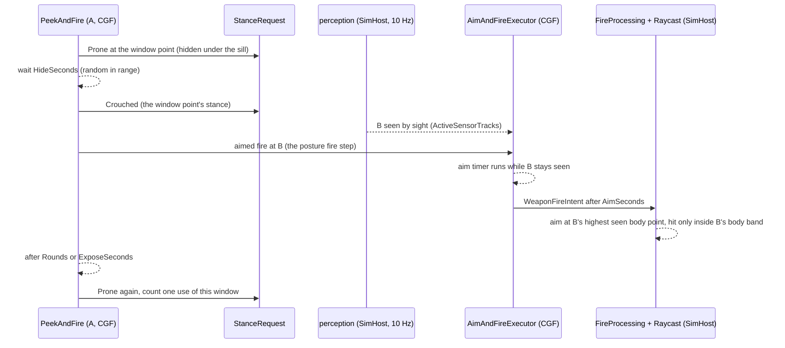

### 4.2 Not seen when exposed — the blind burst

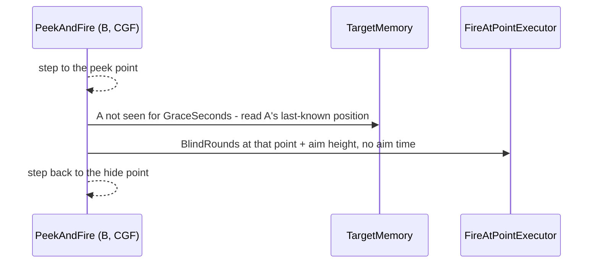

### 4.3 Suppress and bound — B changes cover *(D11–D13)*

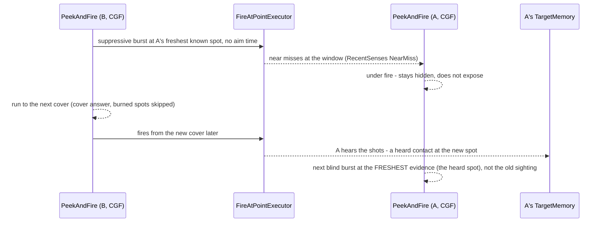

## 5. Modules — who runs what, and where it is seen

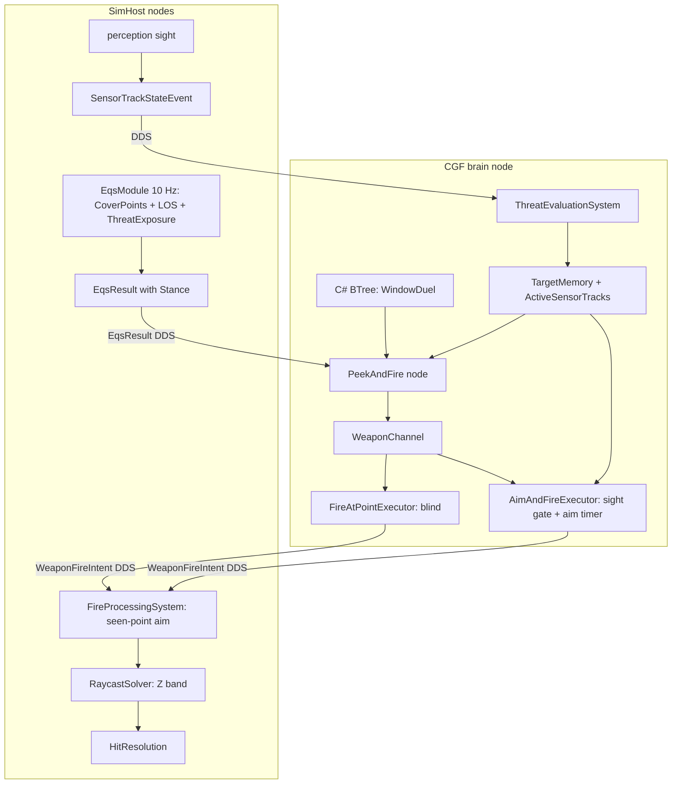

*Caption: the aim gate is on the BRAIN and reads what perception reported (sight is decided on SimHost); the aim POINT is
chosen on SimHost from geometry. The ~100–300 ms report latency is part of the aim time a viewer sees.*

## 6. Decisions — ✅ APPROVED `2026-10-09` (R-234)

> 🔒 **User, `2026-10-09`:** *"Approved. Pls leta think how behaviors store the memory of the used cover points and how that memory
> fades out so covers can be reused after some time. And what other behabior status variables would be needed, what parameters the
> behaviors would need. The behavior design in a bit more details."* → §8.

| # | lean | why |
|---|---|---|
| D1 | ⛔ SUPERSEDED `2026-10-09` (was: *"aims at the highest body point the shooter's eye SEES"*). ✅ **REVISED by the user (R-239):** an aimed round aims at the **middle** when the eye sees it, or when what hides it is **weak** (a round of the fired mount's penetration carried there through the terrain arrives with ≥ 50 % of its damage); else at the **middle of the SEEN part** of the body — halfway between the lowest and highest visible heights; nothing seen ⇒ the middle | 🔒 User: *"aiming at highest point meant we wont hit, we need to aim in between the lowest seen body part and highest one"* · *"if the body is hidden behind a weak penetrable obstacle, we could aim to body center if we know where the target is"*. One rule for seeing and shooting (§3f) and one penetration rule (§3d P2). ⚠ Refines §3d P2 / R-217's "middle of the silhouette" |
| D2 | a round hits a person only if its height at the target lies inside the body band of the target's **logical stance** (feet … top body point); vehicles keep the circle | G2; prone under a sill is then safe from a round through the window |
| D3 | **aim time**: an aimed shot leaves only after the shooter has seen the target **continuously for `AimSeconds`** (fallback **0.8 s**, per weapon through `ParameterResolver`); the timer restarts when sight is lost, the target changes or the shooter's stance changes; later rounds at a target still seen need only the cooldown. **Blind fire (`FireAtPoint`) has no aim time** | 🔒 user; in the ONE executor every aimed shot passes, so every behaviour gets it (Engage, Flank, tanks) |
| D4 | an aimed shot needs the target **seen now** (`ActiveSensorTracks`, Visual) — the gate D3 needs anyway; a hidden target is not shot at by `AimAndFire` (the action stays Running, no round spent, like the ROE hold) | G3; no shooting at the true position of an enemy nobody sees. ⚠ Posture/flank demos that today fire at hidden enemies stop doing so ⇒ the T3 baselines (`PlatoonBaselineRails`, `DeterminismRails`) may move — re-pinned once, deliberately |
| D5 | **`CE-3135`**: `EqsResult.Stance` in the padding byte (size stays 32), stored **stance + 1** (0 = none, so old recordings and other generators read "none"); on the wire entry, filled by `CoverPointsGenerator`; the window LOS test uses that stance's eye | 🔒 *"extending wire is no issue"*; one byte, no layout change |
| D6 | `ThreatExposureTest` reads the threats from the unit's **perception sensor children** (where `CE-3038` moved the lists) | G6 — "cover cooperating with threat-sensor results" is exactly this test; today it is silently inert |
| D7 | **`PeekAndFire`** — one C# action, two shapes: **stance peek** (A: same spot, hide prone / expose at the point's stance) and **step peek** (B: hide point from `FindCoverFromTarget`, peek point from `FindOpenFiringPosition` with a ~3 m radius around the hide point). Expose → aimed fire (`PostureNodes.Fire`) for up to `ExposeSeconds`; not seen within `GraceSeconds` ⇒ `BlindRounds` at the last-known position + aim height (`FireAtPoint`); hide; wait a random `HideSeconds` (`SimRng`, deterministic) | G7/G8; reuses the threat ranking, the sensor steps and the ONE fire step of `EqsTacticsNodes`/`PostureNodes` (R-174); C# BTree per the user |
| D8 | **position rotation**: a position used too often is burned and the node takes the next best from the sensor's answer span — ⛔ SUPERSEDED in its storage (*"in the node's state: up to 4 positions"*) by §8 **B1** (a unit component, 8 slots, cooling heat): node state is reset on every exit | the squad's `SlotRotation` used/burned idea per unit (Squad §3); no EQS change, the ranking stays deterministic |
| D9 | **reload**: an executor finding the magazine empty reloads instead of failing. ✅ **Refined by the user (R-239):** `WeaponState.Ammo` **stays the total rounds carried** (every reader — ammo ratio, has-ammo, rounds left, squad ammo, shot-fired detection — unchanged); `WeaponState` gains **rounds in the magazine, magazine size, reload time remaining**; magazines are declared per mount in the TKB (`MagazineSize`, `ReloadSeconds`), the rifleman template becomes 30 × 5 = 150 rounds with a 3 s reload; a mount declaring no magazine fires from its whole load, as today. ⛔ SUPERSEDED wording: *"WeaponState gains spare magazines"* | G4; both executors, all weapons. 🔒 User: *"keep Ammo as total carried and add rounds-in-magazine, magazine size and reload time remaining." — "YES"* |
| D10 | the demo: **`bt-window-duel`** on `bt-range` — A in House A, B at House B's corner; C# BTree `WindowDuel` (both units, shape by parameter); an in-process rail (both expose, both fire, A uses ≥ 2 windows, nobody shoots while unseen except blind bursts) + an HTTP check | R-223; the window count that sees B is measured in slice 1 — a window may be added to the template |
| D11 | **street cover = STATIC OBSTACLE ENTITIES** (a parked car, a sandbag barrier, a crate) of an **obstacle TKB type** carrying a `PhysicsCollider` (radius, height), a `StaticObstacle` marker and a **MATERIAL from the wall library** (`TerrainMaterial`: sight transmittance, resistance mm RHA per metre, sound dB, blocks movement — §3c), placed by the scenario like any entity; the Editor's existing zone obstacle (`EditorZoneAuthoringSystem`, a bare circle collider) becomes one of these types, so it carries a material too. ① **bullets**: the round crosses the obstacle like a wall panel — resistance × the CHORD it travels through the collider (within its height) → `ArmorModel.PenetrationChance`, chances multiply with every other crossing, penetration reduced by what was crossed (§3d P2, one rule); ② **sight**: the obstacle's material transmittance, as a panel's (today a collider is opaque within its height); ③ **cover**: the cover database = terrain + obstacles — points around each static obstacle (stance by its height), rebuilt when one appears or goes, ONE `ICoverProvider` (R-132); ④ **the cover query's sight**: `EqsTerrainSight` sees STATIC obstacles too (moving vehicles stay "not cover", EQS §19.5); ⑤ **paths**: obstacles cut into the navmesh by the existing touched-tile rebuild (Nav v2 §14 P2) | 🔒 user: *"The covers on the street could be obstacle entities, simulating a static cars or something."* · *"the zone obstacles need to carry the material similar to walls (obstacle entity tkbtype derived) and the bullet penetration should count with it."* ⛔ SUPERSEDED: obstacles as terrain prisms in `bt-range`'s world file |
| D12 | **suppress and bound** (B's shape, a `PeekAndFire` parameter): a suppressive burst at A's freshest known spot (`FireAtPoint`, no aim time), then a run to the next cover — `FindCoverFromTarget`'s answer, D8's burned positions skipped, never the current one; **under fire = stay down**: a unit near-missed or hit within `SuppressedSeconds` (default 3 s, `RecentSenses`) does not expose | 🔒 *"after using suppressive fire first"*; suppression must DO something or bounding is theatre — the near-miss sense already exists (`R-206`) |
| D13 | **the freshest evidence wins** for a blind burst: the newest of the identified enemy's last sighting and any HEARD contact (`CE-3063` anonymous slots); an aimed shot still needs sight | measured: a heard shot >≈6 m from the remembered spot makes a NEW anonymous slot (`TargetMemory.HearContact`, radius 40 m × 0.15) and `TopAim` prefers the identified one ⇒ without D13 A shoots at where B WAS. ⭐ Hearing already works without walls (`AcousticPerception`) — 7b's wall attenuation is not needed for this |
| D14 ✅ **BUILT `2026-10-09` (`CE-3144`, P-8)** | **the node's two sensors look from and for where the enemy is REMEMBERED** — the freshest evidence (D13) as a context POINT (`EqsContext.AnchorPosition` → `ContextPoint1`, the `CE-3063` heard-contact path), keyed by its memory slot; re-pointed when that spot moves ≥ `RepointMetres` (2 m) or another slot becomes freshest (`PeekAndFireNodes.SensorAim`, state `SensorId`/`SensorAt`). The fire decision is unchanged: an aimed shot still needs the enemy SEEN (D4) | 📐 **measured live, P-8's first run:** both sensors were pointed at the ENTITY, so the LOS filters tested its TRUE position — B behind van 1 is seen from no window and A inside the room from no street point ⇒ A's window sensor and B's peek sensor answered **0**, nobody exposed, nobody fired in 600 s. A soldier looks for where he last saw (or heard) the enemy — the user's *"because they remember seeing each other"*. ⛔ Rejected: the true position (omniscient, and deadlocks the moment both hide) · falling back to the point only when the sensor answers nothing (two behaviours, and still omniscient while one is visible) |
| D15 ✅ **BUILT `2026-10-09` (`CE-3144`, P-8)** | **"can I shoot him from there" (`CheapLineOfSightTest`, `Viewer = Candidate`) looks at the target's BODY POINTS** for its logical stance (`BodyProfile.Fractions`, a vehicle by its hull) and is clear when ANY is — the rule perception already uses (`TerrainWorldLosStrategy.IsVisible`, Buildings §3f/§3i); a POINT target (D14) is a standing man's points. Moves the three `Visible` templates: `FindOpenFiringPosition`, `FindWindowFiringPosition`, `FindFlankingPosition` | 📐 **measured** (`bt-range`, street eye 1.7 m → each House A window point): the old single aim at half the standing eye = **0.85 m is below the 0.9 m sill — blocked at all five windows**, from every street point probed, while 1.1 m is clear at both upstairs south windows. So no peek point could ever see A at a window. ⚠ One line becomes up to three per candidate (early-out on the first clear) |
| D16 ✅ **APPROVED + BUILT `2026-10-09` (R-246, `CE-3144`)** | **the eye is the top body point** — "if your eye sees out, your head shows": person fractions standing 0.12 / 0.53 / **1.0**, crouched 0.18 / 0.55 / **1.0**, prone 0.43 / **1.0** of the stance's eye height, in the ONE profile (`BodyProfile`, `LosStrategies.cs`) — so sight, the D2 bullet body band (`PersonTop`) and fragments all grow by the head. ⛔ SUPERSEDED (Buildings §3i): tops at 0.94 / 0.91 / 0.86 of the eye — below it | 📐 measured (`bt-range` probe, street eye 1.7 m → upstairs window point): 1.00 m blocked, 1.10 m clear — a man crouched there (eye 1.1) saw the street and none of his points (top 1.0) was seen from it. 🔒 User: *"yes sure like that, wasn't the body profile's top point (1.0 m) clearly wrong?"* — yes: a head reaches above the eyes. Rejected: window points nearer the wall (cm margins) · eye-to-eye sight only (seen but the hit band misses the head) |
| D17 ✅ **BUILT `2026-10-09` (R-247, `CE-3145`)** | **a soldier turns on the spot, then walks** — pedestrians move by `HumanGait` (the mover's own design: [`FDP.Toolkit.CarKinem.md`](../FDP/Docs/projects/toolkits/FDP.Toolkit.CarKinem.md) "Human gait"), not the bicycle model | 📐 in-process `bt-window-duel` (frame 8508): A, at the upstairs window (107.1, 100.9) facing east, had to go west to the next window; the car model walked him 0.5 m forward while turning — into House A's open stairwell (x 107.5–108.5, y 101–106, 0.4 m away) — and he fell to the ground floor, so every later "window" exposure was downstairs. Navmesh path and `SurfaceZ` both stayed at z = 3 (probed): the fall was the mover's. Rejected: clamp each step to the navmesh (still swings in a circle) · face A west in the scenario (hides it) |

| rejected | the one fact that killed it |
|---|---|
| aim time as a BTree `Wait` before firing | every other aimed shot (Engage, Flank, tanks) would stay instant; the executor is the one place all pass |
| a stance lookup from the cover provider by position (`CE-3135` option 2) | the user cleared the wire; a lookup by float position is fragile and per-host |
| a recently-used EQS test (tabu as a test) | the past positions are the UNIT's, not the sensor's; the brain already holds the answer span |
| a corner point type in the cover database | the step peek finds the exposure point with an existing template; corners would be a second producer (R-132) |

## 7. Slices *(rails first, red-proved; each green before the next)*

| slice | content | rail |
|---|---|---|
| P-1 ✅ **BUILT `2026-10-09`** | D5 stance on the result + wire; LOS uses it. **As-built:** `EqsResult.Stance` = `(byte)StanceId + 1` in the padding byte (32 B kept — `EqsComponentLayoutTests`); `EqsResultEntry.Stance` on the wire (copied by `EqsResultEventEgressTranslator`, kept by `MapToLocal`, written by `EqsResultUpdateSystem`); `CoverPointsGenerator` converts `CoverPoint.StanceHeight` (0 prone · 1 crouch · 2 stand) → `StanceId`; `CheapLineOfSightTest` with `Viewer=Candidate` looks from `SensorMount.For(stance)` when the result has one (⇒ `FindWindowFiringPosition` sees from the window's crouched eye, was standing). ⚠ The `Viewer=Slot` (cover) arm is unchanged — still the self's crouched eye | the window point's answer carries crouch; recorded old result reads "none" — rails `TerrainEqsTests.CE3134_FindWindowFiringPosition…` (extended), `P1_ACandidateWithAStance_…`, `CE3134_CoverPointsGenerator_…` (extended), integration `EqsResultUpdateSystem_MatchingEpoch_PopulatesBuffer` (extended) |
| P-2 ✅ **BUILT `2026-10-09`, D1 revised the same day** | D1 + D2. **As-built:** D1 = `Fdp.Toolkit.Combat.AimPoint.For` (`Combat/AimPoint.cs`), called by `FireProcessingSystem` for an entity target when a `TerrainWorld` exists, with the fired mount's penetration: ① middle seen ⇒ middle; ② else `TerrainPenetration.Carry` eye → middle and ≥ `ShootThroughMinFraction` (0.5) of the damage arrives ⇒ middle (shot through a weak cover); ③ else the midpoint of the SEEN band — the lowest and highest seen body samples (`BodyProfile.Points`), each edge bisected 5 steps toward its hidden neighbour (≈ 1 cm); ④ nothing seen ⇒ middle. ⛔ SUPERSEDED same day: the first build aimed at the highest seen point (`BodyProfile.AimPoint`, deleted). D2 = `RaycastSolverSystem` narrow phase: a **bullet ray** (`PhysicsConstants.IsBulletRay`) against a **person** (`PhysicsColliderReaders.IsPerson`) hits only when its height at the circle crossing lies in `[feet, feet + BodyProfile.PersonTop(stance)]`, stance = `LogicalStance.Of` (Standing when the world has no stance runtime); vehicles keep the circle, sight/query rays unchanged | rails `RaycastSolverSystemTests.P2_ARoundHitsAPersonOnlyInsideTheBodyBandOfItsStance` (standing hit at 0.9 m, missed at 2.5 m while a sight ray still hits · prone missed at 0.9 m, hit at 0.2 m), `P2_AVehicleKeepsTheCircle`; `FireProcessingSystemTests.P2_ACrouchedManBehindAConcreteSill_IsAimedAtTheMiddleOfWhatTheShooterSees` (≈ 0.89 m: band 0.79 – 1.0 m over a 0.5 m concrete sill), `P2_BehindAWeakFence_TheRoundAimsAtTheMiddle_Through_It` (5 cm fence-wood), `P2_ATargetInTheOpen_KeepsTheMiddleAim` |
| P-3 ✅ **BUILT `2026-10-09`** | D3 + D4 aim gate and timer. **As-built:** in `AimAndFireExecutor.Execute` (the one executor every aimed shot passes), after the ammo check: D4 = `Fdp.Toolkit.Perception.SightNow.Sees` (new, beside `ThreatFreshness` in `ThreatDanger.cs` — the target in `ActiveSensorTracks` with the Visual modality; P-6's grace check reuses it); D3 = `AimState { Target, Elapsed, Stance, Ready }` in `WeaponChannel.State` after the target (bytes 8–23). The aim clock runs **beside** the cooldown, not after it; it restarts on lost sight, a new target, a stance change (`LogicalStance.Of`), and `OnEnter` clears it (a new action aims afresh — issuers re-issue only on a change, measured `PostureNodes.Fire`, `CgfNodes`, `HillAttackTankNodes`). Unseen ⇒ Running, no round (the ROE hold's shape). Aim time = `WeaponMountDto.AimSeconds` (new, `[EditUnit("s")]`) → `EngineFallbacks.AimSeconds` 0.8 s, exposed as `Weapon[i].AimSeconds` by `ParameterResolver` (`/tkb/resolve`). ⚠ **Edge decided as built:** a unit with **no sight model** (the world never registered `ActiveSensorTracks`, or the unit's TKB neither sees nor hears so it carries none) counts as seeing — nothing can say it is hidden; the aim time still applies. `FireAtPointExecutor` untouched (blind fire: neither gate). ⛔ SUPERSEDED the same day: *"`CgfNodes`' `RoundsFired` counter predicts a round from the cooldown alone … left as is"* — it counted every tick of the aim time and ended `FireAtTarget` before a round left (measured: `HeardShotScenarioTests`, shooter ammo untouched). ✅ Fixed (backend, cross-lane): the node passes `MaxRounds` as `AimAndFireParams.Rounds` (B7), the executor ends the action, `RoundsFired` reads the executor's real count (`AimAndFireExecutor.RoundsFiredOf`) | rails `AimAndFireExecutorTests.P3_NoRoundBeforeTheAimTime_ThenOnlyTheCooldown`, `P3_LostSightHoldsFire_AndRestartsTheAim`, `P3_AHeardTargetIsNotSeen`, `P3_ANewActionAimsAfresh`; the suite's older tests enter pre-aimed (`EnterAimed`) — they test cooldown/ammo/ROE/friendly line, not the aim |
| P-4 ✅ **BUILT `2026-10-09`** | D6 threat exposure revived. **As-built:** ⚠ the premise failed first — a sensor child's `SensorContactList` lives only on the node that SOLVES that sensor (written by `SensorMemoryStage`, replicated by no descriptor), and `SolverNodeId` was picked per sensor (least loaded). ✅ **R-239 (user: "yes"):** a NEW solver pick prefers the node already solving a SIBLING sensor of the same unit when it carries the sensor's role (`EqsSensorConfigEgressTranslator.SiblingSolver`, lowest part wins; `IClusterStateCache.HasRole` new), else the least loaded; existing picks are untouched (sticky, R-179). `ThreatExposureTest` reads the acquired contacts of the unit's **sensor children** (plus a legacy unit-level list), one threat counted once | rails `TerrainEqsTests.P4_ThreatExposure_ReadsTheUnitsSensorChildren`; `EqsSensorSolverPickTests` (sibling beats least-loaded · no sibling / sibling node lacking the role / gone ⇒ fallback · lowest part wins) |
| P-5 ✅ **BUILT `2026-10-09`** | D9 reload (R-239). **As-built:** `Fdp.Toolkit.Combat.Magazine` is the one rule (`Load` · `Ready` · `Spend` · `StartIfEmpty` · `Tick`); `WeaponState` gains `MagazineRounds`, `MagazineSize` (0 = no magazine — the whole load, as before), `ReloadSeconds` (cached at spawn, like `MaxAmmo`), `ReloadSecondsRemaining`; `Ammo` stays the total. TKB: `WeaponMountDto.MagazineSize` / `ReloadSeconds` (fallback `EngineFallbacks.ReloadSeconds` 3 s), resolved as `Weapon[i].MagazineSize` / `ReloadSeconds` (`/tkb/resolve`). `CombatTkbTranslator` loads the first magazine at spawn. Both executors: an empty magazine **holds** (Running, no round) and starts the reload; out of ammunition altogether is still Failure / Success-after-a-burst. ⭐ The **dispatcher** runs every reload each frame (owner and mount children, beside the cooldown drain) — so a unit that hides to reload (B8) comes out loaded. Catalog: `InfantrySoldier` and `Grenadier` rifles = 5 × 30 rounds, 3 s reload (were 30 rounds, no reload). Two integration tests that compared against a literal 30 now compare against the spawned load | rails `AimAndFireExecutorTests.P5_TheThirtyFirstRound_WaitsForTheReload` (30 go, held 3 s ± one step, the 31st), `P5_NoMagazine_FiresTheWholeLoad`; `WeaponInteractionDispatcherTests.P5_WeaponDispatcher_RunsAReload_OnAMountChild_WhileNotFiring` |
| P-6 ✅ **BUILT `2026-10-09`** | D7 + D8 `PeekAndFire` (+ T4 gizmo). **As-built:** `Hrot.AI.Behaviors/Brains/PeekAndFireNodes.cs` — `[SharedAiAction] PeekAndFire(ref PeekAndFireParams, ref PeekAndFireState, self, world)` + its `[BTreeDeactivator]`, the §8.2 machine (Choose → MoveToHide → Hidden → Expose → Aimed / Blind → Recover; *Relocate* is not a state of its own: Hidden re-runs Choose with `relocating`, and goes to MoveToHide when a cooler spot ≥ `MinRelocateMetres` away exists — a burned spot with nowhere to go waits to cool, a merely used-up one keeps fighting). `FiringPositionMemory` (`[UnitMemory]`, 8 slots: X/Y/Z, Heat, HeatAt, Burned, Uses) and `PositionHeat` (B2–B5: `HeatNow`, `Find`, `Add`, `IsBurned`, `Penalty`, over `HeatRules` = the node's five heat parameters, `PeekAndFireNodes.Rules`). Reuses, never copies (R-174): `EqsTacticsNodes.TopAim` / `ThreatPosition`, `PostureNodes.Keep` / `Drop` (the two sensors, sites `0x31360001/2`) and `PostureNodes.Fire` — which gained B7's `rounds` — plus `FireAtPointNodes.FireAtPoint`, `StanceRequest`, `LocomotionMoveTo`, `SightNow.Sees`, `RecentSensesOf`, `Magazine`. ⚠ **Deviations, argued:** ① the **node** lives in **`Hrot.AI.Behaviors`** (every shared step it calls lives there); its **data stays in `Fdp.Toolkits`** as B1 said — `FiringPositionMemory`, `PeekPhase`, `HeatRules` + `PositionHeat` (`Fdp.Toolkits/Combat/FiringPositionMemory.cs`) — so the gizmo can sit in `Hrot.Presentation`, which every map host loads (R-228; the hot-reload `Hrot.AI.Behaviors` is skipped by the deployment pre-load and would pin a projector, ST-035); ② the blind burst's **aim height is the node's** (`BlindAimHeight`, 1 m) added to the remembered spot, ⛔ not `FireAtPointExecutor`'s — a grenade or a mortar aims at the ground point it is given (§3's "AimHeight added to the point" SUPERSEDED); ③ the **heat is the HIDE point's** (the position), a step peek's step-out point is not remembered separately; ④ the memory also **mirrors the phase, its timer and the two points** (`Phase`, `PhaseAt`, `PhaseUntil`, `HidePoint`, `PeekPoint`) for `PeekAndFireGizmo` — the node's own state sits in a tree's blackboard at an offset no gizmo can know; ⑤ a **zero parameter means its default** (`PeekAndFireNodes.Effective`, the §8.4 default column); ⑥ the step peek's sensor is `FindOpenFiringPosition` with `PeekSearchRadius`, centred on the unit — which stands at the hide point when it asks. `SuppressBeforeRelocate` (D12) and the freshest evidence (D13) are P-7: the parameter exists and is inert; the blind burst aims at `ThreatPosition` (the ranking's top). No curated tree yet — P-8's `WindowDuel` is the first. **T4:** `Hrot.Presentation/ScenarioEditor/Gizmos/PeekAndFireGizmo.cs` (family `Channels` = "Actions", selected or pinned by default): a ring per remembered position, yellow → red with heat, red when burned, `h1.7 x3` = heat and uses; while the node ran within 1 s, `PF hidden 2.1s` above the unit and the hide (green) and peek (blue) points. Read through `UnitMemory.GetInView` (new: the view form of `Get`) — recorded, so a replay draws it | rails `PeekAndFireNodesTests` (SimHost.Tests): `P6_R1` stance peek (prone ↔ crouched, 3 aimed, one use, heat 1.0) · `P6_R2` step peek (moves cover → peek → cover, standing out, the cover point heats) · ⭐ `P6_R3` **the design rail**: three quick exposures burn the window by HEAT (the counter set to 10) and the unit moves to the next; after an exit and a fresh state the new run still skips it (B1) · `P6_R4` the exposure counter relocates past a too-close window · `P6_R5` not seen ⇒ after the grace a 3-round blind burst at the remembered spot + 1 m, no aimed round · `P6_R6` reloading / a near miss keeps it down, up again 3 s later · `P6_R7` near-missed while aimed ⇒ down at once, heat 1 + 1.5 · `P6_R8` nothing remembered ⇒ Success · `P6_R9` heat rules (half-life, hysteresis, match radius, coolest replaced) · `P6_R10` the gizmo's phase/slot text |
| P-7a ✅ **BUILT `2026-10-09`** (O1–O4; O5 = `CE-3142`, §9.7) | D11 obstacle entity: TKB type, spawn, bullet stop, cover points, EQS sight, navmesh cut. **As-built** (§9.3–§9.5 are the as-built diagrams): `StaticObstacle` (345, the material) + `[PerInstanceValue] ObstacleShape` (346) from `StaticObstacleDto` by `ObstacleTkbTranslator` (every node's `TkbTranslatorSet.Base`; collider radius = half the diagonal, entity layer); `ObstacleShape` is replicated (`EntityObstacleShape`, TransientLocal, `dtObstacleShape` 123) so a per-instance size reaches every node; four types `Car` 8806 · `Sandbag wall` 8807 · `Concrete block` 8808 · `Crate` 8809 (`BdcTkbCatalog.RegisterObstacle`), new material `car-body`. `TerrainObstacles` (Fdp.Toolkits) = `PrismOf` / `With` / `MaterialOf` / `Yaw` / `IsObstacle`. `StaticObstacleBakeSystem` (Hrot.Core, BeforeSync) = the terrain lifecycle participant, built by `EntityCreationPack` and scheduled by the five ECS hosts (IG, Stride NodeComposition, CGF, SimHost, Editor — `Unserviceable` names it when missing). ⚠ **Deviations, argued:** ① the lifecycle participant is not on each blueprint — `EntityLifecycleModule.RegisterTemplateRequirement(rule, module)` (new) makes every template carrying `StaticObstacleDto` wait for module `0x7E41` (`TerrainObstacles.LifecycleModuleId`), one rule instead of four catalog edits that a fifth type would forget; ② the bake reaches the node's `TerrainResidency` through a `StaticObstacleBakery` singleton (347) the residency publishes on every commit/unload — its ABSENCE (a node with no terrain) acks at once; ③ the scenario's ONE bake comes from the wall-clock debounce (each arrival restarts the quiet period), not from waiting on the load step's condition ① — a load that arrives slower than 0.5 s per batch may bake twice, which cannot leak into the result: every obstacle waits `Constructing` until a bake containing it commits and the load waits for nothing `Constructing`; ④ the navmesh is a full `Build` through the per-tile cache, not `Rebake` — the same touched-tile effect, measured; ⑤ the box top is a walkable roof (like a building's) unconnected to the ground, so `IsWalkable` there finds the roof. 📐 **Measured** (`P7a_R9`, real `test-town`, 576 tiles): base bake 1 793 ms; +3 obstacles = **238 ms** (2 tiles baked, 574 from the cache; world 0 ms, cover 2 ms) ⇒ with the 0.5 s quiet period ≈ 45 frames at 60 Hz — the lifecycle's 300-frame timeout is not near. ⚠ **Known gaps:** the Replay Browser runs no bake, so a recorded obstacle is not in its mirrored terrain; a world with no walkable ground gets no navmesh; the Editor's zone obstacle is now a `Concrete block` 2r × 2r × 1 m (`CE-3141` fixed) | rails `StaticObstacleTests` (Toolkits) R1 prism along the heading · R2 concrete stops a round, a crate lets it through with 40 mm left, over the top crosses nothing · R3 the car hides at 1.0 m, not at 1.7 m · R4 cover points round it (stand) · R5 the path goes round a 12 m wall · R6 translator, an instance size wins · R7 the sight occluder skips it · R8 the lifecycle holds an obstacle type until `0x7E41` acks · R9 the test-town measurement; `StaticObstacleBakeTests` (SimHost) ⭐ B1 acked only after the bake committed, after the quiet period · B2 three arrivals, one bake · B3 no terrain ⇒ at once · B4 removal re-bakes; Editor `SpawnObstacle_PublishCommand_RequestsATypedConcreteBlock_SizedByTheRadius`, `SpawnObstacle_WithNoCreationPack_CreatesNothing` |
| P-7 ✅ **BUILT `2026-10-09`** | D12 bound + D13 freshest evidence. **As-built** (`PeekAndFireNodes.cs`, no new phase): **D13** = `FreshestEvidence` — a burst (blind or suppressive) aims at the newest by `TargetMemory.LastSeenTick` of the threat's own slot and every HEARD (anonymous) slot; ties keep the threat's slot; an aimed shot still needs sight (D4). **D12** = with `SuppressBeforeRelocate`, a used-up position (burned or `ExposuresPerPosition` reached) does not walk off at once: `Hidden` picks the next cover (`NextHide`, `Bounding = 1`), the unit comes up the normal way (stance or step) WITHOUT the hide wait, `Expose` fires the burst at once (no aim time, no grace, seen or not — `StartBurst`), and `Recover` sends it to `NextHide` (`GoToHide`), never back to the used point. Under fire it stays down: `Hidden`'s near-miss/hit check (`SuppressedSeconds`) holds the bound — the next cover is already picked. ⚠ Deviations: ① no `Relocate` phase (§8.2's state) — `Bounding` rides the existing Expose/Blind/Recover phases; ② `Choose` split into `PickHide` + `GoToHide` so the bound reuses the hide assignment. ⚠ Not yet seen end to end: the suppressive burst's near misses keeping A down live (P-8's rail) | rails `PeekAndFireNodesTests.P7_R1_ABlindBurst_GoesToTheFreshestEvidence` (heard after seen ⇒ the sound; seen after heard ⇒ the enemy), ⭐ `P7_R2_SuppressAndBound_BurstsThenRunsToTheNextCover_StayingDownUnderFire` (near-missed: stays down 2.5 s with the bound picked; then out to the peek point, one `FireAtPoint`, run to the next cover — moves (10,10)→(10,12)→(10,10)→(10,12)→(20,10)) |
| P-8 ✅ **BUILT `2026-10-09`** | D10 scenario + rail + HTTP check. **As-built:** `scenarios/bt-window-duel/scenario.json` (`bt-range`): A "Window Rifleman" at House A's upstairs window (107.1, 100.9, 3), B "Street Rifleman" in the open at (108.5, 80), each remembering the other where seen (§2), Van 1 (104, 82) and Van 2 (113, 76) = TKB 8806 static obstacles (P-7a). The curated C# tree `WindowDuel` (`Hrot.AI.Behaviors/Brains/WindowDuelBehavior.cs`, `BehaviorNames.WindowDuel`, params DTO `WindowDuelParamsJsonDto`: `shape` 0 window / 1 street + overrides) binds ONE `PeekAndFire` per unit with §8.4's columns. ⚠ **Deviations, argued:** B's `SearchRadius` **15 m** and `MinRelocateMetres` **8 m** (§8.4 said 25 · 6 — 25 reached House A's own wall and B ran into the dead ground under the windows; at 6 B shuffled along Van 1); the checks count A's windows on **either storey** (D10's words). 📐 **Five defects the duel found, all fixed:** the sensors looked for the TRUE position (D14), the "can I shoot from there" sight aimed below every sill (D15), an upstairs firer could never be seen (D16, R-246), the answer span was read past `Count` (A walked to the map origin), and the car motion model walked A into the stairwell (D17, R-247, `CE-3145`). Rails: in-process `PostureScenarioTests.CE3136_P8_WindowDuel_BothFire_ARotatesWindows_BBoundsToTheSecondVan` ✅ (A fires from both upstairs windows, B bounds to Van 2, both fire) · unit `PeekAndFireNodesTests.P8_R1/R2` · premises `bt-range/premises.json` "bt-window-duel" (5 rows) · HTTP `scripts/utility-demo-check.py bt-window-duel` ✅ **PASS live `2026-10-09`** (`--launch`; the earlier "duel stops at ≈ 60 s" was the readout — `PeekAndFireState.LastSeenAt` held `-Infinity`, every `/entities` read 500'd; `CE-3144` ⑥, the state now stores 0 and the diagnostic mapper writes non-finite floats as sentinel strings) | the duel rail |

## 8. The behaviour in detail *(APPROVED `2026-10-09` — B1–B8, R-238; 🔒 user: "approved")*

### 8.1 What lives where

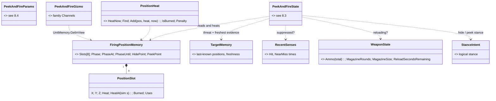

*What the picture shows: ONE new unit memory (the position memory — a type-keyed blackboard-store slot created on first touch, Q87) and one helper; the node's own state is scratch
that may be lost on every exit, so nothing that must OUTLIVE an exit lives there.*

| B# | lean | why |
|---|---|---|
| B1 | the used positions live in `FiringPositionMemory` (8 slots), ⭐ **the first UNIT MEMORY**: a unit-scoped shared blackboard struct ([Architect Question 87](blueprints/Architect_Question_87_Unit_Memory.md), proposed `2026-10-09`; 🔒 user: *"it is required to re-implement the unit-scoped shared blackboard structs"*). One slot of kind `UnitMemory` in the unit's blackboard store, **keyed by the struct type**, **created on the first touch** with `new FiringPositionMemory()` (declared defaults; C# 12 needs the declared `public FiringPositionMemory() {}`, and only a constructor call applies them — measured, Q87 §1), and **never swept by a behaviour switch** (both sweeps skip the kind — Q87 §1). Declared `[UnitMemory]` **beside its reader** `PeekAndFire` in `Fdp.Toolkits` (✅ as built: the struct is in `Fdp.Toolkits`; its reader, the node, in `Hrot.AI.Behaviors` with its shared steps — §7 P-6); the node reaches it with `UnitMemory.Ref<FiringPositionMemory>`: attached in place, in a block with room or an appended one (Q87 §3 C, D″ — built as U-0; the old one-frame hold and promotion are retired). Nothing is declared ahead. A blueprint behaviour reads the same memory with `GetShared` (Q87 U-3). Recorded for replay, never saved in a scenario, never on the wire; lost on a Brain failover, harmless for a memory that fades anyway. ⇒ **P-6 needs Q87 U-1 + U-2** | node state is reset on exit (`EqsTacticsNodes.Release`: `ws = default`) — a posture switch, a reload hold or a re-plan would forget every burned window. ⛔ Rejected: an ECS component per memory type — 🔒 user: *"no automatic component allocations. Component id range is very limited. We can have hundresds of behaviors."* ⛔ Rejected: the old name-keyed Entity scope (Q76 decision A, CE-441) — collisions and the switch sweep; unit memory is type-keyed and a separate slot kind |
| B2 | **heat, not a counter**: an exposure adds `HeatPerExposure` (1.0); being near-missed or hit while exposed there adds `HeatWhenFiredUpon` (1.5); heat **cools exponentially** with `CoolHalfLifeSeconds` (45 s) | a counter needs a reset rule; heat fades by itself, so a window used long ago is usable again without any bookkeeping. Being shot at there is the strongest reason to leave, so it heats more |
| B3 | heat is **evaluated lazily** — stored with its sim time, `heat(now) = heat · 2^-(now − at)/halfLife` — no per-tick system | deterministic, replay-exact (sim time, R-143), zero cost while nobody looks |
| B4 | **burned with hysteresis**: a slot is burned at `BurnHeat` (2.5) and usable again only below `ReuseHeat` (1.0); between them a candidate keeps a soft penalty `heat × HeatPenalty` on its EQS score | without hysteresis a window flips usable/burned at one threshold and the unit dithers. Worked example: 3 exposures within 20 s ⇒ ≈ 2.7 → burned; it cools below 1.0 after ≈ 65 s |
| B5 | a candidate **is** a slot when within `MatchRadius` (1.0 m); a full memory replaces its coolest slot | EQS points are database points (windows, cover points) — they repeat exactly; 1 m absorbs a peek point's small drift |
| B6 | the node picks from the cover sensor's **answer span** (16 results): the best by `score − heat penalty` among non-burned, ≥ `MinRelocateMetres` from the current position when relocating | no EQS change (D8); the sensor stays deterministic and shareable |
| B7 ✅ **BUILT `2026-10-09`** | **one round count** on aimed fire: `AimAndFireParams.Rounds` (0 = until stopped) as `FireAtPointParams` already has, so "fire 3 aimed rounds" is the executor's job. **As-built:** `int Rounds` after `Mount` (params 20 of 32 B); the count lives in `WeaponChannel.State` bytes 24–27 after the aim timer, cleared by `OnEnter`; Success when reached (rail `AimAndFireExecutorTests.B7_RoundsEndsTheActionAfterThatMany`) | the node should not count intents; both fire actions then end the same way |
| B8 | **reloading = stay hidden**: while `ReloadSecondsRemaining > 0` the node does not expose | exposing with an empty rifle is the one thing a soldier would never do |

### 8.2 The node's phases

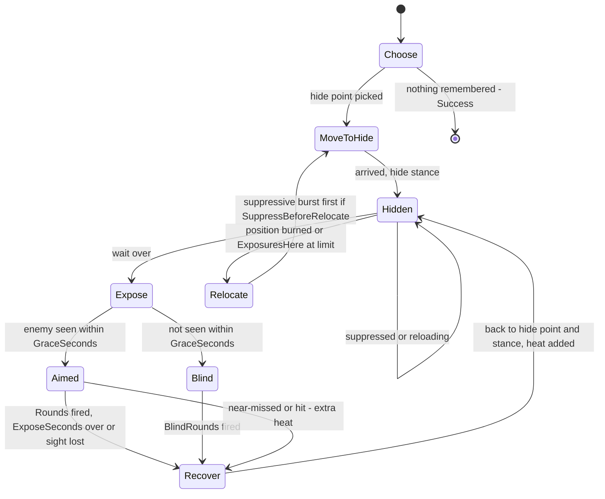

*What the picture shows that prose hid: the same machine flies BOTH soldiers — A's Expose is a stance change on the spot and
his Relocate is "another window"; B's Expose is a step and his Relocate is "run to the next obstacle". Only the parameters differ.*

### 8.3 Working state *(scratch — lost on exit by design)*

| field | what |
|---|---|
| `Phase`, `PhaseUntil` | the phase above and when its timer ends (sim s) |
| `HidePoint`, `HideStance`, `PeekPoint`, `PeekStance`, `PeekIsStep` | the current pair (stance peek: PeekPoint = HidePoint) |
| `CoverSensor`, `PeekSensor` | the two child sensors (as `PostureNodes.KeepPair`) |
| `Threat`, `HeardId`, `AimPoint` | who, and the freshest evidence of where (D13) |
| `ExposuresHere`, `Fire` | exposures from this hide point; the aimed-fire action state (`EngageState`) |
| `LastCoverTick`, `LastPeekTick` | one look per answer (as `TryNewAnswer`) |

### 8.4 Parameters *(designer-edited; defaults are the duel's)*

| group | parameter | default | A (window) | B (street) |
|---|---|---|---|---|
| where | `HideTemplate` | — | `FindWindowFiringPosition` | `FindCoverFromTarget` |
| | `SearchRadius` · `PeekSearchRadius` (m) | 15 · 3 | 12 · — | **15** · 3 (✅ as built, P-8: 25 reached House A's own wall — B ran 20 m forward into the dead ground under the windows; 12 left Van 2 out of reach from Van 1's west end, so B bounded only after ≈ 150 s) |
| | `PeekMode` | Auto (window point ⇒ Stance, else Step) | Stance | Step |
| | `HideStanceOverride` | from the point | Prone | from the point |
| timing | `HideSecondsMin` / `Max` | 2 / 5 | 2 / 5 | 2 / 4 |
| | `ExposeSeconds` · `GraceSeconds` | 3 · 0.6 | 3 · 0.6 | 2.5 · 0.6 |
| | `SuppressedSeconds` | 3 | 3 | 3 |
| fire | `RoundsPerExposure` · `BlindRounds` · `FireCooldownSeconds` | 3 · 3 · 0.3 | 3 · 2 · 0.3 | 3 · 4 · 0.25 |
| rotation | `ExposuresPerPosition` | 3 | 3 | 2 |
| | `HeatPerExposure` · `HeatWhenFiredUpon` | 1.0 · 1.5 | | |
| | `BurnHeat` · `ReuseHeat` · `HeatPenalty` | 2.5 · 1.0 · 0.3 | | |
| | `CoolHalfLifeSeconds` · `MatchRadius` (m) | 45 · 1.0 | | |
| move | `RelocateSpeed` (m/s) · `MinRelocateMetres` | 4.5 · 4 | 2.0 · 2 | 5.0 · **8** (✅ as built, P-8: at 6 B shuffled along Van 1, whose own points lie up to ≈ 6 m apart, and never bounded) |
| | `SuppressBeforeRelocate` | 0 | 0 | 1 |
| | `FactionFilter` | 0 (every acquired contact) | | |
| as built | `BlindAimHeight` (m) · `ScoreDeltaThreshold` | 1.0 · 0.05 | | |

*As built (P-6): the struct is `PeekAndFireParams`; a zero field means the default column (`PeekAndFireNodes.Effective`); `Mode` is `PeekMode` (Auto / Stance / Step); `HideStanceOverride` is `StanceId + 1` (0 = from the point); `RelocateSpeed` is also the step-out speed.*

⚠ The aim time is NOT here: it is the weapon's (D3, `ParameterResolver`), so every behaviour aims alike.

## 9. P-7a — static obstacles in detail *(backend, `2026-10-09`; ✅ O1–O5 APPROVED (R-242, R-243, R-244))*

> D11 (approved) says WHAT: an obstacle TKB type with a collider, a `StaticObstacle` marker and a wall-library material; bullets,
> sight, cover, the EQS sight and the navmesh all respect it. This section says HOW, after three read-only sweeps.

### 9.1 INVENTORY — measured `2026-10-09` (graph `search_graph .*(StaticObstacle|Obstacle|CoverProvider|EqsTerrainSight|Occluder|PhysicsCollider).*` → 136 nodes, no `StaticObstacle` type; three read-only sweeps + grep)

| # | what exists | how it treats an obstacle collider today | where |
|---|---|---|---|
| I1 | bullets cross TERRAIN by the one P2 rule: `TerrainPenetration.Carry` over `TerrainWorld.QueryFire` (chord × resistance per piece, sorted by T) | — terrain only | `TerrainPenetration.cs:39,65`, `TerrainWorld.cs:471-537`; callers `BallisticsSystem.cs:158`, `HitResolutionSystem.cs:120`, `AimPoint.cs:40`, `ShotLog.cs:124`, `AreaEffect.cs:78` |
| I2 | entity colliders in the bullet narrow phase: a 2-D circle, the person body band (P-2) | 🔴 **any non-person collider STOPS the round** — no height, no material: a bullet-proof circle | `RaycastSolverSystem.cs:137-176` |
| I3 | sight: terrain by material transmittance; colliders by `ColliderOcclusion` | 🔴 **an opaque cylinder** (no material); `Height = 0` blocks at every height | `TerrainWorld.cs:314-360`, `LosStrategies.cs:258-313` |
| I4 | the AI's sight (`EqsTerrainSight`), `AimPoint` | ⛔ **does not see colliders at all** — *"Terrain only: vehicles and units are not cover (they move)"* (EQS §19.5) | `EqsTerrainSight.cs:14`, EQS design `:1271` |
| I5 | cover: ONE `TerrainCoverProvider`, built from prisms + panel faces in `TerrainResidency.Prepare`, swapped in `Commit` | ⛔ nothing around entities; **no rebuild except a terrain (re)load** | `TerrainCoverProvider.cs:47-195`, `TerrainResidency.cs:201,280` |
| I6 | navmesh: baked from `TerrainWorld` prisms; tiled, per-tile cache keyed on the tile's inputs; `Rebake` swaps one snapshot (R-218) — no production caller yet | ⛔ reads no entity | `RecastNavmeshFactory.cs:86-126`, `DotRecastNavmeshProvider.cs:287-302`, Nav v2 §14 `:1497,1531` |
| I7 | movement around colliders: RVO ignores the neighbour's radius (`avoidanceRadius*2`) | a man walks into a 5 m obstacle | `RVOAvoidance.cs:42-44` |
| I8 | the Editor's zone obstacle: `SimTransform` + `PhysicsCollider{Radius, layer 1}` — no TKB type, no height, editor-local | 🔴 **does not survive a reload** (inferred: the load path rejects `TkbType = 0`, `CreateEntityRequestSystem.cs:189-194`; no test covers it) → `CE-3141` | `EditorZoneAuthoringSystem.cs:45-56`, `StagingEntityExtractor.cs:315` |
| I9 | materials by NAME (`TerrainMaterialLibrary.Get/TryGet`); `sandbags`, `concrete`, `steel-plate` … ship; no car body | — | `TerrainMaterials.cs:14-55`, `Terrain/Data/materials.json` |
| I10 | `TerrainPrism` = footprint polygon × `BaseZ..TopZ` × `Material` — the shape every query above already walks | — | `TerrainWorld.cs:23-43` |

**Design records checked:** [AQ81](blueprints/Architect_Question_81_SimHost_Test_Terrain_World.md) **T6** (✅ approved) — *"placed buildings: entities with a new
static-obstacle `TkbType` + footprint + height, baked through the existing `PrepareTerrainAsset`/`CommitTerrainAsset` op pair (affected navmesh
tiles rebuilt)"*; *moving* ones never in the navmesh — **applies: it is this.** [R-218](blueprints/RULINGS.md) — GEOMETRY that changes at runtime
is copy-on-write, one immutable snapshot swapped — **applies.** R-219 — runtime STATE on fixed geometry is read from the reader's view (doors) —
**does not apply**: an obstacle is geometry, not state. [DESIGN_Terrain_Zones_And_Assets](DESIGN_Terrain_Zones_And_Assets.md) §2.1c/§5.2 —
static obstacles split from movable ones by `TkbType`, "earn a build and a marker" — **applies, agrees.** AQ71 Q71-D — obstacles are ordinary
entities — **agrees.**

### 9.2 Decisions

> 🔒 **User, `2026-10-09`:** *"does you suggestion mean the obstacles can be moved at runtime, and the data that changes by that are rebuilt? in sync, blocking the simulation? or on background? terrain rebuild happens for all scenario-provided obstacles at once i hope. If obstacles created/moved at runtime, there needs to be a debounce period (multiple can be added in close succession). O3, O4 accepted; O5 - a car that is standing (but can move) is still a great source of cover, can we use it as such?"*

> 🔒 **User, `2026-10-09` (2nd round):** *"on O1 ok, but: we need deterministic scenario if the obstacles never change (stay same from scenario and never added dynamically) - terrain recompiling time would make scenario non deterministic as computer speed affect the swap time. scenario load should make sure the obstacles are baked (if they need baking) before scenario load is acknowledged finished. Entity lifecycle managemnt protocol is here exactly from this reason. debounce is always a wall clock time, not a simulation time i guess? O5 - OK"*

> 🔒 **User, `2026-10-09` (3rd round), on the wall-clock debounce:** *"approved"*

| # | lean | why |
|---|---|---|
| **O1** ✅ APPROVED (R-243) | ⭐ **a static obstacle is GEOMETRY: each node's `TerrainResidency` derives its immutable `TerrainWorld` = the terrain + one `TerrainPrism` per static obstacle (footprint × height × material), and rebuilds cover and re-bakes the touched navmesh tiles off-thread, then swaps (R-218).** The obstacle ENTITY's own collider is then skipped by the bullet narrow phase and the sight occluder (it is in the terrain now — never counted twice) | ⭐ bullets (I1), sight (I3), the AI's sight (I4), cover points (I5) and paths (I6) all already read prisms ⇒ **one entry point, zero per-system obstacle code** — and it is exactly AQ81 T6 + R-218. A sandbag wall then stops what sandbags stop, a car hides what a car hides |
| **O2** ✅ APPROVED (R-243, R-244) | ⭐⭐ **an obstacle is NOT IN THE SIMULATION until it is baked — the ENTITY LIFECYCLE gates it, so the bake time never shows in the result.** Each static obstacle type's blueprint names one more construction participant, the terrain module (`ModuleId.Terrain`); its entity stays `Constructing` — absent from every query, not yet in the terrain — until the node's rebuild that contains it has COMMITTED, and only then does the module send its `ConstructionAck`. ① **Scenario load:** `ScenarioLoadStep.IsResolved` already refuses to finish while any entity is `Constructing` (`ScenarioLoadStep.cs:198-200`) ⇒ **the load is not acknowledged until every scenario obstacle is baked**, and the sim starts on the baked world — deterministic whatever the machine's speed. The module bakes ONCE for the whole scenario: it waits until the load step's condition ① holds (every extracted request consumed, `:192`), then builds all of them in one rebuild. ② **Runtime add / move / remove:** the same gate — a new obstacle joins the simulation the frame its bake commits (debounced, coalesced: at most one rebuild running, one pending). ⚠ That frame depends on the machine, so a RUNTIME change is not frame-reproducible between two live runs — it is in the recording, so a replay is exact. Moving a static obstacle = its old prism stays until the new bake commits. **The debounce is WALL-CLOCK** (default 0.5 s) — it schedules a background job, it decides nothing the simulation computes (the lifecycle gate does), and it must also fire while the cluster is paused or loading, when sim time stands still. ⚠ That is an exemption R-143 did not list (it names log throttles, input, the recording) — ✅ **added by the user, R-244**. ⚠ Risk, measured in step 1: the lifecycle's construction timeout counts FRAMES (300, `EntityLifecycleModule.cs:80,377`) — a bake longer than that would abort the obstacle; if measured close, the terrain participant gets its own longer timeout | 🔒 user (2nd round, above): determinism and "*Entity lifecycle management protocol is here exactly from this reason*". Each node rebuilds from its own replicated entities (no cluster round — it would race replication) |
| **O3** ✅ APPROVED (R-242) | **the footprint is a BOX** (length × width, the entity's yaw) **× height**, from the TKB type, overridable per instance by an `ObstacleShape` component (so a sandbag wall can be any length); the movement collider radius = half the diagonal | a car and a sandbag wall are boxes; a circle would let rounds through the corners and hide a man behind air |
| **O4** ✅ APPROVED (R-242) | **four starter types** (TKB ids in the `88xx` terrain-object block beside `Door`): `Car` (new material `car-body`: sight 0, 120 mm/m — a starter value to tune, §3c), `Sandbag wall` (`sandbags`), `Concrete block` (`concrete`), `Crate` (`fence-wood`). **The Editor's zone obstacle becomes `Concrete block`** with the slider radius as its `ObstacleShape` — which also fixes `CE-3141` (it reloads: it has a type) | D11; T6 *"a new static-obstacle TkbType"*; §2.1c *"different TkbType preferably"* |
| **O5** ✅ APPROVED (R-243) | **a STANDING vehicle IS cover — as a live entity, NOT baked into the terrain:** ① the AI's sight (`EqsTerrainSight`) also sees vehicle colliders, read from the query's own view (R-219), as perception's `ColliderOcclusion` already does — so a parked car hides a man for the cover and firing-position queries; ② the cover generator adds points behind every vehicle that has not moved for `ParkedSeconds` (2 s), on the side away from the threat, stance by the vehicle's height — computed per query from the view, no rebuild; ③ bullets keep hitting the vehicle as a vehicle (its own armour, the existing narrow phase I2) — the round stops in the car, which is what armour does; ④ the navmesh ignores vehicles (a unit may plan a path through a parked car — RVO steers round it, I7 — accepted for now). Only `StaticObstacle` types enter the terrain (O1) | 🔒 user: *"a car that is standing (but can move) is still a great source of cover"*. A vehicle that starts and stops would rebuild the terrain on every stop; reading it live costs nothing extra and follows it the moment it drives away. ⚠ A second source of cover points beside `TerrainCoverProvider` — argued not to be R-132's two producers for ONE slot: the provider owns the FIXED points, the generator adds TRANSIENT ones from live entities, as it already adds windows' firing points by kind |

| rejected | the one fact that killed it |
|---|---|
| an obstacle list passed beside the terrain to each query (`Carry`, `EqsTerrainSight`, cover, navmesh) | five integrations of one fact — R-132's two producers per slot, ×5 |
| DotRecast TileCache obstacles | AQ81 T6: boxes/cylinders only and a second mechanism beside the ruled build; the package is not even referenced |
| keeping the entity collider live as well | every round and every line of sight would cross the obstacle twice |
| the cluster `PrepareTerrainAsset` round per placement | O2 |
| baking a parked vehicle into the terrain while it stands | a convoy that stops and starts rebuilds the world on every stop; O5 reads it live instead |
| a rebuild per obstacle at scenario load | the user: *"for all scenario-provided obstacles at once"* |
| letting the swap happen whenever the bake ends, the obstacle already live | the bake time would leak into the result — the user's determinism point |
| a sim-time debounce | sim time stands still while paused or loading — the job would never start |

### 9.3 Classes *(as built `2026-10-09`)*

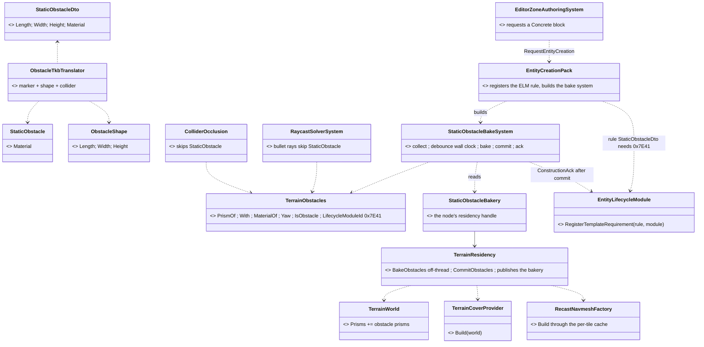

*What the picture shows that prose hid: every consumer of obstacles is an EXISTING terrain reader — the new code is only the path INTO the
terrain (translator, bake system, prism builder) and the two places that must STOP seeing the entity's collider. The lifecycle learns of the
terrain participant from ONE rule in the creation pack, not from each obstacle blueprint.*

### 9.4 Sequence — a scenario with obstacles loads *(the lifecycle gate, O2 — as built)*

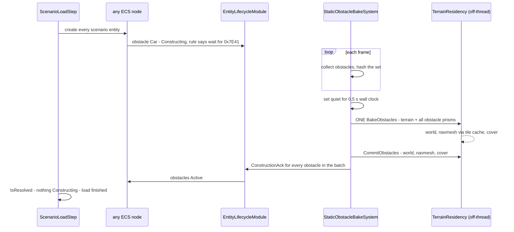

*What the picture shows that prose hid: the simulation cannot see an obstacle before the world it belongs to exists — the ack follows the
commit, and the load waits on the ack. The batching is the quiet period, so a slower load may bake twice; the gate still holds every obstacle
until a bake containing it commits.*

### 9.5 Modules — who registers, who runs it each frame *(as built)*

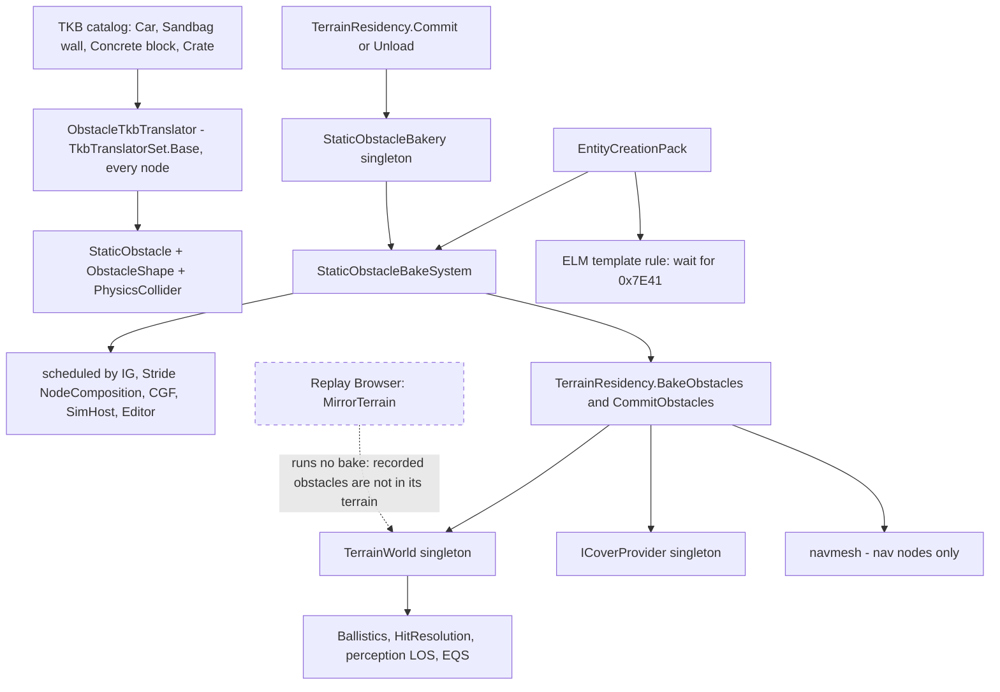

*Caption: the bake system is built by the creation pack, so every host that creates entities has it, and `Unserviceable` names it when a
host forgets to schedule it. A node with no `TerrainResidency` publishes no bakery and acks at once. The dashed edge is the one host that
never bakes: the Replay Browser mirrors a live node's terrain, and the recording holds no baked world — a known gap.*

⛔ **SUPERSEDED `2026-10-09` by the build** (the proposal above was drawn before it): a `StaticObstacleWatchSystem` registered beside each
`TerrainResidency`, a `ModuleId.Terrain` named on each obstacle blueprint, waiting on the load step's condition ① before one bake, `Rebake` of
touched tiles, and `ObstacleShape` carrying the material. What replaced each: §7 P-7a row, deviations ①–⑤.

### 9.6 Claim table behind O1/O2

| the lean rests on | code — how it is | design — how it was meant |
|---|---|---|
| every terrain reader walks `Prisms` with their material | ✅ I1, I3, I4, I5, I6 | ✅ Building Interiors §3c/§3d P2 (one rule) |
| a runtime geometry change is a snapshot swap | ✅ `DotRecastNavmeshProvider.Rebake` `:287`, `TerrainResidency.Commit` `:232` | ✅ R-218 |
| static obstacles are typed entities that get baked | ✅ none built (I8) | ✅ AQ81 T6, Zones §2.1c/§5.2 |
| no node reads another node's terrain | ✅ callers I1–I6 all query their own singleton | ⛔ searched `docs/`, no record either way |
| a rebuild is cheap enough per placement | ✅ measured `P7a_R9`: +3 obstacles on test-town = 238 ms, 2 of 576 tiles | ✅ R-218 (touched tiles) |

### 9.7 O5 — a vehicle is cover, read live *(`CE-3142`, built `2026-10-09`)*

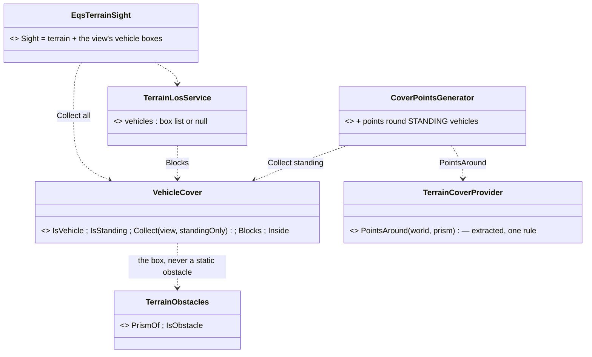

*What the picture shows that prose hid: no new state and no rebuild — both readers ask the query's own view each time, through the same
box and the same cover-point rule terrain uses.*

| as built | why |
|---|---|
| a vehicle = `VehicleParams` not `Pedestrian`, else a bare `VehicleState` (the `PathRequests.IsVehicle` rule); a collider of known height; never a `StaticObstacle` (terrain already) | one predicate; a person is not cover (EQS §19.5 unchanged for units) |
| its BOX: `VehicleParams` length × width (else the square inside its collider circle) × collider height, along its heading, of `car-body` (sight 0) | ⚠ the collider CYLINDER (radius = half the diagonal, 2.4 m for a car) would swallow a cover point 0.75 m off its side (1.65 m from the middle) — measured in `P7a_R10` |
| sight (①): every vehicle, moving or not, is opaque within its box; a box containing the eye or the aim (in plan) is the viewer's or target's own and is skipped | a passing truck hides what is behind it at that instant |
| cover points (②): `TerrainCoverProvider.PointsAround` (extracted from `Build`, unchanged rule) round every STANDING vehicle within the sensor's radius; never inside another vehicle | the tests after the generator see the vehicle as opaque, so the side away from the threat survives — as with terrain cover |
| ✅ **"standing" = moving slower than 0.3 m/s NOW, not "still for 2 s"** — 🔒 user, `2026-10-09`: *"moving slower than 0.3 m/s is probably a better consition"* (R-245) | 📐 nothing records how long an entity has stood (graph + grep: no stillness state anywhere); a per-frame tracker needs a component id (scarce) or shared state across the solver thread. A car stopping for a moment counts for that moment; the query re-runs and drops it when it drives off |
| bullets (③) and the navmesh (④) unchanged | O5 ③ ④ |

Rails: `StaticObstacleTests.P7a_R10` (a car's box hides at 1.0 m, not at 1.7 m; its own vehicle never hides a viewer inside it; a man
beside it — inside its collider circle — is hidden; a person is not cover), `P7a_R11` (points round a standing car, all standing stance;
none when it drives; none for a window generator; none once it is a static obstacle).

### 9.8 Seeing cover and the AI's verdict on the map *(`CE-3143`, built `2026-10-09`)*

> 🔒 **User, `2026-10-09`:** *"is there an indication what cover points are seen as safe?"* → the lean (fix the EQS gizmo for child
> sensors; colour points safe/exposed with the solver's own test; the parked-vehicle dots; round the per-side count up) → *"yes build it"*.

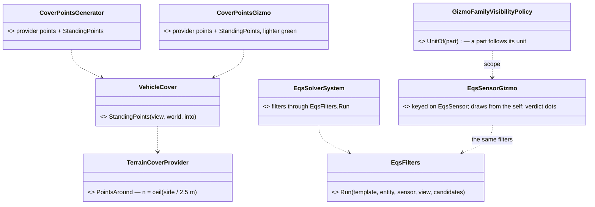

*What the picture shows that prose hid: each picture on the map has ONE producer shared with what the AI runs — the vehicle points
(`StandingPoints`) and the verdict (`EqsFilters.Run`) — so the map cannot show a different answer from the one the AI acts on.*

| as built | why |
|---|---|
| **per-side count rounded UP**: a car's 4.5 m side gets 2 points (was 1 in the middle), a 12 m wall 5 per long side | two men can hide behind one car side, and a unit can pick the end nearer its target |
| **Cover layer** draws the points beside every standing vehicle, lighter green (`CoverPointsGizmo.VehicleColor`) | they are in no database (read live, R-243/R-245) — the map showed less cover than the AI saw |
| **`EqsSensorGizmo` keyed on `EqsSensor` alone**, drawn from the sensor's self (`EqsContext.SelfPosition` — the parent unit) | 📐 a unit's sensors are children with no `SimTransform` (`EqsChildSensor.cs:81-85`); the old `(SimTransform, EqsSensor)` key matched none — the gizmo drew nothing for every current tactic |
| **the verdict**: every candidate the sensor's template generates, green when its FILTERS keep it, red when they reject it (`EQS.ShowVerdict`, on) — the template's own filters through `EqsFilters.Run`, now also the solver's | the same tests, never a copy. ⚠ The SCORE phases are not run (`AccurateLineOfSightTest` submits raycasts). A sensor whose threat gate is closed (no fresh threat) keeps everything ⇒ all green. A host with no template registry discovers one once (`EqsTemplateRegistry.Discover`) |
| **EQS family = selected or pinned by default; a part follows its unit** (`GizmoFamilyVisibilityPolicy.UnitOf`) | the verdict is busy per unit; the user selects the unit, never its sensor child |

Rails: `EqsVisualizersTests` (IG) — `EqsSensorGizmo_DrawsTheFiltersVerdict_ForAChildCoverSensor_GreenBehindTheCar` (a car between a unit
and its threat: 2 green behind it, 4 red), T-VIS1 re-pinned (keyed on the sensor alone); `CoverPointsGizmoTests.CE3143_TheCoverLayer_ShowsTheLivePointsBesideAStandingVehicle`
(6 dots for a car, none when it drives); `DebugTraceGizmoTests.CE3143_APartFollowsItsUnit_UnderSelectedOrPinned_AndEqsDefaultsToIt`;
`StaticObstacleTests.P7a_R11` (6 points round a car).

## 10. Generalisation — the library's "fight from cover" node *(R-256 L2 · ✅ G1–G8 APPROVED `2026-10-10`, R-257 · READY-TO-BUILD, `CE-3158`)*

> 🔒 **User, `2026-10-10`:** *"the peek-and-fire was written as part of the duel scenario … might not be generic enough"* ·
> *"we aim to having behaviors that are largely generic, usable in any military combat scenario"* · *"that squad-aware
> perspective is extremely important because we will need to model the squad and its behavior soon (single soldier is not
> realistic). For sure write the design please."*

⭐ **What this section does:** keeps the §8 machine (hide → expose → fire → recover, heat, stay down under fire) and fixes
the five places it is the duel's, so it can become CombatPosture's TakeCover child (`CE-3157`) and the per-member action of a
squad. ⛔ **No new node** — R-256: one implementation per concept. Audit: [`REVIEW_Behaviour_Library_Genericity.md`](REVIEW_Behaviour_Library_Genericity.md) §3.

### 10.1 INVENTORY *(`2026-10-10`, graph re-indexed after the merge + three read-only sweeps)*

| query | total | what it settles |
|---|---|---|
| `search_graph label=Class file_pattern=*Hrot.AI.Behaviors/Brains/*` | 88 | PeekAndFire is one of four cover paths; bound only by `WindowDuelBehavior.cs:59` (JSON bindings are invisible to the graph — confirmed by grep) |
| `search_graph name_pattern=.*(Squad\|SlotRotation\|FiringPositionMemory\|LineOfFire\|Reserv\|Claim\|ThreatMatrix\|LeaderAssign).* label=Class` | 49 | the squad layer EXISTS: `SquadCognitiveState` (commander, 1024 B: roles, slots, `Assignment[16]`, contacts), `SquadCoordinationSystem` → `ThreatMatrixAssignmentSystem` (built, U6 ×3), `SlotRotation` (index masks), `UnitRoster`/`UnitSubordinate` membership. ⛔ **no claim/reservation of world points among units** |

| fact the design rests on | code — how it IS | design — how it was MEANT |
|---|---|---|
| the peek mode keys on the template id | ✅ `PeekAndFireNodes.cs:245-246` | §6 D7 "a window point ⇒ stance, any other ⇒ step" — the intent was the POINT, the code keyed the query |
| cover points already know what they are | ✅ `CoverPoint.Kind` (`CoverKind.Cover` / `WindowFiring`), `StanceHeight` = the stance it hides | `DESIGN_Building_Interiors.md` §3l C4 |
| the result has room to carry the kind | ✅ `EqsResult` = 29 B used of 32 (`EqsComponents.cs:18`) | §6 D5 precedent: stance in a padding byte, *"extending wire is no issue"* |
| no cover ⇒ silent forever | ✅ `:237` Running, no fire, no Failure | ⛔ searched, no design says what should happen |
| bursts obey ROE, not the friendly line | ✅ `FireAtPointExecutor.cs:61` ROE; no friendly check | `BS-1-DESIGN.md` §5.1a: the friendly guard was written for aimed fire only |
| the friendly check is entity-to-entity, 2-D, whole force | ✅ `LineOfFire.cs:18-44` | `CE-321` |
| indirect fire is known per warhead | ✅ `WarheadDto.Indirect` (`Tkb/Domain/WarheadDto.cs:77`) | R-217 |
| the fire step re-ranks its own target | ✅ `PostureNodes.cs:301` `TopThreat(.., ws.Threat ..)` with `ws.Fire = default` (`PeekAndFireNodes.cs:350`) | R-174: ONE aimed step |
| target distribution exists, reaches the node as a bias only | ✅ `ThreatRankingDecision` considers `IsAssignedTarget` (0.9, threshold); `StandardInputs.cs:317` | Utility demo §11 (U6), Squad design §1 "fire allocation — Done" |
| a unit memory cannot be read by a squad-mate | ✅ `FiringPositionMemory` mirror `HidePoint` is per unit | 🔒 AQ87 G (R-237): *"Self only"*; §4 routes data other readers need to an **ECS component** |
| the seed is symmetric | ✅ `SimRng.cs:57` `entityIndex ^ salt ^ (int)simTime` | AQ8 Q-C / AQ78 C3: one sim-derived generator |
| the squad's turn-taking is built, not driven | ✅ `PhaseSequencer`, `RoleSlotAssignmentPrimitive` exist; no member-tier caller | `DESIGN_Squad_Wiring.md` §5 D2/D3, `CE-507` |

### 10.2 Classes

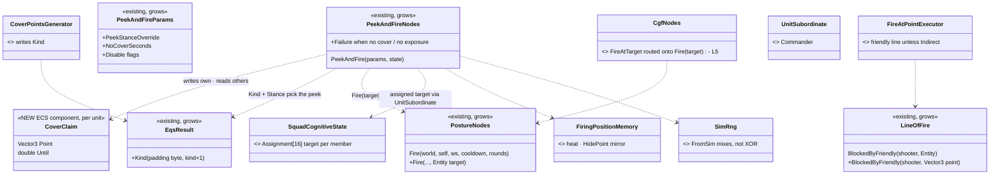

*What the picture shows that prose hid: ONE new type (`CoverClaim`, an ECS component, because AQ87 forbids reading a
squad-mate's unit memory); everything else is an existing box growing a member. The squad layer is READ (assignment), never
written — the node works for a lone soldier and for a squad member alike.*

### 10.3 Sequences

**(a) Two squad-mates under fire pick cover — no double-booking, one target each**

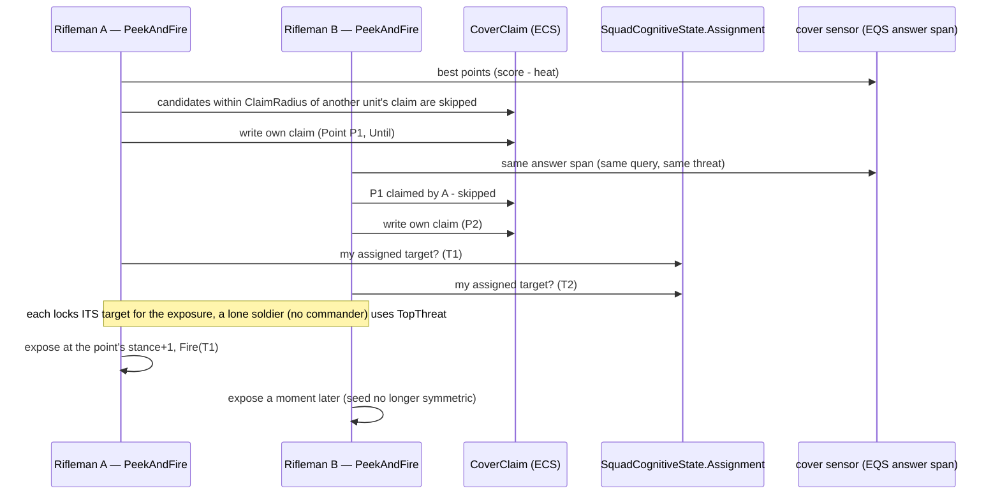

**(b) Nothing works — the node says so, the posture decides**

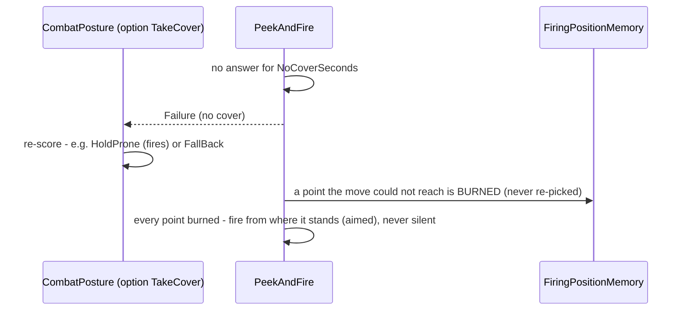

*What the pictures show that prose hid: the de-confliction is a READ of other units' claims at pick time — no lock, no
negotiation, no commander needed — and the node's only new outcome towards its caller is an honest `Failure`.*

### 10.4 Modules — who runs what each frame

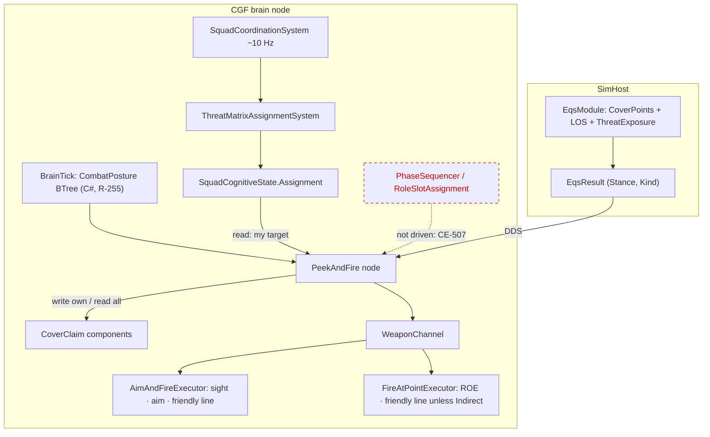

*Caption: the claims are BRAIN-local (all members of one squad are on the same CGF node, as the squad state already assumes —
Squad design §2 "All Brain-resident"); the red dashed edge is the squad's turn-taking, built but driven by nothing until
`CE-507` — §10.5 G6 defines the seam it will use, nothing here depends on it.*

### 10.5 Decisions — G1–G8, each with a recommended answer

| # | decision | ⭐ recommended | rejected (one line each) |
|---|---|---|---|
| **G1** | how the unit exposes | ⭐ from the POINT: `EqsResult.Kind` (new padding byte) — `WindowFiring` ⇒ stance peek at the point's stance; `Cover` ⇒ hide at its `StanceHeight`, peek **one stance taller**; already standing, or no stance system (`StanceRequest.Set` false) ⇒ **step peek**; no peek point ⇒ the next hide point. `PeekStanceOverride` for "crouch behind a low wall, stand to fire" | keying on the template id (today) — a window found by another query peeks wrong · a lookup of the cover point by position — a second source of truth for what the result already carries |
| **G2** | when it cannot work | ⭐ **`Failure` after `NoCoverSeconds` (default 3 s) with no usable point**, so the posture re-scores; an unreachable point is **burned** in `FiringPositionMemory`; all points burned ⇒ **aimed fire from where it stands**, never silent | Running forever (today) — the posture cannot pick anything else · blind fire when stuck — fire without sight from a known-bad spot |
| **G3** | fire safety of bursts | ⭐ `FireAtPointExecutor` checks the friendly line for **direct** fire (new `LineOfFire.BlockedByFriendly(shooter, Vector3 point)`, the SAME helper); **indirect warheads exempt** (`WarheadDto.Indirect`); bursts use `MountAuto` like aimed fire. ROE in the node: **HoldFire ⇒ never expose** (hide-only, = today's TakeCover); **ReturnFire ⇒ expose only inside the return-fire window**, skipping the random hide wait after being fired upon | a check in the node only — every other `FireAtPoint` caller stays unsafe · a 3-D line test — the aimed check is 2-D; one shape for both (a 3-D test is a later, shared change) |
| **G4** | several enemies | ⭐ **one target LOCKED per exposure**: the squad's assigned target (`UnitSubordinate.Commander` → `SquadCognitiveState.Assignment`) when the unit has one, else `TopThreat`; passed to the new **`PostureNodes.Fire(..., target)`** (the same overload L5 needs); a heard shot re-aims only if within `HeardMatchRadius` of that target; cover still scored against ALL threats (`ThreatExposureTest`) and a shot from a new bearing heats the spot (B2) ⇒ relocation | re-ranking inside the fire step (today) — sight checked on one enemy, shot fired at another · heat per bearing — grows a recorded struct for what B2 already achieves |
| **G5** | squad-mates on one point | ⭐ **`CoverClaim` — a per-unit ECS component** `{ Point, Until }` written by the node when it commits to a hide or peek point; the pick skips candidates within `ClaimRadius` (1.5 m) of **another unit's live claim of the same force**; ties broken by the lower network id (the other re-picks next tick). Works with or without a squad | penalise a friend's `HidePoint` in its unit memory — 🔒 AQ87 G forbids reading another unit's memory · a claim table in `SquadCognitiveState` — only squads would be safe, and members would write the commander's state · an EQS test — claims live on the brain, the query on SimHost |
| **G6** | squad turn-taking (who exposes when) | ⭐ **a seam, not built now**: an optional `MayExpose` gate the node reads (default open); the squad's `PhaseSequencer` / role (BaseOfFire exposes, Assault moves) closes it when `CE-507` drives the squad. Until then **de-sync only** (G7's seed) | building turn-taking in the node — duplicates primitive 4 (Squad design §2) · waiting for CE-507 before anything — the single-unit fixes do not need it |
| **G7** | randomness | ⭐ fix **`SimRng.FromSim`** itself: mix (splitmix) instead of XOR, so (unit 5, t 6) and (unit 6, t 5) differ and whole seconds stop repeating; ⚠ re-pins `PlatoonBaselineRails` / `DeterminismRails` | a private seed in the node — a second generator (AQ78 C3: one) |
| **G8** | scope, defaults, "off" | ⭐ scope **infantry** (needs `StanceIntent`, else step-only; a unit with neither stance nor a step point ⇒ `Failure`); the §8.4 numbers become the **generic rifleman** defaults (search 15 m stays, town-scale; `ExposeSeconds` ≥ 2 × the weapon's aim time); a **`Disable` flags byte** (no blind fire, no heat penalty, no suppress-and-bound) so "off" is expressible — numbers keep `0 = default` | vehicles in this node — hull-down is its own manoeuvre (`HillCrestHullDownManeuver`) · `NaN` as "unset" — unreadable in the editor |

### 10.6 Slices *(each red-proved, each green before the next)*

| slice | builds | rails (in `PeekAndFireNodesTests` — the feature's suite, T-1) |
|---|---|---|
| G-1 | G1 + G8 scope: `EqsResult.Kind` + generator; mode from the point; peek one stance taller; step fallback | cover point ⇒ crouch-hide / stand-peek · window ⇒ unchanged duel (R1) · no stance ⇒ step peek |
| G-2 | G2 failure contract + unreachable burn + fire-from-here | no cover ⇒ `Failure` within 3 s · unreachable twice ⇒ never re-picked · all burned ⇒ aimed fire, not silent |
| G-3 | G3: `LineOfFire` point overload; `FireAtPointExecutor` direct-fire check, indirect exempt; `MountAuto`; ROE in the node | a friend on the burst line ⇒ no round · mortar over a friend ⇒ fires · HoldFire ⇒ never exposes · ReturnFire ⇒ exposes inside the window |
| G-4 | G4 + L5: `PostureNodes.Fire(..., target)`; target lock; heard-match radius; `FireAtTarget` routed | two enemies ⇒ sight check and shot on the same one · assigned target honoured |
| G-5 | G5 `CoverClaim` + G7 seed | two riflemen, one good point ⇒ two different points · claims expire · `SimRng` asymmetric (+ baselines re-pinned, diff-shape reported) |
| G-6 | bind to CombatPosture's TakeCover (`CE-3157`) in the C# library tree (R-255) | `ua-universal-soldier`: fires again from cover; dies later or wins — measured, then asserted |

⚠ **Blast radius:** `EqsResult` + its wire entry (one byte, D5 precedent) · `FireAtPointExecutor` (also `bt-grenade-posture`,
`bt-mortar-roof` — indirect, exempt by G3) · `PostureNodes.Fire` callers (`Engage`, `FireOnTheMove`) · `SimRng` users (wander,
slot picks — baselines re-pinned) · the duel scenario keeps its behaviour through its parameters (rail P8 stays the regression).

> 🔒 **User, `2026-10-10`:** *"approved. pls explain the component for cover point negotiation and how it is used"*

### 10.7 `CoverClaim` — how squad-mates keep off each other's cover *(G5, as approved)*

⭐ **It is not a negotiation — it is "first claim wins".** No messages, no locks, no commander: every unit that fights from
cover publishes where it is going, and every unit picking a point skips the points friends have published.

| | |
|---|---|
| **what** | an ECS component on the unit: `CoverClaim { Vector3 Hide; Vector3 Peek; double Until }` (32 B), `[DataPolicy(NoScenario)]`; force from the unit's own `EntityInfo.ForceId` |
| **why an ECS component** | other units must READ it — 🔒 AQ87 G keeps unit memory *"Self only"*, and AQ87 §4 sends data other readers need to a component |
| **written** | by the PeekAndFire node the moment it COMMITS to a point — when it issues the move, not on arrival, so nobody races it there; `Peek` when it picks a step-peek point; `Until = now + ClaimTtl` (2 s) refreshed every tick it runs |
| **released** | relocation overwrites it (the old point is free at once); the node's deactivator clears it; ⭐ a brain that dies or aborts without cleanup simply stops refreshing and the claim **expires by `Until`** — no cleanup system |
| **read** | at pick time (B6 — the answer span, score − heat): candidates within `ClaimRadius` (1.5 m) of another live claim (`Hide` or `Peek`) of a unit of the **same force** are skipped |
| **who wins a tie** | the brain ticks a squad's members one after another in one pass on the same CGF node, so the unit ticked first writes its claim before the next one reads — deterministic, entity order. No preemption: a later, "better" unit never steals a claimed point |
| **nothing left** | every good point claimed or burned ⇒ G2: `Failure` after `NoCoverSeconds`, or aimed fire from where it stands |
| **cost** | a query over claim holders only (units running the node) × at most 16 candidates |
| **seen** | the existing `PeekAndFireGizmo` draws each unit's hide point; claims add an owner line (who holds which point) |
| **limits** | ⚠ brain-local — claims are not replicated, so units of one force whose brains run on DIFFERENT CGF nodes do not see each other's claims (a squad's members share one node — Squad design §2 *"All Brain-resident"*) · a friend that only walks past a point does not claim it |
| **the squad later** | the same component is the seam for the squad layer: the `RoleSlotAssignmentPrimitive` can pre-place members by writing their claims, and the `PhaseSequencer` can read who holds which point — without the node changing (G6) |

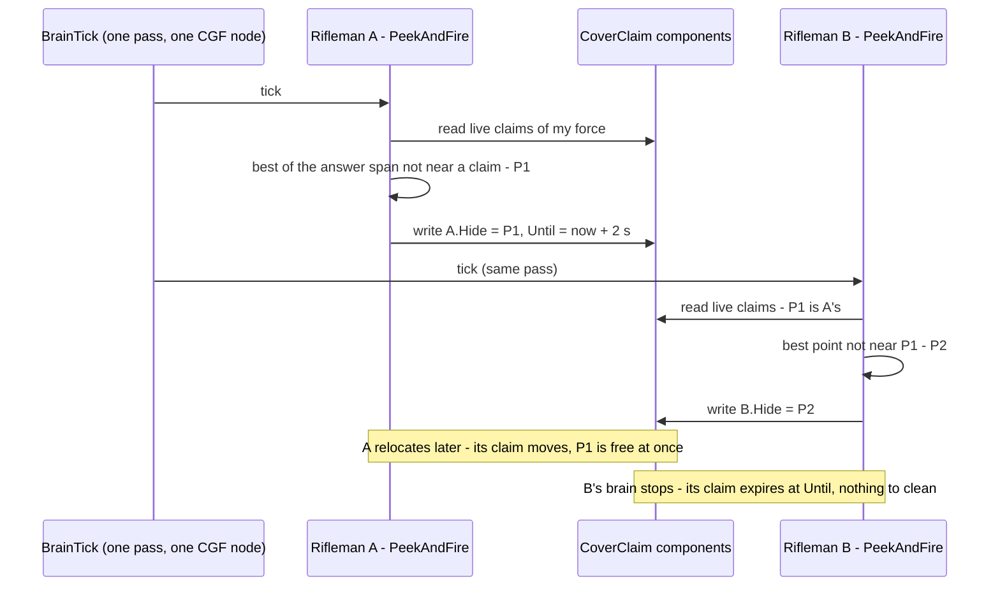

*What the picture shows that prose hid: the ordering of ONE brain pass is the whole conflict rule — the second reader always
sees the first writer's claim, so no lock or negotiation is needed on one node.*

