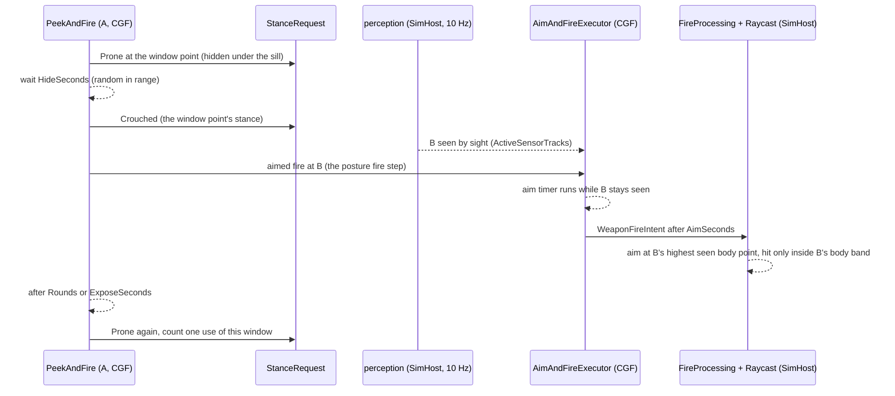
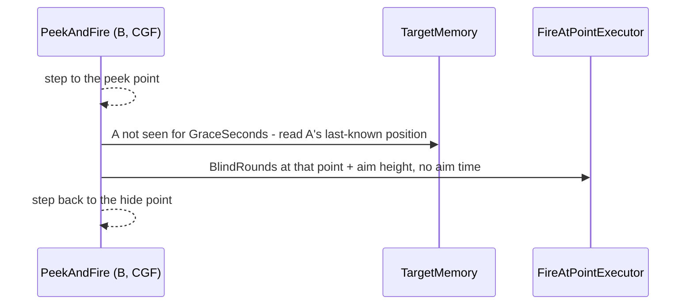
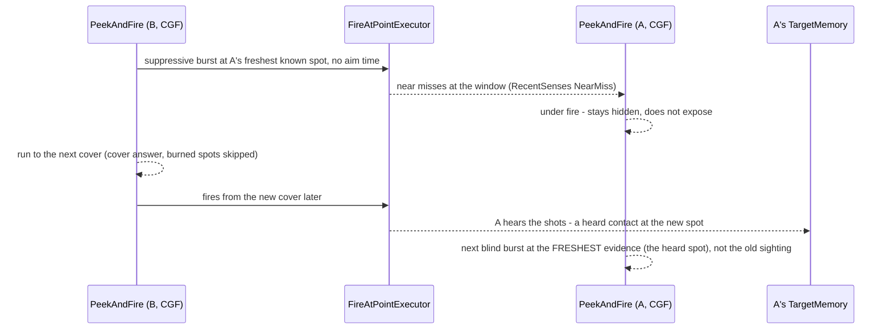
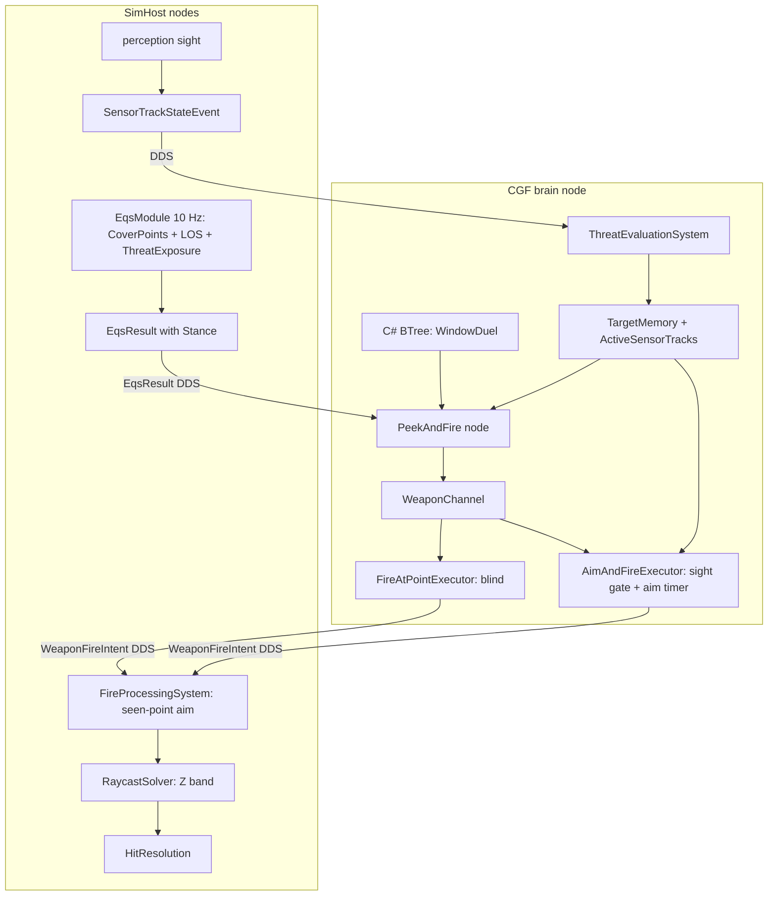
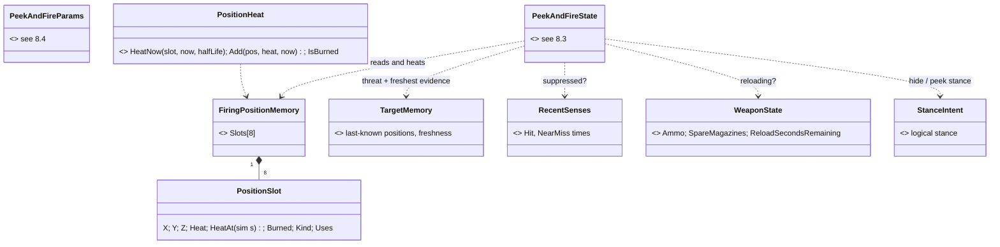
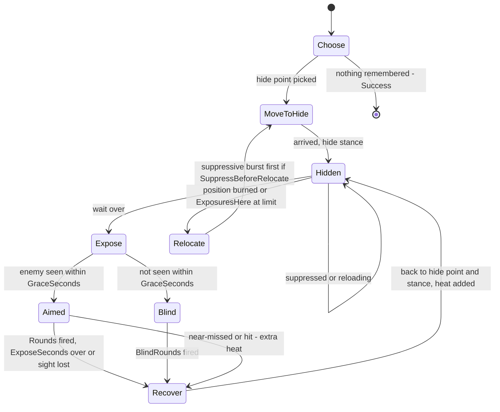

<!--STATUS
state: LIVE
updated: 2026-10-09
build-state: READY-TO-BUILD for D1–D13 (APPROVED by the user 2026-10-09, R-234); §8 behaviour detail B1–B8 APPROVED 2026-10-09 (R-238); B1's storage rides on Q87 (unit memory, A–G APPROVED 2026-10-09, R-237)
current-answer: §6 decisions (approved) · §8 behaviour detail (approved, R-238) · §3 classes · §4 sequences · §5 modules · §7 slices
stale-below: nothing
known-rot: none yet
known-conflict: DESIGN_Building_Interiors.md §3d P2 / R-217 — "the shot flies from the eye to the middle of the target's silhouette"; D1 here refines the AIM POINT to the highest body point the shooter sees (§6 D1)
related-designs:
  - DESIGN_Eqs_Consuming_Behaviours.md — OWNS the tactics nodes (TakeCover, FiringPosition, Flank — EqsTacticsNodes.Run) PeekAndFire sits beside; its §9 F1/G3 "move, then fire / cover stops firing" is what this adds to
  - DESIGN_Building_Interiors.md — OWNS the window firing positions (§3l, CE-3134), the shot line (§3d P2) and the body profiles (§3f) D1/D2 change
  - designs/eqs-2/EQS_Design_v1.3_final.md — OWNS EqsResult and the starter templates; D5 widens the result, D6 revives ThreatExposureTest (§19.5)
  - blueprints/Architect_Question_85_Hit_Chance.md — OWNS the hit chance (spread, stance, under fire) the aim time sits in front of
  - DESIGN_Decision_Layer.md — OWNS the posture tree (Suppress = Engage, §3.3) and the stance request (§3.3g) PeekAndFire uses
  - designs/group-maneuvers/Squad_Coordination_Design_v1_1.md — OWNS SlotRotation (used/burned exposure slots, §3); D8 mirrors it per unit
  - blueprints/Architect_Question_87_Unit_Memory.md — OWNS unit memory (unit-scoped shared blackboard structs): declaration, storage, creation on first touch, access; B1's FiringPositionMemory is its first instance
  - DESIGN_Terrain_Combat_Tuning.md — OWNS the defaults (EngineFallbacks, ParameterResolver) D3/D4 add to, and the demo/premise rules the duel follows (§3)
-->

# Peek and fire — the window duel *(backend, `2026-10-09`, `CE-3136`; resolves `CE-3135`)*

> 🔒 **User, `2026-10-09`:** *"show some simple combat when a soldier is indoors hiding next to a window, enemy outside on
> the other side of the street and can hide behind the corner which is out of the opponent sight when under fire (the cover
> sensor should be able to find such a cover point, when cooperating with threat sensor results) each one just shortly exposes
> and fires to the other one's direction (because they remember seeing each other …), the one in the building changing firing
> positions so he does not fire from same point more than few times."* · *"As 3135 extending wire is no issue."* ·
> *"You can use csharp btrees if easier for you. The shot after exposing needs some small aiming time simulation unless the
> shot is just a blind suppressing fire."*

## 1. INVENTORY — what the duel needs, measured `2026-10-09` (four read-only sweeps + reads, graph + grep)

| # | what exists | gap | where |
|---|---|---|---|
| G1 | entity fire aims at **half the target's height** | a crouched man behind a 0.9 m sill is aimed at 0.55 m ⇒ every round hits brick: **A cannot be hit** | `FireProcessingSystem.cs:113`, `LosStrategies.cs:172` |
| G2 | entity hit test is a **2-D circle** | a round through the window "hits" a man lying prone below it | `FireProcessingSystem.cs:111` comment; `RaycastSolverSystem.cs:119-154` |
| G3 | `AimAndFireExecutor` checks ammo, cooldown, friendly-in-line, ROE — **not sight**, and the round flies at the target's TRUE position | a unit "shoots" at a hidden enemy; no aim time exists anywhere | `AimAndFireExecutor.cs:63-126`; searched `AimTime`/`AcquisitionTime`: none |
| G4 | rifleman 30 rounds, **no reload** | a duel runs dry in a minute | `UrbanCombatTkbCatalog.cs:75`, `WeaponState` (`CombatComponents.cs:13`) |
| G5 | `CoverPoint.StanceHeight` exists; `EqsResult` has **4 padding bytes** (28 → 32) | the generator drops the stance (`CoverPointsGenerator.cs:94`) — `CE-3135` | `EqsComponents.cs:17-37`, wire `EqsDdsTopics.cs:89-110` |
| G6 | `ThreatExposureTest` scores a point against ALL known threats | reads `SensorContactList` on the SELF — moved to the perception children by `CE-3038` ⇒ **does nothing in production** | `ThreatExposureTest.cs:44` |
| G7 | memory keeps each contact's **last-known position** (~45–65 s), and `FireAtPoint` fires N rounds at a point | nothing fires at a remembered spot; `FireAtPoint` aims at the point's Z (the feet) | `ThreatEvaluationSystem.cs:110-170`, `FireAtPointExecutor.cs:13-24` |
| G8 | stance by `StanceRequest.Set` (logical, same tick) | no tactic sets a stance on arrival; no peek, no expose-then-hide, no position memory anywhere | `StanceRequest.cs:17`; graph `.*(Peek\|PopUp\|Expose\|Suppress\|ShootAndScoot).*`: none |
| G9 | "seen NOW by sight" on the brain = `ActiveSensorTracks` with the Visual modality | — (the aim gate reads it, as `ThreatInSight` does) | `StandardInputs.cs:238` |

## 2. The duel *(what a viewer sees)*

A (inside House A, at a window) and B (outside, behind House B's corner) saw each other at the start, so each remembers
the other. Each cycles: **hidden → expose → aim (only if it sees the other) → fire a few rounds → hide → wait**. A hides by
lying prone under the sill and exposes by kneeling at it (a stance change, no step); B hides behind the corner and exposes
by stepping to a point beside it that sees A. A moves to another window after a few exposures. Not seen when exposed ⇒ a
short **blind burst** at the remembered spot (no aim time).

## 3. Classes

```mermaid
classDiagram
  class PeekAndFireNodes { <<new, C# BTree actions>> PeekAndFire(params, state) }
  class PeekAndFireParams { <<new>> Template; Rounds; ExposeSeconds; GraceSeconds; HideSecondsMin/Max; MaxUsesPerPosition; BlindRounds }
  class PeekAndFireState { <<new>> Phase; HidePoint; PeekPoint; HideStance; PeekStance; Positions[4] + uses; Timer }
  class EqsTacticsNodes { <<existing>> TopThreat; Point; EnsureSensor pattern }
  class PostureNodes { <<existing>> Fire (aimed, ONE fire step); StopFiring }
  class StanceRequest { <<existing>> Set(world, self, stance, blend) }
  class AimAndFireExecutor { <<existing, grows>> sight gate + aim timer in channel.State }
  class FireAtPointExecutor { <<existing, grows>> AimHeight added to the point }
  class FireProcessingSystem { <<existing, grows>> aims at the highest SEEN body point }
  class RaycastSolverSystem { <<existing, grows>> Z band of the target's body }
  class WeaponState { <<existing, grows>> SpareMagazines; ReloadSecondsRemaining }
  class EqsResult { <<existing, grows>> +Stance (padding byte, stance+1, 0 = none) }
  class CoverPointsGenerator { <<existing, grows>> writes Stance }
  class CheapLineOfSightTest { <<existing, grows>> candidate eye = the result's stance }
  class ThreatExposureTest { <<existing, fixed>> threats from the unit's perception sensors }
  class ParameterResolver { <<existing, grows>> AimSeconds, Reload }
  PeekAndFireNodes --> PeekAndFireParams
  PeekAndFireNodes --> PeekAndFireState
  PeekAndFireNodes ..> EqsTacticsNodes : threat + sensor steps
  PeekAndFireNodes ..> PostureNodes : aimed fire
  PeekAndFireNodes ..> FireAtPointExecutor : blind burst
  PeekAndFireNodes ..> StanceRequest
  PostureNodes ..> AimAndFireExecutor
  AimAndFireExecutor ..> ParameterResolver : AimSeconds
  CoverPointsGenerator ..> EqsResult
  CheapLineOfSightTest ..> EqsResult
```

*What the picture shows that the prose hid: one new class (the node) — every other box exists; the engine fixes are
four existing systems growing, and the aim time lives in the ONE executor every aimed shot already passes.*

## 4. Sequences

### 4.1 One exchange — A peeks at a window, B is visible

### 4.2 Not seen when exposed — the blind burst

### 4.3 Suppress and bound — B changes cover *(D11–D13)*

## 5. Modules — who runs what, and where it is seen

*Caption: the aim gate is on the BRAIN and reads what perception reported (sight is decided on SimHost); the aim POINT is
chosen on SimHost from geometry. The ~100–300 ms report latency is part of the aim time a viewer sees.*

## 6. Decisions — ✅ APPROVED `2026-10-09` (R-234)

> 🔒 **User, `2026-10-09`:** *"Approved. Pls leta think how behaviors store the memory of the used cover points and how that memory
> fades out so covers can be reused after some time. And what other behabior status variables would be needed, what parameters the
> behaviors would need. The behavior design in a bit more details."* → §8.

| # | lean | why |
|---|---|---|
| D1 | an aimed round aims at the **highest body point of the target that the shooter's eye SEES** (sight already computes it, `LosExplanation.Aim`); none seen ⇒ the middle, as today | G1; one rule for seeing and shooting (§3f). ⚠ Refines §3d P2 / R-217's "middle of the silhouette" |
| D2 | a round hits a person only if its height at the target lies inside the body band of the target's **logical stance** (feet … top body point); vehicles keep the circle | G2; prone under a sill is then safe from a round through the window |
| D3 | **aim time**: an aimed shot leaves only after the shooter has seen the target **continuously for `AimSeconds`** (fallback **0.8 s**, per weapon through `ParameterResolver`); the timer restarts when sight is lost, the target changes or the shooter's stance changes; later rounds at a target still seen need only the cooldown. **Blind fire (`FireAtPoint`) has no aim time** | 🔒 user; in the ONE executor every aimed shot passes, so every behaviour gets it (Engage, Flank, tanks) |
| D4 | an aimed shot needs the target **seen now** (`ActiveSensorTracks`, Visual) — the gate D3 needs anyway; a hidden target is not shot at by `AimAndFire` (the action stays Running, no round spent, like the ROE hold) | G3; no shooting at the true position of an enemy nobody sees. ⚠ Posture/flank demos that today fire at hidden enemies stop doing so ⇒ the T3 baselines (`PlatoonBaselineRails`, `DeterminismRails`) may move — re-pinned once, deliberately |
| D5 | **`CE-3135`**: `EqsResult.Stance` in the padding byte (size stays 32), stored **stance + 1** (0 = none, so old recordings and other generators read "none"); on the wire entry, filled by `CoverPointsGenerator`; the window LOS test uses that stance's eye | 🔒 *"extending wire is no issue"*; one byte, no layout change |
| D6 | `ThreatExposureTest` reads the threats from the unit's **perception sensor children** (where `CE-3038` moved the lists) | G6 — "cover cooperating with threat-sensor results" is exactly this test; today it is silently inert |
| D7 | **`PeekAndFire`** — one C# action, two shapes: **stance peek** (A: same spot, hide prone / expose at the point's stance) and **step peek** (B: hide point from `FindCoverFromTarget`, peek point from `FindOpenFiringPosition` with a ~3 m radius around the hide point). Expose → aimed fire (`PostureNodes.Fire`) for up to `ExposeSeconds`; not seen within `GraceSeconds` ⇒ `BlindRounds` at the last-known position + aim height (`FireAtPoint`); hide; wait a random `HideSeconds` (`SimRng`, deterministic) | G7/G8; reuses the threat ranking, the sensor steps and the ONE fire step of `EqsTacticsNodes`/`PostureNodes` (R-174); C# BTree per the user |
| D8 | **position rotation**: a position used too often is burned and the node takes the next best from the sensor's answer span — ⛔ SUPERSEDED in its storage (*"in the node's state: up to 4 positions"*) by §8 **B1** (a unit component, 8 slots, cooling heat): node state is reset on every exit | the squad's `SlotRotation` used/burned idea per unit (Squad §3); no EQS change, the ranking stays deterministic |
| D9 | **reload**: `WeaponState` gains spare magazines + reload time (fallback rifle 30 × 5, 3 s); an executor finding the magazine empty reloads instead of failing | G4; both executors, all weapons |
| D10 | the demo: **`bt-window-duel`** on `bt-range` — A in House A, B at House B's corner; C# BTree `WindowDuel` (both units, shape by parameter); an in-process rail (both expose, both fire, A uses ≥ 2 windows, nobody shoots while unseen except blind bursts) + an HTTP check | R-223; the window count that sees B is measured in slice 1 — a window may be added to the template |
| D11 | **street cover = STATIC OBSTACLE ENTITIES** (a parked car, a sandbag barrier, a crate) of an **obstacle TKB type** carrying a `PhysicsCollider` (radius, height), a `StaticObstacle` marker and a **MATERIAL from the wall library** (`TerrainMaterial`: sight transmittance, resistance mm RHA per metre, sound dB, blocks movement — §3c), placed by the scenario like any entity; the Editor's existing zone obstacle (`EditorZoneAuthoringSystem`, a bare circle collider) becomes one of these types, so it carries a material too. ① **bullets**: the round crosses the obstacle like a wall panel — resistance × the CHORD it travels through the collider (within its height) → `ArmorModel.PenetrationChance`, chances multiply with every other crossing, penetration reduced by what was crossed (§3d P2, one rule); ② **sight**: the obstacle's material transmittance, as a panel's (today a collider is opaque within its height); ③ **cover**: the cover database = terrain + obstacles — points around each static obstacle (stance by its height), rebuilt when one appears or goes, ONE `ICoverProvider` (R-132); ④ **the cover query's sight**: `EqsTerrainSight` sees STATIC obstacles too (moving vehicles stay "not cover", EQS §19.5); ⑤ **paths**: obstacles cut into the navmesh by the existing touched-tile rebuild (Nav v2 §14 P2) | 🔒 user: *"The covers on the street could be obstacle entities, simulating a static cars or something."* · *"the zone obstacles need to carry the material similar to walls (obstacle entity tkbtype derived) and the bullet penetration should count with it."* ⛔ SUPERSEDED: obstacles as terrain prisms in `bt-range`'s world file |
| D12 | **suppress and bound** (B's shape, a `PeekAndFire` parameter): a suppressive burst at A's freshest known spot (`FireAtPoint`, no aim time), then a run to the next cover — `FindCoverFromTarget`'s answer, D8's burned positions skipped, never the current one; **under fire = stay down**: a unit near-missed or hit within `SuppressedSeconds` (default 3 s, `RecentSenses`) does not expose | 🔒 *"after using suppressive fire first"*; suppression must DO something or bounding is theatre — the near-miss sense already exists (`R-206`) |
| D13 | **the freshest evidence wins** for a blind burst: the newest of the identified enemy's last sighting and any HEARD contact (`CE-3063` anonymous slots); an aimed shot still needs sight | measured: a heard shot >≈6 m from the remembered spot makes a NEW anonymous slot (`TargetMemory.HearContact`, radius 40 m × 0.15) and `TopAim` prefers the identified one ⇒ without D13 A shoots at where B WAS. ⭐ Hearing already works without walls (`AcousticPerception`) — 7b's wall attenuation is not needed for this |

| rejected | the one fact that killed it |
|---|---|
| aim time as a BTree `Wait` before firing | every other aimed shot (Engage, Flank, tanks) would stay instant; the executor is the one place all pass |
| a stance lookup from the cover provider by position (`CE-3135` option 2) | the user cleared the wire; a lookup by float position is fragile and per-host |
| a recently-used EQS test (tabu as a test) | the past positions are the UNIT's, not the sensor's; the brain already holds the answer span |
| a corner point type in the cover database | the step peek finds the exposure point with an existing template; corners would be a second producer (R-132) |

## 7. Slices *(rails first, red-proved; each green before the next)*

| slice | content | rail |
|---|---|---|
| P-1 | D5 stance on the result + wire; LOS uses it | the window point's answer carries crouch; recorded old result reads "none" |
| P-2 | D1 + D2 | a crouched man behind a 0.9 m sill is hit through the window; prone below it is not |
| P-3 | D3 + D4 aim gate and timer | no round before `AimSeconds` of continuous sight; lost sight restarts it; blind `FireAtPoint` fires at once |
| P-4 | D6 threat exposure revived | a cover point seen by a second known threat scores lower |
| P-5 | D9 reload | 31st round after the reload time |
| P-6 | D7 + D8 `PeekAndFire`; needs Q87 `U-1` + `U-2` (unit memory runtime + C# binding) | stance peek and step peek cycles; a window burned after 3 uses |
| P-7a | D11 obstacle entity: TKB type, spawn, bullet stop, cover points, EQS sight, navmesh cut | a car blocks sight and rounds, has cover points behind it, and a path goes round it |
| P-7 | D12 bound + D13 freshest evidence, on the obstacles | B reaches a second cover while A is near-missed and stays down; A's next blind burst lands at B's heard spot |
| P-8 | D10 scenario + rail + HTTP check; T3 baselines re-pinned if D4 moved them | the duel rail |

## 8. The behaviour in detail *(APPROVED `2026-10-09` — B1–B8, R-238; 🔒 user: "approved")*

### 8.1 What lives where

*What the picture shows: ONE new unit memory (the position memory — a type-keyed blackboard-store slot created on first touch, Q87) and one helper; the node's own state is scratch
that may be lost on every exit, so nothing that must OUTLIVE an exit lives there.*

| B# | lean | why |
|---|---|---|
| B1 | the used positions live in `FiringPositionMemory` (8 slots), ⭐ **the first UNIT MEMORY**: a unit-scoped shared blackboard struct ([Architect Question 87](blueprints/Architect_Question_87_Unit_Memory.md), proposed `2026-10-09`; 🔒 user: *"it is required to re-implement the unit-scoped shared blackboard structs"*). One slot of kind `UnitMemory` in the unit's blackboard store, **keyed by the struct type**, **created on the first touch** with `new FiringPositionMemory()` (declared defaults; C# 12 needs the declared `public FiringPositionMemory() {}`, and only a constructor call applies them — measured, Q87 §1), and **never swept by a behaviour switch** (both sweeps skip the kind — Q87 §1). Declared `[UnitMemory]` **beside its reader** `PeekAndFire` in `Fdp.Toolkits`; the node reaches it with `UnitMemory.Ref<FiringPositionMemory>`: attached in place, in a block with room or an appended one (Q87 §3 C, D″ — built as U-0; the old one-frame hold and promotion are retired). Nothing is declared ahead. A blueprint behaviour reads the same memory with `GetShared` (Q87 U-3). Recorded for replay, never saved in a scenario, never on the wire; lost on a Brain failover, harmless for a memory that fades anyway. ⇒ **P-6 needs Q87 U-1 + U-2** | node state is reset on exit (`EqsTacticsNodes.Release`: `ws = default`) — a posture switch, a reload hold or a re-plan would forget every burned window. ⛔ Rejected: an ECS component per memory type — 🔒 user: *"no automatic component allocations. Component id range is very limited. We can have hundresds of behaviors."* ⛔ Rejected: the old name-keyed Entity scope (Q76 decision A, CE-441) — collisions and the switch sweep; unit memory is type-keyed and a separate slot kind |
| B2 | **heat, not a counter**: an exposure adds `HeatPerExposure` (1.0); being near-missed or hit while exposed there adds `HeatWhenFiredUpon` (1.5); heat **cools exponentially** with `CoolHalfLifeSeconds` (45 s) | a counter needs a reset rule; heat fades by itself, so a window used long ago is usable again without any bookkeeping. Being shot at there is the strongest reason to leave, so it heats more |
| B3 | heat is **evaluated lazily** — stored with its sim time, `heat(now) = heat · 2^-(now − at)/halfLife` — no per-tick system | deterministic, replay-exact (sim time, R-143), zero cost while nobody looks |
| B4 | **burned with hysteresis**: a slot is burned at `BurnHeat` (2.5) and usable again only below `ReuseHeat` (1.0); between them a candidate keeps a soft penalty `heat × HeatPenalty` on its EQS score | without hysteresis a window flips usable/burned at one threshold and the unit dithers. Worked example: 3 exposures within 20 s ⇒ ≈ 2.7 → burned; it cools below 1.0 after ≈ 65 s |
| B5 | a candidate **is** a slot when within `MatchRadius` (1.0 m); a full memory replaces its coolest slot | EQS points are database points (windows, cover points) — they repeat exactly; 1 m absorbs a peek point's small drift |
| B6 | the node picks from the cover sensor's **answer span** (16 results): the best by `score − heat penalty` among non-burned, ≥ `MinRelocateMetres` from the current position when relocating | no EQS change (D8); the sensor stays deterministic and shareable |
| B7 | **one round count** on aimed fire: `AimAndFireParams.Rounds` (0 = until stopped) as `FireAtPointParams` already has, so "fire 3 aimed rounds" is the executor's job | the node should not count intents; both fire actions then end the same way |
| B8 | **reloading = stay hidden**: while `ReloadSecondsRemaining > 0` the node does not expose | exposing with an empty rifle is the one thing a soldier would never do |

### 8.2 The node's phases

*What the picture shows that prose hid: the same machine flies BOTH soldiers — A's Expose is a stance change on the spot and
his Relocate is "another window"; B's Expose is a step and his Relocate is "run to the next obstacle". Only the parameters differ.*

### 8.3 Working state *(scratch — lost on exit by design)*

| field | what |
|---|---|
| `Phase`, `PhaseUntil` | the phase above and when its timer ends (sim s) |
| `HidePoint`, `HideStance`, `PeekPoint`, `PeekStance`, `PeekIsStep` | the current pair (stance peek: PeekPoint = HidePoint) |
| `CoverSensor`, `PeekSensor` | the two child sensors (as `PostureNodes.KeepPair`) |
| `Threat`, `HeardId`, `AimPoint` | who, and the freshest evidence of where (D13) |
| `ExposuresHere`, `Fire` | exposures from this hide point; the aimed-fire action state (`EngageState`) |
| `LastCoverTick`, `LastPeekTick` | one look per answer (as `TryNewAnswer`) |

### 8.4 Parameters *(designer-edited; defaults are the duel's)*

| group | parameter | default | A (window) | B (street) |
|---|---|---|---|---|
| where | `HideTemplate` | — | `FindWindowFiringPosition` | `FindCoverFromTarget` |
| | `SearchRadius` · `PeekSearchRadius` (m) | 15 · 3 | 12 · — | 25 · 3 |
| | `PeekMode` | Auto (window point ⇒ Stance, else Step) | Stance | Step |
| | `HideStanceOverride` | from the point | Prone | from the point |
| timing | `HideSecondsMin` / `Max` | 2 / 5 | 2 / 5 | 2 / 4 |
| | `ExposeSeconds` · `GraceSeconds` | 3 · 0.6 | 3 · 0.6 | 2.5 · 0.6 |
| | `SuppressedSeconds` | 3 | 3 | 3 |
| fire | `RoundsPerExposure` · `BlindRounds` · `FireCooldownSeconds` | 3 · 3 · 0.3 | 3 · 2 · 0.3 | 3 · 4 · 0.25 |
| rotation | `ExposuresPerPosition` | 3 | 3 | 2 |
| | `HeatPerExposure` · `HeatWhenFiredUpon` | 1.0 · 1.5 | | |
| | `BurnHeat` · `ReuseHeat` · `HeatPenalty` | 2.5 · 1.0 · 0.3 | | |
| | `CoolHalfLifeSeconds` · `MatchRadius` (m) | 45 · 1.0 | | |
| move | `RelocateSpeed` (m/s) · `MinRelocateMetres` | 4.5 · 4 | 2.0 · 2 | 5.0 · 6 |
| | `SuppressBeforeRelocate` | 0 | 0 | 1 |
| | `FactionFilter` | 0 (every acquired contact) | | |

⚠ The aim time is NOT here: it is the weapon's (D3, `ParameterResolver`), so every behaviour aims alike.
