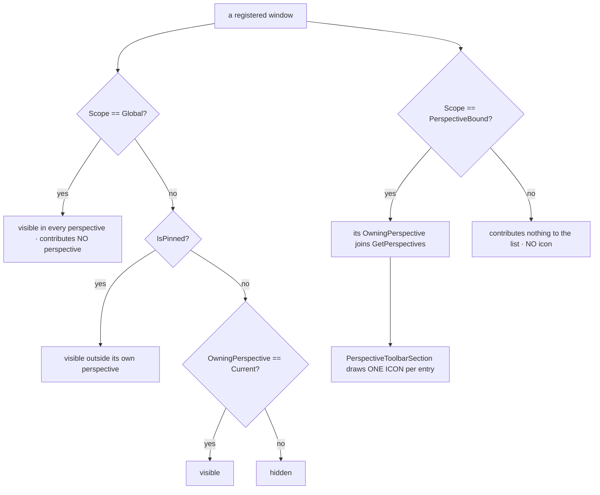
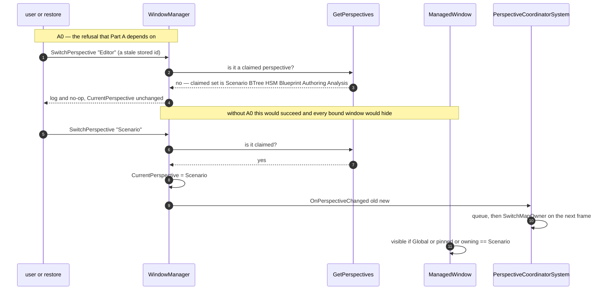

<!--STATUS
state: LIVE
build-state: SPLIT — §3 (Part A, the rename + the validation prerequisite) is READY-TO-BUILD and carries
  the UML in §5. §4 (Part B, CGF grows asset perspectives) is DESIGN: it lands feature by feature with the
  unification, and its first slice needs the freeze decision in §8.
updated: 2026-08-23
current-answer: the whole file. §3 is what to build now; §4 is the target it builds toward.
design-basis: PROGRAMME_Unification_And_Harness.md D1+D2 (user decisions, 2026-08-23) ·
  UX/UX_Glossary_Host_Mode_Subsystem.md (process · mode · subsystem · perspective — perspective is the
  finer key) · UX/UX_Feature_Perspective_Restore.md §3 (the unknown-id refusal, designed, never built).
known-conflict: none. §1b is the user-confirmed target model. ⚠ An earlier revision of this file claimed
  six editor perspectives (adding Authoring/Analysis); that was WRONG and is corrected in §1 — those two
  are never registered in production, so the glossary's four was right all along.
-->
# DESIGN — **the perspective model**, and unifying it across the editor and CGF

> ⭐⭐⭐ **This is THE perspective design doc.** It owns: what a perspective IS and how one comes to exist,
> which subsystem provides which, what "Global" means *(and does not)*, and the cross-host unification.
> ⛔ Handoffs **reference** this file; they do not restate it.

> ⭐⭐⭐ **Why:** conformance can only compare like with like. Today the editor shows
> `Editor · BTree · HSM · Blueprint` and a CGF-hosting runner shows `CGF`. ⇒ **nothing lines up**, and a
> cross-host check has to translate rather than compare. 📄 Charter **D1**/**D2**.

## 1. ⭐ INVENTORY — measured `2026-08-23` at `129e80505`

```bash
grep -rn "OwningPerspective\s*=" --include=*.cs Hrot/ FDP/           # who sets it: exactly ONE place
grep -rhoE ': base\("[^"]+", *"[^"]*", *"[A-Za-z]+"' --include=*.cs  # every perspective literal
grep -rn "CreateRegistrar(" --include=*.cs Hrot/ | grep -v Tests     # the asset-perspective factory calls
```

| fact | value |
|---|---|
| ⭐⭐ **`ManagedWindow(id, title, owningPerspective, scope)`** | the perspective is a **plain ctor string**; `OwningPerspective` is assigned in exactly one place *(`ManagedWindow.cs:141`)* |
| ⭐⭐⭐ **`GetPerspectives()` DERIVES the list** | distinct `OwningPerspective` over registered `PerspectiveBound` windows ⇒ ⛔ **no registry to extend, and an EMPTY perspective is not representable** |
| **visibility rule** | `Global \|\| isPinned \|\| OwningPerspective == currentPerspective` *(`ManagedWindow.cs:160-162`)* — plain string equality |
| ⚠⚠ **perspective literals in PRODUCTION** | `Editor` **8** · `ExCon` **7** · `IG` **5** · `SimHost` **2** · **`Authoring` 2** · **`Analysis` 2** · `Blueprint` **1** · `CGF` **4** *(multi-line registrations)* |
| ⛔⛔ **CORRECTED `2026-08-23` — `Authoring` and `Analysis` are NOT live perspectives** | ⚠⚠ **An earlier revision of this row claimed *"there are SIX editor-side perspectives, not four"* and that `GetPerspectives()` returns them. 🔴 THAT WAS WRONG.** 📐 Re-measured: **none of the four windows claiming them** *(`FakeAnimBackendInspectorWindow` · `UtilityDecisionWindow` · `ComparisonSummaryPanel` · `ComparisonSidebar`)* **has a production registration site** — the only hits are their own internal view-model construction. ⭐ `GetPerspectives()` derives from **REGISTERED** windows ⇒ ✅ **these two names never appear at runtime.** 📌 **The error's shape is the one this repo keeps paying for:** I read **constructor literals** as a claim about **runtime**. ⇒ user ruling `2026-08-23`: *"never ever used, it is safe to delete them"* — ⭐ and deletion needs **no re-homing**, because no perspective disappears from any live list |
| ⭐⭐ **the asset perspectives are created by a PARAMETERISED registrar** | `PerspectiveWorkspaceServices.CreateRegistrar(perspectiveName, …)`, called **three times** — `EditorSubsystem.cs:2688` *(BTree)*, `:2696` *(HSM)*, `:2748` *(Blueprint)*. ⭐ Its doc: *"binding each to … the correct `OwningPerspective` so each perspective remembers its own dock layout independently"* |
| **CGF's windows** | 4, all perspective `"CGF"` — `cgf_fdp_inspector` · `cgf_fdp_events` · `cgf_architecture_diagnostics` · `cgf_system_profiler`. ⚠ **All DIAGNOSTICS, none an asset editor** |
| ⛔ **CGF does NOT reference `Hrot.Editor.AiShared`** | it *does* reference `Hrot.Blueprints.Editor` ⇒ the blueprint asset editor is already reachable; the shared side-panels are not |
| **map ownership** | `perspectiveMap` *(`Program.cs:248-254`)* = `{IG, SimHost, ExCon, CGF, StrideMock}` → subsystem name, a `Dictionary<string,string>` ⇒ ⭐ **many perspectives → one subsystem is already the supported shape** |
| **gizmo follow** | `PerspectiveCoordinatorSystem` keeps `gizmoControllables` **keyed by perspective**, and on each switch does `RemoveListener(outgoing)` then `AddListener(incoming)` |
| **persisted layout** | `layout/default/fdp_windows.json` names a perspective in **exactly one field** — `ActivePerspective` *(currently `"Blueprint"`)*; per-window entries are `IsOpen`/`IsPinned` only. `layout/default/imgui.ini` names **none** |
| ⭐ **rename size** | **8** window registrations use `"Editor"`; **33** non-test and **44** test occurrences of the literal `"Editor"` overall *(⚠ not all are the perspective — needs per-site judgement, not sed)* |

## 1b. ⭐⭐⭐ THE TARGET MODEL — **subsystem → perspectives** *(user-confirmed `2026-08-23`, measured against code)*

⭐⭐ **The rule: a subsystem provides ONE OR MORE perspectives. It used to be one-of-the-same-name, and the
editor already broke that pattern** *(it provides four today)*. ⇒ **CGF adopting four is following the
editor's precedent, not inventing a mechanism.**

| subsystem | perspectives | measured |
|---|---|---|
| ⭐ **editor** *(standalone)* | **`Scenario` · `BTree` · `HSM` · `Blueprint`** | 📐 today `Editor` + the other three ⇒ **a SINGLE rename**; the other three already carry the right ids |
| ⭐⭐ **cgf** | **the same four** — `Scenario · BTree · HSM · Blueprint`, and ⛔ **NO `CGF` perspective at all** | ⭐⭐⭐ **USER DECISION `2026-08-23`, superseding my "add, don't replace" lean:** *"once cgf gets all 4 perspectives, we should remove the cgf perspective completely. Maybe we should simply and immediately rename CGF perspective to the 'Scenario' perspective, and add the 3 others right away."* ⇒ **do it NOW, not at the end** — its four diagnostics windows move to `Scenario`. 📌 **See §1e: declaring the three empty ones needs a mechanism that does not exist** |
| **simhost** | `SimHost` | 📐 2 windows |
| **ig** | `IG` | 📐 5 windows |
| **excon** | `ExCon` | 📐 7 windows |
| **replaybrowser** *(standalone)* | `ReplayBrowser` | 📐 confirmed — `string perspective = "ReplayBrowser"`, e.g. `rb_federation` |
| ⛔ **stridemock** | **REMOVED** — user ruling `2026-08-23` | ⚠ **but NOT a clean delete — see §1f.** `StrideNodeBootstrapper` is load-bearing for the REAL Stride app |
| ⭐ **orchestrator** | ⛔ **NONE** ✅ | 📐 **and the mechanism is explicit**: both its windows are `WindowScope.Global` with `OwningPerspective = string.Empty` ⇒ always visible, and `GetPerspectives()` *(which filters to `PerspectiveBound`)* never sees them |

### ⭐⭐ A consequence worth designing FOR, not around

⛔ **`editor` and `cgf` can never share a process** *(the runner throws if you combine them)*. ⇒ ⭐⭐⭐ **CGF's
asset windows may reuse the EDITOR'S WINDOW IDS verbatim**, because the two never co-exist. ⇒ two payoffs:
**① one layout file serves both hosts**, and **② the conformance diff can compare ADDRESS-for-address
(`PanelId`), not merely kind-for-kind** — 📌 which is strictly stronger than the `PanelKind` grouping the
withdrawn Batch A was designed around.
⚠ **The one constraint to respect:** `perspectiveMap` maps a perspective to **exactly one** subsystem, so two
**co-running** subsystems must never claim the same perspective name. 📐 Not a problem for any legal mode
combination today.

## 1c. ⛔⛔⛔ "GLOBAL" IS NOT A PERSPECTIVE — *(user ruling `2026-08-23`, from a visual check)*

> ⭐⭐⭐ **User, verbatim:** *"a new perspective ICON called 'Global' which i never asked for. The global
> perspective should have no icon, it is just place for windows that do not belong to any specific
> perspective but are available globally, pinnable to any other perspective."*

### ⭐⭐ The rule

| ⭐ | |
|---|---|
| ⭐⭐⭐ **A globally-available window is `WindowScope.Global` with an EMPTY `OwningPerspective`** | 📐 **the pattern already exists and is correct** — `OrchestratorWindow` / `DiagnosticsWindow` use `base(id, title, string.Empty, WindowScope.Global)` ⇒ always visible, and **invisible to `GetPerspectives()`**, which filters to `PerspectiveBound` |
| ⛔⛔ **"Global" must NEVER be an `OwningPerspective` VALUE** | it is a **scope**, not a place. ⭐ A window whose perspective is the *string* `"Global"` becomes a real perspective with a real icon |
| ✅ **the Windows MENU's "Global" group is CORRECT — keep it** | 📐 `WindowManager.cs:787-798` groups `WindowScope.Global` windows under the label `"Global"` in the Windows menu. ⭐ That is a **menu grouping**, not a perspective, and it is exactly the *"place for windows that do not belong to any specific perspective"* the user describes |

### 🔴 The defect this ruling names — **two bugs in one line**

📐 `EditorSubsystem.cs:2995-2998` registers the asset-browser Find-Results window as:

```csharp
// Global Asset Browser -- single instance, Global scope, shows Open-docs section.
var assetBrowserFindResults = new FindResultsWindow(
    idOverride:        "ai_asset_browser_find_results",
    owningPerspective: "Global");            // 🔴 the SCOPE was meant; the PERSPECTIVE was passed
windowManager.RegisterWindow(assetBrowserFindResults);
```

⚠ **The comment says *"Global scope"* — the intent was `WindowScope.Global`.** ⛔ But `FindResultsWindow`
hard-codes `WindowScope.PerspectiveBound`, so the string landed in the **perspective** slot:

| # | consequence | how it shows |
|---|---|---|
| **①** | ⭐ **a phantom perspective named `Global`** | `GetPerspectives()` returns it *(`WindowManager.cs:248`)* ⇒ `PerspectiveToolbarSection.cs:92` iterates that list and draws **an icon per entry** ⇒ **the icon the user never asked for** |
| **②** | 🔴 **and the window is NOT globally available** — the opposite of its intent | a `PerspectiveBound` window is visible only when its perspective is current ⇒ the asset browser's find-results is reachable **only from the phantom perspective** |

⭐ **Fix:** give it `WindowScope.Global` + an empty perspective *(the Orchestrator pattern)*. ⚠ That needs a
**scope parameter on `FindResultsWindow`**, which hard-codes `PerspectiveBound` today.

### ⚠ And the LATENT generator behind it — **remove the default, not just this call site**

📐 `FindResultsWindow`'s signature is `owningPerspective = null` → `?? "Authoring"`.
⇒ ⛔⛔ **any caller that omits the perspective silently invents one.** ⭐ Today no production caller omits it
*(`PerspectiveWorkspaceRegistrar.cs:286-287` passes `perspectiveName`)*, ⛔ **but that is luck, not a
control** — and `"Global"` is what the same shape looks like when it fires.
⇒ ⭐⭐ **Make `owningPerspective` REQUIRED.** A phantom perspective then becomes **unconstructible**, rather
than something a reviewer has to notice. 📌 The same reasoning as `CLAUDE.md`'s silent-default rule.

## 1d. ⭐⭐ THE PERSPECTIVES ARE STANDALONE — **absence is a legitimate answer** *(user, `2026-08-23`)*

> ⭐⭐ **User, verbatim:** *"note they are still standalone perspectives, and cgf can show (currently
> enabled) different set of windows than the editor so the snapshots taken from one perspective can find no
> corresponding data in the other perspective."*

⇒ ⛔⛔ **Sharing a perspective NAME does not mean sharing a window SET.** `Scenario` in the editor and
`Scenario` in CGF are **two independent workspaces** that happen to be comparable.

| ⭐⭐ the consequence for conformance — **this is the important one** | |
|---|---|
| ⛔⛔ **A two-way diff is WRONG.** *"Present in A, absent in B"* is **not** a divergence | it is the **expected** state for every feature not yet ported |
| ⭐⭐⭐ **The verdict must be THREE-way** | **SAME** · **DIFFERENT** · ⭐ **NOT-PRESENT-HERE** |
| ⛔⛔ **And `NOT-PRESENT` must be DECLARED, never inferred from absence** | ⚠ **otherwise a genuinely BROKEN panel reads as *"not implemented yet"* forever** — the exact false green this programme exists to prevent. ⇒ ⭐⭐ **this is what the capability manifest is for** *(charter `D4`)*: the host states what it offers, the harness asserts against the statement, and a panel that should be there and is not becomes a **failure** rather than a shrug |



## 1e. ⛔⛔⛔ AN EMPTY PERSPECTIVE IS NOT REPRESENTABLE — **the user's plan needs a new mechanism**

> ⭐⭐ **User, `2026-08-23`:** *"add the 3 others right away (maybe with no windows until the features are
> migrated)"*

⛔⛔ **As stated this is mechanically impossible today, and the reason is §2:** `GetPerspectives()` returns
the distinct `OwningPerspective` of **REGISTERED** windows. ⇒ ⭐ **a perspective with no windows does not
exist** — it cannot be listed, cannot get an icon, and cannot be switched to.

### ⭐⭐⭐ The fix is the SAME mechanism §1d already demands

⭐ **Add `WindowManager.DeclarePerspective(string name)`**, and make `GetPerspectives()` return
**declared ∪ derived-from-windows**.

| ⭐ why this is not scope creep | |
|---|---|
| ⭐⭐⭐ **§1d needs exactly this** | it requires `NOT-PRESENT-HERE` to be **DECLARED, never inferred from absence**. ⇒ *"CGF declares `BTree` and registers zero windows in it"* is precisely that declaration — **an assertable fact instead of a silence** |
| ⭐⭐ **it makes the migration target VISIBLE** | the four icons appear in CGF on day one; each fills up as its feature lands ⇒ **progress is legible in the UI and to the harness** |
| ⭐ **it keeps `GetPerspectives()` honest** | derived-only was never a design decision — it is what falls out of having no declaration API |

⚠ **One UX consequence to handle, or it reads as a bug:** switching to a declared-but-empty perspective
shows **nothing**. ⇒ ⭐⭐ **render a placeholder** — *"BTree editing is not available in this host yet"* —
which is also the honest surface for `D3`/`D4`'s absent capabilities. ⛔ **A blank screen is the same
failure mode as the phantom `Global` perspective**, and we should not trade one for the other.

## 1f. ⛔⛔ STRIDEMOCK — **remove the subsystem, but `StrideNodeBootstrapper` MUST SURVIVE**

> ⭐ **User, `2026-08-23`:** *"StrideMock is not needed anymore… we can remove whole subsystem (unless you
> find something great it provides we should keep)"*

⭐⭐ **There IS something.** 📐 Measured:

| finding | consequence |
|---|---|
| ⭐⭐⭐ **`StrideNodeBootstrapper` is used by the REAL Stride app** | `StrideHrotGame` holds one *(`:96`)*, exposes it *(`:103`)* and takes it via `AttachBootstrapper(...)` *(`:266`)*; `Hrot.Stride.Core.Tests/StrideGameReferenceTests` asserts it *"is resolvable"*. ⛔ **Deleting the project breaks the Stride port that just landed** |
| ⭐ It is a **node composition root**, not mock scaffolding | it wires ModuleHost scheduling, behavior, combat, gizmos, lifecycle, network spawning, orchestration, scenario, IG and SimHost systems |
| ✅ **`Hrot.Common` / `Hrot.Presentation` are NOT dependents** | 📐 their only mention is `InternalsVisibleTo Hrot.StrideMock.Tests` — trivially removable |
| ✅ **`Hrot.CGF` / `PanelIds` are NOT dependents** | 📐 comments only |
| ⭐ **`Hrot.Stride.Core` must NOT reference it** | a deliberate layering guard — `ReferenceGuardTests` enforces it ⇒ the dependency is confined to `HrotStrideApp.Game` |

⇒ ⭐⭐ **The removal is a SPLIT-AND-RELOCATE, not a delete:**
**①** move `StrideNodeBootstrapper` to a home the Stride app may reference *(lean: beside
`SharedApplicationBootstrapper` in `Hrot.Common.Infrastructure`, which is where the "eliminating
duplication across SimHost, IG and StrideMock" comment already points)*; **②** then delete
`StrideMockSubsystem`, `FakeStrideEntity`/`Effect`/`Script`, `SyncFdpToStrideScript`, the `stridemock`
mode token, the `StrideMock` perspective and its `perspectiveMap` entry, `Hrot.FakeStrideApp`, and the two
`InternalsVisibleTo` grants.
⛔⛔ **Its own batch, not this one** — it is a project/reference change with a different blast radius from a
perspective rename, and bundling them would make one revert impossible.

## 2. ⭐⭐ THE MECHANISM — how a perspective comes to exist

⭐⭐⭐ **A perspective is not declared anywhere. It exists because a window claims it.**

| step | |
|---|---|
| **1** | a window is constructed with `owningPerspective: "X"` and `WindowScope.PerspectiveBound` |
| **2** | `GetPerspectives()` now returns `X`; the toolbar/menu offer it |
| **3** | ⭐ *(cluster only)* `perspectiveMap["X"] = "<subsystem>"` makes `SwitchMapOwner` hand that subsystem the map |
| **4** | ⭐ *(optional)* `RegisterPerspectiveLabel("X", "Display Name")` and `RegisterPerspectiveIconKey` |

⇒ ⭐⭐ **Consequence for the whole programme: CGF's perspective list GROWS AUTOMATICALLY, feature by
feature, as each ported window lands with the right name.** ⛔ There is no "create the perspective" step to
schedule, and no half-built empty perspective to worry about.

## 3. ⭐⭐⭐ PART A — the rename *(`READY-TO-BUILD`)*

> ⭐ Charter **D2**: rename the editor's perspective **id** `Editor` → `Scenario`. Today `"Scenario"` is
> only a display **label** over the `Editor` id, so ids would not have matched across hosts.

### ⛔⛔ A0 — THE PREREQUISITE: `SwitchPerspective` must refuse an unknown id

📐 **Measured:** `WindowManager.SwitchPerspective` accepts **any** string, sets `CurrentPerspective`, and
fires. ⇒ after the rename, a developer's **own** stored layout still says `ActivePerspective: "Editor"`,
which selects a perspective **no window claims** ⇒ 🔴 **every `PerspectiveBound` window fails the visibility
gate and the UI comes up blank, with no error and no log line.**

⭐ `UX_Feature_Perspective_Restore.md` §3 already specifies the fix — *"Log and no-op instead of silently
hiding every bound window"* — ⛔ **and it was never implemented.** ⇒ **A0 builds it, and A1 does not start
until it is green.**

| A0 | |
|---|---|
| **do** | in `SwitchPerspective`, refuse a name not in `GetPerspectives()`: **log and no-op**. ⭐ Also make the restore path fall back to a valid perspective rather than trusting the file |
| **rail** | switch to `"NoSuchPerspective"` ⇒ `CurrentPerspective` **unchanged**, one log line, windows still drawn |
| ⚠ **lane** | `WindowManager` is `FDP/Engine/Fdp.Presentation` — **shared**. This is a deliberate, sanctioned edit *(it is A0's whole point)*, ⛔ not a drive-by |

### A1–A4 — the rename itself

| # | step | note |
|---|---|---|
| **A1** | rename the **id** at the 8 `"Editor"` window registrations → `"Scenario"` | ⛔ **per-site judgement**: of 33 non-test occurrences most are *not* the perspective *(subsystem name, mode token, type names)*. ⭐ The 8 `: base(…, "Editor", …)` sites are the perspective |
| **A2** | keep the **display label** working — `RegisterPerspectiveLabel("Scenario", "Scenario")` or drop the now-redundant alias | ⭐ the label mechanism already exists; the rename makes id and label agree for the first time |
| **A3** | update `layout/default/fdp_windows.json` **only if** the shipped default should open on Scenario | 📐 it currently says `"Blueprint"`, so **no migration is required** — ⛔ do not invent one |
| **A4** | follow the rename through the **44 test occurrences** | ⭐ several assert the perspective list; ⚠ **and any test asserting "four perspectives" is already wrong** *(§1)* — fix the count to the measured set, do not delete the assertion |

### A5–A7 — the phantom perspectives *(added `2026-08-23` after the visual check)*

| # | step | design basis |
|---|---|---|
| **A5** | 🔴 **Kill the phantom `Global` perspective** — give the asset-browser Find-Results window `WindowScope.Global` + an **empty** `OwningPerspective` *(the Orchestrator pattern)*. ⚠ Needs a **scope parameter** on `FindResultsWindow`, which hard-codes `PerspectiveBound`. ⭐ **Two fixes in one**: the icon goes away **and** the window becomes globally available, which was its stated intent | **§1c** |
| **A6** | ⭐⭐ **Make `owningPerspective` REQUIRED on `FindResultsWindow`** — delete the `?? "Authoring"` default | **§1c**'s latent generator. ⛔ Without this, A5 fixes one call site and leaves the mechanism |
| **A7** | ⭐ **Delete the dead `Authoring` and `Analysis` perspectives** — user ruled them never used. 📐 Neither is live *(§1)*, so no list changes and nothing is re-homed. ⛔ **The two COMPARISON panels are HELD** pending the user's confirmation *(§8-E)* — asset comparison reads like a designed-but-unwired capability | **§1** · user ruling |

### A8–A9 — the CGF side of the NAMING *(added `2026-08-23`; the user's "immediately")*

⭐⭐⭐ **These belong in Part A, not Part B** — 📐 **they touch `CgfSubsystem`, `WindowManager` and
`perspectiveMap`, and NOTHING in `Hrot.Editor.AiShared`** ⇒ ⛔ **they are outside the freeze**, so the naming
unification does not have to wait on the freeze decision that Part B needs.

| # | step | design basis |
|---|---|---|
| ⭐⭐ **A8** | **`WindowManager.DeclarePerspective(name)`**, and `GetPerspectives()` returns **declared ∪ derived**. ⭐ Plus a **placeholder** for a declared-but-empty perspective — ⛔ never a blank screen | **§1e** |
| ⭐⭐ **A9** | **CGF: rename its perspective `CGF` → `Scenario`** *(its four diagnostics windows move with it)*, **declare `BTree`/`HSM`/`Blueprint`**, and update `perspectiveMap` so all four map to the `CGF` subsystem | **§1b** · **§1e** · charter **D1** |

⚠ **A9 makes `perspectiveMap` many→one for real** *(four names → `"CGF"`)* ⇒ ⭐ **measure §6-R1/R2 here**:
an intra-CGF switch now does `RemoveListener`→`AddListener` on the **same** controllable and re-fires
`SwitchMapOwner("CGF")`. ⛔ **If either has a side effect, that is a finding to report, not to paper over.**

⭐⭐ **Ordering inside Part A:** **A0 first** *(nothing else is safe without it)*, then **A6 before A5**
*(remove the generator, then fix the instance)*, then A1–A4, then **A8 before A9**, then A7.
⛔ **StrideMock removal is NOT in this batch** — §1f says why.

## 4. ⭐⭐ PART B — CGF grows the asset perspectives *(`DESIGN`)*

⭐⭐⭐ **The reuse vehicle already exists and is already parameterised by perspective name:**
`PerspectiveWorkspaceServices.CreateRegistrar("BTree", …)`. ⇒ **the unification is CGF calling it**, not a
reimplementation.

| what | status |
|---|---|
| ⭐ the registrar, per perspective | ✅ **exists**, one production factory, three calls today |
| ⛔ **CGF → `Hrot.Editor.AiShared` reference** | **absent** — the first real cost |
| ⛔ **`PerspectiveWorkspaceServices`' dependencies satisfiable in CGF** | ⚠ **unmeasured** — catalog, refactor service, debug registry, breakpoint manager, validators, live-value provider… ⭐ several are naturally absent in CGF *(charter **D3**: absent capabilities are tolerated and reported, not faked)* |
| ⭐ **`perspectiveMap` entries** | `{Scenario, BTree, HSM, Blueprint} → "CGF"` — additive, many→one already supported |
| ⭐ **`gizmoControllables` entries** | one per new perspective name, all pointing at CGF's controllable |

### ⭐ CGF keeps its diagnostics perspective — **add, do not replace**

📐 CGF's four existing windows are **diagnostics, not asset editors**. ⇒ ⭐⭐ **recommendation: CGF ends up
owning FIVE perspectives** — `Scenario · BTree · HSM · Blueprint` *(as features land)* **+ `CGF`** for the
diagnostics it already has. ⭐ The user anticipated exactly this: *"or in future maybe also other
perspectives, still belonging to the cgf."*
⇒ ⛔ **Nothing moves on day one**, `perspectiveMap["CGF"]` keeps working, and each asset perspective appears
the moment its first window lands.

## 5. ⭐⭐⭐ UML — Part A




## 6. ⚠ RISKS TO MEASURE — **before Part B, not before Part A**

| # | risk | the measurement |
|---|---|---|
| **R1** | ⭐ **gizmo listener churn on an intra-subsystem switch.** With four perspectives mapped to one CGF controllable, `Scenario → BTree` does `RemoveListener` then `AddListener` on the **same object** | does a listener count reaching 0 have any side effect *(teardown, buffer clear)*? ⛔ If yes, the gizmo feed dies on every intra-CGF switch |
| **R2** | **`SwitchMapOwner("CGF")` fires on every intra-CGF switch** | is it idempotent w.r.t. camera and selection, or does it reset them? |
| **R3** | ⚠ **`PerspectiveWorkspaceServices`' dependency set in CGF** | construct it in a CGF-shaped host and see what is genuinely absent ⇒ feeds charter **D3**/**D4** |

## 7. ⭐ WHAT THIS BUYS

| | |
|---|---|
| ⭐⭐ **conformance compares like with like** | same perspective name in both modes ⇒ ⛔ no id translation layer *(the thing the withdrawn Batch A was going to build)* |
| ⭐⭐ **the granular check the charter needs** | one feature = one perspective + one `PanelKind` ⇒ its golden moves alone |
| ⭐ **a blank-UI failure mode is closed** | A0 fixes a defect that exists **today**, independent of the rename |

## 8. ⭐⭐ SUB-QUESTIONS — **recommendation each; the user approves**

| # | question | ⭐ my lean |
|---|---|---|
| **51b-A** | Build **A0 before A1**? | ✅ **DECIDED (coordinator, `2026-08-23`) — yes.** ⭐ It is a **dependency, not a preference**: without it the rename can brick a developer's UI silently, so no ordering discussion is available |
| **51b-B** | CGF **adds** asset perspectives and **keeps** `CGF` for diagnostics? | ⛔⛔ **ANSWERED BY THE USER, against my lean: NO — remove `CGF` entirely, rename it to `Scenario` immediately, and declare the other three now.** ⭐ My "add, don't replace" reasoning *(the four windows are diagnostics, not asset-scoped)* was **outweighed**: a lingering `CGF` perspective is a name the editor will never have, so conformance would carry a permanent exception. ⇒ **§1b + A9.** ⚠ **And it exposed a real gap** — declaring an empty perspective is impossible today *(§1e)* |
| **51b-C** | Part B touches `Hrot.Editor.AiShared` — the **frozen** area *(`R-128`)*. Whose lane? | ⚠ **the UI/variable lane's**, or the freeze is narrowed for this. ⛔ **Do not have two sessions build it** — that is the exact thing the freeze exists to prevent |
| **51b-D** | Does Part A wait for the lanes to be idle? | ✅ **DECIDED (coordinator, `2026-08-23`) — no, and the question is moot: 📐 BOTH LANES ARE IDLE RIGHT NOW** *(verified by ancestry, not by claim)*. ⇒ ⭐ **dispatch immediately** — waiting only raises the chance a lane starts something that collides. ⚠ **Part B still waits** on `51b-C` |
| **51b-F** | ⭐ **`StrideMock`** keeps its own single perspective? | ⛔ **NO — user ruled the whole subsystem obsolete** *(the real Stride port superseded it)*. ⚠ **But it is not a clean delete: `StrideNodeBootstrapper` is load-bearing for the real Stride app** ⇒ **split-and-relocate, in its OWN batch** — **§1f** |
| **51b-E** | **`Authoring`** / **`Analysis`** — ⭐ user ruled `2026-08-23`: never used, safe to delete | ⭐⭐ **delete.** 📐 Neither is a live perspective *(§1's corrected row)*, so nothing has to be re-homed and no list changes. ⚠ **But the four WINDOWS are then dead code, and `docs/` carries no design record for either feature** — ⭐ so delete the two `Authoring` windows outright, and ⛔ **confirm the two COMPARISON panels before deleting them**: asset comparison reads like a designed-but-unwired capability, which is the one case where deletion removes a feature rather than a mistake |
