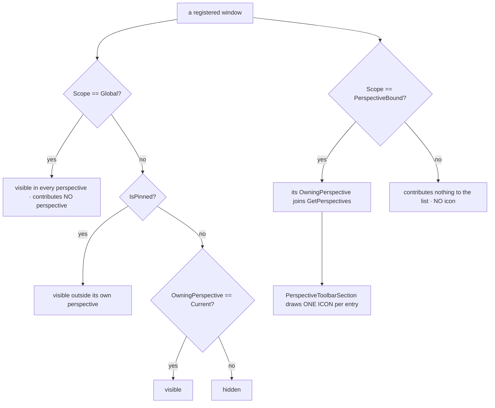
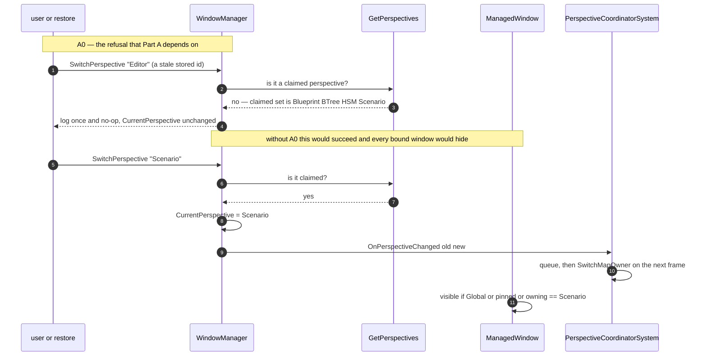

<!--STATUS
state: LIVE
build-state: SPLIT — §3 (Part A) is BUILT (2026-08-23, BP-488..BP-497); its as-built notes are inline and
  marked "AS-BUILT". §4 (Part B, CGF grows asset perspectives) is DESIGN: it lands feature by feature with
  the unification, and its first slice needs the freeze decision in §8.
updated: 2026-08-23
current-answer: the whole file. §3 is BUILT — read its AS-BUILT rows before re-deriving anything; §4 is the
  target it builds toward.
known-rot: three of MY OWN measurements in §1 were wrong and are corrected in place, each marked
  "CORRECTED (as-built)": the rename size (8 -> 21 perspective sites), the gizmo-follow row (the map was
  keyed by SUBSYSTEM name while read by PERSPECTIVE), and §5's sequence note listing Authoring/Analysis as
  claimed perspectives.
design-basis: PROGRAMME_Unification_And_Harness.md D1+D2 (user decisions, 2026-08-23) ·
  UX/UX_Glossary_Host_Mode_Subsystem.md (process · mode · subsystem · perspective — perspective is the
  finer key) · UX/UX_Feature_Perspective_Restore.md §3 (the unknown-id refusal, designed, never built).
known-conflict: none. §1b is the user-confirmed target model. ⚠ An earlier revision of this file claimed
  six editor perspectives (adding Authoring/Analysis); that was WRONG and is corrected in §1 — those two
  are never registered in production, so the glossary's four was right all along.
-->
# DESIGN — **the perspective model**, and unifying it across the editor and CGF

> ⭐⭐⭐ **This is THE perspective design doc.** It owns: what a perspective IS and how one comes to exist,
> which subsystem provides which, what "Global" means *(and does not)*, and the cross-host unification.
> ⛔ Handoffs **reference** this file; they do not restate it.

> ⭐⭐⭐ **Why:** conformance can only compare like with like. Today the editor shows
> `Editor · BTree · HSM · Blueprint` and a CGF-hosting runner shows `CGF`. ⇒ **nothing lines up**, and a
> cross-host check has to translate rather than compare. 📄 Charter **D1**/**D2**.

## 1. ⭐ INVENTORY — measured `2026-08-23` at `129e80505`

```bash
grep -rn "OwningPerspective\s*=" --include=*.cs Hrot/ FDP/           # who sets it: exactly ONE place
grep -rhoE ': base\("[^"]+", *"[^"]*", *"[A-Za-z]+"' --include=*.cs  # every perspective literal
grep -rn "CreateRegistrar(" --include=*.cs Hrot/ | grep -v Tests     # the asset-perspective factory calls
```

| fact | value |
|---|---|
| ⭐⭐ **`ManagedWindow(id, title, owningPerspective, scope)`** | the perspective is a **plain ctor string**; `OwningPerspective` is assigned in exactly one place *(`ManagedWindow.cs:141`)* |
| ⭐⭐⭐ **`GetPerspectives()` DERIVES the list** | distinct `OwningPerspective` over registered `PerspectiveBound` windows ⇒ ⛔ **no registry to extend, and an EMPTY perspective is not representable** |
| **visibility rule** | `Global \|\| isPinned \|\| OwningPerspective == currentPerspective` *(`ManagedWindow.cs:160-162`)* — plain string equality |
| ⚠⚠ **perspective literals in PRODUCTION** | `Editor` **8** · `ExCon` **7** · `IG` **5** · `SimHost` **2** · **`Authoring` 2** · **`Analysis` 2** · `Blueprint` **1** · `CGF` **4** *(multi-line registrations)* |
| ⛔⛔ **CORRECTED `2026-08-23` — `Authoring` and `Analysis` are NOT live perspectives** | ⚠⚠ **An earlier revision of this row claimed *"there are SIX editor-side perspectives, not four"* and that `GetPerspectives()` returns them. 🔴 THAT WAS WRONG.** 📐 Re-measured: **none of the four windows claiming them** *(`FakeAnimBackendInspectorWindow` · `UtilityDecisionWindow` · `ComparisonSummaryPanel` · `ComparisonSidebar`)* **has a production registration site** — the only hits are their own internal view-model construction. ⭐ `GetPerspectives()` derives from **REGISTERED** windows ⇒ ✅ **these two names never appear at runtime.** 📌 **The error's shape is the one this repo keeps paying for:** I read **constructor literals** as a claim about **runtime**. ⇒ user ruling `2026-08-23`: *"never ever used, it is safe to delete them"* — ⭐ and deletion needs **no re-homing**, because no perspective disappears from any live list |
| ⭐⭐ **the asset perspectives are created by a PARAMETERISED registrar** | `PerspectiveWorkspaceServices.CreateRegistrar(perspectiveName, …)`, called **three times** — `EditorSubsystem.cs:2688` *(BTree)*, `:2696` *(HSM)*, `:2748` *(Blueprint)*. ⭐ Its doc: *"binding each to … the correct `OwningPerspective` so each perspective remembers its own dock layout independently"* |
| **CGF's windows** | 4, all perspective `"CGF"` — `cgf_fdp_inspector` · `cgf_fdp_events` · `cgf_architecture_diagnostics` · `cgf_system_profiler`. ⚠ **All DIAGNOSTICS, none an asset editor** |
| ⛔ **CGF does NOT reference `Hrot.Editor.AiShared`** | it *does* reference `Hrot.Blueprints.Editor` ⇒ the blueprint asset editor is already reachable; the shared side-panels are not |
| **map ownership** | `perspectiveMap` *(`Program.cs:248-254`)* = `{IG, SimHost, ExCon, CGF, StrideMock}` → subsystem name, a `Dictionary<string,string>` ⇒ ⭐ **many perspectives → one subsystem is already the supported shape** |
| 🔴 **gizmo follow — CORRECTED (as-built, `2026-08-23`)** | ⛔⛔ **THIS ROW SAID *"keyed by perspective"*. THE FIELD'S DOC SAID SO TOO. THE CODE DID NOT.** 📐 `PerspectiveCoordinatorSystem` READS it with `evt.OldPerspective`/`evt.NewPerspective`, but `Program.cs` BUILT it from `((ISubsystem)s).Name`. ⭐ Invisible only because every perspective happened to be spelled like its subsystem — 📌 **the same coincidence class as `BP-485`'s address≡kind: a set of one-to-one names cannot demonstrate a keying rule.** ⇒ 🔴 **`A9` would have shipped a silent regression:** the lookup `["Scenario"]` misses a dictionary keyed `["CGF"]`, while `SwitchMapOwner` keeps working *(it takes the mapped VALUE)* ⇒ **the map still follows focus and the gizmo hand-over is dead.** ✅ **Fixed in `BP-496`:** the dictionary is now DERIVED from `perspectiveMap`, so the relation is declared once. ⭐ The switch still does `RemoveListener(outgoing)` then `AddListener(incoming)` |
| **persisted layout** | `layout/default/fdp_windows.json` names a perspective in **exactly one field** — `ActivePerspective` *(currently `"Blueprint"`)*; per-window entries are `IsOpen`/`IsPinned` only. `layout/default/imgui.ini` names **none** |
| 🔴🔴 **rename size — CORRECTED (as-built, `2026-08-23`)** | ⛔⛔ **THIS ROW SAID *"8 window registrations"* AND THAT WAS AN UNDERCOUNT: it is 21 PERSPECTIVE SITES.** 📐 The `8` came from a `: base("id", "title", "Editor", …)` grep, so it saw only `EditorWindows.cs`. ⚠ It MISSED **13** sites in `EditorSubsystem.cs` that pass the perspective as an ordinary ctor ARGUMENT or compare it: `FdpEntityInspectorWindow` · `FdpEventBrowserWindow` · `ArchitectureDiagnosticsWindow` · `SystemProfilerWindow` · `DataBreakpointManagerWindow` · the status-bar section's `perspective:` · `PerspectiveWorkspace(perspectiveName:)` · `DetailsWindow(owningPerspective:)` · `RegisterPerspectiveIconKey` · `RegisterPerspectiveLabel` · **two** `CurrentPerspective == "Editor"` gates · and 🔴 **`FdpEntityInspectorHelper.WireInspectorWithInspectContextMenu`'s third argument**, which was NAMED `ownerName` and documented as *"subsystem name shown in watch-window titles"* — 📐 both false: the titles never use it, and it is assigned to `Reflector.EditOwningPerspective` and passed as the spawned watch window's `owningPerspective`. ⇒ ⭐ **the counts that stand: 33 non-test occurrences, of which 21 are the perspective and 4 are subsystem/node/log names** *(the rest are comments)*; **45** test occurrences. 📌 **The lesson is this file's own:** a grep confirms a guessed SHAPE, it cannot enumerate a CONCEPT |

## 1b. ⭐⭐⭐ THE TARGET MODEL — **subsystem → perspectives** *(user-confirmed `2026-08-23`, measured against code)*

⭐⭐ **The rule: a subsystem provides ONE OR MORE perspectives. It used to be one-of-the-same-name, and the
editor already broke that pattern** *(it provides four today)*. ⇒ **CGF adopting four is following the
editor's precedent, not inventing a mechanism.**

| subsystem | perspectives | measured |
|---|---|---|
| ⭐ **editor** *(standalone)* | **`Scenario` · `BTree` · `HSM` · `Blueprint`** | 📐 today `Editor` + the other three ⇒ **a SINGLE rename**; the other three already carry the right ids |
| ⭐⭐ **cgf** | **the same four** — `Scenario · BTree · HSM · Blueprint`, and ⛔ **NO `CGF` perspective at all** | ⭐⭐⭐ **USER DECISION `2026-08-23`, superseding my "add, don't replace" lean:** *"once cgf gets all 4 perspectives, we should remove the cgf perspective completely. Maybe we should simply and immediately rename CGF perspective to the 'Scenario' perspective, and add the 3 others right away."* ⇒ **do it NOW, not at the end** — its four diagnostics windows move to `Scenario`. 📌 **§1e: the three need NO `perspectiveMap` entry and NO placeholder — they simply appear with their first window** |
| **simhost** | `SimHost` | 📐 2 windows |
| **ig** | `IG` | 📐 5 windows |
| **excon** | `ExCon` | 📐 7 windows |
| **replaybrowser** *(standalone)* | `ReplayBrowser` | 📐 confirmed — `string perspective = "ReplayBrowser"`, e.g. `rb_federation` |
| ⛔ **stridemock** | ✅ **REMOVED-AS-BUILT** *(`ST-014`…`ST-018`)* — user ruling `2026-08-23` | ⭐ Done as a **split-and-relocate**, per §1f: `StrideNodeBootstrapper` survives in the renamed **`Hrot.NodeComposition`**. ⚠ The `perspectiveMap` entry is the ONE piece deliberately left to the perspectives lane |
| ⭐ **orchestrator** | ⛔ **NONE** ✅ | 📐 **and the mechanism is explicit**: both its windows are `WindowScope.Global` with `OwningPerspective = string.Empty` ⇒ always visible, and `GetPerspectives()` *(which filters to `PerspectiveBound`)* never sees them |

### ⭐⭐ A consequence worth designing FOR, not around

⛔ **`editor` and `cgf` can never share a process** *(the runner throws if you combine them)*. ⇒ ⭐⭐⭐ **CGF's
asset windows may reuse the EDITOR'S WINDOW IDS verbatim**, because the two never co-exist. ⇒ two payoffs:
**① one layout file serves both hosts**, and **② the conformance diff can compare ADDRESS-for-address
(`PanelId`), not merely kind-for-kind** — 📌 which is strictly stronger than the `PanelKind` grouping the
withdrawn Batch A was designed around.
⚠ **The one constraint to respect:** `perspectiveMap` maps a perspective to **exactly one** subsystem, so two
**co-running** subsystems must never claim the same perspective name. 📐 Not a problem for any legal mode
combination today.

## 1c. ⛔⛔⛔ "GLOBAL" IS NOT A PERSPECTIVE — *(user ruling `2026-08-23`, from a visual check)*

> ⭐⭐⭐ **User, verbatim:** *"a new perspective ICON called 'Global' which i never asked for. The global
> perspective should have no icon, it is just place for windows that do not belong to any specific
> perspective but are available globally, pinnable to any other perspective."*

### ⭐⭐ The rule

| ⭐ | |
|---|---|
| ⭐⭐⭐ **A globally-available window is `WindowScope.Global` with an EMPTY `OwningPerspective`** | 📐 **the pattern already exists and is correct** — `OrchestratorWindow` / `DiagnosticsWindow` use `base(id, title, string.Empty, WindowScope.Global)` ⇒ always visible, and **invisible to `GetPerspectives()`**, which filters to `PerspectiveBound` |
| ⛔⛔ **"Global" must NEVER be an `OwningPerspective` VALUE** | it is a **scope**, not a place. ⭐ A window whose perspective is the *string* `"Global"` becomes a real perspective with a real icon |
| ✅ **the Windows MENU's "Global" group is CORRECT — keep it** | 📐 `WindowManager.cs:787-798` groups `WindowScope.Global` windows under the label `"Global"` in the Windows menu. ⭐ That is a **menu grouping**, not a perspective, and it is exactly the *"place for windows that do not belong to any specific perspective"* the user describes |

### 🔴 The defect this ruling names — **two bugs in one line**

📐 `EditorSubsystem.cs:2995-2998` registers the asset-browser Find-Results window as:

```csharp
// Global Asset Browser -- single instance, Global scope, shows Open-docs section.
var assetBrowserFindResults = new FindResultsWindow(
    idOverride:        "ai_asset_browser_find_results",
    owningPerspective: "Global");            // 🔴 the SCOPE was meant; the PERSPECTIVE was passed
windowManager.RegisterWindow(assetBrowserFindResults);
```

⚠ **The comment says *"Global scope"* — the intent was `WindowScope.Global`.** ⛔ But `FindResultsWindow`
hard-codes `WindowScope.PerspectiveBound`, so the string landed in the **perspective** slot:

| # | consequence | how it shows |
|---|---|---|
| **①** | ⭐ **a phantom perspective named `Global`** | `GetPerspectives()` returns it *(`WindowManager.cs:248`)* ⇒ `PerspectiveToolbarSection.cs:92` iterates that list and draws **an icon per entry** ⇒ **the icon the user never asked for** |
| **②** | 🔴 **and the window is NOT globally available** — the opposite of its intent | a `PerspectiveBound` window is visible only when its perspective is current ⇒ the asset browser's find-results is reachable **only from the phantom perspective** |

⭐ **Fix:** give it `WindowScope.Global` + an empty perspective *(the Orchestrator pattern)*. ⚠ That needs a
**scope parameter on `FindResultsWindow`**, which hard-codes `PerspectiveBound` today.

### ⚠ And the LATENT generator behind it — **remove the default, not just this call site**

📐 `FindResultsWindow`'s signature is `owningPerspective = null` → `?? "Authoring"`.
⇒ ⛔⛔ **any caller that omits the perspective silently invents one.** ⭐ Today no production caller omits it
*(`PerspectiveWorkspaceRegistrar.cs:286-287` passes `perspectiveName`)*, ⛔ **but that is luck, not a
control** — and `"Global"` is what the same shape looks like when it fires.
⇒ ⭐⭐ **Make `owningPerspective` REQUIRED.** A phantom perspective then becomes **unconstructible**, rather
than something a reviewer has to notice. 📌 The same reasoning as `CLAUDE.md`'s silent-default rule.

## 1d. ⭐⭐ THE PERSPECTIVES ARE STANDALONE — **absence is a legitimate answer** *(user, `2026-08-23`)*

> ⭐⭐ **User, verbatim:** *"note they are still standalone perspectives, and cgf can show (currently
> enabled) different set of windows than the editor so the snapshots taken from one perspective can find no
> corresponding data in the other perspective."*

⇒ ⛔⛔ **Sharing a perspective NAME does not mean sharing a window SET.** `Scenario` in the editor and
`Scenario` in CGF are **two independent workspaces** that happen to be comparable.

| ⭐⭐ the consequence for conformance — **this is the important one** | |
|---|---|
| ⛔⛔ **A two-way diff is WRONG.** *"Present in A, absent in B"* is **not** a divergence | it is the **expected** state for every feature not yet ported |
| ⭐⭐⭐ **The verdict must be THREE-way** | **SAME** · **DIFFERENT** · ⭐ **NOT-PRESENT-HERE** |
| ⛔⛔ **And `NOT-PRESENT` must be DECLARED, never inferred from absence** | ⚠ **otherwise a genuinely BROKEN panel reads as *"not implemented yet"* forever** — the exact false green this programme exists to prevent. ⇒ ⭐⭐ **this is what the capability manifest is for** *(charter `D4`)*: the host states what it offers, the harness asserts against the statement, and a panel that should be there and is not becomes a **failure** rather than a shrug |



## 1e. ⭐⭐ AN EMPTY PERSPECTIVE IS FINE — **and it needs neither a placeholder nor a map entry**

> ⭐⭐⭐ **User, `2026-08-23`, correcting me twice over:** *"why Many-to-one perspective? Makes little sense.
> Because we want to show the 'Btree not available yet'? no need. It is not wrong that at exists without
> windows. does not feel wrong. And the windows will come soon anyway."*

### ⛔ What I got wrong, and it was two things at once

| ⛔ my proposal | ✅ the correction |
|---|---|
| *"map all four CGF perspectives → the CGF subsystem"* — which I labelled **many→one** | ⛔ **Unnecessary, and the label oversold it.** `perspectiveMap` exists for ONE job: handing the **map canvas** to a subsystem when focus changes. ⭐⭐ **The three asset perspectives do not own a map** — they own a graph canvas — so 📐 **the editor's `BTree`/`HSM`/`Blueprint` are deliberately ABSENT from `perspectiveMap` today**, and CGF's should be too. ⇒ ⭐ **exactly ONE new entry: `Scenario` → `CGF`** |
| *"a declared-but-empty perspective needs a placeholder"* | ⛔ **No.** An empty perspective is **not a defect**, and the windows arrive shortly. ⚠ A placeholder would be UI invented to explain a transient state |

### ⭐⭐⭐ And the simplification that follows — **`DeclarePerspective` is NOT needed**

⭐ I had argued a declaration API did double duty: it would let an empty perspective exist **and** serve
§1d's *"`NOT-PRESENT` must be DECLARED"*. ⛔⛔ **The second half was wrong.** *"What this host offers"* belongs
to the **capability manifest** *(charter `D4`)* — that is its whole purpose. ⭐ An empty perspective is a weak
proxy for it, and using one as the signal would put host capability in the window manager.

⇒ ⭐⭐ **Decision: no declaration API.** `GetPerspectives()` keeps its single rule — **derived from registered
windows** — and CGF's `BTree`/`HSM`/`Blueprint` appear the moment their first window lands. ⛔ **One rule, not
a `declared ∪ derived` duality to keep consistent.**
⚠ **If the four icons are ever wanted visible before the windows exist, that is one small API away** — but
it buys visibility only, and nothing depends on it.

### ⭐ A risk I invented and have now removed

📐 `PerspectiveCoordinatorSystem.ProcessPendingEvents` does the gizmo transfer **and** `SwitchMapOwner`
**inside** `if (_perspectiveToSubsystemName.TryGetValue(...))`. ⇒ ⭐⭐ **an UNMAPPED perspective skips the whole
block** *(only `_currentPerspective` updates)*.
⇒ ⛔ **`§6-R1` (gizmo `Remove`→`Add` on the same controllable) and `§6-R2` (`SwitchMapOwner` re-firing) existed
ONLY because I proposed mapping all four.** ⭐ **With three unmapped, both are gone** — an intra-CGF
`Scenario → BTree` switch touches neither the gizmo listeners nor map ownership.
⚠ **The one behaviour to be aware of** *(not a defect — it is what the editor does today)*: switching straight
from `IG` to CGF's `BTree` leaves the map owned by whoever had it, because no entry fires.

## 1f. ⛔⛔ STRIDEMOCK — **remove the subsystem, but `StrideNodeBootstrapper` MUST SURVIVE**

> ⭐ **User, `2026-08-23`:** *"StrideMock is not needed anymore… we can remove whole subsystem (unless you
> find something great it provides we should keep)"*

⭐⭐ **There IS something.** 📐 Measured:

| finding | consequence |
|---|---|
| ⭐⭐⭐ **`StrideNodeBootstrapper` is used by the REAL Stride app** | `StrideHrotGame` holds one *(`:96`)*, exposes it *(`:103`)* and takes it via `AttachBootstrapper(...)` *(`:266`)*; `Hrot.Stride.Core.Tests/StrideGameReferenceTests` asserts it *"is resolvable"*. ⛔ **Deleting the project breaks the Stride port that just landed** |
| ⭐ It is a **node composition root**, not mock scaffolding | it wires ModuleHost scheduling, behavior, combat, gizmos, lifecycle, network spawning, orchestration, scenario, IG and SimHost systems |
| ✅ **`Hrot.Common` / `Hrot.Presentation` are NOT dependents** | 📐 their only mention is `InternalsVisibleTo Hrot.StrideMock.Tests` — trivially removable |
| ✅ **`Hrot.CGF` / `PanelIds` are NOT dependents** | 📐 comments only |
| ⭐ **`Hrot.Stride.Core` must NOT reference it** | a deliberate layering guard — `ReferenceGuardTests` enforces it ⇒ the dependency is confined to `HrotStrideApp.Game` |

⇒ ⭐⭐ **The removal is a SPLIT-AND-RELOCATE, not a delete:**
**①** move `StrideNodeBootstrapper` to a home the Stride app may reference; **②** then delete
`StrideMockSubsystem`, `FakeStrideEntity`/`Effect`/`Script`, `SyncFdpToStrideScript`, the `stridemock`
mode token, the `StrideMock` perspective and its `perspectiveMap` entry, `Hrot.FakeStrideApp`, and the two
`InternalsVisibleTo` grants.
⛔⛔ **Its own batch, not this one** — it is a project/reference change with a different blast radius from a
perspective rename, and bundling them would make one revert impossible.

### ✅ AS-BUILT *(`ST-014`…`ST-018`)* — 📄 the owning record is [`DESIGN_Stride_Port.md`](DESIGN_Stride_Port.md) §7

⛔⛔ **THIS SECTION'S RELOCATION LEAN WAS IMPOSSIBLE, and the strikeout matters more than the fix.** The
parenthetical above used to read *"lean: beside `SharedApplicationBootstrapper` in
`Hrot.Common.Infrastructure`, which is where the 'eliminating duplication across SimHost, IG and
StrideMock' comment already points"*. 📐 `StrideNodeBootstrapper` composes `Hrot.SimHost` and `Hrot.IG`
systems, and **both already reference `Hrot.Common`** ⇒ moving it there is a **project-reference CYCLE**.
⭐⭐ The comment points at the **base class**; it does not license moving the **concrete root**, which by
definition sits ABOVE the subsystems it composes. ⇒ ✅ `Hrot.StrideMock` was **renamed** to
**`Hrot.NodeComposition`** and gutted to that one type — same reference set, no new edge, valid home.

| step | as built |
|---|---|
| **①** relocate | ✅ `Hrot.NodeComposition` (renamed project, `git mv`). ⭐ Its tests came too — **22 of the 44 facts in `Hrot.StrideMock.Tests` test SURVIVING types**, so deleting that project wholesale (as `S2` said) would have dropped real coverage |
| **②** delete the mock | ✅ all five types, `Hrot.FakeStrideApp` + `.Tests`, solution **122 → 120** |
| the `stridemock` mode token | ✅ gone — from **6** sites, ⛔ **not the 4 the dispatch measured** *(`ST-015`)* |
| the two `InternalsVisibleTo` grants | ✅ both dropped |
| 🔴 **the `StrideMock` perspective + `perspectiveMap` entry** | ⛔ **NOT DONE — deliberately.** `Program.cs:256` was allocated to the parallel perspectives lane, which is editing that same dictionary literal. ⚠ **It was still present at the end of this batch** |

## 1g. ⛔⛔ THE FOUR DORMANT WINDOWS — **do NOT delete them; their features are LIVE**

⚠⚠ **I twice recommended deleting these and was wrong both times.** ⭐ The user's ruling *(`"Authoring` and
`Analysis` … never ever used, it is safe to delete them"*)* is about the **PERSPECTIVES**, and it is already
satisfied: 📐 neither name reaches runtime, so **nothing needs deleting.** ⛔ The **windows** are a different
question, and the measurement answers it the other way.

| window | 📐 measured | verdict |
|---|---|---|
| `ComparisonSummaryPanel` · `ComparisonSidebar` | ⭐⭐⭐ **the UI half of a 26-file feature** — `Comparison/` holds **19** files *(LLM response parser · export builder · sanitizer registry · migration adapter · companion-file discovery · stale-badge watcher · session state)* + **7** in `Comparison/UI/`. ⛔⛔ **AND ITS BACKEND IS WIRED INTO PRODUCTION:** `PerspectiveWorkspaceServices.CreateRegistrar` passes **`sanitizerRegistry`** and **`exportBuilder`** *(`:200-201`)* into **every** perspective's registrar | 🔴 **KEEP.** Deleting the panels would decapitate a feature whose backend every perspective already receives |
| `UtilityDecisionWindow` | 📐 lives in **`Hrot.Utility.Editor`** — a whole subsystem *(Catalog · Comparison · Curve · Emit · FieldEdit · Loading · Model · Preview · Tracing)* — which is **referenced by `Fdp.Toolkits`**, the highest-fan-in project in the repo | ⭐ **KEEP.** The window is dormant; the project it belongs to is anything but |
| `FakeAnimBackendInspectorWindow` | a debug inspector for the **Fake** animation backend, in `Hrot.MuscleCharacter.Animation.Fake` | ⚠ **probably obsolete now the real Stride animation backend landed** — ⛔ but that is a **Stride-cleanup** question, not a perspective one |

⇒ ⭐⭐ **This is the `ROUTE, don't DELETE` precedent exactly** *(`CLAUDE.md`: *"what is not used does not mean
it is existing without reason"*)*. ⭐ These are **built-but-unregistered UI**; if the features are wanted, the
fix is to **register them in a real perspective**, not to remove them. ⛔ **Out of scope for this design** —
filed here so the next reader does not repeat my mistake.

## 2. ⭐⭐ THE MECHANISM — how a perspective comes to exist

⭐⭐⭐ **A perspective is not declared anywhere. It exists because a window claims it.**

| step | |
|---|---|
| **1** | a window is constructed with `owningPerspective: "X"` and `WindowScope.PerspectiveBound` |
| **2** | `GetPerspectives()` now returns `X`; the toolbar/menu offer it |
| **3** | ⭐ *(cluster only)* `perspectiveMap["X"] = "<subsystem>"` makes `SwitchMapOwner` hand that subsystem the map |
| **4** | ⭐ *(optional)* `RegisterPerspectiveLabel("X", "Display Name")` and `RegisterPerspectiveIconKey` |

⇒ ⭐⭐ **Consequence for the whole programme: CGF's perspective list GROWS AUTOMATICALLY, feature by
feature, as each ported window lands with the right name.** ⛔ There is no "create the perspective" step to
schedule, and no half-built empty perspective to worry about.

## 3. ⭐⭐⭐ PART A — the rename *(✅ **BUILT** `2026-08-23`, `BP-488`–`BP-497`)*

> ✅ **AS-BUILT SUMMARY.** ⭐ Every item below landed; the per-item **AS-BUILT** notes record where the build
> DEVIATED from what this section said, and each deviation is a correction of MY measurement, not a
> shortcut. ⛔ **Read them before re-deriving anything here.**
>
> | item | ✅ | the deviation, if any |
> |---|---|---|
> | `A0` | `BP-488` + `BP-489` | ⚠ **two halves, and the second is bigger than described** — see `A0`'s AS-BUILT |
> | `A6` | `BP-490` | ⚠ **a SECOND silent-default site existed** *(the DI container)* — found only by the signature break |
> | `A5` | `BP-491` | none |
> | `A1` | `BP-492` | 🔴 **21 sites, not 8** *(§1's corrected row)*; and the `L6.1b` deferral's stated reason was FALSE |
> | `A2` | `BP-493` | none |
> | `A3` | `BP-492` | none — ⭐ confirmed **no migration**, as this section predicted |
> | `A4` | `BP-494` | ⭐ one rail INVERTED rather than deleted; ⚠ four unrelated rails needed a register-then-switch reorder |
> | `A9` | `BP-495` | 🔴 **`BP-496`** — the gizmo map's KEY *(§1's corrected row)* |
> | `A10` | `BP-497` | none |
> | `A7`/`A8` | — | ⛔ withdrawn before the build; nothing was done |

> ⭐ Charter **D2**: rename the editor's perspective **id** `Editor` → `Scenario`. Today `"Scenario"` is
> only a display **label** over the `Editor` id, so ids would not have matched across hosts.

### ⛔⛔ A0 — THE PREREQUISITE: `SwitchPerspective` must refuse an unknown id

📐 **Measured:** `WindowManager.SwitchPerspective` accepts **any** string, sets `CurrentPerspective`, and
fires. ⇒ after the rename, a developer's **own** stored layout still says `ActivePerspective: "Editor"`,
which selects a perspective **no window claims** ⇒ 🔴 **every `PerspectiveBound` window fails the visibility
gate and the UI comes up blank, with no error and no log line.**

⭐ `UX_Feature_Perspective_Restore.md` §3 already specifies the fix — *"Log and no-op instead of silently
hiding every bound window"* — ⛔ **and it was never implemented.** ⇒ **A0 builds it, and A1 does not start
until it is green.**

| A0 | |
|---|---|
| **do** | in `SwitchPerspective`, refuse a name not in `GetPerspectives()`: **log and no-op**. ⭐ Also make the restore path fall back to a valid perspective rather than trusting the file |
| **rail** | switch to `"NoSuchPerspective"` ⇒ `CurrentPerspective` **unchanged**, one log line, windows still drawn |
| ⚠ **lane** | `WindowManager` is `FDP/Engine/Fdp.Presentation` — **shared**. This is a deliberate, sanctioned edit *(it is A0's whole point)*, ⛔ not a drive-by |

#### ✅ AS-BUILT — `A0` is TWO items, and the second is the one that was already broken

⭐⭐ **`BP-488` — the refusal** is as specified, plus **log ONCE PER NAME**: the caller can be a per-frame
toolbar, and a refusal that floods the log is a refusal nobody reads.

⭐⭐⭐ **`BP-489` — the restore/default path**, and this sentence *(*"also make the layout-restore path fall
back"*)* undersold it. 📐 `LocalWindowController` validated the persisted value against **`ISubsystem.Name`**
and defaulted to `_subsystems.Skip(1).First().Name`. ⛔⛔ **A subsystem name is not a perspective:** for
`--mode all` that resolved to **`"Orchestrator"`**, which claims nothing ⇒ 🔴 **the 22-window blank first
launch** `UX_Feature_Perspective_Restore.md` documents — ⭐ **a defect that exists TODAY, independent of the
rename**, on the `demo` shorthand a new user runs first.

| ⚠ **THE ONE REAL DEVIATION, and it only bites after `A1`** | |
|---|---|
| 📄 `UX_Feature_Perspective_Restore.md` §1 says the DEFAULT is `known.FirstOrDefault()`, and excludes document-driven names from **RESTORE only** *(§2)* | ⛔ **Measured `2026-08-23`: that is wrong once the editor's id is `Scenario`.** 📐 `GetPerspectives()` is `OrderBy(p => p)` — **culture** comparison, not ordinal — so `--mode editor` sorts to **`[Blueprint, BTree, HSM, Scenario]`** ⇒ ⭐ a bare `known.First()` opens the editor in an **empty Blueprint graph**, the exact outcome that design exists to prevent |
| ✅ **As built:** document-driven names are excluded from **BOTH** halves, then composition order PREFERS one durable perspective over another *(preserving §1's "first requested subsystem that owns one" intent)*, then the first durable one wins | ⚠ **The order preference is now a PREFERENCE, not the rule** — after `A1` the editor's subsystem is `"Editor"` while its perspective is `"Scenario"`, so the name match legitimately finds nothing |
| ⭐ **New: `AssetKindExtensions.DocumentDrivenPerspectiveNames`** — the set §2 asked for | ⭐ **derived from `ToPerspectiveName()`**, so there is no second literal list to keep in step; ⛔ deliberately NOT "every `AssetKind`" *(`Blackboard`/`Utility` register no perspective, and `Scenario` is the durable one it protects)* |
| ⚠ **When only document-driven perspectives are claimed** | it returns `"Default"` — ⭐ which `SwitchPerspective` then refuses LOUDLY, rather than guessing an empty graph workspace silently |

### A1–A4 — the rename itself

| # | step | note |
|---|---|---|
| **A1** | rename the **id** at the 8 `"Editor"` window registrations → `"Scenario"` | ⛔ **per-site judgement**: of 33 non-test occurrences most are *not* the perspective *(subsystem name, mode token, type names)*. ⭐ The 8 `: base(…, "Editor", …)` sites are the perspective |
| **A2** | keep the **display label** working — `RegisterPerspectiveLabel("Scenario", "Scenario")` or drop the now-redundant alias | ⭐ the label mechanism already exists; the rename makes id and label agree for the first time |
| **A3** | update `layout/default/fdp_windows.json` **only if** the shipped default should open on Scenario | 📐 it currently says `"Blueprint"`, so **no migration is required** — ⛔ do not invent one |
| **A4** | follow the rename through the **44 test occurrences** | ⭐ several assert the perspective list; ⚠ **and any test asserting "four perspectives" is already wrong** *(§1)* — fix the count to the measured set, do not delete the assertion |

#### ✅ AS-BUILT — `A1`–`A4`

| ⭐ | |
|---|---|
| 🔴 **`A1` was 21 sites, not 8** | §1's corrected `rename size` row carries the enumeration. ⭐ The **4** subsystem/node/log-name occurrences are UNCHANGED — per-site judgement, as this section demanded |
| ⭐⭐⭐ **The `L6.1b` deferral was held on a FALSE premise, and it is worth naming** | 📐 `EditorSubsystem.cs`'s own remark said the rename was deferred because *"`CurrentPerspective` and every `OwningPerspective` are persisted and a bare rename silently resets saved layouts."* ⛔⛔ **Measured: `WindowManagerSettings` persists window IDS with `IsOpen`/`IsPinned`, and EXACTLY ONE perspective name — `ActivePerspective`.** `ManagedWindow.WindowInternalName` is `$"{Title}###{Id}"`, so the ImGui ini carries none either. ⇒ ⭐ **the rename orphans ONE string**, and `A0` is what handles it. 📌 The remark and the rail that pinned it are both corrected in place |
| ⭐ **A hidden perspective site: `FdpEntityInspectorHelper`** | its third parameter was `ownerName`, documented *"subsystem name shown in watch-window titles"* — 📐 **both halves false.** ⇒ renamed to `owningPerspective` with the measurement in its doc. ⚠ Consequence: the spawned watch windows' id prefix moves `editor_watch_*` → `scenario_watch_*` *(and `cgf_watch_*` → `scenario_watch_*`)* — **harmless, because those ids embed a fresh `Guid.NewGuid()` and were never restorable from a layout file** |
| ✅ **`A3` confirmed: NO migration** | the shipped `ActivePerspective` is `"Blueprint"`, rejected before *(no subsystem of that name)* and rejected now *(document-driven)* ⇒ ⭐ **the same landing, for a correct reason** |
| ⭐⭐ **`A4` — one rail INVERTED, not deleted** | `TheScenarioHost_UsesThePersistedEditorKey_BecauseL61bIsDeferred` existed to PIN the deferral. ⭐ It is now `TheScenarioHost_UsesTheScenarioKey` — same subject, same strength, value moved |
| ⚠⚠ **`A4` cost more than the rename: FOUR unrelated rails switched perspective BEFORE registering the window that claims it** | 📐 `WindowManagerTests` ×3 and `PerspectiveLabelTests` ×1 passed only because no check existed. ⇒ ⭐ **register-then-switch is now the order**, and that ordering IS `A0`'s rule showing through — a perspective cannot be selected before something claims it |
| ⭐ **New rails: `ThePerspectiveNamesAreUnifiedTests`** | drives the REAL `RegisterWindows` of both subsystems into a real `WindowManager` and asserts the SETS. ⛔ Not a source scan — 📌 that is §1's own *"I read constructor literals as a claim about runtime"* error |

### A5–A7 — the phantom perspectives *(added `2026-08-23` after the visual check)*

| # | step | design basis |
|---|---|---|
| **A5** | 🔴 **Kill the phantom `Global` perspective** — give the asset-browser Find-Results window `WindowScope.Global` + an **empty** `OwningPerspective` *(the Orchestrator pattern)*. ⚠ Needs a **scope parameter** on `FindResultsWindow`, which hard-codes `PerspectiveBound`. ⭐ **Two fixes in one**: the icon goes away **and** the window becomes globally available, which was its stated intent | **§1c** |
| **A6** | ⭐⭐ **Make `owningPerspective` REQUIRED on `FindResultsWindow`** — delete the `?? "Authoring"` default | **§1c**'s latent generator. ⛔ Without this, A5 fixes one call site and leaves the mechanism |

#### ✅ AS-BUILT — `A5`/`A6`, and §1c's *"that is luck, not a control"* was optimistic

⭐ **`A5` as specified** — `WindowScope.Global` + `string.Empty`, the Orchestrator pattern, with the scope
now a constructor parameter. ⭐ **Two separate rails**, because either bug could have been fixed while the
other survived: `GetPerspectives()` does not contain `"Global"`, **and** the window is visible from another
perspective.

⛔⛔ **`A6` FOUND A SECOND SITE, and only the signature change could have found it.** §1c says *"today no
production caller omits it — but that is luck, not a control."* 📐 It was not even luck:

```csharp
services.AddSingleton<FindResultsWindow>();      // SharedAiEditorServiceCollectionExtensions:77
```

⇒ ⭐⭐ **a DI registration resolving every argument to its default** — the generator firing in a second
place, unnoticed. ⚠ Harmless only because `AddSharedAiEditor` has **no production caller** *(measured:
tests only)*; it now passes the name explicitly.

⭐⭐ **Round-out beyond the item:** the ctor also REFUSES the two incoherent pairings — a
`PerspectiveBound` window with an empty perspective *(permanently invisible: it can never pass its own
visibility gate)* and a `Global` window that NAMES one *(merely misleading)*. ⇒ ⛔ **the phantom is
unconstructible in both directions**, not only when a caller forgets.
| ⛔ ~~**A7**~~ | ✅ **DISSOLVED `2026-08-23` — there is nothing to delete.** 📐 Neither name appears at runtime *(§1)*, so there is no perspective, no list entry and no icon to remove; the user's *"safe to delete"* is satisfied **by construction**. ⚠⚠ **And deleting the four dormant WINDOWS would be wrong — measured below** | **§1g** |

### A8–A9 — the CGF side of the NAMING *(added `2026-08-23`; the user's "immediately")*

⭐⭐⭐ **These belong in Part A, not Part B** — 📐 **they touch `CgfSubsystem`, `WindowManager` and
`perspectiveMap`, and NOTHING in `Hrot.Editor.AiShared`** ⇒ ⛔ **they are outside the freeze**, so the naming
unification does not have to wait on the freeze decision that Part B needs.

| # | step | design basis |
|---|---|---|
| ⭐⭐ **A8** | **`WindowManager.DeclarePerspective(name)`**, and `GetPerspectives()` returns **declared ∪ derived**. ⭐ Plus a **placeholder** for a declared-but-empty perspective — ⛔ never a blank screen | **§1e** |
| ⭐⭐ **A9** | **CGF: rename its perspective `CGF` → `Scenario`** *(its four diagnostics windows move with it)*, **declare `BTree`/`HSM`/`Blueprint`**, and update `perspectiveMap` so all four map to the `CGF` subsystem | **§1b** · **§1e** · charter **D1** |

⚠ **A9 makes `perspectiveMap` many→one for real** *(four names → `"CGF"`)* ⇒ ⭐ **measure §6-R1/R2 here**:
an intra-CGF switch now does `RemoveListener`→`AddListener` on the **same** controllable and re-fires
`SwitchMapOwner("CGF")`. ⛔ **If either has a side effect, that is a finding to report, not to paper over.**

#### ✅ AS-BUILT — `A9`, and the finding §1e's withdrawal walked past

⭐ **Built as specified:** CGF's four diagnostics windows moved to `Scenario`, `perspectiveMap["CGF"]` became
`["Scenario"] = "CGF"`, and `BTree`/`HSM`/`Blueprint` got **nothing** — no entry, no placeholder, no
declaration API, exactly as §1e rules. ⭐ It is now the **only** entry whose key and value differ; §1b's one
constraint holds because the runner refuses to combine editor and cgf.

🔴🔴 **THE FINDING — `BP-496`, and §1e's own withdrawal is what hid it.** §1e removed `R1`/`R2` on the
grounds that *"an UNMAPPED perspective skips the whole block"* — ⭐ **true, and it reasoned about the VALUE
side while the defect was on the KEY side.** 📐 `gizmoControllables` was keyed by `ISubsystem.Name` and read
by `evt.NewPerspective`. ⇒ after the rename `["Scenario"]` misses a dictionary keyed `["CGF"]`, so
**`SwitchMapOwner` keeps working and the gizmo hand-over dies silently.** ✅ Fixed by DERIVING the dictionary
from `perspectiveMap`. 📌 §1's `gizmo follow` row carries the correction; ⚠ **the withdrawal of `R1`/`R2`
still stands** — nothing here reinstates them.

⭐⭐ **Ordering inside Part A:** **A0 first** *(nothing else is safe without it)*, then **A6 before A5**
*(remove the generator, then fix the instance)*, then A1–A4, then **A9**.
⛔ **StrideMock removal is NOT in this batch** — §1f says why.

## 4. ⭐⭐ PART B — CGF grows the asset perspectives *(`DESIGN`)*

⭐⭐⭐ **The reuse vehicle already exists and is already parameterised by perspective name:**
`PerspectiveWorkspaceServices.CreateRegistrar("BTree", …)`. ⇒ **the unification is CGF calling it**, not a
reimplementation.

| what | status |
|---|---|
| ⭐ the registrar, per perspective | ✅ **exists**, one production factory, three calls today |
| ⛔ **CGF → `Hrot.Editor.AiShared` reference** | **absent** — the first real cost |
| ⛔ **`PerspectiveWorkspaceServices`' dependencies satisfiable in CGF** | ⚠ **unmeasured** — catalog, refactor service, debug registry, breakpoint manager, validators, live-value provider… ⭐ several are naturally absent in CGF *(charter **D3**: absent capabilities are tolerated and reported, not faked)* |
| ⭐ **`perspectiveMap` entries** | `{Scenario, BTree, HSM, Blueprint} → "CGF"` — additive, many→one already supported |
| ⭐ **`gizmoControllables` entries** | one per new perspective name, all pointing at CGF's controllable |

### ⭐ CGF keeps its diagnostics perspective — **add, do not replace**

📐 CGF's four existing windows are **diagnostics, not asset editors**. ⇒ ⭐⭐ **recommendation: CGF ends up
owning FIVE perspectives** — `Scenario · BTree · HSM · Blueprint` *(as features land)* **+ `CGF`** for the
diagnostics it already has. ⭐ The user anticipated exactly this: *"or in future maybe also other
perspectives, still belonging to the cgf."*
⇒ ⛔ **Nothing moves on day one**, `perspectiveMap["CGF"]` keeps working, and each asset perspective appears
the moment its first window lands.

## 5. ⭐⭐⭐ UML — Part A

```mermaid
classDiagram
    direction LR

    class ManagedWindow {
        <<exists · Fdp.Presentation/ImGui/WindowManager/ManagedWindow.cs>>
        +string Id
        +string OwningPerspective
        +WindowScope Scope
        +bool IsPinned
    }
    class WindowManager {
        <<exists · same folder · A0 EDITED THIS>>
        +string CurrentPerspective
        +GetPerspectives() IReadOnlyList
        +SwitchPerspective(name) void
        +RegisterPerspectiveLabel(p, label) void
        +IsPerspectiveActive(p) bool
        -HashSet refusedPerspectives
    }
    class LocalWindowController {
        <<exists · Hrot.ClusterRunner/Presentation · A0 EDITED THIS>>
        +ResolveStartupPerspective(claimed, order, persisted) string
    }
    class FindResultsWindow {
        <<exists · Hrot.Editor.AiShared/Windows · A5 A6 EDITED THIS>>
        +ctor(owningPerspective, idOverride, scope)
    }
    class AssetKindExtensions {
        <<exists · Hrot.Editor.AiShared/Identity · A0 ADDED A MEMBER>>
        +ToPerspectiveName(kind) string
        +DocumentDrivenPerspectiveNames IReadOnlyList
    }
    class PerspectiveWorkspaceServices {
        <<exists · Hrot.Editor.AiShared/Windows>>
        +CreateRegistrar(perspectiveName, ...) PerspectiveWorkspaceRegistrar
    }
    class PerspectiveWorkspaceRegistrar {
        <<exists · one per perspective>>
        +string PerspectiveName
        +RegisterExtraWindow(w) void
    }
    class PerspectiveCoordinatorSystem {
        <<exists · Hrot.ClusterRunner/Systems>>
        +string CurrentPerspective
        +ProcessPendingEvents() void
    }
    class EditorSubsystem {
        <<exists · calls CreateRegistrar 3x at 2688/2696/2748>>
    }
    class CgfSubsystem {
        <<exists · Part B adds registrar calls here>>
        +RegisterWindows(wm) void
    }

    WindowManager "1" *-- "many" ManagedWindow : owns
    ManagedWindow <|-- FindResultsWindow
    LocalWindowController ..> WindowManager : resolves the startup perspective
    LocalWindowController ..> AssetKindExtensions : which names are document-driven
    PerspectiveWorkspaceServices ..> PerspectiveWorkspaceRegistrar : creates per perspective
    PerspectiveWorkspaceRegistrar ..> ManagedWindow : registers with OwningPerspective
    EditorSubsystem ..> PerspectiveWorkspaceServices : BTree HSM Blueprint
    CgfSubsystem ..> PerspectiveWorkspaceServices : Part B
    WindowManager ..> PerspectiveCoordinatorSystem : OnPerspectiveChanged
```





## 6. ⚠ RISKS TO MEASURE — **before Part B, not before Part A**

| # | risk | the measurement |
|---|---|---|
| ~~**R1**~~ | ✅ **WITHDRAWN `2026-08-23`** — gizmo listener churn on an intra-CGF switch | ⛔ **It only existed because I proposed mapping all four perspectives.** 📐 An unmapped perspective skips the transfer entirely *(§1e)* ⇒ nothing to measure |
| ~~**R2**~~ | ✅ **WITHDRAWN `2026-08-23`** — `SwitchMapOwner` re-firing intra-CGF | ⛔ same cause, same removal. ⭐ Only `Scenario` is mapped, so the map path behaves exactly as it does for `IG`/`SimHost`/`ExCon` today |
| **R3** | ⚠ **`PerspectiveWorkspaceServices`' dependency set in CGF** | construct it in a CGF-shaped host and see what is genuinely absent ⇒ feeds charter **D3**/**D4** |

## 7. ⭐ WHAT THIS BUYS

| | |
|---|---|
| ⭐⭐ **conformance compares like with like** | same perspective name in both modes ⇒ ⛔ no id translation layer *(the thing the withdrawn Batch A was going to build)* |
| ⭐⭐ **the granular check the charter needs** | one feature = one perspective + one `PanelKind` ⇒ its golden moves alone |
| ⭐ **a blank-UI failure mode is closed** | A0 fixes a defect that exists **today**, independent of the rename |

## 8. ⭐⭐ SUB-QUESTIONS — **recommendation each; the user approves**

| # | question | ⭐ my lean |
|---|---|---|
| **51b-A** | Build **A0 before A1**? | ✅ **DECIDED (coordinator, `2026-08-23`) — yes.** ⭐ It is a **dependency, not a preference**: without it the rename can brick a developer's UI silently, so no ordering discussion is available |
| **51b-B** | CGF **adds** asset perspectives and **keeps** `CGF` for diagnostics? | ⛔⛔ **ANSWERED BY THE USER, against my lean: NO — remove `CGF` entirely, rename it to `Scenario` immediately, and declare the other three now.** ⭐ My "add, don't replace" reasoning *(the four windows are diagnostics, not asset-scoped)* was **outweighed**: a lingering `CGF` perspective is a name the editor will never have, so conformance would carry a permanent exception. ⇒ **§1b + A9.** ⚠ **My follow-on proposals were then BOTH cut back by the user** *(§1e)*: no `perspectiveMap` entries for the three, no placeholder, and **no declaration API** — an empty perspective is simply fine |
| ⭐ **51b-C** | Part B touches `Hrot.Editor.AiShared` — the **frozen** area *(`R-128`)*. Whose lane, and is the freeze still needed? | ⭐⭐ **SPLIT into two, and only the second is the user's:** **①** *who builds it* — ✅ **DECIDED (coordinator): the UI/variable lane**, which owns `AiShared` and is idle. ⭐ **The freeze says ONE session builds that area; it does not forbid the work** ⇒ routing is enough and **no freeze change is required.** **②** *is the freeze still needed at all* — ⛔ **the user's call**, and it turns on whether the unified variable-model programme is finished. ⚠ **I will MEASURE that before recommending** rather than guess |
| **51b-D** | Does Part A wait for the lanes to be idle? | ✅ **DECIDED (coordinator, `2026-08-23`) — no, and the question is moot: 📐 BOTH LANES ARE IDLE RIGHT NOW** *(verified by ancestry, not by claim)*. ⇒ ⭐ **dispatch immediately** — waiting only raises the chance a lane starts something that collides. ⚠ **Part B still waits** on `51b-C` |
| **51b-F** | ⭐ **`StrideMock`** keeps its own single perspective? | ⛔ **NO — user ruled the whole subsystem obsolete** *(the real Stride port superseded it)*. ⚠ **But it is not a clean delete: `StrideNodeBootstrapper` is load-bearing for the real Stride app** ⇒ **split-and-relocate, in its OWN batch** — **§1f** |
| ✅ **51b-E** | **`Authoring`** / **`Analysis`** | ✅ **CLOSED — no action needed.** 📐 Neither is live, so the deletion is already true. ⛔⛔ **And the four dormant WINDOWS must NOT be deleted** — §1g: the comparison feature's backend is wired into every registrar, and `UtilityDecisionWindow`'s project is referenced by `Fdp.Toolkits`. ⚠ **I recommended deleting them twice; both times I had not measured the backend** |
