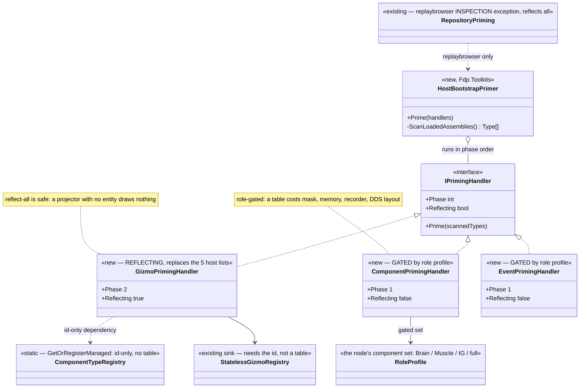
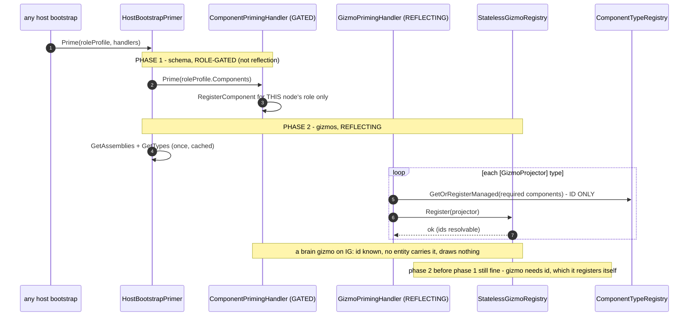

<!--STATUS
state: LIVE
build-state: READY-TO-BUILD
updated: 2026-08-24
current-answer: ⛔⛔ READ §2c FIRST — REVISED 2026-08-24 after the user surfaced the downsides of
  registering all COMPONENTS everywhere, and the coordinator MEASURED them true. The split: GIZMOS
  reflection-all (they are data-free — a projector with no entity draws nothing, and needs only the
  static component ID, not a repo table); COMPONENTS stay ROLE-GATED (a repo table costs TkbTemplate
  skip, SoD memory, recorder/save schema, and the sync mask — all measured). §3 is the revised design.
design-basis: 🔒 user 2026-08-24 (Option A) · 🔒 user 2026-08-24 (the downsides critique, §2c) ·
  Architect_Question_53 · Architect_Question_52 §0 · ComponentType.cs:119 (explicit [ComponentId]) ·
  ComponentType.cs:GetOrRegisterManaged (lazy/on-demand static registry) · StatelessGizmoSystem.cs:103
  (gizmo iterates by component-mask bit) · EntityRepository.Sync.cs:179 + AsyncRecorder.cs:326 (recorder
  reads the STATIC registry) · CombatTkbTranslator/BehaviorTkbTranslator (IsComponentTypeRegistered skip).
known-conflict: ⛔ §3's PRE-REVISION form ("component + event handlers by reflection, every host") is
  SUPERSEDED by §2c/§3 — components are role-gated, only the gizmo handler reflects. ⚠ ST-027's shipped
  MapSchemaPack (repo tables for 15 components on every host) is likely HEAVIER than needed and possibly
  a regression — §2d; the batch's item ⓪ measures it.
-->
# DESIGN — **reflection world-priming** *(one scan, pluggable handlers)*

## 1. ⭐⭐⭐ THE REQUIREMENT — **user, `2026-08-24`**

> 🔒 *"lets go option A (with proper design); unifying/sharing the reflection scan
> (component/gizmos/others…) across hosts; maybe one class with pluggable handlers of components, gizmos,
> various DTOs (all what we are now scanning using reflection)?"*

⭐⭐ **The shape:** ⛔ today each host hand-rolls its component registries **and** its gizmo family list, and
several *other* registration passes each do their **own** `AppDomain → GetTypes → filter-by-attribute`
scan. ⇒ ⭐⭐⭐ **ONE scan, offered to N pluggable handlers, called identically by every host** — a shared
bootstrap step, and the third leg *(after the perspective model and the preview rewind)* of *"unify the
host bootstrap heavily."*

## 2. INVENTORY — **the queries, and what they found**

| query run | total | result |
|---|---|---|
| `grep "AppDomain.CurrentDomain.GetAssemblies\|assembly.GetTypes()"` *(non-test, non-`obj`)* | **~40 sites** | ⚠ most are **editor / hot-reload tooling** *(node drawers, catalogs, `QuickReloadService`)* — ⛔ NOT host world-priming. ⭐ The **priming** scans are the attribute-driven registrations below |
| `grep "GetCustomAttribute<…Attribute>"` ranked | — | the attributes that **drive registration**: ⭐ `ComponentId` **10** · `EventId` **11** · `GizmoProjector` **9** · then `BlueprintRegistrar` · `TkbDescriptor` · `SharedAiAction` · `UtilityDecision` · `JsonDerivedType` |
| ⭐⭐⭐ **the mechanism already exists** | **1** | `Fdp.Toolkit.ReplayBrowser.Federation.RepositoryPriming.RegisterDiscoveredComponents` — reflects all loaded non-System assemblies, registers every `[ComponentId]` type **and** every `[EventId]` struct, handles `ReflectionTypeLoadException`, calls generic `RegisterComponent<T>` via `MakeGenericMethod`. ⭐ **`replaybrowser` boots this way** *(`ReplayBrowserSubsystem.cs:139`)* |
| ⭐⭐⭐ **component IDs are EXPLICIT** | — | `ComponentType.cs:119` — `[ComponentId]` **required for all types**, throws on a duplicate ⇒ **reflection is layout-safe across nodes** *(order/subset irrelevant to the bit index)* |
| ⭐⭐ **placement** | — | `RepositoryPriming` **and** the gizmo registries *(`GizmoRegistry`, `StatelessGizmoRegistry`, `GizmoSettingsRegistry`)* both live in **`Fdp.Toolkits`** ⇒ the primer + all three handlers share that one low home, **zero new edges**, reflecting **upward** at runtime |
| ⭐ **what the primer collapses** | — | the per-role registries *(`IgRole` · `Cognitive` · `Combat` · `MuscleRole` · `HrotSharedComponentRegistry`)* **and** the 5 hand-rolled gizmo lists **and** the `MapSchemaPack`/`MapGizmoPack` split of `Q52`/`ST-027` |

⚠ **Scope note — NOT everything reflected is world-priming.** ⛔ Editor node-drawers, hot-reload, blueprint
compiler stages and pickers *(`MontagePicker`, `MapPickable*`, `ImGuiRenderer`)* are their own tooling and
are **out of scope** — §6 lists what is in.

## 2c. ⛔⛔⛔ THE REVISION — **register-all is right for GIZMOS, wrong for COMPONENTS** *(measured `2026-08-24`)*

> 🔒 **User:** *"i asked about downsides of registering all components everywhere… if we keep a whitelist
> of components per subsystem and still register components as found globally via reflection, will it
> eliminate the downsides?"*

⭐⭐⭐ **The critique is CORRECT where it matters, and the coordinator verified every load-bearing claim
against the code** — ⛔ this is not accepted on persuasion; it is measured.

| # | claim | 📐 verified |
|---|---|---|
| **1** | **TkbTemplate skip uses `IsComponentTypeRegistered`** | ✅ `CombatTkbTranslator.cs:40/49/73` · `BehaviorTkbTranslator.cs:30-78` gate `apply` on `repo.IsComponentTypeRegistered<T>()`. ⇒ registering a server component on IG's repo makes IG **materialize** it |
| **2** | **`CreateFullMask` syncs ALL registered** | ✅ `ModuleHostKernel.cs:350-378` — a module with no explicit mask defaults to `CreateFullMask()` |
| **3** | **recorder/save read the STATIC registry, not the repo** | ✅✅ `EntityRepository.GetRecordableMask` *(`Sync.cs:179`)* and `AsyncRecorder.BuildSchemaManifest` *(`:326`)* both iterate `ComponentTypeRegistry.GetRecordableTypeIds()` — ⛔ **`GetRecordableMask` does not even intersect with the repo.** ⇒ **a repo whitelist CANNOT stop schema pollution** |
| **4** | **the static registry is LAZY/on-demand** | ✅ `ComponentTypeRegistry.GetOrRegisterManaged` — populated only when someone registers a type, **not** an attribute scan. ⇒ **gating genuinely controls the process-wide registry**; reflect-all pollutes it |
| **5** | **lazy assembly load ⇒ cross-node drift** | ⚠ plausible and consistent with #4 — a node that never loads an assembly never registers its types ⇒ two nodes' static registries differ ⇒ DDS layout-hash skew |

⇒ ⭐⭐⭐ **The whitelist HYBRID does NOT save it** — #3 and #5 are process-wide *(the static registry)*, unaffected
by a local repo whitelist. **The critique's own conclusion holds: components stay role-gated.**

### ⭐⭐⭐ BUT THE CRITIQUE CONFLATES COMPONENTS WITH GIZMOS — **and the asymmetry is PRINCIPLED**

📐 **Every downside is COMPONENT-specific.** A gizmo projector is **not** a component:

| 📐 measured | ⇒ |
|---|---|
| ⭐⭐⭐ **a gizmo needs only the static component ID, NOT a repo table** | `StatelessGizmoRegistry.Register` calls `ComponentTypeRegistry.GetId` *(`:73`)*; `StatelessGizmoSystem` iterates by the entity's **component-mask bit** *(`:103` `BitMask512.HasAll(compSG, rule.RequiredMask)`)*. ⇒ **no table, no `IsComponentTypeRegistered`, no TkbTemplate materialization, no SoD table** |
| ⭐⭐ **a projector matching no entity draws NOTHING** | the mask never matches ⇒ a query miss, nothing more |
| ⭐ **gizmos are not in the component mask / recorder / DDS layout** | ⇒ **none of downsides 1–5 apply to a gizmo** |

⇒ ⭐⭐⭐ **THE RULE:** register-all-by-reflection is **safe for GIZMOS** *(data-free; presence decides
drawing — the `Q52` ruling)* and **unsafe for COMPONENTS** *(a table costs memory, mask, recorder and
network layout)*. ⛔ **The asymmetry is not a compromise — it is the difference between a thing that costs
nothing when absent and a thing that costs on every node that registers it.**

| what | how it is primed |
|---|---|
| ⭐ **GIZMOS** | **reflection-all, every host** — the gizmo handler; its component dependency satisfied by the **static id only** *(`GetOrRegisterManaged`, id-only — NOT a recordable repo table on a host that does not simulate it)* |
| ⭐ **COMPONENTS + EVENTS** | **role-gated static group registries** — `HrotSharedComponentRegistry` *(all nodes)* · `Cognitive`/`Combat` *(Brain)* · `MuscleRole` *(Muscle)* · `IgRole` *(IG)* — ⛔ **NOT reflection.** These already exist and are the clean per-role subset |
| ⭐⭐ **`replaybrowser` = the INSPECTION EXCEPTION** | it reflects-all *(`RepositoryPriming`)* **on purpose** — a read-only host that must deserialize ANY recording, and never simulates or records ⇒ it genuinely wants the full registry. ⭐ This is *"data availability / host rules"*, exactly the `UXI-23` distinction |

## 2d. ⚠⚠ ST-027 EXPOSURE — **the shipped `MapSchemaPack` is heavier than the gizmo needs**

📐 `ST-027`'s `MapSchemaPack` does `world.RegisterComponent<T>()` for **15 components on every host** — a full
**repo table** *(recordable + saveable + `IsComponentTypeRegistered=true`)*, when §2c shows the gizmo needs
only the **static id**. ⇒ on IG/SimHost/CGF the brain-tier ones *(`BrainBlackboard`, `BehaviorState`,
`NavigationIntent`)* now:

| 🔴 | |
|---|---|
| **make `IsComponentTypeRegistered<BrainBlackboard>()` TRUE** on hosts that do not simulate a brain | ⇒ a TkbTemplate/translator path could materialize them — **MEASURE whether any runs on IG/SimHost** |
| **default to recordable/saveable in the static registry** | ⇒ **recorder/checkpoint schema pollution** on those nodes *(no `SetRecordable(false)`)* |

⚠ **Likely LATENT, not proven live** *(IG may run no behavior translator)* — ⛔ but it is the exact class of
bug §2c describes, in shipped code. ⇒ ⭐ **the batch's item ⓪ MEASURES it**, and the fix is *id-only for the
components a host does not simulate* — or fold `MapSchemaPack` into the gizmo handler's id-only dependency.

## 3. ⭐⭐⭐ THE DESIGN *(revised — see §2c)*

⛔⛔ **PRE-REVISION NOTE:** the items below originally converted **component + event** registration to
reflection too. 📐 §2c supersedes that: **only the gizmo handler reflects.** The primer + pluggable-handler
structure stays *(the shared bootstrap the user wants)*, but the **component/event handler is fed the node's
ROLE-GATED set, not a blind scan.** The unification is in the STRUCTURE, not in "reflect everything."

### 3.1 The shared bootstrap — one entry, handlers of two KINDS

| # | ⭐ |
|---|---|
| **①** | ⭐⭐⭐ **`HostBootstrapPrimer` is the ONE bootstrap entry every host calls.** It runs its handlers in phase order and, when any REFLECTING handler is present, does the `AppDomain`/`GetTypes` scan **once** and shares the cached type list — ⛔ not once per handler |
| **②** | ⭐⭐ **`IPrimingHandler` — two kinds:** ⭐ a **REFLECTING** handler *(offered every scanned type; claims by attribute)*, and ⭐ a **GATED** handler *(given an explicit type set; registers exactly it)*. ⛔ The primer is agnostic; the handler owns its source AND its sink |
| **③** | 🔴🔴 **PHASES — schema before declaration.** Component + event *(phase 1, GATED)* register the node's role subset **before** the gizmo handler *(phase 2, REFLECTING)* resolves projector ids against the static registry — 📌 `ST-020`. ⇒ the load-bearing order lives INSIDE the primer |
| **④** | ⭐⭐ **The gizmo handler's component dependency is ID-ONLY** *(§2c)* — it makes each required component's id resolvable via `ComponentTypeRegistry.GetOrRegisterManaged` **without** a repo table, so a host that does not simulate a component still satisfies the projector **without** the TkbTemplate/recorder cost of a table |
| **⑤** | ⭐⭐ **The uniform part is the STRUCTURE** — every host calls the same primer with the same **handler set**; the DIFFERENCE is the **role profile** handed to the component handler *(Brain / Muscle / IG / full-inspection)*. ⛔ That is *"data availability / host rules"*, the `UXI-23` distinction — ⚠ **NOT** "reflect everything" |

### 3.2 The handlers in this batch

| handler | kind | source | sink |
|---|---|---|---|
| ⭐⭐⭐ **`GizmoPrimingHandler`** | **REFLECTING** | every `[GizmoProjector]`, any assembly | `GizmoRegistry` · `StatelessGizmoRegistry` · `GizmoSettingsRegistry`; component ids via `GetOrRegisterManaged` **(id-only, §2c ④)** |
| ⭐ **`ComponentPrimingHandler`** | **GATED** | the node's **role profile** *(the existing `HrotShared`/`Cognitive`/`Combat`/`MuscleRole`/`IgRole` sets)* | `EntityRepository.RegisterComponent<T>` *(real table — this host simulates it)* |
| ⭐ **`EventPrimingHandler`** | **GATED** | the node's role profile | `FdpEventBus` |
| ⚠ **`replaybrowser` component handler** | **REFLECTING** *(exception)* | every `[ComponentId]`/`[EventId]` — `RepositoryPriming` as-is | the inspection repo |

⭐⭐ **Deferred handlers** *(§6)*: `BlueprintRegistrar`, `TkbDescriptor`, polymorphic DTOs — ⛔ not built; the
interface is the extension point. ⚠ **Each future handler must be classed REFLECTING or GATED by whether its
target costs per-node** — the §2c test.

## 4. ⭐⭐⭐ THE UML

### 4.1 Class view

### 4.2 Sequence — ⭐⭐ **gated components, reflected gizmos, and why the phase matters**

## 5. ⭐⭐ THE RAILS

| ⭐ | |
|---|---|
| 🔴🔴 **GIZMO COMPLETENESS — the load-bearing rail** | ⭐⭐⭐ **source-scan count vs runtime count for `[GizmoProjector]`**: grep the source, assert every projector is registered in **every mode**. ⛔ This is the static check the generated `RegisterAll` gave for free and reflection gives up ⇒ the substitute until aggregation restores the compile-time form. ⭐ Also catches the load-order risk *(a projector whose assembly a mode never loads)* |
| ⭐⭐ **COMPONENT NON-BLOAT — the NEW rail this revision demands** | ⛔⛔ **assert a MUSCLE/IG node's static registry does NOT contain brain-tier components as RECORDABLE tables** — 📌 the §2c downside made checkable. ⭐ e.g. `--mode ig`'s `ComponentTypeRegistry.GetRecordableTypeIds()` excludes `BrainBlackboard`/`BehaviorState`. ⛔ **A gizmo's id-only dependency must NOT show up here as recordable** — that is the §2d exposure, gated |
| ⭐ **cross-node layout identical** | 📐 `[ComponentId]` is explicit, so nodes with different role subsets still agree on every id. ⭐ Assert two modes' component→id maps agree on their intersection |
| ⚠ **COST — measure** | ⭐ report the mode-rail startup delta before/after — the gizmo reflection scan is the only new per-boot cost *(components are unchanged, still role-gated)* |
| ⭐ **the gizmo rails survive** | invariant `A` *(`GizmoSchemaFollowsDeclarationRails`)* holds; the gizmo-completeness rail is invariant `B` — one mechanism |

## 6. ⛔ BATCH SCOPE

| ⭐ in | ⛔ deferred / out |
|---|---|
| `HostBootstrapPrimer` + `IPrimingHandler` *(reflecting/gated)* in `Fdp.Toolkits` | ⛔ `BlueprintRegistrar` / `TkbDescriptor` / DTO handlers — pattern-ready, **not built** |
| the **gizmo** handler *(reflecting)* replacing the 5 hand-rolled gizmo lists | ⛔ editor node-drawer / hot-reload / picker scans |
| ⭐ the **component/event** handlers *(GATED — wrap the EXISTING role registries; ⛔ do NOT convert to reflection, ⛔ do NOT retire them)* | ⛔ `MapInteractionPack`'s non-gizmo half *(UXI-23)* |
| ⓪ **MEASURE + FIX the `ST-027` exposure** *(§2d)* — the 15 components' repo tables on hosts that don't simulate them ⇒ id-only, or folded into the gizmo handler | ⛔ aggregation *(§7 — backlog)* |
| the gizmo-completeness + component-non-bloat + cost rails | |

⚠ **`MapSchemaPack` (`ST-027`, shipped) is NOT simply "subsumed" — it is CORRECTED** *(§2d)*: its 15
`repo.RegisterComponent` calls become the gizmo handler's **id-only** dependency for the components a host
does not simulate. ⭐ The component-non-bloat rail proves the correction.

## 7. ⭐⭐ THE TRADE-OFF, AND THE AGGREGATION BACKLOG

⭐ **What reflection gives up:** the **compile-time** guarantee that every family is registered. A generated
`RegisterAll` fails to *compile* if a projector is malformed; the primer only fails at *runtime*, caught by
§5's completeness rail. ⇒ ⭐⭐ **the rail is the price of the simplicity** — cheap, but real.

🔒 **User, `2026-08-24`:** *"the aggregation to assemblies might get back the static checks we are giving
away with reflection, and reduces the number of projects, so it is still something to keep in the
backlog."* ⇒ 📌 **Recorded as a backlog item** *(reopening `Q51` on the CYCLE-TAX + static-check axis, not
the build-time axis it was declined on)*:

| ⭐ | |
|---|---|
| **why aggregation would restore the check** | fewer assemblies ⇒ more `[GizmoProjector]`/`[ComponentId]` types visible to a **single** compile unit ⇒ a compile-time `RegisterAll` could see them all without a cycle |
| **why it is not now** | large structural change; ⛔ `Q53 §3b` — **reflection does not block it**: an aggregated future turns `ReflectionPrimer` into an ordinary loop, or back into a generated registrar |
| **where** | 📄 `Architect_Question_51_Project_Consolidation.md` gains a §"reopened on the cycle-tax", and `PROGRAMME_Unification_And_Harness.md` §7 backlog |
