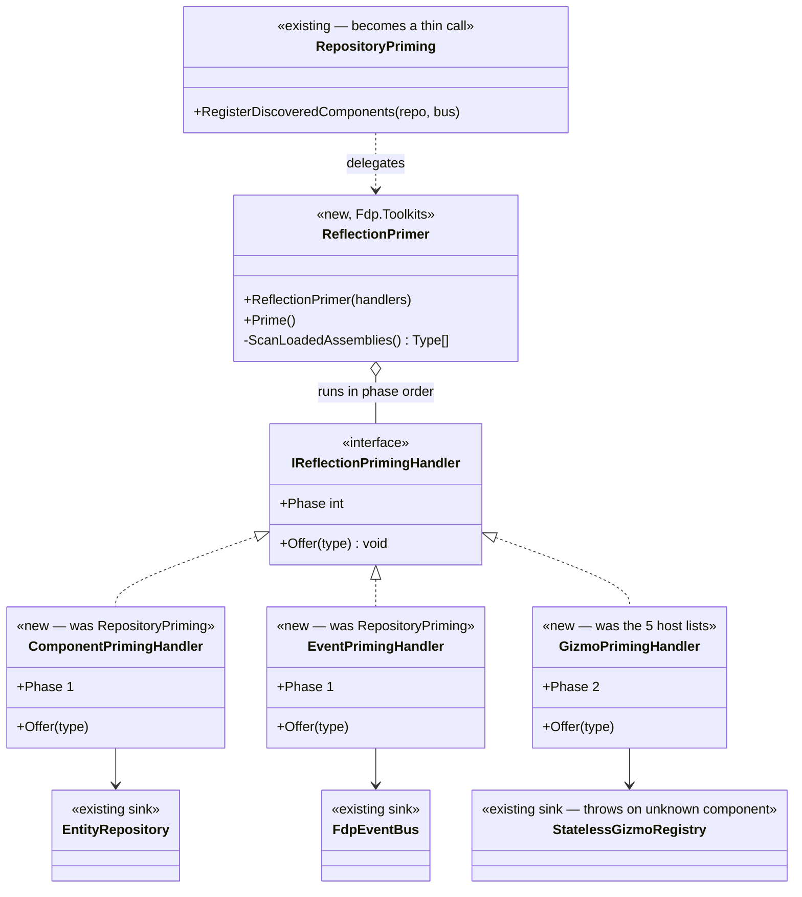
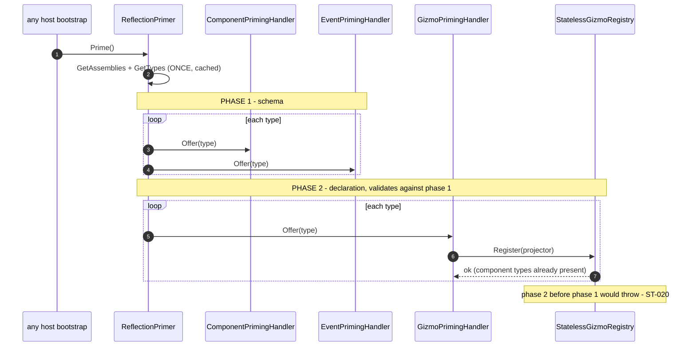

<!--STATUS
state: LIVE
build-state: READY-TO-BUILD
updated: 2026-08-24
current-answer: the whole file. §3 is the design — ONE reflection scan, N pluggable handlers, generalising
  the existing RepositoryPriming rather than paralleling it. §4 the UML, §5 the rails (the completeness
  rail is what buys back the static check reflection gives up), §6 the batch scope, §7 the trade-off and
  the aggregation backlog.
design-basis: 🔒 user 2026-08-24 (Option A approved: "one class with pluggable handlers of components,
  gizmos, various DTOs") · Architect_Question_53 §3b/§4 (the decision + why reflection is layout-safe) ·
  Architect_Question_52 §0 (support all, presence decides) · DESIGN_Uniform_Gizmo_Membership.md (the
  matrix this collapses) · ComponentType.cs:119 (explicit [ComponentId]) · RepositoryPriming.cs (the
  mechanism this generalises).
known-conflict: none. ⭐ This SUPERSEDES DESIGN_Uniform_Gizmo_Membership.md §3 ② (the compile-time
  MapGizmoPack) — the pack is now a reflection handler, not an assembly that references all families.
-->
# DESIGN — **reflection world-priming** *(one scan, pluggable handlers)*

## 1. ⭐⭐⭐ THE REQUIREMENT — **user, `2026-08-24`**

> 🔒 *"lets go option A (with proper design); unifying/sharing the reflection scan
> (component/gizmos/others…) across hosts; maybe one class with pluggable handlers of components, gizmos,
> various DTOs (all what we are now scanning using reflection)?"*

⭐⭐ **The shape:** ⛔ today each host hand-rolls its component registries **and** its gizmo family list, and
several *other* registration passes each do their **own** `AppDomain → GetTypes → filter-by-attribute`
scan. ⇒ ⭐⭐⭐ **ONE scan, offered to N pluggable handlers, called identically by every host** — a shared
bootstrap step, and the third leg *(after the perspective model and the preview rewind)* of *"unify the
host bootstrap heavily."*

## 2. INVENTORY — **the queries, and what they found**

| query run | total | result |
|---|---|---|
| `grep "AppDomain.CurrentDomain.GetAssemblies\|assembly.GetTypes()"` *(non-test, non-`obj`)* | **~40 sites** | ⚠ most are **editor / hot-reload tooling** *(node drawers, catalogs, `QuickReloadService`)* — ⛔ NOT host world-priming. ⭐ The **priming** scans are the attribute-driven registrations below |
| `grep "GetCustomAttribute<…Attribute>"` ranked | — | the attributes that **drive registration**: ⭐ `ComponentId` **10** · `EventId` **11** · `GizmoProjector` **9** · then `BlueprintRegistrar` · `TkbDescriptor` · `SharedAiAction` · `UtilityDecision` · `JsonDerivedType` |
| ⭐⭐⭐ **the mechanism already exists** | **1** | `Fdp.Toolkit.ReplayBrowser.Federation.RepositoryPriming.RegisterDiscoveredComponents` — reflects all loaded non-System assemblies, registers every `[ComponentId]` type **and** every `[EventId]` struct, handles `ReflectionTypeLoadException`, calls generic `RegisterComponent<T>` via `MakeGenericMethod`. ⭐ **`replaybrowser` boots this way** *(`ReplayBrowserSubsystem.cs:139`)* |
| ⭐⭐⭐ **component IDs are EXPLICIT** | — | `ComponentType.cs:119` — `[ComponentId]` **required for all types**, throws on a duplicate ⇒ **reflection is layout-safe across nodes** *(order/subset irrelevant to the bit index)* |
| ⭐⭐ **placement** | — | `RepositoryPriming` **and** the gizmo registries *(`GizmoRegistry`, `StatelessGizmoRegistry`, `GizmoSettingsRegistry`)* both live in **`Fdp.Toolkits`** ⇒ the primer + all three handlers share that one low home, **zero new edges**, reflecting **upward** at runtime |
| ⭐ **what the primer collapses** | — | the per-role registries *(`IgRole` · `Cognitive` · `Combat` · `MuscleRole` · `HrotSharedComponentRegistry`)* **and** the 5 hand-rolled gizmo lists **and** the `MapSchemaPack`/`MapGizmoPack` split of `Q52`/`ST-027` |

⚠ **Scope note — NOT everything reflected is world-priming.** ⛔ Editor node-drawers, hot-reload, blueprint
compiler stages and pickers *(`MontagePicker`, `MapPickable*`, `ImGuiRenderer`)* are their own tooling and
are **out of scope** — §6 lists what is in.

## 3. ⭐⭐⭐ THE DESIGN

### 3.1 One scan, N handlers

| # | ⭐ |
|---|---|
| **①** | ⭐⭐⭐ **`ReflectionPrimer` does the EXPENSIVE scan ONCE** — `AppDomain.GetAssemblies() → GetTypes()` over ~40 assemblies, System/Microsoft filtered, `ReflectionTypeLoadException`-safe — and caches the type list. ⛔ Today that scan is paid once *per* pass; the win is **one pass, many handlers** |
| **②** | ⭐⭐⭐ **`IReflectionPrimingHandler.Offer(Type)`** — each handler inspects a type, claims it if it carries the handler's attribute, and registers it into **its own sink.** ⛔ The primer knows nothing about components or gizmos; the handler owns its attribute **and** its target |
| **③** | 🔴🔴 **HANDLERS RUN IN PHASES — schema before declaration.** ⭐ Component + event handlers *(phase 1)* register the world's types **before** the gizmo handler *(phase 2)* validates projectors against them — 📌 `StatelessGizmoRegistry` throws on an unregistered component, exactly `ST-020`. ⇒ **the load-bearing order from `Q52`/uniform-gizmo now lives INSIDE the primer**, not in each host |
| **④** | ⭐⭐ **Generalise `RepositoryPriming`, do NOT parallel it** *(ruling 9)* — its component+event logic **becomes** the first two handlers; `RegisterDiscoveredComponents` stays as a thin call into the primer so `replaybrowser`'s existing site keeps working |
| **⑤** | ⭐⭐ **Every host calls the SAME primer with the SAME handler list** — the uniform bootstrap. ⛔ A host does not curate the handler list any more than it curates the gizmo families *(the `Q52` ruling, now structural)* |

### 3.2 The three handlers in this batch

| handler | claims | sink |
|---|---|---|
| ⭐ **`ComponentPrimingHandler`** | `[ComponentId]` | `EntityRepository.RegisterComponent<T>` |
| ⭐ **`EventPrimingHandler`** | `[EventId]` | `FdpEventBus` |
| ⭐ **`GizmoPrimingHandler`** | `[GizmoProjector]` | `GizmoRegistry` · `StatelessGizmoRegistry` · `GizmoSettingsRegistry` |

⭐⭐ **Deferred handlers, pattern-ready** *(§6)*: `BlueprintRegistrar`, `TkbDescriptor`, the polymorphic-DTO
set. ⛔ **Not built now** — the interface is the extension point.

## 4. ⭐⭐⭐ THE UML

### 4.1 Class view

### 4.2 Sequence — ⭐⭐ **one scan, phased dispatch, and why the phase matters**

## 5. ⭐⭐ THE RAILS — **the completeness rail BUYS BACK the static check reflection gives up**

| ⭐ | |
|---|---|
| 🔴🔴 **COMPLETENESS — the load-bearing rail** | ⭐⭐⭐ **source-scan count vs runtime count**: a test greps the source tree for `[ComponentId]`/`[EventId]`/`[GizmoProjector]` and asserts the primer registered **exactly that many** in **every mode**. ⛔ This is the guarantee the compile-time registrars gave for free and reflection gives up — 🔒 the user named it *("aggregation might get back the static checks we are giving away")* ⇒ **the rail is the substitute until/unless aggregation restores the compile-time form** |
| ⭐⭐ **LOAD-ORDER is the real risk** | reflection sees only **loaded** assemblies ⇒ a type whose assembly no host references transitively is **invisible**. ⭐ The completeness rail **catches exactly this** — a miss in some mode means that mode did not load that assembly ⇒ a load-order finding, ⛔ never an ignore-list |
| ⭐ **cross-node layout identical** | 📐 `[ComponentId]` is explicit, so two nodes priming different **loaded** subsets still agree on every registered bit index. ⭐ A rail asserts two modes' component→id maps agree on their intersection |
| ⚠ **COST — measure, do not assume** | 📐 `ST-027` showed the *schema* half is free; a full reflect-every-assembly at every boot is **not obviously** free ⇒ ⭐ report the mode-rail startup delta before/after |
| ⭐ **the gizmo rails survive** | invariant `A` *(`GizmoSchemaFollowsDeclarationRails`)* still holds; invariant `B` *(completeness)* is now **the primer's completeness rail** — one mechanism |

## 6. ⛔ BATCH SCOPE

| ⭐ in | ⛔ deferred / out |
|---|---|
| `ReflectionPrimer` + `IReflectionPrimingHandler` in `Fdp.Toolkits` | ⛔ `BlueprintRegistrar` / `TkbDescriptor` / DTO handlers — pattern-ready, **not built** |
| the 3 handlers *(component, event, gizmo)* | ⛔ editor node-drawer / hot-reload / picker scans — separate tooling |
| every host calls the primer; **retire** the per-role registries + the 5 gizmo lists + the `MapSchemaPack`/`MapGizmoPack` split | ⛔ `MapInteractionPack`'s non-gizmo half *(UXI-23 actions/selection/rubber-band)* |
| the completeness + cost + cross-node rails | ⛔ aggregation *(§7 — backlog)* |

⚠ **`MapSchemaPack` (`ST-027`, shipped) is SUBSUMED** — the component handler registers all `[ComponentId]`
types, of which the 15 it hand-lists are a subset. ⭐ Delete it once the primer covers them, and say so.

## 7. ⭐⭐ THE TRADE-OFF, AND THE AGGREGATION BACKLOG

⭐ **What reflection gives up:** the **compile-time** guarantee that every family is registered. A generated
`RegisterAll` fails to *compile* if a projector is malformed; the primer only fails at *runtime*, caught by
§5's completeness rail. ⇒ ⭐⭐ **the rail is the price of the simplicity** — cheap, but real.

🔒 **User, `2026-08-24`:** *"the aggregation to assemblies might get back the static checks we are giving
away with reflection, and reduces the number of projects, so it is still something to keep in the
backlog."* ⇒ 📌 **Recorded as a backlog item** *(reopening `Q51` on the CYCLE-TAX + static-check axis, not
the build-time axis it was declined on)*:

| ⭐ | |
|---|---|
| **why aggregation would restore the check** | fewer assemblies ⇒ more `[GizmoProjector]`/`[ComponentId]` types visible to a **single** compile unit ⇒ a compile-time `RegisterAll` could see them all without a cycle |
| **why it is not now** | large structural change; ⛔ `Q53 §3b` — **reflection does not block it**: an aggregated future turns `ReflectionPrimer` into an ordinary loop, or back into a generated registrar |
| **where** | 📄 `Architect_Question_51_Project_Consolidation.md` gains a §"reopened on the cycle-tax", and `PROGRAMME_Unification_And_Harness.md` §7 backlog |
