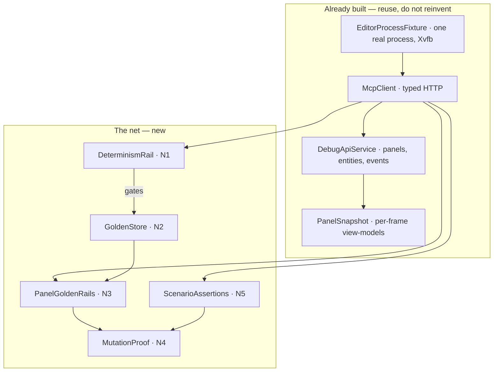
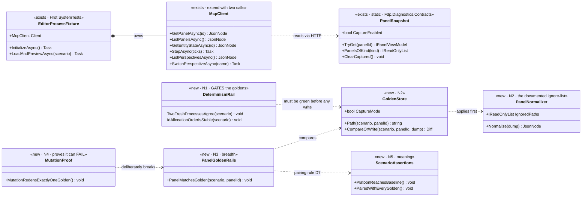
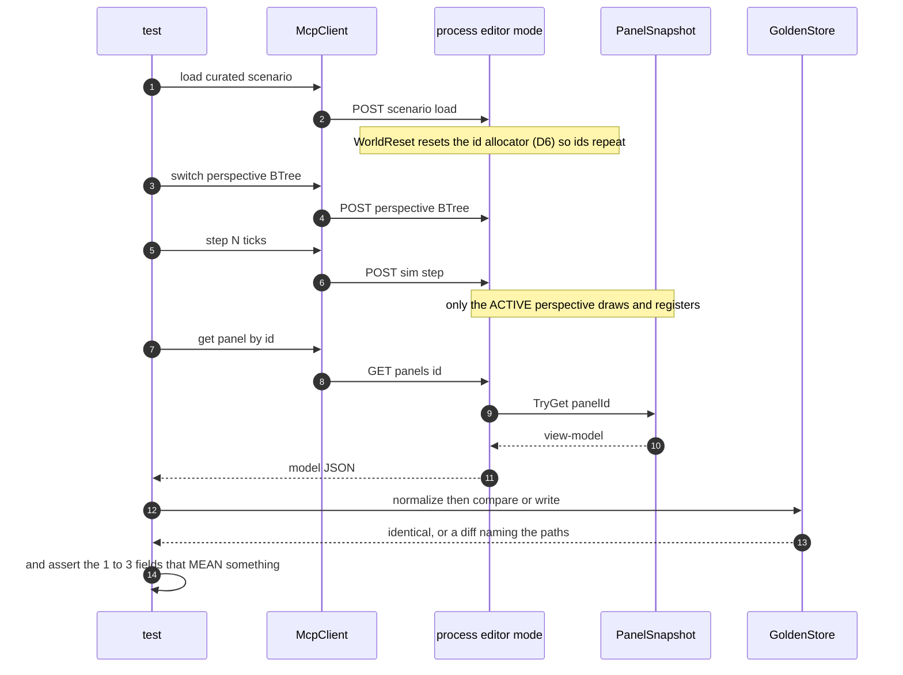

<!--STATUS
state: LIVE
build-state: BUILDING — `N0` is BUILT (2026-08-23, MX-012, plus HN-007/HN-008 found while building it);
  `N1`-`N6` are in flight. The UML is §5/§6, the items are §7, and §7's AS-BUILT rows carry what the build
  actually did.
updated: 2026-08-23
current-answer: the whole file. §4 is the decision that shapes everything (D7); §7 is what to build, in
  dependency order; §8 is the step that makes the net trustworthy rather than merely green.
design-basis: PROGRAMME_Unification_And_Harness.md §2 (the four jobs, user's words) · §3 steps 2–3 ·
  D5 (golden granularity) · D6 (deterministic network ids) · D7 (golden vs assertion, resolved with the
  user 2026-08-23) · TESTING_Harness_And_Goldens.md (the runbook this implements) ·
  DESIGN_Headless_Testability.md (the taxonomy) · DESIGN_UI_Observability_Snapshot.md (PanelSnapshot).
known-conflict: none. ⭐ §4b REFINES charter D5 (golden key: PanelId, not PanelKind) — a sharpening of the
  same granularity requirement, not a reversal. §9-R3 records that this design does NOT yet cover
  cross-host conformance; that stays in DESIGN_Headless_Testability.md.
known-rot: §2's inventory row "the frame boundary ... Fine here" was WRONG about the reader and is
  corrected in place (HN-007). It listed ClearCaptured() as an asset; measured, its ORDER relative to the
  API job drain made every HTTP panel read return an empty set.
-->
# DESIGN — **the regression net**: what protects the unification, and how we know it works

> ⭐⭐⭐ **The net's whole purpose:** the unification is a large internal refactor whose success criterion is
> *"nothing the user sees changed."* ⛔ `R-21` keeps human visual checks suspended, so that claim has to be
> **machine-checkable and headless** — or it is not a claim, it is a hope.

## 1. ⭐⭐ WHAT IT MUST DO — the four jobs *(charter §2, user's words)*

| # | job | which half of this design serves it |
|---|---|---|
| **①** | *"Capture how stuff works in editor mode"* | **N0–N2** — reach every perspective, prove determinism, store the baseline |
| **②** | *"Run a curated set of scenarios and assert the status"* | **N3** goldens *(breadth)* + **N5** assertions *(meaning)* |
| **③** | ⭐⭐ *"Check that this does not change as we proceed with the refactors"* | ⭐ **the goldens** — this is the job they exist for |
| **④** | *"Once the same feature is in CGF, check it works the same"* | ⛔ **NOT this design** — `DESIGN_Headless_Testability.md` owns conformance. ⭐ This net is its **prerequisite**: the editor-side baseline it will compare against |

⛔ **What this design is NOT:** cross-host conformance, the capability manifest, or anything CGF-side. ⭐ It is
**one host, deeply covered**, so that later comparison has something trustworthy to compare *to*.

## 2. ⭐ INVENTORY — measured `2026-08-23`

```bash
ls Hrot/Runner/Hrot.SystemTests/                              # 13 files, no Goldens/ directory
grep -rn "GOLDEN_CAPTURE" --include=*.cs .                    # the house convention, from EQS
grep -rn "perspectives" Hrot/Subsystems/Hrot.Editor/DebugApi/ # the endpoint: ABSENT
grep -rn "\.Reset(" --include=*.cs FDP/ Hrot/ | grep -v Tests # id-allocator resets: ZERO production callers
```

| exists? | piece | where |
|---|---|---|
| ✅ | **the subprocess harness** — boots the real binary headless under Xvfb, drives it over HTTP | `Hrot.SystemTests/` — `EditorProcessFixture` · `McpClient` · `ApiResult` · `SystemTestBase` |
| ✅ | existing rails to extend, not replace | `CapabilitySmokeTests` · `ScenarioBehaviorTests` · `PanelSnapshotTests` · `VariableAddressingTests` · `PreviewLifecycleRails` · `ShutdownRail` |
| ✅ | **the panel read surface** | `GET /panels` *(registered · captured · kinds · captureEnabled)* · `GET /panels/{id}` · `GET /panels/_gizmo` |
| 🔴🔴 | **the frame boundary — CORRECTED (as-built, `2026-08-23`, `HN-007`)** | ⛔⛔ **THIS ROW SAID *"Fine here"* AND IT WAS THE DEFECT THAT WOULD HAVE MADE EVERY GOLDEN VACUOUS.** 📐 `ClearCaptured()` does exist and is called once per frame — ⭐ but it ran **one line BEFORE** `_debugApiJobQueue.DrainAll()`, i.e. before the drain that executes every HTTP request. ⇒ 🔴 **every out-of-band reader saw an EMPTY captured set, always**, and `GET /panels/{id}` answered `null` for every panel. ⚠ The mechanism is an ORDERING, not a missing feature — which is why an inventory that asks *"does it exist?"* rated it ✅. ✅ **Fixed: the drain runs BEFORE the clear**, so a reader sees the previous COMPLETE frame. 📌 **This is design §3's first failure mode caught in the act** — a green suite over a dead read path — and it was found by baselining the harness before writing a golden, which is the order §8 asks for |
| ✅ | the two-set distinction the net depends on | `RegisteredPanels` *(instrumented at all)* vs `CapturedPanels` *(published this frame)* — ⛔ collapsing them is the false green `U1b` exists to prevent |
| ✅ | curated worlds | `hill-attack` · `test-fire` · `test-move` |
| ✅ | **the golden convention to reuse** | `EQS_GOLDEN_CAPTURE=1` ⇒ ⭐ **`PANEL_GOLDEN_CAPTURE=1`.** ⛔ Do not invent a second mechanism |
| ⛔ | **`GET /perspectives` + `POST /perspective`** | ⭐⭐ **the gap that blocks job ①** — without it only the default perspective's panels are reachable *(measured: ~11 of 47)*, so **the BTree, HSM and Blueprint panels cannot be captured at all** |
| ⛔ | **`Goldens/`** | nothing exists yet — the golden side is greenfield |
| ⛔ | **an id-allocator reset** | ⭐ `Reset` is implemented on **every** allocator and has **zero production callers** *(charter D6)* |
| ⛔ | **any proof a golden can fail** | 📌 and batches 94–101 are the reason to care: **not one defect** was caught by the ~8 000 existing regression tests |

## 3. ⛔⛔ THE FAILURE MODE THIS DESIGN IS BUILT AGAINST

⭐⭐⭐ **A green suite that encodes nothing is worse than no suite**, because it converts *"we have not checked"*
into *"we have checked."* Three concrete ways that happens here, each with a countermeasure:

| 🔴 the way it fails | ⭐ the countermeasure |
|---|---|
| **A golden nobody has ever seen fail** — possibly not even wired to an assertion | ⭐⭐ **N4, the mutation proof.** Break something on purpose; confirm exactly the expected golden reddens |
| **A golden re-blessed in bulk** to make a refactor pass | ⭐⭐ **D7's pairing** — every golden also carries assertions on the fields that *mean* something, so a bulk re-bless cannot silently change meaning |
| **A flaky golden**, quietly filtered out | ⭐⭐ **N1 first**: prove byte-identical dumps across two fresh processes **before** any golden is written. ⛔ `R-131` — a flaky test is a defect to fix, never to filter |

## 4. ⭐⭐⭐ D7 — **GOLDEN vs HAND-WRITTEN ASSERTION** *(resolved with the user, `2026-08-23`)*

### The distinction

| | **golden** *(snapshot)* | **assertion** |
|---|---|---|
| the expected value lives in | a **file** in git | the **test** |
| catches | ⭐ **any** field changing, including ones nobody thought of | only what you named |
| says, on failure | *"these 200 lines differ"* — you must interpret | *"expected 11, got 0"* — it states the defect |
| a legitimate change | goes **red**; someone must re-bless | stays green unless the claim itself broke |
| ⚠ rot resistance | **weak** — re-blessing is one env var away | **strong** — you must consciously edit the claim |
| cost | ⭐ **free to create, expensive to own** | expensive to create, **cheap to own** |
| it encodes | ⭐ **behaviour** — *this is what it did* | ⭐ **intent** — *this is what it must do* |

⭐⭐⭐ **The asymmetry that decides it:** during a refactor, behaviour and intent are different things. When a
golden reddens, **it cannot tell you whether the change was correct** — only that it happened. An assertion
can, because someone wrote down what was supposed to be true.

### ⭐⭐ THE DECISION — **both, for different jobs, and paired**

| ⭐ | |
|---|---|
| **GOLDEN answers *"did anything change?"*** | job ③, refactor safety. ⭐ Right precisely because you do **not** know in advance which field a refactor might disturb |
| **ASSERTION answers *"is it right?"*** | jobs ① and ② — and it is the only thing that **survives a re-bless** |
| ⭐⭐⭐ **THE PAIRING RULE** | **every panel with a golden ALSO gets 1–3 assertions on the fields that carry meaning.** ⇒ a re-bless may change the noise but ⛔ **cannot silently change the meaning** — the assertion still fires. ⭐ This is the cheap fix for goldens' one real weakness |

📌 **The worked example is this week's own defect.** Hill-attack: params silently zeroed, the platoon drove to
`(0,0)`, **every rail green** *(`R-132`)*.
- a **golden** of the entity dump would have reddened — ⚠ *if one had existed before the regression*, and it
  regressed via `DEBT-AIB-021` back in Batch 70, so a bulk re-bless was entirely plausible;
- an **assertion** — *"the platoon approaches the computed baseline, not the origin"* — would have failed
  loudly and been **un-blessable** without confronting the claim.

### ⭐ Which one, per panel — **the rule of thumb is FIELD COUNT and SEMANTIC DENSITY**

⛔ **Not the panel's importance.**

| the panel dumps | use |
|---|---|
| **3–10 meaningful fields** *(a preview state, a stance, a status)* | ⭐ **assertions only.** A golden adds noise and an owner |
| **a large derived structure** *(a variable table, a node tree, 200 rows)* | ⭐ **golden** — you could neither write nor maintain 200 assertions — **plus** the 1–3 assertions the pairing rule requires |

⚠⚠ **The trap to name:** *"free to create"* is seductive with ~48 instrumented panels. ⛔ **That is exactly
how a repo ends up with 150 golden files nobody reads, all re-blessed in bulk the first time someone touches
a panel base class.** ⇒ ⭐⭐ **the golden count is a DELIBERATE BUDGET, never a byproduct of instrumentation
coverage.**

### 4b. ⭐ REFINEMENT of charter **D5** — the golden key is **`PanelId`**, not `PanelKind`

⭐ D5's requirement is *"one feature's change moves one file."* ⚠ But **a kind can appear in several
perspectives** — 📐 `PanelSnapshot.PanelsOfKind`'s own doc: *"three perspectives can each host a `watch`"* —
so `PanelKind` is **not a unique key** within one host.
⇒ ⭐⭐ **`PanelId` gives the same granularity and is unambiguous**, and the perspective design established
that ids are **stable and reusable across hosts** ⇒ the same key serves the later conformance diff.
⭐ **`PanelKind` keeps its job: the CONFORMANCE GROUPING key.** ⛔ Not the storage key.

**Layout:** `Hrot.SystemTests/Goldens/<scenario>/<panelId>.json`

## 5. ⭐⭐⭐ THE ARCHITECTURE







## 6. ⭐⭐⭐ THE CAPTURE PROTOCOL — **A CONTRACT, NOT ADVICE** *(hardened by `HN-007`, `2026-08-23`)*

> ⛔⛔ **UPGRADED FROM CONVENTION TO CONTRACT.** ⚠ This section used to read as good practice — *"the switch
> takes effect on the next frame"* — and a reader could skip the step and usually get away with it.
> 📐 **`HN-007` measured why they cannot:** the API's main-thread job queue drains **at the top of the
> frame, BEFORE the panels draw.** ⇒ ⭐⭐⭐ **an out-of-band reader NEVER sees the frame it is inside; it
> sees the PREVIOUS one.** ⛔ **Act, step a tick, then read is now the only correct order** — skipping the
> step does not merely risk staleness, it reads a different frame than the one the action affected.

| step | ⭐ why it cannot be skipped |
|---|---|
| `POST /perspective {name}` | ⭐⭐ **a panel publishes only when its DRAW runs, and only the active perspective draws** ⇒ without this, 3 of the 4 editor perspectives are invisible. ✅ Built as `N0` *(`MX-012`)* |
| ⭐⭐⭐ `POST /sim/step {ticks:N}` | ⛔⛔ **MANDATORY, not a settling courtesy.** The switch takes effect on the next frame AND the reader is served before that frame's panels draw ⇒ **two reasons, both structural.** 📌 `McpClient.SwitchPerspectiveAndSettleAsync` exists so no test has to remember |
| `GET /panels/{id}` | now captured. ⚠ **`null` means "nothing captured"** — ⭐ ask `registered` to learn whether it is *not instrumented* or *did not draw*. ⛔ Those are different findings |

### ⛔⛔ The consequence `N1` must respect

⭐⭐ **A same-frame read returns the EMPTY PREFIX of the current frame.** ⇒ 🔴 **two such reads would diff as
"identical" and prove nothing** — a determinism rail built on them would be green and vacuous, which is
design §3's failure mode wearing the costume of a success. ⭐ **Every capture `N1` diffs must come after a
step.**

## 7. ⭐⭐ THE ITEMS — **dependency order, and N1 gates everything after it**

| # | item | depends on | done when |
|---|---|---|---|
| ✅ **N0** | **`GET /perspectives` + `POST /perspective {name}`** on the DebugApi, over the existing `WindowManager.GetPerspectives()` / `SwitchPerspective` / `CurrentPerspective`. ⛔ **Validate the name and 400 with the list** | ⚠ **`A0`** *(the perspectives batch's unknown-id refusal)* — ⭐ it makes this validation a two-line delegation instead of a reimplementation | ✅ **BUILT `2026-08-23` — `MX-012`.** See the AS-BUILT below |
| 🔴🔴 **N1** | ⭐⭐⭐ **THE DETERMINISM RAIL — before any golden exists.** ① wire the **id-allocator reset** on `WorldResetEvent` *(charter **D6**, and mind its four caveats)*; ② load one scenario in **two fresh processes**, step the same N, and diff **the whole id→entity mapping and every captured panel dump** | N0 | **byte-identical**, twice, in fresh processes. ⛔ **If not: find the source and FIX IT** — 📌 the causes to expect are float formatting, dictionary order, wall-clock stamps and spawn order. ⛔⛔ **Do NOT reach for normalisation to hide non-determinism** *(D6 caveat ①)* |
| ⭐ **N2** | **`GoldenStore` + `PanelNormalizer`.** `PANEL_GOLDEN_CAPTURE=1` writes, else compares. `Goldens/<scenario>/<panelId>.json` *(§4b)*. ⭐ The ignore-list is **explicit, documented and SHORT** | N1 green | a deliberate one-field change produces a diff **naming the JSON path**, not a wall of text |
| ⭐⭐ **N3** | **The first slice of goldens** — ⛔ **a budget, not a sweep** *(§4's trap)*. ⭐ Lean: **`hill-attack` × the four editor perspectives × only the large-dump panels**, each paired per **D7** | N2 | every golden has its pairing assertions; **the count is stated in the report**, with what was left out and why |
| 🔴🔴 **N4** | ⭐⭐⭐ **THE MUTATION PROOF — §8.** ⛔ Without it the net is unproven | N3 | for each mutation: **exactly** the expected golden/assertion reddens, everything else stays green — **reported as a table** |
| ⭐⭐ **N5** | **Behaviour assertions on the curated scenarios** — `/entities/{id}/state`, `/events`, `/breakpoints/hits`. ⭐ **First case: the `R-132` defect** — *the platoon approaches the computed baseline, not the origin* | N0 | that assertion **fails** on a tree with `ApplyResolverOverlay` reverted, and passes now — ⭐ **state both results** |

### ✅ AS-BUILT — `N0` *(`MX-012`)*, and the seam decision worth not re-litigating

| ⭐ | |
|---|---|
| ⭐⭐⭐ **NO SECOND SEAM.** `IPerspectiveSwitcher` *(`Hrot.Editor.AiShared/Documents/`)* was EXTENDED with `GetPerspectives()` and `CurrentPerspective` | 📐 It already existed, already wrapped the `WindowManager`, and was already constructed at `EditorSubsystem.RegisterWindows:2471` — **the only moment the window manager exists.** ⭐ One production implementor, no test fakes ⇒ extending it broke nothing and `AiDocumentManager` compiled unchanged. 📌 The seam law again: *"we need a shared X"* meant X existed and was under-adopted |
| ⚠⚠ **THE DEPENDENCY ARRIVES LATE, AND THAT IS FORCED** | 📐 `DebugApiService` is constructed in `Initialize` (~`:1767`); the window manager does not exist until `RegisterWindows` (`:2451`). ⇒ ⛔ **a constructor parameter is not available to be passed** — `AttachPerspectives(...)` is the only shape. ⚠ **That is the silent-default shape**, so two controls: the call sits on the line AFTER the switcher is constructed *(not in a later block a refactor can drift away from)*, and a rail asserts the **REACH**, not the wiring |
| ⭐ **Validation delegated, status codes split** | `503` = *not wired* *(a composition-root defect)*; `400` = *that perspective does not exist*, **with the claimed set named in the message.** ⛔ Collapsing them would make a wiring defect read as a bad request |
| ⭐⭐ **The reach, measured** | **Scenario 12 · BTree 9 · HSM 7 · Blueprint 13** captured; **11 panels reachable only from Blueprint** *(`ai_*_blueprint` + `entity-blueprints`)*. ⇒ ⭐ §2's *"~11 of 47 reachable"* is closed, and **`N3` should spend its budget ACROSS perspectives** |
| ⭐⭐ **The rail asserts a SET DIFFERENCE** | ⛔ Three weaker forms would each pass on a broken build: *"the switch returned 200"* *(`A0` no-ops silently)*, *"current changed"* *(a perspective can change without drawing)*, *"captured is non-empty"* *(the previous perspective's capture satisfies it)*. ⚠ It checks non-identity, ⛔ **not disjointness** — `WindowScope.Global` and pinned windows appear in every perspective by design |

## 8. ⭐⭐⭐ N4 — **HOW WE PROVE THE NET WORKS** *(charter step 3's "make sure the harness works")*

> ⭐⭐ **A golden nobody has ever seen fail is indistinguishable from one that is not wired up.**

| ⭐ the method | |
|---|---|
| **①** | **In a scratch commit, mutate one thing** — change one field a panel publishes; flip a boolean; drop a row from a table |
| **②** | **Run the net.** ⭐ Confirm **exactly** the expected golden reddens and **everything else stays green** — ⛔ a mutation that reddens 40 files means the goldens are coupled to something they should not see, which is itself the finding |
| **③** | **Revert.** ⛔ The mutation never merges — ⭐ the **report** is the artefact |
| **④** | ⭐⭐ **Do the same for one ASSERTION** — and, best of all, **for the `R-132` defect**: revert the resolver-overlay fix and confirm N5's baseline assertion fires |

⭐⭐ **Report it as a table: mutation → what reddened → was that expected.** ⛔ **A net with no mutation table
has not been shown to work**, and this programme has the tally to prove that matters: batches 94–101,
**zero** defects caught by ~8 000 existing regression tests.

## 9. ⚠ RISKS & OPEN QUESTIONS — **recommendation each**

| # | | ⭐ lean |
|---|---|---|
| **R1** | 🔴 **N1 may fail** — dumps may not be deterministic even with the id reset *(spawn order, iteration order, float formatting)* | ⭐ **That is a SUCCESS of the design, not a setback** — it is exactly what N1 exists to discover, at the cheapest possible moment. ⛔ The wrong response is normalisation; the right one is fixing the source |
| **R2** | ⚠ **Golden volume creep** — ~48 instrumented panels × 3 scenarios | ⭐⭐ **N3 is a budget.** Start with ONE scenario and only large-dump panels; **widen only when a widening is asked for** |
| **R3** | ⚠ This design covers **one host**. Cross-host conformance is `DESIGN_Headless_Testability.md`'s | ⭐ **Correct as scoped** — ⛔ and the conformance verdict must stay **three-way** *(same · different · not-present-here)* with absence **declared** via the capability manifest, never inferred |
| **R4** | ⚠ **The net's own flakiness budget is ZERO** — `R-131`: a crashing or flaky test is a defect to resolve, never to filter around | ⭐ If a golden flakes, **delete it or fix its source in the same batch**. ⛔ Never `[Skip]` |
| **R5** | ⚠ **Who owns it** | ⭐ the **harness lane** *(`HN-` ids, tracker Area J)* — it owns `Hrot.SystemTests` and the DebugApi. ⛔ Not the UI or backend lane |
| **Q1** | Should N5's behaviour assertions live beside the goldens or in `ScenarioBehaviorTests`? | ⭐ **extend `ScenarioBehaviorTests`** — it exists and is already the home for *"did the world do the right thing"* |
| **Q2** | Do we snapshot `/panels/_gizmo` too? | ⚠ **not in the first slice.** It is a 64-byte union projected per shape ⇒ a high-churn dump for low early value. ⭐ Revisit once the map/gizmo parity work starts |
