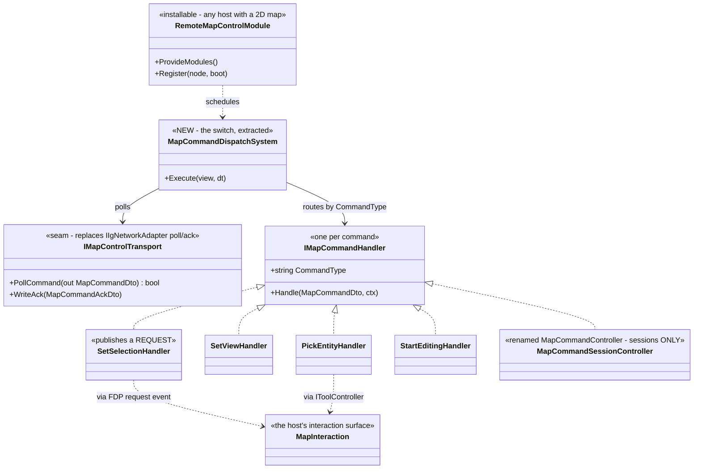
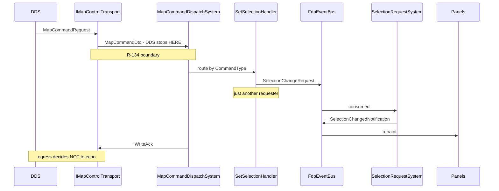

<!--STATUS
state: LIVE
build-state: READY-TO-BUILD (§4 is the target; §6 the slice order. Nothing is built yet.)
updated: 2026-09-10
current-answer: §3 is the AS-IS (an inline switch in IgApplication), §4 the TARGET (an installable
  module, present by configuration), §5 the constraints that shaped it, §6 the slices.
design-basis: user rulings 2026-09-10 (§2) · docs/SNAPSHOT_Map_Interaction_Architecture.md §3 (the
  measured AS-IS) · docs/UX/UX_Feature_Selection.md §2.6/§2.7 (selection is host-local; remote control
  is just another requester) · docs/DESIGN_Map_Rendering_And_Interaction.md (the layer reference) ·
  RULINGS R-134 (network is strictly separated; the translator is the sole boundary) · R-141 (an unused
  capability is the natural outcome of sharing, never a per-host decision).
verified: 2026-09-10 — every AS-IS claim measured from source, file:line inline.
known-conflict: none. ⚠ The dispatcher role is claimed by MapCommandController's HEADER but not by its
  code; §3.2 measures what that class actually does, and §4.2 says which half it keeps.
-->
# DESIGN — remote map control as an installable module

> **Owns:** the *remote map command dispatcher* — how a map-control message from the network reaches a
> host's interaction surface. **Does NOT own:** the interaction surface itself *(no owning design yet —
> `SNAPSHOT_Map_Interaction_Architecture.md` §5.2 item A)*, selection *(`UXI-11`)*, or tools *(`UXI-07`)*.

---

## 1. INVENTORY *(the enumeration this design is built on)*

```
search_graph(project="home-user-HROT", name_pattern=".*MapCommand.*", detail="ids", limit=60)
  → total: 54   has_more: false
```

⭐ **The production surface it returned**, separated by layer:

| layer | symbols |
|---|---|
| **wire (DDS)** | `MapCommandRequest` · `MapCommandAck` *(`Hrot.Network.NED.MapMessages`)* |
| **boundary DTO** | `MapCommandDto` · `MapCommandAckDto` *(`Hrot.Core.Network.Commands`)* |
| **transport seam** | 🔴 **`IIgNetworkAdapter.PollMapCommand` / `.WriteMapCommandAck`** — ⚠ the name is **IG-specific**; `NedIgNetworkAdapter` + `NullIgNetworkAdapter` implement it |
| **ExCon side** | `IExConEgressWriters.WriteMapCommand` *(6 impls incl. 5 nulls)* · `NedMapCommandAckIngressHandler` · `ExConLogic.ProcessMapCommandAcks` |
| **the only handler class** | `MapCommandController` *(`Hrot.IG.Systems`)* — ⚠ **sessions, not dispatch**; see §3.2 |
| ⛔ **the dispatcher** | **no symbol** — it is a `switch` inside `IgApplication` |

---

## 2. The rulings this design implements

| # | 🔒 user, `2026-09-10`, verbatim | consequence |
|---|---|---|
| **1** | *"only the IG host should be supporting remote map control via network because this was never required for other hosts"* | ⭐ today's scope is correct **as a deployment fact** |
| **2** | *"From the unification perspective, the remote map control should be possible for all nodes having the 2d map"* | ⇒ ⛔ **not an IG capability — a MAP capability** |
| **3** | *"the remote map command dispatcher should rather be a separate module installable on any host having 2d map, and maybe present just on IG node"* | ⭐⭐ **present by CONFIGURATION, not by code shape** — 🔒 `R-141` |
| **4** | *"Wiring the remote map command to host-internal entity selection global storage will then be just one of many other responsibilities … Nothing special."* | ⇒ the dispatcher is **just another requester** *(`UX_Feature_Selection.md` §2.7 rule 2)* |
| **5** | *"even this one needs to be translated to fdp events"* | 🔒 `R-134` — the DDS type stops at the translator |

---

## 3. AS-IS — measured `2026-09-10`

### 3.1 The dispatcher is a `switch`, not a class

📐 `IgApplication.cs:1120-1160` — a `switch (cmdDto.CommandType)` with `CMD_START_EDITING` ·
`CMD_PICK_LOCATION` · `CMD_PICK_ENTITY` · `CMD_SET_SELECTION` · `CMD_SET_VIEW` ·
`CMD_DRAW_PERSONAL_ROUTE`, each calling a private `ParseCommandAndX` on `IgApplication`.

⇒ ⛔ **IG-only by construction**, and untestable except through the whole host.

### 3.2 `MapCommandController` is a SESSION controller

⚠ **Its header claims the dispatch role; its code does not implement it.**

| measured | |
|---|---|
| public surface | `ActivatePlacementCommand:185` · `BeginAreaAuthoringSession:276` · `OnAreaEntityCreated:294` · `OnAreaToolCancelled:318` · `OnCreateEntityAck:340` + 3 status codes |
| what it owns | **entity-creation SESSIONS** *(placement, area authoring)* with request↔ack correlation |
| session state | `_sessionRequestId` · `_sessionContextId` · `_toolFinished` · `_activePlacementId` ⇒ **one at a time** |
| ⭐ **IG-specific?** | ⛔ **only by namespace and wiring** — deps are host-neutral *(`MapCanvas`, `FdpEventBus`, `Action<MapCommandAckDto>`, `long`, `GlobalGizmoManager?`)*; one construction site, `IgApplication.cs:863` |
| ⭐ **DDS-coupled?** | ⛔ **NO** — every `Hrot.NED.Messages` reference is a **doc comment** *(`:20`,`:66`,`:84`,`:168`)*, none in code. `R-134`-clean |

### 3.3 The two defects the AS-IS carries

| 🔴 | |
|---|---|
| **selection is written directly** | `ParseCommandAndSetSelection` → `SelectEntityOnMap:1596-1614`, a **third hand-rolled `SetSelected`**: clears `SelectionState` on every entity in a loop, sets the target, and hand-syncs `_fdpInspectorState.SelectedEntity` + `_fdpLastMapSelection` |
| **echo suppression in the wrong place** | its own doc: *"without publishing a `SelectionChangedEvent` (to avoid ExCon→IG→ExCon echo loops)"* ⇒ ⛔ under `UX_Feature_Selection.md` §2.7's protocol that leaves **every local panel stale** |

---

## 4. TARGET

### 4.1 The classes



### 4.2 What each piece becomes

| piece | |
|---|---|
| ⭐⭐ **`MapCommandDispatchSystem`** | the extracted `switch` — polls the transport, routes by `CommandType` to a handler. ⛔ **stateless** |
| ⭐ **`IMapCommandHandler`** | one per command; a host installs the set it can service. ⛔ An absent handler **REPORTS unserviceable** *(ruling 49 / the drain's pattern)*, never silently no-ops |
| ⭐⭐ **`MapCommandSessionController`** | `MapCommandController` **keeps its session half** and becomes one handler among many. 🔒 **Its state must NOT leak into dispatch** — §5.1 |
| ⭐ **`RemoteMapControlModule`** | the installable unit. Contributed per host; ⭐ **installed only on IG today, by configuration** |
| 🔴 **`IMapControlTransport`** | replaces `IIgNetworkAdapter.PollMapCommand`/`WriteMapCommandAck` — ⚠ **the current name is the IG-specificity**, and it is the only structural blocker to installing this elsewhere |
| ⛔ **`SelectEntityOnMap`** | **deleted.** `SetSelectionHandler` publishes the §2.7 request event; the owner applies it |

### 4.3 The flow



---

## 5. Constraints

### 5.1 ⛔⛔ Session state must stay out of dispatch

📐 Selection and view are **stateless one-shots**; placement and area authoring are **stateful
single-session** and guard `_sessionContextId`. ⇒ 🔴 **folding the stateless cases into a class that
guards a session id is how a selection command gets silently refused because a placement session is
open** — the same silent-refusal shape as `CE-259q`. ⭐ Hence dispatch is a separate, stateless system and
the session controller is *one handler*.

### 5.2 `R-134` — the boundary is the transport

⭐ `MapCommandDto` is the last network-shaped type; **no handler sees a DDS type**. ⚠ `MapCommandController`
already satisfies this *(§3.2)* — the target keeps that property rather than introducing it.

### 5.3 `R-141` — present by configuration

⛔ **Do not gate the module on a per-host justification.** A host with a 2-D map may install it; that it is
installed only on IG today is a deployment choice, not a design boundary.

### 5.4 What this design does NOT decide

⛔ the interaction surface's own ownership *(no owning design — snapshot §5.2 item A)* · whether ExCon's
DTO-to-logic ingress is an `R-134` shape *(unmeasured — what its two `FdpEventBus` instances carry)* ·
the Stride hosts' 2-D map surface *(not measured)*.

---

## 6. Slices

| # | slice | gate |
|---|---|---|
| **D-1** | rename `MapCommandController` → `MapCommandSessionController`; ⛔ **Roslyn rename only** *(`CLAUDE.md`: never a text replace)* | its 2 test classes stay green |
| **D-2** | introduce `IMapControlTransport`; point `NedIgNetworkAdapter` at it | `NullIgNetworkAdapter` still satisfies it |
| **D-3** | extract the switch into `MapCommandDispatchSystem` + `IMapCommandHandler` per command, moving `ParseCommandAndX` bodies out of `IgApplication` | a rail per command type; **an absent handler REPORTS** |
| **D-4** | `RemoteMapControlModule`; IG installs it | IG behaviour unchanged end-to-end |
| **D-5** | ⛔ **AFTER `UX_Feature_Selection.md` S-2**: `SetSelectionHandler` publishes the request; **delete `SelectEntityOnMap`** | the third hand-rolled `SetSelected` is gone |
| **D-6** | move echo suppression to the egress translator | a remote selection change **repaints local panels** *(the §3.3 defect closes)* |

⚠ **D-1..D-4 are independent of the selection programme; D-5 and D-6 are not.**

---

## 7. Sources

`IgApplication.cs:863`, `:1120-1160`, `:1596-1614`, `:2160-2172`, `:2942-2976` ·
`MapCommandController.cs:20`, `:66`, `:84`, `:120`, `:168`, `:185`, `:276`, `:294`, `:318`, `:340` ·
`MapMessages.cs:103`, `:106`, `:121` · `Commands.cs:117` · `ExConLogic.cs:359-377` ·
`NedExConIngressTranslators.cs:67-77` · `MapInteractionContext.cs` *(`ContributeExtras`)*.
