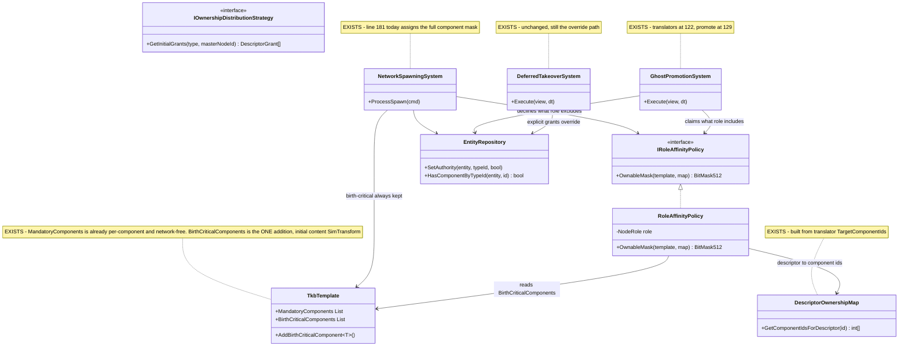
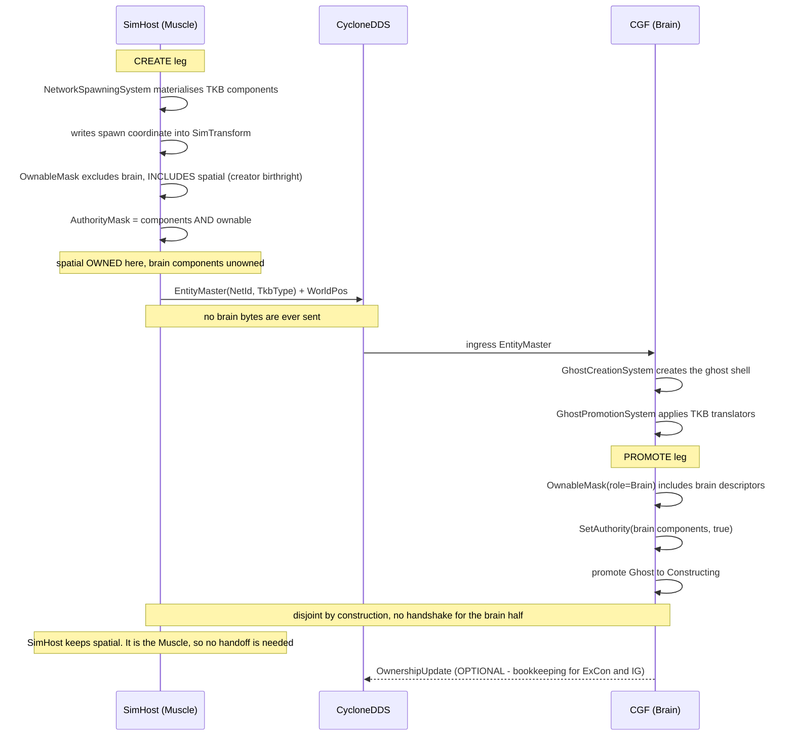
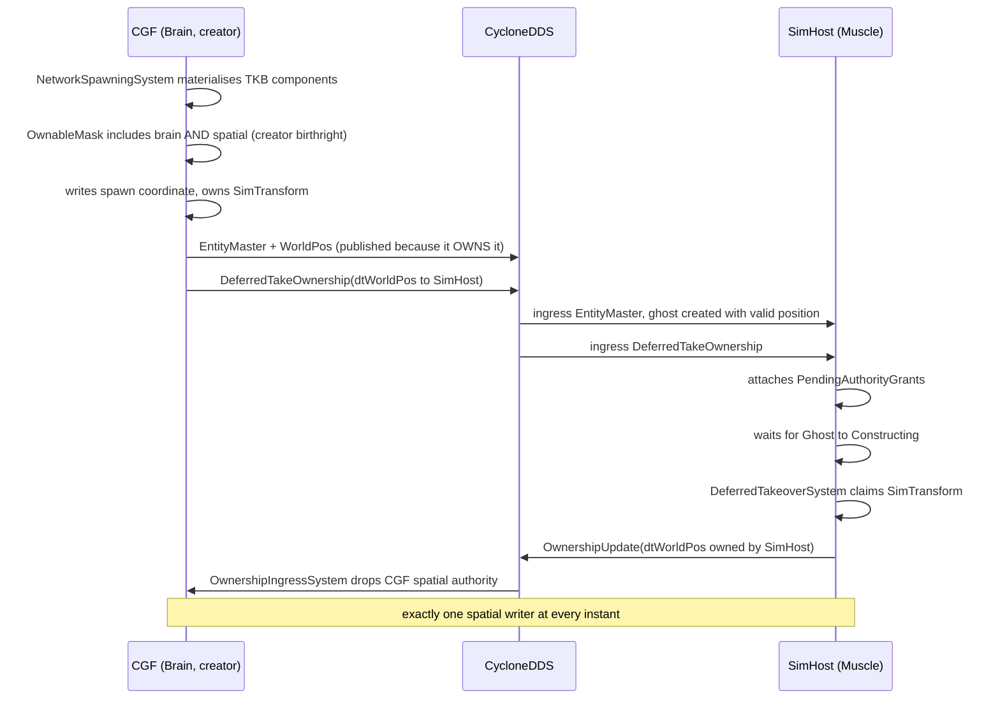

<!--STATUS
state: LIVE
updated: 2026-09-01
build-state: READY-TO-BUILD
current-answer: §3 is the design; §4 carries the UML; §5 holds the open decisions, each with a lean.
  Nothing here is built yet.
stale-below: nothing.
known-rot: §3.1's FIRST draft (2026-09-01, same day) applied ONE symmetric rule to every descriptor.
  That was WRONG and is corrected in place: it would have made a Brain creator produce SimTransform
  unowned, so the spawn position could never be published. §3.1 now carries two categories -- creator
  birthright for birth-critical spatial state, role affinity for defaultable cognitive state. Any
  reader finding a single-rule formulation outside that section has found rot.
open-risk: §3.5 -- BTreeTickSystem's query carries NO authority filter, so declining authority does
  not stop a node ticking a brain. Until step 3b lands, the rest of this design gates replication
  only. Do not mark this design BUILT while §3.5 is open.
known-conflict: Architect_Question_65 §4's Q65-B and §5.3's CE-142 both describe ownership as
  something a CREATOR delegates outward via DeferredTakeOwnership. This design does not retire that
  path -- explicit grants still win -- but it makes the DEFAULT declarative and local, which removes
  the need for a grant in the common case. Read §3.4 before quoting either as "the" mechanism.
design-basis: docs/blueprints/RULINGS.md R-138 (fully distributed, ownership per-component and
  transferable, NodeRole is a convention) - docs/blueprints/Architect_Question_65_Entity_Genesis_Uniformity.md
  §0 (no capability removal by design), §5.3 (mechanism vs policy) - docs/designs/tkb-1/DESIGN.md
  §6.5b gate 2 (registration is the narrowing lever).
-->
# ⭐⭐⭐ Role-Affinity Ownership — **every node decides locally what it owns, so no two nodes ever claim the same component**

> 🔒 **User, `2026-09-01`, verbatim:** *"SimHost having a muscle role should not instantiate any brain
> related components. If it does, this is a mistake. But even if it does, by applying 'auto-takeover'
> rules (i do not have brain role -> i will not own brain components, the brain will) it can create the
> components as unowned while CGF (applying same rule - I am brain, i will own the brain components)
> creates them as owned. No authority conflict."*

⭐⭐ **The whole design is that one sentence.** Ownership stops being something a creator *hands out* and
becomes something every node *derives* from its own role, using the same function. Two nodes running the
same function over the same entity cannot disagree.

---

## 1. INVENTORY

⭐ Run `2026-09-01` through the codebase-memory **graph** (CLI), each cross-checked with `grep`.
⚠ `check_index_coverage` was **not** run; treat the totals as best-effort, not proof of completeness.

| # | query | total | what it returned |
|---|---|---|---|
| ① | `search_graph name_pattern=".*Ownership.*\|.*OwnershipDistribution.*" label="Class"` | **2** | `BrainMuscleOwnershipStrategy` (production) · `StubOwnershipStrategy` (test) |
| ② | `search_graph name_pattern=".*Ownership.*" label="Interface"` | **1** | `IOwnershipDistributionStrategy` — the only ownership seam that exists |
| ③ | `search_graph name_pattern=".*(Ownership\|Authority\|Takeover\|Promotion).*" label="Class"` | **44** | 23 production, listed in §2.2 |
| ④ | `search_graph name_pattern=".*TkbTranslator$" label="Class"` | **9** | the TKB→ECS projection set (`TkbTranslatorSet.Base()` carries 6 of them) |
| ⑤ | `grep "AuthorityMask"` production, non-test | **1 writer outside the wire path** | `NetworkSpawningSystem.cs:181` |
| ⑥ | `grep "SetAuthority("` production, non-test | **3** | `OwnershipIngressSystem:79` · `DeferredTakeoverSystem:118` · `LocalAuthorityYieldSystem:563` — **all three wire-driven** |

⇒ ⭐⭐⭐ **Query ⑤ is the finding.** There is exactly **one** place where a node grants itself authority
over an entity it created, and it is a blanket copy.

---

## 2. 📐 THE MEASURED STATE

### 2.1 The blanket grant

`FDP/Toolkits/Fdp.Toolkits/NetworkSpawning/Systems/NetworkSpawningSystem.cs:174-182`:

```csharp
bool isLocalAuthority = cmd.OwnerNodeId == _localNodeId;
if (isLocalAuthority)
{
    // Locally spawned entities must start with authority bits enabled for
    // every component currently present on the entity.
    ref var compNS = ref world.GetComponentMask(entity.Index);
    ref var metaNS = ref world.GetMetadata(entity.Index);
    metaNS.AuthorityMask = compNS;          // ⬅ "I own everything I materialised"
}
```

| property | measured |
|---|---|
| a fresh entity starts **unowned** | ✅ `EntityIndex.cs:97,170,464` — `AuthorityMask.Clear()` |
| this is the **only** non-wire grant | ✅ inventory ⑤/⑥ |
| it is **role-blind and descriptor-blind** | ✅ the mask is copied wholesale |
| it lives in **shared** code every host runs | ✅ `Fdp.Toolkits`, reached via `EntityCreationPack` or direct construction |

📌 **This is why a SimHost-created tank reports `HasAuthority<BehaviorState> = True`** — measured live,
`MissionToMovementChainProbe`, `2026-09-01`.

### 2.2 What already exists and must be REUSED, not rebuilt

| piece | why it matters here |
|---|---|
| `DescriptorOwnershipMap` | descriptor id → component ids, **built from `IDescriptorTranslator.TargetComponentIds`** ⇒ a node with a narrower translator set claims fewer components by construction |
| `EDescriptorType` | the vocabulary already splits the tiers: `dtEntityMission`, `dtNavigationIntent` (cognitive) · `dtWorldPos`, `dtNavigationStatus` (kinematic) |
| `BehaviorProfileDto.BrainTier` | `byte`; `BehaviorTkbTranslator` already early-returns on `== 0` ⇒ *"is this a brain-enabled entity"* is answerable from the template alone |
| `GhostPromotionSystem` | applies the TKB translators at `:122`, promotes Ghost→Constructing at `:129`. Since `CE-142`'s sibling change it runs on **every** role |
| `PendingAuthorityGrants` | ⚠ **checked, and it does NOT conflict** — it carries an *explicit* pre-genesis `DeferredTakeOwnership` routing table, consumed by `DeferredTakeoverSystem`. An explicit grant is a deliberate override of the local default (§3.4) |
| `IOwnershipDistributionStrategy` | the **existing** policy seam. ⛔ Do not add a second one — §3.3 extends this family rather than inventing a parallel interface |

---

## 3. ⭐⭐⭐ THE DESIGN

### 3.1 The rule — ⚠ **TWO CATEGORIES, not one** *(architect correction, `2026-09-01`)*

⛔⛔ **An earlier draft of this section applied one symmetric rule to every descriptor.** 🔴 That was
wrong, and the architect named the exact flaw: applied to kinematics it would make **CGF create
`SimTransform` unowned**, so the spawner could never stamp — or publish — the entity's initial position.

> 🔒 **Architect, `2026-09-01`:** *"the position can not start empty (must always be valid — it is the key
> property of an entity)."*

⭐⭐⭐ **The asymmetry is about the INITIAL VALUE, not about the tier:**

| category | can it start empty? | ⇒ ownership pattern |
|---|---|---|
| ⭐ **cognitive** — `BehaviorState`, `BrainBlackboard`, `BrainBTreeState` | ✅ **yes.** An idle blackboard on tick 0 is correct; starting to think a frame later is invisible | ⭐⭐ **ROLE AFFINITY** — the creator declines, the role-holder claims on promotion |
| ⭐ **spatial / kinematic** — `SimTransform`, `SimVelocity` | ⛔ **no.** `(0,0,0)` is an origin flash, a wrong spatial-hash cell and a bogus first path query | ⭐⭐ **CREATOR BIRTHRIGHT** — the creator **always** owns at birth, then hands off via the existing `DeferredTakeOwnership` → `OwnershipUpdate` path |

⭐ **The generalised rule, stated once:**

> **A node owns a component at birth if it created the entity AND the component is BIRTH-CRITICAL;
> otherwise it owns it if, and only if, it holds the role that component belongs to.**

#### ⭐⭐⭐ Birth-criticality is a property of the COMPONENT, declared by the TKB — ⛔ not of a descriptor

> 🔒 **User, `2026-09-01`:** *"isn't 'which COMPONENTS are birth critical' a more correct question? Note
> there are networkless systems as well. Answer: SimTransform at the moment and only for entities having
> one. TKB should define what components are birth critical."*

⛔ **A descriptor is a NETWORKING concept.** A node with no DDS participant has no descriptor mapping at
all, so a descriptor-keyed definition of birth-criticality would be **undefined exactly where the
component still exists**. ⇒ ⭐ the property belongs to the component, and its source is the template.

⭐⭐ **And the home already exists.** `TkbTemplate.MandatoryComponents` is per-**component**
*(`MandatoryComponent { ComponentTypeId, IsHard, SoftTimeoutFrames }`)*, per-template, and its own
doc-comment says it is checked against the live `ComponentMask` — *"completely decoupled from the DDS
network layer."* ⇒ ⭐ the same structure, the same authoring style, the same network independence.

| ⭐ the shape | |
|---|---|
| **add** `TkbTemplate.BirthCriticalComponents` + `AddBirthCriticalComponent<T>()`, mirroring `AddMandatoryComponent<T>()` | ⭐ **"only for entities having one" is automatic** — a template that does not list it does not get it, and the create leg intersects with the entity's live component mask anyway |
| ⭐ **the initial content is ONE entry: `SimTransform`** | 🔒 the user's answer. ⛔ Everything else is role-affine until a measurement says otherwise |
| ⚠ **why a SECOND list rather than a flag on `MandatoryComponent`** | ⛔ they answer different questions — *"must be PRESENT before promotion"* vs *"the creator must OWN it at birth"*. Overloading the first would force a birth-critical-but-not-promotion-gating component to change promotion semantics to carry the flag. ⭐ Two lists for two concepts is not the duplicate-implementation trap; conflating them is §3.6's mistake in miniature |

📐 **Why the birthright is about REPLICATION, not the write itself** *(measured, and it sharpens the
architect's reasoning)*: `EntityRepository.SetComponent` is **not** authority-gated, so a creator can
always write the spawn coordinate locally. ⛔ But **every egress translator gates on `HasAuthority`** —
`EntityMasterEgressTranslator:73`, `EntityInfoEgressTranslator`, `MapVisualOverlayEgressTranslator:77`,
and the rest. ⇒ ⭐⭐ **a creator that declines `dtWorldPos` would write a correct position that is NEVER
PUBLISHED**, and every peer's ghost would sit at the origin. That is the real mechanism behind the
origin flash.

⭐⭐ **Within each category conflict is still impossible by construction** — for cognitive descriptors the
creator declines exactly what the role-holder claims; for kinematic descriptors exactly one node owns at
birth and hands off explicitly. ⇒ ⛔ **no handshake is needed for the cognitive half**; the kinematic half
keeps the handshake it already has, and needs it.

### 3.2 The two insertion points — both in shared code

| leg | file | change |
|---|---|---|
| **CREATE** — the creator declines | `NetworkSpawningSystem.cs:181` | `metaNS.AuthorityMask = compNS & policy.OwnableMask(...)` instead of `= compNS` |
| **PROMOTE** — the receiver claims | `GhostPromotionSystem`, after `:122`'s translator loop, before `:129`'s promote | set the bits `policy.OwnableMask(...)` names, guarded by `HasComponentByTypeId` |

⭐ Ordering is already correct: the translator loop has materialised the components before either point runs.

### 3.3 The seam

⭐⭐ `IOwnershipDistributionStrategy` answers *"which grants do I hand out?"*. This design needs the
sibling question *"which components do I keep?"* — same family, so it goes beside it, injected, and
**role selects the POLICY, never the mechanism** *(`CE-142`)*.

```csharp
public interface IRoleAffinityPolicy
{
    /// Component ids this node should own for an entity of this template.
    /// Empty = own nothing; the caller intersects with the entity's component mask.
    BitMask512 OwnableMask(TkbTemplate template, DescriptorOwnershipMap map);
}
```

⚠ **A node with no policy keeps today's behaviour** *(own everything you materialised)*, so adoption is
incremental and nothing changes until a host is handed one.

### 3.4 ⛔ What this does NOT retire

⭐ **Explicit `DeferredTakeOwnership` grants still win.** Role affinity is the **default**; a creator that
deliberately delegates a descriptor to a named node still does so, and `DeferredTakeoverSystem` /
`PendingAuthorityGrants` still apply it. ⇒ 🔒 `R-138`'s *"ownership is transferable per entity during
entity lifetime"* is preserved — this design only fixes the **initial** value, which was a blanket
`true`.

### 3.5 🔴🔴 **AUTHORITY DOES NOT STOP EXECUTION — measured, and it is a hole in the rule as stated**

📐 **`BTreeTickSystem.cs:62-65`:**

```csharp
var q = repo.Query()
    .With<BehaviorState>()
    .With<BrainBTreeState>()
    .With<BrainBlackboard>();      // ⛔ no authority filter of any kind
```

⇒ ⛔⛔ **Declining the authority bits does NOT stop a node ticking the brain.** Authority today governs
**replication** *(every egress translator checks it)* and a **few explicit in-system gates**
*(`TacticalIntentResolutionSystem:94`, whose own event doc says the `HasAuthority<BehaviorState>` checks
*"are sufficient to prevent"* duplicate execution — ⚠ that comment is about ASSIGNMENT, not the tick)*.
📐 `QueryBuilder:97` supports `.WithAuthority<T>()`, and **no production system uses it.**

⇒ ⭐⭐⭐ **The architect's Path-B line — *"SimHost does not touch or register brain components"* — is not
tidiness. It is the actual protection**, and it is `tkb-1/DESIGN.md` §6.5b gate ②: a component a node
never registers is skipped by the translator, so the query never matches and nothing ticks.

| ⭐ closure | |
|---|---|
| **(a) PRIMARY — registration** | narrow a Muscle-only node's `CognitiveComponentRegistry` so brain components are never registered. ⭐ Zero runtime cost, uses the architecture's own narrowing lever. 📐 Today `Hrot/Subsystems/Hrot.SimHost/CognitiveComponentRegistry.cs:32-40` registers `BehaviorState`, `LocomotionChannel`, `BrainBTreeState`, `BrainBlackboard` |
| **(b) ALSO REQUIRED — the tick gate** | add `.WithAuthority<BehaviorState>()` to `BTreeTickSystem`'s query. ⚠ **(a) alone is not sufficient**: a node that legitimately registers brain components *(all-in-one, or a Muscle node running its own brains per `R-138`)* and then receives a ghost whose brain another node owns would **double-tick**. Authority is the only thing that can separate *"my brain"* from *"someone else's brain"* on such a node |

### 3.6 ⚠ TWO different "authority" concepts — do not confuse them

| concept | where | who reads it |
|---|---|---|
| ⭐ **per-component `AuthorityMask`** — `EntityRepository.HasAuthority(entity, componentId)` | `EntityMetadataCold.AuthorityMask` | all egress translators · `EcsPatchContext` · `TacticalIntentResolutionSystem` · **this design** |
| ⚠ **entity-level `NetworkAuthority`** — a component whose `HasAuthority => PrimaryOwnerId == LocalNodeId` | `Replication/Components/NetworkAuthority.cs:26` | `DamageSystem:51` · `HealthApplicationSystem:64` · `FireProcessingSystem:71` · `CycloneNetworkCleanupSystem:53` |

⛔ **Role affinity operates on the MASK.** Declining mask bits does **not** change `NetworkAuthority`, so
combat systems are unaffected — ⭐ which is correct here, but it must not be assumed the other way round.

---

## 4. ⭐⭐ UML

### 4.1 Classes



### 4.2 Sequence — **Path B: a Muscle node creates a brain-enabled entity**

⚠ The create leg is the half that matters. A promote-only diagram describes a *claim*, and a claim needs
a yield; a symmetric decline needs nothing.



### 4.3 Sequence — **Path A: the Brain creates it, and must hand the spatial half off**

⭐⭐ This is the leg the architect's correction protects, and it is **entirely existing machinery** — the
design adds nothing here beyond *not breaking it*.



---

## 5. ⚠ THE THREE OPEN DECISIONS

| # | question | ⭐ lean | what would change it |
|---|---|---|---|
| **①** | what defines *"the components my role owns"* — a descriptor set, or a component-id set? | ⭐ **descriptor set**, via `DescriptorOwnershipMap` — ⚠ **and this is the one place a networking concept is DEFENSIBLE**, because ownership only means something across nodes: a networkless node injects no policy and keeps today's behaviour. ⭐ It already exists, is built from translator `TargetComponentIds`, and a narrower translator set narrows ownership for free | ⛔ a component belonging to no descriptor is invisible to the rule — **needs a measured count before building**. ⚠ **If ①b's component-level answer should apply here too for consistency, say so** — this row is the one that survived the correction, not one that was blessed by it |
| **①b** | ~~which DESCRIPTORS are birth-critical~~ | ✅ **SETTLED `2026-09-01` — and the question itself was wrong.** It is a **COMPONENT** property *(descriptors are a networking concept; a networkless node has none)*, declared by the **TKB template**, and the initial content is **`SimTransform` only, only for templates that list it**. See §3.1 | — |
| **①c** | 🔴 **the execution gate** *(§3.5)* — registration, the query filter, or both? | ⭐⭐ **both**: narrow a Muscle-only node's registration *(primary, zero cost)* **and** add `.WithAuthority<BehaviorState>()` to `BTreeTickSystem`. ⛔ Registration alone leaves the all-in-one / own-brains case double-ticking | if `.WithAuthority` proves to have a measurable per-frame cost on large entity counts, registration alone plus an explicit in-system check |
| **②** | nobody holds the role ⇒ the component is owned by **no one** and nothing ticks it | ⭐ **log once per entity, no fallback.** A fallback *("creator keeps it after N frames")* reintroduces exactly the race this design removes | if silent brainless entities prove common in real deployments, revisit as a startup-time cluster check, not a per-entity fallback |
| **③** | multiple Brain nodes | ⭐ `NetworkId % brainCount == myBrainIndex` **inside the policy**, so the mechanism never learns about it | needs the cluster to publish a stable brain index; `IClusterStateCache` already tracks nodes by role |

---

## 6. ⭐ SEQUENCING & ACCEPTANCE

| step | what | gate |
|---|---|---|
| **0** | ⭐ `TkbTemplate.BirthCriticalComponents` + `AddBirthCriticalComponent<T>()`, mirroring the existing `AddMandatoryComponent<T>()`; seed **`SimTransform`** on the templates that carry one | unit: a template that does not list it does not report it; the list is network-free *(no `DescriptorOwnershipMap`, no participant, so it holds on a networkless node)* |
| **1** | `IRoleAffinityPolicy` + `RoleAffinityPolicy` in `Fdp.Toolkits/Replication` | unit: Brain and Muscle masks are **disjoint** over the brain/kinematic sets, **and** birth-critical components are in **both** |
| **2** | `NetworkSpawningSystem:181` intersects with the policy; **null policy keeps today's behaviour** | rail: with no policy, the mask is unchanged *(red-proof: inject a policy, assert the bits drop)*. ⭐⭐ **AND the birthright rail: a creator ALWAYS keeps `dtWorldPos`, whatever its role** — this is the one the architect's correction exists to protect, so it is written before step 2's code |
| **3** | `GhostPromotionSystem` claims after the translator loop | rail: a promoted ghost owns exactly the role's descriptors |
| **3b** | 🔴 **the execution gate** — §3.5: `.WithAuthority<BehaviorState>()` on `BTreeTickSystem`, and narrow the Muscle-only registration | rail: a node holding brain components it does **not** own ticks them **zero** times. ⛔ **Without this the whole design is cosmetic** — authority would gate replication while both nodes still ran the tree |
| **4** | hand CGF a Brain policy and SimHost a Muscle policy at their composition roots | ⭐⭐ **the acceptance test:** a SimHost-created brain-enabled entity ends with `HasAuthority<BehaviorState>` **false on SimHost and true on CGF**, and `TacticalIntentResolutionSystem`'s gate passes |

⭐⭐ **The acceptance criterion for the whole thing** is the failing cluster test
`CgfSubsystemHeadlessTests.SimHost_MoveToLocationMission_EntityMovesWithoutGhostTick` — it asserts a
Muscle-created entity is cognitively driven from the Brain node, which is precisely this design's subject.
⚠ **It may stay red for its OWN reason after this lands** *(it also guards against
`MissionDirectorSystem` publishing a params-less `AssignBehaviorHashEvent`)* — that is the test working,
and the fix would then be production, not the test.
