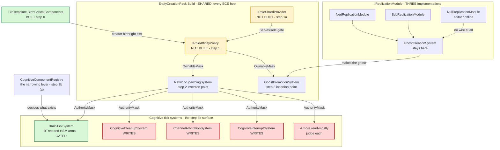
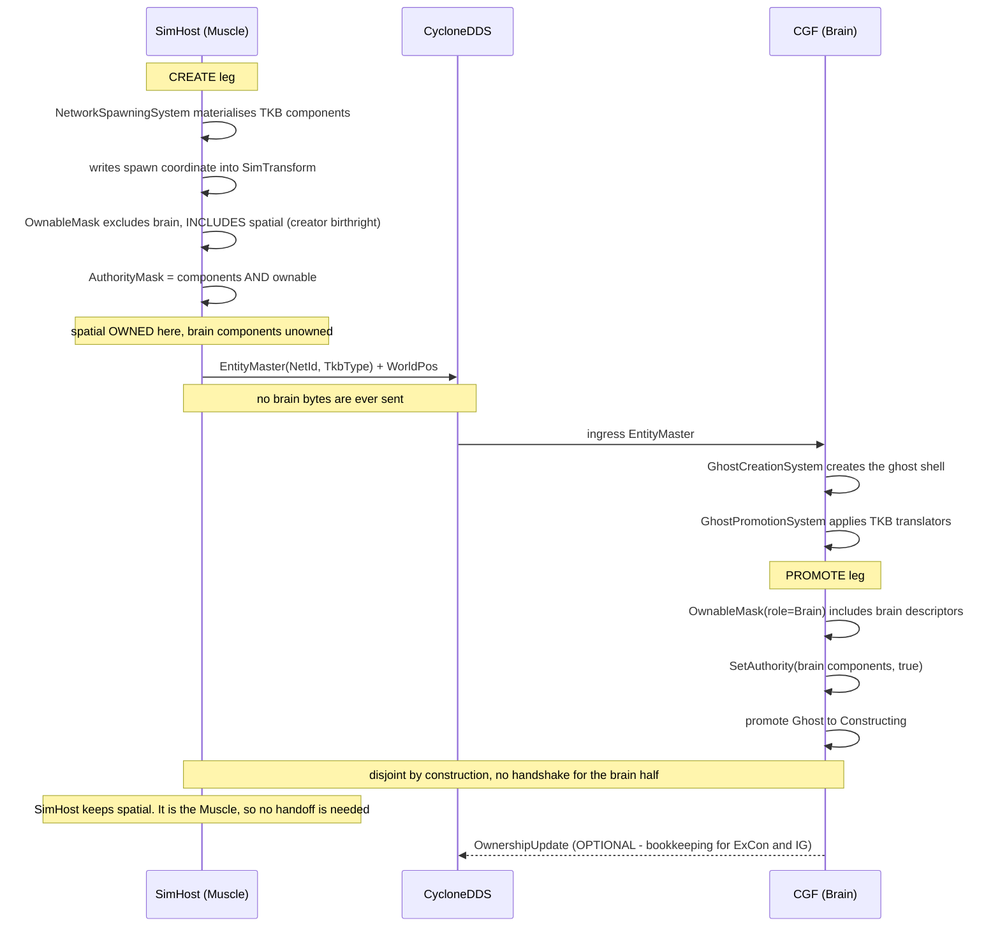
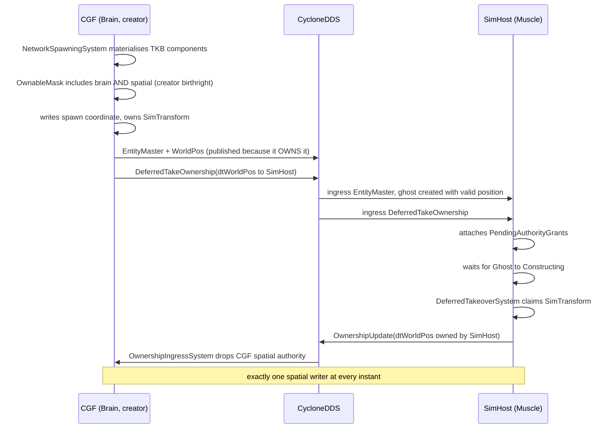

<!--STATUS
state: LIVE
updated: 2026-09-13
build-state: BUILT (for the two-node Brain/Muscle case) — steps 0a, 0, 1a, 1, 2, 3, 3b(b), §3.9's two-set model AND ⭐⭐⭐ STEP 4 (§6i: CGF holds a Brain policy, SimHost a Muscle policy, and gateOnAuthority is ON) are done. ⛔⛔ CORRECTED 2026-09-13: an earlier version of THIS LINE listed "3b(a) THE REGISTRATION NARROWING (§6h)" as DONE. That is FALSE and it contradicted both the step table's 3b row and §6h's own headline — §6h shipped the missing PERCEPTION REGISTRY, i.e. the PREREQUISITE for the narrowing, not the narrowing. ⛔⛔ CORRECTED AGAIN 2026-09-13 (§6j): the line above ALSO mis-stated 3b(a) as open. 📐 MEASURED: SimHostComponentRegistry does NOT call CognitiveComponentRegistry and DOES call MuscleRoleComponentRegistry — the narrowing IS BUILT; and muscleRead = {NavigationIntent, MissionPlanQueue} IS populated, so the READ table is filled too. ⇒ ✅ 3b(a) and the read table are DONE. ⛔ STILL OPEN: step 3c (the boot warning); IG / Stride / the Editor / the test harnesses still run a null policy DELIBERATELY (§6i says why); the role tables are COMPLEMENTS and that is now a RULING, not a stopgap (§3.9c, 2026-09-13): the positive enumeration is NOT the upgrade path and NOT a gating item — it fails toward UN-ownership (CE-256) where the complement fails toward inert over-ownership. Revisit ONLY on the trigger §3.9c names. ⛔⛔ AND READ §3.6 BEFORE REASONING ABOUT WHAT AUTHORITY DOES: re-measured 2026-09-13, the per-component AuthorityMask is read by NO egress translator — only by SimTransform/BehaviorState/BrainInterrupts checks and WithOwned<T> queries. An earlier version of §3.1 and §3.6 said "every egress translator gates on HasAuthority"; that was FALSE and both now carry the correction. ⛔⛔ §3.9 IS LOAD-BEARING AND IS NOW MODELLED IN CODE: REGISTER = ownedComponentSet ∪ readComponentSet, AUTHORITY = ownedComponentSet — read it before touching registration, and ⛔⛔ an earlier version said "NO HOST FILLS THE READ TABLE YET" — FALSE, HrotRoleComponentSets fills it (§6j). ⚠ What IS true: RegisterComponentSet is READ BY NOTHING in production and cannot drive registration while the tables are COMPLEMENTS — see §6j. ✅ §3.9a IS NEW (2026-09-12): the per-component classification for SimHost is MEASURED and CONFIRMS the ABSENT set, adding four more (the three channels + PreviousCapabilities) for SEVEN droppable -- the absent set is three entries since BrainBTreeState/BrainHsm64/BrainHsm128 no longer exist to decline, the brain's own state being occurrence slots inside the BlueprintBlackboard* tiers. ⚠ It carries a RETRACTION — an intermediate version claimed scenario persistence required three of them; that was false (DataPolicy.NoScenario governs scenario exclusion, and three of the translators are extract-only clipboard dumps). ⛔ 3b(a) is NOT blocked on persistence; what remains is that CognitiveComponentRegistry is SHARED with CGF, so the narrowing must move to MuscleRoleComponentRegistry. ⛔ NOT "BUILT": open-risk below still binds (§3.5 / step 3b).
verified: ⭐⭐ THE WHOLE DESIGN WAS RE-MEASURED AGAINST THE TREE ON 2026-09-12 before step 0 was built
  (user: "verify design before, might be stale"). VERDICT: every DECISION holds and nothing load-bearing
  is stale — the six unbuilt types are still at ZERO .cs occurrences, the blanket grant is byte-identical,
  AddMandatoryComponent<T>() is exactly the mirror target §3.1 claims, and WithOwned<T>()/WithoutOwned<T>()
  are exactly at QueryBuilder.cs:93/:105. What HAD rotted was LOCATORS and one count, all corrected in
  place where they stood:
    - §2.1's blanket grant is at NetworkSpawningSystem.cs:184-191, not :174-182 (code unchanged).
    - §3.2's promote insertion point is at :208 / :211-214, not :122 / :129 — moved ~85 lines by step 0a,
      i.e. this design rotted against a change THIS design made.
    - inventory ⑥'s third SetAuthority caller is a PRIVATE NESTED class inside NedReplicationModule
      (declared :573, call at :607); "LocalAuthorityYieldSystem:563" reads like a file path and resolves
      to nothing. The count of three still holds.
    - §3.8's GhostCreationSystem NetworkIdentity is at :65, not :51.
    - 🔴 §3.5 UNDERCOUNTS WithOwned<T>() adoption: NINE production call sites, not three. The six it never
      saw are all in Stride/Hrot.Stride.Core, because the 2026-09-10 grep was scoped to FDP/+Hrot/. This
      STRENGTHENS §5 ①c rather than threatening it.
    - ⚠ §3.5's "SEVEN un-gated" is itself soft: its own table names eight beyond the brain tick, and a
      10th file (Fdp.Examples.UrbanCombat/TelemetryReporterSystem.cs) matches the same query. Step 3b must
      re-enumerate rather than trust the number.
  ⛔ AND A STRUCTURAL GAP, now fixed: this design carried a classDiagram and two sequenceDiagrams but NO
  module-relationship diagram, despite §3.5 being made entirely of "which systems tick, on which host,
  registered by whom". §4.1b is that diagram.
current-answer: ⭐⭐⭐ IF YOUR QUESTION IS "WHO OWNS COMPONENT X", START AT §3.9c — the tables are
  COMPLEMENTS (ALL minus the named exclusions), so a component no role claims stays owned by whoever
  CREATED the entity. That section owns the rule; DESIGN_Entity_Creation_Unification.md §4.1 asks the same
  question from the creation side and points here. ⛔ A positive per-role enumeration would be a whitelist
  and would reproduce CE-256 — §3.9c says why, and names the rail a future enumeration must argue with.
  ⭐⭐⭐ THEN §6i — it is the NEWEST as-built (step 4, 2026-09-13) and it is the one that
  made the design live; it also carries the two deviations that matter (the tables are COMPLEMENTS, and no
  role may own a birth-critical component) and an honest statement of how big the change actually is.
  ⛔ Read §3.6 with it: the mask's real readership was re-measured that day and it is four component types,
  none of them an egress gate.
  Then: §3 is the design; §4 carries the UML; §6 is the sequencing; ⭐⭐ §6a IS THE AS-BUILT and
  wins over §3.7 where they differ (§3.7 is unchanged and still right; §6a ADDS the two attributes the
  build needed).
  ✅✅✅ STEP 0a IS DONE, 2026-09-11 — the GhostPromotionSystem relocation into EntityCreationPack.
  ✅✅✅ STEP 1a IS DONE, 2026-09-12 — the role-shard seam. §6c IS ITS AS-BUILT and carries a deviation
  STEP 1 INHERITS: roles are OPAQUE int BITS, not NodeRole, because NodeRole lives in Hrot.Core and
  Hrot.Core REFERENCES Fdp.Toolkits — §3.8's literal signature cannot compile in its stated home. This is
  the SAME trap note (i) below already recorded for IClusterStateCache. ⇒ step 1's per-role mask table is
  keyed by int role bits too. RoleShardKey.TkbType is also a long, not §3.8's int.
  ✅✅✅ STEP 0 IS DONE, 2026-09-12 — TkbTemplate.BirthCriticalComponents + AddBirthCriticalComponent<T>(),
  seeded on every production template, plus a catalogue-wide rail. §6b IS ITS AS-BUILT and carries the
  one gap it does NOT close: file-loaded templates (TkbDeserializer declares no components, so a
  file-loaded template has an EMPTY list — and CreateTkb() is the DEV default while files are the
  PRODUCTION path). ⛔ That must be answered BEFORE step 2, or step 2 turns every file-loaded template
  into the origin-flash defect §3.1 exists to prevent.
  ✅✅✅ STEP 1 IS DONE, 2026-09-12 — IRoleAffinityPolicy + RoleAffinityPolicy, NO deviation. §6d is its
  as-built. ⚠ §6c's int-role-bit deviation was REVERTED the same day: NodeRole moved into Fdp.Core on the
  user's ruling, so the seam carries the typed signature the design always specified.
  ✅✅✅ STEPS 2 AND 3 ARE DONE, 2026-09-12 — both insertion points. §6e is their as-built.
  ✅✅ STEP 3b's QUERY-FILTER HALF IS DONE, 2026-09-12 — §6f is its as-built and carries TWO deviations:
  the gate is CONDITIONAL (§6's own ordering would have broken the cluster — an unconditional filter makes
  a node stop processing every entity it did not create, because a promoted ghost owns nothing), and it
  covers SIX systems rather than §3.5's two, each gated on a component it ALREADY required.
  🔴 3b's half (a) is NOT done and narrowing IS the primary fix — user ruling 2026-09-12, and the
  decisive point: WithOwned<T>() implies With<T>(), so you cannot ask about authority on a component that
  was never added. The gate is the RESIDUAL for nodes that legitimately have brain components.
  Registration is the ONLY gate on materialisation (BehaviorTkbTranslator.cs:52), which is why SimHost's
  spawns carry the whole brain tier. §6f has the measurement and my two withdrawn objections.
  ⛔ Step 3c remains unbuilt. ✅ Step 4 SHIPPED 2026-09-13 (§6i) and is VERIFIED on a live 3-process
  cluster (§6i-a) — an earlier version of this line said "steps 3c and 4 remain unbuilt".
  🔴🔴 §3.9 ADDED 2026-09-12 AND IT CORRECTS THE ROLE MODEL ITSELF: a role has TWO component sets —
  ownedComponentSet (authority, what IRoleAffinityPolicy already models) and readComponentSet (owned
  elsewhere, replicated IN, consumed here). REGISTER = owned ∪ read; AUTHORITY = owned. Measured:
  NavigationIntent (16 wire refs) and MissionPlanQueue (9) are Brain-OWNED and Muscle-READ, so a Muscle
  node that stopped registering "brain components" would stop receiving its own orders.
  ✅ BUILT 2026-09-12 (CE-259bh, as-built §6g): `componentsPerRole` → `ownedComponentsPerRole`,
  `readComponentsPerRole` added as an OPTIONAL 4th constructor argument, and the interface now carries
  OwnedComponentSet / ReadComponentSet / RegisterComponentSet. 6 rails, 3 red-proofs.
  ⛔ NO HOST FILLS THE READ TABLE YET — that is step 4. 3b(a) remains blocked on CE-259bg (the brainActive
  proxy) and on that classification work, no longer on the model. ⚠⚠ CORRECTION 2026-09-12 (user challenge: "what actually
  blocks step 2?"): an earlier version of this block said STEP 2 IS BLOCKED on CE-259az. THAT WAS WRONG —
  the blocker was attached to the wrong step. Step 2 injects no policy (its own gate: "with no policy the
  mask is unchanged"), so it is INERT by construction and free to ship. CE-259az gates STEP 4, where
  hosts are actually handed a policy, and then only on a deployment that loads a NAMED TKB zip —
  TkbLoadClusterStateHandler Clear()s the catalogue before loading, so those templates carry an empty
  BirthCriticalComponents, while the programmatic fallback step 0 seeded is unaffected.
  ⭐ §5's three decisions are all RESOLVED (① / ①b 2026-09-01; ② user-approved and ③ user-ruled
  2026-09-10; ①c "nothing measurable remains"). What is left in §5 is a per-system REVIEW for step 3b,
  not a decision — so this design is NOT blocked on the user.
  ⚠ ONE FINDING FROM THE 0a BUILD, filed not fixed (§6a's last subsection): NetworkLifecycleSystemGroup's
  summary claims it groups GhostPromotionSystem so that "no ghost promotions occur during playback", but
  NO production site has ever put that system in it — promotion ran, and still runs, OUTSIDE the replay
  gate. The relocation preserved that behaviour deliberately; whether it SHOULD be gated is unanswered.
stale-below: nothing.
known-rot: §3.1's FIRST draft (2026-09-01, same day) applied ONE symmetric rule to every descriptor.
  That was WRONG and is corrected in place: it would have made a Brain creator produce SimTransform
  unowned, so the spawn position could never be published. §3.1 now carries two categories -- creator
  birthright for birth-critical spatial state, role affinity for defaultable cognitive state. Any
  reader finding a single-rule formulation outside that section has found rot.
open-risk: §3.5 -- the brain tick's execution gate EXISTS but is CONDITIONAL. BrainTickSystem builds
  its per-tier queries with WithOwnedWhen<BehaviorState>(_gateOnAuthority), and that flag defaults to
  false, so a host that has not been handed a role policy still ticks every brain it can see. Step 4
  turns it on per host and has done so for CGF and SimHost (§6i); IG / Stride / the Editor / the test
  harnesses still run a null policy deliberately.
  RESOLVED BY CONSTRUCTION 2026-09-23 -- the sub-risk that made this hard is gone. This entry used to
  read "BTreeTickSystem's query carries NO authority filter", and the re-measurement below found the
  real hazard was that there were TWO brain tick systems needing TWO gates kept in step by hand, so
  gating one left every HSM-tier ghost double-ticked. O7c merged them into one BrainTickSystem with
  one gate; there is no second system to forget.
  RE-MEASURED 2026-09-10, and §3.5 was wrong in three ways -- all corrected in place there:
  (1) the filter method is WithOwned<T>() at QueryBuilder.cs:93, NOT ".WithAuthority<T>() at :97";
  (2) "no production system uses it" is FALSE -- CoordinateTransformSystem:29, GeodeticSmoothingSystem:31
      and CarKinematicsSystem:73 all do, and it REPLACED the legacy manual owner checks (MOD1-P1T3),
      so it is an adopted pattern and its per-frame cost is two BitMask512 ops on an already-loaded
      cache line (EntityQuery.cs:157-158, step 4 after liveness' cold meta fetch);
  (3) MUCH BIGGER: §3.5 named ONE system and there are SEVEN un-gated, three of which WRITE cognitive
      state. At the time the brain tick was TWO systems, one per paradigm, and BehaviorState.BrainTier
      selected which one ran -- so gating one left every ghost on the other tier double-ticked. THAT
      sub-hazard is GONE: O7c merged them into BrainTickSystem, where BrainTier selects the ARM inside
      one gated walk. The other writers named in (3) are unaffected and are still the work.
  => step 3b is a PER-SYSTEM PASS, not a one-line query edit. The DECISION (both (a) and (b)) is
  unchanged and its escape clause is closed.
  ALSO 2026-09-10, IN ORDER -- read the LAST line, the middle one is superseded:
    (i) my first lean on §5 decision (3) was "defer multi-Brain entirely" -- because IClusterStateCache
        publishes no brain index or count, and it lives in Hrot.Network.NED which REFERENCES
        Fdp.Toolkits, so the policy's designed home cannot see it without breaking the
        network-agnosticism ruling that settled decision (1). Those MEASUREMENTS stand.
   (ii) SUPERSEDED BY USER RULING, same day: the seam is NOT deferrable and the question is not
        brain-specific. "its not just multi brain, it is also multi muscle or multi perception... i need
        the shard provider interface for these, implemented for single brain and single muscle case we
        have now, but reimplementable later."
  => §3.8 IS THE SEAM and it is part of P3: IRoleShardProvider.ServesRole(role, key) + an extensible
     RoleShardKey (NetworkId => balancing, TkbType => specialisation) + SingleNodePerRoleShardProvider
     as the only implementation built. Both insertion points can fill the key -- measured:
     NetworkSpawningSystem has networkId local at :108 and stamps NetworkIdentity at :138;
     GhostPromotionSystem's ghost carries NetworkIdentity (GhostCreationSystem:65 -- re-measured 2026-09-12, was :51) and TkbIdentity.
     §3.3's OwnableMask signature and its single flat role mask are SUPERSEDED by §3.8 -- the mask is
     now PER ROLE and each role is shard-tested separately.
  🔴 §3.8 carries TWO CONSTRAINTS a later implementation MUST honour, and the first kills the obvious
     approach: ServesRole may read only inputs IDENTICAL ON EVERY NODE, so performance balancing CANNOT
     be a node measuring its own load (two nodes would both answer true => two owners, the exact
     conflict this design removes); and a shard mapping must be stable for an entity's lifetime,
     because the policy runs at birth and promotion only.
  §5 decision (2) APPROVED by the user 2026-09-10 ("yes on boot warning").
known-rot: an earlier draft sourced the role's ownable set from DescriptorOwnershipMap and called
  that "the one place a networking concept is defensible". WRONG -- corrected in §2.3 (user ruling,
  2026-09-01): there are multiple network implementations (NedNetworkFactory, BdcNetworkFactory,
  OfflineNetworkFactory) and that map is populated per implementation from its own translators, so a
  rule keyed on it would differ per stack and be empty offline. The role's ownable set is a
  BitMask512 of COMPONENT IDS assigned to the role. Nothing in this design may key on a descriptor.
known-conflict: Architect_Question_65 §4's Q65-B and §5.3's CE-142 both describe ownership as
  something a CREATOR delegates outward via DeferredTakeOwnership. This design does not retire that
  path -- explicit grants still win -- but it makes the DEFAULT declarative and local, which removes
  the need for a grant in the common case. Read §3.4 before quoting either as "the" mechanism.
design-basis: docs/blueprints/RULINGS.md R-138 (fully distributed, ownership per-component and
  transferable, NodeRole is a convention) - docs/blueprints/Architect_Question_65_Entity_Genesis_Uniformity.md
  §0 (no capability removal by design), §5.3 (mechanism vs policy) - docs/designs/tkb-1/DESIGN.md
  §6.5b gate 2 (registration is the narrowing lever).
related-designs:
  - DESIGN_Entity_Genesis_End_To_End.md — ⭐ THE LANDING PAGE. Owns the END-TO-END STAGE SEQUENCE
    (request → spawn → grant → ghost → promotion → takeover → Active) and nothing else; every stage
    routes back to its owner, including this one. Read it FIRST if you do not already know where in
    the genesis path your question sits.
  - DESIGN_Entity_Authoring_Surface.md — owns the CALLER side of creation (who asks for an entity and whom
    they nominate as owner). Measured 2026-09-12: INDEPENDENT of this design in both directions — this one
    decides component-level AUTHORITY after the entity exists, that one decides nothing about it.
  - DESIGN_Entity_Creation_Unification.md — owns the PACK this design's step 0a moved GhostPromotionSystem
    into, and the invariant that EVERY ecs node may create entities. ⭐ Its §4.1 (added 2026-09-13) answers
    the question a reader of THAT file asks — "any node can create an entity, so who owns its EntityInfo?"
    — from this design's tables: the creator, because the role masks are COMPLEMENTS. ⛔ Keep the two in
    step: if the tables ever become positive enumerations, §4.1's answer changes.
  - designs/tkb-1/DESIGN.md — owns WHERE BirthCriticalComponents comes from. Its §6.6 (2026-09-13) states
    why a TKB FILE cannot declare it (the file is descriptor-shaped; the component lists are statements
    about what descriptors PRODUCE) and how the app layer supplies it. This design owns what the list
    MEANS; that one owns how a file-loaded template gets one.
  - PROGRAMME_Explicit_Component_Ids.md — owns whether every component actually carries an explicit
    [ComponentId]. §3.9b's mask-driven registration is only COMPLETE if it does, so that programme is a
    prerequisite for this one's registration half.
  - DESIGN_Distributed_Scenario_Persistence.md — owns SCENARIO SAVE/LOAD ownership gating (each host
    saves only what it primary-owns), the NetworkAuthority/NetworkOwnership component MERGE, and the
    ECS↔network ownership seam (PrimaryOwnerId is the network-agnostic owner; EntityMaster is derived).
    It READS the ownership THIS design decides; it does not decide who owns what. ⚠ Its axis ② (per-component
    runtime authority = AuthorityMask) is exactly this design's domain; its axis ① (entity PrimaryOwnerId)
    is the save owner.
  - designs/brain-death/BD1-DESIGN.md — owns the brain-death LIFECYCLE and the brain-vs-muscle command
    routing rule. It is the design §3.9's narrowing would break: its §2.1 predicate reads BehaviorState
    locally, which a Muscle-only node cannot answer. ⚠ Measured 2026-09-12: that routing has no
    production caller today (CE-259bg), so the breakage is latent, not live.
-->
# ⭐⭐⭐ Role-Affinity Ownership — **every node decides locally what it owns, so no two nodes ever claim the same component**

> 🔒 **User, `2026-09-01`, verbatim:** *"SimHost having a muscle role should not instantiate any brain
> related components. If it does, this is a mistake. But even if it does, by applying 'auto-takeover'
> rules (i do not have brain role -> i will not own brain components, the brain will) it can create the
> components as unowned while CGF (applying same rule - I am brain, i will own the brain components)
> creates them as owned. No authority conflict."*

⭐⭐ **The whole design is that one sentence.** Ownership stops being something a creator *hands out* and
becomes something every node *derives* from its own role, using the same function. Two nodes running the
same function over the same entity cannot disagree.

---

## 0a. ⭐⭐⭐ A MEASURED FAILURE THIS DESIGN REMOVES BY CONSTRUCTION — `CE-256` *(`2026-09-09`)*

⭐ This design has been argued from principle. 📌 **Here is a concrete, reproduced failure of the grant
path, so the case rests on a measurement and not only on an argument.**

📐 **Measured on a CGF + Stride mode-2 cluster, both directions, `hill-attack-close`:**

| start order | result |
|---|---|
| node started **BEFORE** CGF is healthy | 🔴 **0 ownership takeovers.** The node replicates all 8 entities, promotes every ghost, composes its window and reports **0 errors** — and **owns nothing**, so nothing it is responsible for ever moves. **Survives a scenario reload** *(340 s observed)* |
| node started **AFTER** CGF's API answers | ✅ **8 takeovers, every time** |

📐 **The mechanism, exactly.** `BrainMuscleOwnershipStrategy.GetInitialGrants` asks
`IClusterStateCache.GetLeastLoadedNode(MuscleGround)`. That cache is fed by `NodeHeartbeat` samples at
**1 Hz**. ⛔ If no Muscle node is known **at the moment entities are created**, the strategy returns an
**empty grant list** — its own documented *"safe fallback: the Brain retains physics authority"* — and
⛔⛔ **nothing ever re-grants.** ⚠ The window is not a race between threads; it is a race between
**process start-up and scenario load**, and it is wide.

⇒ ⭐⭐⭐ **§3's rule removes this, and it is worth stating why in one line:** *"the creator declines, the
role-holder claims on promotion"* means ownership is **derived locally from a node's own role**, not
handed out by a remote party at creation time. ⛔ **A late joiner has nothing to miss** — it claims what
its role says it owns, whenever it arrives. ⇒ the failure above is **not a bug to fix in the grant path;
it is a property of having a grant path at all.**

| ⛔ what was deliberately NOT built | |
|---|---|
| **a re-grant / retry on node-join** | ⚠ The obvious fix: have CGF re-evaluate when a Muscle heartbeat arrives for entities with no muscle owner. ⛔ **Rejected** — it is a SECOND ownership mechanism, and this design deletes the first. 📌 Ruling 9. ⭐ Building it would mean building something this design removes |
| ⭐ **what WAS built instead** | a **detector**, in the node: `StrideNodeShell.CheckOwnershipStarvation` warns once when the node holds entities with a `SimTransform` and owns **none** of them, naming the start-order cause. ⚠ **It is not a fix and does not claim to be** — ⭐ it converts a silent 340-second mystery into one sentence at the moment it happens. 📐 Proven both ways: fires on the starved ordering *(8 entities, 0 owned)*, **silent** on the healthy one *(8 takeovers, 0 warnings)* |

⚠ **Read this as evidence FOR the design, not as a reason to patch around it.** ⭐ Until §3 is built the
operational rule is simply: **start a muscle node only after CGF answers.**

---

## 1. INVENTORY

⭐ Run `2026-09-01` through the codebase-memory **graph** (CLI), each cross-checked with `grep`.
⚠ `check_index_coverage` was **not** run; treat the totals as best-effort, not proof of completeness.

| # | query | total | what it returned |
|---|---|---|---|
| ① | `search_graph name_pattern=".*Ownership.*\|.*OwnershipDistribution.*" label="Class"` | **2** | `BrainMuscleOwnershipStrategy` (production) · `StubOwnershipStrategy` (test) |
| ② | `search_graph name_pattern=".*Ownership.*" label="Interface"` | **1** | `IOwnershipDistributionStrategy` — the only ownership seam that exists |
| ③ | `search_graph name_pattern=".*(Ownership\|Authority\|Takeover\|Promotion).*" label="Class"` | **44** | 23 production, listed in §2.2 |
| ④ | `search_graph name_pattern=".*TkbTranslator$" label="Class"` | **9** | the TKB→ECS projection set (`TkbTranslatorSet.Base()` carries 6 of them) |
| ⑤ | `grep "AuthorityMask"` production, non-test | **1 writer outside the wire path** | `NetworkSpawningSystem.cs:181` |
| ⑥ | `grep "SetAuthority("` production, non-test | **3** | `OwnershipIngressSystem:79` · `DeferredTakeoverSystem:118` · `LocalAuthorityYieldSystem` — **all three wire-driven**. ⚠ **Re-measured `2026-09-12`: the third is NOT its own file** — it is a PRIVATE NESTED class inside `NedReplicationModule` *(declared `:573`, registered `:385`, and the `SetAuthority` call is at **`:607`**)*, so the earlier `LocalAuthorityYieldSystem:563` reads like a file path and resolves to nothing. ⭐ The COUNT of three still holds |

⇒ ⭐⭐⭐ **Query ⑤ is the finding.** There is exactly **one** place where a node grants itself authority
over an entity it created, and it is a blanket copy.

---

## 2. 📐 THE MEASURED STATE

### 2.1 The blanket grant

`FDP/Toolkits/Fdp.Toolkits/NetworkSpawning/Systems/NetworkSpawningSystem.cs:184-191` *(⚠ re-measured `2026-09-12`; this section said `:174-182` — the CODE is byte-identical, only the lines moved)*:

```csharp
bool isLocalAuthority = cmd.OwnerNodeId == _localNodeId;
if (isLocalAuthority)
{
    // Locally spawned entities must start with authority bits enabled for
    // every component currently present on the entity.
    ref var compNS = ref world.GetComponentMask(entity.Index);
    ref var metaNS = ref world.GetMetadata(entity.Index);
    metaNS.AuthorityMask = compNS;          // ⬅ "I own everything I materialised"
}
```

| property | measured |
|---|---|
| a fresh entity starts **unowned** | ✅ `EntityIndex.cs:97,170,464` — `AuthorityMask.Clear()` |
| this is the **only** non-wire grant | ✅ inventory ⑤/⑥ |
| it is **role-blind and descriptor-blind** | ✅ the mask is copied wholesale |
| it lives in **shared** code every host runs | ✅ `Fdp.Toolkits`, reached via `EntityCreationPack` or direct construction |

📌 **This is why a SimHost-created tank reports `HasAuthority<BehaviorState> = True`** — measured live,
`MissionToMovementChainProbe`, `2026-09-01`.

### 2.2 What already exists and must be REUSED, not rebuilt

| piece | why it matters here |
|---|---|
| ⛔⛔ `DescriptorOwnershipMap` | 🔴 **MUST NOT carry ownership — see §2.3.** It is populated by `RegisterFromTranslator(descriptorOrdinal, targetComponentIds)`, i.e. from **one network implementation's** translator set |
| ⛔ `EDescriptorType` | 🔴 same reason — a descriptor **ordinal vocabulary belongs to a wire protocol**, not to the simulation |
| ⭐⭐ `BitMask512` | `AuthorityMask` and the component mask are **already** this type, and it has `BitwiseAnd(in BitMask512)` ⇒ a role's ownable set is representable as one mask and applied in a single call |
| `BehaviorProfileDto.BrainTier` | `byte`; `BehaviorTkbTranslator` already early-returns on `== 0` ⇒ *"is this a brain-enabled entity"* is answerable from the template alone |
| `GhostPromotionSystem` | applies the TKB translators at `:122`, promotes Ghost→Constructing at `:129`. Since `CE-142`'s sibling change it runs on **every** role |
| `PendingAuthorityGrants` | ⚠ **checked, and it does NOT conflict** — it carries an *explicit* pre-genesis `DeferredTakeOwnership` routing table, consumed by `DeferredTakeoverSystem`. An explicit grant is a deliberate override of the local default (§3.4) |
| `IOwnershipDistributionStrategy` | the **existing** policy seam. ⛔ Do not add a second one — §3.3 extends this family rather than inventing a parallel interface |

### 2.3 🔴🔴 **OWNERSHIP MUST BE NETWORK-AGNOSTIC** *(user ruling, `2026-09-01`)*

> 🔒 **User, verbatim:** *"we can have multiple different network implementations - ownership can not be
> tied to one of them, must be network agnostic. and role can have a bitmask of owned components
> assigned."*

📐 **Measured — the premise is fact, not hypothetical:**

| network factory | |
|---|---|
| `NedNetworkFactory` | the DDS/NED stack |
| `BdcNetworkFactory` | a **second, independent** implementation |
| `OfflineNetworkFactory` | ⭐ the **networkless** case — literally a host with no wire at all |
| *(+ `MockNetworkFactory`, `SpyNetworkFactory`, `StubNetworkFactory` in tests)* | |

⛔⛔ **`DescriptorOwnershipMap` is populated by `RegisterFromTranslator(descriptorOrdinal,
targetComponentIds)`** — from **one implementation's translator set**. `NedReplicationModule` fills it
from NED translators; a BDC node fills it differently; an offline node not at all. ⇒ 🔴 **an
ownership rule keyed on it would mean something different on every network stack and nothing offline.**

⇒ ⭐⭐⭐ **The role's ownable set is a `BitMask512` of COMPONENT IDS, assigned directly to the role.**
No descriptors, no ordinals, no translators, no participant. ⭐ `AuthorityMask` and the component mask
are already `BitMask512`, and it has `BitwiseAnd(in BitMask512)` — so the rule is one bitwise op.

⚠ **This retires §5's decision ①**, which had proposed `DescriptorOwnershipMap` as the source and called
it *"the one place a networking concept is defensible."* 🔴 **That was wrong** — it assumed one network
stack.

---

## 3. ⭐⭐⭐ THE DESIGN

### 3.1 The rule — ⚠ **TWO CATEGORIES, not one** *(architect correction, `2026-09-01`)*

⛔⛔ **An earlier draft of this section applied one symmetric rule to every descriptor.** 🔴 That was
wrong, and the architect named the exact flaw: applied to kinematics it would make **CGF create
`SimTransform` unowned**, so the spawner could never stamp — or publish — the entity's initial position.

> 🔒 **Architect, `2026-09-01`:** *"the position can not start empty (must always be valid — it is the key
> property of an entity)."*

⭐⭐⭐ **The asymmetry is about the INITIAL VALUE, not about the tier:**

| category | can it start empty? | ⇒ ownership pattern |
|---|---|---|
| ⭐ **cognitive** — `BehaviorState` and the `BlueprintBlackboard*` occurrence store *(which is where the root params, the tree cursor and the HSM instance all live)* | ✅ **yes.** An idle blackboard on tick 0 is correct; starting to think a frame later is invisible | ⭐⭐ **ROLE AFFINITY** — the creator declines, the role-holder claims on promotion |
| ⭐ **spatial / kinematic** — `SimTransform`, `SimVelocity` | ⛔ **no.** `(0,0,0)` is an origin flash, a wrong spatial-hash cell and a bogus first path query | ⭐⭐ **CREATOR BIRTHRIGHT** — the creator **always** owns at birth, then hands off via the existing `DeferredTakeOwnership` → `OwnershipUpdate` path |

⭐ **The generalised rule, stated once:**

> **A node owns a component at birth if it created the entity AND the component is BIRTH-CRITICAL;
> otherwise it owns it if, and only if, it holds the role that component belongs to.**

#### ⭐⭐⭐ Birth-criticality is a property of the COMPONENT, declared by the TKB — ⛔ not of a descriptor

> 🔒 **User, `2026-09-01`:** *"isn't 'which COMPONENTS are birth critical' a more correct question? Note
> there are networkless systems as well. Answer: SimTransform at the moment and only for entities having
> one. TKB should define what components are birth critical."*

⛔ **A descriptor is a NETWORKING concept.** A node with no DDS participant has no descriptor mapping at
all, so a descriptor-keyed definition of birth-criticality would be **undefined exactly where the
component still exists**. ⇒ ⭐ the property belongs to the component, and its source is the template.

⭐⭐ **And the home already exists.** `TkbTemplate.MandatoryComponents` is per-**component**
*(`MandatoryComponent { ComponentTypeId, IsHard, SoftTimeoutFrames }`)*, per-template, and its own
doc-comment says it is checked against the live `ComponentMask` — *"completely decoupled from the DDS
network layer."* ⇒ ⭐ the same structure, the same authoring style, the same network independence.

| ⭐ the shape | |
|---|---|
| **add** `TkbTemplate.BirthCriticalComponents` + `AddBirthCriticalComponent<T>()`, mirroring `AddMandatoryComponent<T>()` | ⭐ **"only for entities having one" is automatic** — a template that does not list it does not get it, and the create leg intersects with the entity's live component mask anyway |
| ⭐ **the initial content is ONE entry: `SimTransform`** | 🔒 the user's answer. ⛔ Everything else is role-affine until a measurement says otherwise |
| ⚠ **why a SECOND list rather than a flag on `MandatoryComponent`** | ⛔ they answer different questions — *"must be PRESENT before promotion"* vs *"the creator must OWN it at birth"*. Overloading the first would force a birth-critical-but-not-promotion-gating component to change promotion semantics to carry the flag. ⭐ Two lists for two concepts is not the duplicate-implementation trap; conflating them is §3.6's mistake in miniature |

#### 📐 WHY THE BIRTHRIGHT IS LOAD-BEARING — ⛔⛔ **the CONCLUSION stands; the MECHANISM stated here was WRONG** *(re-measured `2026-09-13`)*

> ⛔ **SUPERSEDED text, kept because it was quoted into three other sections:** *"every egress translator
> gates on `HasAuthority` — `EntityMasterEgressTranslator:73`, `EntityInfoEgressTranslator`,
> `MapVisualOverlayEgressTranslator:77`, and the rest ⇒ a creator that declines `dtWorldPos` would write a
> correct position that is NEVER PUBLISHED."*
> 🔴 **False.** Those three call the **extension** `ISimulationView.HasAuthority(entity, packedKey)`, which
> reads `DescriptorOwnership`/`NetworkAuthority` and **never touches `AuthorityMask`** — §3.6 carries the
> full measurement. ⇒ **declining a mask bit does not stop publication of anything.**

⭐⭐ **The birthright is still required, for TWO different and measured reasons** — both from the mask's
real readership *(§3.6)*, and both of them worse than an origin flash because they are silent:

| if a node lacked authority over `SimTransform` | what breaks |
|---|---|
| `CarKinematicsSystem.cs:73` filters `.WithOwned<SimTransform>()` | ⛔ **the entity never moves on that node** — `CE-256` in miniature |
| 🔴 `GeoSpatialIngressTranslator.cs:90` applies the incoming position **only when `HasAuthority<SimTransform>` is false** | ⛔⛔ and the mirror image is the dangerous one: **a node that CLAIMS `SimTransform` by role stops accepting the real owner's updates** ⇒ every ghost on it freezes. ⇒ ⭐⭐⭐ **birth-critical components must be in NO role's owned set at all**, not merely added back for the creator |

⭐ `EntityRepository.SetComponent` is **not** authority-gated either way, so a creator can always write the
spawn coordinate locally; the failure was never the write.

⭐⭐ **Within each category conflict is still impossible by construction** — for cognitive descriptors the
creator declines exactly what the role-holder claims; for kinematic descriptors exactly one node owns at
birth and hands off explicitly. ⇒ ⛔ **no handshake is needed for the cognitive half**; the kinematic half
keeps the handshake it already has, and needs it.

### 3.2 The two insertion points — both in shared code

| leg | file | change |
|---|---|---|
| **CREATE** — the creator declines | `NetworkSpawningSystem.cs:181` | `metaNS.AuthorityMask = compNS & policy.OwnableMask(...)` instead of `= compNS` |
| **PROMOTE** — the receiver claims | `GhostPromotionSystem`, after the translator loop, before the promote — ⚠ **re-measured `2026-09-12`: `:208` and `:211-214`**, not the `:122`/`:129` this row used to name. 📌 Step `0a`'s own relocation moved them ~85 lines, so the design rotted against a change THIS design made | set the bits `policy.OwnableMask(...)` names, guarded by `HasComponentByTypeId` |

⭐ Ordering is already correct: the translator loop has materialised the components before either point runs.

### 3.3 The seam — ⭐ **network-agnostic by construction**

⭐⭐ `IOwnershipDistributionStrategy` answers *"which grants do I hand out?"*. This design needs the
sibling question *"which components do I keep?"* — so it goes beside it, injected, and **role selects
the POLICY, never the mechanism** *(`CE-142`)*.

```csharp
public interface IRoleAffinityPolicy
{
    /// Component ids this node should own for an entity of this template.
    /// ⛔ No descriptors, no ordinals, no participant — see §2.3.
    /// The caller intersects the result with the entity's live component mask.
    /// ⚠ SUPERSEDED 2026-09-10 — the signature gains `in RoleShardKey key` and the flat
    ///   role mask becomes one mask PER ROLE. See §3.8 (the role-shard seam, user ruling).
    /// ✅ AS-BUILT 2026-09-12: this signature shipped EXACTLY as written. See §6d.
    BitMask512 OwnableMask(TkbTemplate template, bool isCreator, in RoleShardKey key);
}
```

| ⭐ where each bit comes from | |
|---|---|
| ⭐⭐ **the ROLE's assigned mask** | ⚠⚠ **this is the `ownedComponentSet` — see §3.9.** A role has a SECOND set, `readComponentSet` *(owned elsewhere, replicated in, consumed here — e.g. Muscle ↔ `NavigationIntent`)*, which REGISTRATION needs and AUTHORITY must never see. ✅ **Both are modelled since `2026-09-12` (§6g)** — the parameter below is `ownedComponentsPerRole`, and `readComponentsPerRole` sits beside it. A `BitMask512` of component ids **declared per role**, plain configuration. ⛔ Not derived from any wire vocabulary — a `NodeRole` → mask table, and nothing else. ⚠ **`2026-09-10`: the table is now consulted PER ROLE and gated by `IRoleShardProvider.ServesRole` — §3.8.** A single flat union is no longer correct |
| ⭐⭐ **∪ the template's `BirthCriticalComponents`, when `isCreator`** | §3.1's birthright. ⭐ The creator keeps these **whatever its role**, which is precisely the architect's correction |

⭐ **The whole rule is then:** `AuthorityMask = componentMask ∧ OwnableMask(template, isCreator)` —
one `BitwiseAnd`, no allocation, and it evaluates identically on NED, on BDC and offline.

⚠ **A node with no policy keeps today's behaviour** *(own everything you materialised)*, so adoption is
incremental and nothing changes until a host is handed one. ⭐ This is also what makes the networkless
host correct for free.

### 3.7 ⭐⭐⭐ COMPOSITION — **the policy belongs to `EntityCreationPack`, and that forces one relocation**

> 🔒 **User, `2026-09-01`:** *"where will you instantiate the code? This should be part of the shared
> entity creation pack, right?"* ⭐ **Yes — and asking it exposes that one of the two consumers is in the
> wrong module.**

📐 **Where the two consumers are built today:**

| consumer | built by | reachable from the pack? |
|---|---|---|
| `NetworkSpawningSystem` | ⭐ **`EntityCreationPack.Build()`** *(+ 3 hosts that still hand-assemble)* | ✅ yes |
| `GhostPromotionSystem` | ⛔ **`NedReplicationModule.RegisterSystems()` — ONE network implementation** | 🔴 **no** |

🔴🔴 **And that is already a defect, independent of this design.** `BdcReplicationModule.cs:66`
registers `GhostCreationSystem` — so **a BDC node creates ghosts** — but the file registers **no**
`GhostPromotionSystem`. ⇒ **those ghosts are never promoted**: they keep only their replicated
components, never get their TKB projection, and stay in `EntityLifecycle.Ghost` forever.
⭐ `OfflineNetworkFactory` returns a `NullReplicationModule`, so the same holds there *(harmlessly —
no ghosts arrive)*.

⇒ ⭐⭐⭐ **The concerns were bundled by LIFECYCLE ADJACENCY, not by subject:**

| step | concern | home |
|---|---|---|
| ghost **CREATION** — *a wire sample arrived, make a shell* | ⭐ genuinely a **NETWORK** concern | ✅ stays in the replication module — and `IReplicationModule` puts `GhostCreationSystem` **on the interface**, so every implementation must supply one |
| ghost **PROMOTION** — *apply the TKB template, decide ownership, transition the lifecycle* | ⭐⭐ a **SIMULATION** concern — it consumes the translator list and now the role policy, neither of which is networked | 🔴 **move to `EntityCreationPack`**, beside the request and spawn systems |

| ⭐ what this buys | |
|---|---|
| ⭐⭐⭐ **both consumers built by ONE factory** ⇒ they share the **same policy instance BY CONSTRUCTION** | ⭐ exactly the argument the pack already makes about the translator list — *"handing the SAME instance to the ELM and the spawn system is what makes that true BY CONSTRUCTION rather than by convention"* |
| ⭐⭐ **ghost promotion stops being NED-only** | ⇒ the BDC gap above closes as a side effect, not as separate work |
| ⭐ **the pack's own caution is honoured** | ⚠ its header says promotion is not its job because that would create *"a SECOND registrar"*. 📐 That reasoning assumed `NedReplicationModule` is **the** registrar; it is one of **three** modules and two do not register it. ⇒ this is a **MOVE**, not an addition — the pack becomes THE registrar and the NED module stops. ⛔ Both must land in one commit or promotion runs twice |

⚠⚠ **This SUPERSEDES a change made earlier the same day.** `NedReplicationModule`'s two role-gated
`GhostPromotionSystem` registrations were collapsed into one un-gated registration *(the `Q65-B`
sibling of `CE-142`)*. ⭐ That was correct for where the code sat, and it **disappears** when the
registration relocates. ⛔ Do not treat the two as alternatives — the relocation is the end state.

⭐ **Ordering is safe:** all three genesis systems carry `[UpdateInPhase(SystemPhase.BeforeSync)]`
*(`GhostCreationSystem.cs:9`, `NetworkSpawningSystem.cs:21`, `GhostPromotionSystem.cs:25`)*, so moving
the **registrar** does not move the **phase**. ⚠ Within-phase order still matters — creation must
precede promotion — and `EntityCreation.Unserviceable()` already exists to make a host's omission loud.

⭐ **The context gains one field**, mirroring `OwnershipStrategy`:

```csharp
public IRoleAffinityPolicy? RoleAffinityPolicy { get; init; }   // null => today's behaviour
```

### 3.8 ⭐⭐⭐ THE ROLE-SHARD SEAM — **generic over roles, built single-node, re-implementable later** *(user ruling, `2026-09-10`)*

> 🔒 **User, verbatim:** *"its not just multi brain, it is also multi muscle or multi perception. we might
> need performance balancing or nodes specialized to some types of entities or whatever. i need the shard
> provider interface for these, implemented for single brain and single muscle case we have now, but
> reimplementable later."*

⛔⛔ **This SUPERSEDES §5 ③'s "defer it entirely" lean of the same day.** ⭐ The seam ships with `P3`; only
a **sharding IMPLEMENTATION** is deferred. ⚠ And the question is no longer *"multiple Brains?"* — it is
**"which node serves role R for THIS entity?"**, asked identically for `Brain`, `MuscleGround`,
`Perception`, `NavigationSolver` and anything added later.

#### ⭐⭐ The seam

> ⚠⚠ **AS-BUILT `2026-09-12` — the sketch below is SUPERSEDED in TWO places.** The shipped signature
> takes an **opaque `int roleBit`, not a `NodeRole`**, and `RoleShardKey.TkbType` is a **`long`, not an
> `int`**. Both are forced, not preferences — see §6c. The sketch is kept because its *shape* is what was
> ruled on and that is unchanged.

```csharp
/// Does THIS node serve `role` for THIS entity?
/// ⛔ MUST be deterministic and must give the SAME answer on every node — see the contract below.
public interface IRoleShardProvider
{
    bool ServesRole(int roleBit, in RoleShardKey key);   // ⚠ was NodeRole — see §6c
}

/// ⭐ Extensible ON PURPOSE (the user's "or whatever"): adding Faction/Zone later touches
/// neither call site nor any existing implementation.
public readonly struct RoleShardKey
{
    public readonly long          NetworkId;   // stable per-entity discriminator ⇒ BALANCING
    public readonly long          TkbType;     // ⚠ was int — every TkbType in the system is a long
    public readonly DISEntityType DisType;     // already stamped in the entity header
}
```

📐 **Both insertion points can fill it — measured `2026-09-10`, this is why the shape is safe:**

| leg | what is in scope |
|---|---|
| **CREATE** `NetworkSpawningSystem` | `networkId` is a local at `:108`; `cmd.TkbType`; the DIS value computed at `:155`; and `NetworkIdentity` is stamped on the entity at `:138` |
| **PROMOTE** `GhostPromotionSystem` | the ghost carries `NetworkIdentity` *(added by `GhostCreationSystem.cs:51`)* and `TkbIdentity` *(read at `:117`)*; the template is already resolved at `:126` |

#### ⭐ What changes in `RoleAffinityPolicy` — ⚠ **a real change to §3.3, not a wrapper**

⛔⛔ **§3.3's `RoleAffinityPolicy` held ONE flat `roleOwnedComponents` mask.** ⭐ That no longer works:
each declared role must be **shard-tested separately**, so the policy needs a **component mask PER ROLE**
and unions only the roles it actually serves.

```
OwnableMask(template, isCreator, key):
    mask = ∅
    for each role bit R in declaredRoles:
        if shard.ServesRole(R, key):  mask |= componentsPerRole[R]
    if isCreator:                     mask |= template.BirthCriticalComponents
    return mask                       // caller still ∧ the live component mask
```

⭐ **The one implementation built now:**

```csharp
public sealed class SingleNodePerRoleShardProvider(int declaredRoles) : IRoleShardProvider
{
    // ⚠ AS-BUILT adds `roleBit != 0` — "no role" must be served by NOBODY, so a defaulted or
    //   forgotten NodeRole.None cannot quietly match every node.
    public bool ServesRole(int roleBit, in RoleShardKey key)
        => roleBit != 0 && (declaredRoles & roleBit) != 0;
}
```

⭐ **At the host's composition root the cast makes the boundary visible:**
`new SingleNodePerRoleShardProvider((int)NodeRole.Brain)`.

| ⭐ why this is the right default | |
|---|---|
| ⭐⭐ **it IGNORES the key** | ⇒ **byte-identical to the single-Brain/single-Muscle behaviour we have today**, so the seam costs nothing to adopt and the `P3` rails do not change meaning |
| ⭐⭐ **it is correct on a NETWORKLESS node for free** | a networkless node has no `NetworkIdentity`, so `NetworkId` is `0` — ⛔ but the default never reads it. ⇒ 🔒 the §2.3 network-agnosticism ruling holds **by construction**, not by care |
| ⭐ its input is what a host already declares | 📐 `SimHostApp.DefaultRole:182` · `CgfSubsystem.DefaultRole` — no new configuration |

#### ⛔⛔⛔ THE CONTRACT A LATER IMPLEMENTATION MUST HONOUR — **two constraints, and the first kills the obvious approach**

| # | constraint | why |
|---|---|---|
| 🔴🔴 **①** | **`ServesRole` may read ONLY inputs that are IDENTICAL ON EVERY NODE.** ⛔⛔ **A node may NOT decide from its own CPU load, queue depth, entity count or any locally-observed metric** | ⭐⭐⭐ **This design's whole safety property is that two nodes independently evaluating the same function cannot disagree** *(§3's opening)*. ⛔ If node A reads *its* load and node B reads *its* load, both can answer `true` for one entity ⇒ **two owners, which is exactly the conflict this design removes.** ⇒ 🔴 **"performance balancing" CANNOT be implemented as each node measuring itself.** It must be a **shard assignment published by ONE authority and replicated**, which every node then reads identically — the provider is handed that table, it does not compute one |
| 🔴 **②** | **the shard mapping must be STABLE for the lifetime of an entity** | ⭐ the policy is evaluated at **birth** and **promotion** only *(§3.2's two insertion points)*. ⇒ ⛔ if the mapping changes while entities are live, they keep their birth assignment while newly-promoted ghosts follow the new mapping — **ownership becomes history-dependent.** ⚠ **Today's constraint, stated so an implementer knows what they must add:** a shard mapping is fixed for a scenario's lifetime. ⛔ **Making it dynamic requires a RE-EVALUATION path, which is a SECOND ownership mechanism** *(ruling 9)* — that is a design of its own, not an implementation detail of this seam |

⭐ **A consequence worth stating, because it is benign:** if a shard table has not arrived yet, the
provider answers `false` for everyone and the entity is owned by no one ⇒ that is exactly §5 ②'s case,
which **logs once and does not fall back.** ⇒ the two decisions compose.

⚠ **NOT in scope of `P3`:** any shard table, its transport, its authority, or a balancing metric. ⭐ `P3`
ships **the interface, the key, the single-node implementation, and the per-role mask table** — nothing
else.

### 3.9 🔴🔴🔴 REGISTER ≠ OWN — **a role has TWO component sets, and this design only ever modelled one** *(user, `2026-09-12`)*

> 🔒 **User, verbatim:** *"intents are brain owned components that must be replicated to muscle so musle
> can read and act on them. so muscle cant simply stop registwring them because they are brain ones."*
> 🔒 **And on naming:** *"maybe renaming to ownedComponentSet and readComponentSet would make it more
> clear."*

⛔⛔ **THIS INVALIDATES A PROPOSAL THIS SESSION HAD ALREADY FORMED** — *"a role registers the components it
owns; split the cognitive bundle along the role line."* 🔴 **Wrong, and wrong in a way that would have
broken the cluster:** `NavigationIntent` is **Brain-OWNED** and **replicated to Muscle**, which reads it and
acts on it. A Muscle node that stopped registering *"brain components"* would stop receiving its own orders.

⭐⭐⭐ **The correct model: every component stands in ONE of THREE relationships to a role.**

| relationship | example *(measured)* | REGISTER? | OWN? |
|---|---|---|---|
| ⭐ **OWNED** — I have authority; I write it, I publish it | Muscle ↔ `SimTransform` · Brain ↔ the occurrence store | ✅ | ✅ |
| 🔴 **READ** — owned elsewhere, **replicated IN**, my systems consume it | ⭐⭐ **Muscle ↔ `NavigationIntent`, `MissionPlanQueue`** | ✅ **MUST** | ⛔ **never** |
| ⛔ **ABSENT** — never mine, never arrives, nothing here reads it | Muscle ↔ the `BlueprintBlackboard*` occurrence store | ⛔ | ⛔ |

> ### ⭐⭐⭐ `REGISTER = ownedComponentSet ∪ readComponentSet`   ·   `AUTHORITY = ownedComponentSet`

⚠⚠ **`IRoleAffinityPolicy`'s table WAS the OWNED set only, under a name that did not say so.**
✅ **BUILT `2026-09-12` — `CE-259bh`, as-built in §6g:** `componentsPerRole` → `ownedComponentsPerRole`,
`readComponentsPerRole` added beside it, and the interface now answers the registration question directly
*(`OwnedComponentSet` · `ReadComponentSet` · `RegisterComponentSet`)* instead of leaving callers to OR two
tables — ⛔ **a caller that has to OR them is a caller that can forget the second half, which is the
mistake above.**

⚠ **What is still NOT done:** no host supplies a read table yet *(step 4)*, and the nine **unclassified**
rows below are still unclassified. ⇒ ⭐ the MODEL no longer blocks the narrowing chain; the
CLASSIFICATION does.

#### 📐 THE MEASUREMENT THAT FORCED THIS — **wire references per cognitive component, `2026-09-12`**

| component | wire refs | ⇒ for a MUSCLE node |
|---|---|---|
| ⭐⭐ **`NavigationIntent`** | **16** *(`NavigationIntentIngressTranslator` + `…EgressTranslator`)* | 🔴 **READ — must register** |
| ⭐ **`MissionPlanQueue`** | **9** *(`EntityMissionIngressTranslator` writes the component)* | 🔴 **READ — must register** |
| `BehaviorState` | 1 — ⚠ and it is `TacticalIntentEgressTranslator`'s `HasAuthority<>` **gate**, not a replication | ⛔ never arrives over the wire |
| `BrainInterrupts` · the `BlueprintBlackboard*` tiers | **0** | ⛔ **ABSENT — safe to drop** *(confirmed §3.9a: both are `DataPolicy.NoScenario`, so neither reaches a scenario)* |
| the three channels · `ActorCapabilityState` · `PreviousCapabilities` · `SimTier` · `PassengerBuffer` · `IsEmbarkedTag` | **0** | ⚠ unclassified here; ✅ **CLASSIFIED in §3.9a** |

⇒ ✅ **The SAFE-TO-DROP set for a Muscle node is these six** — the five brain internals plus
`BehaviorState` — ✅ **CONFIRMED by the full classification in §3.9a, which adds four more.**
⛔ **Not the whole cognitive bundle**, and ⛔ **not derivable from *"is it a brain component"*** —
`NavigationIntent` is a brain component and must stay.

#### ⚠ WHY "zero wire references" IS NECESSARY BUT NOT SUFFICIENT

⛔ A component can be **produced locally** by a system this node schedules, with no wire involvement at
all. ⇒ the classification must be **per component, against the systems a role actually RUNS**, not against
a grep.

### 3.9a ✅ THE CLASSIFICATION, MEASURED `2026-09-12` — **SimHost (`MuscleGround` + `Perception` + `NavigationSolver`, never `Brain`)**

> ⛔⛔ **A RETRACTION FIRST, BECAUSE IT WAS PUBLISHED FOR ONE COMMIT.** An earlier version of this section
> claimed *"the safe-to-drop set is THREE, not six — `BehaviorState` and the cognitive scratch components
> are REQUIRED for scenario persistence."* 🔴 **FALSE, and the design said so in the very files I cited.**
> 📄 [`docs/designs/cgf-scn-3/DESIGN.md`](designs/cgf-scn-3/DESIGN.md) Architectural Boundary 3 — *"Runtime
> execution scratch-pads (the occurrence store, channel arbitration state) **must be excluded from scenario
> serialization**. They are deterministically reconstructed from the `ActiveMissionPlan` during load"* — and
> [`cgf-scn-2`](designs/cgf-scn-2/DESIGN.md) §Phase 1: *"`DataPolicy.NoScenario` governs scenario exclusion."*
> 📐 **In code:** `BehaviorState`, `BrainInterrupts`, the `BlueprintBlackboard*` tiers and
> `PreviousCapabilities` *(`BehaviorComponents.cs:28`)* all carry `[DataPolicy(NoScenario)]`, and
> each of the three translators states in its own `<remarks>` that **`Inject` is a deliberate no-op** and it
> *"exists solely to produce a readable clipboard dump."*
>
> ⭐⭐⭐ **THE MISTAKE, NAMED:** I read the serializer factory's REGISTRATION LIST and inferred that a
> registered translator means persistence. ⛔ **A translator is not a persistence path** — three of these are
> EXTRACT-ONLY diagnostic dumps. 🔒 The answer was in the first 25 lines of each file. ⇒ **the same
> WHOLE-FIELD-READ failure `CLAUDE.md` already records: I read the thing next to my question, not the thing
> that would falsify it.**

#### 📐 WHAT SIMHOST ACTUALLY RUNS — **the premise the classification rests on**

| | measured |
|---|---|
| ⭐⭐⭐ **SimHost runs NO cognitive system** | ✅ zero references to `BrainTickSystem` · `BehaviorIngressSystem` · `ChannelArbitrationSystem` · `MissionDirectorSystem` · `CognitiveInterruptSystem` · `CognitiveCleanupSystem` in `Hrot.SimHost` *(the one hit is a doc-comment in dead code)*. `SimHostCoreLogicPack`'s own summary says it groups the **Muscle-tier** modules "for the `MuscleGround` role"; `StrideNodeBootstrapper.cs:306` states the same intent — *"no `BTreeTickSystem`, no `TacticalIntentResolutionSystem` — both are CGF's"* |
| ⭐⭐ **the channels' only consumers are CGF's** | ✅ `ActionDispatchModule` *(which constructs `LocomotionDispatcherSystem`)* is registered by **`CgfLogicPack` only**; `Hrot.SimHost/Modules/ActionDispatchModule.cs` is a relocation stub |
| ⭐⭐ **EQS is SimHost's, not CGF's** | ✅ `SimHostCapabilities.cs:79` registers `EqsModule` ⇒ the EQS trio is **owned** by SimHost's Perception role |
| ⭐⭐ **persistence does NOT constrain this** | ✅ scenario saving is **distributed by design** and `DataPolicy.NoScenario` — not the node's registry — governs what reaches the JSON. ⇒ a node that holds no brain state contributes none, which is **correct, not lossy** |
| ⛔⛔ **the registry is SHARED with CGF** | 🔴 `CgfComponentRegistry.cs:17` **and** `SimHostComponentRegistry.cs:19` both call `CognitiveComponentRegistry.RegisterAll` ⇒ **editing that file narrows the BRAIN too.** The narrowing cannot be done there |

#### ⭐⭐⭐ THE CLASSIFICATION

| component | relationship | why — the measured reason |
|---|---|---|
| `NavigationIntent` | 🔴 **READ** | `NavigationIntentBridgeSystem` runs in `SimHostCoreLogicPack`; 16 wire refs. ⭐ Already registered by `MuscleRoleComponentRegistry` too |
| `MissionPlanQueue` | 🔴 **READ** | wire ingress writes it (9 refs) **and** `MissionPlanTranslator` has a REAL `Inject` ⇒ genuinely persisted |
| `PassengerBuffer` · `IsEmbarkedTag` | ✅ **OWNED** | `GenesisMaterializationSystem` *(SimHost's own)* writes them; both have real scenario translators |
| `ActorCapabilityState` | ✅ **OWNED** | `HealthApplicationSystem` + `DamageSystem` read it and SimHost runs `CombatModule`; ⭐ **not** `NoScenario`, so it is saved |
| `EqsSensor` · `EqsCognitiveBuffer` · `SensorEvalState` | ✅ **OWNED** | SimHost registers `EqsModule` — the Perception role |
| ⛔ `BehaviorState` · `BrainInterrupts` · the `BlueprintBlackboard*` tiers | ⛔ **ABSENT** | no SimHost system · 0 wire refs · `NoScenario` ⇒ never in a scenario. ⚠ **The only cost is named below** |
| ⛔ the three channels *(`Locomotion` · `Weapon` · `Interaction`)* | ⛔ **ABSENT** | only `ActionDispatchModule` + `ChannelArbitrationSystem` touch them, both CGF-only |
| ⛔ `PreviousCapabilities` | ⛔ **ABSENT** | `NoScenario`; read only by `CognitiveInterruptSystem` *(CGF)* and the Stride animation reactor |
| ⚠ `SimTier` | ⚠ **WRITE-ONLY** | stamped by `BehaviorTkbTranslator:30`, and its **only** reader anywhere is `TrafficBrainSystem` in `FDP/Examples` ⇒ nothing in production reads it on any node. ⛔ A finding in its own right *(`CE-259bj`)*, not a narrowing decision |

⇒ ✅ **§3.9's ORIGINAL ABSENT SET STANDS** — now **three** entries, since `BrainBTreeState`,
`BrainHsm64` and `BrainHsm128` no longer exist to decline *(the brain's own state is occurrence slots
inside the `BlueprintBlackboard*` tiers, which this row already names)*. ⭐ The classification adds
**four more** — the three channels and `PreviousCapabilities` — for **seven** droppable on SimHost.

#### ⚠ THE TWO THINGS NARROWING ACTUALLY COSTS — **both diagnostics on a node with no brain**

| what | ⭐ verdict |
|---|---|
| the occurrence-store and the two trace translators stop producing a **clipboard dump** of brain state on SimHost | ⭐ **acceptable, arguably correct** — dumping brain state from a node that never ticks a brain shows a value nothing on that node produced |
| `AiTraceContextMenu.cs:26` gates its `ToggleAiTrace` on `HasComponent<BehaviorState>` ⇒ the toggle no-ops on SimHost | ✅ **CORRECT BEHAVIOUR, NOT A DEFECT — 🔒 user ruling `2026-09-12`: *"Ai debug toggle was meant host local, no routing tje toggle elsewhere needed"*.** ⛔⛔ **RETRACTED:** an earlier version of this row called it *"the same defect as `CE-259bg`'s `brainActive`"* and said *"it must become a request to the node that runs the brain"*. 🔴 **Wrong, and the two cases are NOT alike:** `brainActive` used a local component to answer a **CLUSTER** question *(does this entity's brain — wherever it runs — have a behaviour?)*; the trace toggle asks a **HOST-LOCAL** question *(trace the brain running HERE)*. ⇒ ⭐ on a node with no brain there is nothing to trace, so the toggle having no effect is the **right** answer and no routing work exists. ⚠ `HasComponent<T>` on an unregistered type returns **false**, it does not throw — `HasUnmanagedComponent` reads a mask bit via `ComponentType<T>.ID` *(`EntityRepository.cs:1010`)* ⇒ a clean no-op |

### 3.9b ⭐⭐⭐ REGISTRATION IS ALREADY ROLE-DERIVED — **it is ~80% BUILT AND UNDER-ADOPTED** *(user question, `2026-09-12`)*

> 🔒 **User:** *"SimHostComponentRegistry and CgfComponentRegistry — i think this should be superseded by
> role-derive component sets, no?"* ⇒ ✅ **Yes, and the seam already exists.** 📌 The house pattern again:
> *"we need a shared X"* almost always means **X exists and is under-adopted**.

#### 📐 INVENTORY — **14 component registries, and FOUR are already ROLE registries**

⚠ *Measured by grep over `Hrot/`+`FDP/` on `class .*ComponentRegistry`; the codebase-memory MCP was
disconnected at the time, so this is a grep-only inventory and `check_index_coverage` could not be run.*

| registry | keyed by | ↔ `NodeRole` |
|---|---|---|
| ⭐⭐ `IgRoleComponentRegistry` — *"ECS registration contract for nodes fulfilling the **IG role**"* | ✅ **ROLE** | `ImageGenerator` |
| ⭐⭐ `MuscleRoleComponentRegistry` — *"…the **Muscle role**"* | ✅ **ROLE** | `MuscleGround` |
| ⭐ `NavigationSolverComponentRegistry` | ✅ **ROLE** | `NavigationSolver` |
| ⚠⚠ `CognitiveComponentRegistry` | ✅ **ROLE — misnamed.** It *is* the Brain role's registry | `Brain` |
| ⛔ **nothing** | 🔴 **MISSING** | **`Perception`** |
| ⛔ `CgfComponentRegistry` · `SimHostComponentRegistry` | 🔴 **HOST** — hand-written unions | — |
| `HrotShared` · `Kinematic` · `Combat` · `Hierarchy` · `Presentation` · `Mission` · `Zone` · `Route` | domain sets, role-neutral | — |

#### 🔴🔴 THE MISSING `Perception` REGISTRY IS **WHY** SIMHOST CALLS THE BRAIN'S — **this is the root cause, not sloppiness**

⛔⛔ **`CognitiveComponentRegistry` holds the EQS trio** *(`EqsSensor`, `EqsCognitiveBuffer`,
`SensorEvalState`)* **plus the raycast events** — and those are **Perception**, which is a role SimHost
DECLARES and CGF does not run *(`SimHostCapabilities.cs:79` registers `EqsModule`)*.
⇒ ⭐⭐⭐ **SimHost calls the Brain's registry because its OWN role's components are filed inside it.**
⚠ Same for `PassengerBuffer`/`IsEmbarkedTag` *(written by SimHost's `GenesisMaterializationSystem`)* and
`ActorCapabilityState` *(Combat)*. ⇒ 🔒 **`CE-259bf` is not "delete six lines" — it is EXTRACT THE ROLES
THAT ARE HIDING IN A FILE NAMED AFTER ONE OF THEM.**

#### ⭐⭐ THE TARGET SHAPE — **and what does NOT disappear**

```
SimHostComponentRegistry(world) =
      HrotSharedComponentRegistry            // role-neutral floor
    ⋃ { roleRegistry[R] : R ∈ declaredRoles } // Muscle ⋃ Perception ⋃ NavigationSolver
    ⋃ hostExtras                              // ⭐ REAL and legitimate — see below
```

| ⭐ | |
|---|---|
| ⭐⭐⭐ **the host registry does NOT vanish** | ⛔ Do not over-promise this. `ActivePerspective`, `GizmoComponentActivatedEvent`, `GlobalActionRequestedEvent`, `CmdSpawnVehicle`/`CmdCreateFormation`… are **UI and host-shell concerns, not role concerns** — they belong to *"this process has an operator window"*, which no `NodeRole` expresses. ⇒ the host registry SHRINKS to `roles + host extras` |
| ⚠⚠ **`RegisterComponentSet` (§3.9, built `CE-259bh`) can be EITHER the audit OR the mechanism** | ⛔⛔ **RETRACTED `2026-09-12`: an earlier version of this row said *"a `BitMask512` cannot drive `RegisterComponent<T>()` — there is no id→`Type` map."* 🔴 FALSE, and it was asserted without opening the file.** 📐 `ComponentTypeRegistry` holds **`Dictionary<int, Type> _idToType`** *(`ComponentType.cs:75`)* and exposes **`public static Type? GetType(int id)`** *(`:342`)*, plus `GetAllTypeIds()` / `GetAllTypes()`. ⇒ ⭐ the map exists and is public. See the feasibility note below for what IS true |

#### 📐 CAN A MASK DRIVE REGISTRATION? — **YES. The two real constraints, measured**

| # | the constraint | ⭐ measured |
|---|---|---|
| **①** | `_idToType` is populated **as types register**, so it cannot be read BEFORE registration to decide what to register | ✅ `ComponentType.cs:115-135` — the id is resolved inside the registration path |
| **②** | ⭐⭐⭐ **but the id is DECLARED ON THE TYPE, so a pre-registration map needs no registry at all** | ✅ `[ComponentId(int)]` *(`ComponentIdAttribute.cs:30`)*, read at `ComponentType.cs:121`. ⭐⭐ **And it is MANDATORY in production:** `FdpConfig.EnforceExplicitComponentIds` *(`FdpConfig.cs:98`)* — *"Set to `true` in production entry-points (SimHost, IG, ExCon `Program.cs`)… Registration of any struct without the attribute throws"* ⇒ **a reflection scan over the loaded assemblies yields a COMPLETE id→`Type` map before anything is registered** |
| **③** | ⚠ the only genuine gap: the entry point is **generic-only** | ✅ `EntityRepository.RegisterComponent<T>(DataPolicy?)` *(`EntityRepository.cs:626`)* is the sole public registration method — no `RegisterComponent(Type)` overload. ⇒ mask-driven registration needs **either** a non-generic overload **or** `MakeGenericMethod` |

⇒ ⭐⭐ **So it is FEASIBLE, and the choice is a real design decision rather than a capability limit.**
⭐ **The lean stays AUDIT-FIRST, but now for honest reasons:** ⛔ a reflection scan + `MakeGenericMethod`
at boot trades an explicit, greppable list of `RegisterComponent<T>()` calls for a dynamic one, and this
codebase's ids are load-bearing across processes *(`R-44`: 256 slots, globally unique, partitioned)* —
⭐ a wrong bit would register the wrong TYPE silently. ⚠ **What would change the lean:** if the role masks
become the single source of truth anyway *(step 4)*, keeping a hand-written registry beside them is the
duplicate-producer shape `R-132` warns about ⇒ then generating registration FROM the mask is the
consistent answer, and the audit becomes redundant rather than complementary.

#### 🔴🔴🔴 ID-DRIVEN REGISTRATION IS ALREADY BUILT AND RUNNING IN PRODUCTION — **`RecordingExportService`** *(measured `2026-09-12`)*

> 🔒 **User:** *"how do hosts define their component masks, do they at all? if they do, nothing prevents
> the component mask to drive the registration, right? can we do it?"*

⭐⭐⭐ **`FDP/Toolkits/Fdp.Toolkits/ReplayBrowser/RecordingExportService.cs:815-850` does the WHOLE mechanism
already**, and it is the seam law again — the thing I said had to be built exists and is under-adopted:

| step | ⭐ the existing code |
|---|---|
| **①** build id→`Type` **without registering anything** | scans loaded types, `if (type.GetCustomAttributes(typeof(ComponentIdAttribute), false).Length == 0) continue;` → `ComponentTypeRegistry.GetOrRegisterManaged(type)` |
| **②** find the generic entry point | reflects `EntityRepository`'s *"single public generic instance method named `RegisterComponent` with exactly one parameter"* and caches the `MethodInfo` *(`RecordingSearchService.cs:20` caches the same handle)* |
| **③** ⭐⭐ **register BY ID** | `foreach (int typeId in ComponentTypeRegistry.GetAllTypeIds()) { Type? type = ComponentTypeRegistry.GetType(typeId); registerMethod.MakeGenericMethod(type).Invoke(repo, new object?[] { null }); }` |

⇒ ⭐⭐⭐ **A mask-driven registrar is THAT LOOP WITH ONE LINE ADDED — `if (!mask.IsSet(typeId)) continue;`.**
⛔⛔ **So "a `BitMask512` cannot drive `RegisterComponent<T>()`" was wrong twice: the id→`Type` map exists
AND the id-driven registration loop exists.**

#### ⭐⭐ "DO WE NEED `MakeGenericMethod` MAGIC?" — **the engine ALREADY does it, one hop below** *(user, `2026-09-12`)*

📐 `EntityRepository.RegisterComponent<T>` *(`:626`)* uses `T` for **exactly one line** —
`UnsafeShim.RegisterUnmanaged<T>(this)`; everything after it works from `Type` and `typeId` and is already
non-generic. ⭐⭐⭐ **And that one line is itself reflection:** `UnsafeShim`'s own header says it *"uses
cached open delegates created via Reflection to bypass compile-time constraints"*, and
`UnmanagedAccessor<T>`'s static ctor builds them with **`GetMethod(...).MakeGenericMethod(typeT)` +
`Delegate.CreateDelegate`** *(`UnsafeShim.cs:187-194`)*, cached `static readonly` per `T`.

⇒ ⛔ **A by-id registrar does not INTRODUCE a technique — it reuses the one the registration path is
already built on.** ⭐ Three shapes are available, and the choice is about checkability, not feasibility:

| shape | ⭐ |
|---|---|
| **(a)** reflect + `MakeGenericMethod` per id | ⭐ what `RecordingExportService` already does; zero new machinery. ⛔ resolution errors are runtime |
| **(b)** a `Dictionary<int, Action<EntityRepository>>` primed at type-init | ⭐ no reflection at the CALL site — the same cached-delegate trick `UnsafeShim` uses. ⚠ chicken-and-egg: the delegate exists only once `ComponentType<T>` has been touched, so something must still prime it once |
| **(c)** ⭐⭐ **a generated `switch (id) { case N: repo.RegisterComponent<Foo>(); … }`** | ⭐ fully native, **compile-time checked**, and this repo already generates code. ⛔ needs a generator step and regenerates on every new component |

✅✅ **RULED `2026-09-12` (user): SHAPE (a).** 🔒 *"lets do (a)."* ⇒ ⭐ the by-id registrar reuses the
existing production path — reflect the generic `RegisterComponent`, resolve `ComponentTypeRegistry.GetType(id)`,
`MakeGenericMethod(...).Invoke(...)` — ⛔ **with the bare `catch` REMOVED**: a DECLARED role bit that fails
to register is a configuration error and must be loud *(see the scope-limit table above)*.
⚠ **(c) stays the documented upgrade path**, not a rejected option: if the registration set ever becomes
the single source of truth, a generated `switch` turns a missing entry into a COMPILE error instead of a
boot warning. ⛔ Do not treat that as settled against — it is sequenced behind, not dismissed.

#### 📐 DO HOSTS DEFINE COMPONENT MASKS TODAY? — **NO. Not one.**

| | measured |
|---|---|
| ⛔ **no host declares a component set** | registration is **273 `RegisterComponent<T>` + 26 `RegisterManagedComponent<T>`** call sites across **46 production files**, composed by hand into the host registries of §3.9b |
| ⚠ every `BitMask512` in the host projects is **per-TRANSLATOR**, not per-host | `GetConsumedComponentsMask()` on each `IEntityScenarioTranslator`; CGF's one static mask is `StagingEntityExtractor.BuildStaticMask()` — a save-time EXCLUSION mask |
| ⭐ **but id-SETS already drive engine behaviour** | `ComponentTypeRegistry.GetSaveableTypeIds()` · `GetRecordableTypeIds()` · `GetSnapshotableTypeIds()` — per-type policy, consumed as id sets. ⇒ the pattern is native here, not foreign |

#### ⭐⭐⭐ THE INSIGHT THAT DECIDES THE SHAPE — **a role mask is AUTHORED IN TYPES, so one artefact can serve both**

⚠ A `BitMask512` is not hand-authored as bit numbers — it is built as `mask.SetBit(ComponentType<T>.ID)`.
⇒ ⭐⭐ **the role's "mask" IS a typed list.** So the choice is not *"types vs ids"*; it is **whether ONE
typed role manifest produces BOTH the registration and the authority mask, or whether two hand-kept lists
are expected to agree.**

⇒ 🔒 **Deriving registration FROM the mask makes `REGISTER = ownedComponentSet ∪ readComponentSet` TRUE BY
CONSTRUCTION** rather than true by review — ⛔ and two hand-kept lists for one fact is exactly the
two-producers shape `R-132` warns about, which is how SimHost came to register the brain tier in the first
place.

#### ⚠⚠ WHAT A COMPONENT MASK CANNOT DO — **the scope limit, measured**

| ⛔ | |
|---|---|
| ⛔⛔ **EVENTS ARE NOT COMPONENTS** | the registries also carry **116 `RegisterEvent<T>` + 23 `RegisterManagedEvent<T>`**. `ComponentTypeRegistry` ids are COMPONENT ids ⇒ **a component mask cannot express an event**. ⭐ The role registries therefore do not vanish; they shrink to *events + host extras* |
| ⚠ **`DataPolicy` override** | `RegisterComponent<T>(DataPolicy? policyOverride = null)` — the existing reflection path passes `null`, and 📐 the only production call passing a policy is in `FDP/Examples` ⇒ **not a blocker**, but a mask carries no policy and that must be said out loud |
| ⚠ **explicit ids must hold** | the scan skips types without `[ComponentId]`. ⭐ `FdpConfig.EnforceExplicitComponentIds` is set `true` in production entry points ⇒ complete THERE; ⛔ tests run with it `false`, so a mask-driven path is production-shaped and tests keep the explicit calls |
| 🔴🔴 **the existing loop SWALLOWS failures** | *"Skip types that cannot be registered"* — a bare `catch`. ⛔ **A production registrar must NOT inherit that.** A DECLARED bit that fails to register is a configuration error and must throw or log loudly: a silently-skipped role component is precisely the silent-default family this codebase keeps producing |

#### ⚠⚠ AND THE SAME QUESTION FOR THE LOGIC PACKS — **role in intent, host in fact, citing a type that does not exist**

| pack | what its OWN doc-comment says | ⛔ measured |
|---|---|---|
| `CgfLogicPack` | *"groups the three **Brain-tier** modules … in registration order **matching the Brain role**"*, *"Execution order: matches the production order used by `SimulationLogicModule` for the **`Brain` role**"* | ⛔ also carries `HealthApplicationSystem` *(Combat)*, `ActiveSensorTracksUpdateSystem` *(Perception)*, `RouteContextSystem` *(Navigation)* |
| `SimHostCoreLogicPack` | *"groups the four **Muscle-tier** simulation modules"*, *"…`SimulationLogicModule` for the **`MuscleGround` role**"* | ⛔ also carries the nav-intent bridge and route authoring |
| 🔴🔴 **both** | cite **`SimulationLogicModule`** as the canonical per-role order | 🔴 **`SimulationLogicModule` DOES NOT EXIST — zero occurrences in the tree.** ⇒ the role ordering they claim to mirror has **no owner**, so nothing can detect when one drifts from the other |

⇒ ⭐⭐ **Answer: they are ROLE packs wearing HOST names, and they have drifted** — each is *"one role, plus
whatever that host also needed."* ⛔ **They are not redundant today** *(a composition root needs a named
bundle to register)*, ⭐ but the right end state is **one pack per role, composed by declared roles**, with
the host adding only its shell systems — the exact mirror of the registry shape above.

#### ⭐⭐ WHAT THIS BUYS — **"can this node EVER own X?" becomes answerable statically**

🔒 The user's other observation: *"technicly the 'can ever have authority' question coukd be asked."*
⭐ With `ownedComponentSet` declared per role, that is a **composition-time** question — no entity, no
runtime state. ⇒ it is the right driver for **registration** and for a **boot-time diagnostic**
*(⚠ "this node registers a component its role can never own **and** never reads" is a configuration error
worth naming out loud — and it is exactly SimHost's current state)*.
⛔ **It is NOT the same question as `WithOwned<T>()`**, which asks *"do I own THIS ENTITY's copy right
now?"* — §3.5's execution gate. ⭐ Static "could ever" drives what EXISTS; runtime "do now" drives what
RUNS.

---

### 3.9c ⭐⭐⭐ THE TABLES ARE COMPLEMENTS — **the creator keeps everything NO ROLE claims** *(user question, `2026-09-13`)*

> 🔒 **User, verbatim:** *"if any node now can create entity, who owns entityInfo component of such entity?
> it needs to be the creator, because entity info is not a role bound component, right?"*
> ⭐⭐⭐ **Yes** — and this section exists because that answer is **not** readable from §3.9/§3.9a. Those two
> say what a role OWNS and READS; ⛔ **neither says what happens to the hundreds of components no role
> mentions**, and getting that wrong breaks the cluster rather than the feature.

⚠ **This is the canonical statement of the table SHAPE.** 📌 §6i records what shipped and cites this; ⛔ do
not re-argue it there.

#### 📐 The rule, and it is one line of set arithmetic

```
Brain        owned = ALL − birthCritical
MuscleGround owned = ALL − birthCritical − brainOnly
read (Muscle)      = { NavigationIntent, MissionPlanQueue }
```

| bucket | example | Brain owns? | Muscle owns? |
|---|---|---|---|
| ⭐ **birth-critical** | `SimTransform` | ⛔ no — §3.1's **creator birthright**, then the explicit `DeferredTakeOwnership` handoff | ⛔ no |
| ⭐ **brain-only** *(§3.9a)* | `BehaviorState` · the blackboards · the three channels · the intents | ✅ yes | ⛔ **no — the ruling** |
| ⭐⭐⭐ **everything else** | `EntityInfo` · health · map display · hierarchy · route | ✅ **yes** | ✅ **yes** |

⇒ ⭐⭐ **`EntityInfo` is in the third bucket, which feeds BOTH masks** ⇒ the intersection at
`NetworkSpawningSystem.cs:237` never removes it ⇒ **whichever node created the entity keeps it**, on any
host, exactly as before this design existed.

#### ⛔⛔ WHY NOT A POSITIVE LIST — **an enumeration is a WHITELIST, and it reproduces `CE-256`**

📐 The decisive property is that the create leg **REPLACES** the blanket grant rather than refining it:

| | |
|---|---|
| `NetworkSpawningSystem.cs:237` | `metaNS.AuthorityMask.BitwiseAnd(in ownable)` — applied to a mask that was just set to the **whole** component mask |
| §3.9a classified | **~20** components |
| the codebase has | **hundreds** |

⇒ 🔴 **a positive Muscle list would leave a SimHost-created tank owning twenty components and NOTHING
ELSE** — no `EntityInfo`, no health, no map display — which is `CE-256` verbatim *(§0a)*: *"owns nothing,
so nothing it is responsible for ever moves."* ⛔ **The design would have re-created the bug it opens by
citing.**

⇒ ⭐⭐⭐ **So the tables invert the default: unclassified stays owned, and only NAMED exclusions are
removed.** ⭐ The blast radius of role affinity is then exactly the ruling — *"a Muscle node does not own
brain components"* — and nothing else.

#### ✅✅✅ RULED `2026-09-13` — **THE COMPLEMENT IS THE STEADY STATE, NOT A STOPGAP**

> 🔒 **User:** *"what is positive enumeration good for, what are we losing without it, the complementary
> one wasnt looking bad"*

⛔⛔ **An earlier version of this paragraph called the positive enumeration *"the upgrade path"*, and a
`2026-09-13` session repeated that as *"the gating item"* for P3. ⚠ BOTH OVERSTATED IT** — the label was
inherited, not weighed. 📐 **Weighed now:**

| ⭐ what a positive enumeration would BUY | 📐 measured worth |
|---|---|
| tighten the ONE imprecision: `Brain ∩ Muscle ≠ ∅` over the unclassified bucket, so the promote leg's bare `BitwiseOr` lets **two nodes set one bit** | ⚠ **INERT.** Re-measured `2026-09-13`, excluding doc-comments: the per-component mask's entire production readership is **`HasAuthority<SimTransform>` ×4 · `HasAuthority<BehaviorState>` ×2 · `WithOwned<SimTransform>` ×7 · one `WithOwned<Position>` query matching ZERO HROT entities**. ⇒ **zero reads on any UNCLASSIFIED component** |
| make `IRoleAffinityPolicy.RegisterComponentSet` meaningful, so registration DERIVES from the role instead of being hand-authored | ⭐ real, but §6j's rails already detect the drift, and the derivation is not otherwise needed |
| force every NEW component to be classified deliberately | ⚠ ALSO its biggest cost — see below |

| 🔴 what it would COST | |
|---|---|
| **~496 of 512 bits are unclassified today** | a positive table means classifying **every** component **per role**, by hand |
| ⛔⛔ **and every NEW component must be added or it becomes UNOWNED — silently** | that is `CE-256` verbatim: *"owns nothing, so nothing it is responsible for ever moves"* |

⇒ 🔒 **THE ASYMMETRY THAT DECIDES IT.** The complement fails toward **OVER**-ownership — currently inert,
and a duplicated bit is detectable. A positive enumeration fails toward **UN**-ownership — catastrophic,
silent, and triggered by the most routine act in the codebase: adding a component.
⇒ ⭐⭐⭐ **Keep the complement. It is not a stopgap awaiting an upgrade; it is the safer default, and the
imprecision it accepts is the price of never un-owning the third bucket.**

⭐⭐ **THE TRIGGER TO REVISIT — concrete, and it replaces the vague "future work" label:** revisit ONLY if
something starts reading the per-component `AuthorityMask` *(`HasAuthority<T>` / `WithOwned<T>`)* for a
component that is **NOT** in `BrainOnlyComponents` ∪ `BirthCriticalComponents`. ⛔ Until then the duplicated
bit cannot be observed by anything, so tightening it buys nothing and risks `CE-256`.
⚠ `EveryUnclassifiedComponentStaysOwnedByBothRoles` remains the rail any such change must argue with.

#### ⚠ THE CONSEQUENCE, STATED HONESTLY — **Brain ∩ Muscle ≠ ∅, and the promote leg over-claims**

⛔ The two role masks are **disjoint only over the CLASSIFIED set**; they deliberately OVERLAP over the
third bucket. ⇒ on the promote leg `GhostPromotionSystem.cs:261` is a bare `BitwiseOr` with **no
"is it owned elsewhere" guard**, so the promoting node also sets `EntityInfo`'s bit on its ghost.
**Two nodes, one bit.**

📐 **Harmless today, for two measured reasons — both in §3.6:**

| | |
|---|---|
| ⭐⭐ **replication never reads that bit** | `EntityInfoEgressTranslator.cs:116` gates on the **entity-level** `NetworkAuthority`/`DescriptorOwnership`; ⛔ **no egress translator reads the per-component `AuthorityMask` at all.** The promoter is not `PrimaryOwner`, so it publishes nothing |
| ⭐ **nothing else reads it either** | the mask's whole production readership is `SimTransform`, `BehaviorState`, `BrainInterrupts` |

⇒ ⭐ **for anything that ACTS on it, the creator owns `EntityInfo`.** ⚠ The duplicated bit is the
imprecision the complement accepts in exchange for not un-owning the third bucket — ⛔ **tolerated, not
correct**, and the first thing a positive enumeration would tighten.

📄 **The same answer, aimed at a reader who arrived from the other side** *(*"the pack has no opt-out, so
every node creates entities — who owns what?"*)*, is
[`DESIGN_Entity_Creation_Unification.md`](DESIGN_Entity_Creation_Unification.md) **§4.1**. ⚠ It is a
POINTER pair, not a copy: **this section owns the rule**, §4.1 owns the creation-side framing. ⛔ If these
tables ever become positive enumerations, §4.1's answer changes and must be updated in the same commit.

### 3.4 ⛔ What this does NOT retire

⭐ **Explicit `DeferredTakeOwnership` grants still win.** Role affinity is the **default**; a creator that
deliberately delegates a descriptor to a named node still does so, and `DeferredTakeoverSystem` /
`PendingAuthorityGrants` still apply it. ⇒ 🔒 `R-138`'s *"ownership is transferable per entity during
entity lifetime"* is preserved — this design only fixes the **initial** value, which was a blanket
`true`.

### 3.5 🔴🔴 **AUTHORITY DOES NOT STOP EXECUTION — the hole this section found, and the gate that closes it**

⭐⭐⭐ **The brain tick is ONE system and it carries ONE gate.** 📐
`FDP/Toolkits/Fdp.Toolkits/Behavior/Systems/BrainTickSystem.cs`:

```csharp
// discovery is the TIER WALK — there is no brain component left to query on
_tierQueries ??= BlueprintTierTable.BuildTierQueries(
    repo, qb => qb.WithOwnedWhen<BehaviorState>(_gateOnAuthority));   // ⭐ the execution gate
…
if (behavior.BrainTier == BehaviorConstants.BrainTierBTree) TickBTree(…);
else if (behavior.BrainTier == BehaviorConstants.BrainTierHsm) TickHsm(…);
```

⭐⭐ **`BehaviorState.BrainTier` is THE discriminator, and it always was** — an entity carrying an
occurrence store may be a BTree brain, an HSM brain or a pure blueprint host. ⛔ The brain components
were a **second, redundant** discriminator; losing them is not losing a filter.

⇒ ⭐⭐⭐ **THE HAZARD THIS SECTION EXISTED TO NAME IS NOW STRUCTURALLY IMPOSSIBLE, not merely fixed.**
📌 The finding below was *"gating only the BTree system leaves every HSM-tier ghost double-ticked"* — a
hazard that lived entirely in **two systems having to keep two gates in step by hand.** ⭐ With one
system there is one gate, and no hand to keep anything in step with.

⚠ **What is UNCHANGED, and is why the rest of this section still earns its place:** the gate is
**conditional** on `_gateOnAuthority`, which defaults to `false` — see §6f's first deviation. ⛔ A host
that has not been handed a role policy still ticks every brain it can see. ⇒ **the gate exists; turning
it on is step 4's job, per host.**

⛔ **The paragraphs below are the measurement that produced the gate.** They are kept because the three
corrections in them are about `WithOwned<T>()` itself, which is live and load-bearing everywhere in this
design — ⛔ not because the two-system shape they describe still exists.

⇒ ⛔⛔ **Declining the authority bits does NOT, by itself, stop a node ticking the brain.** Authority governs
**replication** *(every egress translator checks it)* and a **few explicit in-system gates**
*(`TacticalIntentResolutionSystem:94`, whose own event doc says the `HasAuthority<BehaviorState>` checks
*"are sufficient to prevent"* duplicate execution — ⚠ that comment is about ASSIGNMENT, not the tick)*.
⛔⛔ **RE-MEASURED `2026-09-10`, AND THIS LINE WAS WRONG TWICE.** It read: *"`QueryBuilder:97` supports
`.WithAuthority<T>()`, and no production system uses it."*

| the old claim | 📐 measured `2026-09-10` |
|---|---|
| the method is `.WithAuthority<T>()` at `:97` | 🔴 **there is no such method.** It is **`WithOwned<T>()` at `QueryBuilder.cs:93`** *(plus `WithoutOwned<T>()` at `:105`)*. ⇒ the design named a symbol that does not exist, so every reader searching for it found nothing and could have concluded the capability was missing |
| *"no production system uses it"* | 🔴 **THREE production systems use it, and the comments say it REPLACED the legacy manual `PrimaryOwnerId == LocalNodeId` checks** *(`MOD1-P1T3`)*: `Fdp.Toolkits/Geographic/Systems/CoordinateTransformSystem.cs:29` `.WithOwned<Position>()` · `GeodeticSmoothingSystem.cs:31` `.WithoutOwned<Position>()` · `CarKinem/Systems/CarKinematicsSystem.cs:73` `.WithOwned<SimTransform>()`. ⇒ ⭐⭐ **this is an ADOPTED, production-proven pattern, not a dormant capability.** ⚠⚠ **AND EVEN THREE IS AN UNDERCOUNT — re-measured `2026-09-12`: there are NINE production call sites.** The six this design never saw are all in **`Stride/Hrot.Stride.Core`** *(`BulletReverseSyncSystem:144` · `SplitAuthorityStrideSyncScript:98` · `BulletCharacterMotor:168` · `PhysicsBodyLifecycleSystem:179,196` · `KinematicVehicleMotor:142`)*, because the `2026-09-10` grep was scoped to `FDP/`+`Hrot/`. 🔒 That is the `Stride/`-is-out-of-solution blind spot `CLAUDE.md` already names, hit again. ⭐ **It only STRENGTHENS the conclusion** — the physics/kinematics layer is built on this filter |
| *(implied)* the filter might cost per-frame time — §5 ①c's escape clause | ⭐⭐ **NOT a risk, measured at the enumerator.** `EntityQuery.cs:157-158` applies the authority masks as **step 4**, *after* the hot component-mask filter *and after* the cold `meta` fetch that the liveness check (`:145`) already pays. ⇒ the added cost is **two `BitMask512` ops on an already-loaded cache line**, and `CarKinematicsSystem` already pays it every frame in production. ⛔ **§5 ①c's *"if `.WithAuthority` proves to have a measurable per-frame cost"* is therefore CLOSED — it does not** |

⛔⛔⛔ **AND THE BIGGER FINDING: THE TICK IS NOT THE ONLY SYSTEM THAT TOUCHES COGNITIVE STATE.**
📐 `grep -rln "With<BehaviorState>\|With<BrainInterrupts>"` over `FDP/`+`Hrot/`, tests excluded —
**every one un-gated when this was written**:

| system | why it matters |
|---|---|
| ✅ **the brain tick** — now `BrainTickSystem` | ⭐⭐⭐ **RESOLVED BY CONSTRUCTION.** This row used to name `HsmTickSystem` as *"the exact sibling of `BTreeTickSystem`"*, the one that had to be gated in the same breath or the fix was half a fix. ⭐ The two merged, so the sibling and the risk of forgetting it are both gone; `WithOwnedWhen<BehaviorState>` gates the whole brain because `BrainTier` selects the arm **inside** the walk |
| 🔴 `CognitiveCleanupSystem.cs:26-32` | **WRITES** — `GetComponentRW<BrainInterrupts>` on **every** entity holding the component, clearing interrupt bits ⇒ a node clobbers registers another node owns |
| 🔴 `ChannelArbitrationSystem.cs:23-44` · `CognitiveInterruptSystem.cs:59-79` | both **WRITE** cognitive state on un-gated queries |
| ⚠ `TraceBufferLifecycleSystem.cs:46-49` · `MissionDirectorSystem.cs:91-94` · `Hrot.CGF` `MissionAdapterSystem` · `RouteContextSystem` | ⭐ read-mostly and/or Brain-only by composition ⇒ **judge each**, do not blanket-gate. ⛔ But judging each is the work, and it is not one line |

⇒ ⭐⭐ **(b) is a PER-SYSTEM PASS, not a one-line query edit.** ⚠ That changes the
ESTIMATE, ⛔ not the decision — see §5 ①c. ⭐ **The pass got one system shorter** when the two brain ticks
became one, and the survivors are the writers of interrupt and channel state, not the brain itself.

⇒ ⭐⭐⭐ **The architect's Path-B line — *"SimHost does not touch or register brain components"* — is not
tidiness. It is the actual protection**, and it is `tkb-1/DESIGN.md` §6.5b gate ②: a component a node
never registers is skipped by the translator, so the query never matches and nothing ticks.

| ⭐ closure | |
|---|---|
| **(a) PRIMARY — registration** | narrow a Muscle-only node's `CognitiveComponentRegistry` so cognitive components are never registered. ⭐ Zero runtime cost, uses the architecture's own narrowing lever. ⚠⚠ **The lever MOVED, and that is worth knowing before you reach for it:** the brain's own state is no longer a set of components to decline — the root params, the tree cursor and the HSM instance are all **occurrence slots inside the `BlueprintBlackboard*` tier components.** ⇒ declining `BehaviorState` and the tier components is what withholds a brain now; there is no `BrainBTreeState` or `BrainHsm*` left to leave out |
| **(b) ALSO REQUIRED — the tick gate** | ✅ **BUILT** as `WithOwnedWhen<BehaviorState>(_gateOnAuthority)` on `BrainTickSystem`'s per-tier queries, then judge the others. ⚠ **(a) alone is not sufficient**: a node that legitimately registers cognitive components *(all-in-one, or a Muscle node running its own brains per `R-138`)* and then receives a ghost whose brain another node owns would **double-tick**. Authority is the only thing that can separate *"my brain"* from *"someone else's brain"* on such a node |

### 3.6 ⚠ TWO different "authority" concepts — do not confuse them

> ⛔⛔⛔ **RE-MEASURED `2026-09-13`, AND THE ROW BELOW WAS WRONG IN THE ONE WAY THAT MATTERS.** An earlier
> version of this table said the per-component `AuthorityMask` is read by *"all egress translators"*.
> 🔴 **It is read by NONE of them.** 📐 Every production egress translator calls the **extension**
> `ISimulationView.HasAuthority(entity, packedKey)` *(`AuthorityExtensions.cs:16-56`)*, which consults
> **`DescriptorOwnership`** and then falls back to **`NetworkAuthority.PrimaryOwnerId == LocalNodeId`** —
> ⛔ **it never touches `AuthorityMask`.** ⚠ The overload resolution hides this: `repo.HasAuthority(entity,
> packedKey)` looks like the mask method `EntityRepository.HasAuthority(Entity, int)`, but `packedKey` is a
> `long`, so the extension wins.

| concept | where | ⭐ who ACTUALLY reads it — measured `2026-09-13` |
|---|---|---|
| ⭐ **per-component `AuthorityMask`** — `EntityRepository.HasAuthority(entity, componentId)` / `HasAuthority<T>()` / `QueryBuilder.WithOwned<T>()` | `EntityMetadataCold.AuthorityMask` | ⭐⭐ **exactly four component types, listed below** · `EcsPatchContext` · **this design** |
| ⚠ **entity-level `NetworkAuthority` + `DescriptorOwnership`** — `ISimulationView.HasAuthority(entity, packedKey)` | `AuthorityExtensions.cs:16` · `NetworkAuthority.cs:26` | 🔴 **every egress translator** *(15 call sites across NED, BDC and `Hrot.Animation.Replication`)* · `DamageSystem:51` · `HealthApplicationSystem:64` · `FireProcessingSystem:71` · `CycloneNetworkCleanupSystem:53` |

#### 📐 THE MASK'S ENTIRE PRODUCTION READERSHIP — **four component types, and one of them matches nothing**

| component | reader | host |
|---|---|---|
| ⭐ `SimTransform` | `CarKinematicsSystem.cs:73` · four Stride physics systems · **`GeoSpatialIngressTranslator.cs:90`** | SimHost · Stride · any NED node |
| ⭐ `BehaviorState` | `TacticalIntentEgressTranslator.cs:72` · `TacticalIntentResolutionSystem.cs:95` · 4 of the 6 gated cognitive systems | SimHost · CGF |
| ⭐ `BrainInterrupts` | `CognitiveInterruptSystem` · `CognitiveCleanupSystem` *(gated)* | CGF |
| ⛔ `Position` *(geographic)* | `CoordinateTransformSystem.cs:29` | ⚠ **matches ZERO HROT entities** — `PositionGeodetic` has **0** production references in `Hrot/`+`Stride/`, and the query requires it |

⇒ ⭐⭐⭐ **THE CONSEQUENCE FOR THIS DESIGN, STATED PLAINLY: narrowing the `AuthorityMask` does NOT change
what any node PUBLISHES.** ⛔ It changes what a node **EXECUTES** *(`WithOwned<T>` — step `3b`)* and the
three specific checks above. ⚠⚠ **This makes step 4 far smaller and safer than §3.1's prose implies — and
it also means the design was never going to fix replication by itself.** ⭐ The handover that DOES move
publication is `DeferredTakeOwnership` → `OwnershipUpdate`, which writes **both** faces
*(`OwnershipIngressSystem.cs:79` and `DeferredTakeoverSystem.cs:97,118` set `DescriptorOwnership` **and**
call `SetAuthority`)* — ⛔ the blanket grant at spawn writes only the MASK, which is why the two faces
disagree at birth and agree after a handover.

⛔ **Role affinity operates on the MASK.** Declining mask bits does **not** change `NetworkAuthority`, so
combat systems are unaffected — ⭐ which is correct here, but it must not be assumed the other way round.

---

## 4. ⭐⭐ UML

### 4.1 Classes


### 4.1b ⭐⭐⭐ MODULE RELATIONSHIPS — **who REGISTERS each system, and who TICKS it each frame**

⚠⚠ **ADDED `2026-09-12`. This design was `READY-TO-BUILD` for eleven days with NO module diagram**, and
obligation ①a exists for exactly the failure mode this design's §3.5 is made of: *"which systems tick,
on which host, registered by whom."* ⛔ The class diagram shows what EXISTS and the two sequences show
ONE path each; **only this one shows what is NEVER REACHED.**



⭐⭐ **CAPTION — what this shows that the prose and the other two diagrams hid.**

| ⭐ | |
|---|---|
| ⭐⭐⭐ **the RED band is the answer to *"is this design cosmetic?"*** | those systems read the world **without** consulting `AuthorityMask`. ⇒ the two insertion points can set the bits perfectly and **nothing changes behaviour** for them. ⛔ Prose said this in a sentence; the diagram makes it the widest thing on the page |
| ⭐⭐ **the band has one GREEN box now, and it is the brain itself** | `BrainTickSystem` is the merged brain tick and it applies `WithOwnedWhen<BehaviorState>(gateOnAuthority)` to every per-tier query. ⭐ **The box that used to be two — one per paradigm — is one**, which is why the *"gate one, forget the other"* hazard is not drawable any more |
| ⭐⭐ **the policy has TWO consumers, not one** | `NetworkSpawningSystem` *(create)* and `GhostPromotionSystem` *(promote)*. ⭐ Both are now inside **one** shared pack — which is only true since step `0a` moved promotion out of `NedReplicationModule`. ⇒ **step 0a was a precondition for this design, not a tidy-up** |
| ⭐⭐⭐ **the dead edge: `NullReplicationModule`** | drawn dotted. A host with no wire still creates ghosts through the same seam, and **`IRoleAffinityPolicy` must answer on it** — that is `§2.3`'s network-agnosticism made visible rather than argued |
| ⭐ **`CognitiveComponentRegistry` points at the TICK systems, not at the pack** | it is step 3b's *(a)* lever and it works by **making the component not exist**, so the query never matches. ⚠ **What it withholds changed:** the brain's own state is occurrence slots inside the `BlueprintBlackboard*` tier components, so the lever is `BehaviorState` + the tier components, not a set of per-brain components. ⛔ It still cannot help the case where a node legitimately registers them and receives someone else's ghost — which is why 3b needs *(b)* as well |
| ⚠ **what is NOT drawn, deliberately** | the per-frame scheduler phase of each tick system. That is `ModuleHostKernel` scheduling, unchanged by this design, and drawing it would invite the `NetworkLifecycleSystemGroup` mistake in reverse |

---

### 4.2 Sequence — **Path B: a Muscle node creates a brain-enabled entity**

⚠ The create leg is the half that matters. A promote-only diagram describes a *claim*, and a claim needs
a yield; a symmetric decline needs nothing.



### 4.3 Sequence — **Path A: the Brain creates it, and must hand the spatial half off**

⭐⭐ This is the leg the architect's correction protects, and it is **entirely existing machinery** — the
design adds nothing here beyond *not breaking it*.



---

## 5. ⚠ THE THREE OPEN DECISIONS

| # | question | ⭐ lean | what would change it |
|---|---|---|---|
| **①** | ~~descriptor set or component-id set?~~ | ✅ **SETTLED `2026-09-01` — a `BitMask512` of COMPONENT IDS assigned to the role.** ⛔ Not `DescriptorOwnershipMap`: it is populated per network implementation *(NED / BDC / offline)*, so an ownership rule keyed on it would differ per stack and be empty offline. See §2.3 | — |
| **①b** | ~~which DESCRIPTORS are birth-critical~~ | ✅ **SETTLED `2026-09-01` — and the question itself was wrong.** It is a **COMPONENT** property *(descriptors are a networking concept; a networkless node has none)*, declared by the **TKB template**, and the initial content is **`SimTransform` only, only for templates that list it**. See §3.1 | — |
| **①c** | 🔴 **the execution gate** *(§3.5)* — registration, the query filter, or both? | ⭐⭐ **both** — UNCHANGED, and the escape clause is now DEAD. ⚠⚠ **RE-MEASURED `2026-09-10`, three corrections in §3.5:** the method is **`WithOwned<T>()`**, not `.WithAuthority<T>()`; **three production systems already use it** *(it replaced the legacy manual owner checks)*; and its cost is **two `BitMask512` ops on an already-loaded cache line** *(`EntityQuery.cs:157-158`, step 4 after the cold `meta` fetch liveness already pays)*. ⇒ ⛔ **the "measurable per-frame cost" that would have flipped this lean does not exist.** 🔴 **What DID change is the SIZE:** §3.5 named ONE system; there are **SEVEN** un-gated, three of which WRITE cognitive state, and **`HsmTickSystem` is the non-negotiable second** *(the `BrainTier` field selects BTree vs HSM ⇒ gating only BTree leaves HSM ghosts double-ticked)* | ⛔ **nothing measurable remains.** The only open part is the per-system judgement on the other five — a review, not a decision |
| **②** | nobody holds the role ⇒ the component is owned by **no one** and nothing ticks it | ✅✅ **APPROVED BY THE USER `2026-09-10`** *("yes on boot warning")* — **log once per entity, no fallback, PLUS the boot warning.** A fallback *("creator keeps it after N frames")* reintroduces exactly the race this design removes. ⭐⭐ **AND TAKE THE STARTUP CHECK NOW, not "later"** *(re-measured `2026-09-10`)*: the *"what would change it"* column deferred a startup cluster check as future work, ⛔ **but the predicate already exists and is one line** — `IClusterStateCache.GetLeastLoadedNode(NodeRole.Brain)` returns `int?` and **`null` IS "nobody holds the role"** *(`Hrot.Network.NED/Routing/IClusterStateCache.cs:23`)*. ⚠ It is NED-only, so it belongs at the node's composition root, ⛔ never inside the policy *(§2.3)* | if a deployment legitimately runs with no Brain *(a pure-Muscle test cluster)* the boot check must WARN, not throw |
| **③** | ~~multiple Brain nodes~~ ⇒ ⭐⭐⭐ **RE-FRAMED: multi-node sharding for ANY role** | ✅✅✅ **RULED BY THE USER `2026-09-10` — BUILD THE SEAM NOW, DEFER ONLY THE IMPLEMENTATION.** 🔒 *"its not just multi brain, it is also multi muscle or multi perception. we might need performance balancing or nodes specialized to some types of entities or whatever. i need the shard provider interface for these, implemented for single brain and single muscle case we have now, but reimplementable later."* ⇒ 📄 **§3.8 is the seam** — `IRoleShardProvider.ServesRole(role, key)` + an extensible `RoleShardKey` *(NetworkId ⇒ balancing · TkbType ⇒ specialisation)*, with `SingleNodePerRoleShardProvider` as the only implementation built. ⛔⛔ **BOTH of the day's earlier positions are SUPERSEDED:** the ORIGINAL `NetworkId % brainCount == myBrainIndex` lean *(unbuildable — `IClusterStateCache` publishes no index or count, and it lives in `Hrot.Network.NED` which REFERENCES `Fdp.Toolkits`, so the policy's home cannot see it without breaking the §2.3 ruling)* **and** my *"defer it entirely"* lean *(too coarse — it deferred the SEAM, which is what makes the later work possible without touching the two insertion points)*. 🔴 **§3.8 carries the two constraints a later implementation MUST honour**, and the first one kills the obvious approach: ⛔ **a node may not shard on its own load** — the answer must come from a mapping identical on every node, or two owners re-appear | ⭐ nothing open in the SEAM. ⛔ What is deliberately unanswered: the shard table's authority, transport, and balancing metric — and **making a mapping change mid-scenario**, which needs a re-evaluation path and is therefore a design of its own *(ruling 9)*, not an implementation of this one |

---

## 6. ⭐ SEQUENCING & ACCEPTANCE

| step | what | gate |
|---|---|---|
| **0a** | ✅✅✅ **DONE `2026-09-11` — see §6a AS-BUILT.** ~~RELOCATE `GhostPromotionSystem` registration from `NedReplicationModule` into `EntityCreationPack`~~ | ✅ gate met, and made STRUCTURAL rather than counted: `[SingleInstance]` + `[UpdateAfter]`. Four inverse-edit red-proofs |
| **0** | ✅✅✅ **DONE `2026-09-12` — see §6b AS-BUILT.** ~~`TkbTemplate.BirthCriticalComponents` + `AddBirthCriticalComponent<T>()`, mirroring `AddMandatoryComponent<T>()`; seed **`SimTransform`** on the templates that carry one~~ | ✅ both gate halves met *(`TkbTemplateTests`)*, ⭐ plus a catalogue-wide rail the step did not ask for. ⚠ **ONE GAP, recorded not closed: file-loaded templates** — §6b |
| ⭐⭐ **1a** | ✅✅✅ **DONE `2026-09-12` — see §6c AS-BUILT.** ~~`IRoleShardProvider` + `RoleShardKey` + `SingleNodePerRoleShardProvider` in `Fdp.Toolkits/Replication`~~ — ⚠ **the signature DEVIATED: roles are opaque `int` bits, because `NodeRole` lives in `Hrot.Core` and the dependency cannot run this way** | unit: the default provider answers `true` for every DECLARED role and `false` otherwise, **for any key** *(incl. `NetworkId == 0`, the networkless case)*; ⭐ **a rail that the default IGNORES the key** — red-proof: make it read `NetworkId` and the "identical on every node" contract rail reddens |
| **1** | ✅✅✅ **DONE `2026-09-12` — see §6d AS-BUILT.** ~~`IRoleAffinityPolicy` + `RoleAffinityPolicy` in `Fdp.Toolkits/Replication`, taking the provider and a mask PER ROLE~~ ⭐ **Shipped as specified — no deviation.** | unit: Brain and Muscle masks are **disjoint** over the brain/kinematic sets, **and** birth-critical components are in **both**. ⭐⭐ **AND the shard rail: with a stub provider answering `false` for `Brain`, a Brain-declaring node's mask contains NO brain components** — this is the one that proves the seam is real rather than decorative |
| **2** | ✅✅✅ **DONE `2026-09-12` — see §6e AS-BUILT.** ~~`NetworkSpawningSystem` intersects with the policy; null policy keeps today's behaviour~~ ⚠ the line is **`:191`**, not the `:181` this row named | rail: with no policy, the mask is unchanged *(red-proof: inject a policy, assert the bits drop)*. ⭐⭐ **AND the birthright rail: a creator ALWAYS keeps `dtWorldPos`, whatever its role** — this is the one the architect's correction exists to protect, so it is written before step 2's code |
| **3** | ✅✅✅ **DONE `2026-09-12` — see §6e AS-BUILT.** ~~`GhostPromotionSystem` claims after the translator loop~~ ⚠ the insertion point is **`:208`/`:211-214`**, not the `:122`/`:129` §3.2 named | ✅ met, plus three the row did not ask for: no-policy passthrough, **no birthright for a promoter**, and an explicit grant surviving |
| **3b** | ✅✅ **THE QUERY-FILTER HALF DONE `2026-09-12` — see §6f AS-BUILT.** ⛔ The REGISTRATION-narrowing half (a) is NOT done and is now a QUESTION, not a task — §6f says why it would remove a capability |  rail: a node holding brain components it does **not** own ticks them **zero** times. ⛔ **Without this the whole design is cosmetic** — authority would gate replication while both nodes still ran the tree |
| ⭐ **3c** | 🆕 **the BOOT WARNING** *(§5 ② — user-approved `2026-09-10`)*: at the composition root, warn once if `IClusterStateCache.GetLeastLoadedNode(NodeRole.Brain)` is `null`. ⛔ **WARN, never throw** *(a pure-Muscle test cluster is legitimate)*, and ⛔ **at the root, not in the policy** — it is NED-only and the policy stays network-agnostic *(§2.3)* | rail: the warning fires on a roster with no Brain and is **silent** when one is present |
| **4** | ✅✅✅ **DONE `2026-09-13` — see §6i AS-BUILT.** ~~hand CGF a Brain policy and SimHost a Muscle policy at their composition roots, each with a `SingleNodePerRoleShardProvider` over the role that host already declares~~ ⭐ **AND `gateOnAuthority: true` in the same change** — §6f's ordering hazard. ⚠ **DEVIATION: the tables are COMPLEMENTS, not enumerations** — §6i says why an enumeration reproduces `CE-256` | ✅ met, plus nine more the row did not ask for. ⭐⭐ **And the acceptance test is now a UNIT rail over the PRODUCTION tables** *(`HrotRoleComponentSetsTests`)*, not only an integration claim |

## 6i. ✅✅✅ AS-BUILT — **step `4`: the two hosts get their policies, and the gate comes on with them** *(`2026-09-13`, obligation ⑤)*

⭐⭐⭐ **This is the step that makes P3 live.** Steps `0`–`3b` built a mechanism every host ran with a
`null` policy — ⛔ measurably a no-op. ⭐ §4.2/§4.3's sequences are now the sequences production runs;
they are not redrawn here.

#### ✅✅✅ 6i-a. VERIFIED ON A LIVE DISTRIBUTED CLUSTER — **`2026-09-13`, CGF and SimHost in SEPARATE PROCESSES**

> 🔒 **The question this answers** — user: *"there were many structural changes, we need to check if the
> 'hill attack close' scenario still works … especially in multi node distributed mode."*

📐 **Three processes, one node each** *(`orchestrator:8100`, `cgf:8101`, `simhost:8102`, `--no-wait`)*,
`hill-attack-close` loaded via `POST /scenario/load/live` on CGF, driven over the plain HTTP debug API.

| ⭐ what was measured | result |
|---|---|
| **distributed genesis** | `entityCount: 8` on **BOTH** nodes, `sawWorldChange`+`hadWorldAnchor` true ⇒ CGF created, SimHost ghosted **and promoted** all 8 |
| ⭐⭐⭐ **the role split, as component sets** | SimHost carries `VehicleParams`/`NavState`/`FormationController`/`PhysicsCollider`/`WeaponState`/`Health` and **NO** `BehaviorState` and no occurrence store. CGF carries the cognitive set. ⇒ §6h's registration narrowing is visible in production, per entity |
| ⭐⭐ **the creator's birthright, on the wire** | `WorldPos` on CGF: **egress exactly `8`** *(one guaranteed baseline per entity)*, then **ingress `18 064`** as SimHost's kinematics take over. ⭐ That is `[PerInstanceValue]`'s ADDITION RULE *(§6.6a of `designs/tkb-1`)* observable end to end |
| ⭐⭐ **deferred takeover** | `DeferredTakeOwnership` recv `8` · `SST_OwnershipUpdate` `16` · per-entity `DescriptorOwnership.Map` names SimHost as owner of 2 descriptors |
| ⭐ **the full kill chain** | advance → `SensorContactList.Count` 2 → `ActiveSensorTracks` → `WeaponChannel.Status: Running` → `WeaponFireRequest` egress `84` → `EntityHitDamage` SimHost→CGF `47/47` → **both hostiles `Health.Current == 0`** *(`t=44.4` and `t=161.0`)* |
| ⭐⭐⭐ **faults** | **ZERO** `Exception` / `Unhandled` / `Strict Mode Violation` on **all three** node logs ⚠ *(checked explicitly — the module host SWALLOWS system exceptions, so a clean `/status` is not evidence)* |

⇒ ✅✅ **Step 4 holds under real distribution.** ⛔ Nothing in `CE-264`/`CE-265`/`CE-266` broke the
scenario: both targets die, and the platoon performs its hull-down advance/withdraw cycle throughout.

⚠⚠ **ONE DEFECT WAS FOUND, AND IT IS NOT THIS DESIGN'S — `CE-267`, now FIXED.** The distributed damage
path *(`HealthApplicationSystem`)* applied damage but never DESTROYED at 0 HP — its own comment said
destruction was *"deferred to a separate workstream task"* — while the local path *(`DamageSystem`)* did.
⛔ `AimAndFireExecutor` succeeds only on `!IsAlive(target)`, so the engagement could never end. ✅ Fixed by
publishing `DestroyEntityCommand` on the 0-HP transition; `hill-attack-close` now terminates *(both targets
removed by `t≈37`, all attackers home by `t≈59`)*. ⛔ **Not P3 fallout** — the deferred task predates
`CE-264`/`CE-265`/`CE-266`. ⚠ An earlier version of this paragraph argued it was *"not a distribution
defect"* because `--mode all` reproduced it; that reasoning was WRONG — `--mode all` runs several kernels
with DDS between them, so it is a split topology too.

### 📐 WHAT SHIPPED

| | |
|---|---|
| 🆕 **`Hrot/Engine/Hrot.Core/HrotRoleComponentSets.cs`** | ⭐⭐ **the cluster's role→component tables, authored ONCE.** `Fdp.Toolkits` holds the MECHANISM; this file — in the application layer — holds the MEANING. 🔒 *"fdp should not understand what a brain and muscle really mean."* ⭐ `CreatePolicy(NodeRole)` takes a role **and nothing else**, so two hosts cannot be handed two different tables: the design's safety property stated as an API |
| ✏ **`SimHostNodeBootstrapper.cs`** | `RoleAffinity = HrotRoleComponentSets.CreatePolicy(SimHostApp.DefaultRole)` — ⭐ the SAME constant that resolves this host's capability set *(`CE-197`)*, so the ownership rule and the module set cannot disagree about what the node is |
| ✏ **`CgfSubsystem.cs`** | the Brain policy **and** `gateOnAuthority: true`, two statements apart |
| 🆕 **`Hrot.Core.Tests/HrotRoleComponentSetsTests.cs`** | **10 rails, 10 green.** ⭐ `RoleAffinityPolicyTests`' own header says *"a green here does not mean CGF and SimHost are configured correctly — that is step 4's acceptance test"* ⇒ this file is that test, over the real tables |
| ⛔ **NOT touched** | `IgNodeBootstrapper` · `StrideNodeBootstrapper` · `EditorSubsystem` · the test harnesses. They keep `null` *(today's behaviour — own everything you create)*. ⭐ The two-node Brain/Muscle case is the one the ruling is about and the one that can be proven; the others get policies once it is proven live. ⚠ **That one-liner is too coarse — see §6i-b** |

#### ⚠⚠ 6i-b. WHY THE OTHER HOSTS RUN `null`, PER HOST — **and one of them MUST NOT be switched on** *(`2026-09-13`)*

> 🔒 **Asked directly: *"why the hosts were null policy?"*** ⭐ The row above answers *"scope"*, which is
> true for two of them and **dangerously incomplete for a third.**

⭐⭐ **`null` means "own every component of every entity you create"** — today's behaviour, and the safe
default. ⛔ The blanket reason *"once it is proven live"* is now SATISFIED *(§6i-a proved it on a real
3-process cluster)*, so the honest per-host answer matters:

| host | declared role | 📐 what a policy would actually do |
|---|---|---|
| ⭐⭐⭐ **Stride** *(`StrideCapabilities.DefaultRole`)* | `MuscleGround \| Perception` | ✅ **exactly SimHost's shape minus `NavigationSolver`** ⇒ it would get the real Muscle table. ⭐ **The strongest candidate, and arguably overdue**: mode 2 REPLACES SimHost, so a Stride node today owns brain components SimHost declines |
| ⭐ **Editor** *(`EditorCapabilities.DefaultRole`)* | `Brain \| MuscleGround \| Perception \| NavigationSolver` | ⚠ **effectively a NO-OP** — the union of the Brain and Muscle owned sets is `ALL − birthCritical`, and the editor is genuinely both roles in ONE world. Harmless, and buys nothing |
| 🔴🔴 **IG** *(`NodeRole.ImageGenerator`)* | `ImageGenerator` | ⛔⛔ **WOULD BE ACTIVELY HARMFUL TODAY.** `Owned` has entries for **`Brain` and `MuscleGround` ONLY**, and `CreatePolicy`'s own contract is *"roles with no entry contribute nothing"* ⇒ `CreatePolicy(ImageGenerator)` yields an **EMPTY owned set**, so an IG-created entity would own **nothing but its birthright**. 📌 That is `CE-256` verbatim |
| **test harnesses** | — | deliberately `null` so tests keep today's behaviour; a harness is not a deployment |

⇒ 🔒 **THE RULE THIS ESTABLISHES:** ⛔ **a host may only be given a policy once its declared role has a ROW
in `Owned`.** ⭐ For `Stride` that is already true *(it declares `MuscleGround`)*; for **IG it is not.**
⚠ The blanket *"the others get policies once it is proven live"* must not be read as licence to switch IG on.

##### ⚠ AND THE RENAME REFRAMES IT — **`ImageGenerator` is really `Map2D`** *(`CE-212`, still OPEN)*

⛔ **IG is NOT roleless** — it declares `NodeRole.ImageGenerator` *(`NodeRole.cs:77`, `1 << 2`)*. ⭐ What it
lacks is a **ROW in `Owned`**, which holds `Brain` and `MuscleGround` only. ⚠ Those are different things and
the distinction matters: a role with no row is not an oversight in the host, it is a gap in the TABLE.

🔒 **User, via `CE-212`:** *"'IG' role in this code base is way about 2d map, which stride doesn't do."*
📐 Measured in `DESIGN_Stride_Node_Modes.md` §6.2: the flag gates `IgCapabilities.Presentation` →
`StyleResolutionModule`, `MapCullingModule`, `MapLayerModule`, `HistoryTrailModule`, `EventEffectModule`
plus `PresentationComponentRegistry` — ⭐ **all of it the 2-D MAP STACK**, no simulation logic at all.

⇒ ⭐⭐⭐ **With the right name the question stops being *"what does an image generator own?"* and becomes
*"what does a 2-D MAP PRESENTATION node own?"* — and the natural answer is NOTHING.** A presentation role
is a pure CONSUMER of replicated state. ⇒ ⚠ **the empty owned set may be SEMANTICALLY CORRECT rather than a
missing row**, which inverts this section's first reading.

⛔ **What still has to be answered before switching it on**, and it is now a narrow question:
📐 `IgApplication.cs:302` publishes creation **INTENTS**, not `SpawnEntityCommand` ORDERS, and IG is
`IsBroadcastArbiter: false` ⇒ it services only requests **explicitly targeted at its node id**. ⭐ So the
question is just: *on that rare path, should a Map2D node own what it creates, or should it not be creating
simulation entities at all?* ⚠ Until that is answered, `null` — own what you create — is the safe answer,
and it is what ships.

📄 `CE-212` is a **pure code rename** — `Q4` measured `NodeRole` is **not persisted** *(zero occurrences in
any `.json`/`.idl`/`.xml`/`.yaml`; the externally visible thing is the subsystem NAME string `"IG"`, mapped
by `NedNetworkFactory.MapSubsystemNameToRole`, and the rename does not touch it)*.
⛔⛔ It needs **Roslyn**, run twice and unioned *(in-solution + `Stride/HrotStrideApp.Game.csproj`)* —
⛔ never a text replace.

### 🔴🔴 THE DEVIATION — **the tables are COMPLEMENTS, not the per-role LISTS §6's row implies**

📄 **The rule and the full argument are §3.9c** *(written the next day, when the user asked the question it
answers)*. ⛔ **Not restated here** — one structural fact, one home.

⭐ **What this as-built adds:** the deviation was found while building, not designed in. §6's row reads as
though a role's owned set is a list of that role's components; the create leg **REPLACES** the blanket
grant, so a list is a whitelist and a SimHost-created tank would have owned twenty components and nothing
else. ⇒ shipped as `Brain = ALL − birthCritical` and `MuscleGround = ALL − birthCritical − brainOnly`, with
`EveryUnclassifiedComponentStaysOwnedByBothRoles` as the rail a future positive enumeration must argue
with. ⚠ **Consequence to carry:** Brain and Muscle are disjoint over the CLASSIFIED set only — ⛔ step 1's
`BrainAndMuscle_OwnDisjointSets` rail is about representative masks, not about this claim.

### 🔴 THE SECOND DEVIATION — **birth-critical components are in NO role's set, and that is a correction to §3.1's reasoning**

⭐ §3.1 says a creator keeps birth-critical components *"whatever its role"*, and `OwnedComponentSet`'s own
doc-comment says it excludes them. ⛔ **What neither said is that a role must never own one on the PROMOTE
leg either** — and that is the half with teeth: `GeoSpatialIngressTranslator.cs:90` applies an incoming
position **only when `HasAuthority<SimTransform>` is false**, so a promoting node that claimed
`SimTransform` by role would stop accepting the real owner's updates and **every ghost on it would
freeze**. ⇒ §3.1 now carries the corrected mechanism, and the old one — *"every egress translator gates on
`HasAuthority`"* — is marked SUPERSEDED there and measured in §3.6.

### ⚠⚠ HOW BIG THIS ACTUALLY IS — **stated honestly, because §3.6's correction shrinks it**

⛔ **Narrowing the `AuthorityMask` changes what a node EXECUTES, not what it PUBLISHES.** 📐 §3.6: the mask's
entire production readership is `SimTransform`, `BehaviorState`, `BrainInterrupts`, and a `Position` query
that matches zero HROT entities. ⇒ ⭐ the observable delta of this step is:

| | |
|---|---|
| ✅ SimHost stops owning `BehaviorState`/the occurrence store on entities it creates | the ruling |
| ✅ CGF claims them when it promotes the ghost | ⇒ exactly one node owns them, and `TacticalIntentResolutionSystem.cs:95` passes on that one |
| ✅ CGF's six cognitive systems now gate on authority | so a future second Brain, an all-in-one host, or `R-138`'s Muscle-runs-brains case cannot double-tick |
| ⚠ CGF's promote leg also claims the unclassified remainder on ghosts | ⛔ **no observable effect** — nothing reads those bits *(§3.6)*, and the two that would are excluded |
| ⛔ **CGF's CREATE leg is byte-identical to today** | `ALL − birthCritical`, then the birthright adds the birth-critical components straight back |

⚠ **And one thing this does NOT do, contrary to an earlier reading:** it does not change any egress. 📌 A
related hope was also checked and is **not** a live defect — `TacticalIntentEgressTranslator.cs:72` skips
forwarding an intent when the local node owns `BehaviorState`, which on a pre-step-4 SimHost would have
dropped the intent entirely; 📐 but **every publisher of `AssignTacticalIntentEvent` is Brain-tier**
*(`MissionAdapterSystem`, the commander BTree nodes)*, so no such event is ever raised on SimHost. ⇒ the
narrowing makes that translator correct **by construction** rather than by luck.

### 📐 RED-PROOFS — **inverse edits, all reverted**

| inverse edit | rail that reddened |
|---|---|
| drop `SimTransform` from `BirthCriticalComponents` | `NoRoleOwnsABirthCriticalComponent` · `TheCreatorKeepsSimTransform_WhateverItsRole_AndOnlyAsCreator` |
| drop `brainOnly.BitwiseOr(in muscleRead)` | `TheReadSetNeverBecomesAuthority_OnEitherLeg` |
| drop the `Read` argument from `CreatePolicy` | `TheMuscleRolesREGISTERWhatTheyRead_WithoutEverOwningIt` |
| `muscleOwned = brainOwned` *(no `BitwiseAndNot`)* | `TheMuscleRolesOwnNoBrainComponent_AndTheBrainRoleOwnsThemAll` · `ASimHostCreatedBrainEntity_LeavesBehaviorStateForTheBrainNode` |


## 6j. ⚠⚠ AS-BUILT + CORRECTION — **3b(a) and the READ table were ALREADY BUILT; the real gap is TWO PRODUCERS** *(`2026-09-13`)*

> 🔒 **Asked to build "fill the read table, then move the narrowing to a Muscle registry".** 📐 Both were
> **already done**. This section records what was actually measured, because this document's STATUS block
> had now mis-stated P3's remaining work **three times in one day**.

| claimed OPEN | 📐 measured | evidence |
|---|---|---|
| *"no host fills the READ table"* | 🔴 **FALSE** | `HrotRoleComponentSets` sets `muscleRead = {NavigationIntent, MissionPlanQueue}` and ORs it into `brainOnly`, so those two are out of the Muscle OWNED set and back in REGISTER |
| *"3b(a) the narrowing is not done"* | 🔴 **FALSE** | `SimHostComponentRegistry` carries `⛔⛔⛔ CognitiveComponentRegistry is NOT called — SimHost HAS NO BRAIN` and calls `MuscleRoleComponentRegistry` instead |
| *"steps 3c and 4 remain unbuilt"* | ⚠ half false | step 4 shipped (§6i) |

⭐⭐ **And the live run had already shown it:** §6i-a records SimHost carrying no `BehaviorState`,
an occurrence store. ⛔ That was the narrowing working in production, mis-attributed to
§6h — which shipped only its PREREQUISITE, the Perception registry.

### 🔴🔴 THE GAP THAT IS REAL — **the narrowing and the role table are TWO PRODUCERS OF ONE FACT**

⭐ `HrotRoleComponentSets.BrainOnlyComponents` states *"a Muscle node must not have these"* **declaratively**.
⛔ `MuscleRoleComponentRegistry` / `SimHostComponentRegistry` state the same thing **by hand**, in code.
⇒ ⚠ **they agree today and NOTHING checks that they keep agreeing** — the exact shape `CE-265`/`CE-266`
removed from the TKB component lists.

📐 **And it cannot be collapsed by derivation yet, which is the load-bearing measurement:**

| | |
|---|---|
| ⛔⛔ **`IRoleAffinityPolicy.RegisterComponentSet` is READ BY NOTHING in production** | every hit is a declaration, a doc-comment or the computation itself. ⭐ Same shape as §3.6's authority-mask finding: computed, correct, unconsumed |
| 🔴 **and it CANNOT drive registration while the tables are COMPLEMENTS** | `muscleOwned = ALL − birthCritical − brainOnly` ⇒ ~**496 of 512** bits, so `RegisterComponentSet` ≈ **498** bits. Registering from it would register **almost everything** — meaningless |
| ⇒ ⭐⭐ **`REGISTER = owned ∪ read` only becomes actionable with POSITIVE enumerations** | i.e. it is blocked on the future work §6i's rail guards, not on effort here |

### ✅ WHAT SHIPPED INSTEAD — **the drift detector**

⭐ 3 rails into **`Hrot.SimHost.Tests/ComponentRegistryTests.cs`** *(the feature's own suite — T-1; §6h put its
rails there too)*, asserting the hand-authored registry against the declarative table:

| rail | pins |
|---|---|
| `SimHostRegistersEveryComponentItsRoleREADS` | 🔒 *"muscle cant simply stop registwring them because they are brain ones"* — losing this means the node **stops receiving its own orders**, silently |
| `SimHostRegistersNoBrainOnlyComponent` | the narrowing itself. ⚠ Subtracts the read set, because `BrainOnlyComponents` deliberately CONTAINS it |
| `TheRoleMasksTheseRailsIterateAreNotEmpty` | ⭐⭐ **anti-vacuity** — both rails above iterate a mask; an empty mask makes both pass over nothing, forever |

📐 **3 inverse-edit red-proofs, all reddening:** stop registering `NavigationIntent` → **4 red**; call
`CognitiveComponentRegistry` again → **2 red**; empty the brain-only mask → **1 red**.
📐 **Gates:** `ComponentRegistryTests` 35/35 · with the registry-CLEARING class 47/47 · full
`Hrot.SimHost.Tests` **953/958**, the same **2** pre-existing reds as the day's baseline *(950/955 + 3 new)*.
✅ **Re-verified on the live 3-process cluster**: both hostiles destroyed by `t≈50`, all four attackers within
**0.69–1.52 m** of their OWN `NavigationIntent.FinalDestination`, `LocomotionChannel.Status: Success`,
`Ammo 41`, **0 faults** on all three nodes.

### ⛔⛔ A PROCESS TRAP THIS BATCH WALKED INTO — *worth more than the rails*

🔴 After a red-proof run, **the LAST thing built is the DEFECTIVE binary** — the script reverts the SOURCE,
not the output. ⚠ A following `dotnet test --no-build` then tests the defect and reports failures that look
like real regressions. 📌 It cost a full diagnostic detour here: the anti-vacuity rail "failed", and the
inference *"my other two rails pass VACUOUSLY"* was built on a stale DLL. ⇒ ⭐⭐ **always REBUILD the test
project after a red-proof sweep, before believing any suite result.**

## 6h. ✅✅ AS-BUILT — **the PERCEPTION role gets its own registry, shipped `2026-09-12`** *(`CE-259bf` slice 1, obligation ⑤)*

⭐⭐⭐ **What shipped: the missing role, not the narrowing.** §3.9b measured that four role registries
already existed and **`Perception` had none** — its components were filed inside
`CognitiveComponentRegistry`, which **is** the Brain role's set under a name that does not say so.
⇒ 🔒 **that is why SimHost, a node that runs NO cognitive system, had to call the BRAIN's registry: its own
role's components were hiding in it.**

| where | as-built |
|---|---|
| ⭐⭐ **NEW** `Hrot.SimHost/PerceptionRoleComponentRegistry.cs` | `EqsSensor` · `EqsCognitiveBuffer` · `SensorEvalState` · `EqsResultUpdateEvent` · `RaycastRequestEvent` · `RaycastResultEvent` |
| `CognitiveComponentRegistry` | those six **removed**, with a comment naming where they went and why the old *"EQS Brain-tier"* label was wrong |
| `SimHostComponentRegistry` · `CgfComponentRegistry` | **both** now call the new registry |
| rails | **4** into `Hrot.SimHost.Tests/ComponentRegistryTests.cs` + **1** into `CgfComponentRegistryTests` — ⭐ each feature's OWN suite *(`R-142` ④)*, no parallel class |

### ✅ SLICE 2 — **the strays move to homes BOTH hosts already compose** *(same commit family)*

| component | new home | ⭐ the PRECEDENT that made it the honest home, not a guess |
|---|---|---|
| `MissionPlanQueue` | `MissionComponentRegistry` | ⭐ **`ActiveMissionPlan` already lives there** — same tier, same lifecycle. SimHost READS the queue: the wire ingress writes it and `MissionPlanTranslator` persists it |
| `ActorCapabilityState` | `CombatComponentRegistry` | ⭐⭐ **`EntityInfo` already lives there and `BehaviorTkbTranslator` stamps BOTH in the same block** *(`:34-44`)*; `HealthApplicationSystem` + `DamageSystem` read it and SimHost runs them via `CombatModule` |
| ⛔ `PreviousCapabilities` | **stays in the Brain registry** | ⚠ **deliberately NOT moved with its sibling** — its only readers are `CognitiveInterruptSystem` *(Brain)* and the Stride animation reactor ⇒ **ABSENT** for SimHost |

⭐⭐ **Both target registries are already called by BOTH hosts** ⇒ behaviour-preserving, like slice 1.

#### ⚠⚠ A HAZARD CHECKED RATHER THAN ASSUMED — **registration order can shift ids**

⛔ Moving `RegisterComponent<T>` calls between registries **changes registration ORDER**, and when
`FdpConfig.EnforceExplicitComponentIds` is `false` — **which is every test** — ids are **sequentially
auto-assigned** ⇒ a move can silently renumber a component in tests but not in production. 📄 That is
`PROGRAMME_Explicit_Component_Ids.md`'s hazard ⓐ, hit for real here.
✅ **Measured:** every component moved in slices 1 and 2 carries an explicit
`[ComponentId(GlobalComponentIds.…)]` — `EqsSensor`, `EqsCognitiveBuffer`, `SensorEvalState`,
`MissionPlanQueue`, `ActorCapabilityState` — ⇒ **their ids are fixed regardless of order and the hazard
cannot bite.** ⛔ **A future slice that moves an UN-attributed type must re-run this check.**

### ✅ SLICE 3a — **the two cross-role sets get their own homes** *(the blocker below is CLOSED)*

| new registry | holds | ⭐ why its own file, not a line in an existing one |
|---|---|---|
| `EmbarkationComponentRegistry` | `PassengerBuffer` · `IsEmbarkedTag` · `EmbarkEntityCommand` · `DisembarkEntityCommand` | embarkation spans **SimHost** *(`GenesisMaterializationSystem`)*, the **Brain** *(`EmbarkExecutor`/`EjectPassengersExecutor`)* and the **Editor** *(`EditorCargoSystem`)* ⇒ it belongs to no single role. ⛔ `GenesisIntentRegistry` is the nearest NAME and is wrong — it holds scenario-load INTENT DTOs; these are the RUNTIME components those intents materialise into |
| `BehaviorDiagnosticsComponentRegistry` | `DebugState` · `PatchDebugStateCommand` | ⭐ SimHost's **own** `ToggleAiTrace` action writes them *(`SimHostApp.cs:443`)* — a node with no brain still records the operator's request |

⚠⚠ **The COMMANDS travel with their components, deliberately.**
`FdpConfig.EnforceExplicitEventRegistration` makes an unregistered publish **THROW** ⇒ splitting an event
from the state it mutates would convert a registry omission into a **runtime crash on whichever host
publishes first**. ⛔ That is a different and worse failure than the silent-absence one the component rails
guard.

⛔ **The trace RING BUFFERS deliberately stay in the Brain's registry** — written only by
`TraceBufferLifecycleSystem` *(Brain)*, and their SimHost readers are extract-only translators whose
`CanTranslate` also demands `BehaviorState` ⇒ on a brainless node they can never populate or dump.

### ✅ AND THE LAST SLICE-3b BLOCKER IS MEASURED AWAY — **SimHost publishes NO Brain event**

📐 **Measured `2026-09-12`:** of the six events still in the Brain's registry — `CognitiveInterruptEvent`,
`ClearBehaviorEvent`, `BehaviorFinishedEvent`, `AssignBehaviorHashEvent`, `AssignTacticalIntentEvent`,
`AssignBehaviorEvent` — **not one is referenced anywhere in `Hrot.SimHost` except the registry line
itself.**

⚠ **The obvious objection, checked rather than waved away:** `BD1-DESIGN.md` says
`Hrot.SimHost.Systems.MissionControlRequestSystem` publishes `ClearBehaviorEvent` on `CMD_ABORT_ALL`.
🔴 **That class does not exist** — the only matches are a TEST named after it and stale doc-comments in
`ClearBehaviorEvent.cs:13` and `BehaviorIngressSystem.cs:175`. ⇒ the same BD1-half that `CE-259bg` found
missing. ⭐ So dropping those events from SimHost cannot throw.

### 📐 WHAT SLICE 3b ACTUALLY COSTS — **MEASURED per component, `2026-09-12`** *(user: "is that really just about one single menu item?")*

⛔⛔ **An earlier version of this section said "ten components, one live consumer — a menu item." BOTH
numbers were wrong.** ⭐ The registry holds **13 components + 6 events** after slices 1–3a, and the honest
answer is that the loss is the **SimHost half of the AI-TRACE / diagnostics feature**, not one item.

| what SimHost loses | consumer | ⭐ verdict |
|---|---|---|
| ⛔ `SimTier` · `LocomotionChannel` · `WeaponChannel` · `InteractionChannel` · `PreviousCapabilities` | **NONE** — zero references in `Hrot.SimHost` | ✅ free |
| 🔴 `BehaviorState` | `AiTraceContextMenu.cs:26` gates `ToggleAiTrace` on it ⇒ **the toggle silently no-ops** · 4 scenario translators use it as their `CanTranslate` gate · `SimHostVisualization`'s **dead** `HandleRightClickForEntity` | ⚠ the real cost |
| 🔴 `BTreeTraceWorkingMemory1024` · `HsmTraceWorkingMemory1024` | **`AiDiagnosticsTkbTranslator.cs:47-58` STAMPS them on every SimHost spawn** *(guarded by `IsComponentTypeRegistered`, so it silently skips)* — plus their two dump translators | ⚠ the real cost |
| 🔴 the `BlueprintBlackboard*` occurrence store | its **extract-only** clipboard-dump translator | ⚠ the real cost |
| ⛔ all **6 events** | **NONE** | ✅ free |

⇒ ⭐⭐⭐ **The loss is exactly ONE FEATURE, in four places: AI-trace on SimHost** — the menu toggle, the
per-spawn buffer stamping, and the brain-state clipboard dumps.

#### ⭐⭐ AND EVERY PART OF IT IS ALREADY INERT THERE — **three independent sources**

| 📐 | |
|---|---|
| **①** | `SimHostCoreLogicPack`'s own summary: it groups the **Muscle-tier** modules *"for the `MuscleGround` role"* |
| **②** | `SimHostCapabilities` registers `EqsModule`, the navigation module and `CognitiveSpatialModule` *(spatial PERCEPTION despite the name)* — ⛔ **no `CgfLogicPack`, no `CognitiveRuntimeModule`, no `MissionControlModule`** |
| **③** | `StrideNodeBootstrapper.cs:304-312` already EXCLUDES this very registry, in those words: *"This node has no brain systems (no `BTreeTickSystem`, no `TacticalIntentResolutionSystem` — both are CGF's)"* |

⇒ 🔒 **nothing on SimHost ever WRITES a trace buffer** *(`TraceBufferLifecycleSystem` is the Brain's)* and
nothing ticks a tree ⇒ **the buffers stamped there are always empty and the dumps always dump nothing.**
⭐⭐ So slice 3b does not remove a working feature — **it removes the SCAFFOLDING of a feature that cannot
work on this node**, which is the `CE-259bg` `brainActive` defect in another costume.

⚠⚠ **The one stale INTENT to retire with it:** `SimHostScenarioManager`'s header claims each spawned entity
carries `BehaviorState` + an occurrence store *"so the BTree cognitive tier drives its behaviour autonomously
from the first frame."* 📐 **No SimHost composition delivers that** — same shape as `BD1`'s dead routing.

### ✅✅✅ SLICE 3b SHIPPED — **SimHost no longer registers a brain** *(user ruling, `2026-09-12`)*

> 🔒 **User:** *"Simhost has no ai(brain). So it does not need"* · *"Ai debug toggle was meant host local,
> no routing tje toggle elsewhere needed"*

⭐⭐⭐ **`SimHostComponentRegistry` no longer calls `CognitiveComponentRegistry`.** 13 components and 6
events stop existing on a node that runs nothing which would tick them — the defect §3.9a's opening ruling
names, closed. ⛔ CGF is untouched and still composes the whole brain tier.

| ⭐ what made it safe, in order | |
|---|---|
| slices 1–3a | every component SimHost genuinely uses was FIRST moved to a registry SimHost calls |
| ⭐ the events | measured: **not one** of the six is referenced in `Hrot.SimHost` |
| ⭐⭐ `HasComponent<T>` on an unregistered type | **returns `false`, does not throw** — `HasUnmanagedComponent` reads a mask bit via `ComponentType<T>.ID` *(`EntityRepository.cs:1010`)* ⇒ the surviving `HasComponent<BehaviorState>` guards are clean no-ops, not crashes |
| ⭐ spawning | `TkbTemplate.ApplyTo()` silently skips missing components — the same reason `StrideNodeBootstrapper` already excludes this registry |

#### ⛔⛔ AN EXISTING RAIL REDDENED, AND THAT WAS THE POINT — **the claim was RE-HOMED, not deleted**

📌 `SimHostComponentRegistry_RegisterAll_StillProvidesCognitiveComponents` failed. ⭐ It is a **delegation**
rail — *"composing the sub-registries still yields the set SimHost needs"* — and it merely **sampled**
`BehaviorState`, which the ruling above makes the wrong sample.
⇒ ⭐⭐ **renamed to `…StillProvidesTheDelegatedSet` and the sample swapped to `MissionPlanQueue`**, a
component that now reaches SimHost through a *different* sub-registry, so the delegation claim is still
exercised across a boundary that actually moved. ⛔ **The brain half did not vanish — it moved, INVERTED,
into `SimHostComponentRegistry_DoesNotRegisterTheBrainTier`.**

#### 🔴🔴 THE BLAST RADIUS I MEASURED IN THE WRONG PLACE — **TEST FIXTURES, not production**

⛔⛔ **I measured production consumers per component and called the cost "one feature". The suite
disagreed: `HillAttackNodeTests` went red** — 📌 `SC_HA008_1_AimAndFireSpecific_WritesWeaponChannel…`
and three siblings.

📐 **Cause, and it is not a surprise once seen:** `HillAttackNodeTests.cs:65` builds its world with
`SimHostComponentRegistry.RegisterAll(repo)` and then exercises **BRAIN-TIER** nodes. ⇒ it obtained the
brain tier **IMPLICITLY, from SimHost's debt.** ⭐ The fixture now calls
`CognitiveComponentRegistry.RegisterAll(repo)` itself — ⛔ **not a workaround: a test of brain behaviour
needs a world with a brain in it, and it was only ever green because a Muscle node carried one.**

| ⚠ the rule this broke | |
|---|---|
| 🔒 **"before calling any deletion simple/mechanical, MEASURE THE TEST SURFACE, not just production callers"** | ⛔ I measured `Hrot.SimHost` production only. 📐 **18 test files across 2 projects** call `SimHostComponentRegistry.RegisterAll` — 10 in `Hrot.SimHost.Tests`, 8 EQS files in `ClusterRunner.Integration.Tests` |
| ⭐ what saved it | the suite ran before the commit. ⚠ **That is luck turning into process, not process working** — the per-component sweep should have included the test assemblies from the start |

### ⛔ HISTORY — **why 3b was held for a decision**

⚠ Every slice so far has been provably behaviour-preserving. ⛔ **3b is not**: SimHost stops calling
`CognitiveComponentRegistry`, so **ten components stop existing there** — and one has a live consumer:

| ⭐ the cost | |
|---|---|
| 🔴 `AiTraceContextMenu.cs:26` gates `ToggleAiTrace` on `HasComponent<BehaviorState>` | ⇒ **the SimHost menu item silently stops appearing.** ⚠ It was already meaningless — toggling a brain's trace on a node with no brain — and it is the SAME wrong-node defect as `CE-259bg`'s `brainActive`, ⛔ but the disappearance is a visible behaviour change and belongs to a decision, not to a refactor |
| ⭐ the brain-state clipboard dump stops on SimHost | ⭐ already named as an accepted cost in §3.9a |

### ⛔ HISTORY — **the slice-3 blocker as it stood before 3a** *(CLOSED `2026-09-12`)*

⛔ SimHost cannot stop calling the Brain's registry until these have somewhere to live that **both** hosts
compose:

| still in the Brain's registry, still needed by SimHost | ⭐ why no existing registry fits |
|---|---|
| `PassengerBuffer` · `IsEmbarkedTag` *(+ `EmbarkEntityCommand` / `DisembarkEntityCommand`)* | embarkation RUNTIME state, written by SimHost's `GenesisMaterializationSystem` and by the Brain's `EmbarkExecutor` / `EjectPassengersExecutor`. ⛔ `GenesisIntentRegistry` is the nearest name and is **wrong** — it holds scenario-load INTENT DTOs *(`InitialPassengersIntent`)*, not runtime state |
| `DebugState` *(+ `PatchDebugStateCommand`)* | SimHost's own `ToggleAiTrace` action writes it *(`SimHostApp.cs:443`)*, so SimHost genuinely needs it — ⛔ but there is no diagnostics registry to put it in |

⇒ ⭐ **Lean: one small registry each, named for what it owns, and called by both hosts** — the shape slice 1
proved. ⚠ The alternative *(fold them into `MissionComponentRegistry`)* buys one less file and costs the
honest name, which is how `CognitiveComponentRegistry` came to hold Perception in the first place.

### ⛔⛔ THE DEVIATION, ARGUED — **this slice does NOT narrow anything** *(obligation ③)*

⚠ **`CE-259bf` is written as *"drop the ten from SimHost"*. This slice deliberately drops NOTHING**, and
the reason is a hazard the row does not carry:

| ⭐ | |
|---|---|
| ⛔⛔ **the remaining strays cannot move the same way** | `PassengerBuffer` · `IsEmbarkedTag` · `ActorCapabilityState` · `MissionPlanQueue` are Muscle/Combat-owned, but **CGF does NOT call `MuscleRoleComponentRegistry`** ⇒ moving them there **silently removes them from CGF**. ⭐ The EQS set was safe **only because both hosts could call the new registry** |
| ⭐⭐ **so the safe order is: create the role · move the strays to homes BOTH hosts compose · only then stop SimHost calling the Brain's registry** | ⛔ doing all three at once means a silent per-host loss is indistinguishable from a passing build |
| ⭐ **and the loss IS silent** | nothing throws at registration — the solver finds no sensors and every query returns empty. ⇒ 📌 that is exactly why the extraction rail asserts the **HOST's** composed set, not the new registry's |

### 📐 RED-PROOFS — **inverse edits, both reverted**

| the inverse edit | ⭐ what reddened |
|---|---|
| drop `PerceptionRoleComponentRegistry.RegisterAll` from `SimHostComponentRegistry` | **1 rail** — `SimHostComponentRegistry_StillRegistersTheEqsSet_AfterTheExtraction` |
| re-add `RegisterComponent<EqsSensor>()` to `CognitiveComponentRegistry` | **1 rail** — `CognitiveComponentRegistry_NoLongerRegistersPerceptionComponents` |

⇒ ⭐ **each reddened exactly its own rail and nothing else**, which is what says the two assertions are
testing different properties rather than one property twice.

### ⚠ A FINDING THE WORK TURNED UP — **`CgfComponentRegistryTests` had ZERO EQS coverage**

⛔ CGF's own registry suite asserted a brain component, `VehicleState` and `EntityInfo` and **nothing
about perception** ⇒ **dropping CGF's Perception call would have gone uncaught in CGF's own suite.**
⭐ A rail was added there *(`R-142` ③: fix the blindness in place, do not route around it)*.

## 6g. ✅✅✅ AS-BUILT — **§3.9's TWO-SET ROLE MODEL, shipped `2026-09-12`** *(`CE-259bh`, obligation ⑤)*

⭐⭐⭐ **What changed: the role model itself, not a step of the plan.** §3.9 established that a role has two
component sets and that this design only ever modelled one. ⛔ Until this landed, **registration could not
be derived from a role at all** — and deriving it from the owned set alone is the measured mistake that
would stop a Muscle node receiving its own orders.

| where | the as-built |
|---|---|
| ⭐⭐ `IRoleAffinityPolicy` | **three new members**, all composition-time: `OwnedComponentSet` · `ReadComponentSet` · `RegisterComponentSet`. ⭐ `OwnableMask(...)` is unchanged |
| ⭐⭐ `RoleAffinityPolicy` | `componentsPerRole` → **`ownedComponentsPerRole`**; **`readComponentsPerRole` added as an OPTIONAL 4th argument** *(`null` ⇒ `REGISTER == OWNED`, so every existing 3-argument call site compiles and behaves identically)*. The three sets are **precomputed in the constructor** |
| ⭐ rails | **6 added to `RoleAffinityPolicyTests`** *(the feature's own suite — `R-142` ④, no parallel class)*; suite 23/23, project **2123/2123** |

### ⭐⭐⭐ THREE DECISIONS WORTH THE NAME — **each is a place the obvious implementation is wrong**

| # | the decision | ⛔ why the obvious thing is wrong |
|---|---|---|
| **①** | ⭐⭐ **`RegisterComponentSet` is a MEMBER, not a caller's `owned │ read`** | ⛔ a caller that must OR two sets is a caller that can forget the second one — **and forgetting the second one is the exact measured failure §3.9 opens with.** ⇒ the union is exposed so the mistake is unrepresentable, not merely documented |
| **②** | 🔴🔴 **the three sets are SHARD-FREE** | ⛔⛔ `OwnableMask` consults `IRoleShardProvider`, so the tempting implementation of *"what can I own?"* is to call it with a `default` key. ⚠ **That is wrong: the shard answers PER ENTITY** *("does another node serve Brain for THIS one?")* **and registration has no entity.** A node that deregistered a component because it does not serve that role for ONE entity could not handle the next. ⭐ Railed directly — `TheRegistrationSets_AreNotNarrowedByTheShard` |
| **③** | ⚠⚠ **`OwnedComponentSet` EXCLUDES the creator's birthright** | ⭐ `BirthCriticalComponents` are per TEMPLATE and this property has no template ⇒ **a node genuinely can own a component absent from this set** *(every entity it creates)*. ⛔ **A boot diagnostic reading "can never own" off it alone would be wrong for exactly the components where being wrong is loudest** — the origin-flash failure §3.1 exists to prevent. ⭐ Railed, because the tempting "fix" *(fold the birthright in)* turns a per-template fact into a node-wide claim |

### 📐 RED-PROOFS — **inverse edits, all three reverted**

| the inverse edit | ⭐ what reddened |
|---|---|
| drop the `BitwiseOr` that unions `read` into `RegisterComponentSet` | **2 rails** — the register half of `AReadComponent_IsRegistered_AndNeverOwned`, and the equation rail |
| `OwnableMask` also ORs the read table | **1 rail** — the authority half of the same rail ⇒ ⭐⭐ **the two halves fail in OPPOSITE directions**, which is precisely why one set could never express both |
| shard-gate `UnionOverDeclaredRoles` | **1 rail** — `TheRegistrationSets_AreNotNarrowedByTheShard`, i.e. decision ② above is load-bearing, not a comment |

### ⛔ WHAT THIS DOES **NOT** DO

⛔⛔ **No host fills the read table** — that is step 4, and until then every node still runs a `null` policy
and registers exactly what it registers today. ⇒ ⭐ **this ships inert, like every step before it.**
⚠ **And `CE-259bf`** *(narrowing SimHost's `CognitiveComponentRegistry`)* **is no longer blocked on the
MODEL** — it is blocked on `CE-259bg` *(the `brainActive` routing proxy)* and on classifying §3.9's nine
**unclassified** components, which is per-component work against the systems each role actually runs.

## 6f. ✅✅ AS-BUILT — **step `3b`'s QUERY FILTER, shipped `2026-09-12`** *(obligation ⑤)*

⭐⭐⭐ **This is the step that stops the design being cosmetic.** Authority gates REPLICATION — every egress
translator checks it — ⛔ but a QUERY does not. Without this, a node could decline the brain components,
publish nothing, and **still run the tree**.

### 🔴🔴 DEVIATION ① — **THE GATE IS CONDITIONAL, AND §6's ORDERING WOULD HAVE BROKEN THE CLUSTER**

⛔⛔ **§6 lists `3b` BEFORE step 4, and an unconditional filter shipped in that order reproduces the very
bug §0a opens with.** 📐 Measured, and it follows from this design's own rails:

| | |
|---|---|
| `WithOwned<T>()` requires local authority over `T` | `QueryBuilder.cs:93-98` |
| a promoted ghost owns **NOTHING** today | railed in step 3 — `WithNoPolicy_APromotedGhostClaimsNothing` |
| nothing supplies a policy until **step 4** | every node runs `null` |
| ⇒ an unconditional filter makes a node **stop processing every entity it did not create itself** | 🔴 which is `CE-256` verbatim: *"owns nothing, so nothing it is responsible for ever moves"* |

⇒ ⭐⭐⭐ **The gate follows the POLICY, not the step number.** A host handed an `IRoleAffinityPolicy` has by
that act said *"I know which components are mine"* — and only then does *"do not touch what is not mine"*
mean anything. ⭐ Same opt-in discipline that made steps 2 and 3 safe to ship early; `gateOnAuthority`
defaults to `false` and one flag threads to both cognitive modules from `CgfLogicPack`.

⚠ **`WithOwnedWhen<T>(gate)`** *(`Fdp.Core`)* is what makes the off-path provably identical: it is exactly
`With<T>()` when the gate is off.

### ⚠ DEVIATION ② — **SIX systems, not the two §3.5 names, and the gate component differs per system**

⛔ §3.5 prescribed `.WithOwned<BehaviorState>()` on the two brain tick systems *(one per paradigm — they
are now the single `BrainTickSystem`)*. 📐 Two problems:

| | |
|---|---|
| ⭐⭐ **the other writers make it half a fix** | `ChannelArbitrationSystem`, `CognitiveInterruptSystem` and `CognitiveCleanupSystem` all **WRITE** cognitive state on un-gated queries. ⛔ Gating only the ticks leaves a node clobbering a brain another node owns — and the red-proof confirms it: leaving **one** system un-gated reddens the gate rail |
| 🔴 **two of them never queried `BehaviorState` at all** | `CognitiveInterruptSystem` and `CognitiveCleanupSystem` key on `BrainInterrupts`. ⇒ gating them on `BehaviorState` would have added a `With<BehaviorState>` they did not have and **silently NARROWED the matched set even with the gate OFF** — a behaviour change wearing a feature flag. ⭐ **The rule applied instead: gate each system on a component it ALREADY requires**, so the only change is the authority bit |

⭐ **Gated — FIVE systems today:** `BrainTickSystem` *(every per-tier query, via
`WithOwnedWhen<BehaviorState>`)*, `ChannelArbitrationSystem` *(both queries)* and `MissionDirectorSystem`
on `BehaviorState`; `CognitiveInterruptSystem` *(both queries)* and `CognitiveCleanupSystem` on
`BrainInterrupts`.

⚠ **This batch gated SIX**, and the arithmetic is a merge, not a regression: it gated `BTreeTickSystem`
and `HsmTickSystem<T>` separately, and `O7c` later merged those two into `BrainTickSystem` — ⭐ carrying
the gate across as one, which is the shape deviation ② argued for and could not have.
⛔ **Deliberately NOT gated:** `TraceBufferLifecycleSystem` and `BehaviorFrameSystem` *(diagnostics /
pulse, no cognitive writes)*; `MissionAdapterSystem` and `RouteContextSystem` *(in `Hrot.CGF`, so they can
only ever run on a Brain host)*; `Fdp.Examples`' `TelemetryReporterSystem` *(not production)*.

### 📐 THE ENUMERATION — **§3.5's numbers were soft, as warned**

📐 Re-measured `2026-09-12`: **10 production files** match the cognitive-query pattern, not the "SEVEN"
§3.5 claimed *(its own table already named more than the brain tick)*. ⭐ And the composition matters
more than the count: **five of the six gated systems are installed by exactly one thing** —
`CognitiveRuntimeModule`, itself installed only by `CgfLogicPack`, itself used only by **CGF and the
Editor**. `MissionDirectorSystem` comes from `MissionControlModule`, same pack.

⚠⚠ **Which means the LIVE double-tick §3.5 describes may not exist today** — stated plainly rather than
implied: no production host runs these systems without being a Brain, and the Editor is offline
*(`NullReplicationModule`)*, so it receives no ghosts. ⇒ ⭐ the gate is correct and cheap and it is what
makes the design non-cosmetic **for the multi-Brain, all-in-one and `R-138` Muscle-runs-brains cases** —
⛔ but it is **not** repairing a defect measured in today's cluster.

### 🔴🔴 §3.5's HALF (a) — **NARROWING IS THE PRIMARY FIX. MY TWO OBJECTIONS ARE BOTH WITHDRAWN.**

> 🔒 **User, `2026-09-12`:** *"only brain role runs cognitive syatem and simhost was never a brain and
> nevwr will be, it is a definiton of simhost node that it is nuscel perception and navigation but not
> brain. narrowing is correct there."*
> 🔒 **And, when I still argued the gate could substitute:** *"how can we ask about authority if entity
> does not have such a compone t at all because it was never added? simhist does not read brai state
> because no brain exists there."*

⛔⛔ **THE SECOND CHALLENGE IS DECISIVE AND IT SETTLES THE STRUCTURE OF THIS WHOLE STEP.**
📐 `WithOwned<T>()` **implies `With<T>()`** *(`QueryBuilder.cs:93-98`)* ⇒ an entity without the component is
excluded **before authority is ever consulted.** You cannot ask *"do I own it"* about something that was
never added. ⇒ ⭐⭐⭐ **the gate is the RESIDUAL, not an alternative** — it covers only a node that
legitimately HAS brain components *(all-in-one, multi-Brain, `R-138` Muscle-runs-brains)*. **§3.5 was right
to call registration the PRIMARY closure.**

### ⭐⭐⭐ THE MECHANISM, MEASURED — **registration is the ONLY gate on materialisation**

📐 `BehaviorTkbTranslator.cs:52`:
`if (repo.IsComponentTypeRegistered<BehaviorState>() && !HasComponent) AddComponent(...)`.
⇒ SimHost registers the 14 cognitive components, so **SimHost's own spawns materialise the full brain
tier.** 🔴 That is the inversion this repo already recorded at `NedReplicationModule.cs:396-403`:
*"the SimHost copy of the same entity had all 35 components including the entire brain tier"* while the CGF
ghost carried 12 and **none** of it — *"the tiers were exactly inverted."*
⇒ ⭐ `tkb-1/DESIGN.md` §6.5b gate ② working exactly as designed; SimHost simply has not been narrowed.

### ⛔ MY TWO WITHDRAWN OBJECTIONS — **recorded, because the second is the instructive one**

| # | what I argued | why it was wrong |
|---|---|---|
| ① | *"narrowing removes SimHost's ability to run brains (`R-138`)"* | ⛔ SimHost is **DEFINED** as never-Brain. No capability is at stake and `R-138` was the wrong rule to reach for |
| 🔴 **②** | *"SimHost READS `BehaviorState` at 11 sites"* | ⚠ **the count was real and the conclusion was not.** 📐 Opening every site: 2 doc comments, 8 AI-trace serializers, 1 context menu — **every one `HasComponent`-guarded**, and they only ever see anything **BECAUSE the tier is wrongly materialised.** ⇒ **I measured the SYMPTOM and argued it was a requirement** |

⭐⭐ **Precedent already in the tree:** `StrideNodeBootstrapper.cs:304-312` excludes
`CognitiveComponentRegistry` deliberately, cites this design and this ruling, and calls SimHost's
registration *"debt"* it refuses to import. ⇒ narrowing SimHost makes the two hosts consistent rather than
inventing a new policy.

### ⚠ THE ONE REAL CONSEQUENCE — **and it is a wrong proxy, not an objection** *(`CE-259bg`)*

📐 `SimHostVisualization.cs:385` decides whether an operator's right-click routes through the **MISSION
machinery** or **bypasses it** using LOCAL `HasComponent<BehaviorState>` + `ActiveBehaviorHash != None`.
⛔ After narrowing that is `false` for every entity. ⚠ **But the proxy is already wrong** — it asks the
local world a cluster question. ⭐ *"Could this entity have a brain"* is answerable from the TKB
*(`BehaviorProfileDto.BrainTier != 0`)*; ⛔ *"is its brain currently ACTIVE"* is runtime state that **does
not replicate** *(measured: no TKB translator projects `BehaviorState`, no wire translator writes it)*.
⇒ that half is genuinely lost unless something publishes it, which is a product decision.

### ⛔⛔ AND A PROPOSAL THIS SESSION FORMED WAS INVALIDATED BEFORE IT WAS BUILT — **read §3.9 first**

⚠ I proposed *"a role registers the components it OWNS; split the cognitive bundle along the role line."*
🔴 **The user killed it:** *"intents are brain owned components that must be replicated to muscle so musle
can read and act on them."* 📐 Measured: `NavigationIntent` has **16** wire references and
`MissionPlanQueue` **9** — a Muscle node that stopped registering *"brain components"* would **stop
receiving its own orders.**

⇒ ⭐⭐⭐ **`REGISTER = ownedComponentSet ∪ readComponentSet`, and this design only ever modelled the first.**
📄 **§3.9 is the corrected model and is the thing to read before touching registration.**

⇒ ⭐ **Order when this is built:** ① add `readComponentSet` to the role model *(§3.9)* · ② re-home the
routing proxy *(`CE-259bg`)* · ③ then narrow *(`CE-259bf`)*.
⛔ **The measured SAFE-TO-DROP set for Muscle is THREE, not fourteen:**
`BrainInterrupts`, the `BlueprintBlackboard*` tiers and `BehaviorState` — all with **zero**
wire references. ⚠ **The rest of the candidate list is unclassified**, and zero wire references does NOT
prove nothing local reads them: a component can be produced by a system this node schedules. ⇒ classify **per component
against the systems the role RUNS**, never against a grep of `Hrot.SimHost`.

---

## 6e. ✅✅✅ AS-BUILT — **steps `2` and `3`, both insertion points, shipped `2026-09-12`** *(obligation ⑤)*

⭐⭐ **The two legs shipped together on purpose**, because the design's safety property is a property of the
PAIR: the creator declines exactly what the role-holder claims. ⛔ Shipping one leg alone would leave a
window in which an entity is owned twice or not at all.

| leg | where | what it does |
|---|---|---|
| **CREATE** — step 2 | `NetworkSpawningSystem.cs:191` *(⚠ **not** §3.2's `:181`)*, inside the existing `isLocalAuthority` branch | `AuthorityMask = compNS` then `BitwiseAnd(ownable)` with **`isCreator: true`** |
| **PROMOTE** — step 3 | `GhostPromotionSystem`, right after the translator loop *(⚠ **`:208`**, not §3.2's `:122`)* | `BitwiseOr` of `ownable ∧ liveMask` with **`isCreator: false`** |

### ⭐⭐⭐ THREE CHOICES THE DESIGN DID NOT SPELL OUT, AND WHY EACH IS THE WAY IT IS

| | |
|---|---|
| ⭐⭐⭐ **the promote leg is ADDITIVE (`BitwiseOr`), never an assignment** | 📄 §3.4: this design does **not** retire `DeferredTakeOwnership` — *"explicit grants still win"*. ⛔ An assignment would silently **revoke** authority a node was granted over the wire, a regression no existing rail would have caught. ⭐ Railed directly *(`AnExplicitGrantAlreadyOnTheGhost_IsNotRevokedByTheClaim`)* and red-proofed by making it an assignment |
| ⭐⭐ **the promote leg re-reads the component mask** | ⚠ the `compGP` ref is taken **before** the mandatory-component check, and the translator loop then ADDS components. ⇒ intersecting with the stale ref would drop every component the translators had just materialised — the exact bits the claim is for |
| ⭐⭐ **the policy is threaded through `EntityCreationContext`, not per-system by each host** | 📄 §3.7. Both consumers are built by `EntityCreationPack`, so one context property gives them the **same instance** by construction. ⛔ A per-host constructor argument would be the silent-default shape the pack's own header warns about — one caller passes it, the next host forgets, and the two legs then disagree about who owns what |

### 📐 THE GATES

⭐ **10 rails** — 5 in `NetworkSpawning/RoleAffinitySpawnRails.cs`, 5 in `Replication/RoleAffinityPromoteRails.cs`.
⭐ **Four inverse-edit red-proofs, each isolating exactly the rails it should:**

| inverse edit | reddens |
|---|---|
| create leg: `isCreator: false` | **only** the birthright rail |
| create leg: consult the policy, discard the result | the three policy rails, **not** the no-policy one |
| promote leg: `isCreator: true` | **only** the no-birthright-for-a-promoter rail |
| promote leg: assignment instead of `BitwiseOr` | **only** the explicit-grant rail |

⭐⭐ **The rail the design did not ask for and that matters most:**
`TheCreateAndPromoteLegs_PartitionTheComponents` — ⛔ neither leg's own rails can see complementarity;
each is green in isolation while the pair double-owns or orphans a component.

### ⚠⚠ WHAT IS STILL TRUE AFTER STEPS 2 AND 3 — **the design is NOT yet doing its job**

⛔⛔ **Authority gates REPLICATION, not EXECUTION.** Every egress translator checks `HasAuthority`, so the
bits now decide what a node PUBLISHES — ⛔ but the cognitive tick systems carry **no authority filter**, so
a node that declines brain components still **ticks the brain**. 📄 §3.5. ⇒ ⭐ **step 3b is what makes this
design more than cosmetic**, and `build-state` stays `BUILDING` until it lands.
⚠ And nothing supplies a policy yet — **step 4** hands hosts their tables; until then every node runs
`null` and behaves exactly as before.

---

## 6d. ✅✅✅ AS-BUILT — **step `1`, the policy, shipped `2026-09-12`** *(obligation ⑤)*

⭐⭐ **NO DEVIATION.** §3.3's interface and §3.8's pseudocode shipped exactly as written — and they could,
because the `NodeRole` layering problem §6c hit was resolved at source *(the enum moved into `Fdp.Core`
on the user's ruling)* rather than worked around. ⇒ ⭐ `OwnableMask(TkbTemplate, bool isCreator, in
RoleShardKey)` and `Dictionary<NodeRole, BitMask512>` are the real signatures.

| ⭐ implementation choice worth recording | |
|---|---|
| ⭐⭐ **it walks the DECLARED ROLE BITS, not the table** | ⛔ `foreach (var kv in _componentsPerRole)` would consult roles this node never declared, leaving *"I only answer for roles I claim"* true by the host's choice of table rather than by construction. ⭐ Walking the bits makes an undeclared role **unreachable**, and a rail pins it |
| ⭐ **a declared role with no table entry contributes nothing, silently** | ⚠ Deliberate, and NOT the silent-default defect: there is no value the caller HELD and failed to pass. It means *"this node claims the role but owns no components for it here"*, which is true of a host that never registered those component types *(`tkb-1` §6.5b gate ②)* |
| ⭐ **one shared table may be handed to every host** | entries for undeclared roles are never read ⇒ the cheapest way to keep the cluster's role vocabulary consistent is one table, not one per host |

### 📐 THE GATE, AND THE TWO RED-PROOFS THAT MATTER

⭐ **7 rails** in `Fdp.Toolkits.Tests/Replication/RoleAffinityPolicyTests.cs`. ⚠ They build their **own**
role→component tables: the production tables are **step 4**, so step 1 asserts how masks COMPOSE, ⛔ not
that CGF and SimHost are configured correctly.

| §6's gate | rail | red-proof |
|---|---|---|
| Brain and Muscle masks are **disjoint** | `BrainAndMuscle_OwnDisjointSets` — asserted in BOTH directions *(a rule that only stripped brain components from Muscle would leave Brain owning kinematics)* | — |
| birth-critical components are in **both** | `TheCreatorKeepsBirthCriticalComponents_WhateverItsRole_AndOnlyAsCreator` — ⭐ **and that a PROMOTER does not get them**, or two nodes would both own the position | ✅ granting the birthright regardless of `isCreator` reddens **only** this rail |
| ⭐⭐⭐ **the shard rail** — *"with a stub provider answering `false` for Brain, a Brain-declaring node's mask contains NO brain components"* | `AShardProviderThatDeclinesTheRole_StripsThatRolesComponents`, with an anti-vacuity check that the OTHER declared role still comes through | ✅ ignoring the shard gate reddens **only** this rail ⇒ 🔒 **the seam is load-bearing, not decorative** |

⭐ **Three more beyond the gate:** the multi-role union *(a first-class case — `SimHostApp.DefaultRole` is
itself three roles)*, the undeclared-role exclusion, and **determinism** — ⛔ the last one reddens if
anyone adds a clock, counter or cache to the policy, which is the safety property stated as a test.

⛔ **Still NOT called by anything.** Steps 2 and 3 are the insertion points, and ⚠ **step 2 is blocked on
`CE-259az`** *(file-loaded templates carry an EMPTY `BirthCriticalComponents`, and files are the
production path)* — shipping step 2 before that is answered turns every file-loaded template into the
origin-flash defect §3.1 exists to prevent.

---

## 6c. ✅✅✅ AS-BUILT — **step `1a`, the role-shard seam, shipped `2026-09-12`** *(obligation ⑤)*

⭐⭐ **The SHAPE the user ruled on is unchanged** — an interface, an extensible key, one single-node
implementation, and nothing else. ⛔ **The SIGNATURE deviated in two places, and the first is
load-bearing for step 1.**

### ⚠⚠ DEVIATION ① — **RETRACTED THE SAME DAY. The enum MOVED instead.** *(user ruling, `2026-09-12`)*

> 🔒 **User, verbatim:** *"roles has nothing to do with concrete network, role enums should be defined
> independently on network and can be mimicked in specific network data model if needed… roles can be
> defined in fdp if needed as they are pretty generic."*

⛔⛔ **The deviation described below SHIPPED AND WAS REVERTED within hours.** `NodeRole` moved
`Hrot.Common` → **`Fdp.Core`**, and the seam carries the typed `ServesRole(NodeRole, …)` signature §3.8
always specified. ⭐ **Read the rest of this subsection as the RECORD OF A WRONG TURN**, kept because its
diagnosis was wrong in an instructive way.

| 🔴 what I got wrong | |
|---|---|
| ⛔⛔ **the analogy was invalid** | I justified opaque ints by citing `IClusterStateCache` as *"the same trap"*. 📐 **It is not:** that interface sits in `Hrot.Network.NED` because its IMPLEMENTATION subscribes to `NodeHeartbeatEvent` and reads a DDS-published roster — ⭐ **the TRANSPORT couples it**, and it merely *takes* a `NodeRole` parameter. `NodeRole` itself has no network dependency at all |
| ⛔ **I treated the assembly boundary as fixed** | the real question was *"where does this type BELONG?"*, not *"what can I reach from here?"*. ⇒ 🔒 **a layering violation is sometimes evidence that a type is in the wrong place**, not that the caller needs a weaker signature |
| ⭐ **what survives** | the SUBSTANCE — ⛔ the engine still must not learn what a role MEANS. 🔒 Same ruling: *"the bitmask for components is correct approach, fdp should not understand what a brain and muscle really mean."* ⇒ FDP holds the **label**; the role→components table is the application's |

⚠ **Cost of the wrong turn:** one commit, reverted by a 21-file compiler-guided move. ⭐ **Blast radius
measured, not guessed:** `NodeRole` has 166 incoming graph edges across 81 files, and the move needed
only 21 edits because most already carried `using Fdp.Core;`.

#### ⛔ HISTORY — the retracted reasoning

📐 **Measured before writing a line:** `NodeRole` is declared in **`Hrot/Engine/Hrot.Core/NodeRole.cs:39`**
*(`[Flags]`, `Brain = 1<<0` … `NavigationSolver = 1<<4`)*, and **`Hrot.Core.csproj:17` references
`Fdp.Toolkits`** while `Fdp.Toolkits.csproj` references **no** Hrot project. ⇒ 🔴 **§3.8's literal
`ServesRole(NodeRole role, …)` in `Fdp.Toolkits/Replication` CANNOT COMPILE.**

⚠⚠ **This is the SAME TRAP THIS DESIGN ALREADY RECORDED ONCE, hit again on the seam itself.** Its STATUS
block's note *(i)* says of `IClusterStateCache`: *"it lives in `Hrot.Network.NED` which REFERENCES
`Fdp.Toolkits`, so the policy's designed home cannot see it."* ⇒ ⭐ the lesson had been written down and
not re-applied when §3.8 named a home for a `NodeRole`-typed signature.

| ⭐ why the fix is not merely the POSSIBLE one but the RIGHT one | |
|---|---|
| ⭐⭐⭐ **it is the move §2.3 already made for components** | 🔒 that ruling: the role's ownable set is *"a `BitMask512` of COMPONENT IDS"* — ⛔ **the engine never learns what a "Brain component" is.** ⇒ roles get the same treatment: **the engine compares bits, the application supplies the meaning.** A `NodeRole`-typed engine seam would have put a HROT deployment vocabulary inside `Fdp.Toolkits`, which is the thing §2.3 forbids one level down |
| ⭐⭐ **the boundary becomes VISIBLE** | the host casts at its composition root — `new SingleNodePerRoleShardProvider((int)NodeRole.Brain)` — so *"this is where application meaning enters the engine"* is a line of code rather than a convention |
| ⛔ **the alternatives are worse** | ⭐ *moving `NodeRole` into `Fdp.Toolkits`* drags a HROT deployment concept *(`ImageGenerator`!)* into the engine and touches every user; ⭐ *putting the seam in `Hrot.Core`* fails outright — **the two insertion points are `NetworkSpawningSystem` and `GhostPromotionSystem`, both in `Fdp.Toolkits`**, so the policy that calls this provider must be visible there |

⇒ ⛔⛔ **STEP 1 INHERITS THIS.** `IRoleAffinityPolicy` lives in the same assembly and is called from the
same two systems, so **its per-role mask table is keyed by `int` role bits too** — a
`Dictionary<int, BitMask512>` the host builds from its `NodeRole` values. ⭐ §3.8's pseudocode
*"for each role bit R in declaredRoles"* already reads correctly under this; only the TYPE changes.

### ⚠ DEVIATION ② — **`RoleShardKey.TkbType` is a `long`, not §3.8's `int`**

📐 Every `TkbType` in the system is a `long` — `TkbIdentity.cs:27`, `SpawnEntityCommand.cs:30`,
`TkbTemplate.TkbType`. ⛔ An `int` field would have **silently truncated**, and the failure mode is
specific to this seam's purpose: a SPECIALISATION shard keyed on type would map two genuinely different
entity types whose low 32 bits collide to the **same shard**, so a node would serve entities it was never
assigned. ⭐ Railed directly *(`Key_CarriesFullWidthTkbTypeAndNetworkId`)*.

### ⭐ ONE ADDITION THE SKETCH DID NOT HAVE — **`roleBit == 0` is served by NOBODY**

⭐ `ServesRole(0, …)` answers `false` whatever the node declares. ⚠ It follows from `&` already; stating
it as code **and** as a rail is what keeps a defaulted or forgotten `NodeRole.None` from quietly matching
every node if the expression is ever refactored.

### 📐 WHAT SHIPPED

| | |
|---|---|
| `Fdp.Toolkits/Replication/Abstractions/IRoleShardProvider.cs` | the interface **and** `RoleShardKey`, with both contract constraints written onto the method itself — ⭐ so an implementer reads *"you may not measure your own load"* at the point of implementing, not in a design doc they may never open |
| `Fdp.Toolkits/Replication/Services/SingleNodePerRoleShardProvider.cs` | the one implementation |
| `Fdp.Toolkits.Tests/Replication/RoleShardSeamTests.cs` | **6 rails.** ⚠ A NEW class, which `R-142` ④ normally forbids — justified in its own summary: role sharding is a new feature with no suite, and `OwnershipTests.cs` is the wire ownership PROTOCOL, a different subject |
| ⭐⭐⭐ **the contract rail, red-proofed exactly as §6 step 1a specified** | `Default_IgnoresTheKeyEntirely_SoEveryNodeAgrees` — it proves constancy across keys differing in **every** field rather than asserting it. 📐 Making the default read `key.NetworkId` reddens it **and** the gate rail, and nothing else |

⛔ **Still NOT built, and deliberately:** any shard table, its transport, its authority, or a balancing
metric. ⚠ **And nothing CALLS this yet** — its consumer is step 1's `IRoleAffinityPolicy`.

---

## 6b. ✅✅✅ AS-BUILT — **step `0` shipped `2026-09-12`** *(obligation ⑤)*

⭐⭐ **It landed as §3.1 specified, and the mirror target was verified before writing:**
`TkbTemplate.AddMandatoryComponent<T>()` exists exactly as described *(`FDP/Engine/Fdp.Core/Abstractions/TkbTemplate.cs`,
a `List<MandatoryComponent>` of `ComponentTypeId`/`IsHard`/`SoftTimeoutFrames`)*, so the new API mirrors a
real thing rather than a remembered one. ⚠ **The home is `Fdp.Core`, namespace `Fdp.Interfaces`** — §3.1
never says which assembly, and a reader assuming `Fdp.Toolkits` will not find it.

| what shipped | |
|---|---|
| ⭐ **the API** | `List<int> BirthCriticalComponents` + `AddBirthCriticalComponent<T>()`, **idempotent** *(a duplicate id would contribute the same mask bit twice and hide an authoring mistake behind a harmless-looking result)* |
| ⭐ **a `List<int>`, not a struct list** | ⚠ a DEVIATION from the "mirror `MandatoryComponent`" reading: that struct carries three fields because promotion has hard/soft semantics. **Birth-criticality has no such variation** — it is one bit per component — so a parallel struct would have been ceremony. ⭐ The AUTHORING style is what §3.1 asked to mirror, and that is preserved |
| ⭐ **seeded on EVERY production template** | `NedTkbBuilder.DefineVehicle` *(which already declared `SimTransform` mandatory, so the spatial nature was pre-decided)* · all five `UrbanCombatTkbCatalog` templates · both `BdcTkbCatalog` tac-graphics |
| ⭐⭐⭐ **AND A RAIL THAT MAKES THE NEXT TEMPLATE LOUD** | `HrotEnvironmentTests.CreateTkb_EveryTemplateDeclaresSimTransformBirthCritical` — ⛔ **seeding is a one-off edit; the durable risk is the template authored months from now by someone who never read this design**, and an unseeded one is SILENT until steps 1-3 turn it into the origin flash. ⭐ Red-proofed by un-seeding one template |

### ⚠⚠ THE ONE GAP STEP 0 DOES **NOT** CLOSE — **file-loaded templates**

📐 **Measured `2026-09-12`.** `TkbDeserializer.ParseAndRegister` builds a `TkbTemplate` **purely from
descriptor keys** — it declares no components at all, mandatory or birth-critical. ⇒ ⛔ **a template
loaded from a TKB file has an EMPTY `BirthCriticalComponents`**, and the catalogue rail cannot see it
because the rail walks `HrotEnvironment.CreateTkb()`.

⚠ **This matters more than it looks:** `CreateTkb()` is the **development default** — its own comment
says *"the real system loads TKB from files synced to all nodes"* (user, `2026-08-31`). ⇒ **the seeded
path is the dev path and the unseeded path is the production one.**

| ⭐ why it is RECORDED rather than fixed here | |
|---|---|
| ⛔ **it is not a seeding problem, it is a SCHEMA question** | either the TKB file format gains a way to say *"birth-critical"*, or the deserializer applies a convention. ⭐ The first is authoring design; the second puts a HROT policy inside an engine assembly *(`Fdp.Toolkits`)*, which is the wrong layer |
| ⭐ **it is not yet load-bearing** | nothing reads the list until step 2. ⇒ fixing it now would be guessing at a schema before the consumer exists |
| ⚠⚠ **CORRECTED `2026-09-12` — IT GATES STEP 4, NOT STEP 2** | 🔴 An earlier version of this row said *"it MUST be answered before STEP 2 ships"*, and the resume doc called step 2 hard-blocked. **Both were wrong, and the error was attaching the blocker to the wrong step.** 📐 **Step 2 injects NOTHING:** its own gate is *"with no policy, the mask is unchanged"*, and §3.3 says *"nothing changes until a host is handed one."* Hosts are handed a policy in **step 4**. ⇒ ⭐ `BirthCriticalComponents` is never READ until step 4, so step 2 is inert by construction and free to ship |
| ✅✅ **CORRECTED AGAIN — IT GATES NOTHING.** 📐 The file-loading branch **never executes today**: `requestedTkb` comes from a scenario header's `TkbName`, `ScenarioHeader` defaults it to `null`, **no scenario sets it** and **no TKB `.zip` exists** ⇒ every host takes the programmatic fallback. ⭐ A LATENT gap, not a blocker — and the fix is ~3 lines at `TkbLoadClusterStateHandler` *(which is in `Hrot.SimHost`, the APP layer, and is the only production caller of `ParseAndRegister`)*, ⛔ **not** the TKB-schema change this section first claimed. ⚠ The mechanism below is still accurate | 📐 Measured `2026-09-12`: `TkbLoadClusterStateHandler` calls **`_tkbDb.Clear()`** *(`:95`)* and then loads every template from the zip ⇒ a named TKB **REPLACES** the seeded catalogue wholesale and every template has an EMPTY `BirthCriticalComponents`. ⚠ But that branch only runs when a TKB is **requested by name**; with none requested it falls back to `NedTkbCatalog.RegisterAll()` *(`:72`)* — the programmatic path step 0 seeded. ⇒ ⭐ **development, on the hardcoded catalogue, is unaffected.** ⚠⚠ **UPDATED `2026-09-13`: step 4 has SHIPPED (§6i), so the exposure is no longer "at step 4" — it is live the day a named TKB is used.** 🔴 **And the failure it causes is NOT the origin flash this row used to name** *(that mechanism is retracted — §3.6: no egress translator reads the mask)*: a creator that loses its birthright over `SimTransform` is skipped by `CarKinematicsSystem.cs:73`'s `.WithOwned<SimTransform>()` ⇒ **the entity never moves on the node that made it**, and `GeoSpatialIngressTranslator.cs:90` then treats it as remote and overwrites its position from the wire. ⇒ ⭐ fix `TkbLoadClusterStateHandler` *(~3 lines, app layer)* BEFORE enabling a file-based TKB deployment — `CE-259az` |

---

## 6a. ✅✅✅ AS-BUILT — **step `0a` shipped `2026-09-11`** *(obligation ⑤)*

⭐⭐ **§3.7's relocation is done, and it landed as §3.7 specified: ONE commit, add + remove together.**
`EntityCreationPack.Build` constructs `GhostPromotionSystem`; `NedReplicationModule.RegisterSystems` no
longer does. ⭐ The BDC gap closed as the side effect §3.7 predicted.

| what shipped | |
|---|---|
| ⭐ **the pack builds it** | `new GhostPromotionSystem(ctx.TkbDb, ctx.Elm, translators)` — the **SAME `translators` instance** the ELM and the spawn system get, so `tkb-1/DESIGN.md` §6.3's *"identical for all three systems within the same node"* is now true by construction for **all three** rather than two |
| ⭐ **`EntityCreation` gained `PromotionSystem`**, and `Unserviceable` a **fourth** row | ⚠ the row it most needed: the other three were capabilities a host never had, while promotion is one **every host already had from its replication module** ⇒ a host adopting the pack and forgetting to schedule it would **silently lose** promotion. That is the regression shape §5.0's *"adopt first, relocate second"* ordering exists to prevent |
| ⭐ **all five production roots + the integration harness schedule it** | IG · Stride node · CGF · SimHost · Editor, and `SimHostInstance` *(which ticks it in its real phase position; it idles there — no replication module, zero participants — and is ticked anyway because that harness THROWS on an unserviceable piece, and silencing the assertion would be the dishonest fix)* |

### ⭐⭐⭐ ONE DEVIATION FROM §3.7, AND IT IS AN ADDITION: **two attributes, because the ORDER stopped being free**

📐 **Measured while building:** with no declared edge, `SystemScheduler` orders a phase by **registration
order** *(Kahn's algorithm over nodes added in insertion order — `SystemScheduler.cs:233`/`:280`)*.
⭐ §3.7 says *"moving the registrar does not move the phase"* — **true, and not the whole risk**: it also
notes *"within-phase order still matters — creation must precede promotion."* ⛔ While ONE module
registered both systems that ordering was free; across two registrars it depends on which the host wires
first, and promotion running before creation costs a frame of latency **silently**.

⇒ `GhostPromotionSystem` now declares:

| attribute | what it buys |
|---|---|
| **`[UpdateAfter(typeof(GhostCreationSystem))]`** | the ordering is true **by construction**, not by host wiring order. ⚠ The edge is PHASE-SCOPED *(`SystemScheduler.cs:250` adds it only when the target is in the phase being sorted)* and both systems are `BeforeSync`; on a host with no replication module *(the editor's `NullReplicationModule`, the harness)* there is no creation system and the edge is correctly skipped |
| **`[SingleInstance]`** | ⭐⭐ turns this step's gate — *"registers promotion exactly once"* — from a counted rail into a **throw at `BeginRun()`**. ⛔ The failure mode of a MOVE is landing the add without the remove; `CE-165` put this attribute in the scheduler for exactly that class, and it recurses into groups |

### ⭐⭐ A SILENT PER-HOST LEVER DELETED — **not tidying**

The old site read `if (_tkbDb != null && _lifecycleModule != null)`, and the comment above it called that
*"the real (and silent) per-host lever — a role that supplies no TKB database still skips promotion with no
diagnostic"*, admitting *"which hosts pass null has not been measured."*
⇒ ⭐ in the pack both are **REQUIRED** inputs *(`EntityCreationContext.Validate` throws)*, so the guard
cannot exist and the unmeasured question cannot recur.

### ⚠⚠ WHAT THE RELOCATION DELIBERATELY DID NOT CHANGE — **the replay gate, and it is a FINDING**

📐 Measured `2026-09-11`: `NetworkLifecycleSystemGroup`'s own summary says it groups *"LifecycleSystem,
**GhostPromotionSystem** and NetworkGatewaySystem"* so that *"no lifecycle state changes or **ghost
promotions** occur during playback (`CGF1-S0304`)"* — ⛔ **but no production site has ever put this system
in it.** Every construction site passes `GhostCreationSystem` alone *(`NedReplicationModule.cs:219`,
`BdcReplicationModule.cs:61`, and every test)*, and promotion was registered **standalone**, i.e. OUTSIDE
the gate.
⇒ ⭐ the pack registers it standalone too, **preserving today's behaviour exactly** — 🔒 a relocation may
not change behaviour.

✅✅ **FOLLOWED UP `2026-09-11`, and the answer vindicates that choice** *(`CE-259ao` resolved,
`CE-259ap` filed)*. 📐 Measured:

| question | answer |
|---|---|
| is the group's summary stale prose? | ⛔ **No — it was INTENT.** `docs/designs/replay-and-modules/DESIGN.md` §2.1 lists the group as *"Disabled during replay — block ghost create/promote/destroy"* ⇒ 🔒 **the CODE is behind the DESIGN**, `R-129` from the unusual direction |
| 🔴🔴 **does a replay deliver ghosts to promote?** | ⛔⛔ **YES — RETRACTED `2026-09-11`.** This row first said NO, on a grep for `SetLifecycleState`; **the restore does not use a setter.** `RecorderSystem` writes the entity index's COLD CHUNK raw and `PlaybackSystem` restores it via `RestoreColdChunkFromBuffer`; `EntityMetadataCold` carries `LifecycleState` at offset 84. ⇒ **recorded ghosts come back as ghosts**, and the ungated promotion mutates entities the LOG owns — no live ingress needed |
| does the gate work for what it DOES hold? | ⛔ **No — it is INERT.** `GhostCreationSystem.Execute` is an empty body; ghosts come from `CreateGhost(...)` called directly by ingress translators ⇒ toggling `Enabled` changes nothing |

⇒ 🔴🔴🔴 **promotion's absence from the replay gate is LIVE, not latent** *(this line said "latent" until
`2026-09-11`; the retraction is in the table above)*. ⭐⭐ **`P2` was still right to preserve the behaviour**
— a relocation may not change behaviour, and the fix is a replay-isolation decision with a five-host blast
radius, not a side effect of moving a registrar. ⇒ it is `CE-259ap`'s work: adopt
`CycloneNetworkIngressSystem.IsWorldStateFrozen` for the ingress half **and** gate promotion for the
restored-ghost half. ⚠ And a **user correction** narrowed the other half: a live `EntityMaster` arriving
mid-replay is **benign by itself** — the recording keeps a `MaxNetworkId` high-water mark, a keyframe does
`repo.Clear()`, and `ResolveNetworkId` verifies a map hit so a stale entry degrades to a scan rather than
resolving wrong.

### 📐 GATES

| gate | result |
|---|---|
| build, affected projects only *(⛔ never the solution)* | `Fdp.Toolkits` · `Hrot.Common` · `Hrot.Network.NED` · `Hrot.IG` · `Hrot.CGF` · `Hrot.SimHost` · `Hrot.Editor` · `Hrot.NodeComposition` · `Hrot.SimHost.Integration.Tests` — **0 errors** |
| ⭐ **T-1, the feature's own suite** | `EntityCreationPackRails` **13/13 → 22/22** *(5 new rails, +1 existing rail updated)* |
| ⭐ **four inverse-edit red-proofs, each 1🔴** | the remove undone *(NED re-registers)* · a host forgetting to schedule *(CGF)* · `[UpdateAfter]` dropped · `[SingleInstance]` dropped |
| ⚠ **and a red-proof caught a STALE-BINARY false green** | the first attempt at the two attribute proofs stayed GREEN: `dotnet test --no-build` kept the previous `Fdp.Toolkits.dll` in the test project's `bin`. 📌 `CLAUDE.md`'s own warning. ⇒ the test project must be REBUILT when a dependency changes |
| `Fdp.Toolkits.Tests` *(owns `GhostProtocolTests`, `TranslatorWiringTests`, `SubEntityTests`)* | ✅ **2081/2081** |
| `Hrot.SimHost.Integration.Tests` *(the harness changed)* | ✅ **46/46** |
| ⭐ **integration, the invariant's own suite** *(gate row 8)* | `GhostPromotionTests` **0/1** — ⚠ `OutOfOrder_GeoSpatialBeforeEntityMaster_PositionPreservedAfterPromotion` is **red IDENTICALLY on the stashed base tree at `6859df38`** ⇒ pre-existing. `TheEgressShadowExistsAtBirthTests` **6/6** |
| `Hrot.Editor.Tests` **405/406** · `Hrot.NodeComposition.Tests` **53/53** | ✅ |
| `Hrot.SimHost.Tests` **926/931**, 3 skipped, 2 failed | ⚠ both proven pre-existing at `64d2fe44` *(`MapPresentationParityRails` on `EditorStrideSubsystem.cs`, `FullBranchPipelineTests`)* |
| `Hrot.ClusterRunner.Tests` **270/273** | ⚠ 3 × `OrchestratorSubsystemTests`, **red identically on the stashed base** ⇒ pre-existing. ⭐ `NedReplicationModuleTests` green |

⛔ **NOT done here, and it is the next step, not this one:** §3.7's `EntityCreationContext.RoleAffinityPolicy`
field. It needs `IRoleAffinityPolicy`, which step **1** creates — adding the field now would not compile.

---

⭐⭐ **The acceptance criterion for the whole thing** is the failing cluster test
`CgfSubsystemHeadlessTests.SimHost_MoveToLocationMission_EntityMovesWithoutGhostTick` — it asserts a
Muscle-created entity is cognitively driven from the Brain node, which is precisely this design's subject.
⚠ **It may stay red for its OWN reason after this lands** *(it also guards against
`MissionDirectorSystem` publishing a params-less `AssignBehaviorHashEvent`)* — that is the test working,
and the fix would then be production, not the test.
