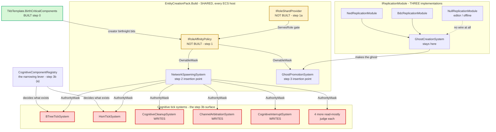
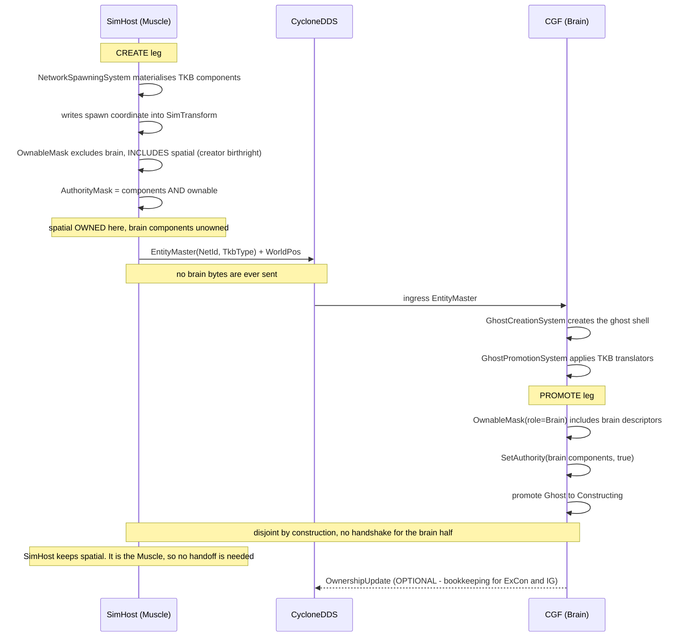
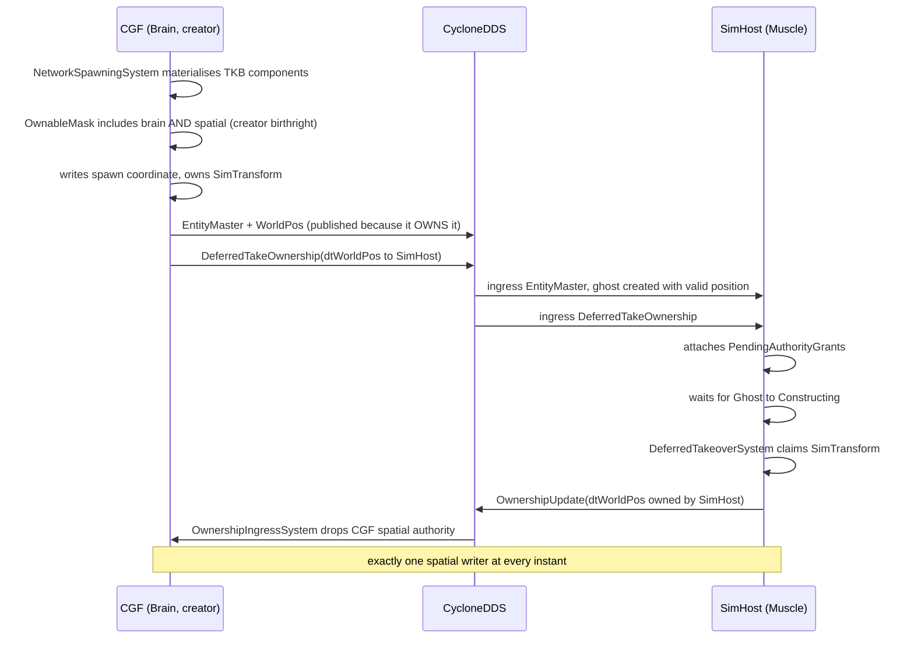

<!--STATUS
state: LIVE
updated: 2026-09-12
build-state: BUILDING — steps 0a, 0, 1a, 1, 2, 3, 3b(b) and §3.9's two-set model done. ⛔ NOT BUILT: step 4 supplies no policy yet, so every node still runs null; 3b(a) NOT done. ⛔⛔ §3.9 IS LOAD-BEARING AND IS NOW MODELLED IN CODE: REGISTER = ownedComponentSet ∪ readComponentSet, AUTHORITY = ownedComponentSet — read it before touching registration, and note NO HOST FILLS THE READ TABLE YET (step 4). ⛔ NOT "BUILT": open-risk below still binds (§3.5 / step 3b).
verified: ⭐⭐ THE WHOLE DESIGN WAS RE-MEASURED AGAINST THE TREE ON 2026-09-12 before step 0 was built
  (user: "verify design before, might be stale"). VERDICT: every DECISION holds and nothing load-bearing
  is stale — the six unbuilt types are still at ZERO .cs occurrences, the blanket grant is byte-identical,
  AddMandatoryComponent<T>() is exactly the mirror target §3.1 claims, and WithOwned<T>()/WithoutOwned<T>()
  are exactly at QueryBuilder.cs:93/:105. What HAD rotted was LOCATORS and one count, all corrected in
  place where they stood:
    - §2.1's blanket grant is at NetworkSpawningSystem.cs:184-191, not :174-182 (code unchanged).
    - §3.2's promote insertion point is at :208 / :211-214, not :122 / :129 — moved ~85 lines by step 0a,
      i.e. this design rotted against a change THIS design made.
    - inventory ⑥'s third SetAuthority caller is a PRIVATE NESTED class inside NedReplicationModule
      (declared :573, call at :607); "LocalAuthorityYieldSystem:563" reads like a file path and resolves
      to nothing. The count of three still holds.
    - §3.8's GhostCreationSystem NetworkIdentity is at :65, not :51.
    - 🔴 §3.5 UNDERCOUNTS WithOwned<T>() adoption: NINE production call sites, not three. The six it never
      saw are all in Stride/Hrot.Stride.Core, because the 2026-09-10 grep was scoped to FDP/+Hrot/. This
      STRENGTHENS §5 ①c rather than threatening it.
    - ⚠ §3.5's "SEVEN un-gated" is itself soft: its own table names eight beyond BTreeTickSystem, and a
      10th file (Fdp.Examples.UrbanCombat/TelemetryReporterSystem.cs) matches the same query. Step 3b must
      re-enumerate rather than trust the number.
  ⛔ AND A STRUCTURAL GAP, now fixed: this design carried a classDiagram and two sequenceDiagrams but NO
  module-relationship diagram, despite §3.5 being made entirely of "which systems tick, on which host,
  registered by whom". §4.1b is that diagram.
current-answer: §3 is the design; §4 carries the UML; §6 is the sequencing; ⭐⭐ §6a IS THE AS-BUILT and
  wins over §3.7 where they differ (§3.7 is unchanged and still right; §6a ADDS the two attributes the
  build needed).
  ✅✅✅ STEP 0a IS DONE, 2026-09-11 — the GhostPromotionSystem relocation into EntityCreationPack.
  ✅✅✅ STEP 1a IS DONE, 2026-09-12 — the role-shard seam. §6c IS ITS AS-BUILT and carries a deviation
  STEP 1 INHERITS: roles are OPAQUE int BITS, not NodeRole, because NodeRole lives in Hrot.Core and
  Hrot.Core REFERENCES Fdp.Toolkits — §3.8's literal signature cannot compile in its stated home. This is
  the SAME trap note (i) below already recorded for IClusterStateCache. ⇒ step 1's per-role mask table is
  keyed by int role bits too. RoleShardKey.TkbType is also a long, not §3.8's int.
  ✅✅✅ STEP 0 IS DONE, 2026-09-12 — TkbTemplate.BirthCriticalComponents + AddBirthCriticalComponent<T>(),
  seeded on every production template, plus a catalogue-wide rail. §6b IS ITS AS-BUILT and carries the
  one gap it does NOT close: file-loaded templates (TkbDeserializer declares no components, so a
  file-loaded template has an EMPTY list — and CreateTkb() is the DEV default while files are the
  PRODUCTION path). ⛔ That must be answered BEFORE step 2, or step 2 turns every file-loaded template
  into the origin-flash defect §3.1 exists to prevent.
  ✅✅✅ STEP 1 IS DONE, 2026-09-12 — IRoleAffinityPolicy + RoleAffinityPolicy, NO deviation. §6d is its
  as-built. ⚠ §6c's int-role-bit deviation was REVERTED the same day: NodeRole moved into Fdp.Core on the
  user's ruling, so the seam carries the typed signature the design always specified.
  ✅✅✅ STEPS 2 AND 3 ARE DONE, 2026-09-12 — both insertion points. §6e is their as-built.
  ✅✅ STEP 3b's QUERY-FILTER HALF IS DONE, 2026-09-12 — §6f is its as-built and carries TWO deviations:
  the gate is CONDITIONAL (§6's own ordering would have broken the cluster — an unconditional filter makes
  a node stop processing every entity it did not create, because a promoted ghost owns nothing), and it
  covers SIX systems rather than §3.5's two, each gated on a component it ALREADY required.
  🔴 3b's half (a) is NOT done and narrowing IS the primary fix — user ruling 2026-09-12, and the
  decisive point: WithOwned<T>() implies With<T>(), so you cannot ask about authority on a component that
  was never added. The gate is the RESIDUAL for nodes that legitimately have brain components.
  Registration is the ONLY gate on materialisation (BehaviorTkbTranslator.cs:52), which is why SimHost's
  spawns carry the whole brain tier. §6f has the measurement and my two withdrawn objections.
  ⛔⛔ Steps 3c and 4 remain unbuilt.
  🔴🔴 §3.9 ADDED 2026-09-12 AND IT CORRECTS THE ROLE MODEL ITSELF: a role has TWO component sets —
  ownedComponentSet (authority, what IRoleAffinityPolicy already models) and readComponentSet (owned
  elsewhere, replicated IN, consumed here). REGISTER = owned ∪ read; AUTHORITY = owned. Measured:
  NavigationIntent (16 wire refs) and MissionPlanQueue (9) are Brain-OWNED and Muscle-READ, so a Muscle
  node that stopped registering "brain components" would stop receiving its own orders.
  ✅ BUILT 2026-09-12 (CE-259bh, as-built §6g): `componentsPerRole` → `ownedComponentsPerRole`,
  `readComponentsPerRole` added as an OPTIONAL 4th constructor argument, and the interface now carries
  OwnedComponentSet / ReadComponentSet / RegisterComponentSet. 6 rails, 3 red-proofs.
  ⛔ NO HOST FILLS THE READ TABLE YET — that is step 4. 3b(a) remains blocked on CE-259bg (the brainActive
  proxy) and on that classification work, no longer on the model. ⚠⚠ CORRECTION 2026-09-12 (user challenge: "what actually
  blocks step 2?"): an earlier version of this block said STEP 2 IS BLOCKED on CE-259az. THAT WAS WRONG —
  the blocker was attached to the wrong step. Step 2 injects no policy (its own gate: "with no policy the
  mask is unchanged"), so it is INERT by construction and free to ship. CE-259az gates STEP 4, where
  hosts are actually handed a policy, and then only on a deployment that loads a NAMED TKB zip —
  TkbLoadClusterStateHandler Clear()s the catalogue before loading, so those templates carry an empty
  BirthCriticalComponents, while the programmatic fallback step 0 seeded is unaffected.
  ⭐ §5's three decisions are all RESOLVED (① / ①b 2026-09-01; ② user-approved and ③ user-ruled
  2026-09-10; ①c "nothing measurable remains"). What is left in §5 is a per-system REVIEW for step 3b,
  not a decision — so this design is NOT blocked on the user.
  ⚠ ONE FINDING FROM THE 0a BUILD, filed not fixed (§6a's last subsection): NetworkLifecycleSystemGroup's
  summary claims it groups GhostPromotionSystem so that "no ghost promotions occur during playback", but
  NO production site has ever put that system in it — promotion ran, and still runs, OUTSIDE the replay
  gate. The relocation preserved that behaviour deliberately; whether it SHOULD be gated is unanswered.
stale-below: nothing.
known-rot: §3.1's FIRST draft (2026-09-01, same day) applied ONE symmetric rule to every descriptor.
  That was WRONG and is corrected in place: it would have made a Brain creator produce SimTransform
  unowned, so the spawn position could never be published. §3.1 now carries two categories -- creator
  birthright for birth-critical spatial state, role affinity for defaultable cognitive state. Any
  reader finding a single-rule formulation outside that section has found rot.
open-risk: §3.5 -- BTreeTickSystem's query carries NO authority filter, so declining authority does
  not stop a node ticking a brain. Until step 3b lands, the rest of this design gates replication
  only. Do not mark this design BUILT while §3.5 is open.
  RE-MEASURED 2026-09-10, and §3.5 was wrong in three ways -- all corrected in place there:
  (1) the filter method is WithOwned<T>() at QueryBuilder.cs:93, NOT ".WithAuthority<T>() at :97";
  (2) "no production system uses it" is FALSE -- CoordinateTransformSystem:29, GeodeticSmoothingSystem:31
      and CarKinematicsSystem:73 all do, and it REPLACED the legacy manual owner checks (MOD1-P1T3),
      so it is an adopted pattern and its per-frame cost is two BitMask512 ops on an already-loaded
      cache line (EntityQuery.cs:157-158, step 4 after liveness' cold meta fetch);
  (3) MUCH BIGGER: §3.5 named ONE system and there are SEVEN un-gated, three of which WRITE cognitive
      state. HsmTickSystem:110-113 is the non-negotiable second -- BehaviorState.BrainTier selects the
      tier, so gating only BTreeTickSystem leaves every HSM-tier ghost double-ticked.
  => step 3b is a PER-SYSTEM PASS, not a one-line query edit. The DECISION (both (a) and (b)) is
  unchanged and its escape clause is closed.
  ALSO 2026-09-10, IN ORDER -- read the LAST line, the middle one is superseded:
    (i) my first lean on §5 decision (3) was "defer multi-Brain entirely" -- because IClusterStateCache
        publishes no brain index or count, and it lives in Hrot.Network.NED which REFERENCES
        Fdp.Toolkits, so the policy's designed home cannot see it without breaking the
        network-agnosticism ruling that settled decision (1). Those MEASUREMENTS stand.
   (ii) SUPERSEDED BY USER RULING, same day: the seam is NOT deferrable and the question is not
        brain-specific. "its not just multi brain, it is also multi muscle or multi perception... i need
        the shard provider interface for these, implemented for single brain and single muscle case we
        have now, but reimplementable later."
  => §3.8 IS THE SEAM and it is part of P3: IRoleShardProvider.ServesRole(role, key) + an extensible
     RoleShardKey (NetworkId => balancing, TkbType => specialisation) + SingleNodePerRoleShardProvider
     as the only implementation built. Both insertion points can fill the key -- measured:
     NetworkSpawningSystem has networkId local at :108 and stamps NetworkIdentity at :138;
     GhostPromotionSystem's ghost carries NetworkIdentity (GhostCreationSystem:65 -- re-measured 2026-09-12, was :51) and TkbIdentity.
     §3.3's OwnableMask signature and its single flat role mask are SUPERSEDED by §3.8 -- the mask is
     now PER ROLE and each role is shard-tested separately.
  🔴 §3.8 carries TWO CONSTRAINTS a later implementation MUST honour, and the first kills the obvious
     approach: ServesRole may read only inputs IDENTICAL ON EVERY NODE, so performance balancing CANNOT
     be a node measuring its own load (two nodes would both answer true => two owners, the exact
     conflict this design removes); and a shard mapping must be stable for an entity's lifetime,
     because the policy runs at birth and promotion only.
  §5 decision (2) APPROVED by the user 2026-09-10 ("yes on boot warning").
known-rot: an earlier draft sourced the role's ownable set from DescriptorOwnershipMap and called
  that "the one place a networking concept is defensible". WRONG -- corrected in §2.3 (user ruling,
  2026-09-01): there are multiple network implementations (NedNetworkFactory, BdcNetworkFactory,
  OfflineNetworkFactory) and that map is populated per implementation from its own translators, so a
  rule keyed on it would differ per stack and be empty offline. The role's ownable set is a
  BitMask512 of COMPONENT IDS assigned to the role. Nothing in this design may key on a descriptor.
known-conflict: Architect_Question_65 §4's Q65-B and §5.3's CE-142 both describe ownership as
  something a CREATOR delegates outward via DeferredTakeOwnership. This design does not retire that
  path -- explicit grants still win -- but it makes the DEFAULT declarative and local, which removes
  the need for a grant in the common case. Read §3.4 before quoting either as "the" mechanism.
design-basis: docs/blueprints/RULINGS.md R-138 (fully distributed, ownership per-component and
  transferable, NodeRole is a convention) - docs/blueprints/Architect_Question_65_Entity_Genesis_Uniformity.md
  §0 (no capability removal by design), §5.3 (mechanism vs policy) - docs/designs/tkb-1/DESIGN.md
  §6.5b gate 2 (registration is the narrowing lever).
related-designs:
  - DESIGN_Entity_Authoring_Surface.md — owns the CALLER side of creation (who asks for an entity and whom
    they nominate as owner). Measured 2026-09-12: INDEPENDENT of this design in both directions — this one
    decides component-level AUTHORITY after the entity exists, that one decides nothing about it.
  - DESIGN_Entity_Creation_Unification.md — owns the pack this design's step 0a moved GhostPromotionSystem
    into.
  - designs/brain-death/BD1-DESIGN.md — owns the brain-death LIFECYCLE and the brain-vs-muscle command
    routing rule. It is the design §3.9's narrowing would break: its §2.1 predicate reads BehaviorState
    locally, which a Muscle-only node cannot answer. ⚠ Measured 2026-09-12: that routing has no
    production caller today (CE-259bg), so the breakage is latent, not live.
-->
# ⭐⭐⭐ Role-Affinity Ownership — **every node decides locally what it owns, so no two nodes ever claim the same component**

> 🔒 **User, `2026-09-01`, verbatim:** *"SimHost having a muscle role should not instantiate any brain
> related components. If it does, this is a mistake. But even if it does, by applying 'auto-takeover'
> rules (i do not have brain role -> i will not own brain components, the brain will) it can create the
> components as unowned while CGF (applying same rule - I am brain, i will own the brain components)
> creates them as owned. No authority conflict."*

⭐⭐ **The whole design is that one sentence.** Ownership stops being something a creator *hands out* and
becomes something every node *derives* from its own role, using the same function. Two nodes running the
same function over the same entity cannot disagree.

---

## 0a. ⭐⭐⭐ A MEASURED FAILURE THIS DESIGN REMOVES BY CONSTRUCTION — `CE-256` *(`2026-09-09`)*

⭐ This design has been argued from principle. 📌 **Here is a concrete, reproduced failure of the grant
path, so the case rests on a measurement and not only on an argument.**

📐 **Measured on a CGF + Stride mode-2 cluster, both directions, `hill-attack-close`:**

| start order | result |
|---|---|
| node started **BEFORE** CGF is healthy | 🔴 **0 ownership takeovers.** The node replicates all 8 entities, promotes every ghost, composes its window and reports **0 errors** — and **owns nothing**, so nothing it is responsible for ever moves. **Survives a scenario reload** *(340 s observed)* |
| node started **AFTER** CGF's API answers | ✅ **8 takeovers, every time** |

📐 **The mechanism, exactly.** `BrainMuscleOwnershipStrategy.GetInitialGrants` asks
`IClusterStateCache.GetLeastLoadedNode(MuscleGround)`. That cache is fed by `NodeHeartbeat` samples at
**1 Hz**. ⛔ If no Muscle node is known **at the moment entities are created**, the strategy returns an
**empty grant list** — its own documented *"safe fallback: the Brain retains physics authority"* — and
⛔⛔ **nothing ever re-grants.** ⚠ The window is not a race between threads; it is a race between
**process start-up and scenario load**, and it is wide.

⇒ ⭐⭐⭐ **§3's rule removes this, and it is worth stating why in one line:** *"the creator declines, the
role-holder claims on promotion"* means ownership is **derived locally from a node's own role**, not
handed out by a remote party at creation time. ⛔ **A late joiner has nothing to miss** — it claims what
its role says it owns, whenever it arrives. ⇒ the failure above is **not a bug to fix in the grant path;
it is a property of having a grant path at all.**

| ⛔ what was deliberately NOT built | |
|---|---|
| **a re-grant / retry on node-join** | ⚠ The obvious fix: have CGF re-evaluate when a Muscle heartbeat arrives for entities with no muscle owner. ⛔ **Rejected** — it is a SECOND ownership mechanism, and this design deletes the first. 📌 Ruling 9. ⭐ Building it would mean building something this design removes |
| ⭐ **what WAS built instead** | a **detector**, in the node: `StrideNodeShell.CheckOwnershipStarvation` warns once when the node holds entities with a `SimTransform` and owns **none** of them, naming the start-order cause. ⚠ **It is not a fix and does not claim to be** — ⭐ it converts a silent 340-second mystery into one sentence at the moment it happens. 📐 Proven both ways: fires on the starved ordering *(8 entities, 0 owned)*, **silent** on the healthy one *(8 takeovers, 0 warnings)* |

⚠ **Read this as evidence FOR the design, not as a reason to patch around it.** ⭐ Until §3 is built the
operational rule is simply: **start a muscle node only after CGF answers.**

---

## 1. INVENTORY

⭐ Run `2026-09-01` through the codebase-memory **graph** (CLI), each cross-checked with `grep`.
⚠ `check_index_coverage` was **not** run; treat the totals as best-effort, not proof of completeness.

| # | query | total | what it returned |
|---|---|---|---|
| ① | `search_graph name_pattern=".*Ownership.*\|.*OwnershipDistribution.*" label="Class"` | **2** | `BrainMuscleOwnershipStrategy` (production) · `StubOwnershipStrategy` (test) |
| ② | `search_graph name_pattern=".*Ownership.*" label="Interface"` | **1** | `IOwnershipDistributionStrategy` — the only ownership seam that exists |
| ③ | `search_graph name_pattern=".*(Ownership\|Authority\|Takeover\|Promotion).*" label="Class"` | **44** | 23 production, listed in §2.2 |
| ④ | `search_graph name_pattern=".*TkbTranslator$" label="Class"` | **9** | the TKB→ECS projection set (`TkbTranslatorSet.Base()` carries 6 of them) |
| ⑤ | `grep "AuthorityMask"` production, non-test | **1 writer outside the wire path** | `NetworkSpawningSystem.cs:181` |
| ⑥ | `grep "SetAuthority("` production, non-test | **3** | `OwnershipIngressSystem:79` · `DeferredTakeoverSystem:118` · `LocalAuthorityYieldSystem` — **all three wire-driven**. ⚠ **Re-measured `2026-09-12`: the third is NOT its own file** — it is a PRIVATE NESTED class inside `NedReplicationModule` *(declared `:573`, registered `:385`, and the `SetAuthority` call is at **`:607`**)*, so the earlier `LocalAuthorityYieldSystem:563` reads like a file path and resolves to nothing. ⭐ The COUNT of three still holds |

⇒ ⭐⭐⭐ **Query ⑤ is the finding.** There is exactly **one** place where a node grants itself authority
over an entity it created, and it is a blanket copy.

---

## 2. 📐 THE MEASURED STATE

### 2.1 The blanket grant

`FDP/Toolkits/Fdp.Toolkits/NetworkSpawning/Systems/NetworkSpawningSystem.cs:184-191` *(⚠ re-measured `2026-09-12`; this section said `:174-182` — the CODE is byte-identical, only the lines moved)*:

```csharp
bool isLocalAuthority = cmd.OwnerNodeId == _localNodeId;
if (isLocalAuthority)
{
    // Locally spawned entities must start with authority bits enabled for
    // every component currently present on the entity.
    ref var compNS = ref world.GetComponentMask(entity.Index);
    ref var metaNS = ref world.GetMetadata(entity.Index);
    metaNS.AuthorityMask = compNS;          // ⬅ "I own everything I materialised"
}
```

| property | measured |
|---|---|
| a fresh entity starts **unowned** | ✅ `EntityIndex.cs:97,170,464` — `AuthorityMask.Clear()` |
| this is the **only** non-wire grant | ✅ inventory ⑤/⑥ |
| it is **role-blind and descriptor-blind** | ✅ the mask is copied wholesale |
| it lives in **shared** code every host runs | ✅ `Fdp.Toolkits`, reached via `EntityCreationPack` or direct construction |

📌 **This is why a SimHost-created tank reports `HasAuthority<BehaviorState> = True`** — measured live,
`MissionToMovementChainProbe`, `2026-09-01`.

### 2.2 What already exists and must be REUSED, not rebuilt

| piece | why it matters here |
|---|---|
| ⛔⛔ `DescriptorOwnershipMap` | 🔴 **MUST NOT carry ownership — see §2.3.** It is populated by `RegisterFromTranslator(descriptorOrdinal, targetComponentIds)`, i.e. from **one network implementation's** translator set |
| ⛔ `EDescriptorType` | 🔴 same reason — a descriptor **ordinal vocabulary belongs to a wire protocol**, not to the simulation |
| ⭐⭐ `BitMask512` | `AuthorityMask` and the component mask are **already** this type, and it has `BitwiseAnd(in BitMask512)` ⇒ a role's ownable set is representable as one mask and applied in a single call |
| `BehaviorProfileDto.BrainTier` | `byte`; `BehaviorTkbTranslator` already early-returns on `== 0` ⇒ *"is this a brain-enabled entity"* is answerable from the template alone |
| `GhostPromotionSystem` | applies the TKB translators at `:122`, promotes Ghost→Constructing at `:129`. Since `CE-142`'s sibling change it runs on **every** role |
| `PendingAuthorityGrants` | ⚠ **checked, and it does NOT conflict** — it carries an *explicit* pre-genesis `DeferredTakeOwnership` routing table, consumed by `DeferredTakeoverSystem`. An explicit grant is a deliberate override of the local default (§3.4) |
| `IOwnershipDistributionStrategy` | the **existing** policy seam. ⛔ Do not add a second one — §3.3 extends this family rather than inventing a parallel interface |

### 2.3 🔴🔴 **OWNERSHIP MUST BE NETWORK-AGNOSTIC** *(user ruling, `2026-09-01`)*

> 🔒 **User, verbatim:** *"we can have multiple different network implementations - ownership can not be
> tied to one of them, must be network agnostic. and role can have a bitmask of owned components
> assigned."*

📐 **Measured — the premise is fact, not hypothetical:**

| network factory | |
|---|---|
| `NedNetworkFactory` | the DDS/NED stack |
| `BdcNetworkFactory` | a **second, independent** implementation |
| `OfflineNetworkFactory` | ⭐ the **networkless** case — literally a host with no wire at all |
| *(+ `MockNetworkFactory`, `SpyNetworkFactory`, `StubNetworkFactory` in tests)* | |

⛔⛔ **`DescriptorOwnershipMap` is populated by `RegisterFromTranslator(descriptorOrdinal,
targetComponentIds)`** — from **one implementation's translator set**. `NedReplicationModule` fills it
from NED translators; a BDC node fills it differently; an offline node not at all. ⇒ 🔴 **an
ownership rule keyed on it would mean something different on every network stack and nothing offline.**

⇒ ⭐⭐⭐ **The role's ownable set is a `BitMask512` of COMPONENT IDS, assigned directly to the role.**
No descriptors, no ordinals, no translators, no participant. ⭐ `AuthorityMask` and the component mask
are already `BitMask512`, and it has `BitwiseAnd(in BitMask512)` — so the rule is one bitwise op.

⚠ **This retires §5's decision ①**, which had proposed `DescriptorOwnershipMap` as the source and called
it *"the one place a networking concept is defensible."* 🔴 **That was wrong** — it assumed one network
stack.

---

## 3. ⭐⭐⭐ THE DESIGN

### 3.1 The rule — ⚠ **TWO CATEGORIES, not one** *(architect correction, `2026-09-01`)*

⛔⛔ **An earlier draft of this section applied one symmetric rule to every descriptor.** 🔴 That was
wrong, and the architect named the exact flaw: applied to kinematics it would make **CGF create
`SimTransform` unowned**, so the spawner could never stamp — or publish — the entity's initial position.

> 🔒 **Architect, `2026-09-01`:** *"the position can not start empty (must always be valid — it is the key
> property of an entity)."*

⭐⭐⭐ **The asymmetry is about the INITIAL VALUE, not about the tier:**

| category | can it start empty? | ⇒ ownership pattern |
|---|---|---|
| ⭐ **cognitive** — `BehaviorState`, `BrainBlackboard`, `BrainBTreeState` | ✅ **yes.** An idle blackboard on tick 0 is correct; starting to think a frame later is invisible | ⭐⭐ **ROLE AFFINITY** — the creator declines, the role-holder claims on promotion |
| ⭐ **spatial / kinematic** — `SimTransform`, `SimVelocity` | ⛔ **no.** `(0,0,0)` is an origin flash, a wrong spatial-hash cell and a bogus first path query | ⭐⭐ **CREATOR BIRTHRIGHT** — the creator **always** owns at birth, then hands off via the existing `DeferredTakeOwnership` → `OwnershipUpdate` path |

⭐ **The generalised rule, stated once:**

> **A node owns a component at birth if it created the entity AND the component is BIRTH-CRITICAL;
> otherwise it owns it if, and only if, it holds the role that component belongs to.**

#### ⭐⭐⭐ Birth-criticality is a property of the COMPONENT, declared by the TKB — ⛔ not of a descriptor

> 🔒 **User, `2026-09-01`:** *"isn't 'which COMPONENTS are birth critical' a more correct question? Note
> there are networkless systems as well. Answer: SimTransform at the moment and only for entities having
> one. TKB should define what components are birth critical."*

⛔ **A descriptor is a NETWORKING concept.** A node with no DDS participant has no descriptor mapping at
all, so a descriptor-keyed definition of birth-criticality would be **undefined exactly where the
component still exists**. ⇒ ⭐ the property belongs to the component, and its source is the template.

⭐⭐ **And the home already exists.** `TkbTemplate.MandatoryComponents` is per-**component**
*(`MandatoryComponent { ComponentTypeId, IsHard, SoftTimeoutFrames }`)*, per-template, and its own
doc-comment says it is checked against the live `ComponentMask` — *"completely decoupled from the DDS
network layer."* ⇒ ⭐ the same structure, the same authoring style, the same network independence.

| ⭐ the shape | |
|---|---|
| **add** `TkbTemplate.BirthCriticalComponents` + `AddBirthCriticalComponent<T>()`, mirroring `AddMandatoryComponent<T>()` | ⭐ **"only for entities having one" is automatic** — a template that does not list it does not get it, and the create leg intersects with the entity's live component mask anyway |
| ⭐ **the initial content is ONE entry: `SimTransform`** | 🔒 the user's answer. ⛔ Everything else is role-affine until a measurement says otherwise |
| ⚠ **why a SECOND list rather than a flag on `MandatoryComponent`** | ⛔ they answer different questions — *"must be PRESENT before promotion"* vs *"the creator must OWN it at birth"*. Overloading the first would force a birth-critical-but-not-promotion-gating component to change promotion semantics to carry the flag. ⭐ Two lists for two concepts is not the duplicate-implementation trap; conflating them is §3.6's mistake in miniature |

📐 **Why the birthright is about REPLICATION, not the write itself** *(measured, and it sharpens the
architect's reasoning)*: `EntityRepository.SetComponent` is **not** authority-gated, so a creator can
always write the spawn coordinate locally. ⛔ But **every egress translator gates on `HasAuthority`** —
`EntityMasterEgressTranslator:73`, `EntityInfoEgressTranslator`, `MapVisualOverlayEgressTranslator:77`,
and the rest. ⇒ ⭐⭐ **a creator that declines `dtWorldPos` would write a correct position that is NEVER
PUBLISHED**, and every peer's ghost would sit at the origin. That is the real mechanism behind the
origin flash.

⭐⭐ **Within each category conflict is still impossible by construction** — for cognitive descriptors the
creator declines exactly what the role-holder claims; for kinematic descriptors exactly one node owns at
birth and hands off explicitly. ⇒ ⛔ **no handshake is needed for the cognitive half**; the kinematic half
keeps the handshake it already has, and needs it.

### 3.2 The two insertion points — both in shared code

| leg | file | change |
|---|---|---|
| **CREATE** — the creator declines | `NetworkSpawningSystem.cs:181` | `metaNS.AuthorityMask = compNS & policy.OwnableMask(...)` instead of `= compNS` |
| **PROMOTE** — the receiver claims | `GhostPromotionSystem`, after the translator loop, before the promote — ⚠ **re-measured `2026-09-12`: `:208` and `:211-214`**, not the `:122`/`:129` this row used to name. 📌 Step `0a`'s own relocation moved them ~85 lines, so the design rotted against a change THIS design made | set the bits `policy.OwnableMask(...)` names, guarded by `HasComponentByTypeId` |

⭐ Ordering is already correct: the translator loop has materialised the components before either point runs.

### 3.3 The seam — ⭐ **network-agnostic by construction**

⭐⭐ `IOwnershipDistributionStrategy` answers *"which grants do I hand out?"*. This design needs the
sibling question *"which components do I keep?"* — so it goes beside it, injected, and **role selects
the POLICY, never the mechanism** *(`CE-142`)*.

```csharp
public interface IRoleAffinityPolicy
{
    /// Component ids this node should own for an entity of this template.
    /// ⛔ No descriptors, no ordinals, no participant — see §2.3.
    /// The caller intersects the result with the entity's live component mask.
    /// ⚠ SUPERSEDED 2026-09-10 — the signature gains `in RoleShardKey key` and the flat
    ///   role mask becomes one mask PER ROLE. See §3.8 (the role-shard seam, user ruling).
    /// ✅ AS-BUILT 2026-09-12: this signature shipped EXACTLY as written. See §6d.
    BitMask512 OwnableMask(TkbTemplate template, bool isCreator, in RoleShardKey key);
}
```

| ⭐ where each bit comes from | |
|---|---|
| ⭐⭐ **the ROLE's assigned mask** | ⚠⚠ **this is the `ownedComponentSet` — see §3.9.** A role has a SECOND set, `readComponentSet` *(owned elsewhere, replicated in, consumed here — e.g. Muscle ↔ `NavigationIntent`)*, which REGISTRATION needs and AUTHORITY must never see. ✅ **Both are modelled since `2026-09-12` (§6g)** — the parameter below is `ownedComponentsPerRole`, and `readComponentsPerRole` sits beside it. A `BitMask512` of component ids **declared per role**, plain configuration. ⛔ Not derived from any wire vocabulary — a `NodeRole` → mask table, and nothing else. ⚠ **`2026-09-10`: the table is now consulted PER ROLE and gated by `IRoleShardProvider.ServesRole` — §3.8.** A single flat union is no longer correct |
| ⭐⭐ **∪ the template's `BirthCriticalComponents`, when `isCreator`** | §3.1's birthright. ⭐ The creator keeps these **whatever its role**, which is precisely the architect's correction |

⭐ **The whole rule is then:** `AuthorityMask = componentMask ∧ OwnableMask(template, isCreator)` —
one `BitwiseAnd`, no allocation, and it evaluates identically on NED, on BDC and offline.

⚠ **A node with no policy keeps today's behaviour** *(own everything you materialised)*, so adoption is
incremental and nothing changes until a host is handed one. ⭐ This is also what makes the networkless
host correct for free.

### 3.7 ⭐⭐⭐ COMPOSITION — **the policy belongs to `EntityCreationPack`, and that forces one relocation**

> 🔒 **User, `2026-09-01`:** *"where will you instantiate the code? This should be part of the shared
> entity creation pack, right?"* ⭐ **Yes — and asking it exposes that one of the two consumers is in the
> wrong module.**

📐 **Where the two consumers are built today:**

| consumer | built by | reachable from the pack? |
|---|---|---|
| `NetworkSpawningSystem` | ⭐ **`EntityCreationPack.Build()`** *(+ 3 hosts that still hand-assemble)* | ✅ yes |
| `GhostPromotionSystem` | ⛔ **`NedReplicationModule.RegisterSystems()` — ONE network implementation** | 🔴 **no** |

🔴🔴 **And that is already a defect, independent of this design.** `BdcReplicationModule.cs:66`
registers `GhostCreationSystem` — so **a BDC node creates ghosts** — but the file registers **no**
`GhostPromotionSystem`. ⇒ **those ghosts are never promoted**: they keep only their replicated
components, never get their TKB projection, and stay in `EntityLifecycle.Ghost` forever.
⭐ `OfflineNetworkFactory` returns a `NullReplicationModule`, so the same holds there *(harmlessly —
no ghosts arrive)*.

⇒ ⭐⭐⭐ **The concerns were bundled by LIFECYCLE ADJACENCY, not by subject:**

| step | concern | home |
|---|---|---|
| ghost **CREATION** — *a wire sample arrived, make a shell* | ⭐ genuinely a **NETWORK** concern | ✅ stays in the replication module — and `IReplicationModule` puts `GhostCreationSystem` **on the interface**, so every implementation must supply one |
| ghost **PROMOTION** — *apply the TKB template, decide ownership, transition the lifecycle* | ⭐⭐ a **SIMULATION** concern — it consumes the translator list and now the role policy, neither of which is networked | 🔴 **move to `EntityCreationPack`**, beside the request and spawn systems |

| ⭐ what this buys | |
|---|---|
| ⭐⭐⭐ **both consumers built by ONE factory** ⇒ they share the **same policy instance BY CONSTRUCTION** | ⭐ exactly the argument the pack already makes about the translator list — *"handing the SAME instance to the ELM and the spawn system is what makes that true BY CONSTRUCTION rather than by convention"* |
| ⭐⭐ **ghost promotion stops being NED-only** | ⇒ the BDC gap above closes as a side effect, not as separate work |
| ⭐ **the pack's own caution is honoured** | ⚠ its header says promotion is not its job because that would create *"a SECOND registrar"*. 📐 That reasoning assumed `NedReplicationModule` is **the** registrar; it is one of **three** modules and two do not register it. ⇒ this is a **MOVE**, not an addition — the pack becomes THE registrar and the NED module stops. ⛔ Both must land in one commit or promotion runs twice |

⚠⚠ **This SUPERSEDES a change made earlier the same day.** `NedReplicationModule`'s two role-gated
`GhostPromotionSystem` registrations were collapsed into one un-gated registration *(the `Q65-B`
sibling of `CE-142`)*. ⭐ That was correct for where the code sat, and it **disappears** when the
registration relocates. ⛔ Do not treat the two as alternatives — the relocation is the end state.

⭐ **Ordering is safe:** all three genesis systems carry `[UpdateInPhase(SystemPhase.BeforeSync)]`
*(`GhostCreationSystem.cs:9`, `NetworkSpawningSystem.cs:21`, `GhostPromotionSystem.cs:25`)*, so moving
the **registrar** does not move the **phase**. ⚠ Within-phase order still matters — creation must
precede promotion — and `EntityCreation.Unserviceable()` already exists to make a host's omission loud.

⭐ **The context gains one field**, mirroring `OwnershipStrategy`:

```csharp
public IRoleAffinityPolicy? RoleAffinityPolicy { get; init; }   // null => today's behaviour
```

### 3.8 ⭐⭐⭐ THE ROLE-SHARD SEAM — **generic over roles, built single-node, re-implementable later** *(user ruling, `2026-09-10`)*

> 🔒 **User, verbatim:** *"its not just multi brain, it is also multi muscle or multi perception. we might
> need performance balancing or nodes specialized to some types of entities or whatever. i need the shard
> provider interface for these, implemented for single brain and single muscle case we have now, but
> reimplementable later."*

⛔⛔ **This SUPERSEDES §5 ③'s "defer it entirely" lean of the same day.** ⭐ The seam ships with `P3`; only
a **sharding IMPLEMENTATION** is deferred. ⚠ And the question is no longer *"multiple Brains?"* — it is
**"which node serves role R for THIS entity?"**, asked identically for `Brain`, `MuscleGround`,
`Perception`, `NavigationSolver` and anything added later.

#### ⭐⭐ The seam

> ⚠⚠ **AS-BUILT `2026-09-12` — the sketch below is SUPERSEDED in TWO places.** The shipped signature
> takes an **opaque `int roleBit`, not a `NodeRole`**, and `RoleShardKey.TkbType` is a **`long`, not an
> `int`**. Both are forced, not preferences — see §6c. The sketch is kept because its *shape* is what was
> ruled on and that is unchanged.

```csharp
/// Does THIS node serve `role` for THIS entity?
/// ⛔ MUST be deterministic and must give the SAME answer on every node — see the contract below.
public interface IRoleShardProvider
{
    bool ServesRole(int roleBit, in RoleShardKey key);   // ⚠ was NodeRole — see §6c
}

/// ⭐ Extensible ON PURPOSE (the user's "or whatever"): adding Faction/Zone later touches
/// neither call site nor any existing implementation.
public readonly struct RoleShardKey
{
    public readonly long          NetworkId;   // stable per-entity discriminator ⇒ BALANCING
    public readonly long          TkbType;     // ⚠ was int — every TkbType in the system is a long
    public readonly DISEntityType DisType;     // already stamped in the entity header
}
```

📐 **Both insertion points can fill it — measured `2026-09-10`, this is why the shape is safe:**

| leg | what is in scope |
|---|---|
| **CREATE** `NetworkSpawningSystem` | `networkId` is a local at `:108`; `cmd.TkbType`; the DIS value computed at `:155`; and `NetworkIdentity` is stamped on the entity at `:138` |
| **PROMOTE** `GhostPromotionSystem` | the ghost carries `NetworkIdentity` *(added by `GhostCreationSystem.cs:51`)* and `TkbIdentity` *(read at `:117`)*; the template is already resolved at `:126` |

#### ⭐ What changes in `RoleAffinityPolicy` — ⚠ **a real change to §3.3, not a wrapper**

⛔⛔ **§3.3's `RoleAffinityPolicy` held ONE flat `roleOwnedComponents` mask.** ⭐ That no longer works:
each declared role must be **shard-tested separately**, so the policy needs a **component mask PER ROLE**
and unions only the roles it actually serves.

```
OwnableMask(template, isCreator, key):
    mask = ∅
    for each role bit R in declaredRoles:
        if shard.ServesRole(R, key):  mask |= componentsPerRole[R]
    if isCreator:                     mask |= template.BirthCriticalComponents
    return mask                       // caller still ∧ the live component mask
```

⭐ **The one implementation built now:**

```csharp
public sealed class SingleNodePerRoleShardProvider(int declaredRoles) : IRoleShardProvider
{
    // ⚠ AS-BUILT adds `roleBit != 0` — "no role" must be served by NOBODY, so a defaulted or
    //   forgotten NodeRole.None cannot quietly match every node.
    public bool ServesRole(int roleBit, in RoleShardKey key)
        => roleBit != 0 && (declaredRoles & roleBit) != 0;
}
```

⭐ **At the host's composition root the cast makes the boundary visible:**
`new SingleNodePerRoleShardProvider((int)NodeRole.Brain)`.

| ⭐ why this is the right default | |
|---|---|
| ⭐⭐ **it IGNORES the key** | ⇒ **byte-identical to the single-Brain/single-Muscle behaviour we have today**, so the seam costs nothing to adopt and the `P3` rails do not change meaning |
| ⭐⭐ **it is correct on a NETWORKLESS node for free** | a networkless node has no `NetworkIdentity`, so `NetworkId` is `0` — ⛔ but the default never reads it. ⇒ 🔒 the §2.3 network-agnosticism ruling holds **by construction**, not by care |
| ⭐ its input is what a host already declares | 📐 `SimHostApp.DefaultRole:182` · `CgfSubsystem.DefaultRole` — no new configuration |

#### ⛔⛔⛔ THE CONTRACT A LATER IMPLEMENTATION MUST HONOUR — **two constraints, and the first kills the obvious approach**

| # | constraint | why |
|---|---|---|
| 🔴🔴 **①** | **`ServesRole` may read ONLY inputs that are IDENTICAL ON EVERY NODE.** ⛔⛔ **A node may NOT decide from its own CPU load, queue depth, entity count or any locally-observed metric** | ⭐⭐⭐ **This design's whole safety property is that two nodes independently evaluating the same function cannot disagree** *(§3's opening)*. ⛔ If node A reads *its* load and node B reads *its* load, both can answer `true` for one entity ⇒ **two owners, which is exactly the conflict this design removes.** ⇒ 🔴 **"performance balancing" CANNOT be implemented as each node measuring itself.** It must be a **shard assignment published by ONE authority and replicated**, which every node then reads identically — the provider is handed that table, it does not compute one |
| 🔴 **②** | **the shard mapping must be STABLE for the lifetime of an entity** | ⭐ the policy is evaluated at **birth** and **promotion** only *(§3.2's two insertion points)*. ⇒ ⛔ if the mapping changes while entities are live, they keep their birth assignment while newly-promoted ghosts follow the new mapping — **ownership becomes history-dependent.** ⚠ **Today's constraint, stated so an implementer knows what they must add:** a shard mapping is fixed for a scenario's lifetime. ⛔ **Making it dynamic requires a RE-EVALUATION path, which is a SECOND ownership mechanism** *(ruling 9)* — that is a design of its own, not an implementation detail of this seam |

⭐ **A consequence worth stating, because it is benign:** if a shard table has not arrived yet, the
provider answers `false` for everyone and the entity is owned by no one ⇒ that is exactly §5 ②'s case,
which **logs once and does not fall back.** ⇒ the two decisions compose.

⚠ **NOT in scope of `P3`:** any shard table, its transport, its authority, or a balancing metric. ⭐ `P3`
ships **the interface, the key, the single-node implementation, and the per-role mask table** — nothing
else.

### 3.9 🔴🔴🔴 REGISTER ≠ OWN — **a role has TWO component sets, and this design only ever modelled one** *(user, `2026-09-12`)*

> 🔒 **User, verbatim:** *"intents are brain owned components that must be replicated to muscle so musle
> can read and act on them. so muscle cant simply stop registwring them because they are brain ones."*
> 🔒 **And on naming:** *"maybe renaming to ownedComponentSet and readComponentSet would make it more
> clear."*

⛔⛔ **THIS INVALIDATES A PROPOSAL THIS SESSION HAD ALREADY FORMED** — *"a role registers the components it
owns; split the cognitive bundle along the role line."* 🔴 **Wrong, and wrong in a way that would have
broken the cluster:** `NavigationIntent` is **Brain-OWNED** and **replicated to Muscle**, which reads it and
acts on it. A Muscle node that stopped registering *"brain components"* would stop receiving its own orders.

⭐⭐⭐ **The correct model: every component stands in ONE of THREE relationships to a role.**

| relationship | example *(measured)* | REGISTER? | OWN? |
|---|---|---|---|
| ⭐ **OWNED** — I have authority; I write it, I publish it | Muscle ↔ `SimTransform` · Brain ↔ `BrainBlackboard` | ✅ | ✅ |
| 🔴 **READ** — owned elsewhere, **replicated IN**, my systems consume it | ⭐⭐ **Muscle ↔ `NavigationIntent`, `MissionPlanQueue`** | ✅ **MUST** | ⛔ **never** |
| ⛔ **ABSENT** — never mine, never arrives, nothing here reads it | Muscle ↔ `BrainBTreeState`, `BrainHsm128` | ⛔ | ⛔ |

> ### ⭐⭐⭐ `REGISTER = ownedComponentSet ∪ readComponentSet`   ·   `AUTHORITY = ownedComponentSet`

⚠⚠ **`IRoleAffinityPolicy`'s table WAS the OWNED set only, under a name that did not say so.**
✅ **BUILT `2026-09-12` — `CE-259bh`, as-built in §6g:** `componentsPerRole` → `ownedComponentsPerRole`,
`readComponentsPerRole` added beside it, and the interface now answers the registration question directly
*(`OwnedComponentSet` · `ReadComponentSet` · `RegisterComponentSet`)* instead of leaving callers to OR two
tables — ⛔ **a caller that has to OR them is a caller that can forget the second half, which is the
mistake above.**

⚠ **What is still NOT done:** no host supplies a read table yet *(step 4)*, and the nine **unclassified**
rows below are still unclassified. ⇒ ⭐ the MODEL no longer blocks the narrowing chain; the
CLASSIFICATION does.

#### 📐 THE MEASUREMENT THAT FORCED THIS — **wire references per cognitive component, `2026-09-12`**

| component | wire refs | ⇒ for a MUSCLE node |
|---|---|---|
| ⭐⭐ **`NavigationIntent`** | **16** *(`NavigationIntentIngressTranslator` + `…EgressTranslator`)* | 🔴 **READ — must register** |
| ⭐ **`MissionPlanQueue`** | **9** *(`EntityMissionIngressTranslator` writes the component)* | 🔴 **READ — must register** |
| `BehaviorState` | 1 — ⚠ and it is `TacticalIntentEgressTranslator`'s `HasAuthority<>` **gate**, not a replication | ⛔ never arrives |
| `BrainBTreeState` · `BrainBlackboard` · `Blackboard1024` · `BrainHsm128` · `BrainHsm64` | **0** | ⛔ **ABSENT — safe to drop** |
| the three channels · `ActorCapabilityState` · `PreviousCapabilities` · `SimTier` · `PassengerBuffer` · `IsEmbarkedTag` | **0** | ⚠ **unclassified** — zero wire presence does NOT prove nothing local reads them |

⇒ ⭐ **The measured SAFE-TO-DROP set for a Muscle node is six:** the five brain internals **plus
`BehaviorState`**. ⛔ **Not the whole cognitive bundle**, and ⛔ **not derivable from "is it a brain
component"** — `NavigationIntent` is a brain component and must stay.

#### ⚠ WHY "zero wire references" IS NECESSARY BUT NOT SUFFICIENT

⛔ A component can be **produced locally** by a system this node schedules, with no wire involvement at
all. ⇒ the classification must be **per component, against the systems a role actually RUNS**, not against
a grep. 📌 The nine unclassified rows above are exactly where that work is.

#### ⭐⭐ WHAT THIS BUYS — **"can this node EVER own X?" becomes answerable statically**

🔒 The user's other observation: *"technicly the 'can ever have authority' question coukd be asked."*
⭐ With `ownedComponentSet` declared per role, that is a **composition-time** question — no entity, no
runtime state. ⇒ it is the right driver for **registration** and for a **boot-time diagnostic**
*(⚠ "this node registers a component its role can never own **and** never reads" is a configuration error
worth naming out loud — and it is exactly SimHost's current state)*.
⛔ **It is NOT the same question as `WithOwned<T>()`**, which asks *"do I own THIS ENTITY's copy right
now?"* — §3.5's execution gate. ⭐ Static "could ever" drives what EXISTS; runtime "do now" drives what
RUNS.

---

### 3.4 ⛔ What this does NOT retire

⭐ **Explicit `DeferredTakeOwnership` grants still win.** Role affinity is the **default**; a creator that
deliberately delegates a descriptor to a named node still does so, and `DeferredTakeoverSystem` /
`PendingAuthorityGrants` still apply it. ⇒ 🔒 `R-138`'s *"ownership is transferable per entity during
entity lifetime"* is preserved — this design only fixes the **initial** value, which was a blanket
`true`.

### 3.5 🔴🔴 **AUTHORITY DOES NOT STOP EXECUTION — measured, and it is a hole in the rule as stated**

📐 **`BTreeTickSystem.cs:62-65`:**

```csharp
var q = repo.Query()
    .With<BehaviorState>()
    .With<BrainBTreeState>()
    .With<BrainBlackboard>();      // ⛔ no authority filter of any kind
```

⇒ ⛔⛔ **Declining the authority bits does NOT stop a node ticking the brain.** Authority today governs
**replication** *(every egress translator checks it)* and a **few explicit in-system gates**
*(`TacticalIntentResolutionSystem:94`, whose own event doc says the `HasAuthority<BehaviorState>` checks
*"are sufficient to prevent"* duplicate execution — ⚠ that comment is about ASSIGNMENT, not the tick)*.
⛔⛔ **RE-MEASURED `2026-09-10`, AND THIS LINE WAS WRONG TWICE.** It read: *"`QueryBuilder:97` supports
`.WithAuthority<T>()`, and no production system uses it."*

| the old claim | 📐 measured `2026-09-10` |
|---|---|
| the method is `.WithAuthority<T>()` at `:97` | 🔴 **there is no such method.** It is **`WithOwned<T>()` at `QueryBuilder.cs:93`** *(plus `WithoutOwned<T>()` at `:105`)*. ⇒ the design named a symbol that does not exist, so every reader searching for it found nothing and could have concluded the capability was missing |
| *"no production system uses it"* | 🔴 **THREE production systems use it, and the comments say it REPLACED the legacy manual `PrimaryOwnerId == LocalNodeId` checks** *(`MOD1-P1T3`)*: `Fdp.Toolkits/Geographic/Systems/CoordinateTransformSystem.cs:29` `.WithOwned<Position>()` · `GeodeticSmoothingSystem.cs:31` `.WithoutOwned<Position>()` · `CarKinem/Systems/CarKinematicsSystem.cs:73` `.WithOwned<SimTransform>()`. ⇒ ⭐⭐ **this is an ADOPTED, production-proven pattern, not a dormant capability.** ⚠⚠ **AND EVEN THREE IS AN UNDERCOUNT — re-measured `2026-09-12`: there are NINE production call sites.** The six this design never saw are all in **`Stride/Hrot.Stride.Core`** *(`BulletReverseSyncSystem:144` · `SplitAuthorityStrideSyncScript:98` · `BulletCharacterMotor:168` · `PhysicsBodyLifecycleSystem:179,196` · `KinematicVehicleMotor:142`)*, because the `2026-09-10` grep was scoped to `FDP/`+`Hrot/`. 🔒 That is the `Stride/`-is-out-of-solution blind spot `CLAUDE.md` already names, hit again. ⭐ **It only STRENGTHENS the conclusion** — the physics/kinematics layer is built on this filter |
| *(implied)* the filter might cost per-frame time — §5 ①c's escape clause | ⭐⭐ **NOT a risk, measured at the enumerator.** `EntityQuery.cs:157-158` applies the authority masks as **step 4**, *after* the hot component-mask filter *and after* the cold `meta` fetch that the liveness check (`:145`) already pays. ⇒ the added cost is **two `BitMask512` ops on an already-loaded cache line**, and `CarKinematicsSystem` already pays it every frame in production. ⛔ **§5 ①c's *"if `.WithAuthority` proves to have a measurable per-frame cost"* is therefore CLOSED — it does not** |

⛔⛔⛔ **AND THE BIGGER FINDING: THIS SECTION NAMES ONE SYSTEM; THERE ARE SEVEN.**
📐 `grep -rln "With<BehaviorState>\|With<BrainBlackboard>\|With<BrainBTreeState>"` over `FDP/`+`Hrot/`,
tests excluded — **every one un-gated**:

| system | why it matters |
|---|---|
| 🔴🔴 **`HsmTickSystem.cs:110-113`** *(`.With<BehaviorState>().With<T>()`)* | ⭐⭐⭐ **the exact sibling of `BTreeTickSystem`.** `BehaviorState.BrainTier` selects which tier ticks *(`BTreeTickSystem:78-80` skips non-BTree)* ⇒ **gating only the BTree system leaves every HSM-tier ghost double-ticked.** ⛔ Non-negotiable: it ships with (b) or (b) is half a fix |
| 🔴 `CognitiveCleanupSystem.cs:26-32` | **WRITES** — `GetComponentRW<BrainBlackboard>` on **every** entity holding a blackboard, clearing interrupt bits ⇒ a node clobbers a blackboard another node owns |
| 🔴 `ChannelArbitrationSystem.cs:23-44` · `CognitiveInterruptSystem.cs:59-79` | both **WRITE** cognitive state on un-gated queries |
| ⚠ `TraceBufferLifecycleSystem.cs:46-49` · `MissionDirectorSystem.cs:91-94` · `Hrot.CGF` `MissionAdapterSystem` · `RouteContextSystem` | ⭐ read-mostly and/or Brain-only by composition ⇒ **judge each**, do not blanket-gate. ⛔ But judging each is the work, and it is not one line |

⇒ ⭐⭐ **(b) is a PER-SYSTEM PASS over ~7 systems, not a one-line query edit.** ⚠ That changes the
ESTIMATE, ⛔ not the decision — see §5 ①c.

⇒ ⭐⭐⭐ **The architect's Path-B line — *"SimHost does not touch or register brain components"* — is not
tidiness. It is the actual protection**, and it is `tkb-1/DESIGN.md` §6.5b gate ②: a component a node
never registers is skipped by the translator, so the query never matches and nothing ticks.

| ⭐ closure | |
|---|---|
| **(a) PRIMARY — registration** | narrow a Muscle-only node's `CognitiveComponentRegistry` so brain components are never registered. ⭐ Zero runtime cost, uses the architecture's own narrowing lever. 📐 Today `Hrot/Subsystems/Hrot.SimHost/CognitiveComponentRegistry.cs:32-40` registers `BehaviorState`, `LocomotionChannel`, `BrainBTreeState`, `BrainBlackboard` |
| **(b) ALSO REQUIRED — the tick gate** | add **`.WithOwned<BehaviorState>()`** *(the real method name — see the correction above)* to `BTreeTickSystem`'s query **AND `HsmTickSystem`'s**, then judge the other five. ⚠ **(a) alone is not sufficient**: a node that legitimately registers brain components *(all-in-one, or a Muscle node running its own brains per `R-138`)* and then receives a ghost whose brain another node owns would **double-tick**. Authority is the only thing that can separate *"my brain"* from *"someone else's brain"* on such a node |

### 3.6 ⚠ TWO different "authority" concepts — do not confuse them

| concept | where | who reads it |
|---|---|---|
| ⭐ **per-component `AuthorityMask`** — `EntityRepository.HasAuthority(entity, componentId)` | `EntityMetadataCold.AuthorityMask` | all egress translators · `EcsPatchContext` · `TacticalIntentResolutionSystem` · **this design** |
| ⚠ **entity-level `NetworkAuthority`** — a component whose `HasAuthority => PrimaryOwnerId == LocalNodeId` | `Replication/Components/NetworkAuthority.cs:26` | `DamageSystem:51` · `HealthApplicationSystem:64` · `FireProcessingSystem:71` · `CycloneNetworkCleanupSystem:53` |

⛔ **Role affinity operates on the MASK.** Declining mask bits does **not** change `NetworkAuthority`, so
combat systems are unaffected — ⭐ which is correct here, but it must not be assumed the other way round.

---

## 4. ⭐⭐ UML

### 4.1 Classes

```mermaid
classDiagram
    class IRoleAffinityPolicy {
        <<interface>>
        +OwnableMask(template, isCreator, key) BitMask512
        +OwnedComponentSet BitMask512
        +ReadComponentSet BitMask512
        +RegisterComponentSet BitMask512
    }
    class RoleAffinityPolicy {
        -NodeRole declaredRoles
        -Dictionary~NodeRole,BitMask512~ ownedComponentsPerRole
        -Dictionary~NodeRole,BitMask512~ readComponentsPerRole
        -IRoleShardProvider shard
        +OwnableMask(template, isCreator, key) BitMask512
        +OwnedComponentSet BitMask512
        +ReadComponentSet BitMask512
        +RegisterComponentSet BitMask512
    }
    class IRoleShardProvider {
        <<interface>>
        +ServesRole(role, key) bool
    }
    class SingleNodePerRoleShardProvider {
        -NodeRole declaredRoles
        +ServesRole(role, key) bool
    }
    class RoleShardKey {
        <<struct>>
        +long NetworkId
        +long TkbType
        +DISEntityType DisType
    }
    class IOwnershipDistributionStrategy {
        <<interface>>
        +GetInitialGrants(type, masterNodeId) DescriptorGrant[]
    }
    class NetworkSpawningSystem {
        +ProcessSpawn(cmd)
    }
    class GhostPromotionSystem {
        +Execute(view, dt)
    }
    class DescriptorOwnershipMap {
        +GetComponentIdsForDescriptor(id) int[]
    }
    class TkbTemplate {
        +MandatoryComponents List
        +BirthCriticalComponents List
        +AddBirthCriticalComponent~T~()
    }
    class EntityRepository {
        +SetAuthority(entity, typeId, bool)
        +HasComponentByTypeId(entity, id) bool
    }
    class DeferredTakeoverSystem {
        +Execute(view, dt)
    }

    IRoleAffinityPolicy <|.. RoleAffinityPolicy
    IRoleShardProvider <|.. SingleNodePerRoleShardProvider
    RoleAffinityPolicy --> IRoleShardProvider : does THIS node serve the role for THIS entity
    RoleAffinityPolicy ..> RoleShardKey
    NetworkSpawningSystem ..> RoleShardKey : builds from networkId + TkbType
    GhostPromotionSystem ..> RoleShardKey : builds from NetworkIdentity + TkbIdentity
    NetworkSpawningSystem --> IRoleAffinityPolicy : declines what role excludes
    NetworkSpawningSystem --> TkbTemplate : birth-critical always kept
    RoleAffinityPolicy --> TkbTemplate : reads BirthCriticalComponents
    note for RoleAffinityPolicy "BOTH SETS BUILT 2026-09-12 (CE-259bh, 6g). REGISTER = owned + read is a MEMBER, not a caller's OR. The three set properties are shard-FREE: registration is per NODE, the shard is per ENTITY"
    GhostPromotionSystem --> IRoleAffinityPolicy : claims what role includes
    NetworkSpawningSystem --> EntityRepository
    GhostPromotionSystem --> EntityRepository
    DeferredTakeoverSystem --> EntityRepository : explicit grants override

    note for IRoleShardProvider "BUILT 2026-09-12. GENERIC over roles. NodeRole moved to Fdp.Core so the seam is typed - see 6c"
    note for SingleNodePerRoleShardProvider "NEW - the ONLY implementation built now. IGNORES the key, so it is byte-identical to today and correct on a networkless node"
    note for RoleShardKey "NEW - extensible on purpose: adding faction or zone later touches neither call site nor any implementation"
    note for NetworkSpawningSystem "EXISTS - line 186-190 today assigns the full component mask. networkId is a local at 108, NetworkIdentity stamped at 138"
    note for GhostPromotionSystem "EXISTS - translators at 122, promote at 129. Ghost carries NetworkIdentity from GhostCreationSystem 51 and TkbIdentity"
    note for DescriptorOwnershipMap "EXISTS but DELIBERATELY UNUSED here - it is populated per network implementation, see 2.3"
    note for TkbTemplate "EXISTS - MandatoryComponents is already per-component and network-free. BirthCriticalComponents is the ONE addition, initial content SimTransform"
    note for DeferredTakeoverSystem "EXISTS - unchanged, still the override path"
```



### 4.1b ⭐⭐⭐ MODULE RELATIONSHIPS — **who REGISTERS each system, and who TICKS it each frame**

⚠⚠ **ADDED `2026-09-12`. This design was `READY-TO-BUILD` for eleven days with NO module diagram**, and
obligation ①a exists for exactly the failure mode this design's §3.5 is made of: *"which systems tick,
on which host, registered by whom."* ⛔ The class diagram shows what EXISTS and the two sequences show
ONE path each; **only this one shows what is NEVER REACHED.**



⭐⭐ **CAPTION — what this shows that the prose and the other two diagrams hid.**

| ⭐ | |
|---|---|
| ⭐⭐⭐ **the RED band is the answer to *"is this design cosmetic?"*** | every one of those systems reads the world **without** consulting `AuthorityMask`. ⇒ the two insertion points can set the bits perfectly and **nothing changes behaviour** until step 3b. ⛔ Prose said this in a sentence; the diagram makes it the widest thing on the page |
| ⭐⭐ **the policy has TWO consumers, not one** | `NetworkSpawningSystem` *(create)* and `GhostPromotionSystem` *(promote)*. ⭐ Both are now inside **one** shared pack — which is only true since step `0a` moved promotion out of `NedReplicationModule`. ⇒ **step 0a was a precondition for this design, not a tidy-up** |
| ⭐⭐⭐ **the dead edge: `NullReplicationModule`** | drawn dotted. A host with no wire still creates ghosts through the same seam, and **`IRoleAffinityPolicy` must answer on it** — that is `§2.3`'s network-agnosticism made visible rather than argued |
| ⭐ **`CognitiveComponentRegistry` points at the TICK systems, not at the pack** | it is step 3b's *(a)* lever and it works by **making the component not exist**, so the query never matches. ⛔ It cannot help the case where a node legitimately registers brain components and receives someone else's ghost — which is why 3b needs *(b)* as well |
| ⚠ **what is NOT drawn, deliberately** | the per-frame scheduler phase of each tick system. That is `ModuleHostKernel` scheduling, unchanged by this design, and drawing it would invite the `NetworkLifecycleSystemGroup` mistake in reverse |

---

### 4.2 Sequence — **Path B: a Muscle node creates a brain-enabled entity**

⚠ The create leg is the half that matters. A promote-only diagram describes a *claim*, and a claim needs
a yield; a symmetric decline needs nothing.



### 4.3 Sequence — **Path A: the Brain creates it, and must hand the spatial half off**

⭐⭐ This is the leg the architect's correction protects, and it is **entirely existing machinery** — the
design adds nothing here beyond *not breaking it*.



---

## 5. ⚠ THE THREE OPEN DECISIONS

| # | question | ⭐ lean | what would change it |
|---|---|---|---|
| **①** | ~~descriptor set or component-id set?~~ | ✅ **SETTLED `2026-09-01` — a `BitMask512` of COMPONENT IDS assigned to the role.** ⛔ Not `DescriptorOwnershipMap`: it is populated per network implementation *(NED / BDC / offline)*, so an ownership rule keyed on it would differ per stack and be empty offline. See §2.3 | — |
| **①b** | ~~which DESCRIPTORS are birth-critical~~ | ✅ **SETTLED `2026-09-01` — and the question itself was wrong.** It is a **COMPONENT** property *(descriptors are a networking concept; a networkless node has none)*, declared by the **TKB template**, and the initial content is **`SimTransform` only, only for templates that list it**. See §3.1 | — |
| **①c** | 🔴 **the execution gate** *(§3.5)* — registration, the query filter, or both? | ⭐⭐ **both** — UNCHANGED, and the escape clause is now DEAD. ⚠⚠ **RE-MEASURED `2026-09-10`, three corrections in §3.5:** the method is **`WithOwned<T>()`**, not `.WithAuthority<T>()`; **three production systems already use it** *(it replaced the legacy manual owner checks)*; and its cost is **two `BitMask512` ops on an already-loaded cache line** *(`EntityQuery.cs:157-158`, step 4 after the cold `meta` fetch liveness already pays)*. ⇒ ⛔ **the "measurable per-frame cost" that would have flipped this lean does not exist.** 🔴 **What DID change is the SIZE:** §3.5 named ONE system; there are **SEVEN** un-gated, three of which WRITE cognitive state, and **`HsmTickSystem` is the non-negotiable second** *(the `BrainTier` field selects BTree vs HSM ⇒ gating only BTree leaves HSM ghosts double-ticked)* | ⛔ **nothing measurable remains.** The only open part is the per-system judgement on the other five — a review, not a decision |
| **②** | nobody holds the role ⇒ the component is owned by **no one** and nothing ticks it | ✅✅ **APPROVED BY THE USER `2026-09-10`** *("yes on boot warning")* — **log once per entity, no fallback, PLUS the boot warning.** A fallback *("creator keeps it after N frames")* reintroduces exactly the race this design removes. ⭐⭐ **AND TAKE THE STARTUP CHECK NOW, not "later"** *(re-measured `2026-09-10`)*: the *"what would change it"* column deferred a startup cluster check as future work, ⛔ **but the predicate already exists and is one line** — `IClusterStateCache.GetLeastLoadedNode(NodeRole.Brain)` returns `int?` and **`null` IS "nobody holds the role"** *(`Hrot.Network.NED/Routing/IClusterStateCache.cs:23`)*. ⚠ It is NED-only, so it belongs at the node's composition root, ⛔ never inside the policy *(§2.3)* | if a deployment legitimately runs with no Brain *(a pure-Muscle test cluster)* the boot check must WARN, not throw |
| **③** | ~~multiple Brain nodes~~ ⇒ ⭐⭐⭐ **RE-FRAMED: multi-node sharding for ANY role** | ✅✅✅ **RULED BY THE USER `2026-09-10` — BUILD THE SEAM NOW, DEFER ONLY THE IMPLEMENTATION.** 🔒 *"its not just multi brain, it is also multi muscle or multi perception. we might need performance balancing or nodes specialized to some types of entities or whatever. i need the shard provider interface for these, implemented for single brain and single muscle case we have now, but reimplementable later."* ⇒ 📄 **§3.8 is the seam** — `IRoleShardProvider.ServesRole(role, key)` + an extensible `RoleShardKey` *(NetworkId ⇒ balancing · TkbType ⇒ specialisation)*, with `SingleNodePerRoleShardProvider` as the only implementation built. ⛔⛔ **BOTH of the day's earlier positions are SUPERSEDED:** the ORIGINAL `NetworkId % brainCount == myBrainIndex` lean *(unbuildable — `IClusterStateCache` publishes no index or count, and it lives in `Hrot.Network.NED` which REFERENCES `Fdp.Toolkits`, so the policy's home cannot see it without breaking the §2.3 ruling)* **and** my *"defer it entirely"* lean *(too coarse — it deferred the SEAM, which is what makes the later work possible without touching the two insertion points)*. 🔴 **§3.8 carries the two constraints a later implementation MUST honour**, and the first one kills the obvious approach: ⛔ **a node may not shard on its own load** — the answer must come from a mapping identical on every node, or two owners re-appear | ⭐ nothing open in the SEAM. ⛔ What is deliberately unanswered: the shard table's authority, transport, and balancing metric — and **making a mapping change mid-scenario**, which needs a re-evaluation path and is therefore a design of its own *(ruling 9)*, not an implementation of this one |

---

## 6. ⭐ SEQUENCING & ACCEPTANCE

| step | what | gate |
|---|---|---|
| **0a** | ✅✅✅ **DONE `2026-09-11` — see §6a AS-BUILT.** ~~RELOCATE `GhostPromotionSystem` registration from `NedReplicationModule` into `EntityCreationPack`~~ | ✅ gate met, and made STRUCTURAL rather than counted: `[SingleInstance]` + `[UpdateAfter]`. Four inverse-edit red-proofs |
| **0** | ✅✅✅ **DONE `2026-09-12` — see §6b AS-BUILT.** ~~`TkbTemplate.BirthCriticalComponents` + `AddBirthCriticalComponent<T>()`, mirroring `AddMandatoryComponent<T>()`; seed **`SimTransform`** on the templates that carry one~~ | ✅ both gate halves met *(`TkbTemplateTests`)*, ⭐ plus a catalogue-wide rail the step did not ask for. ⚠ **ONE GAP, recorded not closed: file-loaded templates** — §6b |
| ⭐⭐ **1a** | ✅✅✅ **DONE `2026-09-12` — see §6c AS-BUILT.** ~~`IRoleShardProvider` + `RoleShardKey` + `SingleNodePerRoleShardProvider` in `Fdp.Toolkits/Replication`~~ — ⚠ **the signature DEVIATED: roles are opaque `int` bits, because `NodeRole` lives in `Hrot.Core` and the dependency cannot run this way** | unit: the default provider answers `true` for every DECLARED role and `false` otherwise, **for any key** *(incl. `NetworkId == 0`, the networkless case)*; ⭐ **a rail that the default IGNORES the key** — red-proof: make it read `NetworkId` and the "identical on every node" contract rail reddens |
| **1** | ✅✅✅ **DONE `2026-09-12` — see §6d AS-BUILT.** ~~`IRoleAffinityPolicy` + `RoleAffinityPolicy` in `Fdp.Toolkits/Replication`, taking the provider and a mask PER ROLE~~ ⭐ **Shipped as specified — no deviation.** | unit: Brain and Muscle masks are **disjoint** over the brain/kinematic sets, **and** birth-critical components are in **both**. ⭐⭐ **AND the shard rail: with a stub provider answering `false` for `Brain`, a Brain-declaring node's mask contains NO brain components** — this is the one that proves the seam is real rather than decorative |
| **2** | ✅✅✅ **DONE `2026-09-12` — see §6e AS-BUILT.** ~~`NetworkSpawningSystem` intersects with the policy; null policy keeps today's behaviour~~ ⚠ the line is **`:191`**, not the `:181` this row named | rail: with no policy, the mask is unchanged *(red-proof: inject a policy, assert the bits drop)*. ⭐⭐ **AND the birthright rail: a creator ALWAYS keeps `dtWorldPos`, whatever its role** — this is the one the architect's correction exists to protect, so it is written before step 2's code |
| **3** | ✅✅✅ **DONE `2026-09-12` — see §6e AS-BUILT.** ~~`GhostPromotionSystem` claims after the translator loop~~ ⚠ the insertion point is **`:208`/`:211-214`**, not the `:122`/`:129` §3.2 named | ✅ met, plus three the row did not ask for: no-policy passthrough, **no birthright for a promoter**, and an explicit grant surviving |
| **3b** | ✅✅ **THE QUERY-FILTER HALF DONE `2026-09-12` — see §6f AS-BUILT.** ⛔ The REGISTRATION-narrowing half (a) is NOT done and is now a QUESTION, not a task — §6f says why it would remove a capability |  rail: a node holding brain components it does **not** own ticks them **zero** times. ⛔ **Without this the whole design is cosmetic** — authority would gate replication while both nodes still ran the tree |
| ⭐ **3c** | 🆕 **the BOOT WARNING** *(§5 ② — user-approved `2026-09-10`)*: at the composition root, warn once if `IClusterStateCache.GetLeastLoadedNode(NodeRole.Brain)` is `null`. ⛔ **WARN, never throw** *(a pure-Muscle test cluster is legitimate)*, and ⛔ **at the root, not in the policy** — it is NED-only and the policy stays network-agnostic *(§2.3)* | rail: the warning fires on a roster with no Brain and is **silent** when one is present |
| **4** | hand CGF a Brain policy and SimHost a Muscle policy at their composition roots, ⭐ **each with a `SingleNodePerRoleShardProvider` over the role that host already declares** *(`SimHostApp.DefaultRole:182` · `CgfSubsystem.DefaultRole`)* | ⭐⭐ **the acceptance test:** a SimHost-created brain-enabled entity ends with `HasAuthority<BehaviorState>` **false on SimHost and true on CGF**, and `TacticalIntentResolutionSystem`'s gate passes |

## 6g. ✅✅✅ AS-BUILT — **§3.9's TWO-SET ROLE MODEL, shipped `2026-09-12`** *(`CE-259bh`, obligation ⑤)*

⭐⭐⭐ **What changed: the role model itself, not a step of the plan.** §3.9 established that a role has two
component sets and that this design only ever modelled one. ⛔ Until this landed, **registration could not
be derived from a role at all** — and deriving it from the owned set alone is the measured mistake that
would stop a Muscle node receiving its own orders.

| where | the as-built |
|---|---|
| ⭐⭐ `IRoleAffinityPolicy` | **three new members**, all composition-time: `OwnedComponentSet` · `ReadComponentSet` · `RegisterComponentSet`. ⭐ `OwnableMask(...)` is unchanged |
| ⭐⭐ `RoleAffinityPolicy` | `componentsPerRole` → **`ownedComponentsPerRole`**; **`readComponentsPerRole` added as an OPTIONAL 4th argument** *(`null` ⇒ `REGISTER == OWNED`, so every existing 3-argument call site compiles and behaves identically)*. The three sets are **precomputed in the constructor** |
| ⭐ rails | **6 added to `RoleAffinityPolicyTests`** *(the feature's own suite — `R-142` ④, no parallel class)*; suite 23/23, project **2123/2123** |

### ⭐⭐⭐ THREE DECISIONS WORTH THE NAME — **each is a place the obvious implementation is wrong**

| # | the decision | ⛔ why the obvious thing is wrong |
|---|---|---|
| **①** | ⭐⭐ **`RegisterComponentSet` is a MEMBER, not a caller's `owned │ read`** | ⛔ a caller that must OR two sets is a caller that can forget the second one — **and forgetting the second one is the exact measured failure §3.9 opens with.** ⇒ the union is exposed so the mistake is unrepresentable, not merely documented |
| **②** | 🔴🔴 **the three sets are SHARD-FREE** | ⛔⛔ `OwnableMask` consults `IRoleShardProvider`, so the tempting implementation of *"what can I own?"* is to call it with a `default` key. ⚠ **That is wrong: the shard answers PER ENTITY** *("does another node serve Brain for THIS one?")* **and registration has no entity.** A node that deregistered a component because it does not serve that role for ONE entity could not handle the next. ⭐ Railed directly — `TheRegistrationSets_AreNotNarrowedByTheShard` |
| **③** | ⚠⚠ **`OwnedComponentSet` EXCLUDES the creator's birthright** | ⭐ `BirthCriticalComponents` are per TEMPLATE and this property has no template ⇒ **a node genuinely can own a component absent from this set** *(every entity it creates)*. ⛔ **A boot diagnostic reading "can never own" off it alone would be wrong for exactly the components where being wrong is loudest** — the origin-flash failure §3.1 exists to prevent. ⭐ Railed, because the tempting "fix" *(fold the birthright in)* turns a per-template fact into a node-wide claim |

### 📐 RED-PROOFS — **inverse edits, all three reverted**

| the inverse edit | ⭐ what reddened |
|---|---|
| drop the `BitwiseOr` that unions `read` into `RegisterComponentSet` | **2 rails** — the register half of `AReadComponent_IsRegistered_AndNeverOwned`, and the equation rail |
| `OwnableMask` also ORs the read table | **1 rail** — the authority half of the same rail ⇒ ⭐⭐ **the two halves fail in OPPOSITE directions**, which is precisely why one set could never express both |
| shard-gate `UnionOverDeclaredRoles` | **1 rail** — `TheRegistrationSets_AreNotNarrowedByTheShard`, i.e. decision ② above is load-bearing, not a comment |

### ⛔ WHAT THIS DOES **NOT** DO

⛔⛔ **No host fills the read table** — that is step 4, and until then every node still runs a `null` policy
and registers exactly what it registers today. ⇒ ⭐ **this ships inert, like every step before it.**
⚠ **And `CE-259bf`** *(narrowing SimHost's `CognitiveComponentRegistry`)* **is no longer blocked on the
MODEL** — it is blocked on `CE-259bg` *(the `brainActive` routing proxy)* and on classifying §3.9's nine
**unclassified** components, which is per-component work against the systems each role actually runs.

## 6f. ✅✅ AS-BUILT — **step `3b`'s QUERY FILTER, shipped `2026-09-12`** *(obligation ⑤)*

⭐⭐⭐ **This is the step that stops the design being cosmetic.** Authority gates REPLICATION — every egress
translator checks it — ⛔ but a QUERY does not. Without this, a node could decline the brain components,
publish nothing, and **still run the tree**.

### 🔴🔴 DEVIATION ① — **THE GATE IS CONDITIONAL, AND §6's ORDERING WOULD HAVE BROKEN THE CLUSTER**

⛔⛔ **§6 lists `3b` BEFORE step 4, and an unconditional filter shipped in that order reproduces the very
bug §0a opens with.** 📐 Measured, and it follows from this design's own rails:

| | |
|---|---|
| `WithOwned<T>()` requires local authority over `T` | `QueryBuilder.cs:93-98` |
| a promoted ghost owns **NOTHING** today | railed in step 3 — `WithNoPolicy_APromotedGhostClaimsNothing` |
| nothing supplies a policy until **step 4** | every node runs `null` |
| ⇒ an unconditional filter makes a node **stop processing every entity it did not create itself** | 🔴 which is `CE-256` verbatim: *"owns nothing, so nothing it is responsible for ever moves"* |

⇒ ⭐⭐⭐ **The gate follows the POLICY, not the step number.** A host handed an `IRoleAffinityPolicy` has by
that act said *"I know which components are mine"* — and only then does *"do not touch what is not mine"*
mean anything. ⭐ Same opt-in discipline that made steps 2 and 3 safe to ship early; `gateOnAuthority`
defaults to `false` and one flag threads to both cognitive modules from `CgfLogicPack`.

⚠ **`WithOwnedWhen<T>(gate)`** *(`Fdp.Core`)* is what makes the off-path provably identical: it is exactly
`With<T>()` when the gate is off.

### ⚠ DEVIATION ② — **SIX systems, not the two §3.5 names, and the gate component differs per system**

⛔ §3.5 prescribes `.WithOwned<BehaviorState>()` on `BTreeTickSystem` and `HsmTickSystem`. 📐 Two problems:

| | |
|---|---|
| ⭐⭐ **the other writers make it half a fix** | `ChannelArbitrationSystem`, `CognitiveInterruptSystem` and `CognitiveCleanupSystem` all **WRITE** cognitive state on un-gated queries. ⛔ Gating only the ticks leaves a node clobbering a brain another node owns — and the red-proof confirms it: leaving **one** system un-gated reddens the gate rail |
| 🔴 **two of them never queried `BehaviorState` at all** | `CognitiveInterruptSystem` and `CognitiveCleanupSystem` key on `BrainBlackboard`. ⇒ gating them on `BehaviorState` would have added a `With<BehaviorState>` they did not have and **silently NARROWED the matched set even with the gate OFF** — a behaviour change wearing a feature flag. ⭐ **The rule applied instead: gate each system on a component it ALREADY requires**, so the only change is the authority bit |

⭐ **Gated (6):** `BTreeTickSystem`, `HsmTickSystem<T>`, `ChannelArbitrationSystem` *(both queries)* and
`MissionDirectorSystem` on `BehaviorState`; `CognitiveInterruptSystem` *(both queries)* and
`CognitiveCleanupSystem` on `BrainBlackboard`.
⛔ **Deliberately NOT gated:** `TraceBufferLifecycleSystem` and `BehaviorFrameSystem` *(diagnostics /
pulse, no cognitive writes)*; `MissionAdapterSystem` and `RouteContextSystem` *(in `Hrot.CGF`, so they can
only ever run on a Brain host)*; `Fdp.Examples`' `TelemetryReporterSystem` *(not production)*.

### 📐 THE ENUMERATION — **§3.5's numbers were soft, as warned**

📐 Re-measured `2026-09-12`: **10 production files** match the cognitive-query pattern, not the "SEVEN"
§3.5 claims *(its own table already named eight beyond `BTreeTickSystem`)*. ⭐ And the composition matters
more than the count: **five of the six gated systems are installed by exactly one thing** —
`CognitiveRuntimeModule`, itself installed only by `CgfLogicPack`, itself used only by **CGF and the
Editor**. `MissionDirectorSystem` comes from `MissionControlModule`, same pack.

⚠⚠ **Which means the LIVE double-tick §3.5 describes may not exist today** — stated plainly rather than
implied: no production host runs these systems without being a Brain, and the Editor is offline
*(`NullReplicationModule`)*, so it receives no ghosts. ⇒ ⭐ the gate is correct and cheap and it is what
makes the design non-cosmetic **for the multi-Brain, all-in-one and `R-138` Muscle-runs-brains cases** —
⛔ but it is **not** repairing a defect measured in today's cluster.

### 🔴🔴 §3.5's HALF (a) — **NARROWING IS THE PRIMARY FIX. MY TWO OBJECTIONS ARE BOTH WITHDRAWN.**

> 🔒 **User, `2026-09-12`:** *"only brain role runs cognitive syatem and simhost was never a brain and
> nevwr will be, it is a definiton of simhost node that it is nuscel perception and navigation but not
> brain. narrowing is correct there."*
> 🔒 **And, when I still argued the gate could substitute:** *"how can we ask about authority if entity
> does not have such a compone t at all because it was never added? simhist does not read brai state
> because no brain exists there."*

⛔⛔ **THE SECOND CHALLENGE IS DECISIVE AND IT SETTLES THE STRUCTURE OF THIS WHOLE STEP.**
📐 `WithOwned<T>()` **implies `With<T>()`** *(`QueryBuilder.cs:93-98`)* ⇒ an entity without the component is
excluded **before authority is ever consulted.** You cannot ask *"do I own it"* about something that was
never added. ⇒ ⭐⭐⭐ **the gate is the RESIDUAL, not an alternative** — it covers only a node that
legitimately HAS brain components *(all-in-one, multi-Brain, `R-138` Muscle-runs-brains)*. **§3.5 was right
to call registration the PRIMARY closure.**

### ⭐⭐⭐ THE MECHANISM, MEASURED — **registration is the ONLY gate on materialisation**

📐 `BehaviorTkbTranslator.cs:52`:
`if (repo.IsComponentTypeRegistered<BehaviorState>() && !HasComponent) AddComponent(...)`.
⇒ SimHost registers the 14 cognitive components, so **SimHost's own spawns materialise the full brain
tier.** 🔴 That is the inversion this repo already recorded at `NedReplicationModule.cs:396-403`:
*"the SimHost copy of the same entity had all 35 components including the entire brain tier"* while the CGF
ghost carried 12 and **none** of it — *"the tiers were exactly inverted."*
⇒ ⭐ `tkb-1/DESIGN.md` §6.5b gate ② working exactly as designed; SimHost simply has not been narrowed.

### ⛔ MY TWO WITHDRAWN OBJECTIONS — **recorded, because the second is the instructive one**

| # | what I argued | why it was wrong |
|---|---|---|
| ① | *"narrowing removes SimHost's ability to run brains (`R-138`)"* | ⛔ SimHost is **DEFINED** as never-Brain. No capability is at stake and `R-138` was the wrong rule to reach for |
| 🔴 **②** | *"SimHost READS `BehaviorState` at 11 sites"* | ⚠ **the count was real and the conclusion was not.** 📐 Opening every site: 2 doc comments, 8 AI-trace serializers, 1 context menu — **every one `HasComponent`-guarded**, and they only ever see anything **BECAUSE the tier is wrongly materialised.** ⇒ **I measured the SYMPTOM and argued it was a requirement** |

⭐⭐ **Precedent already in the tree:** `StrideNodeBootstrapper.cs:304-312` excludes
`CognitiveComponentRegistry` deliberately, cites this design and this ruling, and calls SimHost's
registration *"debt"* it refuses to import. ⇒ narrowing SimHost makes the two hosts consistent rather than
inventing a new policy.

### ⚠ THE ONE REAL CONSEQUENCE — **and it is a wrong proxy, not an objection** *(`CE-259bg`)*

📐 `SimHostVisualization.cs:385` decides whether an operator's right-click routes through the **MISSION
machinery** or **bypasses it** using LOCAL `HasComponent<BehaviorState>` + `ActiveBehaviorHash != None`.
⛔ After narrowing that is `false` for every entity. ⚠ **But the proxy is already wrong** — it asks the
local world a cluster question. ⭐ *"Could this entity have a brain"* is answerable from the TKB
*(`BehaviorProfileDto.BrainTier != 0`)*; ⛔ *"is its brain currently ACTIVE"* is runtime state that **does
not replicate** *(measured: no TKB translator projects `BehaviorState`, no wire translator writes it)*.
⇒ that half is genuinely lost unless something publishes it, which is a product decision.

### ⛔⛔ AND A PROPOSAL THIS SESSION FORMED WAS INVALIDATED BEFORE IT WAS BUILT — **read §3.9 first**

⚠ I proposed *"a role registers the components it OWNS; split the cognitive bundle along the role line."*
🔴 **The user killed it:** *"intents are brain owned components that must be replicated to muscle so musle
can read and act on them."* 📐 Measured: `NavigationIntent` has **16** wire references and
`MissionPlanQueue` **9** — a Muscle node that stopped registering *"brain components"* would **stop
receiving its own orders.**

⇒ ⭐⭐⭐ **`REGISTER = ownedComponentSet ∪ readComponentSet`, and this design only ever modelled the first.**
📄 **§3.9 is the corrected model and is the thing to read before touching registration.**

⇒ ⭐ **Order when this is built:** ① add `readComponentSet` to the role model *(§3.9)* · ② re-home the
routing proxy *(`CE-259bg`)* · ③ then narrow *(`CE-259bf`)*.
⛔ **The measured SAFE-TO-DROP set for Muscle is SIX, not fourteen:** `BrainBTreeState`,
`BrainBlackboard`, `Blackboard1024`, `BrainHsm128`, `BrainHsm64` and `BehaviorState` — all with **zero**
wire references. ⚠ Nine more are **unclassified**, and zero wire references does NOT prove nothing local
reads them: a component can be produced by a system this node schedules. ⇒ classify **per component
against the systems the role RUNS**, never against a grep of `Hrot.SimHost`.

---

## 6e. ✅✅✅ AS-BUILT — **steps `2` and `3`, both insertion points, shipped `2026-09-12`** *(obligation ⑤)*

⭐⭐ **The two legs shipped together on purpose**, because the design's safety property is a property of the
PAIR: the creator declines exactly what the role-holder claims. ⛔ Shipping one leg alone would leave a
window in which an entity is owned twice or not at all.

| leg | where | what it does |
|---|---|---|
| **CREATE** — step 2 | `NetworkSpawningSystem.cs:191` *(⚠ **not** §3.2's `:181`)*, inside the existing `isLocalAuthority` branch | `AuthorityMask = compNS` then `BitwiseAnd(ownable)` with **`isCreator: true`** |
| **PROMOTE** — step 3 | `GhostPromotionSystem`, right after the translator loop *(⚠ **`:208`**, not §3.2's `:122`)* | `BitwiseOr` of `ownable ∧ liveMask` with **`isCreator: false`** |

### ⭐⭐⭐ THREE CHOICES THE DESIGN DID NOT SPELL OUT, AND WHY EACH IS THE WAY IT IS

| | |
|---|---|
| ⭐⭐⭐ **the promote leg is ADDITIVE (`BitwiseOr`), never an assignment** | 📄 §3.4: this design does **not** retire `DeferredTakeOwnership` — *"explicit grants still win"*. ⛔ An assignment would silently **revoke** authority a node was granted over the wire, a regression no existing rail would have caught. ⭐ Railed directly *(`AnExplicitGrantAlreadyOnTheGhost_IsNotRevokedByTheClaim`)* and red-proofed by making it an assignment |
| ⭐⭐ **the promote leg re-reads the component mask** | ⚠ the `compGP` ref is taken **before** the mandatory-component check, and the translator loop then ADDS components. ⇒ intersecting with the stale ref would drop every component the translators had just materialised — the exact bits the claim is for |
| ⭐⭐ **the policy is threaded through `EntityCreationContext`, not per-system by each host** | 📄 §3.7. Both consumers are built by `EntityCreationPack`, so one context property gives them the **same instance** by construction. ⛔ A per-host constructor argument would be the silent-default shape the pack's own header warns about — one caller passes it, the next host forgets, and the two legs then disagree about who owns what |

### 📐 THE GATES

⭐ **10 rails** — 5 in `NetworkSpawning/RoleAffinitySpawnRails.cs`, 5 in `Replication/RoleAffinityPromoteRails.cs`.
⭐ **Four inverse-edit red-proofs, each isolating exactly the rails it should:**

| inverse edit | reddens |
|---|---|
| create leg: `isCreator: false` | **only** the birthright rail |
| create leg: consult the policy, discard the result | the three policy rails, **not** the no-policy one |
| promote leg: `isCreator: true` | **only** the no-birthright-for-a-promoter rail |
| promote leg: assignment instead of `BitwiseOr` | **only** the explicit-grant rail |

⭐⭐ **The rail the design did not ask for and that matters most:**
`TheCreateAndPromoteLegs_PartitionTheComponents` — ⛔ neither leg's own rails can see complementarity;
each is green in isolation while the pair double-owns or orphans a component.

### ⚠⚠ WHAT IS STILL TRUE AFTER STEPS 2 AND 3 — **the design is NOT yet doing its job**

⛔⛔ **Authority gates REPLICATION, not EXECUTION.** Every egress translator checks `HasAuthority`, so the
bits now decide what a node PUBLISHES — ⛔ but the cognitive tick systems carry **no authority filter**, so
a node that declines brain components still **ticks the brain**. 📄 §3.5. ⇒ ⭐ **step 3b is what makes this
design more than cosmetic**, and `build-state` stays `BUILDING` until it lands.
⚠ And nothing supplies a policy yet — **step 4** hands hosts their tables; until then every node runs
`null` and behaves exactly as before.

---

## 6d. ✅✅✅ AS-BUILT — **step `1`, the policy, shipped `2026-09-12`** *(obligation ⑤)*

⭐⭐ **NO DEVIATION.** §3.3's interface and §3.8's pseudocode shipped exactly as written — and they could,
because the `NodeRole` layering problem §6c hit was resolved at source *(the enum moved into `Fdp.Core`
on the user's ruling)* rather than worked around. ⇒ ⭐ `OwnableMask(TkbTemplate, bool isCreator, in
RoleShardKey)` and `Dictionary<NodeRole, BitMask512>` are the real signatures.

| ⭐ implementation choice worth recording | |
|---|---|
| ⭐⭐ **it walks the DECLARED ROLE BITS, not the table** | ⛔ `foreach (var kv in _componentsPerRole)` would consult roles this node never declared, leaving *"I only answer for roles I claim"* true by the host's choice of table rather than by construction. ⭐ Walking the bits makes an undeclared role **unreachable**, and a rail pins it |
| ⭐ **a declared role with no table entry contributes nothing, silently** | ⚠ Deliberate, and NOT the silent-default defect: there is no value the caller HELD and failed to pass. It means *"this node claims the role but owns no components for it here"*, which is true of a host that never registered those component types *(`tkb-1` §6.5b gate ②)* |
| ⭐ **one shared table may be handed to every host** | entries for undeclared roles are never read ⇒ the cheapest way to keep the cluster's role vocabulary consistent is one table, not one per host |

### 📐 THE GATE, AND THE TWO RED-PROOFS THAT MATTER

⭐ **7 rails** in `Fdp.Toolkits.Tests/Replication/RoleAffinityPolicyTests.cs`. ⚠ They build their **own**
role→component tables: the production tables are **step 4**, so step 1 asserts how masks COMPOSE, ⛔ not
that CGF and SimHost are configured correctly.

| §6's gate | rail | red-proof |
|---|---|---|
| Brain and Muscle masks are **disjoint** | `BrainAndMuscle_OwnDisjointSets` — asserted in BOTH directions *(a rule that only stripped brain components from Muscle would leave Brain owning kinematics)* | — |
| birth-critical components are in **both** | `TheCreatorKeepsBirthCriticalComponents_WhateverItsRole_AndOnlyAsCreator` — ⭐ **and that a PROMOTER does not get them**, or two nodes would both own the position | ✅ granting the birthright regardless of `isCreator` reddens **only** this rail |
| ⭐⭐⭐ **the shard rail** — *"with a stub provider answering `false` for Brain, a Brain-declaring node's mask contains NO brain components"* | `AShardProviderThatDeclinesTheRole_StripsThatRolesComponents`, with an anti-vacuity check that the OTHER declared role still comes through | ✅ ignoring the shard gate reddens **only** this rail ⇒ 🔒 **the seam is load-bearing, not decorative** |

⭐ **Three more beyond the gate:** the multi-role union *(a first-class case — `SimHostApp.DefaultRole` is
itself three roles)*, the undeclared-role exclusion, and **determinism** — ⛔ the last one reddens if
anyone adds a clock, counter or cache to the policy, which is the safety property stated as a test.

⛔ **Still NOT called by anything.** Steps 2 and 3 are the insertion points, and ⚠ **step 2 is blocked on
`CE-259az`** *(file-loaded templates carry an EMPTY `BirthCriticalComponents`, and files are the
production path)* — shipping step 2 before that is answered turns every file-loaded template into the
origin-flash defect §3.1 exists to prevent.

---

## 6c. ✅✅✅ AS-BUILT — **step `1a`, the role-shard seam, shipped `2026-09-12`** *(obligation ⑤)*

⭐⭐ **The SHAPE the user ruled on is unchanged** — an interface, an extensible key, one single-node
implementation, and nothing else. ⛔ **The SIGNATURE deviated in two places, and the first is
load-bearing for step 1.**

### ⚠⚠ DEVIATION ① — **RETRACTED THE SAME DAY. The enum MOVED instead.** *(user ruling, `2026-09-12`)*

> 🔒 **User, verbatim:** *"roles has nothing to do with concrete network, role enums should be defined
> independently on network and can be mimicked in specific network data model if needed… roles can be
> defined in fdp if needed as they are pretty generic."*

⛔⛔ **The deviation described below SHIPPED AND WAS REVERTED within hours.** `NodeRole` moved
`Hrot.Common` → **`Fdp.Core`**, and the seam carries the typed `ServesRole(NodeRole, …)` signature §3.8
always specified. ⭐ **Read the rest of this subsection as the RECORD OF A WRONG TURN**, kept because its
diagnosis was wrong in an instructive way.

| 🔴 what I got wrong | |
|---|---|
| ⛔⛔ **the analogy was invalid** | I justified opaque ints by citing `IClusterStateCache` as *"the same trap"*. 📐 **It is not:** that interface sits in `Hrot.Network.NED` because its IMPLEMENTATION subscribes to `NodeHeartbeatEvent` and reads a DDS-published roster — ⭐ **the TRANSPORT couples it**, and it merely *takes* a `NodeRole` parameter. `NodeRole` itself has no network dependency at all |
| ⛔ **I treated the assembly boundary as fixed** | the real question was *"where does this type BELONG?"*, not *"what can I reach from here?"*. ⇒ 🔒 **a layering violation is sometimes evidence that a type is in the wrong place**, not that the caller needs a weaker signature |
| ⭐ **what survives** | the SUBSTANCE — ⛔ the engine still must not learn what a role MEANS. 🔒 Same ruling: *"the bitmask for components is correct approach, fdp should not understand what a brain and muscle really mean."* ⇒ FDP holds the **label**; the role→components table is the application's |

⚠ **Cost of the wrong turn:** one commit, reverted by a 21-file compiler-guided move. ⭐ **Blast radius
measured, not guessed:** `NodeRole` has 166 incoming graph edges across 81 files, and the move needed
only 21 edits because most already carried `using Fdp.Core;`.

#### ⛔ HISTORY — the retracted reasoning

📐 **Measured before writing a line:** `NodeRole` is declared in **`Hrot/Engine/Hrot.Core/NodeRole.cs:39`**
*(`[Flags]`, `Brain = 1<<0` … `NavigationSolver = 1<<4`)*, and **`Hrot.Core.csproj:17` references
`Fdp.Toolkits`** while `Fdp.Toolkits.csproj` references **no** Hrot project. ⇒ 🔴 **§3.8's literal
`ServesRole(NodeRole role, …)` in `Fdp.Toolkits/Replication` CANNOT COMPILE.**

⚠⚠ **This is the SAME TRAP THIS DESIGN ALREADY RECORDED ONCE, hit again on the seam itself.** Its STATUS
block's note *(i)* says of `IClusterStateCache`: *"it lives in `Hrot.Network.NED` which REFERENCES
`Fdp.Toolkits`, so the policy's designed home cannot see it."* ⇒ ⭐ the lesson had been written down and
not re-applied when §3.8 named a home for a `NodeRole`-typed signature.

| ⭐ why the fix is not merely the POSSIBLE one but the RIGHT one | |
|---|---|
| ⭐⭐⭐ **it is the move §2.3 already made for components** | 🔒 that ruling: the role's ownable set is *"a `BitMask512` of COMPONENT IDS"* — ⛔ **the engine never learns what a "Brain component" is.** ⇒ roles get the same treatment: **the engine compares bits, the application supplies the meaning.** A `NodeRole`-typed engine seam would have put a HROT deployment vocabulary inside `Fdp.Toolkits`, which is the thing §2.3 forbids one level down |
| ⭐⭐ **the boundary becomes VISIBLE** | the host casts at its composition root — `new SingleNodePerRoleShardProvider((int)NodeRole.Brain)` — so *"this is where application meaning enters the engine"* is a line of code rather than a convention |
| ⛔ **the alternatives are worse** | ⭐ *moving `NodeRole` into `Fdp.Toolkits`* drags a HROT deployment concept *(`ImageGenerator`!)* into the engine and touches every user; ⭐ *putting the seam in `Hrot.Core`* fails outright — **the two insertion points are `NetworkSpawningSystem` and `GhostPromotionSystem`, both in `Fdp.Toolkits`**, so the policy that calls this provider must be visible there |

⇒ ⛔⛔ **STEP 1 INHERITS THIS.** `IRoleAffinityPolicy` lives in the same assembly and is called from the
same two systems, so **its per-role mask table is keyed by `int` role bits too** — a
`Dictionary<int, BitMask512>` the host builds from its `NodeRole` values. ⭐ §3.8's pseudocode
*"for each role bit R in declaredRoles"* already reads correctly under this; only the TYPE changes.

### ⚠ DEVIATION ② — **`RoleShardKey.TkbType` is a `long`, not §3.8's `int`**

📐 Every `TkbType` in the system is a `long` — `TkbIdentity.cs:27`, `SpawnEntityCommand.cs:30`,
`TkbTemplate.TkbType`. ⛔ An `int` field would have **silently truncated**, and the failure mode is
specific to this seam's purpose: a SPECIALISATION shard keyed on type would map two genuinely different
entity types whose low 32 bits collide to the **same shard**, so a node would serve entities it was never
assigned. ⭐ Railed directly *(`Key_CarriesFullWidthTkbTypeAndNetworkId`)*.

### ⭐ ONE ADDITION THE SKETCH DID NOT HAVE — **`roleBit == 0` is served by NOBODY**

⭐ `ServesRole(0, …)` answers `false` whatever the node declares. ⚠ It follows from `&` already; stating
it as code **and** as a rail is what keeps a defaulted or forgotten `NodeRole.None` from quietly matching
every node if the expression is ever refactored.

### 📐 WHAT SHIPPED

| | |
|---|---|
| `Fdp.Toolkits/Replication/Abstractions/IRoleShardProvider.cs` | the interface **and** `RoleShardKey`, with both contract constraints written onto the method itself — ⭐ so an implementer reads *"you may not measure your own load"* at the point of implementing, not in a design doc they may never open |
| `Fdp.Toolkits/Replication/Services/SingleNodePerRoleShardProvider.cs` | the one implementation |
| `Fdp.Toolkits.Tests/Replication/RoleShardSeamTests.cs` | **6 rails.** ⚠ A NEW class, which `R-142` ④ normally forbids — justified in its own summary: role sharding is a new feature with no suite, and `OwnershipTests.cs` is the wire ownership PROTOCOL, a different subject |
| ⭐⭐⭐ **the contract rail, red-proofed exactly as §6 step 1a specified** | `Default_IgnoresTheKeyEntirely_SoEveryNodeAgrees` — it proves constancy across keys differing in **every** field rather than asserting it. 📐 Making the default read `key.NetworkId` reddens it **and** the gate rail, and nothing else |

⛔ **Still NOT built, and deliberately:** any shard table, its transport, its authority, or a balancing
metric. ⚠ **And nothing CALLS this yet** — its consumer is step 1's `IRoleAffinityPolicy`.

---

## 6b. ✅✅✅ AS-BUILT — **step `0` shipped `2026-09-12`** *(obligation ⑤)*

⭐⭐ **It landed as §3.1 specified, and the mirror target was verified before writing:**
`TkbTemplate.AddMandatoryComponent<T>()` exists exactly as described *(`FDP/Engine/Fdp.Core/Abstractions/TkbTemplate.cs`,
a `List<MandatoryComponent>` of `ComponentTypeId`/`IsHard`/`SoftTimeoutFrames`)*, so the new API mirrors a
real thing rather than a remembered one. ⚠ **The home is `Fdp.Core`, namespace `Fdp.Interfaces`** — §3.1
never says which assembly, and a reader assuming `Fdp.Toolkits` will not find it.

| what shipped | |
|---|---|
| ⭐ **the API** | `List<int> BirthCriticalComponents` + `AddBirthCriticalComponent<T>()`, **idempotent** *(a duplicate id would contribute the same mask bit twice and hide an authoring mistake behind a harmless-looking result)* |
| ⭐ **a `List<int>`, not a struct list** | ⚠ a DEVIATION from the "mirror `MandatoryComponent`" reading: that struct carries three fields because promotion has hard/soft semantics. **Birth-criticality has no such variation** — it is one bit per component — so a parallel struct would have been ceremony. ⭐ The AUTHORING style is what §3.1 asked to mirror, and that is preserved |
| ⭐ **seeded on EVERY production template** | `NedTkbBuilder.DefineVehicle` *(which already declared `SimTransform` mandatory, so the spatial nature was pre-decided)* · all five `UrbanCombatTkbCatalog` templates · both `BdcTkbCatalog` tac-graphics |
| ⭐⭐⭐ **AND A RAIL THAT MAKES THE NEXT TEMPLATE LOUD** | `HrotEnvironmentTests.CreateTkb_EveryTemplateDeclaresSimTransformBirthCritical` — ⛔ **seeding is a one-off edit; the durable risk is the template authored months from now by someone who never read this design**, and an unseeded one is SILENT until steps 1-3 turn it into the origin flash. ⭐ Red-proofed by un-seeding one template |

### ⚠⚠ THE ONE GAP STEP 0 DOES **NOT** CLOSE — **file-loaded templates**

📐 **Measured `2026-09-12`.** `TkbDeserializer.ParseAndRegister` builds a `TkbTemplate` **purely from
descriptor keys** — it declares no components at all, mandatory or birth-critical. ⇒ ⛔ **a template
loaded from a TKB file has an EMPTY `BirthCriticalComponents`**, and the catalogue rail cannot see it
because the rail walks `HrotEnvironment.CreateTkb()`.

⚠ **This matters more than it looks:** `CreateTkb()` is the **development default** — its own comment
says *"the real system loads TKB from files synced to all nodes"* (user, `2026-08-31`). ⇒ **the seeded
path is the dev path and the unseeded path is the production one.**

| ⭐ why it is RECORDED rather than fixed here | |
|---|---|
| ⛔ **it is not a seeding problem, it is a SCHEMA question** | either the TKB file format gains a way to say *"birth-critical"*, or the deserializer applies a convention. ⭐ The first is authoring design; the second puts a HROT policy inside an engine assembly *(`Fdp.Toolkits`)*, which is the wrong layer |
| ⭐ **it is not yet load-bearing** | nothing reads the list until step 2. ⇒ fixing it now would be guessing at a schema before the consumer exists |
| ⚠⚠ **CORRECTED `2026-09-12` — IT GATES STEP 4, NOT STEP 2** | 🔴 An earlier version of this row said *"it MUST be answered before STEP 2 ships"*, and the resume doc called step 2 hard-blocked. **Both were wrong, and the error was attaching the blocker to the wrong step.** 📐 **Step 2 injects NOTHING:** its own gate is *"with no policy, the mask is unchanged"*, and §3.3 says *"nothing changes until a host is handed one."* Hosts are handed a policy in **step 4**. ⇒ ⭐ `BirthCriticalComponents` is never READ until step 4, so step 2 is inert by construction and free to ship |
| ✅✅ **CORRECTED AGAIN — IT GATES NOTHING.** 📐 The file-loading branch **never executes today**: `requestedTkb` comes from a scenario header's `TkbName`, `ScenarioHeader` defaults it to `null`, **no scenario sets it** and **no TKB `.zip` exists** ⇒ every host takes the programmatic fallback. ⭐ A LATENT gap, not a blocker — and the fix is ~3 lines at `TkbLoadClusterStateHandler` *(which is in `Hrot.SimHost`, the APP layer, and is the only production caller of `ParseAndRegister`)*, ⛔ **not** the TKB-schema change this section first claimed. ⚠ The mechanism below is still accurate | 📐 Measured `2026-09-12`: `TkbLoadClusterStateHandler` calls **`_tkbDb.Clear()`** *(`:95`)* and then loads every template from the zip ⇒ a named TKB **REPLACES** the seeded catalogue wholesale and every template has an EMPTY `BirthCriticalComponents`. ⚠ But that branch only runs when a TKB is **requested by name**; with none requested it falls back to `NedTkbCatalog.RegisterAll()` *(`:72`)* — the programmatic path step 0 seeded. ⇒ ⭐ **development, on the hardcoded catalogue, is unaffected.** A named-TKB deployment at step 4 is where a Brain-role creator would write a position it never publishes |

---

## 6a. ✅✅✅ AS-BUILT — **step `0a` shipped `2026-09-11`** *(obligation ⑤)*

⭐⭐ **§3.7's relocation is done, and it landed as §3.7 specified: ONE commit, add + remove together.**
`EntityCreationPack.Build` constructs `GhostPromotionSystem`; `NedReplicationModule.RegisterSystems` no
longer does. ⭐ The BDC gap closed as the side effect §3.7 predicted.

| what shipped | |
|---|---|
| ⭐ **the pack builds it** | `new GhostPromotionSystem(ctx.TkbDb, ctx.Elm, translators)` — the **SAME `translators` instance** the ELM and the spawn system get, so `tkb-1/DESIGN.md` §6.3's *"identical for all three systems within the same node"* is now true by construction for **all three** rather than two |
| ⭐ **`EntityCreation` gained `PromotionSystem`**, and `Unserviceable` a **fourth** row | ⚠ the row it most needed: the other three were capabilities a host never had, while promotion is one **every host already had from its replication module** ⇒ a host adopting the pack and forgetting to schedule it would **silently lose** promotion. That is the regression shape §5.0's *"adopt first, relocate second"* ordering exists to prevent |
| ⭐ **all five production roots + the integration harness schedule it** | IG · Stride node · CGF · SimHost · Editor, and `SimHostInstance` *(which ticks it in its real phase position; it idles there — no replication module, zero participants — and is ticked anyway because that harness THROWS on an unserviceable piece, and silencing the assertion would be the dishonest fix)* |

### ⭐⭐⭐ ONE DEVIATION FROM §3.7, AND IT IS AN ADDITION: **two attributes, because the ORDER stopped being free**

📐 **Measured while building:** with no declared edge, `SystemScheduler` orders a phase by **registration
order** *(Kahn's algorithm over nodes added in insertion order — `SystemScheduler.cs:233`/`:280`)*.
⭐ §3.7 says *"moving the registrar does not move the phase"* — **true, and not the whole risk**: it also
notes *"within-phase order still matters — creation must precede promotion."* ⛔ While ONE module
registered both systems that ordering was free; across two registrars it depends on which the host wires
first, and promotion running before creation costs a frame of latency **silently**.

⇒ `GhostPromotionSystem` now declares:

| attribute | what it buys |
|---|---|
| **`[UpdateAfter(typeof(GhostCreationSystem))]`** | the ordering is true **by construction**, not by host wiring order. ⚠ The edge is PHASE-SCOPED *(`SystemScheduler.cs:250` adds it only when the target is in the phase being sorted)* and both systems are `BeforeSync`; on a host with no replication module *(the editor's `NullReplicationModule`, the harness)* there is no creation system and the edge is correctly skipped |
| **`[SingleInstance]`** | ⭐⭐ turns this step's gate — *"registers promotion exactly once"* — from a counted rail into a **throw at `BeginRun()`**. ⛔ The failure mode of a MOVE is landing the add without the remove; `CE-165` put this attribute in the scheduler for exactly that class, and it recurses into groups |

### ⭐⭐ A SILENT PER-HOST LEVER DELETED — **not tidying**

The old site read `if (_tkbDb != null && _lifecycleModule != null)`, and the comment above it called that
*"the real (and silent) per-host lever — a role that supplies no TKB database still skips promotion with no
diagnostic"*, admitting *"which hosts pass null has not been measured."*
⇒ ⭐ in the pack both are **REQUIRED** inputs *(`EntityCreationContext.Validate` throws)*, so the guard
cannot exist and the unmeasured question cannot recur.

### ⚠⚠ WHAT THE RELOCATION DELIBERATELY DID NOT CHANGE — **the replay gate, and it is a FINDING**

📐 Measured `2026-09-11`: `NetworkLifecycleSystemGroup`'s own summary says it groups *"LifecycleSystem,
**GhostPromotionSystem** and NetworkGatewaySystem"* so that *"no lifecycle state changes or **ghost
promotions** occur during playback (`CGF1-S0304`)"* — ⛔ **but no production site has ever put this system
in it.** Every construction site passes `GhostCreationSystem` alone *(`NedReplicationModule.cs:219`,
`BdcReplicationModule.cs:61`, and every test)*, and promotion was registered **standalone**, i.e. OUTSIDE
the gate.
⇒ ⭐ the pack registers it standalone too, **preserving today's behaviour exactly** — 🔒 a relocation may
not change behaviour.

✅✅ **FOLLOWED UP `2026-09-11`, and the answer vindicates that choice** *(`CE-259ao` resolved,
`CE-259ap` filed)*. 📐 Measured:

| question | answer |
|---|---|
| is the group's summary stale prose? | ⛔ **No — it was INTENT.** `docs/designs/replay-and-modules/DESIGN.md` §2.1 lists the group as *"Disabled during replay — block ghost create/promote/destroy"* ⇒ 🔒 **the CODE is behind the DESIGN**, `R-129` from the unusual direction |
| 🔴🔴 **does a replay deliver ghosts to promote?** | ⛔⛔ **YES — RETRACTED `2026-09-11`.** This row first said NO, on a grep for `SetLifecycleState`; **the restore does not use a setter.** `RecorderSystem` writes the entity index's COLD CHUNK raw and `PlaybackSystem` restores it via `RestoreColdChunkFromBuffer`; `EntityMetadataCold` carries `LifecycleState` at offset 84. ⇒ **recorded ghosts come back as ghosts**, and the ungated promotion mutates entities the LOG owns — no live ingress needed |
| does the gate work for what it DOES hold? | ⛔ **No — it is INERT.** `GhostCreationSystem.Execute` is an empty body; ghosts come from `CreateGhost(...)` called directly by ingress translators ⇒ toggling `Enabled` changes nothing |

⇒ 🔴🔴🔴 **promotion's absence from the replay gate is LIVE, not latent** *(this line said "latent" until
`2026-09-11`; the retraction is in the table above)*. ⭐⭐ **`P2` was still right to preserve the behaviour**
— a relocation may not change behaviour, and the fix is a replay-isolation decision with a five-host blast
radius, not a side effect of moving a registrar. ⇒ it is `CE-259ap`'s work: adopt
`CycloneNetworkIngressSystem.IsWorldStateFrozen` for the ingress half **and** gate promotion for the
restored-ghost half. ⚠ And a **user correction** narrowed the other half: a live `EntityMaster` arriving
mid-replay is **benign by itself** — the recording keeps a `MaxNetworkId` high-water mark, a keyframe does
`repo.Clear()`, and `ResolveNetworkId` verifies a map hit so a stale entry degrades to a scan rather than
resolving wrong.

### 📐 GATES

| gate | result |
|---|---|
| build, affected projects only *(⛔ never the solution)* | `Fdp.Toolkits` · `Hrot.Common` · `Hrot.Network.NED` · `Hrot.IG` · `Hrot.CGF` · `Hrot.SimHost` · `Hrot.Editor` · `Hrot.NodeComposition` · `Hrot.SimHost.Integration.Tests` — **0 errors** |
| ⭐ **T-1, the feature's own suite** | `EntityCreationPackRails` **13/13 → 22/22** *(5 new rails, +1 existing rail updated)* |
| ⭐ **four inverse-edit red-proofs, each 1🔴** | the remove undone *(NED re-registers)* · a host forgetting to schedule *(CGF)* · `[UpdateAfter]` dropped · `[SingleInstance]` dropped |
| ⚠ **and a red-proof caught a STALE-BINARY false green** | the first attempt at the two attribute proofs stayed GREEN: `dotnet test --no-build` kept the previous `Fdp.Toolkits.dll` in the test project's `bin`. 📌 `CLAUDE.md`'s own warning. ⇒ the test project must be REBUILT when a dependency changes |
| `Fdp.Toolkits.Tests` *(owns `GhostProtocolTests`, `TranslatorWiringTests`, `SubEntityTests`)* | ✅ **2081/2081** |
| `Hrot.SimHost.Integration.Tests` *(the harness changed)* | ✅ **46/46** |
| ⭐ **integration, the invariant's own suite** *(gate row 8)* | `GhostPromotionTests` **0/1** — ⚠ `OutOfOrder_GeoSpatialBeforeEntityMaster_PositionPreservedAfterPromotion` is **red IDENTICALLY on the stashed base tree at `6859df38`** ⇒ pre-existing. `TheEgressShadowExistsAtBirthTests` **6/6** |
| `Hrot.Editor.Tests` **405/406** · `Hrot.NodeComposition.Tests` **53/53** | ✅ |
| `Hrot.SimHost.Tests` **926/931**, 3 skipped, 2 failed | ⚠ both proven pre-existing at `64d2fe44` *(`MapPresentationParityRails` on `EditorStrideSubsystem.cs`, `FullBranchPipelineTests`)* |
| `Hrot.ClusterRunner.Tests` **270/273** | ⚠ 3 × `OrchestratorSubsystemTests`, **red identically on the stashed base** ⇒ pre-existing. ⭐ `NedReplicationModuleTests` green |

⛔ **NOT done here, and it is the next step, not this one:** §3.7's `EntityCreationContext.RoleAffinityPolicy`
field. It needs `IRoleAffinityPolicy`, which step **1** creates — adding the field now would not compile.

---

⭐⭐ **The acceptance criterion for the whole thing** is the failing cluster test
`CgfSubsystemHeadlessTests.SimHost_MoveToLocationMission_EntityMovesWithoutGhostTick` — it asserts a
Muscle-created entity is cognitively driven from the Brain node, which is precisely this design's subject.
⚠ **It may stay red for its OWN reason after this lands** *(it also guards against
`MissionDirectorSystem` publishing a params-less `AssignBehaviorHashEvent`)* — that is the test working,
and the fix would then be production, not the test.
