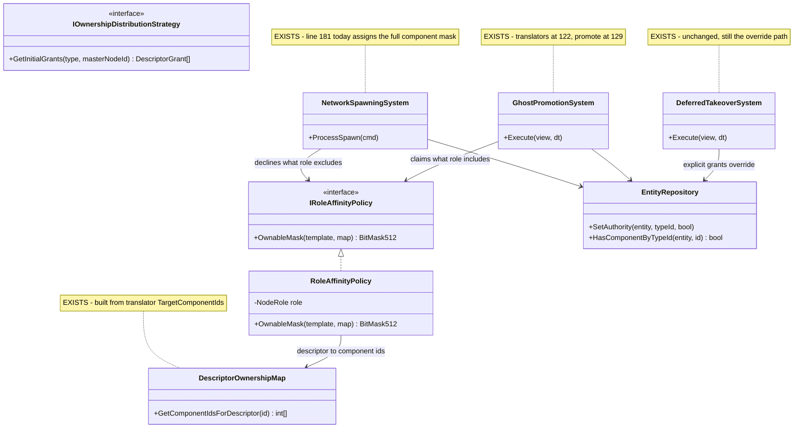
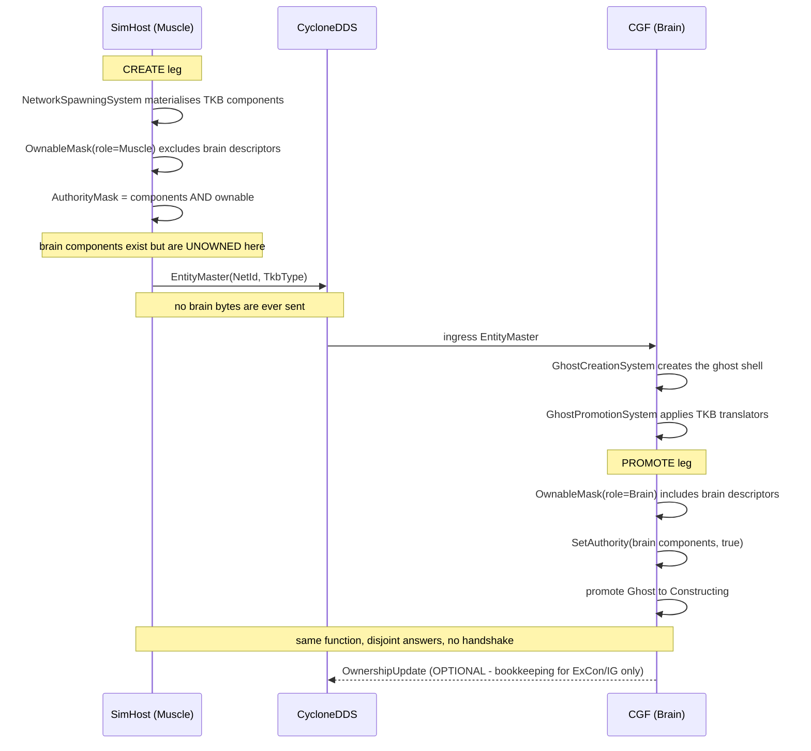

<!--STATUS
state: LIVE
updated: 2026-09-01
build-state: READY-TO-BUILD
current-answer: §3 is the design; §4 carries the UML; §5 holds the three decisions that are still
  open, each with a lean. Nothing here is built yet.
stale-below: nothing.
known-conflict: Architect_Question_65 §4's Q65-B and §5.3's CE-142 both describe ownership as
  something a CREATOR delegates outward via DeferredTakeOwnership. This design does not retire that
  path -- explicit grants still win -- but it makes the DEFAULT declarative and local, which removes
  the need for a grant in the common case. Read §3.4 before quoting either as "the" mechanism.
design-basis: docs/blueprints/RULINGS.md R-138 (fully distributed, ownership per-component and
  transferable, NodeRole is a convention) - docs/blueprints/Architect_Question_65_Entity_Genesis_Uniformity.md
  §0 (no capability removal by design), §5.3 (mechanism vs policy) - docs/designs/tkb-1/DESIGN.md
  §6.5b gate 2 (registration is the narrowing lever).
-->
# ⭐⭐⭐ Role-Affinity Ownership — **every node decides locally what it owns, so no two nodes ever claim the same component**

> 🔒 **User, `2026-09-01`, verbatim:** *"SimHost having a muscle role should not instantiate any brain
> related components. If it does, this is a mistake. But even if it does, by applying 'auto-takeover'
> rules (i do not have brain role -> i will not own brain components, the brain will) it can create the
> components as unowned while CGF (applying same rule - I am brain, i will own the brain components)
> creates them as owned. No authority conflict."*

⭐⭐ **The whole design is that one sentence.** Ownership stops being something a creator *hands out* and
becomes something every node *derives* from its own role, using the same function. Two nodes running the
same function over the same entity cannot disagree.

---

## 1. INVENTORY

⭐ Run `2026-09-01` through the codebase-memory **graph** (CLI), each cross-checked with `grep`.
⚠ `check_index_coverage` was **not** run; treat the totals as best-effort, not proof of completeness.

| # | query | total | what it returned |
|---|---|---|---|
| ① | `search_graph name_pattern=".*Ownership.*\|.*OwnershipDistribution.*" label="Class"` | **2** | `BrainMuscleOwnershipStrategy` (production) · `StubOwnershipStrategy` (test) |
| ② | `search_graph name_pattern=".*Ownership.*" label="Interface"` | **1** | `IOwnershipDistributionStrategy` — the only ownership seam that exists |
| ③ | `search_graph name_pattern=".*(Ownership\|Authority\|Takeover\|Promotion).*" label="Class"` | **44** | 23 production, listed in §2.2 |
| ④ | `search_graph name_pattern=".*TkbTranslator$" label="Class"` | **9** | the TKB→ECS projection set (`TkbTranslatorSet.Base()` carries 6 of them) |
| ⑤ | `grep "AuthorityMask"` production, non-test | **1 writer outside the wire path** | `NetworkSpawningSystem.cs:181` |
| ⑥ | `grep "SetAuthority("` production, non-test | **3** | `OwnershipIngressSystem:79` · `DeferredTakeoverSystem:118` · `LocalAuthorityYieldSystem:563` — **all three wire-driven** |

⇒ ⭐⭐⭐ **Query ⑤ is the finding.** There is exactly **one** place where a node grants itself authority
over an entity it created, and it is a blanket copy.

---

## 2. 📐 THE MEASURED STATE

### 2.1 The blanket grant

`FDP/Toolkits/Fdp.Toolkits/NetworkSpawning/Systems/NetworkSpawningSystem.cs:174-182`:

```csharp
bool isLocalAuthority = cmd.OwnerNodeId == _localNodeId;
if (isLocalAuthority)
{
    // Locally spawned entities must start with authority bits enabled for
    // every component currently present on the entity.
    ref var compNS = ref world.GetComponentMask(entity.Index);
    ref var metaNS = ref world.GetMetadata(entity.Index);
    metaNS.AuthorityMask = compNS;          // ⬅ "I own everything I materialised"
}
```

| property | measured |
|---|---|
| a fresh entity starts **unowned** | ✅ `EntityIndex.cs:97,170,464` — `AuthorityMask.Clear()` |
| this is the **only** non-wire grant | ✅ inventory ⑤/⑥ |
| it is **role-blind and descriptor-blind** | ✅ the mask is copied wholesale |
| it lives in **shared** code every host runs | ✅ `Fdp.Toolkits`, reached via `EntityCreationPack` or direct construction |

📌 **This is why a SimHost-created tank reports `HasAuthority<BehaviorState> = True`** — measured live,
`MissionToMovementChainProbe`, `2026-09-01`.

### 2.2 What already exists and must be REUSED, not rebuilt

| piece | why it matters here |
|---|---|
| `DescriptorOwnershipMap` | descriptor id → component ids, **built from `IDescriptorTranslator.TargetComponentIds`** ⇒ a node with a narrower translator set claims fewer components by construction |
| `EDescriptorType` | the vocabulary already splits the tiers: `dtEntityMission`, `dtNavigationIntent` (cognitive) · `dtWorldPos`, `dtNavigationStatus` (kinematic) |
| `BehaviorProfileDto.BrainTier` | `byte`; `BehaviorTkbTranslator` already early-returns on `== 0` ⇒ *"is this a brain-enabled entity"* is answerable from the template alone |
| `GhostPromotionSystem` | applies the TKB translators at `:122`, promotes Ghost→Constructing at `:129`. Since `CE-142`'s sibling change it runs on **every** role |
| `PendingAuthorityGrants` | ⚠ **checked, and it does NOT conflict** — it carries an *explicit* pre-genesis `DeferredTakeOwnership` routing table, consumed by `DeferredTakeoverSystem`. An explicit grant is a deliberate override of the local default (§3.4) |
| `IOwnershipDistributionStrategy` | the **existing** policy seam. ⛔ Do not add a second one — §3.3 extends this family rather than inventing a parallel interface |

---

## 3. ⭐⭐⭐ THE DESIGN

### 3.1 The rule

> **A node owns a component if, and only if, it holds the role that component's descriptor belongs to.**
> Every node evaluates this locally, with the same function, at the moment the component appears.

| node | brain descriptors | kinematic descriptors |
|---|---|---|
| CGF *(Brain)* | ✅ owns | ⛔ declines |
| SimHost *(MuscleGround)* | ⛔ declines | ✅ owns |
| all-in-one *(Brain\|Muscle\|IG)* | ✅ owns | ✅ owns |

⭐⭐ **Conflict is impossible by construction**, because the two sides of every pair are computed from the
same table: the creator declines exactly what the receiver claims. ⇒ ⛔ **no handshake, no yield, no
`OwnershipUpdate` needed for correctness.**

### 3.2 The two insertion points — both in shared code

| leg | file | change |
|---|---|---|
| **CREATE** — the creator declines | `NetworkSpawningSystem.cs:181` | `metaNS.AuthorityMask = compNS & policy.OwnableMask(...)` instead of `= compNS` |
| **PROMOTE** — the receiver claims | `GhostPromotionSystem`, after `:122`'s translator loop, before `:129`'s promote | set the bits `policy.OwnableMask(...)` names, guarded by `HasComponentByTypeId` |

⭐ Ordering is already correct: the translator loop has materialised the components before either point runs.

### 3.3 The seam

⭐⭐ `IOwnershipDistributionStrategy` answers *"which grants do I hand out?"*. This design needs the
sibling question *"which components do I keep?"* — same family, so it goes beside it, injected, and
**role selects the POLICY, never the mechanism** *(`CE-142`)*.

```csharp
public interface IRoleAffinityPolicy
{
    /// Component ids this node should own for an entity of this template.
    /// Empty = own nothing; the caller intersects with the entity's component mask.
    BitMask512 OwnableMask(TkbTemplate template, DescriptorOwnershipMap map);
}
```

⚠ **A node with no policy keeps today's behaviour** *(own everything you materialised)*, so adoption is
incremental and nothing changes until a host is handed one.

### 3.4 ⛔ What this does NOT retire

⭐ **Explicit `DeferredTakeOwnership` grants still win.** Role affinity is the **default**; a creator that
deliberately delegates a descriptor to a named node still does so, and `DeferredTakeoverSystem` /
`PendingAuthorityGrants` still apply it. ⇒ 🔒 `R-138`'s *"ownership is transferable per entity during
entity lifetime"* is preserved — this design only fixes the **initial** value, which was a blanket
`true`.

---

## 4. ⭐⭐ UML

### 4.1 Classes



### 4.2 Sequence — **both legs, which is what makes conflict impossible**

⚠ The create leg is the half that matters. A promote-only diagram describes a *claim*, and a claim needs
a yield; a symmetric decline needs nothing.



---

## 5. ⚠ THE THREE OPEN DECISIONS

| # | question | ⭐ lean | what would change it |
|---|---|---|---|
| **①** | what defines *"the components my role owns"* — a descriptor set, or a component-id set? | ⭐⭐ **descriptor set**, via `DescriptorOwnershipMap`. It already exists, is built from translator `TargetComponentIds`, and `EDescriptorType` already names the tiers ⇒ no new registry, and a narrower translator set narrows ownership for free | a component that belongs to no descriptor would be invisible to the rule — needs a measured count before building |
| **②** | nobody holds the role ⇒ the component is owned by **no one** and nothing ticks it | ⭐ **log once per entity, no fallback.** A fallback *("creator keeps it after N frames")* reintroduces exactly the race this design removes | if silent brainless entities prove common in real deployments, revisit as a startup-time cluster check, not a per-entity fallback |
| **③** | multiple Brain nodes | ⭐ `NetworkId % brainCount == myBrainIndex` **inside the policy**, so the mechanism never learns about it | needs the cluster to publish a stable brain index; `IClusterStateCache` already tracks nodes by role |

---

## 6. ⭐ SEQUENCING & ACCEPTANCE

| step | what | gate |
|---|---|---|
| **1** | `IRoleAffinityPolicy` + `RoleAffinityPolicy` in `Fdp.Toolkits/Replication` | unit: Brain and Muscle masks are **disjoint** over the brain/kinematic descriptor sets |
| **2** | `NetworkSpawningSystem:181` intersects with the policy; **null policy keeps today's behaviour** | rail: with no policy, the mask is unchanged *(red-proof: inject a policy, assert the bits drop)* |
| **3** | `GhostPromotionSystem` claims after the translator loop | rail: a promoted ghost owns exactly the role's descriptors |
| **4** | hand CGF a Brain policy and SimHost a Muscle policy at their composition roots | ⭐⭐ **the acceptance test:** a SimHost-created brain-enabled entity ends with `HasAuthority<BehaviorState>` **false on SimHost and true on CGF**, and `TacticalIntentResolutionSystem`'s gate passes |

⭐⭐ **The acceptance criterion for the whole thing** is the failing cluster test
`CgfSubsystemHeadlessTests.SimHost_MoveToLocationMission_EntityMovesWithoutGhostTick` — it asserts a
Muscle-created entity is cognitively driven from the Brain node, which is precisely this design's subject.
⚠ **It may stay red for its OWN reason after this lands** *(it also guards against
`MissionDirectorSystem` publishing a params-less `AssignBehaviorHashEvent`)* — that is the test working,
and the fix would then be production, not the test.
