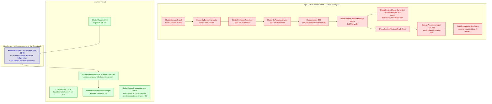
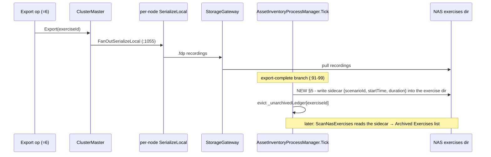

<!--STATUS
state: LIVE
updated: 2026-09-15
current-answer: §4 (the retirement plan) — §5 is the prerequisite re-home that MUST land first. Both §4/§5 open
  decisions are now RESOLVED (2026-09-15): scenario_manifest.json is a confirmed drop (§4), and the
  Orchestrator.json sim-time restore relies on nothing and is droppable (§5) — see §5 "RESOLVED".
stale-below: —
superseded-by: —
known-rot: —
known-conflict: —
related-designs:
  - docs/DESIGN_Distributed_Scenario_Persistence.md — owns the NEW gated JSON scenario save (SaveScenarioJson=17) that replaces this stub's *intended* purpose; this doc owns the retirement of the legacy SaveScenario=2 op
  - docs/designs/cgf-1/CGF-1-DESIGN.md — the ORIGINAL design SaveScenario=2 half-implements (§"Multi-File Scenario Save Flow", §"Orchestrator's Own ClusterSlave")
  - docs/designs/cluster-master-refact/DESIGN.md — TASK-P001 = GlobalContextProcessManager (the orchestrator-context save/load split)
  - docs/DESIGN_Unified_Cluster_Handler_Registration.md — CE-279; unifies registration of the SerializeLocal
    handlers (incl. this op's ReferenceArchiveHandler) across hosts. THIS doc owns retiring the legacy op; that
    one owns making the surviving handlers register uniformly.
-->

# Retiring the legacy `SaveScenario` (op = 2)

> **Tracker:** CE-278. **Do not re-derive** — this doc captures a full graph+grep-corroborated
> consumption trace (2026-09-14) so the retirement can be executed later without re-investigating.
> **Prerequisite:** §5 must land before §4 (the op is NOT safe to blind-delete).

**build-state: BUILT** (`2026-09-15`; UML in §3a; as-built corrections in §4a / §5)

---

## 0. INVENTORY — every `SaveScenario` op site *(graph + grep, `2026-09-15`)*

⭐ A retirement must enumerate ALL consumers before deletion — grep confirms a guess, only the full set is safe.

```
StorageOpType enum members (FDP/Toolkits/…/Events/ClusterOpIntents.cs:62): Export, Import, SaveScenario, SaveScenarioJson  → total 4
grep -rln "StorageOpType.SaveScenario|ClusterOpType.SaveScenario" --include=*.cs FDP Hrot | grep -iv test           → 8 files
```

**The 8 non-test consumer files** (the deletion surface §4 must clear): `GlobalContextProcessManager`,
`EventDrivenStorageGateway`, `StorageProcessManager`, `ClusterOpRequestAdapter`, `ClusterMaster`,
`ClusterScenarioPanel` (the "Save Scenario" button) — all in `Hrot.Orchestrator` — plus
`ClusterOpEgressTranslator`, `ClusterOpMasterTranslator` (`Hrot.Network.Orchestration`). ⚠ `Orchestrator.json`
is the sole consumed output (§2); it must be re-homed (§5) before any of these arms are cut.

---

## 1. What `SaveScenario`=2 actually is (measured)

It is a **half-built stub** of the CGF-1 "Multi-File Scenario Save Flow" (`CGF-1-DESIGN.md:1132-1146`).
The design intended each node to run a **scenario-JSON serializer**; the implementation wired the per-node
`SerializeLocal` handler to `ReferenceArchiveHandler` instead, which only **collects already-recorded
`.fdp` files** — it does not serialize any scenario. `DESIGN_Distributed_Scenario_Persistence.md:139`
records exactly this. The *intended* job (declarative, ownership-gated scenario save) is now done by
`SaveScenarioJson`=17 (CE-275/CE-277).

⇒ `SaveScenario`=2 is the **incomplete predecessor**. `Export`=6 is a *different* designed op
(exercise-recording cold-storage archival, `mgmt-DESIGN.md §12.4`) — **not** a merge target.

## 2. The one output that is actually consumed — `Orchestrator.json`

`SaveScenario`=2 is the **sole writer** of `Orchestrator.json`
(`GlobalContextClusterOpHandler.CommitSerializeLocal:198-217`, triggered only by
`GlobalContextProcessManager:48-73` on `StorageOpType.SaveScenario`). Its content
(`GlobalContextDto:374-399`): `{ $meta(docType=OrchestratorContext,v2), startWallTicks, sceneId,
scenarioTimeSeconds, scenarioId }`.

Its **essence**: the **metadata sidecar that makes an ARCHIVED EXERCISE recording self-describing on the
NAS** (which scenario, when it started, how long it ran) after the local recording-ledger entry is deleted
on export.

Consumers (graph-corroborated, `trace_path`):

| consumer | what it does | site |
|---|---|---|
| **exercise inventory** (production) | `ScanNasExercises` reads each `<exerciseId>/Orchestrator.json` → start/duration/scenarioId for the "Archived Exercises" list | `StorageGatewayModule.ScanNasExercises:447-460` ← `AssetInventoryProcessManager.Tick:111` (graph: `callers_total: 2`, one prod) |
| **sim-time restore on load** (tested) | `CommitLoad` reads `scenarios/<scenarioId>/Orchestrator.json` → `MasterTimeController.SeedState` | `GlobalContextClusterOpHandler.CommitLoad:247-316` → `OrchestratorSubsystem:220-224`; rail `ScenarioSaveLoadTests.OrchestratorContextRestored_AfterLoad` |

## 3. Why it's redundant / mis-wired (the three facts)

1. **Redundant with the recording ledger.** `AssetInventoryProcessManager._unarchivedLedger` already
   captures the identical fields (`exerciseId, scenarioId, startTime, duration`) automatically from
   `ClusterStateUpdateEvent` OperatingLive transitions (`:62-83`), persisted to
   `<staging>/recording_ledger/` via `SaveLedgerEntry` (`:43-45,75`). `Orchestrator.json` is a second copy.
2. **Wrong trigger.** Written only by `SaveScenario`=2 (manual, rare) — **not** by the recording/`Export`
   flow. An exercise archived the normal way (via `Export`) gets **no** `Orchestrator.json`.
3. **The sim-time field is a replay concern, not a scenario one.** `scenarioTimeSeconds`→`SeedState`
   restores "resume a recording mid-run." A scenario (prescription) starts at t=0; the new
   `SaveScenarioJson` does not write `Orchestrator.json`, so `CommitLoad`'s graceful "not found → t=0"
   fallback (`:264-277`) already covers scenario loads.

### The path mismatch (a real bug, noted)
Save writes `exercises/<exerciseId>/Orchestrator.json` (`:143-147`); the sim-time load reads
`scenarios/<scenarioId>/Orchestrator.json` (`:259-263`). Different dir + key — the write side and the
sim-time read side never meet. Only the **exercise-inventory** read (from `exercises/<exerciseId>/`)
actually consumes what `SaveScenario` writes.

## 3a. UML — the retirement in three diagrams

> Diagram-first: the pictures carry *what changes*; §4 carries the exact `file:line`. Read the pictures,
> then §4 is the checklist. Colours: 🔴 red = deleted, 🟢 green = survives, 🔵 blue = new (§5).

### Module / data-flow — before → after (the load-bearing diagram: what becomes dead)



**Caption — what the picture shows that prose hid:** the whole op=2 chain (10 boxes) is a dead subgraph
after the cut, and its ONLY surviving consumer — `ScanNasExercises`' exercise-inventory read — is re-fed by
a single new blue edge from the already-live `Export` path. `CommitLoad` is deliberately NOT in the removed
set: it is reached by the load transition, not op=2.

### Class — which members die, which survive

```mermaid
classDiagram
  class GlobalContextClusterOpHandler {
    +CanHandle(NodeOpType) bool
    +PrepareAsync(cmd) Task
    +Commit(cmd, repo) void
    +CommitLoad(cmd) void
    +double ScenarioTimeSeconds
  }
  class GlobalContextProcessManager {
    +Tick() void
  }
  class StorageProcessManager {
    +Tick() void
  }
  class AssetInventoryProcessManager {
    +Tick() void
  }
  class StorageGatewayModule {
    +ScanNasExercises() list
    +WriteScenarioManifestAsync() Task
  }
  GlobalContextProcessManager --> GlobalContextClusterOpHandler : drives
  AssetInventoryProcessManager --> StorageGatewayModule : ScanNasExercises
  StorageProcessManager --> StorageGatewayModule : WriteScenarioManifestAsync

  note for GlobalContextClusterOpHandler "REMOVE: CommitSerializeLocal, the SerializeLocal arm of PrepareAsync/Commit/CanHandle, and the _pendingSave* fields (dead once the op=2 SAVE fan-out is gone). KEEP: CommitLoad + CommitState arm."
  note for GlobalContextProcessManager "REMOVE the SAVE branch (:48-73). KEEP the LOAD branch (:39-45)."
  note for StorageProcessManager "REMOVE _pendingSaveScenarios + the SaveScenario path (:75-80,:216-248)."
  note for AssetInventoryProcessManager "ADD (§5): write the exercise sidecar on export-complete before evicting _unarchivedLedger."
  note for StorageGatewayModule "REMOVE WriteScenarioManifestAsync (0 readers). ScanNasExercises stays (now fed by §5)."
```



**Caption:** the two handlers that look wholly op-2 are actually *split* — `GlobalContextClusterOpHandler`
and `GlobalContextProcessManager` each keep their LOAD half and lose only their SAVE half; drawing the
members is what makes that boundary explicit (a blind class-level delete would break scenario loading).

### Sequence — the one new behaviour (§5 re-home onto Export)



**Caption:** the ordering is the whole point — the sidecar write must land **before** the ledger eviction
(same tick), because after eviction the source fields are gone; prose can assert that, only the sequence
makes the hazard legible.

---

## 4. The retirement plan — exact edit sites

⚠ **Do §5 (re-home) FIRST.** Deleting before re-homing loses the archived-exercise sidecar.

**Producers / invokers — remove or repoint:**

| site | action |
|---|---|
| `Panels/ClusterScenarioPanel.cs:105-112` (`FdpClusterOpType.SaveScenario`→intent) & `:668-677` ("Save Scenario" button + `_saveScenarioId`) | remove the button — redundant with "Export to NAS ▶" `:875` |
| `Hrot.Network.Orchestration/ClusterOpEgressTranslator.cs:113` (`StorageOpType.SaveScenario`→Ned) & `:115` (`_ =>` default→SaveScenario) | remove the case; change the default to reject rather than silently map to SaveScenario |
| `Hrot.Network.Orchestration/ClusterOpMasterTranslator.cs:200-209` (`case NedClusterOpType.SaveScenario`) | remove |
| `Hrot.Orchestrator/ClusterOpRequestAdapter.cs:144` (`ClusterOpType.SaveScenario`→Storage) & `:146` (`_ =>` default) | remove the case; change default |

**Handlers / consumers — remove:**

| site | action |
|---|---|
| `ClusterMaster.cs:420` (`case ClusterOpType.SaveScenario` in `HandleClusterOpRequestAsync`) & `:983-990` (`case StorageOpType.SaveScenario` → `FanOutSerializeLocal(ArchiveHandlerPayload)`) | remove |
| `GlobalContextProcessManager.cs:48-73` (`if op != SaveScenario continue` → writes `Orchestrator.json` + `PublishManifestReady`) | remove (its load-side branch `:39-45` stays — that's the transition load, unrelated) |
| `StorageProcessManager.cs:75-80` (`_pendingSaveScenarios` capture) & `:216-248` (SaveScenario path: prepend orch entry + `PullToNasAsync` + `WriteScenarioManifestAsync`) | remove |
| `EventDrivenStorageGateway.cs:87-89` (`case StorageOpType.SaveScenario`) | remove — note: whole class is **test-only / unwired in production** (`new EventDrivenStorageGateway` only in its test) |

> ⚠ **Dead-after-cut (remove in the same batch):** once the `GlobalContextProcessManager` SAVE branch is gone,
> `GlobalContextClusterOpHandler.CommitSerializeLocal` + the `SerializeLocal` arm of `PrepareAsync`/`Commit`/
> `CanHandle` + the `_pendingSave*` / `ScenarioTimeSeconds` save fields have **no caller** (the handler is driven
> ONLY by that process manager — it is not a generic registered `SerializeLocal` handler, so Export=6 /
> SaveScenarioJson=17 never reach it). ⭐ KEEP `CommitLoad` and the `CommitState` arm — that is the live load path.

**Enum members — retire, keep wire value reserved (do NOT reuse):**

| enum | member |
|---|---|
| `Fdp.Toolkit.Orchestration.StorageOpType` (`ClusterOpIntents.cs:65`) | `SaveScenario` |
| toolkit `ClusterOpType` = 2 · `NedClusterOpType` = 2 (`OrchestrationMessages.cs:27`) · `FdpClusterOpType` | `SaveScenario` (leave value 2 as an `[Obsolete]`/reserved gap; IDL wire value stays) |

**Events / state that become dead with it — remove:**

| symbol | why dead |
|---|---|
| `GlobalContextManifestReadyEvent` (`OrchestratorInternalEvents.cs:13-16`) | producer (`GlobalContextProcessManager` SaveScenario branch) and consumer (`StorageProcessManager._pendingOrchestratorEntry`, SaveScenario path only) both removed above |
| `WriteScenarioManifestAsync` (`StorageGatewayModule.cs:500-515`) + its call (`StorageProcessManager.cs:234`) | `scenario_manifest.json` has **zero in-repo readers** (graph: writer `callers_total: 4`, no reader symbol; grep: no file read). ✅ **CONFIRMED DROP** (user, `2026-09-15`: no external NAS tools exist) |

**Tests to update/remove:** `ScenarioSaveLoadTests` (OrchestratorContext restore), `StorageProcessManagerTests`
(`ProcessManager_OrchestratorEntry_IsPrepended`, `Orchestrator.json` on NAS), `ClusterMasterArchiveTests`,
`ClusterMasterContextHandlerTests`.

**Rename that pairs with this — ✅ DONE (`2026-09-15`):** `SaveScenarioJson`(17) → `SaveScenario`, keeping wire
value 17, reclaiming the name CGF-1 always used for this operation. Renamed the enum member in both
`StorageOpType` and the NED wire `ClusterOpType` (and every reference/cref). ⚠ **Interaction with §4a:** the
reserved `SaveScenario` **name** at value 2 had to be freed first — the enums now carry a bare `// 2 —
RESERVED gap` comment (value 2 still not reused; only the name moved to value 17). ⛔ The `DebugCapabilities
.SaveScenarioJson` capability constant, the `SaveScenarioJsonBegunEvent` event, and the
`RequestSaveScenarioJson`/`SavesScenarioJsonVia` provider members are DISTINCT symbols and were intentionally
left unchanged (the JSON-save feature machinery keeps its descriptive names). Verified: 0-error full-solution
build (156 projects) + Roslyn `find_references` (driven over stdio — MCP was down) shows `SaveScenario` → 13
refs and `SaveScenarioJson` → "symbol not found".

## 4a. As-built (`2026-09-15`) — deviations from §4/§5, folded back

1. **Enums kept as a reserved comment, not `[Obsolete]`.** All three `SaveScenario` members (`StorageOpType`,
   the FDP-toolkit `ClusterOpType`, the NED wire `ClusterOpType`) stay **defined** with a `// CE-278: RETIRED
   — reserved, do NOT reuse` comment. This preserves every wire value with zero positional shift and keeps the
   two `ClusterOpType` mirrors in sync (test-verified), and avoids any risk of the CycloneDDS schema generator
   tripping on an attribute. Retirement is achieved by removing every **use-site**, not by attributing the member.
2. **Switch defaults now REJECT.** `ClusterOpEgressTranslator` and `ClusterOpRequestAdapter` switch expressions
   `throw ArgumentOutOfRangeException` on an unmapped op (previously the `_ =>` default silently mapped to
   SaveScenario). `ClusterOpMasterTranslator` / `ClusterMaster` simply drop the case; a stray legacy op=2 on the
   wire falls through and is ignored.
3. **Handler split as designed:** `CommitLoad` + the `CommitState` arm kept; `CommitSerializeLocal`,
   `CommitManifestEntry`, `ScenarioTimeSeconds`, the `_pendingSave*` fields, the now-unread `_scenarioId`, and
   `ParseExerciseId` removed (all dead once the op-2 SerializeLocal fan-out is gone). `CanHandle` now returns
   `CommitState` only.
4. **Tests:** `ClusterMasterContextHandlerTests.CommitSerializeLocal_ProducesPhase2Envelope` and
   `StorageProcessManagerTests` SC1 (the `GlobalContextManifestReadyEvent` prepend) removed; the two save-driven
   `ScenarioSaveLoadTests` rewritten to write the context file directly at the path `CommitLoad` reads (which
   also corrects the old setup's `exercises/` vs `scenarios/` path confusion); the `$meta`-envelope contract is
   re-homed to the new `AssetInventoryProcessManagerTests.ExportComplete_WritesExerciseSidecar_*` rail.

## 5. Prerequisite — re-home the archived-exercise sidecar onto `Export`

The data already exists in the ledger; `Export` is the op that archives exercises to NAS.

- On export-complete, **before** `AssetInventoryProcessManager:96-97` removes `_unarchivedLedger[exerciseId]`,
  write that `RecordingLedgerEntry` (scenarioId/startTime/duration) into `<nas>/exercises/<exerciseId>/` as
  the sidecar `ScanNasExercises` reads (keep the `GlobalContextDto` shape so `ScanNasExercises:453` keeps
  deserializing it — or repoint `ScanNasExercises` to the ledger-entry shape).
  - Cleanest site: `AssetInventoryProcessManager.Tick` export-complete branch (`:91-99`); it already holds
    the ledger entry and the gateway.
  - Alternative site: `StorageProcessManager` export branch (`:129-177`), which already runs
    `PullToNasAsync` for the export manifest.

### ✅ RESOLVED (`2026-09-15`, graph-CLI + grep) — nothing relies on the sim-time restore; it is droppable
The sub-question was *"does any resume-a-recording (replay/live-from-replay) flow depend on the
`scenarioTimeSeconds` sim-time restore via `CommitLoad`?"* — **answer: NO.**

Resume-a-recording seeds its clock from a **separate, purpose-built path**, not `CommitLoad`:
`LiveBranchProcessManager.Tick()` owns the `OperatingReplay → LoadingLive` temporal interlock (CGF1-S0305) —
`ReplayMasterModule.FreezeTime()` before the PrepareLive fan-out (`LiveBranchProcessManager.cs:59-62`), then
`RestoreTime()` + `MasterSyncController.SnapAndPause(lbr.HistoricalTime.TotalWallTicks, …TotalTime, …)` on
`ClusterOpCompletedEvent` (`:66-76`). Sim-time comes from `LiveBranchResult.HistoricalTime` (the replay's
current frame), not from `Orchestrator.json`.

Moreover the `Orchestrator.json` sim-time half is **already dead in production** (the §2 path mismatch):
the sole writer writes `exercises/<exerciseId>/` (`GlobalContextClusterOpHandler.cs:143-147`,`:224-227`) while
`CommitLoad` reads `scenarios/<scenarioId>/` (`:259-263`); nothing writes the latter path (grep `Orchestrator.json`
over all `*.cs`: `SaveScenarioJson`=17 writes none, merge writes `scenario.json`), so `CommitLoad` always takes
the t=0 fallback (`:264-277`) for scenario loads. And `LiveBranchProcessManager` ticks *before* `ClusterMaster`
(`:19`) and `SnapAndPause`s *after* the branch op completes, so even a stray seed would be superseded.

⇒ **The sim-time restore needs NO preservation on any path.** §5's re-home preserves ONLY the
**exercise-inventory sidecar** (`ScanNasExercises` from `exercises/<exerciseId>/`).

> ⚠ Tooling: codebase-memory MCP was down; drove its CLI (`trace_path`/`search_graph`/`search_code`) per
> CLAUDE.md. `check_index_coverage` is unavailable via CLI, so the absence claim above rests on grep over
> `*.cs`, not on index-coverage proof.

## 6. Checkpoints — untouched (recorded here so it isn't re-investigated)
Checkpoints are **not** an enumerated collection. `CheckpointIOWorker` (`CGF1-S0303`) writes
`{storageDir}/{requestId}_node_{nodeId}.fdp` for on-the-spot **preview/rewind** (`TakeCheckpoint`→restore);
there is no `ListCheckpoints`/inventory. Distinct from exercise recordings (which are enumerated). Nothing
in this retirement touches checkpoints.
