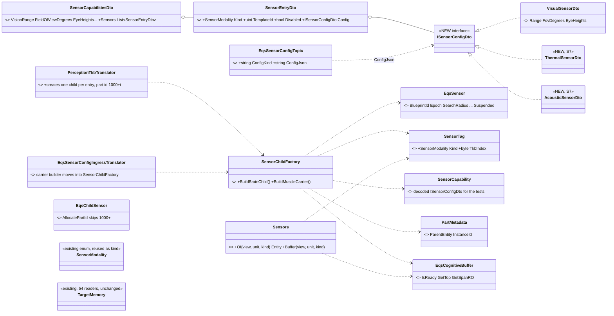
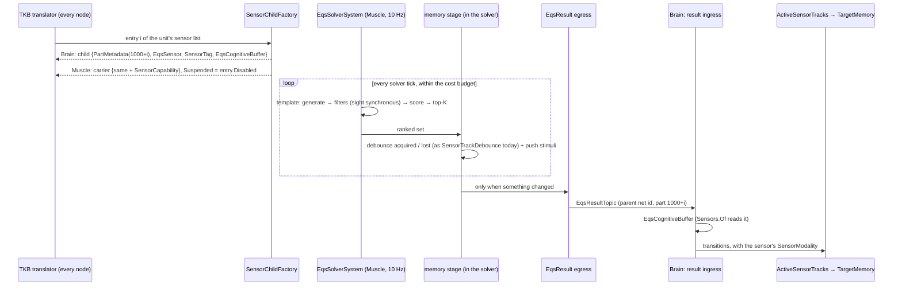
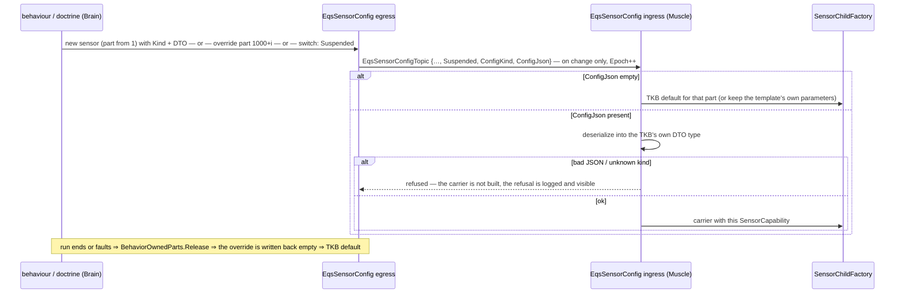
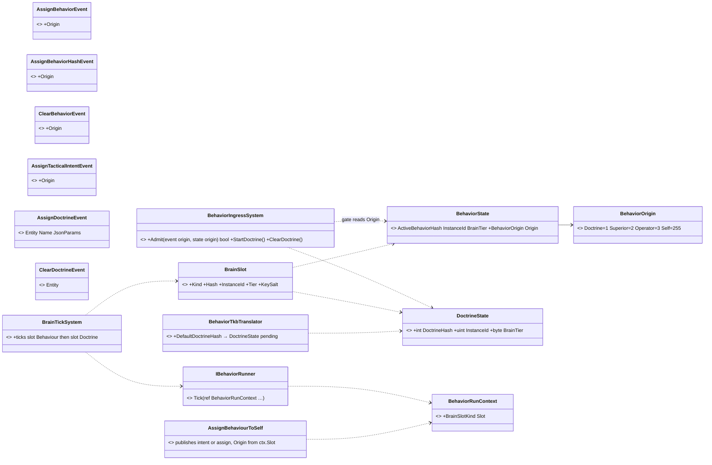
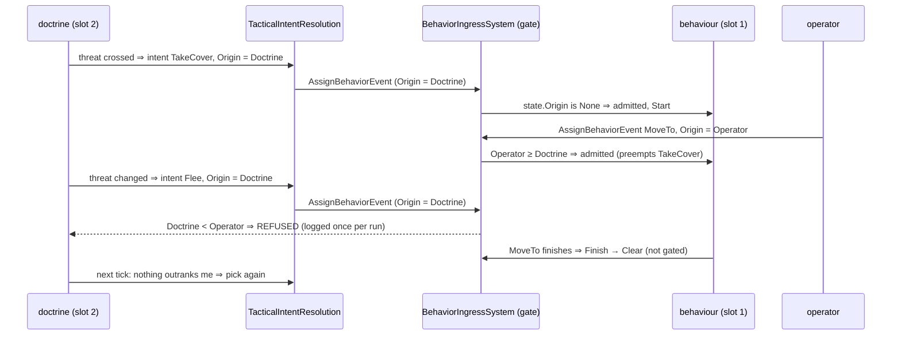
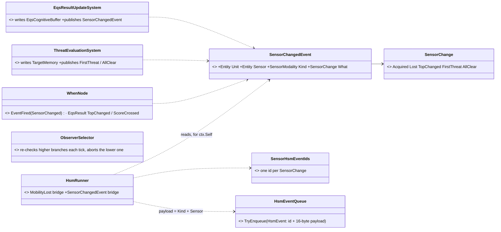
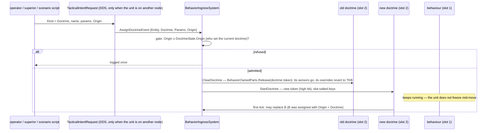
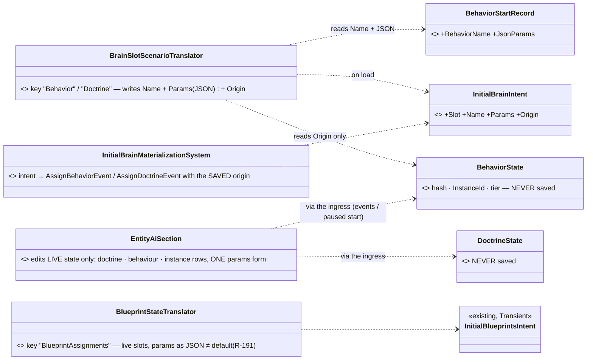
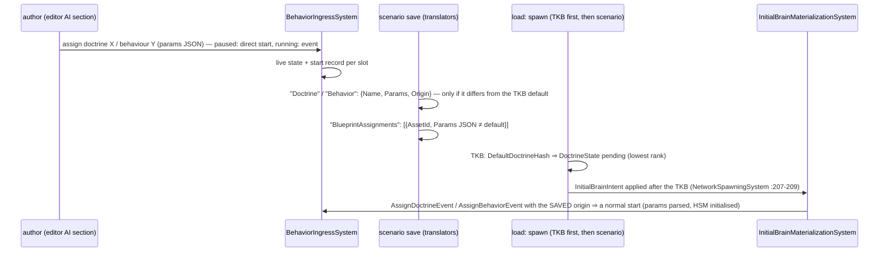

<!--STATUS
state: LIVE
updated: 2026-10-04
build-state: READY-TO-BUILD — every decision approved (R-185 … R-189); §9 lists the details the build must verify first.
current-answer: the whole file — §1 rulings, §3 module diagram, §4–§5 sensors, §6–§7 doctrine and origin (§7.3 reacting to sensors, §7.4 replacing a doctrine, §7.5 authoring a unit's AI in the scenario), §9 build plan, §10 what is still open.
stale-below: nothing — new document.
known-rot: §7.5's first version (an authored AiAssignment component, R-190) is SUPERSEDED by the snapshot concept (R-192) — the section was rewritten in place, 2026-10-04.
known-conflict:
  - docs/designs/eqs-2/EQS_Design_v1.3_final.md §7.5–7.6 (wall-clock budget bands, QueryTimeSliced) — superseded by §5.3 here (cost-unit budget) once step S4 lands; that doc gets the SUPERSEDED marker in the same change.
  - docs/designs/modularizing/MOD1-DESIGN.md §3.6.2 (one receptor COMPONENT per modality) — replaced by sensor CHILDREN (§4); its TargetMemory modality OR-merge is kept.
related-designs:
  - docs/blueprints/Architect_Question_82_One_Sensor_Form.md — the sensor rulings A–N′ (R-185, R-186, R-187) this design builds.
  - docs/blueprints/Architect_Question_83_Doctrine_And_Order_Origin.md — the doctrine + origin rulings A–G (R-188, R-189) this design builds.
  - docs/designs/eqs-2/EQS_Design_v1.3_final.md — OWNS the sensor form, the split (§17.2), the reader API (§8), the terrain slice (§19).
  - docs/blueprints/DESIGN_Behaviour_Fault_And_Teardown.md — OWNS behaviour-owned parts (CE-485), Suspended (CE-486), the finish/fault path (CE-449/482) the doctrine slot re-uses.
  - docs/designs/brain-death/BD1-DESIGN.md — OWNS brain death (channels reset when a behaviour ends); this adds who picks the next one.
  - docs/blueprints/DESIGN_Occurrence_Scoped_Storage.md — OWNS occurrence keys; §7.3 here salts the root keys per slot.
  - docs/designs/utility-ai/Utility_AI_Design_v1_1.md — OWNS scoring; a doctrine may call it (§7 "a selector primitive"), it is never a host.
  - docs/blueprints/DESIGN_Blueprint_Param_Persistence.md — OWNS the BUILT save path for instance-blueprint params (bytes, StructureHash guard); §7.5 adds only the editor.
  - docs/blueprints/BLUEPRINT-SCENARIO-DESIGN.md — §2 "persist the intent, never the runtime bytes", the rule §7.5 follows.
  - docs/DESIGN_Entity_State_Sourcing.md — §4.1 durable overrides as published state (V7).
  - docs/UX/UX_Feature_Entity_Commanding.md — OWNS operator orders; they become Origin = Operator.
  - docs/DESIGN_Terrain_World.md — OWNS the sight the perception templates call (SegmentBlocked, TerrainWorldLosStrategy).
  - docs/blueprints/batches/FRAME_Eqs_Consuming_Behaviours.md — the behaviours lane's consumers; a doctrine is what assigns them.
-->

# Sensors and Doctrine — one sensor form, and who decides what a unit does

Tracker: [`CE-3033`](blueprints/Blueprint_Issues_Tracker.md) (design) · build rows `CE-3034` … `CE-3045` (§9).

## 1. What was decided *(all approved by the user, `2026-10-04`)*

| ruling | in one line |
|---|---|
| **R-185** (AQ82 A–L) | perception sensors ARE EQS-form sensor children; TKB-defined per-kind capability; a memory stage on the Muscle sending changes only; TKB sensors created on every node (part ids 1000+i, nothing on the wire); `TargetMemory` stays the fused picture; push stimuli feed the memory stage; perception sight is synchronous, never the ballistics raycast queue; a deterministic cost-unit budget; visual perception MOVES (no second pipeline) |
| **R-186** (AQ82 M′) | a behaviour may create a sensor of ANY kind; its per-kind DTO travels as JSON in the config sample, only on spawn / change; the same path overrides a TKB sensor |
| **R-187** (AQ82 N′) | TKB sensors default ON (optional `Disabled`); switching = the override sample with `Suspended`; a behaviour's switch is behaviour-owned and released at run end |
| **R-188** (AQ83 A–F) | a per-unit DOCTRINE ticks beside the behaviour and assigns it; no doctrine = brain-dead = absolute control; every assign / clear carries an `Origin`; ONE gate: a lower origin cannot replace a higher (`Operator > Superior > Doctrine`); hold = order `Idle` |
| **R-189** (AQ83 G) | the doctrine is a SECOND BEHAVIOUR SLOT, any tier (BTree / HSM / Behavior-kind blueprint), run by the same `IBehaviorRunner`s |

## 2. INVENTORY *(measured `2026-10-04`; graph via the codebase-memory CLI + grep — `check_index_coverage` is not available through the CLI)*

| query | result |
|---|---|
| `search_graph .*Eqs.* Class` | 119 incl. tests; 7 `[EqsTemplate]` types |
| perception systems | 7 — `LocalGridBuilder`, `VisionBroadphase`, `LosRequestBatching`, `SensorTrackDebounce` (all inside `CognitiveSpatialModule`), `ActiveSensorTracksUpdate`, `ThreatEvaluation` (Brain), `AudioPerception` (⛔ no Hrot host) |
| `search_graph .*Doctrine.*` · `.*Autonom.*` | 2 · 106 — no doctrine / autonomy decision layer in code (`AutonomousPerceptionModule` is tests-only) |
| `search_graph .*BehaviorRunner.*` | 4 — ONE `IBehaviorRunner`, three runners behind `BehaviorRunners.For(tier)` |
| `search_graph .*BehaviorState.*` | 18 — ONE `BehaviorState {ActiveBehaviorHash, InstanceId, BrainTier}` per entity |
| behaviour origin | ⛔ none — `AssignBehaviorEvent {Entity, BehaviorName, JsonParams}`, `AssignBehaviorHashEvent {Entity, BehaviorHash}`, `ClearBehaviorEvent {Entity}`, `AssignTacticalIntentEvent {Entity, IntentId, JsonParams}` |
| sensor kind enum | 1 — `SensorModality` (`Perception/Components/SensorModality.cs:11`) — ⭐ REUSED as the sensor kind |
| JSON inside a DDS sample | 5 precedents — `GizmoInteractionBatch.PayloadJson`, `EntityAttributeSchema.SchemaJson`, … |

## 3. Who registers what, on which node, and who calls it each frame

```mermaid
graph TD
  subgraph Brain["CGF — Brain (also the editor)"]
    CLP["CgfLogicPack"]
    CRM["CognitiveRuntimeModule (Synchronous)"]
    BIS["BehaviorIngressSystem (Input) — ⭐ ORIGIN GATE + doctrine start"]
    BTS["BrainTickSystem (Simulation) — ⭐ loops BOTH slots"]
    TIR["TacticalIntentResolutionSystem — carries Origin"]
    RUS["EqsResultUpdateSystem → EqsCognitiveBuffer"]
    MEM["SensorMemoryIngress → ActiveSensorTracks → ThreatEvaluation → TargetMemory"]
    CFE["EqsSensorConfigEgress (Export) — + ConfigJson / Suspended overrides"]
    CLP --> BIS
    CLP --> TIR
    CLP --> CRM
    CRM --> BTS
    CLP --> MEM
  end
  subgraph Muscle["SimHost / Stride — Muscle (also the editor)"]
    EQM["EqsModule SlowBackground 10 Hz"]
    SOLV["EqsSolverSystem — ⭐ cost-unit budget + memory stage"]
    CFI["EqsSensorConfigIngress (Input)"]
    REG["EqsResultEventEgress (Export)"]
    EQM --> SOLV
  end
  subgraph Every["EVERY host"]
    TKB["PerceptionTkbTranslator — ⭐ creates sensor children 1000+i"]
    BTKB["BehaviorTkbTranslator — ⭐ + DefaultDoctrineHash"]
  end
  CSM["CognitiveSpatialModule (grid, broadphase, LOS, debounce)"]:::gone
  APM["AutonomousPerceptionModule — tests only"]:::dead
  AUD["AudioPerceptionSystem — no Hrot host"]:::dead
  DBH["DefaultBehaviorHash — no template sets it"]:::dead
  CFE -- "EqsSensorConfigTopic" --> CFI
  REG -- "EqsResultTopic" --> RUS
  REG -- "changes only (memory stage)" --> MEM
  TKB --> SOLV
  TKB --> RUS
  CSM -. "S5 deletes" .-> SOLV
  classDef dead fill:#fdd,stroke:#c00,color:#600
  classDef gone fill:#eee,stroke:#888,stroke-dasharray:4 3,color:#555
```

*What the picture shows that prose hid:* both new mechanisms land in places that ALREADY run on the right node every
frame — the origin gate in `BehaviorIngressSystem` (every start already passes it), the doctrine inside `BrainTickSystem`
(already the only caller of the runners), the memory stage inside `EqsSolverSystem` (already the only sensor solver).
Nothing new needs a caller. Red = present but never reached today; grey = deleted by S5.

## 4. Sensors — classes

*What the picture shows that prose hid:* a TKB sensor and a behaviour sensor are built by the SAME factory — the
TKB path calls it from the translator on every node, the wire path from the config ingress. Only `SensorTag` and
`SensorCapability` are new components; the wire grows two strings.

| why | |
|---|---|
| ⭐ an EMPTY `Sensors` list with `VisionRange > 0` reads as ONE implicit visual entry | existing TKB data keeps working with no migration; a list, once present, wins |
| ⭐ `SensorCapability` is Muscle-only | the tests need the decoded parameters; the Brain needs only the kind (`SensorTag`) |
| ⭐ `ConfigJson` is empty for a TKB sensor | K: derived locally. Non-empty only for a behaviour sensor or an override (M′) |
| ⛔ rejected: one component per modality (MOD1 §3.6.2) | one child shape and lifetime for every kind; the component count does not grow per kind |

## 5. Sensors — the paths

### 5.1 A TKB sensor, end to end

*What the picture shows that prose hid:* no step sends configuration — both nodes derive the same child from the
same TKB entry, so the existing result key `(parent net id, part id)` matches by construction.

### 5.2 A behaviour sensor, an override, a switch — one message

*What the picture shows that prose hid:* create, reconfigure and on/off are the SAME sample with different fields —
there is no second wire mechanism (the per-unit bitmask was rejected for exactly this).

### 5.3 The budget (G) — cost units, not sensors, not milliseconds

| rule | |
|---|---|
| each evaluation COUNTS its work | candidates generated ×1 · cheap test ×1 per candidate · sight check ×4 · path query ×16 (weights are constants, tuned once) |
| a tick stops starting new sensors when the budget is spent | a sensor already started finishes this tick; a single sensor over the whole budget still completes and runs alone |
| order | priority band (Critical / Normal / Low), then OLDEST result first |
| every result carries its age | `EqsCognitiveBuffer.LastUpdateTick` (exists) |
| replaces | `QueryTimeSliced(…, WallClockTime)` (EQS §7.6) — ⛔ not deterministic |
| ⛔ never | the ballistics raycast queue: sync, every request per frame, outside this budget (H) |

⭐ **Why counted work:** a sensor count treats a 200-candidate thermal sweep like a 4-point offset query; milliseconds
differ per machine and per run. Counted work is proportional AND repeatable — the same scenario schedules the same
sensors on every run.

## 6. Doctrine and origin — classes

*What the picture shows that prose hid:* the runners do not change at all — the slot is a VIEW (`BrainSlot`) over one
of two components, and the only things that learn about slots are the tick loop, the ingress and the run context.

| rule | why |
|---|---|
| ⭐ **the gate**: admit if `event.Origin ≥ state.Origin`, or `event.Origin == Self` | `Self` = a behaviour replacing / ending ITSELF; it inherits the current origin, so an ordered behaviour that chains stays ordered |
| ⭐ the internal finish (`BrainTickSystem.Finish → Clear`) is not gated | a behaviour ending never needs permission |
| ⭐ an event with NO origin reads as `Operator` | any unmarked path (debug API, old code) is human-rank — the AI can never override it by accident |
| ⭐ a doctrine NEVER finishes | on Success / Failure the slot restarts it next tick (a BTree doctrine is a priority list evaluated from the root each tick); only a FAULT stops it, loudly |
| ⭐ a doctrine commands no channels | `ChannelArbitrationSystem.cs:44` cancels any command whose `BehaviorInstanceId ≠ BehaviorState.InstanceId`; doctrine tokens live in a DISJOINT space (high bit set) ⇒ a doctrine's channel command is cancelled by construction |
| ⭐ existing publishers get an origin | operator UI / mission-control abort → Operator · `MissionDirector` / `MissionAdapter` (scenario mission plan) → Superior · `CommanderNodes` / `HillAttackCommanderNodes` / DDS intent ingress → Superior · `HillAttackTankNodes` clearing itself → Self · hot-reload restart → Self |
| ⛔ rejected: a `DoctrineTickSystem` of its own | a second copy of finish / fault / reload logic (ruling 9) — the loop takes a slot instead |

## 7. Doctrine — the paths

### 7.1 Autonomy, an order, and back

*What the picture shows that prose hid:* the doctrine never has to know an order is running — it keeps deciding,
the gate keeps refusing, and the first tick after the order ends is autonomous again. The doctrine MAY read
`BehaviorState.Origin` to stay quiet, but correctness does not depend on it.

### 7.2 What a second slot must re-key *(measured — every place keyed by entity or by `InstanceId` alone)*

| today | keyed by | with two slots |
|---|---|---|
| root params / state / HSM keys (`OccurrenceSlotKey.cs:252,277,284`) | behaviour hash only | ⭐ salt with the slot (`"$occ.rootState"` → `"$occ.doctrine.rootState"`) — the same asset in both slots must not collide |
| `RootParamsAccess.KeyFor` (`RootParamsAccess.cs:38`) | reads `BehaviorState` | ⭐ takes the `BrainSlot` |
| finish dedup `_publishedTerminalForInstanceId` (`BrainTickSystem.cs:74`) | entity index | ⭐ (entity, slot) |
| `BehaviorFaultLatch` (`BehaviorFault.cs:48`) | one per entity, first fault wins | ⭐ a second latch component for the doctrine |
| `BehaviorOwnedParts.OwnerOf` (`BehaviorOwnedPart.cs:40`) | reads `BehaviorState.InstanceId` | ⭐ take the owner from `ctx.InstanceId` — a doctrine's sensors must outlive the behaviour it assigns |
| `EqsChildSensor.StampOwner` | owner's low 16 bits into the epoch | ⚠ verify the doctrine's high-bit token cannot alias a behaviour token there (§9 V4) |
| `BehaviorStartRecord` (reload restart) | one per entity | ⭐ one per slot |
| channel preemption (`ChannelArbitrationSystem.cs:44`) | `BehaviorState.InstanceId` | unchanged — the disjoint token space is the point (§6) |

### 7.3 How a BTree, an HSM and a blueprint REACT to a sensor *(user, `2026-10-04`: "Agreed, add it to the design")*

> 🔒 *"How can btree and hsm respond to sensor results? Can sensor result change be propagated as fdp bus event or
> something or the polled conditions are enough?"*

*What the picture shows that prose hid:* ONE producer per fact (the system that already writes it), and each tier
consumes it the way it already consumes anything — the HSM through the queue that carries MobilityLost today, the
blueprint through `When`, the BTree not through the event at all.

| tier | how it reacts | why this way |
|---|---|---|
| **HSM** | ⭐ **event-driven**: `HsmRunner` turns this frame's `SensorChangedEvent`s for its entity into reserved HSM events (kind + sensor in the 16-byte payload), exactly as it does MobilityLost (`HsmRunner.cs:45-49`). Authors write *On ThreatAppeared → Engaged*. Polled guards (CE-381) stay for "while X holds" | the queue exists and is fed by one event today; an edge is what a transition wants |
| **BTree** | ⭐ **polled conditions — sufficient once `ObserverSelector` works**: each tick it re-checks the leading condition of every HIGHER-priority branch; one turning true aborts the running lower branch (its exit sweep, `SweepExitedNode`) and switches | a BTree ticks every frame anyway — an event adds nothing. What is missing is the ABORT: today a running branch is never re-checked (`Interpreter.cs:613-635`), and `ObserverSelector` — documented as *"abort-on-priority-change"* (`Fbt.Kernel.md:269`) — runs as a plain selector (`Interpreter.cs:267`) |
| **Blueprint** | `When EventFired(SensorChanged)` for an edge, `When EqsResult(TopChanged / ScoreCrossed)` for a result | both exist; nothing new but the event |
| **both slots** | the doctrine and the behaviour receive the same events (`HsmRunner` runs per slot) | a doctrine HSM switches mode on *FirstThreat* while the behaviour HSM reacts tactically |

⭐ **Why edges come from the producer:** *acquired / lost / first threat / all clear* are TRANSITIONS. The producer
already holds the previous state (the memory stage sends changes only; `TargetMemory` knows its count) — a polled
condition would have to remember the previous state itself, in every condition that cares.

⛔ **Rejected:** events only (a BTree has no event entry, and "while threatened" needs polling anyway) · polling only
(every HSM transition a polled guard, every condition re-deriving edges) · one event type per sensor kind (the `Kind`
field covers it).

### 7.4 Replacing a doctrine at runtime

> 🔒 *"How could we replace a doctrine at runtime?"*

*What the picture shows that prose hid:* a doctrine change does NOT touch the running behaviour — the new doctrine
takes over through the same gate on its first tick; and the old doctrine's sensors die with it because they are
owned by ITS token, not the behaviour's (the §7.2 `OwnerOf` re-key is what makes this true).

| rule | |
|---|---|
| who may replace | the same origin rule against `DoctrineState.Origin`: an operator, a superior (a commander setting *aggressive / defensive* — the natural "goal, not order" lever, Utility §10.4), a scenario script. The TKB default is the lowest rank |
| clear | `ClearDoctrineEvent` ⇒ no doctrine ⇒ brain-dead, manual control (R-188 A) |
| hot reload | the behaviour reload path with a start record per slot (§7.2) |
| across nodes | assign / clear stay local-bus; the ONE wire path is the intent topic, which gains a `Kind` (Behaviour / Doctrine) beside `Origin` |
| ⛔ rejected | resetting the running behaviour on a doctrine change (a frozen tick mid-action) · a separate doctrine topic (two wire paths for one kind of order) |

### 7.5 Authoring a unit's AI in the scenario — the SNAPSHOT concept (behaviour, doctrine, instance blueprints)

> 🔒 *"How can i save doctrine set to an entity to a scenario by scenario editor, even overriding the one set in the tkb?"*
> · *"same question is for current behavior … it was not the right component to be saved"* · *"Agreed, add it to the
> design."* (R-190, ⛔ SUPERSEDED by R-192) · *"The scenario saving now saves current state of entity as the new initial
> snapshot. Maybe we could follow same concept?"* · ✅ *"Yes snapshot concept approved if it saves just what is needed not
> runtime hashes etc."* (R-192)

*What the picture shows that prose hid:* nothing is authored "beside" the entity — the editor edits the LIVE unit, and
the save reads the live unit through translators that keep only the declarative part (what runs, with which params,
on whose authority). The runtime components themselves never reach the file.

*What the picture shows that prose hid:* save and load are symmetric through the ONE ingress — a reloaded unit is
started exactly as if the author had just assigned it, so nothing restored can skip a start (the V5 gap closes too).

| rule | why |
|---|---|
| ⭐ **saved per slot: `{Name, Params, Origin}` — nothing else** | ⛔ never the hash, `InstanceId`, tier, cursor, behaviour variables, owned parts, fault latch — R-192 *"not runtime hashes etc."*. The old `BehaviorState` save was wrong for exactly these (a run token, no params, no start on load) |
| ⭐ a behaviour's PROGRESS is not saved — it restarts with the same params | the same choice as mission plans (phase progress dropped) and instance blueprints (params only) |
| ⭐ saved only when it DIFFERS from the TKB default | TKB edits still reach every entity that did not override them — the same "≠ default" rule as params |
| ⭐ the ORIGIN is saved | a behaviour the doctrine chose reloads as `Doctrine` (the doctrine may replace it again); one assigned in the editor reloads at the editor's rank (§10 O1) |
| ⭐ params JSON = the start record's JSON for a behaviour / doctrine; `FormatParams` of the live region for an instance | a behaviour's params are fixed for its run (changing them = re-assigning); an instance's region can be edited in place |
| ⛔ **derived entities are never saved** | sensor children (TKB-derived and behaviour-owned) carry `ScenarioIgnoreTag` — today they are saved and duplicate on reload: `CE-3045` |
| ⭐ an instance attach is FIND-OR-CREATE per (asset, owner) | a doctrine that attached one at runtime saves it (the snapshot is the truth); on reload the doctrine must not attach a second |
| ✅ **instance blueprints:** keep their save TRANSLATOR (`BlueprintStateTranslator`) but switch its params to JSON (next row); ADD the missing editor: each attached instance gets the same params form as the doctrine row, committed in edit mode through `WriteParamsRegion` (paused) or `AttachToEntity(paramsJson)` | measured: `EntityBlueprintsPanel.cs:276-296` attaches / detaches only — no params editing anywhere in the editor; MCP attach is the only per-entity params source today |
| ✅ **params in a scenario are JSON, never bytes — R-191** (🔒 *"The params should be saved as json to the scenario and translated to dto structs as needed. Never saved as bytes to scenario."*) | every params value in a scenario — doctrine, behaviour, instance blueprint — is a JSON object keyed by parameter NAME, holding only fields that differ from the declared defaults. ⭐ Load = the existing emitted `ParseParams` (defaults first, then the object overlaid by name; unknown keys ignored — `InstanceEmitter.cs:436-488`) into the blueprint's generated `Params` struct (`InstanceEmitter.cs:369`). ⭐ Save = a NEW emitted inverse `FormatParams(memory) → json` beside it (V9 resolved). ⇒ the `ParamsStructureHash` guard is no longer needed — a renamed or re-laid-out field degrades by name, not by byte offset. ⛔ SUPERSEDES the byte decision of Param Persistence §3 (AQ61) — 🔒 *"Bytes can not be easily migrated on json level. The previous decision must have been wrong."*: a byte region is readable only while the layout is unchanged, and the hash guard turns ANY layout change into losing every authored value; JSON by name loses only the changed field. ⭐ No legacy reader: no scenario in the repo carries byte params (measured) |
| ⭐ one params FORM for all three rows | it always produces JSON — the same JSON the scenario stores (R-191) |

⛔ **Rejected:** the authored `AiAssignment` (R-190 — a second concept beside the snapshot; the editor would keep two
things in sync) · saving the raw `BehaviorState` / `DoctrineState` (a run token, no params, no start on load) · saving
behaviour progress (needs a stable on-disk format for internal state) · a per-entity TKB override file (a second
authoring place).

## 8. Claim table

| claim | code — how it IS | design — how it was MEANT |
|---|---|---|
| every behaviour start passes one place | ✅ `BehaviorIngressSystem.Start` :205 — by name :99, by hash :137; clear :118 | ⛔ searched; none names it as the gate — this doc does |
| `BrainTickSystem` is the only caller of the runners for a root run | ✅ `BrainTickSystem.cs:170` (`Run` :241, ctx :264) | ✅ AQ33 §1.1 (`BrainTier` = the root interpreter) |
| the runners read nothing from `BehaviorState` | ✅ `IBehaviorRunner.cs` — everything through `BehaviorRunContext` | ⛔ not designed as such |
| TKB-projected components land on every host | ✅ `TkbTranslatorSet.Base()` :96, used by SimHost / CGF / IG / Stride / editor | ✅ R-185 K |
| a default behaviour at spawn exists but is never fed | ✅ `BehaviorTkbTranslator.cs:77-83` writes state directly; no template sets it | ✅ Engine Guide §11.6 — ⚠ and the direct write skips params / HSM init (finding, §9 V5) |
| perception's memory is debounce on the Muscle | ✅ `SensorTrackDebounceSystem.cs:40` (2 s) | ✅ R-185 B |
| perception forwards only `SensorTrackStateEvent` to the world | ✅ `CognitiveSpatialModule.cs:124-127` | — |
| only `AssignTacticalIntentEvent` crosses nodes | ✅ DDS `TacticalIntentRequest`; assign / clear are local-bus | ⛔ searched, none — so Origin must ride that topic too |
| the solver budget is wall clock | ✅ `EqsModule.cs:42` (4 ms), `QueryTimeSliced` | ✅ EQS §7.6 — superseded by §5.3 |
| an HSM has an event queue with a payload; only MobilityLost is fed | ✅ `HsmEvent.cs` (id, priority, 16-byte payload); `HsmRunner.cs:45-49` | ✅ AI_DEV_GUIDE §8 |
| an HSM has polled transitions | ✅ `ReservedEventIds.Polled` (`Enums.cs`) | ✅ CE-381 |
| a running BTree branch is never re-checked; `ObserverSelector` = plain selector | ✅ `Interpreter.cs:613-635`, `:267` | ✅ `Fbt.Kernel.md:269` — designed as abort-on-priority-change, not built |
| the Brain writes sensor results in one place | ✅ `EqsResultUpdateSystem.cs:41` | ✅ EQS §3.1 step 6 |

## 9. Build plan

| step | id | builds | proven by |
|---|---|---|---|
| **S0** | `CE-3032` | perception never trips the breaker: log the breaker opening loudly; cap the visual pass until S4 replaces it | a load rail: N observers, breaker stays closed |
| **S1** | `CE-3034` | `BehaviorOrigin` on the four events + `BehaviorState.Origin` + the gate in `BehaviorIngressSystem`; origin on the DDS intent topic; the existing publishers stamped (§6 table) | gate rails: Doctrine cannot replace Operator / Superior; Self chains keep origin; finish is never gated; unmarked = Operator |
| **S2** | `CE-3035` | `DoctrineState` + `BrainSlot`; `BrainTickSystem` loops both slots; the §7.2 re-keys; `AssignDoctrineEvent` / `ClearDoctrineEvent` with the origin gate against `DoctrineState.Origin` and the intent topic's `Kind` (§7.4); `BehaviorTkbTranslator.DefaultDoctrineHash` (pending start on the authority node); the *assign behaviour to self* action for BTree / HSM / blueprint; a doctrine never finishes, a fault stops it | one rail per tier: a doctrine assigns, an operator order preempts, the order ends, the doctrine resumes (§7.1) — on the editor AND `--mode all` |
| **S3** | `CE-3036` | the sensor list in the TKB (+ implicit visual entry), `SensorChildFactory`, `SensorTag`, `SensorCapability`, children 1000+i on every node, `AllocatePartId` skips 1000+, `ConfigKind` / `ConfigJson` on the wire, refusal on bad JSON, `Disabled`, override + switch, `Sensors.Of` | a NEW sensor kind in tests only (I ①): TKB child on both nodes with matching keys; behaviour-spawned thermal; override; switch off ⇒ solver skips; run end ⇒ back to default |
| **S4** | `CE-3037` | the memory stage in the solver (debounce, acquired / lost, push stimuli); cost-unit budget (§5.3) replacing wall-clock slicing; EQS §7.5–7.6 marked SUPERSEDED | determinism rail: same scenario, same schedule twice; heavy sensor runs alone; result age visible |
| **S5** | `CE-3038` | visual perception MOVES: a visual template = today's broadphase + sight; `CognitiveSpatialModule` chain deleted in the same change; `TargetMemory` fed from the memory stage | ⭐ the EXISTING perception suites stay green unchanged — they are the parity proof |
| **S6** | `CE-3039` | the AI side: read-sensor node (BTree / HSM / blueprint) keyed by kind; `TargetMemory` accessors (top threat, count above score); hit / shot-heard as blueprint events; `When` EQS modes verified live | a doctrine blueprint that reacts to a threat end to end |
| **S2b** | `CE-3042` | snapshot translators: `BrainSlotScenarioTranslator` ("Behavior" / "Doctrine": Name + Params JSON + Origin, only ≠ TKB default) + `InitialBrainIntent` + `InitialBrainMaterializationSystem` through the ingress (§7.5, R-192) | save → reload on the editor AND `--mode all`: same behaviour / doctrine / params / origin; a TKB-default unit saves nothing; the file holds no hash, token or tier |
| **S2e** | `CE-3045` | the bug: sensor children carry `ScenarioIgnoreTag`; instance attach is find-or-create | save after a behaviour spawned a sensor ⇒ the file has no sensor entity; reload ⇒ exactly one sensor |
| **S2d** | `CE-3044` | R-191: emit `FormatParams` beside `ParseParams`; `BlueprintStateTranslator` writes params as a JSON object (non-default fields only), `BlueprintAssignmentDto.Params` (byte[]) and `ParamsStructureHash` removed — no legacy reader (no scenario carries them) | the existing save→reload rail (Param Persistence D3) with the scenario file asserted to contain JSON params by name, and a field renamed between save and load degrading to its default with a warning |
| **S2c** | `CE-3043` | ⭐ **UI lane**: the editor's AI section — doctrine row, behaviour row, instance-blueprint rows with ONE params form, editing LIVE state only (§7.5) | author → save → reload shows the same values; an instance's edited params survive (the existing D3 rail extended) |
| **S6b** | `CE-3040` | `SensorChangedEvent` from its two producers; the `HsmRunner` bridge with reserved HSM ids (§7.3) | an HSM doctrine switches to *Engaged* on *FirstThreat*, both slots receive it |
| **S6c** | `CE-3041` | ⭐ **behaviors lane** (BTree infrastructure): `ObserverSelector` re-checks higher branches and aborts the running lower one via the exit sweep | a BTree in a long move branch switches to cover the tick a threat appears |
| S7 | later | thermal / acoustic templates | — |

⭐ **Order:** S0 first (a live defect). S1 → S2 are independent of S3 → S6 and can run in parallel lanes.

### Verify before building *(load-bearing details this design could not measure)*

| # | question | lean if it fails |
|---|---|---|
| **V1** | does the TKB JSON loader handle a polymorphic `ISensorConfigDto` (a `$kind` discriminator)? | one optional property per kind on `SensorEntryDto` |
| **V2** | can a TKB translator create CHILD entities at spawn (it adds components today)? | the translator writes a pending marker; a system creates the children next frame (same pattern as the doctrine's pending start) |
| **V3** | who owns result part 1000+i for the publish gate when no config sample recorded a solver (R-179)? | the parent's Perception owner by the default ownership rule; with one SimHost, today's behaviour |
| **V4** | can a doctrine's high-bit token alias a behaviour token in `StampOwner`'s 16 bits? | stamp the slot into bit 15 of the stamp |
| **V5** | `BehaviorTkbTranslator` writes `BehaviorState` directly, skipping params and HSM init — does the doctrine default need the full start? | ⭐ yes: the doctrine uses a pending start through `BehaviorIngressSystem`; the behaviour default gets the same fix (finding) |
| **V7** | a Brain-authority hand-over: does the new authority need the doctrine as PUBLISHED state ([Entity State Sourcing](DESIGN_Entity_State_Sourcing.md) §4.1)? | publish `DoctrineState` as a TransientLocal descriptor when hand-over is built; until then only the authority node runs it |
| ~~**V8**~~ | ✅ dissolved by R-192: under the snapshot a runtime attachment IS the truth; find-or-create attach (S2e) prevents the duplicate | — |
| ~~**V9**~~ | ✅ resolved by R-191: the emitter generates `FormatParams` (the inverse of `ParseParams`) | — |
| **V6** | is a bus event published by `EqsResultUpdateSystem` visible to `BrainTickSystem` the SAME frame or the next? | either is fine — state the latency in the rail (≤ 1 frame) |

## 10. Open — what is NOT yet decided *(`2026-10-04`)*

| # | open decision | ⭐ lean | decides |
|---|---|---|---|
| **O1** | the origin of an assignment made in the scenario EDITOR (it is what the snapshot then saves) | `Superior` — an authored start outranks the doctrine until it ends; leave the behaviour row empty for autonomy from second one | the user |
| **O2** | the origin of each EXISTING publisher (§6 table) | operator UI / mission-control abort / debug API → `Operator` · mission plans + commander nodes + DDS intents → `Superior` · a behaviour ending or re-assigning itself → `Self` · unmarked → `Operator` | the user |
| **O3** | a doctrine that FAULTS | stays stopped (the unit is brain-dead), the fault is logged and visible in the editor's AI section and `/diagnostics`; no auto-restart (a doctrine that faults every tick would spam) | the user |
| **O4** | S0's interim cap on perception before S4's budget exists | log the breaker opening loudly; cap observers per tick by a fixed count until S4 (a stop-gap, deleted by S4) | build (S0) |
| **O5** | the cost-unit weights (§5.3) | measured once on a reference scenario at S4, then constants | build (S4) |

| verify while building | §9 |
|---|---|
| V1 TKB JSON polymorphism · V2 child entities at spawn · V3 who owns result part 1000+i · V4 token aliasing in `StampOwner` · V5 behaviour default skips its start · V6 same-frame or next-frame events · V7 doctrine as published state for a Brain hand-over | each has a fallback written in |

| other lanes | |
|---|---|
| `CE-3041` (behaviors) | `ObserverSelector` abort |
| `CE-3043` (ui) | the editor's AI section |
| `CE-3031` (behaviors) | EQS-consuming behaviours — a doctrine is what will assign them |

