<!--STATUS
state: LIVE
updated: 2026-10-04
build-state: BUILDING — S0 (§9.1), S3 (§9.2), S4 (§9.3) and S5 (§9.4) BUILT; the rest READY-TO-BUILD (decisions R-185 … R-189).
current-answer: the whole file — §1 rulings, §4 as-built class diagram (S3), §3 module diagram, §4–§5 sensors, §6–§7 doctrine and origin (§7.3 reacting to sensors, §7.4 replacing a doctrine, §7.5 authoring a unit's AI in the scenario), §9 build plan (with the MEASURED checks V1–V7), §10 what is still open, §11 the critical review (defects + game-AI gaps).
stale-below: nothing — new document.
known-rot: §7.5's first version (an authored AiAssignment component, R-190) is SUPERSEDED by the snapshot concept (R-192) — the section was rewritten in place, 2026-10-04.
known-conflict:
  - docs/designs/eqs-2/EQS_Design_v1.3_final.md §7.6 (wall-clock QueryTimeSliced) — SUPERSEDED by §5.3–§5.4 here (S4 landed 2026-10-04, marker added there); its §7.5 band SHARES are kept, counted in work units.
  - docs/designs/modularizing/MOD1-DESIGN.md §3.6.2 (one receptor COMPONENT per modality) — replaced by sensor CHILDREN (§4); its TargetMemory modality OR-merge is kept.
related-designs:
  - docs/DESIGN_Decision_Layer.md — the behaviors lane's decision-layer design (G1–G3: missions as doctrines, threat, intent, utility).
  - docs/blueprints/Architect_Question_82_One_Sensor_Form.md — the sensor rulings A–N′ (R-185, R-186, R-187) this design builds.
  - docs/blueprints/Architect_Question_83_Doctrine_And_Order_Origin.md — the doctrine + origin rulings A–G (R-188, R-189) this design builds.
  - docs/designs/eqs-2/EQS_Design_v1.3_final.md — OWNS the sensor form, the split (§17.2), the reader API (§8), the terrain slice (§19).
  - docs/blueprints/DESIGN_Behaviour_Fault_And_Teardown.md — OWNS behaviour-owned parts (CE-485), Suspended (CE-486), the finish/fault path (CE-449/482) the doctrine slot re-uses.
  - docs/designs/brain-death/BD1-DESIGN.md — OWNS brain death (channels reset when a behaviour ends); this adds who picks the next one.
  - docs/blueprints/DESIGN_Occurrence_Scoped_Storage.md — OWNS occurrence keys; §7.3 here salts the root keys per slot.
  - docs/designs/utility-ai/Utility_AI_Design_v1_1.md — OWNS scoring; a doctrine may call it (§7 "a selector primitive"), it is never a host.
  - docs/blueprints/DESIGN_Blueprint_Param_Persistence.md — OWNS the BUILT save path for instance-blueprint params (bytes, StructureHash guard); §7.5 adds only the editor.
  - docs/blueprints/BLUEPRINT-SCENARIO-DESIGN.md — §2 "persist the intent, never the runtime bytes", the rule §7.5 follows.
  - docs/DESIGN_Entity_State_Sourcing.md — §4.1 durable overrides as published state (V7).
  - docs/UX/UX_Feature_Entity_Commanding.md — OWNS operator orders; they become Origin = Operator.
  - docs/DESIGN_Terrain_World.md — OWNS the sight the perception templates call (SegmentBlocked, TerrainWorldLosStrategy).
  - docs/blueprints/batches/FRAME_Decision_Layer.md — the behaviors lane's frame for the decision layer (doctrine, missions, intent, utility) and the doctrine/origin build.
  - docs/blueprints/batches/FRAME_Eqs_Consuming_Behaviours.md — the behaviours lane's consumers; a doctrine is what assigns them.
-->

# Sensors and Doctrine — one sensor form, and who decides what a unit does

Tracker: [`CE-3033`](blueprints/Blueprint_Issues_Tracker.md) (design) · build rows `CE-3034` … `CE-3045` (§9).

## 1. What was decided *(all approved by the user, `2026-10-04`)*

| ruling | in one line |
|---|---|
| **R-185** (AQ82 A–L) | perception sensors ARE EQS-form sensor children; TKB-defined per-kind capability; a memory stage on the Muscle sending changes only; TKB sensors created on every node (part ids 1000+i, nothing on the wire); `TargetMemory` stays the fused picture; push stimuli feed the memory stage; perception sight is synchronous, never the ballistics raycast queue; a deterministic cost-unit budget; visual perception MOVES (no second pipeline) |
| **R-186** (AQ82 M′) | a behaviour may create a sensor of ANY kind; its per-kind DTO travels as JSON in the config sample, only on spawn / change; the same path overrides a TKB sensor |
| **R-187** (AQ82 N′) | TKB sensors default ON (optional `Disabled`); switching = the override sample with `Suspended`; a behaviour's switch is behaviour-owned and released at run end |
| **R-188** (AQ83 A–F) | a per-unit DOCTRINE ticks beside the behaviour and assigns it; no doctrine = brain-dead = absolute control; every assign / clear carries an `Origin`; ONE gate: a lower origin cannot replace a higher (`Operator > Superior > Doctrine`); hold = order `Idle` |
| **R-189** (AQ83 G) | the doctrine is a SECOND BEHAVIOUR SLOT, any tier (BTree / HSM / Behavior-kind blueprint), run by the same `IBehaviorRunner`s |

## 2. INVENTORY *(measured `2026-10-04`; graph via the codebase-memory CLI + grep — `check_index_coverage` is not available through the CLI)*

| query | result |
|---|---|
| `search_graph .*Eqs.* Class` | 119 incl. tests; 7 `[EqsTemplate]` types |
| perception systems | 7 — `LocalGridBuilder`, `VisionBroadphase`, `LosRequestBatching`, `SensorTrackDebounce` (all inside `CognitiveSpatialModule`), `ActiveSensorTracksUpdate`, `ThreatEvaluation` (Brain), `AudioPerception` (⛔ no Hrot host) |
| `search_graph .*Doctrine.*` · `.*Autonom.*` | 2 · 106 — no doctrine / autonomy decision layer in code (`AutonomousPerceptionModule` is tests-only) |
| `search_graph .*BehaviorRunner.*` | 4 — ONE `IBehaviorRunner`, three runners behind `BehaviorRunners.For(tier)` |
| `search_graph .*BehaviorState.*` | 18 — ONE `BehaviorState {ActiveBehaviorHash, InstanceId, BrainTier}` per entity |
| behaviour origin | ⛔ none — `AssignBehaviorEvent {Entity, BehaviorName, JsonParams}`, `AssignBehaviorHashEvent {Entity, BehaviorHash}`, `ClearBehaviorEvent {Entity}`, `AssignTacticalIntentEvent {Entity, IntentId, JsonParams}` |
| sensor kind enum | 1 — `SensorModality` (`Perception/Components/SensorModality.cs:11`) — ⭐ REUSED as the sensor kind |
| JSON inside a DDS sample | 5 precedents — `GizmoInteractionBatch.PayloadJson`, `EntityAttributeSchema.SchemaJson`, … |

## 3. Who registers what, on which node, and who calls it each frame

```mermaid
graph TD
  subgraph Brain["CGF — Brain (also the editor)"]
    CLP["CgfLogicPack"]
    CRM["CognitiveRuntimeModule (Synchronous)"]
    BIS["BehaviorIngressSystem (Input) — ⭐ ORIGIN GATE + doctrine start"]
    BTS["BrainTickSystem (Simulation) — ⭐ loops BOTH slots"]
    TIR["TacticalIntentResolutionSystem — carries Origin"]
    RUS["EqsResultUpdateSystem → EqsCognitiveBuffer"]
    MEM["SensorMemoryIngress → ActiveSensorTracks → ThreatEvaluation → TargetMemory"]
    CFE["EqsSensorConfigEgress (Export) — + ConfigJson / Suspended overrides"]
    CLP --> BIS
    CLP --> TIR
    CLP --> CRM
    CRM --> BTS
    CLP --> MEM
  end
  subgraph Muscle["SimHost / Stride — Muscle (also the editor)"]
    EQM["EqsModule SlowBackground 10 Hz"]
    SOLV["EqsSolverSystem — ⭐ cost-unit budget + memory stage"]
    CFI["EqsSensorConfigIngress (Input)"]
    REG["EqsResultEventEgress (Export)"]
    EQM --> SOLV
  end
  subgraph Every["EVERY host"]
    TKB["PerceptionTkbTranslator — ⭐ creates sensor children 1000+i"]
    BTKB["BehaviorTkbTranslator — ⭐ + DefaultDoctrineHash"]
  end
  CSM["CognitiveSpatialModule (grid, broadphase, LOS, debounce)"]:::gone
  APM["AutonomousPerceptionModule — tests only"]:::dead
  AUD["AudioPerceptionSystem — no Hrot host"]:::dead
  DBH["DefaultBehaviorHash — no template sets it"]:::dead
  CFE -- "EqsSensorConfigTopic" --> CFI
  REG -- "EqsResultTopic" --> RUS
  REG -- "changes only (memory stage)" --> MEM
  TKB --> SOLV
  TKB --> RUS
  CSM -. "S5 deletes" .-> SOLV
  classDef dead fill:#fdd,stroke:#c00,color:#600
  classDef gone fill:#eee,stroke:#888,stroke-dasharray:4 3,color:#555
```

*What the picture shows that prose hid:* both new mechanisms land in places that ALREADY run on the right node every
frame — the origin gate in `BehaviorIngressSystem` (every start already passes it), the doctrine inside `BrainTickSystem`
(already the only caller of the runners), the memory stage inside `EqsSolverSystem` (already the only sensor solver).
Nothing new needs a caller. Red = present but never reached today; grey = deleted by S5.

## 4. Sensors — classes

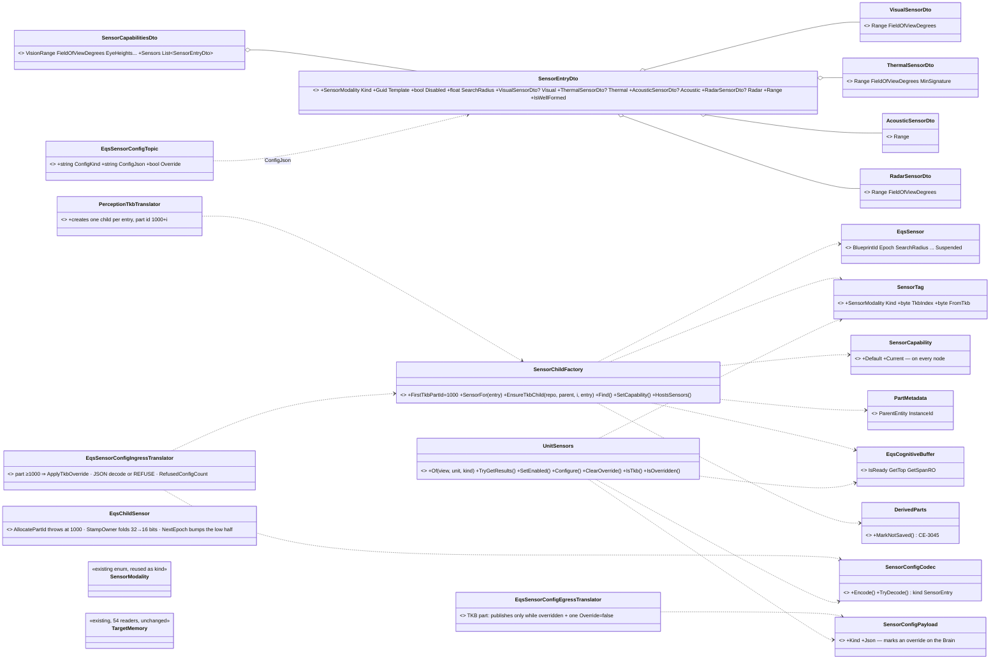

*What the picture shows that prose hid:* a TKB sensor and a behaviour sensor are built by the SAME factory — the
TKB path calls it from the translator on every node, the wire path from the config ingress. Only `SensorTag` and
`SensorCapability` are new components; the wire grows two strings.

| why | |
|---|---|
| ⭐ an EMPTY `Sensors` list with `VisionRange > 0` reads as ONE implicit visual entry | existing TKB data keeps working with no migration; a list, once present, wins |
| ⭐ `SensorCapability` is on EVERY node *(as-built — SUPERSEDES "Muscle-only")* | the factory runs on every node, and the Brain needs `Default` to restore an override; it is `NoScenario|NoReplay`, ⛔ not `Transient` (that includes `NoPreview`, which would hide it from the SoD snapshot the Muscle's filters read) |
| ⭐ `ConfigJson` is empty for a TKB sensor | K: derived locally. Non-empty only for a behaviour sensor or an override (M′) |
| ⛔ rejected: one component per modality (MOD1 §3.6.2) | one child shape and lifetime for every kind; the component count does not grow per kind |

## 5. Sensors — the paths

### 5.1 A TKB sensor, end to end

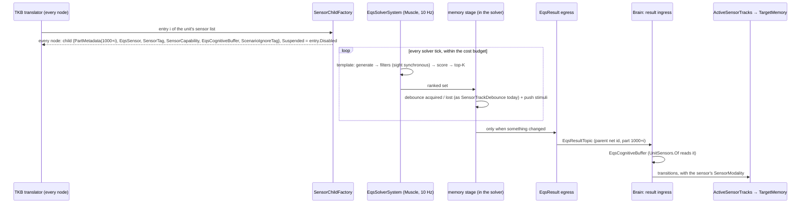

*What the picture shows that prose hid:* no step sends configuration — both nodes derive the same child from the
same TKB entry, so the existing result key `(parent net id, part id)` matches by construction.

### 5.2 A behaviour sensor, an override, a switch — one message

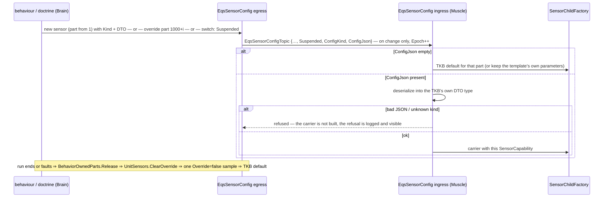

*What the picture shows that prose hid:* create, reconfigure and on/off are the SAME sample with different fields —
there is no second wire mechanism (the per-unit bitmask was rejected for exactly this).

### 5.3 The budget (G) — cost units, not sensors, not milliseconds

| rule | |
|---|---|
| each evaluation COUNTS its work | ⭐ as-built: **+100 per evaluation** (the measured fixed overhead, §9.3) · candidates generated ×1 · cheap test ×1 per candidate · sight check ×4 · path query ×16 (`EqsCost`; a test declares its weight with `IEqsCostWeight`) |
| a tick stops starting new sensors when the budget is spent | a sensor already started finishes this tick; a single sensor over the whole budget still completes and runs alone |
| order | priority band (Critical / Normal / Low), then OLDEST result first. ⭐ as-built: each band SPENDS ITS SHARE (Critical 50 %, Normal 35 %, Low the rest, slack rolling down — EQS 1.3 §7.5's shares, kept) and the oldest of every band always starts. ⛔ A strict band order would starve Low forever under load |
| every result carries its age | `EqsCognitiveBuffer.LastUpdateTick` (exists) |
| replaces | `QueryTimeSliced(…, WallClockTime)` (EQS §7.6) — ⛔ not deterministic |
| ⛔ never | the ballistics raycast queue: sync, every request per frame, outside this budget (H) |

⭐ **Why counted work:** a sensor count treats a 200-candidate thermal sweep like a 4-point offset query; milliseconds
differ per machine and per run. Counted work is proportional AND repeatable — the same scenario schedules the same
sensors on every run.

### 5.4 The solver tick — budget + memory stage (S4, `CE-3037` / `CE-3046`)

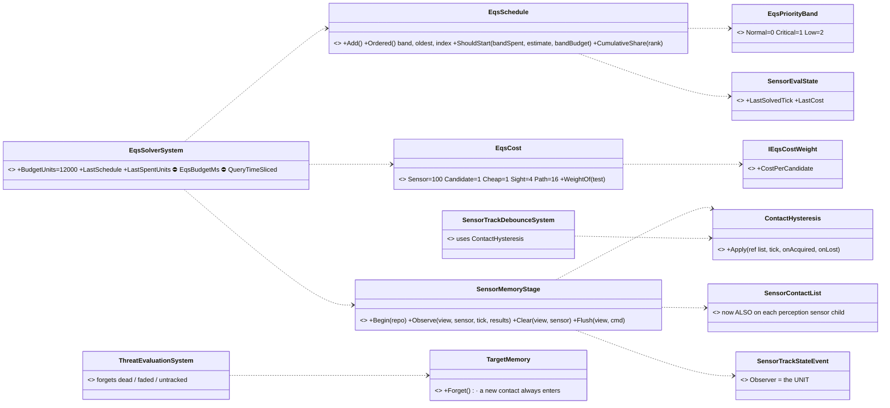

*What the picture shows that prose hid:* the debounce rule exists ONCE (`ContactHysteresis`) and both the old visual
chain and the new memory stage call it until S5 deletes the chain; the memory stage writes one list PER SENSOR (each
sensor is evaluated once per tick, so it has exactly one writer) and reports transitions of the UNIT's union.

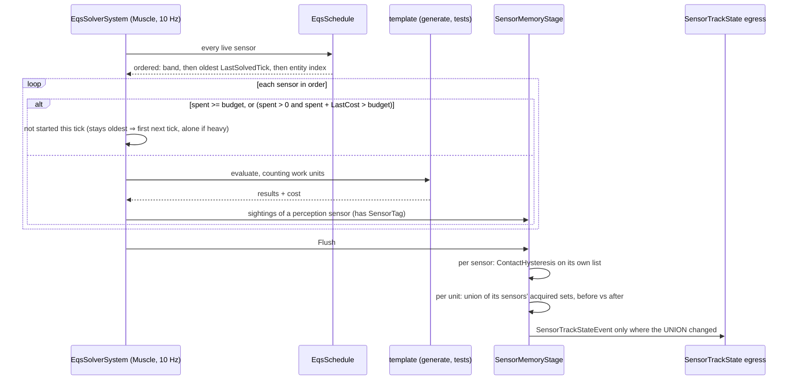

*What the picture shows that prose hid:* a unit's track is lost only when NO sensor of the unit still holds it — one
sensor losing a target another sensor sees changes nothing on the wire.

| why | |
|---|---|
| ⭐ estimate = the sensor's cost LAST time it ran | deterministic (counted, not timed); a sensor too heavy for what is left waits one tick and then runs first in its band, alone if it must |
| ⭐ `EqsPriorityBand.Normal = 0` | every existing creator leaves `Priority` 0 — it stays Normal with no change |
| ⭐ the memory stage only for a sensor with a `SensorTag` | a cover or position query is not a sighting |
| ⚠ until S5: the visual chain debounces on its own | a radar keeps a target the eyes lost? the eyes' own Lost still reaches the Brain. S5 removes the second producer |
| ⏳ modality on the wire (`SensorTrackState`) | an IDL change — S5, where `TargetMemory` is fed with the sensor's modality |
| ⭐ `CE-3046`: forget = target dead · OR faded below `ForgetScore` while no sensor tracks it | the score already IS a function of unseen time (10 %/s decay) — a second "unseen N s" clock would restate it. A new contact always enters, evicting the lowest score (ties: the oldest sighting) |

### 5.5 Vision moves onto the sensor form (S5, `CE-3038` / `CE-3050`)

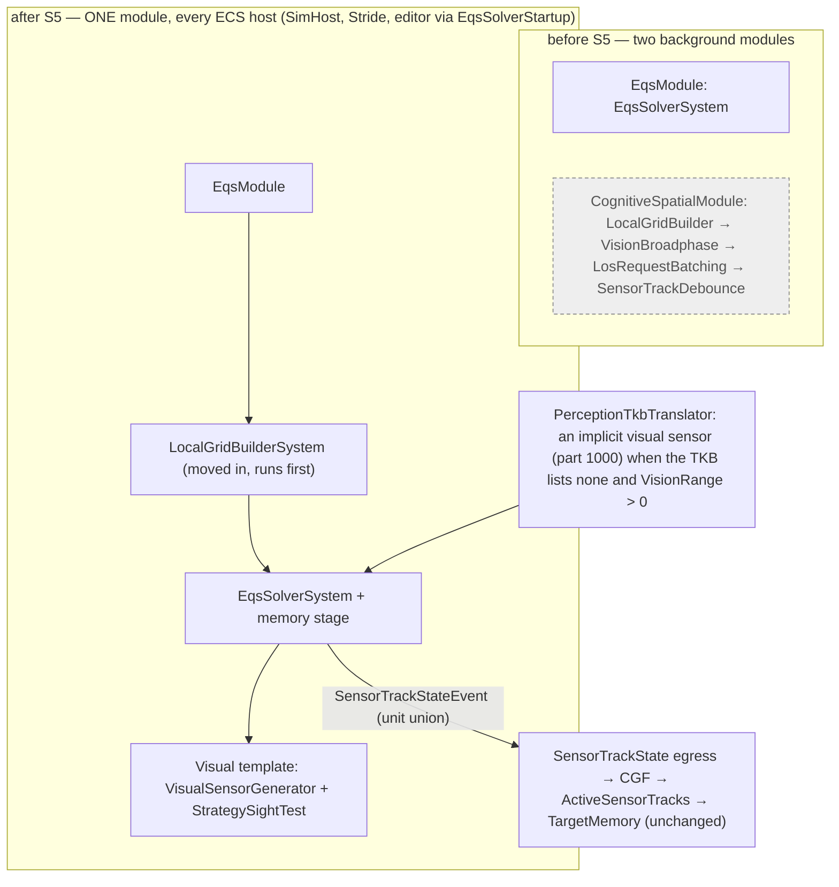

*What the picture shows that prose hid:* the perception grid moves INTO the module that reads it — before, it was
rebuilt on `CognitiveSpatialModule`'s thread while `EqsModule`'s area query could not touch it (the race noted in
`EntitiesInAreaGenerator`). Everything after the egress is untouched.

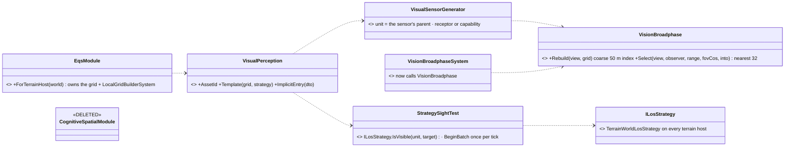

*What the picture shows that prose hid:* the broadphase and the sight test are the chain's OWN code — extracted and
called from both places — so the visual template finds exactly what the chain found (a parity rail runs both on one
world).

| why | |
|---|---|
| ⭐ the generator reads the unit's `PerceptionReceptor` (range, FOV) for the IMPLICIT sensor | the receptor stays the truth it is today — `SensorConfigIngressTranslator` retunes it over the wire. An EXPLICIT visual entry reads its `SensorCapability` |
| ⭐ the observer for sight is the UNIT, not the sensor child | eye height follows the unit's posture and `SensorMount` (Terrain §4.3) |
| ⭐ a visual sensor is a perception sensor (`SensorTag` Visual) ⇒ the memory stage debounces it | the chain's `SensorTrackDebounceSystem` has no Hrot caller left; the unit-level `SensorContactList` is no longer added |
| ⏳ the toolkit's own chain (`AutonomousPerceptionModule`, `VisionBroadphaseSystem`, `LosRequestBatchingSystem`, `SensorTrackDebounceSystem`) stays for the FDP examples | no Hrot host runs it after S5; it shares the extracted code, so no logic is duplicated. Retiring it with the examples is a follow-up row |
| ⭐ `CE-3050` | the end-to-end rail spawns two FORCES in range and lets real perception drive it — no injected events |

### 5.6 Identical queries are solved ONCE (`CE-3056`) *(build-state: BUILT `2026-10-04` — gates: EqsModuleTests 24/0 incl. `CE3056_IdenticalQueries_AreSolvedOnce_AndBothOwnersGetTheAnswer` · SimHost 1083/1, the 1 = `EcsRecordReplayControllerTests.PrepareRecordingAsync_InstallsRecordingModule`, green 3/3 in isolation (load-timing, not the solver) · Blueprints 4130/0 · cluster `Eqs\|Sensor\|Perception` 96/0)*

> 🔒 *User: "Cant they spawn their own copy but because it would be the same params the solver runs once (ref counting) and
> feed both requestors?" → "yes file it and build it."*

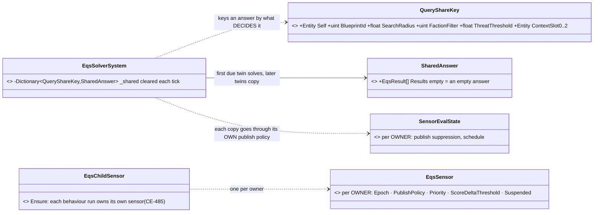

*What the picture shows that prose hid:* the share is keyed ONLY by what decides the answer; everything about DELIVERY stays per
owner, so a copy is published exactly as if that sensor had solved it. Ownership does not change at all — no ref count is
stored; "the query is solved while any twin is due" falls out of the schedule.

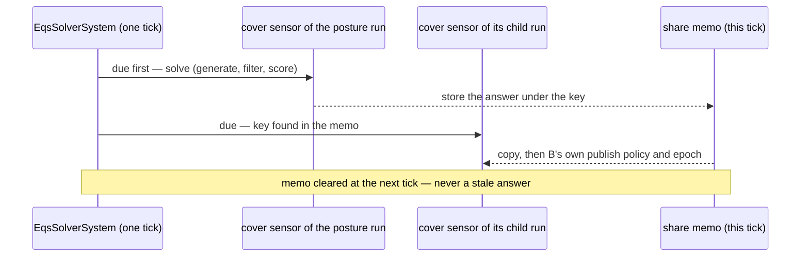

| rule | why |
|---|---|
| ⭐ only QUERY sensors share (no `SensorTag`, no `SensorCapability`) | a perception sensor's tests read its own capability (`VisualPerception.Optics`, the S3 test radar) — two of them can answer differently with equal `EqsSensor` fields; they also feed the memory stage per sensor |
| ⭐ a sensor with NO placed self (`EqsContext.Self` = Null) never shares | its answer may depend on the carrier entity itself; 📌 found by the S4 schedule rail, whose unplaced local sensors all keyed alike |
| ⭐ the memo lives ONE solver tick | an answer is never older than the tick it is delivered in; no invalidation logic |
| ⭐ a copy costs `EqsCost.Cheap`, not a solve | the budget then counts the work actually done |
| ⭐ only a COMPLETED answer is shared | a leader waiting on async raycasts publishes nothing that tick, so neither does a twin; the twin never submits raycasts of its own |
| ⚠ the wire is NOT halved | each twin keeps its own config and result samples (its own key); halving it would change what a sensor key IS |
| ⚠ "starts warm" holds within a tick only | a newly spawned twin is scheduled at once (never solved = oldest); it gets the copy when its leader runs the same tick, else it solves and becomes the leader |

## 6. Doctrine and origin — classes

*What the picture shows that prose hid:* the runners do not change at all — the slot is a VIEW (`BrainSlot`) over one
of two components, and the only things that learn about slots are the tick loop, the ingress and the run context.

| rule | why |
|---|---|
| ⭐ **the gate**: admit if `event.Origin ≥ state.Origin`, or `event.Origin == Self` | `Self` = a behaviour replacing / ending ITSELF; it inherits the current origin, so an ordered behaviour that chains stays ordered |
| ⭐ the internal finish (`BrainTickSystem.Finish → Clear`) is not gated | a behaviour ending never needs permission |
| ⭐ an event with NO origin reads as `Operator` | any unmarked path (debug API, old code) is human-rank — the AI can never override it by accident |
| ⭐ a doctrine NEVER finishes | on Success / Failure the slot restarts it next tick (a BTree doctrine is a priority list evaluated from the root each tick); only a FAULT stops it, loudly |
| ⭐ a doctrine commands no channels | `ChannelArbitrationSystem.cs:44` cancels any command whose `BehaviorInstanceId ≠ BehaviorState.InstanceId`; doctrine tokens live in a DISJOINT space (high bit set) ⇒ a doctrine's channel command is cancelled by construction |
| ⭐ existing publishers get an origin | operator UI / mission-control abort → Operator · `MissionDirector` / `MissionAdapter` (scenario mission plan) → Superior · `CommanderNodes` / `HillAttackCommanderNodes` / DDS intent ingress → Superior · `HillAttackTankNodes` clearing itself → Self · hot-reload restart → Self |
| ⛔ rejected: a `DoctrineTickSystem` of its own | a second copy of finish / fault / reload logic (ruling 9) — the loop takes a slot instead |

## 7. Doctrine — the paths

### 7.1 Autonomy, an order, and back

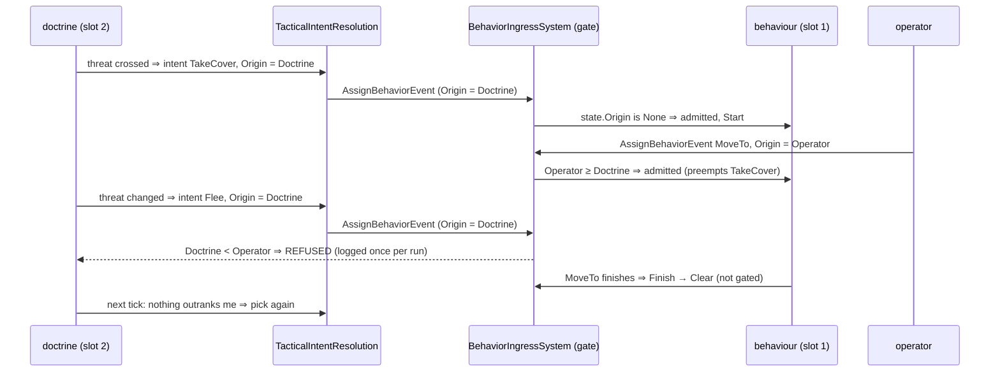

*What the picture shows that prose hid:* the doctrine never has to know an order is running — it keeps deciding,
the gate keeps refusing, and the first tick after the order ends is autonomous again. The doctrine MAY read
`BehaviorState.Origin` to stay quiet, but correctness does not depend on it.

### 7.2 What a second slot must re-key *(measured — every place keyed by entity or by `InstanceId` alone)*

| today | keyed by | with two slots |
|---|---|---|
| root params / state / HSM keys (`OccurrenceSlotKey.cs:252,277,284`) | behaviour hash only | ⭐ salt with the slot (`"$occ.rootState"` → `"$occ.doctrine.rootState"`) — the same asset in both slots must not collide |
| `RootParamsAccess.KeyFor` (`RootParamsAccess.cs:38`) | reads `BehaviorState` | ⭐ takes the `BrainSlot` |
| finish dedup `_publishedTerminalForInstanceId` (`BrainTickSystem.cs:74`) | entity index | ⭐ (entity, slot) |
| `BehaviorFaultLatch` (`BehaviorFault.cs:48`) | one per entity, first fault wins | ⭐ a second latch component for the doctrine |
| `BehaviorOwnedParts.OwnerOf` (`BehaviorOwnedPart.cs:40`) | reads `BehaviorState.InstanceId` | ⭐ take the owner from `ctx.InstanceId` — a doctrine's sensors must outlive the behaviour it assigns |
| `EqsChildSensor.StampOwner` | owner's low 16 bits into the epoch | ⚠ verify the doctrine's high-bit token cannot alias a behaviour token there (§9 V4) |
| `BehaviorStartRecord` (reload restart) | one per entity | ⭐ one per slot |
| channel preemption (`ChannelArbitrationSystem.cs:44`) | `BehaviorState.InstanceId` | unchanged — the disjoint token space is the point (§6) |

### 7.3 How a BTree, an HSM and a blueprint REACT to a sensor *(user, `2026-10-04`: "Agreed, add it to the design")*

> 🔒 *"How can btree and hsm respond to sensor results? Can sensor result change be propagated as fdp bus event or
> something or the polled conditions are enough?"*

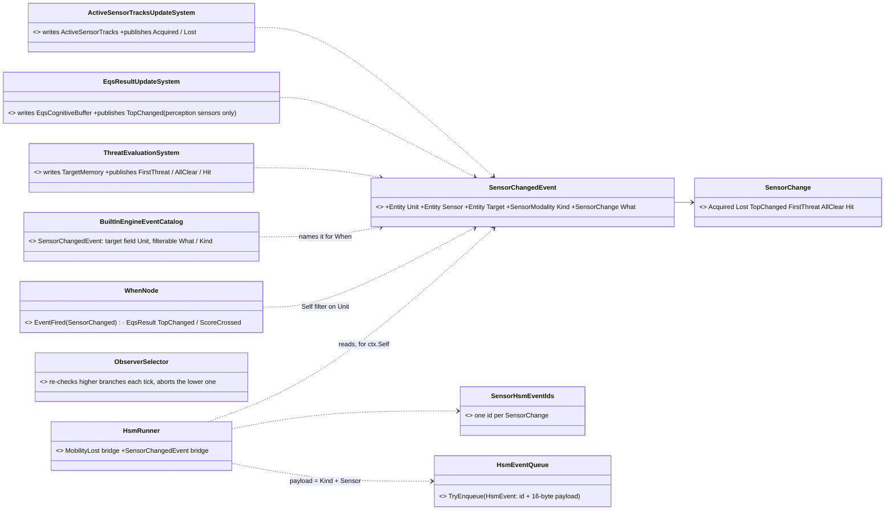

⭐ **As-built `2026-10-04` (S6 backend half, `CE-3039`, §9.5):** the producers, the event and the catalog entry are BUILT;
`HsmRunner`'s bridge (`CE-3040`) and `ObserverSelector` (`CE-3041`) are not. ⚠ **Deviation:** *Acquired / Lost* come
from `ActiveSensorTracksUpdateSystem` (it holds the unit's track set), not from `EqsResultUpdateSystem` as first drawn —
the buffer writer sees one sensor's answer, not the unit's union.

*What the picture shows that prose hid:* ONE producer per fact (the system that already writes it), and each tier
consumes it the way it already consumes anything — the HSM through the queue that carries MobilityLost today, the
blueprint through `When`, the BTree not through the event at all.

| tier | how it reacts | why this way |
|---|---|---|
| **HSM** | ⭐ **event-driven**: `HsmRunner` turns this frame's `SensorChangedEvent`s for its entity into reserved HSM events (kind + sensor in the 16-byte payload), exactly as it does MobilityLost (`HsmRunner.cs:45-49`). Authors write *On ThreatAppeared → Engaged*. Polled guards (CE-381) stay for "while X holds" | the queue exists and is fed by one event today; an edge is what a transition wants |
| **BTree** | ⭐ **polled conditions — sufficient once `ObserverSelector` works**: each tick it re-checks the leading condition of every HIGHER-priority branch; one turning true aborts the running lower branch (its exit sweep, `SweepExitedNode`) and switches | a BTree ticks every frame anyway — an event adds nothing. What is missing is the ABORT: today a running branch is never re-checked (`Interpreter.cs:613-635`), and `ObserverSelector` — documented as *"abort-on-priority-change"* (`Fbt.Kernel.md:269`) — runs as a plain selector (`Interpreter.cs:267`) |
| **Blueprint** | `When EventFired(SensorChanged)` for an edge, `When EqsResult(TopChanged / ScoreCrossed)` for a result | both exist; nothing new but the event |
| **both slots** | the doctrine and the behaviour receive the same events (`HsmRunner` runs per slot) | a doctrine HSM switches mode on *FirstThreat* while the behaviour HSM reacts tactically |

⭐ **Why edges come from the producer:** *acquired / lost / first threat / all clear* are TRANSITIONS. The producer
already holds the previous state (the memory stage sends changes only; `TargetMemory` knows its count) — a polled
condition would have to remember the previous state itself, in every condition that cares.

⛔ **Rejected:** events only (a BTree has no event entry, and "while threatened" needs polling anyway) · polling only
(every HSM transition a polled guard, every condition re-deriving edges) · one event type per sensor kind (the `Kind`
field covers it).

### 7.4 Replacing a doctrine at runtime

> 🔒 *"How could we replace a doctrine at runtime?"*

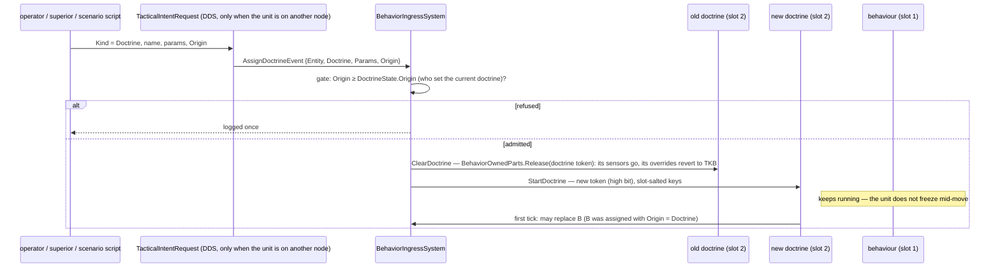

*What the picture shows that prose hid:* a doctrine change does NOT touch the running behaviour — the new doctrine
takes over through the same gate on its first tick; and the old doctrine's sensors die with it because they are
owned by ITS token, not the behaviour's (the §7.2 `OwnerOf` re-key is what makes this true).

| rule | |
|---|---|
| who may replace | the same origin rule against `DoctrineState.Origin`: an operator, a superior (a commander setting *aggressive / defensive* — the natural "goal, not order" lever, Utility §10.4), a scenario script. The TKB default is the lowest rank |
| clear | `ClearDoctrineEvent` ⇒ no doctrine ⇒ brain-dead, manual control (R-188 A) |
| hot reload | the behaviour reload path with a start record per slot (§7.2) |
| across nodes | assign / clear stay local-bus; the ONE wire path is the intent topic, which gains a `Kind` (Behaviour / Doctrine) beside `Origin` |
| ⛔ rejected | resetting the running behaviour on a doctrine change (a frozen tick mid-action) · a separate doctrine topic (two wire paths for one kind of order) |

### 7.5 Authoring a unit's AI in the scenario — the SNAPSHOT concept (behaviour, doctrine, instance blueprints)

> 🔒 *"How can i save doctrine set to an entity to a scenario by scenario editor, even overriding the one set in the tkb?"*
> · *"same question is for current behavior … it was not the right component to be saved"* · *"Agreed, add it to the
> design."* (R-190, ⛔ SUPERSEDED by R-192) · *"The scenario saving now saves current state of entity as the new initial
> snapshot. Maybe we could follow same concept?"* · ✅ *"Yes snapshot concept approved if it saves just what is needed not
> runtime hashes etc."* (R-192)

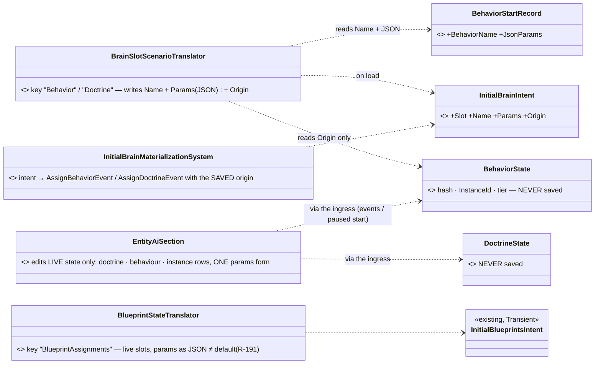

*What the picture shows that prose hid:* nothing is authored "beside" the entity — the editor edits the LIVE unit, and
the save reads the live unit through translators that keep only the declarative part (what runs, with which params,
on whose authority). The runtime components themselves never reach the file.

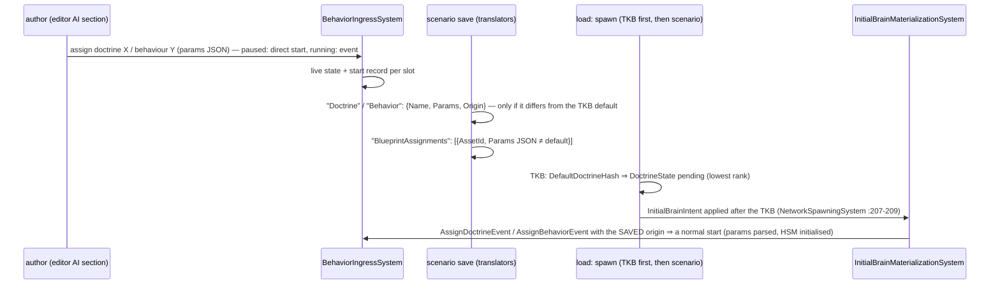

*What the picture shows that prose hid:* save and load are symmetric through the ONE ingress — a reloaded unit is
started exactly as if the author had just assigned it, so nothing restored can skip a start (the V5 gap closes too).

| rule | why |
|---|---|
| ⭐ **saved per slot: `{Name, Params, Origin}` — nothing else** | ⛔ never the hash, `InstanceId`, tier, cursor, behaviour variables, owned parts, fault latch — R-192 *"not runtime hashes etc."*. The old `BehaviorState` save was wrong for exactly these (a run token, no params, no start on load) |
| ⭐ a behaviour's PROGRESS is not saved — it restarts with the same params | the same choice as mission plans (phase progress dropped) and instance blueprints (params only) |
| ⭐ saved only when it DIFFERS from the TKB default | TKB edits still reach every entity that did not override them — the same "≠ default" rule as params |
| ⭐ the ORIGIN is saved | a behaviour the doctrine chose reloads as `Doctrine` (the doctrine may replace it again); one assigned in the editor reloads at the editor's rank (§10 O1) |
| ⭐ params JSON = the start record's JSON for a behaviour / doctrine; `FormatParams` of the live region for an instance | a behaviour's params are fixed for its run (changing them = re-assigning); an instance's region can be edited in place |
| ⛔ **derived entities are never saved** | sensor children (TKB-derived and behaviour-owned) carry `ScenarioIgnoreTag` — today they are saved and duplicate on reload: `CE-3045` |
| ⭐ an instance attach is FIND-OR-CREATE per (asset, owner) | a doctrine that attached one at runtime saves it (the snapshot is the truth); on reload the doctrine must not attach a second |
| ✅ **instance blueprints:** keep their save TRANSLATOR (`BlueprintStateTranslator`) but switch its params to JSON (next row); ADD the missing editor: each attached instance gets the same params form as the doctrine row, committed in edit mode through `WriteParamsRegion` (paused) or `AttachToEntity(paramsJson)` | measured: `EntityBlueprintsPanel.cs:276-296` attaches / detaches only — no params editing anywhere in the editor; MCP attach is the only per-entity params source today |
| ✅ **params in a scenario are JSON, never bytes — R-191** (🔒 *"The params should be saved as json to the scenario and translated to dto structs as needed. Never saved as bytes to scenario."*) | every params value in a scenario — doctrine, behaviour, instance blueprint — is a JSON object keyed by parameter NAME, holding only fields that differ from the declared defaults. ⭐ Load = the existing emitted `ParseParams` (defaults first, then the object overlaid by name; unknown keys ignored — `InstanceEmitter.cs:436-488`) into the blueprint's generated `Params` struct (`InstanceEmitter.cs:369`). ⭐ Save = a NEW emitted inverse `FormatParams(memory) → json` beside it (V9 resolved). ⇒ the `ParamsStructureHash` guard is no longer needed — a renamed or re-laid-out field degrades by name, not by byte offset. ⛔ SUPERSEDES the byte decision of Param Persistence §3 (AQ61) — 🔒 *"Bytes can not be easily migrated on json level. The previous decision must have been wrong."*: a byte region is readable only while the layout is unchanged, and the hash guard turns ANY layout change into losing every authored value; JSON by name loses only the changed field. ⭐ No legacy reader: no scenario in the repo carries byte params (measured) |
| ⭐ one params FORM for all three rows | it always produces JSON — the same JSON the scenario stores (R-191) |

⛔ **Rejected:** the authored `AiAssignment` (R-190 — a second concept beside the snapshot; the editor would keep two
things in sync) · saving the raw `BehaviorState` / `DoctrineState` (a run token, no params, no start on load) · saving
behaviour progress (needs a stable on-disk format for internal state) · a per-entity TKB override file (a second
authoring place).

## 8. Claim table

| claim | code — how it IS | design — how it was MEANT |
|---|---|---|
| every behaviour start passes one place | ✅ `BehaviorIngressSystem.Start` :205 — by name :99, by hash :137; clear :118 | ⛔ searched; none names it as the gate — this doc does |
| `BrainTickSystem` is the only caller of the runners for a root run | ✅ `BrainTickSystem.cs:170` (`Run` :241, ctx :264) | ✅ AQ33 §1.1 (`BrainTier` = the root interpreter) |
| the runners read nothing from `BehaviorState` | ✅ `IBehaviorRunner.cs` — everything through `BehaviorRunContext` | ⛔ not designed as such |
| TKB-projected components land on every host | ✅ `TkbTranslatorSet.Base()` :96, used by SimHost / CGF / IG / Stride / editor | ✅ R-185 K |
| a default behaviour at spawn exists but is never fed | ✅ `BehaviorTkbTranslator.cs:77-83` writes state directly; no template sets it | ✅ Engine Guide §11.6 — ⚠ and the direct write skips params / HSM init (finding, §9 V5) |
| perception's memory is debounce on the Muscle | ✅ `SensorTrackDebounceSystem.cs:40` (2 s) | ✅ R-185 B |
| perception forwards only `SensorTrackStateEvent` to the world | ✅ `CognitiveSpatialModule.cs:124-127` | — |
| only `AssignTacticalIntentEvent` crosses nodes | ✅ DDS `TacticalIntentRequest`; assign / clear are local-bus | ⛔ searched, none — so Origin must ride that topic too |
| the solver budget is wall clock | ✅ `EqsModule.cs:42` (4 ms), `QueryTimeSliced` | ✅ EQS §7.6 — superseded by §5.3 |
| an HSM has an event queue with a payload; only MobilityLost is fed | ✅ `HsmEvent.cs` (id, priority, 16-byte payload); `HsmRunner.cs:45-49` | ✅ AI_DEV_GUIDE §8 |
| an HSM has polled transitions | ✅ `ReservedEventIds.Polled` (`Enums.cs`) | ✅ CE-381 |
| a running BTree branch is never re-checked; `ObserverSelector` = plain selector | ✅ `Interpreter.cs:613-635`, `:267` | ✅ `Fbt.Kernel.md:269` — designed as abort-on-priority-change, not built |
| the Brain writes sensor results in one place | ✅ `EqsResultUpdateSystem.cs:41` | ✅ EQS §3.1 step 6 |

## 9. Build plan

| step | id | builds | proven by |
|---|---|---|---|
| ✅ **S0** | `CE-3032` | ⭐ BUILT `2026-10-04` — see §9.1 (the measurement found three cubic / quadratic hot spots; fixing them replaced the planned observer cap) | §9.1 |
| **S1** | `CE-3034` | `BehaviorOrigin` on the four events + `BehaviorState.Origin` + the gate in `BehaviorIngressSystem`; origin on the DDS intent topic; the existing publishers stamped (§6 table) | gate rails: Doctrine cannot replace Operator / Superior; Self chains keep origin; finish is never gated; unmarked = Operator |
| **S2** | `CE-3035` | `DoctrineState` + `BrainSlot`; `BrainTickSystem` loops both slots; the §7.2 re-keys; `AssignDoctrineEvent` / `ClearDoctrineEvent` with the origin gate against `DoctrineState.Origin` and the intent topic's `Kind` (§7.4); `BehaviorTkbTranslator.DefaultDoctrineHash` (pending start on the authority node); the *assign behaviour to self* action for BTree / HSM / blueprint; a doctrine never finishes, a fault stops it | one rail per tier: a doctrine assigns, an operator order preempts, the order ends, the doctrine resumes (§7.1) — on the editor AND `--mode all` |
| **S3** | `CE-3036` | the sensor list in the TKB (+ implicit visual entry), `SensorChildFactory`, `SensorTag`, `SensorCapability`, children 1000+i on every node, `AllocatePartId` skips 1000+, `ConfigKind` / `ConfigJson` on the wire, refusal on bad JSON, `Disabled`, override + switch, `Sensors.Of` | a NEW sensor kind in tests only (I ①): TKB child on both nodes with matching keys; behaviour-spawned thermal; override; switch off ⇒ solver skips; run end ⇒ back to default |
| **S4** | `CE-3037` | the memory stage in the solver (debounce, acquired / lost, push stimuli); cost-unit budget (§5.3) replacing wall-clock slicing; EQS §7.5–7.6 marked SUPERSEDED | determinism rail: same scenario, same schedule twice; heavy sensor runs alone; result age visible |
| **S5** | `CE-3038` | visual perception MOVES: a visual template = today's broadphase + sight; `CognitiveSpatialModule` chain deleted in the same change; `TargetMemory` fed from the memory stage | ⭐ the EXISTING perception suites stay green unchanged — they are the parity proof |
| ✅ **S6** (backend half) | `CE-3039` | ⭐ BUILT `2026-10-04` — see §9.5: `SensorChangedEvent` from its three producers (incl. *Hit*), named in the blueprint catalog, a `When` reacting to it proven | §9.5 |
| **S6n** (node half) | `CE-3054` | ⭐ **behaviors lane**: read-sensor node per tier keyed by kind; `TargetMemory` accessors rewritten to R-194 (memory = identity + freshness, danger judged at read time) — a JOINT freshness design with the backend | a doctrine blueprint that reacts to a threat end to end |
| **S2b** | `CE-3042` | snapshot translators: `BrainSlotScenarioTranslator` ("Behavior" / "Doctrine": Name + Params JSON + Origin, only ≠ TKB default) + `InitialBrainIntent` + `InitialBrainMaterializationSystem` through the ingress (§7.5, R-192) | save → reload on the editor AND `--mode all`: same behaviour / doctrine / params / origin; a TKB-default unit saves nothing; the file holds no hash, token or tier |
| **S2e** | `CE-3045` | the bug: sensor children carry `ScenarioIgnoreTag`; instance attach is find-or-create | save after a behaviour spawned a sensor ⇒ the file has no sensor entity; reload ⇒ exactly one sensor |
| ✅ **S2d** | `CE-3044` | ⭐ BUILT `2026-10-04` — params persist as JSON by name through an emitted `FormatParams` beside `ParseParams`; reload always runs `ParseParams` (it also never baked declared param defaults before); a renamed field keeps its default with a warning — [`DESIGN_Blueprint_Param_Persistence.md`](blueprints/DESIGN_Blueprint_Param_Persistence.md) §10 | §10.1 there |
| **S2c** | `CE-3043` | ⭐ **UI lane**: the editor's AI section — doctrine row, behaviour row, instance-blueprint rows with ONE params form, editing LIVE state only (§7.5) | author → save → reload shows the same values; an instance's edited params survive (the existing D3 rail extended) |
| **S6b** | `CE-3040` | ~~`SensorChangedEvent` from its two producers~~ (built in S6, §9.5); the `HsmRunner` bridge with reserved HSM ids (§7.3) | an HSM doctrine switches to *Engaged* on *FirstThreat*, both slots receive it |
| **S6c** | `CE-3041` | ⭐ **behaviors lane** (BTree infrastructure): `ObserverSelector` re-checks higher branches and aborts the running lower one via the exit sweep | a BTree in a long move branch switches to cover the tick a threat appears |
| ⏳ **S7** | `CE-3055` | thermal / acoustic sensors — ⛔ **NEEDS A DESIGN PASS before any build** (🔒 user, `2026-10-04`: *"record that S7 needs a design pass, we will return to it later"*). Measured open points: ① an OLDER acoustic pipeline already exists — `AudioStimulusEvent` → `AudioPerceptionSystem` → heard event → NED `AudioTargetDetected` (SimHost egress → IG ingress); it runs only in the FDP UrbanCombat examples and NOTHING in production publishes `AudioStimulusEvent` ⇒ fold it into the sensor form or replace it (ruling 9 — the S5 decision again, for hearing) · ② where a target's heat signature comes from (`ThermalSensorDto.MinSignature` has nothing to compare with — not yet searched) · ③ which events make sounds (weapon fire, engines) · ④ anonymous contacts (G6, behaviors lane) for shot-heard | — |

⭐ **Order:** S0 first (a live defect). S1 → S2 are independent of S3 → S6 and can run in parallel lanes.

### 9.1 As-built — S0 / `CE-3032` *(`2026-10-04`)*

📐 **Measured first** (a timing probe over the real perception systems: N units, two forces, uniform in 1 km², 500 m
vision, 360° FOV; warm, median of 3 ticks). ⚠ The planned stop-gap was an observer cap; the measurement showed the
cost was not "too many observers" but three algorithmic hot spots — each fixed, none changes what a unit can see:

| hot spot | cause | fix |
|---|---|---|
| ① `SensorTrackDebounceSystem` | every observer scanned EVERY sighting event of the tick — cubic. 757 ms at 500 units alone | sightings grouped by observer once per tick |
| ② `VisionBroadphaseSystem` | a 500 m query walked ~40 000 cells of the 5 m perception grid per observer, then read `IsAlive` / `EntityInfo` per PAIR | a 50 m coarse index built ONCE per tick from the fine grid's own contents (same set, same footprint), liveness + force read once per entity |
| ③ both sight strategies | each sight line tested EVERY collider in the world — cubic | `ColliderIndex`: a 16 m grid the sight line walks cell by cell; the exact geometry test is unchanged (parity rail: it never misses a crossing collider) |

| also changed | why |
|---|---|
| ⭐ candidates per observer: **the 32 NEAREST that pass the filters** (was: the first 256 the cell scan reached, friendlies included) | a unit remembers 16 contacts (`MaxTrackedTargets`), so 256 sight checks were mostly work no memory could hold; nearest-first means a near enemy is never dropped for a far one |
| ⭐ the first-tick contact list keeps EVERY sighting | 🔴 a pre-existing bug: one list was added PER sighting, the last won — two of three first-seen targets were announced *Acquired* and then never tracked |
| ⭐ the circuit breaker REPORTS each transition (`[ModuleHost][CIRCUIT-OPEN]` … `[CIRCUIT-CLOSED]`) | an open circuit used to skip the module for 10 s in silence — for every module, not only perception |
| ⭐ `CognitiveSpatialModule` timeout 400 ms (was the 100 ms default) | a dense scene makes a tick SLOW, not hung; the breaker exists for hangs. ⏳ S4's deterministic budget replaces this margin |

| units (1 km², all within 500 m) | before | after |
|---|---|---|
| 100 | 40–48 ms | 7–10 ms |
| 250 | 173–196 ms | 22–33 ms |
| 500 | 529–956 ms | 52–72 ms |
| 1000 | 1.5–2.4 s | 168–283 ms (⚠ over 100 ms — inside the new 400 ms timeout; S4 bounds it) |

| gate | command | result |
|---|---|---|
| perception unit suites | `dotnet test Fdp.Toolkits.Tests --filter Perception` | 69/0 (8 new) |
| Toolkits full | `dotnet test Fdp.Toolkits.Tests` | 2612/0, 1 skipped |
| SimHost perception / EQS / LOS | `dotnet test Hrot.SimHost.Tests --filter Perception|Sensor|Eqs|Los` | 29/0 |
| ModuleHost | `dotnet test Fdp.ModuleHost.Tests` | 207/6 — ⚠ the SAME 6 convoy / provider tests fail on base `2fda9e25f` (206/6); +1 = the new breaker rail |
| cross-node perception (row 8) | `dotnet test ClusterRunner.Integration.Tests --filter SensorMechanism` | 1/1 — ⚠ `SensorMechanism_EndToEnd_…` red on base too (2/2): the rail is blind, `CE-3050` |

### 9.2 As-built — S3 / `CE-3036` + `CE-3045` + `CE-3049` *(`2026-10-04`)*

⭐ §4's class diagram is the as-built picture. What the build did differently from the plan, and why:

| deviation | why |
|---|---|
| ⭐ the reader API is `UnitSensors`, not `Sensors` | a class named `Sensors` collides with its own namespace `Fdp.Toolkit.Perception.Sensors` |
| ⭐ concrete sub-records (`Visual?` `Thermal?` `Acoustic?` `Radar?`), no `ISensorConfigDto` | V1 — StructEdit cannot edit an interface member. ⭐ `Template` is a `Guid` (the template registry key), not a `uint` |
| ⭐ `ConfigJson` is the WHOLE `SensorEntryDto` under one kind, `"SensorEntry"` | one decoder, one refusal rule; the sub-record inside names the modality |
| ⭐ the wire grows a third field, `Override` | a TKB sensor is silent until overridden; ending the override needs ONE sample the receiver can tell from "no override yet" ⇒ `Override = false` restores the default at the sample's epoch |
| ⭐ the Brain marks an override with `SensorConfigPayload` (id 308, `Transient`) | the egress decides "publish a TKB sensor?" from one component, with no extra state |
| ⭐ `SensorCapability` lives on every node (§4 table) | the Brain restores the default from it on `ClearOverride` |
| ⭐ `CE-3049`: the owner is FOLDED to 16 bits (`low ^ high`), refreshes bump the low half only (`EqsChildSensor.NextEpoch`, used by `EqsLifecycleNodes`) | removes the "ids 65536 apart alias" case and the refresh carry. ⏳ The planned slot bit belongs to the doctrine slot — the behaviors lane stamps it when it builds the second slot (`FRAME_Decision_Layer.md`) |
| ⭐ `CE-3045`: one helper `DerivedParts.MarkNotSaved` tags every derived part `ScenarioIgnoreTag` — EQS child sensors, TKB sensors, Muscle carriers, AND combat weapon-mount children (the same bug, found by V2's precedent) | instance attach was already find-or-create (`BlueprintInstanceService` → `AlreadyAttached`) — that half needed nothing |
| ⏳ NOT built: the implicit visual entry for an empty list | it replaces the receptor path, so it lands with the visual move (S5, `CE-3038`) |
| ⏳ NOT built: "the solver skips sensors whose result part it does not own" (V3) | the Perception group has one holder in every composition today; a second solver is S6's concern |
| ⏳ NOT built: "run end ⇒ override back to default" | the release path is the behaviour's (`BehaviorOwnedParts`, behaviors lane); `UnitSensors.ClearOverride` is the call it makes |

| gate | command | result |
|---|---|---|
| Toolkits full | `dotnet test Fdp.Toolkits.Tests` | 2621/0, 1 skipped (base 2612 + 9 new) |
| SimHost perception / EQS / LOS | `dotnet test Hrot.SimHost.Tests --filter Perception\|Sensor\|Eqs\|Los` | 30/0 (+1 new: a new sensor kind built, solved, overridden, switched, restored) |
| cross-node EQS (row 8) | `dotnet test ClusterRunner.Integration.Tests --filter Eqs` | ⛔ **CORRECTED with S4:** the *93/0* first recorded here ran a STALE test binary — the two new rails did not compile (`EntityRepository.GetManagedComponentRO` is not visible there), and the build line was misread. Re-run with S4 (§9.3): the rails pass, and one of them found a real defect ⇒ next row |
| ⭐ found by the corrected rail | — | the Muscle ingress added a `SensorCapability` on a node that had built no TKB sensor yet ⇒ *"SensorCapability not registered"* at playback. Fixed: registered on first use, as `SensorChildFactory.SetCapability` does |

### 9.3 As-built — S4 / `CE-3037` + `CE-3046` *(`2026-10-04`)*

⭐ §5.4's diagrams are the as-built picture. What the build decided or changed, and why:

| decision / deviation | why |
|---|---|
| ⭐ **band SHARES, not strict band order** | strict order (§5.3 as first written) starves Low whenever Critical + Normal fill the budget; EQS 1.3 §7.5's shares do not, and stay deterministic |
| ⭐ **+100 units per evaluation** (`EqsCost.Sensor`) | 📐 measured: 100 sensors over 50 / 200 / 800 targets = 4.2 / 8.5 / 21.3 ms for 3 042 / 12 981 / 53 073 counted units ⇒ ~32 µs fixed per sensor + ~0.34 µs per unit. Without the fixed term, 100 tiny sensors would read as cheap |
| ⭐ **`BudgetUnits = 12 000`** | the old 4 ms wall budget in measured units (debug build) — ~40 typical sensors a tick |
| ⚠ O5 only partly measured | sight (×4) and path (×16) stay design constants: the probe had no terrain or navmesh to time them against |
| ⭐ the memory stage keeps a `SensorContactList` on each perception SENSOR CHILD; the visual chain's query now excludes sensor children | one writer per component — the visual chain owns the unit's list, the solver owns each sensor's |
| ⭐ a suspended perception sensor clears its list | an ended sensor holds nothing; its targets leave the unit's union |
| ⭐ the solver persists `SensorEvalState` ONCE per evaluation (was: up to four places) | the schedule fields ride along; an unknown template now also records its state |
| ⏳ the 400 ms `CognitiveSpatialModule` timeout (S0) STAYS | the budget bounds the EQS solver, not the visual chain — S5 moves vision onto EQS, then the margin goes |
| ⭐ `CE-3046`: a new contact always enters (lowest score evicted, ties: oldest sighting); dead or faded-and-untracked entries are forgotten | §5.4 table |

| gate | command | result |
|---|---|---|
| Toolkits full | `dotnet test Fdp.Toolkits.Tests` | 2623/0, 1 skipped (+3 CE-3046, one test re-pinned: *17th contact enters*) |
| SimHost full | `dotnet test Hrot.SimHost.Tests` | 1081/0, 3 skipped (+4 S4: deterministic schedule · every band every tick · heavy waits then runs alone · memory-stage union) |
| cross-node EQS + sensors (row 8) | `dotnet test ClusterRunner.Integration.Tests --filter Eqs\|Sensor\|Perception` | 95/1 — the one red is `SensorMechanism_EndToEnd_…`, red on base (`CE-3050`). ⚠ Five EQS rails seeded `TargetMemory` with FAKE target ids (`1L`, `2L`, `999L`, `0`); `CE-3046` now forgets a target that does not exist, so they were given live targets — the realistic case |
| editor | `dotnet test Hrot.Editor.Tests` | 463/0, 2 skipped |
| examples · overlays · blueprints *(restored first — they had no `project.assets.json`)* | each project's full suite | Examples.Scenarios 53/3 — ⚠ the 3 `UrbanCombatNew…` reds are red on base `d26f23ec1` too (`CE-321`: the insurgent takes no damage); UrbanCombat 29/0 · Overlays 29/0 · Blueprints 4128/0 |

### 9.4 As-built — S5 / `CE-3038` + `CE-3050` + `CE-3051` *(`2026-10-04`)*

⭐ §5.5's diagrams are the as-built picture. What the build decided or found:

| decision / finding | why |
|---|---|
| ⭐ **parity is PROVEN, not argued** | a rail runs the old chain (`VisionBroadphaseSystem` → `LosRequestBatchingSystem`) and the visual sensor on ONE world of 40 units / 25 blockers / mixed FOV: identical (observer, target) sets, and the scene must contain blocked lines so the sight test is exercised |
| ⭐ **the broadphase is EXTRACTED (`VisionBroadphase`), not copied** | the toolkit system and the generator call the same code. ⭐ `CE-3052` (`2026-10-04`): the toolkit chain (`AutonomousPerceptionModule`, `VisionBroadphaseSystem`, `LosRequestBatchingSystem`, `SensorTrackDebounceSystem`, `LosCheckRequestEvent`, and — 🔒 user-approved — `TargetVisibleEvent`, whose last producer fired it for BLOCKED EQS cover rays) is DELETED — `VisionBroadphase` and `ContactHysteresis` each have ONE caller now; the FDP `SensorGridScenario` went with it (the solver lives in `Hrot.SimHost`, out of the examples' reach); the parity rail compares against a brute-force reference; occlusion → reacquire is in `SensorMechanismIntegrationTests`. Gates: Toolkits perception + ECB-coverage 74/0 · SimHost 1083/0 · NED 133/0 · cluster `Eqs\|Sensor\|Perception` 96/0 (incl. the new occluded → reacquired step) · Examples 49/3, the 3 = `UrbanCombatNew…` (`CE-321`, red on base). After deleting `TargetVisibleEvent`: Toolkits 2617/0 · SimHost 1083/0 · Blueprints 4130/0 · Stride builds · cluster `Eqs\|Sensor\|Perception\|Combat\|Weapon` 98/1, the 1 = `UrbanCombatFileLifecycle…` (red on base `749266ddc`, §9.4) |
| ⭐ **`EqsModule.ForTerrainHost(world)`** owns the grid, the builder and the visual template; `EqsSolverStartup` uses it on every host | one factory, so a host cannot wire sight and forget the grid. The editor's `SwitchToExternalAsync` now uninstalls the EQS module (it carries vision, as the deleted perception module did) |
| ⭐ **budget 150 000 units** (was 12 000) | 📐 measured (debug, 500 m all-round vision, 1 km²): 100 / 250 / 500 / 1000 units = 23 k / 71 k / 142 k / 281 k units, 9.6 / 36 / 76 / 230 ms — the old chain was 7–10 / 22–33 / 52–72 / 168–283 ms (§9.1). ⇒ every sensor every tick up to ~500 units, as the chain did; beyond, oldest first. The 400 ms timeout moved to `EqsModule` |
| 🔴 **`CE-3051` — every catalog unit was `Neutral` on SimHost** | `WithFaction` was a no-op; SimHost's force comes from the behaviour profile, CGF's from the map symbol ⇒ the nodes disagreed, and vision (old and new) ignores its own force ⇒ real perception saw nobody on a cluster. Found by the rewritten `CE-3050` rail's per-hop diagnostics |
| ⭐ **`CE-3050`** — real M1 vs T-72 | acquire → CGF track → score → out of sight → Lost → decay. ⚠ the decay is measured from the moment the track is LOST: the score keeps rising through the hysteresis window |
| 🔴 **`CE-3053` — a unit's children outlived it on SimHost and CGF** | `SubEntityCleanupSystem` was registered only on a pure IG (against `REPL-DESIGN.md` §4.4). `SubEntityCascadeDestroyTests` had passed VACUOUSLY — the test unit had no children; the implicit visual sensor gave it one. Registered on every node |
| ⏳ modality on the wire | still Visual-only in practice (no other kind has a template yet) — lands with S7 thermal / acoustic |

| gate | command | result |
|---|---|---|
| Toolkits full | `dotnet test Fdp.Toolkits.Tests` | 2623/0, 1 skipped |
| SimHost full | `dotnet test Hrot.SimHost.Tests` | 1082/0, 3 skipped (+2: parity · implicit sensor; the CognitiveSpatialModule policy rail deleted with it) |
| Editor · Core · NodeComposition · NED · Blueprints | each full suite | 463/0 · 185/0 · 55/0 · 133/0 · 4128/0 |
| cross-node EQS + sensors (row 8) | `ClusterRunner.Integration.Tests --filter Eqs\|Sensor\|Perception` | ⭐ **96/0** — `SensorMechanism_EndToEnd` GREEN for the first time (real perception) |
| cross-node, the suites a full run failed | `--filter` SubEntityCascade, SplitAuthority, EgressShadow, SimTimeSync, Gizmo, Lifecycle, Ghost, Ownership, … | 40/2 — `MapPlacement…` and `UrbanCombatFileLifecycle…` red on base `749266ddc` too. ⚠ The FULL suite is not gateable (75 of several hundred ran, then cascading 1 ms failures — the known DDS-allocator crash, run under load) |
| Stride | `dotnet build HrotStrideApp.Game.Tests -p:EnableWindowsTargeting=true` | builds; ⚠ its tests need Windows |
| examples | Examples.Scenarios · UrbanCombat · Overlays | 53/3 (the 3 `UrbanCombatNew…` = `CE-321`, red on base) · 29/0 · 29/0 |

### 9.4a `UnitSensors.OfTemplate` — reading a sensor someone else runs *(`CE-2071`, built by backend `2026-10-04`)*

> 🔒 *User: "backend builds sensor lookup. backend adds OfTemplate."*

| rule | why |
|---|---|
| ⭐ query sensors (cover, retreat …) are made ON THE FLY by the behaviour that needs them and die with its run; the TKB declares only the unit's permanent senses | a TKB sensor runs for the unit's whole life and costs budget every tick it is on (§5.3) — the user's point, `2026-10-04` |
| ⭐ `OfTemplate` is for a SECOND reader of a sensor that already runs — a child behaviour, a utility input — instead of spawning a duplicate | a duplicate costs a second solve per tick, starts cold (`IsReady` false for ≥ 1 solver tick, V6) and can answer differently from the original |
| ⭐ preference: the caller's CURRENT run's own sensor → a TKB sensor → any other run's; lowest part id within each | `EqsChildSensor.Find` is deliberately run-scoped (`CE-485`), so it cannot see another run's sensor; `StandardInputs.TryFindEqsChild` took the first match in query order |
| ⛔ a borrowed handle is never cached and never configured | a behaviour-owned sensor is destroyed the moment its run ends (`BehaviorOwnedParts.Release`); a refresh / `Configure` moves its epoch and drops its owner's results |

### 9.5 As-built — S6 backend half / `CE-3039` *(`2026-10-04`)*

> 🔒 *User: "yes backend half please"* — S6 split: the backend builds the EVENT; the nodes that READ sensors go to the
> behaviors lane (`CE-3054`, [`FRAME_Decision_Layer.md`](blueprints/batches/FRAME_Decision_Layer.md) addendum).

⭐ §7.3's class diagram is the as-built picture. What the build decided or found:

| decision / finding | why |
|---|---|
| ⚠ **deviation: *Acquired / Lost* come from `ActiveSensorTracksUpdateSystem`**, not `EqsResultUpdateSystem` | the track set is the UNIT's union (the memory stage sends changes only, §5.4); the buffer writer sees one sensor. An edge fires when a track is ADDED or actually REMOVED — a repeat *Acquired* (position update) or a *Lost* for an unheld track is silent |
| ⭐ ***TopChanged* from `EqsResultUpdateSystem`, perception sensors only** | a sensor with `SensorTag` + `PartMetadata`; the top is compared as (entity, position) before vs after the write. A query sensor (cover, flank) is silent — its blueprint uses `When EqsResult(TopChanged)` |
| ⭐ ***FirstThreat / AllClear* from `ThreatEvaluationSystem`** on the `TargetMemory` count crossing 0 | *AllClear* is reachable only because `CE-3046` forgets |
| ⭐ ***Hit* is DERIVED on the Brain from a `Health.Current` drop** (healing is not a hit), `Target` = Null | `HitEvent` is Muscle-local (no translator); `Health` replicates through the `EntityDamage` ingress ⇒ the Brain sees the drop, not the shooter |
| ⏳ ***shot-heard* — DEFERRED** | no acoustic producer exists (S7), and a heard shot is an anonymous contact (G6, behaviors lane). ⛔ no enum value reserved — one is added with its producer |
| ⭐ **the event lives in its own file** (`Perception/Events/SensorChangedEvent.cs`, id 4006) | ⚠ the DDS IDL generator emits one scope per source file ⇒ `SensorChange.Acquired` collided with `SensorTrackStatus.Acquired` in `PerceptionEvents.cs` |
| ⭐ **blueprint `When`: a catalog entry, no new node** | `BuiltInEngineEventCatalog` "SensorChangedEvent": target field `Unit`, filterable `What` / `Kind` ⇒ `EventFired` + `Self` + a payload check on `What` |

| gate | command | result |
|---|---|---|
| producer rails | `Fdp.Toolkits.Tests --filter SensorChangedEventTests` (+ ThreatEvaluation, ActiveSensorTracks) | 14/0 — Acquired once / Lost once · FirstThreat → AllClear on forgetting · Hit once per drop, healing silent |
| TopChanged rail | `Hrot.SimHost.Tests --filter EqsModuleTests` | 23/0 — `S6_APerceptionSensorsTopChanging_IsOneTopChanged_AQuerySensorIsSilent` |
| blueprint rail | `Hrot.Blueprints.Tests --filter WhenNodeRuntimeTests` | 22/0 — `CE3039_ABlueprintReactsToItsOwnUnitsSensorChange_ThroughTheBuiltInCatalog` (another unit's Hit and the own unit's FirstThreat do not fire) |
| Toolkits full | `dotnet test Fdp.Toolkits.Tests` | 2626/0, 1 skipped (+3) |
| SimHost full | `dotnet test Hrot.SimHost.Tests` | 1082/1, 3 skipped — the red is `LiveFromReplayTests.TeardownReplay_PreservesEntityRepositoryState` (7 s in the full run); ⚠ GREEN 3/3 in isolation ⇒ timing under load, not this change (no replay code touched). The +1 rail is in the 1082 |
| Blueprints · Editor · NED | each full suite | 4129/0 · 463/0 · 133/0 |
| cross-node EQS + sensors (row 8) | `ClusterRunner.Integration.Tests --filter Eqs\|Sensor\|Perception` | 96/0 |

### Verify before building — ✅ MEASURED `2026-10-04` *(user: "measure the checks so they dont come from the build late")*

| # | question | ✅ measured answer | ⇒ design consequence |
|---|---|---|---|
| **V1** | can a TKB sensor list hold per-kind configs? | ⭐ JSON: YES — the TKB parser is plain System.Text.Json (`TkbDescriptorGenerator.cs:121-128`, `FdpJsonOptionsRegistry.cs:62-84`), which honours `[JsonPolymorphic]` (used elsewhere, `BehaviorTreeAssetDto.cs:226`); nested `List<record>` already exists (`WeaponSuiteDto.cs:16`). ⛔ EDITOR: StructEdit marks an interface-typed member **Unsupported** (`ReflectionEditDocumentBuilder.cs:317-332`) | ⭐ **no interface**: `SensorEntryDto` carries a concrete optional sub-record per kind (`Visual?`, `Thermal?`, `Acoustic?`) — editable and serialisable with no new converter. §4's `ISensorConfigDto` is SUPERSEDED |
| **V2** | can a TKB translator create child entities at spawn? | ⭐ YES — and one already does: `CombatTkbTranslator.cs:101-121` creates a `PartMetadata` child per extra weapon mount, on every node, no network id. `Inject` runs from an event loop, not a query (`NetworkSpawningSystem.cs:137-142`; ghost promotion `GhostPromotionSystem.cs:271`) | K's model is the weapon-mount precedent — reuse its shape; no pending marker needed |
| **V3** | who publishes result part 1000+i with no config sample? | ⭐ `HasAuthority` falls back to the GROUP record `(dtEqsResult, 0)` = the Perception group, then the primary owner (`AuthorityExtensions.cs:33-66`; group binding `NedOwnershipGroupBinding.cs:36`). The Perception group is granted only when the template has perception (`VisionRange > 0`, Ownership design G-4) | ⭐ works as designed IF the grant condition becomes "the template lists any sensor" (S3). ⚠ and: every Perception node would SOLVE a TKB sensor but only the group holder publishes ⇒ **the solver skips sensors whose result part it does not own** (same check, before solving) |
| **V4** | can a doctrine token alias a behaviour token in the epoch stamp? | ⚠ YES — `StampOwner` keeps only the owner's low 16 bits (`EqsChildSensor.cs:110`); every reader compares the whole epoch (`EqsResultUpdateSystem.cs:56,128`, `EqsSolverSystem.cs:121`) ⇒ a stale result of an earlier run on a reused part id could be accepted. Narrow, and it ALREADY happens today for ids 65536 apart. ⚠ plus: `EqsLifecycleNodes.cs:128` `Epoch++` on the full value carries a refresh overflow into the owner bits | stamp `(owner & 0x7FFF) | slot << 15` into the high half, and every refresh bumps the LOW half only — `CE-3049` |
| **V5** | what happens to a TKB default behaviour today? | 🔴 BROKEN, latent: with params it THROWS on the first tick — no root-params slot (`RootParamsAccess.cs:186`, no catch in `BrainTickSystem`); an HSM default never runs (no instance provisioned). No template sets it and no test covers it | ⭐ the doctrine / behaviour defaults start through the ingress (§7.5); the direct write is deleted — `CE-3047` |
| **V6** | same frame or next? | ⭐ NEXT frame — the bus is double-buffered, swapped once per frame before Simulation (`FdpEventBus.cs:30,65`; `ModuleHostKernel.cs:553`); and on CGF `EqsResultUpdateSystem` runs AFTER `BrainTickSystem` (`CgfSubsystem.cs:979`) | one frame of latency, by construction and deterministic — the rails state it |
| **V7** | what happens to a unit's AI when Brain authority moves? | 🔴 the authority bit moves (`OwnershipApplier.cs:76-118`; debug transfer, failover reclaim) but behaviour state is "linked, never sent" (Ownership design :137) — the new owner has hash 0 ⇒ **the unit goes brain-dead after any hand-over**. Pre-existing | ⭐ the SNAPSHOT shape solves it: each slot's `{Name, Params, Origin}` is ALSO published as a small TransientLocal descriptor; the node that gains authority starts it through the ingress — one shape for save, load AND hand-over — `CE-3048` |
| ~~V8~~ | ✅ dissolved by R-192 (runtime attachments are the truth; find-or-create attach) | — | — |
| ~~V9~~ | ✅ resolved by R-191 (`FormatParams`) | — | — |

## 10. Open — what is NOT yet decided *(`2026-10-04`)* — ✅ O1–O3 APPROVED (🔒 *"O1–O3 approved."*, R-193)

| # | open decision | ⭐ lean | decides |
|---|---|---|---|
| ✅ **O1** | the origin of an assignment made in the scenario EDITOR (it is what the snapshot then saves) | `Superior` — an authored start outranks the doctrine until it ends; leave the behaviour row empty for autonomy from second one | the user |
| ✅ **O2** | the origin of each EXISTING publisher (§6 table) | operator UI / mission-control abort / debug API → `Operator` · mission plans + commander nodes + DDS intents → `Superior` · a behaviour ending or re-assigning itself → `Self` · unmarked → `Operator` | the user |
| ✅ **O3** | a doctrine that FAULTS | stays stopped (the unit is brain-dead), the fault is logged and visible in the editor's AI section and `/diagnostics`; no auto-restart (a doctrine that faults every tick would spam) | the user |
| ✅ ~~**O4**~~ | S0's interim cap | ⛔ the observer cap was NOT built — it would have broken the debounce (contacts of a skipped observer age into *Lost*); the measured hot spots were fixed instead, see §9.1 | build (S0) |
| **O5** | the cost-unit weights (§5.3) | measured once on a reference scenario at S4, then constants | build (S4) |

| verify while building | §9 |
|---|---|
| V1 TKB JSON polymorphism · V2 child entities at spawn · V3 who owns result part 1000+i · V4 token aliasing in `StampOwner` · V5 behaviour default skips its start · V6 same-frame or next-frame events · V7 doctrine as published state for a Brain hand-over | each has a fallback written in |

| other lanes | |
|---|---|
| `CE-3041` (behaviors) | `ObserverSelector` abort |
| `CE-3043` (ui) | the editor's AI section |
| `CE-3031` (behaviors) | EQS-consuming behaviours — a doctrine is what will assign them |

## 11. Critical review — through the eyes of a real game AI *(`2026-10-04`)*

> 🔒 *"lets take a critical look and check for flaws and gaps from the point of view of a real game AI (which we are still
> building infrastructure for, but a bit blindly, without having a clear needs we need to cover - so we keep stuff flexible
> and open)."*

The test applied: a squad rifleman and a tank, autonomous, on a mission, under fire, in a 2-hour scenario. What breaks?

### 11.1 Measured DEFECTS (filed)

| id | defect | evidence | why a game AI cares |
|---|---|---|---|
| `CE-3046` | 🔴 **`TargetMemory` never forgets, and drops new contacts when full** | nothing removes an entry (the only `Count--` in perception is `ActiveSensorTracksUpdateSystem.cs:90`, the track list); a 17th contact is ignored (`PerceptionComponents.cs:139`) — dead and long-lost targets keep their slots | after 16 contacts in a long scenario the unit is blind to every NEW threat, and §7.3's *AllClear* can never fire |
| `CE-3047` | 🔴 the TKB default behaviour throws (params) or never runs (HSM) | V5 | a template that sets it crashes the Brain tick |
| `CE-3048` | 🔴 a Brain-authority hand-over leaves the unit brain-dead | V7 | failover = every unit of the lost node stops thinking |
| `CE-3049` | ⚠ epoch owner-stamp aliasing + refresh overflow into the owner bits | V4 | a stale answer accepted after a rare id reuse |

### 11.2 Design GAPS — what a game AI will need that the design does not give yet

| # | gap | evidence | ⭐ lean (keeps it open, not speculative) |
|---|---|---|---|
| **G1** | ⭐⭐ **"threat" is not danger** — the score is seconds-seen (+50/s while tracked, −10%/s decay, `ThreatEvaluationSystem.cs:~76`, `PerceptionConstants.cs:41`): a truck seen long scores above a tank seen briefly | measured | split the memory entry into **confidence** (how sure I am it is there — what perception produces) and **danger** (how much it matters to ME — target class, weapons vs my armour, range, facing), the latter from ONE pluggable assessor fed by the TKB. Doctrines and *FirstThreat* thresholds use danger |
| **G2** | ⭐⭐ **a mission overrides autonomy** — `MissionDirectorSystem` assigns each phase's behaviour directly (`:217`), at `Superior` (R-193) ⇒ a doctrine unit with a mission is just scripted; the user's *"autonomous entity … needed by the main mission"* has no path | measured | a mission plan gets a mode: **Direct** (today) or **Goal** — the current task is published as the unit's GOAL (objective, area, deadline) for the doctrine to pursue; the director stops assigning. This is the "goal, not order" option (Utility §10.4) made concrete |
| **G3** | ⭐⭐ **doctrine and behaviour share nothing after the start** — params are fixed per run; a new target picked by the doctrine needs a behaviour RESTART (which resets channels — BD1) | design §7.5 | one small per-unit **intent** component the doctrine (or an order) WRITES and behaviours READ live: current target, objective, posture, ROE (G7). Changing the target is a write, not a restart |
| **G4** | ⭐ **decision thrash** — a doctrine re-deciding every tick on flickering input swaps behaviours back and forth | reasoning | ① re-assigning the SAME behaviour + params is a no-op at the ingress ② an optional minimum commit time on a doctrine's assignment ③ the memory stage's debounce already damps the input |
| **G5** | ⭐ **doctrine cost** — the Brain runs synchronously every frame (`CgfSubsystem.cs:3315`); a doctrine per unit per frame is waste | measured | the doctrine slot ticks at a lower rate (default 5 Hz, staggered by entity index — deterministic) AND immediately on a `SensorChangedEvent` / `BehaviorFinishedEvent` for that unit |
| **G6** | **contacts without identity** — "hit from an unseen shooter", "shots heard from the north" — memory is keyed by entity id (`AddOrUpdateTarget` matches `EntityIds[i]`) | measured | the memory stage accepts ANONYMOUS contacts (synthetic id, position estimate + uncertainty radius) that merge into a real track when one is seen there |
| **G7** | **no rules of engagement anywhere** (grep: none) | measured | part of G3's intent component (*hold / return fire / free*), set by orders through the origin gate, read by doctrines and weapon behaviours |
| **G8** | **the doctrine needs feedback** — why did my behaviour end? was my assignment refused? | `BehaviorFinishedEvent {Result, FaultCode}` exists | both (finish and gate refusal) join §7.3's bridge — HSM events, blueprint `When`, a BTree-readable "last outcome" |
| **G9** | one behaviour owns every channel — move and shoot must live in one asset | `ChannelArbitrationSystem` | keep open; BTree `Parallel` covers it inside one asset. Per-channel behaviour layers only if a real need shows |
| **G10** | no shared team picture (radio reports) | — | keep open: a *Reported* modality as a push stimulus fits the memory stage when wanted |
| **G11** | identification and detection probability (detect → recognise → identify; friend-or-foe mistakes) — `FactionFilter` assumes perfect knowledge | — | keep open: room in the memory entry (an identification level) and in the result flags; any randomness from a seeded RNG per (sensor, target, tick) — deterministic |

### 11.2b The user's answers *(`2026-10-04`)* — and the hand-over

| # | 🔒 user | ⇒ |
|---|---|---|
| G1 | *"tank seems a bigger threat even if seen briefly because it is more dangerous (hidden does not mean harmless), maybe it just a matter of how long it takes to forget"* | ⛔ the confidence/danger lean above is REWORDED: danger = WHAT it is (does not fade); FRESHNESS = how current my knowledge is (fades). The memory stage (S4) keeps room for freshness; judging danger is the decision layer's |
| G2 | *"Maybe mission should include doctrine, not just tasks? Mission triggers seems to be what doctrine may be replacing."* (⛔ SUPERSEDED `2026-10-04`: the mission is NOT changed — it stays the end-user surface; [`DESIGN_Decision_Layer.md`](DESIGN_Decision_Layer.md) §2) | ⛔ the "Goal mode" lean above is WITHDRAWN: a mission phase may name a doctrine (+ params), the trigger changes it, the doctrine reacts inside the phase |
| G2b | *"at 5hz couldnt doctrine miss some events, are events buffered?"* | yes it would — bus events live one frame (`FdpEventBus.cs:30`) ⇒ wake-on-event is mandatory with G5 |
| hand-over | *"Maybe we should handoff all this discussion to the behavior lane, and here start the eqs rework"* · *"Agreed, write the frame and start S0"* | ⭐ G1–G11 + the approved doctrine/origin build (`CE-3034/3035/3040/3041/3042/3047/3048`) → behaviors lane: [`FRAME_Decision_Layer.md`](blueprints/batches/FRAME_Decision_Layer.md). Backend keeps the sensor side: S0, S3, S4, S5, `CE-3045`, `CE-3046`, `CE-3049`, `CE-3044` |

### 11.3 What this changes in the build order

| | |
|---|---|
| ⭐ before S4 | `CE-3046` is not optional — the memory stage (S4) must FORGET (unseen for N s, target dead, score below ε) and EVICT the least dangerous when full. It is the same code |
| ⭐ S2 | absorbs `CE-3047` (defaults through the ingress), G4 ① (idempotent re-assign), G5 (doctrine rate + wake-on-event), G8 (feedback) |
| ⭐ S2b | absorbs `CE-3048`: the snapshot shape is published for hand-over |
| ⏳ decide | G1, G2, G3 — each changes a contract (the memory entry, the mission plan, a new per-unit component) ⇒ they need the user before S4 / S2 |

