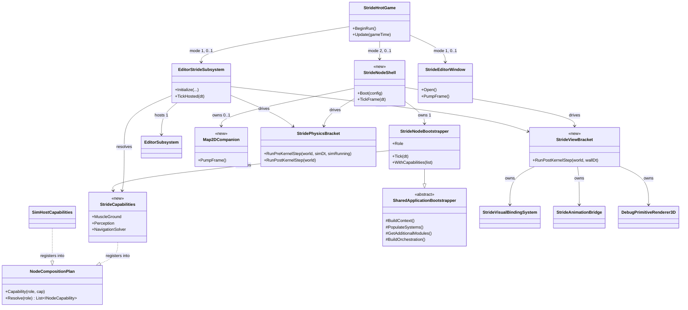
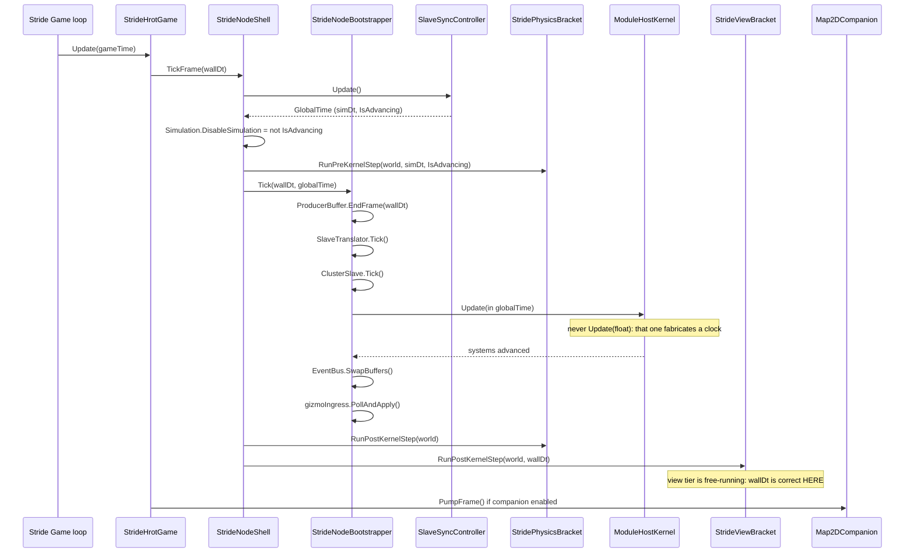

<!--STATUS
state: LIVE
build-state: READY-TO-BUILD
updated: 2026-09-09
current-answer: §13.7 (CE-207 slice S4 AS BUILT, 2026-09-09) -- MODE 2 IS BUILT AND COMPLETES
  hill-attack-close, both hostiles killed, measured against a CGF+SimHost baseline in the same
  session. Read §13.7 FIRST: it carries the seven defects S4 cost, the retraction about the
  perception tier, and the explicit list of what mode 2 still does NOT have. Then §13.1 (the
  2026-09-07 WINDOWS VERIFICATION - read it before quoting any
  "compiled here" cell in §13). the whole file. §2.1 carries the 2026-09-07 rulings (R-S11 CLI args + ctor slots die,
  R-S12 the physics delta, R-S13 the shell drives brackets, R-S14 closing the last three open questions);
  §11.1 and §7.3a are where R-S12/R-S13 land, §7.2b is the day-1 operator surface. §14's questions are
  ALL CLOSED — the table is now a record, not a decision list. Build order is §13's slice table. S0/S1/S2a/S2b/S2c/S3 are BUILT, and S4 (CE-207, mode 2) is BUILT as of 2026-09-09 -- see §13.7
  (as-built: §11.1a for S2c, §7.3b for S3). It is
  the ONE owning design for the Stride story — the two modes the user
  wants (mode 1 networkless dual-window editor, mode 2 networked node replacing SimHost), the shared
  composition, the window surfaces, gizmos, animation, perception/LOS, the role vocabulary, and §16
  getting Stride into the main solution (Tier 1 is one MSBuild property + three solution entries).
design-basis: user rulings 2026-09-05 (quoted verbatim in §2) · .dev/_DONE/stride-mock/DESIGN.md (the
  mode-2 node design, ~70% still true — §3 says exactly which parts) · docs/DESIGN_Stride_Port.md (the
  as-built port + the Windows boundary §6.6/§7.4 + the mode rails §9) ·
  docs/DESIGN_Subsystem_Composition_Unification.md §4.1L/§4.1y/§4.1z/§4.1aa/§4.1ab (the capability seam and
  the editor/Stride adoption) · docs/DESIGN_Node_Roles_And_Policies.md (the role vocabulary).
known-rot: §11.1's table cell ① claimed the motors were already gated while paused. Measured FALSE
  on 2026-09-07 (simRunning was derived from the time-controller MODE, true on every paused
  Continuous frame); the cell is marked SUPERSEDED in place and §11.1a carries the as-built.
  §11.1's lean for ② (option A, hoist the advance into the shell) was NOT taken in S2c — mode 1
  has no shell; option B shipped there and A moves to CE-207. §11.1a argues both.
  §7.3a's StrideViewBracket table was wrong in four ways (assembly, a unit already bracketed
  elsewhere, a missing step, and gizmos-before-selection which inverts the BATCH-S2-AG fix).
  It is replaced by §7.3b, the as-built.
known-conflict: docs/DESIGN_Subsystem_Composition_Unification.md §4.1aa carried an earlier, thinner
  version of the mode plan. §4.1aa is SUPERSEDED BY THIS FILE for anything about the Stride modes; it
  keeps only the capability-seam half. Its "ImageGenerator: drop from both modes" resolution is
  WITHDRAWN — see §5.
-->

# DESIGN — the Stride story: two modes, one composition

> ✅✅✅ **APPROVED TO BUILD — `2026-09-07`.** `build-state: READY-TO-BUILD`. **All seven of §14's open
> questions are CLOSED** *(`Q1`/`Q2`/`Q6` by `R-S11`, `Q4` by measurement, `Q3`/`Q5`/`Q7` by `R-S14`)*.
> ⭐ **Build order is §13's slice table**, and it starts at **`S0` (`CE-211`, dead reckoning)** — ⛔ not at
> the Stride rows, which depend on it.
>
> ⚠ **Two standing constraints that survive the approval:** ⛔ **obligation ③** — an implementing task
> **checks §4's `classDiagram` and §11's `sequenceDiagram` before building** and reports match-or-deviation;
> ⛔ **obligation ⑤** — a deviation is folded **back into this file** before the batch closes, prior state
> marked SUPERSEDED. ⭐ And most of the surface **cannot RUN off Windows**: `bash scripts/stride-check.sh`
> is a **compile** gate *(6 projects, ~43 s)* — §13's gate story says which slices need a Windows run.

## Headline

⭐⭐⭐ **Stride is not a new node type. It is a SHELL** — a 3-D window and a physics/animation backend —
**wrapped around composition that already exists.** Two shells, one composition:

| | mode 1 — **authoring** | mode 2 — **cluster node** |
|---|---|---|
| what it is | ⭐ networkless dual-window editor: **3-D Stride window + 2-D editor window** | ⭐ **a networked node replacing SimHost**, beside a CGF node |
| composition root | `EditorStrideSubsystem` → the real `EditorSubsystem` | `StrideNodeBootstrapper` → `SharedApplicationBootstrapper` |
| network | ⛔ none (offline) | ✅ DDS, time **slave**, NED replication |
| scenario load/save | ✅ **the EDITOR does it** *(🔒 user: "stride itself is not saving/loading scenarios; its editor part is")* | ⛔ none — CGF loads, entities arrive by replication |
| roles provided | Muscle · Perception · Navigation *(+ Brain, fused: the editor registers `CgfLogicPack`)* | ⭐ **Muscle · Perception · Navigation** |
| exists today? | ✅ **yes, and it runs** | ⛔ **no — the bootstrapper is written and has ZERO callers** |

---

## 1. INVENTORY

⭐ Run `2026-09-05` on `home-user-HROT` *(196 955 nodes)*, branch `claude/reset-working-branch-qd1qpv`
at `b846546fe`. ⚠ `check_index_coverage` is **not reachable through the CLI or this session's MCP**, so
none of the totals below is a proof of completeness — each was corroborated with grep.

| query | total | what it settled |
|---|---|---|
| `search_graph(name_pattern=".*Stride.*", label="Class")` | **65** | the whole Stride surface, incl. the **two** `StrideAnimationBackend` classes *(§9)* and `StrideInspectorViewModel` `in_degree: 0` *(§7)* |
| `search_graph(name_pattern=".*Capabilities$", label="Class")` | **5** *(3 are node hosts)* | `SimHostCapabilities` · `IgCapabilities` · `CgfCapabilities` — ⛔ **no Stride host** ⇒ `CE-205` |
| `grep "NodeRole.MuscleGround"` in `Hrot.SimHost` + runner | — | `SimHostApp.cs:175` = `MuscleGround\|Perception\|NavigationSolver` — ⛔ **no `ImageGenerator`** |
| `grep "IMapCameraProvider"` | **4** production implementors | SimHost · IG · CGF · Editor ⇒ **the 2-D map is a SUBSYSTEM capability, not an IG one** *(§6)*. ⚠ measured as **5** on `2026-09-05`; `EyesAndMuscleSubsystem` was retired the same day *(`CE-218`)* |
| `grep "DeadReckoningSyncSystem"` | 3 production registrations | `NedReplicationModule.cs:333/339` **both behind `_roleHasIG`**; `BdcReplicationModule.cs:87` ⇒ §6's finding |
| `grep "AttachBootstrapper"` | **1 declaration, 0 callers** | `StrideHrotGame.cs:266` — mode 2's entry point is unreachable |

### The four things called "Stride" — say which one you mean

| # | thing | where | status |
|---|---|---|---|
| ① | **`StrideNodeBootstrapper`** — the node composition root | `Hrot/Subsystems/Hrot.NodeComposition/` *(in-solution, net8.0)* | ⚠ **written, dormant** |
| ② | **`EditorStrideSubsystem`** — mode 1's composition + the 3-D view tier | `Stride/HrotStrideApp.Game/` | ✅ live |
| ③ | **`Hrot.Stride.Core` / `Hrot.Stride.Animation`** — the engine adapters *(Bullet, visual binding, raycast, animation)* | `Stride/` *(net8.0-windows)* | ✅ live |
| ④ | **`Hrot.MuscleCharacter.Animation.Stride`** — a SECOND `StrideAnimationBackend` | `Hrot/Subsystems/` *(net8.0, no Stride packages)* | 🔴 **a FORK, production-dead, diverged by 898 lines** — §9, and §16.4 says why it exists |

---

## 2. THE RULINGS — user, `2026-09-05`, verbatim

| # | ruling | consequence |
|---|---|---|
| **R-S1** | *"stride as standalone networked node, replacing SimHost, running in cluster with cgf node… In both cases the stride provides muscle, perception, navigation roles."* | the mode table above |
| **R-S2** | *"dead reckoning (and maybe also related smooth inter/extrapolation) of remote entities is basically something that every node needs to be doing for remote entities (for which the node does not own the simTransform)… in general DR/smoothing is nothing special to IG role only."* | ⭐⭐⭐ **§6** — the `_roleHasIG` gate is MIS-AIMED |
| **R-S3** | *"'IG' role in this code base is way about 2d map, which stride doesn't do"* · *"the ability to support 2d map should be named as such (not IG but 2dMap or something)"* | ⭐ **§6.2** — role vocabulary |
| **R-S4** | *"Mode 2 might need to display the gizmos, just I think these might need to be some special 3d-compatible ones, not all current gizmos make sense in 3d, open question."* | **§8** |
| **R-S5** | *"I remember stride supported 2 types of 2d windows, i need the full editor one only, the other was useless."* | **§7.1** |
| **R-S6** | *"Stride in mode 2 still needs an optional companion 2d window similar (or identical — 2d maps should be unified anyway) to simHost's one."* | **§7.2** |
| **R-S7** | *"Animations were connected already in stride, so it is worth describing what is missing."* | **§9** |
| **R-S8** | *"Stride itself is not saving/loading scenarios; its editor part is."* | **§10** |
| **R-S9** | *"self-contained stride can be retired"* | `CE-209`, LAST |
| **R-S10** | *"during the transition period (before LOS is properly implemented) we can live with simHost's implementation for a while… but this must be recorded properly and having a task for proper implementation"* | **§12**, `CE-210` |

### ⭐⭐⭐ 2.1 — the `2026-09-07` rulings, verbatim

| # | ruling | consequence |
|---|---|---|
| **R-S11** | *"cli args, ctor slots die - approved."* | ✅ **§14 `Q1`, `Q2`, `Q6` CLOSED** — mode 2 is configured by CLI args mirroring `ClusterRunner`'s, the mode is a `--mode editor\|node` switch, and the four `IEcsModule?` ctor slots on `StrideNodeBootstrapper` are deleted by `CE-208` |
| **R-S12** | *"dt for physics needs to be the synced time dt so physics does nothing when sim time not advancing because paused/stepped."* | ⭐⭐⭐ **§11.1** — and it is **a correction to mode 1**, not only a rule for mode 2. 📐 Measured: mode 1 passes the **wall** frame dt in `Continuous` and nothing at all gates Stride's own Bullet step |
| **R-S13** | *"stridenodeshell as bracket"* | **§7.3a** — the view tier becomes a `StrideViewBracket` in the shape `StridePhysicsBracket` already has, and `StrideNodeShell` is the thing that *drives* two brackets around `Kernel.Update()` rather than a second composition root |
| **R-S14** | *"the map on day 1 approved, same for q5 and q7"* | ✅ **THE LAST THREE OPEN QUESTIONS CLOSED** — `Q3` the operator surface ships **with** `CE-207` *(§7.2b)* · `Q5` 2-D-only gizmos get **skip counters, not 3-D forms, for now** *(§8)* · `Q7` the shell **owns the clock advance** *(§11.1 ②, option A)*. ⇒ ⭐⭐⭐ **`build-state: READY-TO-BUILD`** |

---

## 3. WHAT `.dev/_DONE/stride-mock/DESIGN.md` ALREADY SETTLED — and what died with the mock

⚠ **`R-129`.** That document is the owning design for *"a Stride-shaped node replacing SimHost."* It was
written for a **Raylib mock inside `ClusterRunner`**; the shell died, the **node design did not**.

| its § | claim | verdict now |
|---|---|---|
| §5.3 | role = `MuscleGround\|Perception\|NavigationSolver\|ImageGenerator` | ⚠ **amended by `R-S2`/`R-S3`** — §6 |
| §5.6, §11, §12.5 | ⭐ **always `TimeRole.Slave`**; `Kernel.Update()` **parameterless**; local UI uses `ITimeControlGateway` → `ClusterOpRequest` | ✅ **STANDS.** Already as-built *(`StrideNodeBootstrapper.Tick`, `ST-021`)* |
| §5.7 | Muscle + presentation registries; ⛔ **not** `CognitiveComponentRegistry`; register only the events this node consumes | ✅ **STANDS**, and is as-built |
| §5.8 | orchestration handler set + isolated `<staging>/nodes/node-700/` | ⚠ **partially as-built** — §10 |
| §5.9 | togglable groups built in Phase 4, **before** Phase 5 | ✅ **STANDS** — enforced by `SharedApplicationBootstrapper`'s phase order |
| §5.10 | the tick body | ✅ as-built, minus the gizmo ingress line — §8 |
| §9 | `stridemock` runner token, NodeId **700**, `-m orchestrator,cgf,stridemock` | ⛔ **DEAD** *(`ST-015` — the token now throws)*. ⭐ **NodeId 700 survives as the free id** |
| §5.5 | dual-buffer gizmo terminal | ⚠ producer live, **consumer half never wired** — §8 |
| §6 | `SyncFdpToStrideScript` — the differential 2-pass ECS→visual sync | 🔴 **DELETED with the mock.** Its job is done in mode 1 by `StrideVisualBindingSystem`; **mode 2 has no owner** — §7.3 |
| §12.2/§12.3 | FakeStrideApp + StrideMockSubsystem acceptance | ⛔ **dead — both shells are gone** |
| §11 "Stage 2" | *"change only what is INJECTED"* — the 4 ctor slots are the swap seam | ⭐ **superseded by the capability seam** — §4 |

---

## 4. THE COMPOSITION — one capability host, two shells

⭐⭐ **The seam already exists and three hosts are on it** *(`SimHostCapabilities`, `IgCapabilities`,
`CgfCapabilities`)*. Stride becomes the **fourth**. ⛔ **The four `IEcsModule?` ctor slots on
`StrideNodeBootstrapper` are RETIRED by this** — they are a private, second swap mechanism for exactly
the thing the plan does *(`R-137`: unification may not cost a feature — nothing is lost, the slots'
one production use is `StrideMuscleModules.Build`, which becomes a capability)*.

⚠ **The asymmetry that must be stated, because it is the one real design difference:**
SimHost/IG/CGF resolve their capability plan **inside** their own bootstrapper. Stride cannot — mode 1 has
no bootstrapper at all *(it composes through `EditorSubsystem`)*. ⇒ ⭐ **`StrideCapabilities` is a
STATIC DECLARATION both shells resolve, and the resolved list is handed IN.**



⭐ **Existing boxes** *(files)*: `NodeCompositionPlan` `Hrot.Common/Infrastructure/NodeCapability.cs` ·
`SharedApplicationBootstrapper` `Hrot.Common/Infrastructure/` · `StrideNodeBootstrapper`
`Hrot.NodeComposition/` · `EditorStrideSubsystem`, `StrideHrotGame` `Stride/HrotStrideApp.Game/` ·
`StrideVisualBindingSystem`, `DebugPrimitiveRenderer3D` `Stride/Hrot.Stride.Core/` ·
`StrideAnimationBridge` `Stride/Hrot.Stride.Animation/`.
⭐ **`<<new>>` boxes**: `StrideCapabilities`, `StrideNodeShell`, `StrideViewBracket`, `Map2DCompanion` —
and `StrideEditorWindow` is the **renamed** `StrideInspectorWindow` *(§7.1)*.
⚠ **`StridePhysicsBracket` is drawn deliberately** *(`Stride/Hrot.Stride.Core/StridePhysicsBracket.cs`,
existing)*: it is the **template** `StrideViewBracket` copies, and drawing both on one canvas is what
makes the duplicate impossible to miss — §7.3a, ruling `R-S13`.

### 4.1 Where `StrideCapabilities` lives

⚠⚠ **CORRECTED AT BUILD TIME `2026-09-07` — it lives in `HrotStrideApp.Game`, not `Hrot.Stride.Core`.**
⭐ Built and compiling; `stride-check.sh` green on all 6 projects.

📐 **What the original reasoning missed.** It weighed only two files — the muscle set in
`HrotStrideApp.Game` and `StrideKinematicsModule` in `Hrot.Stride.Core` — and picked the lower. ⛔ But the
muscle set is **assembled from types that live elsewhere**:

| the set needs | lives in |
|---|---|
| `CombatModule` · `RouteTrajectorySyncSystem` · `PersonalRouteAuthoringSystem` · `AreaQueryResultMaterializationSystem` | 🔴 **`Hrot.SimHost`** |
| `EqsResultUpdateSystem` | 🔴 **`Hrot.CGF`** |
| `INodeCapability` · `NodeCompositionPlan` · `CapabilityKeys` | **`Hrot.Common`** |

⇒ ⛔ **moving the declaration down would drag two whole node subsystems into a thin Stride adapter
library** that today references only `Fdp.Core`, `Fdp.Toolkits` and `Hrot.Core` — inverting the layering
the choice was meant to protect.

⭐⭐⭐ **And the decisive argument is PRECEDENT, which the original reasoning never consulted:** 📐 all three
hosts already on the seam keep their capabilities **in their own project** — `Hrot.SimHost/SimHostCapabilities.cs` ·
`Hrot.IG/IgCapabilities.cs` · `Hrot.CGF/CgfCapabilities.cs`. ⇒ ⭐ **Stride's host project is where both its
shells live**, so this is the same shape as every other host, and it costs **zero new project references**.

⭐ **`StrideMuscleModules` therefore does NOT move.** ⚠ *(An added reason it should not: its
`ToEditorModuleList()` reaches into `Hrot.Editor`'s `MuscleModuleContext`, so moving the file down would
pull the whole editor in too. `CE-208` removes that method's reason to exist; until then, leaving it put is
the smaller truth.)*

⛔ **The prior text is SUPERSEDED** — ~~*"`Hrot.Stride.Core` — the lower of the two … `StrideMuscleModules`
moves down with it"*~~.

#### ⚠ 4.1b The ROLE is `MuscleGround | Perception` — **`NavigationSolver` is NOT claimed separately**

📐 SimHost has a separable `EngineBackedNavigationModule` and can declare it as its own capability.
⛔ **Stride cannot:** its DotRecast navigation is threaded *through* the muscle set — `StrideKinematicsModule`
owns the trajectory pool that `NavigationIntentBridgeSystem` and `RouteTrajectorySyncSystem` write into, and
those two register **in the middle of the Simulation phase**, between the damage systems and the kinematics
systems *(`StrideMuscleModule.RegisterSystems`, documented phase by phase)*.

⇒ ⭐⭐ **Lifting them into a separate capability would MOVE them in the registration list — and registration
order is execution order.** ⛔ That is a behaviour change dressed as a refactor, the exact thing `B4b`
forbids. ⇒ ⭐ **navigation is provided by the `MuscleGround` capability and the flag is not claimed**, so
**the resolved set is exactly what runs** — which is the property that matters, and the same honesty
`SimHostCapabilities` applies when it keeps perception as two capabilities purely to preserve order.

⚠ **This deviates from `CE-205`'s *"role identical to SimHost's"*.** ⭐ That phrase was about **dropping
`ImageGenerator`**, which stands; the navigation half was not measured when it was written. ⭐ A later split
is possible but needs an **ordering measurement first**, not a tidy-up.

### 4.2 The perception capability comes from SimHost, unchanged

📐 `SimHostCapabilities.PerceptionSolver` *(→ `EqsModule`)* and `.PerceptionSpatial` *(key
`Perception:spatial` → `AreaQueryResultMaterializationSystem` + `CognitiveSpatialModule`)* are `internal`.
⭐ **Promote both to `public`** rather than extract or re-implement — they are the same units, and a copy
is what the seam exists to prevent. *(`CE-206`.)*

---

## 5. ⛔ WITHDRAWN — *"drop `ImageGenerator` from both modes"*

⚠ `DESIGN_Subsystem_Composition_Unification.md` §4.1aa resolved this on the argument that
`ImageGenerator` is the 2-D map stack. 📐 **Measured after that resolution: it is ALSO the only flag that
registers `DeadReckoningSyncSystem`** *(`NedReplicationModule.cs:337-339`)*. ⇒ dropping it would have
silently removed remote-entity smoothing from the one node that renders in 3-D. ⭐ **The resolution is
withdrawn and replaced by §6**, which fixes the cause instead of choosing a side.

---

## 6. ⭐⭐⭐ THE ROLE VOCABULARY — two separate corrections

### 6.1 DR/smoothing is ROLE-INDEPENDENT *(ruling `R-S2`)*

> 🔒 **User:** *"dead reckoning … is basically something that every node needs to be doing for remote
> entities (for which the node does not own the simTransform) as dead reckoning is used to reduce network
> traffic. So likely not specific to IG nodes… in general DR/smoothing is nothing special to IG role
> only."*

📐 **What the code does today:**

| node role | DR registered? | file |
|---|---|---|
| pure IG | ✅ `DeadReckoningSyncSystem(driveFromNetwork:false)` | `NedReplicationModule.cs:333` |
| any role **containing** IG *(incl. today's Stride)* | ✅ same, `driveFromNetwork:false` | `:339` |
| ⛔ **pure Muscle (SimHost)** | 🔴 **NO** | — |
| ⛔ **pure Brain (CGF)** | 🔴 **NO** | — |

⇒ ⭐⭐ **SimHost and CGF run remote (ghost) entities with a network transform that is never extrapolated
between packets.** The system's own doc-comment already describes the correct rule and the flag already
expresses it: `driveFromNetwork:false` means *"smooth only `EntityLifecycle.Ghost` entities, so DR never
fights locally-owned kinematics"* — ⭐ **which is exactly the right behaviour for EVERY node.**

| ⭐ the design | |
|---|---|
| **register `DeadReckoningSyncSystem(driveFromNetwork:false)` UNCONDITIONALLY** | it is already ghost-scoped and authority-guarded *(`if (authority.HasAuthority) continue;`)*, so it is a no-op on owned entities |
| ⭐ keep `driveFromNetwork:true` for the **pure-IG** case only | a pure IG owns nothing; the wider query is a small saving, not a behaviour difference. ⚠ Measure before keeping the special case — if it makes no difference, delete it |
| ⚠ **smoothing RATE is a separate question** | 🔒 user: *"they might just do smoothing on higher rate as they are usually running on higher fps."* 📐 `SmoothingRate = 10.0f` is a hard-coded const ⇒ make it a constructor parameter; renderers may pass a higher rate. ⛔ **Not** a second system |
| ⛔ **blast radius** | every node gains one PostSimulation system over a ghost-only query. ⚠ **CGF and SimHost ghost positions will start moving between packets** — that is the intent, and it **will move test expectations that assert a frozen ghost.** Gate: `Hrot.ClusterRunner.Integration.Tests` + `SplitAuthoritySpawnTests` *(`R-142` — the feature's own suite)* |

⇒ **`CE-211`.** ⭐ This is a **cluster-wide correctness change, not a Stride change** — it lands on its
own, before or after the Stride work, and it removes the reason Stride ever needed the IG flag.

### 6.2 The role named `ImageGenerator` is really "2-D map presentation" *(ruling `R-S3`)*

📐 What the flag actually gates, measured: `IgCapabilities.Presentation` → `StyleResolutionModule`,
`MapCullingModule`, `MapLayerModule`, `HistoryTrailModule`, `EventEffectModule` — ⭐ **all of it the 2-D
map stack**; plus the DR arm §6.1 moves out; plus `PresentationComponentRegistry`.

⭐ **Rename the flag `NodeRole.ImageGenerator` → `NodeRole.Map2D`.** ⚠ Semantics unchanged — this is a
**vocabulary** fix so that *"Stride is a presentation layer"* and *"Stride does not have the Map2D role"*
can both be true without confusion.

| ⚠ | |
|---|---|
| ⛔⛔ **NEVER rename a C# symbol with text search-and-replace** | Roslyn `preview_rename` → read the diff → `apply_rename`, run TWICE and union *(in-solution + `Stride/HrotStrideApp.Game.csproj`)*. ⚠ **Roslyn was NOT reachable in this session** — the rename waits for a session where it is |
| ⚠ **it is a persisted value?** | 🔴 **MUST be measured before the rename** — if `NodeRole` is serialized into scenarios, recordings or DDS descriptors, the *name* may be load-bearing. ⇒ open question `Q4` §11 |

⇒ **`CE-212`.** ⛔ Cosmetic-looking, non-trivial blast radius, **not** a Stride prerequisite. Do it after
`CE-211`, independently.

### 6.3 Stride's role, decided

⭐ **`MuscleGround | Perception | NavigationSolver`** — **identical to SimHost** *(`SimHostApp.cs:175`)*,
in **both** modes. ⛔ No `Map2D`/`ImageGenerator`: the 2-D map is the companion window's business *(§7.2)*
and it is a **surface**, not a node role. ⭐ This is only safe **because** `CE-211` makes DR unconditional
⇒ **`CE-211` is a hard prerequisite of `CE-207`.**

---

## 7. THE WINDOWS

### 7.1 The two 2-D window types — and the useless one is DEAD CODE *(ruling `R-S5`)*

📐 **Measured.** `Stride/HrotStrideApp.Game/StrideInspectorWindow.cs` contains **both**:

| # | surface | what it is | status |
|---|---|---|---|
| ⛔ **the useless one** | `StrideInspectorViewModel` + `EntityRow` + `BuildEntityList` *(BATCH-22)* | a hand-rolled entity list + basic inspector | 🔴 **NEVER DRAWN.** `in_degree: 0`; `PumpFrame` does not call it; its only consumer is `StrideInspectorViewModelTests` *(324 lines)*. ⇒ **200 lines of production code + 324 of tests for a window nobody opens** |
| ⭐ **the one the user wants** | `PumpFrame` → `editor.DrawWorld()` + `WindowManager.Render()` + `editor.DrawUI()` | ⭐ **the REAL editor** — `HostedEditor.RegisterWindows(wm)` registers every editor panel | ✅ live, gated by `STRIDE_EDITOR_WINDOW=1` |

| ⭐ the design | |
|---|---|
| **delete** `StrideInspectorViewModel`, `EntityRow`, `BuildEntityList` and their test class | ⭐ `R-129` check: **searched `docs/` and `.dev/` for a design record keeping them — none found.** They are BATCH-22 scaffolding superseded by `RegisterWindows` |
| ⭐⭐ **rename the class `StrideInspectorWindow` → `StrideEditorWindow`** | ⛔ the name is why the confusion exists: it is not an inspector, it is **the editor's host window** — it owns the GLFW/GL context, the `WindowManager`, the dockspace and the message log, mirroring `ClusterRunner`'s `LocalWindowController` |
| ⚠ keep the env var name `STRIDE_EDITOR_WINDOW` | already correct |

⇒ **`CE-213`.**

### 7.2 Mode 2's optional companion 2-D map *(ruling `R-S6`)*

> 🔒 **User:** *"Stride in mode 2 still needs an optional companion 2d window similar (or identical — 2d
> maps should be unified anyway) to simHost's one."*

📐 **What "SimHost's 2-D window" actually is:** ⛔ **not SimHost's.** `ClusterRunner` opens **one** raylib
window (`RaylibPresentationShell.InitWindow`); `ISubsystem.cs:15` forbids a subsystem from opening its
own; `SubsystemOrchestrator` builds the tab bar from the **5** `IMapCameraProvider` implementors and
draws whichever is the active map owner. ⇒ ⭐ **the 2-D map is a per-subsystem VIEW inside a shared
window** — which is precisely why the user's *"2-D maps should be unified anyway"* is the right frame.

| ⭐ the design | |
|---|---|
| ⭐⭐ **REUSE §7.1's window host.** After the rename, `StrideEditorWindow` is a generic *"raylib window + `WindowManager` + dockspace + message log"* host — ⛔ **there must not be a second one** | mode 1 fills it with the editor's panels; ⭐ mode 2 fills it with the **map panel + the Stride node's `IMapCameraProvider`**, and nothing else |
| ⭐ **mode 2's map surface is SimHost's** | `SimPresentationModule` *(`Hrot.SimHost/Modules/`)* already implements `IMapCameraProvider` for a Muscle node. ⇒ ⭐ **the Stride node reuses it** — same role, same components, no new map code |
| ⭐ **optional, off by default** | one flag, same shape as `STRIDE_EDITOR_WINDOW`. ⛔ Headless/CI must be unaffected |
| ⚠ **what it costs** | the map stack needs `PresentationComponentRegistry` + the presentation modules ⇒ ⭐ **that is a CAPABILITY, resolved only when the companion window is on** — `StrideCapabilities.Map2D`, keyed on the same `Map2D` capability key IG uses. ⛔ **It does not come back as a node ROLE** |

⇒ **`CE-214`.** ⚠ **Depends on `CE-213`** *(the rename/extraction)* and on §6.2 only for naming.

### ⭐⭐⭐ 7.2b DAY 1, AND IT IS THE FULL OPERATOR SURFACE *(user ruling, `2026-09-07`)*

> 🔒 **User, verbatim:** *"i want companion map from day 1 … it is not just a 2d map, it needs to be full
> simhost-like UI and diag surface like simhost subsystem is having now - component and event inspectors,
> ai diag web server etc"* · *"if it is done for editor+stride, it should be doable for mode 2"*

📐 **Measured, and the surface is ALREADY SHARED** — which is why day 1 is cheap:

| piece | home | already composed by |
|---|---|---|
| component + event inspectors, architecture panel, profiler | ⭐ **`Hrot.Presentation/Windows/DiagnosticsWindowsBundle.cs`** *(shared engine assembly)* | ⭐⭐ **4 hosts** — SimHost · IG · CGF · Editor |
| the debug-surface contract *(`IProvidesDebugSurface`)* | ⭐ `Hrot.Presentation.DebugApi` *(shared)* | ⭐⭐ **5 implementors** — + ExCon |
| the ai-debug HTTP server *(`DebugApiHost`)* | ⚠ `Hrot.Editor/DebugApi/` | ⚠ **aggregated PER PROCESS** — `Program.cs:388` collects providers from the subsystems in that process |

⇒ ⭐⭐ **SimHost runs no web server** — it fills a provider that its *process* serves. ⛔ In a distributed run
**each node hosts its own**. ⭐ Mode 2 becomes **the 5th bundle host and the 6th provider**, and constructs a
`DebugApiHost` of its own — `HrotStrideApp.Game` **already references `Hrot.Editor`**, so nothing moves.

⚠ **Adds to the design:** a `--debug-port` *(several nodes, one machine)*; the statement that mode 2's API
**exposes that node, not the cluster**; and a follow-up to re-home `DebugApiHost` out of the editor assembly
*(a smell, not a blocker — the reference exists)*.

⇒ ⭐ **`CE-214` lands WITH `CE-207`, depending on `CE-213`'s window host.**

### 7.3 The 3-D view tier in mode 2 — the largest hole

📐 Mode 1's 3-D tier is **inside `EditorStrideSubsystem`** *(visual binding, Bullet bodies, motors,
reverse-sync, animation, gizmos — its steps 9–16)*. `StrideCapabilities` covers Muscle/Perception/Nav
**only**; the mock's equivalent (`SyncFdpToStrideScript`) was deleted.

⇒ ⭐⭐ **`StrideNodeShell` (`<<new>>`) owns the view tier for mode 2**, and it composes it from the **same
units mode 1 uses** — `StrideVisualBindingSystem` *(in_degree 28, already shared)*,
`StrideAnimationBridge`, `DebugPrimitiveRenderer3D`, `StridePhysicsBracket`. ⛔ **No new rendering code.**
⚠ The extraction of those steps out of `EditorStrideSubsystem` into a unit both shells call is the
**real work** of `CE-207`, and it is where a duplicate would otherwise appear.

⭐⭐⭐ **`2026-09-06` — REPLAY-CORRECTNESS IS ALREADY INHERITED** *(resolved by `Q66` §5 row 4b)*. §9's
`A3`/§13's `S3` left it open whether the view tier reconciles **differentially** or leans on lifecycle
events it happens to receive because the editor never blits ECS memory. 📐 **Measured:**
`StrideVisualBindingSystem`'s own header states it *"Implements the two-pass differential sync pattern
from `SyncFdpToStrideScript`"* — **Pass 1 destructions** *(iterate the visual dictionary, destroy dead)*,
**Pass 2 creations** *(query `SimTransform` + `TkbIdentity`, upsert)*. ⇒ ⭐⭐ **the mock design §6's
replay argument is already satisfied by the surviving system**, so extracting the view tier **inherits**
replay/seek correctness rather than having to rebuild it. ⛔ The togglable-group suspension during
`LoadingReplay` is still a separate obligation *(mock §5.9)*.

### ⭐⭐⭐ 7.3a WHAT *"`StrideNodeShell` AS A BRACKET"* MEANS *(ruling `R-S13`)*

⭐⭐ **The shape already exists in this repo and has a name: `StridePhysicsBracket`** *(`Hrot.Stride.Core/StridePhysicsBracket.cs`)*.
Read its header — it is the whole pattern:

| ⭐ what a bracket IS | ⛔ what it is NOT |
|---|---|
| a **cohesive unit of host-driven steps that must run at a fixed point relative to `Kernel.Update()`**, because the engine outside the kernel *(Bullet, the renderer)* is stepped by Stride's loop, not by FDP's scheduler | a composition root — it **owns no modules, resolves no capabilities, builds no world** |
| **two entry points with a documented order**: `RunPreKernelStep(world, dt, simRunning)` and `RunPostKernelStep(world)` — the numbered lists in its doc-comment ARE the contract | a system, a module, or an `IEcsModule` — the kernel never sees it |
| **constructed by the shell and handed its collaborators** — the caller decides *whether* a step runs; the bracket decides *in what order* | a place for `if (mode == …)`. ⛔ **One bracket, two callers** |
| ⭐ its own doc-comment states **what it does NOT own** *(orchestration pump, `Kernel.Update`, animation bridge, gizmo renderer, selection)* — that list is how a reviewer catches scope creep | |

⇒ ⭐⭐⭐ **`StrideNodeShell` is not itself the bracket. It is the thing that DRIVES the brackets** —
`Boot(config)` builds `StrideNodeBootstrapper` from `StrideCapabilities`, and `TickFrame(dt)` is a short,
readable body that calls, in order: **physics bracket pre** → `Kernel.Update()` → **physics bracket post**
→ **view bracket**. ⛔ Nothing else. That is the whole class.

⭐⭐ **And `R-S13`'s actual work is the SECOND bracket.** §7.3's *"extraction of the view tier out of
`EditorStrideSubsystem`"* has, until now, had no stated shape — which is exactly how a duplicate appears.
⇒ it is extracted **as `StrideViewBracket`, mirroring `StridePhysicsBracket`**.

⛔⛔ **THE TABLE THAT USED TO BE HERE WAS WRONG IN FOUR WAYS — see §7.3b for the AS-BUILT.** It named the
wrong assembly, listed a unit that is already bracketed elsewhere, omitted one that matters, and — the
dangerous one — **put the gizmo render BEFORE the selection emission, which is the inverse of a defect
this repo already fixed once.** ⭐ Building to it would have reintroduced the one-tick trail. The
corrected shape is below; this paragraph is kept so a reader who remembers the old table knows it moved.

⭐ **Why this is cheap:** both tick paths already call every one of these units; the extraction moves
call sites, not logic. ⭐ **Why it is worth a class:** the order between them is load-bearing, and until
the extraction it was an accident of statement order inside a 1 000-line subsystem — **duplicated across
two tick paths**, where mode 2's shell would have made a third copy.

### ⭐⭐⭐ 7.3b `StrideViewBracket` AS BUILT — **`S3`, `2026-09-07`** *(obligation ⑤)*

| ⭐ | as built | ⛔ what §7.3a said, and why it was wrong |
|---|---|---|
| **home** | `HrotStrideApp.Game/StrideViewBracket.cs` | ⛔ *"in `Hrot.Stride.Core`"*. 📐 **Measured: not buildable.** `StrideAnimationBridge` lives in `Hrot.Stride.Animation` and `MannequinAnimationBinder` in `HrotStrideApp.Game`; **`Hrot.Stride.Core` references neither** *(its `.csproj` has no such `ProjectReference`, and they are siblings, not layers below it)*. ⭐ **Same correction, same cause, as `StrideCapabilities` in `S1`** — §4.1's home was corrected for exactly this reason. ⚠ Nothing is lost: both shells live in `HrotStrideApp.Game` |
| **entry points** | ⭐⭐ **TWO** — `RunAnimationStep(world, wallDt)` and `RunPostKernelStep(world, wallDt, emitHostGizmos)` | ⛔ §7.3a implied one call. 📐 **The physics bracket's post step must run BETWEEN them:** the bridge registers mannequins (①), `SplitSync`'s Pass A creates their `AnimationComponent`s (②), and only then can the binder bind them (③). That dependency is recorded in `EditorStrideSubsystem` as "STR-P4, BATCH-16 Fix A" and is preserved rather than re-derived |
| ⛔⛔ **the ORDER** | ① anim bridge → *(physics bracket post)* → ② binder reconcile → ③ **host emission** → ④ gizmo render + buffer clock | 🔴 §7.3a had **gizmos (③) BEFORE selection (④)**. ⭐⭐ **That is the inverse of a fix already in the code:** the selection highlight and move marker used to be emitted after the render and drew **one tick late — a visible trail when dragging fast** ("BATCH-S2-AG"). ⇒ **building to the diagram would have reintroduced it** |
| ⭐ **`StrideVisualBindingSystem`** | ⛔ **NOT a step of this bracket** | ⛔ §7.3a listed it as step ①. 📐 **Measured `2026-09-07`: it is already bracketed — by the PHYSICS bracket.** Nothing calls it directly; it is **Pass A of `SplitAuthorityStrideSyncScript.Sync`**, whose Pass B is authority forward-sync, and that script is what `StridePhysicsBracket.RunPostKernelStep` drives. ⇒ prying Pass A out to satisfy the diagram is **logic surgery on a live render path**, against §7.3a's own justification *("moves call sites, not logic")*. ⭐ The bracket's doc-comment names it in the "does NOT own" list and says where it runs |
| ⭐⭐ **selection is a HOST CALLBACK** | `emitHostGizmos`, invoked immediately before the render | ⛔ §7.3a made it bracket-owned step ④. 📐 The editor's emitters read the **2-D window's** selection version (`SyncSelection2D3D` → `_editor.Selection2DVersion`) and its move-order marker ⇒ owning them would couple mode 2 to the editor. ⭐ The **position** of the callback is what encodes the BATCH-S2-AG rule, so the ordering still lives in the bracket even though the content does not |
| ⚠ **required, not defaulted** | `emitHostGizmos` has **no default value** | ⭐ deliberate: the `CE-219` slice had just been bitten by an optional dependency two production callers silently omitted. A required-but-nullable parameter makes passing nothing a **written decision** |
| ⛔⛔ **`wallDt`** | 🔴 **SUPERSEDED `2026-09-08` by [`R-143`](blueprints/RULINGS.md).** This cell read *"unchanged — the view tier interpolates between sim frames"* and treated the wall delta as **correct** here. 🔒 **User:** *"no wall clock enywhere, whole sim driven by sim time ONLY. only use of wallclock us stamping the fdp recording"* ⇒ ⭐ **the animation step and the view bracket take the SIM delta like everything else.** ⚠ The parameter is still named `wallDt` in code — 📌 renaming it is part of `CE-230`, filed with the measured inventory of every remaining wall-clock consumer |

⭐ **Rails:** `StrideViewBracketOrderTests` *(`HrotStrideApp.Game.Tests`)*. The load-bearing one **reproduces
BATCH-S2-AG**: a primitive emitted from the callback must reach the sink in the **same** frame, with an
inverse-edit red-proof named in the test, plus its complement *(a late emission must NOT appear in the
frame that already rendered)* so the first rail cannot go vacuous.
⚠ **`R-142` checked:** `EditorStrideSubsystemTests` covers boot and "does not throw" pumping;
`ReverseSyncOrderingTests` covers the **physics** bracket. ⛔ **Neither asserted anything about the
post-kernel view order** — which is why the one-tick trail was only ever found by eye.

⛔ **`S3` is the EXTRACTION, not the second caller.** Both of mode 1's tick paths now drive the bracket;
**mode 2's shell does not exist yet** *(`S4`)*, so §13's *"called by both shells"* is half-met by
construction. ⚠ And, as with every Stride slice, this is **compiled and not run** off Windows.

⭐⭐ **AND MODE 2 GETS A READINESS HANDSHAKE IT DID NOT HAVE** *(`Q66` §5 row 3b)*. 📐 A
**`SubsystemStatusAnnounce`** DDS topic exists *(`Hrot.Network.NED`; `SubsystemStatusAnnounceTests`
exercises a `DdsWriter<SubsystemStatusAnnounce>` pub/sub round trip)* — the discovery/readiness
mechanism §16's launch story had no answer for. ⇒ folded into `CE-207`'s launch item.

---

## 8. GIZMOS IN 3-D *(ruling `R-S4` — and it is further along than the question assumes)*

📐 **Measured — the 3-D gizmo path EXISTS and mode 1 uses it.** `DebugPrimitiveRenderer3D` +
`IDebugDrawSink3D` + `PooledEntityDebugDrawSink3D`, constructed at `StrideHrotGame.cs:987` and handed to
`EditorStrideSubsystem.Initialize`. ⭐ **It already answers the user's question by triage:**

| primitive | in 3-D |
|---|---|
| `Line` · `Arrow` · `Sphere` · `SemanticShape` | ✅ **drawn** — `DebugPrimitiveRenderer3D.cs:219-251` |
| `Box2D` · `Text` · `Icon` · `EntityBadge` · `StructInspector` · `MilStd2525` | ⛔ **skipped** — *":274 — 2-D-screen"* |
| `SpatialAnchor` · `ContextMenuBinding` · `InputCaptureBinding` · `MainMenuBinding` · `LayerControlMask` | ⛔ **skipped** — bindings, not geometry *(":111-115")* |

⇒ ⭐⭐ **The "3-D-compatible subset" is already defined by that switch.** What is missing is the
**INGRESS** half — the design *(mock §5.5)* has a `ConsumerBuffer` filled from DDS so a node can display
**another** node's gizmo stream, and the line is commented out:

```csharp
// _gizmoIngress?.PollAndApply();  // fills ConsumerBuffer from DDS — wire in SM-006
```

⛔ `SM-006` is a task id from a **retired programme** — a dangling TODO.

| ⭐ the design | |
|---|---|
| **mode 2 PUBLISHES its own gizmos** *(producer half)* | ✅ already works — `ProducerBuffer` + the batch publisher |
| ⭐ **mode 2 DISPLAYS remote gizmos** *(consumer half)* | wire the ingress with `filterNodeId`, render through `DebugPrimitiveRenderer3D` ⇒ **the 2-D-only shapes are dropped by the existing switch, for free** |
| ⚠ **the open half that is genuinely open** | ⛔ **a 2-D-only gizmo silently vanishing in 3-D is indistinguishable from a broken gizmo.** ⇒ ⭐ the renderer should **COUNT what it skipped, per shape**, and expose it *(the diagnostics endpoint already reports per-translator counters)* — a silent drop is the shape this codebase keeps getting bitten by |
| ⚠ **still open for the user** | whether any 2-D-only shape deserves a real 3-D form *(a `Box2D` as a ground-plane quad, an `EntityBadge` as a billboard)*. ⭐ **Lean: no, not now** — ship the subset + the skip counters, and let the counters say which shape is actually wanted |

⇒ **`CE-215`.**

---

## 9. ANIMATION — what is connected, and what is missing *(ruling `R-S7`)*

📐 **Connected today, mode 1** *(`StrideHrotGame.cs:946` → `Initialize`)*:

| piece | where |
|---|---|
| `StrideAnimationBackend` *(the real one — `IAnimationBackend`, 628 lines)* | `Stride/Hrot.Stride.Animation/` |
| `StrideAnimationBridge` — ECS `SimVelocity`/state → backend, register/unregister on appear/death | same |
| `LocomotionBlend` — the testable blend half | same |
| `StrideMannequinBlendTreeInstaller` + `MannequinAnimationBinder` — the asset/blend-tree bridge | `HrotStrideApp.Game/` |
| test coverage | `StrideAnimationBackendBehaviorTests` *(363)* · `…ContractTests` *(69)* · `StrideAnimationBridgeTests` *(320)* |

### What is missing

| # | gap | evidence |
|---|---|---|
| **A1** | 🔴 **TWO `StrideAnimationBackend` classes — and `2026-09-05` measured WHY.** `Hrot/Subsystems/Hrot.MuscleCharacter.Animation.Stride/` *(657 lines, `net8.0`, **no Stride packages**, referenced by **its own test project only**)* vs `Stride/Hrot.Stride.Animation/` *(663 lines, `net8.0-windows`)*. ⭐⭐ **NEITHER backend file references a Stride type**: the first stands in for the engine with an `internal struct StrideEntityTransform` *("mirrors what `Stride.Engine.Entity.Transform` would carry")* and its header calls it **"the smoke backend"**; the second is Windows-only merely because `PerEntityBlendTreeBuilder` — the one file that does need `Stride.Animations`/`Stride.Engine` — sits beside it. ⇒ ⭐⭐⭐ **this is a PORTABILITY SPLIT done by COPYING instead of splitting**, and the copies have since **diverged: 898 differing lines, 75 vs 59 `public` members**, only the Stride one carrying `AttachBlendTreeBuilder`. 📄 §16.4 | per-file Stride-reference count + `diff` |
| **A2** | ⚠ **`ST-013`** — `CivilianPedestrian` renders as a mannequin but has **no animation descriptor** *(matched from the source branch deliberately)* | `RESUME_Time_Stride_Session.md` §6 |
| **A3** | ⛔ **mode 2 has no animation at all** — the bridge is constructed by mode 1's shell only ⇒ §7.3's view-tier extraction must carry it | measured: `blendTreeInstaller` is built in `BootEditorSubsystem` |
| **A4** | ⚠ **never RUN.** Every animation test is in a `net8.0-windows` project ⇒ compile-verified only off Windows *(`ST-006`)* | `stride-check.sh` |

⭐ **A1 is not automatically a defect** — ⚠ `R-129` obligation: **`.dev/_DONE/anim-ctrl/DD-1` §15–16 is
the owning design and this session has NOT read it** *(a Windows-independent reading task)*. ⛔ **Do not
delete either copy before that section says which was meant to exist.** ⇒ **`CE-216` is an
INVESTIGATION**, not a deletion.

---

## 10. SCENARIOS AND ORCHESTRATION *(ruling `R-S8`)*

> 🔒 **User:** *"Stride itself is not saving/loading scenarios; its editor part is."*

📐 **The code already agrees, and nothing recorded the decision.** `StrideNodeBootstrapper.BuildOrchestration`
passes `scenarioSerializer: null`, which at `NodeBootstrapper.cs:268` skips `HrotScenarioLoadHandler`,
`HrotEditLoadHandler` and `ReferenceEpisodeLoadHandler`. ⚠ The mock design §5.8 promised a handler set
that no longer matches. ⇒ **this section is the record.**

| handler | mode 2 | why |
|---|---|---|
| `ReferencePrefetchHandler` *(2PC file staging)* | ✅ unconditional | the node must ACK cluster ops |
| `ReferenceArchiveHandler` | ✅ unconditional | `.fdp` archive reporting |
| `TkbLoadClusterStateHandler` | ✅ when a TKB db exists | TKB must land before entities |
| `ReferenceReplayLoadHandler` + `EcsRecordReplayController` | ✅ *(Brain or Muscle role)* | writes `node_<id>.fdp` |
| `ReferenceLiveLoadHandler` | ✅ | claims `FinalizeLive` + cold `PrepareLive` |
| ⛔ **the three scenario handlers** | 🔒 **NOT registered — by design** | CGF is the loader; entities arrive by NED replication |
| ⭐ **mode 1** | ✅ **full set** — it *is* the editor | `R-S8` |

⚠ **Consequence to state plainly:** a mode-2 Stride node **cannot** be the node that opens a scenario
file. In a cluster that is correct *(CGF does it)*; ⛔ it also means **mode 2 is not a substitute for mode
1** for authoring.

---

## 11. TIME AND THE TICK — the contract that must not be got wrong

⭐ Both modes tick from **Stride's render loop** *(`StrideHrotGame.Update`)*. ⛔ **What they must NOT
share is who owns `dt`.**



| ⭐ the rules | |
|---|---|
| ⭐⭐⭐ **mode 2: `Kernel.Update()` — NEVER `Update(dt)`** | the obsolete overload's own attribute says it *"will cause deterministic desync"*; `SlaveSyncController` derives elapsed from `SyncedWallTicks` and tracks the master. ✅ Already as-built *(`ST-021`)* |
| ⭐ **`wallDt` is still passed IN** — for the gizmo producer buffer and the view tier only | the render tier is free-running; the sim tier is not |
| ⚠ **mode 1 keeps `TickHosted(wallDt)` once per render frame** | ⛔ **not** through `StrideHostLoopDriver` — `FIX-PERF-1`: up to 8 substeps per frame each running the full editor update = spiral of death |
| ⚠ **`StridePhysicsBracket.RunPreKernelStep` ordering** | mode 1 runs Bullet around the kernel step. ⇒ 🔴 **mode 2 must place the bracket at the same point relative to `Kernel.Update()`**, and that placement is an item of `CE-207`, not an afterthought |
| ⚠ **render rate ≠ sim rate** | the view tier may run every render frame; the sim advances only as the master's clock allows. ⭐ That is what makes §6.1's smoothing matter |
| 🔴 **physics `dt` is the SIM delta, never the wall dt** | ⭐⭐⭐ **§11.1** — ruling `R-S12`. ⛔ **Mode 1 gets this wrong today**, so it is a correction, not just a new-code rule |

### ⭐⭐⭐ 11.1 THE PHYSICS DELTA *(ruling `R-S12`)*

> 🔒 **User, verbatim, `2026-09-07`:** *"dt for physics needs to be the synced time dt so physics does
> nothing when sim time not advancing because paused/stepped."*

⭐⭐ **The ruling is right and it is bigger than mode 2** — it lands in **three separately-owned places**,
and only the first was ever on anyone's list.

| # | where | how it IS *(measured `2026-09-07`)* | what `R-S12` requires |
|---|---|---|---|
| **①** | the **bracket's `dt` parameter** — nav intent, character motor, vehicle motor, reverse-sync | ⚠ **half-right.** `EditorStrideSubsystem.cs:1089` passes `StepFixedDeltaSeconds` *(1/60)* on a deterministic step, but the **raw wall frame dt** in `Continuous`. ⛔⛔ **SUPERSEDED by §11.1a — this cell was FALSE.** It claimed motors were already gated by `simRunning` *(`StridePhysicsBracket.cs:177/181/185`)* so a halted sim did nothing here; measured `2026-09-07`, `simRunning` was derived from the time-controller MODE and was **true on every paused Continuous frame** | pass the **sim** delta in `Continuous` too. ⭐ The parameter's own doc **already says so**: `StridePhysicsBracket.cs:157` — *"`dt` — Simulation delta-time in seconds"* ⇒ ⛔ **the caller violates the callee's stated contract** |
| **②** | **where that sim delta comes from** | 🔴 **it does not exist before `Kernel.Update()`.** `ModuleHostKernel.cs:450` calls `_timeController.Update()` *inside* `Update()` and pushes the singleton at `:499`; `SimClock.cs`'s own header warns that asking the controller via `GetCurrentState()` returns a **zero** delta forever | see the two options below |
| **③** | 🔴 **Stride's OWN Bullet step** | ⛔⛔ **completely ungated, and nobody had noticed.** The bracket does **not** step Bullet — Stride's `PhysicsProcessor` does, from Stride's game loop on **wall** time *(`BulletReverseSyncSystem.cs:20` — "after the `PhysicsProcessor` has stepped")*. 📐 Nothing in `Stride/` ever writes `FixedTimeStep`, `MaxSubSteps` or disables it — `BulletPhysicsBodyService.cs:295` only **logs** `FixedTimeStep` ⇒ **bodies keep falling while the cluster is paused** | gate it. ⭐ `Stride.Physics.Simulation.DisableSimulation` is a public field — *"Totally disable the simulation if set to true"* *(`Stride.Physics` 4.2.1.2487)* ⇒ **one assignment per frame from `IsAdvancing`**, plus `FixedTimeStep`/`MaxSubSteps` set from the sim step so a step integrates once |

#### ⭐ ② — the two ways to get the current frame's sim delta, and the lean

| | ⭐ **A — hoist the advance into the shell** *(the lean)* | ⚠ **B — last frame's pushed delta** |
|---|---|---|
| how | the shell calls the controller **once** at the top of `TickFrame`, keeps the `GlobalTime`, hands its `DeltaTime` to both brackets, and passes it to a **new** `Kernel.Update(in GlobalTime)` that skips its own advance | read `kernel.CurrentTime.DeltaTime` *(`ModuleHostKernel.cs:106`, already read by IG/CGF/SimHost)* before the kernel runs |
| exactness | ✅ **exact** — physics and the kernel integrate the same delta on the same frame | ⛔ **one frame of lag**: physics takes one extra step *after* a cluster-wide pause and misses one on resume |
| cost | a ~5-line kernel seam. ⛔ **Not** the obsolete `Update(float)` — that one *fabricates* a `GlobalTime` *(`:468`)*, which is why it desyncs; this one passes the controller's real instance through | zero |
| risk | ⚠ the controller must then be advanced by **exactly one** caller — a rail must assert `FrameNumber` increments once per `TickFrame` | ⚠ the lag is invisible until two nodes disagree, which is the worst way to find it |

⇒ ⭐⭐ **Lean: A.** `R-S12`'s stated purpose is *"physics does nothing when sim time is not advancing"*;
**B does something on exactly the frame the pause lands**, and a cluster-wide pause is precisely when
nodes must agree. ⚠ **What would change the lean:** if the new kernel overload turns out to fight
`SwapTimeController` *(`ModuleHostKernel.cs:1128`)* or the replay path, take **B** and rail the lag.

⛔⛔ **`R-S12` needs no pause guard of its own** — 🔒 the user's earlier ruling on `CE-211` applies
unchanged: *"sim time does not advance when paused/stepped"*, so `DeltaTime == 0` **is** the guard. ⭐ The
predicate is `GlobalTime.IsAdvancing` *(`DeltaTime > 0`)* — ⛔ **never `IsPaused`**, which is `TimeScale == 0`
and is `false` while paused *(the type's own `[Obsolete]` says so)*.

⭐ **Ownership:** ① and ② are `CE-207`/`CE-208` items *(the shell + mode 1's caller)*; ③ is its own row —
**`CE-219`** — because it is a **live mode-1 defect** that ships before mode 2 exists.

#### ⭐⭐⭐ 11.1a AS-BUILT — **`S2c` / `CE-219`, `2026-09-07`** *(obligation ⑤: the design must reflect what shipped)*

⛔⛔ **The table above has one FALSE cell, and it was the load-bearing one.** ① says *"Motors are already
gated by `simRunning` ⇒ a halted sim already does nothing here."* 📐 **Measured while building:**
`EditorStrideSubsystem` computed `simRunning = timeMode == Continuous || steppedThisFrame` — **true on
every Continuous frame, including every frame of a PAUSED cluster.** ⇒ the motors were **not** gated
under a cluster-wide pause; ①'s "half-right" was optimistic and ③ was not the only ungated path.

⭐⭐ **Why the mode is the wrong source, stated once so it is not re-derived:** a pause is
`PauseTimeIntent → SwitchToDeterministic → Stepping` and shows up as a **zero `GlobalTime.DeltaTime`**.
It leaves `TimeScale` untouched *(hence `GlobalTime.IsPaused`'s `[Obsolete]`)* and, on a slaved node,
need not change the local controller's mode at all. **The only honest predicate is `DeltaTime > 0`.**

| # | ⭐ what shipped | file |
|---|---|---|
| **①** | `physicsDt` is the **sim** delta in `Continuous` *(was: the wall frame dt)*, `StepFixedDeltaSeconds` on a granted step, `0` otherwise — and **`simRunning` is now DERIVED from it** (`physicsDt > 0`), which is exactly `GlobalTime.IsAdvancing` | `EditorStrideSubsystem.cs` — the `PreKernelUpdateHook` |
| **②** | ⚠ **OPTION B SHIPPED, NOT THE LEAN.** `_editor.Kernel.CurrentTime.DeltaTime` — the previous frame's pushed `GlobalTime` | same |
| **③** | `IPhysicsBodyService.SetSimulationAdvancing(bool)` *(default no-op — a dozen test fakes implement this interface)*; `BulletPhysicsBodyService` assigns `Simulation.DisableSimulation = !advancing`; the bracket calls it as **step 0** of `RunPreKernelStep`, every frame | `IPhysicsBodyService.cs` · `BulletPhysicsBodyService.cs` · `StridePhysicsBracket.cs` |

##### ⛔ Three deviations, argued rather than silently taken

| | ⭐ what the design said | ⛔ what shipped, and why |
|---|---|---|
| ⭐⭐⭐ **② A vs B** | **lean A** — the shell hoists the controller advance and a new `Kernel.Update(in GlobalTime)` skips its own | ⛔ **B.** ⭐ **A requires a shell, and mode 1 has none** — the advance happens inside `Kernel.Update()`, called by `EditorSubsystem`, which the Stride host only decorates with hooks. Taking A here would mean re-ordering **the editor's** kernel call for every host, to buy one frame. ⇒ ⭐⭐ **A remains the destination and moves to `CE-207`**, which owns `TickFrame`'s step order; B is what mode 1 gets until then, and its cost is bounded: a pause persists across frames, so the lagged delta is `0` for every paused frame **but the first** |
| ⚠ **`FixedTimeStep` / `MaxSubSteps`** | ③ also asked for these *"set from the sim step so a step integrates once"* | ⛔ **NOT BUILT.** ⭐ It is a separate concern — *determinism of the step size* — from the one `R-S12` names, *not integrating at all while halted*. It also cannot be verified off Windows: `BulletPhysicsBodyService.cs` only ever **logged** `FixedTimeStep`, so nobody knows what Stride's default sub-stepping does to a 1/60 step here. ⇒ **left open, and it belongs with the Windows run** |
| ⚠ **`DisableSimulation` is STATIC** | ③ calls it *"a public field"* | ⭐ True, but it is `Stride.Physics.Simulation.DisableSimulation` — **static, process-wide**, not per-`Simulation`. Harmless today *(one simulation per process)*, and documented at the assignment so a future multi-simulation host does not discover it the hard way |

##### ⭐ What the rails cover, and what they cannot

⭐⭐ `StridePhysicsBracketPauseGateTests` *(new — `Hrot.Stride.Core.Tests`; the bracket had **no** suite of
its own, measured: 16 `StridePhysicsBracket` references, none in a test file)*: the gate flips **both
ways**, is asserted **every frame** rather than on transitions, and a missing service is tolerated.
⛔⛔ **They do NOT prove a paused frame moves no body** — that is `S2c`'s stated acceptance and it needs
Windows, because Bullet cannot be stepped headless *(`PhysicsBodyLifecycleSystemTests`' own header
records why)*. ⇒ ⚠ **the acceptance line in §13's slice table is NOT met off Windows and no report may claim it.**

⚠⚠ **AND WHEN IT IS RUN ON WINDOWS, READ THE VERDICT NARROWLY.** `STRIDE_SELFTEST=1`'s **`pausedFreeze`**
is the closest existing rail, and it covers **less than its name suggests**: the app boots
**deterministic** and only `Resume` calls `SwitchToContinuous`, so `pausedFreeze` exercises the
**edit-mode** arm — whose behaviour `CE-219` did **not** change. ⛔ The arm `CE-219` fixes is
**`Continuous` while the CLUSTER is paused**, and mode 1 is **networkless**: there is no cluster to
pause. ⇒ ⭐ **that arm is first testable in mode 2 (`S4`)**. ⚠ It also measures displacement in FDP
**X,Y** at 1 m tolerance while **gravity is Z** ⇒ a body sinking through the floor would pass.
⇒ ⭐ treat `pausedFreeze` as a **no-regression** gate on `S2b`/`S2c`/`S3`, never as `CE-219` verified.

⛔ **One silent-default caught in the act, worth recording because the shape recurs:** the bracket's
`physicsBodyService` parameter is optional *(it must be — the fakes)*, and **both** production
constructions in `EditorStrideSubsystem` initially omitted it while holding `PhysicsBodyService` in a
field. The gate compiled, read correctly at the call site, and did nothing. ⇒ ⭐ the rail asserts the
call **reaches a service**, not that the bracket calls the method.

---

## 12. PERCEPTION AND LOS — pointers, not a restatement

| | |
|---|---|
| **perception** | `CE-206`: adopt SimHost's `EqsModule` + `CognitiveSpatialModule` verbatim *(§4.2)*. ⚠ **Today the gap is MASKED** — CGF shares the world in both existing modes; in mode 2 it does not ⇒ **prerequisite of `CE-207`, not a follow-up** |
| **LOS, transitional** | 🔒 `R-S10` — mode 2 ships with **SimHost's inline 2-D segment-circle sweep** *(`LosRequestBatchingSystem`)*. ⛔ **A KNOWN, ACCEPTED limitation:** a Stride node will report LOS with no terrain or height sense, and 3-D occlusion in the Stride window will **NOT** match what perception believes. ⚠ **Say so in any report claiming Stride perception works** |
| **LOS, proper** | `CE-210` — 📄 `DESIGN_Subsystem_Composition_Unification.md` §4.1ab. ⭐ Three parts: a 3-D API with per-entity eye/aim heights *(`StrideRaycastLosService` hard-codes `EyeHeightMetres = 1.5f`)*; a **live seam** in `LosRequestBatchingSystem` *(which today has no injection point)*; and retiring/re-homing `ILosService` *(2-D, **zero** production consumers)*. ⛔ **Not a Stride-lane change** — it lands in `Fdp.Toolkits/Perception` + `Spatial/Eqs` |

---

## 13. SLICES AND ACCEPTANCE

| # | slice | task | Windows? | done when |
|---|---|---|---|---|
| **S0** | DR becomes role-independent + `SmoothingRate` parameterised | `CE-211` | ⭐ no | ghost entities smooth on SimHost/CGF; `ClusterRunner.Integration.Tests` + `SplitAuthoritySpawnTests` green with expectations reviewed, not adjusted |
| **S1** | `StrideCapabilities` in `Hrot.Stride.Core`; SimHost's perception pair promoted | `CE-205` + `CE-206` | ⭐ no *(compile gate)* | `stride-check.sh` green; a rail asserts the resolved list for `Muscle\|Perception\|Nav` is **non-empty and equals SimHost's units** |
| ⭐⭐⭐ **S2a** | **THE EDITOR'S ROOT RESOLVES A `NodeCompositionPlan`** — declare `EditorSubsystem.DefaultRole`, wrap **today's default arm** *(SimHost muscle + `CgfLogicPack` + `CognitiveSpatialModule`)* as three capabilities. `MuscleModuleFactory` keeps working | `CE-208` part (a) | ⭐ **no** | ⭐⭐ **host (d) on the capability axis** — 📄 `DESIGN_Subsystem_Composition_Unification.md` §4.1ac. ⛔ **Zero Stride involvement**, so it gates on the editor's own suites. 🔒 This is what makes *"STRIDE IS LAST"* true |
| **S2b** | mode 1 composes from `StrideCapabilities` — the factory lambda is **replaced by the plan**; the 4 ctor slots retired | `CE-208` part (b) | ⚠ compile here, **RUN on Windows** | ⚠ **PARTLY MET — see §13.2.** ✅ `CE-221` fixed `2026-09-07`, the host BOOTS and `initialHold`/`drive` PASS, so mode 1 composes from `StrideCapabilities` and runs. ⛔ `repos`/`pausedFreeze` are red under `CE-222`, so *"behaves as before"* is NOT fully demonstrated. ⛔ **HISTORY —** `STRIDE_SELFTEST=1` **FAILS**: the host dies in `BeginRun()` on `CE-221`, a `[SingleInstance]` duplicate that is **pre-existing** *(base `94156812d` crashes identically)*. ⚠ `S2b` is COMPILED and its runtime acceptance stays open, blocked on `CE-221` — ⛔ not on anything `S2b` did |
| **S2c** | ✅ **BUILT `2026-09-07`** — the physics delta becomes the SIM delta, `simRunning` is derived from it, and Bullet stops on a halted clock | `CE-219` | ⚠ **RUN `2026-09-07`: rails green, acceptance still blocked** — §13.1 | ⭐ **§11.1a is the as-built.** ① and ③ closed; ② shipped as **option B** *(mode 1 has no shell)* and A moves to `CE-207`; `FixedTimeStep`/`MaxSubSteps` **not** set. ⛔⛔ **The stated acceptance — *"a rail asserts a paused frame moves no body"* — is NOT met and cannot be off Windows** *(Bullet cannot be stepped headless)*. What ships is `StridePhysicsBracketPauseGateTests`: the gate flips both ways, every frame, and **reaches a real service** |
| **S3** | ✅ **BUILT `2026-09-07`** — view tier extracted out of `EditorStrideSubsystem` into **`StrideViewBracket`** | part of `CE-207` | ⚠ compiled here | ⭐ **§7.3b is the as-built** *(and corrects §7.3a in four places — one of them would have reintroduced a fixed defect)*. Both of mode 1's tick paths drive it; ⛔ *"called by both shells"* is **half-met** — mode 2's shell arrives with `S4`. Rails: `StrideViewBracketOrderTests`, incl. the BATCH-S2-AG reproduction |
| **S4** | `StrideNodeShell` + launch/config + mode selector | `CE-207` | 🔴 **Windows** | `HrotStrideApp` joins a cluster beside CGF; entities replicate; **`--mode all`-equivalent smoke** |
| **S5** | gizmo ingress + skip counters | `CE-215` | ⚠ | remote gizmos visible in 3-D; skipped shapes counted, not silent |
| **S6** | ⭐⭐ **the DAY-1 OPERATOR SURFACE** — the companion 2-D map **plus** the SimHost-equivalent diagnostics *(component + event inspectors, the debug API)* | `CE-214` | ⚠ | ⭐ **lands WITH `S4`, not after it** *(`R-S14`)*. The bundle composes on the Stride node; a `--debug-port` arg exists; the surface answers on it. ⛔ **Not "a 2-D map behind a flag"** — that framing is superseded, §7.2b |
| **S7** | dead inspector view-model deleted; class renamed | `CE-213` | ⭐ no | `stride-check.sh` green; `StrideInspectorViewModelTests` gone |
| **S8** | animation duplicate investigated | `CE-216` | ⭐ no *(reading)* | `.dev/_DONE/anim-ctrl/DD-1` §15–16 read; a decision recorded HERE |
| **S9** | retire self-contained mode | `CE-209` | ⚠ | **LAST**, after S2+S4 green. ⚠ Check `STRIDE_SELFTEST` survives — it *forces* hosted mode |
| **S10** | `ImageGenerator` → `Map2D` rename | `CE-212` | ⭐ no, **but needs Roslyn** | Roslyn rename run TWICE and unioned; no text replace |

### The gate story — say it up front

| ⭐ | |
|---|---|
| ⭐⭐ **`R-142` first: the feature's own suites** | `StrideNodeBootstrapperTests` · `EditorStrideSubsystemTests` · `StrideVisualBindingSystemTests` · `StrideAnimationBridgeTests` · `ModeStartupRails` |
| ⛔ **off Windows this is a COMPILE gate** | `bash scripts/stride-check.sh` — 6 projects, ~43 s. ⛔ **No Stride test can RUN** *(no `Microsoft.WindowsDesktop.App` runtime)*; `HrotStrideApp.Windows` **cannot build** *(asset compiler wants Direct3D11)* — `DESIGN_Stride_Port.md` §6.6/§7.4 |
| ⚠ **`ModeStartupRails` cannot cover mode 2** | it boots `Hrot.ClusterRunner`, and Stride is a separate exe. ⇒ ⭐ **mode 2 needs its own launch rail, and it can only run on Windows** — state that rather than discover it |

---

### ⭐⭐⭐ 13.1 THE WINDOWS VERIFICATION — **`2026-09-07`, the run §0 exists for**

📐 **Branch `claude/reset-working-branch-qd1qpv` at `9ac7b8327`; baseline `94156812d`** *(the commit before
`S0`, named by `bbd976a7d`'s started-marker)*. ⭐ **Both sides were BUILT AND RUN on Windows** — the base
was not inferred.

| # | gate | verdict |
|---|---|---|
| **§2.1** | `dotnet build Stride\HrotStrideApp.sln` | ✅ **0 errors**, 66 warnings, 6:38 — ⭐⭐ **including `HrotStrideApp.Windows`, which had never been compiled anywhere.** Base: 0 errors, 12:49 |
| **§2.2** | the three Stride suites, `--no-build`, HEAD vs base | ✅ **ZERO REGRESSIONS** — table below |
| ⭐⭐ **§2.2** | the two NEW rails, first execution anywhere | ✅ **`StridePhysicsBracketPauseGateTests` 3/3** *(`S2c`)* · ✅ **`StrideViewBracketOrderTests` 5/5** *(`S3`, incl. the BATCH-S2-AG reproduction)* |
| 🔴🔴 **§2.3** | `STRIDE_SELFTEST=1` | ⛔⛔ **FAIL — the host does not boot.** `CE-221`: it dies in `StrideHrotGame.BeginRun()` on a `[SingleInstance]` duplicate, **identically at base** ⇒ pre-existing, not a slice regression |
| 🔴 **§2.4** | the dual-window visual check | ⛔ **was BLOCKED by `CE-221`** — ✅ **`CE-221` is now FIXED and the host BOOTS** *(§13.2)*; the visual check itself is still outstanding |

### ⭐⭐⭐ 13.2 `CE-221` FIXED — **the host boots; the fix was to stop duplicating** *(`2026-09-07`)*

⭐ `UnitHierarchySystem` and `EqsResultUpdateSystem` became **cross-role infrastructure capabilities**
declared once per plan, and were removed from `CgfLogicPack`, `SimHostCoreLogicPack` and
`StrideMuscleModule`. ⛔ No de-duplication mechanism was added — the plan already de-duplicates by
`Key`. 📄 **The full as-built, the deliberate ordering correction and the gate table:**
[`DESIGN_Subsystem_Composition_Unification.md` §4.1ad](DESIGN_Subsystem_Composition_Unification.md).

| ⭐ what the Windows run now says | |
|---|---|
| `STRIDE_SELFTEST` | ⭐ **reaches a verdict for the first time since `2026-09-02`** — `initialHold=PASS`; ⚠ `repos`/`pausedFreeze` FAIL ⇒ **`CE-222`**. ⛔⛔ **`drive=PASS` IS VACUOUS — do not cite it.** 📐 Re-measured `2026-09-08`: `endDrive=(6.00,8.00)` is the START point, so the vehicle never moved; `drive` passes on the residual `B→A` offset of `13.34 m` because the reposition never happened. ⇒ **one defect compromises three of the four checks**; only `initialHold` is independent |
| `HrotStrideApp.Game.Tests` | ⭐ **237 P / 4 F** *(base 217/14, pre-fix 227/14)* — 11 of the 12 `[SingleInstance]` reds are gone |
| ⚠ the 4 remaining | 3 distinct PRE-EXISTING issues: `Translator_Infantry200` + `SI3` share one root cause *(infantry carrying `VehicleState`)*, and `StrD21` ×2. ⭐ `SI3` was previously MASKED by the boot crash |
| 🎯 **`hill-attack-close`, `--mode all`** | ⭐⭐⭐ **both hostiles killed**; 15 waves; 0 overshoot; 0 errors — §4.1ad |

⛔⛔ **`S2b`'s acceptance is NOW MET** *("mode 1 behaves as before — `STRIDE_SELFTEST=1` passes on
Windows")* **only in part**: the host boots and drives, but `repos` is red under `CE-222`. ⭐ State it
that way; do not claim the self-test passes.

📐 **The suite comparison, one run per side** *(the reds are byte-identical in NAME on both sides, so no
flake hunt was warranted; contrast `CE-146`, where two rotating flakes needed 9 runs per side)*:

| suite | base `94156812d` | HEAD `9ac7b8327` | delta |
|---|---|---|---|
| `Hrot.Stride.Core.Tests` | 325 P / **2 F** / 327 | 328 P / **2 F** / 330 | ⭐ **+3 pass** *(the `S2c` rail)*, same 2 reds |
| `Hrot.Stride.Animation.Tests` | 48 P / 0 F / 48 | 48 P / 0 F / 48 | identical |
| `HrotStrideApp.Game.Tests` | 217 P / **14 F** / 231 | 227 P / **14 F** / 241 | ⭐ **+10 pass** *(incl. the 5 `S3` rails)*, same 14 reds |

⭐ **The 16 reds, classified — all pre-existing, none attributable to `S0`–`S3`:**

| # | reds | cause |
|---|---|---|
| **12** | `StrideEditorUiHostTests` (6) · `EditorSubsystemHeadlessBootTests` (4) · `EditorStrideSubsystemHostedModeTests` (2) | ⛔ **`CE-221`** — one defect, twelve names. All fail in **1 ms** in the constructor, on the same `[SingleInstance]` throw that kills the app |
| **2** | `FdpMoveOrderIntegrationTests.VehicleNavSystem_ClosedLoop_AdvancesCorners_AndArrivesAtGoal` · `…_NoPath_HaltsVehicle_AndReportsNoPath` | pre-existing, `Hrot.Stride.Core.Tests` |
| **2** | ⭐ **`StrD21NavigationFixTests`** — the two the bootstrap asked for a verdict on | ⭐⭐ **VERDICT: pre-existing, and NOT the boot defect.** They fail on **assertions**, not in the constructor: *"Assert.NotEqual() Failure: … Actual: FailedBlocked"* (`:333`) and *"Corner index must advance after entity reaches corner 1; got 0"* (`:460`). ⇒ the STANDALONE `EditorStrideSubsystem.Initialize()` path **does** boot — it dedupes at `EditorStrideSimulationModule` — so this is a nav-behaviour red, a sibling of the two `FdpMoveOrderIntegrationTests` above and of `CE-103`. ⛔ **Not investigated further this session; it is not a `CE-207` blocker** |
| **1** | `StrideNedRenderDescriptorsTests.Translator_Infantry200_DoesNotInjectVehicleState` | *"VehicleState must NOT be injected for type 200 (Capsule infantry)"* — pre-existing, identical at base |

⛔⛔ **WHAT THIS RUN COULD NOT VERIFY, stated so no report claims otherwise:** every acceptance line below
that needs the application RUNNING — `S2b`'s *"mode 1 behaves as before"*, `S2c`'s paused-body check, `S3`'s
selection-trail check — **remains unverified**, because `CE-221` stops the host before its first frame.
⭐ What IS now verified is the half a compile gate could never reach: **the projects build on Windows, the
suites run on Windows, and the two new rails are green on real execution.**

### ⭐⭐⭐ 13.3 `CE-232` — **THE TEMPLATE ARENA WAS A CLOSED BOX, AND IT ATE EVERY SCENARIO** *(`2026-09-08`, obligation ⑤)*

⛔⛔ **This section corrects an assumption that ran through §13.1–§13.2 and through `CE-231`: that
`hill-attack-close`'s vehicles were failing to move because the muscle, the motor or the nav was broken.**
📐 **Measured: they were being physically ejected, and the mover was Bullet doing its job.**

| the claim | code — how it IS | design basis — how it was MEANT to be |
|---|---|---|
| bodies are CREATED at the authored world position | ✅ log: `CreateBody entity=#1 FDP=(446.317,420.903,0.000)`, reverse-sync writes it back for 5 frames | ✅ §11.1a — the reverse-sync owns `SimTransform` for owned bodies |
| within 1 s they are somewhere else, far faster than any command | ✅ `#1` → `(289.62,302.90)` in **0.27 s** ≈ 780 m/s, while the motor asked `spd=2.90` | — |
| `MainScene`'s four walls are **infinite half-space planes** at `X=±20`, `Z=±20` | ✅ `MainScene.sdscene`: 4 × `StaticPlaneColliderShapeDesc`, normals ±X *(N/S rotated)* | ⛔ **searched `docs/` and `.dev/`, no design record claims them** — the asset has **one commit**, *"initial, from template"* |
| only body-owning entities collapsed | ✅ `#1000` and `#1005` have **no `PhysicsCollider`** and held `(427.8,457.9)` / `(670,473.5)` exactly | ✅ the partition follows from §11.1a: no body, no reverse-sync, no clobber |

⭐⭐ **THE TWO SYMPTOMS `CE-231` FILED AS SEPARATE AND UNMEASURED ARE ONE DEFECT.** A tank reporting
`SimVelocity` **2.39 m/s** and `wz` **0.424 rad/s** while its position moved **< 1 cm** and its yaw
oscillated **±0.2° over ten samples without accumulating** is not a dead motor and not a stuck integrator —
it is **a body pinned against a wall**, motor pushing, constraint cancelling. ⚠ The circle hypothesis that
`v/ω ≈ 5.6 m` invites is **refuted by the yaw never accumulating**.

⭐ **As built:** `StrideHrotGame.NeutralizeInfinitePlaneColliders`, run in `BootEditorSubsystem` **before**
the `CE-231` ground slab, beside the existing `NeutralizeTemplatePlayer`. ⛔ **Matched structurally** — *"a
static collider carrying a `StaticPlaneColliderShapeDesc`"*, never by name. ⭐ **The collider is removed,
the entity is not**: the visual wall is decoration; only the infinite solid did damage.

📐 **VERIFIED LIVE, `hill-attack-close`, `2026-09-08` — the first movement this tree has produced.** Paused
after load, all 8 entities hold authored coordinates. On play, all four tanks advance in formation and
**arrive**: `#1001 → (522,401)` against a destination of `(523,401)`, and its peers likewise within a metre;
`NavigationStatus.Result = "Arrived"`, `LocomotionChannel.Status = "Success"`, `z` holds `0.5`. Boot log
reports **4 planes neutralised** and the navmesh still bakes *(AABB-fallback `13 → 9`, triangles
`3552 → 3504` — exactly the four walls)*.

⛔⛔ **AND IT EXPOSES THAT `CE-221`'s "BOTH HOSTILES KILLED" GATE PASSED FOR THE WRONG REASON.** 🔴 That run
killed both **in a collapsed world where all 8 entities were piled within ~2 m at the origin** ⇒ it proved
the weapon chain fires at point-blank range, ⛔ **never the approach, the engagement or the mission.**
⚠ `CE-232` did not break the kill — it removed the artefact that was faking it. ⭐ **The acceptance in
§13.1/§13.2 that cites that kill should be read with this correction.**

📐 **Why the scenario now stops short, measured — two independent causes, neither of them physics:**
① the platoon's `MissionPlanQueue` reads **`CurrentPhase: 1, PhaseCount: 1`** while `PlatoonHillAttack`'s
params carry **both** a `baselineStart/End` and a `firingLineStart/End` — only the baseline is executed and
the advance to the firing line never happens *(the task still reads `state: "TASK_PLANNED"`)*.
② at the baseline the tanks sit **~143 m** from the hostiles while `PerceptionReceptor.VisionRange` is
**`100`** ⇒ `SensorContactList.Count = 0` and `WeaponChannel.Status = "Failure"` with 42 rounds unfired.
⭐ **Searched `docs/` and `.dev/` for an owning design for the firing-line phase — none found**; both belong
to the behaviour/mission lane, not to this document, and are recorded here only because this run is what
made them visible.

⚠⚠ **KNOWN, NOT FIXED HERE — the navmesh has the same shape of problem.** The bake reports
`polys=43 (Vehicle) / 123 (Infantry)` from *"floor from arena colliders"*, so it covers the ±20 m arena and
nothing where scenarios live. ⭐ Vehicles are unaffected today because `VehicleNavigationIntentSystem` logs
*"navmesh bypassed"* and steers direct — ⛔ **but navmesh-driven infantry movement outside the arena cannot
work until the bake covers scenario extents.** ⚠ Also open and unrelated to the walls:
`NavigationIntentBridgeSystem` skips crowd registration for anything with `VehicleState`.


### ⭐⭐⭐ 13.4 `CE-233` — **THE HOSTED ARM HAD NO PERCEPTION TIER** *(`2026-09-08`, obligation ⑤)*

⛔⛔ **This section RETRACTS a claim made in §"The EQS solver" remark of `StrideCapabilities` and repeated
in `CE-206`'s framing:** that Stride's missing `EqsModule` *"looks like it works today only because CGF's
brain sits in the same world in both existing modes and solves them."* 📐 **Measured false.** Nothing solved
them. `AreaQuerySolverSystem` is owned by `CognitiveSpatialModule`, and the hosted Stride arm had no
`CognitiveSpatialModule` at all — so **every** EQS area query timed out, in mode 1, from the beginning.

| the claim | code — how it IS | design basis — how it was MEANT to be |
|---|---|---|
| mode 1 resolved `MuscleGround` alone | ✅ `EditorStrideSubsystem.cs` muscle factory *(pre-fix)* | ⛔ contradicted by the plan's own `DefaultRole = MuscleGround\|Perception` |
| the editor does NOT supply perception on the injected arm | ✅ `EditorCapabilities.BuildWithInjectedMuscle` omits `PerceptionSpatial` | ✅ its own remark: *"the supplying host owns both"* |
| ⇒ neither side registered `CognitiveSpatialModule` | ✅ live module list: no `CognitiveSpatial`, no `AreaQuerySolverSystem` | — |
| the commander therefore never advances | ✅ log: `"EQS area query timed out after 5.0s"`, then the tree restarts | ✅ `HillAttackCommanderNodes` — the EQS gate sits between the baseline and the wave dispatch |
| the reference composition has it | ✅ `--mode editor`: modules include `CognitiveSpatial`; systems include `AreaQuerySolverSystem` | — |

⭐ **As built:** the factory resolves **`StrideCapabilities.DefaultRole`**, so mode 1 and mode 2 resolve the
same role — which is what `S2b`/`CE-208` claimed and did not yet deliver.

⚠ **The `cap:perception` key is shared by three capabilities doing two jobs** — SimHost's and Stride's
`PerceptionSolver` *(the EQS solver)* and the editor's `PerceptionAreaQueries` *(materialisation)*. They
never co-occurred before, so the collision was latent. It resolves correctly here *(the injected solver
displaces the editor's materialiser, and Stride's `PerceptionSpatial` registers materialisation itself —
verified live as exactly one instance)*, ⛔ **but it is a modelling defect worth a distinct key** and the
next change in this area should not assume it stays benign.

⭐⭐ **Scenario state after the fix:** `hill-attack-close` advances baseline → firing line, acquires targets
*(`SensorContactList.Count = 2`)* and fires. ⛔ **The rounds do not yet land** — `WeaponFireNotification` is
published and ammo decrements, but no hit/damage event follows and both hostiles hold `50/50`. ⚠ **Not the
`CE-232` clobber shape** — bullets get no Stride rigid body *(only 6 `LC-CREATE`, all scenario entities)*.
⇒ next: `FireProcessingSystem` → `BallisticsSystem` → `HitResolutionSystem`.


### ⭐⭐⭐ 13.5 `CE-234` — **"BOTH INTEGRATORS ARE ABSENT" WAS OVER-BROAD** *(`2026-09-08`, obligation ⑤)*

⛔⛔ **This CORRECTS §5.4/§5.5's blanket statement**, restated in `StrideKinematicsModule` as *"`CarKinematicsSystem`
and `LinearKinematicsSystem` are INTENTIONALLY ABSENT"*. ⭐ The rationale — *"locally-owned bodies are driven
by Bullet"* — is **true of vehicles and characters and false of PROJECTILES**, and nothing in the design had
considered them.

| the claim | code — how it IS | design basis |
|---|---|---|
| a bullet is an ECS entity with `SimVelocity` and **no Stride visual** | ✅ `FireProcessingSystem` | — |
| ⇒ it never gets a Bullet rigid body | ✅ measured: **6** `LC-CREATE` per run, all scenario entities | ✅ `PhysicsBodyLifecycleSystem` needs a visual entity |
| ⇒ **nothing** integrated it | ✅ Bullet did not own it; the ECS integrator was absent | ⛔ §5.4 assumed Bullet owns everything that moves |
| ⇒ the hit test degenerates | ✅ `BallisticsSystem` tests `PreviousPosition → Position`; frozen ⇒ **zero-length segment** | ✅ its own remark: *"movement is delegated to `LinearKinematicsSystem`"* |
| re-adding it cannot double-integrate | ✅ query is `.Without<VehicleState>().Without<CrowdAgent>()` | ✅ its summary: *"Covers: bullets… Vehicles are handled by `CarKinematicsSystem`"* |

⭐ **As built:** `LinearKinematicsSystem` appended **last** to `StrideKinematicsModule.PostSimulationSystems`.
`CarKinematicsSystem` stays absent — that omission was correct. Ordering falls out of `StrideMuscleModule`
adding `Combat` post-sim **before** `StrideKinematics` post-sim, giving `BallisticsSystem →
LinearKinematicsSystem`, which is the order `BallisticsSystem` documents.

⚠ **Residual edge:** an entity with `SimVelocity` **and** a Stride body but neither `VehicleState` nor
`CrowdAgent` would integrate twice. None exists today; a future physics prop would need excluding.

📐 **Verified live:** both hostiles drop `50 → 25` on the first wave's two rounds, and the full cycle
*dispatch → creep → fire → HIT → retreat → next wave* runs end to end.


### ⭐⭐⭐ 13.6 `CE-241` — **THE SUB-STEP QUESTION §11.1 DEFERRED IS ANSWERED, AND IT IS THE "SLOW MOTION"** *(`2026-09-08`)*

🔒 **User:** *"the tanks move like a slow motion movie … it feels like 0.5 m/sec"* and *"tanks are moving
faster but still very jumpy — long time slow then short time fast"*.

⭐⭐ **§11.1's open row said exactly this would need answering on Windows:** *"`FixedTimeStep`/`MaxSubSteps`
… **NOT BUILT** … nobody knows what Stride's default sub-stepping does to a 1/60 step here ⇒ left open,
and it belongs with the Windows run."* ⭐ **This is that run. Measured:**

| what | measured |
|---|---|
| `Simulation.FixedTimeStep` | **0.0167 s** (1/60) — live log, `BulletPhysicsBodyService` construction |
| nothing in the tree sets `FixedTimeStep`/`MaxSubSteps` | ✅ grep: only a doc comment mentions them |
| sim-clock rate vs wall | **0.997 sim-s per wall-s** — the clock itself is honest |
| per-frame sim delta | **min 0.0142 · median 0.0220 · max 0.2251 s** (277 samples) — a **16× spread** |
| ⇒ **the median frame asks for MORE time than one fixed step provides** | 0.0220 > 0.0167 |
| realised motion, per **sim** second, while commanded 15 m/s | **1.3 · 2.7 · 4.3 · 5.0 · 11.3 · 13.3 · 25.0** — erratic, mostly far below 15 |

⇒ ⭐⭐⭐ **Physics advance is quantised to a 1/60 fixed step per frame while sim time advances by a
variable, usually larger amount.** With one step per frame the realised rate is `min(1/60, δ) / δ`:
**100 %** at 0.0142 s, **76 %** at the median 0.0220 s, **17 %** at 0.10 s and **7 %** on a 0.225 s hitch.
⭐ That is both the slow motion *and* its unevenness — the ratio swings with frame time, so the vehicle
crawls through slow frames and lurches through fast ones.

⚠ **STATED HONESTLY — what is NOT yet measured:** the exact value of `Simulation.MaxSubSteps` (Stride's
source is not vendored and the field is never read here), and therefore whether the unspent remainder is
**dropped** or **carried** and later discharged. ⛔ The `25 m/sim-s` sample is consistent with a carried
remainder discharging, but that is an inference, not a measurement. ⚠⚠ **An earlier session claim that
Stride "discharges a backlog" was retracted under user challenge — do not re-assert it without reading
the field.**

⭐ **The fix is the one §11.1 item ③ already specified** — *"`FixedTimeStep`/`MaxSubSteps` set from the sim
step so a step integrates once"*. ⚠ It touches the same surface as `CE-227`'s pause gate
*(`UpdateTime.Factor = simDelta / wallSeconds`)*, so it is a physics-timing change, not a tuning tweak.


### ⭐⭐⭐ 13.7 `CE-207` SLICE `S4` — **MODE 2 IS BUILT, AND IT COMPLETES `hill-attack-close`** *(`2026-09-09`, obligation ⑤)*

> 🔒 **The gate this clears** — user, verbatim: *"you absolutely must check the system using the hill
> attack close scenario"* and *"the scenario needs to end up with killing both enemy tanks."*

⭐⭐⭐ **RESULT — the two runs, side by side, same scenario, same CGF, same machine:**

| | `1001` reaches the firing point | hostiles | node health |
|---|---|---|---|
| ⭐ **CGF + SimHost** *(baseline)* | `(524,401)` at **t=11** | hp 50→25 at t=21 · **`1007` dead t=35** · **`1006` dead t=42** | — |
| ⭐⭐⭐ **CGF + Stride mode 2** | `(522,401)` at **t=15** | `1007` hp 25 at t=15 · **`1006` dead t=27** · **`1007` dead t=61** · ⭐ `1001` itself down to hp 25 at t=173 *(return fire)* | ✅ **0 errors, 0 fatals, alive throughout** |

⇒ ⭐⭐ **Both hostiles killed on both hosts.** End state on the node: `TargetMemory` carries **both**
hostiles with scores and positions, `WeaponState.Ammo` **42 → 38**, `CognitiveSpatialModule`
`failureCount: 0`.

#### ⛔⛔⛔ The seven defects, and the ONE SHAPE they share

📐 Every one was found by RUNNING the cluster, not by a suite — the whole ~8 000-test suite was green
throughout. ⭐⭐ **Five of the seven were SILENT NO-OPS on a single path**, each of which made the
symptom look like *"navigation is broken"*:

| id | what | how it presented |
|---|---|---|
| **`CE-242`** | heartbeat published `SubsystemName = "Stride"`; `MapSubsystemNameToRole` maps only `"SimHost"`→`MuscleGround` ⇒ `GetLeastLoadedNode` returned null ⇒ `GetInitialGrants` returned an **empty grant list** *(its documented "safe fallback")* | every entity a ghost; **nothing moved for 597 s** |
| **`CE-243`** | `EqsModule` registered without its schema | 🔴 **process died** — `Event type 2020 not registered` |
| **`CE-244`** | `StrideNodeBootstrapper` called only `ProvideModules()` — ⛔ **`PopulateSystems` and `Register` were NEVER called** | ⭐⭐ **perception was never composed at all**, while the boot log listed all five capabilities by name |
| **`CE-246`** | the bracket's `VehicleNavIntentSystem` was **null** | its own telemetry said `VehicleNavIntent=0.0` on every line |
| **`CE-247`** | TKB templates carry no `StrideRenderModelDefDto` ⇒ `TryCreateVisual` returns null **silently, by design** | **0 Bullet bodies**; `LC-CREATE` count 0 |
| **`CE-248`** | no `INavmeshProvider` ⇒ `VehicleNavigationIntentSystem` returns on line 1 | `Phase` never left `Idle` |
| **`CE-249`**+**`CE-250`** | the perception **egress** pack was never registered, and the combat/perception **schema** was never declared | node saw targets and **told nobody**; `TargetMemory` empty for 475 s with `Ammo` still 42 |

⭐⭐⭐ **The generalisable lesson:** ⛔ **mode 2 is the ONLY host that composes from capabilities instead
of from a whole-registry call**, so every registration the other hosts get by calling
`SimHostComponentRegistry.RegisterAll` / `EditorStrideSubsystem`'s boot had to be re-earned — and each
omission was *inert* until the stage before it started working. ⇒ ⚠ **they could only be found in
order, one run each.**

#### ⭐⭐ What made it tractable — `CE-245`, the node's own debug API

⛔ The first three were found by grepping logs, one rebuild-and-rerun each. ⭐⭐⭐ **`CE-245` gives the
mode-2 node the same `DebugApiHost` surface every other node has** *(this is §7.2b / `S6` / `CE-214`,
which `R-S14` requires to land WITH `S4`)* — and the last four were found in a single session because
`/entities/{id}`, `/tkb/types/{n}` and `/diagnostics/architecture` could be **asked** instead of inferred.
📌 `GET /tkb/types/100` showing no `StrideRenderModelDefDto` is what settled `CE-247` in one call.

#### ⚠⚠ A RETRACTION, recorded because the wrong reading is the tempting one

⛔ From `/diagnostics/architecture` I first concluded that `VisionBroadphaseSystem`,
`LosRequestBatchingSystem`, `SensorTrackDebounceSystem`, `LocalGridBuilderSystem` and
`AreaQuerySolverSystem` were **ABSENT** on the node — they appear in SimHost's system enumeration and not
in this one's. 🔴 **FALSE.** ⭐ They are `RegisterManualSystem` systems driven by `CognitiveSpatialModule`'s
own `Tick`, so they enumerate differently; the module's **`executionCount: 741, failureCount: 0`** settles
it. ⇒ **the perception tier worked the whole time; only the hop off the node was missing.** ⚠ Acting on
the first reading would have meant rebuilding a tier that already worked.

#### ⛔ What mode 2 still does NOT have — say it, do not let the green run imply it

| | |
|---|---|
| ⛔ **`NodeRole.NavigationSolver` and `CreateSimHostPathfindingTranslators`** | deliberately not claimed — §4.1b. Off-node pathfinding would need that decision revisited first |
| ⛔ **brain component tables** | `CognitiveComponentRegistry` stays excluded: no brain systems run here, and `DESIGN_Role_Affinity_Ownership.md` opens on *"SimHost having a muscle role should not instantiate any brain related components."* ⚠ SimHost registers them today and that design calls it **debt** ⇒ copying SimHost wholesale would import it on purpose |
| ⚠ **LOS is still SimHost's 2-D sweep** | `R-S10` — no terrain, no height. ⛔ **3-D occlusion in the Stride window will NOT match what perception believes.** Unchanged by this batch |
| ⚠ **`CE-241`** — `FixedTimeStep`/`MaxSubSteps` still unset | the §11.1 sub-step item; the bursty motion §13.6 measured is still there |
| ⚠ **one string is identity AND role** | `CE-242`'s note: five hard-coded lists switch on it, so a Stride node **cannot coexist with a real SimHost** on one domain *(they would also collide on `HrotNodeBuilder.cs:195`'s `SubsystemName+"Allocator"`)*. Acceptable while mode 2 REPLACES SimHost; the principled fix is `DESIGN_Role_Affinity_Ownership.md`, `READY-TO-BUILD` and not yet built |
| ⚠ **mode-2 shutdown never calls `NavigationSolverComponentRegistry.DisposeAll`** | four persistent arrays leak at process exit. SimHost's node has the same shape |

---

## 14. OPEN QUESTIONS — each with a lean

| # | question | ⭐ lean |
|---|---|---|
| **Q1** | ✅ **RESOLVED `2026-09-07` *(`R-S11`, "cli args … approved")*** — **CLI args mirroring `ClusterRunner`'s** *(`--node-id`, `--domain`, `--no-wait`, `--staging`)*, defaulting node id to **700** *(mock §9.2, still free)*. ⛔ Not env vars — those are the mode-1 debug switches and they already sprawl |
| **Q2** | ✅ **RESOLVED `2026-09-07` *(`R-S11`)*** — **one CLI switch `--mode editor\|node`**, defaulting to `editor`. ⛔ After `CE-209` the three env vars collapse: `STRIDE_HOST_REAL_EDITOR` disappears *(hosted becomes the only editor path)*, `STRIDE_EDITOR_WINDOW` stays *(it is a window toggle)*, `STRIDE_SELFTEST` stays and implies `--mode editor` |
| **Q3** | ✅ **RESOLVED `2026-09-07` *(`R-S14`, "the map on day 1 approved")* — YES, and it is the FULL operator surface, not a map.** ⇒ **§7.2b** and `CE-214` land **with** `CE-207`, not after. ⛔ **The earlier lean *("no — after `CE-207`")* is WITHDRAWN** — 📐 measured, the surface is already shared *(one `DiagnosticsWindowsBundle` composed by 4 hosts; `IProvidesDebugSurface` with 5 implementors; `HrotStrideApp.Game` already references `Hrot.Editor`)*, so deferring bought almost nothing |
| **Q4** | ✅ **RESOLVED `2026-09-05` — `NodeRole` is NOT persisted.** | 📐 Measured: **zero** occurrences in any `.json` / `.idl` / `.xml` / `.yaml` in the repo; every production use is an in-memory parameter; and the thing that *is* externally visible is the **subsystem NAME string**, mapped to the enum by `NedNetworkFactory.MapSubsystemNameToRole` *(`"IG" => NodeRole.ImageGenerator`)* ⇒ ⭐ **`CE-212` is a pure code rename, not a migration** — the `"IG"` string is untouched by it |
| **Q5** | ✅ **RESOLVED `2026-09-07` *(`R-S14`)* — NOT NOW.** Ship the existing 3-D subset plus **skip counters**, and let the counters name the shape that is actually wanted *(§8)*. ⛔ **A skipped shape must be COUNTED, never silently dropped** — that counter is the whole point of deferring |
| **Q6** | ✅ **RESOLVED `2026-09-07` *(`R-S11`, "ctor slots die - approved")*** — **they die.** `StrideNodeBootstrapperTests` constructs with no arguments today, so nothing is lost; two swap mechanisms for one concern is the duplication this programme exists to remove. ⇒ `CE-208` |
| **Q7** | ✅ **RESOLVED `2026-09-07` *(`R-S14`)* — option A: HOIST THE ADVANCE INTO THE SHELL**, plus a new `Kernel.Update(in GlobalTime)` — §11.1 ②. ⛔ **Not** the obsolete `Update(float)`, which fabricates a clock. ⚠ **The rail this obliges:** `FrameNumber` increments **exactly once** per `TickFrame` — the controller must have exactly one caller. ⭐ Fallback if that overload fights `SwapTimeController` or the replay path: option **B** *(last frame's delta)* **plus a rail for the one-frame lag** — ⛔ and that fallback is a reported finding, not a silent choice |

⭐⭐⭐ **ALL SEVEN CLOSED `2026-09-07`.** ⇒ `build-state: READY-TO-BUILD`.

---

## 15. WHAT THIS DOCUMENT SUPERSEDES

| document | status |
|---|---|
| `DESIGN_Subsystem_Composition_Unification.md` **§4.1aa** *(the Stride mode plan)* | ⛔ **SUPERSEDED BY THIS FILE.** §4.1aa keeps only its capability-seam content; its mode plan, its diagrams and its *"drop `ImageGenerator`"* resolution are replaced by §4/§5/§6 here |
| `.dev/_DONE/stride-mock/DESIGN.md` | ⭐ **still authoritative for §5.6/§5.7/§5.9/§5.10** *(time, registries, replay safety, tick)*. ⛔ **Dead**: §6, §8, §9, §12.2, §12.3 — the shells they describe no longer exist |
| `DESIGN_Stride_Port.md` | ⭐ **untouched and still authoritative** for the port as-built, the Windows boundary and the mode rails |
| `docs/Stride_Host_Visual_Test.md` | ⭐ the Windows launch recipe — extend it with mode 2 when `CE-207` lands |

---

## 16. ⭐⭐⭐ GETTING STRIDE INTO THE MAIN SOLUTION *(user, `2026-09-05`: "can the non strictly windows stride parts be made of the main solution so they are compiled and tested with the rest?")*

> ⛔⛔ **CORRECTION, same day.** An earlier version of this section answered *"yes, by splitting each project
> along the TFM line"* and priced it as real work. 🔒 **The user pushed back —** *"hmm i thought it is just
> about of adding few csprojs to main solution and no extra effort"* — ⭐⭐ **and they were right.**
> 📐 **Measured: it IS nearly free**, and the split is a **later, optional** refinement that buys only one
> extra thing. ⚠ The failure was answering *"can it be done"* with the most thorough option instead of the
> cheapest one that meets the stated goal.

### 16.1 ⭐⭐⭐ TIER 1 — one MSBuild property, three solution entries. **MEASURED.**

📐 **What blocks it today, exactly one thing:** off Windows a `net8.0-windows` project fails restore with
`NETSDK1073: The FrameworkReference 'Microsoft.WindowsDesktop.App' was not recognized`. ⭐ That is why
`stride-check.sh` passes `-p:EnableWindowsTargeting=true` on the command line — a property of **the
machine**, which is why it was never written into the csproj files.

⭐ **Put it in `Directory.Build.props`, conditioned on non-Windows, and the command-line flag disappears:**

```xml
<PropertyGroup Condition="'$([System.Runtime.InteropServices.RuntimeInformation]::IsOSPlatform(
                            $([System.Runtime.InteropServices.OSPlatform]::Windows)))' != 'true'">
  <EnableWindowsTargeting>true</EnableWindowsTargeting>
</PropertyGroup>
```

📐 **Measured `2026-09-05` on this Linux container, with that property and NO `-p` flag:**

| plain `dotnet build <proj>` | result |
|---|---|
| `Hrot.Stride.Animation` | ✅ **Build succeeded, 0 warnings** |
| `HrotStrideApp.Game` *(the shell, 6 Stride packages + the asset-compiler package)* | ✅ **Build succeeded** *(75 s cold)* |

⇒ ⭐⭐⭐ **Adding `Hrot.Stride.Core`, `Hrot.Stride.Animation` and `HrotStrideApp.Game` to
`IOS-IG-SimHost.sln` then requires NO code to move and NO project to be created.** ⛔ `HrotStrideApp.Windows`
stays out — it is the one that genuinely cannot build here *(the Stride asset compiler wants Direct3D11,
MSB3073 exit 150)*.

| ⭐ what Tier 1 buys | ⛔ what it does not |
|---|---|
| ⭐⭐⭐ **the whole Stride production tree compiles on every solution build** ⇒ 📌 the `CE-203` defect class *(a widened signature breaking the Stride host while ~4 700 tests and every gate stayed green)* becomes **structurally impossible** | ⛔ **no Stride TEST runs** — that needs Tier 2 |
| ⭐ `stride-check.sh` becomes a convenience rather than the only line of defence | ⚠ solution build time grows by three leaf projects |

### 16.2 ⚠ THE ONE DECISION IN TIER 1 — **do the TEST projects go in?**

📐 A Stride test project **compiles** off Windows but **cannot run**: the test host wants the
`Microsoft.WindowsDesktop.App` **runtime** and reports *"No frameworks were found"*
*(`DESIGN_Stride_Port.md` §6.6)*.

| option | ⭐ |
|---|---|
| ⭐⭐ **libraries only** *(3 projects)* | ⛔ their test projects stay out-of-solution and keep needing `stride-check.sh` to be compiled at all — ⚠ **which is exactly the hole `CE-204` found**, just one level up |
| ⭐⭐⭐ **libraries + test projects** *(6)*, **and never `dotnet test` the solution** | ⭐ everything compiles under the ordinary gate; ⛔ a solution-wide `dotnet test` would try to launch them and fail. ⚠ **This repo does not gate that way** — `quick-check.sh <proj>` and per-project filters are the convention *(the three-tier rule)* ⇒ ⭐ **LEAN: take all six**, and put the reason in a comment beside the solution entries |

### 16.3 ⭐ TIER 2 — the TFM split, **demoted to optional**

⭐ Splitting each project into a `net8.0` half *(in the solution)* and a `net8.0-windows` half buys
**exactly one** thing Tier 1 does not: ⭐⭐ **the portable tests actually RUN, in CI, on Linux.**

📐 **What is portable, per file** *(zero `using Stride.*` / `global::Stride.*` / `Stride.<Engine|Core|Physics|…>.`)*:

| project | `.cs` | engine-free |
|---|---|---|
| ⭐⭐ **`Hrot.Stride.Animation`** | 4 | **3** — only `PerEntityBlendTreeBuilder` needs the engine |
| ⭐⭐ **`Hrot.Stride.Animation.Tests`** | 4 | 🔴 **4 — all of it**, ~750 lines that cannot run purely because of an inherited TFM |
| ⭐ `Hrot.Stride.Core` | 32 | **18** — `StrideVisualBindingSystem` · `StrideKinematicsModule` · `StridePhysicsBracket` · `StrideRaycastBackend` · `StrideRaycastLosService` · `StrideHostLoopDriver` · both `DotRecast*` … |
| ⛔ `Hrot.Stride.Core.Tests` | 26 | **0** |
| ⛔ `HrotStrideApp.Game` | 19 | **1** *(it IS the shell)* |

⛔⛔ **A zero-usings count is a CANDIDATE LIST, not a partition** — 📌 `PhysicsBodyLifecycleSystem.cs` has
zero Stride usings and consumes `IPhysicsBodyService`, which has two. ⭐ **The compiler is the oracle:**
create the project, move a file, build *(~8 s)*, repeat.

⇒ ⭐ **LEAN: Tier 1 now; Tier 2 only if the animation tests running in CI is worth it** — and if it is, do
**`Hrot.Stride.Animation` alone** *(one file stays behind, its whole suite comes along)*. ⛔ `Hrot.Stride.Core`
is a different size of job and its 26 test files all touch the engine, so moving its production code
without rails would strand them.

### 16.4 ⭐⭐ WHAT THE SPLIT ANALYSIS REVEALED ANYWAY — the animation fork *(feeds `CE-216`)*

📐 Measured while doing the above, and it stands regardless of whether Tier 2 ever happens:

| | `Hrot/Subsystems/Hrot.MuscleCharacter.Animation.Stride` | `Stride/Hrot.Stride.Animation` |
|---|---|---|
| TFM · Stride packages | ⭐ **`net8.0`** · ⛔ **none** | `net8.0-windows` · `Stride.Engine` |
| the backend's own Stride refs | **0** | ⭐ **also 0** |
| how it stands in for the engine | `internal struct StrideEntityTransform` — *"mirrors what `Stride.Engine.Entity.Transform` would carry"*; header calls it **"the smoke backend"** | the real `AttachBlendTreeBuilder(handle, PerEntityBlendTreeBuilder)` seam |
| size · public surface | 657 lines · 59 | 663 lines · **75** |
| referenced by | ⛔ **its own test project only** | in_degree 14 |

⇒ ⭐⭐ **They are one class forked in two: the portable copy was made by COPYING the file into a `net8.0`
project instead of splitting the assembly** — and they have since **diverged by 898 differing lines.**
⭐ Tier 2 on `Hrot.Stride.Animation` would dissolve the fork as a by-product; ⛔ **Tier 1 does not**, so
`CE-216` stays open either way.

⚠ **And it still does not license a deletion** — 📄 `.dev/_DONE/anim-ctrl/DD-1` **§15–16** *(the "no
leakage" rule both files cite)* must say which copy was meant to exist. ⭐ Reading it is Windows-independent.

⇒ **`CE-217`** *(Tier 1, and Tier 2 as an option inside it)*.
