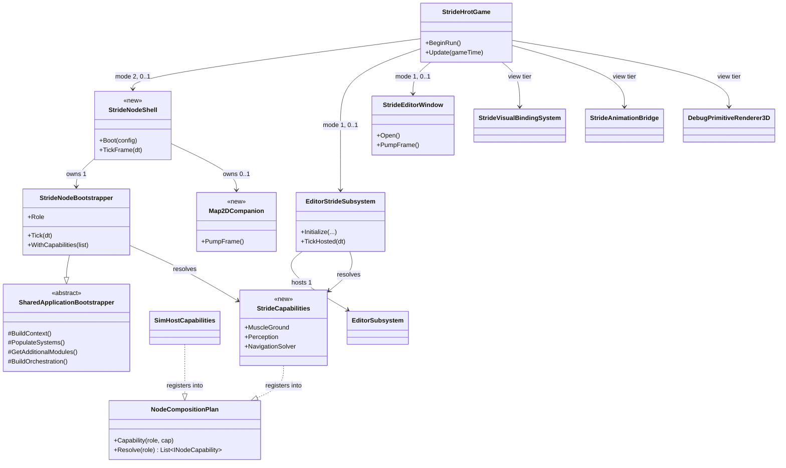
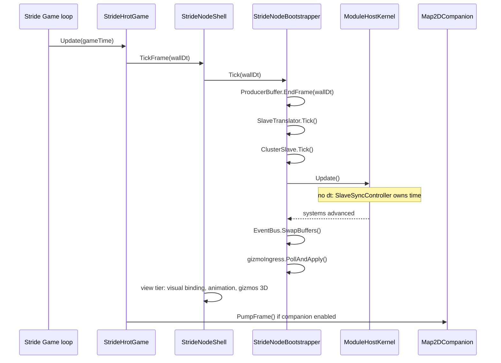

<!--STATUS
state: LIVE
build-state: DESIGN
updated: 2026-09-05
current-answer: the whole file. It is the ONE owning design for the Stride story — the two modes the user
  wants (mode 1 networkless dual-window editor, mode 2 networked node replacing SimHost), the shared
  composition, the window surfaces, gizmos, animation, perception/LOS and the role vocabulary.
design-basis: user rulings 2026-09-05 (quoted verbatim in §2) · .dev/_DONE/stride-mock/DESIGN.md (the
  mode-2 node design, ~70% still true — §3 says exactly which parts) · docs/DESIGN_Stride_Port.md (the
  as-built port + the Windows boundary §6.6/§7.4 + the mode rails §9) ·
  docs/DESIGN_Subsystem_Composition_Unification.md §4.1L/§4.1y/§4.1z/§4.1aa/§4.1ab (the capability seam and
  the editor/Stride adoption) · docs/DESIGN_Node_Roles_And_Policies.md (the role vocabulary).
known-rot: none yet — this document is new.
known-conflict: docs/DESIGN_Subsystem_Composition_Unification.md §4.1aa carried an earlier, thinner
  version of the mode plan. §4.1aa is SUPERSEDED BY THIS FILE for anything about the Stride modes; it
  keeps only the capability-seam half. Its "ImageGenerator: drop from both modes" resolution is
  WITHDRAWN — see §5.
-->

# DESIGN — the Stride story: two modes, one composition

> 🔒 **Not approved to build.** `build-state: DESIGN`. It moves to `READY-TO-BUILD` only when the user
> approves §11's open questions. ⛔ No `CE-2xx` Stride row starts before that.

## Headline

⭐⭐⭐ **Stride is not a new node type. It is a SHELL** — a 3-D window and a physics/animation backend —
**wrapped around composition that already exists.** Two shells, one composition:

| | mode 1 — **authoring** | mode 2 — **cluster node** |
|---|---|---|
| what it is | ⭐ networkless dual-window editor: **3-D Stride window + 2-D editor window** | ⭐ **a networked node replacing SimHost**, beside a CGF node |
| composition root | `EditorStrideSubsystem` → the real `EditorSubsystem` | `StrideNodeBootstrapper` → `SharedApplicationBootstrapper` |
| network | ⛔ none (offline) | ✅ DDS, time **slave**, NED replication |
| scenario load/save | ✅ **the EDITOR does it** *(🔒 user: "stride itself is not saving/loading scenarios; its editor part is")* | ⛔ none — CGF loads, entities arrive by replication |
| roles provided | Muscle · Perception · Navigation *(+ Brain, fused: the editor registers `CgfLogicPack`)* | ⭐ **Muscle · Perception · Navigation** |
| exists today? | ✅ **yes, and it runs** | ⛔ **no — the bootstrapper is written and has ZERO callers** |

---

## 1. INVENTORY

⭐ Run `2026-09-05` on `home-user-HROT` *(196 955 nodes)*, branch `claude/reset-working-branch-qd1qpv`
at `b846546fe`. ⚠ `check_index_coverage` is **not reachable through the CLI or this session's MCP**, so
none of the totals below is a proof of completeness — each was corroborated with grep.

| query | total | what it settled |
|---|---|---|
| `search_graph(name_pattern=".*Stride.*", label="Class")` | **65** | the whole Stride surface, incl. the **two** `StrideAnimationBackend` classes *(§9)* and `StrideInspectorViewModel` `in_degree: 0` *(§7)* |
| `search_graph(name_pattern=".*Capabilities$", label="Class")` | **5** *(3 are node hosts)* | `SimHostCapabilities` · `IgCapabilities` · `CgfCapabilities` — ⛔ **no Stride host** ⇒ `CE-205` |
| `grep "NodeRole.MuscleGround"` in `Hrot.SimHost` + runner | — | `SimHostApp.cs:175` = `MuscleGround\|Perception\|NavigationSolver` — ⛔ **no `ImageGenerator`** |
| `grep "IMapCameraProvider"` | 5 production implementors | SimHost · IG · CGF · Editor · EyesAndMuscle ⇒ **the 2-D map is a SUBSYSTEM capability, not an IG one** *(§6)* |
| `grep "DeadReckoningSyncSystem"` | 3 production registrations | `NedReplicationModule.cs:333/339` **both behind `_roleHasIG`**; `BdcReplicationModule.cs:87` ⇒ §6's finding |
| `grep "AttachBootstrapper"` | **1 declaration, 0 callers** | `StrideHrotGame.cs:266` — mode 2's entry point is unreachable |

### The four things called "Stride" — say which one you mean

| # | thing | where | status |
|---|---|---|---|
| ① | **`StrideNodeBootstrapper`** — the node composition root | `Hrot/Subsystems/Hrot.NodeComposition/` *(in-solution, net8.0)* | ⚠ **written, dormant** |
| ② | **`EditorStrideSubsystem`** — mode 1's composition + the 3-D view tier | `Stride/HrotStrideApp.Game/` | ✅ live |
| ③ | **`Hrot.Stride.Core` / `Hrot.Stride.Animation`** — the engine adapters *(Bullet, visual binding, raycast, animation)* | `Stride/` *(net8.0-windows)* | ✅ live |
| ④ | **`Hrot.MuscleCharacter.Animation.Stride`** — a SECOND `StrideAnimationBackend` | `Hrot/Subsystems/` *(net8.0, no Stride packages)* | 🔴 **duplicate, production-dead** — §9 |

---

## 2. THE RULINGS — user, `2026-09-05`, verbatim

| # | ruling | consequence |
|---|---|---|
| **R-S1** | *"stride as standalone networked node, replacing SimHost, running in cluster with cgf node… In both cases the stride provides muscle, perception, navigation roles."* | the mode table above |
| **R-S2** | *"dead reckoning (and maybe also related smooth inter/extrapolation) of remote entities is basically something that every node needs to be doing for remote entities (for which the node does not own the simTransform)… in general DR/smoothing is nothing special to IG role only."* | ⭐⭐⭐ **§6** — the `_roleHasIG` gate is MIS-AIMED |
| **R-S3** | *"'IG' role in this code base is way about 2d map, which stride doesn't do"* · *"the ability to support 2d map should be named as such (not IG but 2dMap or something)"* | ⭐ **§6.2** — role vocabulary |
| **R-S4** | *"Mode 2 might need to display the gizmos, just I think these might need to be some special 3d-compatible ones, not all current gizmos make sense in 3d, open question."* | **§8** |
| **R-S5** | *"I remember stride supported 2 types of 2d windows, i need the full editor one only, the other was useless."* | **§7.1** |
| **R-S6** | *"Stride in mode 2 still needs an optional companion 2d window similar (or identical — 2d maps should be unified anyway) to simHost's one."* | **§7.2** |
| **R-S7** | *"Animations were connected already in stride, so it is worth describing what is missing."* | **§9** |
| **R-S8** | *"Stride itself is not saving/loading scenarios; its editor part is."* | **§10** |
| **R-S9** | *"self-contained stride can be retired"* | `CE-209`, LAST |
| **R-S10** | *"during the transition period (before LOS is properly implemented) we can live with simHost's implementation for a while… but this must be recorded properly and having a task for proper implementation"* | **§12**, `CE-210` |

---

## 3. WHAT `.dev/_DONE/stride-mock/DESIGN.md` ALREADY SETTLED — and what died with the mock

⚠ **`R-129`.** That document is the owning design for *"a Stride-shaped node replacing SimHost."* It was
written for a **Raylib mock inside `ClusterRunner`**; the shell died, the **node design did not**.

| its § | claim | verdict now |
|---|---|---|
| §5.3 | role = `MuscleGround\|Perception\|NavigationSolver\|ImageGenerator` | ⚠ **amended by `R-S2`/`R-S3`** — §6 |
| §5.6, §11, §12.5 | ⭐ **always `TimeRole.Slave`**; `Kernel.Update()` **parameterless**; local UI uses `ITimeControlGateway` → `ClusterOpRequest` | ✅ **STANDS.** Already as-built *(`StrideNodeBootstrapper.Tick`, `ST-021`)* |
| §5.7 | Muscle + presentation registries; ⛔ **not** `CognitiveComponentRegistry`; register only the events this node consumes | ✅ **STANDS**, and is as-built |
| §5.8 | orchestration handler set + isolated `<staging>/nodes/node-700/` | ⚠ **partially as-built** — §10 |
| §5.9 | togglable groups built in Phase 4, **before** Phase 5 | ✅ **STANDS** — enforced by `SharedApplicationBootstrapper`'s phase order |
| §5.10 | the tick body | ✅ as-built, minus the gizmo ingress line — §8 |
| §9 | `stridemock` runner token, NodeId **700**, `-m orchestrator,cgf,stridemock` | ⛔ **DEAD** *(`ST-015` — the token now throws)*. ⭐ **NodeId 700 survives as the free id** |
| §5.5 | dual-buffer gizmo terminal | ⚠ producer live, **consumer half never wired** — §8 |
| §6 | `SyncFdpToStrideScript` — the differential 2-pass ECS→visual sync | 🔴 **DELETED with the mock.** Its job is done in mode 1 by `StrideVisualBindingSystem`; **mode 2 has no owner** — §7.3 |
| §12.2/§12.3 | FakeStrideApp + StrideMockSubsystem acceptance | ⛔ **dead — both shells are gone** |
| §11 "Stage 2" | *"change only what is INJECTED"* — the 4 ctor slots are the swap seam | ⭐ **superseded by the capability seam** — §4 |

---

## 4. THE COMPOSITION — one capability host, two shells

⭐⭐ **The seam already exists and three hosts are on it** *(`SimHostCapabilities`, `IgCapabilities`,
`CgfCapabilities`)*. Stride becomes the **fourth**. ⛔ **The four `IEcsModule?` ctor slots on
`StrideNodeBootstrapper` are RETIRED by this** — they are a private, second swap mechanism for exactly
the thing the plan does *(`R-137`: unification may not cost a feature — nothing is lost, the slots'
one production use is `StrideMuscleModules.Build`, which becomes a capability)*.

⚠ **The asymmetry that must be stated, because it is the one real design difference:**
SimHost/IG/CGF resolve their capability plan **inside** their own bootstrapper. Stride cannot — mode 1 has
no bootstrapper at all *(it composes through `EditorSubsystem`)*. ⇒ ⭐ **`StrideCapabilities` is a
STATIC DECLARATION both shells resolve, and the resolved list is handed IN.**



⭐ **Existing boxes** *(files)*: `NodeCompositionPlan` `Hrot.Common/Infrastructure/NodeCapability.cs` ·
`SharedApplicationBootstrapper` `Hrot.Common/Infrastructure/` · `StrideNodeBootstrapper`
`Hrot.NodeComposition/` · `EditorStrideSubsystem`, `StrideHrotGame` `Stride/HrotStrideApp.Game/` ·
`StrideVisualBindingSystem`, `DebugPrimitiveRenderer3D` `Stride/Hrot.Stride.Core/` ·
`StrideAnimationBridge` `Stride/Hrot.Stride.Animation/`.
⭐ **`<<new>>` boxes**: `StrideCapabilities`, `StrideNodeShell`, `Map2DCompanion` — and
`StrideEditorWindow` is the **renamed** `StrideInspectorWindow` *(§7.1)*.

### 4.1 Where `StrideCapabilities` lives

📐 The muscle set (`StrideMuscleModules`) is in `HrotStrideApp.Game`; the kinematics module
(`StrideKinematicsModule`) is in `Hrot.Stride.Core`. ⇒ ⭐ **`Hrot.Stride.Core`** — the lower of the two,
referenced by both shells, and it keeps `HrotStrideApp.Game` a shell rather than a composition root.
⚠ `StrideMuscleModules` moves down with it.

### 4.2 The perception capability comes from SimHost, unchanged

📐 `SimHostCapabilities.PerceptionSolver` *(→ `EqsModule`)* and `.PerceptionSpatial` *(key
`Perception:spatial` → `AreaQueryResultMaterializationSystem` + `CognitiveSpatialModule`)* are `internal`.
⭐ **Promote both to `public`** rather than extract or re-implement — they are the same units, and a copy
is what the seam exists to prevent. *(`CE-206`.)*

---

## 5. ⛔ WITHDRAWN — *"drop `ImageGenerator` from both modes"*

⚠ `DESIGN_Subsystem_Composition_Unification.md` §4.1aa resolved this on the argument that
`ImageGenerator` is the 2-D map stack. 📐 **Measured after that resolution: it is ALSO the only flag that
registers `DeadReckoningSyncSystem`** *(`NedReplicationModule.cs:337-339`)*. ⇒ dropping it would have
silently removed remote-entity smoothing from the one node that renders in 3-D. ⭐ **The resolution is
withdrawn and replaced by §6**, which fixes the cause instead of choosing a side.

---

## 6. ⭐⭐⭐ THE ROLE VOCABULARY — two separate corrections

### 6.1 DR/smoothing is ROLE-INDEPENDENT *(ruling `R-S2`)*

> 🔒 **User:** *"dead reckoning … is basically something that every node needs to be doing for remote
> entities (for which the node does not own the simTransform) as dead reckoning is used to reduce network
> traffic. So likely not specific to IG nodes… in general DR/smoothing is nothing special to IG role
> only."*

📐 **What the code does today:**

| node role | DR registered? | file |
|---|---|---|
| pure IG | ✅ `DeadReckoningSyncSystem(driveFromNetwork:false)` | `NedReplicationModule.cs:333` |
| any role **containing** IG *(incl. today's Stride)* | ✅ same, `driveFromNetwork:false` | `:339` |
| ⛔ **pure Muscle (SimHost)** | 🔴 **NO** | — |
| ⛔ **pure Brain (CGF)** | 🔴 **NO** | — |

⇒ ⭐⭐ **SimHost and CGF run remote (ghost) entities with a network transform that is never extrapolated
between packets.** The system's own doc-comment already describes the correct rule and the flag already
expresses it: `driveFromNetwork:false` means *"smooth only `EntityLifecycle.Ghost` entities, so DR never
fights locally-owned kinematics"* — ⭐ **which is exactly the right behaviour for EVERY node.**

| ⭐ the design | |
|---|---|
| **register `DeadReckoningSyncSystem(driveFromNetwork:false)` UNCONDITIONALLY** | it is already ghost-scoped and authority-guarded *(`if (authority.HasAuthority) continue;`)*, so it is a no-op on owned entities |
| ⭐ keep `driveFromNetwork:true` for the **pure-IG** case only | a pure IG owns nothing; the wider query is a small saving, not a behaviour difference. ⚠ Measure before keeping the special case — if it makes no difference, delete it |
| ⚠ **smoothing RATE is a separate question** | 🔒 user: *"they might just do smoothing on higher rate as they are usually running on higher fps."* 📐 `SmoothingRate = 10.0f` is a hard-coded const ⇒ make it a constructor parameter; renderers may pass a higher rate. ⛔ **Not** a second system |
| ⛔ **blast radius** | every node gains one PostSimulation system over a ghost-only query. ⚠ **CGF and SimHost ghost positions will start moving between packets** — that is the intent, and it **will move test expectations that assert a frozen ghost.** Gate: `Hrot.ClusterRunner.Integration.Tests` + `SplitAuthoritySpawnTests` *(`R-142` — the feature's own suite)* |

⇒ **`CE-211`.** ⭐ This is a **cluster-wide correctness change, not a Stride change** — it lands on its
own, before or after the Stride work, and it removes the reason Stride ever needed the IG flag.

### 6.2 The role named `ImageGenerator` is really "2-D map presentation" *(ruling `R-S3`)*

📐 What the flag actually gates, measured: `IgCapabilities.Presentation` → `StyleResolutionModule`,
`MapCullingModule`, `MapLayerModule`, `HistoryTrailModule`, `EventEffectModule` — ⭐ **all of it the 2-D
map stack**; plus the DR arm §6.1 moves out; plus `PresentationComponentRegistry`.

⭐ **Rename the flag `NodeRole.ImageGenerator` → `NodeRole.Map2D`.** ⚠ Semantics unchanged — this is a
**vocabulary** fix so that *"Stride is a presentation layer"* and *"Stride does not have the Map2D role"*
can both be true without confusion.

| ⚠ | |
|---|---|
| ⛔⛔ **NEVER rename a C# symbol with text search-and-replace** | Roslyn `preview_rename` → read the diff → `apply_rename`, run TWICE and union *(in-solution + `Stride/HrotStrideApp.Game.csproj`)*. ⚠ **Roslyn was NOT reachable in this session** — the rename waits for a session where it is |
| ⚠ **it is a persisted value?** | 🔴 **MUST be measured before the rename** — if `NodeRole` is serialized into scenarios, recordings or DDS descriptors, the *name* may be load-bearing. ⇒ open question `Q4` §11 |

⇒ **`CE-212`.** ⛔ Cosmetic-looking, non-trivial blast radius, **not** a Stride prerequisite. Do it after
`CE-211`, independently.

### 6.3 Stride's role, decided

⭐ **`MuscleGround | Perception | NavigationSolver`** — **identical to SimHost** *(`SimHostApp.cs:175`)*,
in **both** modes. ⛔ No `Map2D`/`ImageGenerator`: the 2-D map is the companion window's business *(§7.2)*
and it is a **surface**, not a node role. ⭐ This is only safe **because** `CE-211` makes DR unconditional
⇒ **`CE-211` is a hard prerequisite of `CE-207`.**

---

## 7. THE WINDOWS

### 7.1 The two 2-D window types — and the useless one is DEAD CODE *(ruling `R-S5`)*

📐 **Measured.** `Stride/HrotStrideApp.Game/StrideInspectorWindow.cs` contains **both**:

| # | surface | what it is | status |
|---|---|---|---|
| ⛔ **the useless one** | `StrideInspectorViewModel` + `EntityRow` + `BuildEntityList` *(BATCH-22)* | a hand-rolled entity list + basic inspector | 🔴 **NEVER DRAWN.** `in_degree: 0`; `PumpFrame` does not call it; its only consumer is `StrideInspectorViewModelTests` *(324 lines)*. ⇒ **200 lines of production code + 324 of tests for a window nobody opens** |
| ⭐ **the one the user wants** | `PumpFrame` → `editor.DrawWorld()` + `WindowManager.Render()` + `editor.DrawUI()` | ⭐ **the REAL editor** — `HostedEditor.RegisterWindows(wm)` registers every editor panel | ✅ live, gated by `STRIDE_EDITOR_WINDOW=1` |

| ⭐ the design | |
|---|---|
| **delete** `StrideInspectorViewModel`, `EntityRow`, `BuildEntityList` and their test class | ⭐ `R-129` check: **searched `docs/` and `.dev/` for a design record keeping them — none found.** They are BATCH-22 scaffolding superseded by `RegisterWindows` |
| ⭐⭐ **rename the class `StrideInspectorWindow` → `StrideEditorWindow`** | ⛔ the name is why the confusion exists: it is not an inspector, it is **the editor's host window** — it owns the GLFW/GL context, the `WindowManager`, the dockspace and the message log, mirroring `ClusterRunner`'s `LocalWindowController` |
| ⚠ keep the env var name `STRIDE_EDITOR_WINDOW` | already correct |

⇒ **`CE-213`.**

### 7.2 Mode 2's optional companion 2-D map *(ruling `R-S6`)*

> 🔒 **User:** *"Stride in mode 2 still needs an optional companion 2d window similar (or identical — 2d
> maps should be unified anyway) to simHost's one."*

📐 **What "SimHost's 2-D window" actually is:** ⛔ **not SimHost's.** `ClusterRunner` opens **one** raylib
window (`RaylibPresentationShell.InitWindow`); `ISubsystem.cs:15` forbids a subsystem from opening its
own; `SubsystemOrchestrator` builds the tab bar from the **5** `IMapCameraProvider` implementors and
draws whichever is the active map owner. ⇒ ⭐ **the 2-D map is a per-subsystem VIEW inside a shared
window** — which is precisely why the user's *"2-D maps should be unified anyway"* is the right frame.

| ⭐ the design | |
|---|---|
| ⭐⭐ **REUSE §7.1's window host.** After the rename, `StrideEditorWindow` is a generic *"raylib window + `WindowManager` + dockspace + message log"* host — ⛔ **there must not be a second one** | mode 1 fills it with the editor's panels; ⭐ mode 2 fills it with the **map panel + the Stride node's `IMapCameraProvider`**, and nothing else |
| ⭐ **mode 2's map surface is SimHost's** | `SimPresentationModule` *(`Hrot.SimHost/Modules/`)* already implements `IMapCameraProvider` for a Muscle node. ⇒ ⭐ **the Stride node reuses it** — same role, same components, no new map code |
| ⭐ **optional, off by default** | one flag, same shape as `STRIDE_EDITOR_WINDOW`. ⛔ Headless/CI must be unaffected |
| ⚠ **what it costs** | the map stack needs `PresentationComponentRegistry` + the presentation modules ⇒ ⭐ **that is a CAPABILITY, resolved only when the companion window is on** — `StrideCapabilities.Map2D`, keyed on the same `Map2D` capability key IG uses. ⛔ **It does not come back as a node ROLE** |

⇒ **`CE-214`.** ⚠ **Depends on `CE-213`** *(the rename/extraction)* and on §6.2 only for naming.

### 7.3 The 3-D view tier in mode 2 — the largest hole

📐 Mode 1's 3-D tier is **inside `EditorStrideSubsystem`** *(visual binding, Bullet bodies, motors,
reverse-sync, animation, gizmos — its steps 9–16)*. `StrideCapabilities` covers Muscle/Perception/Nav
**only**; the mock's equivalent (`SyncFdpToStrideScript`) was deleted.

⇒ ⭐⭐ **`StrideNodeShell` (`<<new>>`) owns the view tier for mode 2**, and it composes it from the **same
units mode 1 uses** — `StrideVisualBindingSystem` *(in_degree 28, already shared)*,
`StrideAnimationBridge`, `DebugPrimitiveRenderer3D`, `StridePhysicsBracket`. ⛔ **No new rendering code.**
⚠ The extraction of those steps out of `EditorStrideSubsystem` into a unit both shells call is the
**real work** of `CE-207`, and it is where a duplicate would otherwise appear.

---

## 8. GIZMOS IN 3-D *(ruling `R-S4` — and it is further along than the question assumes)*

📐 **Measured — the 3-D gizmo path EXISTS and mode 1 uses it.** `DebugPrimitiveRenderer3D` +
`IDebugDrawSink3D` + `PooledEntityDebugDrawSink3D`, constructed at `StrideHrotGame.cs:987` and handed to
`EditorStrideSubsystem.Initialize`. ⭐ **It already answers the user's question by triage:**

| primitive | in 3-D |
|---|---|
| `Line` · `Arrow` · `Sphere` · `SemanticShape` | ✅ **drawn** — `DebugPrimitiveRenderer3D.cs:219-251` |
| `Box2D` · `Text` · `Icon` · `EntityBadge` · `StructInspector` · `MilStd2525` | ⛔ **skipped** — *":274 — 2-D-screen"* |
| `SpatialAnchor` · `ContextMenuBinding` · `InputCaptureBinding` · `MainMenuBinding` · `LayerControlMask` | ⛔ **skipped** — bindings, not geometry *(":111-115")* |

⇒ ⭐⭐ **The "3-D-compatible subset" is already defined by that switch.** What is missing is the
**INGRESS** half — the design *(mock §5.5)* has a `ConsumerBuffer` filled from DDS so a node can display
**another** node's gizmo stream, and the line is commented out:

```csharp
// _gizmoIngress?.PollAndApply();  // fills ConsumerBuffer from DDS — wire in SM-006
```

⛔ `SM-006` is a task id from a **retired programme** — a dangling TODO.

| ⭐ the design | |
|---|---|
| **mode 2 PUBLISHES its own gizmos** *(producer half)* | ✅ already works — `ProducerBuffer` + the batch publisher |
| ⭐ **mode 2 DISPLAYS remote gizmos** *(consumer half)* | wire the ingress with `filterNodeId`, render through `DebugPrimitiveRenderer3D` ⇒ **the 2-D-only shapes are dropped by the existing switch, for free** |
| ⚠ **the open half that is genuinely open** | ⛔ **a 2-D-only gizmo silently vanishing in 3-D is indistinguishable from a broken gizmo.** ⇒ ⭐ the renderer should **COUNT what it skipped, per shape**, and expose it *(the diagnostics endpoint already reports per-translator counters)* — a silent drop is the shape this codebase keeps getting bitten by |
| ⚠ **still open for the user** | whether any 2-D-only shape deserves a real 3-D form *(a `Box2D` as a ground-plane quad, an `EntityBadge` as a billboard)*. ⭐ **Lean: no, not now** — ship the subset + the skip counters, and let the counters say which shape is actually wanted |

⇒ **`CE-215`.**

---

## 9. ANIMATION — what is connected, and what is missing *(ruling `R-S7`)*

📐 **Connected today, mode 1** *(`StrideHrotGame.cs:946` → `Initialize`)*:

| piece | where |
|---|---|
| `StrideAnimationBackend` *(the real one — `IAnimationBackend`, 628 lines)* | `Stride/Hrot.Stride.Animation/` |
| `StrideAnimationBridge` — ECS `SimVelocity`/state → backend, register/unregister on appear/death | same |
| `LocomotionBlend` — the testable blend half | same |
| `StrideMannequinBlendTreeInstaller` + `MannequinAnimationBinder` — the asset/blend-tree bridge | `HrotStrideApp.Game/` |
| test coverage | `StrideAnimationBackendBehaviorTests` *(363)* · `…ContractTests` *(69)* · `StrideAnimationBridgeTests` *(320)* |

### What is missing

| # | gap | evidence |
|---|---|---|
| **A1** | 🔴 **TWO `StrideAnimationBackend` classes.** `Hrot/Subsystems/Hrot.MuscleCharacter.Animation.Stride/` *(498 lines, net8.0, **no Stride packages**, referenced by **its own test project only**)* vs `Stride/Hrot.Stride.Animation/` *(628 lines, real `Stride.Engine`)*. ⭐ Both implement `IAnimationBackend` | `search_graph` — two nodes, same name |
| **A2** | ⚠ **`ST-013`** — `CivilianPedestrian` renders as a mannequin but has **no animation descriptor** *(matched from the source branch deliberately)* | `RESUME_Time_Stride_Session.md` §6 |
| **A3** | ⛔ **mode 2 has no animation at all** — the bridge is constructed by mode 1's shell only ⇒ §7.3's view-tier extraction must carry it | measured: `blendTreeInstaller` is built in `BootEditorSubsystem` |
| **A4** | ⚠ **never RUN.** Every animation test is in a `net8.0-windows` project ⇒ compile-verified only off Windows *(`ST-006`)* | `stride-check.sh` |

⭐ **A1 is not automatically a defect** — ⚠ `R-129` obligation: **`.dev/_DONE/anim-ctrl/DD-1` §15–16 is
the owning design and this session has NOT read it** *(a Windows-independent reading task)*. ⛔ **Do not
delete either copy before that section says which was meant to exist.** ⇒ **`CE-216` is an
INVESTIGATION**, not a deletion.

---

## 10. SCENARIOS AND ORCHESTRATION *(ruling `R-S8`)*

> 🔒 **User:** *"Stride itself is not saving/loading scenarios; its editor part is."*

📐 **The code already agrees, and nothing recorded the decision.** `StrideNodeBootstrapper.BuildOrchestration`
passes `scenarioSerializer: null`, which at `NodeBootstrapper.cs:268` skips `HrotScenarioLoadHandler`,
`HrotEditLoadHandler` and `ReferenceEpisodeLoadHandler`. ⚠ The mock design §5.8 promised a handler set
that no longer matches. ⇒ **this section is the record.**

| handler | mode 2 | why |
|---|---|---|
| `ReferencePrefetchHandler` *(2PC file staging)* | ✅ unconditional | the node must ACK cluster ops |
| `ReferenceArchiveHandler` | ✅ unconditional | `.fdp` archive reporting |
| `TkbLoadClusterStateHandler` | ✅ when a TKB db exists | TKB must land before entities |
| `ReferenceReplayLoadHandler` + `EcsRecordReplayController` | ✅ *(Brain or Muscle role)* | writes `node_<id>.fdp` |
| `ReferenceLiveLoadHandler` | ✅ | claims `FinalizeLive` + cold `PrepareLive` |
| ⛔ **the three scenario handlers** | 🔒 **NOT registered — by design** | CGF is the loader; entities arrive by NED replication |
| ⭐ **mode 1** | ✅ **full set** — it *is* the editor | `R-S8` |

⚠ **Consequence to state plainly:** a mode-2 Stride node **cannot** be the node that opens a scenario
file. In a cluster that is correct *(CGF does it)*; ⛔ it also means **mode 2 is not a substitute for mode
1** for authoring.

---

## 11. TIME AND THE TICK — the contract that must not be got wrong

⭐ Both modes tick from **Stride's render loop** *(`StrideHrotGame.Update`)*. ⛔ **What they must NOT
share is who owns `dt`.**



| ⭐ the rules | |
|---|---|
| ⭐⭐⭐ **mode 2: `Kernel.Update()` — NEVER `Update(dt)`** | the obsolete overload's own attribute says it *"will cause deterministic desync"*; `SlaveSyncController` derives elapsed from `SyncedWallTicks` and tracks the master. ✅ Already as-built *(`ST-021`)* |
| ⭐ **`wallDt` is still passed IN** — for the gizmo producer buffer and the view tier only | the render tier is free-running; the sim tier is not |
| ⚠ **mode 1 keeps `TickHosted(wallDt)` once per render frame** | ⛔ **not** through `StrideHostLoopDriver` — `FIX-PERF-1`: up to 8 substeps per frame each running the full editor update = spiral of death |
| ⚠ **`StridePhysicsBracket.RunPreKernelStep` ordering** | mode 1 runs Bullet around the kernel step. ⇒ 🔴 **mode 2 must place the bracket at the same point relative to `Kernel.Update()`**, and that placement is an item of `CE-207`, not an afterthought |
| ⚠ **render rate ≠ sim rate** | the view tier may run every render frame; the sim advances only as the master's clock allows. ⭐ That is what makes §6.1's smoothing matter |

---

## 12. PERCEPTION AND LOS — pointers, not a restatement

| | |
|---|---|
| **perception** | `CE-206`: adopt SimHost's `EqsModule` + `CognitiveSpatialModule` verbatim *(§4.2)*. ⚠ **Today the gap is MASKED** — CGF shares the world in both existing modes; in mode 2 it does not ⇒ **prerequisite of `CE-207`, not a follow-up** |
| **LOS, transitional** | 🔒 `R-S10` — mode 2 ships with **SimHost's inline 2-D segment-circle sweep** *(`LosRequestBatchingSystem`)*. ⛔ **A KNOWN, ACCEPTED limitation:** a Stride node will report LOS with no terrain or height sense, and 3-D occlusion in the Stride window will **NOT** match what perception believes. ⚠ **Say so in any report claiming Stride perception works** |
| **LOS, proper** | `CE-210` — 📄 `DESIGN_Subsystem_Composition_Unification.md` §4.1ab. ⭐ Three parts: a 3-D API with per-entity eye/aim heights *(`StrideRaycastLosService` hard-codes `EyeHeightMetres = 1.5f`)*; a **live seam** in `LosRequestBatchingSystem` *(which today has no injection point)*; and retiring/re-homing `ILosService` *(2-D, **zero** production consumers)*. ⛔ **Not a Stride-lane change** — it lands in `Fdp.Toolkits/Perception` + `Spatial/Eqs` |

---

## 13. SLICES AND ACCEPTANCE

| # | slice | task | Windows? | done when |
|---|---|---|---|---|
| **S0** | DR becomes role-independent + `SmoothingRate` parameterised | `CE-211` | ⭐ no | ghost entities smooth on SimHost/CGF; `ClusterRunner.Integration.Tests` + `SplitAuthoritySpawnTests` green with expectations reviewed, not adjusted |
| **S1** | `StrideCapabilities` in `Hrot.Stride.Core`; SimHost's perception pair promoted | `CE-205` + `CE-206` | ⭐ no *(compile gate)* | `stride-check.sh` green; a rail asserts the resolved list for `Muscle\|Perception\|Nav` is **non-empty and equals SimHost's units** |
| **S2** | mode 1 composes from `StrideCapabilities`; the 4 ctor slots retired | `CE-208` | ⚠ compile here, **RUN on Windows** | mode 1 behaves as before — `STRIDE_SELFTEST=1` passes on Windows |
| **S3** | view tier extracted out of `EditorStrideSubsystem` into a unit both shells call | part of `CE-207` | ⚠ | mode 1 unchanged; the unit has its own rails |
| **S4** | `StrideNodeShell` + launch/config + mode selector | `CE-207` | 🔴 **Windows** | `HrotStrideApp` joins a cluster beside CGF; entities replicate; **`--mode all`-equivalent smoke** |
| **S5** | gizmo ingress + skip counters | `CE-215` | ⚠ | remote gizmos visible in 3-D; skipped shapes counted, not silent |
| **S6** | the companion 2-D map | `CE-214` | ⚠ | window opens on a flag, shows the map, off by default |
| **S7** | dead inspector view-model deleted; class renamed | `CE-213` | ⭐ no | `stride-check.sh` green; `StrideInspectorViewModelTests` gone |
| **S8** | animation duplicate investigated | `CE-216` | ⭐ no *(reading)* | `.dev/_DONE/anim-ctrl/DD-1` §15–16 read; a decision recorded HERE |
| **S9** | retire self-contained mode | `CE-209` | ⚠ | **LAST**, after S2+S4 green. ⚠ Check `STRIDE_SELFTEST` survives — it *forces* hosted mode |
| **S10** | `ImageGenerator` → `Map2D` rename | `CE-212` | ⭐ no, **but needs Roslyn** | Roslyn rename run TWICE and unioned; no text replace |

### The gate story — say it up front

| ⭐ | |
|---|---|
| ⭐⭐ **`R-142` first: the feature's own suites** | `StrideNodeBootstrapperTests` · `EditorStrideSubsystemTests` · `StrideVisualBindingSystemTests` · `StrideAnimationBridgeTests` · `ModeStartupRails` |
| ⛔ **off Windows this is a COMPILE gate** | `bash scripts/stride-check.sh` — 6 projects, ~43 s. ⛔ **No Stride test can RUN** *(no `Microsoft.WindowsDesktop.App` runtime)*; `HrotStrideApp.Windows` **cannot build** *(asset compiler wants Direct3D11)* — `DESIGN_Stride_Port.md` §6.6/§7.4 |
| ⚠ **`ModeStartupRails` cannot cover mode 2** | it boots `Hrot.ClusterRunner`, and Stride is a separate exe. ⇒ ⭐ **mode 2 needs its own launch rail, and it can only run on Windows** — state that rather than discover it |

---

## 14. OPEN QUESTIONS — each with a lean

| # | question | ⭐ lean |
|---|---|---|
| **Q1** | Does mode 2 get its config from CLI args, env, or a file? | ⭐ **CLI args mirroring `ClusterRunner`'s** *(`--node-id`, `--domain`, `--no-wait`, `--staging`)*, defaulting node id to **700** *(mock §9.2, still free)*. ⛔ Not env vars — those are the mode-1 debug switches and they already sprawl |
| **Q2** | How is the mode selected — env var, CLI, or build? | ⭐ **one CLI switch `--mode editor\|node`**, defaulting to `editor`. ⛔ After `CE-209` the three env vars collapse: `STRIDE_HOST_REAL_EDITOR` disappears *(hosted becomes the only editor path)*, `STRIDE_EDITOR_WINDOW` stays *(it is a window toggle)*, `STRIDE_SELFTEST` stays and implies `--mode editor` |
| **Q3** | Does mode 2 need the companion 2-D map on day one? | ⭐ **No — `CE-214` after `CE-207`.** The 3-D window is the point; the map is a convenience the user asked to keep, not a blocker |
| **Q4** | 🔴 **Is `NodeRole` PERSISTED by name?** | ⛔ **unmeasured, and it decides whether `CE-212` is a rename or a migration.** ⚠ It must be measured **before** `CE-212` starts, not during |
| **Q5** | Should any 2-D-only gizmo get a real 3-D form? | ⭐ **Not now** — ship the existing subset plus skip counters, and let the counters name the shape that is actually wanted *(§8)* |
| **Q6** | Do the four `IEcsModule?` ctor slots die, or stay as a test seam? | ⭐ **Die.** `StrideNodeBootstrapperTests` constructs with no arguments today, so nothing is lost; two swap mechanisms for one concern is the duplication this programme exists to remove |

---

## 15. WHAT THIS DOCUMENT SUPERSEDES

| document | status |
|---|---|
| `DESIGN_Subsystem_Composition_Unification.md` **§4.1aa** *(the Stride mode plan)* | ⛔ **SUPERSEDED BY THIS FILE.** §4.1aa keeps only its capability-seam content; its mode plan, its diagrams and its *"drop `ImageGenerator`"* resolution are replaced by §4/§5/§6 here |
| `.dev/_DONE/stride-mock/DESIGN.md` | ⭐ **still authoritative for §5.6/§5.7/§5.9/§5.10** *(time, registries, replay safety, tick)*. ⛔ **Dead**: §6, §8, §9, §12.2, §12.3 — the shells they describe no longer exist |
| `DESIGN_Stride_Port.md` | ⭐ **untouched and still authoritative** for the port as-built, the Windows boundary and the mode rails |
| `docs/Stride_Host_Visual_Test.md` | ⭐ the Windows launch recipe — extend it with mode 2 when `CE-207` lands |
