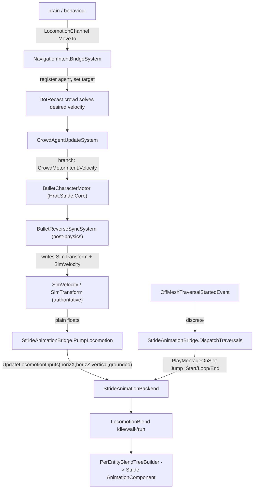

<!--STATUS
state: LIVE
build-state: DESIGN (porting-risk map + strategy — NOT approved to build)
updated: 2026-08-22
current-answer: the whole file — how to port the Bullet-based Stride from origin/stride-integ-1 onto the
  coordinator line, what the integration changed on the HROT/FDP shared side, and the one real breakage
  (the crowd movement-intent refactor). Awaiting user review before any code moves.
design-basis: origin/stride-integ-1 (measured 2026-08-22) · .dev/stride-1/Stride-Integration_v0_3.md ·
  STRANDED_FEATURES_AUDIT.md (user ruling: Bullet, not Bepu; Stride only).
known-conflict: none.
-->
# DESIGN — porting the (Bullet) Stride integration onto the current line

> 🔒 **User ruling:** we want the **branch's Bullet-based Stride**, not trunk's Bepu. This doc answers the
> question the user asked — *how did the integration change the HROT/FDP shared side, and does it break what
> we have?* — and gives a safe port strategy. **Not approved to build; review first.**

## Headline

⭐⭐⭐ **The brain → stride-node ANIMATION contract is CLEAN and ADDITIVE** — it is pre-existing shared ECS
data, **byte-identical on both branches**; the Stride node is just a new consumer behind the existing
`IAnimationBackend`. **The user's animation worry is unfounded — nothing on our side fights it.**

## ⚠ CORRECTION 2026-08-22 — the "crowd breakage" was OVERSTATED. The coordinator crowd is a NO-OP STUB.

> 🔒 **User challenge:** *"is there any crowd implemented elsewhere? isn't the Stride crowd the only
> implementation?"* — ⭐ **Correct.** 📐 Measured on the coordinator:
> - `EngineBackedDtCrowdProvider.cs` is a **36-line NO-OP STUB** — its own doc: *"No-op crowd provider stub…
>   `GetAgentVelocity` always returns Zero. Humanoid navigation in this mode is handled by
>   `LinearKinematicsSystem`."*
> - **No DotRecast library on the coordinator at all** — only a comment in `IDtCrowdProvider.cs`
>   *("eventually by a DotRecast/dtCrowd port for production")*. The **real** DotRecast crowd lives ONLY on
>   `stride-integ-1` (`Hrot.Stride.Core/DotRecastDtCrowdProvider`).
>
> ⇒ ⭐⭐ **The Stride crowd IS the only real crowd implementation.** The coordinator's `CrowdAgentUpdateSystem`
> is fed a stub that returns **zero velocity** — nothing moves through the crowd path today. ⇒ ⛔ **Porting
> the Stride crowd REPLACES a stub with the real thing — it is ADDITIVE, not a breakage.** The earlier
> "freezes crowd locomotion on non-Stride nodes" concern is largely MOOT: there is no live crowd locomotion to
> freeze. ⭐ Keeping the change **authority-conditional** is still tidy defensive hygiene *(so a future
> non-Stride node could get a real FDP crowd)*, but it is NOT the load-bearing risk it was framed as.

## INVENTORY — what was enumerated, and how *(the graph could not; the branch is disjoint + unindexed)*

⚠ **`search_graph` does not cover `origin/stride-integ-1`** — it is a disjoint-history branch, not indexed into
the codebase-memory graph. ⇒ the enumeration was by **git against the branch**, stated so it is checkable:

| query run | total | result |
|---|---|---|
| `git ls-tree -r --name-only origin/stride-integ-1 -- Stride/Hrot.Stride.Core Stride/Hrot.Stride.Animation` | **38 files** | the two new projects — 34 in `.Core` (Bullet motor + reverse-sync, DotRecast navmesh/crowd, vehicle nav, 3D debug render), 4 in `.Animation` |
| `git diff --stat origin/stride-integ-1 <coord> -- FDP/Toolkits/Fdp.Toolkits/Navigation FDP/Toolkits/Fdp.Toolkits/Physics Hrot.MuscleCharacter.Animation` | *(the seam table below)* | the shared-file deltas — the crowd/raycast/animation seams |
| grep for each shared symbol across trunk under any name *(the rename confounder)* | — | confirmed which "absent" pieces are truly new vs merely renamed |

⭐ **The seam table in §1 IS this inventory's shared-side half**; §3 is the delta half. ⛔ The as-built §6
records the two enumeration MISSES the port surfaced *(`IRaycastBackend`, the id-265 reservation)* — proof that a
git-diff enumeration, like a graph one, is only as complete as the paths it was pointed at.

## 1. The integration seams — all shared, all already on our branch (byte-identical)

| seam | type | file (same path both branches) | on coord? |
|---|---|---|---|
| pose / velocity | `SimTransform`, `SimVelocity` | `Fdp.Core/CoreComponents/SimComponents.cs` | ✅ identical |
| behaviour→muscle channels | `LocomotionChannel` · `WeaponChannel` · `InteractionChannel` | `Fdp.Toolkits/Behavior/Components/ChannelComponents.cs` | ✅ identical |
| discrete animation intent | `AnimationChannel` (PlayMontage) · `LookAtChannel` · `StanceIntent` | `Hrot.MuscleCharacter.Animation/Components/ReplicatedComponents.cs` | ✅ identical |
| animation backend contract | `IAnimationBackend.UpdateLocomotionInputs(...)` + montage APIs | `Hrot.MuscleCharacter.Animation/Contracts/IAnimationBackend.cs` | ✅ identical |
| brain-side writer | `AnimationRuntimeBridgeSystem` (SimVelocity → UpdateLocomotionInputs) | `…Animation/Systems/…` | ✅ identical |
| discrete-montage trigger | `OffMeshTraversalStartedEvent` / `OffMeshLinkDetectionSystem` | `Fdp.Toolkits/Navigation/PathfindingEvents.cs` | ✅ present |
| model/collider descriptor | `StrideRenderModelDefDto` + `CollisionShapeKind` | `Fdp.Toolkits/Tkb/Domain/…` | ✅ identical |

⇒ **The animation/pose contract was NOT touched by the integration** (the `.dev/stride-1` design says it
*reuses* `AnimationRuntimeBridgeSystem`/`IAnimationBackend`/`AnimationChannel.PlayMontage`; only the backend
implementation is new).

## 2. Animation control path — PORTABLE (plain ECS data, no Stride types crossing)

⭐ `StrideAnimationBridge` reads `SimVelocity` as plain floats (*"no Stride engine types appear here"*);
Stride types are confined to `PerEntityBlendTreeBuilder`, attached by visual binding. Same `IAnimationBackend`
that the shared `FakeAnimationBackend` implements. ⇒ **the Stride node is a clean additional consumer.**

## 3. The one conflict, and the safe strategy

| what | coordinator today | branch | verdict |
|---|---|---|---|
| `CrowdMotorIntent` (component **id 265**) | **ABSENT** (id 265 is FREE — coord ids stop at 264) | new movement-intent component | additive, no id collision |
| `CrowdAgentUpdateSystem` | writes `SimVelocity` **and integrates** `SimTransform += v·dt` — **owns** crowd position *(LinearKinematicsSystem excludes `CrowdAgent`)* | writes **only** `CrowdMotorIntent`; **stops** writing SimVelocity/SimTransform (delegates to Bullet motor + reverse-sync) | ⛔ **SAME FILE, DIFFERENT BEHAVIOUR — the risk** |
| `BulletCharacterMotor` · `BulletReverseSyncSystem` · `StrideVisualBindingSystem` | absent | in `Hrot.Stride.Core` | additive (new project) |

⚠ **Naive-port consequence, RE-SCOPED by the correction above:** the coordinator's crowd provider is a **no-op
stub returning zero** *(§ CORRECTION)*, so the refactored `CrowdAgentUpdateSystem` would not "freeze" any *live*
movement — there is none through the crowd path today. The change is effectively **replacing a dormant stub with
the real DotRecast+Bullet crowd**, i.e. additive.

⭐ **Still tidy to do it authority-conditionally** *(defensive, not load-bearing)*: keep a `SimVelocity`+
`SimTransform` integration branch for a future FDP-authoritative (non-Stride) crowd, and route through
`CrowdMotorIntent`→Bullet where `BulletReverseSyncSystem` is present. The additive pieces (`CrowdMotorIntent`
id 265, the `IDtCrowdProvider.RegisterAgent(entity, params, startPos)` overload, `NavigationIntentBridgeSystem`'s
deferred-retry robustness) port as-is. ⇒ **the whole Stride port is now assessed as ADDITIVE** — animation clean,
crowd a stub-replacement — with no live functionality on the coordinator that it would break.

## 4. Task breakdown (a FUTURE port — for review, not scheduled)

| # | task | note |
|---|---|---|
| **S1** | port the two new projects `Stride/Hrot.Stride.Core` (Bullet) + `Stride/Hrot.Stride.Animation`, into the solution | new paths, additive; keep Bullet |
| **S2** | add the additive nav pieces: `CrowdMotorIntent` (id 265), the `RegisterAgent(…startPos)` overload, the `EngineBackedDtCrowdProvider`/`FakeDtCrowdProvider`/`NavigationContractsComponentIds` deltas | additive |
| **S3** | ⛔ **make `CrowdAgentUpdateSystem` authority-conditional** (§3 strategy) — the ONE behaviour change; rail that non-Stride crowd locomotion still integrates SimVelocity/SimTransform | the risk item; gate carefully |
| **S4** | wire the Stride visual binding + animation backend on a Stride host; confirm `StrideAnimationBridge` reads `SimVelocity` and drives the blend tree | additive |
| **S5** | verify: non-Stride nodes (SimHost/editor/fake) still move crowd agents (regression); a Stride host animates from brain output | S3 is the thing to prove green |

## 5. Decisions for review

| # | decision | lean |
|---|---|---|
| **SD1** | port target branch | the coordinator line (as with MCP) |
| **SD2** | physics backend | **Bullet** (user ruling) — do NOT adopt trunk's Bepu for this |
| **SD3** | the crowd system | **authority-conditional** (§3), never wholesale replace | 
| **SD4** | scope of v1 | S1–S3 + a regression rail (S5); the Stride host wiring (S4) can follow |
| **SD5** | relationship to trunk's `Stride/BepuSample` | leave it; the ported Bullet Stride is a separate host path — decide later whether Bepu sample stays |
