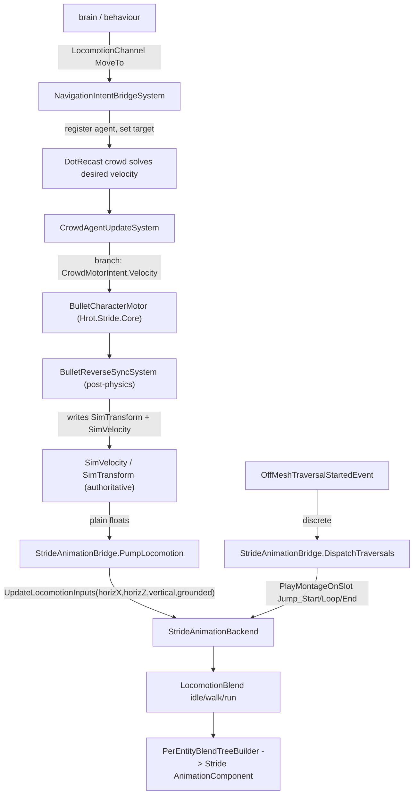

<!--STATUS
state: LIVE
build-state: BUILT (S1-S5; no stops remain on this line)
updated: 2026-08-22
current-answer: the whole file — how to port the Bullet-based Stride from origin/stride-integ-1 onto the
  coordinator line, what the integration changed on the HROT/FDP shared side, and the one real breakage
  (the crowd movement-intent refactor). Awaiting user review before any code moves.
design-basis: origin/stride-integ-1 (measured 2026-08-22) · .dev/stride-1/Stride-Integration_v0_3.md ·
  STRANDED_FEATURES_AUDIT.md (user ruling: Bullet, not Bepu; Stride only).
known-conflict: none.
-->
# DESIGN — porting the (Bullet) Stride integration onto the current line

> 🔒 **User ruling:** we want the **branch's Bullet-based Stride**, not trunk's Bepu. This doc answers the
> question the user asked — *how did the integration change the HROT/FDP shared side, and does it break what
> we have?* — and gives a safe port strategy. **Not approved to build; review first.**

## Headline

⭐⭐⭐ **The brain → stride-node ANIMATION contract is CLEAN and ADDITIVE** — it is pre-existing shared ECS
data, **byte-identical on both branches**; the Stride node is just a new consumer behind the existing
`IAnimationBackend`. **The user's animation worry is unfounded — nothing on our side fights it.**

## ⚠ CORRECTION 2026-08-22 — the "crowd breakage" was OVERSTATED. The coordinator crowd is a NO-OP STUB.

> 🔒 **User challenge:** *"is there any crowd implemented elsewhere? isn't the Stride crowd the only
> implementation?"* — ⭐ **Correct.** 📐 Measured on the coordinator:
> - `EngineBackedDtCrowdProvider.cs` is a **36-line NO-OP STUB** — its own doc: *"No-op crowd provider stub…
>   `GetAgentVelocity` always returns Zero. Humanoid navigation in this mode is handled by
>   `LinearKinematicsSystem`."*
> - **No DotRecast library on the coordinator at all** — only a comment in `IDtCrowdProvider.cs`
>   *("eventually by a DotRecast/dtCrowd port for production")*. The **real** DotRecast crowd lives ONLY on
>   `stride-integ-1` (`Hrot.Stride.Core/DotRecastDtCrowdProvider`).
>
> ⇒ ⭐⭐ **The Stride crowd IS the only real crowd implementation.** The coordinator's `CrowdAgentUpdateSystem`
> is fed a stub that returns **zero velocity** — nothing moves through the crowd path today. ⇒ ⛔ **Porting
> the Stride crowd REPLACES a stub with the real thing — it is ADDITIVE, not a breakage.** The earlier
> "freezes crowd locomotion on non-Stride nodes" concern is largely MOOT: there is no live crowd locomotion to
> freeze. ⭐ Keeping the change **authority-conditional** is still tidy defensive hygiene *(so a future
> non-Stride node could get a real FDP crowd)*, but it is NOT the load-bearing risk it was framed as.

## 1. The integration seams — all shared, all already on our branch (byte-identical)

| seam | type | file (same path both branches) | on coord? |
|---|---|---|---|
| pose / velocity | `SimTransform`, `SimVelocity` | `Fdp.Core/CoreComponents/SimComponents.cs` | ✅ identical |
| behaviour→muscle channels | `LocomotionChannel` · `WeaponChannel` · `InteractionChannel` | `Fdp.Toolkits/Behavior/Components/ChannelComponents.cs` | ✅ identical |
| discrete animation intent | `AnimationChannel` (PlayMontage) · `LookAtChannel` · `StanceIntent` | `Hrot.MuscleCharacter.Animation/Components/ReplicatedComponents.cs` | ✅ identical |
| animation backend contract | `IAnimationBackend.UpdateLocomotionInputs(...)` + montage APIs | `Hrot.MuscleCharacter.Animation/Contracts/IAnimationBackend.cs` | ✅ identical |
| brain-side writer | `AnimationRuntimeBridgeSystem` (SimVelocity → UpdateLocomotionInputs) | `…Animation/Systems/…` | ✅ identical |
| discrete-montage trigger | `OffMeshTraversalStartedEvent` / `OffMeshLinkDetectionSystem` | `Fdp.Toolkits/Navigation/PathfindingEvents.cs` | ✅ present |
| model/collider descriptor | `StrideRenderModelDefDto` + `CollisionShapeKind` | `Fdp.Toolkits/Tkb/Domain/…` | ✅ identical |

⇒ **The animation/pose contract was NOT touched by the integration** (the `.dev/stride-1` design says it
*reuses* `AnimationRuntimeBridgeSystem`/`IAnimationBackend`/`AnimationChannel.PlayMontage`; only the backend
implementation is new).

## 2. Animation control path — PORTABLE (plain ECS data, no Stride types crossing)

⭐ `StrideAnimationBridge` reads `SimVelocity` as plain floats (*"no Stride engine types appear here"*);
Stride types are confined to `PerEntityBlendTreeBuilder`, attached by visual binding. Same `IAnimationBackend`
that the shared `FakeAnimationBackend` implements. ⇒ **the Stride node is a clean additional consumer.**

## 3. The one conflict, and the safe strategy

| what | coordinator today | branch | verdict |
|---|---|---|---|
| `CrowdMotorIntent` (component **id 265**) | **ABSENT** (id 265 is FREE — coord ids stop at 264) | new movement-intent component | additive, no id collision |
| `CrowdAgentUpdateSystem` | writes `SimVelocity` **and integrates** `SimTransform += v·dt` — **owns** crowd position *(LinearKinematicsSystem excludes `CrowdAgent`)* | writes **only** `CrowdMotorIntent`; **stops** writing SimVelocity/SimTransform (delegates to Bullet motor + reverse-sync) | ⛔ **SAME FILE, DIFFERENT BEHAVIOUR — the risk** |
| `BulletCharacterMotor` · `BulletReverseSyncSystem` · `StrideVisualBindingSystem` | absent | in `Hrot.Stride.Core` | additive (new project) |

⚠ **Naive-port consequence, RE-SCOPED by the correction above:** the coordinator's crowd provider is a **no-op
stub returning zero** *(§ CORRECTION)*, so the refactored `CrowdAgentUpdateSystem` would not "freeze" any *live*
movement — there is none through the crowd path today. The change is effectively **replacing a dormant stub with
the real DotRecast+Bullet crowd**, i.e. additive.

⭐ **Still tidy to do it authority-conditionally** *(defensive, not load-bearing)*: keep a `SimVelocity`+
`SimTransform` integration branch for a future FDP-authoritative (non-Stride) crowd, and route through
`CrowdMotorIntent`→Bullet where `BulletReverseSyncSystem` is present. The additive pieces (`CrowdMotorIntent`
id 265, the `IDtCrowdProvider.RegisterAgent(entity, params, startPos)` overload, `NavigationIntentBridgeSystem`'s
deferred-retry robustness) port as-is. ⇒ **the whole Stride port is now assessed as ADDITIVE** — animation clean,
crowd a stub-replacement — with no live functionality on the coordinator that it would break.

## 4. Task breakdown (a FUTURE port — for review, not scheduled)

| # | task | note |
|---|---|---|
| **S1** | port the two new projects `Stride/Hrot.Stride.Core` (Bullet) + `Stride/Hrot.Stride.Animation`, into the solution | new paths, additive; keep Bullet |
| **S2** | add the additive nav pieces: `CrowdMotorIntent` (id 265), the `RegisterAgent(…startPos)` overload, the `EngineBackedDtCrowdProvider`/`FakeDtCrowdProvider`/`NavigationContractsComponentIds` deltas | additive |
| **S3** | ⛔ **make `CrowdAgentUpdateSystem` authority-conditional** (§3 strategy) — the ONE behaviour change; rail that non-Stride crowd locomotion still integrates SimVelocity/SimTransform | the risk item; gate carefully |
| **S4** | wire the Stride visual binding + animation backend on a Stride host; confirm `StrideAnimationBridge` reads `SimVelocity` and drives the blend tree | additive |
| **S5** | verify: non-Stride nodes (SimHost/editor/fake) still move crowd agents (regression); a Stride host animates from brain output | S3 is the thing to prove green |

## 5. Decisions for review

| # | decision | lean |
|---|---|---|
| **SD1** | port target branch | the coordinator line (as with MCP) |
| **SD2** | physics backend | **Bullet** (user ruling) — do NOT adopt trunk's Bepu for this |
| **SD3** | the crowd system | **authority-conditional** (§3), never wholesale replace | 
| **SD4** | scope of v1 | S1–S3 + a regression rail (S5); the Stride host wiring (S4) can follow |
| **SD5** | relationship to trunk's `Stride/BepuSample` | leave it; the ported Bullet Stride is a separate host path — decide later whether Bepu sample stays |

---

## 6. ⭐⭐⭐ AS-BUILT — **what the port measured, including two premises of this map that were FALSE**

> 📄 Batch: [`blueprints/batches/BATCH_ST101_The_Stride_Port.md`](blueprints/batches/BATCH_ST101_The_Stride_Port.md) ·
> ids **`ST-001`…`ST-009`**, tracker **Area I**.

### ⭐⭐ 6.1 The headline held — **and is now proven, not asserted**

⭐ *"The animation contract is CLEAN and ADDITIVE"* — ✅ **proven by a ZERO DIFF**: after the whole
port, `git status` reports **no change** under `Hrot.MuscleCharacter.Animation/`,
`Fdp.Core/CoreComponents/` or `Fdp.Toolkits/Behavior/Components/`. Suites **195 / 0 · 15 / 0 · 31 / 0**.

### ⛔⛔ 6.2 CORRECTION — **`id 265` was NOT free** *(`ST-005`)*

📐 §3 says *"id 265 is FREE — coord ids stop at 264"*. ⛔ **It looked only at `GlobalComponentIds` and
`NavigationContractsComponentIds`.** `NavFakeIds` declares its block as **262–279** and had RESERVED
**265** for `FakeVolumetricState`. ⭐ Measured: that constant has **no component attached** — its own
declaration is its only reference — so it is a reservation, not a live claim. ⇒ **moved to 269**;
265 now has exactly one claimant. ⚠ Left alone, a fake volumetric state built later would have
collided with a production component, silently.

### ⛔⛔ 6.3 CORRECTION — **the §1 seam table is INCOMPLETE: `IRaycastBackend` is a third piece** *(`ST-003`)*

📐 It surfaced as the **only** compile drift in `Hrot.Stride.Core`. `Fdp.Toolkits/Physics/IRaycastBackend.cs`
exists on the branch and **not at all** on the coordinator line, and `RaycastSolverSystem` gains a
nullable `RaycastBackend` property plus an early-return branch. ⭐⭐ **Additive and null on every
non-Stride node** ⇒ identical behaviour; Physics **31 / 0**. ⇒ ⚠ **`S2` should have named it.**

### ⭐⭐⭐ 6.4 `S3` AS BUILT — **the authority marker is the COMPONENT, per entity** *(`ST-004`)*

⭐ §3 asked for *"authority-conditional"* without saying what selects the arm. ⇒ **the entity's
`CrowdMotorIntent`**: present ⇒ write the intent only *(physics owns the pose)*; absent ⇒ the
pre-port `SimVelocity` + `SimTransform` integration, unchanged.

⭐⭐ **Per ENTITY, not per node**, and that is the substantive design choice: the component is added
only by the host that also runs the motor and the reverse-sync, so **its presence IS the marker**. A
node-level flag would be a second thing to keep in step with the first, and its failure mode is
silent — an agent that stops moving with nothing to point at. 📐 Railed with a **mixed world**: one
agent of each kind in one repository, both resolved correctly.

### ✅ 6.5 `S4` — **the hosted-real-editor mode BUILDS. My first verdict was wrong** *(`ST-007` → `ST-010`)*

⛔⛔ **I first reported this as "cross-lane, stop": the mode needs twelve `EditorSubsystem` members
this line lacks, so I guarded it out.** 🔒 **The user challenged that** — *"were they added on the
stride branch? what does that have to do with the UI branch, can't you do it yourself?"* — ⭐⭐ **and
the measurement vindicated the challenge.** 📌 I had applied the file-level lane rule **without
measuring what the change actually was.**

| 📐 measured | |
|---|---|
| **① they are the PORT's own seam** | the branch's block header: *"Public host-integration surface … for external host assemblies (e.g. `HrotStrideApp.Game`) to reach the live ECS world, kernel, and time controller **without reflection**"* ⇒ ⛔ **not UI-lane work that merely shares a file** |
| **② five of twelve ALREADY EXIST here, as `internal`** | `World` · `Kernel` · `EditorLogic` · `TimeController` · `PreviewController` ⇒ the change is **`internal` → `public`**, and the branch says so itself: *"behavior is identical to the former internal accessors"* |
| **③ the UI lane has NO live edit to collide with** | `git diff HEAD origin/claude/hrot-implementation-j1jvin -- EditorSubsystem.cs` is **EMPTY**, and their batch is Details/menus — a different region |

⇒ ⭐⭐⭐ **the guard is removed and the mode compiles.** ⭐ Two pieces the "twelve" had missed came with
it: **`MuscleModuleContext`** *(a 2-field record)* and **`DefaultSelectionState.Version`**
*(a monotonic counter in `Fdp.Presentation`)*.

⭐⭐ **The one member with a behaviour branch is `MuscleModuleFactory`, and its null arm is kept
BYTE-FOR-BYTE** — an editor that sets nothing cannot be affected by it. ⛔ **Deliberate deviation from
the branch**: it registers every muscle module in a `foreach` on BOTH arms, which on the default path
would register **one module more** than this line does *(HEAD registers `perceptionMod` only and
splices `simHostCorePack`'s system lists)*. ⇒ the `foreach` runs on the **injected arm only**.

📐 **Proof it breaks nothing**: `Hrot.Blueprints.Tests` Editor namespace — the suites that actually
**construct** `EditorSubsystem` — **1032 / 0**; `BreakpointSubsystemWiringTests` **25 / 0**;
`TimeControlIntegrationTests` **9 / 0**.

### ✅ 6.5b THE "REMAINING STOP" WAS A FALSE NEGATIVE OF MINE *(`ST-011`)*

⛔⛔ **I wrote that the `CharacterAnimationDefDto` family *"does not exist on this line at all"*.
📐 It does — byte-identically.** `git diff` on
`Hrot.MuscleCharacter.Animation/Descriptors/CharacterAnimationDefDto.cs` is **EMPTY**, and all eight
types are present. ⛔ **I had grepped only `FDP/Toolkits/`; the family lives in `Hrot/Subsystems/`.**

⇒ 📌 **A SCOPED grep read as an ABSENCE claim** — the failure CLAUDE.md names in one line
*("an absence claim from grep is an absence in your pattern, not in the repo")* — ⚠⚠ **and the second
time in this batch I asserted a design-blocking absence I had not enumerated.** *(The first was
§6.2's id 265, where the design made the same mistake and I caught it; here I made it myself.)*

⭐ **The real gap was one method.** `UrbanCombatNewScenario.BuildMannequinAnimationDef()` — a static
factory returning the mannequin's descriptor *(6 montages: idle/walk/run on slot 0 = Locomotion,
Jump_Start/Loop/End on slot 100 = FullBody; 2 slots; 2 footstep notify markers)* — plus **four**
`AddDescriptor` call sites on the **`InfantrySoldier`** and **`Insurgent`** templates, and a
`ProjectReference` from `Fdp.Examples.Scenarios` → `Hrot.MuscleCharacter.Animation` *(the same one the
branch added; `HrotStrideApp.Game` already depends on that project, so the direction is consistent)*.

⇒ ⭐⭐ **`HrotStrideApp.Game.Tests` now compiles with ZERO exclusions** — the whole ported test surface
is present. ⚠ **`ST-013`**: `CivilianPedestrian` renders as a mannequin but gets **no** descriptor —
the branch attaches it to the two combatant templates only, and I matched the branch rather than
deviating unprompted.

### ⚠⚠ 6.6 THE ENVIRONMENT LIMIT — **compile-verified, NOT run-verified** *(`ST-006`)*

| 📐 measured | |
|---|---|
| `net8.0-windows` builds on Linux | ⭐ **only** with `-p:EnableWindowsTargeting=true`, on **restore AND build** |
| the Stride suites **cannot run** | ⛔ the test host needs the `Microsoft.WindowsDesktop.App` **runtime**; there is no linux-x64 build *("No frameworks were found")* |
| `HrotStrideApp.Windows` **cannot build** | ⛔ `Stride.Core.Assets.CompilerApp` runs `--platform=Windows --compile-property:StrideGraphicsApi=Direct3D11`, exit **150** |

⭐⭐⭐ **The third was CONFIRMED PRE-EXISTING** by building the base commit `128eb68c` in a worktree —
same failure, before a single port file existed. ⇒ ⛔ **the port did not regress it.**

⇒ 📄 **[`Stride_Host_Visual_Test.md`](Stride_Host_Visual_Test.md)** carries the Windows launch
command and what a human should see.
