<!--STATUS
state: LIVE
build-state: phase 0 is BUILT (§5, as-built §5.6–§5.9). Phase 1's SEAM is BUILT with two adopters
  (§5b, as-built §5b.4); its remaining adoptions are listed at the end of §5b.4. Phases 2+ get their own
  inventory + UML per batch, appended here as they are designed.
  ⭐⭐ NEW 2026-09-03: §4.1b (CE-164) — IG built the shared slave orchestration stack via HrotNodeBuilder
  Step 8 and then DISCARDED it, hand-building a second bus + a bare ingress-only translator and ticking the
  halves crosswise, so its TransitionStateIntent was drained by nothing. ✅ FIXED — as-built + live evidence
  at §4.1c: IG now originates cluster-wide transitions, and SharedApplicationBootstrapper THROWS on a slave
  built off context.EventBus. It also SUPERSEDES DESIGN_Mcp_Diagnostics_Federation.md §1d's lean.
  ⭐⭐ NEW 2026-09-03: §4.1d MEASURES the other abstract hook, RegisterSpawningPipeline. EntityCreationPack
  is already built by FIVE hosts, so this is argument DRIFT, not a bypass: four rows to unify (Elm lookup,
  the network adapters, RequestEgress, SpawnSystem scheduling), three genuinely per-role. The lean is that
  the BASE composes the pack and the hook keeps only node domain modules. NOT built. A suspected
  GenesisMaterializationSystem gap on CGF was tested live with hill-attack and did NOT reproduce; it is
  recorded there as an OPEN QUESTION, not a hazard.
  ⛔⛔ NEW 2026-09-03: §4.1e carries TWO USER CORRECTIONS to §4.1d and SUPERSEDES its ExtraTranslators
  row (which said 'keep per-host' -- WRONG: the TKB is by design the same on all nodes, and the
  translator is already an inert no-op where the components are unregistered, so it belongs in
  TkbTranslatorSet.Base()). And module selection must be by ROLE, not per host: NodeRole's own doc
  already specifies the per-role module table and RegisterSpawningPipeline ignores it. NOT built.
  ⭐⭐⭐ NEW 2026-09-03: §4.1f IS step 0 -- the class -> role-concept mapping, measured. Headline: the role
  bundles ALREADY EXIST as CgfLogicPack (Brain) and SimHostCoreLogicPack (MuscleGround), named after
  hosts and selected by none. The build is mostly rename-and-move into four tiers (Always / Role /
  Implementation / creation). THREE rows need a USER RULING before any code moves -- the enum's table
  and the packs disagree on Combat and ActionDispatch; two systems sit in BOTH packs and would
  double-register on a Brain|MuscleGround node; and PhysicsToolkitModule fits no role, so an Always
  tier is required.
  ⭐⭐⭐ NEW 2026-09-03: §4.1h CLOSES the role list and SUPERSEDES §4.1f's four-tier sketch. Four ORTHOGONAL
  axes: RESOURCES (one per world, memory-owning -- PhysicsToolkitModule/RaycastBatchData, which CGF and
  SimHost each hand-allocate for different reasons) / CAPABILITIES (role system-sets, unioned) /
  IMPLEMENTATIONS (executor sets, engine-vs-fakes, SimHost-vs-Stride) / and AUTHORITY-SCOPED PROTOCOL,
  which is listed only to be EXCLUDED. It also RESOLVES §4.1f discrepancy 1 by measurement: the enum is
  right on both rows and the packs drifted.
  ⭐⭐⭐ NEW 2026-09-03: §4.1i is the RESOURCE-DECLARATION pass, and it exposes the blocker: FOUR modules
  fuse capability and resource in one class (EqsModule, CognitiveSpatialModule,
  AutonomousPerceptionModule, GroundKinematicsModule), so selecting them by role selects a persistent
  allocation. PhysicsToolkitModule is the only clean provider and is the template. Proof the axis is
  required: EngineBackedNavigationModule (NavigationSolver) is handed TrajectoryPoolManager, owned by
  GroundKinematicsModule (MuscleGround) -- so a NavigationSolver-only node has no pool. The first build
  item is the SPLIT, not the selection mechanism.
  ✅✅ NEW 2026-09-03: §4.1j FINISHES this design (user: "no implementation before the design is clear
  and written"). Both open measurements are closed -- the double tick is CORRUPTING (UnitHierarchySystem
  appends to a roster unguarded, inflating Count and falsely rejecting at Capacity), and the four fused
  modules ARE cheaply separable (their systems take the resource by ctor, so no system is rewritten).
  Fifth finding: AutonomousPerceptionModule and the NavigationSolver module already exist and
  BS-1-DESIGN:357 says they are "already correctly designed... no changes needed" -- dormant, not wrong.
  §4.1j carries the classDiagram + sequenceDiagram and the B1..B5 build sequence with acceptance.
  build-state for the ROLE COMPOSITION work: READY-TO-BUILD at B1.
  🔴 NEW 2026-09-03: §4.1k CORRECTS §4.1f and §4.1j on a user challenge. StrideNodeBootstrapper DECLARES
  Role = MuscleGround|Perception|NavigationSolver|ImageGenerator and takes four nullable per-role module
  slots -- so the roles are DECLARED, not undeployed; and the only two constructions in the repo are
  tests passing all four null, so every slot is empty. Stride's ctor is axis 3 hand-rolled. It is also
  the first node selecting two roles whose module sets OVERLAP, which is why B1 must precede any filling
  of those slots.
  🔴🔴🔴 NEW 2026-09-03: §4.1L (CE-165) SUPERSEDES §4.1k's headline on a second user challenge, and it is
  the most consequential finding of this design. (a) StrideNodeBootstrapper is DORMANT -- AttachBootstrapper
  has no caller -- while the LIVE Stride node is EditorStrideSubsystem, whose role slots are FULL (Brain via
  CgfLogicPack, MuscleGround via StrideMuscleModuleSet = SimHostCoreLogicPack with GroundKinematicsModule
  swapped for StrideKinematicsModule). So axis 3 is not a new idea: it is BUILT and RUNNING, and the Stride
  header already names the remaining seam (STR-P1-T1). (b) FOUR composition roots fuse Brain+Muscle; both
  packs carry UnitHierarchySystem AND EqsResultUpdateSystem; THREE roots dedupe by type and the RUNNING
  Hrot.Editor (EditorSubsystem) does NOT -- SpliceIntoSimulation and TogglableSimulationGroup both pass the
  concatenated list through untouched. That is a LIVE production defect: one CmdAssignSubordinate yields two
  roster entries. The integration harness that mirrors the editor HAS the guard, which is why no test sees
  it (rail-blindness, 4th instance). => B1 ([SingleInstance]) changes from PROPHYLACTIC to CORRECTIVE and
  needs a reproducing rail with an inverse-edit red-proof before the fix.
  ⚠ §4.1k's "every slot is empty" must NOT be quoted; §4.1k's corrections 1-3 and its B1/B4/B5 consequences
  still stand.
  ⭐ NEW 2026-09-03: phase N₀ (§4.0) is READY-TO-BUILD — the time role becomes a HrotNodeBuilder input,
  which is the measured prerequisite for the Editor adopting the shared node bootstrap (§4.1). It is
  pulled FORWARD out of phase N on a user ruling that the Editor is in scope for unification.
updated: 2026-08-27
current-answer: the whole file. This is the STANDING design for the composition-unification programme —
  the approach, the constraints and the phase plan. §5 = phase 0 (BUILT; §5.6-§5.9 are its as-built),
  §5b = phase 1 (seam BUILT; ⚠ §5b.4 records THREE argued deviations — read it before quoting §5b.2's
  classDiagram or §5b.3's item ②).
  ⚠ §5b.1 CORRECTS §2.1: the bundle seam is not missing — a FEATURE-level IWindowRegistrar exists in
  Hrot.Blueprints.Editor with in-degree 24, and BlueprintWindowRegistrar is a working adopted precedent
  for the whole pattern. Read §5b.1 before quoting §2.1's "nothing to share".
design-basis: 🔒 Architect_Question_63_Unify_Subsystem_Composition.md — §9/§10 are USER RULINGS (canon),
  §12 settles the phase-0 venue, ⛔ §11 is SUPERSEDED. Also: batches/HANDOFF_Cgf_Bootstrap_Unification.md
  (the dispatched frame) · Architect_Question_62 (predecessor; its SHAPE and STAGING are superseded) ·
  SharedApplicationBootstrapper (the existing 7-phase node base) · CgfEditorShellToolbar (the
  derived-subset pattern) · ScenarioEditorModule (the host-decides module precedent) ·
  tools/ai-debug-mcp/SKILL.md (the MCP channels — ⛔ never derive MCP capability from engine source).
known-conflict: ⛔ the dispatched frame handoff is stale on TWO points — its stage-1 god-facade
  prerequisite (AQ63 §3.3: obsolete by measurement) and its phase-0 rail wording (AQ63 §10.4: would encode
  a ruling violation). ⚠ The handoff is deliberately NOT edited — rule 1 forbids amending a dispatched
  handoff; the divergence is declared here and in the report instead.
-->
# ⭐⭐⭐ DESIGN — **Subsystem composition unification**

> 🔒 **The goal (user, `2026-08-27`):** *"the subsystem bootstrap need much bigger unification than there is
> now… we tried to unify so much like map, menus, gizmos… so we should share its composition code as well."*

## 1. ⭐⭐ THE PROBLEM IN ONE PARAGRAPH

📐 The **features** were unified — map, menus, gizmos, panels, catalogs, inspector, the scenario session.
⛔ **The composition of them was not.** Every windowed host still wires the shared pieces by hand, so a
piece added on one host silently never appears on another. 📌 **Every defect `CE-046`…`CE-064` is an
instance of that one root**, and the user found six of them by eye, in the UI, after five green batches.

## 2. ⭐⭐⭐ THE TWO HALVES — **one is already shared, one has no shared root at all**

| half | what it composes | status |
|---|---|---|
| ⭐ **NODE bootstrap** | context+world · ECS components · serializer · togglable groups · orchestration · spawn pipeline · DDS translators · time-sync · `Kernel.Initialize` | ✅ **`SharedApplicationBootstrapper`** — 7 phases, *"non-negotiable"* order, **3 adopters** *(SimHost · IG · Stride)*. ⛔ Five hosts bypass it |
| 🕳️ **UI / EXPERIENCE composition** | map+canvas · menus+toolbar · gizmos · windows/panels · catalogs · inspector · perspectives · time transport · AI shell | ⛔⛔ **NONE.** Wired inline in every host |

📐 **The correlation is the argument:** the three adopters' roots are **385 · 208 · small**; the five
hand-rollers' are **5325 · 2599 · 1086 · 602 · 460**.

### 2.1 ⭐⭐⭐ And the UI seam EXISTS — it is used the wrong way round
> ⚠⚠ **PARTLY SUPERSEDED `2026-08-27` — read [§5b.1](#5b1--inventory-graph-2026-08-27--queries-recorded)
> before quoting this section.** ⭐ The conclusion *("bring the UI half to the pattern the system half has")*
> **stands**; ⛔ two of the measurements below are wrong, and the correction makes phase 1 **cheaper**:
> 📐 there are **TWO** interfaces named `IWindowRegistrar` — a HOST-level one *(in-degree 8)* and a
> **FEATURE-level one in `Hrot.Blueprints.Editor` with in-degree 24** — and `BlueprintWindowRegistrar` is
> already a **working, adopted** bundle. ⇒ ⛔ *"there is nothing to share"* is FALSE.

📐 `IWindowRegistrar` has **10** implementations and ⛔ **8 of them ARE the subsystems.** ⇒ the unit of
composition is the **host**, not the **feature** — which is precisely why there is nothing to share.
⭐ Meanwhile the system half is **50 `IEcsModule`s**. ⇒ ⭐⭐ **the fix is to bring the UI half to the pattern
the system half already has.** ⛔ Not a new abstraction — finishing one that exists.
⛔⛔ **`SharedAiWindowRegistrar` was cited here as *"the prototype: built, in-degree 0, never adopted"* — it
is now DELETED** *(`CE-070`, §5b.6)*, and **both halves of that description were wrong**: ⚠ a DI rail
resolved it *(so it was wired and host-unused — worse than unadopted, because it looked adopted)*, and
⭐⭐ its windows declare `WindowScope.PerspectiveBound`, so it was **the wrong shape**, not an unfinished
prototype. ⇒ ⭐ **the surviving prototype is `BlueprintWindowRegistrar`** *(§5b.1)*, which works and is
adopted — and phase 1 named its shape as `IUiBundle`.

## 3. 🔒🔒🔒 THE CONSTRAINTS — **canon; every batch is bound by these**

### 3.1 The three axes *(`AQ63` §9 + §10 — USER RULINGS)*
| axis | reference | unify? |
|---|---|---|
| ⭐⭐⭐ **UI · scenario editing · monitoring · debugging** | **the EDITOR is the SOURCE AND SPECIMEN** | ✅ **aggressively** |
| ⛔⛔ **the RUN-SET** — modules · systems · services | **each host's ROLE** | ⛔ **never** |
| ⛔⛔ **NETWORK** — translators · DDS · participant | **each host's ROLE** | ⛔ **never** |

⚠⚠ **THE TRAP, stated because it is invisible when you fall into it:** *"the editor is the specimen"* and
*"the editor runs almost everything"* are **two different axes.** 📌 A map bundle that registered
`MapCullingModule` + `StyleResolutionModule` *because the editor does* would **silently change what CGF
computes every frame — and would look like a successful unification.**
⇒ ⭐ **The editor is the reference on axis 1 and explicitly NOT on axes 2–3.**

### 3.2 ⛔⛔ THE STANDING CONSTRAINT
> **No bundle may register a module, a global system, a DDS translator, an egress/ingress system, or a
> participant.**

| ⭐ a bundle MAY | ⛔ a bundle MAY NOT |
|---|---|
| register **windows · panels · commands · menu items · toolbar entries** | ⛔ register anything from the run-set or the network |
| **DECLARE** the systems its affordances require | ⛔ decide the node's simulation topology |
| **report unserviceable** when the host does not run them | ⛔ silently no-op |

⭐⭐ **Three existing precedents prove the shape — this codifies them, it does not invent them:**

| precedent | why compliant |
|---|---|
| `ScenarioEditorModule` *(`E3`)* | 📐 **each host constructs and registers it ITSELF**, with its own `InteractionDeps` *(`EditorSubsystem:1290`, `CgfSubsystem:921`)* ⇒ the **host** decides it runs; never ambient |
| `ToolActivationDrainSystem(reportUnserviceable:)` *(`E3`)* | ⭐ a host that cannot service a tool **says so** — ruling 49 / `VC-3` at the system level |
| `CgfEditorShellToolbar` *(`CE-016`/`CE-037`…`045`)* | ⭐ ONE shared table; the per-host subset is **DERIVED from what the host can service** ⇒ no host list, no `if (host==…)` *(ruling 58)* |

### 3.3 ⛔ Why NOT one `ComposeEditorExperience(deps)` *(`AQ62`'s shape, superseded)*
⛔ A monolith cannot serve ExCon *(mission/orbat, no AI perspectives)*, IG *(display node)*, ReplayBrowser
*(own timeline)* or SimHost *(headless-first)* without either a **host conditional** *(ruling 58 forbids)* or
a **bag of nullable knobs** — ⛔⛔ and that is a **silent-default generator**, the exact shape behind five
measured defects. ⇒ ⭐ **bundles; a host composes a LIST, and a smaller list is a subset, never a branch.**

## 4. ⭐ THE PHASE PLAN

| phase | what | why here |
|---|---|---|
| ⭐⭐⭐ **0** | **the UI parity rail** *(§5)* | 🔒 user: *"for a refactor like this that rail is absolute must"*. It protects every later phase |
| **1** | the **bundle seam** + **menus/toolbar** across the windowed hosts | ⭐ `CgfEditorShellToolbar` already IS the pattern ⇒ proves the seam cheaply before betting map/gizmos on it |
| **2+** | **one bundle per batch**, extracted **from the editor as specimen**: scenario panels → gizmos → map → AI shell → time transport | ⭐ each collapses a measured drift site permanently |
| ⭐⭐ **N₀** *(NEW `2026-09-03`, pulled FORWARD — small, and it is a PREREQUISITE)* | **make the TIME ROLE a `HrotNodeBuilder` input** ⇒ ⭐ the Editor becomes *able* to adopt the builder | 🔒 **User, `2026-09-03`:** *"add the time role change to the plan to unblock editor (because i need the editor to be unified too of course)."* ⛔ **Not optional and not last:** §4.1 measures that `Build()` hardwires `TimeRole.Slave` while `EditorSubsystem:1013` builds a `MasterSyncController` ⇒ **every later Editor-adoption item is blocked on this one**, and it is the only phase-N item that is small |
| ⚠ **N** *(optional, LAST)* | node-bootstrap adoption — **CGF first** *(it already uses `HrotNodeBuilder`/`HrotNodeContext`; the editor uses neither)*, ⭐ **then the Editor, once `N₀` has landed** | ⛔ **deliberately last:** the only phase touching orchestration/participant/time authority, i.e. what §3.1 says not to move blindly. 📐 **Not one** of `CE-046`…`CE-064` was a node-bootstrap gap |

### 4.0 ⭐⭐⭐ PHASE N₀ — **the time role becomes an input.** `build-state: READY-TO-BUILD`

> 🔒 **The user's reason, `2026-09-03`:** the Editor is **in scope for unification**, not an accepted
> exception. ⇒ ⛔ *"the Editor hand-rolls its node context"* may not stand as a permanent note; the thing
> that blocks fixing it gets scheduled.

#### ⭐ INVENTORY *(`2026-09-03`)*

```
grep -rn "new HrotNodeBuilder" --include=*.cs Hrot Stride | grep -v obj/ | grep -v Tests   → 5 sites
grep -rn "TimeControllerFactory.Create" --include=*.cs Hrot FDP | grep -v obj/             → the role owners
```

| | measured |
|---|---|
| ⭐ `HrotNodeBuilder.Build()` | one `TimeControllerConfig` with **`Role = TimeRole.Slave`** hardwired, `Mode = TimeMode.Continuous`, `SyncConfig = TimeConfig.Default` |
| ⭐ the 5 builder sites | **all five are genuinely slaves** ⇒ ⛔ **nothing changes for them**; the default preserves them exactly |
| 🔴 the Editor | `TimeControllerFactory.Create(_orchestrationBus, timeConfig)` cast to **`MasterSyncController`** *(`EditorSubsystem:1013`)* — the one master among the windowed hosts |

#### ⭐ THE CHANGE

| # | item | note |
|---|---|---|
| **①** | ⭐⭐ `HrotNodeBuilder.WithTimeRole(TimeRole role)` — ⭐ **defaulted to `TimeRole.Slave`** | ⛔ **five existing sites untouched, byte for byte.** ⚠ The default is safe here for the reason the silent-default rule demands: *no caller HOLDS a different value* — all five ARE slaves |
| **②** | expose the built controller on `HrotNodeContext` **typed as the interface**, not as `MasterSyncController` | ⛔ a `Master`-typed property would push the role back into the builder's shape |
| **③** | ⭐ **do NOT move Editor code in this phase** | 🔒 §3.1: this phase touches **time authority**, the axis the ruling says not to move blindly. ⭐ `N₀` makes adoption *possible*; the adoption is phase `N` and gets its own inventory |
| **④** | ⭐ a rail: a builder with no `WithTimeRole` yields a **slave** controller, and one with `TimeRole.Master` yields a **master** | ⛔ without the first half the default is unproven and the five sites are only *believed* unchanged |

⚠ **What `N₀` does NOT claim.** ⭐ It removes the *mechanical* blocker only. 📐 §4.1 records a second Editor
duplicate — its **private `SequentialIdAllocator`** *(`EditorSubsystem:599`)*, a re-implementation of what
the builder selects through `INetworkFactory` — ⇒ that dies **when the Editor adopts the builder**, in phase
`N`, not here. ⛔ Do not fold it into `N₀`: it is a behaviour change *(which allocator runs)*, and `N₀` is
deliberately behaviour-free.

### 4.1 ⭐⭐ PHASE N, MEASURED *(`2026-09-03` — the layer cake, and the two hosts outside it)*

⭐ The node half is **three** layers, not one, and they have different adoption. ⛔ *"CGF and the Editor
bypass the bootstrapper"* collapses them and is why phase N has looked like one job:

| layer | what it settles | adoption, measured |
|---|---|---|
| ⭐⭐⭐ **`HrotNodeBuilder.Build()`** | world · `EventAccumulator` + `ModuleHostKernel` · bus + `OrchestrationEventRegistry.RegisterAll` · time controller · DDS participant · `NetworkEntityMap` · id allocator | ✅ **5 production sites**: `IgNodeBootstrapper:148` · `StrideNodeBootstrapper:216` · `SimHostNodeBootstrapper:161` · `CgfSubsystem:534` · `EyesAndMuscleSubsystem:70`. ⛔ **the Editor is NOT one** |
| ⭐⭐ **`SharedApplicationBootstrapper`** *(the 7-phase ORDER)* | phases 1–7, of which **6a base modules · 6a+ `NedReplicationModule` · 6c time-sync · 7 `Initialize`** are base-class-only | ⚠ **3 subclasses**: SimHost *(387 ln)* · IG *(471)* · Stride *(376)*, over a **279-line** base. ⛔ CGF and the Editor re-run the order inline |
| ⭐ **the packs** *(what the hooks build)* | `EntityCreationPack` · `MapInteractionPack` · the 9 `*TranslatorPack`s | ✅ shared and adopted independently of the two layers above — 📌 **which is why CGF gets the packs while bypassing the bootstrapper** |

#### 🔴 THE EDITOR IS THE OUTLIER, and it has a MECHANICAL reason — ⛔ not neglect

📐 `EditorSubsystem` duplicates **every step** of `HrotNodeBuilder.Build()` by hand: `new EntityRepository()`
*(`:957`)* · `new FdpEventBus()` + `OrchestrationEventRegistry.RegisterAll` *(`:958-959`)* ·
`new ModuleHostKernel(...)` *(`:962`)* · `TimeControllerFactory.Create` *(`:1013`)* · `new NetworkEntityMap()`
*(`:1021`)* — ⛔ **including a PRIVATE `SequentialIdAllocator` class of its own** *(`:599`)*, a second
implementation of something the builder already selects through `INetworkFactory`.

⛔⛔ **But it cannot simply adopt the builder today:** 📐 `HrotNodeBuilder.Build()` **hardwires
`Role = TimeRole.Slave`**, and the Editor creates a **`MasterSyncController`** *(`:1013`)* — it is the time
MASTER. ⇒ ⭐⭐⭐ **the first item of phase N is making the time role a builder input**, not moving Editor code.
⚠ **Until that exists, "the Editor should adopt `HrotNodeBuilder`" is not actionable** — and an earlier
reading of §4 that treated the Editor as merely lagging was wrong about the cause.

### 4.1b 🔴🔴 `CE-164` — **IG BUILDS THE SHARED SLAVE STACK, THEN DISCARDS IT AND HAND-BUILDS A SECOND ONE** *(measured `2026-09-03`; NOT fixed)*

> 🔒 **User, `2026-09-03`:** *"the `NedSlaveOrchestrationTranslator` missing on IG shows we are missing
> shared code for slave node composition/bootstrap. all 3 ECS nodes should call it to register this (and
> likely many other) translators to be shared by any networked slave node."*
>
> ⭐⭐ **The symptom is real and the direction is right. ⛔ The premise is not: the shared code EXISTS, IG
> DOES call it, and then throws the result away.** ⚠ That distinction changes the fix — see the lean.

#### 📐 The symptom, measured live on the four-process cluster

| | result |
|---|---|
| `POST /scenario/load/live` on **IG** | ✅ `ok, via: "cluster-intent"` — ⛔ **and the cluster never moves** |
| the **identical** call on **CGF** | ✅ moves all three nodes to the target |
| ⇒ | ⛔ not an illegal transition, not a state problem — **the ORIGIN node** |

#### ⭐⭐⭐ The mechanism — **IG runs TWO orchestration stacks and ticks the halves crosswise**

📐 **`HrotNodeBuilder.Build()` Step 8 already builds the complete stack** — `new ClusterSlave(...)` **and**
`nodeFactory.CreateSlaveOrchestratorTranslators(eventBus, nodeId)`, i.e. a `NedSlaveOrchestrationTranslator`
= `NodeOpSlaveTranslator` *(ingress + heartbeat)* **+** `ClusterOpEgressTranslator` *(which drains
`TransitionStateIntent` to DDS)* — and returns both on `HrotNodeContext`. ⭐ **`IgNodeBootstrapper:151`
calls that builder.** ⇒ ⛔ **the egress translator is BUILT on IG.**

⛔⛔ **Then `IgNodeBootstrapper.BuildOrchestration` builds a second stack on a NEW bus:**

| | **stack ①** — the builder's *(shared)* | **stack ②** — IG's own *(hand-built)* |
|---|---|---|
| bus | `HrotNodeContext.EventBus` | `new FdpEventBus()` → `IgNodeBootstrapper.OrchestrationBus` |
| slave translator | ✅ **complete** — ingress + **egress** | ⛔ **bare `NodeOpSlaveTranslator`** — ingress + heartbeat only |
| **`Tick()`ed?** | 🔴 **NEVER** — `context.SlaveTranslator` appears nowhere in `IgApplication` | ✅ `IgApplication:980` |
| `SwapBuffers()`? | ✅ `IgApplication:1041` | ✅ `IgApplication:979` |
| the live `ClusterSlave` | orphaned | ✅ `_context.ClusterSlave` *(`IgApplication:932`)*, ticked at `:981` |
| ⭐⭐⭐ **what the debug API publishes onto** | 🔴 **THIS one** — `OrchestrationBus => _context?.EventBus` *(`IgApplication:1708`)* | — |

⇒ 🔴 **`requestTransition` publishes onto stack ①'s bus, whose complete translator is never ticked.** The
intent is written, swapped, and read by nothing. ⛔ **The capability was built and thrown away — not
missing.**

#### ⭐⭐ IG IS THE ONLY OUTLIER — every other host ticks the shared translator

📐 `grep` for `SlaveTranslator?.Tick()`, production only:

| host | ticks the **builder's** complete translator | passes `context.EventBus` to its orchestration |
|---|---|---|
| **SimHost** | ✅ `SimHostApp:560` *(from `_bootstrapper.SlaveTranslator`, `:504`)* | ✅ |
| **Stride** | ✅ `StrideNodeBootstrapper:174` | ✅ `eventBus: context.EventBus` |
| **CGF** | ✅ `CgfSubsystem:1294` | ✅ |
| **EyesAndMuscle** | ✅ `EyesAndMuscleSubsystem:104` | ✅ |
| 🔴 **IG** | ⛔ **no** — ticks its own bare one instead | ⛔ **no** — makes a second bus |

#### ⛔ WHAT LETS THIS HAPPEN — the seam, not the node

⭐⭐⭐ **`SharedApplicationBootstrapper.BuildOrchestration` is `protected abstract`** *(one of **seven**
abstract hooks)*. ⇒ the 7-phase base mandates *that* each node wire orchestration and shares **none of the
doing** — nothing structurally binds a subclass to `context.EventBus` or to `context.SlaveTranslator`.
⭐ Three subclasses write it three ways; two agree by convention and one drifted. ⚠ **That is the user's
point, and it stands** — but the missing thing is a **BINDING**, not a registrar that does not exist.

#### ⭐⭐⭐ THE LEAN — **① make IG use the stack it already built · ② make the seam stop permitting the split**

| # | | why |
|---|---|---|
| **①** | ⭐⭐⭐ **`IgNodeBootstrapper.BuildOrchestration` stops creating `new FdpEventBus()` and a bare `NodeOpSlaveTranslator`** — it builds its `ClusterSlave` on `context.EventBus` and lets `context.SlaveTranslator` be the one thing ticked, exactly as Stride does *(Stride's whole override delegates to `NodeBootstrapper.BuildOrchestration(..., eventBus: context.EventBus)`)*. ⭐ `IgApplication` then ticks `_context.SlaveTranslator` and drops `_igSlaveTranslator`/`_igOrchestrationBus` | ⛔ **deletes a duplicate stack; adds no mechanism.** ⭐ Stride is the working precedent and it is the closest sibling |
| **②** | ⭐⭐ **the base stops permitting it** — the cheap form is a **post-condition assertion in `SharedApplicationBootstrapper` after `BuildOrchestration`**: the returned `ClusterSlave` must sit on `context.EventBus`, and `context.SlaveTranslator` must be non-null when a participant exists. ⚠ The richer form *(a base `BuildOrchestration` with a per-node handler hook)* is a bigger refactor and should follow the assertion, not precede it | 🔒 *"every ECS node must use the same shared code"* — ⭐ but a convention nothing checks is a convention that decays, which is why ① alone is not enough |
| ⛔ **what I would NOT do** | write a **new** `RegisterSlaveNodeTranslators(...)` shared registrar and call it from three bootstrappers | ⛔ **that is a FOURTH mechanism** for something `HrotNodeBuilder` Step 8 + `INetworkFactory.CreateSlaveOrchestratorTranslators` already do for five hosts. 📌 The seam law: *"we need a shared X"* here means **X exists and is under-adopted** |

⚠ **On *"(and likely many other) translators"* — measured, and the answer is NO for the other hook.**
`RegisterNetworkTranslators` is the other abstract hook, and its three implementations register genuinely
**different, role-specific** sets: SimHost `CreateSimHost{Auxiliary,Perception,Pathfinding}Translators` ·
Stride `CreateSimHostAuxiliaryTranslators` · IG `CreateIgEgressTranslators`. ⇒ ⭐ **that divergence is
intended** *(an IG does not run pathfinding)*, and collapsing it would be the mirror error. ⛔ **The
orchestration/control-plane stack is the one that must be identical, because every networked slave speaks
the same control protocol** — and it is the one that drifted.

⚠ **What would change the lean:** if IG's second bus exists for a measured reason — e.g. its render tick
runs at a different rate and must not share buffer swaps with the control plane — then ① is wrong and the
fix is instead to tick `context.SlaveTranslator` **on IG's existing bus pairing**. ⛔ **Searched `docs/` and
`.dev/` for a record of why IG builds its own orchestration bus — none found**; `IgNodeBootstrapper:229`
says only *"CMC-S016: each slave subsystem has its own orchestration bus + translator (Option C)"*, which
argues for **per-subsystem** buses *(true of every host — each has its own)* and **not** for two buses
inside one subsystem. ⇒ **that comment does not justify the split, and the split may simply predate the
builder growing Step 8.** ⭐ Worth one `git log -S` on `HrotNodeBuilder` Step 8 before building.

⚠ **Blast radius, stated honestly:** this changes which bus IG's control plane lives on, so it touches
heartbeats, `NodeOpStatus` ACKs, and the `ClusterSlave` `CE-163` now reads. ⛔ **Not a read-only change**
— it needs the four-process cluster re-run *(load/live from the IG port must move all three nodes, and IG
must still ACK cluster ops)*, not just unit rails.

📄 `CE-164` was first written up in `DESIGN_Mcp_Diagnostics_Federation.md` §1d; that section's *"IG
hand-constructs half of it"* lean is **SUPERSEDED** by this section and points here.

### 4.1c ✅ AS BUILT — `CE-164` *(obligation ⑤; `2026-09-03`)*

🔒 **User ruling that authorised it:** *"IG is no different from cluster mgmt point of view. unification in
as many places as possible for keeping the role is our goal."* ⇒ ⭐ the split was not a role difference and
is gone.

| # | as built | ⚠ deviation from the lean |
|---|---|---|
| **①** | `IgNodeBootstrapper.BuildOrchestration` takes `context.EventBus` instead of `new FdpEventBus()`; the hand-built `NodeOpSlaveTranslator` is **deleted**; the `OrchestrationBus` and `IgSlaveTranslator` properties are **deleted**. `IgApplication` holds `_slaveTranslator = _context.SlaveTranslator` *(the shape `SimHostApp:504` uses)* and ticks it | ⭐ **none** |
| **①b** | ⚠ **the second `SwapBuffers()` had to go too** — the lean did not name it. IG swapped its own bus at the TOP of `Update()` and `context.EventBus` at the END. With one bus that is a **double swap per frame**, and `FdpEventBus` is double-buffered ⇒ everything published between the two swaps would be discarded. ⭐ The final order is verbatim `SimHostApp:560-561`: **tick translator → tick slave … → ONE swap at the end** | ⭐ **an addition the lean missed**, and it would have been a silent data-loss bug |
| **②** | `ClusterSlave.PublishesOn(FdpEventBus?)` + a **throwing post-condition** in `SharedApplicationBootstrapper` right after Phase 5: the returned slave must publish on `context.EventBus`, and a node with a participant **and a network factory** must have a `SlaveTranslator` | ⚠ **the second half was WEAKENED, and the measurement forced it** — see below |
| ⛔ **not built, as promised** | a new `RegisterSlaveNodeTranslators` shared registrar | ⭐ still the right call: `HrotNodeBuilder` Step 8 already does it for five hosts |

#### ⛔⛔ THE ASSERTION HAD TO BE EXACTLY AS STRONG AS THE BUILDER — **not stronger**

📌 First cut asserted *"participant ⇒ translator"*. 📐 **Measured: it threw on 55 `Hrot.IG.Tests` and 5
`Hrot.SimHost.Tests` cases**, every one of them `InitializeEmbedded(headless: true)` with **no network
factory** — a legitimate shape that has a participant and correctly has no translator, because
`HrotNodeBuilder` Step 8's own condition is `participant != null && _networkFactory != null`.
⇒ ⭐⭐⭐ **an invariant must mirror the code that establishes it.** ⛔ An assertion that fires on a valid
configuration gets deleted within a batch — `CLAUDE.md` records exactly that happening to a previous
silent-default sweep. ⭐ The term is now `networkFactory != null`, and the 60 reds are gone.

#### ✅ LIVE EVIDENCE — the four-process cluster, driven **from the IG port**

| | before `CE-164` | after |
|---|---|---|
| ⭐⭐⭐ `POST /scenario/load/live` on **IG** `8103` | 🔴 `ok, via:"cluster-intent"` — **and nothing moved** | ✅ `ok, awaited:true, entityCount:2, sawWorldChange:true` in **1.6 s**; CGF · SimHost · IG all → **`OperatingLive`** |
| ⭐⭐ `POST /scenario/load/edit` on **IG** | 🔴 **timed out** — 458 polls, 30 s, state never left `OperatingLive` | ✅ all three → **`OperatingEdit`**, entity counts moved |
| `load/live` from **CGF** *(regression check)* | ✅ | ✅ unchanged |
| ⭐ IG still **ACKs** cluster ops | — | ✅ implied and required: `awaited:true` only returns once the master reaches the target, which needs every node's ACK |
| `CE-144` destroy loop *(regression check)* | ✅ | ✅ `DELETE 1000` on CGF → `[1000,1001]`→`[1001]` on CGF+SimHost, `[0,1000,1001]`→`[0,1001]` on IG |
| unhandled exceptions in any node log | — | ✅ **0**, and the new post-condition did not fire |

⇒ ⭐⭐ **IG is now a first-class cluster-management peer**: it can *originate* a cluster-wide transition, not
only receive one. 📌 That capability was present in the code the whole time and unreachable.

⭐ **Gated** by `Hrot.SimHost.Tests/TheDebugProvidersDoNotUnderReportTests.cs` —
`AnEcsNodeDoesNotBuildASecondOrchestrationBus` *(theory over the three ECS bootstrappers)* +
`TheSharedBootstrapperAssertsTheOneBusInvariant` *(the runtime post-condition still exists)*. Both
inverse-edit red-proofs redden exactly one row. ⚠ The source rail is the **fast** half; the runtime
post-condition is the durable one — it binds nodes that do not exist yet.

### 4.1d 📐 `RegisterSpawningPipeline` — **MEASURED** *(`2026-09-03`; the verdict, per divergence)*

> 🔒 **User:** *"can't see a reason why spawning pipeline would not be same. unified entity creation is our
> desire."*
>
> ⭐⭐ **The core IS already shared:** **five** hosts build `EntityCreationPack` — CGF `:656` · SimHost
> `:296` · IG `:361` · Stride `:337` · **the Editor** `EditorSubsystem:1250`. ⛔ So this is not the
> `CE-164` shape *(a host bypassing the shared thing)*. ⚠ **It is drift in the ARGUMENTS**, plus one
> genuinely separate concern that shares the hook.

#### 📐 THE INVENTORY — four ECS hosts' `EntityCreationContext`, field by field

| | CGF | SimHost | IG | Stride | verdict |
|---|---|---|---|---|---|
| `World`·`EntityMap`·`TkbDb`·`IdAllocator`·`NodeId` | ✅ | ✅ | ✅ | ✅ | ⭐ already uniform |
| `Elm` lookup | `.First(m is ELM)` | **`BaseModules[0]`** | `.First(m is ELM)` | **`BaseModules[0]`** | 🔴 **UNIFY** — two implementations of one lookup, and `[0]` is **positional**: it is silently wrong the day `BaseModules` gains an entry before the ELM. ⭐ The pack should resolve it; no host should be asked |
| `NetworkRequestSource` · `AckSink` · `JsonAttributeCompiler` · `OwnershipStrategy` | ✅ | ⛔ | ✅ | ⛔ | ⭐⭐ **UNIFY — pass everywhere.** 📐 `INetworkFactory.CreateCgfEntityLifecycleAdapters()` returns **`null`** on `OfflineNetworkFactory` and `BdcNetworkFactory`, so passing it on a host that has no adapters is a **no-op**. ⇒ the current split is a per-host decision nobody recorded, not a capability boundary |
| `RequestEgress` | ⛔ | ⛔ | ✅ | ⛔ | ⭐ same argument, same fix — and `DESIGN_Entity_Authoring_Surface.md`'s `RequestEntityCreation` makes **every map-enabled host** an originator, so IG-only is already the stale shape |
| `ExtraTranslators` | `AiDiagnostics` | `AiDiagnostics` | ⛔ | ⛔ | 🔴 **UNIFY — see §4.1e. ⛔ THIS ROW'S ORIGINAL VERDICT WAS WRONG** *(it said "KEEP per-host")* |
| `IsBroadcastArbiter` | **true** | false | false | false | ⛔ **KEEP** — the genuine role flag *(CGF is the default entity-creation request processor; `EditorSubsystem:1250` is `true` for the standalone single-node reason)* |
| `SpawnSystem` scheduling | — | `new SimHostModule(spawn)` | `RegisterGlobalSystem` | `new SimHostModule(spawn)` | ⭐ **UNIFY, very likely to `RegisterGlobalSystem`** — 📐 `NetworkSpawningSystem` is `[UpdateInPhase(SystemPhase.BeforeSync)]`, both paths read that attribute, and `SimHostModule.RegisterSystems` is one line: `registry.RegisterSystem(_spawnSystem)`. ⚠ **Verify ordering WITHIN the phase before collapsing** — module- vs globally-registered systems may not interleave identically, and that is unmeasured |
| `LocalRequests` captured | ✅ | ⛔ | ✅ | ⛔ | ⚠ follows from who originates requests; folds into the `RequestEgress` row |
| `Unserviceable` log level | Warn | Warn | **Info** | Warn | ⭐ trivial; unify to Warn |

#### ⚠⚠ ONE SUSPECTED GAP — **measured, and it did NOT reproduce**

`GenesisMaterializationSystem` *(`[UpdateInPhase(Input)]`, resolves the six `Initial*Intent` DTO managed
components into structural components)* is registered by **SimHost · Stride · EditorStride** and **not by
CGF or IG**. 🔴 That looked load-bearing, because `CgfScenarioLoadHandler.DrainDeferredAcks` gates
`PrepareState(OperatingLive)` on those six intents being **gone**, and its own comment names
*"Condition 3: **GenesisMaterializationSystem** has resolved … and removed the transient Intent DTO managed
components."* ⇒ a CGF that never runs it would never ACK `OperatingLive` and the cluster load would hang.

📐 **Tested live on the four-process cluster with `hill-attack`** — chosen because it carries **4
`UnitSubordinate`/`CommanderGuid`** relations, and `UnitSubordinateTranslator.Inject` **always** attaches
`InitialUnitSubordinateIntent` *(there is no immediate arm — measured)*. ⇒ **it did not hang**: `ok,
awaited:true, entityCount:8` in **1.5 s**, all three nodes `OperatingLive`, and CGF's entities carry the
**resolved `UnitSubordinate`** with **no `Initial*Intent` at all**.

⛔⛔ **So: not a reproduced defect, and it is NOT being filed as one.** ⚠ **What is NOT pinned** is *why* —
CGF's live entities arrive through `StagingEntityExtractor` → `CreateEntityRequest` → the creation pipeline
rather than through the scenario translators writing directly onto its live world, which would explain it,
but that chain was **not traced end to end**. ⇒ ⭐ recorded as an **open question**, not a hazard:
*"which code path clears the genesis intents on CGF, and is `DrainDeferredAcks` Condition 3 therefore
vacuous there?"* ⛔ Do not act on either answer without tracing it.

#### ⭐⭐⭐ THE LEAN — **the hook mixes TWO concerns, and that is why it drifted**

📐 Read the three bodies and the split is stark. **SimHost** registers `PhysicsToolkitModule` ·
`CoreLogicPack` · `EqsModule` · `EngineBackedNavigationModule` · `AreaQueryResultMaterializationSystem` ·
`CognitiveSpatialModule`; **IG** registers `IgUnitHierarchyModule`. ⭐ Those are **node domain modules** and
they are *correctly* different. ⛔ They sit in the **same method** as the creation tier, which is supposed
to be identical — so nothing marks the difference between *"this host is a different role"* and *"this host
drifted."*

| ⭐ | |
|---|---|
| **①** | ⭐⭐⭐ **the BASE composes `EntityCreationPack`**, taking a small per-node options record carrying only the measured-genuine differences — `IsBroadcastArbiter`, `ExtraTranslators` — and resolving `Elm`, the adapters and the scheduling itself. ⇒ the four drift rows above become **impossible**, not merely fixed |
| **②** | ⭐⭐ **the hook keeps only what it really is** and is renamed accordingly *(`RegisterDomainModules`)*. ⛔ A host that wants a different creation tier then has to change the **base**, in the open |
| ⚠ **sequencing** | ⭐ do **①** as one change and leave the rename to follow — a rename touches three overrides plus the base and the tests, and mixing it with a behaviour change makes the diff unreadable |
| ⚠ **what would change the lean** | if the `SpawnSystem` in-phase ordering turns out to differ between module and global registration, the base must pick **one** deliberately and say why — ⛔ that is the one row here that could change runtime behaviour rather than just tidy the composition |

⛔ **Not built.** This is a design record; the build is a separate item.

### 4.1e ⛔⛔ TWO CORRECTIONS TO §4.1d *(user, `2026-09-03`)* — **the TKB is not per-host, and selection is by ROLE**

> 🔒 **User, verbatim:** *"adding to tkb per host is wrong, tkb is by design same on all nodes. registration
> of stuff related to physics etc must be per role where possible, not hardcoded per host, so that bootstrap
> code can be shared, but of course respecting possible different implementations (simhost vs stride)."*

#### ① 🔴 **`ExtraTranslators` — §4.1d's verdict was WRONG, and the measurement says so**

⛔ §4.1d said *"KEEP per-host — `CE-141` bans **subtracting**, not adding."* ⭐⭐ **That applied `CE-141`'s
letter and missed its principle.** 🔒 **The TKB is by design the SAME on every node**, so a per-host
**addition** is exactly as much a divergence as a subtraction.

📐 **And the measurement makes the fix free.** `AiDiagnosticsTkbTranslator` guards **every** write:

```csharp
if (… && repo.IsComponentTypeRegistered<BTreeTraceWorkingMemory1024>()) repo.AddComponent(…);
if (… && repo.IsComponentTypeRegistered<HsmTraceWorkingMemory1024>())  repo.AddComponent(…);
if (!repo.IsComponentTypeRegistered<DebugState>()) return;
```

⭐⭐⭐ All three types live in **`CognitiveComponentRegistry`**, which IG and Stride do not register ⇒ **the
translator is ALREADY an inert no-op there.** ⇒ ⛔ **the per-host `ExtraTranslators` buys nothing and costs
uniformity.**

| ⭐ the fix | |
|---|---|
| ⭐⭐⭐ **`AiDiagnosticsTkbTranslator` moves into `TkbTranslatorSet.Base()`** | the ONE list every node already shares. ⭐ Same reasoning `CE-141` used to delete IG's `.WithTranslators`, now applied to the other direction |
| ⭐⭐ **the narrowing lever stays the COMPONENT REGISTRATION SET** | ⛔ never the translator list — `TkbTranslatorSet`'s own header, and `CE-141`'s live evidence *(16 shared components, 18 absent on IG because of the unregistered Cognitive+Kinematic tiers)* |
| ⚠ **`ExtraTranslators` itself** | keep the field *(it is a legitimate seam for a genuinely node-unique translator)*, ⛔ but it must carry **nothing** today. 📌 A seam with no user is fine; a seam used to smuggle a TKB difference is not |

#### ② ⭐⭐⭐ **PHYSICS AND FRIENDS MUST BE SELECTED BY ROLE — and the intent is already written down**

⛔⛔ **`NodeRole`'s own XML doc says exactly this, and the code does not do it:**

> *"Roles determine which simulation modules and translator packs are instantiated by `NodeBootstrapper`"* —
> **`Brain`** = MissionControl + CognitiveRuntime + ActionDispatch + Combat *(no ground kinematics)* ·
> **`MuscleGround`** = ActionDispatch + GroundKinematics + Combat *(no behaviour/BTree)* ·
> **`ImageGenerator`** = presentation only · **`Perception`** · **`NavigationSolver`**

📐 **Measured — `SimHostNodeBootstrapper` HOLDS `_role` and uses it for exactly three things:**
`ConfigureForNode` *(`:206`)* · a `writerIdentifier` ternary *(`:248`)* · forwarding to
`NodeBootstrapper.BuildOrchestration` *(`:250`)*. ⛔ **`RegisterSpawningPipeline` does not branch on it at
all** — `PhysicsToolkitModule` · `CoreLogicPack` · `EqsModule` · `EngineBackedNavigationModule` ·
`AreaQueryResultMaterializationSystem` · `CognitiveSpatialModule` are registered **unconditionally**,
whatever the role. ⇒ ⭐⭐ **this is `R-129` in its purest form: the intent is in the doc and the code is
behind it.**

⭐ **Corroborating that the machinery was MEANT for this:** `writerIdentifier: _role.HasFlag(NodeRole.Brain)
? "Hrot.CGF" : "Hrot.SimHost"` — ⭐⭐ **the same bootstrapper is already expected to serve BOTH the Brain
(CGF) and MuscleGround (SimHost) roles.** ⛔ It just does not select its modules that way.

#### ⭐⭐⭐ THE REVISED LEAN — **role selects WHAT, a factory seam selects WHICH IMPLEMENTATION**

| ⭐ | |
|---|---|
| **①** | ⭐⭐⭐ **a shared, role-keyed module table in the BASE** — `Brain ⇒ {MissionControl, CognitiveRuntime, ActionDispatch, Combat}`, `MuscleGround ⇒ {ActionDispatch, GroundKinematics, Combat}`, `ImageGenerator ⇒ {}`, per the enum's own table. ⭐ It is `[Flags]`, so a `--mode all`-style node that is Brain\|MuscleGround gets the union, deduplicated |
| **②** | ⭐⭐ **the per-host hook shrinks to the IMPLEMENTATION choice** — 🔒 *"respecting possible different implementations (simhost vs stride)"*. ⭐ The existing seam for this is already `INetworkFactory`/`nodeFactory`; the module analogue is a small `IRoleModuleFactory` the host supplies, so **Stride can hand a Stride-flavoured renderer/physics module for the SAME role** without owning the selection |
| **③** | ⛔ **what stays truly host-unique** shrinks to near nothing — and each survivor must be **named with a reason**, not left implicit |
| ⚠ **the honest gap** | 📐 the enum's table names **concepts** *(MissionControl · CognitiveRuntime · ActionDispatch · GroundKinematics · Combat)*, and the code registers **classes** *(`CoreLogicPack`, `EqsModule`, `EngineBackedNavigationModule`, `CognitiveSpatialModule`, `PhysicsToolkitModule`)*. ⛔⛔ **The mapping between the two is NOT measured, and it is the whole build.** ⇒ ⭐ **step 0 is to map each registered class to its role concept and get that table approved** — building the selection before the mapping is agreed would just relocate the guesswork |
| ⚠ **what would change the lean** | if a module turns out to be needed by a role the enum's table excludes *(e.g. `PhysicsToolkitModule` on a Brain node for collider radii — `CognitiveSpatialModule` already reads `PhysicsCollider`)*, then the enum's table is the thing that is stale, not the code. ⛔ **Resolve that per module in step 0**, and update `NodeRole`'s doc if the table moves |

⛔ **Not built.** ⚠ **And deliberately not started before step 0's mapping** — this is the phase §4.1's own
sequencing calls *"the only phase touching orchestration/participant/time authority, i.e. what §3.1 says
not to move blindly."*

### 4.1f 📐 STEP 0 — **THE CLASS → ROLE-CONCEPT MAPPING** *(measured `2026-09-03`; needs a ruling on 2 rows)*

> ⭐⭐⭐ **THE HEADLINE: the role bundles ALREADY EXIST — as two classes named after HOSTS.**
> **`CgfLogicPack`** *is* the **Brain** bundle and **`SimHostCoreLogicPack`** *is* the **MuscleGround**
> bundle. Both expose `InputSystems` / `SimulationSystems` *(SimHost also `PostSimulationSystems`)*, both
> are registered as one module, and **neither is selected by `NodeRole`** — each host just news up its own.
> ⇒ ⭐⭐ **the seam law again: *"we need role-keyed modules"* means the role bundles exist and are
> under-adopted.** ⛔ This is a RENAME-AND-SELECT job far more than a new mechanism.

#### ⭐ THE MAPPING — every class registered by the four ECS hosts

| class | registered today by | ⭐ role concept | conf. |
|---|---|---|---|
| **`MissionControlModule` · `MissionControlExecutionSystem` · `MissionAdapterSystem` · `TacticalIntentResolutionSystem` · `RouteContextSystem`** | `CgfLogicPack` | ⭐ **MissionControl** *(Brain)* | ✅ high — the enum names MissionControl for Brain and these are it |
| **`CognitiveRuntimeModule`** | `CgfLogicPack` | ⭐ **CognitiveRuntime** *(Brain)* | ✅ high — name matches the enum term exactly |
| **`ActionDispatchModule`** | `CgfLogicPack` **only** | ⭐ **ActionDispatch** | 🔴 **see discrepancy ① — the enum puts it in BOTH roles** |
| **`HealthApplicationSystem`** | `CgfLogicPack` | ⭐ **Combat** | ⚠ medium — Combat-adjacent, but the Combat *modules* live in the other pack |
| **`CgfThreatEvaluationSystem` · `ActiveSensorTracksUpdateSystem`** | `CgfLogicPack` | ⭐ **Perception** *(the enum's role doc says "threat evaluation" verbatim)* | ⚠ medium — currently Brain-bundled, and the enum has a separate `Perception` role |
| **`CombatModule` · `DamageAssessmentModule`** | `SimHostCoreLogicPack` **only** | ⭐ **Combat** | 🔴 **see discrepancy ①** |
| **`GroundKinematicsModule`** | `SimHostCoreLogicPack` | ⭐ **GroundKinematics** *(MuscleGround)* | ✅ high — name matches the enum term exactly |
| **`NavigationIntentBridgeSystem` · `RouteTrajectorySyncSystem` · `PersonalRouteAuthoringSystem`** | `SimHostCoreLogicPack` | ⭐ **GroundKinematics** — the enum's MuscleGround text says *"navigation **execution**"* | ✅ high |
| ⚠ **`EqsResultUpdateSystem`** | ⛔ **BOTH packs** | **role-independent** | 🔴 **see discrepancy ②** |
| ⚠ **`UnitHierarchySystem`** | ⛔ **BOTH packs, AND IG** *(via `IgUnitHierarchyModule`)* | **role-independent / always** | 🔴 **see discrepancy ②** |
| **`CognitiveSpatialModule`** *(= `VisionBroadphaseSystem` · `LosRequestBatchingSystem` · `LocalGridBuilderSystem` · `AreaQuerySolverSystem` · `SensorTrackDebounceSystem`)* | SimHost, **unconditional** | ⭐⭐⭐ **Perception** — the enum's role doc reads *"LOS, broadphase, threat evaluation"*, and this is **literally** LOS + broadphase | ✅ **high — the strongest row in the table** |
| **`AreaQueryResultMaterializationSystem`** | SimHost, unconditional | ⭐ **Perception** — it materialises `AreaQuerySolverSystem`'s results *"so the Brain BTree can read"* | ✅ high *(it pairs with the solver above)* |
| **`EqsModule`** *(drives `EqsSolverSystem` at 10 Hz on a background thread)* | SimHost, unconditional | ⭐ **Perception** *(the EQS solver half)* | ⚠ medium — could equally be its own concept; it pairs with `EqsResultUpdateSystem`, which both packs hold |
| **`EngineBackedNavigationModule`** *("mutually exclusive with `NavigationFakesModule`")* | SimHost, unconditional | ⭐⭐ **NavigationSolver** | ✅ high — and ⭐ **its "mutually exclusive" sibling is exactly the "different implementations" seam the user named** |
| **`PhysicsToolkitModule`** | SimHost, unconditional | ⚠ **INFRASTRUCTURE, not a role** | 🔴 **see discrepancy ③** |
| **`GenesisMaterializationSystem`** | SimHost · Stride · CGF · EditorStride *(**not** IG)* | ⭐ **entity creation tail** — belongs with the pack *(§4.1d)*, **not** a role module | ✅ high |
| **`SimHostModule`** | SimHost · Stride | ⛔ **not a role module at all** — a one-system wrapper around `NetworkSpawningSystem`; §4.1d retires it | ✅ high |
| **`IgUnitHierarchyModule`** | IG | ⛔ **a third wrapper** around the same `UnitHierarchySystem` | ✅ high |
| **`BehaviorDiagnosticsModule`** | CGF | ⚠ diagnostics — likely *always*, like the TKB diagnostics translator of §4.1e ① | ⚠ medium |

#### 🔴 THE THREE THINGS THAT NEED A RULING — **do not build past these**

| # | the discrepancy | why it cannot be decided from code |
|---|---|---|
| **①** | ⛔⛔ **The enum's table and the packs DISAGREE, in both directions.** `NodeRole` says **Brain = … + Combat** and **MuscleGround = ActionDispatch + …** — but ⭐ `CombatModule`/`DamageAssessmentModule` are in the **MuscleGround** pack only, and `ActionDispatchModule` is in the **Brain** pack only. | ⚠ **Exactly one of the two is stale and the code cannot say which.** ⭐ Either the enum's doc was aspirational, or the packs drifted. ⇒ **a ruling, then update the loser** |
| **②** | ⭐⭐ **`EqsResultUpdateSystem` and `UnitHierarchySystem` are in BOTH packs**, and `UnitHierarchySystem` is *also* on IG. ⇒ a `Brain\|MuscleGround` node **double-registers** them — 🔴 **and NOTHING CATCHES IT, measured: `SystemScheduler.RegisterSystem` *(`:27`)* appends to `_systemsByPhase[phase]` with no dedupe, boot-time `ModuleHostKernel.RegisterModule` *(`:402`)* has no duplicate guard at all, and the only guard that exists — `:1230` — is **reference equality on the module instance**, on the hot-swap path only.** ⇒ **a system registered twice simply RUNS TWICE PER FRAME, silently** | ⭐ Confirms they are **role-independent** and belong in an *always* tier — ⛔ but "always" must be an explicit tier, not an accident. 🔒 **User, `2026-09-03`:** *"systems that are singletons by design could have single instance check so double registration is harmful."* ⇒ ⭐⭐⭐ **that check does not exist and is the missing control** — see §4.1g |
| **③** | ⚠ **`PhysicsToolkitModule` fits no role.** It allocates the `RaycastBatchData` singleton; ⭐ `CognitiveSpatialModule` *(Perception)* raycasts, and `GroundKinematicsModule` needs colliders ⇒ **two different roles depend on it** | ⇒ ⭐⭐ **the table needs a fourth tier — `Always` / infrastructure — beside the role rows.** 📌 This is the case §4.1e's "what would change the lean" predicted, and it is confirmed |

#### ⭐⭐ WHAT THE MAPPING IMPLIES FOR THE BUILD — **four tiers, not one table**

| tier | contents | selected by |
|---|---|---|
| ⭐ **Always** | `PhysicsToolkitModule` · `UnitHierarchySystem` · `EqsResultUpdateSystem` · diagnostics | ⛔ nothing — every ECS node |
| ⭐⭐ **Role** | `Brain ⇒ {MissionControl…, CognitiveRuntime, …}` · `MuscleGround ⇒ {GroundKinematics…, Combat…}` · `Perception ⇒ {CognitiveSpatial, AreaQueryResultMaterialization, Eqs}` · `NavigationSolver ⇒ {Navigation}` · `ImageGenerator ⇒ {}` | ⭐ `NodeRole` flags, **unioned and deduplicated** |
| ⭐ **Implementation** | `EngineBackedNavigationModule` **vs** `NavigationFakesModule`; a Stride-flavoured module for the same role | ⭐ a host-supplied factory — 🔒 *"respecting possible different implementations (simhost vs stride)"* |
| ⛔ **Creation tier** | `EntityCreationPack` + `GenesisMaterializationSystem` | ⭐ §4.1d — the base, not a role |

⇒ ⭐⭐⭐ **The build is then mostly renaming and moving:** `CgfLogicPack` → the Brain role bundle,
`SimHostCoreLogicPack` → the MuscleGround role bundle, the three *Always* members hoisted out of both, and
the four unconditional SimHost registrations moved under `Perception` / `NavigationSolver`.
⛔ **Not started** — ①②③ first.

### 4.1g 📐 TWO ANSWERS THE USER ASKED FOR *(measured `2026-09-03`)*

#### ① ⭐⭐ **What `IgUnitHierarchyModule` is — and the user is right that it should not exist**

> 🔒 **User:** *"there should be nothing like ighierarchymodule if hierarchy is generic concept (what is
> ighierarchymodule?)"*

📐 **It is 8 lines in `Hrot/Subsystems/Hrot.IG/IgBootstrapperHelpers.cs`, and NOTHING in it is IG-specific
— not one line.** Its own comment states the whole reason it exists:

> *"`IEcsModule` wrapper that routes `UnitHierarchySystem` into the Simulation phase slot.
> **`RegisterGlobalSystem` rejects `SystemPhase.Simulation`; it must be registered via `RegisterModule`.**"*

📐 Confirmed: `UnitHierarchySystem` is `[UpdateInPhase(SystemPhase.Simulation)]` *(`Hrot.Common/Systems/
UnitHierarchySystem.cs:23`)*, and `ModuleHostKernel.RegisterGlobalSystem` *(`:177`)* rejects that phase
because global systems never run it — it is module-only, on background threads.

⇒ ⭐⭐⭐ **It is a workaround for a KERNEL CONSTRAINT wearing a host's name.** Any host registering any
`Simulation`-phase system needs the same wrapper. ⚠ **And there is already a second one:** `SimHostModule`
is the identical shape around `NetworkSpawningSystem` — ⛔ **though for a different reason, and that matters:**
`NetworkSpawningSystem` is `[UpdateInPhase(BeforeSync)]`, which `RegisterGlobalSystem` **accepts**, so
`SimHostModule` is **cosmetic** *(§4.1d)* while `IgUnitHierarchyModule` is **load-bearing**.

| ⭐ the fix | |
|---|---|
| ⭐⭐ **ONE generic `SingleSystemModule(name, system)` in the toolkit** | ⛔ delete both host-named wrappers. ⭐ Cheap, obvious, and it removes a class of host-named workaround rather than one instance |
| ⭐⭐⭐ **better — remove the need**: `RegisterGlobalSystem` wraps a `Simulation`-phase system itself instead of throwing | ⭐ the constraint is real *(the phase is module-only)*, but making **every caller** hand-write a wrapper to satisfy it is the actual defect. ⚠ Bigger blast radius — it changes a kernel contract that currently **throws**, so it wants its own measurement |

#### ② 🔴 **Double registration: nothing detects it, and the user's single-instance check is the missing control**

> 🔒 **User:** *"systems that are singletons by design could have single instance check so double
> registration is harmful."*

⭐⭐ **Correct, and it is worse than "could" — measured, there is no check anywhere on the path that matters:**

| where | what it actually does |
|---|---|
| `SystemScheduler.RegisterSystem` *(`:27`)* | 🔴 **appends to `_systemsByPhase[phase]`. No dedupe.** ⇒ a system registered twice **runs twice per frame** |
| `ModuleHostKernel.RegisterModule` *(`:402`, the BOOT path every bootstrapper uses)* | 🔴 **no duplicate guard at all** — it builds a `ModuleEntry` and appends |
| `ModuleHostKernel.InstallModuleAsync` *(`:1230`, hot-swap only)* | ⚠ throws — ⛔ but on **reference equality of the module instance** *(`e.Module == module`)*, so **two instances of the same module type pass straight through** |

⇒ ⭐⭐⭐ **§4.1f's discrepancy ② is therefore not a theoretical risk: a `Brain|MuscleGround` node would
register `UnitHierarchySystem` and `EqsResultUpdateSystem` twice and tick each twice, silently.**
⚠ **Whether that is merely wasteful or corrupting depends on the system** — a pure recompute is wasteful;
anything that accumulates, advances a cursor or publishes an event **double-counts**. ⛔ **Not measured
per system, and it must be before the `[Flags]` union is built.**

| ⭐ the control the user is asking for | |
|---|---|
| ⭐⭐ **an opt-in `[SingleInstance]` marker on systems that are singletons by design**, enforced where systems actually land — **`SystemScheduler.RegisterSystem`** | ⭐ that is the ONE choke point both the module path and the global path funnel through ⇒ one check covers everything |
| ⚠ **opt-in, not blanket** | ⛔ a blanket "no duplicate system type" rule would ban legitimately multi-instance systems *(the same solver parameterised twice)*, and a rule that fires on a valid shape gets deleted within a batch — 📌 exactly what `CE-164`'s over-strong first assertion did *(§4.1c)* |
| ⭐ **it is a PREREQUISITE for the role union, not a follow-up** | ⛔ the union's whole job is to merge overlapping role sets; merging without a duplicate check is how the overlap becomes a silent double-tick |

### 4.1h ⭐⭐⭐ THE CONCEPT MODEL — **closing the role list before any code moves** *(measured `2026-09-03`)*

> 🔒 **User:** *"Physics engine implementation seems like resource that is needed by various roles; This will
> be similar to what modules a role need; and concrete node often combine multiple roles. These concepts
> and how to break the current per-host bootstrap/logic packs should be all clarified before we jump into
> implementation."*
>
> ⭐⭐⭐ **The insight is correct and the code already demonstrates it TWICE — see `PhysicsToolkitModule`
> below.** ⇒ the model needs **four ORTHOGONAL axes**, not one list. §4.1f's "four tiers" was a first
> approximation with the wrong top row; **this section supersedes it.**

#### 📐 THE FIVE ANSWERS, MEASURED

| ⭐ concept | what it actually is |
|---|---|
| ⭐⭐ **ActionDispatch** | 📄 `Fdp.Toolkits/Behavior/Modules/ActionDispatchModule.cs` — **generic and explicitly *"executor-agnostic"*.** It registers `LocomotionDispatcherSystem` · `WeaponDispatcherSystem` · `InteractionDispatcherSystem`, each fed an executor table through the ctor: `(ushort, IActionExecutor<LocomotionChannel>)[]`, `…<WeaponChannel>[]`, `…<InteractionChannel>[]`. ⇒ ⭐⭐⭐ **it turns DECIDED actions on channels into EXECUTOR CALLS. The module is generic; the EXECUTOR SET is what varies per role.** ⛔ Only `CgfLogicPack:128` constructs one today |
| ⭐⭐ **Combat** | 📄 `Hrot.SimHost/Modules/CombatModule.cs` — `FireProcessingSystem` · `RaycastSolverSystem` · `HitResolutionSystem` *(Input)* + `BallisticsSystem` *(PostSim)*. ⚠⚠ **Its own summary reads: *"Grouping for combat, perception, and physics systems that are present on ALL NODE ROLES."*** ⇒ ⛔ **it is self-declared all-roles AND it mixes three concerns** — a mis-named grouping that needs splitting before it can be role-keyed |
| ⭐⭐ **`RaycastBatchData`** | ⭐⭐⭐ **a RESOURCE, not a system** — two `Allocator.Persistent` `NativeArray`s + a **world singleton**, allocated by `PhysicsToolkitModule.Initialize()`. 📐 Consumers measured across **three unrelated concerns**: `PerceptionTranslators.cs` *(4 sites — LOS)* · `RaycastSolverSystem` *(combat)* · `Action_QueryRaycast` *(a Brain behaviour-tree action)* |
| ⭐⭐ **Damage — the role affinity** | ⛔ **it is not ONE role; it is a two-node PROTOCOL, deliberately split.** ⭐ `DamageCalculationSystem` *(in `DamageAssessmentModule`)* consumes `DetonationNotification`, computes flat HP loss and publishes `DamageAssessedEvent` — its doc: *"runs **exclusively on the Muscle node**… the Muscle is the **designated damage-calculation authority** for all detonations it observes… **Entity CQRS ownership (Brain vs. Muscle) is not checked here.**"* ⭐ Then `HealthApplicationSystem` *(in `CgfLogicPack`)* applies that event to `Health` **on the authoritative node**. ⇒ ⭐⭐ **calculate on MuscleGround · apply on the entity's AUTHORITY** |
| ⭐⭐⭐ **`PhysicsToolkitModule`** | ⛔ **not a role module and barely a module** — it registers no meaningful systems. `Initialize()` allocates the arrays, builds `RaycastBatchData`, registers the singleton, and **retains the handles so `Dispose()` frees them**: *"Scenarios must keep the module alive for the entire simulation lifetime."* ⇒ ⭐⭐⭐ **a LIFETIME-OWNING RESOURCE PROVIDER** |

#### 🔴 THE PROOF THAT "RESOURCE" IS THE RIGHT CONCEPT — **two hosts allocate it for DIFFERENT reasons**

| host | why it allocates `RaycastBatchData` |
|---|---|
| **SimHost** | `RaycastSolverSystem` *(Combat)* and `CognitiveSpatialModule` *(Perception)* need it |
| **CGF** *(Brain)* | `CgfSubsystem:577` — verbatim: *"Allocate `RaycastBatchData` **so `Action_QueryRaycast` can enqueue/query requests on CGF**"* |

⇒ ⭐⭐⭐ **Two different roles, two different reasons, the same one-per-world resource — and BOTH hand-allocate
it.** ⛔ It can never be a member of a role's module list, because a `Brain|MuscleGround` node would then
allocate it **twice**: two persistent native array pairs leaked and one singleton slot overwritten.
📌 **This is the double-registration hazard of §4.1g ② in its most damaging form**, and it is exactly the
distinction the user drew.

#### ⭐⭐⭐ THE MODEL — **four orthogonal axes**

| axis | what belongs | selection rule | multiplicity |
|---|---|---|---|
| ⭐⭐⭐ **① RESOURCES** | `RaycastBatchData` *(via `PhysicsToolkitModule`)* · the TKB catalogue · `NetworkEntityMap` · the id allocator | ⭐ **"is it needed by ANY selected role?"** ⇒ union of the roles' *declared needs* | ⛔⛔ **EXACTLY ONE per world, always.** ⚠ Owns memory ⇒ a duplicate is a leak, not a slow frame |
| ⭐⭐ **② CAPABILITIES** *(role system-sets)* | MissionControl · CognitiveRuntime · ActionDispatch · GroundKinematics · Combat · Perception · NavigationSolver | ⭐ `NodeRole` flags, **unioned and deduplicated** | ⭐ one instance per capability, however many roles ask for it |
| ⭐ **③ IMPLEMENTATIONS** | the **executor sets** ActionDispatch takes · `EngineBackedNavigationModule` vs `NavigationFakesModule` · a Stride module vs a SimHost one | ⭐ host-supplied factory, **keyed by (capability, host)** | ⭐ exactly one per capability the node selected |
| ⚠ **④ AUTHORITY-SCOPED PROTOCOL** | damage: **calculate on Muscle → apply on the authority**; ownership/ack handshakes | ⛔ **NOT a composition rule at all** — it is a per-ENTITY runtime check inside systems | — |

⛔⛔ **④ is listed to be EXCLUDED.** 📌 It is the thing most likely to be mistaken for a role during the
build: *"damage is a Muscle concern"* is **half** true, and wiring it as a role module would silently drop
the apply half. ⭐ It stays as runtime authority checks; the composition model must not try to express it.

#### ✅ THIS RESOLVES §4.1f's DISCREPANCY ① — **the enum is RIGHT, the packs drifted** *(both rows)*

| row | verdict, now measured |
|---|---|
| **enum: `ActionDispatch` on BOTH Brain and MuscleGround** — code: Brain pack only | ✅ **the enum is right.** `ActionDispatchModule` is *executor-agnostic by construction* ⇒ **the same capability with different executor sets** is exactly what Brain *(remote command)* and Muscle *(local actuator)* both need. ⛔ The code has it Brain-only because **Muscle's executor set was never wired** — a missing implementation *(axis ③)*, not a role boundary |
| **enum: `Combat` on BOTH** — code: MuscleGround pack only | ✅ **the enum is right, and `CombatModule`'s OWN SUMMARY agrees with it** — *"present on all node roles."* ⇒ ⛔ registering it only on SimHost contradicts the module's own contract |

⇒ ⭐⭐ **No ruling needed on ① after all — the measurement settles it.** ⚠ **But the consequence is a real
behaviour change, not a tidy-up:** giving CGF `CombatModule` puts `FireProcessingSystem`/`HitResolutionSystem`
on the Brain node, and giving Muscle an ActionDispatch executor set is new wiring. ⛔ **Both need their own
measurement and gates** — this section only establishes that the *intent* is uniform.

#### ⭐⭐ HOW THE PER-HOST PACKS BREAK UP

| today | becomes |
|---|---|
| `CgfLogicPack` | **Brain** capability set + its **executor set** *(axis ③)* |
| `SimHostCoreLogicPack` | **MuscleGround** capability set + its executor set |
| `PhysicsToolkitModule` hand-allocated in 2 hosts | ⭐ **a RESOURCE declared by the capabilities that need it**, allocated once by the base |
| `CombatModule` *(combat + perception + physics, all-roles)* | ⛔ **SPLIT** — its Perception systems to Perception, its combat systems to Combat, its physics dependency to the resource axis |
| `UnitHierarchySystem` in 2 packs + `IgUnitHierarchyModule` | ⭐ **one capability**, one instance, no host wrapper *(§4.1g ①)* |
| `EqsResultUpdateSystem` in 2 packs | ⭐ one capability instance |

⛔ **Still not built.** ⭐ **What is now settled:** the four axes, the five concept definitions, discrepancy
①. ⚠ **What is NOT:** the per-capability resource *declarations* (axis ① needs each capability to say what
it needs), and §4.1g ②'s per-system double-tick audit.

### 4.1i 📐 THE RESOURCE-DECLARATION PASS *(measured `2026-09-03`)* — **and the blocker it exposes**

> ⭐⭐⭐ **HEADLINE: axis ① cannot be built as-is, because THREE modules FUSE capability and resource in one
> class.** 📌 `PhysicsToolkitModule` is the **only** clean resource provider in the codebase — which is
> precisely why it was the one that made the concept visible. ⇒ **the first build step is a SPLIT, not a
> selection mechanism.**

#### 📐 THE RESOURCE INVENTORY — memory-owning, one-per-world

📐 Found by `Allocator.Persistent` over production code *(15 files; examples/benchmarks/presentation excluded)*.

| resource | owned today by | ⭐ clean? | capabilities that NEED it |
|---|---|---|---|
| ⭐⭐ **`RaycastBatchData`** | **`PhysicsToolkitModule`** | ✅ **YES — the only one** | **Combat** *(`RaycastSolverSystem`)* · **Perception** *(LOS, 4 sites in `PerceptionTranslators`)* · **CognitiveRuntime** *(`Action_QueryRaycast` — the reason CGF allocates it)* |
| 🔴 **`TrajectoryPoolManager`** | ⛔ **`GroundKinematicsModule`** *(exposed as `SimHostCoreLogicPack.TrajectoryPool`, `:66`)* | ⛔ **FUSED** | **GroundKinematics** *(`RouteTrajectorySyncSystem`)* · **NavigationSolver** *(`EngineBackedNavigationModule` is handed `CoreLogicPack!.TrajectoryPool`)* · **pathfinding translators** *(`CreateSimHostPathfindingTranslators(trajectoryPool)`)* · visualization *(`SimHostTrajectoryLayer`)* |
| 🔴 **EQS pools** — `EqsResultPool` · `EqsTargetPool` · `EqsSolverGlobalState` | ⛔ **`EqsModule`** *(2 persistent allocs + 1 system)* | ⛔ **FUSED** | **Perception** *(the solver)* · **Brain** — 📌 `AreaQueryResultMaterializationSystem`'s own doc: *"advances `EqsTargetPool.NextFreeIndex` **so the Brain BTree can read results**"* |
| 🔴 **`AreaQueryBatchData`** · the local grid | ⛔ **`CognitiveSpatialModule`** *(1 alloc + 6 systems)* | ⛔ **FUSED** | **Perception** · **Brain** |
| **`TerrainQueryBatchData`** | `TerrainQueryInitializationSystem` | ⚠ system-owned | terrain/geographic consumers |
| **`SpatialGridData`** | `SpatialHashSystem` | ⚠ system-owned | **Perception** broadphase · **GroundKinematics** |
| **RoadNetworkBlob** | `RoadNetworkBuilder` | ⚠ built, then passed | **GroundKinematics** · **NavigationSolver** |
| perception buffers | ⛔ **`AutonomousPerceptionModule`** *(1 alloc + 7 systems)* | ⛔ **FUSED** | **Perception** |

#### ⭐ NON-MEMORY SHARED SERVICES — **one per world, but no `Dispose` and no leak risk**

`ITkbDatabase` · `NetworkEntityMap` · `IGeographicTransform` · `INavmeshProvider` · `ICoverProvider` ·
`IEqsTemplateRegistry` · `IPathRegistry` · `GameConfig` · `GlobalTime`/`TimeState` · `BlockIdManager`.

⇒ ⭐ These belong on axis ① too *(one per world, needed by several capabilities)*, ⛔ **but they are the
EASY half** — a duplicate overwrites a reference rather than leaking native memory. ⚠ **Do not let their
easiness set the contract**: the contract must be sized for the memory-owning rows.

#### 🔴 THE BLOCKER — **capability and resource are the same class in four places**

| | |
|---|---|
| ⛔⛔ **`EqsModule` · `CognitiveSpatialModule` · `AutonomousPerceptionModule` · `GroundKinematicsModule`** each **allocate persistent memory AND register systems** | ⇒ ⭐⭐⭐ **selecting them by role selects an allocation.** A `Brain\|MuscleGround\|Perception` node that lands the same module through two roles allocates twice — 📌 §4.1g ②'s hazard, now with **native memory** on it rather than a wasted tick |
| ⭐ **`PhysicsToolkitModule` is the counter-example, and the template** | it owns memory and registers nothing ⇒ it can be selected by *"does any chosen capability need `RaycastBatchData`?"* independently of which capability that is |

#### ⭐⭐⭐ THE PROOF THAT THE RESOURCE AXIS IS REQUIRED — **a NavigationSolver-only node is broken today**

📐 `EngineBackedNavigationModule` *(the **NavigationSolver** capability)* is constructed with
`CoreLogicPack!.TrajectoryPool` — a resource owned by **`GroundKinematicsModule`**, a **MuscleGround**
capability. ⇒ ⛔ **a node selecting `NavigationSolver` WITHOUT `MuscleGround` has no pool to hand it.**
⭐ It works today only because SimHost happens to construct both and pass one to the other by hand.

⇒ ⭐⭐ **This is the cleanest possible argument for the user's framing:** the pool is not *"part of
GroundKinematics"* — it is a **resource** that GroundKinematics happens to allocate and that at least three
other capabilities consume. ⛔ Leave it fused and the role union cannot express a solver-only node at all.

#### ⭐⭐ THE DECLARATION CONTRACT THIS IMPLIES

| ⭐ | |
|---|---|
| **①** | ⭐⭐ **each capability DECLARES the resources it needs** — a list of resource keys, not instances. ⛔ It never allocates one |
| **②** | ⭐⭐⭐ **each resource has exactly ONE provider**, shaped like `PhysicsToolkitModule`: allocate on `Initialize`, retain handles, free on `Dispose`. ⭐ The base allocates the **union of the declared needs**, once |
| **③** | ⚠ **the four fused modules must be SPLIT first** — resource provider out, capability systems left behind. ⛔ **That is the real first build item**, and it is bigger than the selection mechanism it enables |
| **④** | ⭐ **ordering falls out of the declaration** — resources are allocated before any capability that declares them registers systems, which is what `PhysicsToolkitModule`'s *"call `Initialize` once, before the first simulation tick"* already demands informally |

⚠ **What is still NOT measured:** whether each fused module's allocation is **safely separable** from its
systems *(i.e. nothing in the module's construction depends on its own systems existing)*. ⛔ That is a
per-module check and it is the risk in step ③ — **do it per module, at the moment of splitting**, not as
one sweep.

### 4.1j ✅ THE DESIGN, FINISHED — **closing measurements, UML, and the build sequence** *(`2026-09-03`)*

> 🔒 **User:** *"i would like the design finished first, do necessary measurements, no implementation before
> the design is clear and written."* ⇒ ⭐ this section closes the two open measurements, carries the
> **`classDiagram` + `sequenceDiagram`** obligation ① requires, and states the build order with acceptance.

#### ✅ CLOSING MEASUREMENT ① — **the double tick is CORRUPTING, not merely wasteful**

📐 `UnitHierarchySystem.ProcessAssignSubordinates` *(`Hrot.Common/Systems/UnitHierarchySystem.cs:100-140`)*:

```csharp
if (repo.HasComponent<UnitSubordinate>(sub)) {
    var current = repo.GetComponent<UnitSubordinate>(sub);
    if (!current.Commander.Equals(cmd))
        RemoveFromHierarchy(repo, sub);      // ⛔ SAME commander ⇒ no branch, NO `continue`
}
… roster.SubordinateEntities[roster.Count] = (long)sub.PackedValue;   // ⛔ UNGUARDED append
  roster.Count++;
```

⇒ 🔴🔴 **A second pass over the same `CmdAssignSubordinate` falls through to an unguarded roster append.**
The subordinate is added **twice** and `Count` is inflated; at `UnitRoster.Capacity` the system then
publishes `CmdAssignSubordinateRejected` for **legitimate** assignments. ⛔ **Not a wasted tick — corrupted
state and a downstream false rejection.**
⚠ `EqsResultUpdateSystem`: **no accumulation observed** *(it loops over buffers and writes results)* — ⛔
**but not proven idempotent, and it does not need to be**: one corrupting member is enough to make the
guard mandatory.

⇒ ⭐⭐⭐ **`[SingleInstance]` is a HARD PREREQUISITE, not a nicety.** 🔒 The user's instinct — *"double
registration is harmful"* — is confirmed on the first system audited.

#### ✅ CLOSING MEASUREMENT ② — **the four fused modules ARE separable, and cheaply**

📐 `CognitiveSpatialModule:55-61` and `AutonomousPerceptionModule:111-116` both pass the allocated
`_localGrid` **by constructor** into their systems:

```csharp
_localGridBuilder   = registry.RegisterManualSystem(new LocalGridBuilderSystem(_localGrid));
_areaQuerySolver    = registry.RegisterManualSystem(new AreaQuerySolverSystem(_localGrid, _liveWorld));
_visionBroadphase   = registry.RegisterManualSystem(new VisionBroadphaseSystem(_localGrid));
```

⇒ ⭐⭐⭐ **the systems already take the resource as a PARAMETER — none of them reaches for a world
singleton.** ⛔ So the split needs **no system rewritten**: the provider allocates and publishes; the
capability module's ctor changes from *allocate* to *receive*. ⭐ **The risk I flagged in §4.1i is
measured away.**

#### ⭐⭐⭐ AND A FIFTH FINDING — **the Perception + NavigationSolver capabilities ALREADY EXIST, correctly**

📐 `AutonomousPerceptionModule` *(`Fdp.Toolkits/Perception/Modules/`)* has **zero production registrations**
and is a **subset** of the live `CognitiveSpatialModule` *(which adds `AreaQuerySolverSystem`)*.
⛔ **Do NOT read that as a duplicate to delete** — 📄 the design corpus answers it directly,
**`docs/designs/brain-split/BS-1-DESIGN.md:357-360`**:

> *"**Perception node** (`AutonomousPerceptionModule`, `SensorConfig`, `SensorTargets`) — **already
> correctly designed for Brain/Muscle separation; no changes needed.**"*
> *"**NavMesh / Navigation Solver node** — already correctly designed; path computation via
> `PathRequestBatch`/`RouteHandle` is network-transparent."*

⇒ ⭐⭐ **Its own doc agrees**: *"can be installed **independently of the Brain modules**"*, `SlowBackground`
at 10 Hz. ⛔ **It is dormant because no node has ever been DEPLOYED as Perception-only — not because it is
wrong.** ⇒ ⭐⭐⭐ **for two of the five roles the composition work is SELECTION, not redesign.**
📌 Textbook *"unreferenced is not unintentional"*.

#### ⭐⭐ THE CLASS MODEL

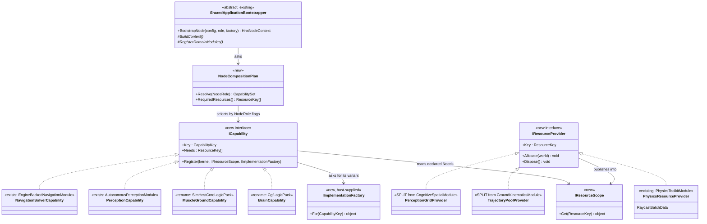

#### ⭐⭐ THE BOOT SEQUENCE — **resources before capabilities, dedupe before register**

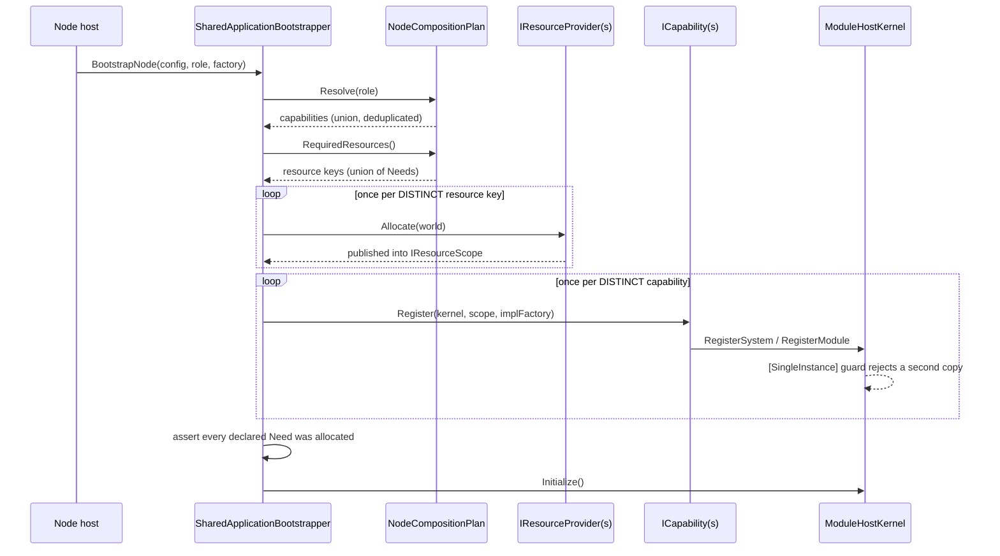

#### ⭐ THE BUILD SEQUENCE — **five items, each independently gateable**

| # | item | acceptance | risk |
|---|---|---|---|
| **B1** | ⭐⭐⭐ **`[SingleInstance]` + the guard in `SystemScheduler.RegisterSystem`** | a rail registers `UnitHierarchySystem` twice and the guard **throws**; the existing suites stay green | ⭐ low — opt-in, and it **must** land first: the union is unsafe without it |
| **B2** | **one generic `SingleSystemModule`**; delete `IgUnitHierarchyModule` and `SimHostModule` | both hosts still register their systems in the same phases; `TheDebugProviders…` rails green | ⭐ low |
| **B3** | ⭐⭐ **split the four fused modules** — provider out, capability left | each provider allocates+disposes; each capability's ctor **receives** the resource; no system signature changes *(measurement ② says none are needed)* | ⚠ medium — **per-module**, one commit each |
| **B4** | **`ICapability` + `IResourceProvider` + the plan**, base composes; `CgfLogicPack`/`SimHostCoreLogicPack` renamed to Brain/MuscleGround capabilities | `--mode all` and the four-process cluster both reach `OperatingLive`; entity counts and component sets **unchanged** vs `CE-141`'s recorded baseline | 🔴 **high** — this is the switchover |
| **B5** | wire the **missing** implementations: Muscle's ActionDispatch executor set · `CombatModule` on Brain *(§4.1h ①)* | new behaviour ⇒ its **own** measurement and rails; ⛔ **not folded into B4** | 🔴 high, and **deliberately last** |

⛔ **B5 is behaviour change; B1–B4 must be behaviour-PRESERVING.** ⭐ The gate that proves it: the
four-process cluster run recorded in `DESIGN_Entity_Creation_Unification.md` §2.3c — **same 16 shared
components, same per-node counts, same destroy loop.**

⚠ **Still open, and deliberately so:** whether `Perception`/`NavigationSolver` should be *selectable today*
on the existing nodes, or stay dormant until a node is actually deployed in those roles. ⭐ `BS-1-DESIGN`
says the modules are ready; ⛔ **it does not say any current node should select them**, and giving SimHost
`AutonomousPerceptionModule` alongside `CognitiveSpatialModule` would double-register four systems — 📌
**exactly what B1 exists to catch.** ⇒ **a deployment decision, not a composition one.**

### 4.1k 🔴🔴 CORRECTION — **STRIDE IS THE FOUR-ROLE NODE, AND IT IS HANDED NOTHING** *(user challenge, `2026-09-03`)*

> ⛔⛔⛔ **SUPERSEDED IN PART BY §4.1L** *(`2026-09-03`, second user challenge)*. ⭐ **Everything below is
> TRUE OF THE CLASS `StrideNodeBootstrapper` and FALSE OF STRIDE THE NODE.** 🔴 That class has **no
> production construction at all** — it is dormant. The **live** Stride composition is
> `EditorStrideSubsystem`, and its role slots are **FULL**. ⇒ ⭐ **Do not quote "every slot is empty" as a
> statement about Stride.** ⚠ The three corrections ①–③ and the `B1`/`B4`/`B5` consequences below **survive**;
> only the "handed nothing" headline does not. 📄 **Read §4.1L first.**

> 🔒 **User:** *"isn't perception / navigation solver already used by stride subsystem?"*
>
> ⭐⭐⭐ **The challenge is right and it corrects TWO of my statements.** ⛔ §4.1f recorded Stride as
> registering *"the creation tier only"*, and §4.1j said the Perception/NavigationSolver capabilities are
> *"dormant because no node has ever been deployed in those roles."* 📐 **Both were measured on
> REGISTRATIONS. The DECLARATION says something else.**

#### 📐 What `StrideNodeBootstrapper` actually declares

```csharp
/// <summary>Combined node role for all Stride-hosted node responsibilities.</summary>
public static readonly NodeRole Role =
    NodeRole.MuscleGround | NodeRole.Perception |
    NodeRole.NavigationSolver | NodeRole.ImageGenerator;

private readonly IEcsModule? _kinematicsModule;
private readonly IEcsModule? _perceptionModule;
private readonly IEcsModule? _combatModule;
private readonly IEcsModule? _navigationModule;

public StrideNodeBootstrapper(
    IEcsModule? kinematicsModule = null,
    IEcsModule? perceptionModule = null,
    IEcsModule? combatModule     = null,
    IEcsModule? navigationModule = null)
```

⇒ ⭐⭐⭐ **Stride is a genuine FOUR-ROLE node with a per-role module slot for each** — 🔒 the concrete
instance of the user's *"a concrete node often combines multiple roles"*, which the rest of this design had
**asserted without an example**.

#### 🔴 AND EVERY SLOT IS EMPTY — **the only two constructions in the repo are TESTS, with all four `null`**

📐 `grep 'new StrideNodeBootstrapper'` across the whole tree, `Stride/` included:

| site | arguments |
|---|---|
| `Hrot.NodeComposition.Tests/StrideNodeBootstrapperTests.cs:38` | `new StrideNodeBootstrapper()` ⇒ **all four null** |
| `…:53` | `new StrideNodeBootstrapper()` ⇒ **all four null** |
| ⛔ **production** | 🔴 **NONE** |

⇒ ⭐⭐⭐ **Stride declares `MuscleGround|Perception|NavigationSolver|ImageGenerator` and receives the modules
for NONE of them.** ⛔ **The purest instance yet of `CLAUDE.md`'s silent-default family** — the parameters
exist, the role declaration is explicit and correct, and **every caller passes nothing.** ⚠ Worse than the
usual shape: here there is no production caller *at all*, so the declaration has never been honoured.

#### ⭐⭐ WHAT THIS CHANGES — three corrections, and the design gets STRONGER

| # | correction |
|---|---|
| **①** | ⛔ **§4.1f's "Stride registers the creation tier only" was true but MISLEADING.** ⭐ It registers only that **because its four role-module slots are null** — not because it is a presentation-only node. ⇒ **the row is now explained, not just observed** |
| **②** | ⛔ **§4.1j's "no node has ever been DEPLOYED in those roles" is WRONG.** ⭐ A node **declares** them today. ⇒ the honest statement: **the roles are declared and unfilled**, which is a *stronger* argument for the composition work, not a weaker one |
| **③** | ⭐⭐⭐ **Stride's ctor IS axis ③ (`IImplementationFactory`), hand-rolled** — four nullable per-role module slots, host-supplied. 🔒 It is exactly *"respecting possible different implementations (simhost vs stride)"*, already attempted. ⇒ ⛔ **the design is not introducing a new idea; it is generalising one that exists and was never wired** — 📌 the seam law for a **third** time in this programme |

#### ⭐⭐ CONSEQUENCES FOR THE BUILD SEQUENCE

| | |
|---|---|
| ⭐⭐ **`B4` gains a concrete acceptance case** | ⛔ Previously *"the four-process cluster is unchanged"* — behaviour-preserving only. ⭐ **Now `B4` can be proven POSITIVELY**: a plan resolving `StrideNodeBootstrapper.Role` must yield **MuscleGround + Perception + NavigationSolver** capabilities, where today it yields **nothing**. ⇒ a real before/after, not just an absence of regressions |
| ⚠ **but it stays BEHAVIOUR-PRESERVING** | ⛔ **Filling Stride's slots is `B5`, not `B4`.** 📐 Giving a live Stride node kinematics + perception + navigation is exactly the kind of change §4.1h warned about — new systems ticking on a host that never ran them. ⭐ `B4` proves the **plan resolves correctly**; `B5` acts on it |
| ⭐ **and `B1` is vindicated again** | ⚠ Stride is `MuscleGround\|Perception` — **the two roles whose module sets OVERLAP** *(`CognitiveSpatialModule` ⊃ `AutonomousPerceptionModule`; both carry `LocalGridBuilderSystem`, `VisionBroadphaseSystem`, `LosRequestBatchingSystem`, `SensorTrackDebounceSystem`)*. ⇒ 🔴 **the first real node to select two roles is the one that would double-register four systems** — `[SingleInstance]` must land before Stride's slots are ever filled |

⚠ **Still not measured:** whether `Stride/`'s own game host constructs a bootstrapper by some other path
*(a DI container, a factory)*. 📐 `grep 'new StrideNodeBootstrapper'` finds nothing in `Stride/`, and
`grep 'NodeRole.'` finds **no** hits in the `Stride/` tree at all — ⛔ but a negative from grep over an
out-of-solution tree is weaker than one over compiled code, and `check_index_coverage` is unavailable
through the CLI. ⇒ ⭐ **stated as measured-by-grep, not as proven.**

#### ⚠ AND ONE CONCERN INSIDE THE ORDER IS STILL PER-HOST FOR A REASON

📐 **Phase 5, orchestration handlers.** The handler *classes* are shared, but the **list and its ORDER** are
hand-built per host: `CgfSubsystem` **9** `RegisterHandler` calls, `EditorSubsystem` **6**,
`IgNodeBootstrapper` **6**. ⛔ And CGF constructs a **second `ClusterSlave`** at `:793-794` — its own comment
says *"Create a fresh ClusterSlave manually to strictly control handler registration order"*, discarding the
builder's. ⇒ ⭐ **an ordering dependency nothing declares**, which is the shape a shared list cannot absorb
until the dependency is expressed. ⚠ **Not scheduled here** — recorded so phase N does not discover it late.

#### ⭐ Out of scope, stated so it is not mistaken for a gap

📐 `ReplayBrowserSubsystem` has **zero** `ModuleHostKernel`/`RegisterGlobalSystem` references — it is a
**viewer**, not an ECS node. ⭐ It composes `MapInteractionPack` and nothing else from this block.

⭐ **Dissolution, not extraction, for `IEditorLogic`** *(approved)*: 📐 128 ln / ~15 members, `EditorApplication`
297 ln of one-line delegations, **zero** code references from `AiShared`, ~3 members genuinely editor-only.
📌 `CE-060` dissolved one call in **one line** by publishing the event it already wrapped.

### 4.1L 🔴🔴🔴 `CE-165` — **THE SLOTS ARE FULL, AND THE RUNNING EDITOR DOUBLE-TICKS TWO SYSTEMS TODAY** *(second user challenge, `2026-09-03`)*

> 🔒 **User:** *"for sure the slots are not empty; check the stride game host for a DI or factory
> construction path; use codebase memory (which you should be doing the whole time — see claude.md)."*
>
> ⭐⭐⭐ **Right on both counts, and the process criticism is the more important one.** ⛔ §4.1k's negative
> claim *("the only two constructions are TESTS")* was made from **grep alone** — a `search_code` call
> immediately returned `Stride/HrotStrideApp.Game/StrideHrotGame.cs`, a file the grep never showed.
> ⚠ That is exactly the `INVENTORY`-before-claim rule, and it was skipped on a **negative** claim, which is
> the one shape grep can never settle.

#### ⭐⭐ ① THE CORRECTION — **`StrideNodeBootstrapper` is DORMANT; the live Stride node is `EditorStrideSubsystem`**

| claim | verdict | evidence |
|---|---|---|
| *"no production construction of `StrideNodeBootstrapper`"* | ✅ **still true** — but it is a statement about a **dormant class**, not about Stride | `StrideHrotGame.cs:266 AttachBootstrapper(StrideNodeBootstrapper)` sets the only field; ⛔ **`AttachBootstrapper` itself has NO caller** — the sole other mention is a doc reference |
| ⛔ *"Stride's four role slots are empty"* | 🔴 **WRONG about the node** | the **live** composition is `EditorStrideSubsystem.Initialize`, and it fills them |
| *"Stride registers the creation tier only"* *(§4.1f)* | 🔴 **WRONG** | `EditorStrideSubsystem:646` builds **`CgfLogicPack` (Brain)**, `:663` builds **`StrideMuscleModules.Build(...)` (MuscleGround)**, `:642` **`OrchestrationLogicPack`**, plus the creation tier |

⭐⭐⭐ **And `StrideMuscleModuleSet` IS axis ③ in production, already:** it is `SimHostCoreLogicPack`'s
content with **`GroundKinematicsModule` swapped for `StrideKinematicsModule`** — 🔒 the user's *"respecting
possible different implementations (simhost vs stride)"*, built and running. ⭐ The remaining gap is
**declared in the code itself**: `EditorStrideSubsystem`'s header says *"**Muscle (P0 stub)**:
`SimHostCoreLogicPack` registered directly. ⚠ SEAM (P1): Replace `SimHostCoreLogicPack` with
`StrideKinematicsModule` (STR-P1-T1)"* ⇒ ⛔ **the design is not inventing axis ③; it is generalising a seam
the Stride lane already named and half-built.** 📌 The seam law, a **fourth** time in this programme.

#### 🔴🔴🔴 ② THE FINDING — **FOUR composition roots fuse Brain+Muscle. THREE dedupe. THE RUNNING EDITOR DOES NOT.**

📐 Both packs carry the same two systems — measured, not inferred:

| system | in `CgfLogicPack` | in `SimHostCoreLogicPack` |
|---|---|---|
| `UnitHierarchySystem` | ✅ `:162 simList.Add(_unitHierarchySystem)` | ✅ `:137 simList.Add(_unitHierarchySystem)` |
| `EqsResultUpdateSystem` | ✅ `:165 simList.Add(new EqsResultUpdateSystem())` | ✅ `:138 simList.Add(new EqsResultUpdateSystem())` |

⇒ **any root that concatenates the two pack lists registers each twice unless it dedupes.** 📐 The roots:

| # | composition root | fuses | dedupe? |
|---|---|---|---|
| ① | `EditorStrideSubsystem` *(Stride, live)* | `CgfLogicPack` + `StrideMuscleModuleSet` | ✅ **type-keyed** — `EditorStrideSimulationModule:1692` `seen.Add(sys.GetType())` |
| ② | `StrideMuscleModule.RegisterSystems` *(the injected arm)* | the muscle set only | ✅ type-keyed `:232` — ⚠ **but scoped to the muscle set; it cannot see the CGF list** |
| ③ | `EditorHarness` *(`ClusterRunner.Integration.Tests:239`)* | `CgfLogicPack` + `SimHostCoreLogicPack` | ✅ type-keyed `:389` |
| ④ | 🔴🔴 **`EditorSubsystem` — the RUNNING `Hrot.Editor`** | `CgfLogicPack` + `SimHostCoreLogicPack` | ⛔⛔ **NONE** |

📐 **Root ④'s chain, every hop measured, no dedupe at any of them:**
`EditorSubsystem:1352 muscleSimSystems = simHostCorePack.SimulationSystems`
→ `:1390 cgfLogicPackInst.SimulationSystems.Concat(muscleSimSystems)`
→ `BlueprintRuntimeWiring.SpliceIntoSimulation:107` — a plain `new List<>(…)` + one `Insert`
→ `TogglableSimulationGroup` — a plain array, `:69 foreach (var sys in _innerSystems) sys.Execute(…)`
→ `EditorSimulationModule(toggleSim)` *(`:1433`, a one-arg wrapper — **not** the two-arg deduping class of root ③)*.

⛔ **And the default arm is the production arm:** `:1341 if (MuscleModuleFactory == null)` builds
`SimHostCoreLogicPack`, and 📐 `MuscleModuleFactory` has **no production setter** — the only assignment in
the tree is `Stride/HrotStrideApp.Game.Tests/EditorSubsystemHeadlessBootTests.cs:109`.

#### 🔴 ③ IT IS CORRUPTING, NOT MERELY WASTEFUL — **and the harness that mirrors it CANNOT SEE IT**

📐 `UnitHierarchySystem.ProcessAssignSubordinates` reads `repo.Bus.Read<CmdAssignSubordinate>()` — a
**non-destructive frame read**, so a second instance in the same phase sees the same events. On that second
pass, for a subordinate already assigned to the **same** commander:

```csharp
if (repo.HasComponent<UnitSubordinate>(sub)) {
    var current = repo.GetComponent<UnitSubordinate>(sub);
    if (!current.Commander.Equals(cmd))
        RemoveFromHierarchy(repo, sub);      // ⛔ same commander ⇒ NO branch taken, and NO `continue`
}
…
roster.SubordinateEntities[roster.Count] = (long)sub.PackedValue;   // 🔴 UNGUARDED APPEND
roster.Count++;
```

⇒ 🔴 **one `CmdAssignSubordinate` yields TWO roster entries for one subordinate, and `Count` is 2.**
⚠ At `UnitRoster.Capacity` this also halves the real capacity and trips the rejection path early.
⛔ `EqsResultUpdateSystem`'s double-tick harm is **not measured** — it is epoch-guarded, so it is plausibly
idempotent; ⭐ stated as unknown rather than asserted either way.

⭐⭐⭐ **Why no test catches it: root ③ — `EditorHarness`, the integration harness that exists to mirror the
editor — HAS the guard the editor lacks.** ⇒ 📌 the `RAIL-BLINDNESS` pattern of §7, a **fourth** instance,
and the sharpest yet: the harness is not merely blind to the defect, **it is blind because it fixed it
locally and the production root did not.**

#### ⭐⭐⭐ ④ WHAT THIS CHANGES IN THE BUILD SEQUENCE — **`B1` is now CORRECTIVE**

| | before | after |
|---|---|---|
| ⭐⭐⭐ **`B1` (`[SingleInstance]` + a central duplicate check)** | a **prophylactic** guard for a hazard §4.1g ② predicted would appear once roles were composed | 🔴 **a FIX for a defect that ships today in `Hrot.Editor`** ⇒ ⭐ it needs a **rail that reproduces the double roster entry first**, and an inverse-edit red-proof — not just a registration-count assertion |
| ⭐⭐ **the three local `HashSet<Type>` guards** | unremarked | ⭐⭐ **they are the prior art, and they are the argument**: three independent authors each hand-rolled the same type-keyed dedupe at the same seam. 🔒 That is the seam law's *"we need a shared X"* ⇒ **X exists three times, under-adopted, and the one place it is missing is production** |
| ⭐ **`B1` scope** | *"opt-in `[SingleInstance]`"* | ⭐ unchanged and **still opt-in** *(§4.1g's caution stands — a blanket ban would hit legitimately multi-instance systems)*. ⭐⭐ But `UnitHierarchySystem` and `EqsResultUpdateSystem` are its **first two attributed types**, chosen by measurement |
| ⚠ **ordering** | `B1` first, on general grounds | ⭐ **confirmed, and now urgent for a second reason** — root ① is `MuscleGround\|Perception`, the pair whose module sets overlap *(§4.1k)*; ⛔ `B1` must land before Stride's remaining slots are filled **and** to fix root ④ |

#### 📐 THE CLAIM TABLE

| the correction rests on | code — how it IS | design basis — how it was MEANT to be |
|---|---|---|
| `StrideNodeBootstrapper` has no production construction | ✅ `StrideHrotGame.cs:266`, `AttachBootstrapper` callerless | ⛔ searched `docs/` + `.dev/`, none found — it is undeclared dormancy |
| the live Stride root is `EditorStrideSubsystem` and its role slots are full | ✅ `:646` Brain, `:663` MuscleGround, `:642` orchestration | ✅ its own header — *"Brain (CGF) … Muscle (P0 stub) … ⚠ SEAM (P1) … (STR-P1-T1)"* |
| both packs carry `UnitHierarchySystem` + `EqsResultUpdateSystem` | ✅ `CgfLogicPack:162,165` · `SimHostCoreLogicPack:137,138` | ✅ §4.1h — they are **capabilities**, role-independent; the duplication is pack drift |
| roots ①②③ dedupe by type, root ④ does not | ✅ `:1692` · `:232` · `:389` vs `SpliceIntoSimulation:107` + `TogglableSimulationGroup:69` | ⛔ searched, no design records a dedupe obligation — ⭐ **that absence IS the finding** |
| the editor takes the default (SimHost) muscle arm in production | ✅ `:1341`; `MuscleModuleFactory` set only at `EditorSubsystemHeadlessBootTests.cs:109` | ✅ `:1330` — *"MuscleModuleFactory == null -> EXACTLY the code that was here before"* (`ST-010`) |
| the double tick corrupts the roster | ✅ `UnitHierarchySystem.cs:107-140`, `Bus.Read` is a frame read | ✅ `UnitRoster.cs:18` — overflow is *"rejected … with a diagnostic warning"*, i.e. `Count` is trusted |
| `EqsResultUpdateSystem`'s double tick is harmful | ⛔ **NOT MEASURED** — epoch-guarded, plausibly idempotent | ⛔ not searched |
| ⚠ `check_index_coverage` was NOT run | — | ⛔ **unavailable through the CLI in this session**; the exhaustive claim *"four roots"* rests on `search_code` + grep together, not on coverage |

#### ⛔ ALSO CORRECTED: §4.1's layer table

⛔ It says *"CGF and the Editor re-run the order inline"* — **two**. 📐 There are **three** inline composition
roots: `CgfSubsystem`, `EditorSubsystem`, and `EditorStrideSubsystem`; ⭐ `EditorHarness` is a fourth if
test harnesses are counted, and §4.1L ③ is the reason they should be.

### 4.1M 📐 THE REGISTRAR INVENTORY — **measured `2026-09-03`. ⛔ NO DESIGN CONCLUSIONS IN THIS SECTION.**

> 🔒 **User ruling, `2026-09-03`, verbatim:** *"the tiers should not be prefabricated. we need flexible
> composition but unified to very high extent. **Tier = a composition of shared parameterized
> registrars/initializers.**"*
>
> ⛔⛔ **This SUPERSEDES the "two families" framing of §4.1L ② and the "three tiers" table** *(ECS node /
> cluster participant / viewer)* that a chat reply proposed on the same day. ⭐ Both were **partitions**,
> and a partition is an input a host gets sorted into. ⭐⭐⭐ **A tier is an OUTPUT — the set of registrars a
> host happened to compose.** ⚠ The tables below therefore enumerate **units and their users**; they do
> **not** classify hosts.
>
> ⭐⭐ **Why this section contains no recommendation.** 🔒 User, same day: *"every time i ask about some
> persuading question you significantly change your suggestion."* 📐 Measured cause, three times in one
> session: **the local question was measured, and the CONCLUSION rested on something never opened**
> *(the live Stride path · the base class itself · a mechanism, where only traits had been measured)*.
> ⇒ ⭐ this section is the enumeration that must precede the design, per `INVENTORY-BEFORE-DESIGN`.
> ⛔ **Do not add a build sequence here.**

⭐ **Reproduce it:** `python3 scripts/composition-inventory.py` *(the script states its own imprecision —
counts are LOWER BOUNDS; `HashSet` is a regex false positive)*. Corroborated with `search_graph`:
**16** `*Pack` classes, **3** `*LogicPack`, **87** distinct `*Module` names.

#### ① THE COMPOSITION ROOTS — **nine, and the spread is the finding**

| root | file | units composed |
|---|---|---|
| **Editor** *(inline)* | `Hrot.Editor/EditorSubsystem.cs` | 🔴 **54** |
| **CGF** *(inline)* | `Hrot.CGF/CgfSubsystem.cs` | **30** |
| **EditorHarness** *(TEST)* | `Hrot.ClusterRunner.Integration.Tests/EditorHarness.cs` | **16** |
| **Stride editor** *(inline)* | `Stride/HrotStrideApp.Game/EditorStrideSubsystem.cs` | **14** |
| **IG** *(base subclass)* | `Hrot.IG/IgNodeBootstrapper.cs` | **10** |
| **SimHost** *(base subclass)* | `Hrot.SimHost/SimHostNodeBootstrapper.cs` | **9** |
| **ReplayBrowser** | `Hrot.ReplayBrowser/ReplayBrowserSubsystem.cs` | **7** |
| **ExCon** | `Hrot.ExCon/ExConSubsystem.cs` | **6** |
| **Stride node** *(base subclass, DORMANT)* | `Hrot.NodeComposition/StrideNodeBootstrapper.cs` | **4** |

⚠ **A raw count mixes concerns** — the Editor's 54 include UI registries and adapters, not only ECS
composition. ⭐ The count is reported because the **6× spread** is itself the measurement.

#### ② WHAT IS ALREADY SHARED — **45 units used by ≥2 roots** *(44 real; `HashSet` is the false positive)*

| users | unit | roots |
|---|---|---|
| **7** | `BehaviorRegistry` | SimHost · StrideNode · CGF · Editor · StrideEd · ReplayBrowser · Harness |
| **6** | `ClusterSlave` | IG · CGF · Editor · StrideEd · **ExCon** · Harness |
| **6** | ⭐⭐⭐ **`EntityCreationPack`** | SimHost · IG · StrideNode · CGF · Editor · StrideEd |
| **5** | `SimHostModule` | SimHost · StrideNode · Editor · StrideEd · Harness |
| **4** | `CgfLogicPack` · `LocalDiskStorageProvider` · `PhysicsToolkitModule` · `TacticalIntentMapperRegistry` | |
| **3** | `CognitiveSpatialModule` · `EcsRecordReplayController` · `EntityLifecycleModule` · `MapInteractionPack` · `ScenarioEditorModule` · `SimHostCoreLogicPack` | |
| **2** | 30 further units — orchestration *(`OrchestrationLogicPack`, `ClusterMaster`, `ListenerRecordReplayController`, `NodeBootstrapper`)*, map *(`MapCullingModule`, `StyleResolutionModule`, `GizmoInteractionModule`)*, editor tooling *(11 registries/providers/adapters)*, diagnostics *(`SubsystemDebugProvider`, `DebugSnapshotProvider`)* | |

#### ③ SINGLE-ROOT UNITS — **28, i.e. what is genuinely host-specific today**

| root | n | units |
|---|---|---|
| Editor | **14** | `AppExitPromptController` · `BTreeTraceLaneProvider` · `BlueprintLiveValueProvider` · `BlueprintNodeDrawerRegistry` · `BlueprintPeerSourceProvider` · `EditorLogicSessionAdapter` · `EditorMapPickAdapter` · `EditorZoneAdapter` · `EqsTemplateRegistry` · `HsmTraceLaneProvider` · `LiveBlackboardValueProvider` · `LiveSessionRegistry` · `MasterSyncTimeControllerAdapter` · `StorageGatewayModule` |
| CGF | 4 | `CanvasMapPickAdapter` · `CgfClusterDebugTimeController` · `CgfSimulationModule` · `ClusterTimeTransportAdapter` |
| IG | 3 | `HistoryTrailModule` · `IgUnitHierarchyModule` · `MapLayerModule` |
| Stride editor | 3 | `DotRecastDtCrowdProvider` · `EditorStrideSimulationModule` · `StrideMuscleModules` |
| ExCon | 2 | `SlaveSyncController` · `TimeNetworkModule` |
| SimHost | 1 | `EngineBackedNavigationModule` |
| ReplayBrowser | 1 | `RepositoryAdapter` |

#### ④ ⭐⭐⭐ TWO REGISTRAR SHAPES ALREADY EXIST IN PRODUCTION

⭐⭐ **Shape A — context object + static `Build` + `Validate` + omission reporting.** ⛔ Two instances only:

| | |
|---|---|
| `EntityCreationPack.Build(EntityCreationContext ctx)` | `:70`, opens with `ctx.Validate()` |
| `MapInteractionPack.Build(MapInteractionContext ctx)` | `:53`, same shape |
| ⭐ the context is the **parameterisation** | `EntityCreationContext`: **6 `required`** *(`World`, `EntityMap`, `TkbDb`, `IdAllocator`, `Elm`, `NodeId`)* + **8 optional `init`** *(`IsBroadcastArbiter`, `NetworkRequestSource`, `RequestEgress`, `AckSink`, `ExtraTranslators`, `TranslatorPlacements`, `JsonAttributeCompiler`, `OwnershipStrategy`)* |
| ⭐⭐ and it REPORTS what the host failed to schedule | `EntityCreation.Unserviceable(scheduled)` — *"an omission is loud instead of silent"* |

⭐ **Shape B — positional constructor with optional args defaulting to null.** The capability modules:

| unit | signature |
|---|---|
| `CgfLogicPack` | `(BehaviorRegistry, NetworkEntityMap, ScenarioEntityCreationRequestSource, TacticalIntentMapperRegistry, VehicleAPI? = null)` |
| `SimHostCoreLogicPack` | `(NetworkEntityMap, RoadNetworkBlob = default, TrajectoryPoolManager? = null, FormationTemplateManager? = null)` |
| `CognitiveSpatialModule` | `(EntityRepository liveWorld, Func<ISimulationView,Entity,float>? colliderRadiusReader = null)` |
| `EngineBackedNavigationModule` | `(RoadNetworkBlob roadNetwork, TrajectoryPoolManager pool)` |
| `OrchestrationLogicPack` | `(ClusterSlave clusterSlave)` |

#### ⑤ 📌 FIVE FACTS THIS ENUMERATION ESTABLISHES — ⛔ **facts, not a plan**

| # | |
|---|---|
| **1** | ⭐⭐⭐ **`EntityCreationPack` is already a shared parameterized registrar adopted by SIX roots** — the `P1` work finished `2026-09-03`. ⇒ the user's model is **not a new mechanism**; one instance of it is shipped and verified on a live four-process cluster |
| **2** | ⭐⭐ **Shape A exists twice, Shape B five-plus times.** ⛔ Which shape a unit uses correlates with nothing but its age |
| **3** | ⚠ **Shape B's optional-null arguments are the silent-default family** `CLAUDE.md` names. ⛔ **NOT measured here: whether any production caller HOLDS such a value and fails to pass it** — that is the checkable form of the rule and it needs its own pass |
| **4** | ⭐ **`ClusterSlave` has 6 users including ExCon, which composes no ECS at all.** 📐 `ExConSubsystem:257` builds it directly on its own bus; `:342` passes `NodeRole.None` |
| **5** | ⭐ **`TkbTranslatorSet` is now referenced by 3 roots** *(SimHost, IG, CGF)* **plus the creation pack's own three files** — the rest reach it through `EntityCreationPack` |

#### ⛔ WHAT THIS SECTION DOES **NOT** ESTABLISH

| ⛔ | |
|---|---|
| **the ordering constraints** | which of `SharedApplicationBootstrapper`'s phase orderings are **essential** *(components before serializer, groups before orchestration, translators before `Initialize`)* versus incidental. ⭐⭐ **That knowledge is the valuable part of the base class and any registrar model must carry it as declared dependencies.** ⛔ **Unmeasured — and it is the blocking input for a build sequence** |
| **the concern grouping** | the units above are listed by USER COUNT, not by concern. ⛔ Grouping them is a design act and is deliberately not done here |
| **completeness** | ⚠ text extraction with lower-bound counts; `check_index_coverage` is unavailable through the CLI |

### 4.1N 📐 THE ORDERING-CONSTRAINT PASS — **which of the base's phase orderings are REAL** *(measured `2026-09-03`)*

> ⭐⭐ **This is the input §4.1M named as blocking.** A registrar model replaces a hard-coded phase list
> with **declared dependencies**; that is only safe once you know which orderings carry a dependency and
> which are habit. ⛔ Still no build sequence here — this is the second measurement pass.

⭐ **Method:** for each phase of `SharedApplicationBootstrapper.BootstrapNode` *(327 ln)*, trace what it
CONSUMES and what it PRODUCES, and classify the edge as **ARG** *(a value is passed)*, **HIDDEN** *(the
value travels through a field, not a signature)*, **ENFORCED** *(violating it throws)*, or
**INCIDENTAL** *(no dependency found)*.
⚠ **A stated reason in a comment is a CLAIM, not evidence** — each was checked against the code it
describes, and one nearly went the wrong way *(see §4.1N ② row 3)*.

#### ① THE PHASE GRAPH — **as measured, not as documented**

| phase | what it does | depends on | kind | evidence |
|---|---|---|---|---|
| **1** | `BuildContext` → `context` | — | root | everything downstream takes `context` |
| **1b** | `ConfigureForNode(context, role, registry)` → `configuredFactory` | 1 | ARG | read at 6b and by `TimeControl` |
| **2** | `RegisterDomainComponents(context.World)` | 1 | ARG | takes `context.World` |
| **3** | `BuildSerializer` → `serializer` | ⭐⭐ **2** | 🔴 **GLOBAL SNAPSHOT — silent if violated** | `FdpAutoSerializer.Build():93` iterates `ComponentTypeRegistry.GetSnapshotableTypeIds()` and **freezes** `_entries`. A component registered after this is **silently absent from serialization** |
| **4a** | `PopulateSystems` → 3 lists → 3 togglable groups, registered | 1 | ARG | produces `simGroup`/`postSimGroup` for 5 |
| **4b** | `GetAdditionalModules()` → `RegisterModule` | — | ⭐ **INCIDENTAL** | no consumer found; only "before 7" |
| **5** | `BuildOrchestration(context, simGroup, postSimGroup, serializer)` → `ClusterSlave` | **3 + 4a** | ARG | both are literal arguments |
| **5-post** | the `CE-164` invariant | 5 | ARG | asserts on `slave` |
| **6a** | `BaseModules` + `RegisterSpawningPipeline` | 1, ⚠ **+4a** | 🔴 **HIDDEN** | `SimHostNodeBootstrapper:350` reads `CoreLogicPack!`, assigned at `:203` **inside 4a**. ⛔ **NOT on 5** — measured: **0** `ClusterSlave` references in all three `RegisterSpawningPipeline` overrides |
| **6a+** | `RegisterModule(context.NedReplication)` | 1 | ARG | ⚠ *also a UNIQUENESS rule:* *"Subclasses must NOT call `RegisterModule(context.NedReplication)` — double-registration corrupts the system schedule"* |
| **6b** | `RegisterNetworkTranslators` | 1b, ⚠ **6a+**, ⚠ **4a** | 🔴 **HIDDEN ×2** | reads `context.GhostCreationSystem` — `HrotNodeBuilder:215`: *"populated by `NedReplicationModule` after `Build()`"* ⇒ **6a+**; and `CoreLogicPack!.TrajectoryPool` ⇒ **4a** |
| **6c** | `SlaveTimeTranslatorRegistration.RegisterOn` + `TimeControl` | 1 (+1b) | ⭐ **INCIDENTAL** vs 6a/6b | needs only kernel · participant · bus · nodeId |
| **6d** | `RegisterApplicationSystems` | — | ⭐ **INCIDENTAL** | virtual, no-op default; only "before 7" |
| **7** | `Kernel.Initialize()` | every registration | 🔴 **ENFORCED** | `ModuleHostKernel.cs:165-166` throws *"Cannot register systems after Initialize() called"* |
| **7+** | `PostInitialize` | **7** | 🔴 **ENFORCED** | `EngineBackedNavigationModule.cs:63-65` throws *"Call RegisterSystems before RegisterProviders."* |

#### ② 🔴🔴🔴 THE HEADLINE — **THREE REAL DEPENDENCIES TRAVEL THROUGH CHANNELS THE BASE DOES NOT EXPRESS**

| # | channel | instance | ⛔ how it fails |
|---|---|---|---|
| **①** | ⭐⭐⭐ **a SUBCLASS FIELD** | `CoreLogicPack` — **written in 4a** *(`:203`)*, **read in 6a** *(`:350`)* **and 6b** *(`:385`)* | the base's signatures show **no** 4a→6a/6b coupling at all. ⚠⚠ **CORRECTED `2026-09-03` — this row originally added *"19/14/15 fields ⇒ the channel is wide"* and §4.1N ④ predicted *"more channels are likely."* 📐 BOTH WERE WRONG. A full cross-phase field-flow pass over all three bootstrappers found exactly TWO flows, both on SimHost and both 4a→6a/6b: `CoreLogicPack` and `RoadNetwork` *(`:201` write, `:358` read)*. ⭐⭐ **IG and Stride have NONE.** ⇒ the channel is **narrow and host-local**, not systemic — see §4.1O ①** |
| **②** | ⭐⭐⭐ **a CONTEXT FIELD MUTATED BY A REGISTRATION SIDE EFFECT** | `context.GhostCreationSystem` is `null` at build *(`HrotNodeBuilder:215`)* and is populated **by registering `NedReplicationModule`** (6a+); **read at 6b** | a translator built from a null gets wired to nothing — **silent** |
| **③** | ⭐⭐⭐ **a GLOBAL STATIC SNAPSHOT** | `ComponentTypeRegistry` → **frozen** into `FdpAutoSerializer._entries` at 3 | a late component is **silently unserialized** — no throw, no log |

⇒ ⭐⭐⭐ **A registrar model that declares dependencies only over its explicit inputs and outputs would
lose ALL THREE — and each fails SILENTLY, not loudly.** ⛔ That, not the phase list, is the thing the
base class is really carrying, and it is the single most important constraint on the design.

⚠ **A near-miss worth recording, because it is this session's own failure mode.** Checking the Phase-2→3
comment by **signature** said *"no dependency"* — `BuildSerializer(BehaviorRegistry?)` takes no world,
and `ScenarioSerializer` touches `ComponentTypeRegistry` only inside `Serialize`/`Deserialize`
*(`:419`, `:513`, `:525`)*, i.e. at USE. ⭐ It was about to be filed **INCIDENTAL**. Reading one level
deeper — `ScenarioSerializerBuilder.Build()` → `FdpAutoSerializer.Build()` — showed the freeze at `:93`.
🔒 **The rule this yields: an ordering claim is settled by the callee's BODY, never by its signature.**

#### ③ ⭐ WHAT IS ACTUALLY FREE — **three of the orderings are habit**

| | |
|---|---|
| ⭐ **4b** `GetAdditionalModules` | no consumer found; constraint is only *"before 7"* |
| ⭐ **6c** time-sync registration | needs only Phase-1 values; its position between 6b and 6d is arbitrary |
| ⭐ **6d** `RegisterApplicationSystems` | virtual no-op; only *"before 7"* |
| ⭐⭐ **and 5 → 6a is NOT a dependency** | 📐 measured: `RegisterSpawningPipeline` never reads `ClusterSlave` in any of the three subclasses ⇒ 6a may precede 5 |

#### ④ 📐 THE CLAIM TABLE

| claim | code — how it IS | design — how it was MEANT |
|---|---|---|
| 2→3 is a real, silent-failure constraint | ✅ `FdpAutoSerializer.cs:93` freezes from the registry snapshot | ✅ the base's own comment at `:73` states it; now corroborated |
| 7 last is enforced, not convention | ✅ `ModuleHostKernel.cs:165-166` throws | ✅ base comment *"Always last"* |
| 7+ after 7 is enforced | ✅ `EngineBackedNavigationModule.cs:63-65` throws | ✅ base comment names this exact module |
| 4a→6a/6b rides a subclass field | ✅ `SimHostNodeBootstrapper.cs:203` write · `:350`, `:385` reads | ⛔ **searched, no design records this channel** |
| 6a+→6b rides a mutated context field | ✅ `HrotNodeBuilder.cs:215` comment + `:385` read | ⛔ searched, none found |
| 5→6a is not a dependency | ✅ 0 `ClusterSlave` hits in all three overrides | ⛔ searched, none found |
| ⛔ the OTHER subclasses' hidden field flows | ⛔ **NOT ENUMERATED** — SimHost was traced end to end; IG and Stride were spot-checked only. 📐 19/14/15 fields declared ⇒ more channels are likely | ⛔ not searched |

⚠ **That last row bounds this pass:** the *kinds* of hidden channel are established and each is evidenced;
⛔ **the full per-subclass field-flow enumeration is a further pass** and must happen before any host is
migrated, because a missed field is a silent break.

### 4.1O ⭐⭐⭐ THE APPROACH COMPARISON — **five candidates, measured criteria, one pick** *(`2026-09-03`)*

> 🔒 **User, `2026-09-03`, verbatim:** *"I am not forcing into any concrete direction. I am asking those
> question to force you to think about all possibilities and not miss any exiting user (host) and way of
> using. **Unification = avoiding unnecessary duplication while keeping composition flexibility.** No
> suggestion you provided was bad. We are looking for the 'optimal' one, fitting all our host, fitting our
> code structure etc."*

#### ① 📐 CLOSING MEASUREMENT — **the hidden-channel risk is SMALLER than §4.1N claimed**

⭐ A full cross-phase field-flow pass over all three bootstrappers *(fields written in one phase method
and read in another)*:

| host | cross-phase field flows |
|---|---|
| **SimHost** | ⭐ **2** — `CoreLogicPack` *(W `:203` in 4a → R `:350` 6a, `:385` 6b)* · `RoadNetwork` *(W `:201` 4a → R `:358` 6a)* |
| **IG** | ✅ **none** |
| **Stride node** | ✅ **none** |

⇒ ⛔⛔ **§4.1N's *"19/14/15 fields ⇒ the channel is wide"* and *"more channels are likely"* were WRONG**,
and that row is corrected in place. ⭐ The hidden subclass-field channel is **two fields on one host**,
both of the same shape *(a capability pack built in 4a, consumed by 6a/6b)*.
⚠ **Method:** the automated pass had a **brace-in-string** bug that mis-attributed constructor
assignments to `PostInitialize`; every flow reported here was **hand-verified** at the cited lines, and
the buggy script is deliberately not shipped.

⭐ **The other two channels of §4.1N ② stand unchanged**: `context.GhostCreationSystem` *(populated by a
registration side effect)* and the `ComponentTypeRegistry` → `FdpAutoSerializer` freeze.

📐 **And one more number that decides how much any approach can buy:** in the inline roots, composition is
a **minority of the file** — `EditorSubsystem` is **5432 ln** with `Initialize()` at **`:1884`** *(a
**3548**-line tail)*; `EditorStrideSubsystem` is **1699 ln** with `Initialize()` at **`:718`** *(a **981**-line
tail)*. ⇒ ⛔ **"put the editors on the base class" reorganises roughly the composition tenth of those
files and leaves the rest exactly where it is.**

#### ② THE CANDIDATES — **all five, including the two already rejected, so the space is visible**

| | approach | what a host writes |
|---|---|---|
| **A** | **status quo + targeted fixes** | its own composition, as today; duplicates fixed case by case |
| **B** | **every ECS host inherits `SharedApplicationBootstrapper`** | 7 abstract + 4 virtual overrides |
| **C** | **a standalone `Resolve(role)` plan function**, each root composes however it likes | a call to `Resolve`, plus its own wiring |
| **D** | ⭐ **registrar list** — composition is a LIST of shared parameterized registrars with DECLARED dependencies; one runner orders and runs them | a list + parameters |
| **E** | ⭐⭐ **D, with the existing base retained as the FIRST runner** and hosts migrated incrementally | today: nothing; then a list |

#### ③ 📐 THE COMPARISON — **scored on the user's two criteria plus fit**

| criterion | **A** | **B** | **C** | **D / E** |
|---|---|---|---|---|
| ⭐⭐⭐ **duplication removed** | ⛔ minimal — the **4** hand-rolled `HashSet<Type>` dedupes stay 4; the 45 shared units stay hand-wired per root | ⚠ **partial** — kills the hand-copy of Phase 4a+5 in 3 inline roots *(`EditorSubsystem:1366-1446` is exactly that copy)*, ⛔ but a host still hand-writes `new CgfLogicPack(…)` inside `PopulateSystems`, so the 45 units stay per-host | ⛔ only capability selection; the 4a+5 copy survives | ⭐⭐⭐ **maximal** — each shared unit is wired **once**, in its registrar; hosts name it |
| ⭐⭐⭐ **flexibility kept** | ⭐⭐⭐ total *(nothing is constrained)* | ⛔⛔ **lowest** — a host needing something at a NEW point needs a **base-class edit**, i.e. a shared-file change across lanes | ⭐⭐ high | ⭐⭐⭐ **highest** — a bespoke registrar is added **without touching shared code** |
| ⭐⭐⭐ **fits ALL nine roots** | ✅ trivially | ⛔⛔ **NO** — Phase 7 calls `Kernel.Initialize()`; **ExCon has no kernel** *(0 refs)* and **ReplayBrowser has neither kernel nor `ClusterSlave`* | ⚠ partly | ✅ **yes** — ExCon composes a short list *(cluster participation only)*, ReplayBrowser a shorter one |
| ⭐⭐ **fits the code structure** | ✅ | ⚠ template-method, already the shape for 3 hosts | ⛔ **two ways to compose a node ⇒ breaks ruling 9** | ⭐⭐⭐ **it IS the direction of travel** — `EntityCreationPack.Build(ctx)` *(6 roots)*, `MapInteractionPack.Build(ctx)`, `TkbTranslatorSet.Base()`, `StrideMuscleModules.Build(crowd)` |
| ⚠ **handles the 3 silent channels** | ⛔ leaves them invisible | ⛔ leaves them invisible | ⛔ leaves them invisible | ⭐⭐⭐ **forces each into a DECLARED dependency** — see ④ |
| **risk / cost** | ⭐ none | ⚠ medium; ⛔ 3548- and 981-line tails must land in `PostInitialize` | ⭐ low | ⚠ **highest mechanism risk**, ⭐ but `E` stages it |

#### ④ ⭐⭐⭐ THE ARGUMENT THAT DECIDES IT — **the silent channels are an argument FOR the registrar model, not against it**

⚠ **I had been treating §4.1N's three hidden channels as the main RISK of a registrar model. That is
backwards.** ⭐⭐ Each of them exists **precisely because the current mechanism has nowhere to say it**:

| channel | today | under **D** |
|---|---|---|
| `CoreLogicPack` 4a→6a/6b | an invisible subclass field | the MuscleGround registrar's **declared output**, consumed by the spawning + translator registrars |
| `GhostCreationSystem` 6a+→6b | a context field mutated by a side effect | the replication registrar's **declared output** |
| `ComponentTypeRegistry` freeze 2→3 | a global static snapshot, silently stale | the serializer registrar **declares it depends on every component registrar** |

⇒ ⭐⭐⭐ **A runner can CHECK a declared dependency. Nothing can check an ordering nobody wrote down.**
📌 All three failures are silent today — that is the disease, and D is the only candidate that treats it.

#### ⑤ ✅ THE PICK — **E** *(the registrar model, staged behind the existing base)*

| ⭐ | |
|---|---|
| ⭐⭐⭐ **why not B** | it **cannot fit ExCon or ReplayBrowser at all** *(no kernel)*, it leaves the 45 shared units hand-wired per host, and it makes every future per-host need a **shared-file edit** — the opposite of flexibility |
| ⭐⭐ **why not D big-bang** | ⛔ a new mechanism landing on 9 roots at once, with 3 silent channels to re-express. ⭐ **E is D with a first runner that already works** |
| ⭐⭐⭐ **why E is optimal on BOTH criteria** | **duplication:** every shared unit wired once ⇒ maximal · **flexibility:** a host adds a registrar without touching shared code ⇒ maximal. ⭐ No other candidate scores well on both |
| ⭐⭐⭐ **and it is PROVEN at n=1** | `EntityCreationPack.Build(EntityCreationContext)` **is** such a registrar — **6 required + 8 optional parameters, `Validate()`, and `Unserviceable(scheduled)` to make an omission loud** — adopted by **six roots** and verified on a live four-process cluster *(`P1`, `2026-09-03`)*. ⛔ **The model is not speculative; it is the generalisation of the shape that already won** |

⭐⭐ **The first step it implies** *(stated, not scheduled)*: **express `SharedApplicationBootstrapper`'s own
phases as a registrar list with declared dependencies, changing no host.** ⭐ Behaviour-preserving, it
forces the three silent channels to be written down, and it yields a runner ExCon can later use with a
shorter list.

#### ⑥ 📐 CLAIM TABLE

| the pick rests on | code — how it IS | design — how it was MEANT |
|---|---|---|
| B cannot fit ExCon / ReplayBrowser | ✅ 0 `ModuleHostKernel` refs in either; base Phase 7 calls `Kernel.Initialize()` | ✅ §4.1M ① — both are composition roots that must be covered |
| B leaves the 45 units per-host | ✅ `SimHostNodeBootstrapper:203` constructs its pack inside `PopulateSystems` | ✅ §4.1M ② — the units are already shared *code*, hand-wired *per root* |
| the inline roots' composition is a minority | ✅ 5432 ln / `Initialize` `:1884`; 1699 ln / `:718` | ⛔ searched, no design states this |
| Shape A already exists and is adopted | ✅ `EntityCreationPack.cs:70` + `EntityCreationContext` 6+8 + `Unserviceable` | ✅ `DESIGN_Entity_Creation_Unification.md` §5 step 3 — six hosts, DONE |
| the hidden channel is 2 fields on 1 host | ✅ hand-verified `:201/:203/:350/:358/:385`; IG + Stride none | ⛔ none — §4.1N's own overstatement is corrected here |
| ⛔ the Editor's ~550-line composition slice can be expressed as registrars without losing ordering | ⛔ **NOT ATTEMPTED** | ⛔ not searched |
| ⛔ `HrotNodeContext` can carry registrar outputs generically | ⛔ **NOT MEASURED** | ⛔ not searched |

⚠ **Those last two bound the pick.** ⭐ Neither is load-bearing for *choosing* E over B/C/D — E is chosen
on host coverage, duplication and flexibility, all measured. ⛔ **Both are load-bearing for the FIRST
BUILD ITEM**, and the first step named in ⑤ is deliberately the one that answers them at zero host risk.

### 4.1P ⭐⭐⭐ STEP 1 — **the base's phases become a DECLARED plan. ✅ `build-state: BUILT` `2026-09-03`**

> ✅✅ **AS BUILT — obligation ⑤.** The design below shipped **as designed**, with one naming deviation
> and no behavioural one.
>
> | | |
> |---|---|
> | ⭐ **new** | `Hrot/Engine/Hrot.Common/Infrastructure/NodeBootPlan.cs` — `NodeBootPlan` *(declare + verify + `StepKeys`)* and `BootDependencyException` *(carries `StepKey` **and** `MissingKey`)* |
> | ⭐ **changed** | `SharedApplicationBootstrapper.BootstrapNode` declares **15** steps, then `plan.Run(GetType().Name)`. The Phase-5-post invariant moved **verbatim** into a private `AssertSlaveComposition` so it could be one step |
> | ⚠ **deviation** | the nested record is `BootStep`, not `Step` — `Step` collides with the fluent `Step(...)` method *(CS0102)*. Naming only |
> | ⭐ **hosts** | ⛔ **ZERO host files changed**, as the step required |
> | ⭐⭐ **rails** | `Hrot.NodeComposition.Tests/NodeBootPlanRails.cs` — 5, incl. `ThePlanVerifiesRatherThanSorts_AnOutOfOrderPlanIsRejectedNotRepaired`, which pins §4.1P ①'s decision so a future edit cannot quietly make the runner sort |
> | ⭐⭐⭐ **red-proof** | disabling the `provided.Contains(need)` check turned **3 of 5** rails RED *(2 correctly do not depend on it)*; restored by inverse edit and re-verified 5/5 green |
> | ⭐⭐ **gates** | `Hrot.NodeComposition.Tests` **27/27**. `Hrot.IG.Tests` **410 pass / 5 fail**, `Hrot.SimHost.Tests` **874 pass / 1 fail** — ⭐ **every red BASELINED by stashing the change and re-running: identical names, identical counts** *(the 4 `EntityInfoTranslatorTests.CS011_*` + `EntityMasterTranslatorTests.ProcessSample_WithSenderTracking_SetsOwnerId`; `FullBranchPipelineTests.BranchedRecording_CapturesHistoricalStateAsKeyframe`)* |
>
> ⛔ **What it does NOT yet do** *(unchanged from ⑤ below)*: no reordering, no host migrated, no ExCon
> short list, and the 45 shared units of §4.1M are untouched.

*(`2026-09-03`)*

> ⭐ §4.1O ⑤'s first step: *"express `SharedApplicationBootstrapper`'s own phases as a registrar list with
> declared dependencies, **changing no host**."*

#### ① ⭐⭐⭐ THE ONE DECISION — **DECLARE AND VERIFY, ⛔ DO NOT REORDER**

| | |
|---|---|
| ⛔ **a runner that TOPOLOGICALLY SORTS** would change the order | ⇒ not behaviour-preserving, and §4.1N proved three of the real dependencies are **invisible** — sorting on an incomplete declaration reorders into a silent break |
| ⭐⭐⭐ **a runner that VERIFIES** keeps the list in today's exact order and asserts each step's `Requires` were already `Provides`-ed | ⇒ **behaviour-preserving BY CONSTRUCTION**, and the three silent channels become **checked** on every boot of every node |
| ⭐ what this buys immediately | the orderings stop being a comment. ⛔ A future edit that moves a phase now **throws with the missing key named**, instead of failing silently |
| ⭐ what it defers | reordering, host migration, and ExCon's short list — all later, on a runner that is by then trusted |

#### ② THE CLASS MODEL

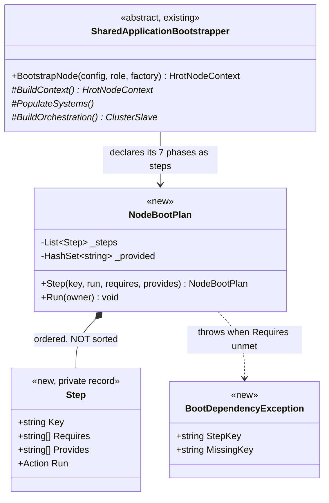

#### ③ THE SEQUENCE

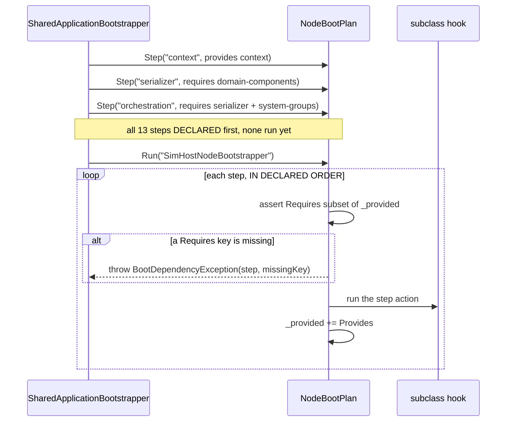

#### ④ THE DECLARED EDGES — **exactly §4.1N's measured graph, and nothing invented**

| step | requires | provides | the edge it makes checkable |
|---|---|---|---|
| `context` | — | `context` | — |
| `configured-factory` | `context` | `configured-factory` | |
| `domain-components` | `context` | `domain-components` | |
| `serializer` | ⭐ **`domain-components`** | `serializer` | 🔴 **the `FdpAutoSerializer` freeze** *(§4.1N ② ③)* |
| `system-groups` | `context` | `system-groups` | |
| `additional-modules` | `context` | — | *(§4.1N ③: incidental)* |
| `orchestration` | ⭐ **`serializer` + `system-groups`** | `cluster-slave` | ARG edges |
| `slave-invariant` | `cluster-slave` | — | the `CE-164` assertion |
| `spawning-pipeline` | ⭐ **`system-groups`** | `spawning-pipeline` | 🔴 **SimHost's `CoreLogicPack`/`RoadNetwork` field channel** *(§4.1N ② ①)* |
| `ned-replication` | `context` | `ned-replication` | |
| `network-translators` | ⭐ **`ned-replication` + `system-groups` + `configured-factory`** | — | 🔴 **`GhostCreationSystem`** *(§4.1N ② ②)* |
| `time-sync` | `context` | — | *(incidental)* |
| `application-systems` | `context` | — | *(incidental)* |
| `kernel-initialize` | `context` | `kernel-initialized` | |
| `post-initialize` | ⭐ **`kernel-initialized`** | — | 🔴 **ENFORCED** *(`EngineBackedNavigationModule:63-65`)* |

#### ⑤ ACCEPTANCE

| | |
|---|---|
| ⭐⭐ **behaviour-preserving** | ⛔ **no host file changes.** The three bootstrapper subclasses and all six inline roots are untouched; `SimHost`/`IG` suites stay green at their existing counts |
| ⭐⭐⭐ **the rail, with an inverse-edit red-proof** | a test builds a plan whose step omits a `Provides` and asserts `BootDependencyException` names **both** the step and the missing key. ⛔ Not a smoke test — it must go RED when the check is removed |
| ⭐ **a real boot exercises it** | the existing `SharedApplicationBootstrapperTests` boot cases run the declared plan, so an unsatisfied edge fails there too |
| ⛔ **explicitly NOT in this step** | reordering · migrating any host · ExCon's short list · touching the 45 shared units |

### 4.1Q ⭐⭐⭐ STEP 2 — **ExCon composes the SHORT LIST. ✅ `build-state: BUILT` `2026-09-03`**

> ⭐ §4.1P's successor: the cheapest probe of §4.1O's *"fits all nine roots"* claim, run on the **hardest**
> host — one with **no `ModuleHostKernel` at all**.

#### ① 📐 THE DUPLICATE IT FOUND — **measured before anything was written**

📐 `SlaveTimeTranslatorRegistration.RegisterOn` creates three translators and then registers them on a
kernel. `ExConSubsystem.cs:268-270` **hand-built the same three calls** —
`TimeNetworkModule.CreateDescriptorTranslator` · `CreateSlaveLockstepTranslator` ·
`CreateSlaveTimeSyncTranslator`, same arguments, same order.

⇒ ⭐⭐⭐ **The duplicate existed for exactly one reason: the shared helper only offered
`RegisterOn(kernel, …)`, and ExCon has no kernel.** ⛔ Not a divergence anyone chose — a host locked out
of shared code by a parameter it cannot supply. 📌 **The seam law again**, and the first instance found
*by* the composition work rather than reasoned toward.

#### ② ✅ WHAT WAS BUILT

| | |
|---|---|
| ⭐⭐ **split** | `SlaveTimeTranslatorRegistration.Create(participant, eventBus, nodeId) → SlaveTimeTranslators` — **the shared half, kernel-free**. `RegisterOn` now calls it and keeps only the **kernel half** *(ingress/egress split + three global systems)*. ⛔ Signature unchanged, so its four existing callers are untouched |
| ⚠ **named, not an array** | `SlaveTimeTranslators(Mode, SlaveLockstep, SlaveTimeSync)` + `.All`. 📐 Because a kernel-less host addresses them individually: ExCon interleaves `SlaveSyncController.Update()` **between** their `PollIngress` and `ScanAndPublish` *(`:443-452`)*, which the kernel path expresses as separate systems the scheduler orders |
| ⭐⭐⭐ **ExCon adopts it** | its three hand-built calls become one `Create(...)`. ⚠ **The `_participant != null` guard is KEPT verbatim** — `Create` tolerates a null participant, but dropping the guard would leave the fields non-null in headless and `Update()` would start polling them. Behaviour unchanged |
| ⭐⭐⭐ **ExCon declares a plan** | six steps — `participant` · `orchestration-bus` · `cluster-slave` · `observer-bus` · `slave-sync-controller` · `slave-time-translators` — on the **same `NodeBootPlan`** an ECS node uses, in the same order as before |

#### ③ ⭐⭐⭐ WHAT IT PROVES — **and it is the §4.1O claim, not a restatement of it**

| ⭐ | |
|---|---|
| **the runner is not ECS-shaped** | ⭐ a host with **no world, no kernel, no capabilities** composes the same plan type. ⇒ §4.1O's *"ExCon composes a short list"* is **built, not asserted** |
| **a tier is an OUTPUT** | 🔒 the user's ruling, now demonstrated: ExCon is not *sorted into* a tier — it **is** the list of steps it composed. `NodeRole.None` *(`:342`)* stops looking like an omission and reads as what it is: **no capabilities to select** |
| **the layer split is real** | ⭐ cluster participation *(bus · slave · sync controller · time translators)* composes **without** any ECS step. ⛔ It was previously only an argument |

#### ④ ⚠ THE ONE REAL COST — **stated because it will recur on every host**

📐 Assignments inside a step's closure are **invisible to C#'s nullable-flow analysis**, so five later uses
of `_bus`/`_observerBus` failed to compile *(CS8604 ×4, CS8602 ×1)*.
⭐ **Fixed properly, not with `!`**: two locals mirror the fields, the steps assign both, and the later uses
read the locals — which are *provably* non-null. ⛔ The locals are **not** a workaround for an unproven
fact: the plan's declared keys are the guarantee, and `Run()` throws by key if a providing step did not run.
⚠ **Expect this on any host with a long tail after its composition slice** — `EditorSubsystem`'s tail is
**3548 lines** *(§4.1O ①)*, so this cost scales with the migration and should be priced into it.

#### ⑤ 📐 GATES

| suite | result |
|---|---|
| `Hrot.ExCon.Tests` | ✅ **390 / 0** |
| `Hrot.NodeComposition.Tests` | ✅ **27 / 0** |
| `Hrot.ClusterRunner.Tests` *(hosts `ExConSubsystemTests`, `ExConSubsystemClusterTests`, `ExConHandlerRegistrationTests`)* | **270 pass / 5 fail** — ⭐ **baselined by stash: identical names and counts without the change** *(`DataDrivenGizmoPredicateTests` ×2, `OrchestratorSubsystemTests` ×3 — ⛔ none of them an ExCon test)* |
| `Hrot.IG.Tests` · `Hrot.SimHost.Tests` | 410/5 and 874/1 — ⭐ unchanged from §4.1P's baselines *(`Hrot.Common` changed, so both were re-run)* |

⛔ **Still not done**: no reordering, no ECS host migrated, and the 45 shared units of §4.1M untouched.

### 4.1R ⭐⭐⭐ STEP 3 — **CGF answers §4.1O's open question, and the answer is NO. ✅ `build-state: BUILT` `2026-09-03`**

> ⭐ §4.1O ⑥ marked one row **NOT ATTEMPTED** and load-bearing for the first build item:
> *"whether the Editor's ~550-line composition slice can be expressed as registrars without losing
> ordering."* ⭐⭐ CGF is the cheapest ECS host to find out on. **It was measured, and the answer changed
> the mechanism rather than the plan.**

#### ① 📐 THE MEASUREMENT — **there is no clean prefix**

📐 `CgfSubsystem.Initialize` spans **`:509`–`:1192`** *(683 lines to `Kernel.Initialize()`)* and declares
**40 locals**. The spine values do not sit in tidy blocks — each lives for most of the slice:

| local | first → last | span |
|---|---|---|
| `replicationModule` | 613 → 804 | **191** |
| `nodeFactory` | 611 → 797 | **186** |
| `newClusterSlave` | 802 → 975 | **173** |
| `idAllocator` | 716 → 889 | **173** |
| `creation` | 630 → 772 | **142** |
| `scenarioSerializer` | 825 → 959 | **134** |
| `rrController` | 807 → 926 | **119** |
| `behaviorRegistry` | 583 → 701 | **118** |

⇒ ⛔⛔ **EVERY candidate step boundary is crossed by three to five live locals.** 📐 On ExCon **two**
crossings cost five compile errors and a mirrored-local fix *(§4.1Q ④)*. ⇒ ⭐⭐⭐ **the
closure-over-locals form does not scale to an ECS host's composition slice** — and half-wrapping CGF
would have produced a large diff whose only finding was that.

#### ② ✅ THE MECHANISM CHANGE THE MEASUREMENT DEMANDED — **a value bag keyed by the declared names**

⭐ `NodeBootPlan.Step` gains an `Action<NodeBootValues>` overload *(the closure form stays, unchanged)*.
A value that crosses a boundary travels through the plan instead of a local:

| ⭐ the property that makes it worth having | |
|---|---|
| ⭐⭐⭐ **the declaration and the data cannot drift** | `Set` **refuses** a key the running step does not declare in `provides`; `Get<T>` **refuses** one it does not declare in `requires` |
| ⇒ | ⛔ the keys stop being *names checked against names* — they become **the actual channel**, so a hidden read of the §4.1N kind cannot creep back in |
| ⚠ **not a service locator** | scoped to one plan, keys are the plan's own, every access checked against the declaring step. ⛔ A bag anyone can read at any time is the ambient coupling this work exists to remove |
| ⭐ **it is Shape A again** | 📌 the codebase converged on the same idea twice already — `EntityCreationPack.Build(EntityCreationContext)` and `MapInteractionPack.Build(MapInteractionContext)` *(§4.1M ④)*. ⇒ **not a new idea; the third instance** |

⭐⭐ **And it retires §4.1Q ④'s cost immediately:** ExCon's two mirrored `null!` locals are gone —
`orchestration-bus` and `observer-bus` now travel through the bag. ⇒ the one real cost recorded a step
ago is **closed by the next step**, not carried.

#### ③ ⛔⛔ WHAT THIS CHANGES ABOUT MIGRATING A HOST — **declaring is the LAST move, not the first**

| ⭐ | |
|---|---|
| ⛔ **wrong order** | take a host's slice and wrap it in steps ⇒ fights 40 locals, huge diff, high risk |
| ✅ **right order** | ① the slice's crossing values move to the bag *(or to methods over a context)* → ② **then** the steps are declared. ⭐ Declaring is cheap once nothing crosses via a local |
| ⭐ **why the base was easy** | 📌 `SharedApplicationBootstrapper` took the plan in one commit *(§4.1P)* because its phases were **already methods** communicating through `HrotNodeContext` — i.e. the step-② work was done years ago and nobody called it that |
| ⚠ **so the Editor is not "3548 lines of tail"** | its real cost is **its crossing values**, not its length. ⛔ That is a different, smaller measurement, and it has not been taken |

#### ④ 📐 GATES

| suite | result |
|---|---|
| `Hrot.NodeComposition.Tests` | ✅ **33 / 0** *(11 `NodeBootPlanRails`, up from 5)* |
| `Hrot.ExCon.Tests` | ✅ **390 / 0** |
| `Hrot.ClusterRunner.Tests` | 270 / **5** — baselined in §4.1Q, unchanged |
| `Hrot.IG.Tests` · `Hrot.SimHost.Tests` | 410/**5** and 874/**1** — baselined in §4.1P, unchanged |

⭐⭐ **Red-proof:** disabling the `provides` guard and the `requires` guard in `NodeBootValues` turned
**2 of 11** rails red; restored by inverse edit, 33/33 green.
⚠ **A count correction:** `Hrot.ExCon.Tests` was reported as **121** in one earlier run — that was
`quick-check.sh` applying a filter, and a later run hit a partially-built assembly. 📐 **The full-suite
number is 390**, confirmed with an explicit `--no-build` run.

⛔ **Still not done**: CGF is **not** migrated — deliberately, and §③ is why. No reordering, no ECS host
declared, the 45 shared units of §4.1M untouched.

## 5. ⭐⭐⭐ PHASE 0 — **buildable detail. `build-state: READY-TO-BUILD`**

### 5.1 Venue and channels — settled *(`AQ63` §12)*
| | |
|---|---|
| ⭐⭐⭐ **venue** | **TWO WINDOWED processes under Xvfb, driven over MCP.** ⛔⛔ **NEVER headless** — *"a panel publishes only when it draws, and the headless runner loop never draws, so every panel dump would come back empty"* *(`SKILL.md`)* |
| ⭐⭐ **it already exists** | `ClusterConformanceRails.The_asset_panels_are_the_same_on_both_hosts` *(`:867`)*: `StartAsync("…-editor")` + `StartAsync("…-all", mode:"all")` → `CaptureByKindAsync` each → compare, **anti-vacuity BOTH directions** ⇒ ⭐ **phase 0 EXTENDS what it compares** |
| ⭐ **channels** | `list_panels` *(`kinds` = "the key a cross-host comparison uses")* · `get_panel` *(the view model; "assert a field, do not parse prose")* · ⭐⭐⭐ `get_gizmo_frame` *("what the map is drawing this frame, as data")* · `list_editor_commands` |
| ⛔ **production change** | **NONE** |
| ⚠ **tier** | **`T3`** — async / CI, ⛔ never a foreground blocker |

### 5.2 ⛔⛔ What the rail asserts — and what it must NOT
| ⭐ MUST assert | ⛔ MUST NOT |
|---|---|
| **surface parity** — both hosts offer the same windows/commands/menu items for a capability they both have | ⛔ **run-set parity** — *"CGF registers the same modules as the editor"* |
| **per-host internal coherence** — every system a host's declared affordances need, that host runs | ⛔ any cross-host equality over modules · systems · translators |
| **honest degradation** — an affordance whose systems are absent **reports** it | ⛔ treating an absence as a defect without asking whether the ROLE wants it |

⇒ ⭐⭐⭐ **It proves each host is internally coherent and that shared SURFACES match. Never that two hosts RUN
the same thing.** 📌 This CORRECTS the frame handoff's §1 wording *(`AQ63` §10.4)*.

### 5.3 The items
| # | item | proof |
|---|---|---|
| **①** | extend the two-host comparison to the **8 known drift instances**: scenario catalog non-empty · perspective icon keys resolve · `debug.*` group present · create-core single · `MutationInterceptor` set · perspective toolbar section present · scenario root · center/rotate routed | each **reddens on the pre-fix root** *(inverse edit)* |
| **②** | ⭐⭐⭐ **map parity via `get_gizmo_frame`** | ⭐ the highest-value item — reaches what no model-level rail can |
| **③** | the two NEW **`--mode all`** symptoms *(user, `2026-08-27`; ⚠ this row said `--mode cgf` until `2026-08-27` — the user runs `--mode all`, and CGF's UI is reached THROUGH it)*: ① the 2D map shows **NO entities** on some scenarios *(`hill-attack` loads, map empty)* · ② **center-on-entity CRASHES** ⚠ **suspect the `E3`/`CE-051` path — likely mine** | ⭐ each becomes an assertion that reddens pre-fix |
| **④** | ⛔ nothing in production | — |

### 5.5 ⭐⭐ SEQUENCE — the phase-0 rail, end to end *(obligation ①)*

⚠ **No `classDiagram`: phase 0 adds NO production type** — it extends an existing rail. ⭐ The sequence is
the part that must be unambiguous, because the venue is what §11 got wrong.

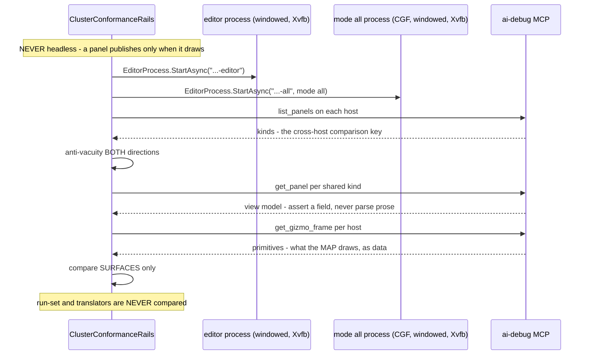

### 5.4 ⚠ What phase 0 will NOT reach — say it, do not paper over it
⛔ Anything needing real pixels: actual rasterisation, gizmo **picking** by mouse, ImGui hit-testing.
⭐ `get_gizmo_frame` reaches *what is submitted for drawing*, ⛔ not *what a human sees*. ⇒ a small
**`--mode all`** eyes pass stays part of acceptance. ⚠⚠ **This line said `--mode cgf` until `2026-08-27`;
that was WRONG and actively misleading** — 🔒 user: *"we never use `--mode cgf`, it was `--mode all`"*, and
⛔ `--mode cgf` cannot boot at all *(§5.8)*, so an eyes pass there is not merely unusual, it is impossible. 📌 **Two of the six user-found symptoms were of that
kind** *(`CE-055`/`CE-056`, both since confirmed non-repro)* ⇒ ⛔ this rail **reduces** the eyes-only
surface; it does not eliminate it. ⚠ Claiming otherwise would repeat the `CE-049` over-claim.

### 5.6 ⛔⛔⛔ `BP-487` — **item ②'s channel does not answer on the cluster.** *(measured `2026-08-27`)*

⚠⚠ **§5.3 item ④ said *"nothing in production."* ⭐ MEASURED, that is FALSE for item ②** — and the
finding was **already filed**, which is the R-129 lesson landing again: 📄
**`DESIGN_UI_Observability_Snapshot.md`** STATUS, verbatim —

> **(3) OPEN, `BP-487`: `ClearCaptured` and the gizmo publish have ONE production caller each
> (`EditorSubsystem`) while four other hosts drive a gizmo buffer — harmless while the debug API is
> Editor-only, blocking for cross-host conformance.**

⇒ ⭐⭐ **the id EXISTS — do NOT allocate a new one.** ⛔ And it is not `MX-011`: that asks the buffer be
*registered into `PanelSnapshot`* so one `DumpAll()` carries it *(MCP lane, and it would make a 128 KB
high-churn model a SHARED kind needing a fresh exemption)*. ⭐ **`BP-487` is the reachability half.**

#### 📐 The measurement — a textbook SILENT DEFAULT
| | |
|---|---|
| the channel | `GET /panels/_gizmo` → `DebugApiService.GetGizmoFrame` reads **`_primitiveBuffer`** *(`DebugApiService.Panels.cs:127`)*, ⛔ **not** `PanelSnapshot` |
| who passes it | ⭐ **only** `EditorSubsystem.cs:1901`. ⛔ `ClusterRunner/Program.cs:429` builds the cluster service **without it** |
| the answer on `--mode all` | 🔴 **404** *"This editor has no debug primitive buffer, so there is no gizmo feed."* |
| ⭐⭐⭐ **and the caller HAS one** | `CgfSubsystem._cgfGizmoBuffer` *(`:851` — fed by `GlobalGizmoManager`+`StatelessGizmoSystem`, drawn by `DebugGizmoLayer:1096`, `_canvas.DrawBuffer` at `:1098`)* · `IgApplication.GizmoBuffer` *(`:481`)* · `SimHostVisualization.GizmoBuffer` *(`:123`)*. ⛔ ExCon has **none** ⇒ **3 of 4** |

⇒ 🔒 **exactly the rule this codebase keeps paying for: *a production caller that HAS a dependency must
PASS it*** — and the control is asserted **on the constructed object**, not on the registrar's source.

#### ⭐ The fix — **through the provider seam, not a latched field**
⛔ `Program.cs` **cannot** pass one buffer: `--mode all` runs CGF *and* IG *and* SimHost, and the feed must
follow the **ACTIVE perspective** like every other per-node fact. ⭐⭐ `ISubsystemDebugProvider` is already
*"everything that differs per node"* — `World` · `EntityMap` · `Drive` — so the member belongs there.
⚠⚠ **`Func`-backed, never a captured value** — 📌 `Program.cs:399` states the rule and names the bug it
already cost: *"a value-captured provider LIES"* *(the buffer is built in `Initialize`)*.

```mermaid
classDiagram
    class ISubsystemDebugProvider {
        <<interface>>
        +EntityRepository World
        +NetworkEntityMap EntityMap
        +ITimeTransportFacade Drive
        +DebugPrimitiveBuffer GizmoBuffer
        +IMissionEditorService MissionEditor
        +ITkbDatabase TkbDb
    }
    note for ISubsystemDebugProvider "EXISTS - Hrot.Presentation/DebugApi/ISubsystemDebugProvider.cs\nTHREE added members, one per instance of the SAME defect:\nGizmoBuffer (BP-487) - MissionEditor (CE-066) - TkbDb (CE-110)"

    class SubsystemDebugProvider {
        -Func~DebugPrimitiveBuffer~ _gizmoBuffer
        -Func~IMissionEditorService~ _missionEditor
        -Func~ITkbDatabase~ _tkbDb
        +DebugPrimitiveBuffer GizmoBuffer
        +IMissionEditorService MissionEditor
        +ITkbDatabase TkbDb
        +TkbFrom(world) Func~ITkbDatabase~
        +DescribeCapabilities()
    }
    note for SubsystemDebugProvider "EXISTS - same file. Func-backed: each dependency is built in\nInitialize, AFTER the composition root builds the provider.\nTkbFrom is the ONE way to read the world singleton (CE-110)."

    class PerspectiveScopedDispatcher {
        +Active() ISubsystemDebugProvider
        +DebugPrimitiveBuffer GizmoBuffer
        +IMissionEditorService MissionEditor
        +ITkbDatabase TkbDb
    }
    note for PerspectiveScopedDispatcher "EXISTS - Hrot.Presentation/DebugApi/PerspectiveScopedDispatcher.cs\nevery member resolves through Active(), like World/EntityMap/Drive"

    class DebugApiService {
        -DebugPrimitiveBuffer _primitiveBuffer
        -TkbDatabase _editorTkbDb
        -PerspectiveScopedDispatcher _dispatcher
        +GetGizmoFrame(max)
        +ListTkbTypes(category)
    }
    note for DebugApiService "EXISTS - Hrot.Editor/DebugApi. Each read resolves\n_editorOwn ?? _dispatcher.X, and THROWS when neither answers.\nCE-110: it must never substitute an empty stand-in."

    class CgfSubsystem {
        -DebugPrimitiveBuffer _cgfGizmoBuffer
        +CreateDebugProvider()
    }
    note for CgfSubsystem "CE-111 - now publishes ITkbDatabase as a world singleton,\nas SimHost and IG already did. Without it every reader that\nresolves it FROM THE WORLD degraded silently."
    class IgSubsystem {
        +CreateDebugProvider()
    }
    class SimHostSubsystem {
        +CreateDebugProvider()
    }
    class ExConSubsystem {
        +CreateDebugProvider()
    }
    note for ExConSubsystem "HAS NO BUFFER AND NO CATALOG - passes null for both,\nhonestly absent (ruling 49). 3 of 4 on each member."

    ISubsystemDebugProvider <|.. SubsystemDebugProvider
    PerspectiveScopedDispatcher o-- "1..*" ISubsystemDebugProvider
    DebugApiService --> PerspectiveScopedDispatcher
    CgfSubsystem ..> SubsystemDebugProvider : builds
    IgSubsystem ..> SubsystemDebugProvider : builds
    SimHostSubsystem ..> SubsystemDebugProvider : builds
    ExConSubsystem ..> SubsystemDebugProvider : builds
```

#### 🔒 Why this does NOT breach the §3 standing constraint
⭐⭐ It moves **diagnostics egress** only: ⛔ **no module, system, translator or participant is registered**,
and ⛔ **no host is made to draw anything it did not already draw** — the buffer, its feeders and its layer
already exist per host. ⇒ the rail reads *what each host ALREADY submits*, which is the only thing §5.2
lets it compare.

⚠ **The `_gizmo` `EditorOnlyKinds` entry STAYS** *(and its comment is corrected)*: after `BP-487` the
cluster's feed is **reachable at the endpoint** but still **does not publish the `_gizmo` PANEL KIND** —
that is `MX-011`, another lane. ⛔ Deleting the entry would be a lie; ⭐ instead it now names the rail that
covers the substance.

### 5.7 ⛔⛔⛔ `CE-065` — **the user's crash, root-caused. THE SHARED SYSTEM WAS ROUTED; ITS EVENTS WERE NOT.**

⭐⭐⭐ **This is phase 0's real find, and it is the strongest possible argument for the whole programme:**
the `E3` slice moved *"center on entity"* onto a shared system and deleted CGF's hand-rolled parallel —
✅ correctly — ⛔ **but the EVENT REGISTRATION stayed behind in `EditorSubsystem`.**

#### 📐 Reproduced over MCP, `2026-08-27`
```
POST /entities/1000/focus  →  500
Strict Mode Violation: Unmanaged event type 'CenterOnEntityCommand' (ID: 8104) was
published without being explicitly registered. You must call world.RegisterEvent<…>().
```
| | |
|---|---|
| ⭐⭐ **why it CRASHES rather than 500s in the UI** | the same publish happens inside CGF's ImGui **context-menu callback**, where the throw is unhandled ⇒ 🔴 **the process dies.** That is the user's report, exactly |
| ⭐⭐⭐ **the enabling condition** | `ClusterRunner/Program.cs:52` sets **`FdpConfig.EnforceExplicitEventRegistration = true`** — ⛔ **PROCESS-WIDE.** ⚠⚠ **I previously measured this as *"defaults false, and ClusterRunner does not set it"* — that was WRONG**, and it is why an earlier session dropped this hypothesis |
| 🔒 **the seam already existed** | `PresentationComponentRegistry.RegisterAll` **already registered `SelectEntityCommand`** ⇒ ⭐⭐ **that is precisely why *"Select entity"* worked on CGF while its SIBLING menu item crashed** — two items from one slice, one central, one inline |

⇒ ⭐⭐ **the 25th measured instance of the seam law here:** *"we need a shared registration"* meant **the
shared registry existed and was under-adopted.** ⛔ The fix is not a new registry.

#### ⭐ The fix — one list *(ruling 9)*
| | |
|---|---|
| ✅ `CenterOnEntityCommand` + `ActivateEditorToolEvent` **added** to `PresentationComponentRegistry.RegisterAll`, beside `SelectEntityCommand` | 📐 enumerated from the three systems `ScenarioEditorModule.RegisterSystems` registers — the complete set, not the one that crashed |
| ✅ the editor's inline `:917-918` pair **DELETED** | ⭐ the editor still gets them: `EditorSubsystem:905` calls `CgfComponentRegistry.RegisterAll(_world)` → this registry. ⛔ Keeping both would be the two-list state that caused this |
| ⭐ **reach** | `CgfComponentRegistry` · `SimHostComponentRegistry` · `StrideNodeBootstrapper` · the editor transitively ⇒ **one edit, every windowed host** |

⚠ **Sibling precedent, and it means this shape has now been paid for TWICE:** `HrotNodeBuilder:101-112`
registers `OrchestrationEventRegistry` on the NODE bus for the identical reason — its comment reads
*"Without this line, pressing pause on a CGF/SimHost/IG toolbar throws instead of pausing."* ⇒ ⭐ **two
buses, two lists, and each list must be the ONLY one for its bus.**

#### ⛔⛔ Why every existing rail was green — **the rail-blindness pattern, 4th instance**
| the rails that existed | what they proved | ⛔ what they never asked |
|---|---|---|
| `TheViewportInteractionIsSharedTests` source scans | CGF publishes the shared command instead of hand-rolling | — |
| its behavioural rails | the shared system reacts correctly | — |
| ⛔ **neither** | — | 🔴 **whether the event was REGISTERED on the publishing host's bus** |

⭐⭐⭐ **And the reason is exact: unit rails run with strict mode OFF (the default), where `Publish` creates
the stream lazily.** ⇒ the rails published these very events and stayed green.
⭐ The new rails turn it **ON**, which is the production condition. 📌 Joins `CE-049` *(asserted presence,
not substance)* · `CE-053` *(supplied the input it tested)* · `CE-064` *(asserted over an empty set)*.

### 5.8 ⚠⚠ AS-BUILT CORRECTIONS TO §5.3 — **three of its four items were wrong about the world**

| item | §5.3 said | 📐 MEASURED `2026-08-27` |
|---|---|---|
| **①** the 8 drift instances | *"extend the two-host comparison to them"* | ⭐⭐ **ALL EIGHT ARE ALREADY RAILED** by the preceding batch ⇒ **item ① is DISCHARGED BY INVENTORY, not by new code.** ⛔ Rebuilding them as a T3 comparison would duplicate what T0 rails prove faster and *at the line*. Per instance: catalog→`TheCgfPickerIsNotEmptyTests` · icons→`EveryPerspectiveHasAToolbarIconTests` · `debug.*`→`TheAiDebugGroupExistsOnBothHostsTests` · create-core→`TheCreateCoreIsOneImplementationTests` · `MutationInterceptor`→`BreakpointSubsystemWiringTests` *(📐 **25/25 in 18 s when filtered** — the "un-gateable suite" note applies to OTHER classes in it, not this one)* · toolbar section→`TheCgfPickerIsNotEmptyTests.AWindowedHostComposesThePerspectiveToolbarSection` · scenario root→`TheHostsAgreeOnTheScenarioRootTests` · center/rotate→`TheViewportInteractionIsSharedTests` |
| **③**(1) *"the map shows NO entities"* | a symptom to reproduce | ⚪ **DOES NOT REPRODUCE on `hill-attack` in `--mode all`.** 📐 The cluster's map submits **739** primitives incl. **16 `SpatialAnchor`s naming ids 1000–1007** — every scenario entity, matching the editor's set. ⇒ ⚠ **scenario-specific or state-specific; the rail is now standing to catch it.** ⛔ Do NOT record it as fixed — it is unreproduced, like `CE-055`/`CE-056` |
| **③**(2) *"center-on-entity CRASHES"* | *"suspect the `E3`/`CE-051` path — likely mine"* | 🔴 **CONFIRMED, and the suspicion was right.** `CE-065`, §5.7 |
| **④** *"nothing in production"* | — | ⛔ **FALSE, twice.** `BP-487` *(§5.6)* was needed to make item ② reachable at all, and `CE-065` is a live crash fix. ⭐ The *parity comparison itself* still adds no production code — that is the half that survives |

### ⭐⭐⭐ `--mode cgf` — **NOT A DEFECT. A DEPLOYMENT MODE WE DO NOT TEST.** *(user ruling, `2026-08-27`)*

> 🔒 **User, verbatim:** *"'mode all' is what we aim for, 'mode cgf' is for multi process truly distributed
> deployment which we do not test and just hope it will work out of the box because of dds works same way
> in-process or inter-computers."*

⚠⚠ **An earlier version of this section called it *"`--mode cgf` ALONE CANNOT BOOT"* and listed it beside
the defects. ⛔ That framing was WRONG and is SUPERSEDED.** 📐 The measurement stands — `DdsIdAllocator`
waits 30 s for `Hrot.Orchestrator`, then throws; **exit 134** before `/status` — ⭐ **but that is a
PRECONDITION being unmet, not a bug:** a single-subsystem mode is one process of a **distributed**
deployment, and the orchestrator is a separate process that must already be running.

| ⭐ the rule that follows | |
|---|---|
| ⭐⭐⭐ **`--mode all` is the TARGET, and the only mode this programme rails** | it is the in-process all-in-one the editor and CGF both live in |
| ⛔ **`--mode cgf` and friends are NOT railed** — deliberately | ⭐ they are the truly-distributed deployment, and the bet is explicit: **DDS behaves identically in-process and across machines**, so `--mode all` passing is taken as evidence for the distributed case |
| ⛔⛔ **Never write a rail that starts a single-subsystem mode** | 📌 it will die on the allocator wait and read as a regression. ⭐ Exercise CGF as **`--mode all` + the `Scenario` perspective** |

⚠ *"the `--mode cgf` symptoms"* in §5.3 is shorthand for *"CGF's symptoms"* — the user was running
`--mode all`.

#### 📐 The measured map frames — the baseline a later drift is compared against
| | editor | `--mode all` *(CGF/Scenario)* |
|---|---|---|
| primitives | **828** | **739** |
| shapes | `Arrow:12 Box2D:16 ContextMenuBinding:9 LayerControlMask:1 Line:674 MainMenuBinding:1 SemanticShape:24 SpatialAnchor:24 Sphere:20 Text:47` | `Arrow:12 Box2D:8 ContextMenuBinding:9 Line:670 SemanticShape:16 SpatialAnchor:16 Text:8` |
| entity anchors | ids 1000–1007, ×3 | ids 1000–1007, ×2 |
| verdict | ⭐ **subset holds** — no cluster-only shape. Editor-only: `LayerControlMask` · `MainMenuBinding` · `Sphere` *(authoring overlays — expected)* |

#### 📐 And the `panels.gizmo` cells, measured on `--mode all`
```
SimHost: claims=True  answers=200   |   IG:       claims=True  answers=200
ExCon:   claims=False answers=404   |   Scenario: claims=True  answers=200
```
⭐ **Every cell matches real behaviour**, and ExCon's honest `false` is what proves the cell is *measured*
rather than defaulted. ⚠ The rail's anti-vacuity bound is **≥2, not ≥3** — deliberately: SimHost's buffer
exists only when it has a `Visualization`, so demanding 3 would make the rail depend on whether `--mode all`
gave SimHost a viewport, which is a fact about the **RUN-SET** that §5.2 forbids asserting.

#### ✅✅ RESOLVED `2026-08-27` — **the `/missions` prefix, and it was NOT a paperwork gap.** ⇒ see §5.9
> 🔒 **User, `2026-08-27`:** *"feel free to fix other lanes code, you are the only one making changes,
> during this refactor i do not run other stuff in parallel."* ⇒ ⭐ the cross-lane block is LIFTED and the
> gap is fixed as **`CE-066`**. ⛔ **The text below is the state BEFORE that** — kept because it records
> why the assertion was parked, and because ⭐⭐ **the "third report" framing was itself the mistake**: it
> read as paperwork for three rounds when it was a missing CAPABILITY. §5.9 has the real story.

#### ⛔ HISTORY — **the `/missions` prefix blocks the manifest rail** *(cross-lane, MCP)*
📐 `The_manifest_describes_this_host_truthfully` is **RED before its matrix loop is reached**:
`unclassifiedRoutes = [/missions/{networkId}, …/run, …/task, …/tasks]` — no prefix in
`CapabilityManifest.CapabilityFor`. ⚠ **Pre-existing and outside this batch's diff** *(verified: `missions`
appears nowhere in that file, and the diff touched only the matrix-row lines)*. ⇒ ⭐ the `panels.gizmo`
assertion was **moved into `TheMapsAgreeOnBothHostsRails`**, because an assertion behind another lane's red
gates nothing. ⛔ **When `/missions` is classified, move it back beside `time.drive` — and keep only ONE
copy** *(ruling 9)*; both rails carry a pointer saying so.

### 5.9 ⛔⛔⛔ `CE-066` — **the `/missions` gap was NOT paperwork. It was a missing capability.**

⭐⭐⭐ **The most useful thing this batch learned, and it is a lesson about REPORTING, not about code.**
📌 The unclassified `/missions` routes were reported **three times** across sessions as *"the MCP lane must
add a prefix"* — ⛔ **a paperwork framing that was wrong every time.** ⭐⭐ The routes were unclassified
because **nobody had asked what a CLUSTER host answers** — and the answer was *"no mission service"*.

#### 📐 Measured `2026-08-27` — the third instance of one defect in a single batch
| | |
|---|---|
| `CgfSubsystem:1095` | builds `ScenarioMissionService` — ⭐ **the SAME shared adapter** `EditorSubsystem:1962` builds |
| `EditorSubsystem:1967` | hands its instance to `_debugApiService.MissionService` |
| 🔴 **CGF** | hands its instance to **nobody** ⇒ all four `/missions/*` routes answered *"no mission service"* on `--mode all` |
| ⚠⚠ **and the property's OWN doc-comment states the rule it was breaking** | *"the composition root hands it over as soon as it exists. Leaving it null would be the silent-default trap — **a caller that HAS the dependency must pass it**."* 📌 Written for the editor; the cluster root never read it |

⇒ ⭐⭐ **`BP-487` (gizmo buffer) · `CE-065` (event registration) · `CE-066` (mission editor) are ONE defect
three times**, and the shared shape is exact: **a production caller holds a dependency the shared code needs
and does not pass it.** ⛔ Not a missing abstraction — a missing argument.

#### ⭐ The fix — **the same seam, one member wider**
`MissionEditor` joins `GizmoBuffer` on `ISubsystemDebugProvider` *(`Func`-backed — CGF builds its service
during window registration)*; CGF supplies it; `DebugApiService` resolves
`_missionService ?? _dispatcher?.MissionEditor`; ⭐ `/missions` is classified as its **own** capability
`mission.edit`, **measured per provider**.
⛔ **Not folded into `EditorAuthoring`**: a broad key would have made the cell undiagnosable, which is
`R-133`'s whole complaint. ⭐ `GET /behaviors?entityId=` was routed too — its fallback to the TKB catalog is
a *correct but coarser* answer, i.e. exactly the quiet downgrade worth eliminating.

#### ✅ And the manifest rail is GREEN for the first time
📐 `The_manifest_describes_this_host_truthfully` had been red **before its matrix loop was ever reached**.
⭐ With `/missions` classified it runs, and `panels.gizmo` **moved back beside `time.drive`** — ⛔ the
temporary standalone rail was **DELETED, not kept** *(ruling 9: one claim, one rail)*.

```
capability cells, measured on --mode all:
  Scenario (CGF):  drive=True   gizmo=True   mission=True
  SimHost:         drive=True   gizmo=True   mission=False
  IG:              drive=False  gizmo=True   mission=False
  ExCon:           drive=False  gizmo=False  mission=False
```
⭐⭐ **Every cell matches real behaviour**, and the three FALSE columns are what prove the cells are
*measured* rather than defaulted. ⚠ `mission.edit` is true **only** where CGF is — which is the claim.

⇒ ⭐ **A rail worth having:** *"drawing a map does not imply hosting mission editing"* — 📌 the cheap way to
add a second provider member is to derive both from one *"is this host wired?"* flag, and that would make
the manifest claim mission editing wherever it claims a map feed. **Red-proved by doing exactly that.**

### 5.10 🔴🔴🔴 `CE-110` / `CE-111` — **the THIRD instance at ONE line, and the first that COST A DIAGNOSIS** `build-state: BUILT` *(`2026-08-28`)*

📄 **Diagram: §5.6's `classDiagram`**, which now carries all three added members. ⛔ **Not redrawn here** —
📌 *"never both for the same thing; two pictures of one architecture rot apart."*

#### 5.10.1 ⭐⭐ THE DEFECT — **and why the two siblings did not cost anything and this one did**

| | |
|---|---|
| **the line** | `ClusterRunner/Program.cs:429` builds the cluster `DebugApiService` and passes **no `tkbDb:`** |
| **the default** | `_tkbDb = tkbDb ?? new TkbDatabase()` ⇒ ⛔ **a private, permanently EMPTY catalog** |
| **measured on a real `--mode all` boot** | `GET /tkb/types` → `[]` · `GET /tkb/types/303` → *"TKB type 303 not found."* |
| **the truth** | `HrotNodeBuilder:197` had built a real **10-template** catalog for that node from `HrotEnvironment.CreateTkb()` |

⭐⭐⭐ **What separates it from `BP-487` and `CE-066`.** ⭐ Those two failed **LOUDLY** — a `404`, and a
written refusal. ⛔⛔ **This one returned a VALID-LOOKING EMPTY LIST**, so it was **believed**: the empty
catalog became the leading hypothesis for **`CE-103`** *(tanks that draw a path and do not move)*, on the
reading that the cluster's TKB genuinely differed from the editor's.

⇒ ⭐⭐⭐ **AN INSTRUMENT THAT REPORTS *ABSENT* WHERE THE TRUTH IS *PRESENT* DOES NOT MERELY FAIL TO HELP —
IT ARGUES FOR THE WRONG ROOT CAUSE.** 📌 With the instrument fixed, the same probe showed templates
**100 · 103 · 301 · 303 byte-identical on both hosts**, refuting the hypothesis outright *(§5c.18.5)*.
⚠ This is the MCP skill's own §5c — *"prove your instrument once"* — and it caught me anyway, because
`ok:true` plus a well-formed empty array does not look like an instrument fault.

#### 5.10.2 ⭐⭐ THE FIX — **the seam, NOT a `tkbDb:` argument at the root**

⛔ **Passing it at the composition root would have been WRONG, not merely inelegant.** 📐 The TKB is
genuinely **per node**: `TkbLoadClusterStateHandler` **clears and re-ingests** it from each node's own
staging area on every `PrepareLive`/`PrepareEdit`. ⇒ ⭐ one instance passed once would report **one node's
templates as every node's**, and would go **stale on the first scenario load**.

| # | change | file |
|---|---|---|
| ① | **`ISubsystemDebugProvider.TkbDb`** — `Func`-backed, like `GizmoBuffer`/`MissionEditor` | `Hrot.Presentation/DebugApi/ISubsystemDebugProvider.cs` |
| ② | **`SubsystemDebugProvider.TkbFrom(world)`** — ⭐ the ONE implementation of *"read the singleton off my own world"*, so four `HasSingletonManaged` copies cannot drift *(ruling 9, same shape as `TransitionsVia`)* | same file |
| ③ | **`PerspectiveScopedDispatcher.TkbDb => Active()?.TkbDb`** | `PerspectiveScopedDispatcher.cs` |
| ④ | **`DebugApiService._tkbDb => _editorTkbDb ?? _dispatcher?.TkbDb`**, and ⛔⛔ **it THROWS `NotSupportedHereException` instead of substituting an empty catalog** | `Hrot.Editor/DebugApi/DebugApiService.cs` |
| ⑤ | **`DebugCapabilities.TkbRead`** replaces `CapabilityManifest`'s bare `"tkb.read"` string | `ISubsystemDebugProvider.cs` · `CapabilityManifest.cs` |

⚠⚠ **Item ⑤ is its own small finding.** 📐 Every `/tkb` route was classified as the **literal string**
`"tkb.read"` and **no provider ever reported that key** ⇒ ⛔ the routes were documented while their
availability was **never measured at all**. 📌 That is how an empty catalog on `--mode all` stayed
invisible long enough to misdirect `CE-103`.

#### 5.10.3 ⭐⭐ `CE-111` — **CGF never published `ITkbDatabase` as a world singleton**

📐 Found while measuring `CE-110`. `SimHostNodeBootstrapper:179` and `IgNodeBootstrapper:133` both register
it; **CGF passed `_context.TkbDb` straight to its two systems and registered NOTHING.**

| the silent consumer | what it lost |
|---|---|
| `DisEntityTypeTranslator:38` | DIS entity types not translated on CGF |
| `EntityPresentationGizmoShared:60` | the map's per-entity presentation falls back |

⛔⛔ **Both guard with `HasSingletonManaged` and have NO `else`** ⇒ no log line, no failure — 📌 the shape
ruling 53 exists to catch, and a direct **`cgf==editor` violation**. ⚠ **The comment two lines above the
fix already documented the identical omission for the geo transform** *("Without it geo-aware params
resolve to 0,0,0")* — ⭐ the same mistake, twice, in one method.

#### 5.10.4 ⭐ THE RESOLUTION SEQUENCE *(the file had no `sequenceDiagram` for this seam)*

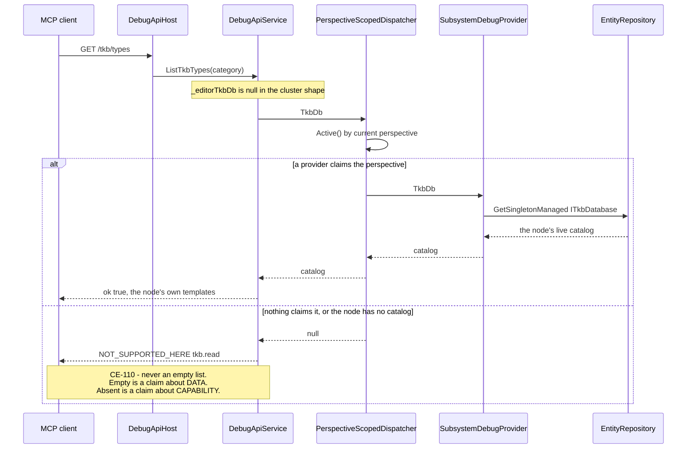

#### 5.10.5 ⭐ MEASURED AFTER THE FIX

| probe | before | after |
|---|---|---|
| `GET /tkb/types` on `--mode all` | ⛔ `[]` | ⭐ **10 templates** |
| `GET /tkb/types/303` | ⛔ *"not found"* | ⭐ `Tank Platoon (Auto Spawn)` |
| `/capabilities` `tkb.read` | ⛔ **cell did not exist** | ⭐ SimHost ✓ · IG ✓ · **Scenario ✓** · ExCon ✗ — **3 of 4**, the same split as `GizmoBuffer` |

⭐⭐ **`Scenario: true` is `CE-111`'s live proof** — that cell can only be true if CGF publishes the
singleton, so the two fixes verify each other on one boot.

#### 5.10.6 ⚠⚠ THE LESSON WORTH KEEPING — **three instances, one line, and the pattern is now nameable**

⛔ **The rule *"a production caller that HAS a dependency must PASS it"* did not prevent instances two and
three**, because it asks a question about a call site nobody re-reads. ⇒ ⭐⭐ **the structural fix is what
finally holds: a per-node dependency has NO business being a service field at all** — every one of the
three belonged on `ISubsystemDebugProvider`, and once there the composition root **cannot** forget it.

⭐⭐⭐ **And the sharper half:** ⛔ **the `?? new X()` fallback is the actual defect, not the missing
argument.** 📌 Had the cluster ctor simply left `_tkbDb` null and thrown, instance three would have been a
loud `NOT_SUPPORTED_HERE` on the first probe instead of a plausible empty list that cost a wrong root
cause. ⇒ ⭐ **when a dependency is per-node, `?? new X()` is not a convenience — it is a fabricated
answer.**

## 5b. ⭐⭐⭐ PHASE 1 — **the bundle seam.** `build-state: READY-TO-BUILD`

> ⭐⭐⭐ **The headline finding, and it CORRECTS §2.1: the bundle seam is not missing. It exists TWICE, and
> one of the two is a working, adopted precedent nobody has named.**

### 5b.1 ⭐⭐ INVENTORY *(graph, `2026-08-27` — queries recorded)*
```
search_graph(name_pattern=".*WindowRegistrar.*")                     → total 52
search_graph(name_pattern=".*IWindowRegistrar.*", relationship=IMPLEMENTS)
grep -rn ": IWindowRegistrar|, IWindowRegistrar"                     → the implementor list (interface
                                                                       dispatch defeats the resolver)
search_graph(name_pattern=".*(Toolbar|GlobalMenu|MenuRegistr).*", label="Class") → total 33
```

#### 🔴🔴 TWO interfaces, same name, **completely different contracts**
| interface | contract | in-degree |
|---|---|---|
| `Fdp.Toolkit.Runner.IWindowRegistrar` *(`FDP/Engine/Fdp.Presentation/ImGui/`)* | `void RegisterWindows(WindowManager)` — ⭐ **HOST**-level | **8** |
| `Hrot.Blueprints.Editor.IWindowRegistrar` | `RegisterMenuEntry(path, action)` · `RegisterToolbarEntry(label, action)` · `RegisterShortcut(keybind, action)` — ⭐⭐⭐ **FEATURE**-level | **24** |

⇒ ⭐⭐⭐ **The feature-level bundle contract phase 1 was going to invent ALREADY EXISTS and is used 24
times.** ⛔ It is simply trapped in the `Hrot.Blueprints.Editor` assembly.
📌 **The seam law's 4th instance this session** *(after `BP-487` · `CE-065` · `CE-066`)* — and the first one
that is about a MISSING ABSTRACTION rather than a missing argument.

#### ⭐ The host-seam implementors — **8 subsystems, and TWO that are not**
| ⛔ the 8 hosts *(the drift surface)* | ⭐⭐ the 2 that behave like BUNDLES |
|---|---|
| `EditorSubsystem` · `CgfSubsystem` · `IgSubsystem` · `SimHostSubsystem` · `ExConSubsystem` · `OrchestratorSubsystem` · `ReplayBrowserSubsystem` · `EyesAndMuscleSubsystem` | **`BlueprintWindowRegistrar`** · ⛔ ~~`SharedAiWindowRegistrar`~~ *(DELETED — `CE-070`, §5b.6)* |

⭐⭐⭐ **`BlueprintWindowRegistrar` IS the pattern, already working and already adopted.** 📐 Measured: it
implements the **feature** seam *(consumed by `BlueprintEditorModule`)* **and** the **host** seam
*(`RegisterWindows(WindowManager)`, adapting through a private `WindowManagerRegistry`)*, and
`BlueprintEditorServiceCollectionExtensions` registers it as **both**.
⇒ ⛔ **phase 1 invents nothing. It NAMES this shape, moves it to a shared assembly, and has hosts compose a
LIST of them.**
⛔⛔ **`SharedAiWindowRegistrar` WAS the second entry here and is DELETED** *(`CE-070`, §5b.6)*.
📌 The inventory above found it *"the same shape minus the feature seam — 7 windows, one `RegisterWindows`"*,
and a DI rail resolved it, making it **wired in DI and unused by every host** ⇒ ⚠ *worse than unadopted: it
looked adopted.* ⭐⭐ **On measurement it was not the same shape at all:** its windows declare
`WindowScope.PerspectiveBound`, so a flat host-level registrar was **the wrong shape for them**, and the
live per-perspective path *(`PerspectiveWorkspaceRegistrar`, both hosts, 3× each)* was already doing the job.
⇒ ⭐ **`BlueprintWindowRegistrar` is the sole surviving bundle-shaped precedent, and it is the good one.**

#### ⭐ The engine-side registries a bundle writes into *(all shared already)*
`MainToolbarManager` *(in 22)* · `GlobalMenuRegistry` *(in 43)* · `PerspectiveToolbarSection` *(in 8)* ·
`ToolbarCommandAdapter` *(in 9)* — ⛔ **none of these needs changing.** ⭐ The gap is purely *who calls them*.

### 5b.2 ⭐⭐ THE DESIGN
⭐ Promote the `BlueprintWindowRegistrar` shape into a named seam that lives beside the shared UI, and let a
host declare **a list**. ⛔ No new registry, no host conditional *(ruling 58)*, no nullable knob bag *(§3.3)*.

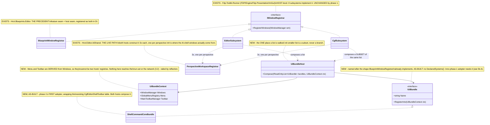

> ⛔⛔ **`SharedAiWindowRegistrar` WAS DRAWN HERE and is now DELETED** *(`CE-070`, §5b.6)*. ⭐ Its box is
> replaced by `PerspectiveWorkspaceRegistrar` — **the class that was actually doing its job all along.**
> ⚠ Its note used to read *"phase 1's first adopter"*; that was wrong twice over, and §5b.6 says why.

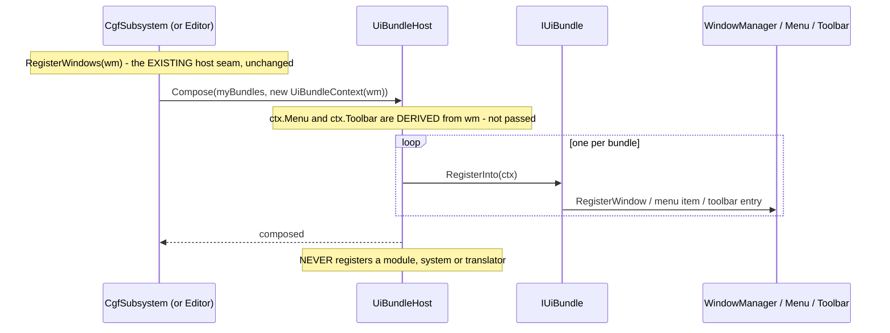

> ⚠⚠ **This diagram was CORRECTED on `2026-08-27` (`CE-070`) and the correction matters.** ⛔ It previously
> showed `new UiBundleContext(wm, menu, toolbar)` and a `ReportUnserviceable(…)` hop — **neither exists.**
> 📌 §5b.4 item ①b already recorded both as *not built* and claimed *"the diagram above is corrected"*, but
> **only the `classDiagram` had been touched** ⇒ ⭐⭐ **an as-built note is not a diagram edit**, and
> obligation ⑤ is satisfied by changing the picture, not by describing the change beside it.

### 5b.3 The items
| # | item | proof |
|---|---|---|
| **①** | `IUiBundle` + `UiBundleContext` + `UiBundleHost` in the shared assembly | T0: composing a list registers every bundle's windows; a bundle that throws is named, not swallowed |
| **②** | ⛔ ~~`SharedAiWindowRegistrar` becomes the FIRST bundle and both hosts compose it~~ — **WITHDRAWN (§5b.4), then DELETED (§5b.6)** | ⛔ the *"cheapest real adopter"* reasoning was wrong on measurement: CGF constructs **0** of its 7 windows |
| **③** | `CgfEditorShellToolbar` becomes a bundle | ⭐ already derives its per-host subset ⇒ proves the seam on the surface `CE-016`…`CE-045` hardened |
| **④** | rail: **a host's bundle list is a LIST, not a branch** | ⛔ source scan: no `if (host==…)` inside any bundle *(ruling 58)* |
| **⑤** | rail: **no bundle registers a module/system/translator/participant** | ⭐ §3.2 made checkable — the constraint that protects axes 2–3 |

### 5b.4 ✅ AS-BUILT *(`2026-08-27`)* — **three deviations, each argued**

| # | the design said | what shipped, and why |
|---|---|---|
| **⓿** | *"the two `IWindowRegistrar` names are left alone — a 24-site cross-assembly rename"* | 🔒 **USER: rename it in the same pass.** ⛔⛔ **And my estimate was WRONG:** 📐 measured **19 line hits in 9 files, all inside `Hrot/Subsystems/Blueprints/`** — the **24** was the graph's selected DEGREE, not edit sites. ⇒ shipped as **`CE-068`**: the feature seam is now **`IShellCommandRegistrar`** |
| **②** | *"`SharedAiWindowRegistrar` becomes the FIRST bundle — the cheapest real adopter"* | ⛔ **WITHDRAWN, on measurement.** 📐 Of its **7** windows, CGF constructs **0** and the editor **3**. ⇒ adopting it is not composing an existing bundle — it is **newly constructing seven windows on CGF**, a question about **CGF's ROLE**. ⭐ `ShellCommandCoreBundle` went first instead: **both hosts already register through that table, byte for byte** |
| **①b** | the `classDiagram` gave `IUiBundle` a `DeclaredSystems()` member and `UiBundleContext` a `ReportUnserviceable(…)` | ⛔ **NOT BUILT.** ⚠ Neither phase-1 adopter needs them, and 📌 **this is the batch whose own lesson is that an unadopted member LOOKS adopted** *(`SharedAiWindowRegistrar` is DI-wired and host-unused)*. ⇒ ⭐ they arrive with the first bundle that has something to declare. The diagram above is corrected |

#### ⭐⭐ What the seam actually BOUGHT — measured, not asserted
📐 The static it replaces took **toolbar and menu as SEPARATE arguments**, so nothing stopped a host pairing
one host's toolbar with another's menu — ⛔ and that would compose perfectly and render half.
⭐ `UiBundleContext` **derives both from the one `WindowManager`**, making that pairing unrepresentable.
📌 Same present-but-disconnected shape as `BP-487`'s manifest cell.

#### 📐 A DEAD-GUARD cluster found on the way
⛔ `WindowManager.MainToolbar` returns an **inline-initialised readonly field** and is **never null** ⇒
`windowManager.MainToolbar != null` at `EditorSubsystem:4469` and `CgfSubsystem:2128` was **always true**,
and the comments explaining a *"toolbar-less host"* path described **a state that cannot occur**. ⭐ Both
sites are gone with the bundle adoption; ⚠ what a bare host actually lacks is the **`WindowManager`
itself**.

#### ✅ Gates
`IUiBundle` seam rails **6/0** *(inverse-edit red-proved: exposing `EntityRepository` on the context reddens
`A_bundle_cannot_reach_the_run_set`)* · `Hrot.Presentation.Tests` **140/0** · `Hrot.Editor.Tests` **338/0** ·
`Hrot.Blueprints.Tests` **3965/0** *(unblocked by `CE-067`)* · T3 `The_main_toolbar_is_readable_on_both_hosts`
**39 s** ✅ · `The_global_menu_is_readable_on_both_hosts` **37 s** ✅ · `The_manifest_describes_this_host_truthfully`
✅ — ⭐ **the two subset rails are the ones that matter**: they prove the per-host derivation is unchanged.

✅ **PHASE 1 IS COMPLETE.** ⭐ The seam exists, has two real adopters, and is railed for faithfulness.
✅ **Closed since:** the `SharedAiWindowRegistrar` question — resolved as a **DELETION**, not an adoption
*(§5b.5 for the argument, §5b.6 for the as-built)*; and the *"remaining direct callers"* item — **its
premise was false, see §5b.7.**

### 5b.5 ⭐⭐⭐ THE WAY FORWARD — **`SharedAiWindowRegistrar` is not an adoption. It is a DELETION.**

> 🔒 **USER RULING, `2026-08-27`:** *"cgf==editor is still valid here (the goal of the whole programme),
> which should resolve the question"* — ⭐ and it does resolve the **ROLE** question: **CGF gets the AI
> shell.** ⛔ But the finer distinction the user asked about is real, and it is not about CGF at all.

#### 📐 THE MEASUREMENT — CGF ALREADY HAS IT, by a different and BETTER path
| the 7 windows `SharedAiWindowRegistrar` demands | production ctor sites |
|---|---|
| `RuntimeInspectorWindow` · `TraceTimelineWindow` | ⭐ **`PerspectiveWorkspaceRegistrar`** *(shared)* |
| `BlackboardAuthoringWindow` · `FindResultsWindow` | ⭐ `PerspectiveWorkspaceRegistrar` + the DI extensions |
| `AssetBrowserDockedWindow` | `EditorSubsystem` + the DI extensions |
| 🔴 `ComparisonSummaryPanel` · `ComparisonSidebar` | ⛔⛔ **ZERO** |

⭐⭐⭐ **And `PerspectiveWorkspaceRegistrar` is adopted by BOTH hosts, three times each** — per perspective
*(BTree · HSM · Blueprint)*: `CgfSubsystem:298-300`/`:1550`, `EditorSubsystem:366-367`.
⇒ 🔒 **`cgf==editor` is already SATISFIED for the AI shell** — slice 1 measured `--mode all` publishing
`runtime-inspector`, `blackboard-authoring`, `graph-canvas`, `details`, `watch`, `variables`, `bookmarks`
and more.

#### ⛔⛔ So adopting it would CREATE the duplicate, not remove one
⭐ It is a **FLAT, host-level** registrar of 7 concrete instances; the live path is a **PER-PERSPECTIVE**
registrar instantiated three times. ⇒ composing it would be a **second registration path for windows a
shared class already registers** — precisely the duplicate **ruling 9** forbids, and it would need two
windows *nothing in production constructs*.

#### 📄 THE DESIGN RECORD — swept `docs/` FIRST, then `.dev/` *(the mandated order)*
🔒 **`docs/blueprints/AI_Editor_Shared_Infrastructure.md:1865`** designed it with a **different shape**:
```csharp
public sealed class SharedAiWindowRegistrar : IWindowRegistrar
{
    public void Register(IWindowRegistry registry)          // ⭐ DESCRIPTOR-based
        => registry.Register(WindowDescriptor.Create(id: "ai_asset_browser", perspective: "Authoring", …));
}
```
⇒ ⭐⭐ **the design's registrar is PERSPECTIVE-AWARE and descriptor-driven.** 📐 What was BUILT is
`RegisterWindows(WindowManager)` over 7 injected instances — ⛔ a different, flatter thing.
⇒ ⭐⭐⭐ **the built class is a partial, shape-superseded implementation of a design whose job
`PerspectiveWorkspaceRegistrar` now does, per perspective, on both hosts.**
*(Also referenced in `.dev/_DONE/main-toolbar-1/BATCH-22-*` and `.dev/_DONE/ai-hsm-btree-vis-edit/BATCH-04-*` — batch
artefacts, no contrary intent.)*

#### ⭐ VERDICT under the *"no rush removals"* rule — classify before removing
| the three categories | this case |
|---|---|
| duplicate **SURFACE** *(usually keep — surfaces differ by context)* | ⛔ no: it exposes no surface a user reaches |
| duplicate **CODE** *(route it)* | ⭐⭐ **YES** — ⛔ but there is **nothing to route TO**: the live path already exists, is adopted by both hosts, and is strictly richer *(per-perspective)* |
| genuinely **DEAD** *(and the design record agrees)* | ⭐ **the design record agrees on the JOB, not the shape** ⇒ its job is done elsewhere |

⇒ ⭐⭐ **NEXT ITEM (`CE-070`): DELETE `SharedAiWindowRegistrar` and its DI registration**, citing
`AI_Editor_Shared_Infrastructure.md:1865` as the superseded shape and `PerspectiveWorkspaceRegistrar` as
the survivor. ⚠ **Delete the DI rail with it** — `SharedAiEditorDiTests
.AddSharedAiEditor_Resolves_IWindowRegistrar_AsSharedAiWindowRegistrar` is what made this look adopted for
months, and leaving it would keep asserting a resolution nobody uses.

✅ **DONE — `CE-070`, `2026-08-27`. The as-built, and what it found on the way, is §5b.6 below.**

#### ⚠⚠ And the lesson, because it is the third time this exact trap has fired today
📌 `BP-487` · `CE-065` · `CE-066` were *"the caller HAS it and does not pass it"*. ⭐⭐ **This one is the
INVERSE and equally costly: a class that looks like the shared thing, is DI-wired, is cited in a design —
and the shared thing is somewhere else entirely.** ⇒ 🔒 **before adopting any "unadopted shared" class, ask
what the hosts ACTUALLY use for that job.** ⛔ In-degree 0 does not mean *"nobody solved this"*; it can mean
*"somebody solved it better, over there."*

### 5b.6 ✅ AS-BUILT — **`CE-070`: the deletion, and the ONE argument §5b.5 did not have**

<!-- build-state: BUILT -->

🛠 **Shipped `2026-08-27`:** `SharedAiWindowRegistrar.cs` deleted · its `AddSingleton<IWindowRegistrar, …>`
removed · its DI rail deleted and **replaced by its inverse** · the `classDiagram` and `sequenceDiagram`
above corrected.

#### ⭐⭐⭐ THE DECISIVE MEASUREMENT — found DURING the build, and it is stronger than §5b.5's
📐 **Both comparison panels declare `WindowScope.PerspectiveBound`** —
`ComparisonSummaryPanel.cs:91`, `ComparisonSidebar.cs:55` — and so do the AI-shell windows generally.
⇒ ⭐⭐⭐ **the deleted class was a FLAT, host-level registrar for windows that declare themselves
PERSPECTIVE-BOUND.** ⛔⛔ **It could never have worked as written, even if a host HAD called it.**

⭐ §5b.5 argued the deletion from *adoption* *(in-degree 0, the job done elsewhere)*. ⭐⭐ **This argues it
from CORRECTNESS**, which is the better argument and the one that closes the *"but a host outside the repo
might call it"* objection the class's own doc-comment raised in its defence: **an out-of-repo host calling
it would have got perspective-bound windows registered flat.**

#### ⭐⭐ THE RAIL — an ABSENCE, asserted, because the wrong shape is the REFLEX shape
`SharedAiEditorDiTests.AddSharedAiEditor_Registers_No_Flat_Host_Level_WindowRegistrar` replaces the deleted
resolution rail. ⭐ Red-proved by **inverse edit** *(a stub `IWindowRegistrar` re-registered in the
container ⇒ 1 failed)*, then reverted ⇒ 12/0. ⭐ Anti-vacuity is the **compiler's** job: the reference to
`IWindowRegistrar` is compile-time, so renaming the seam breaks the build rather than passing vacuously —
📌 the hazard `CE-064` actually hit.

#### 🔴 A GAP THIS UNCOVERED — **filed, NOT fixed** *(`CE-071`)*
📐 `ComparisonSummaryPanel` and `ComparisonSidebar` have **zero** production constructions and are
registered into **no** `WindowManager` on any host ⇒ ⛔ **the visual-asset-comparison UI is UNMOUNTED.**
📄 **`docs/designs/visual-asset-comparison/Visual_Asset_Comparison_Detailed_Design.md:1082-1083`** says both
are *"docked window registered as `ai_comparison_summary`"* / `ai_comparison_sidebar` ⇒ ⭐⭐ **the intent is
explicit and the capability was never delivered.**

⚠⚠ **The deletion did NOT cause this and does not worsen it** — the only registrar that named them was
never called by anything. ⭐⭐ **What the deletion changes is HONESTY:** the gap was hidden behind a class
that *looked* like it mounted them. ⛔ Their state before and after is identical: never rendered.
⇒ ⭐ **Ruling 49 — absent-and-explained beats present-and-broken.** 🔒 **`CE-071` routes the mount to
`PerspectiveWorkspaceRegistrar`** *(the perspective-bound home their own `WindowScope` asks for)*, which is
a **capability decision** — which perspectives get a comparison panel — ⛔ **not a mechanical route**, so it
does not ride along in a deletion diff.

### 5b.7 ✅ AS-BUILT — **`CE-072`: the "remaining direct callers" item had a FALSE PREMISE, and looking found a real gap**

<!-- build-state: BUILT -->

#### ⛔ THE PREMISE, MEASURED AND FALSE
📐 `grep` for every `CgfEditorShellToolbar.` site: the **only production caller of `RegisterCommonCore` is
`ShellCommandCoreBundle:98`.** ⇒ ⭐⭐ **both hosts already reach the shared table only through the bundle**
*(`EditorSubsystem:4478`, `CgfSubsystem:2164`, each constructing `HostServices` and handing it over)*.
⇒ ⛔ **there were NO remaining direct production callers to migrate.** The other sites are
`TheToolbarLayoutIsOneListTests` *(which legitimately tests the static)*, two constant reads in
`ClusterConformanceRails`, and prose in comments.

⚠ **The queue item was carried for a batch on a premise nobody had measured** — 📌 the same shape as the
`InspectorWindow` *"retire the static parameters"* item that rode five batches on an unmeasured label.

#### ⭐⭐⭐ AND THE REAL GAP THE LOOK FOUND — **the 6th rail-blindness instance, in `CE-069`'s own code**
📐 **Zero tests referenced `ShellCommandCoreBundle`.** All **seven** rails in `TheToolbarLayoutIsOneListTests`
call the **static** directly, while production calls it **through the bundle**.
⇒ ⛔⛔ **if the bundle dropped a `HostServices` member, passed the wrong registry, or lost the menu, all seven
would have stayed GREEN.** ⚠ `TheUiBundleSeamHoldsTests` does not cover it either: it exercises the seam with
**spy** bundles, so it proves `Compose` calls *a* bundle — ⛔ never that *this* bundle forwards faithfully.
⚠ The T3 two-host rails do cover it end-to-end, but they are the slow lane and assert **readability**, not
**equality with the direct call**.

🛠 **`The_bundle_emits_exactly_what_the_direct_call_emits`** — the static and the bundle, given the same
shell/services/icons, must produce identical returned id lists, identical toolbar entries *(id **and**
sortOrder, separators included)* and identical global-menu paths *(separators marked, so a lost one is a
visible diff)*. ⭐ Two anti-vacuity guards: the id list and the menu must both be **non-empty**, or every
equality below them is trivially true.
⭐⭐ **Red-proved by TWO inverse edits**, each caught: ① the bundle passes `null` for `ctx.Menu` ⇒ FAIL;
② it passes `null` for `ctx.Toolbar` ⇒ FAIL. Reverted ⇒ 8/0.

⇒ ⭐⭐ **The lesson, and it is a general one about wrapping:** ⛔ **when a wrapper becomes the only production
path to a tested function, the existing tests stop covering production.** ⚠ They still pass, they still test
something real — ⭐ but the thing they test is no longer the thing that runs. 📌 **A wrapper needs an
equivalence rail on the day it is introduced**, not a batch later.

## 5c. ⭐⭐⭐ PHASE 2 — **decomposing the two composition roots.** `build-state: DESIGN`

> 🔒 **USER, `2026-08-27`:** *"i meant the subsystem composition code, those 5k lines in editor and 2.5k
> lines in cgf subsystem; is that the phase 2? if so, let's start it"*
> ⭐ **Yes — that is phase 2**, and this section is its inventory and decisions.

### 5c.1 🔴 INVENTORY — **measured `2026-08-27`; the headline number is smaller than it looks**

| file | total | ⭐ **code** | comment |
|---|---|---|---|
| `EditorSubsystem.cs` | 5 375 | **3 003** | 1 836 *(34 %)* |
| `CgfSubsystem.cs` | 2 693 | **1 287** | 1 126 *(41 %)* |
| **combined** | **8 068** | ⭐ **4 290** | **2 962 *(37 %)*** |

⚠⚠ **Say this before promising anything: ~37 % of both files is COMMENT** — the archaeology of every fix
*(`CE-018`, `BP-487`, ruling citations, the measured-and-ruled-out notes)*. ⭐ That commentary is **load-bearing
for this programme** — it is how a post-compaction session learns why a line exists. ⇒ ⛔ **phase 2 will NOT
shrink these files proportionally to their line count, and a line-count target would be the wrong goal.**

#### 📐 The composition methods — where the code actually is
| method | total | ⭐ code |
|---|---|---|
| `EditorSubsystem.RegisterWindows` | 2 110 | ⭐⭐ **1 156** |
| `EditorSubsystem.Initialize` | 1 264 | 800 |
| `CgfSubsystem.BuildAiShell` + `WireAssetCreation` + `RegisterWindows` | 1 090 | ⭐ **~500** |

⇒ ⭐⭐⭐ **THE DRIFT SURFACE IS ~1 650 LINES OF COMPOSITION CODE**, concentrated in **two** methods:
the editor's `RegisterWindows` *(1 156)* and CGF's shell trio *(~500)*. ⛔ Not 8 000.

#### ⚠ A measurement I got WRONG on the first pass, recorded so nobody repeats it
📌 A banner-based sizing pass reported *"`CE-018` — three copies of a `.csproj` walk-up, ~190 lines"*.
⛔ **False.** `CE-018` is **already fixed**: both sites call `AssetRoots.ResolveProjectDir` /
`ResolveAssetsRoot`, and what the sizing counted was the **comment recording the fix**.
⇒ ⭐⭐ **In a file that is 34 % comment, region size is NOT a proxy for code size.** Measure code lines.

### 5c.2 ⛔⛔ WHAT PHASE 2 MAY AND MAY NOT MOVE — **the constraint bounds the prize**

| ⭐ movable | ⛔ NOT movable |
|---|---|
| windows · panels · **menu items** · **toolbar entries** · details views · per-kind panes and lane providers | 🔒 **modules · global systems · DDS translators · egress/ingress · participants** — §3.1/§3.2, a USER RULING. ⚠ Mostly in `Initialize`, which is why `Initialize` is **not** phase 2's target |

⭐⭐ **And a third category the phase-1 seam deliberately cannot hold:** `RegisterWindows` also **constructs
shared SERVICES** — the emit service *(`AIE-026`)*, the behaviour-action catalog *(`AN7`)*, the identity
bridge *(`BP-511`)*, the live-value provider *(`88a`)*, the per-kind Save-As registry, the debug-session
factories. 📐 `UiBundleContext` exposes **only** windows/menu/toolbar, by design, and
`A_bundle_cannot_reach_the_run_set` rails it shut. ⇒ ⭐⭐⭐ **that is `D1` below, and it decides how much
actually moves.**

### 5c.3 ⭐⭐⭐ THE DECISIONS

#### `D1` — **bundle-private services, or root-shared?** *(the one that sizes the phase)*
| option | |
|---|---|
| ⭐⭐ **(a) A bundle CONSTRUCTS what only it needs; genuinely shared services stay at the root. ⭐ RECOMMENDED** | ⭐ Keeps ONE seam and does not widen `UiBundleContext` *(so the run-set stays unreachable — the constraint survives)*. 📐 The test is measured, not stylistic: **does more than one bundle need it?** *(e.g. `ComparisonSessionRegistry` is used by the panels, the blackboard window AND the canvas renderer ⇒ root. The BTree/HSM emit service has one consumer ⇒ bundle.)* ⚠ A bundle then takes its OWN ctor args, exactly as `ShellCommandCoreBundle` takes `shell`/`icons`/`services` |
| ⛔ (b) widen `UiBundleContext` with a service locator | ⛔⛔ **this is `AQ62`'s `ComposeEditorExperience(deps)` bag, already SUPERSEDED by §3.3** — and it would breach the reflection rail |
| ⚪ (c) leave all services at the root | ⭐ safe but ⛔ then `RegisterWindows` keeps most of its 1 156 lines and the phase buys little |

#### `D2` — **what does "done" mean for a bundle?** ⭐ RECOMMENDED: **both hosts compose it and the root loses the code**
⛔ **Not** *"a bundle exists"* — 📌 that is how `SharedAiWindowRegistrar` came to be DI-wired and host-unused
for months *(`CE-070`)*. ⇒ ⭐⭐ a bundle is done when **both roots' registration code is DELETED** and the
parity rail is still green. ⚠ **A bundle only one host composes is a regression, not progress.**

#### `D3` — **the ORDER.** ⚠ §4 names *scenario panels → gizmos → map → AI shell → time transport*; ⛔ that list predates this measurement
📐 **Measured, the biggest coherent chunks of `RegisterWindows` are:** the **save / File-menu / shell-command
cluster** *(`MTB2-T5` 166 + `BATCH-06` 145 + `PU-603` 61 + `BATCH-20` 54 ≈ **426 lines**)*, then the
**AI-debug toolbar** *(`CE-059`, 134)*, then the **asset-shell + picker** *(`CE-049`/`BATCH-29`/`BATCH-36`,
~140)*, then the **details views** *(`S1`/`L6.3`/`L6.4`/`88a`, ~150)*.

⭐⭐ **RECOMMENDED first bundle: the SAVE / FILE-MENU / SHELL-COMMAND cluster.** Three reasons:
① 📐 **biggest measured chunk** (~426 lines across both roots); ② ⭐ it is **already behaviourally shared**
*(`ShellSaveCommands`, `ScenarioMenuCommands` from slice A)* ⇒ this is a genuine **de-duplication**, not a
speculative move; ③ ⭐⭐ it **continues `ShellCommandCoreBundle`'s exact surface** — commands + menu + toolbar
— so the seam is proven ground and `D1` can be settled on an easy case before a window-shaped bundle tests it.

⚠ **The honest counter-argument, recorded:** phase 1 only ever exercised the seam on **commands/menu/toolbar**.
A **window/panel** bundle *(scenario panels, details views)* is the untested shape, and if `IUiBundle` needs
anything more it is a window bundle that will reveal it. ⇒ ⭐ **bundle #2 is a panel bundle, deliberately**,
so the unknown is faced early rather than at bundle five.

#### `D4` — **does phase 2 close remaining DRIFT too?** ⭐ RECOMMENDED: **opportunistically, never as the goal**
📐 What still diverges is small and DECLARED: `EditorOnlyKinds` *(graph-signature · entity-blueprints ·
data-breakpoint-manager — Blueprint AUTHORING surfaces · preview · zone-editor · editor-toolbar ·
shared-orbat · `_gizmo`)* + `DivergesByDesign` *(entity-inspector · spawner · diagnostics, each with a
measured reason)*. ⇒ ⭐ **§4's phrase *"each collapses a measured drift site permanently"* is only sometimes
true now** — most of the drift the programme set out to kill is already dead. ⛔ **Phase 2's value is now
DECOMPOSITION, not de-drifting** — say so rather than quietly re-using the old justification.

### 5c.4 ⭐ THE UML *(obligation ①; every box below EXISTS unless marked NEW)*

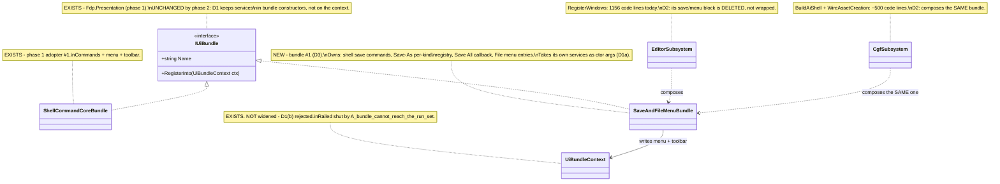

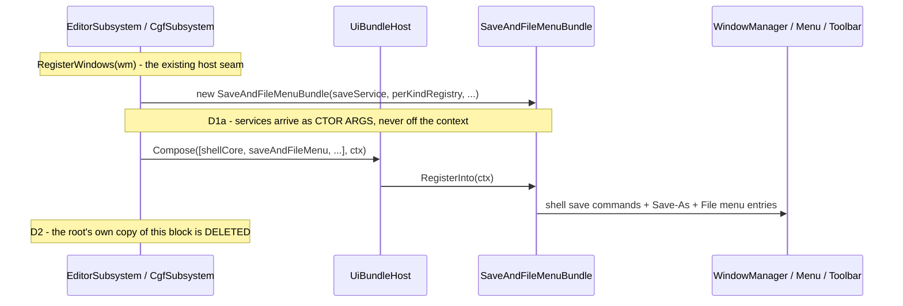

### 5c.4b 🔴🔴 ITEM ① DONE — **and it CORRECTS `D3`. There are TWO kinds of duplication, and `IUiBundle` only addresses one.**

📐 **Measured `2026-08-27`** *(the save cluster, both roots, code lines only)*. ⛔ **`D3` recommended the save
cluster as bundle #1 on a ~426-line figure. That figure was misleading and the recommendation was wrong.**

#### ⭐ What is ALREADY shared — so the 426 lines overstate the prize
✅ **`SaveAllAiDocumentsCommand.Execute` is the ONE implementation, and BOTH hosts already call it**
*(`EditorSubsystem:3482`, `CgfSubsystem:2333`)*, each passing three per-kind delegates. ⇒ ⭐ the *save
orchestration* was de-duplicated long ago; the line count is comment plus already-shared calls.

#### 🔴 What IS duplicated — measured, and it is NOT registration
| # | the duplicate | evidence |
|---|---|---|
| **①** | ⭐⭐⭐ **the BTree and HSM save delegates are LINE-FOR-LINE duplicates across the two hosts** | `EditorSubsystem:3455-3475` vs `CgfSubsystem:2106-2121`: same mapper → same `JsonServices.Serialize` → same `JsonAestheticFormatter.FlattenNumericArrays` → same `AtomicFileWriter.Write`. ⭐ **Pure functions of `(asset, path)` with ZERO host state** |
| **②** | ⭐⭐ **reload is ONE job in TWO SHAPES** | CGF: a single kind-switching `ReloadActiveAiDocument()` *(~70 code lines)*. The editor: **three separate callbacks** *(`_blueprintCompileCallback`, `_btreeQuickReloadTrigger`, `_hsmQuickReloadTrigger`)*. ⇒ ⛔ not a copy — a **divergent shape** for one concept, which is worse |

#### ⭐⭐⭐ THE STRUCTURAL FINDING — **phase 2 needs TWO vehicles, not one**
⛔ **`IUiBundle` addresses duplicated REGISTRATION. It does nothing for duplicated LOGIC.**
📐 Both of the duplicates above are **logic**, and the fix for each is a plain shared helper — ⭐ exactly what
`SaveAllAiDocumentsCommand` already IS. ⇒ ⭐⭐ **the precedent for vehicle (b) is in the same cluster as the
duplication.**

| ⭐ vehicle | for | cost |
|---|---|---|
| **(a) `IUiBundle`** *(phase 1's seam)* | duplicated **registration** blocks — windows, menu, toolbar | needs a bundle class + both roots composing it |
| ⭐⭐ **(b) a plain shared helper / service in `AiShared`** | duplicated **logic** — savers, reload, per-kind mappers | ⛔ **no seam at all.** Cheaper, and it is how this codebase already fixed the same shape *(`SaveAllAiDocumentsCommand`, `AssetRoots`, `AssetCreateController`)* |

⇒ 🔒 **`D3` REVISED:** ⛔ **do not open phase 2 with a UI bundle.** ⭐⭐ **Open it with vehicle (b) on the two
measured duplicates above** — they are small, pure, ruling-9 clear, and need **no design risk at all**:
① a shared `AiAssetSavers` *(the three delegates, one implementation)* · ② collapse reload to one
kind-switching implementation both hosts call. ⇒ ⭐ **then** take a UI bundle, with the seam question
*(`D1`)* still open and now unblocked by anything urgent.

⚠ **This is the FOURTH time this session a quoted size was wrong before it was measured** *(after the
"24-site rename", "the cheapest adopter", and `CE-018`'s phantom triplication)*. ⇒ 🔒 **the rule that keeps
earning: measure CODE lines and read the call sites before naming a first slice.**

### 5c.4c 🔒🔒 USER RULING `2026-08-27` — **the target, and the SCOPE I had wrong**

> 🔒 **User:** *"in the end there should be one UI logic (no drifts, no duplications), instantiated by
> calling shared code from different subsystems."* …and: *"are you counting also with IG and SimHost for
> unification of the shared UI parts like menus and toolbar and perspectives and all that, i.e. not just
> cgf and editor?"*

#### ⛔⛔ THE HONEST ANSWER: **NO, I WAS NOT.** Every phase, rail and parity check so far has been editor-vs-CGF
⚠ §5b.1's inventory *listed* eight host-seam implementors, but nothing in phases 0–2 ever measured
`IgSubsystem` · `SimHostSubsystem` · `ExConSubsystem` · `ReplayBrowserSubsystem` · `OrchestratorSubsystem` ·
`EyesAndMuscleSubsystem`. ⇒ ⭐ **the user's question is a scope correction, and measuring it changes `D3`.**

#### 📐 WHAT THE OTHER HOSTS ACTUALLY REGISTER *(measured, code lines)*
| host | `RegisterWindows` | menus? | toolbar? | perspectives? |
|---|---|---|---|---|
| `EditorSubsystem` | **1 156** | ✅ | ✅ | ✅ |
| `CgfSubsystem` *(+ shell trio)* | ~**500** | ✅ | ✅ | ✅ |
| `ReplayBrowserSubsystem` | ~500 | — | — | — |
| `SimHostSubsystem` | ~127 | ⛔ | ⛔ | ⛔ |
| `ExConSubsystem` | ~124 | ⛔ | ⛔ | ⛔ |
| `OrchestratorSubsystem` | ~100 | ⛔ | ⛔ | ⛔ |
| `IgSubsystem` | ~62 | ⛔ | ⛔ | ⛔ |
| `EyesAndMuscleSubsystem` | ~1 *(empty)* | ⛔ | ⛔ | ⛔ |

⇒ ⭐⭐ **For menus / toolbar / perspectives the answer is: only the editor and CGF have them.** IG, SimHost,
ExCon and the rest register **windows only** — they are **panel hosts INSIDE the shell, not shells**.
⛔ So there is nothing to unify with them *on those three surfaces*; ⚠ claiming otherwise would invent work.

#### 🔴🔴 BUT THERE IS A REAL N-HOST DUPLICATION, AND IT IS THE BIGGEST ONE IN THE REPO
📐 **Five shared UI types, 22 instantiation sites across 7 host files, ~112 lines of copy-paste:**

| shared type | sites |
|---|---|
| `FdpEntityInspectorWindow` | **5** *(Editor · CGF · IG · SimHost · ReplayBrowser)* |
| `FdpEventBrowserWindow` | **5** |
| `ArchitectureDiagnosticsWindow` | **4** |
| `SystemProfilerWindow` | **4** |
| `FdpEntityInspectorHelper.WireInspectorWithInspectContextMenu` | **4** |

⭐⭐⭐ **And the sites are already near-identical — they differ ONLY by five host values.** 📐 `SystemProfilerWindow`,
four hosts, four lines each:
```
"ig_system_profiler",      "IG System Profiler",      "IG",       () => _app.Kernel?…,      IgWindowColor.TitleBar
"simhost_system_profiler", "SimHost System Profiler", "SimHost",  () => _app?.Kernel?…,     SimHostWindowColor.TitleBar
"cgf_system_profiler",     "CGF System Profiler",     "Scenario", () => _context?.Kernel?…, TitleBarColor
"editor_system_profiler",  "Editor System Profiler",  "Scenario", () => _kernel?…,          EditorWindowColor.TitleBar
```
⇒ ⭐⭐⭐ **the parameterisation is UNIFORM: `(idPrefix, titlePrefix, perspective, kernel/repo accessors,
titleBarColor)`** — ⛔ i.e. **exactly a `HostServices` record**, the pattern `CgfEditorShellToolbar.HostServices`
already established and `ShellCommandCoreBundle` already wraps.
⇒ ⭐⭐ **22 sites collapse to ONE implementation + 5 one-line compositions.** 📌 This IS the user's sentence —
*"one UI logic, instantiated by calling shared code from different subsystems"* — and today it is achieved by
copy-paste **22 times**.

⚠ **Why line count understates it:** 112 lines is small; ⛔ **22 sites is 22 chances to drift**, and drift on
exactly these surfaces is what phase 0's rail exists to catch.

### 5c.4d ✅ `D1`–`D4`, RESOLVED — **by the user's ruling plus §5c.4b/§5c.4c's measurements**

| # | resolution |
|---|---|
| ⭐⭐ **`D1`** | ✅ **(a) — services arrive as CTOR ARGS; `UiBundleContext` is NOT widened.** 🔒 The ruling *"instantiated by calling shared code from different subsystems"* IS option (a), and §5c.4c shows the shape it takes: a small per-host record. ⛔ (b)'s service locator stays rejected |
| ⭐⭐ **`D2`** | ✅ **confirmed and STRENGTHENED: done = EVERY host's copy is deleted** 🔒 *"no drifts, no duplications"*. ⚠ With 5 hosts, a bundle only 2 compose is **not** done |
| ⭐⭐⭐ **`D3`** | ✅ **REVISED TWICE, now evidence-based.** ⓪ vehicle (b) on the two logic duplicates *(savers · reload — 2 hosts, tiny, no seam)*; ① ⭐⭐ **the DIAGNOSTICS WINDOW GROUP as the first real bundle — 22 sites, 5 hosts**, the biggest measured duplication and the one that proves the seam on **N** hosts rather than 2; ② then the editor/CGF-only shell surfaces *(menus, toolbar, perspectives)* |
| ⭐ **`D4`** | ✅ **superseded by the ruling.** ⛔ I framed phase 2 as *"decomposition, NOT de-drifting"*; 🔒 the user wants **both** — *"no drifts, no duplications"* — and §5c.4c shows why that is right: **the drift risk is 5-way, not 2-way**, so de-duplicating across hosts achieves both at once |

⇒ ⭐⭐ **`IUiBundle`'s value scales with host count.** 📌 §3.3's *"a smaller list is a SUBSET, never a branch"*
was argued for 2 hosts; with **5** it stops being a nicety and becomes the mechanism.

### 5c.4e 🔒🔒🔒 **HOW WE KNOW THE UNIFICATION DID NOT BREAK WHAT WORKS** *(user question, `2026-08-27`)*

> 🔒 **User:** *"how will you check that the unification does not destroy what now works? will you use
> current editor as something that should not change?"*

#### ⭐ THE SHORT ANSWER: **yes, current behaviour is the reference — but "the editor" alone is the WRONG reference, and the rail we have is blind to the failure that matters**

#### ⛔⛔ TWO AXES, AND PHASE 0 BUILT ONLY ONE
| axis | exists? | what it catches | ⛔ what it CANNOT catch |
|---|---|---|---|
| **A · cross-host parity** *(editor vs `--mode all`)* | ✅ **phase 0** | one host drifting from the other | 🔴🔴 **A CHANGE THAT AFFECTS BOTH HOSTS IDENTICALLY.** ⚠ If a shared bundle drops a window, renames an id or moves a perspective **on all five hosts at once, parity stays PERFECTLY GREEN** |
| ⭐⭐⭐ **B · before/after, per host** | ⛔ **DOES NOT EXIST** | ⭐ **exactly the question asked** — did today's working behaviour change? | pixels, layout, rendering |

⇒ ⭐⭐⭐ **Axis A is the wrong instrument for this question, and relying on it would be the SEVENTH instance of
the rail-blindness pattern** — 📌 the same shape as `CE-065` *(unit rails green because strict mode was off)*
and `CE-072` *(seven rails green because production had moved behind a wrapper)*. ⛔ **Unification is precisely
the class of change that moves every host together**, so the axis that compares hosts to each other goes blind
at the moment it is needed most.

#### ⛔ AND WHY *"use the current editor"* IS NOT ENOUGH ON ITS OWN
📐 The ids are **host-prefixed** — `ig_system_profiler` · `simhost_system_profiler` · `cgf_system_profiler` ·
`editor_system_profiler`. ⇒ ⭐ the editor's baseline covers **4 of the 22 sites**. ⛔ Nothing about the editor
staying identical proves `ig_system_profiler` still exists, still claims perspective `"IG"`, or still carries
IG's title-bar colour. ⇒ ⭐⭐ **every host needs its own baseline.**

#### ⭐⭐ THE MECHANISM — measured, and it is cheap
📐 **`--mode all` expands to `orchestrator,simhost,ig,excon,cgf`** *(`HrotRunnerConfiguration:124`)*, and an
explicit guard *(`:181`)* forbids the editor coexisting with IG/ExCon. ⭐ `replaybrowser` is its own mode.
⇒ ⭐⭐⭐ **THREE captures cover all 22 sites:**

| capture | covers |
|---|---|
| `--mode editor` | the editor's 4 sites |
| ⭐⭐ `--mode all` | **SimHost · IG · ExCon · CGF · Orchestrator — five hosts in ONE process** |
| `--mode replaybrowser` | ReplayBrowser's 2 sites |

⭐ **What to capture, per mode** *(all already exposed — no new engine surface)*:
`list_panels` → `{ registered[], captured[], kinds{} }` *(⭐ all four shared diagnostic windows ARE
`PanelSnapshot`-instrumented — verified)* · `list_perspectives` → the perspective every registered window
claims. ⇒ ⭐⭐ **committed as a GOLDEN per mode, then asserted equal after the refactor.**
🔒 **The invariant: the `(panelId, kind, perspective)` set per mode is UNCHANGED.** 📌 §6 already demands
window **ids** never move *("a tidier rename silently resets users' layouts")*; this makes it checkable
per host instead of by inspection.

#### ⛔⛔ THE ORDER THIS FORCES — **the baseline is the FIRST slice, before any refactor**
⚠⚠ **A golden captured after the first bundle lands is worthless** — it would enshrine whatever that bundle
did. ⇒ 🔒 **capture and commit the three goldens as their own commit, on today's code, before touching a
single registration site.** ⭐ That commit is also the cheapest possible red-proof: any later diff that
changes a host's window set turns it red immediately.

#### ⚠ THE LIMITS — stated so nobody over-trusts this
| ⚠ | |
|---|---|
| ✅✅ **CLOSED `2026-08-27` — `CE-076`, user-approved: `list_panels` now reports EVERY registered window** | ⭐⭐ `WindowManager.RegisterWindow` calls `PanelSnapshot.DeclareInstrumented(window.Id)`, so completeness is **by construction** and the gap this row used to describe is gone. 📐 **The gap was REAL and it was measured by closing it:** the editor golden grew **55 → 64** and `all` **65 → 76**, ⭐ **purely additive, zero removals**. ⚠⚠ **And inspecting that diff paid again** — the newly-visible ids include `ai_comparison_changes_{blueprint,btree,hsm}` and `ai_trace_timeline_*`, i.e. **`CE-071`'s own comparison panels had been invisible to the baseline all along**; plus `"Entity Blueprints"` *(a window whose id is its DISPLAY TITLE — filed `CE-086`)* and the two `WindowScope.Global` orchestrator windows *(explained, not a defect)*. ⇒ ⛔ **this WIDENS what `registered[]` means** — from *"instrumented panels"* to *"every registered window plus every declared panel"* — and the `RouteDoc`, `PanelSnapshot`'s summary and the regenerated `SKILL.md` all say so now *(`CE-085`)*. ⚠ **What survives is narrower:** a window registered LAZILY on first perspective activation is absent until that perspective is visited — which is why the capture WALKS them *(📐 editor: single read 63, walk 64)* |
| **ids are not PIXELS** | ⭐ this catches a dropped, renamed or added window; ⛔ it does NOT catch a panel that renders wrong. ⚠ A windowed eyes pass stays part of acceptance |
| **`captured[]` depends on a frame having drawn** | ⚠ compare `registered[]` for structure; `captured[]` is frame-dependent and will differ run to run |
| 🔴🔴 **PERSPECTIVE IS *NOT* COVERED** — ⚠⚠ **this CORRECTS the claim made two paragraphs up** | 📐 **Measured on the first capture, `2026-08-27`:** `GET /panels`'s `registered[]` is **process-wide, NOT perspective-scoped** — **54 of the editor's 55** windows came back listing all four perspectives, because the field recorded which perspectives the CAPTURE VISITED. ⇒ ⛔⛔ **it would NOT have caught `CE-071`'s `B1`**, which is exactly what this section first claimed for it. ⭐ The field was **REMOVED rather than shipped**: false confidence is worse than a named gap. ⭐⭐ The stable source is **`focus_panel`** *(returns `{panelId, perspective, isOpen, isPinned}` per panel)* — ⛔ but it has **side effects** *(opens/focuses; pins a foreign-perspective window)*, so folding it in needs its own pass. **FILED** |
| ⚠ **`kind` was also removed** | 📐 empty for **18 of 55** — it is inverted from `kinds{}`, which derives from `captured[]` ⇒ **frame-dependent** ⇒ a later run where those panels draw would redden the rail for no product change |

⭐⭐ **What the inspection proves about the METHOD, and it is the point of insisting on it:** `GoldenStore`'s
own remarks demand a capture be INSPECTED before commit *("a capture run is green by construction")*.
📐 That inspection found **two defects in the RAIL and none in the product** — ⛔ and both would have shipped as
green. ⇒ 🔒 **a golden that has never been read is not a baseline, it is a rumour.**

### 5c.5 ⭐ BUNDLE #1 — the items *(⚠ SUPERSEDED ORDERING — see §5c.4d `D3` and §5c.4e; the FIRST slice is the BASELINE)*
| # | item | proof |
|---|---|---|
| **①** | inventory the save/File-menu cluster across BOTH roots and classify each service **bundle-private vs root-shared** *(`D1`)* | ⭐ the classification is written into this section before code |
| **②** | `SaveAndFileMenuBundle` in `Hrot.Editor.AiShared.Windows`, beside `ShellCommandCoreBundle` | ⭐ its own rails |
| **③** | ⭐⭐ **both roots compose it and DELETE their copies** *(`D2`)* | ⛔ a diff showing deletion, not addition |
| **④** | ⭐⭐⭐ **an EQUIVALENCE rail, as `CE-072` demands**: the bundle emits exactly what the roots emitted — ids, sort orders, menu paths | 🔒 `CE-072`'s lesson: *a wrapper needs an equivalence rail the day it is introduced* |
| **⑤** | the phase-0 parity rail stays green; ⛔ window **ids** unchanged *(§6: a rename resets users' layouts)* | |

### 5c.6 ⭐⭐⭐ SLICE ① — **the save + reload duplicates.** `build-state: READY-TO-BUILD` *(`2026-08-27`)*

> ⭐ **This is `D3`'s slice ⓪/① — vehicle (b), NO seam.** ⛔ `IUiBundle` is not involved: this is duplicated
> **LOGIC**, not duplicated **registration**, and §5c.4b's finding is that the bundle only addresses the latter.

#### 5c.6.1 🔴 INVENTORY — **and the "line-for-line" claim in the resume doc was WRONG**

⭐ Queries: `search_graph(name_pattern=".*(SaveAllAiDocuments|AiAssetSaver|ShellSaveCommands|QuickReload|AiAssetEmit|RegenerationScheduler).*")` ⇒ `total: 145`; then the two roots read directly.

| # | the duplicate | 📐 measured |
|---|---|---|
| **a** | **BTree save delegate** — `EditorSubsystem:3455` vs `CgfSubsystem:2106` | ⚠⚠ **NOT line-for-line.** ⭐ **Semantically identical**, syntactically drifted: the editor uses `as` + a null check and a `prettyJson` local; CGF uses `is not … return` and inlines the flatten. ⇒ 🔴 **the drift ALREADY HAPPENED** — which strengthens the case, it does not weaken it |
| **b** | **HSM save delegate** | same shape, same verdict |
| **c** | **Blueprint save delegate** | ⛔ **a REAL behavioural difference**: the editor also calls `_blueprintSaveDirtyTracker.MarkClean(bpAsset.AssetId)`; CGF constructs no tracker. ⇒ ⭐ the shared part is the **doc→ctx→AssetRef lookup**, and the tracker stays a host concern |
| **d** | **BTree + HSM reload arms** — `EditorSubsystem:4307`/`:4330` vs `CgfSubsystem:2370`/`:2383` | ⭐⭐ **these ARE line-for-line**, down to the `$"BTreePatch_{dto.AssetId:N}_{Guid.NewGuid():N}"` assembly-name format |
| **e** | **the reload DISPATCHER** | ⛔⛔ **two different shapes**: CGF has ONE method `ReloadActiveAiDocument()` switching on `ctx.AssetRef`'s runtime type; the editor has **three** delegates plus a **fourth** inline `switch` on `Active.Kind` in its toolbar `HostServices` *(`:4506`)* |

#### 5c.6.2 ⛔⛔⛔ THE CONSTRAINT THAT DECIDES THE SHAPE — **a reference cycle**

📐 **Measured.** `Hrot.BTree.Editor`, `Hrot.Hsm.Editor` **and** `Hrot.Blueprints.Editor` all reference
`Hrot.Editor.AiShared`. ⇒ ⛔⛔ **AiShared can NEVER name `BehaviorTreeAsset`, `HsmAsset` or `BlueprintAsset`** —
a shared saver taking an asset is a **circular project reference**, not a style choice.
⚠ **This is why `ShellSaveCommands` already takes host-supplied `saveBTree`/`saveHsm` delegates** — that seam
is deliberate, and it was not obvious from the code alone.

📐 **The only non-test projects that see all three are the two hosts themselves.** ⇒ ⛔ **there is no existing
shared home**, and 🔴 **a new project is the wrong price** for ~33 duplicated lines in a 149-project solution.

⭐⭐⭐ **THE WAY THROUGH — `DTO`-in, not asset-in.** 📐 `BehaviorTreeAssetDto` / `HsmAssetDto` live in
**`Hrot.AiEditor.Persistence`**, which AiShared **does** reference, and every emit/serialize step already takes
a DTO *(`EmitTopologyCore(BehaviorTreeAssetDto)`)*. ⇒ ⭐⭐ **only `ToDto(asset)` needs the concrete type.**
**The host maps; AiShared owns everything after the map.**

#### 5c.6.3 ⭐ THE DECISIONS

| | decision | why |
|---|---|---|
| **`E1`** | ⭐⭐ **the shared unit takes a DTO** — `AiAssetSavers.SaveBTree(BehaviorTreeAssetDto, path)` | ⛔ the cycle forbids asset-in *(§5c.6.2)* |
| **`E2`** | ⭐⭐⭐ **AiShared owns the reload POLICY** — the null-active arm, the kind dispatch, the default arm, the try/catch, and **ruling 53's origin-side log** — with per-kind **arms** supplied by the host | ⭐ the policy is where the drift hurt: the editor has **no** try/catch, **no** log and **no** default arm |
| **`E3`** | ⭐⭐ **every status string is formatted in ONE place** | 🔴 the user-visible surface of this duplication IS the status text; two formatters is two wordings |
| **`E4`** | ⭐ **dispatch on `AssetKind`, not on `AssetRef`'s runtime type** | ⛔ AiShared cannot name the types. ⚠ **To preserve CGF's behaviour when `AssetRef` is null/mismatched, each arm returns the SHARED `NoCompilableContext` text** — so the two hosts stay byte-identical |
| **`E5`** | ⛔ **the Blueprint dirty-tracker stays host-side** | 📐 only the editor has one *(§5c.6.1 c)*; ⭐ ruling 49 — absent-and-explained beats a null-tolerant shared field |

#### 5c.6.4 ⚠⚠ WHAT THE EDITOR GAINS — **stated LOUDLY, because "the editor must not change" is the reference**

🔒 **The user's safety-net question makes today's editor the reference.** ⛔ **This slice deliberately changes it
in four ways, and every one is the editor adopting behaviour CGF already has:**

| # | the editor gains | authority |
|---|---|---|
| **①** | ⭐⭐ **an origin-side log on every reload** | 🔒 **ruling 53** — `DESIGN_Cgf_Editor_Sharing_Slice3_Editing_HotReload.md` §10.4: *"the origin-side log is the whole safety net, so it is a requirement, not a nicety"* |
| **②** | ⭐ **a try/catch** — a failed compile reports instead of propagating out of an ImGui callback | ⭐ same design: *"a compile is user input; it must not take the node down"* |
| **③** | ⭐ **an explicit default arm** — *"'X' (Kind) has no compilable canvas context"* instead of a silent no-op | ⛔ the editor's `switch` at `:4506` falls through in silence |
| **④** | ⭐ **one status wording** shared with CGF | `E3` |
| ⛔ **NOT changed** | window ids · toolbar ids · sort orders · menu paths · the save file bytes | ⭐ **the baseline rail + the byte-equivalence rail below prove this** |

#### 5c.6.5 ⭐ THE UML *(obligation ①; every box EXISTS unless marked NEW)*

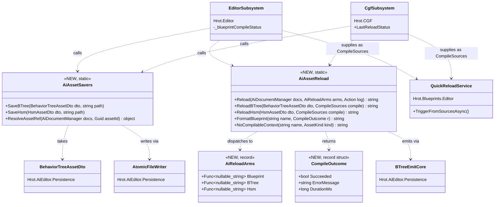

⛔⛔ **The arrow that must NOT exist:** `AiAssetSavers --> BehaviorTreeAsset`. 📐 It would be a **cycle**
*(§5c.6.2)*, and the DTO boxes are on this canvas precisely so that temptation is visible.

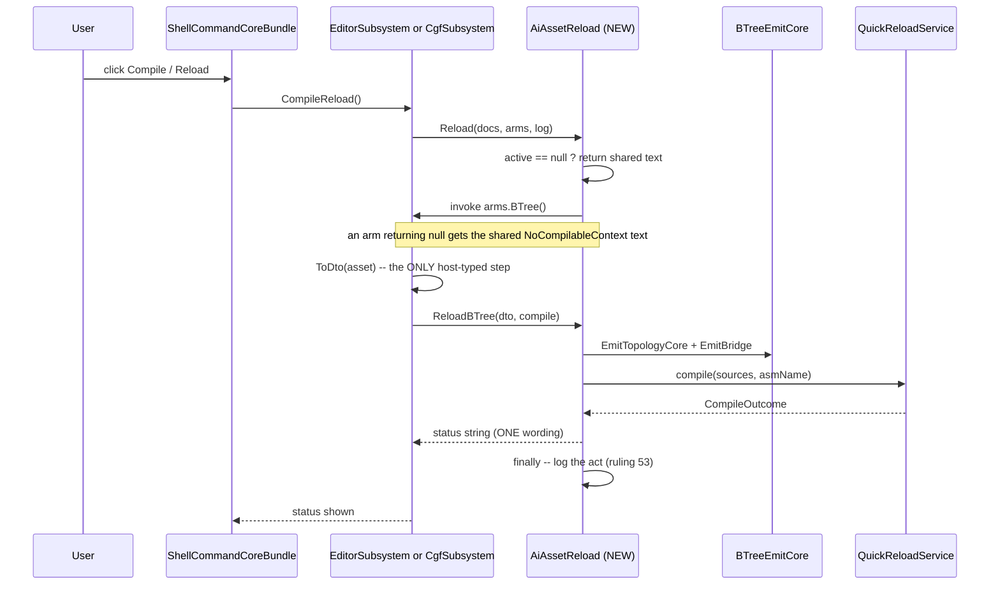

#### 5c.6.6 The items

| # | item | proof |
|---|---|---|
| **①** | `AiAssetSavers` + `AiAssetReload` in `Hrot.Editor.AiShared/Documents/` | ⛔ **DTO-in only** — a compile error is the gate on `E1` |
| **②** | ⭐⭐ **both roots call them and DELETE their bodies** | ⛔ a diff showing deletion |
| **③** | ⭐⭐⭐ **a BYTE-EQUIVALENCE rail** *(`CE-072`)*: for each `(kind, outcome)` the shared formatter emits **exactly** the string the host emitted, and the saved file bytes are **identical** to the pre-change writer | ⭐ `Hrot.Editor.AiShared.Tests` references all three asset projects ⇒ it can build **real** assets |
| **④** | the three `ui-baseline-*` goldens stay **unchanged** | ⛔ this slice touches no window/toolbar id ⇒ ⭐ **an unchanged golden is the assertion**, not a re-capture |

#### 5c.6.7 ✅ AS-BUILT *(`2026-08-27`, `CE-078`)* — **five deviations, each argued**

> ⭐⭐ Obligation ⑤: the diagrams above are **edited to the as-built**, not merely annotated — 🔒 the
> `2026-08-27` lesson that *an as-built note is not a diagram edit*. ⚠ The `AiReloadArms` box and the
> sequence's null-arm note are the two edits.

| # | ⭐ deviation from §5c.6.3–§5c.6.5 | why |
|---|---|---|
| **①** | ⭐⭐ **the arms return `string?`, not `string`** — a null means *"right kind, no model to compile"* and the shared policy then supplies `NoCompilableContext` | ⭐ the designed shape made every arm re-derive that wording, which is the duplication the slice exists to remove. ⛔ **The `E4` promise is stronger this way**, not weaker |
| **②** | 🔴🔴 **THERE WERE THREE DISPATCHERS, NOT TWO.** §5c.6.1 e named CGF's method and the editor's toolbar switch; 📐 measuring found a **third** — the editor's MCP `reloadAsset` route *(`EditorSubsystem:3123`)* — **with its own third wording** *("is not a reloadable kind")* | ⭐ both editor dispatchers now call the one shared policy. ⚠ **The wording change is externally visible on an MCP route** ⇒ filed as **`CE-080`** so the MCP lane can refresh its route docs *(in `skill-parts/`, ⛔ never the generated `SKILL.md`)* |
| **③** | ⛔⛔ **the Blueprint arm is a PARAMETER of the shared dispatcher, not a shared body** | 📐 the editor's two dispatchers used **two different Blueprint paths** — `_blueprintCompileCallback` *(a captured registrar toolbar callback)* vs `_blueprintQuickReloadTrigger`. ⇒ ⛔ **their equivalence is unproven, and collapsing two paths on a guess is the mirror error.** ⭐ Filed as **`CE-079`**; the BTree/HSM arms and the whole policy ARE shared, which is what the slice claimed |
| **④** | ⭐ **`_btreeQuickReloadTrigger` / `_hsmQuickReloadTrigger` are DELETED**, not just emptied | 📐 their only callers each were the two switches this slice replaced ⇒ a field whose every caller became `AiAssetReload.Reload` has no callers |
| **⑤** | ⚠ **a FIFTH editor delta, not in §5c.6.4's table: the log now fires on the no-active-document path too** | ⭐ an operator who triggered a reload over MCP and got nothing logged is precisely the gap ruling 53 addresses. ⛔ Deliberate, and railed |

⭐⭐ **AND A DEFECT FOUND IN THE SAFETY NET ITSELF — `CE-081`.** 📐 Running the phase-2 baseline rails
through `scripts/run-system-tests.sh` printed **"No test matches the given testcase filter"** and exited
**0**. ⛔⛔ The script filters `(Category=SystemSmoke|Category=SystemModes)` and
`TheUiBaselineIsPinnedPerHostRails` declared only `lane=T3` ⇒ **the whole baseline was UNREACHABLE from the
project's standard system-test entry point**, and a run aimed at it was a **silent zero-test green.**
⚠⚠ **That is the rail-blindness shape in the HARNESS rather than the assertion** — 🔒 and it is the same
lesson as `CE-075`'s own: *a golden that has never been read is not a baseline, it is a rumour* — here, a
rail nothing can run is not a rail. ✅ Fixed by adding `[Trait("Category","SystemModes")]`, the bucket
`ModeStartupRails` uses for mode-parameterised cases.

### 5c.7 ⭐⭐⭐ SLICE ② — **the diagnostics window group, the first REAL bundle.** `build-state: READY-TO-BUILD` *(`2026-08-27`)*

> ⭐⭐ **This is `D3`'s slice ②, and the FIRST use of `IUiBundle` for duplicated REGISTRATION** *(slice ① was
> duplicated LOGIC, vehicle (b), no seam — §5c.6)*. ⭐ It proves the seam at **N=4**, not 2.

#### 5c.7.1 🔴🔴 INVENTORY — **the headline number was WRONG: 20 sites / 4 hosts, not 22 / 5**

⭐ Queries: `search_graph(name_pattern=".*(FdpEntityInspectorWindow|FdpEventBrowserWindow|ArchitectureDiagnosticsWindow|SystemProfilerWindow|FdpEntityInspectorHelper).*")` ⇒ `total: 42`, then every `new X(` call site read directly.

| site | IG | SimHost | CGF | Editor | ⛔ ReplayBrowser |
|---|:--:|:--:|:--:|:--:|:--:|
| `FdpEntityInspectorWindow` · `FdpEventBrowserWindow` · `ArchitectureDiagnosticsWindow` · `SystemProfilerWindow` · `WireInspectorWithInspectContextMenu` | ✅ 5 | ✅ 5 | ✅ 5 | ✅ 5 | ⛔ — |

⇒ 📐 **each of the five is exactly 4 ⇒ 20 sites across 4 hosts.**
⛔⛔ **The "5th host" does not exist for this bundle.** 📐 ReplayBrowser registers
`Fdp.Presentation.Windows.ReplayBrowser.FdpEntityInspectorWindow` / `…FdpEventBrowserWindow` — **a
DIFFERENT TYPE in a DIFFERENT ASSEMBLY** *(`ReplayBrowserSubsystem:632,642`)*, and it has **no** profiler
and **no** architecture window. ⇒ ⭐ it **cannot** join a bundle over the `Hrot.Presentation.Windows`
types; ⚠ the graph found the two same-named classes and that is what caught it.
📐 **ExCon and Orchestrator register NONE of the five.**

⭐⭐ **The ids and titles are perfectly regular across all four** ⇒ **two strings generate all eight:**
`{IdPrefix}fdp_inspector` · `{IdPrefix}fdp_events` · `{IdPrefix}architecture_diagnostics` ·
`{IdPrefix}system_profiler`, titled `"{TitlePrefix} Entity Inspector"` and so on.

#### 5c.7.2 ⚠⚠ THREE REAL DRIFTS — **each must be PRESERVED, not tidied**

| # | 📐 measured | ⇒ consequence for the design |
|---|---|---|
| **`G1`** | ⛔ **the editor GUARDS the last two windows on `if (_kernel != null)`; the other three hosts do not.** ⚠ And the editor binds the kernel **EAGERLY** — `new ArchitectureDiagnosticsService(_kernel)` — where the others bind **lazily**, `() => _app.Kernel` | ⛔⛔ **unifying to the lazy form would make the editor register two windows it currently may not** ⇒ **the registered set moves** ⇒ 🔴 the `ui-baseline` golden moves. ⭐ **Preserved by taking the PRE-BUILT panel** *(`F2`/`F3`)* |
| **`G2`** | 🔴 **IG and SimHost pass a DIFFERENT title-bar colour to the HELPER than to their windows.** 📐 IG: windows `(0.07,0.30,0.07)` vs helper `(0.08,0.40,0.08)`; SimHost: windows `(0.50,0.10,0.10)` vs helper `(0.40,0.08,0.08)`. ⭐ Editor and CGF pass one value to both | ⛔ **collapsing to one field would silently RECOLOUR every spawned "Inspect…" watch window on two hosts** ⇒ ⭐ **two fields**, the second defaulting to the first *(`F4`)*. ⚠ Almost certainly latent drift *(the `*WindowColor` constants look newer than the helper call)* — ⛔ **but a UI change is not this slice's to make**; FILED |
| **`G3`** | ⭐⭐ **a ~30-line reflector block is duplicated VERBATIM between CGF and the editor** — two `AddBufferViewProvider` calls plus the whole `EditContextFactory` lambda. ⛔ IG and SimHost have **none** of it | ⇒ ⭐ **NOT in the bundle** — putting it there would give IG/SimHost a capability they do not have today. ⭐⭐ **A shared static method with exactly two callers** *(`F5`)* |

⭐ **And one thing that is NOT a constraint:** 📐 the helper's `RegisterWindow` sits **inside the
"Inspect…" click lambda** *(`FdpEntityInspectorHelper:80`)*, so it registers **nothing** eagerly ⇒ ⚠ CGF
calls the helper *before* its inspector window and the others *after*, and **that order cannot move the
registered set.**

#### 5c.7.3 ⭐ THE DECISIONS

| | decision | why |
|---|---|---|
| **`F1`** | ⭐⭐ **the bundle lives in `Hrot.Presentation.Windows`** | 📐 it already OWNS all five types, references `Fdp.Presentation` *(so `IUiBundle` is reachable)*, and **all four hosts reference it**. ⭐ ⛔ **no cycle here** — unlike slice ① *(§5c.6.2)*, which is why the reference direction is checked FIRST now |
| **`F2`** | ⭐⭐⭐ **the record takes the pre-built `ArchitectureDiagnosticsPanel`, NOT a kernel accessor** | ⛔ `Hrot.Presentation` does not reference `Fdp.ModuleHost`, so it cannot build the service — ⭐ **and that limitation is a gift:** each host keeps constructing its own service verbatim, so `G1`'s eager/lazy split is **untouched** and no behaviour changes |
| **`F3`** | ⭐⭐ **the editor's guard becomes `ArchitecturePanel: null, ExecutionStats: null`** | ⭐ ruling 49 — absent-and-explained. ⛔ A host that cannot service a window must not register it, which is exactly what the guard said |
| **`F4`** | ⭐⭐ **two colour fields**; `InspectContextMenuTitleBarColor` defaults to `TitleBarColor` | `G2`. ⭐ Three hosts pass one value; the two that differ say so explicitly |
| **`F5`** | ⭐ **`G3`'s block becomes a shared static method, not a bundle member** | ⛔ IG/SimHost must not gain it. 📐 `StructEdit.Core` IS reachable from `Hrot.Presentation`, so this is feasible |
| **`F6`** | ⭐ **IG and SimHost gain their FIRST `UiBundleHost.Compose` call** | 📐 measured: CGF and the editor already have one, IG/SimHost have none ⇒ ⭐ this is the seam's real adoption, not a rename |

#### 5c.7.4 ⭐ THE UML *(obligation ①; every box EXISTS unless marked NEW)*

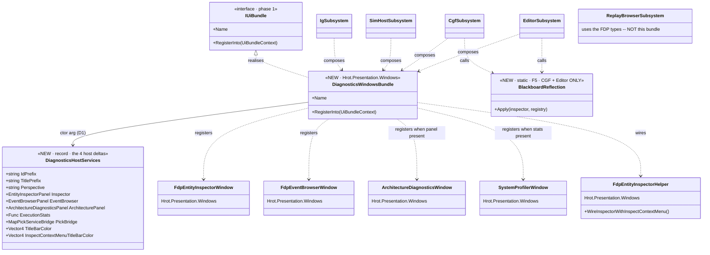

⛔⛔ **The arrows that must NOT exist:** `ReplayBrowserSubsystem --> DiagnosticsWindowsBundle` *(different
types — `5c.7.1`)* and `IgSubsystem --> BlackboardReflection` / `SimHostSubsystem --> BlackboardReflection`
*(they have no such wiring today — `G3`)*. ⭐ Both are drawn as absences on purpose.

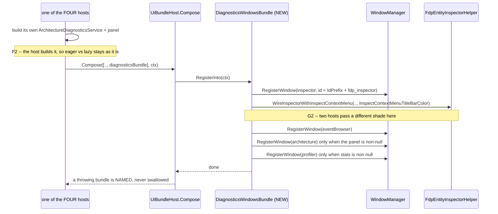

#### 5c.7.5 The items

| # | item | proof |
|---|---|---|
| **①** | `DiagnosticsHostServices` + `DiagnosticsWindowsBundle` in `Hrot.Presentation/Windows/` | ⛔ registers windows only — the `IUiBundle` constraint |
| **②** | ⭐⭐ **all FOUR hosts compose it and DELETE their 20 sites** | ⛔ a diff showing deletion |
| **③** | `BlackboardReflection.Apply` shared by CGF + the editor *(`F5`)* | ⛔ **exactly two callers** — a third would be a behaviour change |
| **④** | ⭐⭐⭐ **an EQUIVALENCE rail** *(`CE-072`)*: for each of the four hosts the bundle emits **byte-identical** ids, titles, perspectives and colours to today's hand-written calls — ⚠ including `G2`'s two shades and `G1`'s absence | ⭐ a real `WindowManager`, four host fixtures |
| **⑤** | ⭐⭐ **the three `ui-baseline-*` goldens stay UNCHANGED** | 🔴 this slice moves REGISTRATION, so an unchanged golden is the load-bearing proof — ⛔ any movement is a regression, not a re-capture |

#### 5c.7.6 ✅ AS-BUILT *(`2026-08-27`, `CE-082`)* — **built as designed; three findings from the build itself**

> ⭐ **No design deviation.** ⭐⭐ Every decision `F1`–`F6` held: the bundle lives in `Hrot.Presentation.Windows`,
> takes the pre-built panel, keeps the editor's guard as nulls, carries two colour fields, keeps `G3` out,
> and IG/SimHost gained their first `Compose` call. ⛔ The diagrams in §5c.7.4 are TRUE as built.

⭐⭐⭐ **ITEM ⑤ DISCHARGED — the proof this slice needed.** 📐 `TheUiBaselineIsPinnedPerHostRails` **5/5**
through `run-system-tests.sh`, and **the three goldens did NOT move.** ⇒ ⭐ **20 registration sites moved into
one bundle and the registered window-id set is byte-identical** on `editor`, on `all` *(five hosts in ONE
process — IG, SimHost, ExCon, CGF, Orchestrator)* and on `replaybrowser`. ⚠ **This is exactly the class of
change axis A is blind to** *(§5c.4e)*, so the before/after axis is what carried it.

| # | ⚠ finding FROM THE BUILD *(not a design change)* |
|---|---|
| **①** | ⛔⛔ **THE EQUIVALENCE RAIL CRASHED THE TEST HOST, and a filtered green hid it.** 📐 The new class passed **9/9 filtered** and the rest of the assembly passed **140/140** — but TOGETHER the host **died**, because registering real windows touches the **process-global `PanelSnapshot` singleton** and the class ran in parallel with the four that serialise on it. ⭐ **The convention already existed** — `PanelSnapshotTestCollection`, mirrored in two other assemblies — and the rail was written without it. ⇒ 🔒 **a green FILTERED run is not evidence a new test class is safe in its assembly**; run the whole project suite before believing a new rail |
| **②** | ⭐⭐ **THE COMPILER ENFORCES `G1`.** 📐 Attempting the inverse-edit red-proof by deleting the `ArchitecturePanel != null` guard **failed to compile** — `CS8604`, possible null reference for a non-nullable parameter. ⇒ ⭐ nullable analysis is a **second rail** on the editor's kernel guard: you cannot drop it accidentally, only by writing `!`. ⚠ The red-proof therefore had to force past it *(`h.ArchitecturePanel!`)*, which it did, and the rail reddened |
| **③** | ⚠ `ArchitectureDiagnosticsPanel` **rejects a null service**, so the fixture needs a real stub, not `null!`. ⭐ Minor, but the first draft threw in the fixture on every case — 📌 **a fixture bug that reads exactly like a product failure** |

⭐ **Red-proofs — 3 inverse edits, 8/9 red, and the one survivor was correct** *(the bundle-name rail, which
no edit touched)*: renaming an id ⇒ all four host rails + the scheme rail red · dropping `G1`'s guard ⇒ the
kernel rail red · leaking the inspect colour onto a window ⇒ the `G2` rail red.

⚠⚠ **PRE-EXISTING REDS, proven against base sha `e4ff81035`** — ⛔ named because a report that says "green"
over these would be false:
| suite | mine | base `e4ff81035` | verdict |
|---|---|---|---|
| `Hrot.IG.Tests` | 5 failed / 410 / 1 skip | ⭐ **5 / 410 / 1 — identical** | ⛔ pre-existing *(`EntityInfoTranslatorTests` ×4 DDS-translation, `EntityMasterTranslatorTests` ×1)* |
| `Hrot.SimHost.Tests` | 1 failed / 768 / 3 skip | ⭐ **1 / 768 / 3 — identical** | ⛔ pre-existing *(replay/recording)* |
| `Hrot.Presentation.Tests` | 149/149 green, ⚠ **but FLAKY** | — | ⛔ **pre-existing flake, reproduced 3-of-6 with the new class EXCLUDED**; ⭐ **the identity ROTATES** *(`EntityDragGizmoTests`, `RouteWaypointGizmoTests`, `TheDragCommitsThroughTheWriteRouterTests` ×2 — all gizmo/ECS-write)*. 📌 The `DEBT-AIB-030` shape; filed as **`CE-084`** |

### 5c.8 🔴🔴 SLICE ③ — **MOSTLY ALREADY DONE. The measurement, and the little that remains.** `build-state: READY-TO-BUILD` *(`2026-08-27`)*

> ⛔⛔ **The plan's slice ③ said *"the editor/CGF-only shell surfaces (menus, toolbar, perspectives)"* as if
> they were unshared. 📐 MEASURED: they are almost entirely shared ALREADY** — by slice A, `E2`, `E3`,
> `CE-016`, `CE-054`, `CE-058` and `CE-059`, all of which landed after that plan line was written.
> ⇒ ⭐⭐ **the seam law, again and in its purest form: the shared thing existed and was already adopted.**
> ⛔ **Building an `IUiBundle` here would be ceremony over ~5 lines**, and it would put toolbar ids and sort
> orders — which the `ui-baseline` golden pins — at risk for no gain.

#### 5c.8.1 📐 THE INVENTORY — **what is already one implementation**

| shell surface | 📐 measured state |
|---|---|
| ⭐⭐ **menus** | ✅ **ALREADY ONE.** 📐 `grep -c` for menu registration in both composition roots: **0 and 0.** Every item comes from `ShellCommandCoreBundle` + `ScenarioMenuCommands`. ⇒ ⛔ **nothing to unify** |
| ⭐⭐ **perspective toolbar buttons** | ✅ **ALREADY ONE CLASS**, same `sortOrder: 20`, same icon-provider shape, both hosts *(`CE-054`)*. ⚠ One asymmetry left, and it is **DEAD CODE not drift** — see `H2` |
| ⭐ **perspective icon keys** | ✅ **ALREADY ONE TABLE** — `PerspectiveIconKeys` in AiShared *(`CE-058`)*; five inline calls collapsed |
| ⭐ **AI-debug command group** | ✅ **ALREADY A SHARED REGISTRAR** both hosts call — `AiDebugCommands.Register` *(`CE-059`)* |
| ⭐ **the File/save/open toolbar + menu table** | ✅ **ALREADY ONE** — `CgfEditorShellToolbar` via `ShellCommandCoreBundle`, one registration list *(ruling 58)* |
| ⚠⚠ **the toolbar TIME-CONTROL group** | 🔴 **STILL DUPLICATED** — the only real one left. See `H1` |
| ⚠ **the STATUS-BAR time section** | ⛔ **NOT a duplicate to collapse:** different section classes and per-host ids *(`editor_time_controls` vs `cgf_time_controls`)*, and the editor's takes four host services CGF has no analogue for. ⭐ Left alone, deliberately |

#### 5c.8.2 ⭐ WHAT ACTUALLY REMAINS — two items, both small

| # | 📐 measured | decision |
|---|---|---|
| **`H1`** | **4 IDENTICAL LINES × 2 hosts**: `new MainToolbarTimeControlSection(facade)` then `RegisterEntry("TimeControlGroup", sortOrder: 0, declaredHeight: DefaultEntryHeight, …Render)` — `EditorSubsystem:4715` vs `CgfSubsystem:1359`. ⚠ They differ in **one** thing: the editor also emits `RegisterSeparator("ToolbarSep_TimeToPersp", sortOrder: 10)`, which **`CE-016` §7 deliberately DELETED on CGF** *(it separated the time group from a perspective group CGF did not then register)* | ⭐⭐ **ONE shared registrar taking the `ITimeTransportFacade` and an explicit `withSeparator` flag.** ⛔ Not a bundle — a static registrar beside the section it registers. ⭐⭐⭐ **The separator becomes a NAMED PARAMETER instead of a silent divergence**, which is the whole point: the difference stays, but it is now declared |
| **`H2`** | ⛔ **CGF carries TWO DEAD `if (windowManager.MainToolbar != null)` GUARDS** *(`:1357`, `:2161`)*. 📐 Verified at source: `WindowManager` line 406 is `private readonly MainToolbarManager _mainToolbar = new();` exposed by an expression-bodied property ⇒ **it can never be null**. ⚠ The editor already removed its own copy and left the measurement in a comment *(`:4525`)* | ⭐ **Delete both.** ⛔ A guard against an impossible state reads as a real capability check and invites the next reader to add a third |

⛔⛔ **What slice ③ does NOT do, and why:** no window id, toolbar id or sortOrder changes. 🔴 The
`ui-baseline` goldens pin the window set and `TheToolbarLayoutIsOneListTests` pins toolbar ids + sort orders
+ menu paths ⇒ ⭐ **an unchanged golden and an unchanged toolbar rail are the acceptance**, exactly as in
slice ②.

#### 5c.8.3 ⭐ THE UML *(obligation ①; every box EXISTS unless marked NEW)*

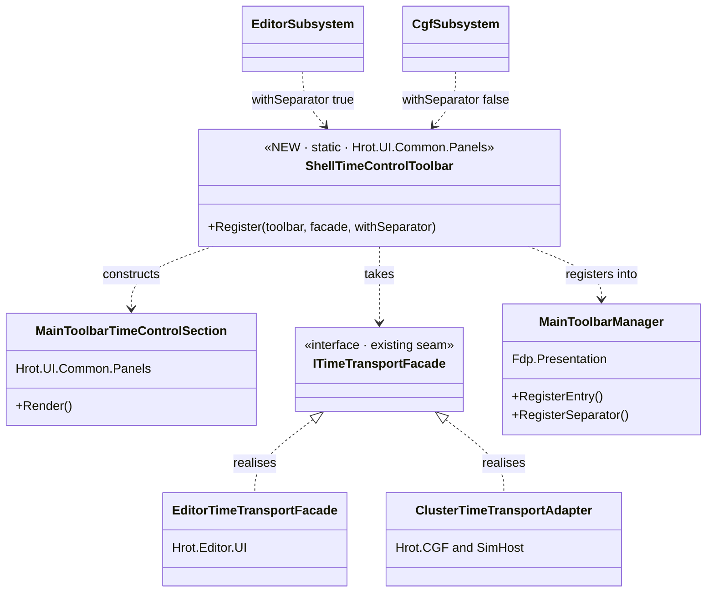

⭐ **The two `withSeparator` arrows ARE the design.** ⛔ Before this, that difference lived as one host
having a line the other had deleted — visible only to someone diffing two 3 000-line files.

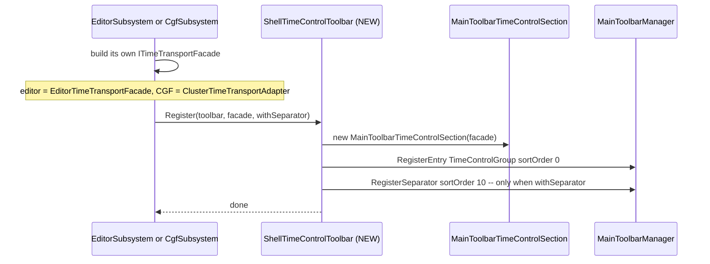

#### 5c.8.4 The items

| # | item | proof |
|---|---|---|
| **①** | `ShellTimeControlToolbar` beside `MainToolbarTimeControlSection`; both hosts call it *(`H1`)* | ⛔ a diff showing deletion at both sites |
| **②** | delete CGF's two dead `MainToolbar != null` guards *(`H2`)* | 📐 the `readonly … = new()` measurement |
| **③** | ⭐⭐ **an equivalence rail**: the entry id + sortOrder + declared height are unchanged, and the separator appears **only** for the host that asked | 🔒 `CE-072` |
| **④** | ⭐⭐ `TheToolbarLayoutIsOneListTests` and the three `ui-baseline` goldens stay **UNCHANGED** | ⛔ any movement is a regression |

#### 5c.8.5 ✅ AS-BUILT *(`2026-08-27`, `CE-089`)* — **built as designed; the headline IS the measurement**

⭐⭐⭐ **Slice ③'s real deliverable was the INVENTORY.** 📐 Menus: **0 hand-written registrations in either
host**. Perspective buttons, icon keys, AI-debug commands, the File/save/open table: **already one
implementation each**. ⇒ ⛔ what the plan called a slice was **~4 duplicated lines and two dead guards**.
🔒 **The seam law in its purest form** — and worth naming as the *seventh* wrong size estimate this
programme has recorded.

| ⭐ built | |
|---|---|
| **`H1`** | `ShellTimeControlToolbar.Register(toolbar, facade, withSeparator)` beside the section it registers; both hosts call it. ⭐⭐ **The editor/CGF separator difference is now a NAMED PARAMETER** instead of a line one host has and the other deleted |
| **`H2`** | CGF's **two dead `MainToolbar != null` guards deleted** — 📐 `WindowManager:406` is `private readonly MainToolbarManager _mainToolbar = new();` behind an expression-bodied property |
| ⛔ **NOT built** | an `IUiBundle` for this. ⭐ A bundle is for duplicated registration at SCALE *(the diagnostics group's 20 sites)*; wrapping four lines would be ceremony and would risk the sort orders the toolbar rail pins |

⚠ **One decision inside the frame, recorded because it is a judgement and not a measurement:** `CE-054`
has since given CGF the perspective group the deleted separator used to precede, so `withSeparator: true`
there would now be defensible. ⛔ **Left `false`** — turning it on is a **visible toolbar change**, and this
slice changed no toolbar output. ⭐ Filed as a one-line question rather than taken silently.

⭐ **Red-proofs — 3 inverse edits, 4/6 red**, and the two survivors were correct *(the height and null-check
rails, which no edit touched)*: renaming the entry id · moving the separator to sortOrder 11 · making the
separator unconditional.

⚠⚠ **PRE-EXISTING RED, proven against base sha `dce1638cd`:** `Hrot.Presentation.Tests` reports
**1 failed / 148 passed** at base too — `ScenarioFileServiceTests.SaveLoad_RoundTrip_PreservesEntitiesAndComponents`.
📐 It **passes 4/4 in isolation** and fails only in the full run ⇒ **order-dependent shared state**, the same
`Hrot.ScenarioEditor.Tests` family as `CE-084`'s rotating set, so it is folded into that row rather than
given an id of its own. 🔒 **And it retro-corrects my own earlier readings:** the "149/149 green" this suite
reported during `CE-076`'s gates were the LUCKY orderings — ⛔ **exactly what `CE-084`/`CE-088` say a green
from these suites is worth.**

### 5c.9 ⭐⭐⭐ PHASE 2 CLOSING INVENTORY — **what is left, and the order to do it in** *(measured `2026-08-27`)*

> 🔒 **User question:** *"how big is the composition root part of the subsystems that is still left to unify?
> what features does it cover?"* ⇒ ⭐⭐ **MEASURED, not estimated** — this programme has recorded **seven**
> wrong size estimates, so the numbers below come with the commands that produced them.

#### 5c.9.1 📐 THE ROOTS TODAY

| root | total | ⭐ **code** | comment |
|---|---:|---:|---:|
| `EditorSubsystem` | 5 379 | **2 952** | 45 % |
| `CgfSubsystem` | 2 656 | **1 225** | 54 % |
| `ReplayBrowserSubsystem` | 1 086 | 794 | |
| `ExConSubsystem` | 609 | 362 | |
| `OrchestratorSubsystem` | 460 | 292 | |
| `SimHostSubsystem` | 390 | 200 | |
| `IgSubsystem` | 224 | 106 | |

⛔⛔ **The bottom five are PANEL HOSTS, not shells** — they register windows only *(§5c.4c)* ⇒ ⭐ there is no
shell composition to unify with them, and slice ② already covered the one thing they DO share.

#### 5c.9.2 🔴 THE ARENA, AND WHAT IS STILL DUPLICATED IN IT

📐 **The UI-composition members:** `EditorSubsystem.RegisterWindows` **1 083 code lines** ·
CGF's `RegisterWindows` + `BuildAiShell` + `WireAssetCreation` = **62 + 178 + 217 = 457** ⇒ **~1 540 lines
of arena.**

📐 **Method:** strip comments and blank lines, normalise whitespace, then find maximal runs of
**identical** code lines between the two roots *(minimum run 4)*.

| ⭐ result | |
|---|---|
| **106 identical code lines**, in **22 runs** | ⇒ ⭐ **~7 % of the arena** |
| of which ~26 are **braces / `break;`**, ~12 are **field declarations**, ~8 are the **shared calls' own invocations** *(`UiBundleHost.Compose`, `ScenarioMenuCommands.Register` — adoption, NOT duplication)* | ⇒ ⭐⭐ **~60 meaningful lines** |
| and **~35 of those 60 are duplicated ARGUMENT LISTS to classes that are ALREADY shared** | ⇒ ⭐⭐⭐ **only ~24 lines of genuinely duplicated LOGIC remain** |

⚠⚠ **THE LIMIT OF THIS MEASUREMENT, stated so nobody over-trusts it:** ⛔ **it finds VERBATIM duplication
only.** 📌 Slice ①'s save delegates were *"semantically identical, syntactically drifted"* — ⛔ **they would
NOT appear in this 106.** ⇒ ⭐⭐ **treat 106 as a FLOOR, not a ceiling**; the rest surfaces by READING, which
is how slice ① found its.

⭐ **Also fenced off, by the standing user ruling** *(§3.1: modules, systems and network translators are
"a very sensitive topic where the unification does not apply")*: `Initialize` is **800** code lines on the
editor and **344** on CGF. ⚠ A crude pattern match puts the module/system/network share at only **~9 %** and
**~23 %**, so most of `Initialize` is per-host **asset and service construction** — ⛔ not a unification
target either, and not counted in the arena above.

#### 5c.9.3 ⭐ THE FOUR REMAINING CLUSTERS — **and the feasibility that orders them**

| # | cluster · what it covers | 📐 owning assembly | ⛔ cycle? |
|---|---|---|---|
| **`J1`** | ⭐⭐ **the AI asset catalog + document factories** — the whole catalog-construction block *(contributors, the six builder delegates, json wiring, root resolution)*, the `switch (doc.Kind)` document dispatch, `hostServices: ctx?.View.Host`. 🔴 **~45 code lines PER HOST — see the correction in §5c.9.3b; the verbatim scan reported ~5** | `Hrot.BTree.Editor` / `Hrot.Hsm.Editor` | 🔴 **YES — the same wall as slice ①** *(§5c.6.2)*: those projects reference AiShared, so AiShared can never name the contributors. ⇒ ⭐ contributors stay host-side as closures *(which is what the existing lambdas already are)*; only the ORCHESTRATION could move |
| **`J2`** | ⭐ **asset creation** — `AssetCreateController`'s **five identical lambdas** *(`findCatalogued`, `refreshFromAssembly`, `refreshJsonContributor`, `openDocument`, `blueprintRootDir`)*, all derived from the same five host fields. **9 lines × 2** | ⭐⭐ **`Hrot.Editor.AiShared`** | ✅ **NO** |
| **`J3`** | ⭐ **per-document canvas wiring** — `extraRenderers` *(`CE-071`'s comparison renderers)*, `openBlueprint`, `breakpointManager`. ~17 lines | ⭐⭐ **`Hrot.Editor.AiShared`** | ✅ **NO** |
| **`J4`** | **blueprint edit services** — `PredicateCompiler` · `EditService` · `RefactorService`. ~4 lines | ⚠ **MIXED**: `Fdp.Toolkits` ✅ · AiShared ✅ · but `EditService` is in `Hrot.Blueprints.Editor` 🔴 | ⚠ partly |
| ⛔ **NOT a cluster** | slice ①'s `CompileSources` adapter *(6 lines × 2)* | — | ⭐ **duplicated BY DESIGN** — it bridges the cycle and must live host-side *(§5c.6 `F2`)* |

#### 5c.9.3b 🔴🔴 CORRECTION *(same day)* — **`J1` IS ~45 LINES PER HOST, NOT 24. The verbatim caveat proved itself within the hour.**

⚠⚠ **§5c.9.2 warned that 106 was a FLOOR because the method finds VERBATIM duplication only. ⭐ That
caveat immediately cashed in.** 📐 **Measured while scoping `J2`:**

| | editor | CGF |
|---|---|---|
| the AI **catalog-construction** block | `Initialize` **:1090–1156 → 42 code lines** *(inline)* | **`BuildAssetCatalog()` :2408–2480 → 45 code lines** *(wrapped in a method)* |
| types constructed | `AiAssetCatalogBuilder` · `BlueprintAssetContributor` · `BTreeJsonAssetContributor` · `HsmJsonAssetContributor` · `BTreeAssetContributor` · `HsmAssetContributor` | ⭐ **the same set** |
| the six builder delegates | `asm => btreeContrib.LoadFrom(asm)` … | ⭐ **the same six** |

⇒ ⛔⛔ **~45 lines per host of near-duplicate composition that the identical-line scan reported as ~5**,
because one host wrapped it in a method and the other inlined it. ⭐⭐ **`J1` is therefore the biggest
remaining item by a wide margin — larger than `J2`+`J3` combined** — and it is still the cycle-bound one.

⚠ **TWO METHOD LESSONS, both mine, both worth keeping:**
1. ⭐⭐ **A grep pattern is a hypothesis.** 📐 `grep "new AiAssetCatalogBuilder("` found **2** callers and
   "proved" CGF did not build one; CGF uses the **fully-qualified** form and does. 📌 **The second time this
   session a pattern of mine was the wrong thing** *(the first: ReplayBrowser's `rb_*` ids vs `*_fdp_*`)*.
   ⇒ ⛔ when a grep says a host does NOT do something, that is the moment to widen the pattern, not to
   conclude.
2. ⭐ **"Same logic, different SPELLING" is invisible to every mechanical duplication metric here** — ⛔ so
   the closing inventory's 106 must never be quoted as *"what is left"* without §5c.9.2's caveat attached.

⭐ **The order below is UNCHANGED by this**: `J2`/`J3` are still cheaper and cycle-free, and `J1` still needs
a design pass before any build. ⚠ **What changes is the PRIZE**: `J1` is where the remaining duplication
actually lives.

#### 5c.9.4 ⭐⭐⭐ THE RECOMMENDED ORDER — **feasibility first, and a STOP condition**

| order | do this | why HERE |
|---|---|---|
| **①** | ⭐⭐ **`J2` — collapse `AssetCreateController`'s five lambdas into ONE services record** | ⭐ **cheapest and safest**: the class is already shared, the home has no cycle, and 📐 it changes **no window id, no toolbar id and no UI output** ⇒ ⛔ nothing for the goldens to move. ⚠ Still needs an equivalence rail *(`CE-072`)*: the five lambdas' behaviour must be identical |
| **②** | ⭐ **`J3` — the per-document canvas wiring** | ⭐ same clean home, slightly larger. ⚠⚠ **GOLDEN-SENSITIVE**: it touches window construction ⇒ 🔒 **the three `ui-baseline` goldens are the acceptance**, exactly as in slice ② |
| **③** | ⚠ **`J1` — the catalog/document-factory pipeline** — ⛔ **needs a DESIGN PASS FIRST, not a build** | 🔴 It is the biggest logic AND the cycle-bound one. ⭐ The question to answer in the design: **what can move when the contributors cannot?** 📌 Slice ①'s answer was *DTO-in*; the analogue here is probably *closure-in*, which the code already half-does — ⇒ ⚠ **the honest possibility is that `J1` is NOT worth unifying**, and the design must be allowed to conclude that |
| **④** | ⛔ **`J4` — do NOT slice this alone** | ⭐ ~4 lines and a mixed home. **Fold it into `J1` if `J1` lands nearby; otherwise leave it** |

⛔⛔⛔ **THE STOP CONDITION — write it down so nobody manufactures a phase 3.**
⭐ After `J2` + `J3` the arena's verbatim duplication is **~30 lines**, essentially all argument lists.
⇒ 🔒 **At that point STOP.** ⛔ **Do not build an `IUiBundle` for what remains** — 📌 slice ③ measured that a
plan line implying a subsystem's worth of work was **four lines**, and the bundle seam is for duplicated
registration **at scale** *(the diagnostics group's 20 sites)*, never for tidiness.
⚠ **And re-measure before starting each of these** — 📐 the 106 was measured on `81becd479`; ⭐ the command
is in §5c.9.2 and takes seconds.

### 5c.10 ⭐⭐ `J2` — **the builder IS the services object, and the method its own doc promises.** `build-state: READY-TO-BUILD` *(`2026-08-27`)*

#### 5c.10.1 📐 INVENTORY

| 📐 measured | |
|---|---|
| `AssetCreateController` *(AiShared.Browser, from `E2` ②)* takes **7 ctor args**; 📐 **both hosts spell 5 of them the same way** | `findCatalogued` · `refreshFromAssembly` · `refreshJsonContributor` *(a **6-line** kind-dispatch lambda)* · `openDocument` · `blueprintRootDir` |
| 🔴🔴 **`AiAssetCatalogBuilder`'s own doc `<see cref>`s `RefreshJsonContributors` — AND THAT METHOD WAS NEVER BUILT** | ⇒ ⭐⭐ **designed in and absent**, so both hosts hand-rolled the same lambda in its place. 📌 The `MarshalFromBytes` shape *(`docs`-recorded: "designed in and never built")* |
| ⭐⭐ the builder **already** uses documented **delegate callbacks** for concrete calls it cannot name | `bTreeLoadFrom` · `hsmLoadFrom` · `blueprintRefresh` — its doc explains why: *"`LoadFrom(Assembly)` is a concrete extension method … not part of `IAssetCatalogContributor`"* ⇒ ⭐ **building the promised method MIRRORS an established pattern rather than inventing a seam** |
| ⚠ the builder **receives** both json contributors but **does not STORE them** | 📐 it only `AddContributor`s them ⇒ the refresh delegates must be new ctor params |
| ⭐ blast radius | `AssetCreateController` **3 callers** *(2 hosts + 1 test)*; `AiAssetCatalogBuilder` ctor **3 callers** *(2 hosts + 1 test)* ⚠ **CGF's is FULLY QUALIFIED** — 📌 §5c.9.3b's grep lesson |

⛔⛔ **REJECTED alternative — adding `Refresh` to `IAssetCatalogContributor`:** 📐 it has **10 implementors** and only **2** are json-backed ⇒ a default no-op member would be a **silent-default generator** *(a contributor that needed refreshing and forgot to override would silently not refresh)*. ⭐ The delegate pattern the class already uses has none of that.

✅ **VERIFIED NOT A BUG while scoping:** CGF passes `findCatalogued: id => catalog.FindByAssetId(id)` *(captured once)* where the editor passes `id => _aiCatalogBuilder?.Catalog?.FindByAssetId(id)` *(resolved per call)*. 📐 `AiAssetCatalogBuilder._catalog` is `private readonly AssetCatalog _catalog = new()` and **never replaced** ⇒ **equivalent**.

#### 5c.10.2 ⭐ THE DECISIONS

| | decision | why |
|---|---|---|
| **`K1`** | ⭐⭐⭐ **BUILD `RefreshJsonContributors(AssetKind)`** on the builder, with `Action<string>? jsonRefresh` + `Func<string?>? jsonRootDir` per kind as new **optional** ctor params | ⭐ makes the doc TRUE, mirrors `bTreeLoadFrom`, and moves the **null-check + kind-dispatch POLICY** from two copies into one |
| **`K2`** | ⭐⭐ **`AssetCreateController` takes the BUILDER + the DOCUMENT MANAGER** instead of `findCatalogued` / `refreshFromAssembly` / `refreshJsonContributor` / `openDocument` | ⇒ **4 of 7 args collapse to 2 object references**; 📐 −9 lines per host, +2 |
| **`K3`** | ⚠ **both new params are NULLABLE**, and the controller derives null-safely | 🔒 **faithfulness**: today's lambdas are `_aiCatalogBuilder?.Catalog?…` and `_aiDocumentManager?.Open(a)` — ⛔ demanding non-null would change behaviour and force a `!` at the call site |
| **`K4`** | ⛔ `services` · `saveMintOnlyAsset` · `blueprintRootDir` **stay as they are** | 📐 genuinely per-host: CGF's `saveMintOnlyAsset` casts a `BlueprintEditableAssetAdapter`, the editor's does not |

#### 5c.10.3 ⭐ THE UML *(obligation ①; existing boxes unmarked)*

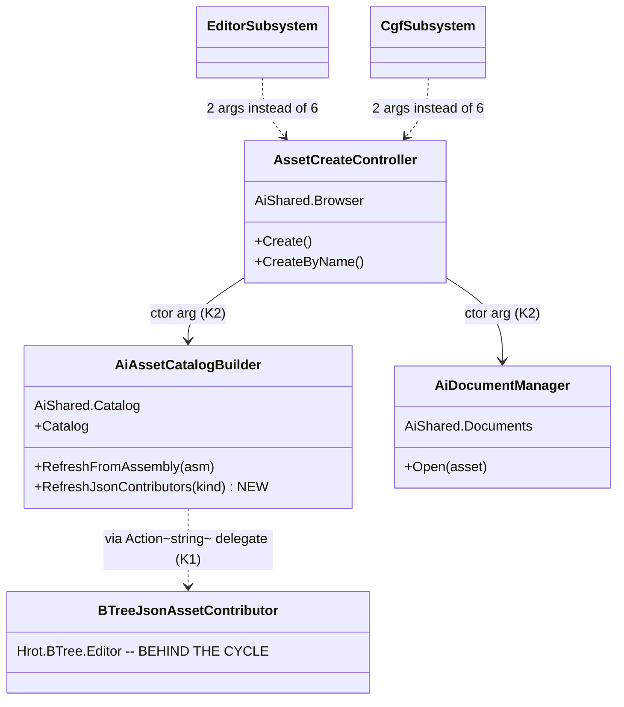

⛔ **The arrow that must NOT exist:** `AiAssetCatalogBuilder --> BTreeJsonAssetContributor` as a *typed* reference — 📌 that project references AiShared, so the dashed delegate arrow is the only legal shape *(§5c.6.2's cycle)*.

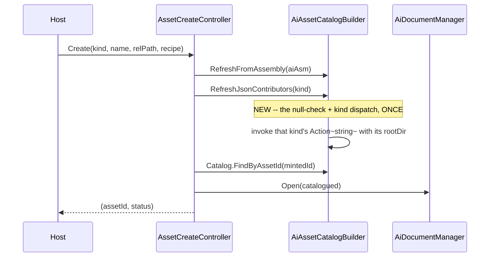

#### 5c.10.4 The items

| # | item | proof |
|---|---|---|
| **①** | `RefreshJsonContributors` + its two delegate pairs on the builder *(`K1`)* | ⛔ the `<see cref>` resolves for the first time |
| **②** | `AssetCreateController` takes builder + documents; **both hosts drop 4 args** *(`K2`)* | ⛔ a diff showing deletion |
| **③** | ⭐⭐ **an equivalence rail**: the derived behaviours match the lambdas they replace, **and the kind dispatch refreshes ONLY that kind** | 🔒 `CE-072` |
| **④** | ⛔ **no UI output changes** ⇒ the three `ui-baseline` goldens and the toolbar rails stay **UNCHANGED** | ⭐ this slice touches no window or toolbar |

#### 5c.10.5 ✅ AS-BUILT *(`2026-08-27`, `CE-091`)* — **`K1` BUILT. `K2` WITHDRAWN, and the reason is the interesting part.**

⛔⛔ **`K2` — "the builder IS the services object, 4 args collapse to 2" — IS WITHDRAWN.** ⭐ It was
implemented, it compiled on both hosts, and then measuring its cost showed the trade was wrong:

| 📐 measured | |
|---|---|
| ⭐⭐⭐ **ELEVEN tests in `TheCreateCoreIsOneImplementationTests` INJECT those four delegates** to assert the create **SEQUENCE** | `TheJsonContributorRefreshesBeforeTheCatalogIsAsked` *(the lookup must follow the refresh or it finds nothing)* · `BlueprintIsWrittenAtTheHostsSourceRootBeforeAnyRefresh` · `NothingIsOpenedWhenTheIdCouldNotBeResolved` · `TheAssemblyRefreshOnlyFiresWhenTheAiAssemblyIsLoaded` · … |
| ⇒ ⛔ collapsing them to concrete objects makes that **ordering invariant unobservable** | 📌 the `CE-072` shape **inverted**: instead of a wrapper orphaning its tests, a *de-duplication* would have removed the seam the tests observe through |
| ⭐ the trade | **~7 lines per host** against **an 11-test rail suite** |

⇒ 🔒 **THE LESSON, and it is a new one for this programme:** ⭐⭐ **a repeated ARGUMENT LIST can be a TEST
SEAM rather than accidental duplication.** ⛔ The verbatim-duplication metric cannot tell the two apart —
📌 it counted these five lambdas as duplication, and four of the five were load-bearing. ⚠ **Cousin of the
corpus rule *"what is not used does not mean it is existing without reason"*: what is REPEATED does not
always mean it should be COLLAPSED.**

⭐⭐ **What `K1` delivered on its own — and it is the part that mattered:**
| | |
|---|---|
| ✅ **`RefreshJsonContributors` EXISTS** | ⭐ the `<see cref="RefreshJsonContributors"/>` in `RefreshFromAssembly`'s summary **resolves for the first time**; it had pointed at nothing since the class was written |
| ✅ **the SIX-LINE kind-dispatch lambda is gone from BOTH hosts**, replaced by the method group `k => _aiCatalogBuilder?.RefreshJsonContributors(k)` | ⇒ ⭐ **the biggest single item in that argument list**, and the policy *(right kind · its own root · resolved at call time · nothing else touched)* now lives once |
| ✅ **the other four delegates STAY** — the seam is intact and all 11 rails pass unchanged | ⭐ **one implementation of the POLICY, without destroying the seam** |
| ⭐ shape | the two new ctor params are `Action<string>?` + `Func<string?>?` per kind — ⚠ **exactly mirroring the `bTreeLoadFrom` delegate pattern this class already documents**, for the same cycle reason. ⛔ No new interface, and ⛔ no default no-op on the 10-implementor `IAssetCatalogContributor` *(which would be a silent-default generator)* |

⭐ **Rail:** `TheJsonRefreshPolicyIsOneImplementationTests` **6 facts**, red-proved by **3 inverse edits ⇒ 3/6
red**, each hitting only its own fact: cross-firing the kinds · dropping the empty-root gate · capturing the
root eagerly instead of at call time. ⭐⭐ **That third one is the silent killer the rail exists for** — the
hosts pass `() => _btreeJsonRootDir`, a field assigned LATER in `Initialize`, so an eager read would freeze
`null` and the JSON contributor would never refresh **on both hosts, with nothing to see.**

⚠ **`J2`'s net line effect is therefore ~−5 per host, not −7**, and §5c.9.4's ordering rationale for `J2`
*("cheapest and safest")* held — ⛔ but its predicted SIZE did not. 📌 An eighth data point for the
measure-before-quoting list.

### 5c.11 ⛔ `J3` — **CONCLUDED: NOT WORTH BUILDING.** *(measured `2026-08-27`)*

📐 **What the per-document canvas wiring actually is.** Both hosts install one `DocumentOpened` handler with
an identical SHAPE: the `ViewState != null` guard → a `switch (doc.Kind)` → three `…DocumentFactory.Build(…)`
arms → a `doc.Asset.Changed` subscription.

| ⛔ why it cannot be shared | |
|---|---|
| 🔴 **all three factories are BEHIND THE CYCLE** | 📐 `BTreeDocumentFactory` *(`Hrot.BTree.Editor`)* · `HsmDocumentFactory` *(`Hrot.Hsm.Editor`)* · `BlueprintDocumentFactory` *(`Hrot.Blueprints.Editor`)* — **all three projects reference AiShared** ⇒ AiShared cannot call them. ⭐ The three arms — **where every per-host argument and all the substance lives** — must stay host-side as closures |
| ⭐⭐ **the IDENTICAL parts are ALREADY shared calls** | `extraRenderers: ComparisonCanvasRenderers.For(…)` is the SAME shared helper on both hosts *(`CE-071`)* ⇒ **adoption, not duplication**; `openBlueprint: a => _aiDocumentManager?.Open(a)` is one line |
| ⇒ ⛔ **what is left to extract is an ~8-line dispatch SKELETON** | ⭐ replacing it with `Install(docs, new Arms(…))` is **line-neutral** and inserts an indirection between `DocumentOpened` and the factory calls a reader currently sees inline |

⭐ **The per-arm differences are genuine host capability, not drift:** CGF passes `btreeDebugSession: null`,
`hsmDebugSession: null`, `debugSession: null` — 📐 it constructs no debug session *(slice 1 §9.4)*, and each
parameter exists so a host without one can **say so** *(ruling 49)*.

⇒ 🔒 **VERDICT: leave it.** ⭐ Same conclusion shape as slice ③, reached the same way — by measuring instead
of assuming the plan line was work. ⚠ §5c.9.4 reserved this freedom for `J1`; it applies here.

### 5c.12 ⭐⭐⭐ `J1` — **the prize is NOT the line count: the EDITOR IS BEHIND ON RULING 67.** `build-state: BUILT · CLOSED §5c.15` *(`2026-08-27`)*

> ⭐⭐⭐ **BUILT `2026-08-27` — and NOT in the shape §5c.12.3 proposed.** 🔒 **The as-built is §5c.13; read it
> before quoting the `AiCatalogComposition` / `ComposeRequest` classDiagram below, which was NOT built and
> is SUPERSEDED.** ⚠ §5c.12.1's nine-step table and §5c.12.2's headline are still TRUE and are the reason
> the slice happened. ⭐ User nod, verbatim (`2026-08-27`): *"system not deployed yet, we can make changes
> at will. We can and should use better stuff (resolveBase)."*

> ⛔ **This is a DESIGN, not a dispatched build** — §5c.9.4 ordered it third and required a design pass first.

#### 5c.12.1 📐 THE NINE STEPS — **both hosts, same order**

| # | step | editor *(`Initialize` :1095–1155, inline)* | CGF *(`BuildAssetCatalog()` :2408–2480)* |
|---|---|---|---|
| 1 | resolve the AI root | 🔴 **`AssetRoots.ResolveProjectDir`** | 🔴 **`AssetRoots.ResolveBase`** |
| 2 | the Blueprint assets root | `ResolveAssetsRoot(Blueprint, …)` | `RootFor(Blueprint)` |
| 3 | the two JSON roots | ⚠ null-guarded `Path.Combine` | `RootFor(kind)`, unconditional |
| 4 | `new BlueprintAssetContributor(bpRootDir)` | ✅ same | ✅ same |
| 5 | `new BTreeJsonAssetContributor(…)` | `_btreeDebugSession` | ⭐ `null` *(genuine: no session)* |
| 6 | `new HsmJsonAssetContributor()` | ✅ same | ✅ same |
| 7 | store 5 fields *(2 roots, bp root, 2 contributors)* | ✅ same set, same stated reason | ✅ *(`MA-019` ≡ `BUG-A6`)* |
| 8 | initial refresh, `Directory.Exists`-guarded, else warn | `Console.WriteLine` | `FdpLog<CgfSubsystem>.Warn` |
| 9 | construct `AiAssetCatalogBuilder` *(6 delegates + 2 contributors + `CE-091`'s 4)* | ✅ same shape | ✅ same shape |

#### 5c.12.2 🔴🔴🔴 THE HEADLINE — **step 1 is a DRIFT, and the EDITOR is the one behind**

| | |
|---|---|
| 📐 **`ResolveBase`** | ① **configured root** *(ruling 67's answer for a deployed node)* → ② source walk-up → ③ output dir. **Always answers.** |
| 📐 **`ResolveProjectDir`** | ⛔ **the walk-up ONLY. Returns `null` when there is no source tree.** |

⇒ ⛔⛔ **On a DEPLOYED node the editor's two JSON roots go `null`, so it cannot load its own BTree/HSM JSON
assets** — and it says so in its own warning: *"editor-owned BTree/HSM JSON assets will not load with
layout."* ⭐⭐ **CGF received the ruling-67 treatment and the editor did not**; CGF's own comment marks the
difference: *"the null arms are gone: ruling 67's `ResolveBase` always answers a directory."*

⇒ ⭐⭐⭐ **THE VALUE OF `J1` IS CARRYING THAT FIX TO THE EDITOR.** ⛔ Not the ~45 lines — 📌 and this is the
third time in this programme that a unification's worth turned out to be *"one host is behind"* rather than
*"there are two copies"* *(slice ①: the editor had no ruling-53 log; `CE-016`: CGF had no toolbar transport)*.

⚠⚠ **THEREFORE `J1` IS A BEHAVIOUR CHANGE, AND IT NEEDS A NOD.** ⭐ It is a *fix* — but it changes what the
editor lists on a deployed node, and the user's standing rule is that a visible change is theirs to approve.

#### 5c.12.3 ⛔ SUPERSEDED BY §5c.13 — the proposed shape, and what the cycle permits

⛔ **The contributors and `LoadFrom` are behind the cycle** *(§5c.6.2)* ⇒ ⭐ the shared unit takes them as
`IAssetCatalogContributor` plus **delegates** — 📌 **exactly the pattern `AiAssetCatalogBuilder` already
documents and `CE-091` just extended.** ⭐ No new interface.

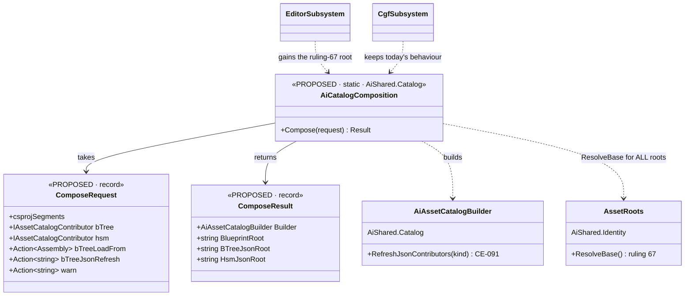

```mermaid
sequenceDiagram
    participant Host
    participant C as AiCatalogComposition (PROPOSED)
    participant R as AssetRoots
    participant B as AiAssetCatalogBuilder
    Host->>C: Compose(request with contributors + delegates + warn sink)
    C->>R: ResolveBase(csprojSegments)
    Note over C,R: ONE resolver for both hosts -- this is the fix the editor is missing
    C->>C: derive bp / btree-json / hsm-json roots
    C->>C: initial refresh, Directory.Exists-guarded, warn via the sink
    C->>B: construct with the 6 + 2 + 4 arguments
    C-->>Host: Builder + the three resolved roots
```

#### 5c.12.4 ⭐ THE ITEMS, IF IT IS APPROVED

| # | item | proof |
|---|---|---|
| **①** | `AiCatalogComposition.Compose` in `AiShared.Catalog`; ⭐ the **warn sink is a delegate** so each host keeps its own logger *(step 8)* | ⛔ delegates only — no contributor type named |
| **②** | both hosts call it and delete their region; ⚠ **CGF's behaviour must be byte-identical**, the editor's changes ONLY at step 1 | ⛔ a diff showing deletion |
| **③** | ⭐⭐ **a rail proving the editor now resolves a CONFIGURED root** *(the ruling-67 carry-over)*, plus one proving CGF is unchanged | 🔒 the whole point of the slice |
| **④** | ⚠ **CHECK FOR A TEST SEAM FIRST** — 🔒 `CE-091`'s lesson: 11 rails injected what looked like duplication | ⛔ do this BEFORE collapsing anything |
| **⑤** | the three `ui-baseline` goldens stay **UNCHANGED** *(no window is touched)* | |

⛔⛔ **STOP-CONDITION REMINDER:** §5c.9.4 says stop after `J2`+`J3`. ⭐ `J1` is the one exception worth
making — ⛔ **and only because of §5c.12.2's fix, not because of the line count.** ⚠ If the user declines the
behaviour change, `J1` should be **closed as not-worth-doing** rather than built for tidiness.

### 5c.13 ⭐⭐⭐ `J1` AS-BUILT — **the resolver already existed. The slice is ADOPTION plus a FIX.** *(`2026-08-27`)*

> ⛔⛔ **This section SUPERSEDES §5c.12.3's proposed `AiCatalogComposition` / `ComposeRequest` / `ComposeResult`.
> None of them were built, and building them would have been wrong.**

#### 5c.13.1 🔴 WHY THE PROPOSED SHAPE WAS DROPPED — **measured before writing a line of it**

📐 §5c.12.1 listed nine steps. ⭐⭐ **Measuring what each one would actually contribute collapsed the slice:**

| step | §5c.12's assumption | 📐 what it measured as |
|---|---|---|
| **1–3** *(resolve the three roots)* | *"a drift to unify"* | ⭐⭐⭐ **`AssetRoots.ResolveAssetsRoot(kind, segs)` is DEFINED as `Path.Combine(ResolveBase(segs), AssetsRelative(kind))`** ⇒ the shared resolver **already existed** and both hosts had a hand-spelling of it. ⛔ Nothing to extract — **the seam law**: *"we need a shared X"* meant X existed and was under-adopted |
| **4–7** *(contributors + fields)* | shareable behind delegates | ⛔ **host-side by the reference cycle and by field ownership.** Passing them through a request record would move the arguments, not the logic |
| **8** *(initial refresh + warn)* | *"~10 duplicated lines"* | ⭐⭐⭐ **the ONE genuine duplicate — and worse than duplicated: it was a SECOND IMPLEMENTATION of the policy `RefreshJsonContributors` already owned** *(see §5c.13.3)* |
| **9** *(construct the builder)* | shareable | ⛔ **`AiAssetCatalogBuilder`'s ctor IS the shared thing.** ⚠ Wrapping it in a `ComposeRequest` would be `K2`'s withdrawn mistake again: collapsing named arguments into an object, hiding what each host actually supplies |

⇒ ⭐⭐ **A `Compose(request)` façade would have added a type, a record and a result object to move**
**arguments into a constructor that already takes them.** ⛔ Zero policy would have moved.

#### 5c.13.2 ⭐⭐⭐ WHAT WAS BUILT — **three adoptions and one policy move, no new types**

```mermaid
classDiagram
    class AssetRoots {
        <<EXISTS · AiShared/Identity/AssetRoots.cs>>
        +ResolveBase(segs) string
        +ResolveAssetsRoot(kind, segs) string
        +RecipesFor(kind) string
        +DescribeBase(segs) string
        +ResolveProjectDir(segs) string?
    }
    class AiAssetCatalogBuilder {
        <<EXISTS · AiShared/Catalog · CHANGED>>
        +RefreshJsonContributors(kind)
        -Action~string~ _warnMissingRoot NEW
    }
    class EditorSubsystem {
        <<EXISTS · CHANGED>>
        -_bpRootDir
        -_btreeJsonRootDir
        -_hsmJsonRootDir
    }
    class CgfSubsystem {
        <<EXISTS · CHANGED>>
        -RootFor(kind) now one line
    }
    class BlueprintEditorBootstrap {
        <<EXISTS · CHANGED>>
        +DiscoverRecipes()
    }
    EditorSubsystem ..> AssetRoots : ResolveAssetsRoot x3 -- WAS ResolveProjectDir + hand-combine
    CgfSubsystem ..> AssetRoots : ResolveAssetsRoot -- WAS RootFor's own Path.Combine
    BlueprintEditorBootstrap ..> AssetRoots : RecipesFor -- WAS the assembly directory
    EditorSubsystem ..> AiAssetCatalogBuilder : RefreshJsonContributors x2 + warn sink
    CgfSubsystem ..> AiAssetCatalogBuilder : RefreshJsonContributors x2 + warn sink
```

⭐ **No box is new.** ⛔ That is the finding, not an omission: the design's own §5c.12.4 item ④ said
*"CHECK FOR A TEST SEAM FIRST"*, and the check that mattered turned out to be **"check the shared thing does
not already exist"**.

#### 5c.13.3 ⭐⭐⭐ `CE-095` — **the half `CE-091` did not collapse: TWO implementations of one refresh**

📐 **Measured `2026-08-27`.** After `J2`, *"refresh the JSON contributor for kind K"* existed **twice**:

| | where | the missing-root clause |
|---|---|---|
| the **CREATE** path | `AiAssetCatalogBuilder.RefreshJsonContributors` | ⛔ **none** — refreshed whatever root it was given |
| the **INITIAL** load | inline in BOTH composition roots | ⭐ `if (Directory.Exists(root)) Refresh(…) else warn(…)` |

⇒ ⭐⭐ **Ruling 9, and `CE-091` only got half of it.** ⭐ The clause moved INTO the method, so the initial
refresh is now literally the same call every later refresh makes:

```mermaid
sequenceDiagram
    participant H as Host (editor / CGF)
    participant R as AssetRoots
    participant B as AiAssetCatalogBuilder
    participant C as BTree/HsmJsonAssetContributor
    H->>R: ResolveAssetsRoot(Blueprint | BTree | Hsm, csprojSegments)
    Note over H,R: ONE resolver, three kinds -- config, then walk-up, then output dir
    H->>R: DescribeBase(segs) -- log WHICH arm answered
    H->>B: new AiAssetCatalogBuilder(..., warnMissingRoot: host log)
    H->>B: RefreshJsonContributors(BTree)
    B->>B: root = rootDir() -- AT CALL TIME
    alt root unset
        B-->>H: silent -- a sequencing fact, not a fault
    else root set but absent on disk
        B->>H: warnMissingRoot("BTree JSON root not found: ...")
        Note over B,C: ⛔ does NOT refresh -- Discover would CLEAR the already-loaded set
    else root present
        B->>C: Refresh(rootDirectory: root)
    end
    H->>B: RefreshJsonContributors(Hsm)
```

⚠⚠ **Two behaviour notes, both deliberate:**
- ⭐ **A missing root WARNS and does NOT refresh.** ⛔ Refreshing would *empty* the contributor
  *(`Discover` clears its headers when the directory is gone)*, so a root that disappears at runtime would
  silently drop every loaded asset. ⭐ That was both inline copies' behaviour and it is preserved.
- ⚠ **The initial refresh now runs AFTER the builder is constructed** *(it ran before)*. 📐
  `AssetCatalog.AddContributor` calls `Rebuild()` and every `ContributorChanged` re-triggers it ⇒ the cache
  is correct either way, and nothing is subscribed that early.

#### 5c.13.4 ⭐⭐ THE FIXES — **three sites, one disease**

| id | site | was | is |
|---|---|---|---|
| ⭐⭐⭐ **`CE-093`** | `EditorSubsystem` ×2 | `Path.Combine(ResolveProjectDir(…), AssetsRelative(kind))` — ⛔ **walk-up ONLY, null off-tree** | `ResolveAssetsRoot(kind, …)`. ⭐ **Its Blueprint root three lines above ALREADY used the shared resolver** ⇒ 🔴 **a split brain inside ONE host**, not merely *"the editor is behind CGF"* |
| ⭐ **`CE-093`** | `CgfSubsystem` | a `RootFor` local that re-spelled `ResolveAssetsRoot` | the shared call. ⭐ Behaviour-identical **by definition**; it is the copy that let the editor drift |
| ⭐⭐ **`CE-094`** | `BlueprintEditorBootstrap.DiscoverRecipes` | `Path.Combine(<AI.Behaviors assembly dir>, RecipesRelative(Blueprint))` | `RecipesFor(Blueprint)`. ⇒ ⛔ a configured node listed blueprint **assets** from its configured tree and blueprint **recipes** from the bin directory. 📌 **A member ruling 67's own sweep missed** — found by this slice's scan, not by the ruling |

⭐ **The editor also gained CGF's REPORTING** — `DescribeBase` on the happy path, and a ruling-67 warning
when only the output-directory arm answered. 📌 **The fourth instance of *"one host is behind"** being the
real prize* *(slice ①'s ruling-53 log · `CE-016`'s toolbar transport · `CE-093` here · and `CE-094`, where
BOTH hosts were behind)*.

#### 5c.13.5 ⭐ THE RAIL, and ⚠ what it cannot claim

📄 `TheAssetRootsComeFromTheOneResolverTests` *(4 facts)* + `TheJsonRefreshPolicyIsOneImplementationTests`
*(9 facts, 3 of them new)*.

⚠⚠ **The wiring rail is a SOURCE SCAN, and that is a scope statement, not a shortcut.** ⛔ Both composition
roots resolve their roots into **private fields inside `Initialize`** with no seam to inject or read ⇒ the
behavioural half is already covered by `TheDeployedNodeFindsItsAssetsTests` *(the resolver honours the
config)*, and what no behavioural rail can see is **a host that quietly stops calling it.**

📌 **The scan's first run flagged all three files the slice had JUST FIXED** — because each fix carries a
comment quoting the code it replaced. ⇒ ⭐⭐ **whole comment lines are stripped before matching**, and the
rail says so: a green means no **executable** line hand-combines a base with an asset segment. ⭐ It keeps
`TheWalkUpHasOneImplementationTests`' anti-vacuity fact *(the tree is reachable · the one legal
implementation is found · the regex still matches it)*, plus a positive fact that each composition root
still resolves all three kinds — ⛔ otherwise a host that resolved **nothing** would satisfy a forbid-only
scan *(`CE-064`'s shape)*.

⭐ **Red-proofs, all inverse edits:** the editor's walk-up combine restored ⇒ scan red naming
`EditorSubsystem.cs` · the assembly-directory recipes path restored ⇒ scan red naming
`BlueprintEditorBootstrap.cs` · the `Directory.Exists` clause deleted ⇒ **3** policy facts red.

### 5c.14 ⭐⭐⭐ TWO USER RULINGS ON WHAT "SHARED" MEANS — `CE-090` and `CE-086` *(`2026-08-27`)*

> ⭐⭐⭐ **User, verbatim:** *"separator SAME on both cgf and editor, we are unifying the UI, so obviously the
> stuff should look same and they CAN'T look different by design if they are rendered by single shared code
> where host-type gates are undesired; no special boolean needed. Unify the internal window ids to snake,
> breaking layout is not an issue."*

#### 5c.14.1 ⛔⛔ `CE-090` — **A PARAMETER THAT LETS TWO HOSTS OF ONE SHARED SURFACE DIFFER IS A HOST GATE**

📌 **What §5c.8 built.** `ShellTimeControlToolbar.Register(toolbar, facade, withSeparator)` — the trailing
separator declared as a parameter because `CE-016` §7 had deleted it on CGF *(it stood in front of a
perspective group that host did not register — "a rule drawn against nothing")*, and `CE-089` left it
`false` there because *"turning it on is a visible toolbar change and this slice changes no toolbar
output."*

⛔⛔ **That reasoning was locally correct and globally wrong.** ⭐⭐ **`CE-054` had already given CGF the
perspective group**, so the separator's original reason held on both hosts — and the parameter had become a
way for one shared renderer to produce two different toolbars.

| ⭐ the general rule this establishes | |
|---|---|
| ⭐⭐⭐ **A shared UI surface renders ONE way.** | ⛔ *"declared difference"* is better than *"undocumented diff between two 3 000-line composition roots"* — ⚠ **but it is not the goal.** The goal is that the difference cannot exist |
| ⛔ **A `bool` parameter whose only job is to let host A and host B look different is a HOST GATE wearing a parameter's clothes** | ⇒ it **preserves the drift the extraction existed to end**, and it does so in a form that passes review because it is documented |
| ⚠ **The rail must assert the SAMENESS, not the switch** | 📌 the replaced fact — *"the separator appears only for the host that asks for it"* — ⛔ **would have gone on passing while the two hosts rendered differently.** ⭐ It is now *"the separator is always emitted"* |

⇒ ✅ **`withSeparator` is DELETED**; both hosts call `Register(toolbar, facade)` and both emit
`ToolbarSep_TimeToPersp` at sort order 10. ⚠ **This is a visible change to CGF's toolbar** — authorised
above, and it is the FIRST toolbar-output change in this phase.

#### 5c.14.2 ⭐⭐ `CE-086` — **the window id is snake_case; the PANEL id is deliberately not touched**

📐 **Measured `2026-08-27` — the enumeration is the point, since the user asked for "ids" plural.** The
three `ui-baseline` goldens hold **148 ids** *(64 editor · 76 all · 8 replaybrowser)*. ⭐ **Exactly three are
not snake_case, and only ONE of them is a window id:**

| id | what it is | verdict |
|---|---|---|
| 🔴 **`Entity Blueprints`** | a **WINDOW id** — `ManagedWindow.WindowInternalName` is `"{Title}###{Id}"`, so it is the **saved-layout key** | ✅ **RENAMED → `entity_blueprints`** |
| ⭐ `entity-blueprints` | a **PANEL id** (`PanelIds.EntityBlueprints`) | ⛔ **NOT touched** |
| ⭐ `editor/_gizmo` | a **PANEL id** — `GizmoFramePanel`'s deliberate `"{host}/_gizmo"` address (`BP-485`) | ⛔ **NOT touched** |

⛔⛔ **Why the two panel ids are NOT part of "unify the internal window ids".** 📐 Kebab-case is the
convention of the **entire** diagnostics/panel namespace — `watch` · `variables` · `graph-signature` ·
`data-breakpoint-manager` — and those ids are a **published contract**: the MCP `/panels` surface, the
`ClusterConformanceRails` allow-lists and `McpClient.GetPanelAsync` all address panels by them. ⇒ ⭐ **they
are consistent within their own namespace, so they are not the inconsistency the ruling is about**; ⚠ and
`{host}/_gizmo`'s slash is *load-bearing* — it is how one host's map feed is addressed apart from another's.

⭐ **The window id was the real defect** and its own tracker row said why: it is a layout key that *looks*
like display text, so a casual capitalisation fix to the visible title would silently reset saved layouts.
✅ **Carried through all four homes:** the ctor, `layout/default/fdp_windows.json`,
`layout/default/imgui.ini`'s `[Window][###…]` section, and the `ui-baseline-editor` golden *(re-sorted — the
capital `E` had sorted it to position 0 under `StringComparer.Ordinal`, and the rail builds a
`SortedSet`)*. ⚠ **The TITLE is unchanged**: display text should read like display text.

### 5c.15 ⭐⭐⭐ `J1-a` — **the last of `J1`, and `J1` CLOSES here.** *(`2026-08-27`)*

#### 5c.15.1 ⭐⭐ WHAT WAS LEFT, MEASURED — **two candidates closed, one built**

📐 Post-`J1` the two composition blocks are **35 lines (editor)** and **43 (CGF)**, comments stripped. Every
line falls into one of four groups:

| group | lines | verdict |
|---|---|---|
| ⭐ the three root resolutions | 3 · 3 | ✅ **DONE in `J1`** — `ResolveAssetsRoot` ×3 |
| ⭐⭐⭐ **the root REPORTING** | **10 · 8** | ✅ **BUILT HERE** — §5c.15.2 |
| ⛔ contributors + field storage | 6 · 13 | 🔒 **CLOSED — host-side by the cycle** *(§5c.15.3)* |
| ⛔ the builder construction | 14 · 12 | 🔒 **CLOSED — no legal venue, and the args are a TEST SEAM** *(§5c.15.3)* |

#### 5c.15.2 ⭐⭐⭐ `CE-098` — **the reporting policy, and `J1` HAD DUPLICATED IT ITSELF**

📐 **Measured:** both hosts ran the same ~9 lines — an `Info` naming `DescribeBase`, then
`if (ConfiguredRoot == null && ResolveProjectDir(…) == null)` and a ruling-67 warning — ⛔ **and worded the
same fault differently** *("editor-owned BTree/HSM JSON assets will only load if…" vs "the catalog will be
empty unless…")*.

⚠⚠ **The editor's copy was created by `J1`, one commit earlier.** ⭐ `J1` fixed a resolution drift by
**cloning CGF's reporting block across** instead of sharing it. ⇒ 📌 **the lesson, and it is general: a
unification slice that fixes a drift by copying the fix is only half done** — it converts a *behaviour*
drift into a *wording* drift and calls it parity.

✅ `AssetRoots.ReportBase(info, warn, segments)`. ⭐ **Sinks, not a logger** — the same shape
`AiAssetCatalogBuilder.warnMissingRoot` uses *(`CE-095`)*: **the message BODY is shared so one fault has one
wording; the PREFIX and routing stay the host's.** ⇒ 8 lines per host become 4.

⚠ **The predicate re-asks both arms rather than matching `DescribeBase`'s prose** — ⛔ matching on the string
*"output directory"* would make a re-worded diagnostic silently change which hosts warn.

```mermaid
sequenceDiagram
    participant H as Host (editor / CGF)
    participant A as AssetRoots
    H->>A: ReportBase(info sink, warn sink, csprojSegments)
    A->>A: DescribeBase(segments)
    A->>H: info("Authoring root resolved from <arm>.")
    Note over A,H: ALWAYS -- "empty" and "pointed elsewhere" are different problems
    alt ConfiguredRoot set
        A-->>H: silent
    else a source tree resolved
        A-->>H: silent
    else only the output-directory arm answered
        A->>H: warn("No configured asset root and no source tree ... pass --asset-root")
    end
```

#### 5c.15.3 🔒 WHY THE REMAINING TWO BLOCKS ARE CLOSED — **not declined, IMPOSSIBLE / HARMFUL**

| block | 📐 the measurement that closes it |
|---|---|
| ⛔ **the builder construction** *(14 · 12 lines)* | ⭐⭐⭐ **NO shared production project references all three editor projects.** 📐 Measured over every `.csproj`: only `Hrot.Editor`, `Hrot.CGF` and **two test projects** reference `Hrot.BTree.Editor` + `Hrot.Hsm.Editor` + `Hrot.Blueprints.Editor` together. ⇒ ⛔ **a factory that NAMES the concrete contributors and derives the six delegates itself has nowhere legal to live.** ⭐ The delegate shape is **forced by the cycle**, not chosen |
| ⛔ **the two `Func<string?>` root args** *(the tempting simplification: pass `csprojSegments` and let the builder call `ResolveAssetsRoot` itself, making refresh-root ≡ catalog-root by construction)* | 🔴 **REFUSED — they are a TEST SEAM.** 📐 All **9** facts of `TheJsonRefreshPolicyIsOneImplementationTests` inject roots through them; removing them leaves the policy testable only via the process-global `AssetRoots.Configure`. ⇒ 📌 **`CE-091`'s lesson for the THIRD time** *(after `K2`'s 7-arg controller)*: **a repeated argument list can be a test seam, not accidental duplication** — and §5c.15.4 is what that global-static route actually costs |
| ⛔ contributors + field storage | behind the cycle, and the two genuinely differ *(editor passes `_btreeDebugSession`, CGF has no session)* |

⇒ ⭐⭐⭐ **`J1` IS CLOSED.** ⛔ What remains in those two blocks is not duplication awaiting a slice; it is the
shape the reference cycle and the rails require.

#### 5c.15.4 🔴🔴 `CE-099` — **the new rail found a REAL parallelism race, and it predates the rail**

📌 **How it surfaced:** `TheRootReportingPolicyIsOneImplementationTests` passed **5/5 FILTERED** and reddened
in the full suite — its *"a configured root ⇒ silent"* arm saw `ConfiguredRoot == null`.

📐 **Cause:** `AssetRoots.Configure` writes a **process-global static**; xUnit runs distinct classes in
**parallel**; `TheDeployedNodeFindsItsAssetsTests` calls `Configure(null)` at four points. ⇒ ⛔ each class's
careful save/restore is clobbered by the other's. ⚠⚠ **That older class has been racing since ruling 67
landed — it simply had nothing to collide with, so it never lost.**

✅ `AssetRootsTestCollection` *(`DisableParallelization = true`)*, and **both** classes joined it.

⚠ **Third instance of the same author error:** an existing serial-collection convention not joined
*(slice ② missed `PanelSnapshotTestCollection`; `CE-084`/`CE-088` are the standing warning)*. ⇒ ⭐⭐ **the
checkable habit: a FILTERED green is not evidence a new test class is safe in its assembly** — ⛔ if the class
touches a process-global, find the collection or define one.

### 5c.16 ⭐⭐⭐ `CE-101` — **THE BOOT ANCHOR WAS ALSO A COMMAND.** `build-state: BUILT` *(`2026-08-28`)*

> 🔒 **User, verbatim** *(`--mode all` visual check on Windows)*: *"simulation time is running from the
> beginning. Undesired, should start paused."*

#### 5c.16.1 📐 THE MEASUREMENT

| t after boot | `isPaused` | `simTime` | `clusterState` | entities |
|---|---|---|---|---|
| ≈2 s | true | 0 | Idle | 0 |
| ≈20 s | **false** | **19.5** | Idle | **0** |

⇒ ⛔ the clock started itself and ran at ~1× real time **with no scenario and nothing to simulate**, and
⚠ **no log line recorded the transition** *(ruling 53's shape)*.

#### 5c.16.2 ⭐⭐⭐ THE CAUSE — **one message, two meanings**

```mermaid
sequenceDiagram
    participant M as MasterSyncController ctor
    participant B as event bus / DDS
    participant O as ClusterTimeObservation
    participant A as ClusterTimeTransportAdapter
    M->>B: SwitchTimeModeEvent{TargetMode=Continuous, BarrierWallTicks, SimTimeSnapshot=0}
    Note over M,B: INTENT: a t=0 anchor so late-joining slaves share a baseline
    B->>O: Apply(ev)
    O->>O: PauseRequested = (TargetMode == Deterministic) -- so FALSE
    A->>O: IsPaused => !seenAnyModeEvent || PauseRequested
    Note over A,O: EFFECT: the anchor also COMMANDED the cluster to run
```

⭐⭐ **The anchor was added deliberately** — its own comment: *"Bug 3 fix: broadcast the initial t=0 baseline
so the DDS TransientLocal buffer holds a valid reference for late-joining slaves."* ⛔ **That purpose is
served by `BarrierWallTicks`/`SimTimeSnapshot`. The `TargetMode` field rode along, and
`ClusterTimeObservation.Apply` turns it into the cluster's pause decision.**

⇒ ⭐⭐⭐ **A message sent for a SIDE EFFECT was also a COMMAND, and only one of its two meanings was
intended.** 📌 The same family as `CE-102`'s silent-success: the mechanism is honest about what it does and
silent about what it *also* does.

⚠⚠ **And it disabled STEPPING** *(`CE-105`)*: `MasterSyncController.Step()` refuses any `_mode` but
`Stepping`, so on a freshly booted cluster **every `POST /sim/step` was dropped with a warning** — the
pause-step-inspect loop the debug API documents could not work at all.

#### 5c.16.3 ✅ THE FIX — **opt-in, and the anchor still goes out**

| ⭐ | |
|---|---|
| ⭐⭐ **`MasterSyncController(…, bool startPaused = false)`** | the anchor is **still broadcast** *(it is load-bearing for clock alignment — ⛔ NOT removed)*; only the **mode it announces** changes |
| ⭐⭐ **`_mode = MasterMode.Stepping` moves with it** | ⛔ a master that announced `Deterministic` while still accumulating wall time in `Continuous` would be lying — and stepping would still be refused |
| ⭐ **`OrchestratorSubsystem` passes `startPaused: true`** | ⚠ **opt-in on purpose**: a runtime deployment that should come up running keeps today's behaviour. ⛔ The toolkit default is unchanged |
| ⭐ **a boot log line names the mode** | closes the silent-transition half of the finding |

#### 5c.16.4 ⭐⭐ GATED ON A REAL `--mode all` BOOT — ⛔ not on unit rails alone

| check | result |
|---|---|
| clock stays put with no scenario | ⭐ `simTime` **0.000**, `isPaused: true`, stable across 12 s *(was 19.5 and climbing)* |
| a **live load** does not start it | ⭐ `simTime` 0.000, `OperatingLive`, **8 entities** |
| ⭐⭐⭐ **`/sim/play` still runs** *(the regression that would matter most)* | ✅ 3.935 → 8.007 s at ~1× |
| `/sim/step` is no longer REFUSED | ⭐ accepted — ⚠ **but delivers exactly one 1/60 frame regardless of `count`** ⇒ `CE-105` stays open, sharpened |

⚠ **What this does NOT fix:** `CE-103` *(navigation executes and yields zero velocity)* and `CE-102` *(the
edit load's silent success)* are untouched — ⭐ but `CE-101` made `CE-103` **measurable for the first time**,
because until now the sim could not be stepped or trusted to be running.

### 5c.17 ⭐⭐⭐ `CE-102` / `HN-039` — **CGF's missing EDIT-LOAD handler.** `build-state: BUILT` *(`2026-08-28`)*

> 🔒 **User, `--mode all` visual check:** *"when i load hill-attack scenario using the toolbar button, it does
> NOT show on the map, i do not see any entity no matter how i zoom the map — editor shows it nicely."*

⚠⚠ **This was already filed as `HN-039`** and blessed as a CGF-lane follow-up by
[`UXI-37` ruling 65](blueprints/../UX/UX_Feature_Cgf_Brain_Diagnostics.md). ⛔ **`CE-102` was a DUPLICATE** —
📌 filed because the symptom was met from the UI side while the existing row describes it from the
MCP-conformance side. ⭐ What the new evidence adds is that it is **user-visible**, not merely a gap in a
conformance diff.

#### 5c.17.1 📐 THE CHAIN, TRACED END TO END

```mermaid
sequenceDiagram
    participant U as operator
    participant T as toolbar shell.openAsset
    participant R as AssetPickActionRouter
    participant S as EditorScenarioSession
    participant C as cluster (CGF node)
    U->>T: click Open Asset, pick a Scenario
    T->>R: Route(asset)
    R->>S: OpenForEdit(name)          %% Kind == Scenario
    S->>C: TransitionStateIntent{TargetState = OperatingEdit}
    Note over C: CgfScenarioLoadHandler.CanHandle accepts PrepareState<br/>ONLY when TargetState == OperatingLive
    C-->>U: ok:true, entityCount 0, gizmo = grid lines only
```

⭐⭐ **So the decline was explicit, not accidental** — and the load still reported success, which is why the
operator sees an empty map with no error *(the `ok:true` family, §5b of the MCP skill)*.

#### 5c.17.2 🔴 WHAT BLOCKED THE OBVIOUS FIX — **one required argument**

📐 CGF held **6 of the 7** dependencies `HrotEditLoadHandler` needs, *one line above* the registration it was
missing from *(serializer, loader, extractor, source, id allocator, world)*. ⛔ The seventh —
`IZoneManagerService` — was **required** and CGF composes none; `CgfSubsystem.cs:736` already records that as
a **genuine absence**, not a silent default.

⇒ ⭐⭐ **A required dependency that one host cannot supply kept an entire capability off that host.**
📌 The inverse of the silent-default rule: there the caller HAD the value and withheld it; here the callee
DEMANDED a value that does not exist on this host.

#### 5c.17.3 ✅ THE FIX — **the SHARED handler, one argument relaxed, the absence REPORTED**

| ⭐ | |
|---|---|
| ⭐⭐ **`zoneService` is now `IZoneManagerService?`** | 📐 it is used in exactly ONE place — `LoadZones` |
| ⭐⭐⭐ **and a scenario WITH zones on a host with no zone manager WARNS** | *"entities were loaded, zones were NOT … a declared absence, not a load failure"* ⇒ ⛔ **absent-and-explained (ruling 49)**, never silently half-loaded |
| ⭐ **CGF registers the SAME handler the editor and SimHost do** | ⛔ not a `CgfEditLoadHandler`: ruling 65 settles the principle *("bringing editing machinery onto a runtime node is perfectly OK")*, and a private copy would be a second implementation of one concept |

⚠ **A LIMIT I FIRST MIS-FRAMED, corrected `2026-08-28` after reading the code.** The edit path does not pass
a `behaviorRemapper`, which the LIVE path does — ⛔ **but that is NOT a CGF gap and NOT something this change
introduced.** 📐 Measured: `HrotEditLoadHandler`'s ctor **takes no remapper at all**, and the EDITOR registers
it identically *(`EditorSubsystem.cs:1277`)* ⇒ ⭐⭐ **the edit path has never remapped on ANY host**, including
the one the user reports works. ⚠ Only the live handlers *(`HrotScenarioLoadHandler`, `CgfScenarioLoadHandler`)*
take one. 📄 Filed properly as `CE-108`.

⛔⛔ **And I also over-claimed it as a lead into `CE-103`. It is not.** 📐 `ScenarioBehaviorRemapper` rewrites
**entity-ID references embedded in behaviour-param JSON**; the stalled tanks carry
`NavigationIntent{Mode: DirectPoint}` with a **coordinate** destination and no entity reference. ⇒ 📌 a missing
remapper cannot explain zero velocity. ⚠⚠ **`hill-attack` settles it outright: its mission params are `""`
and it declares no behaviour ids**, so there is nothing for a remapper to rewrite in the scenario that produced
the report.

#### 5c.17.4 ⭐⭐ GATED ON A REAL BOOT

| | before | after |
|---|---|---|
| `entityCount` after an edit load on the Scenario perspective | ⛔ **0** | ✅ **8** |
| `/panels/_gizmo` non-`Line` shapes | ⛔ **none** *(603 primitives, all grid)* | ✅ `Box2D` 8 · `Arrow` 12 · `Text` 8 · `SemanticShape` 16 · `SpatialAnchor` 16 |
| `isPaused` | — | ✅ still `true` *(`CE-101` holding)* |

⚠ **Suite note:** `Hrot.Presentation.Tests` and `Hrot.SimHost.Tests` each produced ONE red on a single run and
then **3/3 green** *(Presentation)* / **1-red-identical-to-base, 3 runs** *(SimHost)*. ⛔ Both reds were over
**process-global registries** and the Presentation identity **rotated** between runs
*(`ScenarioFileServiceTests.SaveLoad_RoundTrip`, then `EntityDragGizmoTests` with "Component type ID 51 is not
registered")* ⇒ 📌 the `CE-084`/`CE-088` family, now confirmed in two more assemblies.

### 5c.18 ⭐⭐⭐ `CE-103` — **the tanks do not move: the scenario's authored `VehicleParams` is DROPPED ON THE WIRE HOP, so the MUSCLE node cannot accelerate.** `build-state: ROOT-CAUSED · decisions in Architect_Question_64 · §5c.18.6 is current` *(`2026-08-28`)*

> 🔒 **User:** *"When i press Play, the tanks show blue line to their destination, but they do not move."*
> 🔒 **User, `2026-08-28`:** *"the scenario loading path was tested manually pretty well in the editor so pls
> be carefull with any 'fixes'."* ⇒ ⛔ **diagnosis only; no code changed for this item.**

#### 5c.18.1 ⛔ WHAT IS INNOCENT — **ruled out by direct measurement, not by reasoning**

📐 Same entity *(networkId 1001)*, same scenario, one host each:

| read | editor | `--mode all` | verdict |
|---|---|---|---|
| `NavigationIntent` | `DirectPoint`, dest `[523,401,0]`, speed 15 | ⭐ **identical** | the AI issues the order on both |
| `NavState` | `Direct`, same dest, speed 15 | ⭐ **identical** | ⛔ **the BRIDGE ran and translated correctly** |
| `NavigationStatus` | `InProgress` | ⭐ **identical** | the executor accepted it |

⇒ ⭐⭐ **The whole navigation chain is fine on the cluster.** 📌 My earlier framing — *"intent produced, never
consumed"* — was **wrong**, and so was the guess that the missing `behaviorRemapper` was involved
*(`CE-108`: it rewrites entity-ID references, and this destination is a coordinate)*.

#### 5c.18.2 🔴 WHAT DIFFERS — **the vehicle profile, and it is the whole story**

| `VehicleParams` field | editor | `--mode all` |
|---|---|---|
| **`Class`** | **Tank** | ⛔ **PersonalCar** |
| **`AccelGain`** | **1.8** | 🔴 **0** |
| **`MaxSteerAngle`** | **0.8** | 🔴 **0** |
| `MaxDecel` · `MaxSpeedRev` · `MaxLatAccel` · `AvoidanceRadius` | 4 · 8 · 6 · 5 | ⛔ **0 · 0 · 0 · 0** |
| `LookaheadTimeMin` / `Max` | 0.8 / 2.5 | ⛔ 0 / 0 |
| `VehicleState.Accel` | **2.5** | 🔴 **0** |
| `VehicleState.SteerAngle` | −0.8 | 🔴 **NaN** |
| ⭐ `Length` · `Width` · `WheelBase` · `MaxSpeedFwd` · `MaxAccel` | 7.93 · 3.66 · 4.758 · 20 · 2.5 | ⭐ **identical** |

⇒ ⭐⭐⭐ **`AccelGain: 0` is the direct cause of zero motion** — `CarKinematicsSystem:248` feeds it to the speed
controller, so acceleration is 0 forever *(`VehicleState.Accel` confirms: 2.5 vs 0)*. ⭐ **`MaxSteerAngle: 0`
is what makes the steer angle NaN.**

#### 5c.18.3 ⛔⛔ ONE SOURCE IDENTIFIED, ONE **NOT** — *(corrected `2026-08-28`; the first version of this section was WRONG)*

⚠⚠ **RETRACTION.** This section previously claimed the editor's params come from
`BdcTkbBuilder.BuildVehicleParams`, on the strength of the arithmetic matching *(`WheelBase = 7.93 × 0.6`,
`MaxSteerRate = TurnRate × π/180`)*. ⛔⛔ **That method has ZERO CALLERS — it is dead code.** 📌 I matched
numbers to a function and never checked it was invoked: **over-fitting an explanation to a coincidence**, the
same error class as reading a symbol's name instead of its body.

⭐⭐ **What IS established:**

| # | measured |
|---|---|
| ⭐⭐⭐ **the TKB CATALOG is already SHARED** | 📐 both hosts build it with **`HrotEnvironment.CreateTkb()`** — editor at `EditorSubsystem:1227`, cluster nodes via `HrotNodeBuilder:197` ⇒ ⛔ **there is no "editor TKB" vs "cluster TKB"**; that half of the concern does not exist |
| 🔴 **but what the catalog STORES is LOSSY** | 📐 `NedTkbBuilder.WithPhysics` adds a `VehicleParametersDto` of **6 fields** — Mass, Length, Width, MaxSpeedFwd, MaxSpeedRev, MaxAccel — and its own comment defers the rest: *"Height, TurnRate, Mobility mapped to VehicleParams by translator in Phase 6."* ⇒ ⛔ **`Mobility` — the field that decides Tank vs PersonalCar — never reaches the template** |
| 🔴 **the mapper that would have used it is DEAD** | `BuildVehicleParams(SimVehicleDef)` maps `Mobility → VehicleClass`, applies `VehiclePresets.GetPreset`, sets `Class`, then overrides from the def. ⛔ **Nothing calls it.** 📌 *"Phase 6"* appears never to have been wired |
| ⭐ **the cluster's values ARE the translator's output set** | `VehicleKinematicsTkbTranslator` writes exactly Length, Width, `WheelBase = Length × 0.6`, MaxSpeedFwd, MaxAccel — ⇒ 📐 **precisely the five fields that match between hosts**, everything else default |

⛔⛔ **NOT established: where the EDITOR's rich params come from.** ⚠ Two candidates were checked and both
**fail** the arithmetic: `BuildVehicleParams` is dead, and `VehicleCommandSystem` *(the other production
`GetPreset` caller)* writes `ArrivalRadius = 2.0` and `NavState.Mode = None` where the editor shows **5** and
**Direct**, and the `Tank` preset's `MaxSteerRate` is **1.2** where the editor shows **0.2617994**. ⇒ 🔒 **a
third source exists and is unidentified. It must be found by measurement, not by matching numbers again.**

#### 5c.18.4 ⛔ WHY NO FIX YET — **and what the decision actually is**

| ⚠ | |
|---|---|
| ⭐⭐⭐ **The question is WHICH SOURCE IS CANONICAL** | ⛔ not a code defect to patch: two populators exist and the hosts pick different ones. 📌 Ruling 9 territory — *one implementation* — but choosing the survivor is a **data-pipeline** decision |
| ⚠⚠ **My "no production caller" claim was a GREP ARTEFACT** | 📐 the file is `BdcTkbBuilder.cs` but the class inside is **`NedTkbBuilder`** ⇒ ⛔ searching the filename found nothing. 📌 Third pattern-as-hypothesis miss of the session. ⭐ `NedTkbBuilder` is used via `NedTkbCatalog.RegisterAll`, reached by `HrotEnvironment.CreateTkb()` |
| ⭐⭐ **THE NEXT PROBE, and it is decisive** | `GET /tkb/types/303` on **both** hosts. ⭐ If the templates are IDENTICAL *(they should be — same factory)*, the divergence is in the **INJECTION** path, not the data, and the hunt narrows to which translator/system stamps `VehicleParams` first *(the translator's `!HasComponent` guard makes it order-dependent)* |
| 🔒 **The user's caution binds** | *"the scenario loading path was tested manually pretty well in the editor"* ⇒ ⛔ a change that re-points vehicle-param population risks the one path known to work |
| ⭐ **The cheap next probe, if wanted** | compare the TKB template the two hosts hold for `TkbType 303` *(`GET /tkb/types/303`)* — that says whether the cluster's TKB lacks the BDC descriptor, or holds it and ignores it |

⚠⚠ **§5c.18.4 IS SUPERSEDED BY §5c.18.5 — the probe it names was RUN, and its premise was wrong.**
⛔ Do not quote the *"two populators, choose the canonical one"* framing above as current.

#### 5c.18.5 ✅✅✅ `CE-103` **ROOT-CAUSED** — **the rich params are STORED IN THE SCENARIO, and the cluster never applies them** *(`2026-08-28`)*

⭐⭐ **The probe §5c.18.4 named was run, and it first returned a LIE** — `GET /tkb/types` answered `[]` on
`--mode all` because the instrument itself was broken *(`CE-110`, §5.10)*. ⇒ ⛔ **the "cluster TKB differs"
hypothesis was an artefact of the broken instrument.** ⭐ With it fixed:

| probe, both hosts | result |
|---|---|
| `GET /tkb/types` | ⭐ **10 shared templates**, plus **5 editor-only** *(`1001`,`1002`,`2001`–`2003`, registered by `UrbanCombatNewScenario.RegisterUrbanCombatTkbTemplates` — an editor-only scenario registrar, irrelevant to hill-attack)* |
| `GET /tkb/types/{100,103,301,303}` | ⭐⭐⭐ **BYTE-IDENTICAL** |
| template `100`'s `VehicleParametersDto` | ⛔ **6 fields only** — `Mass · Length · Width · MaxSpeedFwd · MaxSpeedRev · MaxAccel`. **No `Mobility`** *(the field that decides Tank)*, **no `TurnRate`** |

⇒ ⭐⭐ **`cgf==editor` MEASURABLY HOLDS for the TKB.** ⛔ The divergence is not in the catalog.

##### 🔴🔴🔴 WHERE THE EDITOR'S RICH PARAMS ACTUALLY COME FROM

⭐⭐⭐ **`scenarios/hill-attack/scenario.json` STORES a complete 15-field `VehicleParams` PER ENTITY** — **6
blocks**, and the first matches the editor's observed values **exactly**:

```
Class Tank · Length 7.93 · Width 3.66 · WheelBase 4.758 · MaxSpeedFwd 20 · MaxSpeedRev 8
MaxAccel 2.5 · MaxDecel 4 · MaxSteerAngle 0.8 · MaxSteerRate 0.2617994 · MaxLatAccel 6
AvoidanceRadius 5 · LookaheadTimeMin 0.8 · LookaheadTimeMax 2.5 · AccelGain 1.8
```

| host | what writes `VehicleParams` | result |
|---|---|---|
| ⭐ **editor** | the scenario's **stored component** is applied | **Tank**, `AccelGain 1.8` ⇒ **the tanks move** |
| 🔴 **`--mode all`** | only `VehicleKinematicsTkbTranslator` runs — **5 fields** from the lossy DTO, everything else DEFAULT | `Class = 0 = PersonalCar`, **`AccelGain 0`** ⇒ zero acceleration forever; `MaxSteerAngle 0` ⇒ `SteerAngle` **NaN** ⇒ **a path is drawn and nothing moves** |

⭐⭐ **The enumeration that settles it — only TWO production writers of `VehicleParams` exist**, and
**neither** produces the stored values:

| writer | verdict |
|---|---|
| `VehicleKinematicsTkbTranslator:34` | ⭐ writes exactly `Length · Width · WheelBase = Length×0.6 · MaxSpeedFwd · MaxAccel` — **this is the cluster's** |
| `VehicleCommandSystem:73` | ⛔ the `CmdSpawnVehicle` demo path; writes `ArrivalRadius 2.0` where the scenario has **5** |

⇒ ⭐⭐⭐ **the editor's values are not COMPUTED at load — they are DESERIALISED.** ⚠ `AccelGain = 1.8f`
occurs in **exactly one place in the repo** *(`VehicleClass.cs:90`, the `Tank` preset)*, which is why the
values look computed: they were **baked into the scenario file once** by
`NedTkbBuilder.BuildVehicleParams` *(preset + DTO overrides + `TurnRate × π/180`)*. 📌 **That function now
has zero callers, including inside its own file** — ⭐ so the earlier retraction of it as *"dead code"* was
**correct about the callers**, and the arithmetic fingerprint was a fossil of its last run, not evidence
of a live path. ⚠ Two of my three attributions here were wrong in *opposite* directions; the settled
answer came from grepping the **decisive field** *(`AccelGain`)* rather than the type.

##### ⭐⭐ THE FIX IS `CE-109`'s BUILDABLE HALF — **not a new decision**

⇒ ⭐⭐⭐ **The cluster's LIVE-path scenario load drops per-entity stored components.** That is exactly the
remaining ruling-9 duplicate: `HrotScenarioLoadHandler` *(editor · SimHost)* vs `CgfScenarioLoadHandler`
*(CGF)*. 🔒 **And the direction is already ruled** — *"there should be nothing like cluster TKB and editor
TKB; we need `cgf==editor`"*, with the editor canonical.

| ⭐ | |
|---|---|
| **what to build** | the cluster adopts the **editor's** live-load handler, so stored components are applied on both hosts |
| 🔒 **the fence that still binds** | *"the scenario loading path was tested manually pretty well in the editor so pls be carefull with any 'fixes'"* ⇒ ⛔ **the editor's path is NOT touched**; the cluster moves toward it |
| ⚠ **what is NOT yet measured** | *which* line in `CgfScenarioLoadHandler` drops the components — the entity DID appear at the right position with a nav line, so **some** state is applied. ⛔ Do not assume it is a wholesale skip |

⚠⚠ **§5c.18.5 IS SUPERSEDED BY §5c.18.6 — its FIX conclusion was WRONG.** ⭐ Its *cause* half stands
*(the rich params are stored in the scenario)*; ⛔ its *fix* half — *"the cluster's LIVE-path load drops
them, unify the handler"* — is **refuted by measurement**. Do not quote it.

#### 5c.18.6 ✅✅✅ `CE-103` — **THE MEASURED CAUSE: the override is dropped ON THE WIRE HOP, not by any load handler** *(`2026-08-28`)*

📄 **Full record + the open decisions: [`Architect_Question_64`](blueprints/Architect_Question_64_Scenario_Component_Overrides_Across_The_Wire.md).**
⛔ **Nothing is built** — the fix is a DDS-contract decision, which `CLAUDE.md` reserves for resolution
with the user.

⭐⭐⭐ **What the previous pass got wrong, and why.** It read *"the cluster"* as one thing. 📐 It is not:
`--mode all` runs **CGF (Brain)** and **SimHost (Muscle)** with **separate worlds**, and the reads that
produced §5c.18.5 all came from **one** of them — because `?perspective=` is **silently ignored**
*(`CE-112`, §5c.18.7)*. ⇒ ⛔ *"the cluster shows PersonalCar"* was recorded as a property of the cluster
when it is a property of **one node**.

📐 **Re-measured with `POST /perspective` between reads — entity 1001, one live boot:**

| | `Class` | `AccelGain` | `MaxSteerAngle` | `UnitSubordinate` |
|---|---|---|---|---|
| ⭐ **CGF** *(Brain — the authoritative spawner)* | **Tank** | **1.8** | **0.8** | ⭐ present |
| 🔴 **SimHost** *(Muscle — runs `CarKinematicsSystem`)* | ⛔ **PersonalCar** | 🔴 **0** | 🔴 **0** | ⛔ **ABSENT** |
| ⭐ **editor** *(one process, one world)* | **Tank** | **1.8** | **0.8** | ⭐ present |

⇒ ⭐⭐⭐ **CGF IS CORRECT.** `NetworkSpawningSystem` step 8 — *"apply caller-supplied component overrides
**on top of** TKB defaults"* — applies the scenario's stored block exactly as designed. ⭐ **The load
handlers are innocent, and all three hosts already share one extractor** ⇒ **`cgf==editor` holds for the
TKB catalog AND for the load path.**

🔴🔴 **THE LOSS IS THE WIRE HOP.** `SpawnEntityCommandEgressTranslator:143-160` walks
`cmd.InitialComponents` and keeps **exactly three types** — `EditablePolyline`, `MapOverlayStyle`,
`RoutePlan` — and **silently drops everything else**. On the far side
`GhostPromotionSystem:103-123` rebuilds from **the TKB template plus the translators only**.

⇒ ⭐⭐ **The brain computes a valid path (which RENDERS) and the muscle cannot accelerate.** 📌 On screen
that is indistinguishable from a broken navigator — which is why navigation was investigated first and
found innocent. ⭐ **The editor cannot exhibit this defect at all** *(one world, no wire hop)*, so it is
**not the reference here** — there is nothing to copy.

##### ⚠ WHAT THIS COSTS `CE-109`
⭐ Its live-path unification is **still a real ruling-9 duplicate** *(the differences are **zones** — only
the SimHost/editor handler loads them — and a **`behaviorRemapper`**, only CGF passes one)*, ⛔ **but it
fixes nothing the user reported**, and its priority drops accordingly. 📌 `Q64-4`.

#### 5c.18.7 ⚠⚠ `CE-112` — **`?perspective=` is IGNORED, and it produced the wrong diagnosis above** `build-state: BUILT`

📐 `PerspectiveScopedDispatcher.Resolve(perspective)` exists, its own comment calls it *"Q54-2's optional
`?perspective=` override"*, and it has **ZERO callers**. ⇒ every read *"scoped"* to a perspective silently
served the ACTIVE one.

⭐⭐⭐ **How it was caught, and this is the transferable part:** reading entity 1001 with `?perspective=` set
to SimHost, Scenario, IG **and ExCon** returned **four identical non-empty dumps** — and **ExCon has no ECS
world at all**, so an answer from ExCon *cannot be real*. ⇒ ⭐⭐ **ask the instrument something it CANNOT
truthfully answer, and see whether it answers anyway.** 📌 That one test has now caught **all three**
instrument faults of this investigation — `CE-107` *(ignored `/logs` key)*, `CE-110` *(empty TKB)*,
`CE-112` — ⚠ and all three shared one shape: **a plausible, well-formed answer to a different question**,
never an error.

✅ **FIXED** as **one guard at the single envelope site** *(not per-route: no route implements the override,
so a per-route list would rot the moment one did; and it is skipped when a route supplies its own hint, so a
future implementation supersedes it cleanly)*. ⛔ **Not a 400**, per `CE-107`'s standing ruling — leniency is
right for a diagnostic endpoint; going silent was the defect. ⭐ The hint names `POST /perspective`.

## 6. ⭐ ACCEPTANCE, PER PHASE
| ⭐ | |
|---|---|
| **editor byte-identical** where the phase touches it — window **ids** unchanged, asserted | ⛔ a "tidier" rename silently resets users' layouts |
| the parity rail stays green; the phase's own new assertions redden pre-fix | |
| ⛔ the **(c) core** preserved: role · handler binding · unowned-write authority · in-process kernel mode | ⚠ a phase that blurs one is a **STOP-and-report** *(`R-106`)* |
| build **affected projects only** *(📐 8 s vs 115 s for the solution)*; build once then `--no-build` | |
| ⭐ fold the as-built into THIS file per phase *(obligation ⑤)*, then report | |

## 7. ⚠ THE RAIL-BLINDNESS PATTERN — **three instances; expect a fourth**
| id | shape |
|---|---|
| `CE-049` | asserted a control is **present and enabled**, never that it **has something to offer** |
| `CE-053` | **supplied the input it was testing** ⇒ blind to the host supplying a different one |
| `CE-064` | the assertion was correct, universal and **UNREACHABLE** — a loop over an empty collection |

⇒ ⭐⭐ **Before writing any rail, ask: what input does it supply, and could it pass vacuously?** ⭐ Every
phase-0 assertion carries an explicit non-empty guard for that reason.
