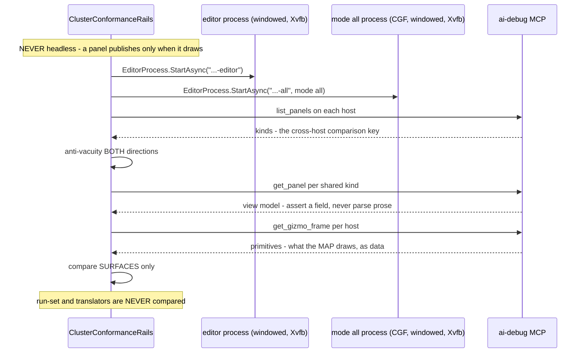
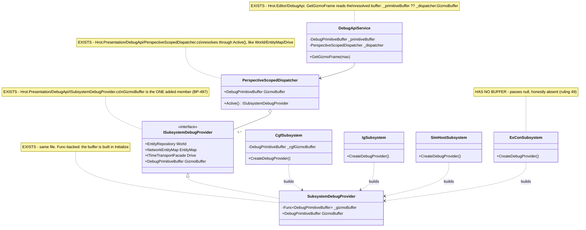

<!--STATUS
state: LIVE
build-state: DESIGN — phase 0 is READY-TO-BUILD (§5); phases 1+ get their own inventory + UML per batch,
  appended here as they are designed (the frame's process: design the stage, build it, fold the as-built).
updated: 2026-08-27
current-answer: the whole file. This is the STANDING design for the composition-unification programme —
  the approach, the constraints and the phase plan. §5 is the buildable phase-0 detail.
design-basis: 🔒 Architect_Question_63_Unify_Subsystem_Composition.md — §9/§10 are USER RULINGS (canon),
  §12 settles the phase-0 venue, ⛔ §11 is SUPERSEDED. Also: batches/HANDOFF_Cgf_Bootstrap_Unification.md
  (the dispatched frame) · Architect_Question_62 (predecessor; its SHAPE and STAGING are superseded) ·
  SharedApplicationBootstrapper (the existing 7-phase node base) · CgfEditorShellToolbar (the
  derived-subset pattern) · ScenarioEditorModule (the host-decides module precedent) ·
  tools/ai-debug-mcp/SKILL.md (the MCP channels — ⛔ never derive MCP capability from engine source).
known-conflict: ⛔ the dispatched frame handoff is stale on TWO points — its stage-1 god-facade
  prerequisite (AQ63 §3.3: obsolete by measurement) and its phase-0 rail wording (AQ63 §10.4: would encode
  a ruling violation). ⚠ The handoff is deliberately NOT edited — rule 1 forbids amending a dispatched
  handoff; the divergence is declared here and in the report instead.
-->
# ⭐⭐⭐ DESIGN — **Subsystem composition unification**

> 🔒 **The goal (user, `2026-08-27`):** *"the subsystem bootstrap need much bigger unification than there is
> now… we tried to unify so much like map, menus, gizmos… so we should share its composition code as well."*

## 1. ⭐⭐ THE PROBLEM IN ONE PARAGRAPH

📐 The **features** were unified — map, menus, gizmos, panels, catalogs, inspector, the scenario session.
⛔ **The composition of them was not.** Every windowed host still wires the shared pieces by hand, so a
piece added on one host silently never appears on another. 📌 **Every defect `CE-046`…`CE-064` is an
instance of that one root**, and the user found six of them by eye, in the UI, after five green batches.

## 2. ⭐⭐⭐ THE TWO HALVES — **one is already shared, one has no shared root at all**

| half | what it composes | status |
|---|---|---|
| ⭐ **NODE bootstrap** | context+world · ECS components · serializer · togglable groups · orchestration · spawn pipeline · DDS translators · time-sync · `Kernel.Initialize` | ✅ **`SharedApplicationBootstrapper`** — 7 phases, *"non-negotiable"* order, **3 adopters** *(SimHost · IG · Stride)*. ⛔ Five hosts bypass it |
| 🕳️ **UI / EXPERIENCE composition** | map+canvas · menus+toolbar · gizmos · windows/panels · catalogs · inspector · perspectives · time transport · AI shell | ⛔⛔ **NONE.** Wired inline in every host |

📐 **The correlation is the argument:** the three adopters' roots are **385 · 208 · small**; the five
hand-rollers' are **5325 · 2599 · 1086 · 602 · 460**.

### 2.1 ⭐⭐⭐ And the UI seam EXISTS — it is used the wrong way round
📐 `IWindowRegistrar` has **10** implementations and ⛔ **8 of them ARE the subsystems.** ⇒ the unit of
composition is the **host**, not the **feature** — which is precisely why there is nothing to share.
⭐ Meanwhile the system half is **50 `IEcsModule`s**. ⇒ ⭐⭐ **the fix is to bring the UI half to the pattern
the system half already has.** ⛔ Not a new abstraction — finishing one that exists.
⚠ `SharedAiWindowRegistrar` is the prototype: **built, in-degree 0, never adopted.**

## 3. 🔒🔒🔒 THE CONSTRAINTS — **canon; every batch is bound by these**

### 3.1 The three axes *(`AQ63` §9 + §10 — USER RULINGS)*
| axis | reference | unify? |
|---|---|---|
| ⭐⭐⭐ **UI · scenario editing · monitoring · debugging** | **the EDITOR is the SOURCE AND SPECIMEN** | ✅ **aggressively** |
| ⛔⛔ **the RUN-SET** — modules · systems · services | **each host's ROLE** | ⛔ **never** |
| ⛔⛔ **NETWORK** — translators · DDS · participant | **each host's ROLE** | ⛔ **never** |

⚠⚠ **THE TRAP, stated because it is invisible when you fall into it:** *"the editor is the specimen"* and
*"the editor runs almost everything"* are **two different axes.** 📌 A map bundle that registered
`MapCullingModule` + `StyleResolutionModule` *because the editor does* would **silently change what CGF
computes every frame — and would look like a successful unification.**
⇒ ⭐ **The editor is the reference on axis 1 and explicitly NOT on axes 2–3.**

### 3.2 ⛔⛔ THE STANDING CONSTRAINT
> **No bundle may register a module, a global system, a DDS translator, an egress/ingress system, or a
> participant.**

| ⭐ a bundle MAY | ⛔ a bundle MAY NOT |
|---|---|
| register **windows · panels · commands · menu items · toolbar entries** | ⛔ register anything from the run-set or the network |
| **DECLARE** the systems its affordances require | ⛔ decide the node's simulation topology |
| **report unserviceable** when the host does not run them | ⛔ silently no-op |

⭐⭐ **Three existing precedents prove the shape — this codifies them, it does not invent them:**

| precedent | why compliant |
|---|---|
| `ScenarioEditorModule` *(`E3`)* | 📐 **each host constructs and registers it ITSELF**, with its own `InteractionDeps` *(`EditorSubsystem:1290`, `CgfSubsystem:921`)* ⇒ the **host** decides it runs; never ambient |
| `ToolActivationDrainSystem(reportUnserviceable:)` *(`E3`)* | ⭐ a host that cannot service a tool **says so** — ruling 49 / `VC-3` at the system level |
| `CgfEditorShellToolbar` *(`CE-016`/`CE-037`…`045`)* | ⭐ ONE shared table; the per-host subset is **DERIVED from what the host can service** ⇒ no host list, no `if (host==…)` *(ruling 58)* |

### 3.3 ⛔ Why NOT one `ComposeEditorExperience(deps)` *(`AQ62`'s shape, superseded)*
⛔ A monolith cannot serve ExCon *(mission/orbat, no AI perspectives)*, IG *(display node)*, ReplayBrowser
*(own timeline)* or SimHost *(headless-first)* without either a **host conditional** *(ruling 58 forbids)* or
a **bag of nullable knobs** — ⛔⛔ and that is a **silent-default generator**, the exact shape behind five
measured defects. ⇒ ⭐ **bundles; a host composes a LIST, and a smaller list is a subset, never a branch.**

## 4. ⭐ THE PHASE PLAN

| phase | what | why here |
|---|---|---|
| ⭐⭐⭐ **0** | **the UI parity rail** *(§5)* | 🔒 user: *"for a refactor like this that rail is absolute must"*. It protects every later phase |
| **1** | the **bundle seam** + **menus/toolbar** across the windowed hosts | ⭐ `CgfEditorShellToolbar` already IS the pattern ⇒ proves the seam cheaply before betting map/gizmos on it |
| **2+** | **one bundle per batch**, extracted **from the editor as specimen**: scenario panels → gizmos → map → AI shell → time transport | ⭐ each collapses a measured drift site permanently |
| ⚠ **N** *(optional, LAST)* | node-bootstrap adoption — **CGF first** *(it already uses `HrotNodeBuilder`/`HrotNodeContext`; the editor uses neither)* | ⛔ **deliberately last:** the only phase touching orchestration/participant/time authority, i.e. what §3.1 says not to move blindly. 📐 **Not one** of `CE-046`…`CE-064` was a node-bootstrap gap |

⭐ **Dissolution, not extraction, for `IEditorLogic`** *(approved)*: 📐 128 ln / ~15 members, `EditorApplication`
297 ln of one-line delegations, **zero** code references from `AiShared`, ~3 members genuinely editor-only.
📌 `CE-060` dissolved one call in **one line** by publishing the event it already wrapped.

## 5. ⭐⭐⭐ PHASE 0 — **buildable detail. `build-state: READY-TO-BUILD`**

### 5.1 Venue and channels — settled *(`AQ63` §12)*
| | |
|---|---|
| ⭐⭐⭐ **venue** | **TWO WINDOWED processes under Xvfb, driven over MCP.** ⛔⛔ **NEVER headless** — *"a panel publishes only when it draws, and the headless runner loop never draws, so every panel dump would come back empty"* *(`SKILL.md`)* |
| ⭐⭐ **it already exists** | `ClusterConformanceRails.The_asset_panels_are_the_same_on_both_hosts` *(`:867`)*: `StartAsync("…-editor")` + `StartAsync("…-all", mode:"all")` → `CaptureByKindAsync` each → compare, **anti-vacuity BOTH directions** ⇒ ⭐ **phase 0 EXTENDS what it compares** |
| ⭐ **channels** | `list_panels` *(`kinds` = "the key a cross-host comparison uses")* · `get_panel` *(the view model; "assert a field, do not parse prose")* · ⭐⭐⭐ `get_gizmo_frame` *("what the map is drawing this frame, as data")* · `list_editor_commands` |
| ⛔ **production change** | **NONE** |
| ⚠ **tier** | **`T3`** — async / CI, ⛔ never a foreground blocker |

### 5.2 ⛔⛔ What the rail asserts — and what it must NOT
| ⭐ MUST assert | ⛔ MUST NOT |
|---|---|
| **surface parity** — both hosts offer the same windows/commands/menu items for a capability they both have | ⛔ **run-set parity** — *"CGF registers the same modules as the editor"* |
| **per-host internal coherence** — every system a host's declared affordances need, that host runs | ⛔ any cross-host equality over modules · systems · translators |
| **honest degradation** — an affordance whose systems are absent **reports** it | ⛔ treating an absence as a defect without asking whether the ROLE wants it |

⇒ ⭐⭐⭐ **It proves each host is internally coherent and that shared SURFACES match. Never that two hosts RUN
the same thing.** 📌 This CORRECTS the frame handoff's §1 wording *(`AQ63` §10.4)*.

### 5.3 The items
| # | item | proof |
|---|---|---|
| **①** | extend the two-host comparison to the **8 known drift instances**: scenario catalog non-empty · perspective icon keys resolve · `debug.*` group present · create-core single · `MutationInterceptor` set · perspective toolbar section present · scenario root · center/rotate routed | each **reddens on the pre-fix root** *(inverse edit)* |
| **②** | ⭐⭐⭐ **map parity via `get_gizmo_frame`** | ⭐ the highest-value item — reaches what no model-level rail can |
| **③** | the two NEW `--mode cgf` symptoms *(user, `2026-08-27`)*: ① the 2D map shows **NO entities** on some scenarios *(`hill-attack` loads, map empty)* · ② **center-on-entity CRASHES** ⚠ **suspect the `E3`/`CE-051` path — likely mine** | ⭐ each becomes an assertion that reddens pre-fix |
| **④** | ⛔ nothing in production | — |

### 5.5 ⭐⭐ SEQUENCE — the phase-0 rail, end to end *(obligation ①)*

⚠ **No `classDiagram`: phase 0 adds NO production type** — it extends an existing rail. ⭐ The sequence is
the part that must be unambiguous, because the venue is what §11 got wrong.



### 5.4 ⚠ What phase 0 will NOT reach — say it, do not paper over it
⛔ Anything needing real pixels: actual rasterisation, gizmo **picking** by mouse, ImGui hit-testing.
⭐ `get_gizmo_frame` reaches *what is submitted for drawing*, ⛔ not *what a human sees*. ⇒ a small
`--mode cgf` eyes pass stays part of acceptance. 📌 **Two of the six user-found symptoms were of that
kind** *(`CE-055`/`CE-056`, both since confirmed non-repro)* ⇒ ⛔ this rail **reduces** the eyes-only
surface; it does not eliminate it. ⚠ Claiming otherwise would repeat the `CE-049` over-claim.

### 5.6 ⛔⛔⛔ `BP-487` — **item ②'s channel does not answer on the cluster.** *(measured `2026-08-27`)*

⚠⚠ **§5.3 item ④ said *"nothing in production."* ⭐ MEASURED, that is FALSE for item ②** — and the
finding was **already filed**, which is the R-129 lesson landing again: 📄
**`DESIGN_UI_Observability_Snapshot.md`** STATUS, verbatim —

> **(3) OPEN, `BP-487`: `ClearCaptured` and the gizmo publish have ONE production caller each
> (`EditorSubsystem`) while four other hosts drive a gizmo buffer — harmless while the debug API is
> Editor-only, blocking for cross-host conformance.**

⇒ ⭐⭐ **the id EXISTS — do NOT allocate a new one.** ⛔ And it is not `MX-011`: that asks the buffer be
*registered into `PanelSnapshot`* so one `DumpAll()` carries it *(MCP lane, and it would make a 128 KB
high-churn model a SHARED kind needing a fresh exemption)*. ⭐ **`BP-487` is the reachability half.**

#### 📐 The measurement — a textbook SILENT DEFAULT
| | |
|---|---|
| the channel | `GET /panels/_gizmo` → `DebugApiService.GetGizmoFrame` reads **`_primitiveBuffer`** *(`DebugApiService.Panels.cs:127`)*, ⛔ **not** `PanelSnapshot` |
| who passes it | ⭐ **only** `EditorSubsystem.cs:1901`. ⛔ `ClusterRunner/Program.cs:429` builds the cluster service **without it** |
| the answer on `--mode all` | 🔴 **404** *"This editor has no debug primitive buffer, so there is no gizmo feed."* |
| ⭐⭐⭐ **and the caller HAS one** | `CgfSubsystem._cgfGizmoBuffer` *(`:851` — fed by `GlobalGizmoManager`+`StatelessGizmoSystem`, drawn by `DebugGizmoLayer:1096`, `_canvas.DrawBuffer` at `:1098`)* · `IgApplication.GizmoBuffer` *(`:481`)* · `SimHostVisualization.GizmoBuffer` *(`:123`)*. ⛔ ExCon has **none** ⇒ **3 of 4** |

⇒ 🔒 **exactly the rule this codebase keeps paying for: *a production caller that HAS a dependency must
PASS it*** — and the control is asserted **on the constructed object**, not on the registrar's source.

#### ⭐ The fix — **through the provider seam, not a latched field**
⛔ `Program.cs` **cannot** pass one buffer: `--mode all` runs CGF *and* IG *and* SimHost, and the feed must
follow the **ACTIVE perspective** like every other per-node fact. ⭐⭐ `ISubsystemDebugProvider` is already
*"everything that differs per node"* — `World` · `EntityMap` · `Drive` — so the member belongs there.
⚠⚠ **`Func`-backed, never a captured value** — 📌 `Program.cs:399` states the rule and names the bug it
already cost: *"a value-captured provider LIES"* *(the buffer is built in `Initialize`)*.



#### 🔒 Why this does NOT breach the §3 standing constraint
⭐⭐ It moves **diagnostics egress** only: ⛔ **no module, system, translator or participant is registered**,
and ⛔ **no host is made to draw anything it did not already draw** — the buffer, its feeders and its layer
already exist per host. ⇒ the rail reads *what each host ALREADY submits*, which is the only thing §5.2
lets it compare.

⚠ **The `_gizmo` `EditorOnlyKinds` entry STAYS** *(and its comment is corrected)*: after `BP-487` the
cluster's feed is **reachable at the endpoint** but still **does not publish the `_gizmo` PANEL KIND** —
that is `MX-011`, another lane. ⛔ Deleting the entry would be a lie; ⭐ instead it now names the rail that
covers the substance.

### 5.7 ⛔⛔⛔ `CE-065` — **the user's crash, root-caused. THE SHARED SYSTEM WAS ROUTED; ITS EVENTS WERE NOT.**

⭐⭐⭐ **This is phase 0's real find, and it is the strongest possible argument for the whole programme:**
the `E3` slice moved *"center on entity"* onto a shared system and deleted CGF's hand-rolled parallel —
✅ correctly — ⛔ **but the EVENT REGISTRATION stayed behind in `EditorSubsystem`.**

#### 📐 Reproduced over MCP, `2026-08-27`
```
POST /entities/1000/focus  →  500
Strict Mode Violation: Unmanaged event type 'CenterOnEntityCommand' (ID: 8104) was
published without being explicitly registered. You must call world.RegisterEvent<…>().
```
| | |
|---|---|
| ⭐⭐ **why it CRASHES rather than 500s in the UI** | the same publish happens inside CGF's ImGui **context-menu callback**, where the throw is unhandled ⇒ 🔴 **the process dies.** That is the user's report, exactly |
| ⭐⭐⭐ **the enabling condition** | `ClusterRunner/Program.cs:52` sets **`FdpConfig.EnforceExplicitEventRegistration = true`** — ⛔ **PROCESS-WIDE.** ⚠⚠ **I previously measured this as *"defaults false, and ClusterRunner does not set it"* — that was WRONG**, and it is why an earlier session dropped this hypothesis |
| 🔒 **the seam already existed** | `PresentationComponentRegistry.RegisterAll` **already registered `SelectEntityCommand`** ⇒ ⭐⭐ **that is precisely why *"Select entity"* worked on CGF while its SIBLING menu item crashed** — two items from one slice, one central, one inline |

⇒ ⭐⭐ **the 25th measured instance of the seam law here:** *"we need a shared registration"* meant **the
shared registry existed and was under-adopted.** ⛔ The fix is not a new registry.

#### ⭐ The fix — one list *(ruling 9)*
| | |
|---|---|
| ✅ `CenterOnEntityCommand` + `ActivateEditorToolEvent` **added** to `PresentationComponentRegistry.RegisterAll`, beside `SelectEntityCommand` | 📐 enumerated from the three systems `ScenarioEditorModule.RegisterSystems` registers — the complete set, not the one that crashed |
| ✅ the editor's inline `:917-918` pair **DELETED** | ⭐ the editor still gets them: `EditorSubsystem:905` calls `CgfComponentRegistry.RegisterAll(_world)` → this registry. ⛔ Keeping both would be the two-list state that caused this |
| ⭐ **reach** | `CgfComponentRegistry` · `SimHostComponentRegistry` · `StrideNodeBootstrapper` · the editor transitively ⇒ **one edit, every windowed host** |

⚠ **Sibling precedent, and it means this shape has now been paid for TWICE:** `HrotNodeBuilder:101-112`
registers `OrchestrationEventRegistry` on the NODE bus for the identical reason — its comment reads
*"Without this line, pressing pause on a CGF/SimHost/IG toolbar throws instead of pausing."* ⇒ ⭐ **two
buses, two lists, and each list must be the ONLY one for its bus.**

#### ⛔⛔ Why every existing rail was green — **the rail-blindness pattern, 4th instance**
| the rails that existed | what they proved | ⛔ what they never asked |
|---|---|---|
| `TheViewportInteractionIsSharedTests` source scans | CGF publishes the shared command instead of hand-rolling | — |
| its behavioural rails | the shared system reacts correctly | — |
| ⛔ **neither** | — | 🔴 **whether the event was REGISTERED on the publishing host's bus** |

⭐⭐⭐ **And the reason is exact: unit rails run with strict mode OFF (the default), where `Publish` creates
the stream lazily.** ⇒ the rails published these very events and stayed green.
⭐ The new rails turn it **ON**, which is the production condition. 📌 Joins `CE-049` *(asserted presence,
not substance)* · `CE-053` *(supplied the input it tested)* · `CE-064` *(asserted over an empty set)*.

### 5.8 ⚠⚠ AS-BUILT CORRECTIONS TO §5.3 — **three of its four items were wrong about the world**

| item | §5.3 said | 📐 MEASURED `2026-08-27` |
|---|---|---|
| **①** the 8 drift instances | *"extend the two-host comparison to them"* | ⭐⭐ **ALL EIGHT ARE ALREADY RAILED** by the preceding batch ⇒ **item ① is DISCHARGED BY INVENTORY, not by new code.** ⛔ Rebuilding them as a T3 comparison would duplicate what T0 rails prove faster and *at the line*. Per instance: catalog→`TheCgfPickerIsNotEmptyTests` · icons→`EveryPerspectiveHasAToolbarIconTests` · `debug.*`→`TheAiDebugGroupExistsOnBothHostsTests` · create-core→`TheCreateCoreIsOneImplementationTests` · `MutationInterceptor`→`BreakpointSubsystemWiringTests` *(📐 **25/25 in 18 s when filtered** — the "un-gateable suite" note applies to OTHER classes in it, not this one)* · toolbar section→`TheCgfPickerIsNotEmptyTests.AWindowedHostComposesThePerspectiveToolbarSection` · scenario root→`TheHostsAgreeOnTheScenarioRootTests` · center/rotate→`TheViewportInteractionIsSharedTests` |
| **③**(1) *"the map shows NO entities"* | a symptom to reproduce | ⚪ **DOES NOT REPRODUCE on `hill-attack` in `--mode all`.** 📐 The cluster's map submits **739** primitives incl. **16 `SpatialAnchor`s naming ids 1000–1007** — every scenario entity, matching the editor's set. ⇒ ⚠ **scenario-specific or state-specific; the rail is now standing to catch it.** ⛔ Do NOT record it as fixed — it is unreproduced, like `CE-055`/`CE-056` |
| **③**(2) *"center-on-entity CRASHES"* | *"suspect the `E3`/`CE-051` path — likely mine"* | 🔴 **CONFIRMED, and the suspicion was right.** `CE-065`, §5.7 |
| **④** *"nothing in production"* | — | ⛔ **FALSE, twice.** `BP-487` *(§5.6)* was needed to make item ② reachable at all, and `CE-065` is a live crash fix. ⭐ The *parity comparison itself* still adds no production code — that is the half that survives |

⭐ **And one venue fact a later session must not re-derive:** ⛔⛔ **`--mode cgf` ALONE CANNOT BOOT.**
📐 `DdsIdAllocator` waits 30 s for `Hrot.Orchestrator` then throws; the process dies with **exit 134**
before serving `/status`. ⇒ ⭐ **CGF is exercised through `--mode all` + the `Scenario` perspective**, which
is what the user was running. ⚠ *"the `--mode cgf` symptoms"* in §5.3 is shorthand for *"CGF's symptoms"*.

#### 📐 The measured map frames — the baseline a later drift is compared against
| | editor | `--mode all` *(CGF/Scenario)* |
|---|---|---|
| primitives | **828** | **739** |
| shapes | `Arrow:12 Box2D:16 ContextMenuBinding:9 LayerControlMask:1 Line:674 MainMenuBinding:1 SemanticShape:24 SpatialAnchor:24 Sphere:20 Text:47` | `Arrow:12 Box2D:8 ContextMenuBinding:9 Line:670 SemanticShape:16 SpatialAnchor:16 Text:8` |
| entity anchors | ids 1000–1007, ×3 | ids 1000–1007, ×2 |
| verdict | ⭐ **subset holds** — no cluster-only shape. Editor-only: `LayerControlMask` · `MainMenuBinding` · `Sphere` *(authoring overlays — expected)* |

## 6. ⭐ ACCEPTANCE, PER PHASE
| ⭐ | |
|---|---|
| **editor byte-identical** where the phase touches it — window **ids** unchanged, asserted | ⛔ a "tidier" rename silently resets users' layouts |
| the parity rail stays green; the phase's own new assertions redden pre-fix | |
| ⛔ the **(c) core** preserved: role · handler binding · unowned-write authority · in-process kernel mode | ⚠ a phase that blurs one is a **STOP-and-report** *(`R-106`)* |
| build **affected projects only** *(📐 8 s vs 115 s for the solution)*; build once then `--no-build` | |
| ⭐ fold the as-built into THIS file per phase *(obligation ⑤)*, then report | |

## 7. ⚠ THE RAIL-BLINDNESS PATTERN — **three instances; expect a fourth**
| id | shape |
|---|---|
| `CE-049` | asserted a control is **present and enabled**, never that it **has something to offer** |
| `CE-053` | **supplied the input it was testing** ⇒ blind to the host supplying a different one |
| `CE-064` | the assertion was correct, universal and **UNREACHABLE** — a loop over an empty collection |

⇒ ⭐⭐ **Before writing any rail, ask: what input does it supply, and could it pass vacuously?** ⭐ Every
phase-0 assertion carries an explicit non-empty guard for that reason.
