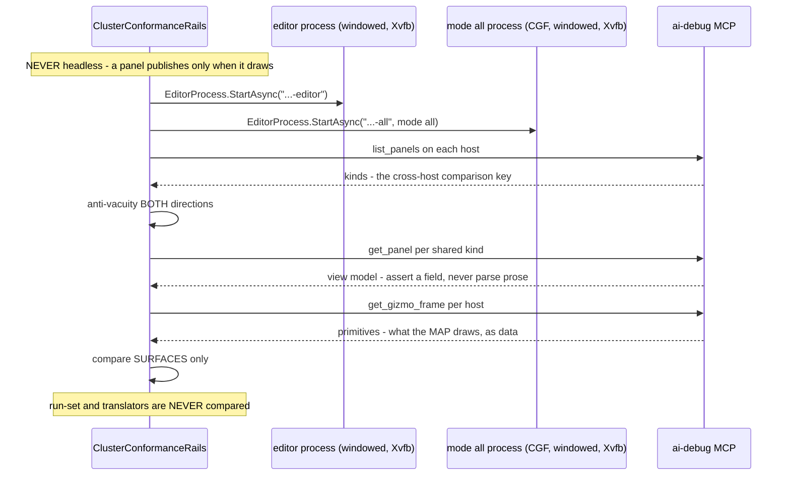
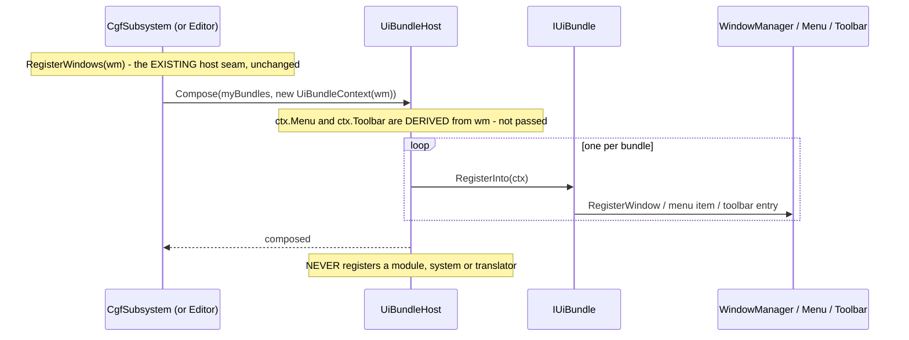
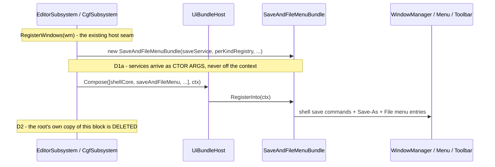
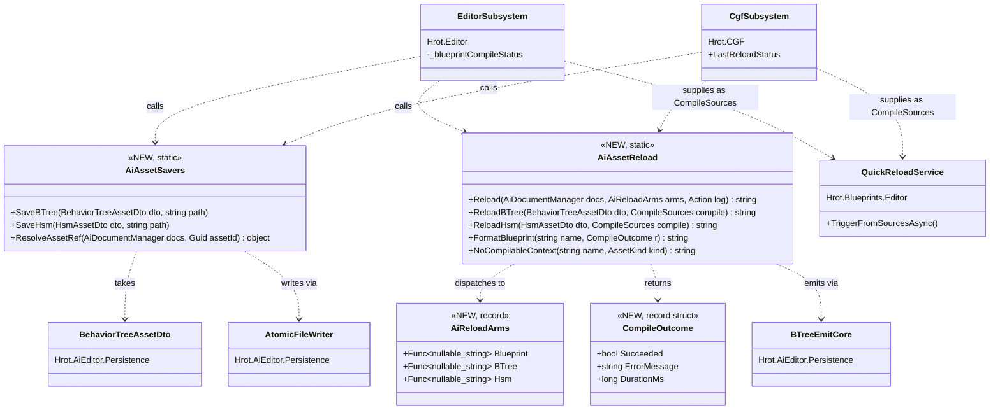
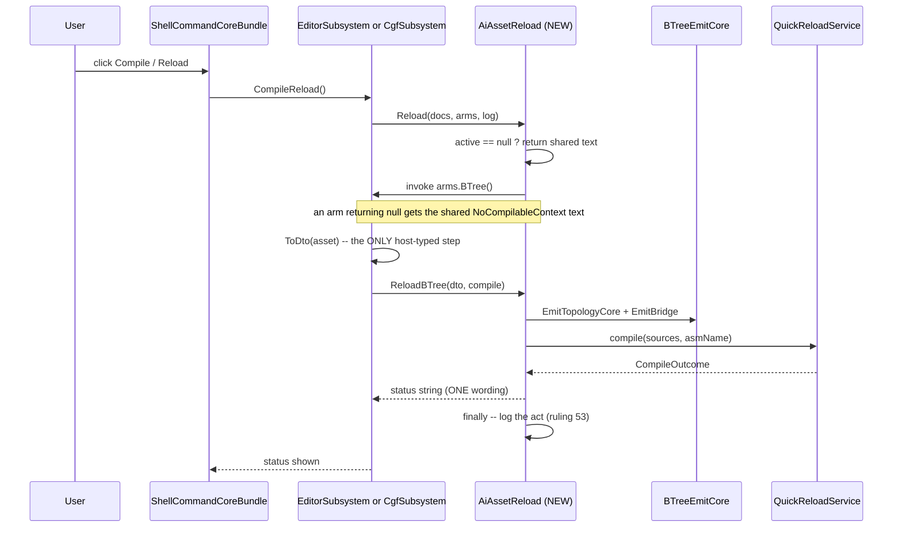

<!--STATUS
state: LIVE
build-state: phase 0 is BUILT (§5, as-built §5.6–§5.9). Phase 1's SEAM is BUILT with two adopters
  (§5b, as-built §5b.4); its remaining adoptions are listed at the end of §5b.4. Phases 2+ get their own
  inventory + UML per batch, appended here as they are designed.
updated: 2026-08-27
current-answer: the whole file. This is the STANDING design for the composition-unification programme —
  the approach, the constraints and the phase plan. §5 = phase 0 (BUILT; §5.6-§5.9 are its as-built),
  §5b = phase 1 (seam BUILT; ⚠ §5b.4 records THREE argued deviations — read it before quoting §5b.2's
  classDiagram or §5b.3's item ②).
  ⚠ §5b.1 CORRECTS §2.1: the bundle seam is not missing — a FEATURE-level IWindowRegistrar exists in
  Hrot.Blueprints.Editor with in-degree 24, and BlueprintWindowRegistrar is a working adopted precedent
  for the whole pattern. Read §5b.1 before quoting §2.1's "nothing to share".
design-basis: 🔒 Architect_Question_63_Unify_Subsystem_Composition.md — §9/§10 are USER RULINGS (canon),
  §12 settles the phase-0 venue, ⛔ §11 is SUPERSEDED. Also: batches/HANDOFF_Cgf_Bootstrap_Unification.md
  (the dispatched frame) · Architect_Question_62 (predecessor; its SHAPE and STAGING are superseded) ·
  SharedApplicationBootstrapper (the existing 7-phase node base) · CgfEditorShellToolbar (the
  derived-subset pattern) · ScenarioEditorModule (the host-decides module precedent) ·
  tools/ai-debug-mcp/SKILL.md (the MCP channels — ⛔ never derive MCP capability from engine source).
known-conflict: ⛔ the dispatched frame handoff is stale on TWO points — its stage-1 god-facade
  prerequisite (AQ63 §3.3: obsolete by measurement) and its phase-0 rail wording (AQ63 §10.4: would encode
  a ruling violation). ⚠ The handoff is deliberately NOT edited — rule 1 forbids amending a dispatched
  handoff; the divergence is declared here and in the report instead.
-->
# ⭐⭐⭐ DESIGN — **Subsystem composition unification**

> 🔒 **The goal (user, `2026-08-27`):** *"the subsystem bootstrap need much bigger unification than there is
> now… we tried to unify so much like map, menus, gizmos… so we should share its composition code as well."*

## 1. ⭐⭐ THE PROBLEM IN ONE PARAGRAPH

📐 The **features** were unified — map, menus, gizmos, panels, catalogs, inspector, the scenario session.
⛔ **The composition of them was not.** Every windowed host still wires the shared pieces by hand, so a
piece added on one host silently never appears on another. 📌 **Every defect `CE-046`…`CE-064` is an
instance of that one root**, and the user found six of them by eye, in the UI, after five green batches.

## 2. ⭐⭐⭐ THE TWO HALVES — **one is already shared, one has no shared root at all**

| half | what it composes | status |
|---|---|---|
| ⭐ **NODE bootstrap** | context+world · ECS components · serializer · togglable groups · orchestration · spawn pipeline · DDS translators · time-sync · `Kernel.Initialize` | ✅ **`SharedApplicationBootstrapper`** — 7 phases, *"non-negotiable"* order, **3 adopters** *(SimHost · IG · Stride)*. ⛔ Five hosts bypass it |
| 🕳️ **UI / EXPERIENCE composition** | map+canvas · menus+toolbar · gizmos · windows/panels · catalogs · inspector · perspectives · time transport · AI shell | ⛔⛔ **NONE.** Wired inline in every host |

📐 **The correlation is the argument:** the three adopters' roots are **385 · 208 · small**; the five
hand-rollers' are **5325 · 2599 · 1086 · 602 · 460**.

### 2.1 ⭐⭐⭐ And the UI seam EXISTS — it is used the wrong way round
> ⚠⚠ **PARTLY SUPERSEDED `2026-08-27` — read [§5b.1](#5b1--inventory-graph-2026-08-27--queries-recorded)
> before quoting this section.** ⭐ The conclusion *("bring the UI half to the pattern the system half has")*
> **stands**; ⛔ two of the measurements below are wrong, and the correction makes phase 1 **cheaper**:
> 📐 there are **TWO** interfaces named `IWindowRegistrar` — a HOST-level one *(in-degree 8)* and a
> **FEATURE-level one in `Hrot.Blueprints.Editor` with in-degree 24** — and `BlueprintWindowRegistrar` is
> already a **working, adopted** bundle. ⇒ ⛔ *"there is nothing to share"* is FALSE.

📐 `IWindowRegistrar` has **10** implementations and ⛔ **8 of them ARE the subsystems.** ⇒ the unit of
composition is the **host**, not the **feature** — which is precisely why there is nothing to share.
⭐ Meanwhile the system half is **50 `IEcsModule`s**. ⇒ ⭐⭐ **the fix is to bring the UI half to the pattern
the system half already has.** ⛔ Not a new abstraction — finishing one that exists.
⛔⛔ **`SharedAiWindowRegistrar` was cited here as *"the prototype: built, in-degree 0, never adopted"* — it
is now DELETED** *(`CE-070`, §5b.6)*, and **both halves of that description were wrong**: ⚠ a DI rail
resolved it *(so it was wired and host-unused — worse than unadopted, because it looked adopted)*, and
⭐⭐ its windows declare `WindowScope.PerspectiveBound`, so it was **the wrong shape**, not an unfinished
prototype. ⇒ ⭐ **the surviving prototype is `BlueprintWindowRegistrar`** *(§5b.1)*, which works and is
adopted — and phase 1 named its shape as `IUiBundle`.

## 3. 🔒🔒🔒 THE CONSTRAINTS — **canon; every batch is bound by these**

### 3.1 The three axes *(`AQ63` §9 + §10 — USER RULINGS)*
| axis | reference | unify? |
|---|---|---|
| ⭐⭐⭐ **UI · scenario editing · monitoring · debugging** | **the EDITOR is the SOURCE AND SPECIMEN** | ✅ **aggressively** |
| ⛔⛔ **the RUN-SET** — modules · systems · services | **each host's ROLE** | ⛔ **never** |
| ⛔⛔ **NETWORK** — translators · DDS · participant | **each host's ROLE** | ⛔ **never** |

⚠⚠ **THE TRAP, stated because it is invisible when you fall into it:** *"the editor is the specimen"* and
*"the editor runs almost everything"* are **two different axes.** 📌 A map bundle that registered
`MapCullingModule` + `StyleResolutionModule` *because the editor does* would **silently change what CGF
computes every frame — and would look like a successful unification.**
⇒ ⭐ **The editor is the reference on axis 1 and explicitly NOT on axes 2–3.**

### 3.2 ⛔⛔ THE STANDING CONSTRAINT
> **No bundle may register a module, a global system, a DDS translator, an egress/ingress system, or a
> participant.**

| ⭐ a bundle MAY | ⛔ a bundle MAY NOT |
|---|---|
| register **windows · panels · commands · menu items · toolbar entries** | ⛔ register anything from the run-set or the network |
| **DECLARE** the systems its affordances require | ⛔ decide the node's simulation topology |
| **report unserviceable** when the host does not run them | ⛔ silently no-op |

⭐⭐ **Three existing precedents prove the shape — this codifies them, it does not invent them:**

| precedent | why compliant |
|---|---|
| `ScenarioEditorModule` *(`E3`)* | 📐 **each host constructs and registers it ITSELF**, with its own `InteractionDeps` *(`EditorSubsystem:1290`, `CgfSubsystem:921`)* ⇒ the **host** decides it runs; never ambient |
| `ToolActivationDrainSystem(reportUnserviceable:)` *(`E3`)* | ⭐ a host that cannot service a tool **says so** — ruling 49 / `VC-3` at the system level |
| `CgfEditorShellToolbar` *(`CE-016`/`CE-037`…`045`)* | ⭐ ONE shared table; the per-host subset is **DERIVED from what the host can service** ⇒ no host list, no `if (host==…)` *(ruling 58)* |

### 3.3 ⛔ Why NOT one `ComposeEditorExperience(deps)` *(`AQ62`'s shape, superseded)*
⛔ A monolith cannot serve ExCon *(mission/orbat, no AI perspectives)*, IG *(display node)*, ReplayBrowser
*(own timeline)* or SimHost *(headless-first)* without either a **host conditional** *(ruling 58 forbids)* or
a **bag of nullable knobs** — ⛔⛔ and that is a **silent-default generator**, the exact shape behind five
measured defects. ⇒ ⭐ **bundles; a host composes a LIST, and a smaller list is a subset, never a branch.**

## 4. ⭐ THE PHASE PLAN

| phase | what | why here |
|---|---|---|
| ⭐⭐⭐ **0** | **the UI parity rail** *(§5)* | 🔒 user: *"for a refactor like this that rail is absolute must"*. It protects every later phase |
| **1** | the **bundle seam** + **menus/toolbar** across the windowed hosts | ⭐ `CgfEditorShellToolbar` already IS the pattern ⇒ proves the seam cheaply before betting map/gizmos on it |
| **2+** | **one bundle per batch**, extracted **from the editor as specimen**: scenario panels → gizmos → map → AI shell → time transport | ⭐ each collapses a measured drift site permanently |
| ⚠ **N** *(optional, LAST)* | node-bootstrap adoption — **CGF first** *(it already uses `HrotNodeBuilder`/`HrotNodeContext`; the editor uses neither)* | ⛔ **deliberately last:** the only phase touching orchestration/participant/time authority, i.e. what §3.1 says not to move blindly. 📐 **Not one** of `CE-046`…`CE-064` was a node-bootstrap gap |

⭐ **Dissolution, not extraction, for `IEditorLogic`** *(approved)*: 📐 128 ln / ~15 members, `EditorApplication`
297 ln of one-line delegations, **zero** code references from `AiShared`, ~3 members genuinely editor-only.
📌 `CE-060` dissolved one call in **one line** by publishing the event it already wrapped.

## 5. ⭐⭐⭐ PHASE 0 — **buildable detail. `build-state: READY-TO-BUILD`**

### 5.1 Venue and channels — settled *(`AQ63` §12)*
| | |
|---|---|
| ⭐⭐⭐ **venue** | **TWO WINDOWED processes under Xvfb, driven over MCP.** ⛔⛔ **NEVER headless** — *"a panel publishes only when it draws, and the headless runner loop never draws, so every panel dump would come back empty"* *(`SKILL.md`)* |
| ⭐⭐ **it already exists** | `ClusterConformanceRails.The_asset_panels_are_the_same_on_both_hosts` *(`:867`)*: `StartAsync("…-editor")` + `StartAsync("…-all", mode:"all")` → `CaptureByKindAsync` each → compare, **anti-vacuity BOTH directions** ⇒ ⭐ **phase 0 EXTENDS what it compares** |
| ⭐ **channels** | `list_panels` *(`kinds` = "the key a cross-host comparison uses")* · `get_panel` *(the view model; "assert a field, do not parse prose")* · ⭐⭐⭐ `get_gizmo_frame` *("what the map is drawing this frame, as data")* · `list_editor_commands` |
| ⛔ **production change** | **NONE** |
| ⚠ **tier** | **`T3`** — async / CI, ⛔ never a foreground blocker |

### 5.2 ⛔⛔ What the rail asserts — and what it must NOT
| ⭐ MUST assert | ⛔ MUST NOT |
|---|---|
| **surface parity** — both hosts offer the same windows/commands/menu items for a capability they both have | ⛔ **run-set parity** — *"CGF registers the same modules as the editor"* |
| **per-host internal coherence** — every system a host's declared affordances need, that host runs | ⛔ any cross-host equality over modules · systems · translators |
| **honest degradation** — an affordance whose systems are absent **reports** it | ⛔ treating an absence as a defect without asking whether the ROLE wants it |

⇒ ⭐⭐⭐ **It proves each host is internally coherent and that shared SURFACES match. Never that two hosts RUN
the same thing.** 📌 This CORRECTS the frame handoff's §1 wording *(`AQ63` §10.4)*.

### 5.3 The items
| # | item | proof |
|---|---|---|
| **①** | extend the two-host comparison to the **8 known drift instances**: scenario catalog non-empty · perspective icon keys resolve · `debug.*` group present · create-core single · `MutationInterceptor` set · perspective toolbar section present · scenario root · center/rotate routed | each **reddens on the pre-fix root** *(inverse edit)* |
| **②** | ⭐⭐⭐ **map parity via `get_gizmo_frame`** | ⭐ the highest-value item — reaches what no model-level rail can |
| **③** | the two NEW **`--mode all`** symptoms *(user, `2026-08-27`; ⚠ this row said `--mode cgf` until `2026-08-27` — the user runs `--mode all`, and CGF's UI is reached THROUGH it)*: ① the 2D map shows **NO entities** on some scenarios *(`hill-attack` loads, map empty)* · ② **center-on-entity CRASHES** ⚠ **suspect the `E3`/`CE-051` path — likely mine** | ⭐ each becomes an assertion that reddens pre-fix |
| **④** | ⛔ nothing in production | — |

### 5.5 ⭐⭐ SEQUENCE — the phase-0 rail, end to end *(obligation ①)*

⚠ **No `classDiagram`: phase 0 adds NO production type** — it extends an existing rail. ⭐ The sequence is
the part that must be unambiguous, because the venue is what §11 got wrong.



### 5.4 ⚠ What phase 0 will NOT reach — say it, do not paper over it
⛔ Anything needing real pixels: actual rasterisation, gizmo **picking** by mouse, ImGui hit-testing.
⭐ `get_gizmo_frame` reaches *what is submitted for drawing*, ⛔ not *what a human sees*. ⇒ a small
**`--mode all`** eyes pass stays part of acceptance. ⚠⚠ **This line said `--mode cgf` until `2026-08-27`;
that was WRONG and actively misleading** — 🔒 user: *"we never use `--mode cgf`, it was `--mode all`"*, and
⛔ `--mode cgf` cannot boot at all *(§5.8)*, so an eyes pass there is not merely unusual, it is impossible. 📌 **Two of the six user-found symptoms were of that
kind** *(`CE-055`/`CE-056`, both since confirmed non-repro)* ⇒ ⛔ this rail **reduces** the eyes-only
surface; it does not eliminate it. ⚠ Claiming otherwise would repeat the `CE-049` over-claim.

### 5.6 ⛔⛔⛔ `BP-487` — **item ②'s channel does not answer on the cluster.** *(measured `2026-08-27`)*

⚠⚠ **§5.3 item ④ said *"nothing in production."* ⭐ MEASURED, that is FALSE for item ②** — and the
finding was **already filed**, which is the R-129 lesson landing again: 📄
**`DESIGN_UI_Observability_Snapshot.md`** STATUS, verbatim —

> **(3) OPEN, `BP-487`: `ClearCaptured` and the gizmo publish have ONE production caller each
> (`EditorSubsystem`) while four other hosts drive a gizmo buffer — harmless while the debug API is
> Editor-only, blocking for cross-host conformance.**

⇒ ⭐⭐ **the id EXISTS — do NOT allocate a new one.** ⛔ And it is not `MX-011`: that asks the buffer be
*registered into `PanelSnapshot`* so one `DumpAll()` carries it *(MCP lane, and it would make a 128 KB
high-churn model a SHARED kind needing a fresh exemption)*. ⭐ **`BP-487` is the reachability half.**

#### 📐 The measurement — a textbook SILENT DEFAULT
| | |
|---|---|
| the channel | `GET /panels/_gizmo` → `DebugApiService.GetGizmoFrame` reads **`_primitiveBuffer`** *(`DebugApiService.Panels.cs:127`)*, ⛔ **not** `PanelSnapshot` |
| who passes it | ⭐ **only** `EditorSubsystem.cs:1901`. ⛔ `ClusterRunner/Program.cs:429` builds the cluster service **without it** |
| the answer on `--mode all` | 🔴 **404** *"This editor has no debug primitive buffer, so there is no gizmo feed."* |
| ⭐⭐⭐ **and the caller HAS one** | `CgfSubsystem._cgfGizmoBuffer` *(`:851` — fed by `GlobalGizmoManager`+`StatelessGizmoSystem`, drawn by `DebugGizmoLayer:1096`, `_canvas.DrawBuffer` at `:1098`)* · `IgApplication.GizmoBuffer` *(`:481`)* · `SimHostVisualization.GizmoBuffer` *(`:123`)*. ⛔ ExCon has **none** ⇒ **3 of 4** |

⇒ 🔒 **exactly the rule this codebase keeps paying for: *a production caller that HAS a dependency must
PASS it*** — and the control is asserted **on the constructed object**, not on the registrar's source.

#### ⭐ The fix — **through the provider seam, not a latched field**
⛔ `Program.cs` **cannot** pass one buffer: `--mode all` runs CGF *and* IG *and* SimHost, and the feed must
follow the **ACTIVE perspective** like every other per-node fact. ⭐⭐ `ISubsystemDebugProvider` is already
*"everything that differs per node"* — `World` · `EntityMap` · `Drive` — so the member belongs there.
⚠⚠ **`Func`-backed, never a captured value** — 📌 `Program.cs:399` states the rule and names the bug it
already cost: *"a value-captured provider LIES"* *(the buffer is built in `Initialize`)*.


#### 🔒 Why this does NOT breach the §3 standing constraint
⭐⭐ It moves **diagnostics egress** only: ⛔ **no module, system, translator or participant is registered**,
and ⛔ **no host is made to draw anything it did not already draw** — the buffer, its feeders and its layer
already exist per host. ⇒ the rail reads *what each host ALREADY submits*, which is the only thing §5.2
lets it compare.

⚠ **The `_gizmo` `EditorOnlyKinds` entry STAYS** *(and its comment is corrected)*: after `BP-487` the
cluster's feed is **reachable at the endpoint** but still **does not publish the `_gizmo` PANEL KIND** —
that is `MX-011`, another lane. ⛔ Deleting the entry would be a lie; ⭐ instead it now names the rail that
covers the substance.

### 5.7 ⛔⛔⛔ `CE-065` — **the user's crash, root-caused. THE SHARED SYSTEM WAS ROUTED; ITS EVENTS WERE NOT.**

⭐⭐⭐ **This is phase 0's real find, and it is the strongest possible argument for the whole programme:**
the `E3` slice moved *"center on entity"* onto a shared system and deleted CGF's hand-rolled parallel —
✅ correctly — ⛔ **but the EVENT REGISTRATION stayed behind in `EditorSubsystem`.**

#### 📐 Reproduced over MCP, `2026-08-27`
```
POST /entities/1000/focus  →  500
Strict Mode Violation: Unmanaged event type 'CenterOnEntityCommand' (ID: 8104) was
published without being explicitly registered. You must call world.RegisterEvent<…>().
```
| | |
|---|---|
| ⭐⭐ **why it CRASHES rather than 500s in the UI** | the same publish happens inside CGF's ImGui **context-menu callback**, where the throw is unhandled ⇒ 🔴 **the process dies.** That is the user's report, exactly |
| ⭐⭐⭐ **the enabling condition** | `ClusterRunner/Program.cs:52` sets **`FdpConfig.EnforceExplicitEventRegistration = true`** — ⛔ **PROCESS-WIDE.** ⚠⚠ **I previously measured this as *"defaults false, and ClusterRunner does not set it"* — that was WRONG**, and it is why an earlier session dropped this hypothesis |
| 🔒 **the seam already existed** | `PresentationComponentRegistry.RegisterAll` **already registered `SelectEntityCommand`** ⇒ ⭐⭐ **that is precisely why *"Select entity"* worked on CGF while its SIBLING menu item crashed** — two items from one slice, one central, one inline |

⇒ ⭐⭐ **the 25th measured instance of the seam law here:** *"we need a shared registration"* meant **the
shared registry existed and was under-adopted.** ⛔ The fix is not a new registry.

#### ⭐ The fix — one list *(ruling 9)*
| | |
|---|---|
| ✅ `CenterOnEntityCommand` + `ActivateEditorToolEvent` **added** to `PresentationComponentRegistry.RegisterAll`, beside `SelectEntityCommand` | 📐 enumerated from the three systems `ScenarioEditorModule.RegisterSystems` registers — the complete set, not the one that crashed |
| ✅ the editor's inline `:917-918` pair **DELETED** | ⭐ the editor still gets them: `EditorSubsystem:905` calls `CgfComponentRegistry.RegisterAll(_world)` → this registry. ⛔ Keeping both would be the two-list state that caused this |
| ⭐ **reach** | `CgfComponentRegistry` · `SimHostComponentRegistry` · `StrideNodeBootstrapper` · the editor transitively ⇒ **one edit, every windowed host** |

⚠ **Sibling precedent, and it means this shape has now been paid for TWICE:** `HrotNodeBuilder:101-112`
registers `OrchestrationEventRegistry` on the NODE bus for the identical reason — its comment reads
*"Without this line, pressing pause on a CGF/SimHost/IG toolbar throws instead of pausing."* ⇒ ⭐ **two
buses, two lists, and each list must be the ONLY one for its bus.**

#### ⛔⛔ Why every existing rail was green — **the rail-blindness pattern, 4th instance**
| the rails that existed | what they proved | ⛔ what they never asked |
|---|---|---|
| `TheViewportInteractionIsSharedTests` source scans | CGF publishes the shared command instead of hand-rolling | — |
| its behavioural rails | the shared system reacts correctly | — |
| ⛔ **neither** | — | 🔴 **whether the event was REGISTERED on the publishing host's bus** |

⭐⭐⭐ **And the reason is exact: unit rails run with strict mode OFF (the default), where `Publish` creates
the stream lazily.** ⇒ the rails published these very events and stayed green.
⭐ The new rails turn it **ON**, which is the production condition. 📌 Joins `CE-049` *(asserted presence,
not substance)* · `CE-053` *(supplied the input it tested)* · `CE-064` *(asserted over an empty set)*.

### 5.8 ⚠⚠ AS-BUILT CORRECTIONS TO §5.3 — **three of its four items were wrong about the world**

| item | §5.3 said | 📐 MEASURED `2026-08-27` |
|---|---|---|
| **①** the 8 drift instances | *"extend the two-host comparison to them"* | ⭐⭐ **ALL EIGHT ARE ALREADY RAILED** by the preceding batch ⇒ **item ① is DISCHARGED BY INVENTORY, not by new code.** ⛔ Rebuilding them as a T3 comparison would duplicate what T0 rails prove faster and *at the line*. Per instance: catalog→`TheCgfPickerIsNotEmptyTests` · icons→`EveryPerspectiveHasAToolbarIconTests` · `debug.*`→`TheAiDebugGroupExistsOnBothHostsTests` · create-core→`TheCreateCoreIsOneImplementationTests` · `MutationInterceptor`→`BreakpointSubsystemWiringTests` *(📐 **25/25 in 18 s when filtered** — the "un-gateable suite" note applies to OTHER classes in it, not this one)* · toolbar section→`TheCgfPickerIsNotEmptyTests.AWindowedHostComposesThePerspectiveToolbarSection` · scenario root→`TheHostsAgreeOnTheScenarioRootTests` · center/rotate→`TheViewportInteractionIsSharedTests` |
| **③**(1) *"the map shows NO entities"* | a symptom to reproduce | ⚪ **DOES NOT REPRODUCE on `hill-attack` in `--mode all`.** 📐 The cluster's map submits **739** primitives incl. **16 `SpatialAnchor`s naming ids 1000–1007** — every scenario entity, matching the editor's set. ⇒ ⚠ **scenario-specific or state-specific; the rail is now standing to catch it.** ⛔ Do NOT record it as fixed — it is unreproduced, like `CE-055`/`CE-056` |
| **③**(2) *"center-on-entity CRASHES"* | *"suspect the `E3`/`CE-051` path — likely mine"* | 🔴 **CONFIRMED, and the suspicion was right.** `CE-065`, §5.7 |
| **④** *"nothing in production"* | — | ⛔ **FALSE, twice.** `BP-487` *(§5.6)* was needed to make item ② reachable at all, and `CE-065` is a live crash fix. ⭐ The *parity comparison itself* still adds no production code — that is the half that survives |

### ⭐⭐⭐ `--mode cgf` — **NOT A DEFECT. A DEPLOYMENT MODE WE DO NOT TEST.** *(user ruling, `2026-08-27`)*

> 🔒 **User, verbatim:** *"'mode all' is what we aim for, 'mode cgf' is for multi process truly distributed
> deployment which we do not test and just hope it will work out of the box because of dds works same way
> in-process or inter-computers."*

⚠⚠ **An earlier version of this section called it *"`--mode cgf` ALONE CANNOT BOOT"* and listed it beside
the defects. ⛔ That framing was WRONG and is SUPERSEDED.** 📐 The measurement stands — `DdsIdAllocator`
waits 30 s for `Hrot.Orchestrator`, then throws; **exit 134** before `/status` — ⭐ **but that is a
PRECONDITION being unmet, not a bug:** a single-subsystem mode is one process of a **distributed**
deployment, and the orchestrator is a separate process that must already be running.

| ⭐ the rule that follows | |
|---|---|
| ⭐⭐⭐ **`--mode all` is the TARGET, and the only mode this programme rails** | it is the in-process all-in-one the editor and CGF both live in |
| ⛔ **`--mode cgf` and friends are NOT railed** — deliberately | ⭐ they are the truly-distributed deployment, and the bet is explicit: **DDS behaves identically in-process and across machines**, so `--mode all` passing is taken as evidence for the distributed case |
| ⛔⛔ **Never write a rail that starts a single-subsystem mode** | 📌 it will die on the allocator wait and read as a regression. ⭐ Exercise CGF as **`--mode all` + the `Scenario` perspective** |

⚠ *"the `--mode cgf` symptoms"* in §5.3 is shorthand for *"CGF's symptoms"* — the user was running
`--mode all`.

#### 📐 The measured map frames — the baseline a later drift is compared against
| | editor | `--mode all` *(CGF/Scenario)* |
|---|---|---|
| primitives | **828** | **739** |
| shapes | `Arrow:12 Box2D:16 ContextMenuBinding:9 LayerControlMask:1 Line:674 MainMenuBinding:1 SemanticShape:24 SpatialAnchor:24 Sphere:20 Text:47` | `Arrow:12 Box2D:8 ContextMenuBinding:9 Line:670 SemanticShape:16 SpatialAnchor:16 Text:8` |
| entity anchors | ids 1000–1007, ×3 | ids 1000–1007, ×2 |
| verdict | ⭐ **subset holds** — no cluster-only shape. Editor-only: `LayerControlMask` · `MainMenuBinding` · `Sphere` *(authoring overlays — expected)* |

#### 📐 And the `panels.gizmo` cells, measured on `--mode all`
```
SimHost: claims=True  answers=200   |   IG:       claims=True  answers=200
ExCon:   claims=False answers=404   |   Scenario: claims=True  answers=200
```
⭐ **Every cell matches real behaviour**, and ExCon's honest `false` is what proves the cell is *measured*
rather than defaulted. ⚠ The rail's anti-vacuity bound is **≥2, not ≥3** — deliberately: SimHost's buffer
exists only when it has a `Visualization`, so demanding 3 would make the rail depend on whether `--mode all`
gave SimHost a viewport, which is a fact about the **RUN-SET** that §5.2 forbids asserting.

#### ✅✅ RESOLVED `2026-08-27` — **the `/missions` prefix, and it was NOT a paperwork gap.** ⇒ see §5.9
> 🔒 **User, `2026-08-27`:** *"feel free to fix other lanes code, you are the only one making changes,
> during this refactor i do not run other stuff in parallel."* ⇒ ⭐ the cross-lane block is LIFTED and the
> gap is fixed as **`CE-066`**. ⛔ **The text below is the state BEFORE that** — kept because it records
> why the assertion was parked, and because ⭐⭐ **the "third report" framing was itself the mistake**: it
> read as paperwork for three rounds when it was a missing CAPABILITY. §5.9 has the real story.

#### ⛔ HISTORY — **the `/missions` prefix blocks the manifest rail** *(cross-lane, MCP)*
📐 `The_manifest_describes_this_host_truthfully` is **RED before its matrix loop is reached**:
`unclassifiedRoutes = [/missions/{networkId}, …/run, …/task, …/tasks]` — no prefix in
`CapabilityManifest.CapabilityFor`. ⚠ **Pre-existing and outside this batch's diff** *(verified: `missions`
appears nowhere in that file, and the diff touched only the matrix-row lines)*. ⇒ ⭐ the `panels.gizmo`
assertion was **moved into `TheMapsAgreeOnBothHostsRails`**, because an assertion behind another lane's red
gates nothing. ⛔ **When `/missions` is classified, move it back beside `time.drive` — and keep only ONE
copy** *(ruling 9)*; both rails carry a pointer saying so.

### 5.9 ⛔⛔⛔ `CE-066` — **the `/missions` gap was NOT paperwork. It was a missing capability.**

⭐⭐⭐ **The most useful thing this batch learned, and it is a lesson about REPORTING, not about code.**
📌 The unclassified `/missions` routes were reported **three times** across sessions as *"the MCP lane must
add a prefix"* — ⛔ **a paperwork framing that was wrong every time.** ⭐⭐ The routes were unclassified
because **nobody had asked what a CLUSTER host answers** — and the answer was *"no mission service"*.

#### 📐 Measured `2026-08-27` — the third instance of one defect in a single batch
| | |
|---|---|
| `CgfSubsystem:1095` | builds `ScenarioMissionService` — ⭐ **the SAME shared adapter** `EditorSubsystem:1962` builds |
| `EditorSubsystem:1967` | hands its instance to `_debugApiService.MissionService` |
| 🔴 **CGF** | hands its instance to **nobody** ⇒ all four `/missions/*` routes answered *"no mission service"* on `--mode all` |
| ⚠⚠ **and the property's OWN doc-comment states the rule it was breaking** | *"the composition root hands it over as soon as it exists. Leaving it null would be the silent-default trap — **a caller that HAS the dependency must pass it**."* 📌 Written for the editor; the cluster root never read it |

⇒ ⭐⭐ **`BP-487` (gizmo buffer) · `CE-065` (event registration) · `CE-066` (mission editor) are ONE defect
three times**, and the shared shape is exact: **a production caller holds a dependency the shared code needs
and does not pass it.** ⛔ Not a missing abstraction — a missing argument.

#### ⭐ The fix — **the same seam, one member wider**
`MissionEditor` joins `GizmoBuffer` on `ISubsystemDebugProvider` *(`Func`-backed — CGF builds its service
during window registration)*; CGF supplies it; `DebugApiService` resolves
`_missionService ?? _dispatcher?.MissionEditor`; ⭐ `/missions` is classified as its **own** capability
`mission.edit`, **measured per provider**.
⛔ **Not folded into `EditorAuthoring`**: a broad key would have made the cell undiagnosable, which is
`R-133`'s whole complaint. ⭐ `GET /behaviors?entityId=` was routed too — its fallback to the TKB catalog is
a *correct but coarser* answer, i.e. exactly the quiet downgrade worth eliminating.

#### ✅ And the manifest rail is GREEN for the first time
📐 `The_manifest_describes_this_host_truthfully` had been red **before its matrix loop was ever reached**.
⭐ With `/missions` classified it runs, and `panels.gizmo` **moved back beside `time.drive`** — ⛔ the
temporary standalone rail was **DELETED, not kept** *(ruling 9: one claim, one rail)*.

```
capability cells, measured on --mode all:
  Scenario (CGF):  drive=True   gizmo=True   mission=True
  SimHost:         drive=True   gizmo=True   mission=False
  IG:              drive=False  gizmo=True   mission=False
  ExCon:           drive=False  gizmo=False  mission=False
```
⭐⭐ **Every cell matches real behaviour**, and the three FALSE columns are what prove the cells are
*measured* rather than defaulted. ⚠ `mission.edit` is true **only** where CGF is — which is the claim.

⇒ ⭐ **A rail worth having:** *"drawing a map does not imply hosting mission editing"* — 📌 the cheap way to
add a second provider member is to derive both from one *"is this host wired?"* flag, and that would make
the manifest claim mission editing wherever it claims a map feed. **Red-proved by doing exactly that.**

## 5b. ⭐⭐⭐ PHASE 1 — **the bundle seam.** `build-state: READY-TO-BUILD`

> ⭐⭐⭐ **The headline finding, and it CORRECTS §2.1: the bundle seam is not missing. It exists TWICE, and
> one of the two is a working, adopted precedent nobody has named.**

### 5b.1 ⭐⭐ INVENTORY *(graph, `2026-08-27` — queries recorded)*
```
search_graph(name_pattern=".*WindowRegistrar.*")                     → total 52
search_graph(name_pattern=".*IWindowRegistrar.*", relationship=IMPLEMENTS)
grep -rn ": IWindowRegistrar|, IWindowRegistrar"                     → the implementor list (interface
                                                                       dispatch defeats the resolver)
search_graph(name_pattern=".*(Toolbar|GlobalMenu|MenuRegistr).*", label="Class") → total 33
```

#### 🔴🔴 TWO interfaces, same name, **completely different contracts**
| interface | contract | in-degree |
|---|---|---|
| `Fdp.Toolkit.Runner.IWindowRegistrar` *(`FDP/Engine/Fdp.Presentation/ImGui/`)* | `void RegisterWindows(WindowManager)` — ⭐ **HOST**-level | **8** |
| `Hrot.Blueprints.Editor.IWindowRegistrar` | `RegisterMenuEntry(path, action)` · `RegisterToolbarEntry(label, action)` · `RegisterShortcut(keybind, action)` — ⭐⭐⭐ **FEATURE**-level | **24** |

⇒ ⭐⭐⭐ **The feature-level bundle contract phase 1 was going to invent ALREADY EXISTS and is used 24
times.** ⛔ It is simply trapped in the `Hrot.Blueprints.Editor` assembly.
📌 **The seam law's 4th instance this session** *(after `BP-487` · `CE-065` · `CE-066`)* — and the first one
that is about a MISSING ABSTRACTION rather than a missing argument.

#### ⭐ The host-seam implementors — **8 subsystems, and TWO that are not**
| ⛔ the 8 hosts *(the drift surface)* | ⭐⭐ the 2 that behave like BUNDLES |
|---|---|
| `EditorSubsystem` · `CgfSubsystem` · `IgSubsystem` · `SimHostSubsystem` · `ExConSubsystem` · `OrchestratorSubsystem` · `ReplayBrowserSubsystem` · `EyesAndMuscleSubsystem` | **`BlueprintWindowRegistrar`** · ⛔ ~~`SharedAiWindowRegistrar`~~ *(DELETED — `CE-070`, §5b.6)* |

⭐⭐⭐ **`BlueprintWindowRegistrar` IS the pattern, already working and already adopted.** 📐 Measured: it
implements the **feature** seam *(consumed by `BlueprintEditorModule`)* **and** the **host** seam
*(`RegisterWindows(WindowManager)`, adapting through a private `WindowManagerRegistry`)*, and
`BlueprintEditorServiceCollectionExtensions` registers it as **both**.
⇒ ⛔ **phase 1 invents nothing. It NAMES this shape, moves it to a shared assembly, and has hosts compose a
LIST of them.**
⛔⛔ **`SharedAiWindowRegistrar` WAS the second entry here and is DELETED** *(`CE-070`, §5b.6)*.
📌 The inventory above found it *"the same shape minus the feature seam — 7 windows, one `RegisterWindows`"*,
and a DI rail resolved it, making it **wired in DI and unused by every host** ⇒ ⚠ *worse than unadopted: it
looked adopted.* ⭐⭐ **On measurement it was not the same shape at all:** its windows declare
`WindowScope.PerspectiveBound`, so a flat host-level registrar was **the wrong shape for them**, and the
live per-perspective path *(`PerspectiveWorkspaceRegistrar`, both hosts, 3× each)* was already doing the job.
⇒ ⭐ **`BlueprintWindowRegistrar` is the sole surviving bundle-shaped precedent, and it is the good one.**

#### ⭐ The engine-side registries a bundle writes into *(all shared already)*
`MainToolbarManager` *(in 22)* · `GlobalMenuRegistry` *(in 43)* · `PerspectiveToolbarSection` *(in 8)* ·
`ToolbarCommandAdapter` *(in 9)* — ⛔ **none of these needs changing.** ⭐ The gap is purely *who calls them*.

### 5b.2 ⭐⭐ THE DESIGN
⭐ Promote the `BlueprintWindowRegistrar` shape into a named seam that lives beside the shared UI, and let a
host declare **a list**. ⛔ No new registry, no host conditional *(ruling 58)*, no nullable knob bag *(§3.3)*.


> ⛔⛔ **`SharedAiWindowRegistrar` WAS DRAWN HERE and is now DELETED** *(`CE-070`, §5b.6)*. ⭐ Its box is
> replaced by `PerspectiveWorkspaceRegistrar` — **the class that was actually doing its job all along.**
> ⚠ Its note used to read *"phase 1's first adopter"*; that was wrong twice over, and §5b.6 says why.



> ⚠⚠ **This diagram was CORRECTED on `2026-08-27` (`CE-070`) and the correction matters.** ⛔ It previously
> showed `new UiBundleContext(wm, menu, toolbar)` and a `ReportUnserviceable(…)` hop — **neither exists.**
> 📌 §5b.4 item ①b already recorded both as *not built* and claimed *"the diagram above is corrected"*, but
> **only the `classDiagram` had been touched** ⇒ ⭐⭐ **an as-built note is not a diagram edit**, and
> obligation ⑤ is satisfied by changing the picture, not by describing the change beside it.

### 5b.3 The items
| # | item | proof |
|---|---|---|
| **①** | `IUiBundle` + `UiBundleContext` + `UiBundleHost` in the shared assembly | T0: composing a list registers every bundle's windows; a bundle that throws is named, not swallowed |
| **②** | ⛔ ~~`SharedAiWindowRegistrar` becomes the FIRST bundle and both hosts compose it~~ — **WITHDRAWN (§5b.4), then DELETED (§5b.6)** | ⛔ the *"cheapest real adopter"* reasoning was wrong on measurement: CGF constructs **0** of its 7 windows |
| **③** | `CgfEditorShellToolbar` becomes a bundle | ⭐ already derives its per-host subset ⇒ proves the seam on the surface `CE-016`…`CE-045` hardened |
| **④** | rail: **a host's bundle list is a LIST, not a branch** | ⛔ source scan: no `if (host==…)` inside any bundle *(ruling 58)* |
| **⑤** | rail: **no bundle registers a module/system/translator/participant** | ⭐ §3.2 made checkable — the constraint that protects axes 2–3 |

### 5b.4 ✅ AS-BUILT *(`2026-08-27`)* — **three deviations, each argued**

| # | the design said | what shipped, and why |
|---|---|---|
| **⓿** | *"the two `IWindowRegistrar` names are left alone — a 24-site cross-assembly rename"* | 🔒 **USER: rename it in the same pass.** ⛔⛔ **And my estimate was WRONG:** 📐 measured **19 line hits in 9 files, all inside `Hrot/Subsystems/Blueprints/`** — the **24** was the graph's selected DEGREE, not edit sites. ⇒ shipped as **`CE-068`**: the feature seam is now **`IShellCommandRegistrar`** |
| **②** | *"`SharedAiWindowRegistrar` becomes the FIRST bundle — the cheapest real adopter"* | ⛔ **WITHDRAWN, on measurement.** 📐 Of its **7** windows, CGF constructs **0** and the editor **3**. ⇒ adopting it is not composing an existing bundle — it is **newly constructing seven windows on CGF**, a question about **CGF's ROLE**. ⭐ `ShellCommandCoreBundle` went first instead: **both hosts already register through that table, byte for byte** |
| **①b** | the `classDiagram` gave `IUiBundle` a `DeclaredSystems()` member and `UiBundleContext` a `ReportUnserviceable(…)` | ⛔ **NOT BUILT.** ⚠ Neither phase-1 adopter needs them, and 📌 **this is the batch whose own lesson is that an unadopted member LOOKS adopted** *(`SharedAiWindowRegistrar` is DI-wired and host-unused)*. ⇒ ⭐ they arrive with the first bundle that has something to declare. The diagram above is corrected |

#### ⭐⭐ What the seam actually BOUGHT — measured, not asserted
📐 The static it replaces took **toolbar and menu as SEPARATE arguments**, so nothing stopped a host pairing
one host's toolbar with another's menu — ⛔ and that would compose perfectly and render half.
⭐ `UiBundleContext` **derives both from the one `WindowManager`**, making that pairing unrepresentable.
📌 Same present-but-disconnected shape as `BP-487`'s manifest cell.

#### 📐 A DEAD-GUARD cluster found on the way
⛔ `WindowManager.MainToolbar` returns an **inline-initialised readonly field** and is **never null** ⇒
`windowManager.MainToolbar != null` at `EditorSubsystem:4469` and `CgfSubsystem:2128` was **always true**,
and the comments explaining a *"toolbar-less host"* path described **a state that cannot occur**. ⭐ Both
sites are gone with the bundle adoption; ⚠ what a bare host actually lacks is the **`WindowManager`
itself**.

#### ✅ Gates
`IUiBundle` seam rails **6/0** *(inverse-edit red-proved: exposing `EntityRepository` on the context reddens
`A_bundle_cannot_reach_the_run_set`)* · `Hrot.Presentation.Tests` **140/0** · `Hrot.Editor.Tests` **338/0** ·
`Hrot.Blueprints.Tests` **3965/0** *(unblocked by `CE-067`)* · T3 `The_main_toolbar_is_readable_on_both_hosts`
**39 s** ✅ · `The_global_menu_is_readable_on_both_hosts` **37 s** ✅ · `The_manifest_describes_this_host_truthfully`
✅ — ⭐ **the two subset rails are the ones that matter**: they prove the per-host derivation is unchanged.

✅ **PHASE 1 IS COMPLETE.** ⭐ The seam exists, has two real adopters, and is railed for faithfulness.
✅ **Closed since:** the `SharedAiWindowRegistrar` question — resolved as a **DELETION**, not an adoption
*(§5b.5 for the argument, §5b.6 for the as-built)*; and the *"remaining direct callers"* item — **its
premise was false, see §5b.7.**

### 5b.5 ⭐⭐⭐ THE WAY FORWARD — **`SharedAiWindowRegistrar` is not an adoption. It is a DELETION.**

> 🔒 **USER RULING, `2026-08-27`:** *"cgf==editor is still valid here (the goal of the whole programme),
> which should resolve the question"* — ⭐ and it does resolve the **ROLE** question: **CGF gets the AI
> shell.** ⛔ But the finer distinction the user asked about is real, and it is not about CGF at all.

#### 📐 THE MEASUREMENT — CGF ALREADY HAS IT, by a different and BETTER path
| the 7 windows `SharedAiWindowRegistrar` demands | production ctor sites |
|---|---|
| `RuntimeInspectorWindow` · `TraceTimelineWindow` | ⭐ **`PerspectiveWorkspaceRegistrar`** *(shared)* |
| `BlackboardAuthoringWindow` · `FindResultsWindow` | ⭐ `PerspectiveWorkspaceRegistrar` + the DI extensions |
| `AssetBrowserDockedWindow` | `EditorSubsystem` + the DI extensions |
| 🔴 `ComparisonSummaryPanel` · `ComparisonSidebar` | ⛔⛔ **ZERO** |

⭐⭐⭐ **And `PerspectiveWorkspaceRegistrar` is adopted by BOTH hosts, three times each** — per perspective
*(BTree · HSM · Blueprint)*: `CgfSubsystem:298-300`/`:1550`, `EditorSubsystem:366-367`.
⇒ 🔒 **`cgf==editor` is already SATISFIED for the AI shell** — slice 1 measured `--mode all` publishing
`runtime-inspector`, `blackboard-authoring`, `graph-canvas`, `details`, `watch`, `variables`, `bookmarks`
and more.

#### ⛔⛔ So adopting it would CREATE the duplicate, not remove one
⭐ It is a **FLAT, host-level** registrar of 7 concrete instances; the live path is a **PER-PERSPECTIVE**
registrar instantiated three times. ⇒ composing it would be a **second registration path for windows a
shared class already registers** — precisely the duplicate **ruling 9** forbids, and it would need two
windows *nothing in production constructs*.

#### 📄 THE DESIGN RECORD — swept `docs/` FIRST, then `.dev/` *(the mandated order)*
🔒 **`docs/blueprints/AI_Editor_Shared_Infrastructure.md:1865`** designed it with a **different shape**:
```csharp
public sealed class SharedAiWindowRegistrar : IWindowRegistrar
{
    public void Register(IWindowRegistry registry)          // ⭐ DESCRIPTOR-based
        => registry.Register(WindowDescriptor.Create(id: "ai_asset_browser", perspective: "Authoring", …));
}
```
⇒ ⭐⭐ **the design's registrar is PERSPECTIVE-AWARE and descriptor-driven.** 📐 What was BUILT is
`RegisterWindows(WindowManager)` over 7 injected instances — ⛔ a different, flatter thing.
⇒ ⭐⭐⭐ **the built class is a partial, shape-superseded implementation of a design whose job
`PerspectiveWorkspaceRegistrar` now does, per perspective, on both hosts.**
*(Also referenced in `.dev/main-toolbar-1/BATCH-22-*` and `.dev/ai-hsm-btree-vis-edit/BATCH-04-*` — batch
artefacts, no contrary intent.)*

#### ⭐ VERDICT under the *"no rush removals"* rule — classify before removing
| the three categories | this case |
|---|---|
| duplicate **SURFACE** *(usually keep — surfaces differ by context)* | ⛔ no: it exposes no surface a user reaches |
| duplicate **CODE** *(route it)* | ⭐⭐ **YES** — ⛔ but there is **nothing to route TO**: the live path already exists, is adopted by both hosts, and is strictly richer *(per-perspective)* |
| genuinely **DEAD** *(and the design record agrees)* | ⭐ **the design record agrees on the JOB, not the shape** ⇒ its job is done elsewhere |

⇒ ⭐⭐ **NEXT ITEM (`CE-070`): DELETE `SharedAiWindowRegistrar` and its DI registration**, citing
`AI_Editor_Shared_Infrastructure.md:1865` as the superseded shape and `PerspectiveWorkspaceRegistrar` as
the survivor. ⚠ **Delete the DI rail with it** — `SharedAiEditorDiTests
.AddSharedAiEditor_Resolves_IWindowRegistrar_AsSharedAiWindowRegistrar` is what made this look adopted for
months, and leaving it would keep asserting a resolution nobody uses.

✅ **DONE — `CE-070`, `2026-08-27`. The as-built, and what it found on the way, is §5b.6 below.**

#### ⚠⚠ And the lesson, because it is the third time this exact trap has fired today
📌 `BP-487` · `CE-065` · `CE-066` were *"the caller HAS it and does not pass it"*. ⭐⭐ **This one is the
INVERSE and equally costly: a class that looks like the shared thing, is DI-wired, is cited in a design —
and the shared thing is somewhere else entirely.** ⇒ 🔒 **before adopting any "unadopted shared" class, ask
what the hosts ACTUALLY use for that job.** ⛔ In-degree 0 does not mean *"nobody solved this"*; it can mean
*"somebody solved it better, over there."*

### 5b.6 ✅ AS-BUILT — **`CE-070`: the deletion, and the ONE argument §5b.5 did not have**

<!-- build-state: BUILT -->

🛠 **Shipped `2026-08-27`:** `SharedAiWindowRegistrar.cs` deleted · its `AddSingleton<IWindowRegistrar, …>`
removed · its DI rail deleted and **replaced by its inverse** · the `classDiagram` and `sequenceDiagram`
above corrected.

#### ⭐⭐⭐ THE DECISIVE MEASUREMENT — found DURING the build, and it is stronger than §5b.5's
📐 **Both comparison panels declare `WindowScope.PerspectiveBound`** —
`ComparisonSummaryPanel.cs:91`, `ComparisonSidebar.cs:55` — and so do the AI-shell windows generally.
⇒ ⭐⭐⭐ **the deleted class was a FLAT, host-level registrar for windows that declare themselves
PERSPECTIVE-BOUND.** ⛔⛔ **It could never have worked as written, even if a host HAD called it.**

⭐ §5b.5 argued the deletion from *adoption* *(in-degree 0, the job done elsewhere)*. ⭐⭐ **This argues it
from CORRECTNESS**, which is the better argument and the one that closes the *"but a host outside the repo
might call it"* objection the class's own doc-comment raised in its defence: **an out-of-repo host calling
it would have got perspective-bound windows registered flat.**

#### ⭐⭐ THE RAIL — an ABSENCE, asserted, because the wrong shape is the REFLEX shape
`SharedAiEditorDiTests.AddSharedAiEditor_Registers_No_Flat_Host_Level_WindowRegistrar` replaces the deleted
resolution rail. ⭐ Red-proved by **inverse edit** *(a stub `IWindowRegistrar` re-registered in the
container ⇒ 1 failed)*, then reverted ⇒ 12/0. ⭐ Anti-vacuity is the **compiler's** job: the reference to
`IWindowRegistrar` is compile-time, so renaming the seam breaks the build rather than passing vacuously —
📌 the hazard `CE-064` actually hit.

#### 🔴 A GAP THIS UNCOVERED — **filed, NOT fixed** *(`CE-071`)*
📐 `ComparisonSummaryPanel` and `ComparisonSidebar` have **zero** production constructions and are
registered into **no** `WindowManager` on any host ⇒ ⛔ **the visual-asset-comparison UI is UNMOUNTED.**
📄 **`docs/designs/visual-asset-comparison/Visual_Asset_Comparison_Detailed_Design.md:1082-1083`** says both
are *"docked window registered as `ai_comparison_summary`"* / `ai_comparison_sidebar` ⇒ ⭐⭐ **the intent is
explicit and the capability was never delivered.**

⚠⚠ **The deletion did NOT cause this and does not worsen it** — the only registrar that named them was
never called by anything. ⭐⭐ **What the deletion changes is HONESTY:** the gap was hidden behind a class
that *looked* like it mounted them. ⛔ Their state before and after is identical: never rendered.
⇒ ⭐ **Ruling 49 — absent-and-explained beats present-and-broken.** 🔒 **`CE-071` routes the mount to
`PerspectiveWorkspaceRegistrar`** *(the perspective-bound home their own `WindowScope` asks for)*, which is
a **capability decision** — which perspectives get a comparison panel — ⛔ **not a mechanical route**, so it
does not ride along in a deletion diff.

### 5b.7 ✅ AS-BUILT — **`CE-072`: the "remaining direct callers" item had a FALSE PREMISE, and looking found a real gap**

<!-- build-state: BUILT -->

#### ⛔ THE PREMISE, MEASURED AND FALSE
📐 `grep` for every `CgfEditorShellToolbar.` site: the **only production caller of `RegisterCommonCore` is
`ShellCommandCoreBundle:98`.** ⇒ ⭐⭐ **both hosts already reach the shared table only through the bundle**
*(`EditorSubsystem:4478`, `CgfSubsystem:2164`, each constructing `HostServices` and handing it over)*.
⇒ ⛔ **there were NO remaining direct production callers to migrate.** The other sites are
`TheToolbarLayoutIsOneListTests` *(which legitimately tests the static)*, two constant reads in
`ClusterConformanceRails`, and prose in comments.

⚠ **The queue item was carried for a batch on a premise nobody had measured** — 📌 the same shape as the
`InspectorWindow` *"retire the static parameters"* item that rode five batches on an unmeasured label.

#### ⭐⭐⭐ AND THE REAL GAP THE LOOK FOUND — **the 6th rail-blindness instance, in `CE-069`'s own code**
📐 **Zero tests referenced `ShellCommandCoreBundle`.** All **seven** rails in `TheToolbarLayoutIsOneListTests`
call the **static** directly, while production calls it **through the bundle**.
⇒ ⛔⛔ **if the bundle dropped a `HostServices` member, passed the wrong registry, or lost the menu, all seven
would have stayed GREEN.** ⚠ `TheUiBundleSeamHoldsTests` does not cover it either: it exercises the seam with
**spy** bundles, so it proves `Compose` calls *a* bundle — ⛔ never that *this* bundle forwards faithfully.
⚠ The T3 two-host rails do cover it end-to-end, but they are the slow lane and assert **readability**, not
**equality with the direct call**.

🛠 **`The_bundle_emits_exactly_what_the_direct_call_emits`** — the static and the bundle, given the same
shell/services/icons, must produce identical returned id lists, identical toolbar entries *(id **and**
sortOrder, separators included)* and identical global-menu paths *(separators marked, so a lost one is a
visible diff)*. ⭐ Two anti-vacuity guards: the id list and the menu must both be **non-empty**, or every
equality below them is trivially true.
⭐⭐ **Red-proved by TWO inverse edits**, each caught: ① the bundle passes `null` for `ctx.Menu` ⇒ FAIL;
② it passes `null` for `ctx.Toolbar` ⇒ FAIL. Reverted ⇒ 8/0.

⇒ ⭐⭐ **The lesson, and it is a general one about wrapping:** ⛔ **when a wrapper becomes the only production
path to a tested function, the existing tests stop covering production.** ⚠ They still pass, they still test
something real — ⭐ but the thing they test is no longer the thing that runs. 📌 **A wrapper needs an
equivalence rail on the day it is introduced**, not a batch later.

## 5c. ⭐⭐⭐ PHASE 2 — **decomposing the two composition roots.** `build-state: DESIGN`

> 🔒 **USER, `2026-08-27`:** *"i meant the subsystem composition code, those 5k lines in editor and 2.5k
> lines in cgf subsystem; is that the phase 2? if so, let's start it"*
> ⭐ **Yes — that is phase 2**, and this section is its inventory and decisions.

### 5c.1 🔴 INVENTORY — **measured `2026-08-27`; the headline number is smaller than it looks**

| file | total | ⭐ **code** | comment |
|---|---|---|---|
| `EditorSubsystem.cs` | 5 375 | **3 003** | 1 836 *(34 %)* |
| `CgfSubsystem.cs` | 2 693 | **1 287** | 1 126 *(41 %)* |
| **combined** | **8 068** | ⭐ **4 290** | **2 962 *(37 %)*** |

⚠⚠ **Say this before promising anything: ~37 % of both files is COMMENT** — the archaeology of every fix
*(`CE-018`, `BP-487`, ruling citations, the measured-and-ruled-out notes)*. ⭐ That commentary is **load-bearing
for this programme** — it is how a post-compaction session learns why a line exists. ⇒ ⛔ **phase 2 will NOT
shrink these files proportionally to their line count, and a line-count target would be the wrong goal.**

#### 📐 The composition methods — where the code actually is
| method | total | ⭐ code |
|---|---|---|
| `EditorSubsystem.RegisterWindows` | 2 110 | ⭐⭐ **1 156** |
| `EditorSubsystem.Initialize` | 1 264 | 800 |
| `CgfSubsystem.BuildAiShell` + `WireAssetCreation` + `RegisterWindows` | 1 090 | ⭐ **~500** |

⇒ ⭐⭐⭐ **THE DRIFT SURFACE IS ~1 650 LINES OF COMPOSITION CODE**, concentrated in **two** methods:
the editor's `RegisterWindows` *(1 156)* and CGF's shell trio *(~500)*. ⛔ Not 8 000.

#### ⚠ A measurement I got WRONG on the first pass, recorded so nobody repeats it
📌 A banner-based sizing pass reported *"`CE-018` — three copies of a `.csproj` walk-up, ~190 lines"*.
⛔ **False.** `CE-018` is **already fixed**: both sites call `AssetRoots.ResolveProjectDir` /
`ResolveAssetsRoot`, and what the sizing counted was the **comment recording the fix**.
⇒ ⭐⭐ **In a file that is 34 % comment, region size is NOT a proxy for code size.** Measure code lines.

### 5c.2 ⛔⛔ WHAT PHASE 2 MAY AND MAY NOT MOVE — **the constraint bounds the prize**

| ⭐ movable | ⛔ NOT movable |
|---|---|
| windows · panels · **menu items** · **toolbar entries** · details views · per-kind panes and lane providers | 🔒 **modules · global systems · DDS translators · egress/ingress · participants** — §3.1/§3.2, a USER RULING. ⚠ Mostly in `Initialize`, which is why `Initialize` is **not** phase 2's target |

⭐⭐ **And a third category the phase-1 seam deliberately cannot hold:** `RegisterWindows` also **constructs
shared SERVICES** — the emit service *(`AIE-026`)*, the behaviour-action catalog *(`AN7`)*, the identity
bridge *(`BP-511`)*, the live-value provider *(`88a`)*, the per-kind Save-As registry, the debug-session
factories. 📐 `UiBundleContext` exposes **only** windows/menu/toolbar, by design, and
`A_bundle_cannot_reach_the_run_set` rails it shut. ⇒ ⭐⭐⭐ **that is `D1` below, and it decides how much
actually moves.**

### 5c.3 ⭐⭐⭐ THE DECISIONS

#### `D1` — **bundle-private services, or root-shared?** *(the one that sizes the phase)*
| option | |
|---|---|
| ⭐⭐ **(a) A bundle CONSTRUCTS what only it needs; genuinely shared services stay at the root. ⭐ RECOMMENDED** | ⭐ Keeps ONE seam and does not widen `UiBundleContext` *(so the run-set stays unreachable — the constraint survives)*. 📐 The test is measured, not stylistic: **does more than one bundle need it?** *(e.g. `ComparisonSessionRegistry` is used by the panels, the blackboard window AND the canvas renderer ⇒ root. The BTree/HSM emit service has one consumer ⇒ bundle.)* ⚠ A bundle then takes its OWN ctor args, exactly as `ShellCommandCoreBundle` takes `shell`/`icons`/`services` |
| ⛔ (b) widen `UiBundleContext` with a service locator | ⛔⛔ **this is `AQ62`'s `ComposeEditorExperience(deps)` bag, already SUPERSEDED by §3.3** — and it would breach the reflection rail |
| ⚪ (c) leave all services at the root | ⭐ safe but ⛔ then `RegisterWindows` keeps most of its 1 156 lines and the phase buys little |

#### `D2` — **what does "done" mean for a bundle?** ⭐ RECOMMENDED: **both hosts compose it and the root loses the code**
⛔ **Not** *"a bundle exists"* — 📌 that is how `SharedAiWindowRegistrar` came to be DI-wired and host-unused
for months *(`CE-070`)*. ⇒ ⭐⭐ a bundle is done when **both roots' registration code is DELETED** and the
parity rail is still green. ⚠ **A bundle only one host composes is a regression, not progress.**

#### `D3` — **the ORDER.** ⚠ §4 names *scenario panels → gizmos → map → AI shell → time transport*; ⛔ that list predates this measurement
📐 **Measured, the biggest coherent chunks of `RegisterWindows` are:** the **save / File-menu / shell-command
cluster** *(`MTB2-T5` 166 + `BATCH-06` 145 + `PU-603` 61 + `BATCH-20` 54 ≈ **426 lines**)*, then the
**AI-debug toolbar** *(`CE-059`, 134)*, then the **asset-shell + picker** *(`CE-049`/`BATCH-29`/`BATCH-36`,
~140)*, then the **details views** *(`S1`/`L6.3`/`L6.4`/`88a`, ~150)*.

⭐⭐ **RECOMMENDED first bundle: the SAVE / FILE-MENU / SHELL-COMMAND cluster.** Three reasons:
① 📐 **biggest measured chunk** (~426 lines across both roots); ② ⭐ it is **already behaviourally shared**
*(`ShellSaveCommands`, `ScenarioMenuCommands` from slice A)* ⇒ this is a genuine **de-duplication**, not a
speculative move; ③ ⭐⭐ it **continues `ShellCommandCoreBundle`'s exact surface** — commands + menu + toolbar
— so the seam is proven ground and `D1` can be settled on an easy case before a window-shaped bundle tests it.

⚠ **The honest counter-argument, recorded:** phase 1 only ever exercised the seam on **commands/menu/toolbar**.
A **window/panel** bundle *(scenario panels, details views)* is the untested shape, and if `IUiBundle` needs
anything more it is a window bundle that will reveal it. ⇒ ⭐ **bundle #2 is a panel bundle, deliberately**,
so the unknown is faced early rather than at bundle five.

#### `D4` — **does phase 2 close remaining DRIFT too?** ⭐ RECOMMENDED: **opportunistically, never as the goal**
📐 What still diverges is small and DECLARED: `EditorOnlyKinds` *(graph-signature · entity-blueprints ·
data-breakpoint-manager — Blueprint AUTHORING surfaces · preview · zone-editor · editor-toolbar ·
shared-orbat · `_gizmo`)* + `DivergesByDesign` *(entity-inspector · spawner · diagnostics, each with a
measured reason)*. ⇒ ⭐ **§4's phrase *"each collapses a measured drift site permanently"* is only sometimes
true now** — most of the drift the programme set out to kill is already dead. ⛔ **Phase 2's value is now
DECOMPOSITION, not de-drifting** — say so rather than quietly re-using the old justification.

### 5c.4 ⭐ THE UML *(obligation ①; every box below EXISTS unless marked NEW)*




### 5c.4b 🔴🔴 ITEM ① DONE — **and it CORRECTS `D3`. There are TWO kinds of duplication, and `IUiBundle` only addresses one.**

📐 **Measured `2026-08-27`** *(the save cluster, both roots, code lines only)*. ⛔ **`D3` recommended the save
cluster as bundle #1 on a ~426-line figure. That figure was misleading and the recommendation was wrong.**

#### ⭐ What is ALREADY shared — so the 426 lines overstate the prize
✅ **`SaveAllAiDocumentsCommand.Execute` is the ONE implementation, and BOTH hosts already call it**
*(`EditorSubsystem:3482`, `CgfSubsystem:2333`)*, each passing three per-kind delegates. ⇒ ⭐ the *save
orchestration* was de-duplicated long ago; the line count is comment plus already-shared calls.

#### 🔴 What IS duplicated — measured, and it is NOT registration
| # | the duplicate | evidence |
|---|---|---|
| **①** | ⭐⭐⭐ **the BTree and HSM save delegates are LINE-FOR-LINE duplicates across the two hosts** | `EditorSubsystem:3455-3475` vs `CgfSubsystem:2106-2121`: same mapper → same `JsonServices.Serialize` → same `JsonAestheticFormatter.FlattenNumericArrays` → same `AtomicFileWriter.Write`. ⭐ **Pure functions of `(asset, path)` with ZERO host state** |
| **②** | ⭐⭐ **reload is ONE job in TWO SHAPES** | CGF: a single kind-switching `ReloadActiveAiDocument()` *(~70 code lines)*. The editor: **three separate callbacks** *(`_blueprintCompileCallback`, `_btreeQuickReloadTrigger`, `_hsmQuickReloadTrigger`)*. ⇒ ⛔ not a copy — a **divergent shape** for one concept, which is worse |

#### ⭐⭐⭐ THE STRUCTURAL FINDING — **phase 2 needs TWO vehicles, not one**
⛔ **`IUiBundle` addresses duplicated REGISTRATION. It does nothing for duplicated LOGIC.**
📐 Both of the duplicates above are **logic**, and the fix for each is a plain shared helper — ⭐ exactly what
`SaveAllAiDocumentsCommand` already IS. ⇒ ⭐⭐ **the precedent for vehicle (b) is in the same cluster as the
duplication.**

| ⭐ vehicle | for | cost |
|---|---|---|
| **(a) `IUiBundle`** *(phase 1's seam)* | duplicated **registration** blocks — windows, menu, toolbar | needs a bundle class + both roots composing it |
| ⭐⭐ **(b) a plain shared helper / service in `AiShared`** | duplicated **logic** — savers, reload, per-kind mappers | ⛔ **no seam at all.** Cheaper, and it is how this codebase already fixed the same shape *(`SaveAllAiDocumentsCommand`, `AssetRoots`, `AssetCreateController`)* |

⇒ 🔒 **`D3` REVISED:** ⛔ **do not open phase 2 with a UI bundle.** ⭐⭐ **Open it with vehicle (b) on the two
measured duplicates above** — they are small, pure, ruling-9 clear, and need **no design risk at all**:
① a shared `AiAssetSavers` *(the three delegates, one implementation)* · ② collapse reload to one
kind-switching implementation both hosts call. ⇒ ⭐ **then** take a UI bundle, with the seam question
*(`D1`)* still open and now unblocked by anything urgent.

⚠ **This is the FOURTH time this session a quoted size was wrong before it was measured** *(after the
"24-site rename", "the cheapest adopter", and `CE-018`'s phantom triplication)*. ⇒ 🔒 **the rule that keeps
earning: measure CODE lines and read the call sites before naming a first slice.**

### 5c.4c 🔒🔒 USER RULING `2026-08-27` — **the target, and the SCOPE I had wrong**

> 🔒 **User:** *"in the end there should be one UI logic (no drifts, no duplications), instantiated by
> calling shared code from different subsystems."* …and: *"are you counting also with IG and SimHost for
> unification of the shared UI parts like menus and toolbar and perspectives and all that, i.e. not just
> cgf and editor?"*

#### ⛔⛔ THE HONEST ANSWER: **NO, I WAS NOT.** Every phase, rail and parity check so far has been editor-vs-CGF
⚠ §5b.1's inventory *listed* eight host-seam implementors, but nothing in phases 0–2 ever measured
`IgSubsystem` · `SimHostSubsystem` · `ExConSubsystem` · `ReplayBrowserSubsystem` · `OrchestratorSubsystem` ·
`EyesAndMuscleSubsystem`. ⇒ ⭐ **the user's question is a scope correction, and measuring it changes `D3`.**

#### 📐 WHAT THE OTHER HOSTS ACTUALLY REGISTER *(measured, code lines)*
| host | `RegisterWindows` | menus? | toolbar? | perspectives? |
|---|---|---|---|---|
| `EditorSubsystem` | **1 156** | ✅ | ✅ | ✅ |
| `CgfSubsystem` *(+ shell trio)* | ~**500** | ✅ | ✅ | ✅ |
| `ReplayBrowserSubsystem` | ~500 | — | — | — |
| `SimHostSubsystem` | ~127 | ⛔ | ⛔ | ⛔ |
| `ExConSubsystem` | ~124 | ⛔ | ⛔ | ⛔ |
| `OrchestratorSubsystem` | ~100 | ⛔ | ⛔ | ⛔ |
| `IgSubsystem` | ~62 | ⛔ | ⛔ | ⛔ |
| `EyesAndMuscleSubsystem` | ~1 *(empty)* | ⛔ | ⛔ | ⛔ |

⇒ ⭐⭐ **For menus / toolbar / perspectives the answer is: only the editor and CGF have them.** IG, SimHost,
ExCon and the rest register **windows only** — they are **panel hosts INSIDE the shell, not shells**.
⛔ So there is nothing to unify with them *on those three surfaces*; ⚠ claiming otherwise would invent work.

#### 🔴🔴 BUT THERE IS A REAL N-HOST DUPLICATION, AND IT IS THE BIGGEST ONE IN THE REPO
📐 **Five shared UI types, 22 instantiation sites across 7 host files, ~112 lines of copy-paste:**

| shared type | sites |
|---|---|
| `FdpEntityInspectorWindow` | **5** *(Editor · CGF · IG · SimHost · ReplayBrowser)* |
| `FdpEventBrowserWindow` | **5** |
| `ArchitectureDiagnosticsWindow` | **4** |
| `SystemProfilerWindow` | **4** |
| `FdpEntityInspectorHelper.WireInspectorWithInspectContextMenu` | **4** |

⭐⭐⭐ **And the sites are already near-identical — they differ ONLY by five host values.** 📐 `SystemProfilerWindow`,
four hosts, four lines each:
```
"ig_system_profiler",      "IG System Profiler",      "IG",       () => _app.Kernel?…,      IgWindowColor.TitleBar
"simhost_system_profiler", "SimHost System Profiler", "SimHost",  () => _app?.Kernel?…,     SimHostWindowColor.TitleBar
"cgf_system_profiler",     "CGF System Profiler",     "Scenario", () => _context?.Kernel?…, TitleBarColor
"editor_system_profiler",  "Editor System Profiler",  "Scenario", () => _kernel?…,          EditorWindowColor.TitleBar
```
⇒ ⭐⭐⭐ **the parameterisation is UNIFORM: `(idPrefix, titlePrefix, perspective, kernel/repo accessors,
titleBarColor)`** — ⛔ i.e. **exactly a `HostServices` record**, the pattern `CgfEditorShellToolbar.HostServices`
already established and `ShellCommandCoreBundle` already wraps.
⇒ ⭐⭐ **22 sites collapse to ONE implementation + 5 one-line compositions.** 📌 This IS the user's sentence —
*"one UI logic, instantiated by calling shared code from different subsystems"* — and today it is achieved by
copy-paste **22 times**.

⚠ **Why line count understates it:** 112 lines is small; ⛔ **22 sites is 22 chances to drift**, and drift on
exactly these surfaces is what phase 0's rail exists to catch.

### 5c.4d ✅ `D1`–`D4`, RESOLVED — **by the user's ruling plus §5c.4b/§5c.4c's measurements**

| # | resolution |
|---|---|
| ⭐⭐ **`D1`** | ✅ **(a) — services arrive as CTOR ARGS; `UiBundleContext` is NOT widened.** 🔒 The ruling *"instantiated by calling shared code from different subsystems"* IS option (a), and §5c.4c shows the shape it takes: a small per-host record. ⛔ (b)'s service locator stays rejected |
| ⭐⭐ **`D2`** | ✅ **confirmed and STRENGTHENED: done = EVERY host's copy is deleted** 🔒 *"no drifts, no duplications"*. ⚠ With 5 hosts, a bundle only 2 compose is **not** done |
| ⭐⭐⭐ **`D3`** | ✅ **REVISED TWICE, now evidence-based.** ⓪ vehicle (b) on the two logic duplicates *(savers · reload — 2 hosts, tiny, no seam)*; ① ⭐⭐ **the DIAGNOSTICS WINDOW GROUP as the first real bundle — 22 sites, 5 hosts**, the biggest measured duplication and the one that proves the seam on **N** hosts rather than 2; ② then the editor/CGF-only shell surfaces *(menus, toolbar, perspectives)* |
| ⭐ **`D4`** | ✅ **superseded by the ruling.** ⛔ I framed phase 2 as *"decomposition, NOT de-drifting"*; 🔒 the user wants **both** — *"no drifts, no duplications"* — and §5c.4c shows why that is right: **the drift risk is 5-way, not 2-way**, so de-duplicating across hosts achieves both at once |

⇒ ⭐⭐ **`IUiBundle`'s value scales with host count.** 📌 §3.3's *"a smaller list is a SUBSET, never a branch"*
was argued for 2 hosts; with **5** it stops being a nicety and becomes the mechanism.

### 5c.4e 🔒🔒🔒 **HOW WE KNOW THE UNIFICATION DID NOT BREAK WHAT WORKS** *(user question, `2026-08-27`)*

> 🔒 **User:** *"how will you check that the unification does not destroy what now works? will you use
> current editor as something that should not change?"*

#### ⭐ THE SHORT ANSWER: **yes, current behaviour is the reference — but "the editor" alone is the WRONG reference, and the rail we have is blind to the failure that matters**

#### ⛔⛔ TWO AXES, AND PHASE 0 BUILT ONLY ONE
| axis | exists? | what it catches | ⛔ what it CANNOT catch |
|---|---|---|---|
| **A · cross-host parity** *(editor vs `--mode all`)* | ✅ **phase 0** | one host drifting from the other | 🔴🔴 **A CHANGE THAT AFFECTS BOTH HOSTS IDENTICALLY.** ⚠ If a shared bundle drops a window, renames an id or moves a perspective **on all five hosts at once, parity stays PERFECTLY GREEN** |
| ⭐⭐⭐ **B · before/after, per host** | ⛔ **DOES NOT EXIST** | ⭐ **exactly the question asked** — did today's working behaviour change? | pixels, layout, rendering |

⇒ ⭐⭐⭐ **Axis A is the wrong instrument for this question, and relying on it would be the SEVENTH instance of
the rail-blindness pattern** — 📌 the same shape as `CE-065` *(unit rails green because strict mode was off)*
and `CE-072` *(seven rails green because production had moved behind a wrapper)*. ⛔ **Unification is precisely
the class of change that moves every host together**, so the axis that compares hosts to each other goes blind
at the moment it is needed most.

#### ⛔ AND WHY *"use the current editor"* IS NOT ENOUGH ON ITS OWN
📐 The ids are **host-prefixed** — `ig_system_profiler` · `simhost_system_profiler` · `cgf_system_profiler` ·
`editor_system_profiler`. ⇒ ⭐ the editor's baseline covers **4 of the 22 sites**. ⛔ Nothing about the editor
staying identical proves `ig_system_profiler` still exists, still claims perspective `"IG"`, or still carries
IG's title-bar colour. ⇒ ⭐⭐ **every host needs its own baseline.**

#### ⭐⭐ THE MECHANISM — measured, and it is cheap
📐 **`--mode all` expands to `orchestrator,simhost,ig,excon,cgf`** *(`HrotRunnerConfiguration:124`)*, and an
explicit guard *(`:181`)* forbids the editor coexisting with IG/ExCon. ⭐ `replaybrowser` is its own mode.
⇒ ⭐⭐⭐ **THREE captures cover all 22 sites:**

| capture | covers |
|---|---|
| `--mode editor` | the editor's 4 sites |
| ⭐⭐ `--mode all` | **SimHost · IG · ExCon · CGF · Orchestrator — five hosts in ONE process** |
| `--mode replaybrowser` | ReplayBrowser's 2 sites |

⭐ **What to capture, per mode** *(all already exposed — no new engine surface)*:
`list_panels` → `{ registered[], captured[], kinds{} }` *(⭐ all four shared diagnostic windows ARE
`PanelSnapshot`-instrumented — verified)* · `list_perspectives` → the perspective every registered window
claims. ⇒ ⭐⭐ **committed as a GOLDEN per mode, then asserted equal after the refactor.**
🔒 **The invariant: the `(panelId, kind, perspective)` set per mode is UNCHANGED.** 📌 §6 already demands
window **ids** never move *("a tidier rename silently resets users' layouts")*; this makes it checkable
per host instead of by inspection.

#### ⛔⛔ THE ORDER THIS FORCES — **the baseline is the FIRST slice, before any refactor**
⚠⚠ **A golden captured after the first bundle lands is worthless** — it would enshrine whatever that bundle
did. ⇒ 🔒 **capture and commit the three goldens as their own commit, on today's code, before touching a
single registration site.** ⭐ That commit is also the cheapest possible red-proof: any later diff that
changes a host's window set turns it red immediately.

#### ⚠ THE LIMITS — stated so nobody over-trusts this
| ⚠ | |
|---|---|
| **`list_panels` reports the INSTRUMENTED set, not every registered window** | ⛔ a registered window that never calls `DeclareInstrumented` is invisible to it. 📐 **UNMEASURED how large that gap is** — a first pass counted 44 files declaring `: ManagedWindow` against 59 referencing `DeclareInstrumented`, which is **not** a comparable ratio *(non-window classes declare panels too)*. ⇒ ⭐ **measure it empirically while taking the baseline**, and if the gap is real, widen the capture rather than trusting a partial set |
| **ids are not PIXELS** | ⭐ this catches a dropped, renamed or added window; ⛔ it does NOT catch a panel that renders wrong. ⚠ A windowed eyes pass stays part of acceptance |
| **`captured[]` depends on a frame having drawn** | ⚠ compare `registered[]` for structure; `captured[]` is frame-dependent and will differ run to run |
| 🔴🔴 **PERSPECTIVE IS *NOT* COVERED** — ⚠⚠ **this CORRECTS the claim made two paragraphs up** | 📐 **Measured on the first capture, `2026-08-27`:** `GET /panels`'s `registered[]` is **process-wide, NOT perspective-scoped** — **54 of the editor's 55** windows came back listing all four perspectives, because the field recorded which perspectives the CAPTURE VISITED. ⇒ ⛔⛔ **it would NOT have caught `CE-071`'s `B1`**, which is exactly what this section first claimed for it. ⭐ The field was **REMOVED rather than shipped**: false confidence is worse than a named gap. ⭐⭐ The stable source is **`focus_panel`** *(returns `{panelId, perspective, isOpen, isPinned}` per panel)* — ⛔ but it has **side effects** *(opens/focuses; pins a foreign-perspective window)*, so folding it in needs its own pass. **FILED** |
| ⚠ **`kind` was also removed** | 📐 empty for **18 of 55** — it is inverted from `kinds{}`, which derives from `captured[]` ⇒ **frame-dependent** ⇒ a later run where those panels draw would redden the rail for no product change |

⭐⭐ **What the inspection proves about the METHOD, and it is the point of insisting on it:** `GoldenStore`'s
own remarks demand a capture be INSPECTED before commit *("a capture run is green by construction")*.
📐 That inspection found **two defects in the RAIL and none in the product** — ⛔ and both would have shipped as
green. ⇒ 🔒 **a golden that has never been read is not a baseline, it is a rumour.**

### 5c.5 ⭐ BUNDLE #1 — the items *(⚠ SUPERSEDED ORDERING — see §5c.4d `D3` and §5c.4e; the FIRST slice is the BASELINE)*
| # | item | proof |
|---|---|---|
| **①** | inventory the save/File-menu cluster across BOTH roots and classify each service **bundle-private vs root-shared** *(`D1`)* | ⭐ the classification is written into this section before code |
| **②** | `SaveAndFileMenuBundle` in `Hrot.Editor.AiShared.Windows`, beside `ShellCommandCoreBundle` | ⭐ its own rails |
| **③** | ⭐⭐ **both roots compose it and DELETE their copies** *(`D2`)* | ⛔ a diff showing deletion, not addition |
| **④** | ⭐⭐⭐ **an EQUIVALENCE rail, as `CE-072` demands**: the bundle emits exactly what the roots emitted — ids, sort orders, menu paths | 🔒 `CE-072`'s lesson: *a wrapper needs an equivalence rail the day it is introduced* |
| **⑤** | the phase-0 parity rail stays green; ⛔ window **ids** unchanged *(§6: a rename resets users' layouts)* | |

### 5c.6 ⭐⭐⭐ SLICE ① — **the save + reload duplicates.** `build-state: READY-TO-BUILD` *(`2026-08-27`)*

> ⭐ **This is `D3`'s slice ⓪/① — vehicle (b), NO seam.** ⛔ `IUiBundle` is not involved: this is duplicated
> **LOGIC**, not duplicated **registration**, and §5c.4b's finding is that the bundle only addresses the latter.

#### 5c.6.1 🔴 INVENTORY — **and the "line-for-line" claim in the resume doc was WRONG**

⭐ Queries: `search_graph(name_pattern=".*(SaveAllAiDocuments|AiAssetSaver|ShellSaveCommands|QuickReload|AiAssetEmit|RegenerationScheduler).*")` ⇒ `total: 145`; then the two roots read directly.

| # | the duplicate | 📐 measured |
|---|---|---|
| **a** | **BTree save delegate** — `EditorSubsystem:3455` vs `CgfSubsystem:2106` | ⚠⚠ **NOT line-for-line.** ⭐ **Semantically identical**, syntactically drifted: the editor uses `as` + a null check and a `prettyJson` local; CGF uses `is not … return` and inlines the flatten. ⇒ 🔴 **the drift ALREADY HAPPENED** — which strengthens the case, it does not weaken it |
| **b** | **HSM save delegate** | same shape, same verdict |
| **c** | **Blueprint save delegate** | ⛔ **a REAL behavioural difference**: the editor also calls `_blueprintSaveDirtyTracker.MarkClean(bpAsset.AssetId)`; CGF constructs no tracker. ⇒ ⭐ the shared part is the **doc→ctx→AssetRef lookup**, and the tracker stays a host concern |
| **d** | **BTree + HSM reload arms** — `EditorSubsystem:4307`/`:4330` vs `CgfSubsystem:2370`/`:2383` | ⭐⭐ **these ARE line-for-line**, down to the `$"BTreePatch_{dto.AssetId:N}_{Guid.NewGuid():N}"` assembly-name format |
| **e** | **the reload DISPATCHER** | ⛔⛔ **two different shapes**: CGF has ONE method `ReloadActiveAiDocument()` switching on `ctx.AssetRef`'s runtime type; the editor has **three** delegates plus a **fourth** inline `switch` on `Active.Kind` in its toolbar `HostServices` *(`:4506`)* |

#### 5c.6.2 ⛔⛔⛔ THE CONSTRAINT THAT DECIDES THE SHAPE — **a reference cycle**

📐 **Measured.** `Hrot.BTree.Editor`, `Hrot.Hsm.Editor` **and** `Hrot.Blueprints.Editor` all reference
`Hrot.Editor.AiShared`. ⇒ ⛔⛔ **AiShared can NEVER name `BehaviorTreeAsset`, `HsmAsset` or `BlueprintAsset`** —
a shared saver taking an asset is a **circular project reference**, not a style choice.
⚠ **This is why `ShellSaveCommands` already takes host-supplied `saveBTree`/`saveHsm` delegates** — that seam
is deliberate, and it was not obvious from the code alone.

📐 **The only non-test projects that see all three are the two hosts themselves.** ⇒ ⛔ **there is no existing
shared home**, and 🔴 **a new project is the wrong price** for ~33 duplicated lines in a 149-project solution.

⭐⭐⭐ **THE WAY THROUGH — `DTO`-in, not asset-in.** 📐 `BehaviorTreeAssetDto` / `HsmAssetDto` live in
**`Hrot.AiEditor.Persistence`**, which AiShared **does** reference, and every emit/serialize step already takes
a DTO *(`EmitTopologyCore(BehaviorTreeAssetDto)`)*. ⇒ ⭐⭐ **only `ToDto(asset)` needs the concrete type.**
**The host maps; AiShared owns everything after the map.**

#### 5c.6.3 ⭐ THE DECISIONS

| | decision | why |
|---|---|---|
| **`E1`** | ⭐⭐ **the shared unit takes a DTO** — `AiAssetSavers.SaveBTree(BehaviorTreeAssetDto, path)` | ⛔ the cycle forbids asset-in *(§5c.6.2)* |
| **`E2`** | ⭐⭐⭐ **AiShared owns the reload POLICY** — the null-active arm, the kind dispatch, the default arm, the try/catch, and **ruling 53's origin-side log** — with per-kind **arms** supplied by the host | ⭐ the policy is where the drift hurt: the editor has **no** try/catch, **no** log and **no** default arm |
| **`E3`** | ⭐⭐ **every status string is formatted in ONE place** | 🔴 the user-visible surface of this duplication IS the status text; two formatters is two wordings |
| **`E4`** | ⭐ **dispatch on `AssetKind`, not on `AssetRef`'s runtime type** | ⛔ AiShared cannot name the types. ⚠ **To preserve CGF's behaviour when `AssetRef` is null/mismatched, each arm returns the SHARED `NoCompilableContext` text** — so the two hosts stay byte-identical |
| **`E5`** | ⛔ **the Blueprint dirty-tracker stays host-side** | 📐 only the editor has one *(§5c.6.1 c)*; ⭐ ruling 49 — absent-and-explained beats a null-tolerant shared field |

#### 5c.6.4 ⚠⚠ WHAT THE EDITOR GAINS — **stated LOUDLY, because "the editor must not change" is the reference**

🔒 **The user's safety-net question makes today's editor the reference.** ⛔ **This slice deliberately changes it
in four ways, and every one is the editor adopting behaviour CGF already has:**

| # | the editor gains | authority |
|---|---|---|
| **①** | ⭐⭐ **an origin-side log on every reload** | 🔒 **ruling 53** — `DESIGN_Cgf_Editor_Sharing_Slice3_Editing_HotReload.md` §10.4: *"the origin-side log is the whole safety net, so it is a requirement, not a nicety"* |
| **②** | ⭐ **a try/catch** — a failed compile reports instead of propagating out of an ImGui callback | ⭐ same design: *"a compile is user input; it must not take the node down"* |
| **③** | ⭐ **an explicit default arm** — *"'X' (Kind) has no compilable canvas context"* instead of a silent no-op | ⛔ the editor's `switch` at `:4506` falls through in silence |
| **④** | ⭐ **one status wording** shared with CGF | `E3` |
| ⛔ **NOT changed** | window ids · toolbar ids · sort orders · menu paths · the save file bytes | ⭐ **the baseline rail + the byte-equivalence rail below prove this** |

#### 5c.6.5 ⭐ THE UML *(obligation ①; every box EXISTS unless marked NEW)*



⛔⛔ **The arrow that must NOT exist:** `AiAssetSavers --> BehaviorTreeAsset`. 📐 It would be a **cycle**
*(§5c.6.2)*, and the DTO boxes are on this canvas precisely so that temptation is visible.



#### 5c.6.6 The items

| # | item | proof |
|---|---|---|
| **①** | `AiAssetSavers` + `AiAssetReload` in `Hrot.Editor.AiShared/Documents/` | ⛔ **DTO-in only** — a compile error is the gate on `E1` |
| **②** | ⭐⭐ **both roots call them and DELETE their bodies** | ⛔ a diff showing deletion |
| **③** | ⭐⭐⭐ **a BYTE-EQUIVALENCE rail** *(`CE-072`)*: for each `(kind, outcome)` the shared formatter emits **exactly** the string the host emitted, and the saved file bytes are **identical** to the pre-change writer | ⭐ `Hrot.Editor.AiShared.Tests` references all three asset projects ⇒ it can build **real** assets |
| **④** | the three `ui-baseline-*` goldens stay **unchanged** | ⛔ this slice touches no window/toolbar id ⇒ ⭐ **an unchanged golden is the assertion**, not a re-capture |

#### 5c.6.7 ✅ AS-BUILT *(`2026-08-27`, `CE-078`)* — **five deviations, each argued**

> ⭐⭐ Obligation ⑤: the diagrams above are **edited to the as-built**, not merely annotated — 🔒 the
> `2026-08-27` lesson that *an as-built note is not a diagram edit*. ⚠ The `AiReloadArms` box and the
> sequence's null-arm note are the two edits.

| # | ⭐ deviation from §5c.6.3–§5c.6.5 | why |
|---|---|---|
| **①** | ⭐⭐ **the arms return `string?`, not `string`** — a null means *"right kind, no model to compile"* and the shared policy then supplies `NoCompilableContext` | ⭐ the designed shape made every arm re-derive that wording, which is the duplication the slice exists to remove. ⛔ **The `E4` promise is stronger this way**, not weaker |
| **②** | 🔴🔴 **THERE WERE THREE DISPATCHERS, NOT TWO.** §5c.6.1 e named CGF's method and the editor's toolbar switch; 📐 measuring found a **third** — the editor's MCP `reloadAsset` route *(`EditorSubsystem:3123`)* — **with its own third wording** *("is not a reloadable kind")* | ⭐ both editor dispatchers now call the one shared policy. ⚠ **The wording change is externally visible on an MCP route** ⇒ filed as **`CE-080`** so the MCP lane can refresh its route docs *(in `skill-parts/`, ⛔ never the generated `SKILL.md`)* |
| **③** | ⛔⛔ **the Blueprint arm is a PARAMETER of the shared dispatcher, not a shared body** | 📐 the editor's two dispatchers used **two different Blueprint paths** — `_blueprintCompileCallback` *(a captured registrar toolbar callback)* vs `_blueprintQuickReloadTrigger`. ⇒ ⛔ **their equivalence is unproven, and collapsing two paths on a guess is the mirror error.** ⭐ Filed as **`CE-079`**; the BTree/HSM arms and the whole policy ARE shared, which is what the slice claimed |
| **④** | ⭐ **`_btreeQuickReloadTrigger` / `_hsmQuickReloadTrigger` are DELETED**, not just emptied | 📐 their only callers each were the two switches this slice replaced ⇒ a field whose every caller became `AiAssetReload.Reload` has no callers |
| **⑤** | ⚠ **a FIFTH editor delta, not in §5c.6.4's table: the log now fires on the no-active-document path too** | ⭐ an operator who triggered a reload over MCP and got nothing logged is precisely the gap ruling 53 addresses. ⛔ Deliberate, and railed |

⭐⭐ **AND A DEFECT FOUND IN THE SAFETY NET ITSELF — `CE-081`.** 📐 Running the phase-2 baseline rails
through `scripts/run-system-tests.sh` printed **"No test matches the given testcase filter"** and exited
**0**. ⛔⛔ The script filters `(Category=SystemSmoke|Category=SystemModes)` and
`TheUiBaselineIsPinnedPerHostRails` declared only `lane=T3` ⇒ **the whole baseline was UNREACHABLE from the
project's standard system-test entry point**, and a run aimed at it was a **silent zero-test green.**
⚠⚠ **That is the rail-blindness shape in the HARNESS rather than the assertion** — 🔒 and it is the same
lesson as `CE-075`'s own: *a golden that has never been read is not a baseline, it is a rumour* — here, a
rail nothing can run is not a rail. ✅ Fixed by adding `[Trait("Category","SystemModes")]`, the bucket
`ModeStartupRails` uses for mode-parameterised cases.

## 6. ⭐ ACCEPTANCE, PER PHASE
| ⭐ | |
|---|---|
| **editor byte-identical** where the phase touches it — window **ids** unchanged, asserted | ⛔ a "tidier" rename silently resets users' layouts |
| the parity rail stays green; the phase's own new assertions redden pre-fix | |
| ⛔ the **(c) core** preserved: role · handler binding · unowned-write authority · in-process kernel mode | ⚠ a phase that blurs one is a **STOP-and-report** *(`R-106`)* |
| build **affected projects only** *(📐 8 s vs 115 s for the solution)*; build once then `--no-build` | |
| ⭐ fold the as-built into THIS file per phase *(obligation ⑤)*, then report | |

## 7. ⚠ THE RAIL-BLINDNESS PATTERN — **three instances; expect a fourth**
| id | shape |
|---|---|
| `CE-049` | asserted a control is **present and enabled**, never that it **has something to offer** |
| `CE-053` | **supplied the input it was testing** ⇒ blind to the host supplying a different one |
| `CE-064` | the assertion was correct, universal and **UNREACHABLE** — a loop over an empty collection |

⇒ ⭐⭐ **Before writing any rail, ask: what input does it supply, and could it pass vacuously?** ⭐ Every
phase-0 assertion carries an explicit non-empty guard for that reason.
