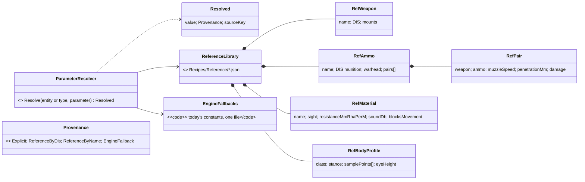
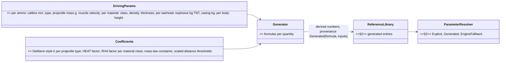
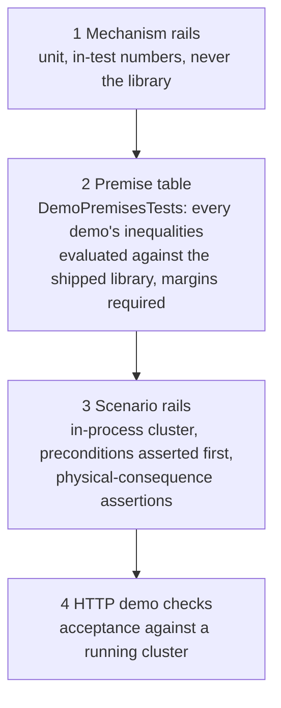
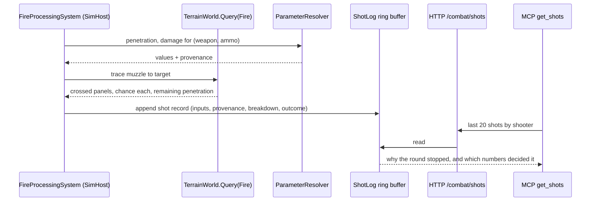
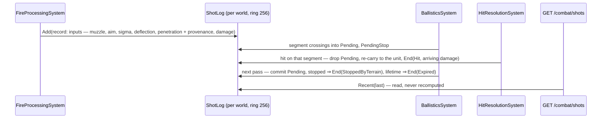

<!--STATUS
state: LIVE
updated: 2026-10-07 (rev 3 — T-1 library + T-2 premises as built, §2b; rev 2 — generated defaults, §2a; Stage 0 as built after §2a)
build-state: READY-TO-BUILD — §2, §2a, §3, §4, §5 leans APPROVED by the user 2026-10-07
current-answer: §4a T-4 records as built · §2b T-1/T-2 as built · §2 defaults + §2a generated defaults · §3 tests and demos · §4 diagnostics API · §5 map debug layers · §6 slices
stale-below: nothing
known-rot: none yet
known-conflict: none
related-designs:
  - DESIGN_Building_Interiors.md — the terrain/combat/perception model these defaults, tests and diagnostics serve
    (§3c materials, §3d penetration, §3e warheads, §3f exposure).
  - DESIGN_Add_Entity_Picker.md §2d — SpawnHeight; its level probe is a layer here (§5).
  - blueprints/Architect_Question_85_Hit_Chance.md — hit chance; its demos share §3's premise table.
  - DESIGN_Utility_AI_Demo_Scenarios.md — the two-forms rule (HTTP check = acceptance, in-process rail = gate) reused in §3.
  - blueprints/DESIGN_Smoke_Suite.md — "do not build a DSL" (xUnit over TestScript); §3 follows it.
  - DESIGN_Uniform_Gizmo_Membership.md — gizmos draw where their data exists; §5 relies on it.
  - DESIGN_Mcp_Diagnostics_Federation.md + RUNBOOK_Cluster_Debugging_Over_Http.md — the route → MCP tool flow §4 extends.
-->

# Terrain & combat tuning — defaults, tests, diagnostics *(buildings, fences, penetration, blast, doors)*

> 🔒 **User, `2026-10-07`:** *"all parameters must use sensible defaults if concrete TKB data not provided — defaults are
> what we will need to live with during all the development — as many predefined types of weapon/ammo/wall materials as
> needed for all the tests and demo scenarios that will come."* · *"let's think about demo scenarios/unit tests with
> success conditions … The success/failure depends on the default parameters so it might be extremely fragile."* ·
> *"how to allow for diagnosing the issues related to badly tuned parameters. The MCP/HTTP api should provide enough
> insight … how to visualize stuff on maps using gizmos — lots of debugging layers needed … Both for editor and for
> CGF/SimHost (each showing what it can, what it has data for, editor has all because it is all-in-one)."*

## 1. What exists — measured

### INVENTORY *(codebase-memory graph + grep, `2026-10-07`)*

| query | result |
|---|---|
| `search_graph ".*(Weapon\|Ammo\|Munition\|Projectile\|Ballistic).*(Dto\|Def\|…)"` | `WeaponSuiteDto`/`WeaponMountDto` (penetration, damage, range), `WeaponCapabilitiesDto`, `AmmoWeaponBallisticsDto` (unused), `CombatPlatformDefDto` (armour, health) |
| `search_graph ".*(Blast\|Fragment\|Warhead\|Explosi…).*"` | none in production (only `DetonationNotification`, a point hit) |
| diagnostic gizmos (`[GizmoProjector]`, grep) | `LineOfSightGizmo` (remembered targets, not rays), `VisibilityConeGizmo`, `NavigationTargetGizmo`, `SpatialGridGizmo`, `HealthBarGizmo`, `TerrainWorldGizmo`, `EqsSensorGizmo`, `ProjectilePresentationGizmo`, `EffectPresentationGizmo`, `HillAttackGizmo` |
| debug routes (`DebugApiHost` route table) | `/world/info`, `/entities/{id}/sensors`, `/weapons`, `/utility`, `/trace`, `/events` (500-entry shared ring), `/panels/_gizmo`, `/annotations`, `/diagnostics/architecture` — **no** path, cover, LOS-ray, shot or blast route |

### Claim table

| claim | code — how it IS | design — how it was MEANT |
|---|---|---|
| defaults are scattered constants | ✅ `DefaultBulletDamage = 25` (`CombatConstants.cs:51`), muzzle velocity 800 (`CombatTkbTranslator.cs:25`, `WithCombat`), collider radius 2.5, eye heights 1.7/1.1/0.35 (`LosStrategies.cs:87`), `MaxHealth = ArmorFront × 5` else 100 (`BdcTkbBuilder.cs:152-200`); no platform DTO ⇒ armour 0 | ⛔ no "reference data" design; only a passing *"default catalogue"* mention (tracker :2887) |
| the built-in combat data is a handful of types | ✅ `NedTkbCatalog`: M1 (120 mm, pen 650), Bradley (25 mm pen 60, TOW pen 800), T-72 (125 mm pen 600), Rifleman (M4 pen 5); `UrbanCombatTkbCatalog`: soldier rifle pen 5, insurgent RPG pen 300 | — |
| no declarative success conditions; xUnit rails + HTTP checks | ✅ none in missions/scenarios; rails assert physical consequences with wide margins (`PlatoonBaselineRails` 60 m vs 3 m measured), class not winner, rank not score | ✅ `DESIGN_Smoke_Suite.md` *"do not build a DSL"*; Utility demos *"HTTP check = acceptance, in-process rail = gate"* |
| a tuning change already broke rails once | ✅ `CE-3071` damage tuning forced `PlatoonBaselineRails` + `DeterminismRails` re-pins in the same change | — |
| perception, combat and navigation run on SimHost; decisions on CGF; Editor runs all | ✅ SimHost = MuscleGround\|Perception\|NavigationSolver (`SimHostNodeBootstrapper.cs:325-332`); CGF = Brain (`CgfLogicPack.cs:159-237`); Editor = every role (`EditorCapabilities.cs:61`) | ✅ roles doc |
| layer toggles exist but are few and not on every host | ✅ `LayerControlGizmo` has 3 bits (Entities, Perception, AiHelpers) and is built on Editor, SimHost, ReplayBrowser only — not CGF, not IG | ⛔ |

## 2. Defaults — the Reference Library *(the numbers we live with during development)*

*What it shows:* one resolver answers every parameter question, and every answer says WHERE it came from — that
provenance is what makes a badly tuned value diagnosable (§4).

| ⭐ lean | rejected (one line each) |
|---|---|
| **Resolution chain**: explicit TKB data → **Reference Library** entry matched by DIS type (most specific first: full type, then wildcarded subcategory/category/kind) or by name → **engine fallback** (today's constants, gathered into ONE file). Never "0 = unknown" silently | every system keeps its own constant — the scatter measured above |
| **The library is shipped data** (`Recipes/Reference/weapons.json`, `ammo.json`, `materials.json`, `bodies.json`), loaded on every node with the TKB, overridable per terrain/scenario folder like templates | defaults in code — tuning would need a rebuild and a code review per number |
| **Every resolved value carries its provenance** (`Explicit` / `ReferenceByDis:<entry>` / `ReferenceByName:<entry>` / `EngineFallback`) | values without a source — "why does this round do 25 damage?" has no answer |
| **Breadth from day one**, covering every test and demo planned in §3: rifle 5.56 ball, 7.62 ball (MG), 12.7 HMG (ball + AP), 25 mm APDS + HEI, 30 mm APFSDS + HE, 120 mm APFSDS + HEAT, 125 mm APFSDS + HE-frag, RPG-7 HEAT, TOW, hand grenade (frag), 40 mm HEDP, 60/81/120 mm mortar HE; materials of §3c + sandbags, earth berm, steel plate; body profiles for infantry (3 stances), wheeled, tracked | a minimal set grown per test — every new demo would re-tune shared numbers under the other demos |
| the existing `NedTkbCatalog`/`UrbanCombatTkbCatalog` numbers become library entries (same values), so current rails do not move | |

## 2a. Rev 2 — generate the defaults from a few driving parameters *(user, `2026-10-07`)*

> 🔒 **User:** *"any chance of generating the default TKB params from some small number of driving parameters?"*

⭐ **Yes — and it is the better way to keep many types consistent while tuning.** A **generator** turns 2-5 physical
driving parameters per entry into every derived number, with a documented formula family per quantity. Tuning then
moves a handful of coefficients, and every type moves together instead of drifting one number at a time.

*What it shows:* authors write driving parameters, tuners touch only the coefficients file, and an explicit number in
the TKB still wins — the resolver records which one applied.

| quantity | driving parameters | formula family *(coefficients in one tuning file)* |
|---|---|---|
| kinetic penetration (ball, AP, APDS, APFSDS) | calibre, projectile mass, muzzle velocity, type | DeMarre-style: `pen ∝ k_type · (m · v²)^a / d^b`; decays with range from a drag coefficient per type |
| shaped-charge penetration (HEAT, RPG, ATGM) | calibre (cone diameter) | `pen ≈ f_HEAT · calibre` (a factor of 5-7 cone diameters); independent of velocity and range |
| damage per hit | projectile kinetic energy, or explosive mass | `∝ energy` for kinetic, `∝ explosive` for HE |
| blast radius | explosive mass (kg TNT-equivalent) | Hopkinson-Cranz scaled distance `R = Z · W^(1/3)`, with `Z` thresholds for lethal / injury |
| fragment radius + fragment penetration | casing mass, explosive mass | Gurney velocity → fragment energy → small-arms-like penetration |
| material ballistic resistance | material class, density, thickness | `thickness · RHA-equivalence factor(class)` |
| material sound attenuation | surface density (density × thickness) | mass law `TL ≈ 20·log10(m″·f) − 47 dB` at a reference frequency |
| material sight | class (opaque / mesh / foliage / glass) | per-class value |
| body profile per stance | height | sample points as ratios of height per stance |

| ⭐ lean | rejected (one line each) |
|---|---|
| the generator runs **at load**, producing the §2 library; **explicit TKB numbers override** any generated value; provenance `Generated(formula, inputs)` shows on `/tkb/resolve` | a one-off offline script — the generated table would drift from the formulas the moment someone hand-edits it |
| **premise tests (§3) check the GENERATED outputs** — a coefficient change that breaks a demo fails there, naming the coefficient | testing the coefficients directly — the premise is about the outcome |
| formulas are deliberately simple engineering approximations, good enough for training-sim defaults; real data always overrides | high-fidelity ballistics — out of scope, and real data is the answer where fidelity matters |

### ✅ Stage 0 (T-0) as built *(backend, `2026-10-07`)*

*What it shows:* the runtime readers and the resolver share ONE rule set (`EngineFallbacks`), so `/tkb/resolve` cannot
report a value the simulation does not use — and a builder-derived number is visibly `Generated`, not posing as authored.

| item | as built |
|---|---|
| no number moved | every constant kept its value: 25 / 800 / 2.5 / 100 / ×5 / ×0.5 / 1.7·1.1·0.35; `CombatConstants.DefaultBulletDamage` is now an alias of `EngineFallbacks.BulletDamage` |
| provenance found while building | the NED builder DERIVES two numbers the old claim table listed only as constants: **health = front armour × 5** and **muzzle velocity = range × 0.5** — recorded per template in `TkbGeneratedValuesDto` and reported as `Generated` with the formula and its inputs (e.g. M1: `armourFront × 5 (armourFront = 600)` = 3000) |
| `GET /tkb/resolve?type=` | `{tkbType, name, disType, engineFallbacks, parameters:[{name, value, provenance, source}]}`; RouteDoc tool `resolve_entity_type_parameters` |
| ⚠ **DEVIATION — the Reference Library is NOT in Stage 0** | §2's chain step *"Reference Library entry by DIS / by name"* and the handoff's *"catalog numbers become library entries"* moved to **Stage 3**, with the §2a generator. Why: ① a DIS-keyed library entry would start giving combat components to FILE-loaded types that have none today (S0 made their DIS non-zero) — a behaviour change Stage 0 must not make; ② §2a makes the library a GENERATOR output, so a hand-entered library now would be replaced there. The provenance values `ReferenceByDis` / `ReferenceByName` exist and are reserved for it |
| rails | `Fdp.Toolkits.Tests` `ParameterResolverTests` (5, incl. *the translator stamps exactly what the resolver reports*) · `Hrot.Core.Tests` `NedTkbBuilderCombatTests.Stage0_*` (2: M1 and rifleman values unchanged + provenance) |

## 2b. ✅ T-1 (generated reference library) and T-2 (premise table) as built *(backend, `2026-10-07`)*

*What it shows:* the library is a resolver STEP fed by three small data files, never TKB content; and the premise table
checks the same three sources a scenario would use — catalog, library and the real terrain — so it fails exactly when a
demo would.

| item | as built — and the deviations, argued |
|---|---|
| ⚠ **the library is NOT TKB templates** | ⛔ registering generated ammo/weapon types into the TKB was measured unsafe: a file-loaded TKB `Clear()`s the database (`KnowledgeBaseLoadStep.cs:110`), and `HrotEnvironmentTests` pins every catalog template as a SPAWNABLE entity type (SimTransform birth-critical). ⭐ So the library is engine data like the terrain materials — embedded (`Fdp.Toolkits/Tkb/Reference/Data/{ammo,weapons,coefficients}.json`), present on every node — and a **resolver step**, exactly §2's diagram (`ParameterResolver → ReferenceLibrary`) |
| ⚠ embedded, not `Recipes/Reference/` | the same deviation as the materials (Building §3g): always present on every host and in tests; per-folder override is a later step |
| matching | **by NAME** — the mount's ammo TKB type's name (via `AmmoGuid`) and the weapon type's name (via `WeaponGuid`); a weapon that does not fire that ammo ⇒ the ammo's generic profile (nominal velocity). ⏭ by DIS: deferred — no shipped ammo carries a DIS munition type to match, and inventing DIS codes would be worse than none |
| chain | TKB pair → TKB generic → the mount's own `Penetration` → **library pair (`ReferenceByName`, source = the formula with its inputs)** → 0. ⭐ the built-in catalogs name no ammo types, so nothing they resolve moved — **no re-pin** |
| formulas (`coefficients.json`) | kinetic `pen = k[type] · v · √m` (ball 0.10, ap 0.14, apds 0.12, apfsds 0.185) · shaped charge `coneFactor · calibre` (heat 5.3, hedp 1.9; an ammo may state its own — PG-7V 3.5) · HE `factor · calibre` · damage `0.6 · √(½ m v²)` kinetic (5.56 ⇒ ~25, the flat default) or `600 · kg explosive` · blast `R = Z · W^⅓` (Z 2 lethal / 6 injury — generated for `CE-1032`, read by nothing yet) |
| calibration | the generated numbers sit within 15 % of every number the catalogs STATE (5.56 → 5.9 vs 5 · 25 mm APDS 59 vs 60 · 120 mm APFSDS 655 vs 650 · PG-7V 298 vs 300 · TOW-2 806 vs 800) — pinned loosely in `ReferenceLibraryTests` as calibration points of the COEFFICIENTS, not as demo outcomes |
| breadth | 19 ammo (5.56/7.62/12.7 ball, 12.7 AP, 25 mm APDS+HEI, 30 mm APFSDS+HE, 120 mm APFSDS+HEAT, 125 mm APFSDS+HE-frag, PG-7V, TOW-2, 40 mm HEDP, M67, 60/81/120 mm mortar HE) · 16 weapons · materials + `steel-plate`, `sandbags`, `earth-berm`. ⏭ body profiles — Stage 4 |
| T-2 premise table | `Recipes/Terrain/bt-range/premises.json`: per demo, its rounds (`{tkbType, mount}` = what that catalog unit fires · `{ammo, weapon}` = a library pair · `{penetrationMm}`) and rows (`fire`/`sight` TRACES through the real `bt-range` geometry, `expect` stops/passes/seesThrough/blocks). `DemoPremisesTests` (Hrot.Core.Tests) — one theory row per premise; every fire crossing must sit ≤ 0.7 or ≥ 1.3 (the 0.8–1.2 ramp ± 25 % of its width), sight ≥ 0.6 or ≤ 0.4. A failure prints the demo, the row, the round with its provenance and every crossing |
| ⚠ **`bt-weapon-pair` re-framed** | ⛔ *"the same 12.7 from an HMG penetrates, from a short barrel not"* cannot hold its OWN margins: a shorter barrel costs ~15 % penetration, and straddling the ramp with margin needs a factor ≥ 1.86 (1.3 / 0.7). ⭐ Now: **two launcher × ammo pairs against one 12 mm steel plate** — the M4's 5.56 ball (ratio 0.48) stops, the M2HB's 12.7 AP (2.2) defeats it. The barrel effect is still built and pinned (`ReferenceLibraryTests`), just not a demo |
| `bt-range` additions | a 12 mm `steel-plate` panel (130–138, 40) and a 1.2 m `sandbags` wall (145–153, 40) |
| demos with premises | `bt-wall-vs-fence` (4) · `bt-weapon-pair` (2) · `bt-window` (4) · `bt-cover` (3, NEW: sandbags stop a rifle; a hedge hides but a 12.7 AP goes through) — red-proved by flipping one row |
| diagnostics | `GET /tkb/resolve?ammo=&weapon=` (the pair with formulas and driving params) · `?library=1` (the whole library) |

## 3. Tests and demos that survive tuning

The fragility the user names is real (`CE-3071` already re-pinned two rails). ⭐ **The cure is to make each demo's
PREMISE an explicit, fast, named check, separate from the slow scenario run.**

*What it shows:* a tuning change that breaks a demo fails layer 2 in milliseconds, naming the demo and the parameter —
not layer 3 after five minutes with an opaque "target still alive".

| ⭐ lean | rejected (one line each) |
|---|---|
| **Layer 1 — mechanism rails use in-test numbers**, never the library (e.g. "penetration ratio 1.3 passes, 0.7 stops") | rails on library numbers — every tuning change reddens mechanism tests that are still correct |
| **Layer 2 — a premise table per demo**, as data beside the scenario: *"5.56 ball vs brick 0.25 m: pen/resistance ≤ 0.6"* (ramp starts at 0.8) · *"chain-link sight ≥ 0.75"* · *"frag at 8 m vs prone behind 0.5 m wall: exposure ≤ 0.1"*. One xUnit theory evaluates every premise through `ParameterResolver` and requires a **margin** from every threshold (≥ 25 % of the ramp width). A failure prints demo, premise, resolved values and their provenance | discovering a broken premise from a scenario failure — slow and ambiguous |
| **Layer 3 — scenario rails assert preconditions first** (as `HeardShotScenarioTests` asserts LOS before the claim), then **physical consequences** with wide margins: alive/dead, health band, arrival within N m, door state | asserting exact damage numbers — any tuning breaks them |
| **No new success-condition DSL** (`blueprints/DESIGN_Smoke_Suite.md`) — premises are data, assertions are xUnit | a declarative scenario-success language — ruled out |
| **Small dedicated terrain** `bt-range` (a firing range: walls of each material, a fence row, a two-storey house with inner walls, a locked and an open door, a low wall, a bunker) + one showcase in `test-town` | everything in `test-town` — long runs and premises tangled with the town layout |

**Demo set** *(each = scenario + premise rows + rail + HTTP check)*:

| demo | success condition | premise rows (examples) |
|---|---|---|
| `bt-wall-vs-fence` | rifleman fires 30 rounds at a target behind brick → target health unchanged; behind chain-link → health drops | 5.56 vs brick ≤ 0.6 ratio; vs chain-link ≥ 2.0 |
| `bt-weapon-pair` | ⚠ *re-framed in §2b:* the 12 mm steel plate stops the M4's 5.56 ball and is defeated by the M2HB's 12.7 AP ~~same 12.7 ammo from HMG penetrates the wooden fence ×2, from a short-barrel variant does not~~ | pair A ratio ≥ 1.3, pair B ≤ 0.7 |
| `bt-window` | observer sees the target through the window, not through the wall beside it; fires through the window and hits | opening transmittance 1.0; brick sight 0.0 |
| `bt-storeys` | rifleman reaches the 2nd storey by the stairs: Z within 0.3 m of storey 2 | stair slope ≤ 60°, storey clearance ≥ 1.8 m |
| `bt-doors` | locked front door → path uses the back door; after `OpenDoor` the next path uses the front; closed door blocks sight | — (state, not tuning) |
| `bt-grenade-posture` | grenade 8 m beyond a 0.5 m wall: standing target damaged, prone target undamaged | exposure standing ≥ 0.5; prone ≤ 0.1 |
| `bt-mortar-roof` | 81 mm on the house: roof occupant damaged, ground-floor occupant not | slab resistance vs fragment penetration ≤ 0.6 |
| `bt-spawn-levels` | Add Entity at level 0 / +1 / +2 inside the house → Z = ground / storey 2 / roof ± 0.3 m | — |

## 4. Diagnostics API — every number explainable

*What it shows:* the record is written by the system that made the decision, with the inputs it used — the API never
recomputes, so it cannot disagree with what happened.

| route *(served by the host that owns the data)* | answers | host |
|---|---|---|
| `GET /tkb/resolve?type=&weapon=&ammo=&material=` | every parameter with value + provenance | any node |
| `GET /terrain/levels?x=&y=` | `SurfacesAt` levels with kind (ground/slab/roof) | any node with terrain |
| `GET /terrain/query?from=&to=&purpose=&ammo=` | a dry-run trace: each crossed occluder (material, thickness, transmittance, resistance, chance, remaining penetration), totals. ✅ **as built:** `purpose=sight` (Stage 1) and `purpose=fire&penetration=&damage=` (R-217 — path, resistance, chance, passes, `stopped`, `arrivingDamage`); ⚠ the round is given by its numbers, not an `ammo=` type — no catalog declares ammo types yet | any node with terrain |
| `GET /combat/shots?last=&shooter=&target=` | shot records (above) — typed ring buffer, not the shared 500-event one | SimHost / Editor |
| `GET /combat/detonations?last=` | per affected entity: stance used, body points, exposure per point, shielding occluders, damage | SimHost / Editor |
| `GET /perception/los?observer=&target=` | per body point: transmittance, occluder, stance and eye height used, threshold, verdict | SimHost / Editor |
| `GET /navigation/path?entity=` | waypoints incl. Door steps, the filter used for this agent, door polygon flags crossed | SimHost / Editor |
| `GET /doors` | door key, runtime id, state, owner | any node (replicated) |

⭐ Each becomes an MCP tool by the existing flow (`RouteDoc` → `gen-catalog.mjs` → handler → `generate-skill.mjs`); the
two route docs that never got tools (`get_entity_weapons`, squad) are fixed in the same pass.

## 4a. ✅ T-4 (shot records + line-of-sight explanation) as built *(backend, `2026-10-07`)*

*What it shows:* three systems each write the part of the record they decide, and a segment's crossings stay PENDING
until its raycast resolves — so a round that hits a unit in front of a wall never lists the wall.

| item | as built — and the deviations, argued |
|---|---|
| `ShotLog` (`Fdp.Toolkits/Combat/ShotLog.cs`) | a ring of 256 `ShotRecord`s per world, held beside the world (`ConditionalWeakTable`) — ⚠ not an ECS singleton: no system has to register one, a world that never fires costs nothing, and readers never create it (`Peek`) |
| `GET /combat/shots?last=&shooter=&target=` (MCP `get_combat_shots`) | inputs (`penetrationSource` = the resolver's provenance + source, AQ85 σ/θ/ordinal), outcome `InFlight / Hit / StoppedByTerrain / Expired`, end point, unit hit with `arrivingDamage`/`arrivingPenetration`, every crossing with the round's chance through it |
| `GET /perception/los?observer=&target=` (MCP `explain_line_of_sight`) | ⚠ **a dry run, not a ring buffer**: LOS is evaluated for every sensor pair every perception tick — a record per evaluation would be noise. ⭐ Instead `TerrainWorldLosStrategy.Explain` makes the SAME decision as `IsVisible` (rail: they agree) from the SAME composition (`ForLiveWorld`), with the evidence: eye/aim heights and stances, terrain crossings, the blocking entity. ⏭ per-body-point exposure → Stage 4 |
| rails | `ShotLogTests` (4: ring + eviction; stopped at the wall; a hit in front of the wall never lists it; expired) · `FireProcessingSystemTests.T4_*` · `LosStrategyTests.T4_Explain_AgreesWithIsVisible_AndNamesTheReason` · `CombatReportTests` (2) |
| ⏭ not yet | `/combat/detonations` (with `CE-1032`) · the fire-trace and LOS-probe map layers (T-5) |

## 5. Map debug layers — each host shows what it has

| layer *(toggle under View ▸ Debug Layers)* | draws | data lives on |
|---|---|---|
| **Terrain materials** | panels coloured by material; fences dashed; openings gaps | every node with terrain |
| **Storeys** | selected storey's walls/openings; others faint (also the storey selector, B-4) | every node with terrain |
| **Levels probe** | at the cursor: the level list (`0 Ground · +1 …`) | every node with terrain |
| **Doors** | doorway markers coloured by `DoorState`; door key on hover | every node (replicated) |
| **Navmesh** | polygons per layer (infantry/vehicle); doorway polygons coloured by their flags | navigation node: SimHost, Editor |
| **Paths** | selected entity's path with Door steps | SimHost, Editor |
| **LOS probe** | from the selected entity to a clicked point/entity: segments coloured by transmittance, body points as dots | SimHost, Editor (CGF: its perceived result only) |
| **Fire traces** | last N shots: muzzle → stop point, colour = remaining penetration, a mark where and by what it stopped | SimHost, Editor |
| **Blast / fragments** | radius rings; affected entities with exposure % and the shielding panel | SimHost, Editor |
| **Hearing** | sound events with attenuated radius; who heard | SimHost, Editor |
| **Cover & firing positions** | EQS cover points per storey, window positions, chosen point | wherever EQS answers live (SimHost / Editor) |
| **Provenance badges** | small marker on entities whose combat parameters came from `EngineFallback` | every node |

| ⭐ lean | rejected (one line each) |
|---|---|
| layers are **gizmos that draw only when their data exists** (uniform membership) — no host checks; the Editor shows all because it holds all data | per-host layer lists — would drift from where the data really is |
| **`LayerControlGizmo` gains these layer bits and is built on every map host** — ✅ **DONE `2026-10-07`**: `MapInteractionPack` now builds the action registry, its dispatcher and the layer control for all five map hosts, and `BuildRenderLayer` builds the renderer the same way everywhere (🔒 user: *"pls unify and share, as usual"*) | |
| fire/blast/hearing layers **read the same ring buffers** the routes serve, so the map and the API agree | |
| probes (LOS, levels) are **interactive tools**: click two points or an entity | |

## 6. Slices

| slice | content |
|---|---|
| **T-0 resolver** | `ParameterResolver` + provenance + engine fallbacks gathered into one file; existing catalogs as library entries (no number moves) |
| **T-1 library** | ✅ §2b — the generator (§2a) + coefficients file + driving parameters for the reference library of §2 (body profiles → Stage 4) |
| **T-2 premises** | ✅ §2b — `DemoPremisesTests` + the premise table format |
| **T-3 routes** | `/tkb/resolve`, `/terrain/levels`, `/terrain/query`, `/doors` + MCP tools |
| **T-4 records** | ✅ §4a shots + LOS explanation; ⏭ detonations with `CE-1032` |
| **T-5 layers** | the debug layers, `LayerControlGizmo` on every host |
| **T-6 demos** | `bt-range` terrain + the demo set, one per building/combat slice as it lands |
