<!--STATUS
state: LIVE
updated: 2026-10-09 (rev 5 — §5c navmesh layer, CE-3133; rev 4 — §5a debug traces as recorded components, CE-3117; rev 3 — T-1 library + T-2 premises as built, §2b; rev 2 — generated defaults, §2a; Stage 0 as built after §2a)
build-state: READY-TO-BUILD — §2, §2a, §3, §4, §5 leans APPROVED by the user 2026-10-07; §5a APPROVED 2026-10-08 (R-226); §5b APPROVED 2026-10-08 (R-227), BUILT 2026-10-08
current-answer: §5c navmesh layer (CE-3133) · §5b gizmo scope and pins (CE-3120/3121) · §5a debug traces (recorded components + gizmos, CE-3117) · §4a T-4 records as built · §2b T-1/T-2 as built · §2 defaults + §2a generated defaults · §3 tests and demos · §4 diagnostics API · §5 map debug layers · §6 slices
stale-below: nothing
known-rot: none yet
known-conflict: none
related-designs:
  - DESIGN_Building_Interiors.md — the terrain/combat/perception model these defaults, tests and diagnostics serve
    (§3c materials, §3d penetration, §3e warheads, §3f exposure).
  - DESIGN_Add_Entity_Picker.md §2d — SpawnHeight; its level probe is a layer here (§5).
  - blueprints/Architect_Question_85_Hit_Chance.md — hit chance; its demos share §3's premise table.
  - DESIGN_Utility_AI_Demo_Scenarios.md — the two-forms rule (HTTP check = acceptance, in-process rail = gate) reused in §3.
  - blueprints/DESIGN_Smoke_Suite.md — "do not build a DSL" (xUnit over TestScript); §3 follows it.
  - DESIGN_Uniform_Gizmo_Membership.md — gizmos draw where their data exists; §5 relies on it.
  - designs/navig-2/Navigation_Design_v2_0.md — OWNS the navmesh, its per-layer snapshot and door areas (§14); §5c only draws it.
  - DESIGN_Thermal_And_Acoustic_Sensing.md — the sound sources and anonymous heard estimates §5a's hearing layer draws.
  - designs/replay-and-modules/DESIGN.md — what runs during replay; §5a's traces are restored state, drawn by gizmos outside the disabled groups.
  - UX/UX_Feature_Map_Parity.md §3.2f — the per-projector visibility seam §5b's family policy plugs into.
  - designs/utility-ai/Runtime_Tuning_Console_and_AI_Overlays_Design_v1_0.md §6/§8 — the AI overlay family §5b folds into gizmos.
  - designs/mgmt-1/DESIGN.md §13.3 — the exercise archive folder that CE-3119 adds a scenario copy to.
  - DESIGN_Mcp_Diagnostics_Federation.md + RUNBOOK_Cluster_Debugging_Over_Http.md — the route → MCP tool flow §4 extends.
-->

# Terrain & combat tuning — defaults, tests, diagnostics *(buildings, fences, penetration, blast, doors)*

> 🔒 **User, `2026-10-07`:** *"all parameters must use sensible defaults if concrete TKB data not provided — defaults are
> what we will need to live with during all the development — as many predefined types of weapon/ammo/wall materials as
> needed for all the tests and demo scenarios that will come."* · *"let's think about demo scenarios/unit tests with
> success conditions … The success/failure depends on the default parameters so it might be extremely fragile."* ·
> *"how to allow for diagnosing the issues related to badly tuned parameters. The MCP/HTTP api should provide enough
> insight … how to visualize stuff on maps using gizmos — lots of debugging layers needed … Both for editor and for
> CGF/SimHost (each showing what it can, what it has data for, editor has all because it is all-in-one)."*

## 1. What exists — measured

### INVENTORY *(codebase-memory graph + grep, `2026-10-07`)*

| query | result |
|---|---|
| `search_graph ".*(Weapon\|Ammo\|Munition\|Projectile\|Ballistic).*(Dto\|Def\|…)"` | `WeaponSuiteDto`/`WeaponMountDto` (penetration, damage, range), `WeaponCapabilitiesDto`, `AmmoWeaponBallisticsDto` (unused), `CombatPlatformDefDto` (armour, health) |
| `search_graph ".*(Blast\|Fragment\|Warhead\|Explosi…).*"` | none in production (only `DetonationNotification`, a point hit) |
| diagnostic gizmos (`[GizmoProjector]`, grep) | `LineOfSightGizmo` (remembered targets, not rays), `VisibilityConeGizmo`, `NavigationTargetGizmo`, `SpatialGridGizmo`, `HealthBarGizmo`, `TerrainWorldGizmo`, `EqsSensorGizmo`, `ProjectilePresentationGizmo`, `EffectPresentationGizmo`, `HillAttackGizmo` |
| debug routes (`DebugApiHost` route table) | `/world/info`, `/entities/{id}/sensors`, `/weapons`, `/utility`, `/trace`, `/events` (500-entry shared ring), `/panels/_gizmo`, `/annotations`, `/diagnostics/architecture` — **no** path, cover, LOS-ray, shot or blast route |

### Claim table

| claim | code — how it IS | design — how it was MEANT |
|---|---|---|
| defaults are scattered constants | ✅ `DefaultBulletDamage = 25` (`CombatConstants.cs:51`), muzzle velocity 800 (`CombatTkbTranslator.cs:25`, `WithCombat`), collider radius 2.5, eye heights 1.7/1.1/0.35 (`LosStrategies.cs:87`), `MaxHealth = ArmorFront × 5` else 100 (`BdcTkbBuilder.cs:152-200`); no platform DTO ⇒ armour 0 | ⛔ no "reference data" design; only a passing *"default catalogue"* mention (tracker :2887) |
| the built-in combat data is a handful of types | ✅ `NedTkbCatalog`: M1 (120 mm, pen 650), Bradley (25 mm pen 60, TOW pen 800), T-72 (125 mm pen 600), Rifleman (M4 pen 5); `UrbanCombatTkbCatalog`: soldier rifle pen 5, insurgent RPG pen 300 | — |
| no declarative success conditions; xUnit rails + HTTP checks | ✅ none in missions/scenarios; rails assert physical consequences with wide margins (`PlatoonBaselineRails` 60 m vs 3 m measured), class not winner, rank not score | ✅ `DESIGN_Smoke_Suite.md` *"do not build a DSL"*; Utility demos *"HTTP check = acceptance, in-process rail = gate"* |
| a tuning change already broke rails once | ✅ `CE-3071` damage tuning forced `PlatoonBaselineRails` + `DeterminismRails` re-pins in the same change | — |
| perception, combat and navigation run on SimHost; decisions on CGF; Editor runs all | ✅ SimHost = MuscleGround\|Perception\|NavigationSolver (`SimHostNodeBootstrapper.cs:325-332`); CGF = Brain (`CgfLogicPack.cs:159-237`); Editor = every role (`EditorCapabilities.cs:61`) | ✅ roles doc |
| layer toggles exist but are few and not on every host | ✅ `LayerControlGizmo` has 3 bits (Entities, Perception, AiHelpers) and is built on Editor, SimHost, ReplayBrowser only — not CGF, not IG | ⛔ |

## 2. Defaults — the Reference Library *(the numbers we live with during development)*

*What it shows:* one resolver answers every parameter question, and every answer says WHERE it came from — that
provenance is what makes a badly tuned value diagnosable (§4).

| ⭐ lean | rejected (one line each) |
|---|---|
| **Resolution chain**: explicit TKB data → **Reference Library** entry matched by DIS type (most specific first: full type, then wildcarded subcategory/category/kind) or by name → **engine fallback** (today's constants, gathered into ONE file). Never "0 = unknown" silently | every system keeps its own constant — the scatter measured above |
| **The library is shipped data** (`Recipes/Reference/weapons.json`, `ammo.json`, `materials.json`, `bodies.json`), loaded on every node with the TKB, overridable per terrain/scenario folder like templates | defaults in code — tuning would need a rebuild and a code review per number |
| **Every resolved value carries its provenance** (`Explicit` / `ReferenceByDis:<entry>` / `ReferenceByName:<entry>` / `EngineFallback`) | values without a source — "why does this round do 25 damage?" has no answer |
| **Breadth from day one**, covering every test and demo planned in §3: rifle 5.56 ball, 7.62 ball (MG), 12.7 HMG (ball + AP), 25 mm APDS + HEI, 30 mm APFSDS + HE, 120 mm APFSDS + HEAT, 125 mm APFSDS + HE-frag, RPG-7 HEAT, TOW, hand grenade (frag), 40 mm HEDP, 60/81/120 mm mortar HE; materials of §3c + sandbags, earth berm, steel plate; body profiles for infantry (3 stances), wheeled, tracked | a minimal set grown per test — every new demo would re-tune shared numbers under the other demos |
| the existing `NedTkbCatalog`/`UrbanCombatTkbCatalog` numbers become library entries (same values), so current rails do not move | |

## 2a. Rev 2 — generate the defaults from a few driving parameters *(user, `2026-10-07`)*

> 🔒 **User:** *"any chance of generating the default TKB params from some small number of driving parameters?"*

⭐ **Yes — and it is the better way to keep many types consistent while tuning.** A **generator** turns 2-5 physical
driving parameters per entry into every derived number, with a documented formula family per quantity. Tuning then
moves a handful of coefficients, and every type moves together instead of drifting one number at a time.

*What it shows:* authors write driving parameters, tuners touch only the coefficients file, and an explicit number in
the TKB still wins — the resolver records which one applied.

| quantity | driving parameters | formula family *(coefficients in one tuning file)* |
|---|---|---|
| kinetic penetration (ball, AP, APDS, APFSDS) | calibre, projectile mass, muzzle velocity, type | DeMarre-style: `pen ∝ k_type · (m · v²)^a / d^b`; decays with range from a drag coefficient per type |
| shaped-charge penetration (HEAT, RPG, ATGM) | calibre (cone diameter) | `pen ≈ f_HEAT · calibre` (a factor of 5-7 cone diameters); independent of velocity and range |
| damage per hit | projectile kinetic energy, or explosive mass | `∝ energy` for kinetic, `∝ explosive` for HE |
| blast radius | explosive mass (kg TNT-equivalent) | Hopkinson-Cranz scaled distance `R = Z · W^(1/3)`, with `Z` thresholds for lethal / injury |
| fragment radius + fragment penetration | casing mass, explosive mass | Gurney velocity → fragment energy → small-arms-like penetration |
| material ballistic resistance | material class, density, thickness | `thickness · RHA-equivalence factor(class)` |
| material sound attenuation | surface density (density × thickness) | mass law `TL ≈ 20·log10(m″·f) − 47 dB` at a reference frequency |
| material sight | class (opaque / mesh / foliage / glass) | per-class value |
| body profile per stance | height | sample points as ratios of height per stance |

| ⭐ lean | rejected (one line each) |
|---|---|
| the generator runs **at load**, producing the §2 library; **explicit TKB numbers override** any generated value; provenance `Generated(formula, inputs)` shows on `/tkb/resolve` | a one-off offline script — the generated table would drift from the formulas the moment someone hand-edits it |
| **premise tests (§3) check the GENERATED outputs** — a coefficient change that breaks a demo fails there, naming the coefficient | testing the coefficients directly — the premise is about the outcome |
| formulas are deliberately simple engineering approximations, good enough for training-sim defaults; real data always overrides | high-fidelity ballistics — out of scope, and real data is the answer where fidelity matters |

### ✅ Stage 0 (T-0) as built *(backend, `2026-10-07`)*

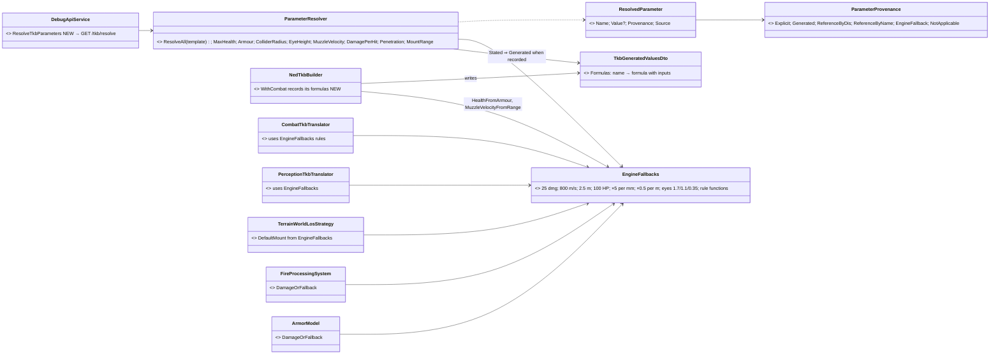
*What it shows:* the runtime readers and the resolver share ONE rule set (`EngineFallbacks`), so `/tkb/resolve` cannot
report a value the simulation does not use — and a builder-derived number is visibly `Generated`, not posing as authored.

| item | as built |
|---|---|
| no number moved | every constant kept its value: 25 / 800 / 2.5 / 100 / ×5 / ×0.5 / 1.7·1.1·0.35; `CombatConstants.DefaultBulletDamage` is now an alias of `EngineFallbacks.BulletDamage` |
| provenance found while building | the NED builder DERIVES two numbers the old claim table listed only as constants: **health = front armour × 5** and **muzzle velocity = range × 0.5** — recorded per template in `TkbGeneratedValuesDto` and reported as `Generated` with the formula and its inputs (e.g. M1: `armourFront × 5 (armourFront = 600)` = 3000) |
| `GET /tkb/resolve?type=` | `{tkbType, name, disType, engineFallbacks, parameters:[{name, value, provenance, source}]}`; RouteDoc tool `resolve_entity_type_parameters` |
| ⚠ **DEVIATION — the Reference Library is NOT in Stage 0** | §2's chain step *"Reference Library entry by DIS / by name"* and the handoff's *"catalog numbers become library entries"* moved to **Stage 3**, with the §2a generator. Why: ① a DIS-keyed library entry would start giving combat components to FILE-loaded types that have none today (S0 made their DIS non-zero) — a behaviour change Stage 0 must not make; ② §2a makes the library a GENERATOR output, so a hand-entered library now would be replaced there. The provenance values `ReferenceByDis` / `ReferenceByName` exist and are reserved for it |
| rails | `Fdp.Toolkits.Tests` `ParameterResolverTests` (5, incl. *the translator stamps exactly what the resolver reports*) · `Hrot.Core.Tests` `NedTkbBuilderCombatTests.Stage0_*` (2: M1 and rifleman values unchanged + provenance) |

## 2b. ✅ T-1 (generated reference library) and T-2 (premise table) as built *(backend, `2026-10-07`)*

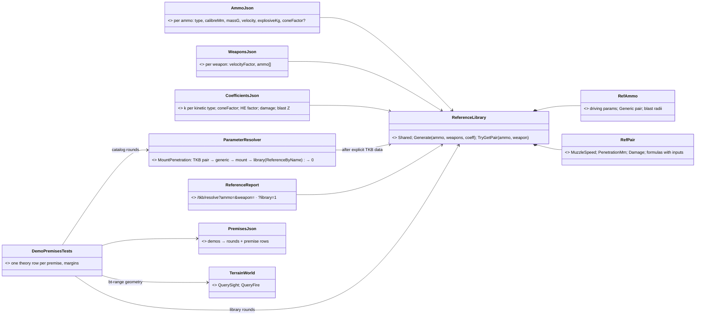
*What it shows:* the library is a resolver STEP fed by three small data files, never TKB content; and the premise table
checks the same three sources a scenario would use — catalog, library and the real terrain — so it fails exactly when a
demo would.

| item | as built — and the deviations, argued |
|---|---|
| ⚠ **the library is NOT TKB templates** | ⛔ registering generated ammo/weapon types into the TKB was measured unsafe: a file-loaded TKB `Clear()`s the database (`KnowledgeBaseLoadStep.cs:110`), and `HrotEnvironmentTests` pins every catalog template as a SPAWNABLE entity type (SimTransform birth-critical). ⭐ So the library is engine data like the terrain materials — embedded (`Fdp.Toolkits/Tkb/Reference/Data/{ammo,weapons,coefficients}.json`), present on every node — and a **resolver step**, exactly §2's diagram (`ParameterResolver → ReferenceLibrary`) |
| ⚠ embedded, not `Recipes/Reference/` | the same deviation as the materials (Building §3g): always present on every host and in tests; per-folder override is a later step |
| matching | **by NAME** — the mount's ammo TKB type's name (via `AmmoGuid`) and the weapon type's name (via `WeaponGuid`); a weapon that does not fire that ammo ⇒ the ammo's generic profile (nominal velocity). ⏭ by DIS: deferred — no shipped ammo carries a DIS munition type to match, and inventing DIS codes would be worse than none |
| chain | TKB pair → TKB generic → the mount's own `Penetration` → **library pair (`ReferenceByName`, source = the formula with its inputs)** → 0. ⭐ the built-in catalogs name no ammo types, so nothing they resolve moved — **no re-pin** |
| formulas (`coefficients.json`) | kinetic `pen = k[type] · v · √m` (ball 0.10, ap 0.14, apds 0.12, apfsds 0.185) · shaped charge `coneFactor · calibre` (heat 5.3, hedp 1.9; an ammo may state its own — PG-7V 3.5) · HE `factor · calibre` · damage `0.6 · √(½ m v²)` kinetic (5.56 ⇒ ~25, the flat default) or `600 · kg explosive` · blast `R = Z · W^⅓` (Z 2 lethal / 6 injury), `lethalDamage` 150 · ⭐ fragments (`CE-1032`, Building Interiors §3k): Gurney `v₀ = √2E · √(β/(1+β/2))` (√2E 2440, β = explosive / casing kg), one fragment `pen = 0.06 · v₀ · √m` (m 0.5 g), reach `28 · casing^⅓` m, damage `600 · kg` — the reference library's `RefWarhead`, read by `ParameterResolver.Warhead` |
| calibration | the generated numbers sit within 15 % of every number the catalogs STATE (5.56 → 5.9 vs 5 · 25 mm APDS 59 vs 60 · 120 mm APFSDS 655 vs 650 · PG-7V 298 vs 300 · TOW-2 806 vs 800) — pinned loosely in `ReferenceLibraryTests` as calibration points of the COEFFICIENTS, not as demo outcomes |
| breadth | 19 ammo (5.56/7.62/12.7 ball, 12.7 AP, 25 mm APDS+HEI, 30 mm APFSDS+HE, 120 mm APFSDS+HEAT, 125 mm APFSDS+HE-frag, PG-7V, TOW-2, 40 mm HEDP, M67, 60/81/120 mm mortar HE) · 16 weapons · materials + `steel-plate`, `sandbags`, `earth-berm`. ⏭ body profiles — Stage 4 |
| T-2 premise table | `Recipes/Terrain/bt-range/premises.json`: per demo, its rounds (`{tkbType, mount}` = what that catalog unit fires · `{ammo, weapon}` = a library pair · `{penetrationMm}`) and rows (`fire`/`sight` TRACES through the real `bt-range` geometry, `expect` stops/passes/seesThrough/blocks). `DemoPremisesTests` (Hrot.Core.Tests) — one theory row per premise; every fire crossing must sit ≤ 0.7 or ≥ 1.3 (the 0.8–1.2 ramp ± 25 % of its width), sight ≥ 0.6 or ≤ 0.4. A failure prints the demo, the row, the round with its provenance and every crossing |
| ⚠ **`bt-weapon-pair` re-framed** | ⛔ *"the same 12.7 from an HMG penetrates, from a short barrel not"* cannot hold its OWN margins: a shorter barrel costs ~15 % penetration, and straddling the ramp with margin needs a factor ≥ 1.86 (1.3 / 0.7). ⭐ Now: **two launcher × ammo pairs against one 12 mm steel plate** — the M4's 5.56 ball (ratio 0.48) stops, the M2HB's 12.7 AP (2.2) defeats it. The barrel effect is still built and pinned (`ReferenceLibraryTests`), just not a demo |
| `bt-range` additions | a 12 mm `steel-plate` panel (130–138, 40) and a 1.2 m `sandbags` wall (145–153, 40) |
| demos with premises | `bt-wall-vs-fence` (4) · `bt-weapon-pair` (2) · `bt-window` (4) · `bt-cover` (3, NEW: sandbags stop a rifle; a hedge hides but a 12.7 AP goes through) — red-proved by flipping one row |
| diagnostics | `GET /tkb/resolve?ammo=&weapon=` (the pair with formulas and driving params) · `?library=1` (the whole library) |

## 3. Tests and demos that survive tuning

The fragility the user names is real (`CE-3071` already re-pinned two rails). ⭐ **The cure is to make each demo's
PREMISE an explicit, fast, named check, separate from the slow scenario run.**

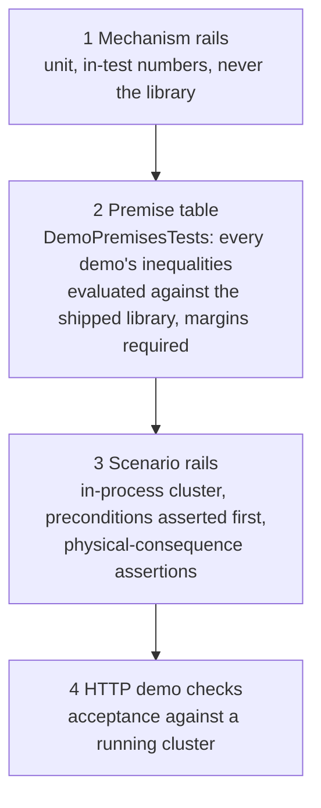
*What it shows:* a tuning change that breaks a demo fails layer 2 in milliseconds, naming the demo and the parameter —
not layer 3 after five minutes with an opaque "target still alive".

| ⭐ lean | rejected (one line each) |
|---|---|
| **Layer 1 — mechanism rails use in-test numbers**, never the library (e.g. "penetration ratio 1.3 passes, 0.7 stops") | rails on library numbers — every tuning change reddens mechanism tests that are still correct |
| **Layer 2 — a premise table per demo**, as data beside the scenario: *"5.56 ball vs brick 0.25 m: pen/resistance ≤ 0.6"* (ramp starts at 0.8) · *"chain-link sight ≥ 0.75"* · *"frag at 8 m vs prone behind 0.5 m wall: exposure ≤ 0.1"*. One xUnit theory evaluates every premise through `ParameterResolver` and requires a **margin** from every threshold (≥ 25 % of the ramp width). A failure prints demo, premise, resolved values and their provenance | discovering a broken premise from a scenario failure — slow and ambiguous |
| **Layer 3 — scenario rails assert preconditions first** (as `HeardShotScenarioTests` asserts LOS before the claim), then **physical consequences** with wide margins: alive/dead, health band, arrival within N m, door state | asserting exact damage numbers — any tuning breaks them |
| **No new success-condition DSL** (`blueprints/DESIGN_Smoke_Suite.md`) — premises are data, assertions are xUnit | a declarative scenario-success language — ruled out |
| **Small dedicated terrain** `bt-range` (a firing range: walls of each material, a fence row, a two-storey house with inner walls, a locked and an open door, a low wall, a bunker) + one showcase in `test-town` | everything in `test-town` — long runs and premises tangled with the town layout |

**Demo set** *(each = scenario + premise rows + rail + HTTP check)*:

| demo | success condition | premise rows (examples) |
|---|---|---|
| `bt-wall-vs-fence` | rifleman fires 30 rounds at a target behind brick → target health unchanged; behind chain-link → health drops | 5.56 vs brick ≤ 0.6 ratio; vs chain-link ≥ 2.0 |
| `bt-weapon-pair` | ⚠ *re-framed in §2b:* the 12 mm steel plate stops the M4's 5.56 ball and is defeated by the M2HB's 12.7 AP ~~same 12.7 ammo from HMG penetrates the wooden fence ×2, from a short-barrel variant does not~~ | pair A ratio ≥ 1.3, pair B ≤ 0.7 |
| `bt-window` | observer sees the target through the window, not through the wall beside it; fires through the window and hits | opening transmittance 1.0; brick sight 0.0 |
| `bt-storeys` | rifleman reaches the 2nd storey by the stairs: Z within 0.3 m of storey 2 | stair slope ≤ 60°, storey clearance ≥ 1.8 m |
| `bt-doors` | locked front door → path uses the back door; after `OpenDoor` the next path uses the front; closed door blocks sight | — (state, not tuning) |
| `bt-grenade-posture` | grenade 8 m beyond a 0.5 m wall: standing target damaged, prone target undamaged | exposure standing ≥ 0.5; prone ≤ 0.1 |
| `bt-mortar-roof` | 81 mm on the house: roof occupant damaged, ground-floor occupant not | slab resistance vs fragment penetration ≤ 0.6 |
| `bt-spawn-levels` | Add Entity at level 0 / +1 / +2 inside the house → Z = ground / storey 2 / roof ± 0.3 m | — |

## 4. Diagnostics API — every number explainable

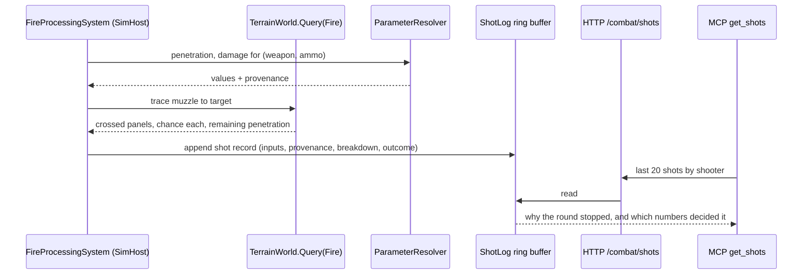
*What it shows:* the record is written by the system that made the decision, with the inputs it used — the API never
recomputes, so it cannot disagree with what happened.

| route *(served by the host that owns the data)* | answers | host |
|---|---|---|
| `GET /tkb/resolve?type=&weapon=&ammo=&material=` | every parameter with value + provenance | any node |
| `GET /terrain/levels?x=&y=` | `SurfacesAt` levels with kind (ground/slab/roof) | any node with terrain |
| `GET /terrain/query?from=&to=&purpose=&ammo=` | a dry-run trace: each crossed occluder (material, thickness, transmittance, resistance, chance, remaining penetration), totals. ✅ **as built:** `purpose=sight` (Stage 1) and `purpose=fire&penetration=&damage=` (R-217 — path, resistance, chance, passes, `stopped`, `arrivingDamage`); ⚠ the round is given by its numbers, not an `ammo=` type — no catalog declares ammo types yet | any node with terrain |
| `GET /combat/shots?last=&shooter=&target=` | shot records (above) — typed ring buffer, not the shared 500-event one | SimHost / Editor |
| `GET /combat/detonations?last=` | per affected entity: stance used, body points, exposure per point, shielding occluders, damage | SimHost / Editor |
| `GET /perception/los?observer=&target=` | per body point: transmittance, occluder, stance and eye height used, threshold, verdict | SimHost / Editor |
| `GET /navigation/path?entity=` | waypoints incl. Door steps, the filter used for this agent, door polygon flags crossed | SimHost / Editor |
| `GET /doors` | door key, runtime id, state, owner | any node (replicated) |

⭐ Each becomes an MCP tool by the existing flow (`RouteDoc` → `gen-catalog.mjs` → handler → `generate-skill.mjs`); the
two route docs that never got tools (`get_entity_weapons`, squad) are fixed in the same pass.

## 4a. ✅ T-4 (shot records + line-of-sight explanation) as built *(backend, `2026-10-07`)*

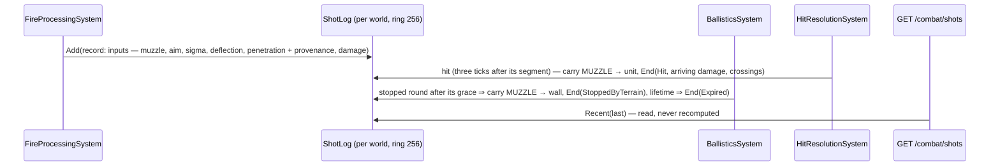
*What it shows:* three systems each write the part of the record they decide, and every outcome's crossings are carried
from the MUZZLE to where the round ended — exact whatever the raycast latency, so a round that hits a unit in front of a
wall never lists the wall. ⛔ SUPERSEDED (`CE-3101`): a "pending crossings until the next pass" mechanism, which assumed a
one-tick latency (the real one is three).

| item | as built — and the deviations, argued |
|---|---|
| `ShotLog` (`Fdp.Toolkits/Combat/ShotLog.cs`) | a ring of 256 `ShotRecord`s per world, held beside the world (`ConditionalWeakTable`) — ⚠ not an ECS singleton: no system has to register one, a world that never fires costs nothing, and readers never create it (`Peek`) |
| `GET /combat/detonations?last=` (MCP `get_combat_detonations`, ⭐ `CE-1032`) | each warhead burst as `AreaEffectSystem` decided it: burst, munition + warhead source, every entity in reach with stance, body points, fragment exposure/falloff/armour chance/damage, blast falloff/barrier/shadow/damage, what shielded it; doors breached |
| `GET /combat/shots?last=&shooter=&target=` (MCP `get_combat_shots`) | inputs (`penetrationSource` = the resolver's provenance + source, AQ85 σ/θ/ordinal), outcome `InFlight / Hit / StoppedByTerrain / Expired`, end point, unit hit with `arrivingDamage`/`arrivingPenetration`, every crossing with the round's chance through it |
| `GET /perception/los?observer=&target=` (MCP `explain_line_of_sight`) | ⚠ **a dry run, not a ring buffer**: LOS is evaluated for every sensor pair every perception tick — a record per evaluation would be noise. ⭐ Instead `TerrainWorldLosStrategy.Explain` makes the SAME decision as `IsVisible` (rail: they agree) from the SAME composition (`ForLiveWorld`), with the evidence: eye/aim heights and stances, terrain crossings, the blocking entity. ⏭ per-body-point exposure → Stage 4 |
| rails | `ShotLogTests` (4: ring + eviction; stopped at the wall after the grace; a hit in front of the wall — after the round already froze there — is a full-damage hit that never lists it; expired) · `FireProcessingSystemTests.T4_*` · `LosStrategyTests.T4_Explain_AgreesWithIsVisible_AndNamesTheReason` · `CombatReportTests` (2) |
| ⏭ not yet | `/combat/detonations` (with `CE-1032`) · the fire-trace and LOS-probe map layers (T-5) |

## 5. Map debug layers — each host shows what it has

| layer *(toggle under View ▸ Debug Layers)* | draws | data lives on |
|---|---|---|
| **Terrain materials** | panels coloured by material; fences dashed; openings gaps | every node with terrain |
| **Storeys** | selected storey's walls/openings; others faint (also the storey selector, B-4) | every node with terrain |
| **Levels probe** | at the cursor: the level list (`0 Ground · +1 …`) | every node with terrain |
| **Doors** | doorway markers coloured by `DoorState`; door key on hover | every node (replicated) |
| **Navmesh** | polygons per layer (infantry/vehicle); doorway polygons coloured by their door's state — §5c (`CE-3133`) | navigation node: SimHost, Editor |
| **Paths** | selected entity's path with Door steps | SimHost, Editor |
| **LOS probe** | from the selected entity to a clicked point/entity: segments coloured by transmittance, body points as dots | SimHost, Editor (CGF: its perceived result only) |
| **Fire traces** | ✅ **built (T-5, `FireTraceGizmo`, layer bit 3 `FireTraces`)**: the last 64 records of the `ShotLog` — muzzle → end, coloured by OUTCOME (hit red · stopped orange · expired grey · in flight yellow, dashed), a dot at the end, green dots for crossings passed, an orange cross where the terrain stopped it. ⚠ coloured by outcome, not remaining penetration — the outcome is what a tuner looks for first; the numbers are one `get_combat_shots` away | SimHost, Editor |
| **Blast / fragments** | radius rings; affected entities with exposure % and the shielding panel | SimHost, Editor |
| **Hearing** | sound events with attenuated radius; who heard | SimHost, Editor |
| **Cover & firing positions** | ✅ **built (`CE-3134`, layer bit 9 `Cover`, `CoverPointsGizmo`, off by default)**: the terrain's cover database — cover green, window firing positions blue, dot size by stance, a tick toward the wall; ⏭ the point a query chose | every node with terrain (the database is built at terrain load), the Replay Browser too |
| **Provenance badges** | small marker on entities whose combat parameters came from `EngineFallback` | every node |

| ⭐ lean | rejected (one line each) |
|---|---|
| layers are **gizmos that draw only when their data exists** (uniform membership) — no host checks; the Editor shows all because it holds all data | per-host layer lists — would drift from where the data really is |
| **`LayerControlGizmo` gains these layer bits and is built on every map host** — ✅ **DONE `2026-10-07`**: `MapInteractionPack` now builds the action registry, its dispatcher and the layer control for all five map hosts, and `BuildRenderLayer` builds the renderer the same way everywhere (🔒 user: *"pls unify and share, as usual"*) | |
| ⛔ SUPERSEDED by §5a (`2026-10-08`): ~~fire/blast/hearing layers **read the same ring buffers** the routes serve~~ ⇒ the gizmos read **recorded ECS components MIRRORED from those buffers**, so the map, the API and a replay agree | |
| probes (LOS, levels) are **interactive tools**: click two points or an entity | |

## 5a. Debug traces — what a gizmo draws is RECORDED STATE *(`CE-3117`, backend, `2026-10-08`; build-state: READY-TO-BUILD)*

🔒 **User, `2026-10-08`:** *"Wouldnt it be simplier if we invented special ecs component carrying whatever state we need to visualize, that exist optionally only whwre thier filling modules live, and let them be saved as anything else?"* · *"Gizmo shapes ok."* · *"Accepted."* — **R-226**.

⇒ every debug layer draws from an **ECS component**, never from a side object: the flight recorder keeps it, a **seek** restores it
(a detonation 0.4 s before the seek target is still in the ring, stamped with its sim time), and the Replay Browser sees it.
The components are fixed-size structs, `[DataPolicy(NoScenario)]` (recorded and snapshotted, not saved into a scenario), with no
network translator — they exist only on the node whose module fills them.

### INVENTORY *(graph + grep, `2026-10-08`)*

| query | total | result |
|---|---|---|
| `search_graph name_pattern=".*(Percept\|Hear\|Sound\|Sensor\|…\|Path\|Route\|Door\|Detonat\|Blast\|Frag).*Gizmo.*"` | 43 symbols | drawing gizmos: `LineOfSightGizmo`, `EqsSensorGizmo`, `RouteGizmo`, `RouteWaypointGizmo` (authoring) — ⛔ none for doors, blast, hearing, danger areas, planned path |
| every `[GizmoProjector]` (grep, non-test) | 23 projectors | `FireTraceGizmo` (reads the `ShotLog` side table), `TerrainWorldGizmo` (no door leaves), `VisibilityConeGizmo`, `NavigationTargetGizmo` … |
| other drawers of the same data | 3 | `SimHostTrajectoryLayer` (SimHost-only raylib layer: selected entity's trajectory, progress dot placed by waypoint COUNT not distance, no look-ahead) · `TargetMemoryOverlaySource` (opt-in `DebugState` overlay) · `PerceptionMapLayer` (Editor) |
| prior art for "a component that exists for diagnostics" | 1 | ⭐ `UtilityDecisionLog` (`GlobalComponentIds` 333, `NoScenario`, fixed slots, read by `GET /entities/{id}/utility`) — the shape copied here |
| free component ids, census of backend, behaviors, ui | — | highest allocated 338 of 512 (`FdpConfig.cs:37`); **339–342 free on all three lanes** |

### Claim table

| the design rests on | code — how it IS | design basis |
|---|---|---|
| a delta frame records a component only when its version moved; singletons too | `RecorderSystem.cs:298-302`, `:821-836` | `replay-and-modules/DESIGN.md` §2.1 (replay restores state; systems stay off) |
| a dirty chunk is written whole (64 KB, then LZ4) | `NativeChunkTable.cs:402-407`, `AsyncRecorder.cs:102` | — ⇒ a trace written every frame costs ≈ one compressed chunk per frame; acceptable while firing |
| `NoScenario` stays recorded | `DataPolicyAttribute.cs:14,41,48` | — |
| a seek skips events, so an event-fed log would be EMPTY after a seek | `PlaybackSystem.cs:26,195` (`processEvents:false`) | — ⇒ the rejected alternative |
| ⛔ CORRECTED `2026-10-08`: ~~per-entity gizmos draw ONLY the selected entity on SimHost and in the Replay Browser~~ — the host's `SelectedEntitiesOnly` reaches only the DRAG HANDLES (`DataDrivenGizmoSystem`); map gizmos are never host-gated (`MapInteractionPack.cs:113-124`, CE-123) | — | `UX_Feature_Map_Parity.md` §3.9j.1 ⇒ a per-entity gizmo draws for EVERY matching entity; "selected only" needs a per-gizmo visibility policy (§3.2f) — proposed below |
| the acoustic answer carries no source identity | `AcousticPerception.cs` `Hear` (`EntityId = 0L`) | R-207 ⇒ no "true source → estimate" line; the emitter rings show where the sound really was |
| the look-ahead point is computed each tick and not stored | `CarKinematicsSystem.cs:175,440` (`PathLookahead`) | CE-3115 ⇒ the gizmo recomputes it with the same function |
| the Replay Browser holds no `TerrainWorld` (`NoReplay`), so doors and walls cannot draw there | `TerrainWorld.cs:80`; grep of `ReplayBrowser` for `TerrainWorld` = 0 files | ⇒ `CE-3118` |

### Classes

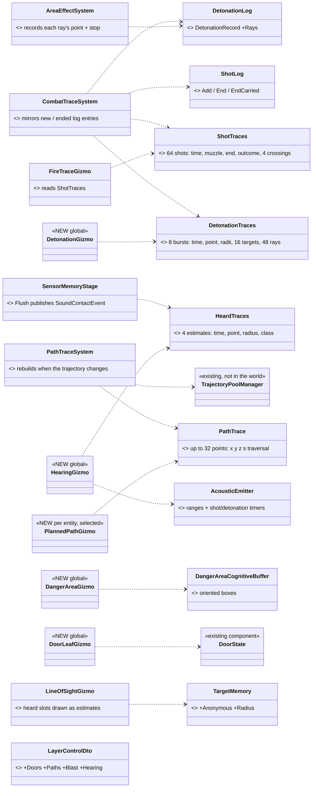

*What the picture shows that prose hid:* no gizmo reads a side object any more — every arrow into a gizmo ends on a component, which
is the whole replay argument. The two logs keep their writers and their routes; one mirror per module is the only new writer.

### Sequences

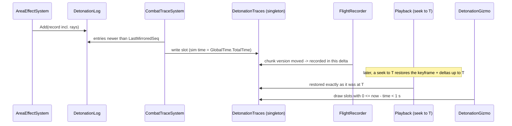

*What it shows:* the gizmo never asks "did an event happen?" — it asks "what is in the ring, and how old is it?", which a seek answers
by construction. Live, in-host replay and the Replay Browser run the same last step.

### Module relationships — who registers, who fills, who draws

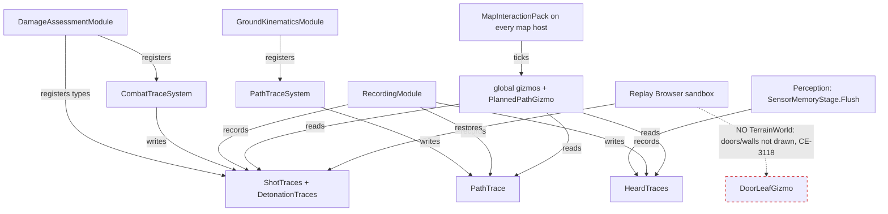

*What it shows:* the fillers live in the SimHost modules (and the all-in-one Editor), so a CGF or IG map simply has no traces — no
host check. The one dead edge is the Replay Browser's missing terrain, owned by `CE-3118`.

### The gizmos

| gizmo | kind | layer bit | draws |
|---|---|---|---|
| `DetonationGizmo` | global | **6 Blast** *(new)* | for 1 s of sim time: fragment-radius and blast-radius rings (fading); a ray from the burst to each body point — green to the point if clear, orange to the stop point with an ✕; the exposure % at each target |
| `FireTraceGizmo` | global | 3 FireTraces | unchanged shapes; now reads `ShotTraces` (64 shots, 4 crossings each), so shots replay too |
| `HearingGizmo` | global | **7 Hearing** *(new)* | every `AcousticEmitter`: a shot or detonation ring expanding from the source to its audible range over the 0.5 s it lasts (radius = range × (1 − time left / 0.5)); a moving entity sends a ring every 1 s sized to its current range. Every listener's `HeardTraces` younger than 1 s: a dashed line to the estimate and its uncertainty circle, coloured by sound class |
| `DangerAreaGizmo` | global | 2 AiHelpers | each box of every `DangerAreaCognitiveBuffer`: the oriented rectangle (half-extents, yaw) coloured by threat rating, kind as a label |
| `DoorLeafGizmo` | global | **4 Doors** *(new)* | each door's leaf (from `DoorLeaves`): along the wall when closed, swung 90° on its hinge when open; grey closed · green open · purple locked · red ✕ destroyed |
| `PlannedPathGizmo` | per entity (today: every mover — see *Per-gizmo scope* below) | **5 Paths** *(new)* | `PathTrace` polyline, door steps as markers, the progress point at `NavState.ProgressS` (by distance), the look-ahead point at `ProgressS + PathLookahead(params, speed)` |
| `LineOfSightGizmo` | per entity | 1 Perception | heard (anonymous) slots: dashed line + uncertainty circle; sighted slots: solid line; both at the stored height |

`LayerControlDto.ToMask()` keeps bits 8–255 always on (it kept 4–255).

### Decisions — why

| ⭐ lean | rejected (one line each) |
|---|---|
| **recorded ECS components**, fixed-size structs, `NoScenario`, not replicated | events + a collector — a seek skips events, so the ring is empty after any jump · side tables — never recorded · managed singleton — an in-place list mutation never moves the version, so deltas miss it |
| **one MIRROR system per module copies the log into the component**, so the log stays the only producer and both cannot disagree | writing the component at the three `ShotLog` seams — three edits of one fact; the mirror is one |
| **the look-ahead is recomputed**, not stored | storing it — it changes every tick, so its chunk would be re-recorded every frame |
| **`PathTrace` is rebuilt only when the trajectory's signature (count, length, last point) changes** | rebuilding every tick — the same per-frame recording cost |
| `SimHostTrajectoryLayer`'s trajectory half is **retired** in favour of `PlannedPathGizmo`; its authored-route half stays | keeping both — two drawings of one path, one of them with a wrong progress dot |
| the debug logs and routes stay (`/combat/shots`, `/combat/detonations`) — they carry the text (warhead source, shield name) a struct cannot | routes reading the component — loses the explanation |

### ✅ As built *(backend, `2026-10-08`)* — matches the diagrams above, with these deviations

| deviation | why |
|---|---|
| `DebugTraceLayers` (bits 3–7) and `DebugTraceClock` (sim-time age + fade) live in **`Fdp.Toolkits`** (`Diagnostics/Gizmos`) | `Hrot.Common` (layer control) and `Hrot.Presentation` (the gizmos) do not reference each other; both reference the toolkit |
| a fragment ray carries its **transmission 0..1** (not a blocked bit) and its first obstacle: the entry point of the first terrain crossing, or the point of the ray nearest a blocking collider | fragments through a thin wall are partial; the map shades green → orange by how much got through. `DetonationRecord.Rays` and `DetonationEffect.At` are new; `/combat/detonations` returns `rays` and each effect's `at` too |
| ⚠ the mirror writes singletons with **`SetSingletonUnmanaged`**, never through the ref of `GetSingletonUnmanaged` | measured: that ref does not move the version (`EntityRepository.cs:1943`), and a delta frame records a singleton only when its version moved — the rail `CE3117_ABurst_ReachesARestoredWorld_ThroughAKeyframeAndADelta` pins it |
| `HeardTraces` is written through the solver's command buffer at `SensorMemoryStage.Flush`, beside the `SoundContactEvent` | the flush may run on a background snapshot; the command buffer is its only write path |
| `FireTraceGizmo` keeps its old rule (the last 64 shots, no fade) | unchanged behaviour; only its source moved to `ShotTraces` |
| `DangerAreaGizmo` is **global** | the buffer sits on the sensor CHILD, not on the unit, so one walk over the buffers is the simplest projector |
| `SimHostTrajectoryLayer` lost its trajectory half and its pool parameter | the followed path is `PlannedPathGizmo`'s now; the layer keeps the authored route. ⇒ ⭐ `2026-10-08` (`CE-3123`): the layer is DELETED — the route half is `AuthoredRouteGizmo` (`DESIGN_Uniform_Gizmo_Membership.md` §10) |

**Rails** (feature suites first): `AreaEffectSystemTests` (rays folded into `W11_BehindAHalfMetreWall…` and `W11_AVehicleBetween…`; new
`CE3117_ABurst_ReachesARestoredWorld_ThroughAKeyframeAndADelta`, `CE3117_AShot_IsTracedInFlight_ThenItsEnd…`) · `EqsModuleTests.S7_TheAcousticSensor…`
(heard trace folded in) · `GroundKinematicsModuleTests` (3 post-sim systems) · new `PathTraceSystemTests` (thinning keeps ends and door steps;
rewritten only on change) · new `DebugTraceGizmoTests` (burst drawn for 1 s, sound ring at half range half-way, look-ahead at
`PathLookahead`, door leaf geometry) · `LayerControlGizmoTests.CE3117_TheDebugTraceLayers_AreToggledByTheirOwnBits`.

### ⛔ Per-gizmo scope — SUPERSEDED by §5b *(the user widened it the same day)*

~~`[GizmoProjector(..., Scope = GizmoScope.Selected)]` — the gizmo declares its default…~~ 🔒 *"Whethwr gizmo renders for selected entity or all - shoukdnt that be definable per gizmo in its attribute or something?"* ⇒ answered by **§5b**: the attribute declares the gizmo's FAMILY, the family's scope is a runtime setting, and a unit can be PINNED.

### Follow-ups (own tasks)

- **`CE-3118`** — the Replay Browser loads the terrain: the terrain NAME goes into the recording metadata, the browser loads that asset
  into each node's sandbox. 🔒 *"The replay browser must load the terrain in order to display it on the map if nothing else. Twreain
  name should go to metadata for sure."*
- **`CE-3119`** — the exercise archive carries a COPY of the scenario files; the terrain stays referenced by name. Measured: the archive
  pulls only each node's `.fdp` and `.fdp.meta.json` (`ReferenceArchiveHandler.cs:80-95`). 🔒 *"Terrain is part of the scenario, which i
  think shoukd become the part od the package with the recordinga (by copying). Terrain could stay referenced by name only."*

## 5b. Gizmo scope and pins — *"selected only"*, *"all"*, and *"keep showing this unit"* *(`CE-3120`, `CE-3121`, `CE-3122`, backend, `2026-10-08`; build-state: BUILT — as-built at the end of this section)*

🔒 **User, `2026-10-08`:** *"Sometimes i want the effect shown for selected entity only, sometimes i need to pin this gizmo 'enabled' to this entity because i need to see entity's gizmos temporarily even if entity not selected"* · decisions A–E *"Approved"* · F: *"① approved, fold them into gizmos"* — **R-227**.

### INVENTORY *(graph + grep, `2026-10-08`)*

| query | result |
|---|---|
| what gates a per-entity map gizmo today | ⭐ only a per-PROJECTOR `IGizmoVisibilityPolicy` (`StatelessGizmoSystem.cs:156`), attached by a host resolver (`GizmoReflectionRegistrar.cs:64`, `MapInteractionPack.cs:51`); ONE exists — `CullingStateVisibilityPolicy`. ⛔ The host `IsSelectedPredicate` reaches only the drag handles (`MapInteractionPack.cs:113-124`, CE-123) |
| runtime settings | `GizmoSettingsRegistry` (Global / Project scope, `SettingScope.cs:6-14`); no general settings panel — the map's runtime knobs live in the layer control (`LayerControlDto`) |
| per-entity debug flags | `DebugState { Behavior, Ai }` (`DebugState.cs:18-25`, `Transient`), patched by `PatchDebugStateCommand` ← context-menu actions (`EditorSubsystem.cs:2070`, `SimHostApp.cs:455`) ⇒ applied by `DebugStatePatchSystem`, registered ONLY by `BehaviorDiagnosticsModule` on CGF and the Editor (`CgfCapabilities.cs:84`, `EditorSubsystem.cs:1677`). 🔴 **SimHost publishes the command and nothing applies it** ⇒ its `Toggle AI Trace` menu items are inert today (`CE-3122`) |
| the AI overlay family | `Hrot.Diagnostics.Overlays` — 6 `IGizmoSource` overlays + a budget arbiter, keyed on `DebugState.Ai` (`AiOverlayFlags`). Referenced only by its own tests; `IGizmoSource` is consumed only by the GizmoMap example app. Designed in `docs/designs/utility-ai/Runtime_Tuning_Console_and_AI_Overlays_Design_v1_0.md` §6/§8. ⚠ Read in full: Perception / TargetMemory / EQS duplicate working gizmos; **Utility, SquadAssignment and SquadCoordination are SKELETONS** — text at the map origin, member lines from origin to origin, the danger box drawn Y-up in a Z-up world; only the squad contact spheres are placed right |
| the map's entity context menu | `ContextMenuProjectorGizmo` (pre-serialised `ContextMenuItemDto` menus; `Children` = submenu); actions registered on the pack's `ActionRegistry` |

### Classes

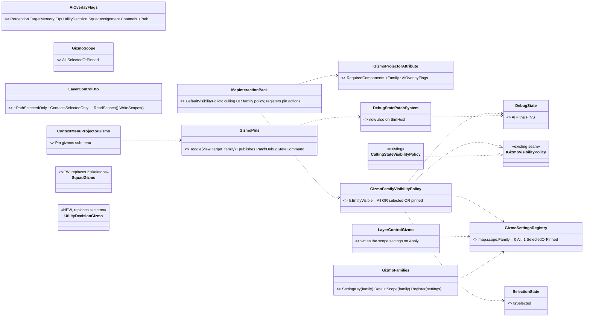

*What the picture shows that prose hid:* every new box hangs off a seam that already exists — the per-projector policy, the settings
registry, the debug-flag component and its patch path. Nothing new decides *"should this entity draw?"* except one policy class.

### Sequences

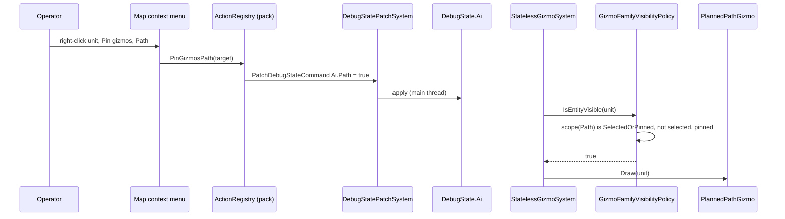

*What it shows:* a pin is DATA on the unit, read by the same policy that reads selection — there is no second gate, and turning the
family to *All* in the layer panel makes the pin irrelevant without touching it.

### Module relationships

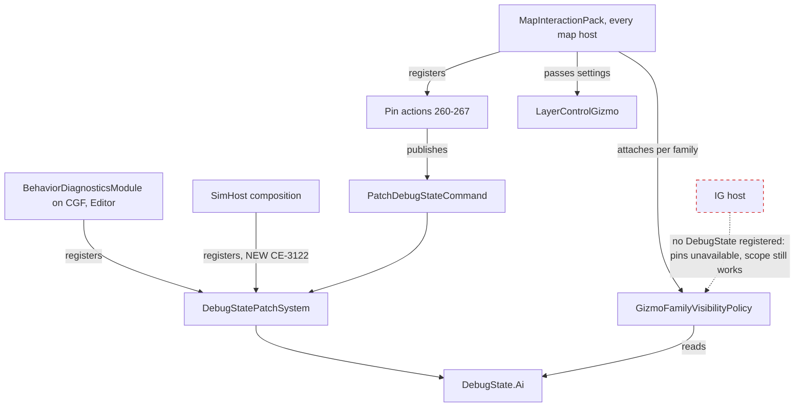

*What it shows:* before this slice the patch system had NO caller on SimHost, so a pin set there would have been silently dropped —
the dashed red edge is the remaining gap (IG has no AI to pin).

### Decisions

| ⭐ | rejected (one line each) |
|---|---|
| **A** the scope is a runtime setting per **gizmo family** (`map.scope.<Family>`, 0 = All, 1 = SelectedOrPinned), shown as checkboxes in the layer panel; the attribute declares the gizmo's family | per gizmo CLASS — several classes share a family (squad), and the panel would grow with every gizmo · attribute only — needs a rebuild to switch |
| **B** two modes; defaults: Path, Utility, Squad = SelectedOrPinned · Perception, Contacts (TargetMemory), EQS = All; global gizmos have no per-entity scope | an "Off" mode — the layer toggle already is one |
| **C** a pin is per unit × family, plus *Pin all* / *Unpin all* | per unit only — too coarse |
| **D** the pins ARE `DebugState.Ai` (extended with `Path`) — one per-unit debug-flag store; `Transient` (not recorded, saved or replicated: a viewing choice) | a new pin component — a second store |
| **E** the map's entity context menu gets a **Pin gizmos** submenu; actions registered in the pack so every map host has them; `DebugStatePatchSystem` registered on SimHost too (`CE-3122`) | per-host action copies — the duplicate `SimHostApp`/`EditorSubsystem` registration this avoids repeating |
| **F ①** fold the overlay family: Perception / TargetMemory / EQS overlays and the budget arbiter are DELETED (working gizmos draw the same); Utility → `UtilityDecisionGizmo` (the latest chosen option and its margin, AT the unit); SquadAssignment + SquadCoordination → `SquadGizmo` (commander → member lines coloured by element, `E#R#` labels at the members, phase at the commander, squad contacts, the active danger box in XY); `Hrot.Diagnostics.Overlays` and its tests leave the solution | wire as is — a second drawing system · delete all — loses the squad / utility intent · leave dormant — two pin stores |

⚠ **Not measured:** whether a `Transient` component survives an in-host replay seek (if not, pins are re-set after a jump).
⚠ **Stated plainly:** the folded squad/utility gizmos are written from the overlays' INTENT — their placement was never real.

### As built *(`2026-10-08`)* — the diagrams above hold; where the code landed and what it chose

| piece | home | as built — and any deviation |
|---|---|---|
| `GizmoScope`, `GizmoFamilies` | `Fdp.Toolkits` `Diagnostics/Gizmos/GizmoFamilies.cs` | the ONE table: `SettingKey` = `map.scope.<Family>`, `DefaultScope`, `Label` (TargetMemory shows as *Contacts*), `Register`, `ScopeOf` (an unset or non-int value reads as the default), `SetScope` |
| `GizmoProjectorAttribute.Family` | `Fdp.Toolkits` | a named argument; `None` = no family ⇒ no family policy |
| `GizmoFamilyVisibilityPolicy` | `Hrot.Presentation` `ScenarioEditor/Map/` | reads the scope live each frame; selection and pins are each read only when their component type is REGISTERED on the world ⇒ IG (no `DebugState`) keeps the scope and simply has no pins |
| pack wiring | `MapInteractionPack` | ⭐ deviation: the host's resolver now LAYERS over the defaults (`host(type) ?? defaults(type)`) instead of replacing them — before, a host resolver silently dropped the culling policy for every type it did not name. One cached policy per family |
| layer panel | `LayerControlDto` `PathSelectedOnly`…`SquadSelectedOnly` + `ReadScopes`/`WriteScopes`; `LayerControlGizmo(settings:)` | reads on construction, writes on Apply — the panel and the policy share the registry, so there is no copy to drift |
| pins | `Hrot.Common` `Diagnostics/Gizmos/GizmoPins.cs`; ids `PinGizmosPath`…`UnpinGizmosAll` = 260–267 | `Toggle`/`SetAll` publish `PatchDebugStateCommand { Ai: { <family>: bool } }`; a no-op where `DebugState` is not registered. `Submenu()` is appended (after a separator) to the Healthy and Degraded unit menus; the pack registers the 8 actions on every map host |
| `CE-3122` | `SimHostApp` | `DebugStatePatchSystem` registered as a global system ⇒ SimHost's existing *Toggle AI Trace* items work too |
| family tags | `PlannedPathGizmo` Path · `VisibilityConeGizmo` Perception · `LineOfSightGizmo` TargetMemory · `EqsSensorGizmo` (IG) Eqs · `UtilityDecisionGizmo` UtilityDecision · `SquadGizmo` SquadAssignment | — |
| `UtilityDecisionGizmo` | `Hrot.Presentation` | ⭐ deviation from F: one line per LOGGED decision (`UtilityDecisionLog` holds up to 4), not only the latest — a unit with two decision points showed one before |
| `SquadGizmo` | `Hrot.Presentation` | skips dead or position-less members (the skeleton drew them at the origin); the danger box reuses `DangerAreaGizmo.Box` |
| deletion | `Hrot.Diagnostics.Overlays` (+ `.Tests`) | removed from disk and from `IOS-IG-SimHost.sln`; its project doc carries a WITHDRAWN block; `docs/projects` pointers updated |

**Rails** *(each in its feature's existing suite)*: `MapCullingPolicyTests` — `CE3120_ThePathFamily_DrawsTheSelectedAndThePinned_UntilItsScopeIsAll`, `CE3120_ThePackRegistersThePinActions_AndAPinTouchesOnlyItsFamily` (also asserts the menu carries every pin id) · `LayerControlGizmoTests` — `CE3120_TheLayerPanel_ReadsAndWritesTheFamilyScopes` · `DebugTraceGizmoTests` — `CE3121_TheUtilityGizmo_WritesOneLinePerLoggedDecision`, `CE3121_TheSquadGizmo_LinksTheCommanderToItsLivingMembers`.

⚠ **Still not measured:** whether a `Transient` `DebugState` survives an in-host replay seek.

## 5c. Navmesh layer — the baked navmesh on the map *(`CE-3133`, backend, `2026-10-09`; 🔒 user: *"Yes, navmesh layer after 7a as proposed"* (R-233); build-state: READY-TO-BUILD)*

### INVENTORY *(graph `search_graph .*Navmesh.*` Interface/Class + an Explore sweep + reads, `2026-10-09`)*

| question | answer | where |
|---|---|---|
| who holds a baked navmesh | SimHost and Editor: ONE `SwitchableNavmeshProvider`, set as the `INavmeshProvider` world singleton, published into by terrain residency; Stride: a `DotRecastNavmeshProvider` singleton directly. ⛔ CGF, IG, Replay Browser: none | `SimHostNodeBootstrapper.cs:64,203` · `EditorSubsystem.cs:192,2121` · `EngineBackedNavigationModule.cs:85` · `StrideHrotGame.cs:1871` · `CgfSubsystem.cs:215` |
| how a polygon is reached | `SwitchableNavmeshProvider.Current` → `DotRecastNavmeshProvider.TryGetNavMesh(layer)` → `DtNavMesh` tiles/polys, **Y-up** (swap to engine Z-up) | `SwitchableNavmeshProvider.cs:28` · `DotRecastNavmeshProvider.cs:17-23,222` |
| how a door polygon is marked | Recast **area** `DoorArea = 2` (every polygon's flags are 1); poly ref → door index through the layer's `DoorAwareQueryFilter.DoorOf` — ⚠ private to the provider | `NavDoorways.cs:19,66-76,143` · `RecastNavmeshBaker.cs:201,453` · `DotRecastNavmeshProvider.cs:47` |
| a version to cache by | the snapshot's `Version` / `QueryVersion()` (switchable: publish count + inner) | `DotRecastNavmeshProvider.cs:93,348` · `SwitchableNavmeshProvider.cs:54` |
| a gizmo reading a setting | constructor-injected `GizmoSettingsRegistry` (`EqsSensorGizmo`), ints for enums (`GizmoFamilies`) | `GizmoFamilies.cs:57` |
| door colours | `DoorLeafGizmo` — open green · closed grey · locked purple · destroyed red | `DoorLeafGizmo.cs:20-23` |
| a view to cull to | ⛔ none on a backend projector — no gizmo culls by viewport; `CullingState` is filled on IG only | `CullingStateVisibilityPolicy.cs:57` · `MapCullingSystem.cs:41` |
| size | 108 infantry / 49 vehicle polygons on a small terrain | `Navigation_Design_v2_0.md:1647` |

### Classes

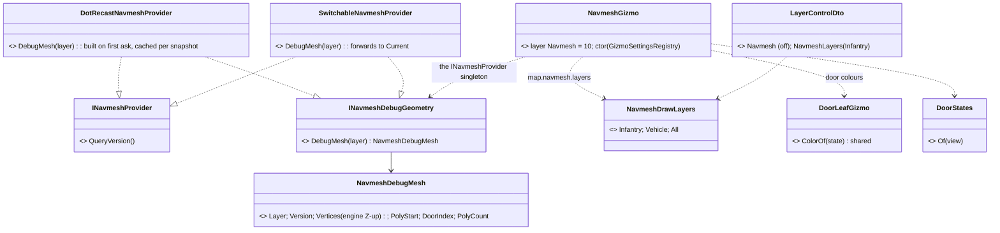

*What the picture shows that the prose hid: the gizmo never sees DotRecast — one small seam in `Fdp.Toolkits.Navigation`
carries plain vertices, and the only new state is a cache inside the provider that owns the mesh.*

### Sequence — a terrain bakes, the layer is switched on

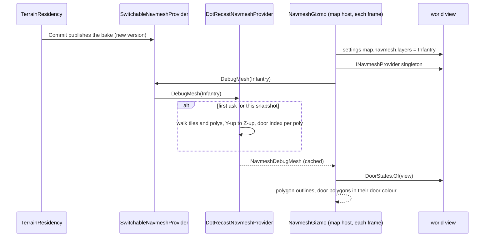

### Module relationships — who has it, who draws it

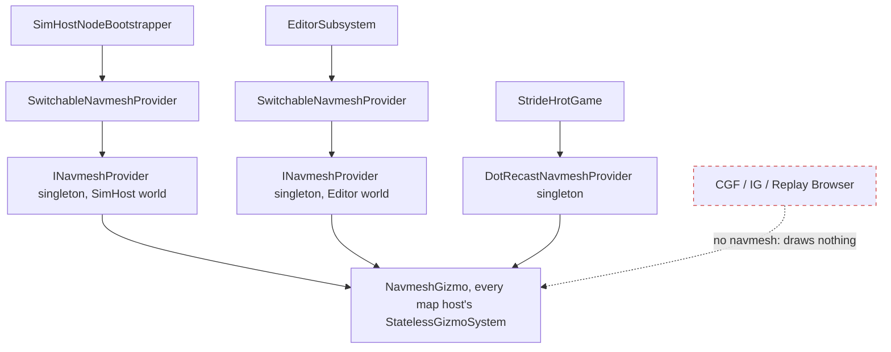

*Caption: the dashed red edge is the hosts that bake no navmesh — the layer is empty there by construction (R-233's ⚠).*

### Decisions

| # | lean | why |
|---|---|---|
| N1 | the export is a seam in `Fdp.Toolkits.Navigation` (`INavmeshDebugGeometry`) implemented by the Recast provider and forwarded by the switchable one | `Hrot.Presentation` has no DotRecast reference; the door map is private to the provider |
| N2 | built **on first ask** per snapshot and layer, cached on the snapshot | nothing is paid while the layer is off; a re-bake makes a new snapshot, so the cache cannot go stale |
| N3 | the layer setting `Infantry / Vehicle / All` is an enum in the layer panel, kept in the settings registry as `map.navmesh.layers` (int); default **Infantry** | R-233; the int-for-enum precedent is `GizmoFamilies` |
| N4 | door polygons (area 2) are drawn in the colour of their door's CURRENT state as this view sees it, with the Doors layer's colours | ⛔ R-233 said *"by their flags"* — every polygon's Recast flags are 1; doors are an AREA, and the state that decides passability is `DoorStates` (R-219) |
| N5 | ⛔ **not "only what is in view"**: the whole chosen layer is drawn, the layer is **off by default** | backend projectors have no camera bounds (measured: no gizmo culls); ⏭ viewport culling if a large terrain's line count hurts |
| N6 | layer bit `Navmesh = 10`; `FirstUntoggledLayer` → 11 | the next free bit |

| rejected | the one fact that killed it |
|---|---|
| draw the bake's input triangles (`TerrainWorldMesh`) | that is what the bake READ, not what it produced — the point of the layer is to see the navmesh |
| a `/navmesh` HTTP route first | not asked; the map is the request |
| export in `Hrot.Core` from `TerrainResidency` | the door map and the Y-up mesh live in the provider; a second walker would duplicate `NavDoorways` |

### Slices and rails

| slice | content | rail |
|---|---|---|
| N-1 | `INavmeshDebugGeometry`, `NavmeshDebugMesh`, Recast export + cache, switchable forward | a baked mesh exports every polygon of every tile, Z-up; bt-range's doorway polygons carry their door index; same snapshot ⇒ same object, re-bake ⇒ new |
| N-2 | `NavmeshGizmo`, the setting, the layer panel toggle + enum, `DoorLeafGizmo.ColorOf` | draws outlines on its layer for the chosen layer only; door polygons in their state colour; nothing without a baked mesh |

## 6. Slices

| slice | content |
|---|---|
| **T-0 resolver** | `ParameterResolver` + provenance + engine fallbacks gathered into one file; existing catalogs as library entries (no number moves) |
| **T-1 library** | ✅ §2b — the generator (§2a) + coefficients file + driving parameters for the reference library of §2 (body profiles → Stage 4) |
| **T-2 premises** | ✅ §2b — `DemoPremisesTests` + the premise table format |
| **T-3 routes** | `/tkb/resolve`, `/terrain/levels`, `/terrain/query`, `/doors` + MCP tools |
| **T-4 records** | ✅ §4a shots + LOS explanation; ⏭ detonations with `CE-1032` |
| **T-5 layers** | 🟡 fire traces ✅ (§5) · doors, paths, blast, hearing ✅ (§5a, `CE-3117`) · roads ✅ (`CE-3124`) · cover ✅ (`CE-3134`, Building Interiors §3l.7) · navmesh ✅ (§5c, `CE-3133`); ⏭ LOS probe (interactive tool), provenance badges, storeys/levels probe |
| **T-6 demos** | `bt-range` terrain + the demo set, one per building/combat slice as it lands |
