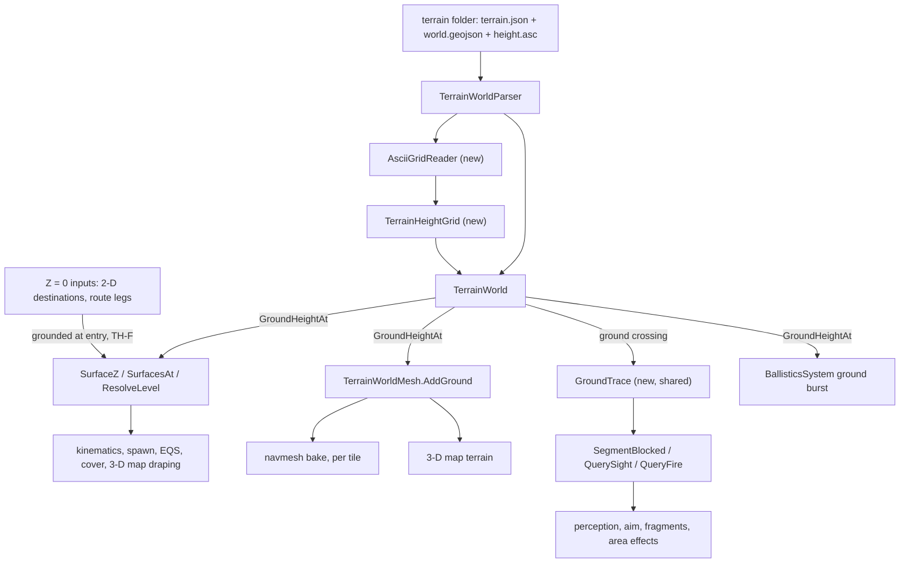
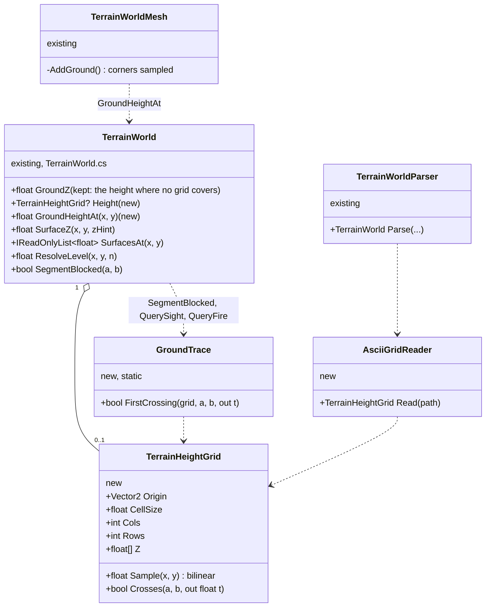
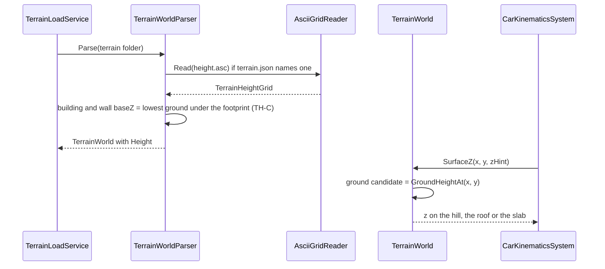

<!--STATUS
state: LIVE
build-state: DESIGN — leans TH-A..TH-H APPROVED (2026-10-10, R-249); UML present; not yet marked READY-TO-BUILD while
  the physics-library question (§7) is open. Nothing built.
updated: 2026-10-10 (rev 2 — all leans approved; grounding is the entity's clamping flag + motion model, no zero rule
  (R-249, §4a); §7 the library question. Rev 1 — R-248: the flat ground is a temporary simplification; this file plans its removal)
current-answer: §1 why · §2 INVENTORY · §3 the diagrams · §4 decisions with leans · §5 slices · §6 not verified.
stale-below: nothing.
known-rot: none.
known-conflict: none. CE-3086 (backend) plans a ramp ridge + wadi on basic-desert because "a heightfield (not built)"
  (DESIGN_Utility_AI_Demo_Scenarios.md:104); TH-G proposes a real height grid there instead — the backend lane decides.
related-designs:
  - DESIGN_Terrain_World.md — OWNS TerrainWorld, the world file, the parser, TerrainWorldMesh and the queries; this file
    adds the ground height to them (one function, one grid) and changes nothing else about the model.
  - docs/blueprints/Architect_Question_81_SimHost_Test_Terrain_World.md — T1/T2 (APPROVED, R-181): "ground (flat or
    heightfield)", "Optional heightmap as ESRI ASCII grid. Referenced from the existing terrain definition JSON".
  - DESIGN_Terrain_Zones_And_Assets.md — owns the terrain asset (§2.1e: "later its terrain DB / heightmap / navmesh");
    the grid file is one more file in the terrain folder.
  - designs/navig-2/Navigation_Design_v2_0.md §14 — owns the tiled navmesh bake; a tile's key already hashes its OWN
    triangles, so relief changes only the tiles it touches.
  - designs/eqs-2/EQS_Design_v1.3_final.md §19 — EQS terrain sight and ground placement; inherits TH-D unchanged.
  - DESIGN_Building_Interiors.md — storeys, slabs, wall panels; TH-C sets where a building stands on a slope.
  - DESIGN_Map_3D_Mode.md §3.10 — the 3-D map reaches the ground only through the mesh and level 0, so it gets relief
    for free; it asked for this file.
  - DESIGN_Utility_AI_Demo_Scenarios.md — basic-desert's ridge and wadi (TH-G).
  - designs/promote-to-3d/3D_Cognitive_Spatial_Awareness_Promotion_Design_v1_1.md — "SimTransform.Position.Z is
    authoritative"; relief is what makes that true outdoors.
-->

# DESIGN — terrain height (removing the flat ground)

## 1. Why

🔒 **User, `2026-10-10` (`R-248`):** *"Terrain needs height. Current flat terrain bed is unbearable. never count with
terrain being flat, this is just current simplification that should be removed soon."*

📐 Today `TerrainWorld` has one number for the ground, `GroundZ` (`TerrainWorld.cs:93`), and every terrain file sets it to
0. The approved plan already allows height (Q81 T1/T2, `R-181`) — but no design, file slot, parser, tracker row or raster
asset exists for it.

## 2. INVENTORY — measured `2026-10-10` (graph CLI `search_code`/`search_graph` + grep; two sweeps)

⚠ `check_index_coverage` is not available through the CLI, so "every reader" below is graph + grep agreeing, not a
coverage proof.

| what | count | where |
|---|---|---|
| production reads of `GroundZ` | **9 in 6 places** | `TerrainWorld.cs:224,227` (`SurfaceZ`), `:248,249,270` (`SurfacesAt`, level 0); `TerrainWorldMesh.cs:57` (ground grid — the navmesh input); `BallisticsSystem.cs:175` (area-round burst plane); `StaticObstacles.cs:110` (copy); `WorldInfoReport.cs:47` (report) |
| the one writer | 1 | `TerrainWorldParser.cs:231`, from `hrot.groundZ` (`:71`) |
| queries that never test the ground | 3 | `SegmentBlocked` (`:314-360`, *"until a heightfield exists"* `:317-319`), `QuerySight` (`:382-435`), `QueryFire` (*"the ground is not an occluder"*) ⇒ a hill blocks neither sight nor fragments |
| flat defaults in the loader | 5 | building/wall/fence `baseZ` default to `groundZ` (`TerrainWorldParser.cs:117,127,149`); ground-floor slab test (`TerrainBuildingExpander.cs:36,100`) |
| callers already on the right seam | many | kinematics (`CarKinematicsSystem.cs:374,382`), spawn (`NetworkSpawningSystem.cs:221`, `ResolveLevel`), EQS (`EqsTerrainSight.cs:64`), cover (`TerrainCoverProvider.cs:98,210`), danger areas, LOS callers via `SegmentBlocked` ⇒ **follow with no edit** |
| `Z = 0` entering from outside | ~16 sites | 2-D destinations and waypoints (`CgfNodes.cs:281,422`, `HillAttackTankNodes.cs:300,490`, `VehicleCommandSystem.cs:64,86`, `ScenarioSpawnAdapter.cs:414`, SimHost UI); `RoutePlanner.cs:189-190` snaps at Z 0 with a ±4 m search (`DotRecastNavmeshProvider.cs:43`); `INavmeshProvider.cs:10` documents *"for flat-earth queries use Z 0"*; `TrajectoryPoolManager.cs:120-128` |
| an older height seam | 1 | `ITerrainProvider` + `TerrainQueryResolutionSystem` (an IG ground-clamp pipeline), installed only at `IgApplication.cs:2176`, no production caller found — and a clamp is what `R-182` ruled out |
| Stride | flat slab | `StrideHrotGame.cs:1006` *"DELIBERATELY not a heightfield"* — out of scope (U1: Stride untouched) |
| raster files in the repo | **0** | four terrains, all `"groundZ": 0` |

## 3. The design

### 3.1 Where height enters — module view

*What the picture shows that prose hid:* height reaches every consumer through **three** seams — `GroundHeightAt`, the
ground grid in the mesh, and one shared ground trace. Everything to the right of them (kinematics, spawn, EQS, cover, the
3-D map, the navmesh tiles) needs no edit. The only outside work is the `Z = 0` inputs at the bottom.

### 3.2 Classes — existing vs new

*What it shows:* one new data class and one reader; the grid is optional (`0..1`), so a terrain without one is today's
flat world, byte for byte.

### 3.3 Load and query — sequence

## 4. DECISIONS

| # | decision | ⭐ lean | rejected — one line each |
|---|---|---|---|
| **TH-A** | the source file | ⭐ **ESRI ASCII grid** (`ncols`, `nrows`, `xllcorner`, `yllcorner`, `cellsize`, `NODATA_value`, then rows of heights), **local metres**, one file in the terrain folder, named from `terrain.json` — exactly Q81 T2 (approved) | GeoTIFF — needs an imaging library · a TIN in the GeoJSON — hand-authoring thousands of points · SRTM/DTED — geodetic, `R-181` says local metres |
| **TH-B** | the model | ⭐ `TerrainHeightGrid` (a float array, bilinear `Sample`) held by `TerrainWorld`; **`GroundHeightAt(x, y)`** = grid sample, else `GroundZ`; the 9 reads go through it | adopting the IG's `ITerrainProvider` — batched, asynchronous, unwired, and built for the clamp `R-182` ruled out · a second height service — `R-181` says one world model feeds every query |
| **TH-C** | buildings on a slope | ⭐ a building, wall or fence with no explicit `baseZ` stands on the **lowest ground under its footprint** (no gap under the downhill side; the uphill side sits in the slope, which the ground cells inside the footprint already skip) | the ground at the centre — leaves the downhill side floating |
| **TH-D** | sight and fire over hills | ⭐ one shared, allocation-free **`GroundTrace`** (march the segment cell by cell against the grid) called by `SegmentBlocked`, `QuerySight`, `QueryFire`; ballistics bursts at `GroundHeightAt` instead of a plane | per-caller ground tests — three copies · leaving LOS flat — a hill would not hide anyone, which is the point of relief |
| **TH-E** | navmesh | ⭐ the mesher samples each ground cell's corners — the only bake change; per-layer slope limits already exist (infantry 60°, vehicle 20°); the vertical search box (±4 m) is centred on the **grounded** hint, not on 0 | a separate terrain navmesh source — the tiled bake already takes one triangle soup |
| **TH-F** | `Z = 0` inputs | ⭐ ground them **where they enter** (2-D destination, route leg, UI drag, `VehicleCommandSystem`): `ResolveLevel(x, y, 0)`; `INavmeshProvider`'s *"use Z 0"* note becomes *"pass the ground height"* | grounding inside every consumer — the same fix many times |
| **TH-G** | test terrains | ⭐ a small **sloped fixture** for rails, and `basic-desert`'s ridge and wadi as a real height grid (proposal to the backend lane's CE-3086, which plans them as ramps only because no heightfield existed) | ramps as fake hills — the workaround this file removes |
| **TH-H** | what is NOT in this design | ⭐ Stride stays flat (U1); a 2-D hillshade or contour layer and terrain streaming/tiles come later; the dormant IG clamp pipeline is retired in a follow-up, not reused | — |

## 4a. Who puts an entity on the ground — 🔒 `R-249`

🔒 **User, `2026-10-10`:** *"Whether entity should be ground clamped needs to be controlled by its 'ground clamping enabled'
realtime flag and its motion model, not by adding exception for zero coordinate. Motion model usually lifts such entity on
the ground anyway."*

| | |
|---|---|
| ⛔ | no special case for a saved `Z = 0` — a loaded entity keeps the Z it was saved with |
| ⭐ the motion model | grounds as it moves: `CarKinematicsSystem` already sets Z from `SurfaceZ` every step (`CarKinematicsSystem.cs:370-375`, W8/`R-182`) |
| ⭐ the flag | the per-entity, runtime **ground-clamping flag** decides whether an entity is held to the surface at all. 📐 One already exists: `GroundClampingConfig { Mode: Auto/ForceOn/…, BaseRequiresClamping }` — TKB default (1 = ground vehicle, 0 = aircraft), overridable at runtime over DDS (`GroundClampingOverrideTranslator`) (`GroundClampingConfig.cs:12-35`) |
| ⚠ the gap | today that flag drives only the dormant IG clamp pipeline (`TerrainQuerySubmitSystem.cs:45`), and the motion model grounds regardless of it ⇒ the motion model must read the flag (an aircraft keeps its altitude) — H1 |

⚠ `R-182` ("no ground clamp") ruled out a SEPARATE clamp step; `R-249` keeps that — the flag is read BY the motion model,
not by a second system.

## 5. SLICES

| slice | delivers | proves |
|---|---|---|
| **H1** | `AsciiGridReader`, `TerrainHeightGrid`, `GroundHeightAt`; the 9 reads routed; the mesher samples corners; TH-C defaults; the sloped fixture | an entity drives up a hill (kinematics, unchanged), spawns on the slope, the navmesh follows it — and every existing flat terrain is byte-identical |
| **H2** | `GroundTrace` in the three queries; ballistics ground burst | a hill blocks sight and fragments |
| **H3** | the `Z = 0` entry points grounded; the navmesh search box on the grounded hint | 2-D orders and route legs work on a hill |
| **H4** | basic-desert's ridge and wadi as a grid (with the backend lane) | the utility demos on real relief |

⭐ Gates: the terrain feature suites first (`TerrainWorldTests`, the Recast and SimHost terrain tests — about 35 asserts assume
ground 0 and stay green on flat terrains), then new rails on the sloped fixture.

## 6. NOT VERIFIED — say so before it is built on

| claim | how it is settled |
|---|---|
| ⚠ `HumanGait.MaxStepDown`'s "never step off a ledge" rule (`CarKinematicsSystem.cs:377-386`) does not fire on a steep slope | H1 rail |
| ⚠ `filterLedgeSpans: false` (`RecastNavmeshBaker.cs:431`, *"flat terrain edges are valid"*) is still right over relief | H1 bake on the fixture |
| ⚠ grid cell size vs the mesher's 2 m ground cells — sample per corner, or match the grid | H1 |
| ⚠ `GroundTrace` cost inside the per-frame perception budget (`R-220` allocation contract) | H2, measured |
| ✅ scenarios that saved Z = 0: no special case — the clamping flag and the motion model decide (`R-249`, §4a) | ruled |
