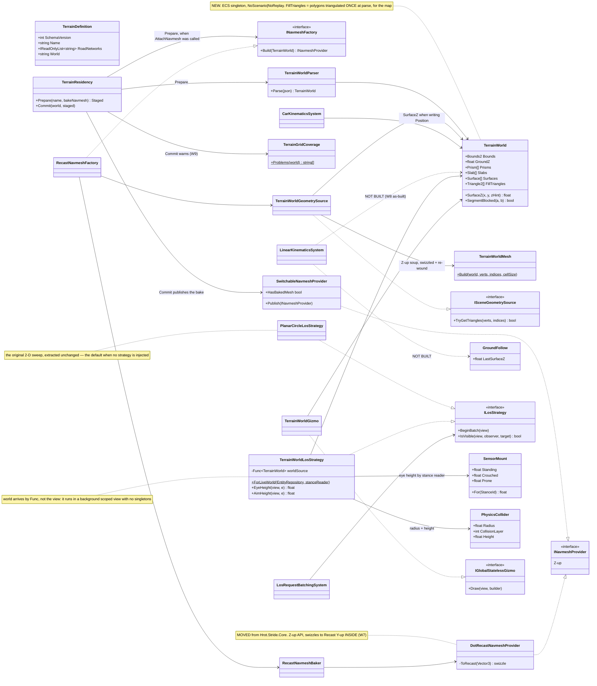
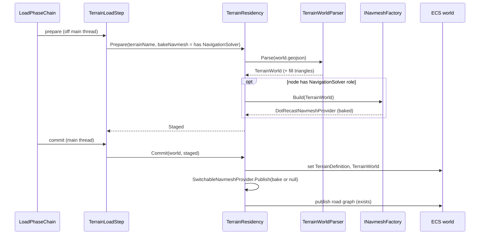
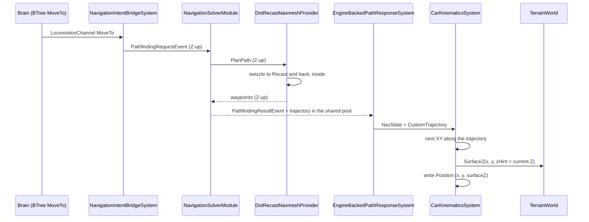
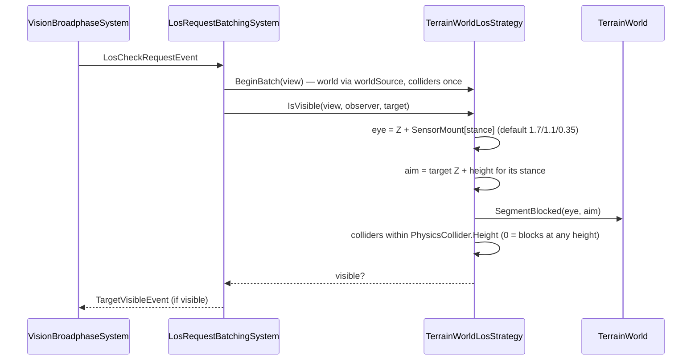
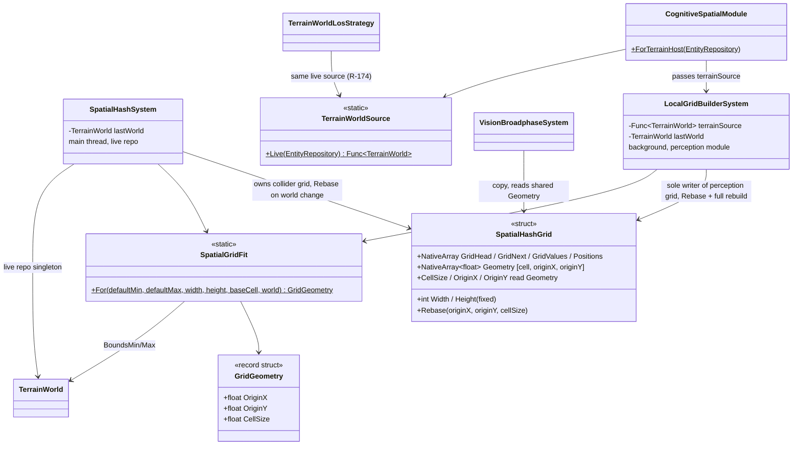
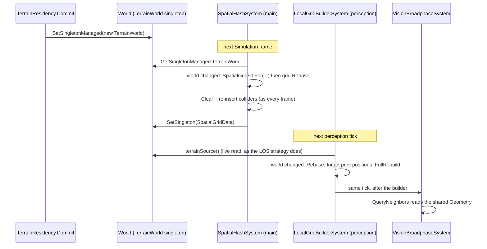
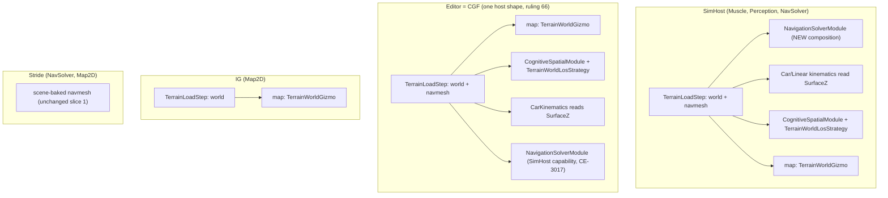
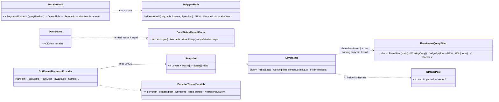

<!--STATUS
state: LIVE
build-state: BUILT (slice 1, 2026-10-03; open: CE-3010, CE-3027 hull clearance; CE-3017 + CE-3018 + CE-3025 + CE-3026 closed 2026-10-03; live-run results in §8) — Q81 §0 APPROVED (R-181); §7.1 W2–W8 RULED (R-182); §7.2 W1/W9/W10/W11 APPROVED 2026-10-03 (R-183); §7.3 W12–W14 decided by the backend lane under the user's 'go autonomously'.
updated: 2026-10-08
current-answer: §2 the file format, §3 the classes, §4 the sequences, §5 the module diagram (incl. the dead edges), §6a the allocation contract (R-220), §7 the rulings, §7.3 terrain delivery + the picker, §8 the slice plan.
stale-below: nothing quotable — §7's HISTORY row block records the first-draft leans the user overturned.
known-rot: nothing yet. AS-BUILT folded 2026-10-03 (slice steps 0–3): W5/W6/W7/W8/W9/W11 rows carry 'As built' notes; the deviations are W8 (no GroundFollow), W9 (rebase, not resize — §4.4, CE-3018), W11 (folded into CE-3010) and the editor solver (CE-3017).
known-conflict: docs/DESIGN_Cluster_Load_Phase.md §4.1a and Hrot.Core RoleLoadRequirements give terrain to MuscleGround + NavigationSolver only; §5 here makes the terrain WORLD universal (every ECS node, like the knowledge base) and keeps only the navmesh bake role-derived. RESOLVED 2026-10-03: Cluster_Load_Phase §4.1a and Node_Roles §3.2 updated for the universal world part; INavmeshProvider is Z-up in code (CE-3011) and Navigation_Design_v2_0.md carries a Z-up supersession note.
related-designs:
  - designs/navig-2/Navigation_Design_v2_0.md §14 — OWNS runtime navmesh change (R-218): the W6 bake becomes one immutable snapshot (P1), tiled with CE-1029 (P2); §15 points to §6a here for the path queries' allocation contract (R-220)
  - DESIGN_Building_Interiors.md — the enterable-building v2 that §6 L459 deferred (wall panels with openings, storeys as slabs, doors as entities, transmittance trace); CE-1031
  - DESIGN_Add_Entity_Picker.md §2a — chooses an entity's BIRTH level (SurfacePlacement, resolved by the creating node) and proposes TerrainWorld.SurfacesAt; adds no clamp step (W8 stands); §2c records the solid-building consequence, filed as CE-1031 against this doc's §2
  - docs/DESIGN_Utility_AI_Demo_Scenarios.md — reuses test-town and extends basic-desert with a ramp ridge + wadi for the utility demos (§3 there).
  - docs/designs/eqs-2/EQS_Design_v1.3_final.md — §19 owns EQS over this world: terrain sight (SegmentBlocked), the cover database
    built from the prisms (TerrainCoverProvider, published by TerrainResidency.Commit), ground placement of sampled points.
  - docs/blueprints/Architect_Question_81_SimHost_Test_Terrain_World.md — the WHY and the approved decisions T1–T10; THIS doc is the WHAT.
  - docs/DESIGN_Terrain_Zones_And_Assets.md — owns WHAT a terrain asset is (named, JSON definition §2.1e), zones, and the asset build for static obstacles (§2.1c); this doc fills the content its §7 postponed.
  - docs/DESIGN_Cluster_Load_Phase.md — owns WHEN terrain loads and the role→load-part contract; §5 here makes the world part universal. §10 there (CE-3075, 2026-10-05) owns what a scenario naming NO terrain does: the resident terrain is UNLOADED (an empty TerrainWorld = flat ground); only the SAME name stays untouched.
  - docs/DESIGN_Node_Roles_And_Policies.md — owns the role→data table (§3.2) that the world now joins for every role.
  - docs/designs/navig-2/Navigation_Design_v2_0.md — owns INavmeshProvider, per-layer navmesh and "the solver lives on the Muscle"; W7 flips its coordinate contract to Z-up.
  - docs/DESIGN_Subsystem_Composition_Unification.md — owns CE-210 (the 3-D LOS seam, §4.1ab), which §3/§4.3 here builds, and B5 (role composition).
  - docs/PROGRAMME_Cgf_Equals_Editor_Gap_Map.md — owns "the editor is a one-node cluster / CGF is as capable as the editor" (ruling 66); W3/W4 apply it to terrain.
  - docs/DESIGN_Gizmo_Renderer_Seam.md — owns the gizmo builder→buffer→renderer seam the map layer draws through; W2 adds one shape to it.
  - docs/DESIGN_Map_Rendering_And_Interaction.md — owns the map canvas and IMapLayer (the legacy path this doc does NOT use).
  - docs/DESIGN_Stride_Node_Modes.md — owns the Stride host's scene-baked navmesh (stays as it is in slice 1; its coordinate conversion moves inside the implementations, W7).
  - docs/designs/promote-to-3d/3D_Cognitive_Spatial_Awareness_Promotion_Design_v1_1.md — owns "SimTransform.Position.Z is authoritative"; W8 is how SimHost honours it.
  - docs/designs/anim-ctrl/AnimationControl_BrainMuscle_MiniDesign_v0_3.md — owns StanceIntent/StanceStatus, which W5's posture-driven eye height reads.
-->

# DESIGN — **the terrain world** *(SimHost's test terrain: one file, one model, every query derived)*

> **The one rule:** a terrain is **one world file**, parsed into **one `TerrainWorld` model** on every ECS node; the
> navmesh, the ground height, line of sight and the 2D map drawing are **all derived from it** and cannot disagree.
> ⭐ Every API is in the engine's **Z-up** space; conversion happens only inside an implementation (W7).

## 1. INVENTORY — measured `2026-10-03` (graph CLI + grep; five sweeps, summarised)

| area | exists | ⛔ missing / wrong |
|---|---|---|
| terrain asset | `TerrainDefinition` (v1: `Name`, `RoadNetworks`), `TerrainDefinitionParser`, `TerrainResidency` (`Prepare`/`Commit`, `Hrot.Core/Services/TerrainResidency.cs:94,162`), `TerrainLoadStep`, role filter `RoleLoadRequirements.cs:54-59`; the knowledge base is already a **universal** part (`:34`) | any geometry; no terrain file was ever authored |
| navmesh | `DotRecastNavmeshProvider`, `DotRecastDtCrowdProvider`, `StrideNavmeshBaker`, `ISceneGeometrySource` — ⭐ **no Stride type used** (namespace `Hrot.Stride.Core`, TFM net8.0-windows; DotRecast 2026.1.3 ships net8.0) | a headless home; a headless geometry source |
| coordinates | `IDtCrowdProvider`, `CrowdMotorIntent`, EQS results, `RouteWaypoint` are Z-up | 🔴 `INavmeshProvider`, `NavWaypoint`, `IVolumetricPathProvider`/`FlyProfile`, `NavPolygon` are **Y-up**; 4 places already mix the two (`CE-3011`), one of them LIVE (`CE-3013`) |
| solver | `NavigationSolverModule` / `PathfindingSolverSystem`, `EngineBackedPathResponseSystem` writes `NavState.CustomTrajectory`, `CarKinematicsSystem` follows it | ⛔ composed on no host (`CE-3006`) |
| height | position writers: `CarKinematicsSystem.cs:287` keeps Z, `LinearKinematicsSystem.cs:110` integrates `vel.Z`; spawns write Z=0 (`VehicleCommandSystem.cs:64`, `SimHostScenarioManager.cs`, editor placement) | ⛔ nothing on SimHost/Editor/CGF ever reads a ground height |
| posture | `StanceIntent` (Brain) / `StanceStatus { CurrentStance }` (Muscle), `StanceId` Standing/Crouched/Prone | ⛔ `StanceTransitionSystem` runs on **no** host ⇒ `StanceStatus` is never written; no eye-height field anywhere |
| LOS | `LosRequestBatchingSystem` 2-D segment-vs-circle (`:94-131`), built by `CognitiveSpatialModule` on 3 hosts; `IRaycastBackend` (3-D, Z-up, never wired) | ⛔ the strategy seam (`CE-210` (b)); collider height |
| map | gizmo seam: `IGlobalStatelessGizmo.Draw(view, builder)` registered on **all five hosts** via `MapInteractionPack`; **filled** circles (`Sphere`) and **filled rotated rectangles** (`Box2D`) exist (`DebugPrimitiveRenderer2D.cs:234-296`); primitive = fixed 64-byte slot | ⛔ no filled POLYGON; 🔴 `MapOverlayStyle.FillColor` is authored (`SpawnerPanel`) and **never drawn** (`MapOverlayGizmo` strokes only, `CE-3014`) |
| geometry utils | `PointInPolygon` ×2 (SimHost-internal, nav-fake private), `BoundingBox3D.IntersectsLine`, `Intersection2D.RaycastCircle` | no shared polygon library |

## 2. THE FILE — GeoJSON in local metres (✅ T2)

`{staging}/Terrain/<name>.json` (exists, schema **v2** adds `world`) → `<name>.world.geojson`:

```json
{ "schemaVersion": 2, "name": "test-town", "roadNetworks": ["roads.json"],
  "world": "test-town.world.geojson" }
```

```json
{ "type": "FeatureCollection",
  "hrot": { "schemaVersion": 1, "bounds": [0, 0, 400, 400], "groundZ": 0 },
  "features": [
    { "type": "Feature", "properties": { "kind": "building", "height": 12, "floors": 3 },
      "geometry": { "type": "Polygon", "coordinates": [[[100,100],[140,100],[140,130],[100,130],[100,100]]] } },
    { "type": "Feature", "properties": { "kind": "wall", "height": 2.5, "thickness": 0.4 },
      "geometry": { "type": "LineString", "coordinates": [[60,40],[60,90]] } },
    { "type": "Feature", "properties": { "kind": "surface", "surface": "forest" },
      "geometry": { "type": "Polygon", "coordinates": [[[200,200],[300,200],[300,300],[200,300],[200,200]]] } },
    { "type": "Feature", "properties": { "kind": "slab" },
      "geometry": { "type": "Polygon", "coordinates": [[[250,50,3],[290,50,3],[290,80,3],[250,80,3],[250,50,3]]] } },
    { "type": "Feature", "properties": { "kind": "ramp" },
      "geometry": { "type": "Polygon", "coordinates": [[[240,50,0],[250,50,3],[250,58,3],[240,58,0],[240,50,0]]] } }
  ] }
```

| `kind` | geometry | meaning | blocks move | blocks sight | walkable |
|---|---|---|---|---|---|
| `building` | Polygon | solid prism `baseZ`..`baseZ+height` (`floors` = label only in v1) | ✅ | ✅ | roof no |
| `wall` | LineString + `thickness` | thin prism | ✅ | ✅ | — |
| `surface` | Polygon | `road`/`open`/`forest`/`water`; cost + draw colour (water = unwalkable) | water only | `forest` partial — ⛔ v1: no | ✅ |
| `slab` | Polygon with Z | walkable floor at that Z (T7 — format v1, built later) | under/over | ✅ (from below/above) | ✅ |
| `ramp` | Polygon with per-vertex Z | sloped walkable link between levels | — | ✅ | ✅ |
| ⭐ `building` *(Stage 1)* | **Point** + `template` or inline `building` | an ENTERABLE building instance — walls with openings, storey floors, stairs, roof (📄 `DESIGN_Building_Interiors.md` §3a, §3g) | walls ✅ | walls ✅ (openings pass) | floors, stairs, roof |
| ⭐ `fence` *(Stage 1)* | LineString | a `wall` whose default material is `fence-wood`; any wall/fence takes `material` (§3c) | ✅ | per material | — |

⭐ Coordinates are the world's **local metres, X east / Y north / Z up** (FDP space). GeoJSON's lat/lon rule is
deliberately not followed (user: *"small numbers over large ones"*).

## 3. CLASSES



*What the picture shows that the prose hid:* **every consumer points at `TerrainWorld` and nothing points back**, and
**there is no ground-clamp class** — the two movement models ask the world for the surface Z while they compute the
position (W8). ⭐ New interfaces: only `INavmeshFactory` (keeps DotRecast out of `Hrot.Core`) and `ILosStrategy`
(`CE-210` (b)).

| type | home | new / moved |
|---|---|---|
| `TerrainWorld`, `TerrainWorldParser`, `GroundFollow`, `INavmeshFactory`, `ISceneGeometrySource`, `ILosStrategy`, `PlanarCircleLosStrategy`, `TerrainWorldLosStrategy` | `Fdp.Toolkits` (`Terrain/`, `Navigation/`, `Perception/`, `CarKinem/`) | new (`ISceneGeometrySource` moved) |
| `SensorMount` | TKB `SensorCapabilitiesDto` (per-stance heights), projected by `PerceptionTkbTranslator` | new fields |
| `RecastNavmeshBaker`, `DotRecastNavmeshProvider`, `DotRecastDtCrowdProvider`, `RecastNavmeshFactory`, `TerrainWorldGeometrySource` | **new `Fdp.Toolkits.Navigation.Recast`** (net8.0) — W1 | moved + new |
| `TerrainWorldGizmo` | `Hrot.Presentation` (beside `TerrainZoneGizmo`) | new |
| `DebugPrimitiveShape.FilledTriangle` | `GizmoMap.Contracts` + one renderer case | new enum value, same 64-byte slot (W2) |

## 4. SEQUENCES

### 4.1 Load — the existing chain, more content



*What it shows:* the bake rides **`Prepare`**, whose contract is already "off-thread, no ECS mutation"; the swap is one
`Commit`. No new phase, no new op. The world part runs on **every** ECS node (§5).

### 4.2 A move order — Brain to wheels, Z from the world



*What it shows:* everything left of the provider **already exists**; the slice adds the provider, composes the solver,
and makes the movement model set Z itself — ground, roof or the floor nearest the current Z.

### 4.3 Line of sight



*What it shows:* the system keeps its events; only the inner test moves behind a strategy. A prone soldier's eye and
silhouette are low, so a 0.5 m wall now hides him (W5).

⭐ **As built (`2026-10-03`):** `Fdp.Toolkits/Perception/LineOfSight/LosStrategies.cs`. SimHost, editor (≡ CGF) and
Stride pass `TerrainWorldLosStrategy.ForLiveWorld(world)`; `LosRequestBatchingSystem` with no strategy keeps the
original sweep byte-for-byte (`LegacyCrossing`). ⚠ **The world is read through a `Func`, not the view** — the
perception modules tick in a background `PerceptionScopedView` that exposes no singletons; the parsed `TerrainWorld`
is immutable and replaced by reference on load. ⚠ **The stance reader is null on every host** (⇒ Standing): no host
references `StanceStatus`'s assembly or composes the stance runtime — folded into `CE-3010` (W11 below).
`PhysicsCollider.Height` is filled from `StrideRenderModelDefDto.ShapeHeight` by the vehicle and combat translators;
`SensorMount` from the new `SensorCapabilitiesDto.EyeHeight*` fields (0 = unset ⇒ the default mount).

### 4.4 W9 — the spatial grids follow the terrain (`CE-3018`, as built `2026-10-03`)



*What the picture shows that the prose hid:* **each grid is rebased only by its own writer, on its own thread** —
`SpatialHashSystem` (main) for the collider grid, `LocalGridBuilderSystem` (perception module) for the perception grid —
so the rebase adds no cross-thread write. **Nothing is reallocated**: the cell COUNT and the entity capacity stay fixed;
only origin and cell size move, and they live in shared native memory (`Geometry`) so every value copy of the struct
(the broadphase's, the `SpatialGridData` singleton's, a background snapshot's) sees the new geometry with no re-plumbing.



| ⭐ decision | why |
|---|---|
| **rebase, never reallocate** | a reallocation frees memory a background snapshot (`SyncSingletonById(SpatialGridData)`) or the broadphase's copy may still read — the use-after-free `RoadNetworkHolder` had to solve with leases. Same-size arrays make every index still in range |
| **coverage = UNION(today's default extent, terrain bounds + margin)**; cell = max(base cell, union span ÷ cell count) | ⛔ never shrinks what is covered today, so a terrain that fits changes NOTHING (same origin, same cell). A big terrain coarsens cells — query cost grows, correctness does not |
| **each owner PULLS the world** | the collider system already requires the live repo; the perception builder gets the world by `Func` exactly as `TerrainWorldLosStrategy` does (`TerrainWorldSource.Live`, one source for both) |
| **`CognitiveSpatialModule.ForTerrainHost(world)`** | the three production sites (SimHost, editor, Stride) built the module identically; one factory makes "forgot the terrain source" unrepresentable (`AX-012`) |

⛔ Rejected: **resize at commit** — frees memory other threads hold (see above). **Shrink-to-terrain** — would hide an
entity placed off the terrain that today's grid sees. **Publish the geometry from `TerrainResidency.Commit`** — a
main-thread write into the perception grid while its builder runs on the perception thread.

## 5. MODULE RELATIONSHIPS — who loads, who registers, who ticks



*What the picture shows that the prose hid:* **no dead edge is left** (`2026-10-03`, as built). ⭐ The editor's
navigation edge was dead until `CE-3017`: its role DECLARED `NavigationSolver` but its plan carried no capability for it.
Now the default arm composes SimHost's own `SimHostCapabilities.NavigationSolver` (`R-174`: shared, not copied) over the
muscle pack's pool, one `SwitchableNavmeshProvider` and the editor's road holder; its residency bakes on every terrain
load. ⚠ The injected (Stride) arm is unchanged — it brings its own scene-baked navigation. ⛔ SUPERSEDED: the dashed
"no bake: solver absent" edge. The earlier dead edge — the load chain registered as Brain only — was fixed by `CE-3012`.

| load part | who | why |
|---|---|---|
| knowledge base | every ECS node (exists) | — |
| ⭐ **terrain world + road graph** | **every ECS node** (NEW — universal, like the knowledge base) | map on every host (user: *"Cgf must render the map as well"*), LOS, movement Z |
| **navmesh bake** | nodes that compose **NavigationSolver** | the solver |

## 6. WHY — what the diagrams cannot carry

- **Why one model and not per-consumer files:** navmesh, height and LOS built from separate sources diverge silently
  (a wall on the map that a unit walks through). One model makes that impossible by construction (`R-132`).
- **Why GeoJSON:** the only standard text format carrying polygons + lines + properties + optional Z that is
  hand-authorable and viewable in common tools. Local metres are the user's choice.
- **Why DotRecast and not the fake navmesh:** one implementation for SimHost and Stride (ruling 9); it handles agent
  radius/height/climb and stacked floors natively, and the bake is already written and tested.
- **Why the movement model sets Z (no clamp step):** the model is the only place that knows where the entity is going
  and which floor it is on; a separate clamp would be a second writer of `Position` (user ruling, W8).
- **Why Z-up everywhere:** a Y-up API leaks the library's convention into every caller — and already produced four
  mixed sites, one of them a live route bug (`CE-3013`).
- **Why prisms are solid in v1:** enterable buildings need doors/stairs; garages cover multi-level through slabs+ramps.

## 6a. ALLOCATION — a background batch allocates nothing per query *(R-220, backend, `2026-10-08`)*

> 🔒 **User, `2026-10-08`:** *"Are those background batches writeen in a garbage collection friendly way, to avoid gc stutters?"*
> → *"Approved, do it first"*.

⭐ **Rule:** a query that a background module (path solver, EQS, perception, danger sensor) or a per-tick system runs per
candidate or per entity allocates **0 bytes per call once warm**. Scratch is owned **per thread**, because two background
modules query one provider at once (`CE-2122`). A table handed to a caller is **immutable**, so the caller may hold it for its batch.


*What it shows that prose hid:* every piece of scratch has exactly one owner thread. The only object a caller keeps, the door table, is
immutable. The one allocation left is inside DotRecast, below our seam.

| measured (bytes per call, warm) | before | after |
|---|---|---|
| `SegmentBlocked` · `QueryFire(into)` · `DoorStates.Of` (doors unchanged) | 320 · 360 · 664 | **0 · 0 · 0** |
| `IsWalkable` · `ProjectToNavmesh` | 64 | **0** |
| `PlanPath` / `PathExists` / `PathCost` (the 5c room, no doors) | 9 392 / 16 360 / 16 360 | **440 = DotRecast's own `FindPath`+`FindStraightPath`** |
| the same, judged by the caller's doors | 10 192 / 16 360 / 16 360 | **= DotRecast's own cost for that search** |

| decision | ⭐ as built | rejected (one line each) |
|---|---|---|
| path scratch | `[ThreadStatic]` arrays in the provider | a pool — a rent/return pair at every exit for no gain · `stackalloc` — `DtStraightPath` and the 256-slot buffers are too large for comfort on a module thread |
| the door filter per call | one **working copy per thread and layer**, re-pointed by `JudgeBy` (throws on a shared filter) | `With(doors)` per call — the allocation being removed · a lock around the shared filter — it would serialise the two modules `CE-2122` let run in parallel |
| `DoorStates.Of` | always **re-read** the door entities into thread scratch; hand back the thread's previous table when the bytes are equal | a key on `GlobalVersion` — it moves once per tick, so a door written within the tick would be served stale · a per-view cache keyed by repo — a snapshot replica is reused, so the repo key says nothing about its content |
| DotRecast's node pool | ⚠ **left alone, measured and pinned**: our queries are held to DotRecast's own cost for the same search | fork DotRecast — a vendored A* to maintain for ~0.5 KB/query · our own A* over `DtNavMesh` — a second path planner (ruling 9) |
| `FindNearestPoly` | our own per-thread `IDtPolyQuery`, running DotRecast's `Process` rule verbatim through the public `QueryPolygons` | accept DotRecast's 64 B — it runs twice per path |

| rails | `TerrainWorldTests.R220_SightFireAndTheDoorTable_AllocateNothingPerCall` · `R220_TheDoorTable_IsReusedOnlyWhileTheDoorsAreUnchanged_AndAHandedOutTableNeverChanges` (a door written within the tick is seen at once) · `RecastNavmeshFactoryTests.R220_PathQueries_AllocateNothingOfTheirOwn_WithOrWithoutTheCallersDoors` (per query, against DotRecast alone) |
|---|---|

⚠ **Not covered:** `DotRecastDtCrowdProvider` (synchronous on the main thread, not a background batch) and the per-batch objects a
solver makes once per batch (`EqsTerrainSight.Sight`'s `TerrainLosService`), which are not per-query costs.

## 7. DESIGN CALLS

### 7.1 ✅ RULED by the user `2026-10-03` (`R-182`)

> 🔒 **User, verbatim:** *"Cgf must render the map as well. What filled shapes, dont we have already? Cgf==editor,
> there should be no diffwrence. Editor loads terrain, percwption, navigation, kinematics etc all locally. Note
> infantry can lay on geound or squat, sensor height must follow posture. Simhoat for sure needs navig solver.
> Terrain coordinate system and nav solver and all similar apis should follow engines coordinate system which is
> z-up. All conversiin just inside the implementations (including on the boundary to stride). Simhost provides
> height based on world hwight as it calcylatws worls pos, there is nothing simhoat ahould ground clamp, entity
> movement model clamps them to ground height or on top of buikding or to buikding floor."*

| # | ruling | what it means here |
|---|---|---|
| **W2** | fills | 📐 we HAVE filled circles and filled rotated rectangles; we do NOT have a filled polygon. ⇒ add **`FilledTriangle`** (fits the existing 64-byte slot: 3×2 floats + fill colour, no format change); `TerrainWorldParser` triangulates every footprint/surface **once**; the gizmo emits triangles. ⭐ The same shape then lets `MapOverlayGizmo` draw the fill colour it has always carried and never drawn (`CE-3014`) |
| **W3** | every map draws the world, **CGF included** | the world becomes a **universal** load part (§5) |
| **W4** | **editor ≡ CGF**, both load everything locally | the load chain is built from the host's **composed** role on both (`CE-3012`); no host-specific terrain path |
| **W5** | sensor height follows posture | `SensorMount` per stance (Standing/Crouched/Prone) in the TKB sensor data, read through `StanceStatus.CurrentStance`; the target's silhouette height follows its stance too. ⚠ `StanceTransitionSystem` runs on **no** host today, so `StanceStatus` is never written — the strategy falls back to Standing until the stance runtime is composed (see the open row below) ⭐ **As built:** `SensorMount` (id 305) + `SensorCapabilitiesDto.EyeHeight*`; the strategy takes a stance READER — **null on every host today ⇒ Standing** (see W11) |
| **W6** | SimHost composes the navigation solver | NavigationSolver capability composes `NavigationSolverModule` with the factory's provider + the shared pool; `EngineBackedNavigationModule.RegisterProviders` stops throwing when a provider already exists ⭐ **As built:** SimHost — the `NavigationSolver` capability registers `EngineBackedNavigationModule` **and** `NavigationSolverModule` over ONE `SwitchableNavmeshProvider` (singleton + the background solver's navmesh — a singleton swap would be invisible to a SlowBackground module); `TerrainResidency.AttachNavmesh(RecastNavmeshFactory, …)` bakes in Prepare, publishes in Commit (`CE-3006` closed). ⭐ **Editor (≡ CGF solo): composed `2026-10-03` (`CE-3017`)** — `EditorCapabilities.BuildDefault` now REQUIRES SimHost's `NavigationSolver` capability (made public; appended after the EQS solver so the pinned system order is unchanged); `EditorSubsystem` attaches the Recast factory to its residency, registers the providers after kernel init, and adds the solver's modules to the hot-swap list `SwitchToExternalAsync` uninstalls. ⛔ SUPERSEDED: *"Editor/CGF: NOT composed"* |
| **W7** | **every navigation/terrain API is Z-up; conversion only inside implementations** (DotRecast, the Stride boundary) | flip `INavmeshProvider`, `NavWaypoint`, `IVolumetricPathProvider`/`FlyProfile`, `NavPolygon`/`NavTestMap` to Z-up; `DotRecastNavmeshProvider` swizzles inside; remove the caller-side swizzles. 📐 Blast radius: **7 production files**, ~66 test call sites in ~46 files, **10 JSON navmaps**. Fixes the 4 mixed sites for free (`CE-3011`) ⭐ **As built (`ca1325385`, `CE-3011` closed):** `INavmeshProvider`, `NavWaypoint`, `IVolumetricPathProvider`, fakes and navmaps are Z-up; `DotRecastNavmeshProvider` swizzles inside; `TerrainWorldGeometrySource` swizzles + re-winds the Z-up soup for the baker. ⚠ Stride edits compile-verified only |
| **W8** | **no ground clamp**; the movement model sets Z to ground / roof / floor as it computes the position | `CarKinematicsSystem` and `LinearKinematicsSystem` write `Z = TerrainWorld.SurfaceZ(x, y, zHint = current Z)`; spawns at Z=0 settle on the first movement tick. `LinearKinematics` does this only for entities marked **`GroundFollow`** (set by the TKB translators from the entity's mobility) — ⛔ never for bullets ⭐ **As built (`399e6ffd3`): `CarKinematicsSystem` only.** ⛔ `LinearKinematicsSystem`/`GroundFollow` **NOT built** — measured: no ground mover runs `LinearKinematics` (SimHost infantry carry `VehicleState`, W10), so it would have no consumer; bullets keep their ballistic Z |

### 7.2 ✅ APPROVED `2026-10-03` (`R-183`: *"Approved. Document and go autonomously."*)

| # | question | ⭐ lean | rejected (one fact each) |
|---|---|---|---|
| **W1** | home of the DotRecast code | **new `Fdp.Toolkits.Navigation.Recast` project** (net8.0); `Hrot.Stride.Core` and SimHost reference it; 5 of its 7 Stride tests move with it | into `Fdp.Toolkits`: DotRecast would ride into all 49 projects that reference it |
| **W9** | grid extents | perception grid and collider grid sized from `TerrainWorld.Bounds` (+ margin) at commit | fixed constants: entities silently invisible outside [0,1000) / [-750,750) ⭐ **As built `2026-10-03` (`CE-3018`): REBASE** — see §4.4. ⛔ SUPERSEDED: *"check only — `TerrainGridCoverage.Problems` warns at every commit; resizing is CE-3018"*. `TerrainGridCoverage` now reports the FITTED extents (it can only warn if a fit is impossible) |
| **W10** | infantry motion on SimHost | v1 follows the trajectory on the existing bicycle model (they carry `VehicleState` on SimHost); DotRecast crowd later | crowd in slice 1: a second motion model at once |
| **W11** | the stance runtime (for W5) | compose `StanceTransitionSystem` on the Muscle (SimHost, Editor=CGF) in slice step 3, so posture is real when LOS reads it | leave it out: W5 would read Standing forever ⚠ **As built: NOT composed in slice 1** — `StanceTransitionSystem` needs `IAnimationBackend` and the Muscle animation pipeline that **no host composes**; folded into `CE-3010`. The LOS stance reader is the seam that lights up when it lands |

### 7.3 ⭐ TERRAIN DELIVERY + THE PICKER *(user, `2026-10-03`: "Scenario needs editor picker fir terrain i guess"; decided by the backend lane)*

📐 Measured: ① **saving drops the terrain** — every host's `HrotScenarioSaveHandler` builds `new ScenarioHeader(type, TkbName: …)` with no `TerrainName` (`HrotScenarioSaveHandler.cs:100`, `ScenarioFileService.cs:106`), and the merge keeps a terrain name only when a slice carries one (`ScenarioMergeCore.cs:121`) ⇒ a saved scenario loses its terrain (`CE-3015`). ② **nothing stages a terrain** to a node (`BP-557`): the gateway copies only `{nas}/tkb/<name>.zip` (`StorageGatewayModule.cs:412-475`). ③ **no editor UI** sets the terrain name; only a recipe seed carries one.

| # | decision | rejected (one line each) |
|---|---|---|
| **W12** | **a terrain is a FOLDER** `terrain/<name>/` holding `terrain.json` (the definition) + the files it names (world, roads). ONE resolver, **`TerrainCatalog`**, searches in order: node staging `{node}/Terrain/` → the NAS stand-in `{shared}/terrain/` → the terrains shipped with the build (`Recipes/Terrain/`, copied to output like the scenario seeds). The gateway's prefetch copies the named folder to every node beside the TKB (closes `BP-557`), with the same skip-if-current rule | one file per terrain (`Terrain/<name>.json`): sibling files of two terrains collide in one folder · a second loader per host: two mechanisms for one lookup |
| **W13** | **the picker**: a *Terrain…* entry in the scenario menu lists `TerrainCatalog.List()`; choosing one calls the existing `TerrainResidency.EnsureTerrain(world, name)` on the local node and marks the scenario dirty. On the editor (a one-node cluster) it loads at once; on CGF it loads locally and reaches the other nodes at the next scenario load (the staged header carries it) | a cluster op to swap terrain live: a new 2PC for a rare authoring action |
| **W14** | **save stamps the RESIDENT terrain** — `HrotScenarioSaveHandler` and `ScenarioFileService` write `TerrainName` from the node's `TerrainDefinition` singleton, exactly as `TkbName` comes from `ITkbDatabase.ActiveTkbName` (`CE-3015`) | a scenario-level editable field: a second copy of a fact the loaded world already holds |

### ⛔ HISTORY — first-draft leans the user overturned (do not quote)

W2 *"outlines only, fill as a separate UI-lane item"* · W3 *"CGF draws nothing"* · W7 *"swizzle in the solver, keep the
Y-up provider contract"* · W8 *"move the IG ground-clamp pipeline to SimHost"* · W5 *"one mount height per sensor"*.

## 8. SLICE 1 (✅ Q81: steps 1–3 + the map layer)

| step | builds | acceptance |
|---|---|---|
| **0** | `CE-3013` — the live route axis swap (one line + a rail with Z-up waypoints); `CE-3015` — save stamps the resident terrain | a SimHost route with north ≠ 0 is driven where it was drawn; a save keeps `TerrainName` |
| **1a** | `TerrainWorld` + parser + definition v2 + universal world part + `CE-3012` + W12 `TerrainCatalog` + folder staging (`BP-557`) + W13 picker | a shipped `test-town` loads on SimHost, Editor, CGF, IG; `SurfaceZ` rails incl. a slab picked by Z hint; the picker switches the editor's terrain |
| **1b** | `FilledTriangle` + `TerrainWorldGizmo` (filled footprints shaded by height, labels) + `CE-3014` | the world draws on every map; an area overlay shows its fill |
| **2** | W7 Z-up flip, the Recast project (move), geometry source, factory, solver composition, W8 movement Z | a CGF tank given MoveTo drives **around** a building to the goal, and its Z follows a ramp; closes `CE-3006` + `CE-3011`, unblocks `CE-524` |
| **3** | `ILosStrategy` seam (default = today's sweep), `TerrainWorldLosStrategy`, `SensorMount`, `PhysicsCollider.Height`, stance runtime (W11) | a soldier behind a 12 m building does not see a target; a standing one sees over a 0.5 m wall, a prone one does not |

⭐ **As built `2026-10-03`:** 0 `bf5c0b017` · 1a `1b5f679dd` · 1b `ca42c5aff` · 2 W8 `399e6ffd3`, W1 `8febfb726`, W7 `ca1325385`, W6 + LOS (step 3) in the slice's closing commit. ⭐ **LIVE RUN `2026-10-03`** (scenario `scenarios/tt-nav-los`: a Bradley ordered through Block A; an observer at (300,80), Hostile A behind the 3 m High Wall, Hostile B in the open) — **sight PASSES on both the editor and `--mode all`**: the observer sees B from t=0.17 s and never A; on the cluster the track crosses the wire (SimHost `SensorTrackState` 1 → CGF 1) and the Brain's `TargetMemory` holds B only. **Navigation PASSES in the editor** after two fixes the run forced (`CE-3017`'s missing `NavigationCorridorMuscle` registration aborted the editor; every request planned on the infantry mesh — `CE-3025`): the route goes around Block A on the vehicle mesh. ⭐ **Navigation PASSES on separate nodes too** after `CE-3026` *(⛔ SUPERSEDED: it first FAILED — the cross-node MoveTo arrived as `DirectPoint` and the vehicle drove straight through the building)*: a MoveTo is now a `PathToPoint` intent planned on the vehicle side by one path on every host, and the editor and `--mode all` take the same route around Block A ([`Navigation_Design_v2_0.md`](designs/navig-2/Navigation_Design_v2_0.md) §3.1). ⚠ A hull still passes 0.7–1.1 m from Block A's corner (`CE-3027`). ⛔ SUPERSEDED: *"Acceptance proven by rails, not a live cluster run:"* step 2 by `RecastNavmeshFactoryTests` (the plan goes around a building, Z-up) + the W8 ramp rail; step 3 by `LosRequestBatchingSystemTests` (building blocks, standing over a 0.5 m wall, prone not). The editor-side solver (`CE-3017`) and the stance runtime (`CE-3010`) are not built, so posture reads Standing on every host today.

⚠ Each step names its feature suites first (T-1): `TerrainLoadStepTests`, `TerrainDefinitionTests`,
`RouteTrajectorySyncSystemTests` (its fixtures feed Y-up today — they pin the bug), `PathfindingSolverSystemTests`,
`NavmeshWalkIntegrationTests` (after the move), the perception suites, and the cluster integration rail for nav.
