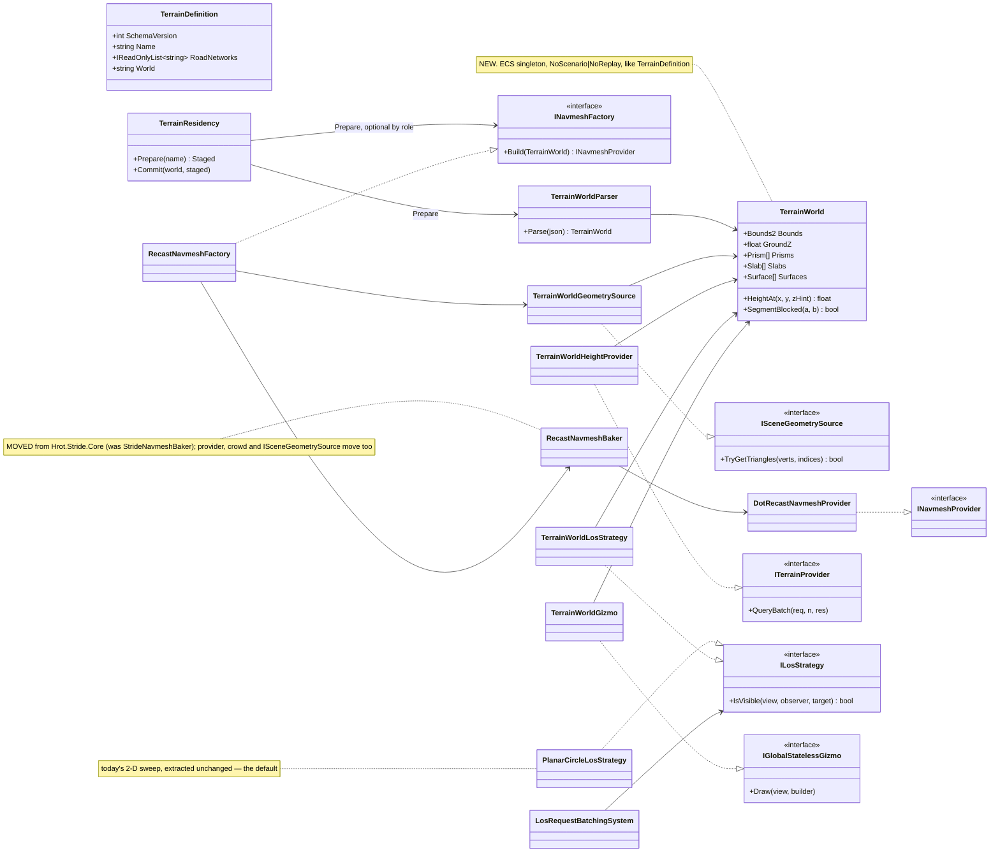
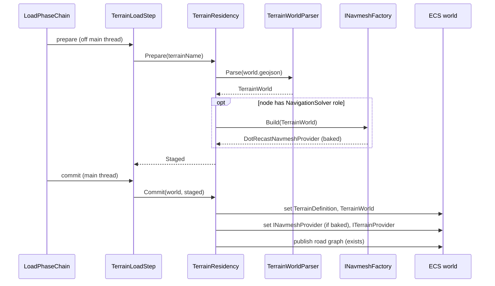
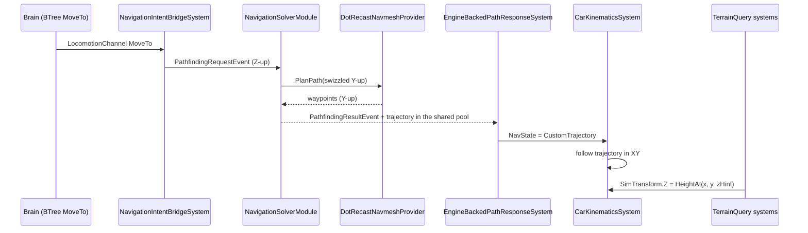
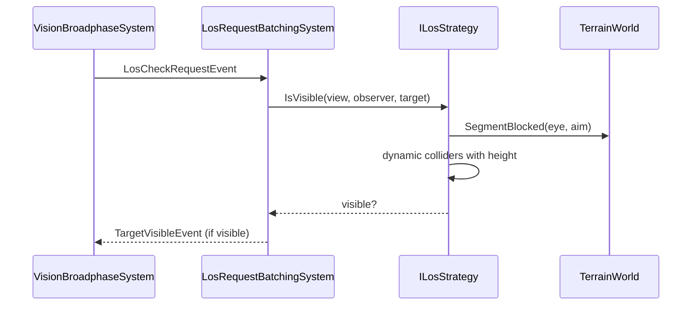
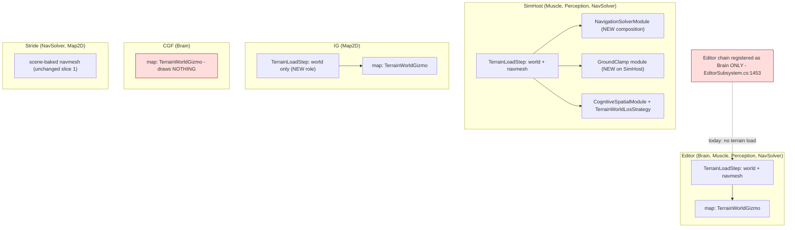

<!--STATUS
state: LIVE
build-state: DESIGN — the decisions are APPROVED (Q81 §0, R-181); §7 carries the design calls this doc adds, each with a lean, for the user's nod before READY-TO-BUILD.
updated: 2026-10-03
current-answer: §2 the file format, §3 the classes, §4 the sequences, §5 the module diagram (incl. the dead edges), §7 the open design calls, §8 the slice plan.
stale-below: nothing — new document.
known-rot: nothing yet.
known-conflict: docs/DESIGN_Cluster_Load_Phase.md §4.1a and Hrot.Core RoleLoadRequirements give terrain to MuscleGround + NavigationSolver only; §5 here adds Perception (Q81 T4) and Map2D (the map layer). That doc must be updated when slice step 1 lands.
related-designs:
  - docs/blueprints/Architect_Question_81_SimHost_Test_Terrain_World.md — the WHY and the approved decisions T1–T10; THIS doc is the WHAT.
  - docs/DESIGN_Terrain_Zones_And_Assets.md — owns WHAT a terrain asset is (named, JSON definition §2.1e), zones, and the asset build for static obstacles (§2.1c); this doc fills the content its §7 postponed.
  - docs/DESIGN_Cluster_Load_Phase.md — owns WHEN terrain loads and the role→load-part contract; §5 here extends the role list.
  - docs/DESIGN_Node_Roles_And_Policies.md — owns the role→data table (§3.2) that Perception and Map2D now join.
  - docs/designs/navig-2/Navigation_Design_v2_0.md — owns INavmeshProvider, per-layer navmesh and "the solver lives on the Muscle".
  - docs/DESIGN_Subsystem_Composition_Unification.md — owns CE-210 (the 3-D LOS seam, §4.1ab), which §3/§4.3 here builds, and B5 (role composition).
  - docs/DESIGN_Gizmo_Renderer_Seam.md — owns the gizmo builder→buffer→renderer seam the map layer draws through.
  - docs/DESIGN_Map_Rendering_And_Interaction.md — owns the map canvas and IMapLayer (the legacy path this doc does NOT use).
  - docs/DESIGN_Stride_Node_Modes.md — owns the Stride host's scene-baked navmesh (stays as it is in slice 1).
  - docs/designs/promote-to-3d/3D_Cognitive_Spatial_Awareness_Promotion_Design_v1_1.md — owns "SimTransform.Position.Z is authoritative".
-->

# DESIGN — **the terrain world** *(SimHost's test terrain: one file, one model, every query derived)*

> **The one rule:** a terrain is **one world file**, parsed into **one `TerrainWorld` model** per node; the navmesh,
> the ground height, line of sight and the 2D map drawing are **all derived from it** and cannot disagree.

## 1. INVENTORY — measured `2026-10-03` (graph CLI + grep; four sweeps, summarised)

| area | exists | ⛔ missing |
|---|---|---|
| terrain asset | `TerrainDefinition` (v1: `Name`, `RoadNetworks`), `TerrainDefinitionParser`, `TerrainResidency` (`Prepare`/`Commit`, `Hrot.Core/Services/TerrainResidency.cs:94,162`), `TerrainLoadStep`, role filter `RoleLoadRequirements.cs:54-59` | any geometry; no terrain file was ever authored |
| navmesh | `DotRecastNavmeshProvider`, `DotRecastDtCrowdProvider`, `StrideNavmeshBaker`, `ISceneGeometrySource` — ⭐ **no Stride type used** (namespace `Hrot.Stride.Core`, TFM net8.0-windows; DotRecast 2026.1.3 ships net8.0) | a headless home; a headless geometry source |
| solver | `NavigationSolverModule` / `PathfindingSolverSystem` (navmesh backend `:376`), `EngineBackedPathResponseSystem` writes `NavState.CustomTrajectory`, `CarKinematicsSystem` follows it | ⛔ composed on no host (`CE-3006`); 🔴 `:382` passes Z-up input to the Y-up `PlanPath` (`CE-3011`) |
| height | `ITerrainProvider.QueryBatch` + 4 `TerrainQuery*` systems; request carries `ReferenceSimZ` (a ready floor hint) | ⛔ no production provider; composed nowhere (`InstallGroundClamping` has no caller); batch capped at 64 |
| LOS | `LosRequestBatchingSystem` 2-D segment-vs-circle (`:94-131`), built by `CognitiveSpatialModule` on 3 hosts; `IRaycastBackend` (3-D, Z-up, never wired) | ⛔ the strategy seam (`CE-210` (b)); any eye height; collider height |
| map | gizmo seam: `IGlobalStatelessGizmo.Draw(view, builder)` registered by `[GizmoProjector]` reflection on **all five hosts** via `MapInteractionPack`; `IDebugDrawBuilder.DrawLine(LineStyle…)`, `DrawText` | ⛔ no filled-polygon primitive; `SimHostRoadLayer` reads a node-config file, never the terrain's roads |
| geometry utils | `PointInPolygon` ×2 (SimHost-internal, nav-fake private), `BoundingBox3D.IntersectsLine`, `Intersection2D.RaycastCircle` | no shared polygon library |

## 2. THE FILE — GeoJSON in local metres (✅ T2)

`{staging}/Terrain/<name>.json` (exists, schema **v2** adds `world`) → `<name>.world.geojson`:

```json
{ "schemaVersion": 2, "name": "test-town", "roadNetworks": ["roads.json"],
  "world": "test-town.world.geojson" }
```

```json
{ "type": "FeatureCollection",
  "hrot": { "schemaVersion": 1, "bounds": [0, 0, 400, 400], "groundZ": 0 },
  "features": [
    { "type": "Feature", "properties": { "kind": "building", "height": 12, "floors": 3 },
      "geometry": { "type": "Polygon", "coordinates": [[[100,100],[140,100],[140,130],[100,130],[100,100]]] } },
    { "type": "Feature", "properties": { "kind": "wall", "height": 2.5, "thickness": 0.4 },
      "geometry": { "type": "LineString", "coordinates": [[60,40],[60,90]] } },
    { "type": "Feature", "properties": { "kind": "surface", "surface": "forest" },
      "geometry": { "type": "Polygon", "coordinates": [[[200,200],[300,200],[300,300],[200,300],[200,200]]] } },
    { "type": "Feature", "properties": { "kind": "slab" },
      "geometry": { "type": "Polygon", "coordinates": [[[250,50,3],[290,50,3],[290,80,3],[250,80,3],[250,50,3]]] } },
    { "type": "Feature", "properties": { "kind": "ramp" },
      "geometry": { "type": "Polygon", "coordinates": [[[240,50,0],[250,50,3],[250,58,3],[240,58,0],[240,50,0]]] } }
  ] }
```

| `kind` | geometry | meaning | blocks move | blocks sight | walkable |
|---|---|---|---|---|---|
| `building` | Polygon | solid prism `baseZ`..`baseZ+height` (`floors` = label only in v1) | ✅ | ✅ | roof no |
| `wall` | LineString + `thickness` | thin prism | ✅ | ✅ | — |
| `surface` | Polygon | `road`/`open`/`forest`/`water`; cost + draw colour (water = unwalkable) | water only | `forest` partial — ⛔ v1: no | ✅ |
| `slab` | Polygon with Z | walkable floor at that Z (T7 — format v1, built later) | under/over | ✅ (from below/above) | ✅ |
| `ramp` | Polygon with per-vertex Z | sloped walkable link between levels | — | ✅ | ✅ |

⭐ Coordinates are the world's **local metres, X east / Y north / Z up** (FDP space). GeoJSON's lat/lon rule is
deliberately not followed (user: *"small numbers over large ones"*).

## 3. CLASSES



*What the picture shows that the prose hid:* **every consumer points at `TerrainWorld` and nothing points back** —
the model is a leaf, so a consumer can be added or removed without touching the others. ⭐ The only new
interfaces are `INavmeshFactory` (keeps DotRecast out of `Hrot.Core`) and `ILosStrategy` (`CE-210` (b)); the rest
is existing seams getting their first headless implementation.

| type | home | new / moved |
|---|---|---|
| `TerrainWorld`, `TerrainWorldParser`, `TerrainWorldHeightProvider`, `TerrainWorldLosStrategy`, `INavmeshFactory`, `ISceneGeometrySource`, `ILosStrategy`, `PlanarCircleLosStrategy` | `Fdp.Toolkits` (`Terrain/`, `Navigation/`, `Perception/`) | new (`ISceneGeometrySource` moved) |
| `RecastNavmeshBaker`, `DotRecastNavmeshProvider`, `DotRecastDtCrowdProvider`, `RecastNavmeshFactory`, `TerrainWorldGeometrySource` | **new `Fdp.Toolkits.Navigation.Recast`** (net8.0) — §7 W1 | moved + new |
| `TerrainWorldGizmo` | `Hrot.Presentation` (beside `TerrainZoneGizmo`) | new |

## 4. SEQUENCES

### 4.1 Load — the existing chain, more content



*What it shows:* the bake rides **`Prepare`**, whose contract is already "off-thread, no ECS mutation"
(`IClusterStateHandler`); the swap is one `Commit`. No new phase, no new op.

### 4.2 A move order — Brain to wheels



*What it shows:* everything left of the provider **already exists**; the slice adds the provider, composes the
solver, fixes the swizzle (`CE-3011`) and clamps Z.

### 4.3 Line of sight



*What it shows:* the system keeps its events; only the inner test moves behind a strategy. Eye = observer
`Position.Z + MountHeight`; aim = target `Position.Z + Height/2` (§7 W5).

## 5. MODULE RELATIONSHIPS — who loads, who registers, who ticks



*What the picture shows that the prose hid:* two **dead edges**. 🔴 The editor composes MuscleGround +
NavigationSolver (`EditorCapabilities.cs:60-61`) but registers its load chain with **`NodeRole.Brain` only**
(`EditorSubsystem.cs:1453`) ⇒ the editor's own vehicles never get terrain, and its map would draw nothing (`CE-3012`).
⚠ CGF is Brain-only, loads no terrain, and its map draws nothing — **acceptable** (CGF's map shows tactics, not
ground) unless you want the world there too (§7 W3).

| role | load part after this design | why |
|---|---|---|
| MuscleGround | world + road graph | height clamp, road kinematics |
| NavigationSolver | world + road graph + **navmesh bake** | the solver |
| Perception | **world** (NEW, ✅ T4) | LOS |
| Map2D | **world** (NEW) | the map layer |
| Brain | nothing (unchanged) | — |

## 6. WHY — what the diagrams cannot carry

- **Why one model and not per-consumer files:** navmesh, height and LOS built from separate sources diverge silently
  (a wall on the map that a unit walks through). One model makes that impossible by construction (`R-132`'s
  one-producer rule applied to geometry).
- **Why GeoJSON:** the only standard text format that carries polygons + lines + arbitrary properties + optional Z, is
  hand-authorable and viewable in common tools (geojson.io, QGIS). The local-metres deviation is the user's choice.
- **Why DotRecast and not the fake navmesh:** one implementation for SimHost and Stride (ruling 9); it handles agent
  radius/height/climb and stacked floors natively (T7), and the bake is already written and tested.
- **Why the strategy, not a new LOS system:** `CE-210` already designed it; the event flow and the debounce stay.
- **Why prisms are solid in v1:** enterable buildings need doors/stairs (indoor nav); garages cover multi-level
  through explicit slabs + ramps instead.

## 7. ⛔ OPEN — the design calls this document adds *(leans for the user's nod)*

| # | question | ⭐ lean | rejected (one fact each) |
|---|---|---|---|
| **W1** | home of the DotRecast code | **new `Fdp.Toolkits.Navigation.Recast` project** (net8.0); `Hrot.Stride.Core` and SimHost reference it; 5 of its 7 Stride tests move with it | into `Fdp.Toolkits`: DotRecast would ride into all 49 projects that reference it |
| **W2** | how the map draws the world | **`TerrainWorldGizmo : IGlobalStatelessGizmo`** on the gizmo seam ⇒ every host with a map, one class. **v1 = outlines** coloured by height band + a height/floors label; filled polygons as a separate UI-lane item (a new primitive is a wire-contract change) | `IMapLayer` like `SimHostRoadLayer`: SimHost-only legacy Raylib path |
| **W3** | which hosts draw it | every host that loads the world (SimHost, Editor, IG; CGF draws nothing — Brain loads no terrain) | load terrain on CGF too: a Brain-only node has no other reader |
| **W4** | the editor's load chain | **register it with the editor's composed role** (`DefaultRole`), not a literal `Brain` (`CE-3012`) | keep Brain-only: the editor's local muscle runs on no ground |
| **W5** | eye and target heights | `SensorCapabilitiesDto.MountHeight` (TKB, default 1.7 m infantry / from vehicle height) + **`PhysicsCollider.Height`** filled by the same translators that set `Radius` | a service-wide 1.5 m constant: exactly what `CE-210` forbids |
| **W6** | solver composition on SimHost | NavigationSolver capability composes **`NavigationSolverModule` with the factory's provider and the shared pool**; `EngineBackedNavigationModule.RegisterProviders` stops throwing when a provider exists (it keeps the response system) | a second solver module: two producers of `PathfindingResultEvent` |
| **W7** | the coordinate bug | swizzle in `PathfindingSolverSystem.SolveNavmesh` (Z-up → Y-up) (`CE-3011`) | swizzle inside the provider: Stride callers already pass Y-up |
| **W8** | ground clamp on SimHost | one shared `GroundClampingModule` (the `IgGroundClampingModule` body, moved to `Fdp.Toolkits`) with `TerrainWorldHeightProvider`; raise the batch cap from 64 to the entity count | IG-only clamp: SimHost stays flat |
| **W9** | grid extents | perception grid and collider grid sized from `TerrainWorld.Bounds` (+ margin) at commit | fixed constants: entities silently invisible outside them |
| **W10** | infantry on SimHost | v1 follows the trajectory on the existing bicycle model (they carry `VehicleState` on SimHost); DotRecast crowd for infantry later | crowd in slice 1: a second motion model to bring up at once |

## 8. SLICE 1 (✅ Q81: steps 1–3 + the map layer)

| step | builds | acceptance |
|---|---|---|
| **1a** | `TerrainWorld` + parser + definition v2 + `TerrainWorldHeightProvider` + role parts (§5) + `CE-3012` | a hand-written `test-town` loads on SimHost, Editor, IG; `HeightAt` rails incl. a slab with a Z hint |
| **1b** | `TerrainWorldGizmo` (outlines, height colour, labels) | the world draws on the Editor, SimHost and IG maps |
| **2** | the Recast project (move), `TerrainWorldGeometrySource`, factory, solver composition, `CE-3011` swizzle, ground clamp | a CGF tank given MoveTo drives **around** a building to the goal (`NavState = CustomTrajectory`), Z follows a ramp; closes `CE-3006`, unblocks `CE-524` |
| **3** | `ILosStrategy` seam (default = today's sweep, unchanged), `TerrainWorldLosStrategy`, `MountHeight`, `PhysicsCollider.Height` | a soldier behind a 12 m building does not see a target; one behind a 0.5 m wall does |

⚠ Each step names its feature suites first (T-1): `TerrainLoadStepTests`, `TerrainDefinitionTests`,
`PathfindingSolverSystemTests`, `NavmeshWalkIntegrationTests` (after the move), the perception suites, and the
cluster integration rail for nav (row 8).
