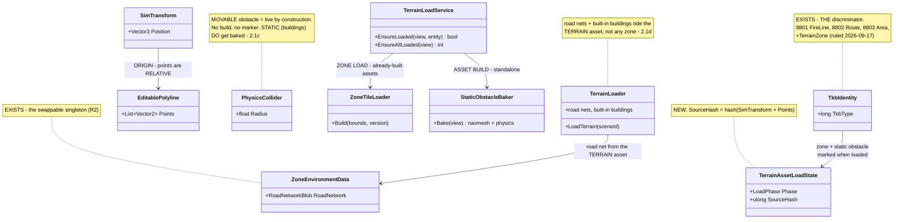
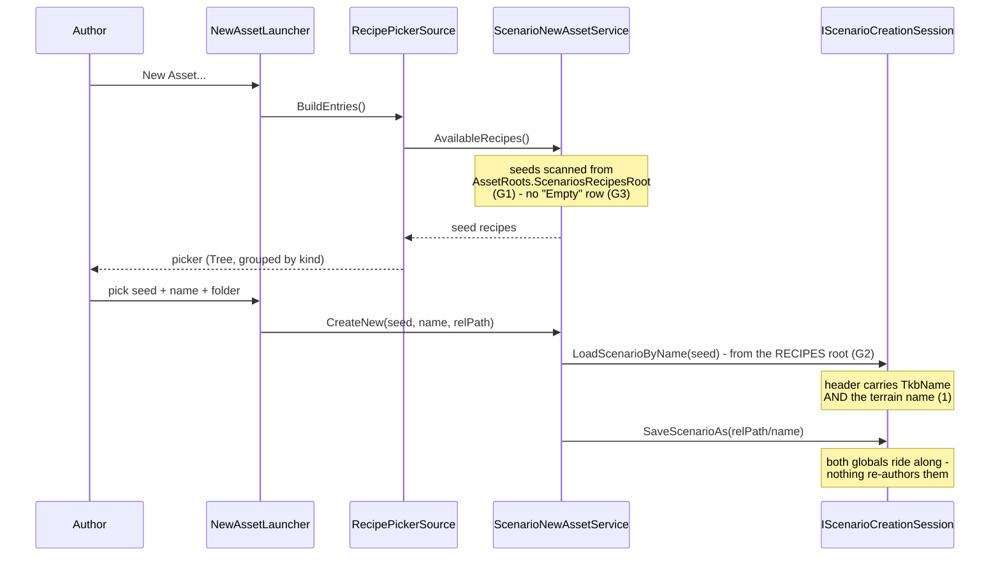
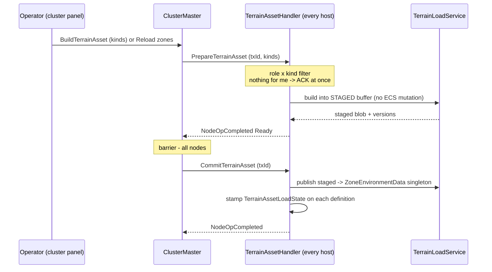
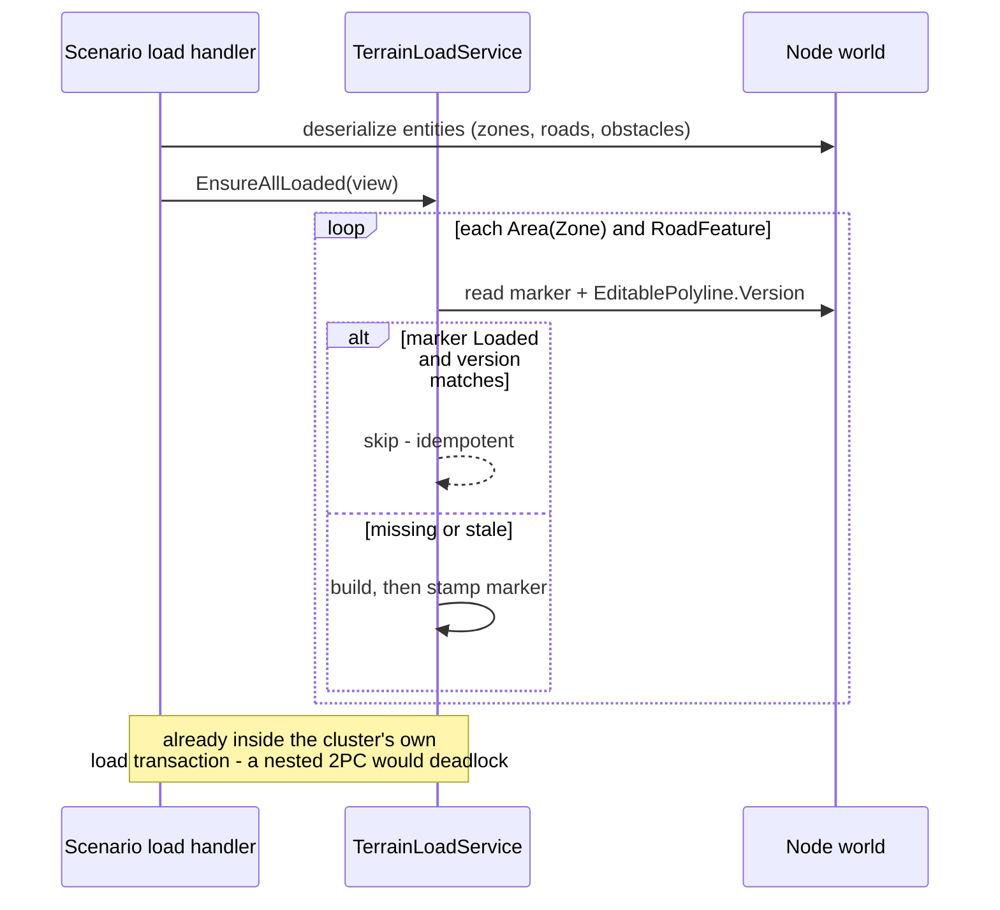
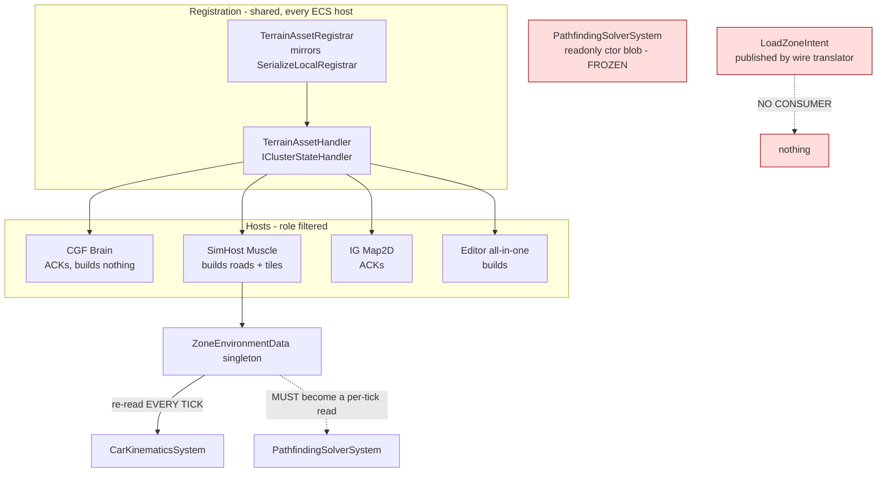

<!--STATUS
state: LIVE
build-state: ✅ **READY-TO-BUILD `2026-09-17`** — §8 (host heterogeneity) is RULED: no capability is
  announced, because with static terrain the zone-load postcondition is genuinely met (§8.3). §9 (the UI)
  is ruled through U1–U4 + §9.5–§9.8, and U1's last unmeasured assumption is closed — gizmos read any
  component and `DrawLine` takes a `LineStyle`. ⚠ HISTORY: this was marked READY-TO-BUILD once before and
  DOWNGRADED on `2026-09-17` when the user found the heterogeneity hole — the module diagram showed WHO
  runs the loader and never asked whether they run the SAME ONE. ⛔ Tiles remain FAKED by ruling (§6/§7);
  that is scope, not an open question.
updated: 2026-09-17
current-answer: §2 is the model, §3 the two invocation paths, §4 what is registered and ticked where
  (incl. the two DEAD edges), §5 the WHY, §6 what is real vs faked in slice 1.
stale-below: nothing — new document.
known-rot: nothing yet.
known-conflict: none. This document REPLACES the zone half of docs/designs/packs-3/DESIGN.md
  (§2.B/§2.C/§2.E), which is already marked superseded there.
related-designs:
  - docs/blueprints/PLAN_Terrain_Zones_Build.md — the BUILD BREAKDOWN of this design (stages A-G,
    success conditions, and the UNDER-SPECIFIED register). It references these chapters; it restates none.
  - docs/designs/routes-1/ROUTES1-DESIGN.md — ⭐ OWNS THE ROUTE MODEL (§5 shared vs personal routes,
    §5.1 directing a vehicle to follow one, §16 the as-built persistence gap). Routes are NOT terrain
    assets and NOT the road network — §2.1a here defers to it rather than restating it.
  - docs/blueprints/Architect_Question_71_Terrain_Zones_And_The_Asset_Build.md — the WHY and the
    decision record (§5 ruling, §6 gaps). THIS doc is the WHAT; that one is why it is shaped so.
  - docs/designs/mgmt-1/DESIGN.md — §11 owns the PrepareZone/CommitZone 2PC protocol and ZoneSpec;
    this doc owns the AUTHORING model and the entity→asset build that §11 never covered.
  - docs/designs/packs-3/DESIGN.md — SUPERSEDED zone half; still owns the ACL/network-DRY work.
  - docs/DESIGN_Distributed_Scenario_Persistence.md — owns which file entities ride in and the
    ownership save gate; zone/road/obstacle entities pass through that gate like any other.
  - docs/designs/navig-2/Navigation_Design_v2_0.md — owns per-layer navmesh bake parameters and the
    INavmeshProvider seam; §6 here must not contradict its bake model.
  - docs/DESIGN_Node_Roles_And_Policies.md — owns which role consumes terrain data (MuscleGround,
    Perception, NavigationSolver); §4 here role-filters on exactly that.
  - docs/blueprints/Architect_Question_57_Cgf_Authoring_Packaging.md — owns the RECIPE/CREATE registry
    (INewAssetService, RecipePickerSource, GET /assets/recipes). §2.1e ⑤ reuses it and adds nothing.
  - docs/DESIGN_Cgf_Asset_Picker_Shell_Slice.md — owns the New-Asset PICKER SHELL composed on both
    hosts (NewAssetLauncher, AssetCreateController). §2.1e ⑤ is content for that shell, not a new one.
  - docs/designs/tkb-1/DESIGN.md — owns how a node RESOLVES and loads its TKB from the scenario header
    (§7.3). §2.1e ⑤ owns how that header field is first ACQUIRED, which tkb-1 never covered.
-->

# DESIGN — **Terrain, zones and the asset build**

> **The one rule:** the **ENTITY IS THE DEFINITION**; an asset is **cached, reconstructable data**
> derived from it. There is no artefact that can disagree with the world.

## 1. INVENTORY — measured `2026-09-16`/`17` (graph + grep; `check_index_coverage` not run)

| # | exists already | where |
|---|---|---|
| ① | `EditablePolyline` — points **+ a `Version` counter** documented *"so subscribers can detect stale cached copies"* | `Hrot.Core/Components/Map/EditablePolyline.cs` |
| ② | ⭐⭐ **`RoadNetworkBuilder`** — *"Builder for constructing RoadNetworkBlob from components"*: `AddNode` / `AddSegment` / `Build`. ⭐ **It HAS a production caller** — `RoadNetworkLoader.cs:38` — so this is a proven path, not test-only scaffolding | `FDP/.../CarKinem/Road/RoadNetworkBuilder.cs` |
| ③ | `RoadNetworkBlob` (NativeArrays + a broadphase grid), `ZoneEnvironmentData` singleton | `FDP/.../CarKinem/Road/`, `FDP/.../CarKinem/` |
| ④ | the 2PC seam: `PrepareAsync` *(must not mutate ECS)* / `Commit` *(main thread)* / `Abort` | `FDP/.../Orchestration/IClusterStateHandler.cs` |
| ⑤ | the barrier — waits for **all** nodes' `NodeOpCompletedEvent` | `ClusterMaster.cs:1242-1254` |
| ⑥ | `NodeOpType.PrepareZone=7 / CommitZone=8` reserved on the wire in **two** enums | `NodeOpType.cs:15-16`, `OrchestrationMessages.cs:53-54` |
| ⑦ | `ClusterOpType.LoadZone=3` + a real wire arm publishing `LoadZoneIntent` | `ClusterOpMasterTranslator.cs:238-241` |
| ⑧ | shared cross-host registration precedent | `SerializeLocalRegistrar` (`CE-279`) |
| # | **does NOT exist** | |
| ⑨ | any entity→asset compile; any `CmdSwapZone`; any consumer of `LoadZoneIntent`; any zone control in the cluster panel | measured absences |
| ⑩ | any load-state marker component — graph returned only unrelated editor test classes | ⇒ new component, not a missed seam |

---

## 2. THE MODEL



*What the picture shows that the prose hid:* **the two paths never meet.** Zone load consumes
already-built assets; the asset build is a standalone producer (§2.1b) — the only link is that a zone
load *may* trigger a build, never the reverse. ⭐ And **exactly ONE new component** exists: the load
marker. **Discrimination rides `TkbIdentity`**, which was already there.
⛔ **No road box appears** — routes are `RoutePlan`, the road network is an external asset (§2.1a).

| new type | why it is new |
|---|---|
| `TerrainAssetLoadState { LoadPhase Phase, ulong SourceHash }` | ⭐ `[DataPolicy(NoScenario \| NoReplay)]`, node-local, never replicated (§9.1). **Not** a bare tag — streaming has an in-flight state and loads can fail. ⚠ Named `Terrain…` on purpose: a bare `AssetLoadState` collides with the editor's existing BTree/HSM asset-load-state concepts |
| ONE new **`TkbType`** *(not a component)* | 🔒 **`TerrainZone`** — ruled `2026-09-17`, deliberately **not** `TacGraphic_*` since a zone is a load directive that happens to be drawn. ⛔ **No road value** (§2.1a) and ⛔ **no static-obstacle value yet** (§2.1c) |

### 2.1 ✅ RULED `2026-09-17` — **`TkbType` is the ONE discriminator; `AreaType` is SUPERSEDED**

> 🔒 **User:** *"own TkbType for zones approved. prev ruling 'Areas carry an area type field' was wrong,
> now superseded with the TkbType differentiation."*

⛔⛔ **`Area { AreaType Type }` is DELETED from this design.** 📐 `TkbIdentity.TkbType` is *already* the
"what kind of thing is this" axis — `8801 TacGraphic_FireLine`, `8802 TacGraphic_Route`, `8803
TacGraphic_Area` — and it **already selects the gizmo** (`TacticalAreaGizmo` filters on it). ⇒ an
`AreaType` field would have been a **second discriminator for one distinction**, forcing every consumer
of `8803` that does not care about zones (symbology, ORBAT, templates) to branch on it.

⭐ **Extended to the STATIC-vs-MOVABLE OBSTACLE split** (§2.1c) by the same logic. ⛔ **The road
extension is RETRACTED** — see §2.1a. ⚠ All new values are placeholders: **naming and numbering are the
user's**, and `R-42` applies — these ids reach replays and saved scenarios, so **deprecate, never
recycle**.

### 2.1a ⛔ RETRACTED `2026-09-17` — **there are no "road entities"; I invented them**

> 🔒 **User:** *"I do not think we need to be able to actually edit the road network and store its parts
> as entities. What we want to store as entity are those waypoint based routes (not equal to roads in
> road net — these are an asset which is NOT authored in the editor, comes from outside (like sumo road
> net), and is just rendered using some map gizmo)… And what we called 'road entities' were actually
> just the 'routes'."*

📐 **Measured, and the split already exists in production:**

| concern | what it actually is | authored? |
|---|---|---|
| **ROUTE** | `TkbType 8802 TacGraphic_Route` + **`RoutePlan { Waypoints }`** — `RouteWaypoint { Vector3 Position (ABSOLUTE), float TargetSpeed, string? ExtensionJson }` | ⭐ **yes, at runtime** — `CmdAppendPersonalWaypoint` → `PersonalRouteAuthoringSystem` spawns a **vehicle-owned child** seeded with 2 waypoints and appends after |
| route → drivable | `RouteTrajectorySyncSystem` → `_pool.RegisterTrajectory(positions, speeds, looped, **CatmullRom**)` | ⛔ **no road/lane geometry is involved at all** — positions + speeds only |
| **ROAD NETWORK** | an **external asset file** (SUMO-like) → `RoadNetworkLoader` → `RoadNetworkBlob`; rendered by `SimHostRoadLayer`; consumed by `PathfindingSolverSystem`/`CarKinematicsSystem` | ⛔ **never authored in the editor** |
| **AREA / overlay** | `EditablePolyline { Points }` (RELATIVE) + `MapOverlayStyle` | ⭐ yes — `ActivateAreaEditingTool`, `AreaQuerySolverSystem` |

⇒ ⛔ **`RoadProperties`, `TkbType 8805 road` and `RoadNetworkCompiler` are DELETED.** Lane width and
lane count belong to **road-network segments**, which arrive in the file; a route is a waypoint list and
needs none of them. ⭐ Per-waypoint `TargetSpeed` already exists and is finer-grained than the per-entity
`SpeedLimit` I had proposed.
⭐ **And the Catmull-Rom ruling was already shipped one layer over** — `RegisterTrajectory` uses it for
routes today, so the convention was consistent before it was proposed.

📄 **The route model is OWNED BY [`ROUTES1-DESIGN.md`](designs/routes-1/ROUTES1-DESIGN.md) §5** — shared routes (a root entity multiple vehicles follow) and personal routes (a vehicle-owned child) are specified there, and are deliberately NOT restated here.

⭐⭐ **`EditablePolyline` is for AREAS; `RoutePlan` is for ROUTES — do not unify them.** 🔒 *"they are
semantically too different."* 📐 Production already honours this: IG authors routes via
`CreateRouteEntityAsync(TacGraphic_Route, waypoints, …)`, never via `EditablePolyline`.
⚠⚠ **And the RELATIVE ruling (§2.2) is scoped to `EditablePolyline` ONLY.** `RouteWaypoint.Position` is
documented *"absolute Cartesian world-space (ENU)"* and **must stay absolute**: a route entity is a
CHILD OF THE VEHICLE, so relative waypoints would drag the whole route when the vehicle moved.

### 2.1b ✅ RULED — **ZONE PREPARATION and ASSET BUILD are different in nature, and stay separate ops**

> 🔒 **User:** *"zone == loading assets that were already built. Zone load might trigger asset build if
> zone is known to require certain asset which is just defined but not yet built, but **defining a new
> asset which is not yet built should not invalidate the zone**; the asset build stays like standalone
> step which does not depend on zones."*

⛔ **This REJECTS the lean to collapse the two op pairs.** The dependency is **ONE-WAY**:

```
asset build  ── standalone, never depends on a zone
     ▲
     │ (zone load MAY trigger a build for an asset it needs that is defined-but-unbuilt)
     │
zone load   ── loads assets that are ALREADY BUILT
```

⭐⭐ **The asymmetry is the whole point:** a zone is invalidated by **its own footprint changing**
(§9.7), ⛔ **never by a new asset being defined.** Collapsing the ops would have coupled those
lifecycles and made every new building definition dirty every zone.

### 2.1c ⚠ R1 NARROWED — **not all obstacles are live-by-construction**

> 🔒 **User:** *"Imagine buildings. They are certainly not runtime dynamic. So some obstacle entities
> are movable at runtime, some are not and building might need baking them into navmesh and physics
> world etc. That leads to different types of obstacle entities — different TkbType preferably."*

⛔ **`R1` said "obstacles are EXCLUDED from the load model." That is true only of the MOVABLE kind**, and
is now narrowed:

| obstacle kind | build? | marker? |
|---|---|---|
| ⭐ **movable / runtime** *(the measured case: `PhysicsCollider` read straight off broadphase candidates ⇒ occludes LOS the instant it exists)* | ⛔ none | ⛔ none |
| ⭐⭐ **static / bakeable** *(buildings)* — baked into navmesh + physics world | ✅ **yes — a real asset build** | ✅ yes |

⇒ ⭐ **distinguished by `TkbType`**, consistent with §2.1. ⚠⚠ **And this rescues the asset build from
being vacuous:** the prior draft concluded *"the only remaining terrain asset is tiles, which are
faked."* 🔒 The user's correction: *"the fact we do not have any buildable assets now does not mean they
will not exist."* ⇒ **the op pair is designed for buildings even though slice 1 builds none.**

### 2.1d ⭐ TERRAIN-ASSOCIATED ASSETS — the road-network manager and terrain loader

> 🔒 **User:** *"Maybe even the road network should be an entity, keeping reference to the road network
> asset file… Just road nets are usually a property of the terrain asset, so picking a concrete terrain
> denotes loading of associated road networks. Same for buildings — some are user placeable, most are
> part of existing terrain asset. There should be some kind of road network manager and terrain loader
> dealing with these."*

⭐⭐ **RULED `2026-09-17`: terrain is a SINGLETON CONCEPT, not an ordinary entity** — 🔒 *"it is by design a singleton concept and a special one already being handled in a special way (or should be — loading various assets etc). Scenario persistence for such special singleton is not a problem."* ⚠ This does **not** reopen the retired `Zones` section: that was a **content bundle duplicating entity data**, whereas terrain is a **global fact** in the same class as `$meta` and `Header.TkbName` (§6a keeps those as globals). ⭐ **Lean: terrain-association is the DEFAULT; the entity-reference is the EXTENSION POINT.** Selecting a
terrain (`SceneId`, §1 ⑦) implies loading its associated road networks and its built-in buildings; an
**entity holding a reference to a road-net asset file** is how a user-*selected* road network would be
expressed, and is worth building **only when that selection requirement appears**. ⛔ Building the
selection mechanism first would add a scenario-level declaration the user explicitly wants to avoid.

⚠ **This answers a question the `Zones`-section retirement would otherwise strand:** today the road
network is loaded by `ZoneManagerService.LoadZones` from the zone's `RoadNetworkPath` — a property being
retired. ⇒ **the terrain loader takes that job**, keyed off the terrain, not off any zone.

### 2.1e ⭐⭐⭐ TERRAIN HANDLING — where it lives, when it loads, who runs it, where the name comes from

#### ① In the SCENARIO — **a NAME, and nothing else**

> 🔒 **User, `2026-09-17`:** *"Terrain is an asset that is referenced **by name** (with optional subfolder
> path) from a scenario, **nothing more needed in scenario**. Route network assets to load etc are
> **internal data of the terrain** that might be useful in memory but **not in scenario**. So terrain
> asset needs **its own definition file (json)** processed by the loader."*

⛔⛔ **A prior draft put "identity + asset references" in the scenario. RETRACTED** — the scenario carries
**only the terrain name** (+ an optional subfolder path). Road networks, terrain DB, buildings and
everything else are **inside the terrain asset**, never in the scenario.

⭐⭐⭐ **This is EXACTLY what `Header.TkbName` already is** — a *name* that resolves to an artifact, with
the artifact's contents living in the artifact. ⇒ terrain sits beside it, same block, same shape.

#### ①a The TERRAIN DEFINITION FILE — a new asset format

A JSON asset, resolved from the name, listing what the terrain provides: its road network(s) first, and
later its terrain DB / heightmap / navmesh / built-in buildings. ⛔ **It is authored and shipped as an
asset, not edited in the scenario editor** (§2.1a's road-network rule applies to it).

#### ② In HOST MEMORY — an ECS singleton holding the PARSED definition

⭐ The singleton holds the parsed definition plus handles to whatever it loaded. ⛔ **None of that is
persisted** — it is re-derived from the named asset on every load, so it cannot disagree with the asset.
⭐ It joins `ZoneEnvironmentData` and the singleton-managed `INavmeshProvider`, which are already ECS
singletons.

#### ②a ⭐⭐⭐ THE WHOLE PATTERN ALREADY EXISTS — mirror `TkbLoadClusterStateHandler` FIELD FOR FIELD

📐 Measured — it is not merely a similar shape, it is the same problem already solved:

| `TkbLoadClusterStateHandler` (exists) | the terrain loader (to build) |
|---|---|
| reads **`TkbName` from the locally staged scenario header** | reads the **terrain name** from the same header |
| intercepts **`PrepareLive` / `PrepareEdit`** | the same node ops |
| loads the TKB artifact **from the node's local staging area** | loads the terrain definition JSON from the same staging area |
| *"before the scenario is deserialized"* | the same ordering, for the same reason |
| populates **`ITkbDatabase`** | populates the terrain singleton + whatever the definition declares |
| ⭐ **differential cache keyed on `(TkbName, file timestamp)`** to skip re-ingestion | ⭐ the same key ⇒ **idempotency for free**, no new mechanism |
| graceful fallback when the header carries no name | the same — a scenario with no terrain is legal |

⇒ ⭐⭐ **the terrain loader is `TkbLoadClusterStateHandler` with a different artifact.** ⛔ Do not design
resolution, caching or ordering from scratch — all three are already answered there.

#### ③ WHEN — inside the cluster state machine's LOADING states

📐 `ClusterState` = `LoadingEdit(10) → OperatingEdit(11)`, `LoadingPreview(20)`, `LoadingLive(30)`,
`LoadingReplay(40)` (+ their `Unloading*`). ⇒ ⭐ **terrain loads in the `Loading*` states, BEFORE entities
are materialised** — entities depend on it (ground clamping, physics, LOS).
⭐ `mgmt-1` already states this intent: the cluster transitions into `LoadingEdit` *"to load static assets
(base terrain, …)"*.

⭐⭐ **The shape to copy is `TkbLoadClusterStateHandler`** — an existing handler registered **before** the
scenario handler precisely so a prerequisite is populated first *(its own comment: "to populate
ITkbDatabase **before** `HrotScenarioLoadHandler` deserializes entities")*. ⇒ **the terrain loader is the
same pattern with a different prerequisite.** ⛔ Do not invent a new ordering mechanism.

#### ④ WHO — ⛔⛔ **it must NOT ride the scenario-load handler**

🔴 **MEASURED TRAP.** `NodeBootstrapper.cs:316-318` registers SimHost's scenario LOAD handlers **inside a
conditional**, with the comment: *"Scenario/episode LOAD handlers need the full authoring deps
(extractor/source/id-allocator). **A muscle node that only replicates (and passes none) gets SAVE without
LOAD — no throw.**"*

⇒ ⛔⛔ **a pure MuscleGround node may have NO scenario-load handler at all** — and the muscle is precisely
the role that consumes terrain (road network → `CarKinematicsSystem`; obstacles → physics/LOS). Hanging
the terrain loader off that handler would leave terrain **unloaded on the node that needs it most** —
the *"unreachable on host X"* failure this codebase produces more than any other (`①a`).

⭐ **The correct pattern is in the same file, four lines below:** the SAVE handler is *built* inside the
conditional but **registered unconditionally** via `SerializeLocalRegistrar.Register(...)`. ⇒ **the
terrain loader registers unconditionally on every ECS host**, exactly like the save handler and like
`TkbLoadClusterStateHandler`. ⚠ A host with nothing to load still ACKs (§8.3).

#### ⑤ ⭐⭐⭐ WHERE THE NAME COMES FROM AT AUTHORING TIME — **a SEED SCENARIO used as a RECIPE**

> 🔒 **User, `2026-09-17`:** *"The new scenario path might need a **picker** and a **'recipe' asset** to
> build new scenario content from; that recipe might contain **predefined terrain name and tkb name**."*

⭐⭐⭐ **①–④ answer how the name is CONSUMED. This answers how it is ACQUIRED — and the mechanism already
exists, under-adopted** *(the seam law: the 25th measured instance)*.

##### ⑤a 📐 THE INVENTORY — what already ships *(measured `2026-09-17`, `search_graph` + grep agree)*

| the piece | where | state |
|---|---|---|
| per-kind recipe seam — `CreateNew(recipe, name, relPath)` · `AvailableRecipes()` · `IsBlankTemplate(r)` | `Hrot.Editor.AiShared/Recipes/INewAssetService.cs` | ✅ **shared, shipped** |
| recipe → picker projection | `AiShared/Browser/RecipePickerSource.cs` | ✅ shipped |
| the picker launcher + the create dialog | `AiShared/Browser/NewAssetLauncher.cs` · `AiShared/Recipes/NewAssetDialog.cs` | ✅ shipped |
| recipe-by-NAME resolve *(for `POST /assets`)* | `AiShared/Recipes/RecipeByName.cs` | ✅ shipped |
| composed **on both hosts** | `EditorSubsystem.cs:3850-3863` · `CgfSubsystem.cs:2213-2219` | ✅ production |
| ⭐ **a SCENARIO implementation, with a seed branch** | `Hrot.Editor/ScenarioNewAssetService.cs` | ✅ **`FromSeed` = `LoadScenarioByName(recipe.Name)` → `SaveScenarioAs(full)`** |
| ⭐ **a declared `Recipes/Scenarios` root** | `AssetRoots.ScenariosRecipesRoot` | ✅ declared *(§16: "**Recipes/** — creation sources: Blueprints, HSMs, BTrees, **Scenarios**")* |
| the disk-recipe precedent | `BlueprintNewAssetService.AvailableRecipes()` + `BlueprintEditorBootstrap.DiscoverRecipes()` | ✅ 21 recipes ship this way |

⇒ ⭐⭐ **Nothing in the picker/recipe layer needs designing.** 📄 `Architect_Question_57` already ruled it:
*"recipe DISCOVERY already exists … ⛔ do NOT build a new `NewAssetRegistry`."*

##### ⑤b ⭐⭐⭐ THE RULING — **the recipe IS a scenario file; it is not a new asset kind**

⭐⭐⭐ **A scenario recipe is an ordinary scenario stored under `Recipes/Scenarios/`.** Its header already
carries `TkbName`, and by **①** it carries the terrain name too ⇒ *"predefined terrain + TKB"* needs **no
new field, no new format and no new asset vocabulary** — the `FromSeed` branch loads the seed and saves it
under the new name, **header and all**.

⛔ **Rejected: a dedicated recipe asset declaring `{terrain, tkb}`.** `Q57` rules against new registries
and vocabulary, and a seed scenario is a **strict superset** — it can also ship starting entities, zones
and routes, which a declaration cannot. ⚠ The same argument retires *"add terrain/TKB combo boxes to the
dialog"*: `NewAssetDialog` is deliberately kind-agnostic, and per-kind fields would restate what the
seed's own header already says.

##### ⑤c 🔴 THE THREE MEASURED GAPS — why it does not work today

| # | measured | consequence |
|---|---|---|
| **G1** | `EditorSubsystem.cs:3862` constructs `ScenarioNewAssetService(adapter)` — the **1-arg** ctor. The seed-discovering **2-arg** ctor has **zero** production callers, and `AssetRoots.ScenariosRecipesRoot` is referenced **only by tests** | ⛔ the Scenario kind offers exactly **one** recipe, `"Empty"`. ⚠ This is the **silent-default** shape — the caller had the value *(the root is a static property)* and did not pass it |
| **G2** | `FromSeed` calls `IScenarioCreationSession.LoadScenarioByName`, whose contract is *"loads a scenario by name **from the scenarios root**"* | ⛔ a seed living in `Recipes/Scenarios` would **not be found** even once G1 is fixed. The load must be recipe-root-aware |
| **G3** | `Header.TkbName` is stamped at save from `ITkbDatabase.ActiveTkbName` *(`HrotScenarioSaveHandler.cs:103`, `ScenarioFileService.cs:108`)*, and `ActiveTkbName` has **exactly ONE writer** — `TkbLoadClusterStateHandler.cs:75/109`, **reading it back out of the staged scenario header** | 🔴 **the `"Empty"` path has no way to acquire a TKB at all.** A brand-new scenario inherits the last cluster load's TKB — or `null`, and `ScenarioSerializer.cs:199` then **omits the whole `Header`**. ⚠ With ① the identical hole opens for the terrain name |

⛔⛔ **G3 is why `"Empty"` must go for this kind, not merely be deprioritised** — it is the only path that
can mint a scenario with **no terrain and no TKB**, and the save pipeline records that silently.
⭐⭐ **Making a recipe MANDATORY for Scenario is already a designed-for case**, in `RecipeByName`'s own
words: *"⚠ A kind that offers no blank template is legitimate."* ⇒ override `IsBlankTemplate => false`.
⛔ **Do NOT fix G3 by writing `ActiveTkbName` from the editor** — that adds a second writer to a field with
exactly one, and the cluster re-derives it from the staged header at load regardless (②a).

##### ⑤d SEQUENCE — **New Scenario from a recipe** *(the authoring counterpart to §3's two runtime paths)*



⭐ **What the picture shows that the prose hid:** the terrain and TKB names are never *chosen* anywhere in
this path — **they are carried**, because load-then-save-as copies the header. ⇒ the whole feature is the
three gap fixes; ⛔ there is no "terrain selection UI" to build.

### 2.2 ✅ RULED `2026-09-17` — **RELATIVE COORDINATES EVERYWHERE**

> 🔒 **User:** *"I would like to unify the absolute-vs-relative-vertex-coords convention. The more
> unified the editing/storage/persistence/transport is, the better."*

⭐⭐⭐ **`EditablePolyline.Points` are RELATIVE offsets from the entity's `SimTransform`. One convention,
no exceptions, every entity family.**

📐 **Measured — relative is already the convention on every surface but one:**

| surface | today |
|---|---|
| storage *(shipped assets)* | ✅ relative — `hill-attack` entity `5525100c`: origin `[670, 473.5]`, points `(-53,-88.5)` |
| transport | ✅ relative, explicitly — `MapVisualOverlayEgressTranslator.cs:90` |
| editing | ✅ relative — `VertexEditGizmo` works absolute internally and converts back with `p - _originOffset` (`:223-227`) |
| `MapOverlayGizmo` | ✅ relative — `origin + Points` |
| ⛔ `TacticalAreaGizmo` | 🔴 **claims absolute — the ONE dissenter, and it is WRONG** |

⇒ ⭐ **unifying on relative costs one gizmo fix and ZERO data migration.** Unifying on absolute would
mean rewriting every stored asset *and* both translators, and would make `SimTransform` either a lie or
redundant on these entities. ⭐ Relative also keeps **"move" as a single transform write** — the same
gesture every other entity uses and the network already replicates.
🔴 **Live consequence being fixed:** both gizmos match entity `5525100c` and `GizmoReflectionRegistrar`
registers every projector, so that area currently **renders twice, ~820 m apart**, with picking off by
the same amount. 📄 **`BP-517`.**
⇒ ⭐⭐ **And this is why the staleness key must include the transform**: with relative points, a MOVE
changes only `SimTransform` — `hash(SimTransform ⊕ Points)` (§9.7 ③c) is the only key that sees it.

---

## 3. THE TWO INVOCATION PATHS — one implementation

### 3.1 Runtime — operator-driven, via the 2PC round



### 3.2 Scenario load — the same service, called locally, **no NodeOp**



*What these show that prose hid:* the **same `TerrainLoadService` is the only implementation**; the
2PC round is an *invocation wrapper* the scenario path deliberately does not use. The idempotency
check is the identical branch on both paths, so "reload" and "load on scenario open" cannot drift.

---

## 4. MODULE RELATIONSHIPS — who registers it, who runs it, what is DEAD



⛔ **The two red boxes are MEASURED DEAD/BROKEN EDGES, and they are why this diagram exists:**

1. **`LoadZoneIntent` has no consumer** — the wire translator publishes it (`ClusterOpMasterTranslator.cs:238-241`)
   and nothing reads it, while its own doc comment at `ClusterOpIntents.cs:133` claims *"Consumed by
   `ClusterMaster`"*. The comment is false and must be corrected whichever way this builds.
2. 🔴 **`PathfindingSolverSystem` holds `readonly RoadNetworkBlob _roadNetwork`, assigned once in its
   constructor** (`:32`, `:63`). ⇒ **a commit-time pointer swap reaches `CarKinematicsSystem` and
   silently does nothing for pathfinding.** `NavigationSolverModule` and `EngineBackedNavigationModule`
   have the same shape. **R2 is therefore a precondition, not a cleanup.**

---

## 5. WHY — the rationale the diagrams cannot carry

### 5.1 Why there is no zone artefact
An artefact is a second place the truth can live, and the moment it exists it can disagree with the
world (`R-132`, two producers for one slot). Making the entity the definition and the asset a
**cache** removes the failure mode by construction: a cache that disagrees is simply *stale*, and
staleness is detectable (§5.3) where disagreement is not.

### 5.2 Why only MOVABLE obstacles are excluded (R1, narrowed — §2.1c)
Measured: `RaycastSolverSystem.cs:145-147` reads `PhysicsCollider` straight off broadphase candidates
and `LosRequestBatchingSystem` queries by its component id ⇒ **an obstacle occludes LOS the instant
the entity exists.** There is nothing to cache, so a marker on an obstacle would always read `Loaded`
and mean nothing. ⛔ A vacuous state field is worse than none — it invites code to branch on it.
⚠⚠ **NARROWED `2026-09-17` (§2.1c): this argument holds for MOVABLE obstacles only.** A STATIC one — a
building — is not runtime-dynamic and does need baking into navmesh and physics, so it DOES earn a build
and a marker. The two are split by `TkbType`. ⛔ Do not read this section as "obstacles never build".

### 5.3 Why the marker carries a HASH, not just a flag (R4, superseded — §9.7 ③c)
Idempotency without staleness is indistinguishable from *never reloading*: redraw a loaded zone's
boundary and a bare flag still says `Loaded`, so the cache silently serves the old shape forever.
⛔⛔ **A prior draft used `EditablePolyline.Version` as the key. That is RETRACTED (§9.7 ③c):** nothing
increments it, the edit tool resets it, and — points being relative — it could not see a MOVE at all.
⇒ ⭐ the key is **`hash(SimTransform ⊕ Points)`**, computed by the loader and the gizmo and maintained by
nobody, so no writer has to cooperate.

### 5.4 Why the swap seam is a precondition (R2)
See §4's second red box. ⚠ **Re-anchored `2026-09-17`:** the blob is now published by the **TERRAIN loader** (§2.1d), not by any
entity compile — but the swap problem is unchanged, because the consumer is what is frozen.
⭐ **Preferred fix — reuse, not a new abstraction:** make the
`ZoneEnvironmentData` **singleton the single source** and have the navigation systems re-read it per
tick exactly as `CarKinematicsSystem` already does, rather than introducing a holder/provider object.
One source, no new seam, and it matches the "one source, read it every time" pattern (`R-126`).
⚠ **What would flip it:** if a navigation module runs on a background thread where singleton access is
constrained by `DataPolicy`, a holder becomes necessary. **Check that before building.**

### 5.5 ⛔ RETRACTED — *"why roads are real and tiles are faked"*
⛔⛔ **This section argued for a road compile that §2.1a retracts** — there are no road entities to
compile; the road network is an external asset and routes are `RoutePlan`. ⭐ **What survives is the
second half:** terrain tiles
(navmesh, heightmap, streaming, geographic cache keys) are none of those things, and the user ruled
them postponed. ⇒ the slice is honest about which half is which rather than faking both.

### 5.6 Why a fake must announce itself
`R-133`: *a capability reported present that silently no-ops is worse than an absent one.* The tile
loader therefore logs its stub-ness on every round **and** the capability manifest must not advertise
a real terrain capability. This is a build constraint, not a caveat.

---

## 6. SLICE 1 — what is real, what is faked

| piece | slice 1 |
|---|---|
| `Area`+`AreaType`, `RoadFeature`, `TerrainAssetLoadState` | ⭐ **REAL** |
| authoring zones + obstacles as entities; saved by the ordinary gate | ⭐ **REAL** |
| ⛔ ~~road compile from entities~~ | **RETRACTED (§2.1a)** — the road network is an external asset; routes are `RoutePlan` and already compile to trajectories |
| R2 swap seam (navigation reads the singleton per tick) | ⭐ **REAL — precondition** |
| idempotency + version staleness | ⭐ **REAL** |
| both invocation paths, the 2PC round, shared registration, panel controls | ⭐ **REAL** |
| **terrain tile generation / streaming / geographic cache** | ⛔ **FAKED** — stub that logs, marks loaded |
| **movable** obstacles in the load model | ⛔ **EXCLUDED** (R1) |
| **static/bakeable** obstacles (buildings) | ⛔ **FAKED in slice 1** — the op pair is designed for them (§2.1c), none are built yet |
| road-net + built-in buildings load | ⭐ **REAL, via the TERRAIN loader** (§2.1d) — takes over from the retiring `LoadZones` |

**Enum values — ✅ RULED by the user `2026-09-17`, and `R-42` makes them PERMANENT:**
`TkbType.TerrainZone = 8804` · `NodeOpType.PrepareTerrainAsset = 29` · `NodeOpType.CommitTerrainAsset = 30` ·
`ClusterOpType.BuildTerrainAsset = 17` *(next free; 2 is a documented reserved gap)*.
⛔ **Do not reuse the undocumented `NodeOpType` gaps at 6/17/18/19** — 📐 measured: they are absent from the
**authoritative NED enum** (`OrchestrationMessages.cs`) too, so they are historical holes rather than
reservations, and leaving them empty means no future reader has to wonder what they meant.
⚠ **Both enums are wire contracts in two places** — the FDP copy is a mirror whose *"integer values must
remain identical to the NED counterpart (verified by unit tests)"*, so an allocation lands in **both**.

**Retirement, with its test surface** (`HN-037`: measure tests, not just production): `ZoneDefinitionDto`,
the embedded `Zones` section, `ZoneMembership`, `ZoneManagerService`'s DTO half, the `ScenarioMergeCore`
I4 guard, `ZoneEditorPanel` → repointed at entity authoring; and the five suites that assert the
retiring behaviour — `ZoneManagerServiceTests`, `ZoneScenarioLoadIntegrationTests`, `ZoneEditorPanelTests`,
`ScenarioFileServiceZoneTests`, plus the two `SpyZoneManagerService` doubles.

## 7. POSTPONED — deliberately not designed here

What a tile **is**, how it streams, its geographic cache key and eviction, and what a commit swap
replaces once tiles are real. 🔒 Ruled postponed by the user (`AQ-71` §5). ⭐ The fake is shaped so
that filling it in touches `ZoneTileLoader` and nothing else.
## 8. ⛔ OPEN — **HOST HETEROGENEITY: there is more than one load model**

> 🔒 **User, `2026-09-17`:** *"What all nodes implement navigation and perception and whatever affected
> by reloading the tiled data. Some hosts might not support dynamic loading of these stuff — like maybe
> stride simhost — they should say what they support in their capability flags… their zone load
> implementation will be different (all preloaded with terrain load and unchangeable and not tile
> streamed, tied to the terrain id...), what the ui should look like and do etc."*

### 8.1 Measured `2026-09-17`

| # | fact | site |
|---|---|---|
| ⑪ | **4 production navmesh providers**: `DotRecastNavmeshProvider` (Stride), `EngineBackedNavmeshProvider`, `FakeNavmeshProvider`, `StubNavmeshProvider` (EQS) | `search_graph(".*NavmeshProvider.*", Class)` = 12 incl. tests |
| ⑫ | ⭐ **Stride's navmesh is baked from STRIDE SCENE GEOMETRY at scene load**, at two call sites (node shell `:1116`, editor `:1271`) | `StrideHrotGame.cs:1834` `BakeNavmesh` |
| ⑬ | ⇒ **its source is the scene, not our entities or tiles** — tile streaming has nothing to give it. This is the user's *"one navmesh, preloaded, tied to the terrain id"* host, measured | ⑫ |
| ⑭ | 🔴 **NO host consumes terrain tiles today.** The only terrain-derived data with live consumers is the **road blob** | ⑪+⑬ |
| ⑮ | ✅ **CORRECTION TO §4/R2 — the navmesh IS swappable.** It is a *singleton-managed* provider (`SetSingletonManaged<INavmeshProvider>`) read per use (`VehicleNavigationIntentSystem.cs:190-191`) ⇒ **R2's frozen-ctor problem is ROAD-SPECIFIC, not general** | `StrideHrotGame.cs:1870` |
| ⑯ | perception is **already role-gated by composition** — `.Capability(NodeRole.Perception, new SimHostCapabilities.PerceptionSpatial(...))` | `SimHostNodeBootstrapper.cs:307` |
| ⑰ | ⭐⭐ **the cross-node capability mechanism already exists** — namespaced tokens (`CapabilityTokens.ReliableInit`, `fdp.role.*`) on the durable `NodeCapabilities` descriptor, ingested by `ClusterMaster` into `NodeHealthProfile`, with the role mask **DERIVED** from the token subset | `AQ-70 §Q70-B/C`; `IgNodeBootstrapper.cs:340`, `ClusterMaster.cs:491` |

### 8.2 The questions this opens

| # | question | ⭐ lean |
|---|---|---|
### 8.3 ✅ RULED `2026-09-17` — **no capability is announced at all**

> 🔒 **User:** *"no host should be fully static, in a sense that it can never load another terrain. The
> ability to load terrain which is defined in the scenario is **mandatory**. Maybe right now some hosts
> like stride do not support it but this is more a **bug and unimplemented feature** than something we
> can live with… So just the dynamic zone loading/tile streaming is what is not supported there…
> With static terrain the zone load is **always satisfied immediately**. So the user does not need to
> know the zone load was made in static mode, it was simply satisfied immediately (OK)."*

⭐⭐⭐ **Why this is stronger than a simplification:** with static terrain the zone-load POSTCONDITION —
*"the terrain data covering this zone is resident"* — **is genuinely TRUE**, because all of it already
is. Static is not a degraded mode, it is a **trivially complete** one. ⇒ there is nothing to advertise
because nothing is missing.

| was | now |
|---|---|
| **N1** role-or-capability | ⛔ **COLLAPSED** — no capability exists to classify |
| **N2** advertise a token pair | ⛔ **COLLAPSED.** ⭐ The cleanest way to satisfy `R-133` *(never declare a capability that no-ops)* is to declare none |
| **N3** three outcomes | ⭐ **TWO: satisfied / failed.** A host that cannot load the scenario's terrain at all is **BROKEN, not static** — it FAILS loudly |
| **N5** show the mode | ⭐ per-node **OK / Failed** only; no mode to display |
| **N6** capability filter to avoid stalling | ⛔ **COLLAPSED — there is no matrix.** 🔒 *"Host not taking active part should always ack to avoid blocking, why a matrix is needed?"* ⇒ **the ACK is UNCONDITIONAL**; the only input to whether WORK happens is the request's `kinds` × **the loaders this host actually composed**. ⭐ Role filtering **already happened at composition** (`SimHostNodeBootstrapper.cs:307` `.Capability(NodeRole.Perception, …)`) — re-applying it at op time would be a second mechanism for one decision (ruling 9) |
| **N4** terrain-identity binding | ⭐⭐ **SURVIVES AND STRENGTHENS.** Since loading the scenario's terrain is MANDATORY, a host must verify it holds the scenario's `SceneId` and **fail loudly** if not — that is how Stride's present gap should surface instead of silently passing |

⭐ **Free consequence — `IgZoneDummyHandler` RETIRES.** It exists only to dummy-ACK `PrepareZone`/
`CommitZone` so IG does not stall the round; the shared handler now does that by construction on every
host, with no bespoke class.
⭐ **Kept, but DEMOTED to a node DIAGNOSTIC (not a wire capability):** whether a host built tiles or had
nothing to do. Not for the operator, not in the protocol — for the day tiles are real and someone asks
*"why did node X do nothing?"*

### 8.4 ⛔ STILL OPEN — the zone-loading UI

See §9. That is the only thing now standing between this document and `READY-TO-BUILD`.

## 9. ⛔ OPEN — the zone-loading UI *(leans for approval, `2026-09-17`)*

### 9.1 ✅ **THE LOCAL MARKER IS SUFFICIENT — and the component is NEVER replicated** *(user, `2026-09-17`)*

> 🔒 **User:** *"isnt showing the local one a simple and sufficient option? Would we need to publish
> share the loading state component, isnt it always local? Can these disagree across nodes?"*

⛔⛔ **A PRIOR DRAFT OF THIS SECTION WAS WRONG AND IS RETRACTED.** It argued that an operator station
must render a cluster rollup because *"ExCon/IG never build tiles, so their local marker would read
'not loaded' forever and the map would lie."* 🔴 **That premise contradicts §8.3.** Under
satisfied-immediately, a host with nothing to do **STAMPS THE MARKER `Loaded`** — it does not leave it
unset. ⇒ the local marker is **correct on every node, including operator stations**, and rendering it
is simple, honest and sufficient.

| the question | ⭐ the answer |
|---|---|
| publish/share the component? | ⛔ **No.** It is **node state keyed by entity**, not entity state — *"has THIS node got the data resident"*. Replicating it would assert one value for a fact that is legitimately per-node |
| is it always local? | ⭐ **Yes, by nature.** And `R-136` is satisfied without argument: it is **not durable state** *(re-derivable by re-running the load, and deliberately `NoScenario \| NoReplay`)*, so it needs neither a TKB home nor a published descriptor |
| can nodes disagree? | ⭐ **Yes, and they SHOULD.** Transiently while one is still building; persistently when one **FAILED**. ⛔ Disagreement is not corruption here — it is the truth |
| then how is another node's FAILURE seen? | ⭐ through the **op result** (§8.3's satisfied/failed), aggregated by the tracker and surfaced in the panel — ⛔ **not** by replicating a component |

⇒ ⭐⭐ **The division of labour:** the **map** renders the local marker *(what this node has)*; the
**panel** renders op outcomes *(what every node reported)*. Two surfaces, two honest questions, no
replication and no rollup plumbing.

### 9.2 Per question

| # | question | ⭐ lean |
|---|---|---|
| **U1** | seeing a zone is stale after an edit | ✅ **RESOLVED `2026-09-17` — fully supported, and the question was mis-framed.** 🔒 *"the shape of an entity is rendered by a gizmo and gizmo can use whatever data source it needs (including loading status ECS component if present)"* — 📐 correct: a `[GizmoProjector]` receives `(ISimulationView view, Entity entity, IDebugDrawBuilder draw)` and already reads several components, so it simply reads `TerrainAssetLoadState` too. ⭐ And style is **per-call**: `DrawLine(a, b, color, thickness, sizeMode, …, LineStyle style)` with `LineStyle { Solid, Dashed, Dotted }` ⇒ **`Solid` = loaded, `Dashed` = stale, colour free for failed** — no renderer capability needed, no manual segment-chopping. ⛔ There was never an "overlay renderer" to ask |
| **U2** | invoking a load | ⭐ **`SharedContextMenuPopulator.PopulateEntityMenu`** — the exact existing seam: it already adds *"Edit Shape"* for `EditablePolyline` and *"Edit Route"* for `RoutePlan`. Add *"Load zone"* when the entity carries `Area{Type=Zone}`. Shared ⇒ every host using the shared menu gets it |
| **U3** | forcing all changed zones | 🔒 **RULED (user, `2026-09-17`): the zone editor becomes a VIEW on the existing DETAILS SHELL**, offered when empty map space is selected. ⭐⭐ **PURE REUSE — see §9.5.** ⛔⛔ **A PRIOR DRAFT OF THIS ROW CLAIMED THIS WAS "NEW INFRASTRUCTURE… the largest single item in this design." THAT WAS FALSE** — it came from a grep scoped to one folder and two name patterns. `DetailsWindow` already is *"THE DETAILS SHELL: one window, N views, chosen by a predicate"*, `WindowScope.PerspectiveBound`, with a view registry and contributed `*DetailsView` classes |
| **U4** | multi-zone at once | ⭐⭐ **the user's lean, and it is already supported: ONE OP PER ZONE.** 📐 Measured: `FanOutSerializeLocal` registers `_pendingTransactions[requestId]` (a **keyed dictionary**, `Expected = nodeIds.Count`) and never touches `_activeTransaction` ⇒ **concurrent rounds already work on this path in production.** ⛔ Do NOT widen the op to carry N zones |

### 9.3 Why one-op-per-zone beats a multi-zone payload

⭐ **Independent failure** — a single bad zone fails its own round, not the batch. ⭐ **Independent
progress** — U3's per-row state falls out of the tracker instead of needing a sub-protocol inside one
transaction. ⭐ **Natural retry granularity.** ⭐ And the node side stays free to **serialise the builds
at will** *(tile building is heavy I/O+CPU; N parallel builds would thrash)* — which is a LOCAL policy,
invisible to the protocol.
⚠ **The one question it raises:** *"load all stale"* on a 50-zone scenario opens 50 trackers at once.
Cheap (dictionary entries) but unbounded — ⭐ lean: cap in-flight at the **requester**, not in the
master, and leave the protocol alone.

### 9.4 🔴 FINDING — **`HasInFlightTransaction` is very nearly always FALSE** *(measured `2026-09-17`)*

> 🔒 **User:** *"The `_activeTransaction` concept feels weird, shouldnt it be 'any transaction is in
> progress?'"* — ⭐ **it should, and today it is not.**

📐 `_activeTransaction` is assigned at `ClusterMaster.cs:791` and **cleared at `:869 in the same
method**, commented *"ClusterMaster uses sync fan-out; clear immediately"*. `ClusterScenarioPanel.cs:288`
already concedes it: *"HasInFlightTransaction is reset to false immediately after the fan-out."*
⇒ ⛔ **the public `HasInFlightTransaction` — whose documented job is to disable command buttons while a
2PC round is pending — answers `false` while rounds are genuinely pending.** The real in-flight set is
**`_pendingTransactions`**, which stays populated until the ACKs complete.

| ⭐ consequence for this design | |
|---|---|
| ⛔ **do NOT source any zone-loading progress indicator from `HasInFlightTransaction`** | it would read "idle" throughout every load |
| ⭐ the honest signal is **`_pendingTransactions`** *(keyed, one tracker per zone under U4)* — which is also exactly what U3's per-row progress wants | |
| ⚠ **the pre-existing defect is OUT OF SCOPE here but should be filed** | the buttons this was meant to gate are not being gated; that is a cluster-panel bug, not a terrain one |

⚠ And `_activeTransaction` remains a **different, single-slot path** used by the cluster **state
machine**. ⛔ Zone ops must not be routed through it.

### 9.5 ⭐⭐ THE ZONES VIEW — a contribution to the EXISTING details shell

📐 **Measured `2026-09-17` — the shell already exists and is actively used:**
`Hrot.Editor.AiShared/Windows/DetailsWindow.cs` — *"`L2.1` — THE DETAILS SHELL: one window, N views,
chosen by a predicate"*, `WindowScope.PerspectiveBound` with an `owningPerspective`, a
`DetailsViewRegistry`, an `IDetailsContextSource` and `IDetailsViewInstance` contributions
*(`BlackboardDetailsView`, `HsmEventsDetailsView`, `BlueprintNodeDetailsView`, …)*. Its own header notes
it **was** `AiDetailsWindow` and that the old name is false: *"this is the shell for EVERY perspective."*
📄 Owning design: **[`docs/blueprints/DESIGN_Details_Panel_View_Switching.md`](blueprints/DESIGN_Details_Panel_View_Switching.md)**.

⇒ ⭐ **The zones view is a registered `DetailsView`, not a panel.** The only genuinely new seam is a
**details CONTEXT for "the map background is selected"** — `IDetailsContextSource` must be able to
report it, so the registry's predicate can offer the zones view. That is a small addition to an
existing interface, not new infrastructure.

| what the view SHOWS — one row per `Area{Type=Zone}` entity | source |
|---|---|
| zone name | the Area entity |
| **state**: `Loaded` · `Loading` · `Failed` · **`Stale`** | ⭐ the **LOCAL** `TerrainAssetLoadState` (§9.1) — `Stale` is `marker.SourceVersion != EditablePolyline.Version` (R4) |
| last cluster outcome, incl. **which node failed** | the op result (§8.3), ⛔ never a replicated component |
| header: counts (`n zones · m stale · k failed`) | derived |

| what it SUPPORTS | |
|---|---|
| per-row **Load** | publishes the cluster op for that ONE zone (§9.2 U4: one op per zone) |
| per-row **select / zoom-to** | selects the zone entity; the map focuses it |
| header **Load all stale** | fans out one op per stale zone, capped at the requester |
| ⛔ **NOT** road-path or obstacle-radius editing | that was the retiring `ZoneEditorPanel`'s job; those are now ordinary entity authoring on the map |

### 9.6 🔒 RULED — **the zone-load action is ALWAYS cluster-wide**

> 🔒 **User, `2026-09-17`:** *"the zone load menu should always trigger cluster wide load."*

⇒ the context-menu item (U2), the per-row action and *"Load all stale"* **all publish the cluster op**;
⛔ **there is no local-only zone load, on any host.** ⭐ On the editor this still goes through the
orchestrator, because the editor **is** a single-node cluster — exactly the principle `CE-275` already
established for saving *("no direct write in the editor… same code everywhere")*. ⭐ One path, so the
editor cannot drift from the cluster.

### 9.7 ⭐⭐⭐ INVALIDATION — the model, and why the key is a HASH not a counter

> 🔒 **User, `2026-09-17`:** *"1. zone loader loads zone related data (tiles etc.) on every capable node
> and updates the loading state marker component with the hash of what was loaded (center & vertex
> coords). 2. gizmo calculates checksum from real entity data on the fly and compares with marker
> component and shows differences. 3. invalidation affects just visualization of the zone status… and
> makes the 'Load zone' context menu present/enabled."*

✅ **The mechanism is right and is adopted.** Three corrections:

| # | as stated | ⭐ corrected |
|---|---|---|
| **①** | *"on every capable node"* | ⭐ **on EVERY node.** §8.3 removed the capability: a node with nothing to do is **satisfied immediately and still STAMPS the marker.** ⛔ If a non-building node left the marker unset, its map would read *"not loaded"* forever — the exact error §9.1 retracts |
| **②** | gizmo hashes live entity data and compares | ✅ correct, and it reads the **LOCAL** marker (§9.1). ⚠ Hash per frame per zone is cheap but needless — cache per `(entity, frame)` if it ever shows up |
| **③** | *"affects just visualization… and makes 'Load zone' present/enabled"* | ⚠ **two corrections — see below** |

#### ③a — the consequence is DEGRADED FIDELITY, not merely a badge
A stale zone means the resident tiles describe the **old** footprint. Nothing is corrupt — the base
terrain is always present, and zones only add resolution — but an area the zone newly covers is
running at base fidelity. ⇒ ⭐ **stale is non-blocking and must never gate an exercise start or a save**,
and equally ⛔ **must not be documented as purely cosmetic**, or someone will later conclude it can be
ignored. ⭐ It also drives a real ACTION, not just a badge: the panel's *"Load all stale"* selects on it.

#### ③b — ⛔ **do NOT disable "Load zone" when the local state is fresh**
📌 The reason comes straight from §9.1: nodes can legitimately disagree, and **another node may have
FAILED while the local marker reads `Loaded`.** ⇒ gating the action on local freshness would remove the
only recovery path for a remote failure the local host cannot see. ⭐ The load is **idempotent**, so
offering it always costs nothing. ⇒ **always present, always enabled; the badge says whether it is
NEEDED, never whether it is ALLOWED.**

#### ③c — 🔴 why the key is a HASH, and R4's counter is RETRACTED
⛔⛔ **`R4`'s original key — `EditablePolyline.Version` — is MEASURED BROKEN and is replaced.**

| 📐 measured `2026-09-17` | |
|---|---|
| **nothing increments it** | its header claims *"incremented by the IG edit tool each time a committed edit is applied, so subscribers can detect stale cached copies"* — ⛔ **no incrementer exists anywhere** *(the working `Version` increments all belong to `RoutePlan`)* |
| **the edit tool RESETS it** | `VertexEditGizmo.cs:227` commits a drag as `new EditablePolyline { Points = relPoints }` — `Version` is never carried over, so a committed edit drops it to default |
| 🔴 **and it could not see a MOVE anyway** | `VertexEditGizmo.cs:52` — *"Working copy in ABSOLUTE world space (= **relative** Points + origin)"*, converted back at `:223-227` via `p - _originOffset` ⇒ **Points are RELATIVE to `SimTransform`.** Moving a zone changes the transform and leaves `Points` byte-identical |

⇒ ⭐⭐⭐ **the key is `hash(SimTransform ⊕ Points)` — the resolved world footprint — computed BY THE
LOADER and BY THE GIZMO, never maintained by a writer.** A counter requires every mutation path to
cooperate and **has already failed that test in production**; a hash requires cooperation from nobody,
catches move *and* reshape in one check, and is computed by the consumer that actually cares.
📌 Filed separately as live defects: the never-incremented `Version`, and the component header claiming
*"world-space XY vertices"* while `MapOverlayGizmo.cs:33` adds an origin and `TacticalAreaGizmo.cs:40`
does not.

### 9.8 ⭐⭐ TWO LIFETIMES — zone invalidation is NOT tile eviction

| | keyed by | invalidated when |
|---|---|---|
| **zone → loaded** | the zone ENTITY | its footprint hash differs from the marker ⇒ `Stale` |
| **tile residency** | GEOGRAPHY | a tile is live while **ANY** loaded zone covers it |

⛔⛔ **Invalidating a zone must NEVER free tiles.** 🔒 Tiles are shared by design *("these cached tiles
can be reused by different zones")*, so eviction is a **reachability** question: after a reload, tiles
covered by no loaded zone become evictable. ⚠ **If a zone owned its tiles, shrinking zone A would evict
tiles zone B is still using.**
⭐⭐ **This rule is stated NOW even though tiles are FAKED (§6/§7)** — otherwise the stub bakes in
zone-owns-its-tiles and the real implementation inherits it.

