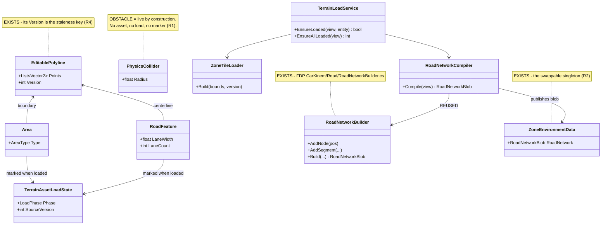
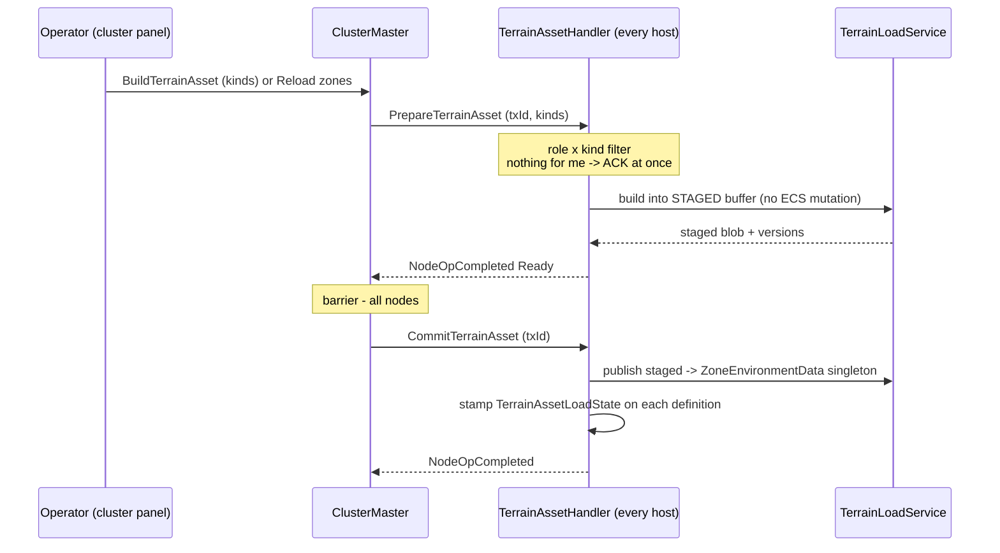
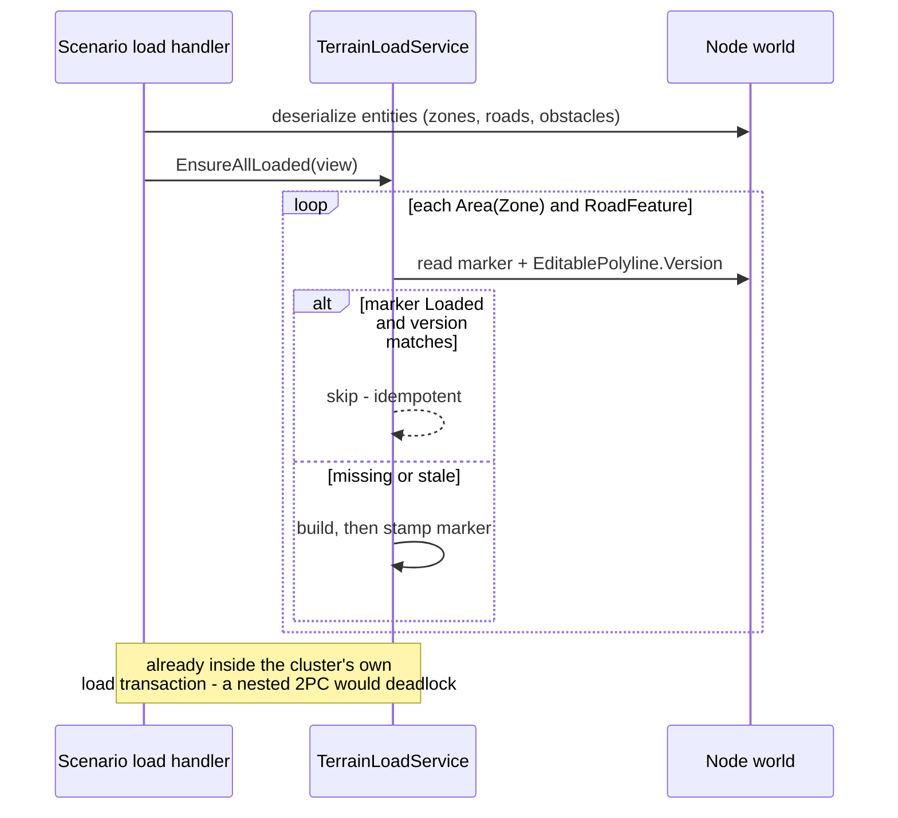
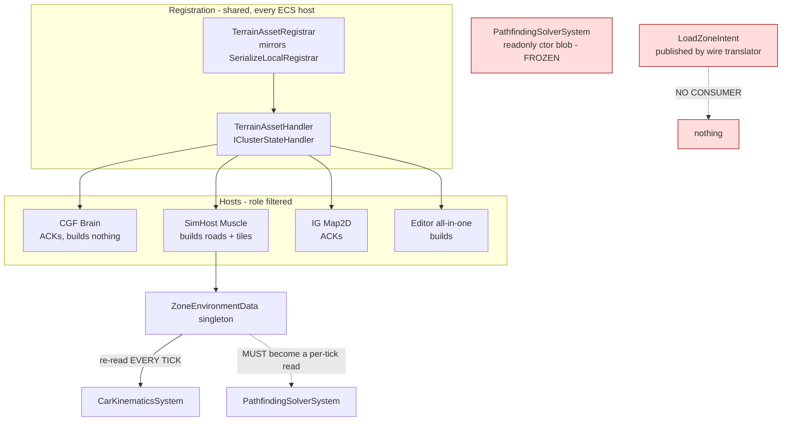

<!--STATUS
state: LIVE
build-state: ⛔ **DESIGN — DOWNGRADED FROM READY-TO-BUILD `2026-09-17`.** The diagrams (§2–§4) stand,
  but §8 (HOST HETEROGENEITY) is an unclosed hole the user found after they were drawn: this document
  assumed ONE load model role-filtered across hosts, and there are at least TWO. ⛔ No handoff until §8
  is ruled. ⚠ Marking it READY-TO-BUILD was a coordinator error — the module diagram showed WHO runs the
  loader and never asked whether they run the SAME ONE.
updated: 2026-09-17
current-answer: §2 is the model, §3 the two invocation paths, §4 what is registered and ticked where
  (incl. the two DEAD edges), §5 the WHY, §6 what is real vs faked in slice 1.
stale-below: nothing — new document.
known-rot: nothing yet.
known-conflict: none. This document REPLACES the zone half of docs/designs/packs-3/DESIGN.md
  (§2.B/§2.C/§2.E), which is already marked superseded there.
related-designs:
  - docs/blueprints/Architect_Question_71_Terrain_Zones_And_The_Asset_Build.md — the WHY and the
    decision record (§5 ruling, §6 gaps). THIS doc is the WHAT; that one is why it is shaped so.
  - docs/designs/mgmt-1/DESIGN.md — §11 owns the PrepareZone/CommitZone 2PC protocol and ZoneSpec;
    this doc owns the AUTHORING model and the entity→asset build that §11 never covered.
  - docs/designs/packs-3/DESIGN.md — SUPERSEDED zone half; still owns the ACL/network-DRY work.
  - docs/DESIGN_Distributed_Scenario_Persistence.md — owns which file entities ride in and the
    ownership save gate; zone/road/obstacle entities pass through that gate like any other.
  - docs/designs/navig-2/Navigation_Design_v2_0.md — owns per-layer navmesh bake parameters and the
    INavmeshProvider seam; §6 here must not contradict its bake model.
  - docs/DESIGN_Node_Roles_And_Policies.md — owns which role consumes terrain data (MuscleGround,
    Perception, NavigationSolver); §4 here role-filters on exactly that.
-->

# DESIGN — **Terrain, zones and the asset build**

> **The one rule:** the **ENTITY IS THE DEFINITION**; an asset is **cached, reconstructable data**
> derived from it. There is no artefact that can disagree with the world.

## 1. INVENTORY — measured `2026-09-16`/`17` (graph + grep; `check_index_coverage` not run)

| # | exists already | where |
|---|---|---|
| ① | `EditablePolyline` — points **+ a `Version` counter** documented *"so subscribers can detect stale cached copies"* | `Hrot.Core/Components/Map/EditablePolyline.cs` |
| ② | ⭐⭐ **`RoadNetworkBuilder`** — *"Builder for constructing RoadNetworkBlob from components"*: `AddNode` / `AddSegment` / `Build` | `FDP/.../CarKinem/Road/RoadNetworkBuilder.cs` |
| ③ | `RoadNetworkBlob` (NativeArrays + a broadphase grid), `ZoneEnvironmentData` singleton | `FDP/.../CarKinem/Road/`, `FDP/.../CarKinem/` |
| ④ | the 2PC seam: `PrepareAsync` *(must not mutate ECS)* / `Commit` *(main thread)* / `Abort` | `FDP/.../Orchestration/IClusterStateHandler.cs` |
| ⑤ | the barrier — waits for **all** nodes' `NodeOpCompletedEvent` | `ClusterMaster.cs:1242-1254` |
| ⑥ | `NodeOpType.PrepareZone=7 / CommitZone=8` reserved on the wire in **two** enums | `NodeOpType.cs:15-16`, `OrchestrationMessages.cs:53-54` |
| ⑦ | `ClusterOpType.LoadZone=3` + a real wire arm publishing `LoadZoneIntent` | `ClusterOpMasterTranslator.cs:238-241` |
| ⑧ | shared cross-host registration precedent | `SerializeLocalRegistrar` (`CE-279`) |
| # | **does NOT exist** | |
| ⑨ | any entity→asset compile; any `CmdSwapZone`; any consumer of `LoadZoneIntent`; any zone control in the cluster panel | measured absences |
| ⑩ | any load-state marker component — graph returned only unrelated editor test classes | ⇒ new component, not a missed seam |

---

## 2. THE MODEL

*What the picture shows that the prose hid:* **obstacles hang off nothing.** Every other definition
kind flows into a loader and earns a marker; the obstacle box terminates immediately — which is the
whole of ruling R1, visible rather than argued.

| new type | why it is new |
|---|---|
| `Area { AreaType Type }` | a zone is *a tactical drawing of an area that happens to be typed `Zone`*; the type field is what keeps one authoring surface serving zones and tactical areas alike |
| `RoadFeature` | the KIND discriminator the build selects on (`Q71-E2`); `EditablePolyline` alone cannot say "this polyline is a road" |
| `TerrainAssetLoadState { LoadPhase Phase, int SourceVersion }` | ⭐ `[DataPolicy(NoScenario \| NoReplay)]`. **Not** a bare tag — streaming has an in-flight state and loads can fail. ⚠ Named `Terrain…` on purpose: a bare `AssetLoadState` collides with the editor's existing BTree/HSM asset-load-state concepts |

---

## 3. THE TWO INVOCATION PATHS — one implementation

### 3.1 Runtime — operator-driven, via the 2PC round

### 3.2 Scenario load — the same service, called locally, **no NodeOp**

*What these show that prose hid:* the **same `TerrainLoadService` is the only implementation**; the
2PC round is an *invocation wrapper* the scenario path deliberately does not use. The idempotency
check is the identical branch on both paths, so "reload" and "load on scenario open" cannot drift.

---

## 4. MODULE RELATIONSHIPS — who registers it, who runs it, what is DEAD

⛔ **The two red boxes are MEASURED DEAD/BROKEN EDGES, and they are why this diagram exists:**

1. **`LoadZoneIntent` has no consumer** — the wire translator publishes it (`ClusterOpMasterTranslator.cs:238-241`)
   and nothing reads it, while its own doc comment at `ClusterOpIntents.cs:133` claims *"Consumed by
   `ClusterMaster`"*. The comment is false and must be corrected whichever way this builds.
2. 🔴 **`PathfindingSolverSystem` holds `readonly RoadNetworkBlob _roadNetwork`, assigned once in its
   constructor** (`:32`, `:63`). ⇒ **a commit-time pointer swap reaches `CarKinematicsSystem` and
   silently does nothing for pathfinding.** `NavigationSolverModule` and `EngineBackedNavigationModule`
   have the same shape. **R2 is therefore a precondition, not a cleanup.**

---

## 5. WHY — the rationale the diagrams cannot carry

### 5.1 Why there is no zone artefact
An artefact is a second place the truth can live, and the moment it exists it can disagree with the
world (`R-132`, two producers for one slot). Making the entity the definition and the asset a
**cache** removes the failure mode by construction: a cache that disagrees is simply *stale*, and
staleness is detectable (§5.3) where disagreement is not.

### 5.2 Why obstacles are excluded (R1)
Measured: `RaycastSolverSystem.cs:145-147` reads `PhysicsCollider` straight off broadphase candidates
and `LosRequestBatchingSystem` queries by its component id ⇒ **an obstacle occludes LOS the instant
the entity exists.** There is nothing to cache, so a marker on an obstacle would always read `Loaded`
and mean nothing. ⛔ A vacuous state field is worse than none — it invites code to branch on it.
⭐ If a baked static-occlusion structure is ever wanted, it is an **optimisation** that re-enters
through this same design, not a gap being left open.

### 5.3 Why the marker carries a version, not just a flag (R4)
Idempotency without staleness is indistinguishable from *never reloading*: redraw a loaded zone's
boundary and a bare flag still says `Loaded`, so the cache silently serves the old shape forever.
⭐ **The key already exists** — `EditablePolyline.Version` is documented *"incremented … each time a
committed edit is applied, so subscribers can detect stale cached copies."* It was built for exactly
this, so the marker stores the version it was built from and a mismatch means rebuild.

### 5.4 Why the swap seam is a precondition (R2)
See §4's second red box. ⭐ **Preferred fix — reuse, not a new abstraction:** make the
`ZoneEnvironmentData` **singleton the single source** and have the navigation systems re-read it per
tick exactly as `CarKinematicsSystem` already does, rather than introducing a holder/provider object.
One source, no new seam, and it matches the "one source, read it every time" pattern (`R-126`).
⚠ **What would flip it:** if a navigation module runs on a background thread where singleton access is
constrained by `DataPolicy`, a holder becomes necessary. **Check that before building.**

### 5.5 Why roads are real and tiles are faked
`RoadNetworkBuilder` already turns nodes + segments into a `RoadNetworkBlob`, and a road polyline is
a node-and-segment list — so the road compile is **mostly reuse and genuinely small**. Terrain tiles
(navmesh, heightmap, streaming, geographic cache keys) are none of those things, and the user ruled
them postponed. ⇒ the slice is honest about which half is which rather than faking both.

### 5.6 Why a fake must announce itself
`R-133`: *a capability reported present that silently no-ops is worse than an absent one.* The tile
loader therefore logs its stub-ness on every round **and** the capability manifest must not advertise
a real terrain capability. This is a build constraint, not a caveat.

---

## 6. SLICE 1 — what is real, what is faked

| piece | slice 1 |
|---|---|
| `Area`+`AreaType`, `RoadFeature`, `TerrainAssetLoadState` | ⭐ **REAL** |
| authoring zones / roads / obstacles as entities; saved by the ordinary gate | ⭐ **REAL** |
| road compile (entities → `RoadNetworkBlob` via `RoadNetworkBuilder`) → singleton | ⭐ **REAL** (§5.5) |
| R2 swap seam (navigation reads the singleton per tick) | ⭐ **REAL — precondition** |
| idempotency + version staleness | ⭐ **REAL** |
| both invocation paths, the 2PC round, shared registration, panel controls | ⭐ **REAL** |
| **terrain tile generation / streaming / geographic cache** | ⛔ **FAKED** — stub that logs, marks loaded |
| obstacles in the load model | ⛔ **EXCLUDED** (R1) |

**Enum values to allocate:** `ClusterOpType.BuildTerrainAsset = 17` (next free; 2 is a documented
reserved gap). `NodeOpType.PrepareTerrainAsset = 29`, `CommitTerrainAsset = 30` — ⚠ **do not reuse the
undocumented gaps at 6/17/18/19**; both enums are wire contracts in two places.

**Retirement, with its test surface** (`HN-037`: measure tests, not just production): `ZoneDefinitionDto`,
the embedded `Zones` section, `ZoneMembership`, `ZoneManagerService`'s DTO half, the `ScenarioMergeCore`
I4 guard, `ZoneEditorPanel` → repointed at entity authoring; and the five suites that assert the
retiring behaviour — `ZoneManagerServiceTests`, `ZoneScenarioLoadIntegrationTests`, `ZoneEditorPanelTests`,
`ScenarioFileServiceZoneTests`, plus the two `SpyZoneManagerService` doubles.

## 8. ⛔ OPEN — **HOST HETEROGENEITY: there is more than one load model**

> 🔒 **User, `2026-09-17`:** *"What all nodes implement navigation and perception and whatever affected
> by reloading the tiled data. Some hosts might not support dynamic loading of these stuff — like maybe
> stride simhost — they should say what they support in their capability flags… their zone load
> implementation will be different (all preloaded with terrain load and unchangeable and not tile
> streamed, tied to the terrain id...), what the ui should look like and do etc."*

### 8.1 Measured `2026-09-17`

| # | fact | site |
|---|---|---|
| ⑪ | **4 production navmesh providers**: `DotRecastNavmeshProvider` (Stride), `EngineBackedNavmeshProvider`, `FakeNavmeshProvider`, `StubNavmeshProvider` (EQS) | `search_graph(".*NavmeshProvider.*", Class)` = 12 incl. tests |
| ⑫ | ⭐ **Stride's navmesh is baked from STRIDE SCENE GEOMETRY at scene load**, at two call sites (node shell `:1116`, editor `:1271`) | `StrideHrotGame.cs:1834` `BakeNavmesh` |
| ⑬ | ⇒ **its source is the scene, not our entities or tiles** — tile streaming has nothing to give it. This is the user's *"one navmesh, preloaded, tied to the terrain id"* host, measured | ⑫ |
| ⑭ | 🔴 **NO host consumes terrain tiles today.** The only terrain-derived data with live consumers is the **road blob** | ⑪+⑬ |
| ⑮ | ✅ **CORRECTION TO §4/R2 — the navmesh IS swappable.** It is a *singleton-managed* provider (`SetSingletonManaged<INavmeshProvider>`) read per use (`VehicleNavigationIntentSystem.cs:190-191`) ⇒ **R2's frozen-ctor problem is ROAD-SPECIFIC, not general** | `StrideHrotGame.cs:1870` |
| ⑯ | perception is **already role-gated by composition** — `.Capability(NodeRole.Perception, new SimHostCapabilities.PerceptionSpatial(...))` | `SimHostNodeBootstrapper.cs:307` |
| ⑰ | ⭐⭐ **the cross-node capability mechanism already exists** — namespaced tokens (`CapabilityTokens.ReliableInit`, `fdp.role.*`) on the durable `NodeCapabilities` descriptor, ingested by `ClusterMaster` into `NodeHealthProfile`, with the role mask **DERIVED** from the token subset | `AQ-70 §Q70-B/C`; `IgNodeBootstrapper.cs:340`, `ClusterMaster.cs:491` |

### 8.2 The questions this opens

| # | question | ⭐ lean |
|---|---|---|
| **N1** | is the load model a **role** or a **capability**? | ⭐⭐ **capability.** Stride SimHost and headless SimHost can hold the *same* `MuscleGround` role and differ in load model ⇒ role says *what work*, capability says *how this build does it* |
| **N2** | how is it advertised? | ⭐ **reuse ⑰** — a new token pair in the existing namespace (e.g. `fdp.terrain.zones-dynamic` vs `fdp.terrain.static`). ⛔⛔ **`R-133`: emitted FROM the composition fact (which loader the host actually registered), never hand-declared** — that ruling exists because a hard-coded `true` shipped a 404 |
| **N3** | what does a STATIC host do on a zone-load round? | ⭐ **ACK as SATISFIED, not as ignored** — its terrain is already resident. ⚠ The operator must be able to tell *"static, nothing to do"* from *"faked"* from *"failed"* |
| **N4** | ⭐ **terrain-identity binding for static hosts** | 🔒 the user's *"tied to the terrain id"*: a static host's baked data is bound to a terrain. If the scenario's `SceneId` differs from what is baked, that is a **mismatch to detect and REPORT**, never to proceed through — same divergence class as `R-136` |
| **N5** | the UI on a mixed cluster | ⭐ one action, **per-node outcome** (`Loaded` / `Static — n/a` / `Failed`); ⛔ never a single global "OK" that hides a node that did nothing |
| **N6** | can a static host stall the barrier? | ⭐ no — the kind×role filter becomes kind×role×**capability**, and a non-participant ACKs immediately (the `IgZoneDummyHandler` shape) |

⇒ ⚠ **N1–N2 change §4's module diagram** (the filter gains an axis) and N4 adds an invariant §2 does not
carry. ⛔ **That is why the build-state is downgraded** rather than patched in place.

## 7. POSTPONED — deliberately not designed here

What a tile **is**, how it streams, its geographic cache key and eviction, and what a commit swap
replaces once tiles are real. 🔒 Ruled postponed by the user (`AQ-71` §5). ⭐ The fake is shaped so
that filling it in touches `ZoneTileLoader` and nothing else.
