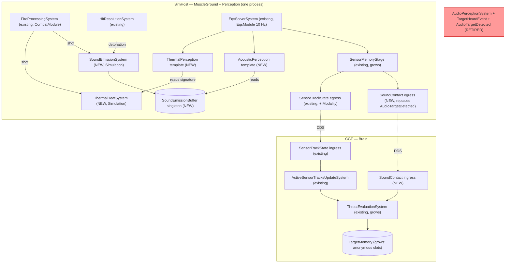
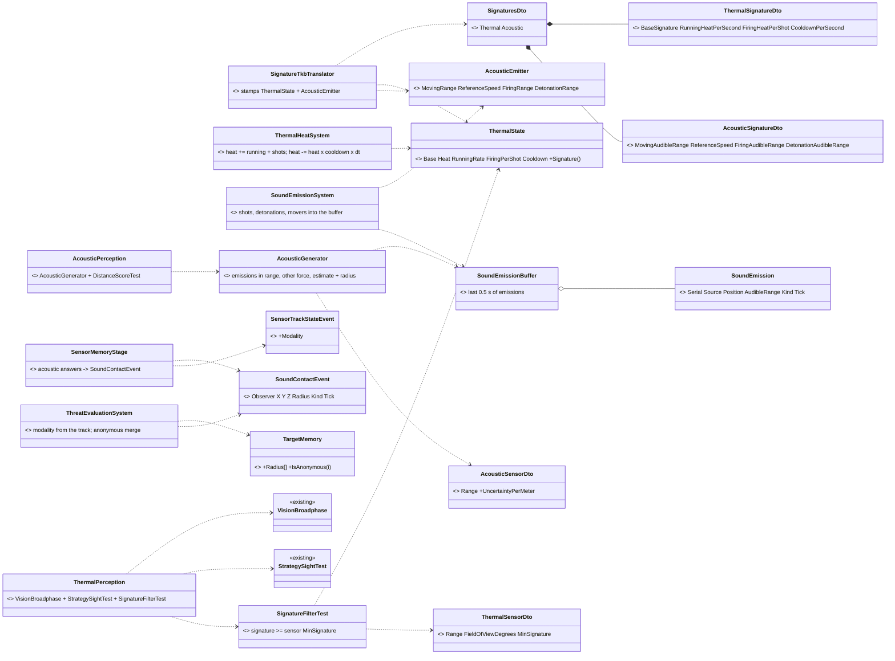
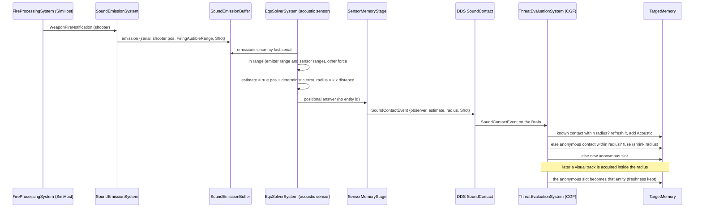
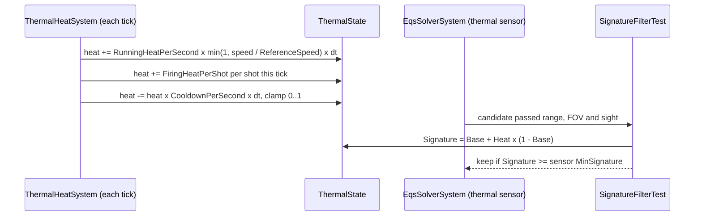

<!--STATUS
state: LIVE
updated: 2026-10-05
build-state: READY-TO-BUILD — A–F approved with the user's three changes (R-205); build rows CE-3060 … CE-3064 (§7).
current-answer: the whole file — §2 inventory, §3 module diagram, §4 classes, §5 sequences, §6 decisions, §7 build order.
stale-below: nothing — new document.
known-rot: §3's SoundEmissionBuffer box and §5.1's buffer participant — as built there is NO buffer; the sound state is on each emitter (§7 as-built CE-3062).
known-conflict:
  - docs/HROT-Engine-Guide/HROT-Engine-Guide.md §12.2 and docs/projects/FDP/Toolkits/Fdp.Toolkits.md:732 claim acoustic detection
    "with terrain occlusion" — never built; corrected when CE-3062 lands.
related-designs:
  - docs/DESIGN_Sensors_And_Doctrine.md — OWNS the sensor form, the memory stage, TargetMemory and G6; this file is its S7 (§9 row, §11.2 G6).
  - docs/blueprints/Architect_Question_82_One_Sensor_Form.md — rulings E (push stimuli feed the memory stage) and I (one pipeline per sense) this builds.
  - docs/designs/eqs-2/EQS_Design_v1.3_final.md — OWNS the template / generator / filter shape the two new templates follow.
  - docs/designs/brain-split/BS-1-DESIGN.md — OWNS the shot path (FireProcessingSystem) that now also makes heat and sound.
  - docs/DESIGN_Decision_Layer.md — the behaviors lane's ROE (R-200): ReturnFire answers a Hit or a NearMiss (§6 G).
  - docs/designs/packs-1/DESIGN.md §7.B — introduced TargetHeardEvent; retired here (§6 A).
-->

# Thermal and acoustic sensing — S7 (`CE-3055`)

🔒 **User, `2026-10-05`** (R-205): *"Moving entity also makes sound. Hearability params to be added to to the tkb. I want Shot
from north realism. Hot when running or firing - pls implement some simple heat accumulation and cooldown. … Otherwise
approved."* — approving leans A–F of the S7 pass with three changes: movement is a sound source, hearing parameters live in
the TKB, and a heard contact is **anonymous** (G6), not the shooter.

## 1. In one paragraph

Two new perception templates on the existing sensor form, nothing beside it. **Thermal** is vision's chain plus a signature
filter; the signature is a per-type TKB base plus **heat** that builds while the entity runs or fires and cools when it stops.
**Acoustic** reads a short buffer of this tick's **sound emissions** (shots, detonations, moving entities, each with a TKB
audible range) and answers with **anonymous** estimates — a position off by an error that grows with distance, plus an
uncertainty radius. The Brain's memory keeps them as anonymous contacts that merge when a sense confirms what is there. The old
hearing pipeline, which nothing in production feeds or reads, is retired.

## 2. INVENTORY *(measured `2026-10-05`)*

`search_graph(name_pattern=".*(Audio|Acoustic|Thermal|Heat|Sound|Hearing|Heard).*", label="Class")` → **total 12**, `has_more:
false`: `AcousticSensorDto`, `ThermalSensorDto`, `AudioPerceptionSystem`, `AudioStimulusEvent`, `TargetHeardEvent`,
`AudioTargetDetected`, its egress and IG ingress translators, three test classes, two unrelated editor heatmap renderers.
⚠ `check_index_coverage` not run (CLI gap). Corroborated by two read-only sweeps (grep + reads) and spot-checks below.

| fact | where |
|---|---|
| nothing in production creates a sound (`new AudioStimulusEvent` only in tests) | grep, 0 non-test hits |
| `AudioPerceptionSystem` is registered only by the two FDP examples | `HeadlessDemoApp.cs:354`, `UrbanCombatNewScenario.cs:589` |
| its `TargetHeardEvent` has no consumer; the egress runs on every Muscle over an event nobody publishes | `SimHostAuxiliaryTranslatorPack.cs:86`; IG ingress `NedIgTranslators.cs:34` feeds nothing |
| `ThermalSensorDto.MinSignature` is read nowhere; no entity carries a heat signature | `SensorEntryDto.cs:79`; searched TKB DTOs, components, topics, scenarios |
| no loudness / audible field on weapons, detonations or vehicles; no engine data at all | `WeaponCapabilitiesDto.cs`, `DetonationNotification.cs`, `VehicleParametersDto` |
| `ThreatEvaluationSystem` stamps every contact `Visual` | `ThreatEvaluationSystem.cs:123` |
| utility's `HasLineOfSight` reads that Visual bit ⇒ any other sense would read as "in sight" | `StandardInputs.cs:185` |
| `SensorTrackStateEvent` / DDS `SensorTrackState` carry no modality | `PerceptionEvents.cs:91-109`, `SimDescriptors.cs:290-306` |
| Perception always runs in the same process as MuscleGround (where shots and movement happen) | `SimHostApp.cs:187,261`, `StrideNodeBootstrapper.cs:67` |
| `TargetMemory` is keyed by entity id; 7 production readers dereference the id | `ThreatEvaluationSystem`, `StandardInputs`, `UtilityScorer`, `ThreatMatrixAssignmentSystem`, `SquadPerceptionMergeSystem`, `CgfNodes`, `HillAttackTankNodes` |
| vision's reusable pieces | `VisionBroadphase.Select`, `StrategySightTest` / `ILosStrategy`, `DistanceScoreTest`, `SensorMemoryStage` (`VisualPerception.cs:33-40`) |

## 3. Who registers what, on which node, and who calls it each frame

*What the picture shows that prose hid:* every producer sits in the same process as the sensors that read it, so the only new
wire is the RESULT (`SoundContact`), never the stimulus. The red box has no edge in or out — it is retired, not rewired. The
editor (CGF == editor, one world) composes the same SimHost-side systems through its perception capability, so the picture
holds there with the DDS edges collapsed.

## 3a. Perception on ANOTHER node *(🔒 user, `2026-10-05`: "may be distributed in the future (like perception on different node) so pls count with some kind of distribution of the inputs for the sensors from their producers")*

⭐ **Rule: heat and sound are DERIVED where the sensor solves, from inputs that are already published — nothing new is
published for them.** `ThermalHeatSystem` and `SoundEmissionSystem` are composed by the PERCEPTION capability
(`EqsSolverStartup.PopulateSystems`), not by the Muscle, so they follow the solver to whichever node it runs on.

| input | on a Perception-only node | code | design |
|---|---|---|---|
| positions (→ measured speed for running heat and movement sound) | ✅ every entity replicates, and remote entities are dead-reckoned EVERY tick on every node, so the per-tick distance is smooth | `NedReplicationModule.cs:469` | ✅ `docs/DESIGN_Dead_Reckoning.md` R1 / §5.1 |
| shots (→ firing heat, shot sound) | ⛔ **GAP**: the Muscle publishes `WeaponFire`, but only the IG ingests it back into `WeaponFireNotification` | `NedIgTranslators.cs:36`; Perception group adds only EQS translators (`SimHostAuxiliaryTranslatorPack.cs`) | ⛔ searched, none found ⇒ `CE-3065` |
| detonations (→ detonation sound) | ⛔ **GAP**: `MunitionDetonation` ingress is on the IG and on MuscleGround only | `SimHostAuxiliaryTranslatorPack.cs:90`, `NedIgTranslators.cs:38` | ⛔ ⇒ `CE-3065` |
| TKB signatures (heat / audible ranges) | ✅ stamped by `SignatureTkbTranslator` on every node that registers the components | `TkbTranslatorSet.Base()` | — |

⇒ `CE-3065`: add the `WeaponFire` and `MunitionDetonation` ingress for a node that is Perception WITHOUT MuscleGround (with it, the
local events already exist — ingesting them too would count each shot twice). ⭐ Both arrive `IsRemote = true`; heat and sound
accept remote events (only `DamageCalculationSystem` skips them).

⛔ **Rejected: publishing `ThermalState` from the Muscle.** A continuous per-entity topic for a value every node can compute from
what it already receives. ⚠ **What would change it:** a heat source that is NOT observable from published data — engine load,
a running generator, a weapon's barrel temperature beyond shots fired. Then that one input gets published (or folded into an
existing state topic), and the rest stays derived.

## 4. Classes

*What the picture shows that prose hid:* the only existing types that change are the memory stage, the track event, the
threat system and `TargetMemory` — the sensor child, its factory, the solver and the reader API are untouched.

## 5. Sequences

### 5.1 A shot is heard from the north, then the shooter is seen

*What the picture shows that prose hid:* the identity never crosses the wire — the Brain learns only "something at about
here". Merging is spatial on the Brain, so it is honest: a second shooter nearby merges into the same contact, exactly as a
listener would hear it.

### 5.2 Heat

## 6. Decisions — why

| # | decision | why | rejected |
|---|---|---|---|
| **A** | retire `AudioPerceptionSystem`, `AudioStimulusEvent`, `TargetHeardEvent`, the `AudioTargetDetected` translators; the descriptor id 84 is reused for `SoundContact` | nothing in production feeds or reads them (§2); AQ82 ruling I: one pipeline per sense | keeping it beside the sensor form — two hearing pipelines |
| **B** | hearing is a TEMPLATE whose generator reads a 0.5 s emission buffer, each sensor remembering the last serial it heard | AQ82 ruling E (push stimuli feed the memory stage) inside the one solver; the window covers a sensor the budget defers by a tick or more (§5.3 of the sensors design) | a push system writing memory directly — a second path around the budget and the memory stage |
| **C** | sources: shots, detonations, and every entity moving faster than 0.5 m/s, range scaled by `speed / ReferenceSpeed`; audible ranges in the TKB (`AcousticSignatureDto`) | 🔒 user: *"Moving entity also makes sound. Hearability params to be added to the tkb."* | engine sound — no engine data exists; movement speed stands in for it |
| **D** | a heard contact is ANONYMOUS: position estimate + uncertainty radius; error and radius grow with distance; deterministic (hash of emission serial and listener), so replay is exact | 🔒 user: *"I want Shot from north realism."* (G6) | the shooter's id — "omniscient hearing"; random noise — breaks determinism |
| **D′** | the Brain merges spatially: refresh a known contact inside the radius, else fuse with an anonymous one (radius shrinks), else a new slot; a sighting inside the radius absorbs it | the identity never crosses the wire, so only position can merge it | a hidden true id carried for merging — the AI would act on knowledge it does not have |
| **D″** | anonymous slots live in `TargetMemory` (a reserved id range + a new `Radius[]`); the readers that need an ENTITY (aim, fire, entity reads) skip them, the ones that need a POSITION (face, move, flee, squad share) use them | one memory, one freshness rule (R-194); the 7 readers in §2 split cleanly into those two kinds | a second "anonymous memory" component — two memories for every reader to merge |
| **E** | heat: `heat += running + shots`, `heat -= heat × cooldown × dt`, `Signature = Base + Heat × (1 − Base)`; parameters in the TKB (`ThermalSignatureDto`) | 🔒 user: *"Hot when running or firing - pls implement some simple heat accumulation and cooldown."* | a temperature simulation — no heat model to feed it |
| **F** | thermal = vision's broadphase + sight + the signature filter, its own template reading the thermal sensor's range and FOV | reuse; the only difference from sight is what makes a target detectable | weather / night attenuation — not asked |
| **G** | the track carries its MODALITY (event + IDL); memory ORs the real one in; ROE `ReturnFire` answers a Hit or a **NearMiss** (a bullet passing within 3 m of a unit it was not aimed at, from the ballistics step) — this is `CE-2096` | without modality a thermal or heard contact reads as "in sight" (§2); a near miss is the "shot at" a unit can actually tell | ReturnFire on any heard shot — a unit would return fire at a distant firefight |

⚠ **What would change it:** if heard contacts must ALSO carry a direction-only form (bearing, no range), D grows a bearing
field; the radius already covers "about here", which is what "from the north" needs for movement and facing.

## 7. Build order *(backend unless noted)*

⭐ **As-built `CE-3060` (`2026-10-05`):** the memory stage keeps, per target, the OR of the KINDS of the unit's sensors holding it
and re-publishes an Acquired when that set changes on a target still held (no Lost); `SensorTrackStateEvent.Modality`, DDS
`SensorTrackState.Modality` (byte), `ActiveSensorTracks.Modalities[]`, and `ThreatEvaluationSystem` writes the real kinds into
memory. A 0 kind (an older writer) reads as Visual. Rails: `EqsModuleTests.S7_TheTrackCarriesTheKindsHoldingIt_AndAKindChangeIsRepublished_CE3060`,
`SensorChangedEventTests.TheTrackKeepsItsKinds_AndTheMemoryTakesThem_CE3060`; the S4 union rail now also asserts the kind.

⭐ **As-built `CE-3061` (`2026-10-05`)**, matching §4 / §5.2 with three precisions:
- **speed is MEASURED** as distance moved per tick (`ThermalState.LastX/Y/Z`), not read from `SimVelocity` — not every kinematics
  path writes it, distance moved counts every mover. `ReferenceSpeed` lives on `ThermalSignatureDto` too (0 ⇒ 5 m/s).
- **vision's generator is shared, not copied**: `VisualSensorGenerator` takes an optional optics function; thermal passes
  `ThermalPerception.Optics` (the thermal sensor's own range / FOV). The template is `SignatureFilterTest` + `StrategySightTest`
  + `DistanceScoreTest`; a target with no `ThermalState` is cold (never seen).
- **one composition point**: `EqsSolverStartup.PopulateSystems` adds `ThermalHeatSystem` to the main loop and every perception
  capability calls it (SimHost, editor, Stride); `EqsSolverStartup.Register` registers `ThermalState` (Stride's mode 2 registers
  only a muscle subset); `ThermalPerception` is registered beside `VisualPerception` in `EqsModule.ForTerrainHost`;
  `SignatureTkbTranslator` is in `TkbTranslatorSet.Base()`. Component ids 330 / 331 (a gap after 317 — no lane blocks in that table).
Rails: `ThermalHeatSystemTests` (3: at rest = base · running builds heat then it cools · each shot heats the shooter only),
`EqsModuleTests.S7_TheThermalSensor_SeesATargetOnlyOnceItIsHotEnough_CE3061`.

⭐ **As-built `CE-3062` (`2026-10-05`) — ⚠ ONE DEVIATION from §3–§5.1: there is NO `SoundEmissionBuffer`.** The solver runs on a
background SNAPSHOT (`EqsModule`, `SlowBackground(10)`), so a shared managed list written by the main loop and read by the solver
would be a data race. ⇒ the sound state lives ON EACH EMITTER (`AcousticEmitter`, unmanaged, id 331): `CurrentMovingRange`
(from measured speed), `ShotTimeLeft` + where it was fired, `DetonationTimeLeft` + where it burst — `SoundEmissionSystem`
writes them on the main loop, the 0.5 s linger replaces the buffer window. The generator (`AcousticSensorGenerator`) walks the
other-force entities near the unit with `VisionBroadphase` (all round, no line of sight) and answers one POSITIONAL estimate per
audible sound (entity id 0, kind in flag bits 8–9, the uncertainty radius carried exactly in `Score` — the template has no score
test). The memory stage turns an acoustic sensor's answers into `SoundContactEvent`s (no `SensorContactList`, no track — the
identity never leaves the solver). On the wire, `AudioTargetDetected` (id 84 kept) lost `SourceEntityIndex` and gained `Radius` +
`Kind`; the IG ingress (unread) is retired and the Brain gets `SimHost/AudioTargetDetectedIngressTranslator`. Retired:
`AudioPerceptionSystem`, `AudioStimulusEvent` (4001), `TargetHeardEvent` (4004) — ids reserved, not reused. The stale "terrain
occlusion" claims (Engine Guide §12.2, `Fdp.Toolkits.md`) and the NED / network-stack tables are corrected.
⚠ So §3's `BUF` box and §5.1's `B` participant read "the emitter's own sound state". Rails: `SoundEmissionSystemTests` (3),
`EqsModuleTests.S7_TheAcousticSensor_HearsAnonymousEstimates_NotIdentities_CE3062`, `AudioTargetDetectedEgressTranslatorTests` (3, new shape).

| row | slice | depends on |
|---|---|---|
| `CE-3060` | modality on the track (event + `SensorTrackState` IDL + ingress + `ThreatEvaluationSystem` stops stamping Visual) | — |
| `CE-3061` | heat: `ThermalSignatureDto` / `SignaturesDto` / `SignatureTkbTranslator`, `ThermalState`, `ThermalHeatSystem`, `ThermalPerception` + `SignatureFilterTest` | `CE-3060` |
| `CE-3062` | sound: `AcousticSignatureDto`, `AcousticEmitter`, `SoundEmissionSystem` + buffer, `AcousticPerception`, `SoundContactEvent` + DDS `SoundContact`; retire the old pipeline | `CE-3060` |
| `CE-3063` | anonymous contacts in `TargetMemory` (`Radius[]`, reserved ids, spatial merge, sighting absorbs) + the readers split (⚠ **cross-lane**: the AI readers are the behaviors lane's and `CE-3054` B–D is rewriting them — agree the `IsAnonymous` rule with them first) | `CE-3062` |
| `CE-3064` | NearMiss from the ballistics step + `SensorChange.NearMiss`; the ROE guard answers Hit or NearMiss (closes `CE-2096`) | `CE-3060` |
