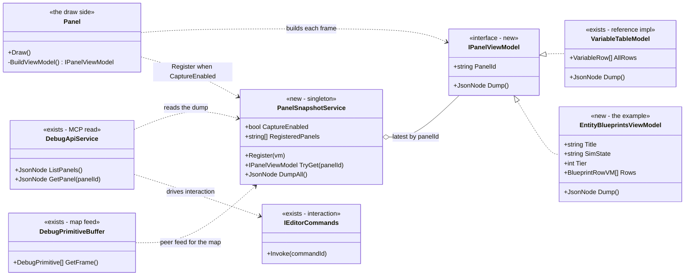
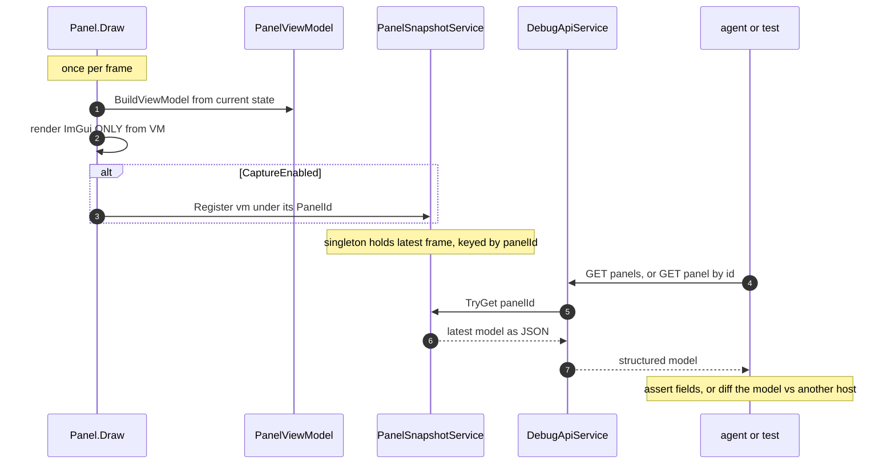

<!--STATUS
state: LIVE
build-state: READY-TO-BUILD (slice 1: the contract + snapshot singleton + one pilot panel + MCP read; rollout is incremental)
updated: 2026-08-22
current-answer: the whole file — the decision to make every panel render from a whole, dumpable view-model
  handed to a per-frame snapshot singleton (approach C), so the UI becomes machine-readable for tests, MCP,
  and cross-host conformance without pixels. §UML is the build contract; §APIs + §Example are the shape.
design-basis: this session's analysis (2026-08-22) with the user; VariableTableModel (the proven pattern);
  DebugPrimitiveBuffer (the map/gizmo feed); IEditorCommands (the interaction seam); DESIGN_Smoke_Suite.md
  (T2 panel-model tier); DESIGN_MCP_System_Test_Harness.md + MCP_Integration.md (the consumers).
known-conflict: none. Supersedes the smoke suite's bespoke `EditorPanels` idea (G-c) — T2 reads THIS snapshot.
-->
# DESIGN / ADR — **UI observability via a dumpable view-model + per-frame snapshot**

> ⭐ **The decision:** every panel builds its **whole view-model** each frame, **renders only from it**, and
> hands it to a **snapshot singleton** keyed by panel id (when a capture flag is on). Tests, MCP, and
> cross-host conformance read the singleton. **No pixels, no ImGui Test Engine, no big central registry.**

## The decision, in one line each

| ⭐ | |
|---|---|
| **What** | approach **C** — per-panel view-model, built in the draw, dumped whole to a snapshot singleton per frame |
| **Why not A** (logic out of UI into a central registry) | fights immediate-mode's grain; biggest refactor; a heavy registry becomes its own beast |
| **Why not B** (per-element capture facade) | a flat item-list is low fidelity, and a *separate* emit call drifts from what's drawn ⇒ false greens |
| ⛔ **The load-bearing invariant** | **the draw renders ONLY from the view-model.** Anything the user sees must pass through the VM first — else the dump is blind to it and tests pass on broken UI |
| **Interaction** | ⚠ C gives *observation*, not input. Menus/toolbar via the existing `IEditorCommands` bus; in-panel widget input is a small later add |
| **Pixels** | kept only as a rare-case backstop for final look-and-feel; **may become unnecessary** if the VM coverage is thorough |

## INVENTORY — measured 2026-08-22 (not assumed)

| exists? | thing | where | role here |
|---|---|---|---|
| ✅ | **`VariableTableModel`** + `VariableRow` (immutable record, rebuilt every frame) | `Hrot.Editor.AiShared/Variables/` | ⭐⭐ **the reference implementation** — C is this, generalized |
| ✅ | **`DebugPrimitiveBuffer.GetFrame()`** → `DebugPrimitive[]` | `Fdp.Diagnostics.Contracts/DebugPrimitiveBuffer.cs` | ⭐ the map/gizmo per-frame model — a **peer feed** into the snapshot |
| ✅ | **`IEditorCommands.Invoke(id)`** — id-addressable command bus | `NodeEditor.Core/Action/IEditorCommands.cs` | the **interaction** seam (menus/toolbar) |
| ✅ | **`DebugApiService` / `DebugApiHost`** — the MCP HTTP surface | `Hrot.Editor/DebugApi/` | where the **read endpoints** live |
| ⛔ | most panels format **inline** in the draw | e.g. `EntityBlueprintsPanel.cs:66` `ImGui.Text($"Current tier: {_model.GetCurrentTier()}")` | the surfaces to convert |
| ⛔ | **no `IPanelViewModel` contract, no snapshot singleton, no panel read endpoint** | — | *this design* |
| ⚠ | ImGui.NET **1.91.6.1** (nuget) + rlImGui | `*.csproj` | ⛔ **the ImGui Test Engine is a C++ lib not bound here** — rejected, see §Alternatives |

> INVENTORY method: `grep`/read on the four named symbols + the csproj; the graph is not required (these are
> concrete named types, confirmed by reading them). A count of "1 reference impl" is the answer, not a gap.

## UML — the build contract *(obligation ①; existing classes drawn as existing)*





## APIs — the contract

```csharp
// Every convertible panel produces one of these each frame.
public interface IPanelViewModel
{
    string   PanelId { get; }   // stable across frames AND across hosts (for conformance)
    JsonNode Dump();            // structured, JSON-able — the whole model, not a string blob
}

// The singleton the whole app writes to and MCP/tests read from.
public static class PanelSnapshot
{
    public static bool CaptureEnabled { get; set; }          // off in production; on for tests/MCP
    public static void Register(IPanelViewModel vm);          // panel calls this once per frame when enabled
    public static IPanelViewModel? TryGet(string panelId);
    public static JsonNode DumpAll();                         // { panelId: model, ... } + the gizmo feed
    public static IReadOnlyCollection<string> RegisteredPanels { get; } // instrumented vs merely-empty
}
```

**MCP read surface** *(a new group in `MCP_Integration.md` — "Group T, panel snapshot")*:

| endpoint | does |
|---|---|
| `GET /panels` | the panel ids captured this frame, **and** which panels are instrumented at all *(so "not converted" ≠ "empty")* |
| `GET /panels/{id}` | that panel's dumped view-model as JSON |
| *(map/gizmo)* `GET /panels/_gizmo` | the `DebugPrimitiveBuffer.GetFrame()` primitives, the same snapshot one layer down |

⭐ **Interaction stays the command bus** — `POST /commands/{id}/invoke` over `IEditorCommands` covers
menus/toolbar; in-panel widget input is a later add (the VM carries actionable item ids + a pending-input map).

## Example — one real panel, before and after

**Before** *(today — `EntityBlueprintsPanel`, logic fused into the draw)*:

```csharp
ImGui.Text("Entity Blueprints");
ImGui.Text(_isRunning ? "Sim: Running" : "Sim: Paused");
ImGui.Text($"Current tier: {_model.GetCurrentTier()}");
foreach (var def in attached) ImGui.Text($"{def.Name} (attached)");
```

**After** *(approach C — build, render-from-VM, capture)*:

```csharp
// 1. BUILD — a pure function of state. This IS the dumpable model.
var vm = new EntityBlueprintsViewModel {
    PanelId  = "entity-blueprints",
    Title    = "Entity Blueprints",
    SimState = _isRunning ? "Running" : "Paused",
    Tier     = _model.GetCurrentTier(),
    Rows     = attached.Select(d => new BlueprintRowVM(d.Name, "attached")).ToList(),
};

// 2. RENDER — draw ONLY from vm (the invariant). Nothing shown that isn't in vm.
ImGui.Text(vm.Title);
ImGui.Text($"Sim: {vm.SimState}");
ImGui.Text($"Current tier: {vm.Tier}");
foreach (var r in vm.Rows) ImGui.Text($"{r.Name} ({r.State})");

// 3. CAPTURE — once per frame, flag-gated (free when off).
if (PanelSnapshot.CaptureEnabled) PanelSnapshot.Register(vm);
```

**What MCP / the test reads** (`GET /panels/entity-blueprints`):

```json
{
  "panelId": "entity-blueprints",
  "title": "Entity Blueprints",
  "simState": "Paused",
  "tier": 2,
  "rows": [ { "name": "PatrolBlueprint", "state": "attached" } ]
}
```

**A smoke assertion** *(no pixels, no display)*:

```csharp
var panel = await Mcp.GetPanelAsync("entity-blueprints");
Assert.Equal("2", panel["tier"]!.ToString());
Assert.Equal("attached", panel["rows"]![0]!["state"]!.GetValue<string>());
```

**Cross-host conformance** *(the payoff — a structured diff, not a pixel diff)*:

```csharp
var onEditor  = await editorMcp.GetPanelAsync("entity-blueprints");
var onCgf     = await cgfMcp.GetPanelAsync("entity-blueprints");
AssertJson.Equal(onEditor, onCgf);   // any diverging field is pinpointed by path
```

## The invariant, stated as a review rule

> ⛔⛔ **The draw method renders ONLY from the view-model.** If a panel draws a value it read straight from a
> source — `ImGui.Text(someSource)` instead of `ImGui.Text(vm.someField)` — that value is invisible to the
> dump, and a test can go green while the UI is wrong.

⭐ **The reviewable smell:** any drawn value that did not come from the VM. This is the C-equivalent of B's
"capture must be a byproduct of the draw" — here it is achieved by making the VM the *complete* description of
what the panel shows, and the draw a pure function of it.

## Cross-host conformance — why this layer

The draw is **per-host by nature** (each host paints its own panels). The thing the unification programme is
*merging* is the **model-building logic**. So conformance is a **diff of the view-models across hosts**: if the
panels are shared components (the unification's deliverable), the VMs match by construction; if a host diverges,
the structured diff names the exact field. ⇒ **assert at the VM layer, not the pixel layer.**

## Adoption — incremental, value-ordered

| slice | what | why here |
|---|---|---|
| **U-obs-1** | the **contract** (`IPanelViewModel`), the **singleton** (`PanelSnapshot`), the **`GET /panels*` MCP endpoints**, and **one pilot panel** converted end-to-end *(the `EntityBlueprints` example, or the variable panel which already has the model)* | proves the spine + one real dump readable over MCP |
| **U-obs-2** | convert the **high-risk unified surfaces** — Details / blackboard / watch *(they already have `VariableTableModel`; just make it `IPanelViewModel` + register)* | this is where cross-host risk concentrates |
| **U-obs-3** | wire the **gizmo/map peer feed** (`DebugPrimitiveBuffer` → `GET /panels/_gizmo`) | cheap — the buffer already exists |
| **U-obs-4** | the **smoke suite T2** reads `PanelSnapshot` instead of a bespoke `EditorPanels` *(supersedes `DESIGN_Smoke_Suite.md` G-c)* | one snapshot, many consumers |
| **U-obs-5+** | convert further panels **as they are touched** *(a standing rule, not a big-bang sweep)*; new/unified panels are born on the contract | value-ordered; never refactor a static label |

⛔ **Not required:** converting every one of the hundreds of panels up front. The long tail of static/cosmetic
panels stays on pixels/human until touched.

## Perf & correctness details

| | |
|---|---|
| **Build cost** | the VM is built every frame anyway *(the draw needs it)* — the same compute the inline draw already does, materialized into an object. `VariableTableModel` already pays this. Pool/reuse if a hot panel shows allocation pressure. |
| **Flag gates the DUMP, not the build** | production still builds VMs to draw; it just does not `Register`. Cost when off = one branch per panel. |
| **Opt-in registry** | `RegisteredPanels` distinguishes *"panel drew an empty model"* from *"panel not converted"* — ⛔ else un-converted panels produce false greens. |
| **Id stability** | `PanelId` must be stable across frames and identical across hosts *(use the window-manager registration id)* — conformance depends on it. |
| **Thread** | panels draw on the UI/sim thread; the snapshot is written there and read by MCP via the existing `MainThreadJobQueue` — no new threading. |

## Alternatives considered (the ADR record)

| approach | verdict | why |
|---|---|---|
| **A — logic out of UI into a central model registry** | ⛔ rejected as the default | biggest refactor; fights immediate-mode; a heavy registry is its own complexity. *(Still the right move for a surface with genuinely host-divergent logic that must converge — reach for it there.)* |
| **B — per-element capture facade** (`Ui.Text(...)` records each item) | ⚠ rejected in favour of C | low fidelity *(flat item list)*; and a separate emit drifts. ⭐ **Its one virtue — free input routing — is folded in via the command bus instead.** |
| **ImGui Test Engine** | ⛔ rejected | a C++ lib needing a custom native ImGui build + hand-written bindings; not bound in ImGui.NET/rlImGui. The VM dump gives machine-checkable UI without a native toolchain project, and more besides. |
| **Pixel comparison** | ⭐ kept as a rare backstop | cheap to build, expensive to use *(token/human cost, brittle)*. Allocate by check-frequency: model for frequent/regression/conformance; pixels for the rare tail. |
| ⭐ **C — whole VM per panel, dumped per frame** | ✅ **chosen** | structured, high-fidelity, single-source-of-truth by the invariant, well-posed for cross-host, and the `VariableTableModel` pattern already proves it. |

## Open questions (for the build session to resolve, argued in-report)

1. **`Dump()` shape** — hand-written per VM, or reflection/`System.Text.Json` over the VM's properties? *(Lean: STJ over the VM, like the rest of the MCP surface, with a hook for custom cases — matches decision 3 of the extensions.)*
2. **Registration mechanics** — does the panel call `PanelSnapshot.Register` itself, or does the window-manager wrap `Draw()` and register the returned VM? *(Lean: the window-manager wraps, so a panel cannot forget — but that needs panels to RETURN their VM from a build step; decide with the pilot.)*
3. **In-panel input** — defer until a concrete need, or design the actionable-item id scheme now? *(Lean: defer; the command bus covers the near-term.)*
