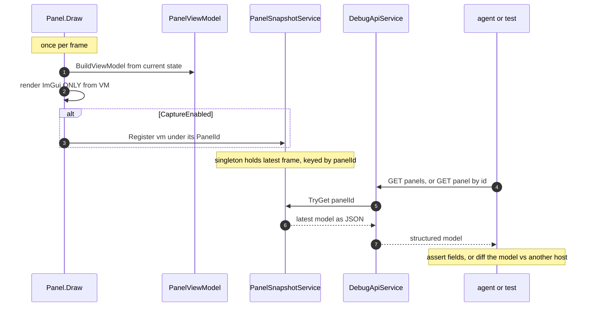

<!--STATUS
state: LIVE
build-state: BUILT — U-obs-1, U-obs-2 and U-obs-5 (the full panel sweep) are COMPLETE as of
  2026-08-23: 53 panels declare, 48 publish (BP-453..471). FIVE DEVIATIONS are recorded in the AS-BUILT
  section and all five are folded back into the sections they deviate from.
  ⭐⭐ UPDATED 2026-08-23: (MCP lane, Batch HN-122) the snapshot HAS a consumer now — GET /panels,
  GET /panels/{id} and GET /panels/_gizmo are built and the debug API turns CaptureEnabled on
  (supersedes the earlier "no consumer" note). (UI lane) the no-host set (BP-467) is CLOSED — two panels
  deleted, four given real hosts (BP-472..476), so 5 more panels publish; §"The invariant" gained a
  sub-section naming TWO CONCRETE FAILURE SHAPES (re-sample; nested Begin), neither rail-catchable, found
  reviewing BP-476.
  ⭐⭐⭐ 2026-08-23 (UI lane, MX batch): U-obs-3 AND U-obs-4 ARE NOW BUILT — the programme is complete
  on the editor host. §UML's last unbuilt edge (DebugPrimitiveBuffer ..> PanelSnapshotService) is real:
  GizmoFramePanel.Publish registers the map feed under kind "_gizmo" from EditorSubsystem.Update, before
  the buffer's EndFrame. MX-006's frame boundary (PanelSnapshot.ClearCaptured) ships and is called on
  the FIRST line of Update — NOT DrawUI, because the gizmo feed publishes inside Update and clearing
  later would wipe it every frame. U-obs-4: the smoke suite's T2 drives each panel's OWN publish hook
  (DrawContent/SimulateDrawClientArea) and reads the snapshot back — neither "BuildViewModel from the
  fixture" (which would duplicate the identity rules) nor "a headless frame" (impossible: Gui.Begin
  precedes DrawClientArea). §APIs below now understates the contract: it omits ClearCaptured.
  ⭐⭐ 2026-08-23 (later, BP-484 — the carried gap is CLOSED): the Details variables table now publishes
  its ROWS at {idScope}/{ViewId}/table under kind PanelIds.Variables — the SAME
  VariableTablePanelViewModel the Watch uses, so there is one row projection, not two. The kind is
  deliberately shared with AiVariablesWindow: when U-16 retires that window the kind survives here and a
  conformance diff keyed on "variables" keeps its subject. Two silent gaps surfaced while fixing it and
  are also closed: VariableDetailsSection.Draw would have built a SECOND view (so the user's view and
  the published view would be different objects that merely agree), and DetailsWindow's test hook
  published only the shell, never the hosted view it had chosen.
  ⚠⚠ 2026-08-23 (BP-485/486/487 — a "no more gaps?" sweep, and it found three): (1) the gizmo feed's
  address DEFAULTED to its kind, reintroducing U1d's own defect and invisible for U1d's own reason —
  a singleton's address and kind are the same string; there is no default now, AddressFor(host) is
  required. (2) DetailsViewWindow's test hook published only its shell, i.e. BP-484's fix applied to one
  of two twins — PanelIds.Details' own comment names the twin. (3) OPEN, BP-487: ClearCaptured and the
  gizmo publish have ONE production caller each (EditorSubsystem) while four other hosts drive a gizmo
  buffer — harmless while the debug API is Editor-only, blocking for cross-host conformance.
  ⭐ Rule worth carrying: A SINGLETON CANNOT DEMONSTRATE AN ADDRESSING RULE — rail a second instance or
  the rule is untested by construction.
  ⚠ U-obs-3 is NOT done by Group T: /panels/_gizmo reads DebugPrimitiveBuffer DIRECTLY and projects it
  per shape; U-obs-3 asks the buffer be REGISTERED INTO PanelSnapshot so one DumpAll() carries it, and the
  endpoint should then read the snapshot entry — one path to the data (MX-011). U-obs-4 remains this lane's
  (the in-process smoke suite; the MCP harness reads over HTTP — complementary).
  ⚠ FINDING FOR THIS LANE (§"Perf & correctness"): the snapshot has no frame boundary and
  PanelSnapshot.Clear() cannot serve as one (MX-006).
updated: 2026-08-23
stale-below: the "## ⛔ HISTORY" section at the foot of this file — the open questions as first written.
  Question ② was resolved AGAINST its lean; do not quote the leans as current.
known-rot: none outstanding. The two source sections the build deviated from were CORRECTED IN PLACE
  on 2026-08-22, each carrying its own correction banner: §Example's code block (capture now precedes
  the render guard) and §"Perf & correctness" → "Id stability" (a declared literal, not a window id).
  Both were still showing the superseded guidance for one commit after AS-BUILT recorded the deviation;
  that gap is closed. The AS-BUILT deviations table remains the fuller account.
current-answer: the whole file — the decision to make every panel render from a whole, dumpable view-model
  handed to a per-frame snapshot singleton (approach C), so the UI becomes machine-readable for tests, MCP,
  and cross-host conformance without pixels. §UML is the build contract; §APIs + §Example are the shape.
design-basis: this session's analysis (2026-08-22) with the user; VariableTableModel (the proven pattern);
  DebugPrimitiveBuffer (the map/gizmo feed); IEditorCommands (the interaction seam); DESIGN_Smoke_Suite.md
  (T2 panel-model tier); DESIGN_MCP_System_Test_Harness.md + MCP_Integration.md (the consumers).
known-conflict: none. Supersedes the smoke suite's bespoke `EditorPanels` idea (G-c) — T2 reads THIS snapshot.
-->
# DESIGN / ADR — **UI observability via a dumpable view-model + per-frame snapshot**

> ⭐ **The decision:** every panel builds its **whole view-model** each frame, **renders only from it**, and
> hands it to a **snapshot singleton** keyed by panel id (when a capture flag is on). Tests, MCP, and
> cross-host conformance read the singleton. **No pixels, no ImGui Test Engine, no big central registry.**

## The decision, in one line each

| ⭐ | |
|---|---|
| **What** | approach **C** — per-panel view-model, built in the draw, dumped whole to a snapshot singleton per frame |
| **Why not A** (logic out of UI into a central registry) | fights immediate-mode's grain; biggest refactor; a heavy registry becomes its own beast |
| **Why not B** (per-element capture facade) | a flat item-list is low fidelity, and a *separate* emit call drifts from what's drawn ⇒ false greens |
| ⛔ **The load-bearing invariant** | **the draw renders ONLY from the view-model.** Anything the user sees must pass through the VM first — else the dump is blind to it and tests pass on broken UI |
| **Interaction** | ⚠ C gives *observation*, not input. Menus/toolbar via the existing `IEditorCommands` bus; in-panel widget input is a small later add |
| **Pixels** | kept only as a rare-case backstop for final look-and-feel; **may become unnecessary** if the VM coverage is thorough |

## INVENTORY — measured 2026-08-22 (not assumed)

| exists? | thing | where | role here |
|---|---|---|---|
| ✅ | **`VariableTableModel`** + `VariableRow` (immutable record, rebuilt every frame) | `Hrot.Editor.AiShared/Variables/` | ⭐⭐ **the reference implementation** — C is this, generalized |
| ✅ | **`DebugPrimitiveBuffer.GetFrame()`** → `DebugPrimitive[]` | `Fdp.Diagnostics.Contracts/DebugPrimitiveBuffer.cs` | ⭐ the map/gizmo per-frame model — a **peer feed** into the snapshot |
| ✅ | **`IEditorCommands.Invoke(id)`** — id-addressable command bus | `NodeEditor.Core/Action/IEditorCommands.cs` | the **interaction** seam (menus/toolbar) |
| ✅ | **`DebugApiService` / `DebugApiHost`** — the MCP HTTP surface | `Hrot.Editor/DebugApi/` | where the **read endpoints** live |
| ⛔ | most panels format **inline** in the draw | e.g. `EntityBlueprintsPanel.cs:66` `ImGui.Text($"Current tier: {_model.GetCurrentTier()}")` | the surfaces to convert |
| ⛔ | **no `IPanelViewModel` contract, no snapshot singleton, no panel read endpoint** | — | *this design* |
| ⚠ | ImGui.NET **1.91.6.1** (nuget) + rlImGui | `*.csproj` | ⛔ **the ImGui Test Engine is a C++ lib not bound here** — rejected, see §Alternatives |

> INVENTORY method: `grep`/read on the four named symbols + the csproj; the graph is not required (these are
> concrete named types, confirmed by reading them). A count of "1 reference impl" is the answer, not a gap.

## UML — the build contract *(obligation ①; existing classes drawn as existing)*




## APIs — the contract

```csharp
// Every convertible panel produces one of these each frame.
public interface IPanelViewModel
{
    string   PanelId { get; }   // stable across frames AND across hosts (for conformance)
    JsonNode Dump();            // structured, JSON-able — the whole model, not a string blob
}

// The singleton the whole app writes to and MCP/tests read from.
public static class PanelSnapshot
{
    public static bool CaptureEnabled { get; set; }          // off in production; on for tests/MCP
    public static void Register(IPanelViewModel vm);          // panel calls this once per frame when enabled
    public static IPanelViewModel? TryGet(string panelId);
    public static JsonNode DumpAll();                         // { panelId: model, ... } + the gizmo feed
    public static IReadOnlyCollection<string> RegisteredPanels { get; } // instrumented vs merely-empty
}
```

**MCP read surface** *(a new group in `MCP_Integration.md` — "Group T, panel snapshot")*:

| endpoint | does |
|---|---|
| `GET /panels` | the panel ids captured this frame, **and** which panels are instrumented at all *(so "not converted" ≠ "empty")* |
| `GET /panels/{id}` | that panel's dumped view-model as JSON |
| *(map/gizmo)* `GET /panels/_gizmo` | the `DebugPrimitiveBuffer.GetFrame()` primitives, the same snapshot one layer down |

⭐ **Interaction stays the command bus** — `POST /commands/{id}/invoke` over `IEditorCommands` covers
menus/toolbar; in-panel widget input is a later add (the VM carries actionable item ids + a pending-input map).

## Example — one real panel, before and after

**Before** *(today — `EntityBlueprintsPanel`, logic fused into the draw)*:

```csharp
ImGui.Text("Entity Blueprints");
ImGui.Text(_isRunning ? "Sim: Running" : "Sim: Paused");
ImGui.Text($"Current tier: {_model.GetCurrentTier()}");
foreach (var def in attached) ImGui.Text($"{def.Name} (attached)");
```

**After** *(approach C — ⭐⭐ **BUILD · CAPTURE · render-from-VM**, corrected `2026-08-22`)*:

> ⛔⛔ **CORRECTED — this block previously ordered it build → render → CAPTURE, and that order is WRONG.**
> 📐 A real panel's draw opens with a render guard *(`if (ImGui.GetCurrentContext() == IntPtr.Zero) return;`)*,
> so a capture placed after the render **never runs headless** ⇒ the dump would need a live GPU context and
> this programme would only work where a display already does. ⭐ **Capture is published BEFORE the guard.**
> 📌 Measured on the pilot: the old order reddens **4 of 6** rails. 📄 AS-BUILT deviation ①.

```csharp
// 1. BUILD — a pure function of state. This IS the dumpable model.
var vm = new EntityBlueprintsViewModel {
    PanelId  = PanelIds.EntityBlueprints,   // ⭐ a DECLARED literal — see "Id stability" below
    Title    = "Entity Blueprints",
    SimState = _isRunning ? "Running" : "Paused",
    Tier     = _model.GetCurrentTier(),
    Rows     = attached.Select(d => new BlueprintRowVM(d.Name, "attached")).ToList(),
};

// 2. CAPTURE — flag-gated (free when off), and BEFORE the render guard so a headless
//    run still observes the panel. ⛔ Not after the render: see the correction above.
if (PanelSnapshot.CaptureEnabled) PanelSnapshot.Register(vm);

// 3. RENDER — draw ONLY from vm (the invariant). Nothing shown that isn't in vm.
if (ImGui.GetCurrentContext() == IntPtr.Zero) return;
ImGui.Text(vm.Title);
ImGui.Text($"Sim: {vm.SimState}");
ImGui.Text($"Current tier: {vm.Tier}");
foreach (var r in vm.Rows) ImGui.Text($"{r.Name} ({r.State})");
```

**What MCP / the test reads** (`GET /panels/entity-blueprints`):

```json
{
  "panelId": "entity-blueprints",
  "title": "Entity Blueprints",
  "simState": "Paused",
  "tier": 2,
  "rows": [ { "name": "PatrolBlueprint", "state": "attached" } ]
}
```

**A smoke assertion** *(no pixels, no display)*:

```csharp
var panel = await Mcp.GetPanelAsync("entity-blueprints");
Assert.Equal("2", panel["tier"]!.ToString());
Assert.Equal("attached", panel["rows"]![0]!["state"]!.GetValue<string>());
```

**Cross-host conformance** *(the payoff — a structured diff, not a pixel diff)*:

```csharp
var onEditor  = await editorMcp.GetPanelAsync("entity-blueprints");
var onCgf     = await cgfMcp.GetPanelAsync("entity-blueprints");
AssertJson.Equal(onEditor, onCgf);   // any diverging field is pinpointed by path
```

## The invariant, stated as a review rule

> ⛔⛔ **The draw method renders ONLY from the view-model.** If a panel draws a value it read straight from a
> source — `ImGui.Text(someSource)` instead of `ImGui.Text(vm.someField)` — that value is invisible to the
> dump, and a test can go green while the UI is wrong.

⭐ **The reviewable smell:** any drawn value that did not come from the VM. This is the C-equivalent of B's
"capture must be a byproduct of the draw" — here it is achieved by making the VM the *complete* description of
what the panel shows, and the draw a pure function of it.

### ⛔⛔ TWO CONCRETE FAILURE SHAPES — **added `2026-08-23`, both caught in review, neither catchable by a rail**

📌 **`SystemProfilerWindow` (`BP-476`) shipped its first cut with both.** ⭐ They are written down because the
rule above states the principle and a reviewer still has to *recognise* the violation in a diff.

| ⛔ shape | what it looks like | why no rail sees it |
|---|---|---|
| ⭐⭐ **RE-SAMPLE** — the draw reads the SOURCE again instead of the model | `BuildAndPublish(); Panel.Draw(_provider());` — ⚠ **two calls to `_provider()` in one frame** | ⭐ the dump is well-formed and the pixels are well-formed; they simply describe **different samples**. ⇒ ⛔ the snapshot becomes evidence about a frame nobody saw. ⭐ **The fix is a shape, not a value:** `Panel.DrawContent(BuildAndPublish())` — one sample, structurally |
| ⭐⭐⭐ **NESTED `Begin`** — the panel opens its own ImGui window inside a `ManagedWindow` | calling a `Draw(...)` overload that wraps `ImGuiApi.Begin`/`End` | 📐 `ManagedWindow.Render` calls `Gui.Begin` (`:202`) **before** `DrawClientArea` (`:221`) and `Gui.End` at `:224` ⇒ **the managed window renders EMPTY and a stray floating panel appears beside it.** ⛔ Every headless rail still passes — the VM is built and published correctly; only the *pixels* are wrong |

⇒ ⭐⭐ **The naming convention that makes this reviewable: a panel method a `ManagedWindow` may call is named
`DrawContent`, never `Draw`.** ⭐ `ArchitectureDiagnosticsPanel` established it; `SystemProfilerPanel` now
follows it, with its standalone `Draw` **routing to** `DrawContent` rather than repeating the table — ⛔ so the
two renderings can never drift.

## Cross-host conformance — why this layer

The draw is **per-host by nature** (each host paints its own panels). The thing the unification programme is
*merging* is the **model-building logic**. So conformance is a **diff of the view-models across hosts**: if the
panels are shared components (the unification's deliverable), the VMs match by construction; if a host diverges,
the structured diff names the exact field. ⇒ **assert at the VM layer, not the pixel layer.**

## Adoption — incremental, value-ordered

| slice | what | why here |
|---|---|---|
| **U-obs-1** | the **contract** (`IPanelViewModel`), the **singleton** (`PanelSnapshot`), the **`GET /panels*` MCP endpoints**, and **one pilot panel** converted end-to-end *(the `EntityBlueprints` example, or the variable panel which already has the model)* | proves the spine + one real dump readable over MCP |
| **U-obs-2** | convert the **high-risk unified surfaces** — Details / blackboard / watch *(they already have `VariableTableModel`; just make it `IPanelViewModel` + register)* | this is where cross-host risk concentrates |
| **U-obs-3** | wire the **gizmo/map peer feed** (`DebugPrimitiveBuffer` → `GET /panels/_gizmo`) | cheap — the buffer already exists |
| **U-obs-4** | the **smoke suite T2** reads `PanelSnapshot` instead of a bespoke `EditorPanels` *(supersedes `DESIGN_Smoke_Suite.md` G-c)* | one snapshot, many consumers |
| **U-obs-5+** | convert further panels **as they are touched** *(a standing rule, not a big-bang sweep)*; new/unified panels are born on the contract | value-ordered; never refactor a static label |

⛔ *(was: **Not required:** converting every one of the hundreds of panels up front. The long tail of
static/cosmetic panels stays on pixels/human until touched.)*

### ⭐⭐⭐ SUPERSEDED `2026-08-22` — **the user ordered a FULL SWEEP**

🔒 **User, verbatim:** *"pls work autonomously overnight, take it as far as possible, migrate all panels"*

⇒ ⭐⭐ **`U-obs-5`'s *"as they are touched"* is WITHDRAWN as the operating policy.** ⛔ The value-ordered
trickle was a cost-control choice; the user has priced it differently and wants the fleet converted.

| ⭐ what survives the override — ⛔ and it is not a loophole | |
|---|---|
| ⭐⭐⭐ **"never refactor a static label" STILL HOLDS** | ⛔ a panel whose draw is fixed chrome — constant captions, a button that only invokes a command, an about box — has **nothing a test could assert beyond a constant** ⇒ converting it adds a view-model that can never fail. ⭐ **So "all panels" is read as "every panel that shows STATE"** |
| ⭐⭐ **the skipped set is REPORTED, never silent** | ⛔ a sweep that quietly drops files is indistinguishable from one that missed them ⇒ ⭐ every `SKIP` is listed with its one-line reason, so the user can overrule any of them |
| ⚠ **one bucket is genuinely out** | **`FDP/Examples/`** — sample apps, not editor panels |
| ⭐⭐⭐ **and `NodeEdit` is NOT blocked — THE CALLER REGISTERS** *(user, `2026-08-22`)* | 🔒 **verbatim:** *"nodeEdit itself does not need conversion, it is editing given structure reference, but its caller can register the model (the struct) in the singleton snapshot registry."* ⇒ ⛔ **my "cannot be converted" claim was wrong**, and it was wrong because I reasoned from the DEPENDENCY GRAPH instead of from what the panel IS |

#### ⭐⭐ THE CALLER-REGISTERS RULE — **a generic panel does not own a panel identity**

📐 A `NodeEdit` panel *(`DetailsPanel`, `MyBlueprintPanel`, `BookmarksPanel`, `FindResultsPanel`,
`PickerWindow`)* **edits a structure it is handed.** ⇒ ⭐⭐ it has **no identity of its own to publish**:
the same `DetailsPanel` renders a different thing in every host that calls it.

| ⭐ so the split is the same one `PanelId`/`PanelKind` already makes | |
|---|---|
| ⭐⭐ **the CALLER owns the address, the kind, and the registration** | it is the one that knows *which* panel this is and *what* it was handed |
| ⭐ **the generic panel owns only the RENDERING** | ⛔ it needs no reference to the contracts assembly at all ⇒ **the layering objection dissolves rather than being worked around** |
| ⭐⭐ **what gets registered is THE STRUCTURE THE CALLER PASSED IN** | ⚠ which is the honest model anyway: the panel's whole visible content is a projection of that argument |

⇒ ⛔ **`BP-453`'s recorded limit is NARROWED, not deleted:** a NodeEdit panel still cannot *call*
`PanelSnapshot` — ⭐ but nothing needs it to. 📌 **The limit was real; the conclusion drawn from it was not.**

📐 **Scope measured `2026-08-22`:** **91** `*Panel.cs` / `*Window.cs` files outside tests, across ~20 assemblies.

## Perf & correctness details

| | |
|---|---|
| **Build cost** | the VM is built every frame anyway *(the draw needs it)* — the same compute the inline draw already does, materialized into an object. `VariableTableModel` already pays this. Pool/reuse if a hot panel shows allocation pressure. |
| **Flag gates the DUMP, not the build** | production still builds VMs to draw; it just does not `Register`. Cost when off = one branch per panel. |
| **Opt-in registry** | `RegisteredPanels` distinguishes *"panel drew an empty model"* from *"panel not converted"* — ⛔ else un-converted panels produce false greens. |
| 🔴 **No frame boundary — and `Clear()` cannot be one** *(finding from the CONSUMER, `MX-006`, `2026-08-23`)* | ⭐⭐ Captured entries are **latest-wins and persist until overwritten**, so a panel whose window CLOSED still reports its last model, and `GET /panels` cannot tell a reader that it is stale. ⛔⛔ **The obvious fix does not work:** `PanelSnapshot.Clear()` drops **both** sets, and `RegisteredPanels` is declared **once at construction** — clearing it per frame would permanently lose every panel that is instrumented but not currently drawing, which is precisely the false green the two-set split exists to prevent. ⇒ ⭐ **what is needed is a captured-only clear** *(e.g. `ClearCaptured()`)* that the frame loop can call, leaving the declarations alone. ⚠ **The MCP lane did not add it** — the contract is this lane's *(handoff: "do not modify `IPanelViewModel`/`PanelSnapshot`")*. ⭐ Until then `GET /panels` reports a `staleness` note rather than implying freshness it cannot promise |
| **Id stability** | ⭐⭐⭐ **TWO FIELDS, because this row and §Example were asking for two different things.** ⭐ **`PanelId` — the ADDRESS**: what `GET /panels/{id}` resolves and the snapshot is keyed by ⇒ **unique among live panels**; a per-perspective window uses **its own registration id** *(this row's original advice, and it was right for this half)*. ⭐ **`PanelKind` — the LOGICAL NAME**: `watch` · `variables` ⇒ **identical across hosts**, and what conformance groups by *(§Example's literal, right for the other half)*. ⚠⚠ **Unique-by-construction and stable-by-construction are OPPOSITE properties**, so one field could never carry both. 📄 AS-BUILT deviation ② — ⛔ which first resolved this the wrong way, in favour of §Example alone. |
| **Thread** | panels draw on the UI/sim thread; the snapshot is written there and read by MCP via the existing `MainThreadJobQueue` — no new threading. |

## Alternatives considered (the ADR record)

| approach | verdict | why |
|---|---|---|
| **A — logic out of UI into a central model registry** | ⛔ rejected as the default | biggest refactor; fights immediate-mode; a heavy registry is its own complexity. *(Still the right move for a surface with genuinely host-divergent logic that must converge — reach for it there.)* |
| **B — per-element capture facade** (`Ui.Text(...)` records each item) | ⚠ rejected in favour of C | low fidelity *(flat item list)*; and a separate emit drifts. ⭐ **Its one virtue — free input routing — is folded in via the command bus instead.** |
| **ImGui Test Engine** | ⛔ rejected | a C++ lib needing a custom native ImGui build + hand-written bindings; not bound in ImGui.NET/rlImGui. The VM dump gives machine-checkable UI without a native toolchain project, and more besides. |
| **Pixel comparison** | ⭐ kept as a rare backstop | cheap to build, expensive to use *(token/human cost, brittle)*. Allocate by check-frequency: model for frequent/regression/conformance; pixels for the rare tail. |
| ⭐ **C — whole VM per panel, dumped per frame** | ✅ **chosen** | structured, high-fidelity, single-source-of-truth by the invariant, well-posed for cross-host, and the `VariableTableModel` pattern already proves it. |

## ✅ AS-BUILT — `U-obs-1` shipped `2026-08-22` (`BP-453`–`BP-457`)

> ⭐ **What exists:** `IPanelViewModel` · `PanelDump` · `PanelSnapshot` · `PanelIds` in
> **`Fdp.Diagnostics.Contracts`** *(namespace `Fdp.Diagnostics.Contracts.Panels`)*, and
> **`EntityBlueprintsPanel`** converted end-to-end as the pilot. ⚠ **Five deviations from §UML/§Example
> below — read them before mirroring the pilot.**

### ⭐ The home, confirmed by measurement *(the handoff asked for this)*

📐 `Fdp.Diagnostics.Contracts` → only `Fdp.Core` + `GizmoMap.Contracts`; and **every Hrot editor panel
assembly reaches it transitively** *(`Hrot.Blueprints.Editor` → `Fdp.Toolkits` → it;
`Hrot.Editor.AiShared` → `Fdp.Presentation` → `Fdp.Toolkits` → it)* ⇒ ⭐ **no new ProjectReference was
needed anywhere.** ⚠ **One limit, stated:** the `FDP/ExtDeps/NodeEdit` tree references **nothing** from
FDP, so a NodeEditor-owned panel cannot see this contract ⇒ ⛔ it would need a host-side shim rather than
inverting that layering. 📌 Not a problem for `U-obs-2`'s targets, which all live in `Hrot.Editor.AiShared`.

### ⛔⛔ DEVIATIONS — **each one measured, none cosmetic**

| # | §says | ⭐ as built, and why |
|---|---|---|
| **①** | §Example orders it **build → render → capture** | ⭐⭐⭐ **CAPTURE HAPPENS BEFORE THE RENDER GUARD.** 📐 The pilot's draw opens `if (ImGui.GetCurrentContext() == IntPtr.Zero) return;` ⇒ capturing after it makes the dump **depend on a live GPU context**, and ⛔ **a headless run would observe NOTHING** — which defeats `DESIGN_Headless_Testability.md`, the very reason this programme exists. ⇒ ⭐ **the model is the panel's truth whether or not anyone paints it.** 📌 Probed: moving the capture back after the guard reddens **4 of 6** pilot rails |
| **②** | §"Perf &amp; correctness" says *"use the window-manager registration id"*; §Example's payload says `"panelId": "entity-blueprints"` | ⛔⛔⛔ **THIS ROW WAS RESOLVED WRONG ONCE — corrected `2026-08-22` after the user asked the question that broke it.** ⚠ *(was: "§Example is right, §Perf is wrong; a panel id is a declared literal.")* 🔒 **User:** *"how will the MCP server know what the panel id to ask for if the panel does not have unique id no matter what model it is showing?"* ⇒ ⭐⭐⭐ **the two sections are NOT rivals — they are two different JOBS one field was being asked to do.** ⭐ **`PanelId` = the ADDRESS** *(unique among live panels, or `GET /panels/{id}` is ambiguous and the dump clobbers — §Perf was right here)*; ⭐ **`PanelKind` = the LOGICAL NAME** *(identical across hosts, what conformance groups by — §Example was right here)*. 📐 **Measured on the real corpus:** three watches are live at once, one per perspective ⇒ a shared id **overwrites two of them**. ⚠ **Invisible on the pilot because a singleton's address and kind are the same string** — which is exactly how the first cut passed its own rails. ⛔ Railed now: `ThreeLivePanelsOfOneKind_StayIndividuallyAddressable` |
| **③** | §APIs lists **one** member, `RegisteredPanels` | ⭐⭐ **TWO SETS**: `RegisteredPanels` *(instrumented at all)* + `CapturedPanels` *(actually dumped)*. ⛔ One set cannot express both halves — ⭐ and §"MCP read surface" already **requires** both: *"the panel ids captured this frame, **and** which panels are instrumented at all"* |
| **④** | *(unspecified)* | ⭐⭐⭐ **`DeclareInstrumented` is called at CONSTRUCTION, always, ungated by `CaptureEnabled`.** ⛔ If instrumentation were declared by **drawing**, a panel whose window nobody opened would be indistinguishable from a panel nobody converted — 📌 exactly the false green the opt-in registry exists to prevent. Probed: moving it into the draw reddens 2 rails |
| **⑤** | *(unspecified)* | ⚠⚠ **THERE IS NO FRAME BOUNDARY.** Entries are **latest-wins** and persist until overwritten ⇒ ⛔ a panel that stops drawing leaves its last model visible. ⭐ Clearing per frame needs a call site in the frame loop *(`EditorSubsystem`)*, which this lane must not touch ⇒ 📌 **`BP-456`, for whoever owns the loop.** A tripwire rail pins the current behaviour so the limit and the code change together |

### ⭐ The open questions, RESOLVED

| # | resolution |
|---|---|
| **①** `Dump()` shape | ⭐ **The design's own lean, taken:** `PanelDump.Of(this)` — STJ over the VM, camelCase, with a VM free to write its own `JsonNode` for a custom shape |
| **②** registration mechanics | ⭐⭐ **THE PANEL CALLS IT** — ⛔ *not* a window-manager wrapper, and the lean was wrong for a measured reason: **there is no single wrapper to put it in.** 📐 `IBlueprintEditorWindow` and `Fdp.Presentation.WindowManager`'s windows are **two unrelated families with no common base** ⇒ a wrapper would have to be written twice, which is the duplicate-mechanism ruling 9 forbids. ⚠ The cost is real and accepted: **a panel CAN forget to register** — ⭐ which is what the opt-in registry surfaces, rather than hides |
| **③** in-panel input | ⭐ **Deferred**, as the lean said. Nothing here needs it |

### ⚠ What `U-obs-1` does NOT give you

⛔ **No rail can enforce the INVARIANT.** 📐 A draw that reads `_model.GetCurrentTier()` instead of
`vm.Tier` renders the *same characters*, so no assertion over the dump can see the difference. ⇒ ⭐⭐ **the
invariant stays a REVIEW rule** — which is what §Invariant already says, and it is why phase 2's Opus review
gate is *"any drawn value that did not come from the VM"* rather than a test.

---

## ⛔ HISTORY — the open questions as first written

⚠ **Superseded by *"The open questions, RESOLVED"* above. ⛔ Do not quote the leans as current** — ② was
resolved **against** its lean, on a measurement the lean did not have.

> 1. **`Dump()` shape** — hand-written per VM, or reflection/`System.Text.Json` over the VM's properties? *(Lean: STJ over the VM, like the rest of the MCP surface, with a hook for custom cases — matches decision 3 of the extensions.)*
> 2. **Registration mechanics** — does the panel call `PanelSnapshot.Register` itself, or does the window-manager wrap `Draw()` and register the returned VM? *(Lean: the window-manager wraps, so a panel cannot forget — but that needs panels to RETURN their VM from a build step; decide with the pilot.)*
> 3. **In-panel input** — defer until a concrete need, or design the actionable-item id scheme now? *(Lean: defer; the command bus covers the near-term.)*
