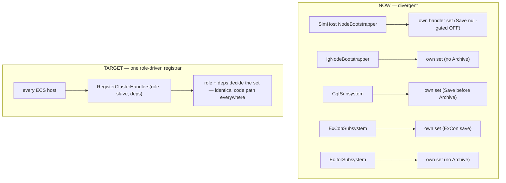

<!--STATUS
state: LIVE
updated: 2026-09-15
build-state: DESIGN
current-answer: §3 the divergence map (measured, do not re-derive) → §4 the unification plan
stale-below: —
superseded-by: —
known-rot: —
known-conflict: —
related-designs:
  - docs/designs/modularizing/MOD1-DESIGN.md — §3.3.3 defines NodeRole + role-driven NodeBootstrapper for
    REGISTRIES/MODULES/TRANSLATORS; THIS doc extends that same role model to the missing piece: cluster-STATE
    handler registration (which MOD1 left per-host).
  - docs/designs/stride-mock/DESIGN.md — §4 SharedApplicationBootstrapper (Hrot.Common) / §5 StrideNodeBootstrapper;
    the shared composition base THIS doc's unified registration should hang off.
  - docs/DESIGN_Distributed_Scenario_Persistence.md — the distributed scenario save (SaveScenarioJson) whose
    T-B failure exposed this non-unification; §4 T-B block points here.
  - docs/DESIGN_SaveScenario_Legacy_Op_Retirement.md — CE-278; the legacy SaveScenario=2 op whose ReferenceArchiveHandler
    is one of the SerializeLocal handlers this unification must place uniformly.
-->

# Unified, role-based cluster-handler registration (CE-279)

> **Tracker:** CE-279. Captures a measured divergence map (subagent + graph, `2026-09-15`) so the unification
> can be built later **without re-deriving** it.
> 🔒 **User ruling `2026-09-15`:** *"If all ecs hosts use same code, it must work same way everywhere. Role based…"*

**build-state: DESIGN** (analysis complete; promote to READY-TO-BUILD with class+sequence UML before dispatch)

---

## 1. The problem

Each ECS host hand-rolls its own `ClusterSlave` handler registration, so the sets, the ORDER, and the
registration CONDITIONS drift. Every T-B distributed-save failure (`DESIGN_Distributed_Scenario_Persistence.md`
§4) is a symptom. The role model to fix it **already exists** (`NodeRole`, MOD1's role-driven bootstrapper)
but was never applied to handler registration.

## 2. The design intent that already exists (and is under-adopted)

| asset | where | what it does today |
|---|---|---|
| `NodeRole` enum (`[Flags]`) | `FDP/Engine/Fdp.Core/Abstractions/NodeRole.cs` | exists; drives module/registry/translator selection in MOD1 — but **NOT** handler registration |
| `SharedApplicationBootstrapper` | `Hrot/Engine/Hrot.Common/Infrastructure/SharedApplicationBootstrapper.cs` | shared base; `BuildOrchestration` is an **abstract hook** — **registers NO handlers** |
| `NodeBootstrapper.BuildOrchestration` | `Hrot/Subsystems/Hrot.SimHost/NodeBootstrapper.cs:163` (registers :247–:344) | the only shared registration method, but **param-gated, not role-driven**, and **only SimHost variants call it** |

## 3. 🔴 THE DIVERGENCE MAP — measured `2026-09-15` (do not re-derive)

Dispatch is **first-registered-`CanHandle`-true wins** (`ClusterSlave.cs:362-364`). `ReferenceArchiveHandler`,
`HrotScenarioSaveHandler`, `ExConScenarioSaveHandler` all claim `NodeOpType.SerializeLocal`.

| Host | registration path | `ReferenceArchiveHandler` | scenario-save handler | SerializeLocal order |
|---|---|---|---|---|
| **SimHost** | shared `NodeBootstrapper.BuildOrchestration` | yes, unconditional (`NodeBootstrapper.cs:292`) | `HrotScenarioSaveHandler` **only if `scenarioSerializer!=null`** (`:331`) — ⛔ **prod passes null** (`SimHostNodeBootstrapper.cs:421`, `StrideNodeBootstrapper.cs:395`) ⇒ **absent in production** | Archive first; Save absent |
| **IG** | inline `IgNodeBootstrapper.cs` | ⛔ **absent** | `HrotScenarioSaveHandler` (`:392`, unconditional, `zoneService:null`) | Save (no Archive) |
| **CGF** | inline `CgfSubsystem.cs` | yes (`:1197`) | `HrotScenarioSaveHandler` (`:1151`, `zoneService:null`) | ⚠ **Save FIRST, Archive second — opposite of SimHost/ExCon** |
| **ExCon** | inline `ExConSubsystem.cs` | yes (`:381`) | `ExConScenarioSaveHandler` (`:390`) — a **different class** | Archive first, ExCon-Save second |
| **Editor** | inline `EditorSubsystem.cs` | ⛔ **absent** | `HrotScenarioSaveHandler` (`:1440`, **real `zoneService`**) | Save (no Archive) |

⚠ Second CGF path exists: `CgfApplication.cs:168-230` registers `ReferenceArchiveHandler` and no save handler —
a separate registration site from `CgfSubsystem.cs` (`R-132` near-duplicate smell).

Ctor signatures a unified registrar must satisfy:
- `ReferenceArchiveHandler(string localTempRoot, int nodeId)`
- `HrotScenarioSaveHandler(ScenarioSerializer, IZoneManagerService?, ITkbDatabase?, EntityRepository world, int nodeId)`
- `ExConScenarioSaveHandler(ExConObserverState state, int nodeId)` — no ECS inputs; cannot be built from the same deps.

## 4. The plan — three layers, all the same disease

*Caption: today five bespoke registration sites (each a place to drift); target is one role-driven registrar every host calls, so the handler set is a function of role+deps, not of which file you edited.*

| # | layer | fix |
|---|---|---|
| **A** | **Unify registration** | one role-driven `RegisterClusterHandlers(NodeRole role, ClusterSlave slave, deps)` in the shared composition layer (extend `SharedApplicationBootstrapper` / `Hrot.NodeComposition`), called by ALL five hosts. Handler set + order = function of role+deps. Retires the 5 bespoke sites. ExCon's no-ECS save handler is selected by role (observer role), not special-cased per file. |
| **B** | **Payload-agnostic `SerializeLocal` wire** | teach `NodeOpMasterTranslator`/`NodeOpSlaveTranslator` to carry a payload discriminator so `ScenarioSaveHandlerPayload` (with `ScenarioName`) survives the DDS hop, not only `ArchiveHandlerPayload` (`NodeOpSlaveTranslator.cs:174-178`). |
| **C** | **Payload-aware selection** | `CanHandle(ExecuteNodeOpIntent)` override on the three `SerializeLocal` handlers (archive⇒`ArchiveHandlerPayload`; scenario⇒`ScenarioSaveHandlerPayload`), mirroring the existing `HrotEditLoadHandler:92`. Once registration is unified this is a one-place concern; ⚠ also fix the pre-existing path-mismatch in `ReferenceArchiveHandlerTests.Commit_ProducesManifestJson` (the test writes the `.fdp` without the `exercises/` segment the handler reads). |

**Order to build:** A (unify) first — it makes B and C single-site changes instead of five. Then B (wire), then C (selection) + the T-B re-verification (`DESIGN_Distributed_Scenario_Persistence.md` §4).

## 5. Blast radius / cautions
- Touches all five hosts' composition roots + the NodeOp wire translators — large but mechanical once the registrar exists. Gate with `CgfHandlerRegistrationTests` / `ExConHandlerRegistrationTests` (they already assert per-host handler sets) rewritten to assert the unified registrar's output per role.
- ⛔ Do NOT fold this into the CE-277 scenario-save commit — it is a cross-cutting refactor of its own.
- Promote to READY-TO-BUILD with a `classDiagram` (the registrar + the handler interfaces) and a `sequenceDiagram` (fan-out → wire → slave dispatch → handler) before dispatch, per the NO-IMPLEMENTATION-WITHOUT-UML rule.
