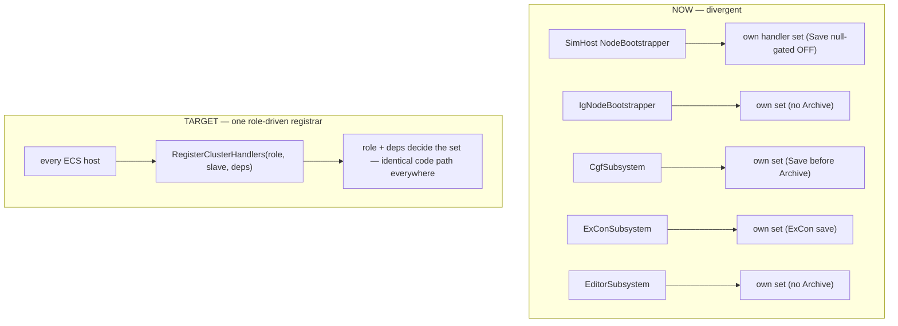
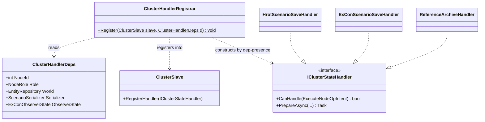
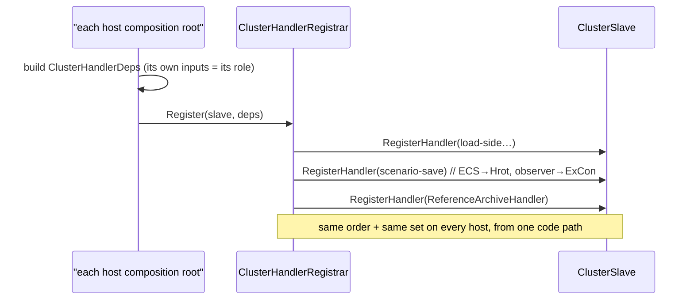

<!--STATUS
state: LIVE
updated: 2026-09-15
build-state: READY-TO-BUILD (Layer A)
current-answer: §6 Layer A READY-TO-BUILD (registrar + deps + role table + UML); §3 the divergence map (measured, do not re-derive)
stale-below: —
superseded-by: —
known-rot: —
known-conflict: —
related-designs:
  - docs/designs/modularizing/MOD1-DESIGN.md — §3.3.3 defines NodeRole + role-driven NodeBootstrapper for
    REGISTRIES/MODULES/TRANSLATORS; THIS doc extends that same role model to the missing piece: cluster-STATE
    handler registration (which MOD1 left per-host).
  - docs/designs/stride-mock/DESIGN.md — §4 SharedApplicationBootstrapper (Hrot.Common) / §5 StrideNodeBootstrapper;
    the shared composition base THIS doc's unified registration should hang off.
  - docs/DESIGN_Distributed_Scenario_Persistence.md — the distributed scenario save (SaveScenarioJson) whose
    T-B failure exposed this non-unification; §4 T-B block points here.
  - docs/DESIGN_SaveScenario_Legacy_Op_Retirement.md — CE-278; the legacy SaveScenario=2 op whose ReferenceArchiveHandler
    is one of the SerializeLocal handlers this unification must place uniformly.
-->

# Unified, role-based cluster-handler registration (CE-279)

> **Tracker:** CE-279. Captures a measured divergence map (subagent + graph, `2026-09-15`) so the unification
> can be built later **without re-deriving** it.
> 🔒 **User ruling `2026-09-15`:** *"If all ecs hosts use same code, it must work same way everywhere. Role based…"*

**build-state: READY-TO-BUILD (Layer A)** — §6 carries the registrar API, role/deps table, class + sequence UML.

---

## 0. INVENTORY — the full cluster-handler set *(graph + grep, `2026-09-15`)*

⭐ A unification decides WHERE registration lives, so it needs the complete set of handlers, not a sample.

```
search_graph(project="home-user-HROT", name_pattern=".*ClusterStateHandler.*", label="Class")  → total 2 (interface-named only)
grep -rln ": IClusterStateHandler|: ITickableClusterStateHandler" --include=*.cs Hrot FDP | grep -iv test   → 21 files
```

⚠ **Graph under-reports interface implementations** (C# dispatch, per CLAUDE.md) — grep is the exhaustive set here.
Of the 21: 2 are the interface/marker defs (`ClusterSlave.cs`, `ITickableClusterStateHandler.cs`), 1 is new this
turn (`ExConScenarioLoadHandler`, CE-280). The **~18 implementations**: reference handlers in `Fdp.Toolkits`
(`ReferenceArchive/Checkpoint/EditLoad/EpisodeLoad/LiveLoad/Prefetch/Preview/ReplayLoad/ScenarioLoad`), and
host-specific ones NOT reachable downward — `DiagnosticsDumpClusterOpHandler` (Hrot.Common), `HrotEditLoadHandler`
/ `HrotScenarioSaveHandler` (Hrot.Presentation), `CgfEpisodeLoadHandler` / `CgfScenarioLoadHandler` (Hrot.CGF),
`ExConScenarioSaveHandler` / `ExConScenarioLoadHandler` (Hrot.ExCon), `IgZoneDummyHandler` (Hrot.IG),
`HrotScenarioLoadHandler` / `TkbLoadClusterStateHandler` (Hrot.SimHost). ⇒ the `SerializeLocal` pair (Save +
Archive) is the one Layer A unifies; the rest is A2's move-down (deferred).

---

## 1. The problem

Each ECS host hand-rolls its own `ClusterSlave` handler registration, so the sets, the ORDER, and the
registration CONDITIONS drift. Every T-B distributed-save failure (`DESIGN_Distributed_Scenario_Persistence.md`
§4) is a symptom. The role model to fix it **already exists** (`NodeRole`, MOD1's role-driven bootstrapper)
but was never applied to handler registration.

## 2. The design intent that already exists (and is under-adopted)

| asset | where | what it does today |
|---|---|---|
| `NodeRole` enum (`[Flags]`) | `FDP/Engine/Fdp.Core/Abstractions/NodeRole.cs` | exists; drives module/registry/translator selection in MOD1 — but **NOT** handler registration |
| `SharedApplicationBootstrapper` | `Hrot/Engine/Hrot.Common/Infrastructure/SharedApplicationBootstrapper.cs` | shared base; `BuildOrchestration` is an **abstract hook** — **registers NO handlers** |
| `NodeBootstrapper.BuildOrchestration` | `Hrot/Subsystems/Hrot.SimHost/NodeBootstrapper.cs:163` (registers :247–:344) | the only shared registration method, but **param-gated, not role-driven**, and **only SimHost variants call it** |

## 3. 🔴 THE DIVERGENCE MAP — measured `2026-09-15` (do not re-derive)

Dispatch is **first-registered-`CanHandle`-true wins** (`ClusterSlave.cs:362-364`). `ReferenceArchiveHandler`,
`HrotScenarioSaveHandler`, `ExConScenarioSaveHandler` all claim `NodeOpType.SerializeLocal`.

| Host | registration path | `ReferenceArchiveHandler` | scenario-save handler | SerializeLocal order |
|---|---|---|---|---|
| **SimHost** | shared `NodeBootstrapper.BuildOrchestration` | yes, unconditional (`NodeBootstrapper.cs:292`) | `HrotScenarioSaveHandler` **only if `scenarioSerializer!=null`** (`:331`) — ⛔ **prod passes null** (`SimHostNodeBootstrapper.cs:421`, `StrideNodeBootstrapper.cs:395`) ⇒ **absent in production** | Archive first; Save absent |
| **IG** | inline `IgNodeBootstrapper.cs` | ⛔ **absent** | `HrotScenarioSaveHandler` (`:392`, unconditional, `zoneService:null`) | Save (no Archive) |
| **CGF** | inline `CgfSubsystem.cs` | yes (`:1197`) | `HrotScenarioSaveHandler` (`:1151`, `zoneService:null`) | ⚠ **Save FIRST, Archive second — opposite of SimHost/ExCon** |
| **ExCon** | inline `ExConSubsystem.cs` | yes (`:381`) | `ExConScenarioSaveHandler` (`:390`) — a **different class** | Archive first, ExCon-Save second |
| **Editor** | inline `EditorSubsystem.cs` | ⛔ **absent** | `HrotScenarioSaveHandler` (`:1440`, **real `zoneService`**) | Save (no Archive) |

⚠ Second CGF path exists: `CgfApplication.cs:168-230` registers `ReferenceArchiveHandler` and no save handler —
a separate registration site from `CgfSubsystem.cs` (`R-132` near-duplicate smell).

Ctor signatures a unified registrar must satisfy:
- `ReferenceArchiveHandler(string localTempRoot, int nodeId)`
- `HrotScenarioSaveHandler(ScenarioSerializer, IZoneManagerService?, ITkbDatabase?, EntityRepository world, int nodeId)`
- `ExConScenarioSaveHandler(ExConObserverState state, int nodeId)` — no ECS inputs; cannot be built from the same deps.

## 4. The plan — three layers, all the same disease



*Caption: today five bespoke registration sites (each a place to drift); target is one role-driven registrar every host calls, so the handler set is a function of role+deps, not of which file you edited.*

| # | layer | fix |
|---|---|---|
| **A** | **Unify registration** | one role-driven `RegisterClusterHandlers(NodeRole role, ClusterSlave slave, deps)` in the shared composition layer (extend `SharedApplicationBootstrapper` / `Hrot.NodeComposition`), called by ALL five hosts. Handler set + order = function of role+deps. Retires the 5 bespoke sites. ExCon's no-ECS save handler is selected by role (observer role), not special-cased per file. |
| **B** | **Payload-agnostic `SerializeLocal` wire** | teach `NodeOpMasterTranslator`/`NodeOpSlaveTranslator` to carry a payload discriminator so `ScenarioSaveHandlerPayload` (with `ScenarioName`) survives the DDS hop, not only `ArchiveHandlerPayload` (`NodeOpSlaveTranslator.cs:174-178`). |
| **C** | **Payload-aware selection** | `CanHandle(ExecuteNodeOpIntent)` override on the three `SerializeLocal` handlers (archive⇒`ArchiveHandlerPayload`; scenario⇒`ScenarioSaveHandlerPayload`), mirroring the existing `HrotEditLoadHandler:92`. Once registration is unified this is a one-place concern; ⚠ also fix the pre-existing path-mismatch in `ReferenceArchiveHandlerTests.Commit_ProducesManifestJson` (the test writes the `.fdp` without the `exercises/` segment the handler reads). |

**Order to build:** A (unify) first — it makes B and C single-site changes instead of five. Then B (wire), then C (selection) + the T-B re-verification (`DESIGN_Distributed_Scenario_Persistence.md` §4).

## 5. Blast radius / cautions
- Touches all five hosts' composition roots + the NodeOp wire translators — large but mechanical once the registrar exists. Gate with `CgfHandlerRegistrationTests` / `ExConHandlerRegistrationTests` (they already assert per-host handler sets) rewritten to assert the unified registrar's output per role.
- ⛔ Do NOT fold this into the CE-277 scenario-save commit — it is a cross-cutting refactor of its own.
- Promote to READY-TO-BUILD with a `classDiagram` (the registrar + the handler interfaces) and a `sequenceDiagram` (fan-out → wire → slave dispatch → handler) before dispatch, per the NO-IMPLEMENTATION-WITHOUT-UML rule.

## 6. ⭐ LAYER A — READY-TO-BUILD design

**Where it lives — CORRECTED `2026-09-15` (layering verified):** a new static `ClusterHandlerRegistrar` in
**`Hrot.Presentation`** (NOT `Hrot.Common`). Measured: no assembly sits above all five hosts and reaches all
handlers. `Hrot.Presentation` is referenced by all five hosts AND reaches `Fdp.Toolkits`/`Fdp.Core`/`Hrot.Core`,
so it can CONSTRUCT the 7 `Fdp.Toolkits` `Reference*` handlers + its own `HrotScenarioSaveHandler`/`HrotEditLoadHandler`.
⛔ It CANNOT reach **four** handlers (backward refs): `ExConScenarioSaveHandler` (Hrot.ExCon),
`TkbLoadClusterStateHandler` + `HrotScenarioLoadHandler` (Hrot.SimHost), `DiagnosticsDumpClusterOpHandler`
(Hrot.Common); nor deps `EcsRecordReplayController` (Hrot.SimHost) / `ExConObserverState` (Hrot.ExCon).
⇒ **those four are passed in as PRE-BUILT `IClusterStateHandler?` instances**; the registrar places them in the
canonical order. The unification is of the SELECTION + ORDER (one code path decides the set and its order for
every host) — a few host-specific handler INSTANCES remain host-constructed inputs. (A future cleanup could
move the SimHost/Common handlers down into a shared assembly to shrink the pass-in set; out of scope for A.)

**The discriminant is dep-presence, which IS the node's role** — an ECS host supplies `World`+`Serializer`; the
observer host (ExCon) supplies `ObserverState` and no `World`. `NodeRole` is passed for the genuinely
role-specific handlers (checkpoint recording).

### 6.1 The deps record
```
public sealed record ClusterHandlerDeps(
    int                          NodeId,
    string                       LocalTempRoot,
    NodeRole                     Role,
    EntityRepository?            World,             // null ⇒ no-ECS host (ExCon)
    ScenarioSerializer?          Serializer,        // present ⇒ ECS host authors/loads scenarios
    IZoneManagerService?         ZoneService,       // optional (CGF/IG null today; Editor real)
    ITkbDatabase?                TkbDb,
    IStorageProvider?            StorageProvider,
    EcsRecordReplayController?   Controller,
    CheckpointIOWorker?          CheckpointWorker,
    ExConObserverState?          ObserverState,     // present ⇒ observer host (ExCon)
    DiagnosticsDumpClusterOpHandler? DiagnosticsHandler,
    IScenarioExtractor?          ScenarioExtractor, // load-side deps (present with Serializer)
    IScenarioSource?             ScenarioSource,
    IIdAllocator?                ScenarioIdAllocator);
```

### 6.2 Role/deps → handler set (the ONE table that replaces five files)
| handler | registered when | notes |
|---|---|---|
| `ReferenceReplayLoadHandler` | `Controller != null` | load-side |
| `ReferenceLiveLoadHandler` | always | load-side (claims FinalizeLive + cold PrepareLive) |
| `ReferencePreviewHandler` | always | `World`-or-null tolerant |
| `ReferencePrefetchHandler` | `StorageProvider != null` | |
| `ReferenceCheckpointHandler` | `CheckpointWorker != null` | recording roles |
| `TkbLoadClusterStateHandler` | `TkbDb != null` | before scenario load |
| `HrotScenarioLoadHandler` / `HrotEditLoadHandler` / `ReferenceEpisodeLoadHandler` | `Serializer != null` | ECS load-side |
| `ReferenceArchiveHandler(LocalTempRoot, NodeId)` | always | `.fdp` exercise-recording collect; null-safe if no recording |
| **`HrotScenarioSaveHandler`** | **`World != null && Serializer != null`** | ⭐ **the fix — uniform on EVERY ECS host** (ruled: no role exceptions). SimHost now supplies a real `Serializer` |
| **`ExConScenarioSaveHandler`** | **`World == null && ObserverState != null`** | the no-ECS observer variant |
| `DiagnosticsDumpClusterOpHandler` | `DiagnosticsHandler != null` | |

⭐ **Order is fixed in the registrar** so it is identical everywhere: **scenario-save handler registered
BEFORE `ReferenceArchiveHandler`** — belt-and-suspenders even before Layer C's payload-aware `CanHandle`
lands (so the scenario payload is never shadowed regardless of C).

### 6.3 UML




*Caption: the only per-host variation is the deps a host can supply; the registrar turns deps into the same set the same way everywhere — the class diagram shows there is exactly ONE registrar, the sequence shows every host funnels through it.*

### 6.3a ⚠ FEASIBILITY FINDING `2026-09-15` — a full "one registrar constructs everything" is NOT cheap

Measured against SimHost's real `NodeBootstrapper.BuildOrchestration` (`:163-352`): the handlers are not just in
unreachable assemblies (§6 "Where it lives"), they are **constructed from deeply host-specific inputs**. E.g.
`ReferenceReplayLoadHandler` (`:247`) takes SimHost's `inputGroup/simGroup/postSimGroup/lifecycleGroup`
scheduling groups, `kernel.Suspend/ResumeGlobalTimePush` callbacks, the ELM's `OnWorldReplaced`, and a
ghost-bypass toggle — SimHost-only types the registrar cannot see. ⇒ a registrar that constructs the FULL set
would need most handlers passed in as pre-built instances, which dilutes the "unify construction" goal to
"unify ordering." ⇒ **two scopes:**

| scope | what it unifies | cost / risk | fixes the T-B bug? |
|---|---|---|---|
| ⭐ **A1 (narrow, LEAN)** — a shared `SerializeLocalRegistrar` helper each host calls with its **archive** + **scenario-save** handler instances | the ORDER + payload-aware SELECTION of the two `SerializeLocal`-family handlers (the ones that actually diverge/shadow), in one place | small, low risk; ~1 helper + 5 two-line host edits + the `CanHandle` override (Layer C folds in) | ✅ yes — this IS the divergence that broke T-B |
| **A2 (full)** — move `TkbLoad/HrotScenarioLoad` (Hrot.SimHost), `DiagnosticsDump` (Hrot.Common), and the reply/live/preview handlers' host deps into shared assemblies, then one mega-registrar | all handler registration | large, cross-assembly, high regression risk; the load handlers were **not** buggy | ✅ but with far more blast radius |

⭐⭐ **LEAN: A1.** It unifies exactly the part that diverged and broke (`SerializeLocal` save placement/order/shadowing)
and makes every ECS host place its save handler the same way, at low risk. A2's extra uniformity has low marginal
value (load handlers weren't the problem) and high cost. **Pending user confirm before building** — the two scopes
build very different amounts of code.

### 6.3b ✅ A1 AS-BUILT `2026-09-15`
- **`SerializeLocalRegistrar`** (`FDP/Toolkits/Fdp.Toolkits/Orchestration/SerializeLocalRegistrar.cs`): the one
  place that registers the SerializeLocal pair — **scenario-save first, archive second** — either nullable.
- **Payload-aware `CanHandle(ExecuteNodeOpIntent)`** added to `ReferenceArchiveHandler` (⇒ `ArchiveHandlerPayload`
  only), `HrotScenarioSaveHandler` and `ExConScenarioSaveHandler` (⇒ `ScenarioSaveHandlerPayload` only). Selection
  no longer depends on registration order (Layer C, folded into A1).
- **All five hosts repointed** to `SerializeLocalRegistrar.Register(...)`: SimHost (`NodeBootstrapper`), IG
  (`IgNodeBootstrapper`, archive null), CGF (`CgfSubsystem`), ExCon (`ExConSubsystem`, was Archive-before-Save →
  now uniform), Editor (`EditorSubsystem`, archive null). The bespoke separate registrations are gone.
- **Rail:** `ReferenceArchiveHandlerTests.SerializeLocalRegistrar_RoutesByPayload_ArchiveDoesNotShadowScenario`;
  also fixed the pre-existing stale `Commit_ProducesManifestJson` (its expected path omitted the `exercises/`
  segment the handler emits — measured red on the clean tree, unrelated to this change).
- ✅ **SimHost + Stride SimHost serializer wired `2026-09-15`** — was `scenarioSerializer: null`; both
  composition roots already RECEIVE the shared serializer as a `BuildOrchestration` override param (built by
  `HrotScenarioSerializerFactory` — the same factory CGF/Editor/IG use) and simply passed `null`. Now they pass
  it. `NodeBootstrapper.BuildOrchestration` was decoupled so the SAVE handler registers whenever a serializer is
  present, independent of the LOAD deps (a muscle node that only replicates gets SAVE without LOAD — no throw).
  ⇒ every ECS host now registers the scenario save handler; a muscle node's slice is empty by the gate. Verified
  live: `--mode all` save now writes 3 `Hrot.Scenario` slices (up from 2) + ExCon foreign; merged still 9
  entities (SimHost owns nothing persistable). The one remaining "No handler" is the orchestrator (no ECS world).

### 6.3c ✅ LAYER B AS-BUILT `2026-09-15` — the SerializeLocal wire carries the scenario payload
The NodeOp wire (`NodeOpMasterTranslator` egress / `NodeOpSlaveTranslator` ingress) reused
`NodeTransitionPayloadDto` (which already has `ScenarioId` + `ExerciseId`) as the `SerializeLocal` wire shape,
discriminated: **`ScenarioId` set ⇒ `ScenarioSaveHandlerPayload`** (carrying the scenario name);
**`ExerciseId` set ⇒ `ArchiveHandlerPayload`**. Previously ingress hardcoded `ArchiveHandlerPayload`, so the
scenario payload (+name) was dropped on every DDS hop to a remote node — the reason no cross-node slice was
written. Rails: `NodeOpSlaveTranslatorTests.DeserializeNodePayload_SerializeLocal_{ScenarioId,ExerciseId}_*`.
⇒ with A + B the fan-out reaches every ECS node with the correct payload; the node's unified registrar +
payload-aware `CanHandle` route it to the scenario save handler, which writes the slice.

**✅ T-B VERIFIED GREEN `2026-09-15`** on live `--mode all`: `POST /scenario/save` → merged `scenario.json`
(`Hrot.Scenario`, 9 entities) + `foreign/node_200.json` (`ExCon.Observer`) on the NAS. Log: fan-out to 5 nodes
→ 2 nodes wrote `Hrot.Scenario` slices, ExCon wrote the foreign slice → `merged 3 slice(s)` + `kept 1 foreign`.
The distributed save that CE-277 could not complete now works end to end. 📄
`DESIGN_Distributed_Scenario_Persistence.md` §4.

### 6.4 Build steps (A2 form — see 6.3a; A1 is a strict subset)
1. Add `ClusterHandlerRegistrar` + `ClusterHandlerDeps` in `Hrot.Common`; unit-test its output per deps shape (ECS-with-serializer, observer, load-only).
2. Repoint **SimHost** first (`NodeBootstrapper.BuildOrchestration` → build deps + call registrar; **supply a real `Serializer`** so the save handler is present — the ruled fix). Gate: SimHost boots, `SimHost` registration test asserts the save handler is present.
3. Repoint IG, CGF, ExCon, Editor in turn; rewrite `CgfHandlerRegistrationTests`/`ExConHandlerRegistrationTests` to assert the registrar's output.
4. Delete the five bespoke `RegisterHandler` sequences.
⚠ Layer A makes save-handler PRESENCE uniform; the cross-node wire (Layer B) and payload selection (Layer C) still land before T-B is green.
