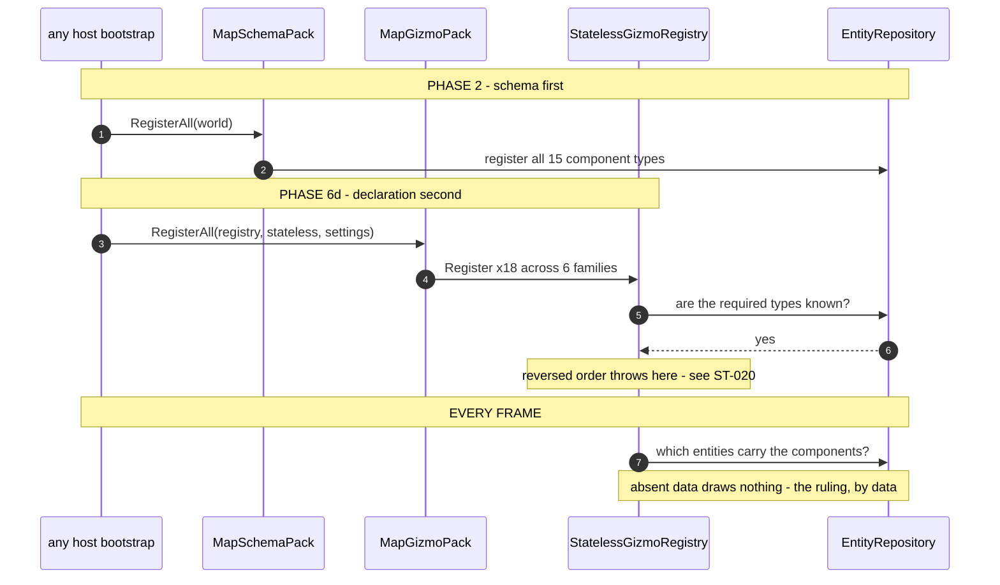

<!--STATUS
state: LIVE
build-state: READY-TO-BUILD
updated: 2026-08-23
current-answer: the whole file — UXI-23 §3.2's GIZMO HALF, made concrete. §1's matrix is the measurement
  that matters: the editor declares all six projector families and every other host declares a subset.
  §3 the design, §4 the UML, §5 the rails, §6 the risks.
design-basis: 🔒 user 2026-08-23 ("replaybrowser is no exception… same full set of gizmos as everyone
  else, same philosophy (component presence defines applicable gizmos). same for ig") ·
  docs/UX/UX_Feature_Map_Parity.md §3.2 + UXI-22/23's 2026-08-10 ruling (uniform membership) ·
  Architect_Question_52 §0 (the rule) and §6 (the as-built schema half).
known-conflict: none. ⭐ This IMPLEMENTS UXI-23's gizmo half; ⛔ it does not build the rest of
  MapInteractionPack (actions, selection, rubber-band, layer control) — §6.
-->
# DESIGN — **uniform gizmo membership** *(every host, every family)*

## 1. ⭐⭐⭐ THE RULING, AND THE MATRIX IT LANDS ON

> 🔒 **User, `2026-08-23`:** *"replaybrowser is no exception, should use same full set of gizmos as
> everyone else, same philosophy (component presence defines applicable gizmos). same for ig."*
>
> 🔒 **UXI-23, ruled `2026-08-10`:** *"all hosts share the **FULL set**; differences are **data
> availability** or host rules, **never set membership**"* ⇒ *"the pack decides; **the host does not
> curate**."*

### INVENTORY — ⭐⭐ **the queries, and the matrix**

| query run | total | result |
|---|---|---|
| every namespace holding a `[GizmoProjector]` *(non-test, non-`obj`)* | ⭐ **6 families / 18 projectors** | `Hrot.Common.Diagnostics.Gizmos` **7** · `Hrot.ScenarioEditor.Gizmos` **5** · `Hrot.IG.Gizmos` **3** · `Hrot.SimHost.Gizmos` **1** · `Hrot.CGF.Gizmos` **1** · `Hrot.AI.Behaviors.Gizmos` **1** |
| the UNION of `typeof(...)` across those 18 | ⭐⭐ **15 components** | `BallisticProjectile` `BehaviorState` `BrainBlackboard` `CullingState` `EqsSensor` `IgHealthState` `MapOverlayStyle` `NavigationIntent` `NetworkIdentity` `PerceptionReceptor` `SelectionState` `SimTransform` `TargetMemory` `TkbIdentity` `VisualEffectState` |
| `MapSchemaPack.RegisterAll` today | 🔴 **5 of 15** | it closed **IG's** gap only *(`ST-022`)* |
| every `GizmoRegistrar.Register*` call site per host | ⭐⭐⭐ **the matrix below** | 5 hand-rolled lists, **all different** |

### 🔴🔴 THE MATRIX — **the editor is the only host with the full set**

| host | declares | ⛔ MISSING |
|---|---|---|
| ⭐ **editor** *(`EditorSubsystem.cs:1431-1445`)* | **6 / 6** | ✅ none |
| **ig** *(`IgApplication.cs:742,744` → its aggregator `:16,17,21`)* | **4 / 6** | `SimHost` · `CGF` |
| **replaybrowser** *(`ReplayBrowserSubsystem.cs:165-171`)* | **3 / 6** | `ScenarioEditor` **(5!)** · `IG` · `CGF` |
| 🔴 **simhost** *(`SimHostApp.cs:337,342`)* | **1 / 6** | ⛔⛔ **`Common` (7!)** · `ScenarioEditor` · `IG` · `CGF` · `AI.Behaviors` |
| 🔴 **cgf** *(`CgfSubsystem.cs:526,528`)* | **1 / 6** | ⛔⛔ **`Common` (7!)** · `ScenarioEditor` · `IG` · `SimHost` · `AI.Behaviors` |

⭐⭐⭐ **This independently confirms UXI-22, word for word:** *"Neither SimHost nor CGF calls
`Hrot.Common.Diagnostics.Gizmos.GizmoRegistrar` — costing them the selection ring **and** the map entity
context menu, health bars, LOS, vis-cone, spatial grid."* ⇒ ⭐ **`Common` is the SEVEN-projector family**,
and two hosts miss it entirely.

⚠ **`Hrot.Presentation.Gizmos` is called by ALL FIVE hosts and holds ZERO projectors** *(it is not in the
6)*. ⇒ ⭐ settings/registration-only, presumably — ⛔ **not asserted; §6 lists it as a question.**

## 2. ⭐⭐ THE TWO INVARIANTS — **one is checked, one is not**

| # | invariant | today |
|---|---|---|
| **A** | ⭐ **SCHEMA follows DECLARATION** — every component a declared family needs is registered on this host's world | ✅ **checked** — `GizmoSchemaFollowsDeclarationRails` *(`ST-023`)* |
| **B** | ⭐⭐⭐ **DECLARATION IS COMPLETE** — every host declares **all six** families | 🔴 **NOT CHECKED, AND FALSE ON FOUR OF FIVE HOSTS** |

⇒ ⭐⭐ **`B` is this design.** ⛔ **And `A` is why `B` cannot land alone:** the moment simhost declares
`Common`, `StatelessGizmoRegistry` validates 7 more projectors against its world and **throws in bootstrap**
unless the schema is there first. 📌 **Exactly how `--mode ig` died** *(`ST-020`)*.

## 3. ⭐⭐⭐ THE DESIGN

| # | ⭐ |
|---|---|
| **①** | ⭐⭐⭐ **`MapSchemaPack.RegisterAll` covers ALL 15**, not 5. ⭐ It is already idempotent by its own doc *(`RegisterComponent<T>` tolerates a repeat)*, so a host whose role registry already declares one may call both |
| **②** | ⭐⭐⭐ **ONE declaration entry point — `MapGizmoPack.RegisterAll(registry, statelessRegistry, settings)`** — declaring **all six** families **+ `Hrot.Presentation.Gizmos`**. ⭐ It replaces **five** hand-rolled per-host lists ⇒ *"the pack decides; the host does not curate."* ⛔ **Home: `Hrot.Common.Diagnostics.Gizmos`**, beside `MapSchemaPack`, for the reason `ST-022` already argued — the one assembly every host references |
| **③** | 🔴🔴 **ORDER IS LOAD-BEARING: schema (`①`) BEFORE declaration (`②`), per host.** ⭐ For a `SharedApplicationBootstrapper` host that is **Phase 2** *(`RegisterDomainComponents`)* before **Phase 6d** *(the registrars)* — 📄 `MapSchemaPack`'s own doc states it. ⛔ **Get this wrong and the host dies in bootstrap** |
| **④** | ⚠ **`replaybrowser` needs a registration path FOUND, not invented.** 📐 `ST-024`: a grep for `RegisterComponent<`/`ComponentRegistry` across that subsystem returns **nothing**, yet it boots ⇒ **it inherits a world registered elsewhere.** ⇒ ⭐⭐ **item ⓪ of the batch: establish where its world comes from, and put `①` there.** ⛔ **Do not guess an entry point** |
| **⑤** | ⭐ **The editor's INLINE IG registrations stay for now** — 📐 it hand-picks `CullingState`/`VisualEffectState` at `:864`/`:868` instead of calling `IgRoleComponentRegistry` *(`ST-024`)*. ⚠ **A second list that can drift** ⇒ ⭐ once `①` covers all 15, those two become redundant — **note it, do not chase it in this batch** |

⭐⭐ **What this is NOT:** ⛔ `MapInteractionPack` itself. 📄 UXI-23 §3.2's pack also carries the action
registry, dispatch, `SelectionInteractionSystem` + `RubberBandState`, `CanvasMenuUpdateSystem` and the
layer control. ⇒ ⭐ **`MapGizmoPack` is its GIZMO half, landed first**, and the pack should later **call**
it rather than duplicating it.

## 4. ⭐⭐⭐ THE UML

### 4.1 Class view

### 4.2 Sequence — ⭐⭐ **per host, and why the order is not negotiable**

## 5. ⭐⭐ THE RAILS

| ⭐ | |
|---|---|
| ⭐⭐⭐ **DECLARATION COMPLETENESS — the new invariant `B`** | *"every host declares all six families."* ⭐ Assert against the **enumerated** family set *(reflection over `[GizmoProjector]` namespaces)*, ⛔ **not a hardcoded list of six** — a seventh family must fail this, not be silently excluded |
| ⭐ **extend `GizmoSchemaFollowsDeclarationRails`, do NOT add a second file** | ⭐ invariant `A` already lives there; `B` is its pair |
| ⭐⭐ **the mode rails are the wiring proof** | ⚠⚠ **`ST-023`'s measured limit:** the schema rail's profiles call the registries **directly**, so it is **blind to whether a host WIRES the pack** — 📐 commenting out IG's call left it green while `ModeStartupRails` reddened. ⇒ ⭐⭐⭐ **`--mode <each>` starting IS the wiring gate.** ⛔ Neither rail suffices alone |
| ⛔ **and it must be seen to FAIL** | 📐 remove one family from `MapGizmoPack` ⇒ **`B` reddens, naming the family**; remove one component from `MapSchemaPack` ⇒ **`A` reddens, naming the projector.** ⭐ Report both |

## 6. ⚠ RISKS & OPEN QUESTIONS — **recommendation each**

| | ⭐ recommendation |
|---|---|
| 🔴 **four hosts gain families they have never declared** ⇒ the blast radius is **every** subsystem's bootstrap | ⭐⭐ **land `①` (all 15) FIRST, in its own commit, and prove every mode still starts** — ⛔ only then `②`. 📌 `ST-020` is what happens when declaration outruns schema |
| ⚠ **`Hrot.Presentation.Gizmos` holds 0 projectors yet all five hosts call it** | ⭐ **keep calling it** *(support all)*; ⛔ **do not "clean it up"** — ⚠ **measure what it registers** and say so in the report. 📌 *Unreferenced is not unintentional* |
| ⚠ **`replaybrowser` has no registration path** | ⭐ **item ⓪** — find it, report it, then wire. ⛔ **A guessed entry point is worse than a filed gap** |
| ⚠ **CGF is mid-flight in the perspective/unification work** | ⭐ **gizmo families are additive and CGF's own perspective work does not touch them** — ⛔ but say so in the report if it turns out otherwise |
| ⚠ **does a host declaring a family it has no SYSTEMS for cost anything at runtime?** | 📐 A projector with no matching entity **draws nothing**; the cost is a registry entry and a per-frame query miss. ⭐ **Expected negligible — ⛔ but MEASURE the mode-rail startup time and say so**, because *"it is free"* is exactly the sort of claim this programme keeps having to retract |
