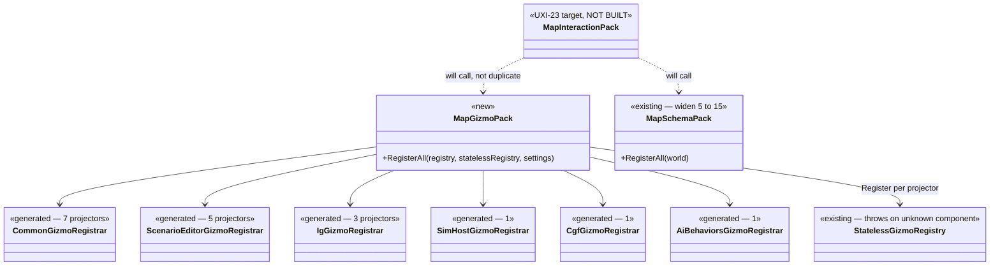
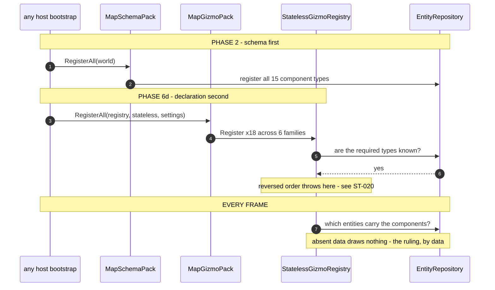
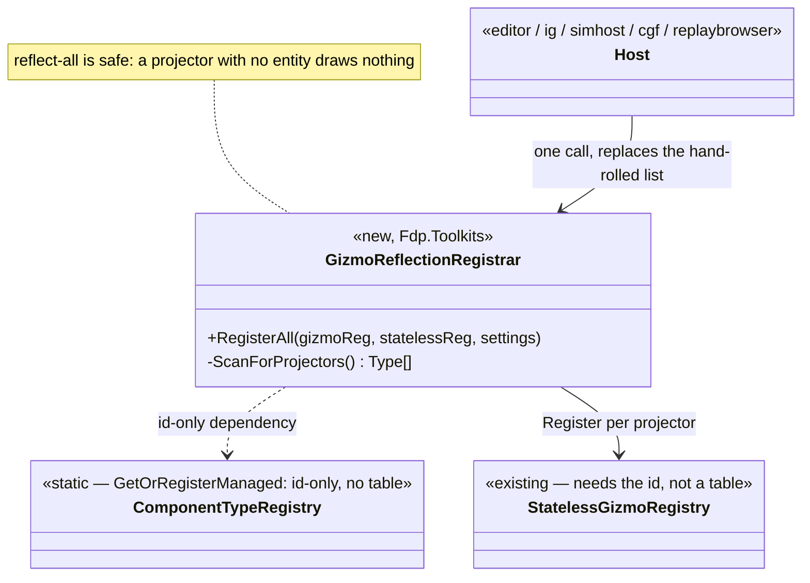
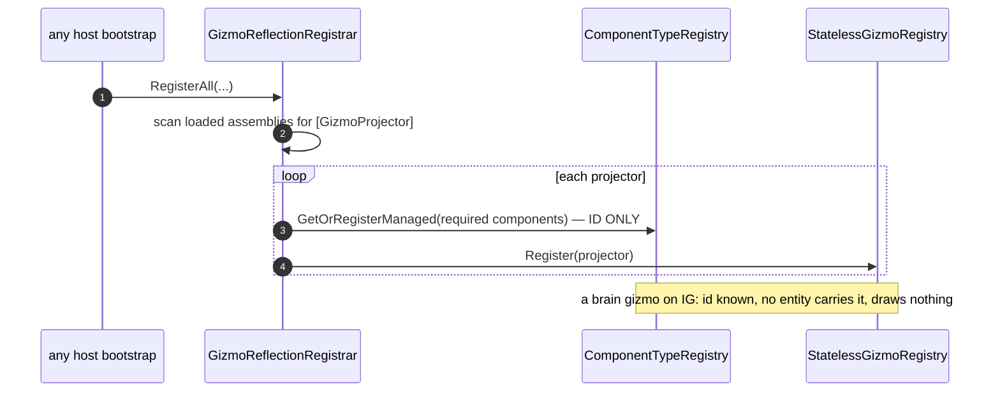

<!--STATUS
state: LIVE
build-state: BUILT
updated: 2026-08-23
current-answer: §9 is the AS-BUILT and it CLOSES §7.3/§7.4; §8 is the mechanism, §7.2 still corrects §1's inventory. The rest of the file — UXI-23 §3.2's GIZMO HALF, made concrete. §1's matrix is the measurement
  that matters: the editor declares all six projector families and every other host declares a subset.
  §3 the design, §4 the UML, §5 the rails, §6 the risks.
design-basis: 🔒 user 2026-08-23 ("replaybrowser is no exception… same full set of gizmos as everyone
  else, same philosophy (component presence defines applicable gizmos). same for ig") ·
  docs/UX/UX_Feature_Map_Parity.md §3.2 + UXI-22/23's 2026-08-10 ruling (uniform membership) ·
  Architect_Question_52 §0 (the rule) and §6 (the as-built schema half).
known-conflict: none. ⭐ This IMPLEMENTS UXI-23's gizmo half; ⛔ it does not build the rest of
  MapInteractionPack (actions, selection, rubber-band, layer control) — §6.
-->
# DESIGN — **uniform gizmo membership** *(every host, every family)*

## 1. ⭐⭐⭐ THE RULING, AND THE MATRIX IT LANDS ON

> 🔒 **User, `2026-08-23`:** *"replaybrowser is no exception, should use same full set of gizmos as
> everyone else, same philosophy (component presence defines applicable gizmos). same for ig."*
>
> 🔒 **UXI-23, ruled `2026-08-10`:** *"all hosts share the **FULL set**; differences are **data
> availability** or host rules, **never set membership**"* ⇒ *"the pack decides; **the host does not
> curate**."*

### INVENTORY — ⭐⭐ **the queries, and the matrix**

| query run | total | result |
|---|---|---|
| every namespace holding a `[GizmoProjector]` *(non-test, non-`obj`)* | ⭐ **6 families / 18 projectors** | `Hrot.Common.Diagnostics.Gizmos` **7** · `Hrot.ScenarioEditor.Gizmos` **5** · `Hrot.IG.Gizmos` **3** · `Hrot.SimHost.Gizmos` **1** · `Hrot.CGF.Gizmos` **1** · `Hrot.AI.Behaviors.Gizmos` **1** |
| the UNION of `typeof(...)` across those 18 | ⭐⭐ **15 components** | `BallisticProjectile` `BehaviorState` `BrainBlackboard` `CullingState` `EqsSensor` `IgHealthState` `MapOverlayStyle` `NavigationIntent` `NetworkIdentity` `PerceptionReceptor` `SelectionState` `SimTransform` `TargetMemory` `TkbIdentity` `VisualEffectState` |
| `MapSchemaPack.RegisterAll` today | 🔴 **5 of 15** | it closed **IG's** gap only *(`ST-022`)* |
| every `GizmoRegistrar.Register*` call site per host | ⭐⭐⭐ **the matrix below** | 5 hand-rolled lists, **all different** |

### 🔴🔴 THE MATRIX — **the editor is the only host with the full set**

| host | declares | ⛔ MISSING |
|---|---|---|
| ⭐ **editor** *(`EditorSubsystem.cs:1431-1445`)* | **6 / 6** | ✅ none |
| **ig** *(`IgApplication.cs:742,744` → its aggregator `:16,17,21`)* | **4 / 6** | `SimHost` · `CGF` |
| **replaybrowser** *(`ReplayBrowserSubsystem.cs:165-171`)* | **3 / 6** | `ScenarioEditor` **(5!)** · `IG` · `CGF` |
| 🔴 **simhost** *(`SimHostApp.cs:337,342`)* | **1 / 6** | ⛔⛔ **`Common` (7!)** · `ScenarioEditor` · `IG` · `CGF` · `AI.Behaviors` |
| 🔴 **cgf** *(`CgfSubsystem.cs:526,528`)* | **1 / 6** | ⛔⛔ **`Common` (7!)** · `ScenarioEditor` · `IG` · `SimHost` · `AI.Behaviors` |

⭐⭐⭐ **This independently confirms UXI-22, word for word:** *"Neither SimHost nor CGF calls
`Hrot.Common.Diagnostics.Gizmos.GizmoRegistrar` — costing them the selection ring **and** the map entity
context menu, health bars, LOS, vis-cone, spatial grid."* ⇒ ⭐ **`Common` is the SEVEN-projector family**,
and two hosts miss it entirely.

⚠ **`Hrot.Presentation.Gizmos` is called by ALL FIVE hosts and holds ZERO projectors** *(it is not in the
6)*. ⇒ ⭐ settings/registration-only, presumably — ⛔ **not asserted; §6 lists it as a question.**

## 2. ⭐⭐ THE TWO INVARIANTS — **one is checked, one is not**

| # | invariant | today |
|---|---|---|
| **A** | ⭐ **SCHEMA follows DECLARATION** — every component a declared family needs is registered on this host's world | ✅ **checked** — `GizmoSchemaFollowsDeclarationRails` *(`ST-023`)* |
| **B** | ⭐⭐⭐ **DECLARATION IS COMPLETE** — every host declares **all six** families | 🔴 **NOT CHECKED, AND FALSE ON FOUR OF FIVE HOSTS** |

⇒ ⭐⭐ **`B` is this design.** ⛔ **And `A` is why `B` cannot land alone:** the moment simhost declares
`Common`, `StatelessGizmoRegistry` validates 7 more projectors against its world and **throws in bootstrap**
unless the schema is there first. 📌 **Exactly how `--mode ig` died** *(`ST-020`)*.

## 3. ⭐⭐⭐ THE DESIGN

| # | ⭐ |
|---|---|
| **①** | ⭐⭐⭐ **`MapSchemaPack.RegisterAll` covers ALL 15**, not 5. ⭐ It is already idempotent by its own doc *(`RegisterComponent<T>` tolerates a repeat)*, so a host whose role registry already declares one may call both |
| **②** | ⭐⭐⭐ **ONE declaration entry point — `MapGizmoPack.RegisterAll(registry, statelessRegistry, settings)`** — declaring **all six** families **+ `Hrot.Presentation.Gizmos`**. ⭐ It replaces **five** hand-rolled per-host lists ⇒ *"the pack decides; the host does not curate."* ⛔ **Home: `Hrot.Common.Diagnostics.Gizmos`**, beside `MapSchemaPack`, for the reason `ST-022` already argued — the one assembly every host references |
| **③** | 🔴🔴 **ORDER IS LOAD-BEARING: schema (`①`) BEFORE declaration (`②`), per host.** ⭐ For a `SharedApplicationBootstrapper` host that is **Phase 2** *(`RegisterDomainComponents`)* before **Phase 6d** *(the registrars)* — 📄 `MapSchemaPack`'s own doc states it. ⛔ **Get this wrong and the host dies in bootstrap** |
| **④** | ⚠ **`replaybrowser` needs a registration path FOUND, not invented.** 📐 `ST-024`: a grep for `RegisterComponent<`/`ComponentRegistry` across that subsystem returns **nothing**, yet it boots ⇒ **it inherits a world registered elsewhere.** ⇒ ⭐⭐ **item ⓪ of the batch: establish where its world comes from, and put `①` there.** ⛔ **Do not guess an entry point** |
| **⑤** | ⭐ **The editor's INLINE IG registrations stay for now** — 📐 it hand-picks `CullingState`/`VisualEffectState` at `:864`/`:868` instead of calling `IgRoleComponentRegistry` *(`ST-024`)*. ⚠ **A second list that can drift** ⇒ ⭐ once `①` covers all 15, those two become redundant — **note it, do not chase it in this batch** |

⭐⭐ **What this is NOT:** ⛔ `MapInteractionPack` itself. 📄 UXI-23 §3.2's pack also carries the action
registry, dispatch, `SelectionInteractionSystem` + `RubberBandState`, `CanvasMenuUpdateSystem` and the
layer control. ⇒ ⭐ **`MapGizmoPack` is its GIZMO half, landed first**, and the pack should later **call**
it rather than duplicating it.

## 4. ⭐⭐⭐ THE UML

### 4.1 Class view

### 4.2 Sequence — ⭐⭐ **per host, and why the order is not negotiable**

## 5. ⭐⭐ THE RAILS

| ⭐ | |
|---|---|
| ⭐⭐⭐ **DECLARATION COMPLETENESS — the new invariant `B`** | *"every host declares all six families."* ⭐ Assert against the **enumerated** family set *(reflection over `[GizmoProjector]` namespaces)*, ⛔ **not a hardcoded list of six** — a seventh family must fail this, not be silently excluded |
| ⭐ **extend `GizmoSchemaFollowsDeclarationRails`, do NOT add a second file** | ⭐ invariant `A` already lives there; `B` is its pair |
| ⭐⭐ **the mode rails are the wiring proof** | ⚠⚠ **`ST-023`'s measured limit:** the schema rail's profiles call the registries **directly**, so it is **blind to whether a host WIRES the pack** — 📐 commenting out IG's call left it green while `ModeStartupRails` reddened. ⇒ ⭐⭐⭐ **`--mode <each>` starting IS the wiring gate.** ⛔ Neither rail suffices alone |
| ⛔ **and it must be seen to FAIL** | 📐 remove one family from `MapGizmoPack` ⇒ **`B` reddens, naming the family**; remove one component from `MapSchemaPack` ⇒ **`A` reddens, naming the projector.** ⭐ Report both |

## 6. ⚠ RISKS & OPEN QUESTIONS — **recommendation each**

| | ⭐ recommendation |
|---|---|
| 🔴 **four hosts gain families they have never declared** ⇒ the blast radius is **every** subsystem's bootstrap | ⭐⭐ **land `①` (all 15) FIRST, in its own commit, and prove every mode still starts** — ⛔ only then `②`. 📌 `ST-020` is what happens when declaration outruns schema |
| ⚠ **`Hrot.Presentation.Gizmos` holds 0 projectors yet all five hosts call it** | ⭐ **keep calling it** *(support all)*; ⛔ **do not "clean it up"** — ⚠ **measure what it registers** and say so in the report. 📌 *Unreferenced is not unintentional* |
| ⚠ **`replaybrowser` has no registration path** | ⭐ **item ⓪** — find it, report it, then wire. ⛔ **A guessed entry point is worse than a filed gap** |
| ⚠ **CGF is mid-flight in the perspective/unification work** | ⭐ **gizmo families are additive and CGF's own perspective work does not touch them** — ⛔ but say so in the report if it turns out otherwise |
| ⚠ **does a host declaring a family it has no SYSTEMS for cost anything at runtime?** | 📐 A projector with no matching entity **draws nothing**; the cost is a registry entry and a per-frame query miss. ⭐ **Expected negligible — ⛔ but MEASURE the mode-rail startup time and say so**, because *"it is free"* is exactly the sort of claim this programme keeps having to retract |

---

## ⭐⭐⭐ 7. AS-BUILT *(`ST-027`…`ST-030`, Batch uniform-membership)* — **the schema half landed, the declaration half is BLOCKED**

⭐ **Obligation ③:** this design carried **1 `classDiagram` (10 boxes)** + **1 `sequenceDiagram`**. The
sequence is built as drawn *(Phase 2 schema, then Phase 6d declaration)*. ⛔ **The class diagram's
`MapGizmoPack` is NOT built** — §7.3 says why, and it is not a matter of choosing a different home.

### ✅ 7.1 Items ⓪ and ① — DONE

| | |
|---|---|
| ⭐⭐⭐ **ⓠ ANSWERED: `replaybrowser`'s registration path** | **`RepositoryPriming.RegisterDiscoveredComponents`** *(`ReplayBrowserSubsystem.cs:139`, inside `if (!_headless)`)* — it reflects every loaded non-system assembly and registers each `[ComponentId]` type. ⭐ That is why `ST-024`'s grep found nothing while the host boots. 📐 **All 15 carry `[ComponentId]`, so priming already covered them** ⇒ the explicit call adds no type today, but removes a dependence on **assembly load order** |
| ⭐⭐ **① `MapSchemaPack` = 15, called by every host** | SimHost Phase 2 · CGF *(both worlds)* · Editor · IG · ReplayBrowser. **Landed alone and proven first**, per §6 |
| 🔴 **the one obstacle, and it is `ST-014`'s lesson again** | `VisualEffectState` was the only one of the 15 in the **`Hrot.IG` assembly**, which `Hrot.Common` cannot reference *(`Hrot.IG` → `Hrot.Common` already ⇒ cycle)*. ⇒ **moved to `Hrot.Core`** beside its four siblings, which already sit there **under the same `Hrot.IG.Components` namespace** ⇒ namespace and `[ComponentId]` unchanged |
| ⭐ **§6's cost question, MEASURED** | bootstrap span *(banner → `SlaveSyncController` initialised, `--mode simhost`, n=3)*: **before 172/178/176 ms · after 172/173/191 ms** ⇒ **indistinguishable, inside variance.** ⛔ *"it is free"* is now measured for the SCHEMA half; the declaration half is unmeasured because it is unbuilt |

### ⛔⛔ 7.2 §1's INVENTORY IS SUPERSEDED — **22 projectors across SEVEN namespaces** *(`ST-029`)*

| namespace | assembly | ⭐ actual | design said |
|---|---|---|---|
| `Hrot.Common.Diagnostics.Gizmos` | `Hrot.Common` | **8** | 7 |
| `Hrot.ScenarioEditor.Gizmos` | `Hrot.Presentation` | **7** | 5 |
| `Hrot.IG.Gizmos` | `Hrot.IG` | **3** | 3 ✓ |
| `Hrot.SimHost.Gizmos` | `Hrot.SimHost` | **1** | 1 ✓ |
| `Hrot.CGF.Gizmos` | `Hrot.CGF` | **1** | 1 ✓ |
| `Hrot.AI.Behaviors.Gizmos` | `Hrot.AI.Behaviors` | **1** | 1 ✓ |
| 🔴 **`Hrot.Presentation.Gizmos`** | `Hrot.Presentation` | **1** — `CanvasContextMenuGizmo` | ⛔ *"holds ZERO projectors"*, excluded from the six |

⇒ ⭐⭐ **This answers §6's other open question:** `Hrot.Presentation.Gizmos` is **not** settings-only, it is a
**seventh family**, and all five hosts already call it ⇒ **uniform membership must include it.**
⚠ Two grep false positives were discarded — the literal `[GizmoProjector]` inside a **comment** at
`CgfSubsystem.cs:530` and `Hrot.IG/Gizmos/GizmoRegistrar.cs:15`. 📌 **Third inventory correction here in two
batches, and all three came from FILE-LEVEL GREPS while the reflective rail was right every time** ⇒ ⭐ quote
the rail's enumeration.

### 🔴🔴 7.3 ITEM ② IS BLOCKED — **the reference graph forbids ANY single compile-time pack** *(`ST-028`)*

§3 ② fixes the home as `Hrot.Common.Diagnostics.Gizmos`, *"for the reason `ST-022` already argued."*
⚠ **That reason holds for the SCHEMA and fails for the DECLARATION:** component types are low-level; a
declaration must reference the **projector assemblies**.

| 📐 measured | |
|---|---|
| `Hrot.IG` · `Hrot.SimHost` · `Hrot.CGF` **all →** `Hrot.Common` | ⇒ a pack in `Hrot.Common` cannot reach three of the seven families |
| **no assembly references all six** family assemblies | `Hrot.CGF` is closest *(AI.Behaviors, Common, Presentation, SimHost)* and still misses `Hrot.IG` |
| ⭐⭐⭐ **the contradiction, stated generally** | the pack must be **referenced BY** every host *(so it sits BELOW them)* while **referencing** IG/SimHost/CGF *(which ARE hosts)*. `Hrot.Presentation` fails identically — IG/SimHost/CGF all → Presentation |

⇒ ⛔ **NOT BUILT, and no entry point guessed** — the same discipline §3 ④ demanded for `replaybrowser`.

#### ⭐⭐ The path forward — measured, and non-cyclic

📐 **The five projectors inside host assemblies are barely coupled to them:** `EqsSensorGizmo` and
`ProjectilePresentationGizmo` have **no `Hrot.*` usings**; `EffectPresentationGizmo` needs only
`Hrot.IG.Components` *(**now in `Hrot.Core`** after `ST-027`)*; `SimHostEntityPresentationGizmo` and
`CgfEntityPresentationGizmo` need only `Hrot.ScenarioEditor.Gizmos` *(**already in `Hrot.Presentation`**)*.

⇒ ⭐ **Consolidate the projector FILES into `Hrot.Presentation`, KEEPING their namespaces.** The generator
groups by **namespace, not assembly**, so `Hrot.IG.Gizmos.GizmoRegistrar` keeps its name and every existing
call site still compiles — ⭐ exactly as `VisualEffectState` kept its namespace across an assembly move.
Then add **`Hrot.Presentation` → `Hrot.Common`** and **→ `Hrot.AI.Behaviors`**: 📐 **neither is a cycle**
*(`Hrot.Common` → Core/Blueprints.Schema/Network.Orchestration only; ⭐ **`Hrot.AI.Behaviors` does NOT
reference `Hrot.Common`** — it → Core/Blueprints/AiEditor)*. The pack then lives in `Hrot.Presentation` and
is callable by **all five hosts**.

⚠⚠ **That is 5 cross-assembly file moves + 2 new project edges** — a materially different blast radius from
*"one new file in `Hrot.Common`"* ⇒ ⭐ **the coordinator's call.**

### ⛔ 7.4 Items ③ and ④ — held, and why

| | |
|---|---|
| ⛔ **③ invariant `B` NOT added** | `B` asserts *"every host declares all six"* — 📐 **false on four of five hosts** until ② lands, so adding it now is a **permanent red**, which `R-131` forbids. ⭐ `B` is ②'s lock and belongs in ②'s batch. ⚠ **And it must assert SEVEN, not six** *(§7.2)* |
| ⭐ **④ invariant `A` re-proven red** | removing `EqsSensor` from the widened pack reddens **exactly the `ig` case**, naming *"EqsSensor (required by EqsSensorGizmo in Hrot.IG.Gizmos)"*. ⚠ **A discriminating probe matters:** removing `TargetMemory` first changed **nothing** — `IgRoleComponentRegistry` and SimHost's registries also supply it, so the host is still satisfied. ⭐ **That is the rail being right**, and it means a red-probe must pick a component **only the pack provides** |

---

## ⭐⭐⭐ 8. THE RESOLUTION — **gizmo families discovered by REFLECTION** *(Q53 Option A, ruled `2026-08-24`)*

> ⭐⭐ **This SUPERSEDES §3 ② and §4's `MapGizmoPack`** *(the compile-time pack)* and **§7.3's Option B**
> *(the 5 file moves)*. 🔒 The user ruled **Option A** — reflection — and then, on the component-scan
> critique, scoped it to **gizmos only**: 📄 **components are NOT reflected** *(see
> [`DESIGN_Reflection_World_Priming.md`](DESIGN_Reflection_World_Priming.md) — role-gated, measured
> downsides)*. ⭐ This section is gizmos alone.

### 8.1 Why reflection is safe HERE and not for components

📐 Measured `2026-08-24`: a gizmo is **data-free** — none of the component downsides touch it.

| | gizmo projector | ECS component |
|---|---|---|
| needs a repo **table**? | ⛔ **no** — `StatelessGizmoRegistry.Register` needs only the static **id** *(`GetId`, `:73`)*; `StatelessGizmoSystem` iterates by the entity's **component-mask bit** *(`:103`)* | ✅ yes — a table costs memory + SoD |
| a host with no matching entity | ⭐ **draws nothing** *(mask never matches)* | — |
| in the recorder / save / DDS layout / `CreateFullMask`? | ⛔ **no** | ✅ yes — the §-`Reflection_World_Priming` downsides |

⇒ ⭐⭐⭐ **reflect-all gizmos is free; reflect-all components is not.** The two decisions are unrelated.

### 8.2 The design

| # | ⭐ |
|---|---|
| **①** | ⭐⭐⭐ **`GizmoReflectionRegistrar.RegisterAll(gizmoReg, statelessReg, settings)` in `Fdp.Toolkits`** — reflects loaded assemblies, finds every `[GizmoProjector]`, registers it. ⛔ No compile-time reference to any host assembly ⇒ **the cycle never arises** *(the whole point of Option A over B)* |
| **②** | ⭐⭐ **required component ids resolved ID-ONLY** — `ComponentTypeRegistry.GetOrRegisterManaged`, ⛔ **NOT `repo.RegisterComponent`** — so a host that does not simulate a component satisfies the projector **without** a recordable table *(this is the `ST-027`/`MapSchemaPack` correction — §8.4)* |
| **③** | ⭐ **every host calls it** in place of its hand-rolled family list ⇒ uniform membership, presence decides drawing |
| **④** | ⭐⭐ **the completeness rail** — source `[GizmoProjector]` count vs runtime, every mode; catches the one real reflection risk *(a projector whose assembly a mode never loads)*. ⛔ Seen to fail |

### 8.3 UML

### 8.4 ⚠ THE `ST-027` CORRECTION — **MapSchemaPack registered TABLES; the gizmo needs only IDS**

📐 `ST-027`'s `MapSchemaPack` does `repo.RegisterComponent<T>()` for 15 components on **every** host — full
**recordable tables**. On IG/SimHost that makes brain components `IsComponentTypeRegistered`-true *(TkbTemplate
risk)* and **recordable** *(schema pollution)* — the exact component downside. ⇒ ⭐⭐ **id-only is NECESSARY BUT NOT SUFFICIENT** *(architect review, `2026-08-24`, coordinator-verified)*:
📐 `GetOrRegisterManaged` defaults `_isRecordable = true` in the **static** registry, and the recorder
reads the static registry *(§`Reflection_World_Priming` #3)* ⇒ **id-only avoids the TABLE (SoD, TkbTemplate
skip) but STILL pollutes the recorder schema** unless the gizmo-only component ids are also marked
**`SetRecordable(false)`/`SetSaveable(false)`** on nodes that do not simulate them. ⛔ **My earlier
*"id-only fixes it"* was incomplete.** ⇒ item ⓪: id-only **AND** non-recordable; the non-bloat rail proves it.

### ⭐⭐⭐ 8.5 THE FINDING WE BOTH MISSED — **uniform membership on HEADLESS nodes is uncosted** *(architect review + coordinator verification, `2026-08-24`)*

⛔⛔ **This is orthogonal to reflection-vs-code-move — it applies to BOTH options equally**, and it challenges
the *uniform-membership* premise itself on the headless simulation nodes.

📐 **Verified:** SimHost *(`SimHostApp.cs:419`)* and CGF *(`CgfSubsystem.cs:580`)* **register
`StatelessGizmoSystem` and a `GizmoInteractionModule`**, and `DebugPrimitivesBatchPublisherSystem` publishes
the gizmo buffer over DDS. ⛔ **The publisher is NOT demand-gated** — 📐 its only guard is
*`if (frame.Length == 0) return;`* *(skip when empty)*; it does **not** check whether any remote terminal is
subscribed. ⇒ ⭐⭐ **a headless node that registers + executes a heavy visualiser** *(EQS spheres, LOS cones,
path sweeps)* **for entities it hosts will pack and publish those primitives every frame, regardless of
whether anyone is looking.**

| ⭐ the two costs of giving a HEADLESS node a gizmo family | |
|---|---|
| 🔴 **DDS bandwidth** | executed + published at frame rate, ungated by subscription — `DebugPrimitivesBatchPublisherSystem.cs:37` |
| 🔴 **recorder schema** | resolving the gizmo's required component ids marks them recordable on that node *(§8.4)* |

⇒ ⭐⭐⭐ **The registration MECHANISM (A reflection / B code-move) does not change either cost — both register the
same families on the same nodes.** ⛔ So NotebookLM's *"therefore Option B"* does **not** follow from these two
points; they are a separate question: **should the headless sim nodes carry/execute/publish the full gizmo set
at all, or should that be DEMAND-GATED** *(visibility-policy-off-by-default, or publish-only-when-subscribed)*?

### ✅ 8.5b USER RULING — **the capability stays; gating is optional** *(`2026-08-24`)*

> 🔒 **User:** *"cgf and simhosts rarely need to publish the gizmos. Useful when (1) a headless node is
> monitored by an operator remotely… (2) gizmos are shown on IG as debug/diagnostic. Not a limiting
> factor, both uses accept the cost; moreover if no one is listening on dds, nothing is really sent. So
> the capability of publishing the gizmos over network should stay, might be gated. It of course must
> stay for local rendering on the local 2d map if not in headless mode."*

| ⭐ ruled | |
|---|---|
| ⭐⭐⭐ **the publishing capability STAYS on every node** | two real uses accept the cost: remote operator monitoring *(the planned "stream the 2D map + imgui, render remotely")* and IG-side debug/diagnostic overlays |
| ⭐⭐ **DDS self-limits the WIRE** | 📐 verified: `_writer.Write` runs, but with **no matched reader DDS transmits nothing** ⇒ *"if no one is listening, nothing is really sent."* The residual is **local CPU** *(draw + marshal)*, paid because `VisibilityPolicy` defaults `AlwaysVisiblePolicy` *(`StatelessGizmoRegistry.cs:87`)* |
| ⭐ **gating is OPTIONAL, not this batch** | *"might be gated"* — the cheap gate is `IGizmoVisibilityPolicy` **off-by-default on headless nodes** *(kills the residual CPU)* and/or a subscription check at the publisher. 📌 **Backlog** *(§8.7)*, not a blocker |
| ⭐⭐ **local rendering ALWAYS keeps gizmos** | ⛔ the gate must never touch a non-headless node's local 2D map |
| ⚠ **P3 is SEPARATE and still fixed** | 🔒 the accepted cost is DDS/CPU; the **recorder-schema pollution (§8.4)** is `.fdp` file bloat / version-skew, unaddressed by the DDS point ⇒ **item ⓪ still marks gizmo-only component ids non-recordable** |

### ✅ 8.6 STATUS — **BUILD RESUMES: Option A (reflection); Option B RETIRED**

🔒 **User, `2026-08-24`:** *"reflection option A still looks elegant; i would put the csproj aggregation as
an alternative (not B)."*

| ⭐ | |
|---|---|
| ⭐⭐⭐ **Option A (reflection) is the mechanism** — `GizmoReflectionRegistrar`, §8.2/§8.3 | build **un-held** |
| ⛔ **Option B (move 5 files + 2 edges) is RETIRED** | ⭐ superseded by §8; the file moves are not done |
| ⭐⭐ **the ALTERNATIVE is csproj AGGREGATION**, not B | 📄 `Architect_Question_51` — fewer assemblies dissolve the cycle **and** restore the compile-time check reflection gives up. ⛔ Backlog, decided once the bootstrap is already unified; reflection does not block it |

### ⭐ 8.7 BACKLOG — **optional headless publish-gate**

⭐ Default `IGizmoVisibilityPolicy` **off on headless nodes** *(and/or gate the publisher on a matched
subscriber)* to remove the residual per-frame draw+marshal CPU on SimHost/CGF when unobserved. ⛔ **Not this
batch** *(the user ruled the cost acceptable)*; recorded so it is not lost.

---

## ⭐⭐⭐ 9. AS-BUILT *(`ST-031`…`ST-035`, Batch gizmo-reflection)* — **§8 is true; §7.3 and §7.4 are CLOSED**

⭐ **Obligation ③:** §8.3 carried **1 `classDiagram` (5 boxes)** + **1 `sequenceDiagram`**. Both are built as
drawn — one `RegisterAll` per host, ids resolved id-only against `ComponentTypeRegistry`, the draw decision
left to entity data. **One addition** to the class view, recorded in §9.4.

### ✅ 9.1 What landed

| item | as built |
|---|---|
| **① `GizmoReflectionRegistrar`** | `FDP/Toolkits/Fdp.Toolkits/Diagnostics/Gizmos/`. ⭐ Mirrors the generator exactly — `requiresSettings` = *has a ctor taking `GizmoSettingsRegistry`* (`GizmoRegistrarGenerator.cs:118-125`), `IGlobalStatelessGizmo` → `RegisterGlobal`, non-`IStatelessGizmo` skipped as the generator's diagnostic does ⇒ ⛔ **not stricter than the path it replaces** |
| **③ all five hosts** | converted **one at a time, each verified to start** before the next: `ig` → `simhost` → `cgf` (+`all`) → `editor` → `replaybrowser`. 📐 **The matrix is now 7/7 everywhere** (was editor 7, ig 5, replaybrowser 4, simhost 2, cgf 2) |
| **② completeness rail** | `ST-033`, **enumerated** — no hardcoded count. Red proven: dropping a projector names `HealthBarGizmo` |
| **③ non-bloat rails** | `ST-034`. Red proven. ⚠ **The first version was a vacuous green** — §9.3 |
| **④ cost** | bootstrap span (`--mode simhost`, n=3) **172/189 ms** vs **172/178/176 ms** at the dispatch sha ⇒ **inside variance** |
| **`MapGizmoPack` / Option B** | ⛔ **CLOSED by §8**, as §8.6 ruled. Neither built; the 5 file moves are not done |

### 🔴🔴 9.2 `ST-027`'s exposure — **both halves were LIVE** *(§8.4 confirmed, item ⓪)*

| 📐 measured | |
|---|---|
| 🔴 **the TkbTemplate risk was NOT theoretical** | `IsComponentTypeRegistered` is literally `_componentTables.ContainsKey(typeof(T))` — **table-based** — and **five** translators read exactly that as licence to ADD the component: `BehaviorTkbTranslator:52,100` · `PerceptionTkbTranslator:29,39` · `VehicleKinematicsTkbTranslator:56`. ⇒ ⛔ spawned entities on IG/SimHost/CGF/replaybrowser **would have gained brain and perception components they never carried** |
| 🔴 **id-only really is insufficient** | `AsyncRecorder.BuildSchemaManifest` iterates `GetRecordableTypeIds()` — **by ID, not by table** — and `GetOrRegisterManaged` defaults both flags to `true` (`ComponentType.cs:157-158`) |
| ✅ **fix** | `MapSchemaPack` **deleted with all six call sites**; the registrar resolves ids itself, id-only, immediately before registering ⇒ **no Phase-2 schema pre-pass exists to get wrong**, and §3 ③'s ordering constraint dissolves with it |

#### ⭐⭐⭐ 9.2a The refinement §8.4 needed — **clear the flags ONLY for ids the gizmo path CREATES**

⛔ §8.4 says *"mark non-recordable on nodes that do not simulate them"* — ⚠ **not directly expressible**:
`SetRecordable` is **process-global**, so under `--mode all` a co-tenant may genuinely simulate one of these
and clearing unconditionally would **drop that host's real data from the recording.**

⇒ ⭐ **The registrar checks `GetId(type) == -1` first.** 📐 That is order-safe **both** ways: if a simulating
host registered it earlier we leave its policy alone; if it registers later, `RegisterComponent` re-applies
`SetRecordable`/`SetSaveable` from the DataPolicy on **every** call, so the real policy wins.

### ⚠⚠ 9.3 THE VACUOUS GREEN — **the near-miss worth keeping** *(`ST-034`)*

📐 The first non-bloat rail asserted over the **production** components and **stayed GREEN with the
production flag-clearing REMOVED**: by the time it ran, all 7 projector-required components visible in that
process were already registered, so the set it checked was **empty**. ⇒ ⛔ **a rail that cannot fail reports
safety it never established**, and only the revert-probe exposed it.

⇒ ✅ Fixed **by construction**: a **test-only projector** requiring a **test-only component**
(`[ComponentId(500)]` — far above the highest production id, **264**), which nothing in production can
register, and which still travels the real discovery path. ⚠ A *"not yet registered"* precondition then
passed in isolation and failed in the suite (a sibling case runs `RegisterAll` first) ⇒ the assertion is on
the **outcome**, which is order-independent.

### ⭐ 9.4 Addition to §8.3's class view, and one hazard §8 did not name

⭐ `RegisterAll` **returns the projector types it registered** — not in the diagram. Without it the
completeness rail could only count, not name; with it a failure says *which* projector was dropped.

⚠ **`ST-035` — reflection can PIN a collectible `AssemblyLoadContext`.** The registrar walks
`AppDomain.CurrentDomain.GetAssemblies()` and hands types to `ComponentTypeRegistry`, which holds them in
**process-global statics** ⇒ a `[GizmoProjector]` inside a collectible ALC would be pinned forever, and the
editor's AI hot-reload uses exactly such ALCs. ⭐⭐ **Not triggered today, measured:** the shipped projectors
live in permanently-loaded assemblies, and **nothing in `Hrot.Editor.Tests` calls any gizmo registrar**. ⇒
recorded because it arms itself the day a hot-reloaded assembly carries a projector.

### ⛔ 9.5 Still open, deliberately

⭐ **§8.7's headless publish-gate** — the user ruled the cost acceptable and gating optional; untouched.
⭐ **§8.5's uncosted-publishing finding** stands as recorded; this batch changed **membership**, not gating.
