<!--STATUS
state: LIVE
updated: 2026-10-06
build-state: BUILDING — Q1–Q7 APPROVED 2026-10-05 (user: "Approved."), R-209. P1: G1 BUILT (CE-3070), G2 BUILT, U1 + U2 PASS live (G11 partial); the live runs found and fixed CE-3073 (one contact remembered) and CE-3074 (healthy contacts ranked 0). §9 (ammunition vs armour): A1–A4 APPROVED 2026-10-05 (R-212, A3 revised: read the TKB, no Armor component), BUILDING as CE-3071. §10 (the danger sensor): N1–N4 and B1″–B4′ APPROVED 2026-10-06 (R-213) — READY-TO-BUILD as CE-3072 (the sensor), CE-3078 (per-kind sensor nodes, Sensors §7.10), CE-3079 (the ua-danger-crossing demo, §10.4–§10.5), CE-3080 (dead = no danger). §10.5 and the CE-3080 lean APPROVED 2026-10-06 (R-214); ✅ BUILT on two lanes per §10.6 — both forms of the demo (BTree + blueprint) PASS live and in-process (§10.5b). P2 + P3 (2026-10-06): U3 (three hosts), U4 (attack approach), U5 (weapon choice), U6 (fire distribution) PASS live — §11.1, §12.1; U7 waits for CE-507 D2/D3; findings CE-3090 (no open-ground defence), CE-3091 (a dead unit walks).
current-answer: §4 (the seven scenarios), §6 (what has to be built), §8 (approved leans), §9 (armour model), §10.2–§10.4 (danger sensor: the query, the sensor form, the demo and its nodes). §2 is the measured state they rest on.
stale-below: nothing — new document.
known-rot: none.
known-conflict:
  - docs/DESIGN_Decision_Layer.md §3 INVENTORY says five decisions are registered at CGF start — four are (ManeuverSelect has no [UtilityDecision]); its STATUS line still calls §3.3 "not started" while its body records CE-2067…2073 BUILT. Noted there, 2026-10-05.
related-designs:
  - DESIGN_Terrain_Combat_Tuning.md — premise tables + the same two-forms rule for building/combat demos
  - docs/blueprints/Architect_Question_85_Hit_Chance.md — OWNS hit chance (does the round hit at all), the term BEFORE §9's armour model; proposes the same one-function-for-shot-and-AI shape (R-212 A1).
  - docs/DESIGN_Decision_Layer.md — OWNS the utility step (ChooseOption / IsOption / RankCandidates, §3.3) and CombatPosture (§3.3b); this document only DEMONSTRATES them and lists what is missing to do so.
  - docs/designs/utility-ai/Utility_AI_Design_v1_1.md — OWNS the scoring engine, inputs, the starter decisions (§11.4), the trace (§9) and group fire coordination (§10).
  - docs/designs/group-maneuvers/DESIGN_Squad_Wiring.md — OWNS the squad layer's wiring and the open decisions D2/D3/D5 (CE-507) that scenario U7 depends on.
  - docs/DESIGN_Eqs_Consuming_Behaviours.md — OWNS TakeCover / FallBack (CE-3031); U4's Flank and firing-position behaviours follow its pattern, and so do §10.4's DangerAreaNodes.
  - docs/designs/group-maneuvers/Squad_Coordination_Design_v1_1.md — OWNS the squad danger-area crossing drill (§8.1: set security → cross element → far-side cover → collapse → reform) and what the near/far handles MEAN (§5.2); §10.4 here is the single-unit demo, the drill is U7's.
  - docs/DESIGN_Sensors_And_Doctrine.md — OWNS the sensor form and the per-kind result types / sensor nodes (§7.10, N1–N4) the danger sensor is the first second-family kind of.
  - docs/DESIGN_Terrain_World.md — OWNS the terrain format and the two terrains this document reuses (§3 here).
  - docs/RUNBOOK_Cluster_Debugging_Over_Http.md — OWNS how to launch and read a --mode all cluster; the per-scenario runbook (§5.3) extends it.
  - docs/designs/utility-ai/Runtime_Tuning_Console_and_AI_Overlays_Design_v1_0.md — OWNS the overlays and live tuning; out of this document's scope (§7).
-->

# Utility AI demo scenarios — one scenario per feature, each an E2E test

> 🔒 **User, `2026-10-05`:** *"I would like to have a set of sample scenarios demonstrating the utility ai features,
> including the not yet used and not yet built decisions. And to build the missing features required by them. To use
> those scenarios as e2e tests, with runbooks how to run those and how to check they are really working in the
> 'clusterrunner --mode all' environment. The scenarios might use the specific terrain asset which suits the purpose the
> best. Ideally if there is just few terrains, like 2 or 3, shared by the scenarios. Can we start designing such demo
> scenarios for the features and discovering what features need to be built?"*

Tracker: `CE-3069` (this programme), `CE-3070` (F1, fixed), `CE-3073` (F10, fixed), `CE-3074` (F11, fixed), `CE-3071` (§9 armour model), `CE-3072` (§10 danger sensor). Written by the backend lane; the utility AI is the behaviors lane's topic, so this is a cross-lane design (allowed,
`2026-10-02`). §8 Q6 proposes who builds what.

## 1. INVENTORY *(`2026-10-05`, code graph + grep + four read-only corpus sweeps)*

| query | total |
|---|---|
| `search_graph name_pattern=.*Decision$ label=Class` | 6 — `CombatPosture`, `ThreatRanking`, `WeaponSelection`, `LeaderAssignment`, `ManeuverSelectStarter` decisions + the blueprint IR op `IrOp_ScoreDecision` |
| `search_graph qn_pattern=.*(Fdp.Toolkits.Utility\|Fdp.Toolkits.Squad\|Hrot.Utility.Editor).* label=Class` | 143 (core, inputs, starter pack, group, squad maneuvers ×6, editor library) |
| input readers (`[UtilityInput]`, `StandardInputs.cs`, `SquadInputs.cs`) | 28 — 19 standard + 9 squad |
| terrains (`*/Recipes/Terrain/*/terrain.json`) | 2 — `test-town`, `basic-desert` |
| scenarios (`scenarios/*`, `Hrot.AI.Behaviors/Recipes/Scenarios/*`) | 8 curated + 5 recipe seeds; only `tt-posture` runs a utility decision as its behaviour |
| `check_index_coverage` | not run on the graph used here (CLI); absence claims below are graph + grep agreeing, not proof |

## 2. What exists — measured

### 2.1 Feature × live state

| feature | state in a live cluster | evidence |
|---|---|---|
| option decision `ChooseOption` + `IsOption` branch switch, hysteresis 0.08 | ✅ LIVE — CombatPosture | `UtilityNodes.cs:64-74`, `CombatPosture.btree.json:48` |
| curves (8 kinds), weighted product with compensation, weighted sum | ✅ LIVE through CombatPosture | `Aggregator.cs:25-55` |
| ranking `TopCandidate` (C#) | ⚠ LIVE but scores every contact **0** — F1 | `EqsTacticsNodes.cs:180` |
| `RankCandidates` node | built, no asset uses it | `UtilityNodes.cs:77-86` |
| blueprint `ScoreDecision` (→ `Decide`) | built, no asset uses it; the decision id is a raw string (BP-27) | `UtilityBlueprintBridge.cs:34` |
| HSM host (stateful guard) | compiles; a runtime switch never tested (Decision Layer §3.3 D3) | `SharedAiBindingCompilesTests.CE2069_*` |
| `WeaponSelection` | inert — F2 | — |
| `LeaderAssignment` + `ThreatMatrixAssignmentSystem` (fire distribution) | built, never run | `SquadCoordinationSystem.cs:18-21` |
| `ManeuverSelect` + `CommanderUtilityTickSystem` + 6 squad maneuvers | built, never run; not in the catalog | Squad Wiring D2/D3 (CE-507) |
| EQS templates `FindFlankingPosition`, `FindOpenFiringPosition`, `FindThreatsInView` | built, no behaviour uses them | `StarterTemplates.cs:10-84` |
| trace (`UtilityTraceWorkingMemory1024`), `UtilityResultBuffer` | built, nothing attaches them | `UtilityScorer.cs:165-173,214-220` |
| reading the winner / scores over the debug API | ⛔ no route — F9 | — |

### 2.2 Findings *(each measured; these are the "discovered" features to build)*

| # | finding | evidence | consequence |
|---|---|---|---|
| **F1** | `DistanceToContext` and `WeaponRangeBandFit` read the GEOGRAPHIC `Position`, which no Hrot node registers; live units carry `SimTransform` | `StandardInputs.cs:7,141`; `RegisterComponent<Position>` only in `Fdp.Examples.Showcase` and a benchmark | ThreatRanking is a weighted product ⇒ every contact scores 0 ⇒ `TopThreat` keeps the current threat or takes the first in memory order. **A live defect today (filed `CE-3070`)**: TakeCover, FallBack and CombatPosture aim at memory order, not the ranked threat |
| **F2** | WeaponSelection has 0 candidates: `WeaponMountInfo` is never registered, so mount children are never made; the fire executor always fires `WeaponIndex 0`; every mount gets the primary's range; `TopCandidate` passes a null context | `CombatTkbTranslator.cs:87,98`; `AimAndFireExecutor.cs:77,111-117`; `BdcTkbBuilder.cs:178`; `UtilityScorer.cs:206` | weapon choice needs engine work, not a scenario |
| **F3** | the trace's winner record is written BEFORE hysteresis is applied | `UtilityScorer.cs:398-405` vs `:456-485` | a trace can name a different option from the one chosen |
| **F4** | fire distribution reads the commander's OWN `TargetMemory`, not the squad's merged pool | `ThreatMatrixAssignmentSystem.cs:50,56` | a commander without sensors assigns nothing |
| **F5** | ManeuverSelect's option ids (0/1/2) are not `ManeuverKind`'s (1/2/…); it is not in the catalog; `ChooseOption` takes only PostureSelect decisions | `ManeuverSelectStarterDecision.cs:20-22`, `CommanderUtilityTickSystem.cs:65`, `DangerAreaCrossingManeuver.cs:30` | "Hold" would run bounding overwatch |
| **F6** | the danger-area buffer is written on a sensor CHILD but read from the commander | `DangerAreaRefreshSystem.cs:51` vs `SquadInputs.cs:194,215` | every danger-area input reads 0 |
| **F7** | `tt-*` recipe scenarios are seeded onto the NAS only by the editor; `--mode all` seeds `scenarios/*` (folders with the curated marker) | `Program.cs:384`, `CuratedScenarios.cs:139-153`, `EditorSubsystem.cs:2251-2262` | demo scenarios live in `scenarios/` |
| **F8** | the only unit with two weapons is the M2 Bradley (TKB 101: 25 mm, TOW); infantry 2002 has one rifle and no `WeaponCapabilitiesDto` (range 0) | `NedTkbCatalog`, `UrbanCombatTkbCatalog.cs` | U5 uses a Bradley |
| **F10** ✅ fixed `CE-3073` | a unit kept only ONE of several contacts acquired in the same frame — `ActiveSensorTracksUpdateSystem` overwrote the whole track list per event (measured live on U2: three visible hostiles, one track) | `ActiveSensorTracksUpdateSystem.cs` (pre-fix :43-105) | every multi-enemy fight; U2 could not rank what the unit never remembered |
| **F11** ✅ fixed `CE-3074` | ThreatRanking scored every HEALTHY contact 0: `ContactHealthFraction` through `InverseLinear` (1 − health) in a product ⇒ full health = 0 ⇒ the whole score 0; live, an unarmed civilian (no Health) ranked first | `ThreatRankingDecision.cs` (pre-fix) | target choice in every fight; now `1 − 0.5·health` |
| **F9** | no route shows a utility winner or scores: a BTree working state (`UtilityChoice`) has no route (`/variables` is blueprint-only); the trace is never attached; fixed arrays dump collapsed | `DebugApiService.Variables.cs:111-120`; RUNBOOK §6 | "is it really working" can only be inferred from side effects today |

## 3. Terrains — two, shared

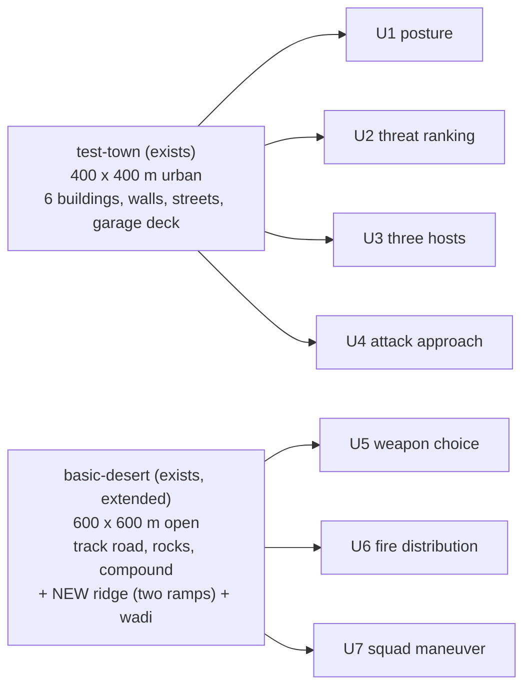

*What the picture shows that prose hid: close combat (cover, line of sight round corners) needs the town; range,
target type and squad movement need open ground — and no third terrain is needed.*

| decision | why | rejected |
|---|---|---|
| ⭐ reuse `test-town` unchanged | cover, LOS blockers and streets already exist; `tt-take-cover`/`tt-posture` prove EQS answers there | — |
| ⭐ extend `basic-desert` with a ridge (two ramps meeting at a crest) and a wadi | ramps are walkable AND block sight (`TerrainWorld.cs:157-165` — sight lines test walkable triangles), so a ridge works as a hill without a heightfield; the tests pin only its NAME | a third terrain (the user prefers 2–3; nothing needs it) · a heightfield (not built) |
| ⚠ to MEASURE when building | that the navmesh bakes over the ramps and `SurfaceZ` puts a unit on top of them, not on the ground below | — |

## 4. The scenarios

All seven live in `scenarios/` (F7), load with `POST /scenario/load/live`, and are checked over HTTP.

| id | terrain | cast | shows | needs (§6) |
|---|---|---|---|---|
| **U1** `ua-posture` | town | rifleman (2002) running `CombatPosture`; one ARMED hostile (2002) | all five postures + hysteresis: Suppress at first against a matched enemy (CE-2072's rail); the check script lowers the rifleman's Health over HTTP → TakeCover → Flee (FallBack) → restores it → back; Health held at a boundary does not flicker. ⚠ The exact winner per step (and which edit reaches Hold) is NOT measured yet — the in-process rail pins it first, the script then asserts that sequence | G1, G2, G11 |
| **U2** `ua-threat-ranking` | town | rifleman; an unarmed civilian (1001) close; an armed hostile in sight; an armed hostile far; one hidden behind a building | ranking: the armed, visible, near hostile is engaged first; the ranking list is readable | G1, G2, G11 |
| **U3** `ua-three-hosts` | town | three riflemen side by side, same enemy: BTree `CombatPosture`, HSM `CombatPostureHsm`, blueprint `CombatPostureBp` | R-197 — one decision, three hosts, the SAME winner sequence under the same Health edits | G2, G4, G5, G11 |
| **U4** `ua-attack-approach` | town | rifleman; armed hostile behind the High Wall / Tower corner | a NEW decision `AttackApproach` {Direct, Flank, FiringPosition}, run inside the AdvanceAndAttack branch: no sight ⇒ Flank or FiringPosition wins; uses the three unused EQS templates | G1, G2, G6, G11 |
| **U5** `ua-weapon-choice` | desert | Bradley (101); hostile infantry (2003) at ~300 m; a T-72 (103) at ~550 m | WeaponSelection: 25 mm at the infantry, TOW at the tank | G1, G2, G7, G11 |
| **U6** `ua-fire-distribution` | desert | a leader + 4 riflemen (hierarchy by `UnitSubordinate`); 3 spread hostiles | LeaderAssignment + the threat matrix: targets spread, at most 2 on one target; a wounded member vetoes | G1, G3, G8, G11 |
| **U7** `ua-squad-maneuver` | desert | the U6 squad ordered across the track and over open ground to the ridge | ManeuverSelect: DangerAreaCross at the track, BoundOverwatch over open ground, Hold under heavy threat | G3, G9, G10, G11 + CE-507 D2/D3 |

*Not demonstrated, on purpose:* the editor card table, overlays and live tuning (§7).

## 5. How a scenario is checked

### 5.1 The observe route (G2) — the one new debug surface


*What the picture shows that prose hid: the scorer already writes everything a check needs — the route only ATTACHES
the components it writes into and DECODES them; no new scoring path.*

⭐ **As built (`2026-10-05`) — two deviations, both simplifications:** ① no separate observe route: the existing
`POST /trace/observe` arms the utility record too (`TraceBufferLifecycleSystem`), one switch for "observe this unit's
AI"; ② the scores live in a NEW per-decision `UtilityDecisionLog`, not the unit's `UtilityResultBuffer` — a unit has one
buffer and the posture and the threat ranking both write it every tick, so it shows whichever ran last. ⛔ SUPERSEDED:
the `POST /entities/{id}/utility/observe` route this section first drew.

`GET /entities/{id}/utility` answers per decision run on that unit: `decision`, `winner` (name), `previousWinner`,
`switchedAtSimTime`, per-option `score` (after hysteresis — F3 fixed), and per-consideration `input / raw / curved /
weight`. Brain perspective only (the scorer runs on the Brain node).

### 5.2 One check run

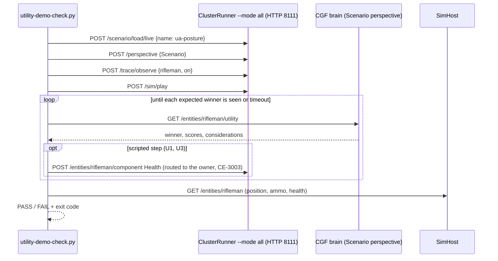

*What the picture shows that prose hid: the decision is asserted where it is made (the Brain), the effect where it
happens (SimHost) — both, because a correct winner whose child never moves is still a failure.*

### 5.3 Two forms of every scenario

| form | where | role |
|---|---|---|
| ⭐ the HTTP check | `scripts/utility-demo-check.py <scenario>` against `ClusterRunner --mode all`; asserts and exits non-zero (unlike `hill-attack-check.py`, which only prints) | the acceptance the user asked for; the runbook drives it |
| ⭐ the in-process rail | `Hrot.ClusterRunner.Integration.Tests`, `PostureScenarioTests` pattern (posture + three hosts INTO that suite, R-142); new suites only for weapon and squad | the regression gate a test run can repeat |
| the runbook | `docs/RUNBOOK_Utility_AI_Demos.md`: per scenario — launch, load, what to watch, the expected winner sequence, what a failure looks like and where to look first | linked from `RUNBOOK_Cluster_Debugging_Over_Http.md` |

### 5.4 Who runs what each frame

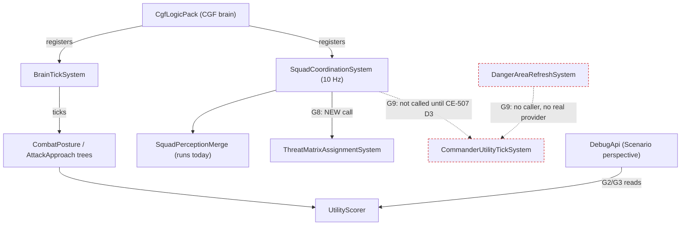

*What the picture shows that prose hid: fire distribution (U6) needs only ONE new call in a system that already runs
every frame; maneuver selection (U7) has two systems nobody calls (red) and is blocked on decisions, not code.*

## 6. What has to be built

| id | item | size | for | depends |
|---|---|---|---|---|
| **G1** ✅ BUILT `2026-10-05` | the two distance readers read `SimTransform` (as EQS does, `EqsContext.cs:64`) — fixes F1 live (`CE-3070`) | S | U2, U4–U6 | — |
| **G2** ✅ BUILT `2026-10-05` | `/entities/{id}/utility` + a per-decision `UtilityDecisionLog` (armed by the EXISTING `POST /trace/observe` — one switch); F3 fixed; options named by `[UtilityDecision(OptionNames = typeof(…))]` | M | all | — |
| **G3** `CE-3087` → backend | `/entities/{id}/squad`: contacts, assignments, maneuver, danger areas | S | U6, U7 | — |
| **G4** `CE-3082` → behaviors | `CombatPostureHsm` asset + a runtime switch rail (Decision Layer D3) | M | U3 | — |
| **G5** `CE-3083` → behaviors | `CombatPostureBp` blueprint (ScoreDecision + Behaviour Task per option) + a decision picker on `ScoreDecision` (BP-27) | M | U3 | — |
| **G6** `CE-3084` → behaviors | NEW decision `AttackApproach` {Direct, Flank, FiringPosition}, nested in CombatPosture's AdvanceAndAttack branch + a `ThreatsInView` input use. ⚠ *corrected `2026-10-06`:* the behaviours `Flank` / `FiringPosition` were BUILT meanwhile (`CE-2108` / `CE-2109`, behaviors, `2026-10-05`) — G6 is the DECISION only | M | U4 | G1 |
| **G7** `CE-3089` → backend | weapon mounts: register `WeaponMountInfo`, per-mount range, effectiveness vs armour (not a copy of range fit), the fire executor fires the chosen mount, a `SelectWeapon` step in the engage path; `TopCandidate` passes the target as context (F2) | L | U5 | G1 |
| **G8** `CE-3088` → backend | call `ThreatMatrixAssignmentSystem` from `SquadCoordinationSystem`; feed it the merged pool (F4); an infantry squad hierarchy in a scenario | M | U6 | G1, G3 |
| **G9** | CE-507 D2/D3: a danger-area provider (interim: features authored in the terrain file), F5, F6, a squad-maneuver behaviour on the commander, members reading their role | L | U7 | user decisions |
| **G10** `CE-3086` → backend | `basic-desert` ridge + wadi; measure navmesh and `SurfaceZ` on the ramps | S | U5–U7 | — |
| **G11** ⚠ PARTIAL `2026-10-05` (U1/U2 rails: `CE-3085`) | the seven scenario folders, `utility-demo-check.py` (asserting; `--launch` = a fresh cluster per run, CE-295), the runbook, one in-process rail each — ✅ U1 `ua-posture` and U2 `ua-threat-ranking` built and PASS ×2 live; ⏳ their in-process rails, U3–U7 | M | all | per scenario |

## 7. Out of scope — and why

| | |
|---|---|
| the utility editor card table, overlays, live tuning console | library code with no host (Runtime Tuning design); they are editor/UI work and a scenario cannot assert them over HTTP |
| a `RankCandidates`-node consumer | a second "engage the top threat" path beside `TopThreat` would duplicate it (R-174); U2 shows ranking through `TopCandidate` and the route |
| `AllyAdvancingNearby` (a stub) | CE-2072 removed its only use |

## 8. Questions for the user — each with a lean *(✅ ALL SEVEN LEANS APPROVED `2026-10-05`, R-209)*

| # | question | ⭐ lean | what would change it |
|---|---|---|---|
| **Q1** | the set and order | the seven scenarios in four phases: **P1** U1, U2 (G1, G2, G11) → **P2** U3, U4 (G4–G6) → **P3** U5, U6 (G3, G7, G8, G10) → **P4** U7 (G9) | if one feature matters most to you, it moves first |
| **Q2** | terrains | `test-town` + `basic-desert` extended with a ridge and a wadi — two terrains | if the ramp ridge fails the navmesh measurement, a third flat-plus-hill terrain |
| **Q3** | the "not yet built" decision | `AttackApproach` {Direct, Flank, FiringPosition}, run inside AdvanceAndAttack — it uses the three idle EQS templates and shows a decision NESTED in another | rejected: two more CombatPosture options — posture is *what stance*, approach is *how to attack*; mixing them makes a 7-option decision harder to tune |
| **Q4** | weapon effectiveness | make `WeaponEffectivenessVsTarget` real (target armour vs the weapon), so the choice is driven by the target type, not only range | if the TKB has no penetration data per weapon (not yet measured), range-only for now |
| **Q5** | U7 and CE-507 | keep U7 last; decide D2/D3 when P1–P3 are done, with an interim provider that reads danger areas authored in the terrain file | if squad maneuvers matter most, decide D2/D3 now |
| **Q6** | lanes | backend: G1, G2, G3, G7 (engine), G8 (wiring), G10, G11 · behaviors: G4, G5, G6, G9's behaviour | if you want one lane to own the whole programme |
| **Q7** | the E2E form | both: the HTTP check against `--mode all` is the acceptance, the in-process rail is the regression gate | if `--mode all` runs can be automated in CI, the rail may be enough |

## 9. Ammunition vs armour — one simple model for the shot AND the choice *(✅ A1–A4 APPROVED `2026-10-05` (R-212), A3 revised; `build-state: BUILDING`, `CE-3071`)*

🔒 **User, `2026-10-05`:** *"Plan for implementing ammo vs armour params - some simple model."*

📐 **Measured today:** every hit costs a flat **25 HP** whatever fired it (`DamageCalculationSystem.cs:63-68`,
`CombatConstants.DefaultBulletDamage`); armour front/side/rear exists in the TKB (`CombatPlatformDefDto.cs:12-28`) and
**nothing reads it**; no weapon carries a penetration or damage value; `WeaponEffectivenessVsTarget` is a copy of the
range fit (`StandardInputs.cs:361`). The design record already intends it: *"armor penetration curves (POC: flat hp)"*
(`BS-1-DESIGN.md` §2), *"reads the armor thickness, calculates impact angles, applies penetration curves"*
(`.dev/_DONE/brain-split/design-talk.md:197`), and *"weapons vs my armour"* for danger (Decision Layer G1). No design
gives a formula — this section is that formula.

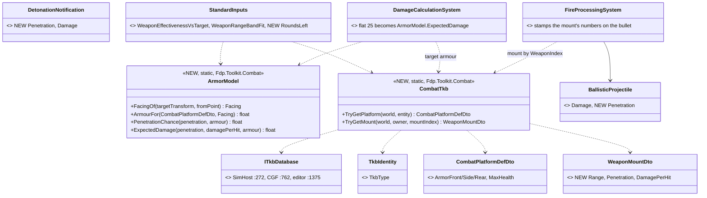

*What the picture shows that prose hid: the damage the simulation APPLIES and the effectiveness the AI EXPECTS call the
same function — the AI cannot believe a 25 mm hurts a T-72 while the simulation says it does (or the reverse). And no
component carries a copy of the TKB: armour and weapon numbers are fixed per type and are read where they are used (A3
revised).*

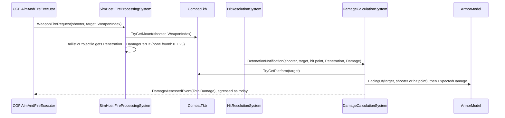

*What the picture shows that prose hid: no network message changes (R-158) — `WeaponFireRequest` already carries the
mount index and `EntityHitDamage` already carries the damage; only local events and a component grow.*

| rule | the model |
|---|---|
| facing | the angle between the target's forward (`SimTransform.Rotation` yaw) and the direction to the shooter: < 60° front, > 120° rear, else side. Turrets ignored |
| penetration chance | `r = penetration / armour`; `P = clamp((r − 0.8) / 0.4, 0, 1)` — nothing below 80 %, certain above 120 %; no armour ⇒ 1 |
| damage of a hit | `DamagePerHit × P` — the EXPECTED value, no dice: replays and the determinism rails stay deterministic |
| unknown munition | `Penetration = 0` (an external detonation, `MunitionDetonationIngressTranslator`, or a weapon whose TKB entry carries no numbers) ⇒ armour is NOT applied: the round's `DamagePerHit`, else today's flat 25. ⚠ **As built:** never 0 — a penetration-0 round would otherwise do nothing to any armour (`ArmorModel.HitDamage`) |
| AI effectiveness | `min(1, ExpectedDamage / target Health.Max)` at the current facing — "share of a kill per hit". The unit's own `Health.Max`, not the TKB's: scenarios override it (hill-attack's M1s carry 50) |
| WeaponSelection | gains `RoundsLeft` (log scale, `ln(1+ammo)/ln(1+300)`, weight 1): with 7 TOW rounds and 300 of 25 mm, the 25 mm wins on infantry and the TOW on a tank |

**Calibration (catalog code, `BdcTkbCatalog` / `UrbanCombatTkbCatalog`):**

| weapon | penetration mm | damage / hit | ⇒ vs (computed, not run) |
|---|---|---|---|
| rifle (M4, 2002's rifle) | 5 | 25 | **unchanged for the UrbanCombat soldier** (2002: 100 HP, no armour ⇒ P 1, 4 hits). ⚠ **Corrected `2026-10-05`:** the BDC Rifleman (200: `ArmorFront` 5 mm, side/rear 0, `MaxHealth` 5×5 = 25, `BdcTkbBuilder.cs:169`) goes from 1 hit to 2 from the front (r = 1 ⇒ P 0.5), still 1 from side/rear |
| RPG (2003) | 300 | 400 | Bradley side 60 ⇒ P 1, 2 hits (500 HP); T-72 front 500 ⇒ 0 |
| 25 mm M242 | 60 | 60 | 2 hits on infantry; T-72 any face ⇒ 0 |
| TOW | 800 | 2000 | T-72 front ⇒ P 1, ~2 hits |
| 120 mm M256 | 650 | 1200 | T-72 front ⇒ 3 hits; M1 front (600) ⇒ P 0.71, ~4 hits |
| 125 mm 2A46 | 600 | 1100 | M1 front ⇒ P 0.5, ~6 hits |

⚠ **Blast radius — the reason this needs your nod:** tank fights stop taking ~120 hits. **hill-attack** (M1s vs Abrams)
will kill in a handful of rounds instead of running out of ammo, so its baseline rails (`PlatoonBaselineRails`,
`DeterminismRails`) are re-pinned in the same change. UrbanCombat infantry scenarios do not move (25 per rifle hit, no armour); BDC Rifleman scenarios do (front hits halve).

| ✅ approved (R-212) | rejected |
|---|---|
| **A1** the model drives the REAL damage and the AI estimate (one function) | estimate-only, damage stays flat — the AI would pick weapons for a world that does not exist |
| **A2** expected damage, no random roll | a seeded roll per hit — more "realistic", but needs a sim RNG stream and makes every combat rail statistical |
| **A3** ⚠ **REVISED `2026-10-05`, approved:** no copy on any component — armour (`CombatPlatformDefDto`) and the weapon numbers (`WeaponMountDto` + `Range`, `Penetration`, `DamagePerHit`) are read from the TKB by type (`TkbIdentity` → the world's `ITkbDatabase`) where they are used; the bullet carries the fired mount's numbers to the hit | a new `Armor` component — a copy of fixed per-type data, nothing changes it after spawn (measured: armour is written only by the catalog, `BdcTkbCatalog.cs:40,79,139,172`) · on `WeaponState` — scenario files override `WeaponState` whole, so a missing field would silently zero the penetration · on `WeaponMountInfo` — mount 0 has none, and mount children are not made today (F2) |
| **A4** per-mount range comes from the mount (fixes the TOW's 3750 m being read as the 25 mm's 2500 m) | — |

📐 **Measured for the build (`2026-10-05`, graph CLI + grep):** `AimAndFireExecutor.cs:113-116` always fires `WeaponIndex 0`
and spends mount 0's rounds, so until **G7** lands the bullet always carries mount 0's numbers — correct, and the model
needs nothing more from G7. `HitResolutionSystem` and the combat systems are one assembly (`Fdp.Toolkits.csproj`), so the
hit copies the bullet's numbers into the local `DetonationNotification` (no wire message changes, R-158). An external
detonation (`MunitionDetonationIngressTranslator`) carries `Penetration 0` ⇒ the flat 25 stays.

### 9.1 ✅ AS-BUILT `2026-10-05` (`CE-3071`, backend) — matches the diagrams above, with these notes

| what | where |
|---|---|
| `ArmorModel` (facing, armour of a face, `P`, expected damage, `HitDamage` with the unknown-munition rule) and `CombatTkb` (TKB entry by `TkbIdentity`, platform, mount, owner of a mount) | `FDP/Toolkits/Fdp.Toolkits/Combat/ArmorModel.cs` |
| `WeaponMountDto` + `Range`, `Penetration`, `DamagePerHit`; both catalogs calibrated per the table (`SimCombatDef.WeaponMount` → `BdcTkbBuilder`, `UrbanCombatTkbCatalog`) | TKB |
| the bullet takes the fired mount's numbers (`FireProcessingSystem`), the hit copies them into `DetonationNotification` (`HitResolutionSystem`), `DamageCalculationSystem` applies `ArmorModel` (face from the shooter, else the hit point) | SimHost path |
| `WeaponEffectivenessVsTarget` = share of a kill (own `Health.Max`, else TKB `MaxHealth`); `WeaponRangeBandFit` reads the mount's OWN TKB range first — ⚠ also for mount 0 on the unit itself (was 0 with no mount child); new input `RoundsLeft` (`0xCAE9`) in `WeaponSelection` | CGF inputs |
| ⛔ unchanged: no network message (R-158); `AimAndFireExecutor` still fires mount 0 — choosing another mount is **G7** | — |

Rails (feature suites, red-proved by putting each old behaviour back): `DamageCalculationSystemTests.CE3071_*` (3) ·
`FireProcessingSystemTests.CE3071_TheBullet_CarriesTheFiredMountsMunition` ·
`HitResolutionSystemDetonationTests.CE3071_ABulletHit_CarriesTheBulletsMunition_IntoTheDetonation` ·
`StandardInputReaderTests.CE3071_*` (4) · `StarterPackIntegrationTests.CE3071_WeaponSelection_25mmOnInfantry_TowOnATank`.
`CombatComponentTests` pins the event at 40 bytes (was 32).


## 10. The danger sensor — what the squad decisions need *(DESIGN `2026-10-05`; §10.2–§10.4 ✅ APPROVED `2026-10-06`, R-213)*

🔒 **User, `2026-10-05`:** *"What about the danger sensor required by some of the utility ai based behaviors?"*

📐 **Measured:** the contract is BUILT — `IDangerAreaProvider.Refresh(repo, commander, span, out count)`
(`IDangerAreaProvider.cs:24`), a 68-byte `DangerAreaDescriptor` {FeatureId, ThreatRating, Kind (OpenGround /
StreetCrossing / Intersection / ChokePoint / CrestLine), oriented box + height band, near/far handles}, the sensor child
and an 8-slot buffer. **Nothing produces areas**: the only provider is `FakeDangerAreaProvider`; the refresh system has
no caller; component ids 262/263 collide (QA-037); the buffer is written on the child and read from the commander (F6);
nothing chooses the active area (`ActiveFeatureId` is set only by a forced-maneuver order, `ForceManeuverMapper.cs:39`);
ManeuverSelect's ids are off by one (F5). Only `ManeuverSelect` and the squad maneuvers need it — the single-unit
decisions (U1–U5) do not.

The squad design meant the geometry to run on the Muscle over the navmesh (Squad Coordination §5, §11 "navmesh
tactical-feature extraction, in plan"). 📐 **But the Brain already holds the terrain** — `TerrainWorld` is resident on
CGF since R-182 (`CgfSubsystem.cs:1152`), with surfaces (road / open / forest / water), prisms, ramps, `SurfaceZ` and
`SegmentBlocked` — while the **path** is not (CGF composes no navmesh; the Brain pathfinding pack is inert there).

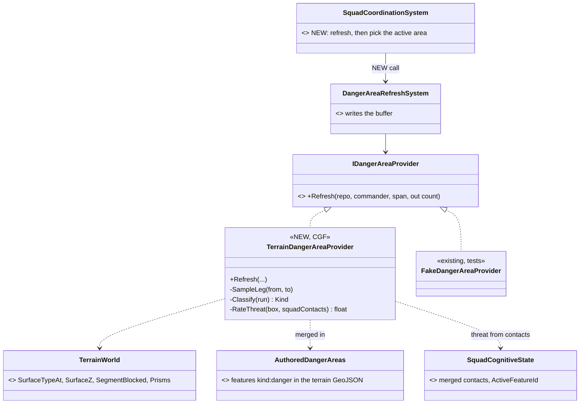

*What the picture shows that prose hid: the provider plugs into an interface that already exists and a system that
already runs — the work is the provider and three wiring fixes, not a new pipeline.*

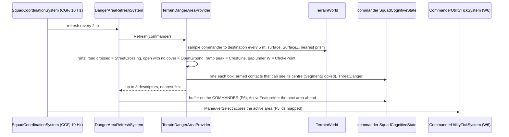

*What the picture shows that prose hid: the threat on an area is judged from what the squad KNOWS (its merged contacts)
at refresh time — the same "danger at read time" rule as R-194 — not stored in the terrain.*

| ⭐ lean | rejected |
|---|---|
| **B1** a Brain-side provider over `TerrainWorld`, sampling the straight leg from the commander to its destination; authored `kind:danger` features in the terrain file are merged in (an author can add a choke the classifier misses) | **Muscle-side extraction over the real path** (the squad design's §5) — it needs the path corridor and a new DDS topic for the descriptors; the provider interface is the same, so it can replace B1 later without touching a decision · **authored areas only** — every terrain would need hand work before a squad can move |
| **B2** threat on an area = the strongest armed known contact with sight of its centre (`ThreatDanger` × visible), plus a waypoint's authored `dangerLevel` | a fixed rating in the terrain — danger would not depend on where the enemy is |
| **B3** fix with it: F6 (buffer on the commander), F5 (option → `ManeuverKind` map), QA-037 (ids 262/263), and pick `ActiveFeatureId` = the nearest area ahead on the leg | — |
| ⚠ **known limit** | a straight leg ignores the path the units really take round buildings — fine on open ground (U7, desert); in town a squad may "see" a crossing it will not use. The Muscle-side upgrade removes it |

### 10.1 ⚠ SUPERSEDED by §10.2 — **plan the REAL path on SimHost, classify on CGF** *(the measurements below still stand; the placement does not)*

🔒 **User, `2026-10-05`:** *"can't it work on a path which is found by pathfinding? path details can be returned by simhost i
guess..."* 📐 **Measured — the wire for it already exists, complete and dormant:**

| piece | state |
|---|---|
| `PathfindingRequestEvent` → `PathRequestBatch` (Brain → solver) → `PathResponseBatch{CoarseWaypoints}` → the Brain's `TrajectoryPoolManager` + `PathfindingBatchData.Results` | ✅ built (`BrainPathfindingTranslatorPack`, `SimPathfindingTranslatorPack`); the solver half is composed on SimHost (`SimHostNodeBootstrapper.cs:605`, `NodeRole.NavigationSolver`) |
| the Brain half on CGF | ⛔ never registered: gated on `role.HasFlag(Brain) && trajectoryPool != null` (`NedSimHostPathfindingTranslators.cs:35`) and CGF has no pool — "a designed capability nobody switched on" (`DESIGN_Subsystem_Composition_Unification.md` §4.1v) |
| navig-2 §3.2 `PlanRoute` / `FetchPathDetails` (the opt-in "Brain sees waypoints") | ⚠ in-process only: `NavigationIntentBridgeSystem` reads the Brain's `LocomotionChannel` (the shape CE-3026 removed for `MoveTo`); `NavigationMode` has no plan-only mode and no translator carries `NavigationPathDetailsResponseEvent` |

| ⭐ lean **B1′** | rejected |
|---|---|
| switch on the existing Brain half on CGF (a trajectory pool + the pack); the provider requests commander → destination with the commander's mobility, and on the reply samples the returned waypoints every 5 m over CGF's `TerrainWorld` (same classifier as B1). Until the reply lands (one refresh, ~2 s) it uses the straight leg. No new message | `PlanRoute` over `NavigationIntent` — needs a new mode, a new translator, and an answer keyed to the entity's own move · SimHost computes the descriptors (squad design §5) — a new result topic for 68-byte descriptors and the navmesh tactical-feature extraction that is still "in plan"; the provider interface is the same, so it can replace B1′ later |

⚠ The path is the commander's, planned once per destination — the members' own paths may differ round a building.

### 10.2 ⚠ REVISED AGAIN `2026-10-05` — **the evaluator is placement-free; one missing query: "danger areas along a route"** *(✅ B1″ – B4′ APPROVED `2026-10-06`, R-213; supersedes §10.1's placement and B1's)*

🔒 **User, `2026-10-06`:** *"N1-N4 and B1″-B4′ approved."* ⇒ **N1–N4 and B1″–B4′ APPROVED** (R-213).

🔒 **User, `2026-10-05`:** *"why would this sensor evaluator run on the AI node? It needs to be runnable anywhere (most likely
on the navigation role node where most of the information is - navmesh, areas, ...) … all data required need to be
retrievable using networkable request-response mechanism anyway, making the implementation place choice more an
optimization than a necessity. What data query is missing … some kind of query for areas along a path?"*

| input the evaluator needs | where it lives | how another node gets it |
|---|---|---|
| the route | the navigation node: a moving unit's planned route is already there (`NavigationCorridorMuscle.RouteHandle` → `TrajectoryPoolManager`) | ✅ `PathRequestBatch` / `PathResponseBatch` (dormant on CGF, §10.1) |
| terrain world + authored areas | every ECS node (universal since R-182) | not needed — local everywhere |
| navmesh (chokes, area outlines) | navigation nodes only | ⛔ no query |
| threat | the squad's memory, on the Brain | ⛔ not needed by the evaluator — rated at READ time on the Brain (G1, R-194) |

⇒ the GEOMETRY is a pure function of (route, terrain, navmesh) and can run on any node holding them; the navigation node
holds all three, so it is where it runs (an optimization). ⛔ **The missing piece is the query itself:**

| ⭐ lean **B1″** — a new EQS query kind, **DangerAlongRoute** | |
|---|---|
| request | the existing sensor transport (`EqsSensorConfigTopic`, keyed by unit + sensor slot, solver picked by `SolverNodeId`) + a ROUTE spec — ⭐ **a concrete `RouteHandle`** (user, `2026-10-05`: *"the EQS query should allow also taking concrete (already found) path handle"*), solved on the node that planned that route; or start/end/mobility for a route not yet planned; corridor half-width; max areas |
| response | a NEW result topic with the same key, carrying up to 8 `DangerAreaDescriptor` (kind, oriented box + height band, near/far handles, distance along the route) — ⛔ no threat. `EqsResultEntry` (entity, position, score, flags) cannot carry them (squad design §5, architect-confirmed) |
| on the Brain — ⭐ a PRODUCER system, not the behaviour *(user, `2026-10-06`: "the commander's behavior would want to get just the higher level results, already processed")* | one engine system per commander (`DangerAreaRefreshSystem` reshaped), the same shape as the existing producers `ThreatEvaluationSystem` / `EqsResultUpdateSystem` (Sensors §7.3): keeps the query's route handle current from `NavigationStatus`; on each answer AND each squad tick re-rates every area from the squad's CURRENT contacts (fills the descriptor's existing `ThreatRating`, R-194 read-time), sorts the next area ahead first, writes the processed buffer on the commander (F6), and raises `SensorChangedEvent` edges (area ahead / area now threatened) so an HSM or a blueprint `When` reacts. Behaviours only READ: a read-sensor node / utility input (`ManeuverSelect`, F5). ⛔ Rejected: the commander's behaviour asks, rates and sorts (every behaviour re-implements it; a BTree has no event entry) · an instance blueprint as the default (per-unit authoring for an engine-wide sense; fine later as an override of the RATING policy) |

⭐ **Activation — the danger sensor is a SENSOR CHILD in the one sensor form** *(user, `2026-10-06`: "it is a 'smart sensor' so i
guess it should follow same sensor sub-entity concept"; Sensors §4, R-185 – R-187)*. 📐 `ThreatEvaluationSystem` is NOT the model:
it runs for every unit holding `TargetMemory` (`ThreatEvaluationSystem.cs:76`) — a unit-level fusion, not a sensor.

| | as for every sensor kind |
|---|---|
| kind | a new `SensorModality.DangerArea` (the enum is the kind, flags `1,2,4,8` ⇒ next `16`) |
| per-kind settings | `DangerAreaSensorDto` {corridor half-width, max areas, refresh seconds, route source = ① the unit's own move · ② a given handle · ③ **to a point** (start = the unit's position each refresh, end = the point — B1″'s start/end form)} — in a TKB `SensorEntryDto` or a behaviour's `ConfigJson`. ⚠ **A behaviour that MOVES the unit in reaction to the sensor must use ③** (added `2026-10-06`, §10.4): with ① the reaction's own move (to the near handle) becomes the watched route, the area drops out, the unit resumes, the area returns — a loop |
| switched on by | ① the TKB — a commander template lists the entry, default ON, `Disabled` to opt out, created at spawn on every node by `SensorChildFactory`; ② a behaviour — creates it (behaviour-owned, released when the run ends); ③ on/off at runtime = the `Suspended` override (`UnitSensors.SetEnabled`) |
| solved on | the node holding the route (its `SolverNodeId`), the solver half of the kind (B1″) |
| Brain half | the producer above, iterating sensor children of this kind on Brain-owned commanders; its processed buffer stays ON THE CHILD |
| read by | ⭐ **the same FORM as any kind, its OWN result type** *(user, `2026-10-06`: "different kind of sensors need different kind of result storage … we can do the union of course but we should not do a 'cast' to narrower result type … Is there any standard sensor at all?")*. 📐 There is a standard sensor FORM (child entity, kind, settings, TKB/behaviour/`Suspended` lifecycle, solver routing, `UnitSensors.Of`, `SensorChangedEvent`) and, today, ONE result family — the ranked scored list `EqsCognitiveBuffer` — only because every built kind (perception, EQS query sensors) IS a ranked list (`SensorChildFactory.cs:56` adds it to every child; `UnitSensors.TryGetResults` returns it). ⇒ the danger sensor is the first kind of a SECOND result family: the factory gives each child the result component of its kind's family (`DangerAreaCognitiveBuffer` here), a kind-neutral answer header (ready, count, stamp/age) is what generic nodes may read (has an answer, changed), and the CONTENT is read through a typed accessor/node per family (`UnitSensors.TryGetResults<T>(unit, kind, out T)`; the blueprint/BTree/HSM read nodes generalised per kind — [`DESIGN_Sensors_And_Doctrine.md`](DESIGN_Sensors_And_Doctrine.md) §7.10, N1–N4). ⛔ WITHDRAWN `2026-10-06`: writing the areas into the ranked buffer (near handle as position, threat as score) — a narrowing cast. ⇒ **F6 is fixed by reading through the accessor**, not by moving the buffer |

📐 **Measured — how the Brain knows a route handle today: it does NOT, for a move.** The solver echoes a requested handle
or allocates its own ≥ `0x40000000` (`PathfindingSolverSystem.cs:163`, `NavigationHandleAllocator.cs:13`); `MoveToExecutor`
passes the behaviour's `MoveToParams.RouteHandle`, in practice 0; a move's plan stores the handle on the vehicle
(`NavigationCorridorMuscle`) but never on `NavigationStatus` (`PathfindingResultMaterializationSystem.cs:66-77`; only the
plan-only branch writes it, `:117`); no production code allocates a Brain handle (only the fake `BrainPathRegistry`).
navig-2 principle 3 intends the BRAIN to allocate (*"it allocates a nonzero int handle, sends it via NavigationIntent"*),
lower range for Brains, upper for the solver.

| ⭐ lean **B4′** — the solver reports the handle it planned under, for a MOVE too *(revised `2026-10-05` after the user: "what prevents the navigation solver to return path handle back? what benefit … in same frame as the move? analyzing danger areas can take multiple frames, similarly to path finding")* | rejected |
|---|---|
| the move branch of `PathfindingResultMaterializationSystem` writes `NavigationStatus.RouteHandle` as the plan-only branch already does (`:117`); the field is already on the wire (`NavigationStatusEgressTranslator.cs:113`). The Brain issues the danger query once its status shows a handle — the query needs the planned path anyway, so nothing is lost by waiting. A Brain-allocated handle (navig-2 §6.3) is echoed by the solver and works with the same query | **B4** (the Brain must allocate, so it can name the route in the same frame) — no benefit: the analysis waits for the plan either way. ⚠ My first objection — "the solver's range is Muscle-private" — was wrong: navig-2 (`:644`) only says the solver allocates when the Brain gives none, not that the handle may not be reported |

| rejected | the one fact |
|---|---|
| B1 / B1′ — evaluate on CGF | no navmesh there, and it re-plans a route the navigation node already holds |
| squeeze descriptors into `EqsResultEntry` | no room for a box and two handles |
| `PlanRoute` path details to the Brain (navig-2 §3.2) | ships whole waypoint lists to the Brain only to do geometry there |

### 10.3 The demo — `ua-danger-crossing` on test-town *(✅ APPROVED `2026-10-06`, R-213 — its nodes and tree: §10.4)*

📐 test-town has two roads crossing at the centre (`x 190–210`, `y 190–210`), six buildings, forest and water
(`Recipes/Terrain/test-town`) — a route from the south-west to the north-east crosses BOTH roads.

| | |
|---|---|
| cast | one commander (a rifleman, 2002) ordered south-west → north-east; one armed hostile east of the vertical road with sight of THAT crossing only, standing still |
| the behaviour | a plain BTree: `Ensure` a DangerArea sensor (route = own move) · `MoveTo` the destination · an `ObserverSelector` whose higher branch is `ReadSensorResult(DangerArea, 0)` with `Threat ≥ 0.5` → `MoveTo(NearHandle)` and hold while it holds |
| what must happen | the sensor lists the two crossings in route order · the watched one rates high, the other low · the commander HALTS at the watched crossing's near handle · the hostile's own mission withdraws it out of sight of the crossing (§10.5 — ⛔ SUPERSEDED `2026-10-06`: "its Health set to 0 over HTTP") ⇒ the rating falls, the commander crosses and arrives · the unwatched crossing never stops it · ⭐ no HTTP intervention: the run plays out on its own |
| checked by | `scripts/utility-demo-check.py ua-danger-crossing` over HTTP + an in-process rail; a sensor read route (`GET /entities/{id}/sensors`: every sensor child, kind, answer) — 📐 none exists today |

| what has to be built | lane |
|---|---|
| the `DangerAlongRoute` query kind: route walk on the node holding the route (road crossings, open ground, crest, authored areas), its result topic (B1″) | backend |
| the move's route handle on `NavigationStatus` (B4′) | backend |
| the producer: rating from the unit's own memory (no squad) or the squad's pool, the typed buffer `DangerAreaCognitiveBuffer` on the child, `SensorChangedEvent` edges (B2, B3, F6) — ⛔ the standard-buffer summary was WITHDRAWN `2026-10-06` (§10.2) | backend |
| `SensorModality.DangerArea` + `DangerAreaSensorDto`; the factory adds the result component of the kind's family; the typed accessor `UnitSensors.TryGetResults<T>`; ids 262/263 de-collided (QA-037) | backend |
| the sensor read route + its MCP/skill entry | backend |
| the demo's shared nodes, BTree and blueprint form — §10.4 | backend (shared nodes, BTree, scenario) + behaviors (blueprint nodes N1–N4) |
| the scenario, the check, the runbook section | backend |

This unblocks Squad Wiring **D3** (W6: run `CommanderUtilityTickSystem`). **D2** (a shipped squad-maneuver behaviour
that reads the near/far handles and moves the elements) is still needed for U7 — none of the six maneuvers reads a
handle today.

### 10.4 What the demo needs — behaviours, actions, conditions *(`2026-10-06`, `CE-3079`; `build-state: READY-TO-BUILD`)*

🔒 **User, `2026-10-06`:** *"What behaviors and actions and conditions etc. will we need to develop for the demo to
demonstrate the new danger area sensor in urban environment?"*

📐 **Measured vocabulary** (graph `search_graph` `.*Executor$` 22, `.*Decision$` 6; grep `[SharedAiAction|Condition]` 57):
the shared tactics nodes are SELF-CONTAINED — `TakeCover` ensures its own sensor, reads it and issues the pathed move
(`EqsTacticsNodes.cs:120`, R-204; since CE-2108/2109 the four EQS manoeuvres share one body `Run` at `:157` — ranked-answer
specific, so `DangerAreaNodes` copy its SHAPE, not the body); the ranked-family reads are `SensorNodes.Sees`/`Read` (`SensorNodes.cs:63/73`, read
`EqsCognitiveBuffer` only); a plain move to a point is `CgfNodes.Action_WriteMoveToChannel` (`:243`); `PostureNodes.Hold`
stops a move (`:143`); the BTree runtime has `ObserverSelector` (`Interpreter.cs:713`). ⛔ Nothing reads a danger area: the
only readers are the two squad inputs `ActiveFeatureThreatRating`/`ActiveFeatureKindIs` (`SquadInputs.cs:188`), which need
`SquadCognitiveState` and read the buffer on the commander (F6).

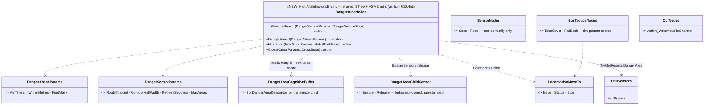

*What the picture shows that prose hid: four nodes, all on machinery that exists — the only new engine member they need
is the typed accessor `UnitSensors.TryGetResults<T>` that §10.2 already requires. The nodes are typed per FAMILY (a C#
params struct cannot be projected from a registry — Sensors §7.10), so a later area-family kind reuses them.*

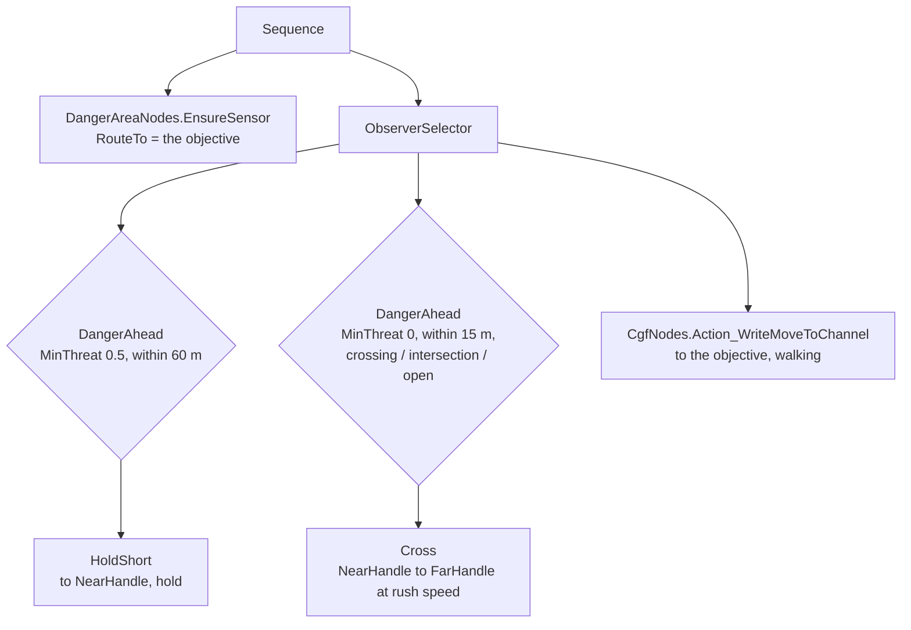

*What the picture shows that prose hid: the behaviour never rates or sorts — the higher branch fires on the PROCESSED
answer (threat already rated, area ahead already first), and the ObserverSelector re-checks its guards every tick, so a
falling threat releases the hold with no extra node.*

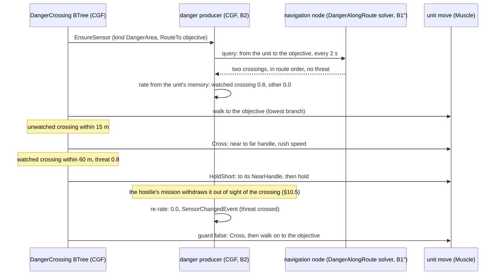

*What the picture shows that prose hid: the route the sensor watches is ALWAYS unit → objective (route source ③,
§10.2), never the unit's current move — otherwise HoldShort's own move to the near handle would hide the crossing it
holds for.*

| who registers / ticks it | |
|---|---|
| `CgfLogicPack` → `BrainTickSystem` | ticks the `DangerCrossing` tree (existing) |
| `CgfLogicPack` → **the danger producer** (NEW, CE-3072) | one per DangerArea sensor child on a Brain-owned unit; ⚠ it is the system nobody calls today (`DangerAreaRefreshSystem`, §5.4 red) reshaped — this demo is the first caller |
| SimHost `NodeRole.NavigationSolver` → **`DangerAlongRoute` solver** (NEW, CE-3072) | the node the sensor's `SolverNodeId` names |

| what to build | lane | id |
|---|---|---|
| `DangerAreaNodes` — `EnsureSensor`, `DangerAhead`, `HoldShort` (Success when the area's threat falls below `MinThreat − 0.1`, or none is ahead), `Cross` (Success at the far handle) — + their deactivators (release the sensor, stop the move) | backend | CE-3079 |
| the `DangerCrossing` BTree asset (the tree above), registered like `CombatPosture`'s | backend | CE-3079 |
| the scenario `ua-danger-crossing` on test-town: one rifleman SW → NE across both roads; one hostile with a two-task MISSION and no weapon node (it never fires) east of the vertical road, placed so the rifleman sees it before the crossing — and its withdrawal point placed per §10.5's sight rules (both measured with `SegmentBlocked` when authored) | backend | CE-3079 |
| `utility-demo-check.py ua-danger-crossing` — asserts: the sensor lists both crossings in route order · the unwatched one is crossed at rush speed without stopping · the unit stops within `ArrivalRadius` of the watched one's NearHandle and stays ≥ 10 s · the hostile's mission advances (task 1 → task 2) only after that hold, and once it reaches its withdrawal point the threat falls to 0 within one refresh and the rifleman crosses and arrives · no HTTP write anywhere in the run · + the in-process rail and the runbook section (§5.3) | backend | CE-3079 |
| the blueprint form of the same behaviour — `SpawnSensor(DangerArea)`, `When SensorResult(DangerArea, ThreatCrossed)`, `ReadSensorResult(DangerArea, 0)` → `NearHandle`/`FarHandle` pins → `MoveTo` — as N1–N4's acceptance, checked by the same script | behaviors | CE-3078 |
| ⭐ **the BTree graph itself: NO change** *(measured `2026-10-06`, user: "Btree graph also has some eqs support, does it need some changes?")* — its EQS support is entirely shared C# nodes (`EqsLifecycleNodes` ×4, `EqsTacticsNodes` ×4, `EqsCombatNodes`, `SensorNodes.Sees`/`Read`); the editor, validator, JSON generator and kernel carry no EQS code (grep `-i eqs` over `Hrot.BTree.Editor`, `FastBTree`, `Hrot.AiEditor.Persistence`: one doc-comment hit); toolkit-assembly nodes already bind in assets (`CombatPosture.btree.json` → `Fdp.Toolkit.Utility.UtilityNodes`); `[BTreeDeactivator]` is generic. ⇒ `DangerAreaNodes` plug in as they are. The ranked EQS nodes stay the ranked family's, unchanged | — | — |
| ⛔⛔ **the ONE change it does need — a family guard**: `SensorNodes.Sees`/`Read` take `Kind` as a PARAM, so adding `SensorModality.DangerArea` makes it pickable there; `UnitSensors.TryGetResults` (`UnitSensors.cs:71`) then finds no `EqsCognitiveBuffer` and returns false ⇒ `Sees` is always false and `Read` is Running for ever — a capability that silently no-ops (R-133). Fix: `TryGetResults` tells "no answer yet" from "this kind is not a ranked sensor" and the ranked nodes FAIL with a `BehaviorLog.Error` on the second; the same guard in the blueprint `ReadEqsResult`/`When EqsResult` helpers (they also pick by kind, CE-3054 D). The editor-time warning ("kind of another family") comes with the kind registry, N1 | backend (runtime guard, with B3) · behaviors (validator, with N1) | CE-3072 · CE-3078 |
| ⛔ **not needed here**: a utility decision (this demo exercises the sensor; the decision that USES it is `ManeuverSelect`, U7 — it then needs the two squad inputs re-pointed through the accessor, F5 and W6/D3) · the squad crossing drill (Squad Coordination §8.1 — U7's machinery: the squad HSM's five phases, member role consumption D2, EQS overwatch points) · `MovementMode` (D5) | — | — |

| rejected | the one fact |
|---|---|
| a generic `ReadSensorResult`-style shared node for BTree/HSM | a shared node's params struct IS its pin set — it cannot be projected from the kind registry the way blueprint pins are (Sensors §7.10) |
| `HoldShort` built from `DangerAhead` + `Read` + `Action_WriteMoveToChannel` in the tree | the tree would need the area's handle in a blackboard slot — the shared tactics nodes (R-204) are self-contained precisely so a tree never carries sensor geometry |
| the sensor watching the unit's own move (route source ①) | the reaction's own move hides the area it reacts to — a loop (§10.2 settings row) |
| make the demo a squad drill in town now | it needs all of U7's unbuilt machinery; the single unit proves the sensor end to end on its own |

#### 10.4a As-built — H3 / H4 / H5 / H7 *(behaviors, `2026-10-06`; the diagram above is already the as-built)*

| item | as built | ⚠ deviation from §10.4 / the handoff, and why |
|---|---|---|
| H3 family guard (`CE-3078`) | `SensorNodes.Sees` → false, `Read` → **Failure**, both raise `BehaviorFault` code `WrongSensorFamily` (7), when `UnitSensors.ReadRanked` says `WrongFamily`; the blueprint `ReadEqsResult` / `When EqsResult` already refuse kind 16 at COMPILE time (BP2010 / BP2021 — message now names `ReadSensorResult` / `When SensorResult`) | the row said `BehaviorLog.Error` — ⛔ `BehaviorLog` lives in `Hrot.AI.Behaviors`, unreachable from `Fdp.Toolkits`; `BehaviorFault.Raise` is the toolkit's loud channel (ring + bus) |
| H4 `DangerAreaNodes` (`CE-3079`) | `Hrot/Subsystems/Hrot.AI.Behaviors/Brains/DangerAreaNodes.cs` — the four nodes + three deactivators; the sensor is a `DangerAreaChildSensor` (B0) at site `0x30790001`, settings `DangerAreaSettings.ToPoint(RouteTo)` (route source ③) | ① **assembly**: `Hrot.AI.Behaviors`, not `Fdp.Toolkit.Behavior` — the moves go through `LocomotionMoveTo`, which this assembly owns (the same reason `EqsTacticsNodes` live here). ② **`Site` is not a param** — a constant, like `EqsTacticsNodes`' sites. ③ **`LocomotionMoveTo.Stop`** is new: the stop that `EqsTacticsNodes.Release` and `PostureNodes.StopMoving` each carried privately is now ONE method all three route through |
| `HoldShort` | ONE move to the near handle, then holds — re-issued only for a DIFFERENT area (`FeatureId`) or a failed move; Running before the first answer; Success on a ready answer with 0 areas (a clear route) or threat < `MinThreat − 0.1` | — |
| `Cross` | captures the far handle at the start (the answer's entry 0 moves on once past); near → far at `Speed`; Success at the far handle, or at once on 0 areas | — |
| rails | `Hrot.ClusterRunner.Integration.Tests/Eqs/DangerAreaNodesTests.cs` ×7, against a HAND-FILLED buffer on the run's real sensor child — B3/B4 fill the same component, so no node changes when they land | — |
| H5 `DangerCrossing` tree (`CE-3079`) | `Assets/BTrees/Tactics/DangerCrossing.btree.json` — the tree drawn above, registered by name (generator); variables `sensor` · `holdAhead` (0.5, 60 m) · `hold` · `crossAhead` (0, 15 m, mask 14 = open ground / street crossing / intersection) · `cross` (4.5 m/s) · `walk` (1.5 m/s) | ① ⭐ **`ForceFailure` pills on `HoldShort` and `Cross`** — measured on the kernel: the `ObserverSelector` re-checks only HIGHER guards (`Interpreter.cs:713`), so a branch that SUCCEEDS ends the selector and with it the run; a released hold / finished crossing must FALL THROUGH to the walk. ② ⭐ **`Cross` stops its move at the far side** — a finished MoveTo left active reads as "arrived" to `Action_WriteMoveToChannel`, which would end the run at the crossing. ③ ⭐ **`Cross` refuses the area it just crossed** (`CrossState.CrossedFeatureId`, kept across the node's exits) — until the sensor refreshes, the answer still lists that area first and `crossAhead` would send the unit BACK across it. ④ ⚠ **the objective is set TWICE** in the order's params — `sensor.RouteTo` and `walk.X`/`Y`: the handoff's node list binds the walk to the existing `Action_WriteMoveToChannel` (its own params struct) |
| H7 `DangerCrossingBp` blueprint (`CE-3079` / `CE-3078`) | `Assets/Blueprints/DangerCrossingBp.bp.json` (Behavior dispatch), built ONLY from the per-kind sensor nodes: Tick = `SpawnSensor(DangerArea)` (RouteSource ToPoint, RoutePoint = param `Objective`) → `When SensorResult(ThreatCrossed ≥ 0.5, rise + fall)` (OnFired / OnEnded set `Holding`) → Out: `Holding` ? MoveTo(`ReadSensorResult(0).NearSideHandle`, walk) : (an area within `CrossWithin` m) ? MoveTo(`FarSideHandle`, rush) : (`Walking` and `Move Arrived`) ? Return Success : MoveTo(`Objective`, walk). Params `Objective` (the ONE objective field — `{"Objective":[x,y,z]}`), `WalkSpeed` 1.5, `RushSpeed` 4.5, `CrossWithin` 15 | ① **no `WaitForChannel`** — a wait suspends the Tick at the wait, and the behaviour must keep reacting while it walks; it re-decides every tick instead (an identical MoveTo is a no-op, so the re-issue costs nothing) and finishes through a new blueprint callable `Move Arrived` (`StandardLibrary/BlueprintLocomotionLibrary.cs`, with `Move Failed`). ② **it rushes straight to the FAR handle** (not near → far like `Cross`) — the route there passes the near side, and the stale-answer problem `Cross` solves with `CrossedFeatureId` cannot arise: after arriving, the re-issued far-side move is the same command (a no-op) until the refresh drops the area. ③ **no hold hysteresis** (the `When` threshold is one value; the BTree's `HoldShort` releases at `MinThreat − 0.1`) |
| H7 rail | `TacticsTreesTests.CE3079_DangerCrossingBlueprint_…` — the same sequence as H5's through the shipped blueprint, real ingress + brain (red-proved: When threshold 0.9 ⇒ it never holds ⇒ fails). `ShippedSensorDeclsTests` — every sensor decl baked into a shipped blueprint must equal today's bake from the registry (the compiler never sees the registry) | — |
| H5 rail | `TacticsTreesTests.CE3079_DangerCrossing_…` — the shipped tree through the real ingress + brain, a hand-filled answer: walk → rush a 0-threat crossing (not crossed back on the stale answer) → walk on → hold short of a 0.8 crossing, keep holding at 0.45 → route clear → resume → arrive, run ends Success | red-proved: without the pills the rail fails |

### 10.5 The hostile runs on its own — a two-task MISSION *(`2026-10-06`, `CE-3079`; `build-state: READY-TO-BUILD`)*

🔒 **User, `2026-10-06`:** *"The scenario should not need http intervention, it needs to run on its own. If we need the
hostile to stop being a threat, let's give him some little behavior that makes him stop being a threat at the time when it is
needed (like when our rifleman comes close or something). That would also demonstrate the sequencing of scenario actions."*

📐 **Measured — what "sequencing of scenario actions" is here.** One form, per unit: the MISSION, *"a sequence of behaviors
(called tasks), executed one by one with optional skipping defined by triggers. We are not going to change this"*
(`DESIGN_Decision_Layer.md` §2, user ruling). Built: `MissionPlanQueue` ≤ 8 phases, `MissionDirectorSystem` advances on the
current task's trigger — `TimerElapsed`, `UnderAttack`, `HealthCritical`, `BehaviorFinished` (`MissionComponents.cs:11-35`);
⚠ only a task's FIRST trigger counts and a task with none holds for ever (`MissionTriggerHelper.cs:20-38`). There are no
world-level triggers or trigger zones (none designed live). ⭐ **No scenario uses more than ONE task today** — every
`MissionPlan` is one task + `BehaviorFinished`; the hostiles in `ua-posture` / `hill-attack-close` have no behaviour.
⇒ this demo is the first multi-task mission.

📐 **Measured — what makes a contact stop being a threat to an area (B2).** The rating reads the rifleman's MEMORY:
`ThreatDanger.Of` = armed (`WeaponState` present) 1, else 0.3, and an entity that exists is "alive"
(`ThreatDanger.cs:16-20`); the memory keeps the LAST-KNOWN position (`TargetMemory.PositionsX/Y/Z`) and barely forgets
(saturation 500, decay 0.1 / s ⇒ ≈ 0.99 fresh a minute after sight is lost, `PerceptionConstants.cs:44-56`). ⇒ a
hostile stops threatening the crossing when its LAST-KNOWN position has no sight of the area — not when it is merely out of
view. ⛔ **And killing it would NOT work**: a dead unit's entity still exists and still carries `WeaponState`, so it reads
as armed, danger 1 (finding `CE-3080`).

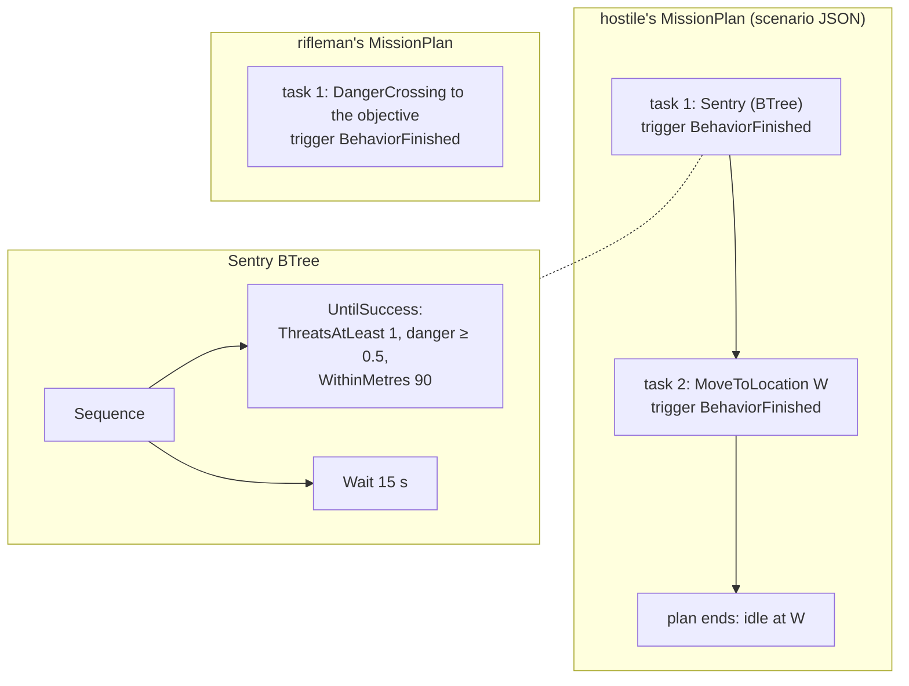

*What the picture shows that prose hid: the sequencing is the MISSION'S, not a script's — the hostile's first behaviour
ENDS ITSELF when its condition holds, and `BehaviorFinished` hands over to the next task. Nothing outside the two units
drives the run.*

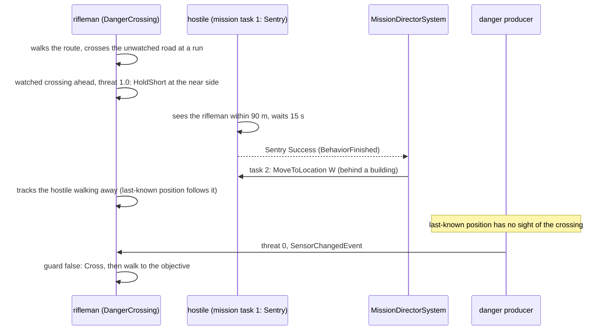

*What the picture shows that prose hid: the hold lasts as long as the hostile is SEEN to watch the crossing; it ends because
the rifleman watched it leave — the rating follows what the rifleman knows, never the hostile's true state.*

| what to build | lane | id |
|---|---|---|
| `SensorNodes.ThreatsAtLeast` gains `WithinMetres` (0 = any distance) — the "contact within X m" condition that does not exist today (only `SensedWithin`, which is "within N SECONDS"). One user: its own test (`SensorNodesTests.cs:65`), no asset moves | backend | CE-3079 |
| the `Sentry` BTree: `Sequence[ UntilSuccess(ThreatsAtLeast{1, 0.5, WithinMetres}), Wait(seconds) ]` — existing kernel `UntilSuccess` and `Wait`; no fire node, no SOP, so it never shoots | backend | CE-3079 |
| the scenario: the hostile's `MissionPlan` = [Sentry, `BehaviorFinished`] → [`MoveToLocation` W, `BehaviorFinished`]; the rifleman's = [DangerCrossing to the objective, `BehaviorFinished`] | backend | CE-3079 |
| authoring rule, measured with `SegmentBlocked`: the hostile's post sees the crossing centre; along its walk to W the rifleman's hold point keeps sight of it until the walker's own position has none of the crossing centre (the hold point is a few metres from the area, so "the rifleman loses him" ≈ "he loses the crossing" — but it is checked, not assumed) | backend | CE-3079 |
| check: `MissionPlanQueue` shows task 1 → task 2 only AFTER the rifleman's hold began · the threat falls within one refresh of the hostile passing the sight line · no HTTP write anywhere | backend | CE-3079 |

| rejected | the one fact |
|---|---|
| set the hostile's Health to 0 over HTTP | the user: the run must play out on its own · and it would not work: a dead unit still reads as armed (`CE-3080`) |
| an ally kills the hostile | the same `CE-3080` defect, and a third unit with its own combat behaviour |
| a new mission trigger "contact within X m" | the mission model is frozen by user ruling (Decision Layer §2); a behaviour that ENDS ITSELF plus `BehaviorFinished` is how the existing model expresses any condition |
| task 1 = hold with `TimerElapsed` | not tied to the rifleman — on a slow cluster the hostile could leave before the rifleman arrives, and the hold would never be seen |
| the hostile simply walks out of view | the rifleman remembers where he lost it; if that spot still sees the crossing the threat stays (≈ 0.99 for minutes) — the withdrawal point must be chosen by the sight rule above |

#### 10.5a As-built — H1 / H2 *(behaviors, `2026-10-06`)*

| # | as built | ⛔ §10.5 said |
|---|---|---|
| A1 | `ThreatCountParams.WithinMetres` (appended last): GROUND distance (XY) from the unit's `SimTransform` to each REMEMBERED position; 0 = any distance; a unit with no `SimTransform` counts none | "measured from the unit to the remembered position" ✅ |
| A2 | `Tactics/Sentry.btree.json` = `Sequence[ ThreatsAtLeast (with an UntilSuccess PILL) , Wait 15 s ]`; param variable `sentry` (`ThreatCountParams`: Count 1, MinDanger 0.5, WithinMetres 90) — overridable in the order's params JSON | "params WithinMetres and WaitSeconds" — ⚠ **the kernel `Wait` takes a CONSTANT** (`BTreeWaitPayloadDto.Duration`), so the wait is 15 s, not a param |
| A3 | ⭐ **two defects found and fixed on the way:** `CE-2111` — the generator silently dropped a decorator authored as a node kind (now `#error`; decorators are pills) · `CE-2112` — 🔴 `BTreeRunner` never set the context's time, so NO brain-ticked `Wait` / `Cooldown` ever completed; now `repo.SimulationTime` | — |

Rails: `SensorNodesTests.CE3079_ThreatsAtLeast_WithinMetres_*` · `TacticsTreesTests.CE3079_Sentry_EndsOnlyAfterAContactIsNear_AndTheWaitElapses_AndNeverFires` · `CE3079_ATwoTaskMission_AdvancesFromSentry_WhenItEndsItself` (a 2-task `MissionPlanQueue` goes 0 → 1 only after the 15 s) · `BTreeJsonGeneratorTests.CE2111_*`.

### 10.6 Build plan — the `ua-danger-crossing` programme on TWO lanes *(`2026-10-06`; `build-state: BUILT` — B0–B7 and H1–H7, §10.5b)*

🔒 **User, `2026-10-06`:** *"Approved. Also 3080 lean approved, solve it part of this 'danger crossing demo' programme. Divide
the work between you and behaviors lane to work in parallel, with merging the other lane as you go."* ⇒ §10.5 and the
`CE-3080` lean (Health ≤ 0 ⇒ danger 0 inside `ThreatDanger.Of`) **APPROVED** (R-214).

⭐ **Contract first.** The backend's first push, **B0**, is only TYPES and ACCESSORS — everything the behaviors lane's nodes
compile and test against (a hand-filled buffer stands in for the solver). Both lanes then build in parallel; the real
solver and producer replace the hand-filled buffer without touching a node.

```mermaid
classDiagram
  class SensorModality { <<existing enum, flags>> Visual 1 · Radar 2 · Thermal 4 · Acoustic 8 · NEW DangerArea 16 }
  class SensorResultFamily { <<NEW enum>> Ranked · Area }
  class SensorKindInfo { <<NEW>> Kind · Family · SettingsType · ResultComponent · ElementType · Triggers }
  class SensorKindRegistry { <<NEW, Fdp.Toolkit.Perception>> +TryGet(kind, out info) +FamilyOf(kind) +All }
  class DangerAreaSettings { <<NEW, blittable>> CorridorHalfWidth · MaxAreas · RefreshSeconds · RouteSource · RoutePoint · RouteHandle }
  class DangerRouteSource { <<NEW enum>> OwnMove · Handle · ToPoint }
  class DangerAreaChildSensor { <<NEW>> +Ensure(world, owner, site, settings) Entity +Release(world, child) }
  class DangerAreaCognitiveBuffer { <<existing, on the CHILD>> Count · IsReady · NEW LastUpdateTick · 8 slots }
  class DangerAreaDescriptor { <<existing 68 B>> FeatureId · ThreatRating · Kind · box · NearSideHandle · FarSideHandle · NEW DistanceAlongRoute (72 B) }
  class UnitSensors { <<existing>> Of(kind) · TryGetResults ranked · NEW TryGetResults~T~ · NEW ReadRanked(kind) status }
  class SensorReadStatus { <<NEW enum>> Ok · NoSensor · NoAnswerYet · WrongFamily }
  class SensorChange { <<existing enum>> … NearMiss 7 · NEW AreaAhead 8 · AreaThreatened 9 · AreaCleared 10 }
  class EqsChildSensor { <<existing>> Ensure — run-stamped, behaviour-owned }
  SensorKindRegistry o-- SensorKindInfo
  SensorKindInfo --> SensorResultFamily
  DangerAreaChildSensor ..> EqsChildSensor : same owner stamp and site rules
  DangerAreaChildSensor ..> DangerAreaSettings
  DangerAreaSettings --> DangerRouteSource
  UnitSensors ..> SensorKindRegistry : family check
  UnitSensors ..> SensorReadStatus
  DangerAreaCognitiveBuffer o-- DangerAreaDescriptor
```

*What the picture shows that prose hid: the whole cross-lane surface is ten small types — the behaviors lane never touches
the solver, the topic or the producer, and the backend never touches a node.*

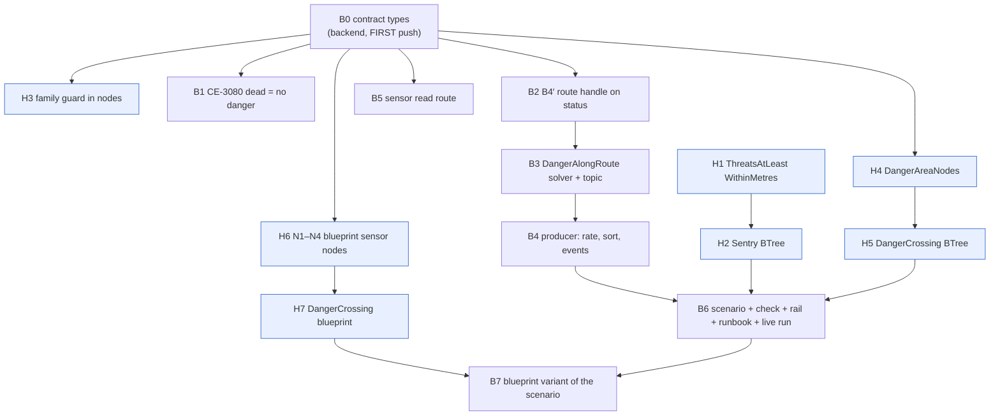

*What the picture shows that prose hid: after B0 the two chains never wait on each other until B6 — the behaviors lane's
H1/H2 need nothing at all and can start at once; the backend merges `behaviors` only for B6/B7.*

| merge point | who | when |
|---|---|---|
| behaviors merges `backend` | behaviors | ⭐ when `origin/backend` carries a commit titled `feat(CE-3072 B0)` — before H3/H4/H6; ⭐ again before its final commit |
| backend merges `behaviors` | backend | at the start of every slice (rule 7), and ⭐ before B6 (needs H2, H5) and B7 (needs H7) |
| the dispatch | backend → behaviors | [`HANDOFF_Danger_Crossing_Behaviors.md`](blueprints/batches/HANDOFF_Danger_Crossing_Behaviors.md) |

#### 10.6a ✅ AS-BUILT — B0 (`CE-3072`) and B1 (`CE-3080`), `2026-10-06`

| §10.6 said | as built | why |
|---|---|---|
| a NEW `DangerAreaSettings` component | ⭐ `DangerAreaSettings` is a plain struct carried by the EXISTING `DangerAreaSensor` component (`Settings` field) | reuse — the existing component already was "the standing query config on a sensor child"; no new id |
| `UnitSensors.ReadRanked(kind) status` | `UnitSensors.ReadRanked(view, unit, kind, out EqsCognitiveBuffer) → SensorReadStatus` | as drawn |
| `DangerAreaChildSensor.Ensure` "same owner stamp and site rules" | ⭐ the creation body is SHARED: `EqsChildSensor.Ensure<TResult>` adds the family's result component; the ranked `Ensure` is now `Ensure<EqsCognitiveBuffer>`; `Refresh` clears an area answer and never adds a ranked one | one implementation for every family (part ids, owner stamp, epoch rules) |
| `DangerAreaCognitiveBuffer.LastUpdateTick` | took the old 4-byte pad slot; ⭐ `IsReady` is now `LastUpdateTick != 0` — an answer with NO areas is an answer (it used to be `Count > 0`, reading "no danger" as "not ready") | |
| `SensorChange` +3 | ⭐ also `BuiltInHsmEvents.SensorNames` +3 (`Sensor.AreaAhead`, `Sensor.AreaThreatened`, `Sensor.AreaCleared`, ids `0xFF08`–`0xFF0A`) — caught by the rail `CE3040_TheBuiltInNames_MatchTheRuntimeEnum` | an HSM reacts to the danger sensor by these names |
| (not in §10.6) | `SensorEntryDto.IsWellFormed` accepts `DangerArea` (no per-kind block; `DangerAreaSettings.Default`); `SensorChildFactory.EnsureTkbChild` gives a DangerArea TKB child the AREA result component; `PerceptionRoleComponentRegistry` registers `DangerAreaSensor` + `DangerAreaCognitiveBuffer` (CGF + SimHost) | the TKB activation route of §10.2 |
| QA-037 | ⭐ `DangerAreaSensor` 262→271, `DangerAreaCognitiveBuffer` 263→272, `MovementModeIntent` 264→273 (a census of every `const int` 250–349 found them free); rail `QA037_TheSquadIds_CollideWithNoNavigationId` | they could not be registered in production while colliding with the navigation fakes |
| B1 `CE-3080` | `ThreatDanger.Of` returns 0 when `ThreatDanger.IsDead` (Health ≤ 0); rail `CE3080_KilledArmedContact_IsNoDanger_NoThreat_NoStrength` (ContactDanger, ContactThreatLevel, EnemyStrengthRatio) | one place for every threat reader |
| B4′ | `PathfindingResultMaterializationSystem`'s move branch writes `NavigationStatus.RouteHandle`; ⚠ `NavigationExecutionSystem` resets the status only on a NEW intent, so the handle survives (the plan lands a solver round-trip after the intent) — the live run (B6) confirms it on the wire | |

### 10.7 B3 + B4 — the `DangerAlongRoute` solve, its transport, and the Brain-side rating *(`2026-10-06`; `build-state: BUILT`, §10.7a)*

📐 **Measured** (a read-only sweep, every row `file:line` in the batch notes): ① a SimHost in BOTH cluster forms carries
`MuscleGround | Perception | NavigationSolver` (`SimHostApp.cs:186`) — so "the node holding the navmesh" IS a Perception
node; ⚠ a Stride node is `MuscleGround | Perception` only (`StrideCapabilities.cs:64`) ⇒ the picker must ask for BOTH
roles; ② the picker hard-codes `NodeRole.Perception` (`EqsSensorConfigEgressTranslator.cs:298`; `GetLeastLoadedNode` uses
`HasFlag`, so a combined role works as-is); ③ `INavmeshProvider.PlanPath(from, to, span, layerMask)` is synchronous
(`INavmeshProvider.cs:52`); test-town has no road graph, so its routes come from the Recast navmesh; ④ `EqsSolverSystem`
falls to `PublishEmpty` for an unknown template (`:212`) — the one branch point; ⑤ every result rides `EqsResultEvent` /
`EqsResultTopic` / `EqsResultUpdateEvent` into `EqsCognitiveBuffer` — ⛔ nothing carries an area descriptor; translators
are a plain list per pack (`SimHostAuxiliaryTranslatorPack.cs:56`).

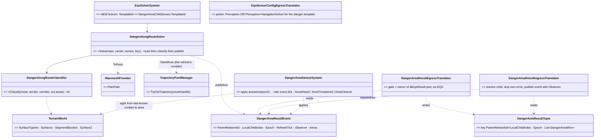

*What the picture shows that prose hid: the area answer travels a path PARALLEL to the ranked one (own event, own topic,
own apply system) and touches the ranked path at exactly two points — the solver's branch and the picker's role.*

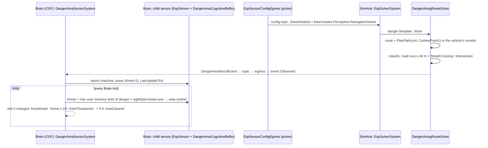

*What the picture shows that prose hid: the threat is re-rated EVERY tick from the Brain's memory, so the hold releases the
moment the rifleman sees the hostile reach cover — it does not wait for the next solve.*

| who registers / ticks it | |
|---|---|
| `EqsModule` (SimHost `PerceptionSolver`; editor) → `EqsSolverSystem` | the branch to `DangerAlongRouteSolve` (existing system, existing cadence) |
| `SimHostAuxiliaryTranslatorPack` — `Perception \| MuscleGround` | NEW `DangerAreaResultEgressTranslator`, beside `EqsResultEventEgressTranslator` |
| `SimHostAuxiliaryTranslatorPack` — `Brain` | NEW `DangerAreaResultIngressTranslator`, beside `EqsResultIngressTranslator` |
| `CgfLogicPack` + the editor's Brain capability | NEW `DangerAreaSensorSystem`, beside `EqsResultUpdateSystem` |

| ⭐ lean (v1 scope — the demo's need) | rejected / later |
|---|---|
| route sources ToPoint (navmesh plan) and OwnMove (the vehicle's own corridor on the solver node, read from `TrajectoryPoolManager`); Handle answers empty for now | shipping the route handle on the config topic — not needed while the solver node also holds the vehicle |
| kinds: StreetCrossing (a road run ≤ 40 m) and Intersection (a run inside two road surfaces) | OpenGround, ChokePoint, CrestLine — the next kinds, filed as `CE-3081`; a long road run (walking ALONG a street) is not a crossing |
| FeatureId = hash(road surface index, run centre on a 10 m grid) — stable across re-plans, so `AreaAhead` fires on a real change | a per-solve counter (every answer would look new) |
| rating on the Brain from the unit's own memory, sight by `TerrainWorld.SegmentBlocked` (eye 1.6 m → area centre +1 m), danger by `ThreatDanger.OfSlot` (so dead = 0, CE-3080) | the squad pool (U7 adds it) |

#### 10.7a ✅ AS-BUILT — B3 + B4 (`CE-3072`), `2026-10-06`

| §10.7 said | as built |
|---|---|
| OwnMove reads the vehicle's corridor from `TrajectoryPoolManager` | ⚠ the pool is not an ECS singleton (resource injection) ⇒ OwnMove RE-PLANS to the unit's `NavigationIntent.FinalDestination` on the same navmesh — the same endpoints, so the same route. `Handle` is not read in v1 (the sensor falls back to OwnMove) |
| `DangerAlongRouteSolve` in `Hrot.SimHost` | in `Fdp.Toolkit.Squad.DangerArea` (pure over `EqsContext`, `INavmeshProvider`, `TerrainWorld`) — unit-testable; `EqsSolverSystem` calls it |
| `DangerAreaSensorSystem` registered by `CgfLogicPack` + the editor | ⭐ on `EqsResultUpdateCapability` beside `EqsResultUpdateSystem` — every host that takes in sensor answers, one registration (CE-221's rule) |
| wire | `DangerAreaResultTopic` (`hrot-eqs-msgs`, keyed like `EqsResult`), `DangerAreaWire` (no threat), `DangerAreaWireMap` one mapping for both translators; egress skips an answer that ARRIVED from the wire (`Observer` set) |
| cadence | the solver answers each time `EqsSolverSystem` schedules the sensor (cost `Sensor + Path`); `MaxAreas` / `RefreshSeconds` do not ride the wire (8 areas max) |
| rating | sight = `TerrainWorld.SegmentBlocked` from the last-known position +1.6 m to the area centre +1 m; danger `ThreatDanger.OfSlot`; no range cap; edges with hysteresis 0.5 / 0.4 on slot 0 |

Rails: `DangerAlongRouteClassifierTests` ×6, `DangerAreaSensorSystemTests` ×6 (one crossing from a point; threat from a known armed contact with sight, 0 once its last-known position is behind a building; a killed watcher is no threat; AreaAhead / AreaThreatened / AreaCleared; a stale answer dropped; OwnMove). Gates on the tree merged with `behaviors`: `Fdp.Toolkits.Tests` 2767/0 (+1 skip), `Hrot.SimHost.Tests` 1121/0 (+3 skips). ⭐ **The DDS leg is railed across hosts:** `EqsDistributedTests.DangerAlongRoute_AcrossHosts_TheSolverAnswersTheBrain_AndTheBrainRatesTheCrossing` (`simhost,cgf`, 8 s) — 🔴 it FAILED first and found a real defect: `EqsModule` is `SlowBackground` (asynchronous, on a SNAPSHOT), so the solver's direct `Bus.PublishManaged` landed on the snapshot's bus and was lost; ⭐ the answer now goes through the command buffer (`EntityCommandBuffer.PublishManagedEvent`), as the ranked `EqsResultEvent` does. ⚠ A background system must never publish on `repo.Bus` directly.

#### 10.5b ✅ AS-BUILT — B6 (`CE-3079`, backend), `2026-10-06`: the demo PASSES live, with no HTTP write

| §10.3 / §10.5 said | as built |
|---|---|
| the watcher "east of the vertical road with sight of THAT crossing only" | ⚠ measured on the REAL footprints: L-Block is an L (`[230,110]…[255,170]`), so the first post (310,222) saw BOTH crossings and the rifleman held at the wrong one (run 1). ⭐ The watcher stands at (370,212): ≥ 25 m of building between it and Cross Street, a clear line to Main Street, 118 m from the hold point |
| `Sentry` 90 m (H2's default) | ⭐ 145 m (the order's `sentry.WithinMetres`) — ⚠ 125 m DEADLOCKED one live run: the hold point varies a few metres between runs (247.6,187.7 vs 241.2,188.0) and 241 is 131 m from the watcher, so the Sentry never ended. 145 m sits inside both units' 150 m vision and ≥ 180 m from the first crossing |
| withdraw "up the gap between Block C and the Tower" | to (395,290), north-east behind the Tower — along that walk, the last point the rifleman sees has ≥ 10 m of building between it and the crossing (searched over the real footprints) |
| the rifleman's order | `{"sensor":{"RouteTo":[285,220,0]},"walk":{"X":285,"Y":220,"Speed":1.5,"ArrivalRadius":3}}` (H5's shape — the objective is given twice) |
| check | `utility-demo-check.py --launch --timeout 240 ua-danger-crossing` — **PASS** (sim 0 → 284 s): two `StreetCrossing` areas at 133 m / 198 m · only Main Street ≥ 0.5 · hold at (247.6, 187.7) ≥ 10 s · the watcher's mission advanced by itself to (395.4, 291.1) · the rating cleared · crossed and arrived |
| repeat runs at 145 m | **PASS ×2 more** on fresh clusters: hold at (239.8, 187.8) sim 247 s · (240.0, 188.0) sim 256 s. ⭐ the hold point moves ≈ 8 m between runs (247.6 → 239.8) — the reason the Sentry radius needs margin |
| in-process twin | `PostureScenarioTests.CE3079_DangerCrossing_…` — the shipped file in a `HrotRunnerHarness` (simhost, ig, excon, cgf), the same five steps, nothing written into the run — **PASS** (4 m 25 s) |
| ⭐ **B7 — the blueprint variant** `ua-danger-crossing-bp` | the same file, the rifleman's task `DangerCrossingBp` (H7) with `{"Objective":[285,220,0]}` — **PASS live** (hold at (239.7, 187.8) ≥ 10 s, sim 246 s) and **PASS in-process** (the rail is a theory over both names, 4 m 28 s). ⇒ ⭐ CE-3078's acceptance (*"the blueprint form of `ua-danger-crossing`"*) is met: the per-kind nodes `SpawnSensor` / `When SensorResult` / `ReadSensorResult` drive the danger sensor end to end across hosts |
| ⭐ Q4 (behaviors H6) — the area answer's TIME | `DangerAreaCognitiveBuffer.LastUpdateTimeSeconds` added (588 B; stamped from `view.Time` by `DangerAreaSensorSystem.Apply` / `DangerAreaRefreshSystem`, cleared with the answer on a route change) ⇒ `BecomesStale` is decidable on the area family too; `SensorKindInfo`'s contract is FIVE members now (Sensors §7.10). The shipped `DangerCrossingBp` decls re-baked (`HasAnswerTime: true`; persistence-shape golden: that one line) |


## 11. G8 + G3 — fire distribution runs, and the squad becomes readable *(`2026-10-06`, `CE-3088` + `CE-3087`; `build-state: READY-TO-BUILD` — the programme and the item are approved, R-209 Q6; this is the build design)*

**INVENTORY** *(codebase-memory CLI `search_graph` + grep + a read-only corpus sweep, `2026-10-06`; ⚠ `check_index_coverage`
is not reachable through the CLI, so absence claims below are grep-corroborated)*: `search_graph name_pattern=".*ThreatMatrix.*"`
→ **1** class `ThreatMatrixAssignmentSystem` (`Utility/Group/ThreatMatrixAssignmentSystem.cs:22-132`, a plain `Run(repo, leader)`
library call, **no caller**) · `".*Assignment.*" label=Class` → 14, of which the squad ones are `AssignmentSlot` /
`AssignmentSlotArray` (`ThreatMatrixAssignmentState.cs`), `LeaderAssignmentDecision`, `SquadAssignmentOverlaySource` (reads the
roster, not the slots) · the merged pool `SquadCognitiveState.Contacts` (`SquadContactPool`, 16 × `SquadContact{EntityId = packed
handle, …, Flags 0x8000 = heard}`, written by `SquadPerceptionMergeSystem.Run` — subordinates only, `:47-95`) · the reader of an
assignment `StandardInputs.IsAssignedTarget` (`:290-306`) in `ThreatRankingDecision` (0.9, Threshold) → `EqsTacticsNodes.TopThreat`
→ `PostureNodes.Fire` · the frame driver `SquadCoordinationSystem` (`CgfLogicPack.cs:199`, `gateOnAuthority: true` from
`CgfSubsystem.cs:960`).

**Design basis.** [`Utility_AI_Design_v1_1.md`](designs/utility-ai/Utility_AI_Design_v1_1.md) §10 (LIVE) owns the assignment:
leader writes `SquadCognitiveState.Assignment`, a member reads its slot (§10.1), "leader proposes, member vetoes" (§10.3), "a
consideration, not an order" (§10.4) — ⚠ its §10.2 sources targets from "the commander's perceived `TargetMemory`", which
[`Squad_Coordination_Design_v1_1.md`](designs/group-maneuvers/Squad_Coordination_Design_v1_1.md) §4 overrides: the merged pool is
"what the leader's **fire and role allocation read**". [`DESIGN_Squad_Wiring.md`](designs/group-maneuvers/DESIGN_Squad_Wiring.md)
§5 D3 is about `CommanderUtilityTickSystem` ONLY — ⇒ the threat matrix was never wired for no recorded reason
(`DESIGN_Decision_Layer.md:73` attributes it to D3 — a misattribution, corrected there).

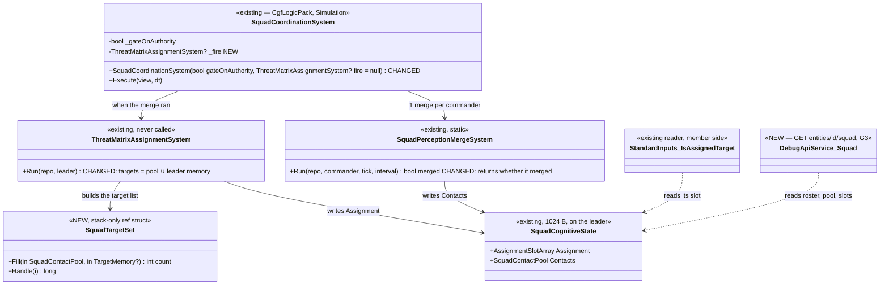

*What the picture shows that prose hid: the whole capability already exists on both ends — the writer (`ThreatMatrixAssignment`)
and the member's reader (`IsAssignedTarget` in ThreatRanking) — and the gap is ONE edge (the driver's call) plus ONE input
(the pool); nothing new on the member side.*

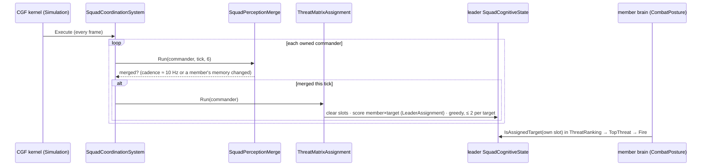

*What the picture shows: the assignment is recomputed only when the pool changed, so the 16 × 16 scorer pass runs at the merge's
cadence, not per frame — and the member's side is unchanged.*

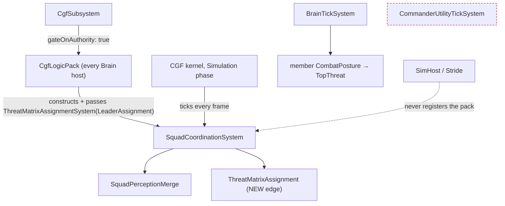

*What the picture shows: only a Brain host (CGF) runs the squad layer, gated to commanders it owns — so the assignment is
computed once per squad in a cluster; `CommanderUtilityTickSystem` stays unwired (U7, CE-507 D3).*

| decision | ⭐ lean (why) | rejected |
|---|---|---|
| **D1** targets | the merged pool's IDENTIFIED contacts **∪** the leader's own identified memory, deduplicated, ≤ 16 — the pool is F4's fix (Squad Coordination §4) and the merge walks **subordinates only** (`SquadPerceptionMergeSystem.cs:47-95`), so a leader that sees an enemy itself must still count it | pool only — loses the leader's own sightings · memory only — F4 |
| **D2** cadence | run when the merge ran this tick (`Run` returns it) | every frame — 16 × 16 `UtilityScorer.Evaluate` per squad per frame for an answer that changes at ≤ 10 Hz |
| **D3** wiring | `SquadCoordinationSystem` takes the assignment system as a constructor dependency; `CgfLogicPack` passes it (the pack already registers the decisions, `:197`) | constructing it inside the driver — hides the decision id; ⚠ an optional dependency the production caller must PASS (CLAUDE.md "silent default") ⇒ a rail on the CONSTRUCTED pack |
| **D4** the veto | unchanged — the member's CombatPosture picks Flee when hurt (§10.3 as built, `StarterPackIntegrationTests.Wounded_Member_Vetoes_…`) | a health term in `LeaderAssignmentDecision` — §10.4: the assignment is a consideration, the member decides |
| **D5** G3 route | `GET /entities/{id}/squad` on a commander: roster (member networkId, name, assigned target networkId/name, score, focus count) + the merged pool (networkId or "heard", threat, sources) + `lastMergeTick`; on a member: its commander's id and its own slot | maneuver / danger areas in the same route now — U7 reads them, and their writers are not wired (CE-507); add the fields when they are |
| ⚠ known deviation, NOT fixed here | `GreedyMatrixAssigner` walks members in roster order, not "sort pairs by score" (§10.2) — U6's acceptance (spread, ≤ 2 per target) holds either way | — |

**Acceptance (rails first):** ① the driver calls the assignment after a merge — a 4-member squad seeing 3 targets gets every
member a slot, no target more than 2 (`SquadCoordinationSystemTests`) · ② a target seen only by a member (not the leader) is
assignable (F4) · ③ the zero-alloc rail stays green · ④ `CgfLogicPack` constructs the driver WITH the assignment system · ⑤ the
`/squad` route lists members with their targets (+ RouteDoc / MCP catalog) · ⑥ U6 `ua-fire-distribution` on `basic-desert`:
live check + in-process twin — targets spread, ≤ 2 per target, each member SPENDS rounds, a member set to 10 HP takes a defensive
posture.

## 12. G7 — weapon mounts: the unit fires the weapon its target calls for *(`2026-10-06`, `CE-3089`; `build-state: READY-TO-BUILD` — approved R-209 Q4: "make WeaponEffectivenessVsTarget real … the choice driven by the target type")*

**INVENTORY** *(codebase-memory CLI `search_graph` + grep + a read-only corpus sweep, `2026-10-06`)*: `".*WeaponMount.*"
label=Class` → **4**: `WeaponMountInfo` (`CombatComponents.cs:34-44`, id 216 — registered by NO production registry, only tests) ·
`WeaponMountQuery` (`EnumerateMounts`: owner first, then children by `MountIndex` — no production caller) · `WeaponMountDto`
(TKB) · `SimCombatDef.WeaponMount` · `".*WeaponSelect.*"` → `WeaponSelectionDecision` (5 inputs, "evalSelf = mount, context =
target") · every production `WeaponState` reader (grep, 14 sites): `AimAndFireExecutor` (fires the OWNER's state, `WeaponIndex = 0`,
`:77,109-117`) · `FireProcessingSystem` (muzzle velocity from the owner's state `:103-114`; damage + penetration ALREADY per mount
via `CombatTkb.MountOf(shooter, WeaponIndex)` `:143-150`) · `WeaponDispatcherSystem` (drains the owner's cooldown) · `ThreatDanger`
/ `StandardInputs` / `SquadInputs` / `SquadEventIngressSystem` (read a UNIT, never a part — a mount child has no `SimTransform`
or `EntityInfo`, so it is never perceived or ranked) · `CombatTkbTranslator:98` (makes mount children ONLY when
`WeaponMountInfo` is registered).

**Design basis.** [`Utility_AI_Design_v1_1.md`](designs/utility-ai/Utility_AI_Design_v1_1.md) §11.4 (WeaponSelection ranks
weapons), §6.1 (the inputs read the mount), §6.7 / P0.2 (mounts ≥ 1 are CHILD entities; mount 0 stays on the owner — `.dev/_DONE/
utility-ai/PREREQ_Phase0_Bundle.md` P0.2: *"the scorer treats the owner's own WeaponState as candidate-index 0"* — ⚠ the shipped
scorer does NOT, `UtilityScorer.cs:268`) · §9 here (CE-3071: one armour model for the shot and the choice; per-mount range; ⚠
§9.1 *"AimAndFireExecutor still fires mount 0 — choosing another mount is G7"*) · [`DESIGN_Ownership_Groups_And_Grants.md`](DESIGN_Ownership_Groups_And_Grants.md)
F-6 / Q79 — mount parts are LOCAL, never on the wire · [`DESIGN_Sensors_And_Doctrine.md`](DESIGN_Sensors_And_Doctrine.md) V2 —
the mount child is the precedent for TKB-created children (the sensor children work the same way on CGF today).

```mermaid
classDiagram
  class CgfComponentRegistry {
    <<existing — CGF only>>
    +RegisterAll() CHANGED: + WeaponMountInfo
  }
  class CombatTkbTranslator {
    <<existing>>
    +Inject() mounts ≥ 1 as children (WeaponState, WeaponMountInfo, PartMetadata) — unchanged, now reached
  }
  class UtilityScorer {
    <<existing>>
    +EvaluateCandidates() CHANGED: WeaponSelection candidates = WeaponMountQuery (owner = mount 0, then children)
  }
  class WeaponChoice {
    <<NEW, static, Fdp.Toolkit.Combat>>
    +Choose(repo, owner, target, out Entity mountEntity) int mountIndex
  }
  class AimAndFireParams {
    <<existing, 12 → 13 B of 32>>
    +Entity Target
    +float CooldownSeconds
    +byte Mount  NEW: 0 = primary (every zero-filled writer), 255 = Auto
  }
  class AimAndFireExecutor {
    <<existing — CGF>>
    +Execute() CHANGED: Mount Auto ⇒ WeaponChoice per shot; ammo + cooldown on THAT mount's WeaponState; WeaponIndex = mount
  }
  class PostureNodes_Fire {
    <<existing — behaviors' shared fire step>>
    +Fire() CHANGED: writes Mount = Auto
  }
  class FireProcessingSystem {
    <<existing — SimHost>>
    +Execute() CHANGED: muzzle velocity of the fired mount (TKB), not the owner's
  }
  class WeaponMountQuery { <<existing, first production caller>> }
  WeaponChoice --> UtilityScorer : Evaluate(owner, WeaponSelection, context = target)
  UtilityScorer --> WeaponMountQuery : candidates
  AimAndFireExecutor --> WeaponChoice : Mount == Auto
  PostureNodes_Fire --> AimAndFireParams : writes
  CgfComponentRegistry ..> CombatTkbTranslator : registering it turns the child branch on
```

*What the picture shows that prose hid: the shot already resolves per mount (damage, penetration, the index on the wire), and
the children are already authored — the whole gap is that nothing REGISTERS the child component, nothing COUNTS the owner as
mount 0, and nothing WRITES an index other than 0.*

```mermaid
sequenceDiagram
  participant F as PostureNodes.Fire (CGF brain)
  participant X as AimAndFireExecutor (CGF)
  participant C as WeaponChoice
  participant S as UtilityScorer (WeaponSelection)
  participant H as FireProcessingSystem (SimHost)
  F->>X: ActionIdAimAndFire {Target, Cooldown, Mount = Auto}
  loop each shot, cooldown elapsed
    X->>C: Choose(owner, target)
    C->>S: Evaluate(owner, WeaponSelection, context = target)
    S-->>C: ranked mounts (owner = 0, TOW child = 1)
    C-->>X: mount i + its WeaponState entity
    X->>X: that mount: Ammo--, cooldown
    X->>H: WeaponFireIntent {Shooter, Target, WeaponIndex = i} (existing wire)
    H->>H: bullet: mount i's velocity, damage, penetration (TKB)
  end
```

*What the picture shows: the choice is re-made per SHOT, so it follows a target switch and an empty launcher without any
behaviour code; the wire and the hit side change only in where the muzzle velocity comes from.*

```mermaid
graph TD
  CGFREG["CgfComponentRegistry (CGF)"] -->|"registers WeaponMountInfo"| TKB["CombatTkbTranslator: mount children"]
  CGFK["CGF kernel"] -->|"ticks"| BTS["BrainTickSystem → PostureNodes.Fire"]
  CGFK -->|"ticks (CgfLogicPack:173)"| EXE["AimAndFireExecutor"]
  EXE -->|"WeaponFireIntent (wire)"| FPS["FireProcessingSystem (SimHost only — the combat role)"]
  SIMREG["SimHost / IG / Stride registries"] -.->|"do NOT register WeaponMountInfo: no children there"| TKB
  OTHER["CgfNodes.Action_FireAtTarget · HillAttackTankNodes"] -.->|"Mount = 0 (zero-filled): unchanged"| EXE
  classDef dead stroke:#c00,stroke-dasharray: 4 3
  class SIMREG,OTHER dead
```

*What the picture shows: only the Brain node (where ammo is spent and the choice is made) gets mount children, and the two
other fire writers keep firing mount 0 — so the hill-attack baselines (tanks, `HillAttackTankNodes`) do not move.*

| decision | ⭐ lean (why) | rejected |
|---|---|---|
| **W1** where children exist | register `WeaponMountInfo` in **`CgfComponentRegistry` only** — CGF spends the ammo and makes the choice; SimHost resolves the hit from the TKB by index and needs no child | the shared `CombatComponentRegistry` — makes unused children on SimHost / Stride (more local parts, no reader) |
| **W2** mount 0 | the owner IS candidate 0 (`WeaponMountQuery.EnumerateMounts`, P0.2's stated intent) | put `WeaponMountInfo` on the owner too — a second marker for a fact `WeaponState` already states |
| **W3** where the choice is made | in the executor, per shot, when the params say `Mount = Auto`; `PostureNodes.Fire` (the ONE posture/tactics fire step) writes Auto | a separate `SelectWeapon` BTree step — every fire writer would need it, and a choice made once goes stale when the target changes or the launcher empties · choosing in every writer — three copies |
| **W4** default | `Mount` zero-filled = 0 = today's behaviour for every writer that does not opt in | Auto by default — moves the hill-attack baselines (tanks with a coax) for no demo |
| **W5** muzzle velocity | the fired mount's TKB `MuzzleVelocity` (A3: read the TKB by type), the owner's `WeaponState` when there is no template | keep the owner's — a TOW would fly at the 25 mm's speed |
| **W6** *(found live, `2026-10-06`)* the range term | `WeaponRangeBandFit` (distance ÷ mount range) through a REVERSED LOGISTIC at 1.0 (`exp −12`): ≈ 1 inside the range, 0.5 at it, ≈ 0 past 1.5× — "in range", what the input's own doc says | ⛔ the starter `Curve.Bell` (peak AT the range, `exp(−8(x−1)²)`): a target at a fifth of the range scored 0.007, so every mid-range engagement scored all mounts ≈ 0 and fell to mount 0 — measured on `ua-weapon-choice`: the Bradley put 122 rounds of 25 mm into a T-72 at 523 m. The old rail `SC-SP-08` (which pinned the peak) is re-homed: "the mount that REACHES wins" |
| **W7** *(found live)* idempotent children | `CombatTkbTranslator` skips a mount whose child already exists (as it already did for the owner's `WeaponState`) | — measured: three WeaponSelection candidates for a two-mount Bradley (a second `Inject` duplicated the TOW child) |
| **W8** *(found live)* a mount's position | the weapon inputs (`WeaponRangeBandFit`, the effectiveness facing) read the shooter's position from `CombatTkb.OwnerOf(mount)`; an unknown range or position reads `RangeUnknown` (10× range), not 0 — 0 means point blank under the in-range curve | ⛔ the mount child's own `SimTransform` — production children have NONE (`CombatTkbTranslator` makes `WeaponState` + `WeaponMountInfo` + `PartMetadata`); the test helper `SpawnWeaponMount` gave them one, which hid that every TOW scored 0 live. The production-layout rail strips it |
| **W9** *(found live)* readiness and reload | ⭐ `WeaponSelectionDecision` drops `WeaponReadiness` — the decision says which weapon SUITS the target; WHEN it fires is the executor's (it waits on the chosen mount's cooldown); Utility AI design §11.4 never had it ("effectiveness × ammo-gate × range-band") · the weapon dispatcher drains every mount child's cooldown each frame | ⛔ readiness in a per-shot product: a reloading weapon scored exactly 0, so the weapons ALTERNATED — the 7-round TOW would take every other shot at infantry and the 25 mm the TOW's reload at a tank · ⛔ draining only the channel owner: the TOW fired once and its cooldown stayed at 1 for good (read live through `GET /entities/{id}/weapons?target=`, the route this item added) |
| ⚠ cross-lane | `PostureNodes.cs` is the behaviors lane's file: ONE line (`Mount = Auto`) — said in the commit and in the P2 handoff's SYNC | — |

**Acceptance (rails first):** ① a Bradley on CGF has a TOW child (mount 1) and the owner counts as mount 0 · ② `WeaponChoice`:
the 25 mm on infantry, the TOW on a T-72 — through `TopCandidate`-free `Evaluate` WITH the target (the CE-3071 rail's claim, on
the production layout: mount 0 on the owner) · ③ the executor with Auto fires `WeaponIndex 1` at a tank and spends the CHILD's
ammo; with Mount 0 it fires mount 0 as before (`AimAndFireExecutorTests` — the old `WeaponIndex == 0` assert kept for the default) ·
④ an empty TOW ⇒ the 25 mm (RoundsLeft / HasAmmo) · ⑤ U5 `ua-weapon-choice` on `basic-desert`: live check + in-process twin — the
T-72 loses health (only a TOW penetrates its 500 front armour), the insurgent is killed, the owner's 25 mm ammo falls. · ⑥ ⚠ **the mount children now EXIST on CGF for every multi-mount unit** (the hill-attack tanks too) — the hill-attack live checks must not move (they fire mount 0), and the part machinery that keys on `PartMetadata` was read for it: the EQS part-id allocator counts EQS parts only (`EqsChildSensor.cs:102-110`), a network part is resolved by `(root, descriptor, instance)` so a mount part (no network descriptor) is never matched (Q79 §0.10), the scenario extractor never sees one (marked not-saved, CE-3045)

### 11.1 ✅ AS-BUILT — G8 (`CE-3088`) + G3 (`CE-3087`), `2026-10-06`

| §11 said | as built / measured |
|---|---|
| D1–D5 | ✅ as drawn: `SquadPerceptionMergeSystem.Run` returns whether it merged; `ThreatMatrixAssignmentSystem.Run` reads pool ∪ leader memory (stack, ≤ 16, heard skipped); `SquadCoordinationSystem(gate, fire)` runs it after a merge; `CgfLogicPack` passes it; `GET /entities/{id}/squad` |
| acceptance ①–⑤ | rails `StarterPackIntegrationTests.CE3088_*` (3), `SquadCoordinationSystemTests.CE3088_*_DoesNotAllocate`, `CgfLogicPackTests` (`FireAssignment` not null) |
| ⑥ U6 `ua-fire-distribution` live | ✅ **PASS ×3** for the distribution: four members assigned, spread over 2 of 3 targets (East ×2, West ×2), no target over 2, every member fires. ⚠ **the hurt-member step is REPORTED, not asserted** — finding below |
| ⚠ **finding `CE-3090`** *(the behaviors lane's topic)* | on OPEN GROUND a hurt member has NO defensive posture: TakeCover / Flee score through `EqsTopScore(FindCoverFromTarget / FindSafeRetreatPoint)`, which read 0 on `basic-desert` ⇒ at 10 HP: `AdvanceAndAttack 0.386, Hold 0.18, Suppress 0.08, TakeCover 0, Flee 0`. The §10.3 veto is railed at unit level and unreachable where there is no cover |
| scenario tuning | the riflemen advance at 0.5 m/s on the hostile line (an objective 5 m ahead ended the posture at once); the hostiles have 600 HP (with 100 the squad killed them in seconds and a hurt member rightly kept advancing — nobody left to flee) |

### 12.1 ✅ AS-BUILT — G7 (`CE-3089`), `2026-10-06`

| §12 said | as built / measured |
|---|---|
| W1–W5 | ✅ as drawn |
| W6–W9 | ⭐ **four defects found only LIVE** (the unit rails imitated the layout; three of the four were invisible to them) — each fixed with a rail and recorded in §12's table: the range Bell, duplicated mount children, a mount child with no position, a mount child that never reloaded + readiness in a per-shot choice |
| the diagnostic | ⭐ `GET /entities/{id}/weapons[?target=]` — every mount, every WeaponSelection input, the choice; it is what found W8 and W9 |
| U5 `ua-weapon-choice` live | ✅ **PASS**: the TOW kills the T-72 (2500 → 0 HP), the 25 mm kills the insurgent in a 3-round burst, sim 4.1 s. In-process twin `WeaponChoiceScenarioTests.CE3089_U5_*` PASS |
| ⚠ hill-attack regression | ✅ `hill-attack-close` unchanged with mount children on CGF (commander finishes t=40.5, hostiles 0) |
