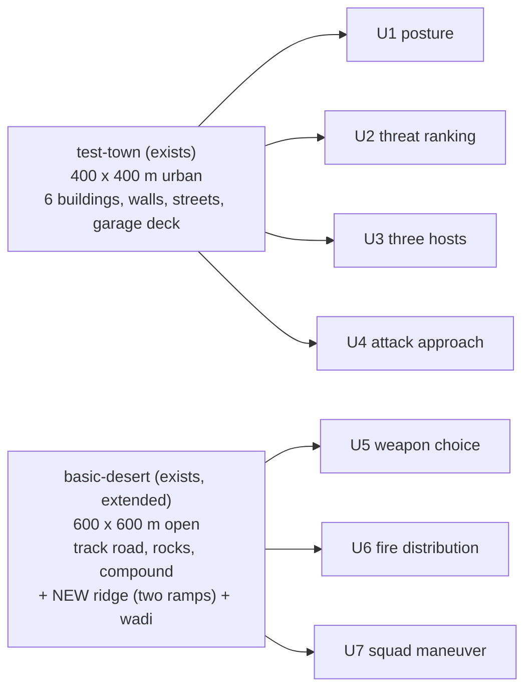
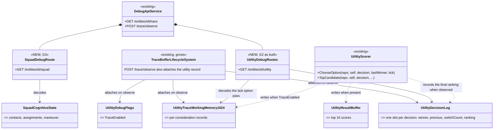
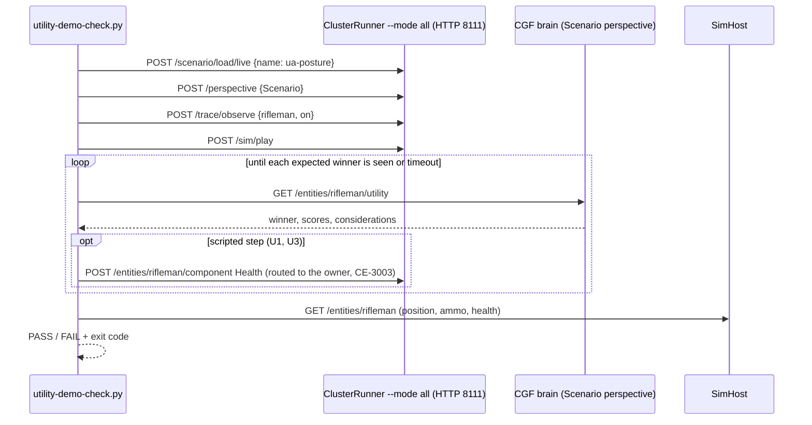
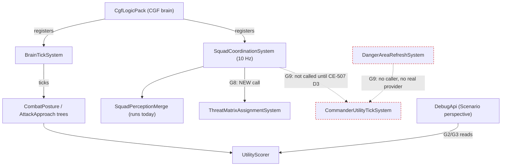
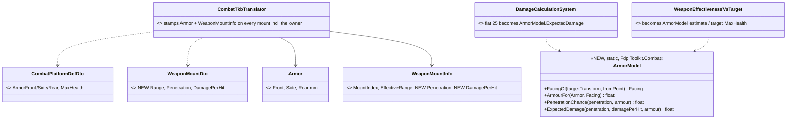
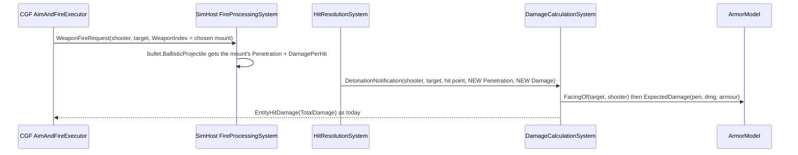
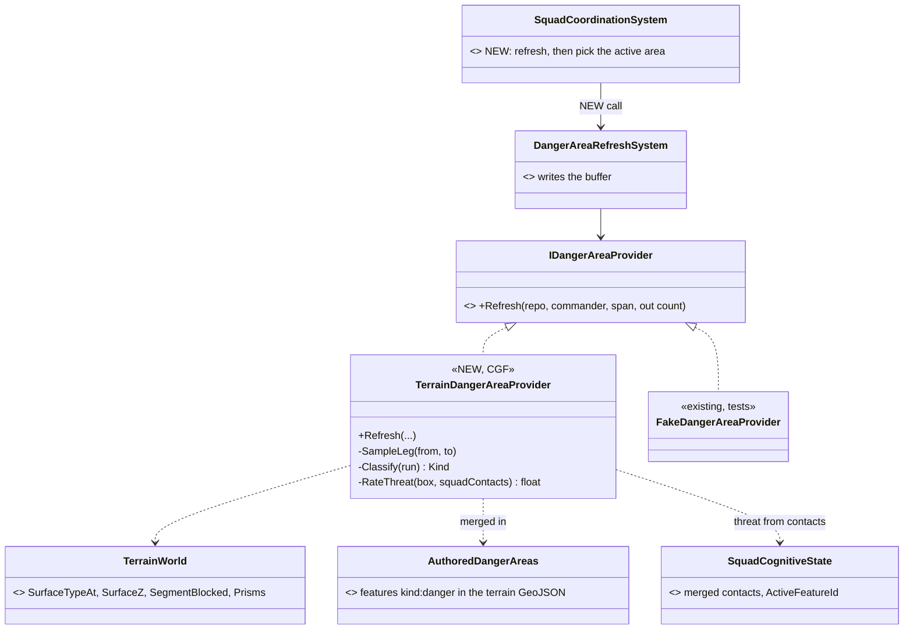
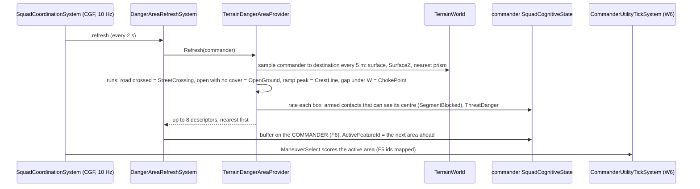

<!--STATUS
state: LIVE
updated: 2026-10-05
build-state: BUILDING — Q1–Q7 APPROVED 2026-10-05 (user: "Approved."), R-209. P1: G1 BUILT (CE-3070), G2 BUILT, U1 + U2 PASS live (G11 partial); the live runs found and fixed CE-3073 (one contact remembered) and CE-3074 (healthy contacts ranked 0). §9 (ammunition vs armour) and §10 (the danger sensor) are DESIGN — each asks the user to approve its leans.
current-answer: §4 (the seven scenarios), §6 (what has to be built), §8 (approved leans), §9 (armour model), §10 (danger sensor). §2 is the measured state they rest on.
stale-below: nothing — new document.
known-rot: none.
known-conflict:
  - docs/DESIGN_Decision_Layer.md §3 INVENTORY says five decisions are registered at CGF start — four are (ManeuverSelect has no [UtilityDecision]); its STATUS line still calls §3.3 "not started" while its body records CE-2067…2073 BUILT. Noted there, 2026-10-05.
related-designs:
  - docs/DESIGN_Decision_Layer.md — OWNS the utility step (ChooseOption / IsOption / RankCandidates, §3.3) and CombatPosture (§3.3b); this document only DEMONSTRATES them and lists what is missing to do so.
  - docs/designs/utility-ai/Utility_AI_Design_v1_1.md — OWNS the scoring engine, inputs, the starter decisions (§11.4), the trace (§9) and group fire coordination (§10).
  - docs/designs/group-maneuvers/DESIGN_Squad_Wiring.md — OWNS the squad layer's wiring and the open decisions D2/D3/D5 (CE-507) that scenario U7 depends on.
  - docs/DESIGN_Eqs_Consuming_Behaviours.md — OWNS TakeCover / FallBack (CE-3031); U4's Flank and firing-position behaviours follow its pattern.
  - docs/DESIGN_Terrain_World.md — OWNS the terrain format and the two terrains this document reuses (§3 here).
  - docs/RUNBOOK_Cluster_Debugging_Over_Http.md — OWNS how to launch and read a --mode all cluster; the per-scenario runbook (§5.3) extends it.
  - docs/designs/utility-ai/Runtime_Tuning_Console_and_AI_Overlays_Design_v1_0.md — OWNS the overlays and live tuning; out of this document's scope (§7).
-->

# Utility AI demo scenarios — one scenario per feature, each an E2E test

> 🔒 **User, `2026-10-05`:** *"I would like to have a set of sample scenarios demonstrating the utility ai features,
> including the not yet used and not yet built decisions. And to build the missing features required by them. To use
> those scenarios as e2e tests, with runbooks how to run those and how to check they are really working in the
> 'clusterrunner --mode all' environment. The scenarios might use the specific terrain asset which suits the purpose the
> best. Ideally if there is just few terrains, like 2 or 3, shared by the scenarios. Can we start designing such demo
> scenarios for the features and discovering what features need to be built?"*

Tracker: `CE-3069` (this programme), `CE-3070` (F1, fixed), `CE-3073` (F10, fixed), `CE-3074` (F11, fixed), `CE-3071` (§9 armour model), `CE-3072` (§10 danger sensor). Written by the backend lane; the utility AI is the behaviors lane's topic, so this is a cross-lane design (allowed,
`2026-10-02`). §8 Q6 proposes who builds what.

## 1. INVENTORY *(`2026-10-05`, code graph + grep + four read-only corpus sweeps)*

| query | total |
|---|---|
| `search_graph name_pattern=.*Decision$ label=Class` | 6 — `CombatPosture`, `ThreatRanking`, `WeaponSelection`, `LeaderAssignment`, `ManeuverSelectStarter` decisions + the blueprint IR op `IrOp_ScoreDecision` |
| `search_graph qn_pattern=.*(Fdp.Toolkits.Utility\|Fdp.Toolkits.Squad\|Hrot.Utility.Editor).* label=Class` | 143 (core, inputs, starter pack, group, squad maneuvers ×6, editor library) |
| input readers (`[UtilityInput]`, `StandardInputs.cs`, `SquadInputs.cs`) | 28 — 19 standard + 9 squad |
| terrains (`*/Recipes/Terrain/*/terrain.json`) | 2 — `test-town`, `basic-desert` |
| scenarios (`scenarios/*`, `Hrot.AI.Behaviors/Recipes/Scenarios/*`) | 8 curated + 5 recipe seeds; only `tt-posture` runs a utility decision as its behaviour |
| `check_index_coverage` | not run on the graph used here (CLI); absence claims below are graph + grep agreeing, not proof |

## 2. What exists — measured

### 2.1 Feature × live state

| feature | state in a live cluster | evidence |
|---|---|---|
| option decision `ChooseOption` + `IsOption` branch switch, hysteresis 0.08 | ✅ LIVE — CombatPosture | `UtilityNodes.cs:64-74`, `CombatPosture.btree.json:48` |
| curves (8 kinds), weighted product with compensation, weighted sum | ✅ LIVE through CombatPosture | `Aggregator.cs:25-55` |
| ranking `TopCandidate` (C#) | ⚠ LIVE but scores every contact **0** — F1 | `EqsTacticsNodes.cs:180` |
| `RankCandidates` node | built, no asset uses it | `UtilityNodes.cs:77-86` |
| blueprint `ScoreDecision` (→ `Decide`) | built, no asset uses it; the decision id is a raw string (BP-27) | `UtilityBlueprintBridge.cs:34` |
| HSM host (stateful guard) | compiles; a runtime switch never tested (Decision Layer §3.3 D3) | `SharedAiBindingCompilesTests.CE2069_*` |
| `WeaponSelection` | inert — F2 | — |
| `LeaderAssignment` + `ThreatMatrixAssignmentSystem` (fire distribution) | built, never run | `SquadCoordinationSystem.cs:18-21` |
| `ManeuverSelect` + `CommanderUtilityTickSystem` + 6 squad maneuvers | built, never run; not in the catalog | Squad Wiring D2/D3 (CE-507) |
| EQS templates `FindFlankingPosition`, `FindOpenFiringPosition`, `FindThreatsInView` | built, no behaviour uses them | `StarterTemplates.cs:10-84` |
| trace (`UtilityTraceWorkingMemory1024`), `UtilityResultBuffer` | built, nothing attaches them | `UtilityScorer.cs:165-173,214-220` |
| reading the winner / scores over the debug API | ⛔ no route — F9 | — |

### 2.2 Findings *(each measured; these are the "discovered" features to build)*

| # | finding | evidence | consequence |
|---|---|---|---|
| **F1** | `DistanceToContext` and `WeaponRangeBandFit` read the GEOGRAPHIC `Position`, which no Hrot node registers; live units carry `SimTransform` | `StandardInputs.cs:7,141`; `RegisterComponent<Position>` only in `Fdp.Examples.Showcase` and a benchmark | ThreatRanking is a weighted product ⇒ every contact scores 0 ⇒ `TopThreat` keeps the current threat or takes the first in memory order. **A live defect today (filed `CE-3070`)**: TakeCover, FallBack and CombatPosture aim at memory order, not the ranked threat |
| **F2** | WeaponSelection has 0 candidates: `WeaponMountInfo` is never registered, so mount children are never made; the fire executor always fires `WeaponIndex 0`; every mount gets the primary's range; `TopCandidate` passes a null context | `CombatTkbTranslator.cs:87,98`; `AimAndFireExecutor.cs:77,111-117`; `BdcTkbBuilder.cs:178`; `UtilityScorer.cs:206` | weapon choice needs engine work, not a scenario |
| **F3** | the trace's winner record is written BEFORE hysteresis is applied | `UtilityScorer.cs:398-405` vs `:456-485` | a trace can name a different option from the one chosen |
| **F4** | fire distribution reads the commander's OWN `TargetMemory`, not the squad's merged pool | `ThreatMatrixAssignmentSystem.cs:50,56` | a commander without sensors assigns nothing |
| **F5** | ManeuverSelect's option ids (0/1/2) are not `ManeuverKind`'s (1/2/…); it is not in the catalog; `ChooseOption` takes only PostureSelect decisions | `ManeuverSelectStarterDecision.cs:20-22`, `CommanderUtilityTickSystem.cs:65`, `DangerAreaCrossingManeuver.cs:30` | "Hold" would run bounding overwatch |
| **F6** | the danger-area buffer is written on a sensor CHILD but read from the commander | `DangerAreaRefreshSystem.cs:51` vs `SquadInputs.cs:194,215` | every danger-area input reads 0 |
| **F7** | `tt-*` recipe scenarios are seeded onto the NAS only by the editor; `--mode all` seeds `scenarios/*` (folders with the curated marker) | `Program.cs:384`, `CuratedScenarios.cs:139-153`, `EditorSubsystem.cs:2251-2262` | demo scenarios live in `scenarios/` |
| **F8** | the only unit with two weapons is the M2 Bradley (TKB 101: 25 mm, TOW); infantry 2002 has one rifle and no `WeaponCapabilitiesDto` (range 0) | `NedTkbCatalog`, `UrbanCombatTkbCatalog.cs` | U5 uses a Bradley |
| **F10** ✅ fixed `CE-3073` | a unit kept only ONE of several contacts acquired in the same frame — `ActiveSensorTracksUpdateSystem` overwrote the whole track list per event (measured live on U2: three visible hostiles, one track) | `ActiveSensorTracksUpdateSystem.cs` (pre-fix :43-105) | every multi-enemy fight; U2 could not rank what the unit never remembered |
| **F11** ✅ fixed `CE-3074` | ThreatRanking scored every HEALTHY contact 0: `ContactHealthFraction` through `InverseLinear` (1 − health) in a product ⇒ full health = 0 ⇒ the whole score 0; live, an unarmed civilian (no Health) ranked first | `ThreatRankingDecision.cs` (pre-fix) | target choice in every fight; now `1 − 0.5·health` |
| **F9** | no route shows a utility winner or scores: a BTree working state (`UtilityChoice`) has no route (`/variables` is blueprint-only); the trace is never attached; fixed arrays dump collapsed | `DebugApiService.Variables.cs:111-120`; RUNBOOK §6 | "is it really working" can only be inferred from side effects today |

## 3. Terrains — two, shared

*What the picture shows that prose hid: close combat (cover, line of sight round corners) needs the town; range,
target type and squad movement need open ground — and no third terrain is needed.*

| decision | why | rejected |
|---|---|---|
| ⭐ reuse `test-town` unchanged | cover, LOS blockers and streets already exist; `tt-take-cover`/`tt-posture` prove EQS answers there | — |
| ⭐ extend `basic-desert` with a ridge (two ramps meeting at a crest) and a wadi | ramps are walkable AND block sight (`TerrainWorld.cs:157-165` — sight lines test walkable triangles), so a ridge works as a hill without a heightfield; the tests pin only its NAME | a third terrain (the user prefers 2–3; nothing needs it) · a heightfield (not built) |
| ⚠ to MEASURE when building | that the navmesh bakes over the ramps and `SurfaceZ` puts a unit on top of them, not on the ground below | — |

## 4. The scenarios

All seven live in `scenarios/` (F7), load with `POST /scenario/load/live`, and are checked over HTTP.

| id | terrain | cast | shows | needs (§6) |
|---|---|---|---|---|
| **U1** `ua-posture` | town | rifleman (2002) running `CombatPosture`; one ARMED hostile (2002) | all five postures + hysteresis: Suppress at first against a matched enemy (CE-2072's rail); the check script lowers the rifleman's Health over HTTP → TakeCover → Flee (FallBack) → restores it → back; Health held at a boundary does not flicker. ⚠ The exact winner per step (and which edit reaches Hold) is NOT measured yet — the in-process rail pins it first, the script then asserts that sequence | G1, G2, G11 |
| **U2** `ua-threat-ranking` | town | rifleman; an unarmed civilian (1001) close; an armed hostile in sight; an armed hostile far; one hidden behind a building | ranking: the armed, visible, near hostile is engaged first; the ranking list is readable | G1, G2, G11 |
| **U3** `ua-three-hosts` | town | three riflemen side by side, same enemy: BTree `CombatPosture`, HSM `CombatPostureHsm`, blueprint `CombatPostureBp` | R-197 — one decision, three hosts, the SAME winner sequence under the same Health edits | G2, G4, G5, G11 |
| **U4** `ua-attack-approach` | town | rifleman; armed hostile behind the High Wall / Tower corner | a NEW decision `AttackApproach` {Direct, Flank, FiringPosition}, run inside the AdvanceAndAttack branch: no sight ⇒ Flank or FiringPosition wins; uses the three unused EQS templates | G1, G2, G6, G11 |
| **U5** `ua-weapon-choice` | desert | Bradley (101); hostile infantry (2003) at ~300 m; a T-72 (103) at ~550 m | WeaponSelection: 25 mm at the infantry, TOW at the tank | G1, G2, G7, G11 |
| **U6** `ua-fire-distribution` | desert | a leader + 4 riflemen (hierarchy by `UnitSubordinate`); 3 spread hostiles | LeaderAssignment + the threat matrix: targets spread, at most 2 on one target; a wounded member vetoes | G1, G3, G8, G11 |
| **U7** `ua-squad-maneuver` | desert | the U6 squad ordered across the track and over open ground to the ridge | ManeuverSelect: DangerAreaCross at the track, BoundOverwatch over open ground, Hold under heavy threat | G3, G9, G10, G11 + CE-507 D2/D3 |

*Not demonstrated, on purpose:* the editor card table, overlays and live tuning (§7).

## 5. How a scenario is checked

### 5.1 The observe route (G2) — the one new debug surface

*What the picture shows that prose hid: the scorer already writes everything a check needs — the route only ATTACHES
the components it writes into and DECODES them; no new scoring path.*

⭐ **As built (`2026-10-05`) — two deviations, both simplifications:** ① no separate observe route: the existing
`POST /trace/observe` arms the utility record too (`TraceBufferLifecycleSystem`), one switch for "observe this unit's
AI"; ② the scores live in a NEW per-decision `UtilityDecisionLog`, not the unit's `UtilityResultBuffer` — a unit has one
buffer and the posture and the threat ranking both write it every tick, so it shows whichever ran last. ⛔ SUPERSEDED:
the `POST /entities/{id}/utility/observe` route this section first drew.

`GET /entities/{id}/utility` answers per decision run on that unit: `decision`, `winner` (name), `previousWinner`,
`switchedAtSimTime`, per-option `score` (after hysteresis — F3 fixed), and per-consideration `input / raw / curved /
weight`. Brain perspective only (the scorer runs on the Brain node).

### 5.2 One check run

*What the picture shows that prose hid: the decision is asserted where it is made (the Brain), the effect where it
happens (SimHost) — both, because a correct winner whose child never moves is still a failure.*

### 5.3 Two forms of every scenario

| form | where | role |
|---|---|---|
| ⭐ the HTTP check | `scripts/utility-demo-check.py <scenario>` against `ClusterRunner --mode all`; asserts and exits non-zero (unlike `hill-attack-check.py`, which only prints) | the acceptance the user asked for; the runbook drives it |
| ⭐ the in-process rail | `Hrot.ClusterRunner.Integration.Tests`, `PostureScenarioTests` pattern (posture + three hosts INTO that suite, R-142); new suites only for weapon and squad | the regression gate a test run can repeat |
| the runbook | `docs/RUNBOOK_Utility_AI_Demos.md`: per scenario — launch, load, what to watch, the expected winner sequence, what a failure looks like and where to look first | linked from `RUNBOOK_Cluster_Debugging_Over_Http.md` |

### 5.4 Who runs what each frame

*What the picture shows that prose hid: fire distribution (U6) needs only ONE new call in a system that already runs
every frame; maneuver selection (U7) has two systems nobody calls (red) and is blocked on decisions, not code.*

## 6. What has to be built

| id | item | size | for | depends |
|---|---|---|---|---|
| **G1** ✅ BUILT `2026-10-05` | the two distance readers read `SimTransform` (as EQS does, `EqsContext.cs:64`) — fixes F1 live (`CE-3070`) | S | U2, U4–U6 | — |
| **G2** ✅ BUILT `2026-10-05` | `/entities/{id}/utility` + a per-decision `UtilityDecisionLog` (armed by the EXISTING `POST /trace/observe` — one switch); F3 fixed; options named by `[UtilityDecision(OptionNames = typeof(…))]` | M | all | — |
| **G3** | `/entities/{id}/squad`: contacts, assignments, maneuver, danger areas | S | U6, U7 | — |
| **G4** | `CombatPostureHsm` asset + a runtime switch rail (Decision Layer D3) | M | U3 | — |
| **G5** | `CombatPostureBp` blueprint (ScoreDecision + Behaviour Task per option) + a decision picker on `ScoreDecision` (BP-27) | M | U3 | — |
| **G6** | NEW decision `AttackApproach` + behaviours `Flank`, `MoveToFiringPosition` (the TakeCover pattern) + a `ThreatsInView` input use | M | U4 | G1 |
| **G7** | weapon mounts: register `WeaponMountInfo`, per-mount range, effectiveness vs armour (not a copy of range fit), the fire executor fires the chosen mount, a `SelectWeapon` step in the engage path; `TopCandidate` passes the target as context (F2) | L | U5 | G1 |
| **G8** | call `ThreatMatrixAssignmentSystem` from `SquadCoordinationSystem`; feed it the merged pool (F4); an infantry squad hierarchy in a scenario | M | U6 | G1, G3 |
| **G9** | CE-507 D2/D3: a danger-area provider (interim: features authored in the terrain file), F5, F6, a squad-maneuver behaviour on the commander, members reading their role | L | U7 | user decisions |
| **G10** | `basic-desert` ridge + wadi; measure navmesh and `SurfaceZ` on the ramps | S | U5–U7 | — |
| **G11** ⚠ PARTIAL `2026-10-05` | the seven scenario folders, `utility-demo-check.py` (asserting; `--launch` = a fresh cluster per run, CE-295), the runbook, one in-process rail each — ✅ U1 `ua-posture` and U2 `ua-threat-ranking` built and PASS ×2 live; ⏳ their in-process rails, U3–U7 | M | all | per scenario |

## 7. Out of scope — and why

| | |
|---|---|
| the utility editor card table, overlays, live tuning console | library code with no host (Runtime Tuning design); they are editor/UI work and a scenario cannot assert them over HTTP |
| a `RankCandidates`-node consumer | a second "engage the top threat" path beside `TopThreat` would duplicate it (R-174); U2 shows ranking through `TopCandidate` and the route |
| `AllyAdvancingNearby` (a stub) | CE-2072 removed its only use |

## 8. Questions for the user — each with a lean *(✅ ALL SEVEN LEANS APPROVED `2026-10-05`, R-209)*

| # | question | ⭐ lean | what would change it |
|---|---|---|---|
| **Q1** | the set and order | the seven scenarios in four phases: **P1** U1, U2 (G1, G2, G11) → **P2** U3, U4 (G4–G6) → **P3** U5, U6 (G3, G7, G8, G10) → **P4** U7 (G9) | if one feature matters most to you, it moves first |
| **Q2** | terrains | `test-town` + `basic-desert` extended with a ridge and a wadi — two terrains | if the ramp ridge fails the navmesh measurement, a third flat-plus-hill terrain |
| **Q3** | the "not yet built" decision | `AttackApproach` {Direct, Flank, FiringPosition}, run inside AdvanceAndAttack — it uses the three idle EQS templates and shows a decision NESTED in another | rejected: two more CombatPosture options — posture is *what stance*, approach is *how to attack*; mixing them makes a 7-option decision harder to tune |
| **Q4** | weapon effectiveness | make `WeaponEffectivenessVsTarget` real (target armour vs the weapon), so the choice is driven by the target type, not only range | if the TKB has no penetration data per weapon (not yet measured), range-only for now |
| **Q5** | U7 and CE-507 | keep U7 last; decide D2/D3 when P1–P3 are done, with an interim provider that reads danger areas authored in the terrain file | if squad maneuvers matter most, decide D2/D3 now |
| **Q6** | lanes | backend: G1, G2, G3, G7 (engine), G8 (wiring), G10, G11 · behaviors: G4, G5, G6, G9's behaviour | if you want one lane to own the whole programme |
| **Q7** | the E2E form | both: the HTTP check against `--mode all` is the acceptance, the in-process rail is the regression gate | if `--mode all` runs can be automated in CI, the rail may be enough |

## 9. Ammunition vs armour — one simple model for the shot AND the choice *(DESIGN `2026-10-05`, leans awaiting the user)*

🔒 **User, `2026-10-05`:** *"Plan for implementing ammo vs armour params - some simple model."*

📐 **Measured today:** every hit costs a flat **25 HP** whatever fired it (`DamageCalculationSystem.cs:63-68`,
`CombatConstants.DefaultBulletDamage`); armour front/side/rear exists in the TKB (`CombatPlatformDefDto.cs:12-28`) and
**nothing reads it**; no weapon carries a penetration or damage value; `WeaponEffectivenessVsTarget` is a copy of the
range fit (`StandardInputs.cs:361`). The design record already intends it: *"armor penetration curves (POC: flat hp)"*
(`BS-1-DESIGN.md` §2), *"reads the armor thickness, calculates impact angles, applies penetration curves"*
(`.dev/_DONE/brain-split/design-talk.md:197`), and *"weapons vs my armour"* for danger (Decision Layer G1). No design
gives a formula — this section is that formula.

*What the picture shows that prose hid: the damage the simulation APPLIES and the effectiveness the AI EXPECTS call the
same function — the AI cannot believe a 25 mm hurts a T-72 while the simulation says it does (or the reverse).*

*What the picture shows that prose hid: no network message changes (R-158) — `WeaponFireRequest` already carries the
mount index and `EntityHitDamage` already carries the damage; only local events and a component grow.*

| rule | the model |
|---|---|
| facing | the angle between the target's forward (`SimTransform.Rotation` yaw) and the direction to the shooter: < 60° front, > 120° rear, else side. Turrets ignored |
| penetration chance | `r = penetration / armour`; `P = clamp((r − 0.8) / 0.4, 0, 1)` — nothing below 80 %, certain above 120 %; no armour ⇒ 1 |
| damage of a hit | `DamagePerHit × P` — the EXPECTED value, no dice: replays and the determinism rails stay deterministic |
| unknown munition | `Penetration = 0` (an external detonation, `MunitionDetonationIngressTranslator`) ⇒ today's flat 25, unchanged |
| AI effectiveness | `min(1, ExpectedDamage / target MaxHealth)` at the current facing — "share of a kill per hit" |
| WeaponSelection | gains `RoundsLeft` (log scale, `ln(1+ammo)/ln(1+300)`, weight 1): with 7 TOW rounds and 300 of 25 mm, the 25 mm wins on infantry and the TOW on a tank |

**Calibration (catalog code, `BdcTkbCatalog` / `UrbanCombatTkbCatalog`):**

| weapon | penetration mm | damage / hit | ⇒ vs (computed, not run) |
|---|---|---|---|
| rifle (M4, 2002's rifle) | 5 | 25 | **unchanged for the UrbanCombat soldier** (2002: 100 HP, no armour ⇒ P 1, 4 hits). ⚠ **Corrected `2026-10-05`:** the BDC Rifleman (200: `ArmorFront` 5 mm, side/rear 0, `MaxHealth` 5×5 = 25, `BdcTkbBuilder.cs:169`) goes from 1 hit to 2 from the front (r = 1 ⇒ P 0.5), still 1 from side/rear |
| RPG (2003) | 300 | 400 | Bradley side 60 ⇒ P 1, 2 hits (500 HP); T-72 front 500 ⇒ 0 |
| 25 mm M242 | 60 | 60 | 2 hits on infantry; T-72 any face ⇒ 0 |
| TOW | 800 | 2000 | T-72 front ⇒ P 1, ~2 hits |
| 120 mm M256 | 650 | 1200 | T-72 front ⇒ 3 hits; M1 front (600) ⇒ P 0.71, ~4 hits |
| 125 mm 2A46 | 600 | 1100 | M1 front ⇒ P 0.5, ~6 hits |

⚠ **Blast radius — the reason this needs your nod:** tank fights stop taking ~120 hits. **hill-attack** (M1s vs Abrams)
will kill in a handful of rounds instead of running out of ammo, so its baseline rails (`PlatoonBaselineRails`,
`DeterminismRails`) are re-pinned in the same change. UrbanCombat infantry scenarios do not move (25 per rifle hit, no armour); BDC Rifleman scenarios do (front hits halve).

| ⭐ lean | rejected |
|---|---|
| **A1** the model drives the REAL damage and the AI estimate (one function) | estimate-only, damage stays flat — the AI would pick weapons for a world that does not exist |
| **A2** expected damage, no random roll | a seeded roll per hit — more "realistic", but needs a sim RNG stream and makes every combat rail statistical |
| **A3** static weapon data on `WeaponMountInfo` (every mount, including the owner's mount 0); armour as a new `Armor` component stamped from the TKB | on `WeaponState` — scenario files override `WeaponState` whole, and a missing field would silently zero the penetration |
| **A4** per-mount range comes from the mount (fixes the TOW's 3750 m being read as the 25 mm's 2500 m) | — |

## 10. The danger sensor — what the squad decisions need *(DESIGN `2026-10-05`, leans awaiting the user)*

🔒 **User, `2026-10-05`:** *"What about the danger sensor required by some of the utility ai based behaviors?"*

📐 **Measured:** the contract is BUILT — `IDangerAreaProvider.Refresh(repo, commander, span, out count)`
(`IDangerAreaProvider.cs:24`), a 68-byte `DangerAreaDescriptor` {FeatureId, ThreatRating, Kind (OpenGround /
StreetCrossing / Intersection / ChokePoint / CrestLine), oriented box + height band, near/far handles}, the sensor child
and an 8-slot buffer. **Nothing produces areas**: the only provider is `FakeDangerAreaProvider`; the refresh system has
no caller; component ids 262/263 collide (QA-037); the buffer is written on the child and read from the commander (F6);
nothing chooses the active area (`ActiveFeatureId` is set only by a forced-maneuver order, `ForceManeuverMapper.cs:39`);
ManeuverSelect's ids are off by one (F5). Only `ManeuverSelect` and the squad maneuvers need it — the single-unit
decisions (U1–U5) do not.

The squad design meant the geometry to run on the Muscle over the navmesh (Squad Coordination §5, §11 "navmesh
tactical-feature extraction, in plan"). 📐 **But the Brain already holds the terrain** — `TerrainWorld` is resident on
CGF since R-182 (`CgfSubsystem.cs:1152`), with surfaces (road / open / forest / water), prisms, ramps, `SurfaceZ` and
`SegmentBlocked` — while the **path** is not (CGF composes no navmesh; the Brain pathfinding pack is inert there).

*What the picture shows that prose hid: the provider plugs into an interface that already exists and a system that
already runs — the work is the provider and three wiring fixes, not a new pipeline.*

*What the picture shows that prose hid: the threat on an area is judged from what the squad KNOWS (its merged contacts)
at refresh time — the same "danger at read time" rule as R-194 — not stored in the terrain.*

| ⭐ lean | rejected |
|---|---|
| **B1** a Brain-side provider over `TerrainWorld`, sampling the straight leg from the commander to its destination; authored `kind:danger` features in the terrain file are merged in (an author can add a choke the classifier misses) | **Muscle-side extraction over the real path** (the squad design's §5) — it needs the path corridor and a new DDS topic for the descriptors; the provider interface is the same, so it can replace B1 later without touching a decision · **authored areas only** — every terrain would need hand work before a squad can move |
| **B2** threat on an area = the strongest armed known contact with sight of its centre (`ThreatDanger` × visible), plus a waypoint's authored `dangerLevel` | a fixed rating in the terrain — danger would not depend on where the enemy is |
| **B3** fix with it: F6 (buffer on the commander), F5 (option → `ManeuverKind` map), QA-037 (ids 262/263), and pick `ActiveFeatureId` = the nearest area ahead on the leg | — |
| ⚠ **known limit** | a straight leg ignores the path the units really take round buildings — fine on open ground (U7, desert); in town a squad may "see" a crossing it will not use. The Muscle-side upgrade removes it |

This unblocks Squad Wiring **D3** (W6: run `CommanderUtilityTickSystem`). **D2** (a shipped squad-maneuver behaviour
that reads the near/far handles and moves the elements) is still needed for U7 — none of the six maneuvers reads a
handle today.
