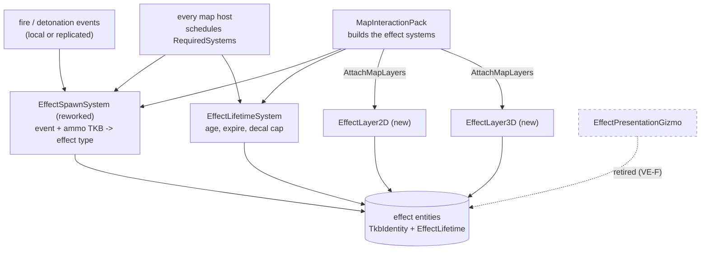
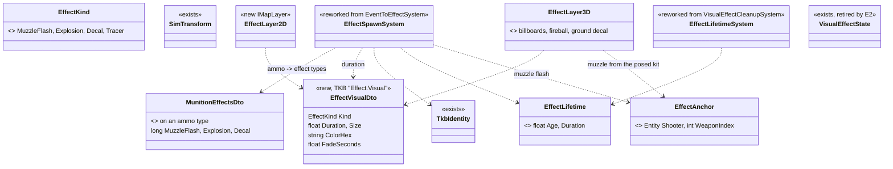
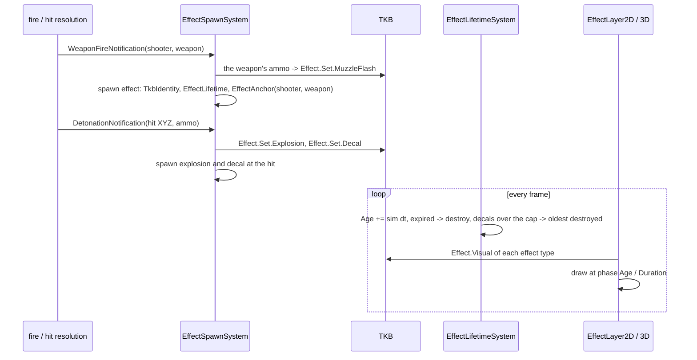

<!--STATUS
state: LIVE
build-state: READY-TO-BUILD — leans VE-A..VE-I APPROVED (U3, 2026-10-10); §4b VE-J..VE-M (the muzzle binding) await the user; slices E1–E4 (§6). Nothing built.
updated: 2026-10-10
current-answer: §1 what the user asked · §2 inventory · §3 diagrams · §4 decisions with leans · §6 slices.
stale-below: nothing.
known-rot: none.
known-conflict: none.
related-designs:
  - DESIGN_Map_3D_Mode.md — the 3-D renderer of these effects (its S3 effects wait for this design; §6c U27); the muzzle point
    comes from its §3.11 articulated turret (M23–M26).
  - DESIGN_Map_Rendering_And_Interaction.md — owns MapCanvas and its layers; the effect layers are two more layers attached by
    MapInteractionPack.AttachMapLayers.
  - DESIGN_Building_Interiors.md — owns warheads (§3k, CE-1032): the detonation that an explosion and a decal visualise.
  - DESIGN_Body_Geometry_And_Ground_Contact.md — the same "the TKB type defines it" pattern for bodies; decals drape on the ground.
-->

# DESIGN — visual effects: muzzle fire, explosions, impact decals

## 1. What the user asked — `2026-10-10`

| # | verbatim |
|---|---|
| **U1** | *"each effect entity has its TKB type of course defining the effect"* |
| **U4** | *"how the muzzle effect will be bound to the barrel? what is expected from the shot effect entity regarding its parenting or location?"* — §4b, leans VE-J..VE-M |
| **U3** | *"VE leans approved. pls explain 'The old effect gizmo is retired once the 2-D effect layer replaces it.' What are old effect gizmos? Some gizmos like the firing line from the shooter entity to the target point still makes sense even in 3d to indicate the firing target whenever shot is made."* — ✅ approved; §4a answers which gizmo retires and which stay |
| **U2** | *"some kind of simple fire effect (from the barrel, multiple size based on ammo type) and explosion effect (at hit position, multiple sizes based on ammo type), decal effect (at hit position, multiple sizes to be mapped to ammo type) - this adds a lot to the realism and should be cheap with todays possibilities. all those effect could be special types of temporary entities (counting their lifetime so the render can show them in proper phase) that are rendered in their special way and removed once their lifetime expired; so no gizmos as such - pls add those to the plan, many might require design steps."* |

## 2. INVENTORY — measured `2026-10-10` (graph `search_graph` `.*(Effect|Detonation|Muzzle|Decal|Impact|Explosion|FireTrace).*`, Class — 32 hits; grep)

| what exists | where | note |
|---|---|---|
| effect entities: `VisualEffectState { EffectType Type (Explosion, Tracer), Duration, ElapsedTime, RGBA, Scale }` + `TracerTarget` | `Hrot.Core/Components/Map/VisualEffectState.cs:34` | ⭐ the lifetime model the user describes already exists — ⚠ but the LOOK is a hard-coded enum + constants, **no TKB type** |
| spawner `EventToEffectSystem` (from `DetonationNotification`, `WeaponFireNotification`) + `VisualEffectCleanupSystem` | `Hrot.IG/Systems/EventToEffectSystem.cs:35,135` | one constant explosion size; the tracer starts at the shooter's ORIGIN, not the muzzle |
| who runs them | `EventEffectModule` on IG (`IgCapabilities.cs:86`) and the Editor (`EditorSubsystem.cs:1831`); `StrideNodeBootstrapper.cs:342` | 🔴 **not CGF, SimHost or ReplayBrowser** — "not on all hosts" (R-254) |
| the 2-D drawing: `EffectPresentationGizmo` (a stateless gizmo projector) | `Hrot.Presentation/Gizmos/EffectPresentationGizmo.cs:13` | ⚠ U2: "no gizmos as such" |
| `DetonationNotification { Shooter, Target, HitX/Y/Z, Penetration, Damage, Ammo }` | `Fdp.Toolkits/Combat/DetonationNotification.cs:24` | ⭐ already carries the AMMO type ⇒ the size can follow the ammo |
| `WeaponFireNotification { Shooter, Target, WeaponIndex, IsRemote }` | `Fdp.Toolkits/Combat/…` | ⭐ the weapon index ⇒ the mount ⇒ its ammo (`CombatTkb.MountOf`) |
| replicated: `MunitionDetonation { ShooterEntityId, HitEntityId, HitX/Y/Z, MunitionType }` | `Hrot.Network.NED/FireInteractionMessages.cs:93` | every node gets the events, so every node can make its own effects |
| debug gizmos `FireTraceGizmo`, `DetonationGizmo` | `Hrot.Presentation/ScenarioEditor/Gizmos/` | analysis overlays (rays, fragments) — NOT the realism effects; unchanged |
| the host-scheduling check `MapInteraction.RequiredSystems` + `Unserviceable` | `MapInteraction.cs:233` | ⭐ the mechanism that makes "every host runs the effect systems" checkable |

## 3. THE ARCHITECTURE

### 3.1 Modules — every map host, by construction

*What the picture shows that prose hid:* the effects stop being an IG/Editor module and become part of the shared map
construction — the pack builds the two systems and the two layers, every host schedules the systems it declares, and the
existing `Unserviceable` check reports a host that does not. The gizmo projector is the dead edge.

### 3.2 Classes

*What it shows:* the look lives in the TKB (one descriptor per EFFECT type, one mapping per AMMO type); the entity carries only
its type, its age and — for a muzzle flash — what it is attached to.

### 3.3 Sequence — one shot, from fire to decal

## 4. DECISIONS — ✅ APPROVED `2026-10-10` (U3)

| # | decision | ⭐ lean | rejected — one line each |
|---|---|---|---|
| **VE-A** | where effects are made | ⭐ **on every map host, locally, from the fire / detonation events** (which already reach every node); the pack BUILDS the two systems, every host schedules them, `RequiredSystems` declares them so `Unserviceable` reports a host that does not (R-254) | replicating effect entities — the events already cross the wire; an effect is presentation · keeping it an IG/Editor module — the measured "not on all hosts" |
| **VE-B** | what an effect entity is (U1) | ⭐ `TkbIdentity` (the effect type) + `SimTransform` + `EffectLifetime { Age, Duration }`; not saved, not recorded | the current `VisualEffectState` enum + colours on the entity — the look would live in code, not the TKB |
| **VE-C** | what an effect looks like | ⭐ TKB `Effect.Visual { Kind, Duration, Size, ColorHex, FadeSeconds }` on built-in effect types: muzzle flash, explosion and decal in **small / medium / large** (nine), plus the tracer | one effect type with a scale parameter — the decal art and durations differ by size, not just scale |
| **VE-D** | which effect an ammo makes (U2: "multiple sizes based on ammo type") | ⭐ TKB `Effect.Set { MuzzleFlash, Explosion, Decal }` on the AMMO type (references to effect types); an ammo with none uses a default by its calibre class | sizing from damage or penetration — a HEAT round and an APFSDS of the same gun look different |
| **VE-E** | where a muzzle flash is | ⭐ `EffectAnchor { Shooter, WeaponIndex }`: the RENDERER finds the muzzle each frame from the shooter's posed kit (§3.11 turret pose, M23–M26) — the flash follows the barrel; until the pose exists, the kit's neutral barrel | a fixed spawn position — wrong as soon as the vehicle or turret moves during the flash |
| **VE-F** | how they are drawn (U2: "no gizmos as such") | ⭐ two map layers attached by `AttachMapLayers`: **2-D** a star (flash), an expanding disc (explosion), a dark blot (decal); **3-D** additive camera-facing quads for flash and fireball, a fading ground quad draped on the terrain for the decal; `EffectPresentationGizmo` — and ONLY it — retired when the 2-D layer lands (route, not a second surface; §4a) | effects as gizmo primitives — the user ruled it out, and a 64-byte primitive per effect per frame is waste |
| **VE-G** | whose clock | ⭐ **simulation time**: a paused sim freezes an explosion mid-phase; a replay replays them from the replayed events | wall time — a paused fireball would finish, and a replay would not match |
| **VE-H** | decals live long | ⭐ minutes, fading at the end, and a **cap** (oldest removed first, e.g. 256) so a firefight cannot grow without bound | until the scenario resets — unbounded |
| **VE-I** | decal surface | ⭐ step 1: on the GROUND under the hit (draped, R-248); step 2: on the hit surface — a wall or a roof — once `IWorldQuery.Trace` reports the hit's surface normal | a decal floating at the hit point — visible as a card in 3-D |

### 4a. Which gizmo retires, and which stay *(U3)*

📐 Measured `2026-10-10`. Three different things draw "a shot" today; only the first is replaced.

| | what it draws | ⭐ fate |
|---|---|---|
| `EffectPresentationGizmo` (`Hrot.Presentation/Gizmos/EffectPresentationGizmo.cs:13`) | the CURRENT effect entities (`VisualEffectState`): an explosion as a flat circle at **z = 0**, a tracer as a 1-px line from the shooter's ORIGIN to the target's origin at **z = 0** (`:30-41`) | ⛔ **retired by E3** — it is the drawing half of the effect entities this design rebuilds; the new effect layers draw the same entities (and the tracer kind) from their TKB type, in both modes |
| `FireTraceGizmo` (`ScenarioEditor/Gizmos/FireTraceGizmo.cs:16`) — the **firing line** | each round fired: **muzzle → where it ended**, coloured by outcome (hit red, stopped by terrain orange, expired grey, in flight yellow), crossings marked, fading over seconds of sim time (`CE-3153`); recorded, so a replay shows it; the layer control's *FireTraces* bit | ✅ **stays** — an analysis layer, not a realism effect. It already emits real 3-D points (`s.Muzzle`, `s.End` are `Vector3`, `:80`), so the 3-D map draws it at its true heights once S3's gizmo triage lands |
| `DetonationGizmo` (`ScenarioEditor/Gizmos/DetonationGizmo.cs:16`) | a burst's fragment / blast radii and rays to every body point it rated | ✅ **stays** — analysis; 3-D in S3 |

⇒ in 3-D a shot shows as the **muzzle flash + tracer + explosion + decal** (realism, this design) and, when the operator turns
the layer on, the **outcome-coloured firing line** (analysis, S3). ⚠ The tracer kind and the firing line overlap in purpose; the
tracer is short and decorative, the firing line is the one that says what the round DID.

### 4b. Binding the muzzle flash to the barrel *(U4 — leans VE-J..VE-M await the user)*

🔒 **User, `2026-10-10`:** *"how the muzzle effect will be bound to the barrel? what is expected from the shot effect entity
regarding its parenting or location?"*

📐 **Measured:**

| fact | code | design |
|---|---|---|
| the fire event and its wire message carry the shooter and the WEAPON INDEX — no position | `WeaponFireNotification`; `WeaponFire { ShooterEntityId, TargetEntityId, WeaponIndex }` (`FireInteractionMessages.cs:48-52`) | ⛔ searched, none |
| today the round starts at the shooter's ORIGIN + its stance/type eye height, then 1 m along the aim line — not at a barrel | `FireProcessingSystem.cs:109,115,172`; `CombatConstants.MuzzleOffsetMeters = 1.0` (`:65`) | the 1 m exists so a round does not spawn inside a squad-mate (`CE-3059`, comment at `:169`) |
| the shot log records that point as `Muzzle`, and the firing-line gizmo draws from it | `FireProcessingSystem.cs:208,221`; `FireTraceGizmo.cs:80` | `CE-3117` |
| the part link `PartMetadata` is a NETWORK-meaningful part (its `InstanceId` is reused as the descriptor instance) | `PartMetadata.cs:5-13` | `Q79` §0.10, R-255 (the turret is such a part) |

| # | decision | ⭐ lean | rejected — one line each |
|---|---|---|---|
| **VE-J** | what the flash entity carries | ⭐ `TkbIdentity` (its flash type) + `EffectLifetime` + **`EffectAnchor { Shooter, WeaponIndex }`** — no position of its own: the renderer finds the muzzle EVERY FRAME, so the flash rides the barrel while the hull drives and the turret slews; the shooter gone ⇒ the flash ends | a `PartMetadata` child of the shooter — parts are network-meaningful (instance ids, ownership, egress), an effect is local and lives 0.1 s · a fixed spawn position — wrong the moment the vehicle or turret moves |
| **VE-K** | where the muzzle IS — ONE answer | ⭐ `Muzzle.Of(view, shooter, weaponIndex)` in `Fdp.Toolkits`: the mount's TKB muzzle offset, relative to its turret's trunnion, posed by the turret part's `TurretPose` (M23), placed by the body; a mount on no turret: relative to the body; a person: today's stance eye height + the weapon's forward offset. ⭐ **The fire code spawns the round there too** (replacing the fixed 1 m; its "never past half way to the target" clamp stays), so the flash, the tracer, the round and the firing line all start at the same point | the renderer computing its own muzzle from the kit — two answers that drift (the flash beside where the round left) |
| **VE-L** | the drawn barrel | ⭐ when the TKB gives the turret and mount geometry (M25), the kit's turret and gun parts are placed FROM it — the barrel tip IS `Muzzle.Of`; a rail checks it to 5 cm (the `CE-1041` pattern: the TKB is the truth, the kit draws it) | a separate kit muzzle — the picture and the shot disagree |
| **VE-M** | explosion and decal | ⭐ **world-fixed** at the hit point, no parent; a decal only on the static world (ground; walls/roofs in step 2) — a hit on a vehicle makes an explosion and no decal | a decal parented to a moving vehicle — a damage look belongs to the vehicle's own state, not to a decal |

⚠ VE-K adds one field set to M25's TKB turret descriptor (per mount: which turret, muzzle offset) and changes where a round
spawns — a combat-lane change, hence a separate nod.

## 5. NOT VERIFIED

| claim | how it is settled |
|---|---|
| ⚠ every host's kernel has a slot the pack's effect systems can be scheduled in (CGF, SimHost, ReplayBrowser run no effects today) | E2 — `Unserviceable` must come back empty on all five |
| ⚠ the munition TKB has an ammo template per round the weapons fire (`AmmoWeaponBallisticsDto` per launcher) to hang `Effect.Set` on | E1 — enumerate `MunitionTkbCatalog` and the weapon suites |
| ⚠ software GL cost of additive blending with a few hundred live effects | E3 frame rail, then the Windows run |

## 6. SLICES

| slice | delivers | depends on |
|---|---|---|
| **E1** | TKB `Effect.Visual` + `Effect.Set`; nine built-in effect types + the tracer; `Effect.Set` on the built-in ammo | VE-B..VE-D approved |
| **E2** | `EffectSpawnSystem` / `EffectLifetimeSystem` reworked onto TKB types and sim time, built by the pack, declared in `RequiredSystems`, scheduled on all five hosts (rail) | E1 |
| **E3** | `EffectLayer2D` + `EffectLayer3D`; `EffectPresentationGizmo` retired; screenshot rail | E2 |
| **E4** | `Muzzle.Of` (VE-K) used by the fire code and the renderer; the flash at the posed barrel; the kit's barrel from the TKB (VE-L) | the turret build (3-D map §3.11, M23–M26) + VE-J..VE-M |
