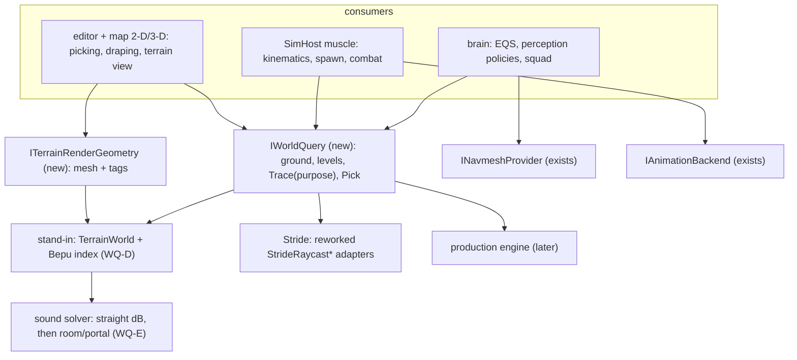
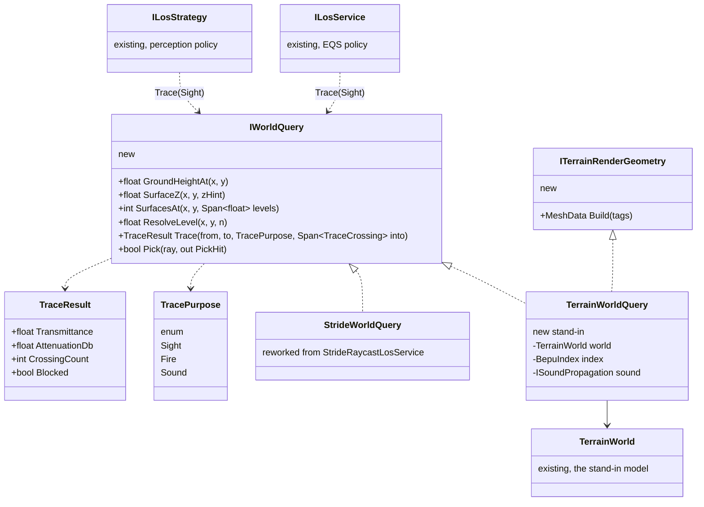

<!--STATUS
state: LIVE
build-state: DESIGN — leans WQ-A..WQ-H APPROVED (2026-10-10, R-253); spike Q0 decides the library. Nothing built.
updated: 2026-10-10 (rev 3 — all leans approved; §4a Bepu vs Jolt compared on the user's criteria (simplicity, pure
  C#, interop cost, Jolt's extra features). Rev 2 — R-252: the interface and the brain may not assume the stand-in terrain's simplifications;
  §3.3 what the interface must not expose, §2a the brain's own assumptions found; Trace loses its DoorStates parameter.
  Rev 1 — R-250: every engine capability the editor, map and brain use sits behind an interface)
current-answer: §1 why · §2 INVENTORY · §3 diagrams · §4 decisions · §5 slices · §6 not verified.
stale-below: nothing.
known-rot: none.
known-conflict: DESIGN_Terrain_Height.md §7 rev 1 called TerrainWorld's own methods "the seam" and leaned Jolt — both
  corrected there in rev 3 by this file (a real interface; Bepu inside the stand-in).
related-designs:
  - DESIGN_Terrain_World.md — owns TerrainWorld, the stand-in this seam's first implementation wraps.
  - DESIGN_Terrain_Height.md — the ground height this seam exposes (GroundHeightAt); §7 there is the library choice.
  - DESIGN_Building_Interiors.md — §3a planned "one query for all, but possibly different solver implementation" and the
    sound solver B-6 (v1 straight per-wall dB, v2 room/portal); this file is that query, generalised to every purpose.
  - DESIGN_Thermal_And_Acoustic_Sensing.md — owns hearing today (distance only); WQ-E gives it walls and corners.
  - DESIGN_Stride_Port.md / DESIGN_Stride_Node_Modes.md — Stride's unadopted ray adapters (StrideRaycastLosService,
    StrideRaycastBackend) become implementations of this seam.
  - designs/eqs-2/EQS_Design_v1.3_final.md §19 — EQS sight and cover; ILosService becomes a policy over this seam.
  - DESIGN_Map_3D_Mode.md — the 3-D map picks and draws terrain through this seam, not through TerrainWorld.
  - DESIGN_Subsystem_Composition_Unification.md — "physics is a resource needed by various roles"; INodeCapability is
    how a host swaps whole capabilities, this file is how it swaps the world queries under them.
-->

# DESIGN — the world-query seam (one interface between the brain/editor and any 3-D engine)

## 1. Why

🔒 **User, `2026-10-10` (`R-250`):** *"What we are doing now (own terrain, 3d view) is all just to help developing the
behaviors and some 3d editing in the editor; the real production system will use some other mature 3d engine completely.
The SimHost as is now just replaces the full engine (including motion, perception, navigation...) with much simpler
alternatives to stay lightweight yet usable. All the 3d engine stuff the editor and map and brain now relies on must be
for sure abstracted behind interfaces to allow replacing later with another implementation using mature 3d engine.
Stride was just a preparation for something like that."*

🔒 **User, `2026-10-10` (`R-252`):** *"Our terrain is also just an approximation of a more advanced one coming with the final
3d engine, so brain should not assume some simplification resulting from the fact the current terrain is simple; it will
not be later."*

Also: *"we would like to simulate also sound spreading around corners and in buildings"* and *"My bepu statement was
about bepu support in stride, not the bepu library itself. it is definitely a valid contender here."* (`R-251`)

## 2. INVENTORY — measured `2026-10-10` (graph `search_graph` 23 + 21 interfaces, no further pages; `search_code` + grep for consumers)

⚠ `check_index_coverage` is not available through the CLI; counts are graph + grep agreeing, not a coverage proof.

| capability | interface today | stand-in | Stride | production binds concretely? |
|---|---|---|---|---|
| animation | ✅ `IAnimationBackend` | Fake backend | ✅ adopted | no — **the model seam** |
| navigation | ✅ `INavmeshProvider`, `IDtCrowdProvider`, `IPathRegistry`, `ISceneGeometrySource` | DotRecast | ✅ adopted | ⚠ `INavmeshFactory.Build(TerrainWorld)` takes the concrete class |
| whole host capabilities | ✅ `INodeCapability` (muscle-ground, perception, navigation, animation) | SimHost | Stride | no |
| **terrain height / surfaces** | ⛔ none in use (`ITerrainProvider` dormant, never installed) | `TerrainWorld.SurfaceZ / SurfacesAt / ResolveLevel` | — | ⛔ **yes** |
| **sight / fire traces** | ⚠ three overlapping: `ILosService` (EQS), `ILosStrategy` (perception), `IRaycastBackend` (entity rays) | `TerrainWorld.SegmentBlocked / QuerySight / QueryFire` | ⚠ `StrideRaycastLosService`, `StrideRaycastBackend` — **never installed** | ⛔ yes — every host builds `TerrainWorldLosStrategy` |
| cover | ⚠ `ICoverProvider` — one real implementation, downcast by a gizmo | `TerrainCoverProvider` | — | partly |
| **hearing** | ⛔ none | distance only (`AcousticPerception.cs:131-149`) | — | — |
| entity collision shapes | ⛔ none | `PhysicsCollider` (a 2-D circle + height), read by ~20 files | Stride's own `IPhysicsBodyService` (Stride-named) | ⛔ yes |

📐 **`TerrainWorld` is used concretely in ~38 production files** outside its module: combat (`AimPoint`, `TerrainPenetration`,
`AreaEffectSystem`, `BallisticsSystem`, `FireProcessingSystem`, …), EQS (`EqsTerrainSight`, `TerrainCoverProvider`, …),
perception (`LosStrategies`, `LocalGridBuilderSystem`), squad (`DangerAlongRouteClassifier`, `DangerAreaSensorSystem`),
kinematics (`CarKinematicsSystem`, `DoorPassageSystem`), spawn (`NetworkSpawningSystem`), navigation, load, the editor's
debug API and three gizmos. ⭐ **The brain itself (CGF, AI behaviours) never touches it** — it reaches terrain only through
EQS, navigation and the raycast batch, so the brain is already engine-neutral; the gaps are in the SimHost stand-in's
consumers and in the editor.

## 2a. Where the brain assumes the simple terrain — measured `2026-10-10` (graph `search_code` over `Hrot.AI.Behaviors`, `Hrot.CGF`; then read)

⭐ The brain uses **no terrain type at all** (`search_code` for `TerrainPrism|TerrainBuilding|TerrainWalkable|Storey|GroundZ|TerrainWorld`
over the brain projects: **0 hits**). Its assumptions are about **space**, not about terrain classes:

| assumption | where | why it breaks on a real terrain |
|---|---|---|
| move destinations are 2-D with `Z = 0` | `CgfNodes.cs:281` (MoveTo), `:422` (Wander), `HillAttackTankNodes.cs:300,490`; the blueprint helper `VectorOps.Vec2` (`:14-15`) makes `Z = 0` vectors | on a bridge, a multi-storey building or an overhang a 2-D point names **several** places; "Z = 0" picks none of them |
| slot / segment geometry in the plane | `HillAttackCommanderNodes.cs:96-100`, `HillAttackTankNodes.cs:193-202` (`Vector2` distance, overshoot along the attack direction) | horizontal distance is a fair metric for a slot, but it is chosen by accident, not as a rule |
| the comment cites "§0.2" for 2-D authoring | `CgfNodes.cs:281,422`, `HillAttackTankNodes.cs:300` | ⛔ searched `docs/` and `.dev/` for that section: **not found** — the rule it cites has no home |

⭐ Already promoted to 3-D (`promote-to-3d` design): EQS results carry Z (`EqsComponentLayoutTests.EqsCognitiveBuffer_GetSpanRW_PositionZPersists`);
the motion model grounds (`R-182`, `R-249`). ⇒ the fix is small and has a rule: **a brain destination is a 3-D point taken
from where it came from** (an EQS sample, an entity, a route waypoint, a clicked map point — all carry Z); a genuinely
2-D intent ("somewhere around here") is sent as such and the motion model resolves the surface — never `Z = 0`.

## 3. The design

### 3.1 Module view — what an engine implements

*What the picture shows that prose hid:* an engine implements **two** new interfaces next to the existing navigation and
animation ones — and nothing above them knows which engine runs. Bepu and the sound solver live **inside** the stand-in;
a production engine replaces the whole box, not the library.

### 3.2 Classes

*What it shows:* `ILosService` and `ILosStrategy` stay as **policies** (eye heights, thresholds, what counts as cover) but stop
being engine seams — they call `IWorldQuery`. Three ray seams collapse to one an engine has to implement.

### 3.3 What the interface must NOT expose — 🔒 `R-252`

| ⛔ stand-in shape | ⭐ what the interface says instead |
|---|---|
| prisms, footprints, storeys, wall panels, walkable slabs | nothing — callers ask for heights, surfaces and traces, never for geometry types |
| one flat ground, 2.5-D extrusions | `GroundHeightAt` / `SurfacesAt` answer for any shape (overhangs, bridges, caves, tunnels) |
| a fixed list of named materials | a trace reports **per-purpose** loss (`Transmittance` for sight, `AttenuationDb` for sound, penetration for fire) |
| the caller passing door states | ⛔ removed from `Trace` — doors are the implementation's business (the stand-in reads its `DoorStates`; an engine its own doors) |
| levels merged within 0.3 m | `SurfacesAt` = the walkable surfaces stacked at (x, y), lowest first; the merge distance is the stand-in's detail |
| rooms derived from walls | inside the stand-in's sound solver only; never in the interface |

## 4. DECISIONS

| # | decision | ⭐ lean | rejected — one line each |
|---|---|---|---|
| **WQ-A** | the seam | ⭐ **one `IWorldQuery`** (ground, levels, `Trace(from, to, purpose)` with crossings, `Pick`) + **`ITerrainRenderGeometry`** for the editor's 3-D view; registered as a world resource like `INavmeshProvider` | `TerrainWorld`'s own methods as the seam (Terrain_Height §7 rev 1) — a concrete class is not replaceable · one interface per purpose (sight, fire, sound, height) — four things for an engine to implement where one trace serves all, as Building Interiors §3a already asked |
| **WQ-B** | the ray seams that exist | ⭐ `ILosService` and `ILosStrategy` become policies over `IWorldQuery`; `IRaycastBackend` folds into it; Stride's two unadopted adapters are reworked into `StrideWorldQuery` | keeping three engine-facing ray seams — the overlap is why none of Stride's adapters was ever installed |
| **WQ-C** | moving the ~38 consumers | ⭐ module by module (combat, EQS, perception, squad, kinematics, editor), each slice green on its feature suite; `TerrainWorld` stays the stand-in's data model (`R-181`) | a big-bang switch — 38 files across lanes at once |
| **WQ-D** | the library inside the stand-in | ⭐ **BepuPhysics v2** as the spatial index under `TerrainWorldQuery`: pure C#, no native binaries (headless Linux and the cloud just work, debuggable), net8.0, allocation-free buffer pools, a ray handler that reports **every** hit with its distance (needed for materials and dB), static meshes for terrain and height. Queries only — no dynamics. A spike first (the existing terrain rails give identical answers; faster on a large terrain) | Jolt — see §4a: its distinctive features are motion and dynamics the production engine owns (`R-250`), and it adds native binaries and an interop boundary; the .NET version is NOT an argument (the user: *"we could move HROT to c# 10"*) · our own BVH — fixes the scan, not sweeps or overlaps |
| **WQ-E** | sound around corners and in buildings | ⭐ **build Building Interiors' B-6 as designed, behind `Trace(Sound)`**: (1) a **loudness model** — keep the TKB ranges but read them as "the distance where the sound falls to the hearing threshold", so wall losses in dB subtract naturally; (2) v1 straight trace summing each crossed wall's `SoundAttenuationDb` (already in `materials.json`, read by nothing today); (3) v2 the louder of the straight path and the **shortest open path** room-to-room through openings (a corner costs a diffraction loss, a closed door its dB). The heard direction is the last opening, not the source | Steam Audio (open source, Apache-2.0, a C# binding with native libraries; occlusion, transmission, pathing around corners) — built to render audio for one listener with baked probes, heavy and native for many AI listeners in a stand-in; it stays a candidate for a production implementation of the same seam · a physics library — none of them models sound; they help only with the straight trace, equally |
| **WQ-F** | entity collision shapes | ⭐ phase 2: entities join the same index as oriented boxes (from the TKB size) so `Trace` and `Pick` hit them; `PhysicsCollider`'s ~20 readers move behind the seam later | doing it now — doubles the first slice |
| **WQ-H** | the brain's 2-D assumptions (§2a) | ⭐ a destination is a **3-D point from its source** (EQS sample, entity, waypoint, map pick); a 2-D intent is sent as 2-D and resolved by the motion model; `VectorOps.Vec2` stops inventing `Z = 0`; slot geometry states "horizontal distance" as a deliberate choice. A rail runs a brain scenario on a terrain with a bridge or a multi-storey building | leaving `Z = 0` because "the motion model lifts it" — on a stacked terrain it lifts to the wrong level |
| **WQ-G** | the 3-D map | ⭐ picks with `IWorldQuery.Pick` and draws `ITerrainRenderGeometry` — the 3-D map design's §3.10 seams become these interfaces | the map reading `TerrainWorldMesh` directly — binds the editor to the stand-in |

## 4a. Bepu vs Jolt — on the user's criteria *(user, `2026-10-10`: "the simplicity of use is also a criteria … not sure how we could utilize jolt's features like vehicle controller and character controller … pure c# is a big advantage, jolt could suffer if we called thousands p/invoke calls")*

⚠ Library facts below are from the libraries' own documentation and samples as known, **not run here** — Q0 measures.

| criterion | BepuPhysics v2 | Jolt (via its C# binding) |
|---|---|---|
| what WE need: rays reporting every hit, shape sweeps, overlaps, static meshes, moving door bodies, filtering | ✅ all | ✅ all |
| terrain height | a static **mesh** built from the grid (more memory per km²) | ✅ a native **height-field shape** (compact, fast) |
| per-hit logic (materials, dB) | in our own struct handler, inlined, in C# | in a managed callback the native side calls, or hits collected natively then copied back |
| crossing a native boundary | ⭐ none | ⚠ every query; a simple blittable call costs on the order of tens of nanoseconds (thousands per tick ≈ tens of microseconds — fine); **native → managed callbacks per hit cost more**, and a native crash kills the process with no stack trace |
| packaging, cloud, debugging | ⭐ one managed package; step into it; runs anywhere .NET runs | native libraries per platform (Linux build needed for the cloud); can't step into the engine |
| setup simplicity | ⚠ some boilerplate even for queries only (callback structs, a buffer pool) | ⚠ comparable (layer filters, a body interface) |
| Jolt's extras: wheeled and **tracked vehicle** controllers, a **character controller** (stairs, slopes), ragdolls, soft bodies, cross-platform determinism | ⛔ not in the library (Bepu ships characters and a car only as **demos**) | ✅ |

⭐ **How Jolt's extras could be used — and why the lean does not take them now.** A vehicle controller would replace our
kinematic car with suspension, wheel slip and tracks; a character controller would replace the human gait with physical
stepping. ⛔ Both are **motion models** — exactly what the production engine will supply (`R-250`) — so in the stand-in they
would build a heavier second motion stack that is thrown away later, cost tuning, and bring non-determinism the rails do
not want (`R-216` "rails stay exact"). Slope pitch and roll for a vehicle needs only four ground samples, not a physics
vehicle.

⭐ **Lean: Bepu**, because for a query-only stand-in it gives everything needed with no interop, no native packaging and full
debuggability — the user's simplicity criterion. **What would flip it:** ① Q0 shows a Bepu mesh is too heavy or slow on a
large height grid where Jolt's height field is not; ② the user wants physical motion (vehicles over rough ground,
ragdolls) **in the stand-in**. Either way the switch stays inside `TerrainWorldQuery` — nothing above the interface changes.

## 5. SLICES

| slice | delivers | proves |
|---|---|---|
| **Q0b** | WQ-H: the brain's destinations from their sources; a stacked-terrain brain rail | the brain is terrain-agnostic |
| **Q0** | the Bepu spike: `Trace(Sight/Fire)` + `GroundHeightAt` over Bepu inside `TerrainWorld`; timing and memory on a scaled terrain **with a large height grid**; headless cloud run | identical answers, faster, Linux, acceptable memory — otherwise §4a's flip condition ① (Jolt's height field) |
| **Q1** | `IWorldQuery` + `TerrainWorldQuery`; combat and EQS moved; `ILosService` as a policy | the busiest consumers on the seam, feature suites green |
| **Q2** | perception (`ILosStrategy`), squad, kinematics, spawn, editor debug API, gizmos moved; `ITerrainRenderGeometry` | no production `TerrainWorld` use outside the stand-in |
| **Q3** | sound v1 — the loudness model + `Trace(Sound)` straight with per-wall dB; the hearing gizmo shows the loss | a shot behind a concrete wall is heard less far |
| **Q4** | sound v2 — rooms from walls, the room/portal path (shared with blast confinement, Building Interiors W-7v2) | sound comes round a corner and through an open door; a closed door muffles it |
| **Q5** | `StrideWorldQuery`; entity boxes in the index (WQ-F) | a second implementation passes the same rails |

## 6. NOT VERIFIED — say so before it is built on

| claim | how it is settled |
|---|---|
| ⚠ BepuPhysics v2's net8 line is the 2.5 **beta** series (Stride itself depends on ≥ 2.5.0-beta.19); the stable 2.4's targets not checked | Q0 — pin a version |
| ⚠ Bepu static meshes and ray handlers as described (from library documentation and its forum, not run here) | Q0 |
| ⚠ identical trace answers vs today's scan (R-216 "rails stay exact") — float edge cases may flip | Q0 rails |
| ⚠ Steam Audio's custom ray-tracer callback (would let it trace through Bepu) — only an informal developer remark found | only if Steam Audio is ever chosen |
| ⚠ room detection from walls at load (Building Interiors §3a) — not built anywhere | Q4 |
| ⚠ the ~38 / ~20 file counts are grep results | each slice re-measures its module |
