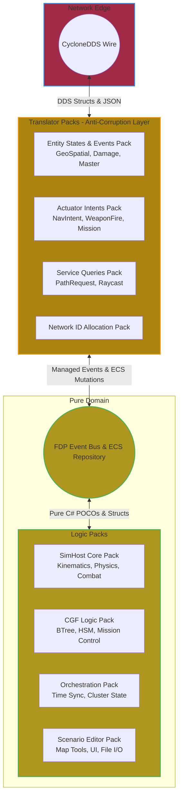
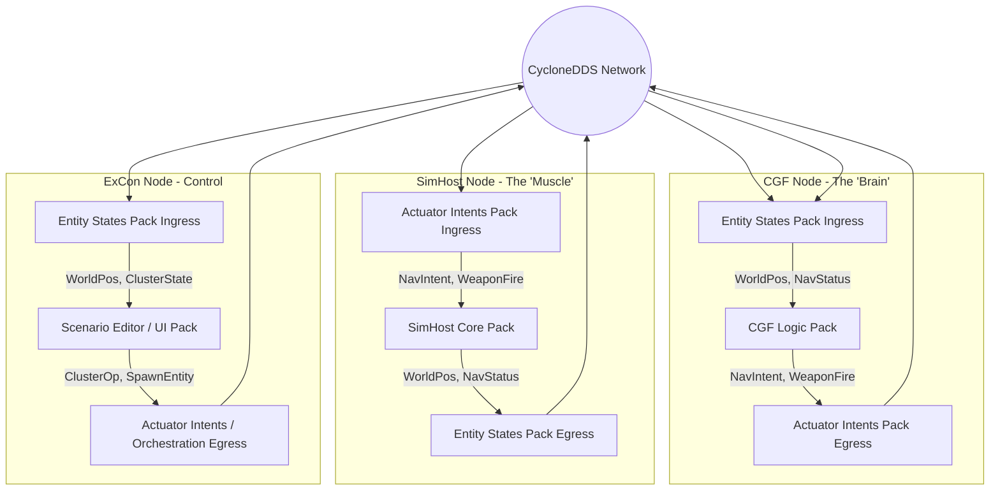
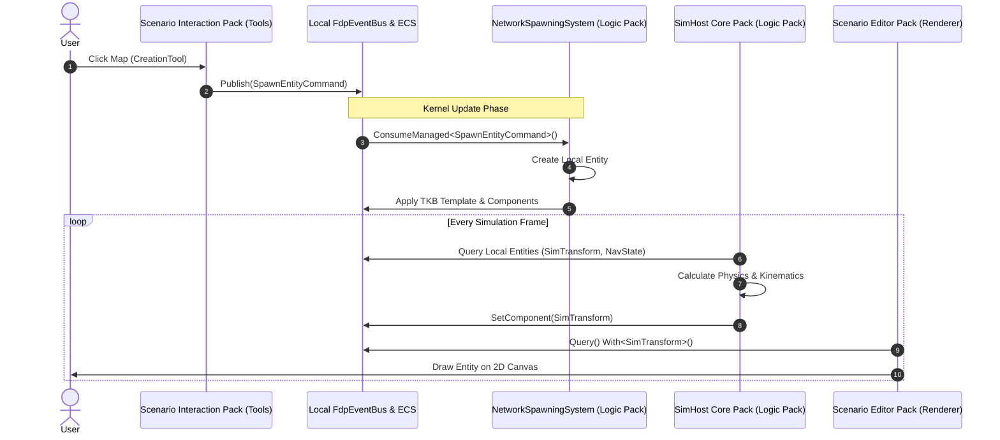
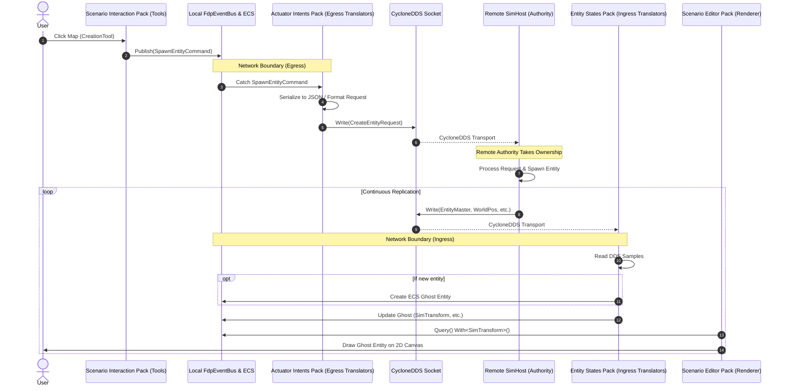

# HROT Architecture

Here is an outline describing the core architecture of the HROT/FDP engine, designed to introduce newcomers to its systems and paradigms.

I. Core Framework: Entity Component System (ECS)

The engine is built on a high-performance, data-oriented ECS architecture that separates data (components) from logic (systems).

-   **Entities:** Lightweight 48-bit handles containing a 32-bit index and a 16-bit generation counter. The generation counter ensures stale references are safely detected.-   **Entity Repository:** The main database (`EntityRepository`) that manages entities and their components. Component access is intentionally non-thread-safe by design to maximize performance.-   **Entity Command Buffer (ECB):** A thread-safe buffer used by systems to record structural changes (like creating/destroying entities or adding/removing components) for deferred execution. These changes are played back on the main thread after parallel work completes.-   **Queries:** High-speed entity filtering is achieved using SIMD-accelerated bitmask checks (`BitMask256`) via `EntityQuery`.

II. Communication: Double-Buffered Event Bus

Modules and systems communicate transient, one-frame occurrences using the `FdpEventBus`.

-   **Double-Buffering:** Uses a "TRUE double-buffering" strategy where events published during Frame _N_ are written to a "Pending" buffer and consumed in Frame _N+1_ from a "Current" buffer,.-   **Event Tiers:** Supports highly efficient unmanaged events (Tier 1) and managed class/reference events (Tier 2),.-   **Network Sync:** An `EventAccumulator` captures event history so that slower modules or remote network replicas can receive all events without dropping data between frames,.

III. Distributed Architecture: Brain-Muscle Topology

The engine supports distributed simulations across a cluster using specific **Node Roles**, notably decoupling decision-making from physical execution.

-   **Brain Nodes:** Handle cognitive tasks, behavior trees (BTree), hierarchical state machines (HSM), mission planning, and AI dispatch,. They issue high-level commands.-   **Muscle Nodes (MuscleGround):** Handle the "physical" execution of the world. This includes ground kinematics, vehicle physics, collision avoidance, ballistics, and spatial hashing,.-   **Split-Authority (CQRS Pattern):** Entities can have their authority split across nodes using `NetworkAuthority`. The Brain node might retain authority over an entity's AI (`Health`, `BehaviorState`), while delegating the physical `SimTransform` (WorldPos) to the Muscle node.-   **CQRS Feedback Loop:** Brains write _Intents_ (e.g., `NavigationIntent`), Muscle nodes process physics and write back _Status_ (e.g., `NavigationStatus`), keeping the two tiers entirely decoupled,,.

IV. Network Replication

Simulation state is synchronized across the cluster using CycloneDDS.

-   **Translators:** Ingress and Egress Translators bridge the gap between ECS components and DDS network messages,.-   **Ghost Entities:** Remote entities are represented locally as "Ghosts" (`GhostStateTracker`). They are promoted to active entities once their network descriptors (state data) fully arrive,.-   **SmartEgress vs. Direct Polling:** Low-frequency/complex data (like active missions) uses `SmartEgressUtil` to efficiently flag data as "dirty" and publish only when changed. High-frequency data (like `SimTransform` positional data) bypasses this and uses direct memory comparisons every frame to minimize CPU overhead,.

V. Environment Queries & Perception

The engine uses optimized spatial data structures and batched asynchronous queries to allow AI to perceive the world.

-   **Spatial Hash Grid:** A fast 2D grid (`SpatialHashGrid`) that indexes the locations of physics-collidable entities to provide O(1) neighboring entity lookups,.-   **Raycasts (Physics):** Raycasts are processed asynchronously. AI requests a raycast via an event (`RaycastRequestEvent`); the `RaycastSolverSystem` processes it on a background thread against the spatial grid, and the result is safely written to a ring buffer (`RaycastBatchData`) for the AI to read on the next frame,,.-   **Sensors & Vision:** The `AutonomousPerceptionModule` runs slowly (e.g., 10 Hz) on a background thread. It performs broadphase FOV cone checks, batches Line-of-Sight (LOS) queries, and adds visible targets to a `SensorContactList`, passing them to the Brain's cognitive `TargetMemory`,,.-   **Area Queries (EQS):** Like raycasts, area queries (e.g., finding targets within a polygon) are batched to an asynchronous `AreaQuerySolverSystem`, dumping target handles into an `EqsTargetPool`,,.

VI. AI Actuation: Channels

The Brain's AI does not mutate physical components (like velocity) directly. Instead, it writes "Actions" and "Parameters" into designated **Channels**,.

-   **Channel Types:**
    -   **LocomotionChannel****:** Controls movement (e.g., `ActionIdMoveTo`, `ActionIdFollowRoute`, `ActionIdFlee`).-   **WeaponChannel****:** Controls combat engagements (e.g., `ActionIdAimAndFire`).-   **InteractionChannel****:** Controls world interactions (e.g., `ActionIdEjectPassengers`, `ActionIdOpenDoor`),.-   **Dispatchers & Executors:** Systems like `LocomotionDispatcherSystem` read the active action in a channel and route it to a specific `IActionExecutor` (like `MoveToExecutor`), which then manipulates the actual intents or physics state,.-   **Channel Arbitration:** A dedicated `ChannelArbitrationSystem` watches for behavior changes (e.g., an AI switching from 'Patrol' to 'Combat') and automatically clears stale actions from the channels,.

VII. Time Management & Synchronization

Because the simulation is distributed, time cannot be simply read from the local system clock. The engine enforces strict temporal discipline across all nodes using dedicated Time Controllers.

-   **Time Modes:** The engine operates in either `Continuous` mode (using a Phase-Locked Loop to smooth real-time execution) or `Deterministic` mode (lockstep, where frames only advance when ACKs are received from all nodes).-   **The GlobalTime Singleton:** The `TimeSystem` writes a `GlobalTime` component into the ECS `EntityRepository` at the start of every frame. All systems—including the Flight Recorder—read `GlobalTime.TotalWallTicks` instead of calling `DateTime.UtcNow`. This guarantees that every module executing in the `PostSimulation` phase sees the exact same timestamp.-   **Master/Slave Topology:** The Orchestrator node runs the `MasterSyncController`, while all other nodes run a slave controller that synchronizes to the master via DDS network messages, ensuring the simulation step remains uniform across the cluster.

VIII. Recording & Replay (Flight Recorder)

The Flight Recorder (`AsyncRecorder`) captures state and events at 60 Hz. To prevent disk I/O from stalling the simulation loop, it uses a strictly zero-allocation, double-buffered architecture on the hot path.

-   **Memory-Level Serialization:** The recorder bypasses C# reflection. It reads unmanaged memory directly from the ECS `NativeChunkTable`. This allows it to copy entire 64KB blocks of entity data directly into its buffer.-   **Keyframes vs. Deltas:** To save disk space, the recorder writes a full Keyframe periodically (e.g., every 60 frames). For the frames in between, it writes Delta frames. It uses the ECS chunk versioning system to instantly skip memory chunks that haven't changed since the previous tick, making the delta scan O(populated\_chunks) rather than O(entities).-   **Event Capture:** Component data alone isn't enough to replay a battle. The recorder also scans the `FdpEventBus` pending buffers at the end of the frame and serializes transient events (like `WeaponFireNotification` or `HitEvent`) so that visual effects trigger correctly during playback.-   **Asynchronous I/O:** The main thread writes the ECS memory blocks into a pre-allocated "front" byte array. It then swaps pointers with a "back" array and dispatches a background Task to perform LZ4 compression and disk writing, allowing the main simulation thread to proceed immediately.

IX. Transient Knowledge Base (TKB) & Entity Lifecycle

Entities in FDP are not hardcoded classes; they are data-driven assemblages defined in the Transient Knowledge Base (`TkbDatabase`).

-   **TKB Templates:** A `TkbTemplate` acts as a blueprint, defining which components and base values an entity should have when spawned (e.g., an M1 Abrams tank vs. a civilian car).-   **Lifecycle States:** When an entity is spawned, it does not immediately enter the simulation. It starts in the `Constructing` state. The `EntityLifecycleModule` holds the entity in this state until all its `MandatoryComponent` requirements are met. Only then is it promoted to `Active`.-   **Ghost Promotion:** This strict lifecycle is crucial for network replication. When a remote node receives a network packet for an unknown entity, it creates a dormant "Ghost" entity. The `GhostPromotionSystem` ensures that the ghost is not promoted to `Active` until all necessary structural data defined by its TKB template has physically arrived over the network, preventing systems from crashing due to partially hydrated entities.

X. Cluster Orchestration (Two-Phase Commit)

To keep the Brain, Muscle, and UI nodes perfectly coordinated during high-level transitions (like loading a scenario or starting a replay), the engine uses a Two-Phase Commit (2PC) protocol managed by the Orchestrator node.

-   **The ClusterSlave:** Every node runs a `ClusterSlave` state machine that listens for `NodeOpCommand` intents from the Orchestrator.-   **Phase 1 (Prepare):** The Orchestrator tells all nodes to prepare for a state change (e.g., `PrepareLive`). Each node's handler does its async heavy lifting—like loading a scenario JSON from disk, extracting the entity descriptors, and pre-allocating network IDs. The nodes then send an ACK back to the Orchestrator.-   **Phase 2 (Commit):** Once the Orchestrator receives ACKs from all required nodes, it issues a `CommitState` command. All nodes synchronously flush their prepared data into the live ECS repository on the exact same frame, ensuring the cluster transitions into the new operational state simultaneously without race conditions.

**Chapter I. Core Framework: Entity Component System (ECS)**.

The HROT/FDP engine relies on a custom, high-performance Entity Component System. To understand how to work with it, newcomers need to grasp how the engine handles memory, enforces safety without sacrificing speed, and coordinates parallel execution.

Here is the detailed breakdown of the ECS foundation:

1\. Entities: The 48-Bit Handle

In FDP, an `Entity` is not a class or an object; it is a lightweight 48-bit value type (struct). It consists of two parts:

-   **32-bit Index:** Points directly to a slot in the engine's internal arrays.-   **16-bit Generation:** A counter that increments every time an entity slot is destroyed and recycled.

This generation counter is a critical safety feature: if you store an `Entity` handle and the underlying entity is later destroyed, any subsequent attempt to access it will fail because your handle's generation won't match the live generation.

Behind the scenes, entities are tracked by an `EntityIndex` using a fast free-list allocator, and each entity corresponds to a 96-byte `EntityHeader`. The header is carefully designed to be a multiple of 32 bytes (for AVX2 operations) and 64 bytes (cache lines), and it stores the entity's component mask, authority mask, and lifecycle state.

2\. Components: Tier 1 vs. Tier 2 Storage

Components in FDP hold pure data with no logic. Because different data has different performance needs, the engine divides components into two storage tiers:

-   **Tier 1 (Unmanaged Components):** These are pure `struct` types stored in a `NativeChunkTable<T>`. Memory is allocated in large 64KB unmanaged chunks, providing O(1) direct pointer access and keeping data tightly packed in the CPU cache for extreme performance.-   **Tier 2 (Managed Components):** These are `class` or `record` types (strings, lists, etc.) stored in a `ManagedComponentTable<T>`. They use standard .NET garbage-collected arrays (`T?[][]`). They are slightly slower to access but necessary for complex data.

**Data Policies:** You control how the engine handles your components (for saving, network replication, and the Flight Recorder) using the `[DataPolicy]` attribute. For example, `[DataPolicy(DataPolicy.NoSave)]` ensures runtime AI state isn't written to disk when saving a scenario, and `DataPolicy.Transient` prevents debug data from polluting network snapshots entirely.

3\. The Entity Repository (The "World")

The central database that holds all entities and components is the `EntityRepository`.

-   **Intentionally Non-Thread-Safe:** By design, reading and writing components directly on the `EntityRepository` is **not** thread-safe. Adding locks to component access would destroy the engine's multi-core scalability.-   **Writing Data Safely:** To mutate a component, you use the `GetComponentRW<T>` method. This updates a localized "chunk version" so that network delta systems and the Flight Recorder know the chunk was modified.

4\. Entity Command Buffer (ECB)

Because component modification isn't thread-safe, systems cannot add components or destroy entities while running in parallel on background threads. To solve this, the engine uses the `EntityCommandBuffer` (ECB).

-   **Deferred Execution:** The ECB acts as a thread-safe recording queue. Instead of creating an entity directly, a background thread tells the ECB `CreateEntity()` or `AddComponent()`, which gets encoded as an `OpCode` byte stream.-   **Main Thread Playback:** After all parallel systems finish their work for the frame, the main thread safely locks the world and calls `Playback()` on the ECB, flushing all recorded structural changes into the `EntityRepository`.

5\. Queries and Iteration

To execute logic, systems ask the repository for entities matching specific components using an `EntityQuery` (e.g., "give me everything with a `SimTransform` and `Velocity`").

-   **SIMD Bitmasks:** Filtering is extremely fast because it uses a custom `BitMask256` mapped to AVX2 SIMD instructions.-   **Chunk Skipping:** Instead of checking every entity one-by-one, the query can skip entire 64KB blocks of memory if the chunk doesn't contain any entities matching the bitmask, providing O(populated\_chunks) performance instead of O(entities).-   **Adaptive Parallelism:** When executing heavy workloads, systems use `query.ForEachParallel()`. Based on a `ParallelHint` (Light, Medium, Heavy), the engine adaptively groups entities into cache-friendly batches (e.g., batches of 64 or 1024) and distributes them across all available CPU cores without allocating any garbage-collection memory.

6\. Entity Lifecycle

Because FDP is a distributed engine, entities don't just "exist" immediately. They have an `EntityLifecycle` state:

-   **Constructing:** The entity is allocated but waiting for initialization or network ACKs from other nodes.-   **Active:** Fully initialized and participating in the simulation.-   **TearDown:** Scheduled for destruction and currently being cleaned up by modules.-   **Ghost:** A remote replica synced over the network, waiting for its full definition to arrive.

\--------------------------------------------------------------------------------

**Chapter II: Communication (The Double-Buffered Event Bus)**.

While the ECS repository stores persistent data (like Health or Position), systems need a way to communicate transient, one-off occurrences (like a bullet hitting a wall, or an AI requesting a path). In the HROT/FDP engine, this is handled by the `FdpEventBus`.

Here is how the event bus architecture guarantees thread safety, high performance, and distributed synchronization.

1\. "TRUE" Double-Buffering

The `FdpEventBus` is built around a strict double-buffering paradigm: events published during Frame _N_ are written to a "Pending" (Write) buffer, and they are only consumed in Frame _N+1_ from the "Current" (Read) buffer.

-   **Publishing:** Systems can publish events from multiple threads simultaneously during the `Simulation` phase without locking the read state.-   **Swapping:** At the end of every frame (in the `PostSimulation` phase), the engine calls `SwapBuffers()`. This swaps the buffer pointers: the newly written events become readable for the next frame, and the old read buffer is cleared.-   **Reading:** Systems "subscribe" to events simply by asking the bus to read them during their update loop (e.g., `Read<HitEvent>()`). This returns a `ReadOnlySpan<T>` of the events from the previous frame, ensuring zero-allocation iteration.

2\. Event Tiers (Native vs. Managed)

Just like ECS components, events are split into two tiers based on performance needs:

-   **Tier 1 / Native Events:** These are unmanaged `struct` types and are the engine's primary communication method. They are stored in a `NativeEventStream<T>`. Writing to a native stream is completely lock-free; it uses `Interlocked` atomic operations to reserve a slot in the buffer, allowing massive parallel throughput. All native events must be decorated with an `[EventId]` attribute to guarantee stable network serialization.-   **Tier 2 / Managed Events:** These are `class` types or structs containing references (like strings or lists). They are stored in a `ManagedEventStream<T>`. Because they use C# `List<T>` under the hood, writing to them requires a standard thread lock, making them slightly slower and better suited for low-volume events (like UI commands).

3\. The Dropped-Event Problem & `EventAccumulator`

Because the event bus clears its read buffer every frame, a significant architectural challenge arises: what happens to modules that run _slower_ than the main 60Hz loop? For example, the Pathfinding or Perception solvers might run asynchronously on a background thread at 10Hz. If they only check the event bus every 6 frames, they would miss 5 frames worth of events.

The engine solves this beautifully with the `EventAccumulator`.

-   **Capturing History:** At the end of every main-thread frame, the `EventAccumulator` takes a zero-allocation snapshot of the event bus buffers and queues it in a rolling history buffer.-   **Flushing to Replicas:** When a slow background module (or a remote node receiving a network snapshot) is finally ready to execute, it calls `FlushToReplica()`.-   **Tick Syncing:** The accumulator checks the module's `lastSeenTick`, grabs every event that occurred _after_ that tick, and safely injects them directly into the module's local event bus replica. This guarantees that no system ever drops an event, regardless of its execution frequency.

\--------------------------------------------------------------------------------

**Chapter III: Distributed Architecture (Brain-Muscle Topology)**.

To scale the simulation across multiple machines, the engine completely decouples "decision making" from "physical execution." Instead of a single server doing everything, workloads are divided into distinct node roles using a pattern called CQRS (Command Query Responsibility Segregation).

Here is how the distributed topology works:

1\. Node Roles (Who does what?)

When a simulation node boots up, it is assigned a specific `NodeRole` that dictates which subsystems and modules it will run:

-   **Brain Nodes (****NodeRole.Brain****):** These handle the cognitive workload. They run the Mission Control pipeline, Behavior Trees (BTree), Hierarchical State Machines (HSM), and high-level AI dispatch. A Brain node never runs vehicle physics.-   **Muscle Nodes (****NodeRole.MuscleGround****):** These handle the physical world. They run ground kinematics (`CarKinematicsSystem`), spatial hashing, collision avoidance, and ballistics. They do not know _why_ an entity is moving; they just execute the movement.-   _Other Roles:_ The engine also supports `ImageGenerator` (pure presentation/rendering), `Perception` (handles Line-of-Sight and threat evaluation), and `NavigationSolver` (on-demand pathfinding).

2\. Split Authority

In traditional game engines, one server "owns" the entire entity. In FDP, **ownership is granular and split per-component**.

When a Brain node creates an entity (like a tank), the `BrainMuscleOwnershipStrategy` delegates the physical descriptors (like `WorldPos` and `NavigationStatus`) to the least-loaded Muscle node in the cluster, but the Brain _retains_ authority over cognitive descriptors (like `EntityMission` and `NavigationIntent`).

This means a single tank exists as a live entity on both nodes, but the Brain node is legally allowed to modify its AI State, while only the Muscle node is legally allowed to modify its X/Y/Z Position.

3\. The CQRS Feedback Loop (Intent vs. Status)

Because the Brain and Muscle cannot touch each other's components, they communicate using the CQRS pattern. The Brain issues an **Intent** (a command), and the Muscle responds with a **Status**.

Let's walk through how a tank moves to a destination using this loop:

-   **The Brain decides to move:** The AI Behavior Tree evaluates to a `MoveTo` action. The Brain's `MoveToExecutor` writes the destination into the entity's `NavigationIntent` component (the command).-   **Network Egress:** The `NavigationIntentEgressTranslator` sees the change and sends the Intent over the DDS network to the Muscle node.-   **Muscle Execution:** On the Muscle node, the `NavigationIntentBridgeSystem` reads the incoming Intent and translates it into physical physics inputs (`NavState`).-   **Physics Integration:** The Muscle's `CarKinematicsSystem` physically moves the tank closer to the destination each frame.-   **Muscle writes Status:** The Muscle's `NavigationExecutionSystem` constantly measures the distance to the destination. Once the tank arrives, it writes `NavigationResult.Arrived` into the `NavigationStatus` component.-   **Network Return:** The Muscle broadcasts this `NavigationStatus` back to the Brain.-   **The Brain finishes:** The Brain's `MoveToExecutor` reads the `Arrived` status, marks the Behavior Tree node as `Success`, and the AI moves on to its next task.

4\. Distributed Combat (Another Example)

This split-authority model also governs combat.

-   If a tank fires a shell, the Muscle node simulates the bullet physics.-   When the bullet hits a target, the Muscle node's `HitResolutionSystem` detects the physical impact and the `DamageCalculationSystem` computes the HP loss.-   The Muscle node broadcasts an `EntityHitDamage` message over the network.-   The Brain node receives this message, and its `HealthApplicationSystem` subtracts the health authoritatively. If the health reaches zero, the Brain strips the `CanMove` capability, crippling the tank.

\--------------------------------------------------------------------------------

**Chapter IV: Network Replication**

Network synchronization in HROT/FDP is built on CycloneDDS, but the ECS layer remains strictly agnostic to the networking middleware. This decoupling is achieved through dedicated Translator pipelines, a centralized entity map, and a split egress strategy designed for cache coherency.

1\. The Translator Pattern

Network data flows through strictly segregated `INetworkTranslator` implementations, divided by direction (`Ingress` or `Egress`). Translators are further divided by data lifespan:

-   **IDescriptorTranslator**: Manages persistent entity state, implementing methods to apply data to entities and dispose of network resources when the entity is destroyed.-   **INetworkEventTranslator**: Handles transient, one-frame occurrences (like combat detonations) and has no persistent ECS state management requirements.

Translators own the DDS readers and writers, isolating the middleware so the core simulation deals only with pure ECS component data.

2\. NetworkEntityMap and Ghost Entities

To bridge the gap between global DDS network IDs and the local 48-bit memory pointers, the engine relies on the `NetworkEntityMap`. This singleton registers the binding between a 64-bit network ID and a local `Entity` handle, allowing systems to resolve remote actions safely.

When an ingress translator encounters an unknown network ID, it invokes the `GhostCreationSystem`. This system creates a bare entity shell tagged with the `EntityLifecycle.Ghost` state and a `GhostStateTracker`. The entity sits dormant until the `GhostPromotionSystem` verifies that all mandatory components defined by the entity's blueprint (TKB template) have physically arrived over the network. Only then is it promoted to `Constructing` or `Active`, guaranteeing that local systems never operate on partially hydrated network replicas.

3\. Egress Strategy 1: SmartEgress (Low-Frequency)

For discrete, complex data—like an AI's `EntityMission` or `WeaponState`—performing deep structural comparisons every frame is an architectural anti-pattern.

The engine handles this using `SmartEgressUtil`. When a system mutates low-frequency data, it calls `SmartEgressUtil.MarkDirty()`, which flags the specific descriptor in a transient `EgressPublicationState` component. The egress translator checks this O(1) flag, publishes the DDS message, updates the last-published tick, and clears the flag. This decouples the business logic from the network layer while costing virtually zero CPU time when the data remains static.

4\. Egress Strategy 2: Shadow State (High-Frequency)

Applying the `SmartEgress` dictionary/hashset lookups to 60Hz physics data (like vehicle positions) would destroy multi-core scalability and L1 cache coherency.

For high-frequency kinematics, translators completely bypass `SmartEgressUtil` in favor of shadow state comparison. The engine maintains a `NetworkTransform` component that stores the exact position and rotation last sent to the network. The `GeoSpatialEgressTranslator` performs a direct unmanaged memory comparison between the live `SimTransform` and the shadow `NetworkTransform`. It only publishes a DDS packet if the movement exceeds a physical delta threshold (e.g., 1 cm² or ~0.5° rotation), or if a salted rolling heartbeat interval fires to correct UDP packet loss.

**Chapter V. Environment Queries & Perception**

The environment query and perception architecture strictly enforces the Brain-Muscle separation of concerns, heavily utilizing asynchronous solvers, Snapshot-on-Demand (SoD) isolation, and ring buffers to prevent AI processing from stalling the main thread.

1\. The Spatial Hash Grid

The foundation for spatial queries is the `SpatialHashGrid`, a 2D index utilizing 5-meter cells. To prevent broadphase bloat, the engine only indexes entities carrying a `PhysicsCollider`. Instead of rebuilding the grid via an expensive `Clear()` operation every frame, the implementation uses an incremental update strategy. It tracks per-entity position deltas and uses a free-list to safely splice and recycle linked-list slots in O(1) time when entities move. If the total entity count changes, it dynamically falls back to a full rebuild.

2\. Autonomous Perception Pipeline (10 Hz)

The `AutonomousPerceptionModule` executes entirely on a background thread at 10 Hz against a read-only SoD snapshot. To prevent the AI from mutating or corrupting the global frame state, inter-stage events flow through a module-private `FdpEventBus` (the "scoped bus").

The pipeline operates in four distinct stages:

-   **Grid Isolation:** The `LocalGridBuilderSystem` first reconstructs a module-private copy of the spatial grid from the snapshot, ensuring subsequent stages do not compete with the main thread for memory access.-   **Vision Broadphase:** The `VisionBroadphaseSystem` queries this local grid for candidates within the entity's `VisionRange`. It filters out allies and executes a fast dot-product check against the entity's `FieldOfViewCos` (a precomputed cosine value to avoid hot-path trigonometry). Passing candidates trigger a `LosCheckRequestEvent` on the scoped bus.-   **Narrow-Phase LOS:** The `LosRequestBatchingSystem` reads these requests and performs an inline 2D segment-circle sweep. It uses a `ColliderRadiusReader` delegate to query the target's physical radius, preserving physics-accurate occlusion without creating a hard project dependency on the physics toolkit.-   **Debounce & Hysteresis:** The Muscle node does not evaluate AI threat logic. Instead, the `SensorTrackDebounceSystem` updates a raw `SensorContactList` to manage hysteresis. Contacts transition from `Pending` to `Acquired`, and only degrade to `Lost` after an occlusion timeout threshold is exceeded.

3\. Cognitive Reaction (Brain Tier)

When a contact's hysteresis state changes, the Muscle node publishes a `SensorTrackStateEvent`. This event bridges the CQRS boundary to the Brain node, where the `ActiveSensorTracksUpdateSystem` updates the cognitive buffer. Finally, the `ThreatEvaluationSystem` applies continuous threat-score boosts for actively acquired tracks and decays stale scores within the entity's `TargetMemory`.

4\. Asynchronous Raycasts

For standard physics raycasts, Brain nodes emit `RaycastRequestEvent`s. The `RaycastSolverSystem` groups these requests and resolves them asynchronously using `Parallel.For` to maximize multi-core utilization. It executes a broadphase AABB query followed by narrow-phase `Intersection2D.RaycastCircle` checks. To return the data safely, the `RaycastResultMaterializationSystem` executes on the main thread, writing the results into the `RaycastBatchData` singleton—a pre-allocated ring buffer. AI Behavior Trees poll this ring buffer using their request ID, enabling lock-free data retrieval.

5\. Environment Query System (EQS)

Area queries follow the identical asynchronous ring-buffer pattern. BTree nodes submit `AreaQueryRequestEvent`s to evaluate targets within dynamically authored polygons. The `AreaQuerySolverSystem` processes these requests on a background thread. After a broadphase check, it applies a ray-casting point-in-polygon algorithm to confirm exact overlap. Because area queries yield multiple entities, the solver packs the matching 64-bit entity handles into a flat native array called the `EqsTargetPool`, and writes the offset handle into the `AreaQueryBatchData` ring buffer for the BTree to consume.

**chapter VI. AI Actuation: Channels**

In the HROT/FDP engine, AI behavior trees and state machines do not directly mutate physical state components like velocity, nor do they invoke gameplay logic directly. Instead, the architecture uses the Channel pattern to enforce a strict decoupling between cognitive decision-making and physical actuation. Channels act as hardware registers for the entity's "muscles."

**1\. Channel Component Structure** Channels are pure, unmanaged ECS components. To accommodate varying parameter requirements without resorting to heap-allocated polymorphism or boxing, channels utilize fixed-size inline byte arrays for `Params` and `State`. Alongside this data, each channel holds critical execution tracking fields: `ActiveAction` (the command ID), `Status` (Running, Success, Failure), `BehaviorInstanceId` (for arbitration), as well as `ActionInstanceId` and `DispatchedInstanceId` to track the command's lifecycle.

The engine provides three primary channels:

-   **LocomotionChannel****:** Receives commands for movement, utilizing action IDs such as `ActionIdMoveTo`, `ActionIdFlee`, `ActionIdFollowRoute`, and `ActionIdJoinFormation`.-   **WeaponChannel****:** Drives combat engagements, primarily receiving the `ActionIdAimAndFire` command.-   **InteractionChannel****:** Governs discrete interactions with the world or other entities, handling commands like `ActionIdEjectPassengers` and `ActionIdOpenDoor`.

**2\. Dispatchers and Executors** To process these channel directives, the architecture employs a series of dispatcher systems (`LocomotionDispatcherSystem`, `WeaponDispatcherSystem`, and `InteractionDispatcherSystem`).

Each frame, dispatchers query for entities with their respective channel and cross-reference them against the entity's `ActorCapabilityState`. If an AI requests movement but the entity lacks the `CanMove` capability (e.g., due to engine damage), the dispatcher intercepts the command and immediately forces the channel `Status` to `NodeStatus.Failure`.

If capabilities are valid, the dispatcher routes the active action ID to a registered `IActionExecutor<TChannel>` implementation.

**3\. Execution Lifecycle** The dispatcher manages the state machine of the executor by comparing the channel's `ActionInstanceId` against its `DispatchedInstanceId`. When an AI node writes a new command, it increments `ActionInstanceId`. The dispatcher detects this mismatch and sequentially calls `OnExit` for the outgoing action, `OnEnter` for the incoming action, and then updates the `DispatchedInstanceId` to match. Following this lifecycle check, it calls `Execute` to drive the action frame-by-frame. Executors communicate completion or failure back to the AI by directly mutating the channel's `Status` field.

**4\. Channel Arbitration and Preemption** Proper preemption is mandatory for robust AI architecture. If an entity switches from a "Patrol" behavior to an "Ambush" behavior, the engine must guarantee that old locomotion or weapon commands do not bleed over into the new state.

This is handled statelessly by the `ChannelArbitrationSystem`. Whenever a higher-level system (like the `MissionDirectorSystem` or an interrupt) forces a behavior transition, it increments the entity's `BehaviorState.InstanceId`.

The `ChannelArbitrationSystem` runs before the dispatchers. It sweeps all channels and compares the channel's `BehaviorInstanceId` against the entity's current `BehaviorState.InstanceId`. If they do not match, the action is stale. The system zeroes out the `ActiveAction` and bumps the `ActionInstanceId`. This guarantees that the dispatcher fires `OnExit` for the stale executor and halts actuation, ensuring the entity is cleanly reset for the incoming behavior.

## **VII. Time Management & Synchronization**

In a distributed simulation, you cannot rely on the local system clock (`DateTime.UtcNow`) because network latency and independent hardware oscillators will quickly cause nodes to drift out of phase. The HROT/FDP architecture solves this by strictly isolating time progression into dedicated Time Controllers and distributing synchronized clock state across the cluster.

Here is the architectural breakdown of how time is managed:

1\. The `GlobalTime` Singleton

Time is treated as pure ECS data. At the start of every frame, the active time controller pushes a `GlobalTime` singleton component into the `EntityRepository`.

-   It contains standard properties like `TotalTime`, `DeltaTime`, `TimeScale`, and `FrameNumber`,.-   Most importantly, it contains `TotalWallTicks`, a sub-microsecond accurate value anchored to the CPU's hardware performance counter,.-   This field is the single source of truth for wall-clock time within a frame,. Every system—including the asynchronous Flight Recorder—reads `TotalWallTicks` instead of requesting the time from the OS. This guarantees that all systems running in parallel or sequentially during a frame see the exact same temporal snapshot.

2\. Time Modes

The engine operates in two primary synchronization modes:

-   **Continuous Mode:** Runs in real-time (or scaled time). Slave nodes use a Phase-Locked Loop (PLL) to gently steer their local clocks to match the master's time without sudden jumps,.-   **Deterministic Mode (Lockstep):** Used for pausing, replaying, or guaranteed identical frame execution. Time only advances when the master issues a `FrameOrderDescriptor` and receives a `FrameAckDescriptor` back from all participating slave nodes,,.

3\. NTP-Style Clock Synchronization

To keep continuous time synchronized, the engine bypasses the ECS event bus's double-buffering latency by timestamping network packets at the exact physical network boundary.

-   A slave node emits a `TimeSyncRequest` and overwrites `ClientSendTicks` (t1​) right before the DDS socket transmission.-   The Master node's ingress translator receives it, records `MasterReceiveTicks` (t2​), creates a `TimeSyncResponse`, stamps `MasterTransmitTicks` (t3​), and sends it back,.-   The Slave receives the response, immediately records t4​, and computes the exact clock offset using the standard NTP formula: `Offset = ((t2 - t1) + (t3 - t4)) / 2`,.-   The `SlaveSyncController` continuously applies this offset to its local high-resolution clock to produce a `SyncedWallTicks` value that mirrors the Master's clock,.

4\. The Future Barrier Protocol

Because the cluster is distributed, if the Master node simply commands the cluster to "Pause" (switch to Deterministic mode), network latency guarantees that nodes will pause at different simulation times.

To solve this, the `MasterSyncController` uses a Future Barrier.

-   When pausing, it projects a target time slightly into the future (e.g., 200ms ahead) and broadcasts a `SwitchTimeModeEvent` containing this `BarrierWallTicks` timestamp,,.-   Because all slaves maintain an NTP-synchronized clock (`SyncedWallTicks`), they simply wait until their local synced clock crosses this exact `BarrierWallTicks` value,.-   At that exact microsecond, all nodes simultaneously snap their simulation time to the master's authoritative `SimTimeSnapshot` and halt execution,.

5\. Time Controllers

The business logic of advancing time is encapsulated in role-specific controllers:

-   **MasterSyncController****:** Runs on the Orchestrator. It owns the physical clock, generates the Future Barriers, and broadcasts the frame orders,.-   **SlaveSyncController****:** Runs on SimHost, IG, and ExCon nodes. It maintains the NTP offset, computes simulation time as a deterministic function of the `SyncedWallTicks`, and queues up incoming step intents,,.-   **SteppingTimeController****:** A manual controller used when nodes are offline, paused, or running test-harness scenarios where time only advances when explicitly told to `Step()`.

## **VIII. Recording & Replay (Flight Recorder).**

The Flight Recorder architecture provides high-frequency (60 Hz) simulation state capture and restoration without stalling the main execution loop. The pipeline enforces strict zero-allocation paradigms on the hot path through double buffering and raw memory operations.

**1\. Memory-Level Serialization** For Tier 1 unmanaged components, the recorder entirely bypasses C# reflection. Instead, it utilizes a raw memory copy strategy, pulling entire 64KB blocks of entity data directly from the ECS `NativeChunkTable` using a pre-allocated scratch buffer. Before writing the buffer to disk, the `RecorderSystem` sanitizes the data by zeroing out the memory slots of inactive (dead) entities via a liveness map, guaranteeing deterministic output and maximizing LZ4 compression efficiency.

**2\. Keyframes vs. Deltas** To bound disk I/O, the system alternates between writing full keyframes (typically every 60 frames) and delta frames. During delta recording, the engine exploits the ECS chunk versioning system. It compares the memory chunk's current version against the previous tick; if unmodified, it skips the entire 64KB block, achieving O(populated\_chunks) performance rather than evaluating entities individually.

**3\. Event Capture** Component state alone cannot fully represent the simulation history because transient occurrences (like weapon fire or state transitions) exist only for a single frame. During the `PostSimulation` phase, the recorder integrates directly with the `FdpEventBus` to serialize events. It reads raw bytes exclusively from the active streams' pending (write) buffers so that events generated in the current frame are captured before the bus pointers are swapped.

**4\. Asynchronous I/O Pipeline** To isolate the main simulation thread from disk and compression latency, `AsyncRecorder` employs a 32MB double-buffered architecture. The main thread serializes ECS memory and events sequentially into the front byte array. Once the frame snapshot is complete, it performs an O(1) pointer swap with the back buffer and dispatches a background worker task. This background thread handles the CPU-intensive LZ4 compression and physical file writing while the main simulation loop immediately proceeds to the next frame.

**5\. Schema Validation & Memory Safety** Because the recorder blasts raw unmanaged memory to disk, any changes to C# struct definitions between recording and playback would result in silent memory corruption. To prevent this, a `ComponentLayoutHasher` computes a deterministic 64-bit FNV-1a hash of every component's exact physical memory layout—including field names, types, and `Marshal.OffsetOf` byte offsets—when a recording begins. This schema manifest is saved alongside the binary file. During initialization, the `SchemaValidator` compares the recorded hashes against the live application binary and aborts playback if structural drift is detected.

**6\. Playback and Seeking** During replay, the `PlaybackTickSystem` controls timeline advancement using the time controller's authoritative virtual wall-clock. To handle both continuous playback and timeline scrubbing, it implements two navigation strategies:

-   **Strategy A (Sequential):** For timeline gaps of 3 frames or fewer, it iteratively executes `StepForward` to apply deltas in memory.-   **Strategy B (Random Access):** For larger jumps, it executes a binary-search seek to locate the nearest preceding keyframe. It blasts that full keyframe into the ECS chunk tables to rebuild the world state, then applies the intervening delta frames to land on the exact target tick.

## **IX. Transient Knowledge Base (TKB) & Entity Lifecycle**

In the FDP architecture, entities are not hardcoded classes; they are strictly data-driven assemblages managed by the Transient Knowledge Base (`ITkbDatabase`). A `TkbTemplate` acts as the definitive blueprint, aggregating descriptor DTOs that define the entity's composition.

**1\. TKB Projection via Translators** To maintain absolute separation of concerns, the engine avoids monolithic entity factories. Instead, it utilizes a pipeline of `ITkbEntityTranslator` implementations that project N TKB descriptor DTOs into M concrete ECS components,.

This ensures domain isolation. For example, the `VehicleKinematicsTkbTranslator` processes a vehicle DTO to inject `NavState`, `VehicleParams`, and `PhysicsCollider`,. Separately, the `CombatTkbTranslator` projects combat definitions into `Health` and `WeaponState` components, even performing additive collision layer bitmasking,. Implementations must call `IsComponentTypeRegistered<T>` before injecting to ensure safe operation across different node roles that might not load the entire schema,.

**2\. Ghost Promotion** Network replication relies heavily on strict lifecycle states (`Ghost`, `Constructing`, `Active`, `TearDown`) to guarantee systems never operate on partially hydrated entities,.

When an unknown entity ID arrives over the network, the engine spawns a dormant shell in the `Ghost` state carrying a `TkbIdentity` component,. The `GhostPromotionSystem` evaluates this shell every frame against `MandatoryComponent` requirements defined in the `TkbTemplate`,,.

This evaluation is highly optimized: it executes O(1) bitwise checks directly against the entity's `EntityHeader.ComponentMask`, entirely decoupling the promotion logic from the DDS middleware,. Requirements are defined as either "hard" (blocking promotion indefinitely until the network delivers the component) or "soft" (allowing promotion after a frame timeout expires),. Once the ECS mask satisfies the template, the translators inject their baseline TKB data and the entity is promoted to `Constructing`,.

**3\. Distributed Handshakes (ELM)** Once an entity reaches the `Constructing` state, the `EntityLifecycleModule` (ELM) coordinates a distributed acknowledgment protocol,.

The ELM publishes a `ConstructionOrder` event to the local bus,. The `NetworkGatewaySystem` intercepts this and determines if peer nodes must validate the entity. If the entity's `ReliableInitType` requires it, the gateway holds the entity in `Constructing` until all expected peers reply with a `ConstructionAck`,,.

When all required ACKs are received—or immediately for zero-participant allocations—the ELM finally transitions the entity to `Active`, safely releasing it into the live simulation pipeline,,.

## **X. Cluster Orchestration (Two-Phase Commit)**

Here is the detailed architectural breakdown of **Chapter X: Cluster Orchestration (Two-Phase Commit)**.

When dealing with a distributed simulation running at 60 Hz, transitioning the cluster between major lifecycle states (like loading a new scenario, transitioning from Edit to Live, or opening a replay file) introduces a severe risk of race conditions or frame drops. If one node loads data faster than another, the simulation desynchronizes.

To solve this, the engine employs a strict Two-Phase Commit (2PC) protocol managed by a central Orchestrator, completely segregating the heavy asynchronous I/O work from the synchronous ECS state mutations.

1\. Master-Slave Topology

The orchestration relies on two primary components that communicate exclusively via the `FdpEventBus` to keep the core logic decoupled from DDS network middleware:

-   **ClusterMaster**: Runs only on the Orchestrator node. It acts as the control-plane host, maintaining the global cluster state, tracking node heartbeats, managing the transaction history ring buffer, and acting as the 2PC coordinator.-   **ClusterSlave**: Runs on every node in the cluster. It publishes a 1 Hz heartbeat and listens for orchestration intents, routing them to registered `IClusterStateHandler` implementations (like the Scenario Loader or Replay Handler).

2\. The Two-Phase Commit Pipeline

State transitions are executed in a strict sequence to guarantee that no node stalls the 60 Hz simulation loop while reading from disk or waiting on the network.

-   **Phase 1: Prepare (****PrepareAsync****)** When the Master initiates a state change, it fans out a `Prepare` operation (e.g., `PrepareLive`, `PrepareReplay`). The `ClusterSlave` dispatches this to the relevant handler's `PrepareAsync()` method. This method must **never** mutate the live ECS state. Instead, it executes on a background thread to do the heavy lifting: reading JSON files from disk, parsing the DOM, pre-allocating network IDs, and staging entities.-   **The Synchronization Point** Once a node finishes its `PrepareAsync` task, it returns a result, and the slave publishes a success ACK. The `ClusterMaster` uses a `GenericTransactionTracker` to wait until it receives ACKs from all expected nodes in the active roster.-   **Phase 2: Commit (****Commit****)** Once all nodes report readiness, the Master broadcasts a `CommitState` operation. The `ClusterSlave` immediately calls `Commit()` on the handler from the main thread during the `Tick()` loop. Because all the data is already pre-loaded and parsed in memory, `Commit` simply flushes the staged data into the `EntityRepository` (the ECS world) instantly. Every node applies the new state on the exact same frame, ensuring a seamless cluster-wide transition.-   **Abort & Rollback** If any node faults during `PrepareAsync`, or if a mandatory node drops offline, the Master aborts the transaction and broadcasts an `AbortTransaction` command. Handlers invoke `Abort()` to safely discard their staged memory without touching the live world.

3\. Idempotency and Deduplication

Distributed networking introduces duplicated messages. To ensure that `Prepare` and `Commit` operations are executed exactly once, the `ClusterSlave` employs an aggressive deduplication strategy. It tracks incoming intents using a compound key containing `(TransactionId, Operation, StateDiscriminant)`. This allows the slave to safely drop redundant DDS deliveries, while ensuring that different steps belonging to the exact same 2PC transaction ID (like `Prepare` followed by `Commit`) are executed correctly.

4\. Transition Planning (BFS Graph)

The cluster cannot blindly jump from any state to any other state. The `ClusterMasterPlanner` uses a Breadth-First Search (BFS) over a defined adjacency graph (`HrotStateGraph`) to calculate the shortest valid trajectory between states. For example, moving from `OperatingEdit` to `OperatingLive` might require a planned trajectory of `OperatingEdit -> UnloadingEdit -> Idle -> LoadingLive -> OperatingLive`, generating a sequence of specific 2PC steps.

5\. The Bootstrap Latch

To prevent the cluster from advancing state while crucial nodes are still booting up, the `ClusterMaster` utilizes a Bootstrap Latch. The engine configuration defines an array of `Mandatory` subsystem roles. The Master holds the latch closed—rejecting all orchestration requests—until it receives a heartbeat from every mandatory subsystem confirming they have reached the `Idle` (Standby) state. If a mandatory node crashes or drops offline later, the Master ejects it, aborts active transactions, forces the cluster into a `Degraded` state, and re-engages the latch.

## XI. Partial Ownership

I. Core Concept: Granular Split-Authority

In this architecture, entities are not monolithically owned by a single node. Ownership is decoupled down to the individual component level, enabling a true Command Query Responsibility Segregation (CQRS) topology.

-   **The Authority Mask:** Every 96-byte `EntityHeader` contains a 256-bit `AuthorityMask` adjacent to its `ComponentMask`. A set bit indicates the local node has the legal right to mutate that specific component.-   **Component Representation:** Global ownership is tracked via the `NetworkAuthority` component (`PrimaryOwnerId` and `LocalNodeId`), while fine-grained split-authority is mapped in the `DescriptorOwnership` managed dictionary.

II. ECS Memory and Execution Safety

Partial ownership dictates how the Entity Repository enforces memory mutability across different execution phases.

-   **Phase Permissions:** Execution pipelines define a `PhasePermission` (e.g., `ReadOnly`, `ReadWriteAll`, `OwnedOnly`, `UnownedOnly`).-   **Write Validation Guard:** Whenever a system requests mutable access via `GetComponentRW<T>`, the engine executes `ValidateWriteAccess<T>`. If a system attempts to mutate a remote component during an `OwnedOnly` phase (like the Simulation phase), the engine enforces the authority boundary and throws an `InvalidOperationException`.

III. Network Replication (Egress & Ingress)

Network translators rely on local authority state to prevent broadcast storms and state reversion.

-   **Single Source of Truth:** The `DescriptorOwnershipMap` strictly maps DDS descriptor ordinals to precise ECS component IDs, preventing brittle reflection or casting hacks.-   **Egress Gates:** Egress translators (such as `GeoSpatialEgressTranslator` or `NavigationIntentEgressTranslator`) evaluate `view.HasAuthority(entity, packedKey)` before performing change-detection or publishing to CycloneDDS.-   **Silent Bystander Ingress:** When an ingress translator receives a packet for a component the local node already owns (e.g., a loopback packet), it drops the payload to prevent stale network data from overwriting local physics or AI.

IV. Pre-Genesis Routing (The Spawn Handshake)

When a Brain node spawns an entity, delegating physics authority to a Muscle node introduces a distributed race condition if the authority isn't established before the entity is fully materialized.

-   **Deferred Take Ownership (DTO):** The Brain broadcasts a pre-genesis `DeferredTakeOwnership` routing table _before_ it publishes the `EntityMaster` definition.-   **Pending Grants:** The Muscle node intercepts this DTO and attaches a `PendingAuthorityGrants` component to the dormant ghost entity, reserving the memory without flipping authority bits prematurely.-   **Deferred Takeover:** Once the ghost receives its mandatory descriptors and promotes to the `Constructing` lifecycle state, the `DeferredTakeoverSystem` claims the bits in the `AuthorityMask` and strips the pending component.

V. Runtime Authority Handover

Authority can be transferred dynamically during simulation using the `OwnershipUpdate` mechanism.

-   **Symmetrical Yielding:** When a Muscle node claims a split-authority descriptor, the `OwnershipEgressSystem` broadcasts an `OwnershipUpdate` over DDS.-   **Authority Drop:** The Brain node's `OwnershipIngressSystem` and `LocalAuthorityYieldSystem` consume this update and explicitly clear their local `AuthorityMask` bits for those components. This ensures strictly one writer exists in the cluster per component.

VI. Impact on Recording & Replay

Partial ownership states must be preserved for accurate historical playback, but they do not alter the low-level Flight Recorder mechanisms.

-   **Raw Memory Capture:** Because the `AsyncRecorder` bypasses reflection and executes raw memory copies of 64KB `NativeChunkTable` blocks, the `EntityHeader` and its `AuthorityMask` are captured implicitly.-   **Replay Isolation:** During a replay, historical authority state doesn't matter because the live simulation logic is actively suppressed. The replay handler disables the `TogglableSimulationGroup` and `TogglablePostSimulationGroup`, guaranteeing that live physics or AI executors cannot overwrite the injected historical keyframes and deltas.

### **I. Core Concept: Granular Split-Authority**

In a distributed simulation, monolithic entity ownership creates severe performance bottlenecks. We eliminate this by decoupling ownership down to the individual component level, enabling a true Command Query Responsibility Segregation (CQRS) topology across the cluster. This allows a Brain node to spawn an entity and retain authority over cognitive components like `Health` or `NavigationIntent`, while delegating physical execution components like `SimTransform` and `NavigationStatus` to a Muscle node.

This granular split-authority is managed through three primary mechanisms:

**1\. The Authority Mask** At the lowest memory level, authority is enforced by the `EntityHeader`. Every 96-byte entity header contains a 256-bit `AuthorityMask` located directly adjacent to its `ComponentMask`. Each bit in this AVX2-aligned mask corresponds to a registered component type ID. If the bit is set, the local node has the legal right to mutate that specific component.

**2\. Global Ownership (****NetworkAuthority****)** General ownership of the entity is tracked using the unmanaged `NetworkAuthority` component. This component stores a `PrimaryOwnerId` (the node that originally created or owns the entity) and the `LocalNodeId`. When these two values match, the local node has primary authority, serving as the fast fallback for any components that are not explicitly split.

**3\. Fine-Grained Split-Authority (****DescriptorOwnership****)** When ownership must be divided, the engine attaches a managed `DescriptorOwnership` component to the entity. This component acts as a lookup table, maintaining a dictionary that maps a 64-bit packed key (combining the Descriptor Type ID and an Instance ID) to a specific owner node ID. When an authority check is executed for a specific descriptor, the engine queries this dictionary. If an explicit owner is defined for that key, it overrides the primary network authority, dictating exactly which node is permitted to simulate that slice of the entity's data.

### II. ECS Memory and Execution Safety

In a distributed architecture, allowing any system to mutate any component at any time inevitably leads to state corruption and race conditions across the network. The engine prevents this by enforcing strict memory access rules directly within the ECS repository based on the current execution phase and local component authority.

**1\. Phase Permissions** The execution loop is divided into distinct phases (e.g., `Initialization`, `NetworkReceive`, `Simulation`, `NetworkSend`), each bound to a specific `PhasePermission`. The permission levels are:

-   `ReadOnly`: No structural changes or component mutations are allowed. This is enforced during phases like `Presentation` or `NetworkSend`.-   `ReadWriteAll`: Unrestricted access, typically reserved for `Initialization`.-   `OwnedOnly`: A system can only modify components where the local node explicitly holds authority (`HasAuthority() == true`). This is the mandatory permission level for the core `Simulation` phase, ensuring AI and physics systems only simulate what they legally own.-   `UnownedOnly`: A system can only modify components it does _not_ own. This is utilized during `NetworkReceive`, allowing ingress translators to safely apply incoming network packets to remote replicas without accidentally overwriting locally authoritative data.

**2\. The Write Validation Guard (****ValidateWriteAccess<T>****)** This safety mechanism is baked directly into the `EntityRepository` hot path. Whenever a system attempts to acquire mutable access to a component via `GetComponentRW<T>`, the engine evaluates the request against the current phase permission.

-   If the phase is `ReadOnly`, the engine immediately throws an `InvalidOperationException`.-   If the phase is `OwnedOnly` and a system tries to mutate a component owned by another node, the engine intercepts the call and throws an `InvalidOperationException` specifying that a remote component cannot be modified.-   If the phase is `UnownedOnly` and a system attempts to overwrite a locally owned component, it throws an `InvalidOperationException` preventing the modification of an owned component.

**3\. Structural Safety** These same validation guards apply to structural changes. When a system attempts to add or set an unmanaged component, the engine executes `ValidateWriteAccess<T>` before altering the memory chunk or updating the entity's `ComponentMask`. This guarantees that a module running in an `OwnedOnly` context cannot accidentally append or strip components from a network ghost entity, preserving the structural integrity of the distributed lifecycle.

### III. Network Replication (Egress & Ingress)

The replication pipeline relies on strict authority boundaries to prevent race conditions and broadcast storms across the cluster. Here is the architectural breakdown of how partial ownership governs network ingress and egress.

**1\. The Single Source of Truth (****DescriptorOwnershipMap****)** To bridge the gap between DDS network descriptors and internal ECS components, the engine uses the `DescriptorOwnershipMap`. It acts as the definitive mapping from a network descriptor ordinal to one or more precise ECS component type IDs. During bootstrap, this map is populated automatically by iterating all registered translators and extracting their declared `TargetComponentIds`.

When ownership updates arrive over the network, systems like `OwnershipIngressSystem` query this map to resolve the exact ECS components and invoke `SetAuthority(entity, exactComponentId, bool)` directly. This entirely eliminates the brittle legacy pattern of using `try/catch` blocks to blindly cast descriptor ordinals into component IDs, guaranteeing safe operations across node roles that might not load the entire schema.

**2\. Egress Gates (Strict Writer Isolation)** Egress translators must strictly evaluate ownership before performing any CPU-intensive change-detection or network publication. As an egress translator iterates over entities, it evaluates `view.HasAuthority(entity, packedKey)` using the packed descriptor key.

If the local node lacks authority for that specific data slice, the entity is immediately skipped. For example, the `GeoSpatialEgressTranslator` will only execute its unmanaged shadow-state comparison and publish a `WorldPos` DDS packet if the node actually holds authority over the kinematic components. This architecture guarantees there is strictly one writer per component across the entire cluster, preventing network state thrashing.

**3\. Silent Bystander Ingress (Loopback Prevention)** In a distributed environment, especially in combined roles like `AllInOne`, nodes will frequently receive DDS messages that they themselves broadcasted. To prevent these loopback packets from corrupting live simulation state, ingress translators implement the "silent bystander" rule.

When a network packet arrives, the ingress translator checks if the local node already holds authority over the target component. If the node is the authoritative owner, the incoming payload is silently dropped. For instance, if the `GeoSpatialIngressTranslator` receives a `WorldPos` sample for a locally-owned entity, it explicitly skips the update; failure to do so would overwrite the live `SimTransform` with slightly stale network data, instantly undoing any movements calculated by the physics engine or operator drag actions during that frame.

### IV. Pre-Genesis Routing (The Spawn Handshake)

When a Brain node spawns an entity and delegates physical execution to a Muscle node, it introduces a distributed race condition: if the entity state arrives over the network before the ownership delegation, local systems might process an unowned or partially hydrated entity. The architecture resolves this using a strict Pre-Genesis Routing handshake.

**1\. Routing Table Generation** During entity creation on the Brain node, the `BrainMuscleOwnershipStrategy` evaluates cluster capabilities to find the least-loaded Muscle node. It then issues a `DeferredTakeOwnershipCommand` containing an unbounded list of descriptor grants, mapping specific physical descriptors (like `dtWorldPos` and `dtNavigationStatus`) to the selected Muscle node ID.

**2\. Strict Egress Ordering** The `DeferredTakeOwnershipEgressTranslator` consumes this command and broadcasts a `DeferredTakeOwnership` DDS message. The translator array enforces strict execution ordering, placing this egress translator before the `EntityMaster` egress translator. This guarantees the routing table hits the wire _before_ the entity's existence is even announced to the cluster.

**3\. Ingress and Pending Grants** On the receiving Muscle node, the `DeferredTakeOwnershipIngressTranslator` is positioned first in the ingress pipeline to ensure deterministic polling priority. It intercepts the routing table, materializes a bare ghost entity shell, and attaches a transient managed component called `PendingAuthorityGrants`. Stashing the routing intent here prevents the immediate flipping of the `AuthorityMask`, which leaves the local memory open so the creator's baseline data can safely arrive during the Ghost phase without write-validation errors.

**4\. Deferred Takeover Execution** The Muscle node waits for the `EntityMaster` packet to arrive. Once the `GhostPromotionSystem` verifies all mandatory initial descriptors are present, it promotes the ghost to the `Constructing` lifecycle state. During the `BeforeSync` phase, the `DeferredTakeoverSystem` detects this state change. It consumes the `PendingAuthorityGrants` component, populates the `DescriptorOwnership` dictionary, and executes `SetAuthority(entity, exactComponentId, true)` to legally claim the local ECS authority bits for the delegated physical descriptors.

**5\. Symmetrical Yield** To complete the handshake, the `DeferredTakeoverSystem` strips the transient `PendingAuthorityGrants` component and publishes an `OwnershipUpdate` event. The `OwnershipUpdateTranslator` broadcasts this claim back to the originating Brain node. The Brain's `OwnershipIngressSystem` receives the update and drops its local authority bits for those specific components, enforcing the strict single-writer invariant across the cluster.

### V. Runtime Authority Handover

In a distributed ECS architecture, transferring component authority during runtime demands a strict protocol to ensure a component never has more than one active writer. The FDP engine manages this through a stateless, symmetrical yield pattern driven by the `OwnershipUpdate` mechanism.

**1\. Claiming and Symmetrical Yielding** When a node claims ownership of a data slice (for example, a Muscle node taking over physical execution via the `DeferredTakeoverSystem`), it writes its local node ID into the managed `DescriptorOwnership` dictionary and calls `SetAuthority` to claim the ECS component mask bits.

To complete the handover without race conditions, the new owner must signal the previous owner to relinquish control. The `DeferredTakeoverSystem` directly publishes an `OwnershipUpdate` event onto the bus. For dynamic transfers outside of the initial spawn, the `OwnershipEgressSystem` continuously runs during the `Export` phase, comparing the live `DescriptorOwnership` state against a `_lastKnownOwnership` cache to detect runtime reassignments. When a change is detected, it automatically emits the `OwnershipUpdate` message to the network.

**2\. The Authority Drop** On the yielding side (typically the Brain node), the architecture strictly strips authority bits to enforce the single-writer invariant.

The `OwnershipIngressSystem` executes during the `Input` phase, consuming incoming `OwnershipUpdate` events. It first updates its local `DescriptorOwnership` dictionary. To cleanly sever its execution rights, it queries the `DescriptorOwnershipMap` (the single source of truth mapping network descriptors to precise ECS component IDs) and explicitly invokes `SetAuthority(entity, componentId, false)` for every associated component.

For pre-genesis handovers (where authority is yielded before the entity is fully constructed), this drop is handled by the `LocalAuthorityYieldSystem`. It consumes the `DeferredTakeOwnershipCommand` routing table and explicitly clears the local authority bits for any descriptors granted to remote nodes, ensuring the Brain node's physics or AI systems cannot mutate the memory once the entity goes active.

### **VI. Impact on Recording & Replay**

The architecture of the Flight Recorder (`AsyncRecorder`) and playback pipeline treats partial ownership and distributed execution as a transparent data-layer concern, capturing exactly what is in memory without requiring domain-specific serialization logic.

**1\. Memory-Level Capture Bypassing Authority** The `AsyncRecorder` achieves zero-allocation hot-path performance by bypassing C# reflection and executing raw memory copies directly from the ECS `NativeChunkTable`,. Because it evaluates `ComponentTypeRegistry.IsRecordable` rather than checking `HasAuthority()`, the recorder captures all eligible components attached to an entity in the local `EntityRepository`,. This guarantees that a node records both the data it authoritatively simulates and the data it merely mirrors as a remote replica.

**2\. Distributed Cluster Recording** In a distributed deployment, there is no monolithic recording file. Instead, the Orchestrator node utilizes a Two-Phase Commit (2PC) protocol to broadcast state commands such as `PrepareLive` or `SerializeLocal`,. Each participating node independently instantiates its own `AsyncRecorder` and writes a distinct `.fdp` file to disk, identified by its node ID (e.g., `node_1.fdp` for a Muscle node and `node_400.fdp` for a Brain node),,.

**3\. The Brain-Muscle Recording Overlap** Because the Brain-Muscle topology utilizes granular split-authority, a single entity is hydrated in the ECS repositories of multiple nodes simultaneously,.

-   The Brain node's recording contains the cognitive components it authoritatively owns (like `NavigationIntent` and `Health`) alongside the physical components it does not own (like `SimTransform` and `NavigationStatus`), which it received as a ghost via DDS,,.-   Conversely, the Muscle node's recording captures the physical kinematics it owns alongside the unowned cognitive intents that drive it,. This means every node captures a complete, structurally sound snapshot of its exact perspective of the world, capturing all data regardless of ownership.

**4\. Replay Isolation and Authority Suspension** During playback, the historical `AuthorityMask` bits are restored into the ECS chunks alongside the data, but they are architecturally ignored because the live simulation pipelines are actively suppressed,. When entering replay mode, the `ReferenceReplayLoadHandler` intercepts the `PrepareReplay` transition and halts execution by clearing the `Enabled` flag on the `TogglableInputGroup`, `TogglableSimulationGroup`, and `TogglablePostSimulationGroup`,. This isolation prevents active physics integrators, such as `CarKinematicsSystem`, from running and corrupting the historical `SimTransform` positions injected by the `PlaybackTickSystem`,.

To further protect the historical state, the handler disables the `NetworkLifecycleSystemGroup` and toggles `GhostCreationSystem.BypassLifecycle` to `true`,,. This strict isolation prevents incoming network packets from triggering lifecycle promotions or spawning new ghost entities that would collide with the recorded timeline,.

## XII Nodes

### The Clean Architecture Boundary (The ACL)
This diagram illustrates the fundamental separation of concerns. Pure Logic Packs operate exclusively on local ECS memory and the internal FdpEventBus. They have zero knowledge of CycloneDDS or JSON. Translator Packs act as the strict boundary, converting DDS wire formats into local domains.

###  "HROT Demo" Distributed Node Assembly
In a distributed setup, we assemble highly specialized nodes by mixing specific Logic Packs with unidirectional Translator Packs. Notice how the Brain and Muscle nodes never share Logic Packs, enforcing strict cognitive vs. kinematic isolation.

### "HROT Editor" All-In-One Composition & Feature Switch
When running the standalone Editor, all Logic Packs are loaded into a single ModuleHostKernel sharing one ECS repository. Because they share memory, Translator Packs are completely bypassed—Intents and States flow instantly across the internal bus.

The "Feature Switch" elegantly degrades this monolith into a distributed node by swapping out the local Muscle logic for remote network translators.

``` mermaid
graph TD
    subgraph EditorProcess [HROT Editor Process]
        Bus((Shared FDP Event Bus & ECS))
        
        Brain[CGF Logic Pack]
        Editor[Scenario Editor Logic Pack]
        Orch[Orchestration Logic Pack]
        
        Brain <--> Bus
        Editor <--> Bus
        Orch <--> Bus

        subgraph FeatureSwitch [SimHost Feature Switch]
            direction TB
            Local[Internal SimHost Core Pack]
            Remote[External Network Translator Packs]
        end
        
        Bus <--> FeatureSwitch
    end

    DDS((External SimHost over DDS))
    
    Remote -.->|If switched to External| DDS
    
    classDef switch fill:#333,stroke:#fff,stroke-width:2px,stroke-dasharray: 5 5;
    class FeatureSwitch switch;
```

The Scenario Editor Pack can effortlessly target local memory or remote network endpoints without altering a single line of business logic.

Here are the sequence diagrams illustrating the clean architecture boundaries and data flow for both states of the Feature Switch.

### State A: Internal SimHost (Offline / All-In-One)
In this state, the Translator Packs are completely bypassed. The Editor UI shares the same memory space as the `SimHost Core Logic Pack` and the `CGF Logic Pack`. Everything flows instantly through the `FdpEventBus` and local ECS repository. 

**Architectural Win:** Because `NetworkSpawningSystem` natively consumes `SpawnEntityCommand` and applies the TKB template directly to the local world, no serialization or network I/O occurs. The editor runs at maximum memory-bus speed.

***

### State B: External SimHost (Networked)
When the user toggles the switch, the local Logic Packs (`SimHost Core`, `CGF`) are dynamically uninstalled and the **Translator Packs** are installed in their place. The UI tools still blindly emit local FDP events, but the Anti-Corruption Layer (ACL) intercepts them and routes them over CycloneDDS to a remote authority.

The `CreationTool` has no idea it is talking to a network. The egress translator converts the internal `SpawnEntityCommand` into a `CreateEntityRequest` DDS message. When the remote SimHost replies by broadcasting an `EntityMaster` DDS message, the local `EntityMasterIngressTranslator` creates a proxy "ghost" entity in the Editor's local ECS. Position updates arrive as `WorldPos` messages, which the `GeoSpatialIngressTranslator` applies back to the ghost's `SimTransform`. The rendering layer simply loops over `SimTransform` components, completely oblivious to whether the entity is locally simulated or a network ghost.
