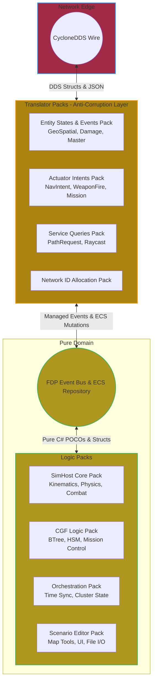
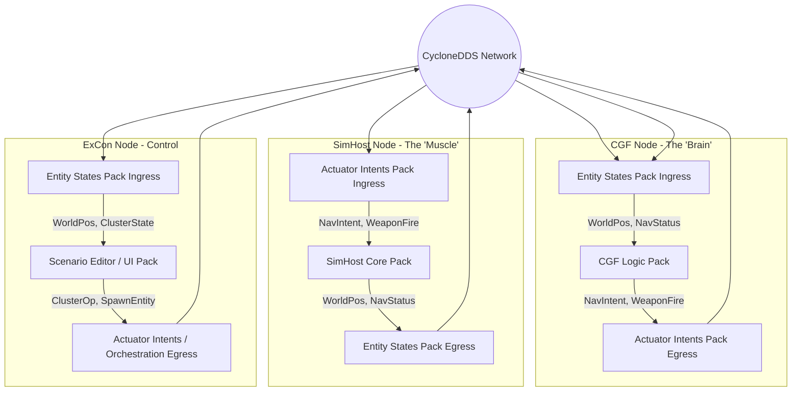
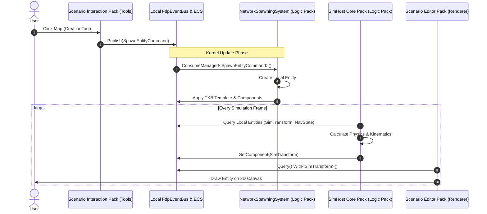
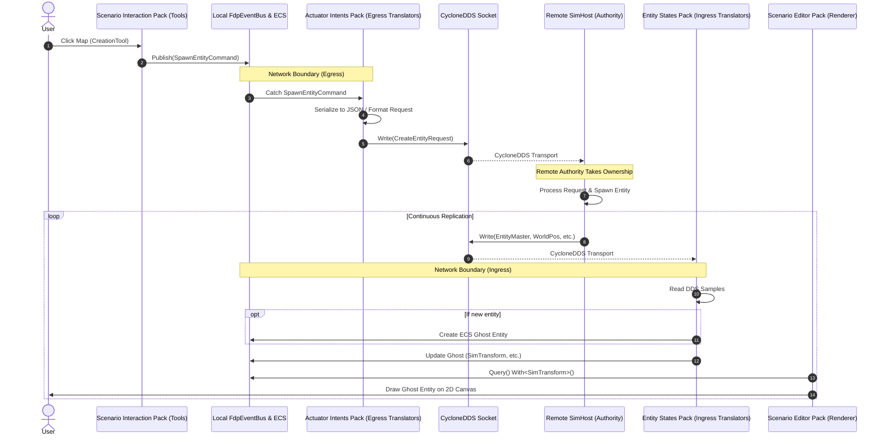

### The Clean Architecture Boundary (The ACL)
This diagram illustrates the fundamental separation of concerns. Pure Logic Packs operate exclusively on local ECS memory and the internal FdpEventBus. They have zero knowledge of CycloneDDS or JSON. Translator Packs act as the strict boundary, converting DDS wire formats into local domains.

###  "HROT Demo" Distributed Node Assembly
In a distributed setup, we assemble highly specialized nodes by mixing specific Logic Packs with unidirectional Translator Packs. Notice how the Brain and Muscle nodes never share Logic Packs, enforcing strict cognitive vs. kinematic isolation.

### "HROT Editor" All-In-One Composition & Feature Switch
When running the standalone Editor, all Logic Packs are loaded into a single ModuleHostKernel sharing one ECS repository. Because they share memory, Translator Packs are completely bypassed—Intents and States flow instantly across the internal bus.

The "Feature Switch" elegantly degrades this monolith into a distributed node by swapping out the local Muscle logic for remote network translators.

``` mermaid
graph TD
    subgraph EditorProcess [HROT Editor Process]
        Bus((Shared FDP Event Bus & ECS))
        
        Brain[CGF Logic Pack]
        Editor[Scenario Editor Logic Pack]
        Orch[Orchestration Logic Pack]
        
        Brain <--> Bus
        Editor <--> Bus
        Orch <--> Bus

        subgraph FeatureSwitch [SimHost Feature Switch]
            direction TB
            Local[Internal SimHost Core Pack]
            Remote[External Network Translator Packs]
        end
        
        Bus <--> FeatureSwitch
    end

    DDS((External SimHost over DDS))
    
    Remote -.->|If switched to External| DDS
    
    classDef switch fill:#333,stroke:#fff,stroke-width:2px,stroke-dasharray: 5 5;
    class FeatureSwitch switch;
```

The Scenario Editor Pack can effortlessly target local memory or remote network endpoints without altering a single line of business logic.

Here are the sequence diagrams illustrating the clean architecture boundaries and data flow for both states of the Feature Switch.

### State A: Internal SimHost (Offline / All-In-One)
In this state, the Translator Packs are completely bypassed. The Editor UI shares the same memory space as the `SimHost Core Logic Pack` and the `CGF Logic Pack`. Everything flows instantly through the `FdpEventBus` and local ECS repository. 

**Architectural Win:** Because `NetworkSpawningSystem` natively consumes `SpawnEntityCommand` and applies the TKB template directly to the local world, no serialization or network I/O occurs. The editor runs at maximum memory-bus speed.

***

### State B: External SimHost (Networked)
When the user toggles the switch, the local Logic Packs (`SimHost Core`, `CGF`) are dynamically uninstalled and the **Translator Packs** are installed in their place. The UI tools still blindly emit local FDP events, but the Anti-Corruption Layer (ACL) intercepts them and routes them over CycloneDDS to a remote authority.

The `CreationTool` has no idea it is talking to a network. The egress translator converts the internal `SpawnEntityCommand` into a `CreateEntityRequest` DDS message. When the remote SimHost replies by broadcasting an `EntityMaster` DDS message, the local `EntityMasterIngressTranslator` creates a proxy "ghost" entity in the Editor's local ECS. Position updates arrive as `WorldPos` messages, which the `GeoSpatialIngressTranslator` applies back to the ghost's `SimTransform`. The rendering layer simply loops over `SimTransform` components, completely oblivious to whether the entity is locally simulated or a network ghost.