# HROT Engine — Detailed Guide

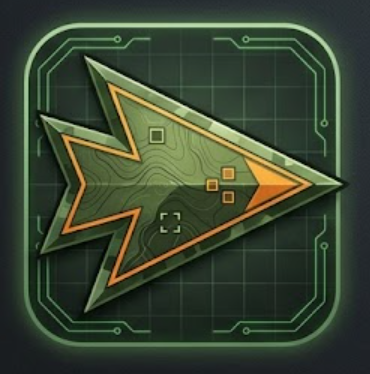

> A roomier companion to the Handbook: the same structure and the same facts, but unpacked. Where the Handbook compresses a point into one line, this guide lets it unfold into the detail it was standing in for.
> **Reading model:** chapter titles carry the structure. Each top-level bullet states a claim; nested bullets explain *what it means*, *why it's so*, and *how it works* — up to four levels deep.
> **Diagrams:** architectural diagrams are inline images; flow / state / sequence diagrams are inline Mermaid.

---

## Contents

- [1. What HROT Is](#1-what-hrot-is)
- [2. Tech Stack & Engineering Posture](#2-tech-stack--engineering-posture)
- [3. Architecture & Topology](#3-architecture--topology)
- [4. Authoring & Tooling](#4-authoring--tooling)
- [5. Diagnostics, AAR & Replay](#5-diagnostics-aar--replay)
- [6. MCP AI Assistance](#6-mcp-ai-assistance)
- [7. AI & Behavior](#7-ai--behavior)
- [8. Utility AI](#8-utility-ai)
- [9. Blueprints](#9-blueprints)
- [10. Foundation (FDP)](#10-foundation-fdp)
- [11. Entity Lifecycle & TKB](#11-entity-lifecycle--tkb)
- [12. EQS & Perception](#12-eqs--perception)
- [13. Brain-Side Actuation](#13-brain-side-actuation)
- [14. Distributed Simulation Mechanics](#14-distributed-simulation-mechanics)
- [15. Cluster Orchestration](#15-cluster-orchestration)
- [Appendix — Verify Before External Presentation](#appendix--verify-before-external-presentation)

---

## 1. What HROT Is

### 1.1 In one breath
- HROT is a **distributed, role-partitioned, combined-arms tactical simulation** engine.
  - *Distributed* — the simulation runs across multiple cooperating processes/machines, not one monolith.
  - *Role-partitioned* — each process plays a defined role (think, move, render, operate, coordinate) rather than every process doing everything.
  - *Combined-arms* — it models the interaction of different force types together (armor, infantry, aviation, recon), not a single unit type.
- The forces are driven by **AI (Computer-Generated Forces, CGF)**, with operators able to step in.
  - CGF is the standard term for entities controlled by automated behavior rather than a human at a station.
  - Any AI-driven unit can be redirected live from the operator console and handed back to the AI afterward.
- It sits on a **deterministic, networked ECS**, written in **C# / .NET 8**, on Windows.
  - *Deterministic* — the same inputs reproduce the same run, which is what makes recordings and replays exact.
  - *ECS (Entity-Component-System)* — simulation state is plain data, processed in bulk, rather than an object graph of methods.

Scenario editing/running

### 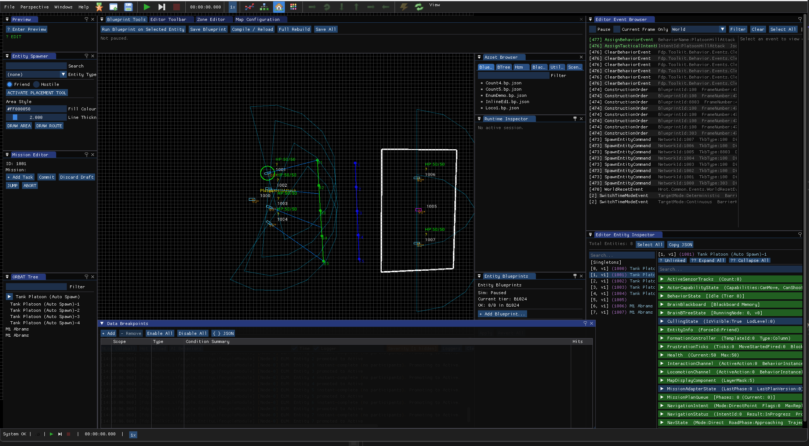

Visual behavior authoring

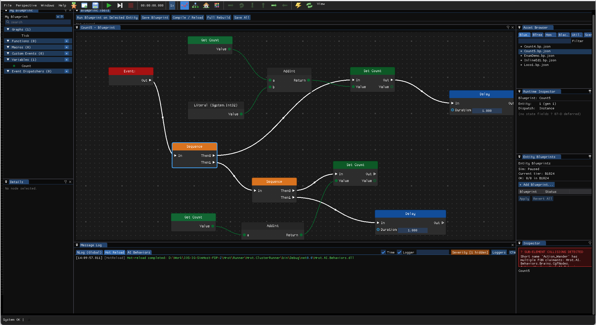

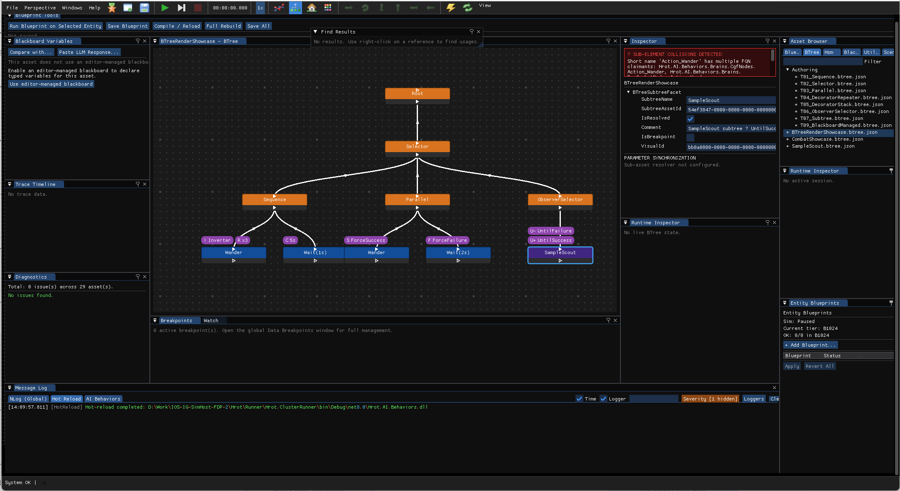

### 1.2 The two layers
- The codebase is split into a reusable engine and the military application on top of it.
- **FDP — Framework for Distributed Processing** — the domain-agnostic engine.
  - Provides the primitives: entities, components, events, time, and networking.
  - Knows nothing about tanks, weapons, or missions — those words don't appear in it.
  - Because it's domain-free, it could underpin simulations other than the military one.
- **HROT — the military application** — the domain layer built on FDP.
  - Adds the concepts FDP deliberately omits: TKB entity types, combat and ballistics, perception, mission planning, the tactical map.
- The relationship in one line: *"FDP is the engine; HROT is what we built with it."*

### 1.3 The defining idea — Brain / Muscle
- Cognition and physical execution are **separate authorities**, talking over a DDS network.
  - This separation is the single most important architectural decision; most other properties follow from it.
- **Brain (CGF)** — the side that *decides*.
  - Runs behavior trees, state machines, mission plans, and the threat picture.
  - Holds spawn authority (it's where new entities are created).
  - Emits *intent* ("go here", "fire at that") — never physical state.
- **Muscle (SimHost)** — the side that *executes*.
  - Runs kinematics, physics, ballistics, and perception/line-of-sight.
  - Produces the authoritative physical world state (where things actually are).
- The boundary is strict, and that strictness is deliberate.
  - The Brain never integrates velocity; the Muscle never ticks a behavior tree.
  - Because cognition holds no physical state, it can run on a separate machine from physics.
- *"The Brain decides; the Muscle executes. Neither crosses the boundary."*

### 1.4 Highlighted capabilities (the quick scan)
- **AI authoring, four ways** — Behavior Trees, Hierarchical State Machines, Blueprint visual scripting, and Utility AI — all visual and all hot-reloadable.
- **Tactical intelligence** — threat ranking, weapon selection, combat posture, and group fire coordination, all tunable live.
- **Fast iteration** — change AI logic and see it live without restarting; develop without the 3D renderer; run headless in CI.
- **First-class diagnostics** — a 60 Hz deterministic flight recorder, a Replay Browser with search/diff/causality, and condition-based data breakpoints.
- **AI-assisted operation** — a built-in MCP server lets an AI agent drive and diagnose the simulation.
- **Genuinely distributed** — per-component ownership, ghosts with dead reckoning, deterministic lockstep time, switchable network protocols.
- **Managed cluster** — a state machine, two-phase commit, central storage, and heartbeat-based failure handling.
- **Performance and determinism** — zero-allocation hot path, flat-memory ECS, reproducible across the cluster.

### 1.5 Who runs what (node roles at a glance)
- **CGF (Brain)** — cognition: behavior, missions, threat memory, spawn authority.
- **SimHost (Muscle)** — physics, combat, perception.
- **IG (Image Generator)** — rendering, ghost replication, and operator interaction (picking/redirecting units).
- **ExCon (IOS)** — the operator console: scenario lifecycle and time control.
- **Orchestrator** — the cluster's coordinator: state machine, two-phase commit, central asset gateway.

---

## 2. Tech Stack & Engineering Posture

### 2.1 The stack
- **C# / .NET 8 on Windows** is the implementation platform.
- **CycloneDDS** provides the networking.
  - DDS (Data Distribution Service) is a publish/subscribe middleware standard with per-topic quality-of-service controls.
  - This is what the Brain/Muscle boundary is built on, and where the per-topic QoS choices (Chapter 14) live.
- **Stride 3D** is the rendering engine, behind a thin integration layer.
  - A GPU-free mock implements the same integration surface, so the full simulation can run with no graphics.
- **Source generators** move work to compile time.
  - Behavior registration, gizmo projection, and Blueprint emission are generated rather than discovered at runtime.
  - The effect is a leaner, faster runtime with less reflection.

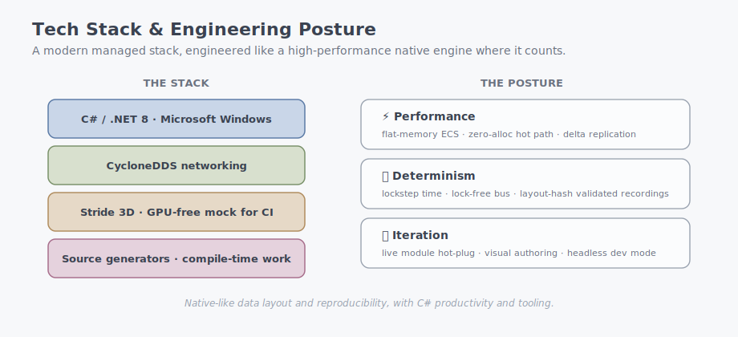

### 2.2 The posture — three guarantees
- The engineering choices cluster around three properties, each backed by concrete mechanisms.
- **Performance.**
  - Flat, unmanaged memory for simulation state, with a zero-allocation hot path.
  - Delta-based replication and recording (only changes move/store, not full state every frame).
  - Unsafe blocks are used deliberately where they buy native-like data layout.
- **Determinism.**
  - Lockstep time keeps nodes on the same frame.
  - A lock-free, double-buffered event bus gives every consumer the same event set per frame.
  - Recordings are validated against a hash of component memory layout, so a replay can't silently diverge.
- **Iteration.**
  - Modules hot-plug while the sim runs.
  - Authoring is visual, with quick reload.
  - A headless / IG-less mode supports a fast inner development loop.

### 2.3 Why C# / .NET for a high-performance sim
- The apparent tension — a managed language for a performance-critical engine — is resolved by where each tool is applied.
  - The hot path uses unmanaged flat memory and unsafe code, getting native-like layout and zero-allocation loops.
  - Everywhere else, C# keeps its productivity, tooling, and safety.
- Compile-time source generation keeps the runtime lean, so the managed layer isn't doing heavy reflective work mid-frame.

---

## 3. Architecture & Topology

### 3.1 The shape
- The system is a set of role-partitioned nodes connected by **DDS publish/subscribe** (CycloneDDS).
- Topology is dynamic.
  - Discovery handles nodes joining and leaving transparently.
  - Higher-level code doesn't manage connections; it publishes and subscribes to topics.

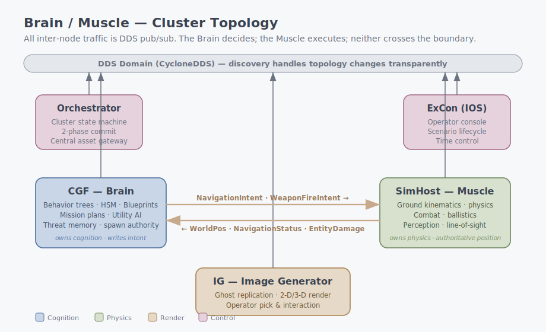

### 3.2 Who owns what
- Ownership is split along the Brain/Muscle line, and it's enforced, not conventional.
- **Brain owns cognitive state.**
  - Behavior and HSM state, mission plans, target memory.
  - It writes *intent* — the desired action, not its physical realization.
- **Muscle owns physical state.**
  - Transform, velocity, navigation status, physics.
  - It produces the authoritative position that everything else follows.
- The hard boundary has a practical payoff.
  - Because the two never overlap in what they mutate, they can live on different machines and scale independently.

### 3.3 The clean-architecture seam (ACL)
- Every node is built in two layers, and this is what lets the same code run in-process or distributed.

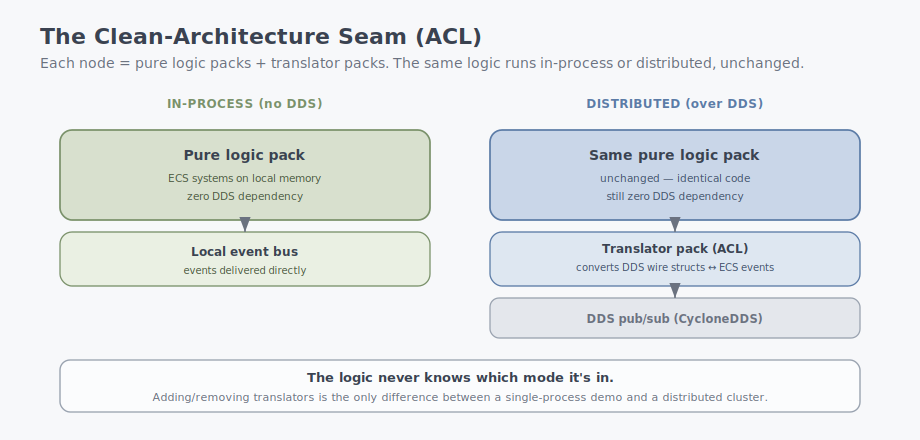

- **Pure logic packs.**
  - ECS systems operating on local memory, with zero dependency on DDS.
  - This is the actual simulation logic.
- **Translator packs (an Anti-Corruption Layer).**
  - Convert DDS wire structs to and from ECS events at the edge.
  - They isolate the pure logic from the networking representation.
- The consequence is the important part.
  - In-process, there are no translators — events flow on the local bus.
  - Distributed, translators bridge to DDS — but the logic is byte-for-byte the same.
  - Adding or removing translators is the only difference between a single-process demo and a full cluster.

### 3.4 Single-binary deployment
- One `ClusterRunner` executable can host any combination of subsystems.
  - `--mode all` runs the entire cluster in a single process — ideal for development, demos, and CI.
  - Splitting modes across machines produces a production cluster.
- Crucially, moving from one box to many is a launch-flag change, not a code change.
  - The ACL seam (3.3) is what makes this true.

### 3.5 A move order, end to end
- One concrete trace shows how intent becomes motion and closes the loop back to cognition.

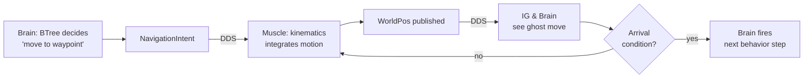
```mermaid
flowchart LR
    BT[Brain: BTree decides<br/>'move to waypoint'] --> NI[NavigationIntent]
    NI -->|DDS| MUS[Muscle: kinematics<br/>integrates motion]
    MUS --> WP[WorldPos published]
    WP -->|DDS| IG[IG &amp; Brain<br/>see ghost move]
    IG --> ARR{Arrival<br/>condition?}
    ARR -->|no| MUS
    ARR -->|yes| NEXT[Brain fires<br/>next behavior step]
```

- Reading it as ownership: the Brain produces `NavigationIntent`, the Muscle consumes it and produces `WorldPos`, and the Brain only re-engages when its arrival condition is met. Nobody crosses the line.

---

## 4. Authoring & Tooling

### 4.1 The promise
- Authors work visually, and the loop from edit to running behavior is measured in seconds.
  - There is no full rebuild-and-restart cycle for AI logic changes.

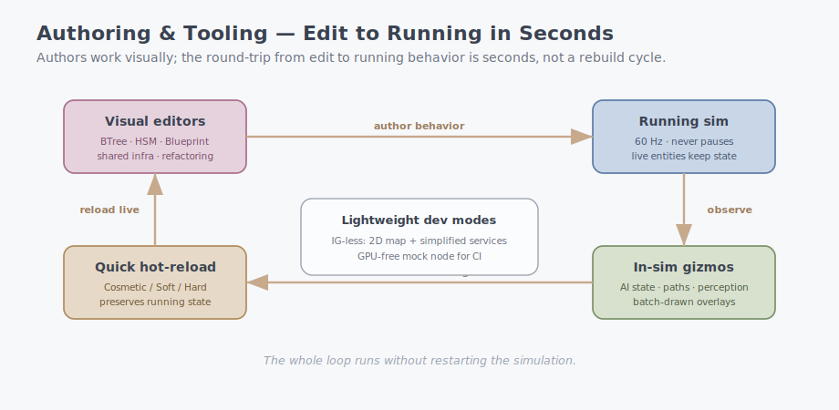

### 4.2 Visual editors (shared foundation)
- There are editors for Behavior Trees, HSMs, and Blueprints, and they share one infrastructure rather than being three separate tools.
- That shared foundation provides:
  - A common asset catalog and selection model.
  - Cross-asset reference tracking — so the tool knows where an asset is used.
  - Preview-then-apply refactoring — rename or delete propagates across files, shown before it's committed.
  - Validation and live debug overlays.
- The payoff for authors:
  - The same conveniences (find-references, breakpoints, trace timelines) work regardless of which AI paradigm they're editing.

### 4.3 Quick hot-reload
- AI logic can change and take effect live, without restarting the simulation.

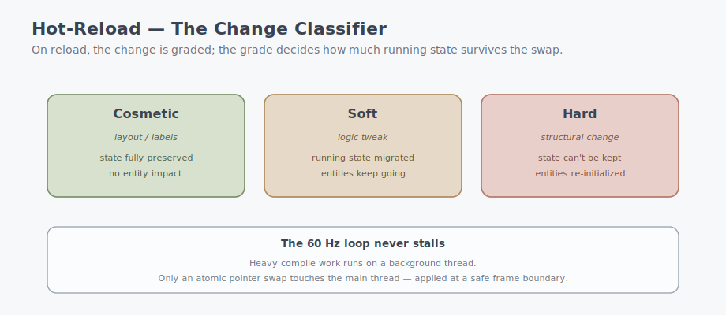

- On reload, the change is graded, and the grade decides how much running state survives.
  - **Cosmetic** — layout or labels; running state is fully preserved.
  - **Soft** — a logic tweak; running state is migrated so entities keep going.
  - **Hard** — a structural change; running state can't be kept, so affected entities are re-initialized.
- The reload never stalls the simulation loop.
  - The heavy compile work happens on a background thread.
  - Only an atomic pointer swap touches the main thread, applied at a safe frame boundary.

### 4.4 Scenario authoring
- Scenarios are composed offline, without a live cluster.
  - Place entities, author routes and zones, plan missions.
  - The result is saved centrally and then deployed to the cluster (see Chapter 11 and 15 for how loading is coordinated).

### 4.5 In-sim debug gizmos
- The simulation can draw explanatory overlays on top of itself.
  - Overlays are declared declaratively, then projected in batches with a per-frame time budget — so visualization can't blow the frame.
  - A layer mask toggles categories (paths, perception, AI state) independently.
- These overlays connect to the AI's own data.
  - Tracing can be auto-enabled per entity, stamping working-memory traces that the overlays then visualize.

### 4.6 Lightweight development modes
- Two modes remove the cost of the full renderer for inner-loop work.
- **IG-less mode.**
  - A 2D map plus simplified physics, perception, and navigation services.
  - Enough to develop and test engine and AI logic without a GPU or the full 3D image generator.
- **GPU-free mock node.**
  - Runs the same logic headless, which is what allows the full pipeline to run in CI.

---

## 5. Diagnostics, AAR & Replay

### 5.1 Why it's trustworthy
- The whole diagnostics story rests on determinism.
  - Because the simulation is deterministic, a recording can be *reconstructed* frame-for-frame, not merely approximated.
  - This means a question you answer by inspecting a replay is answerable identically on a live run.

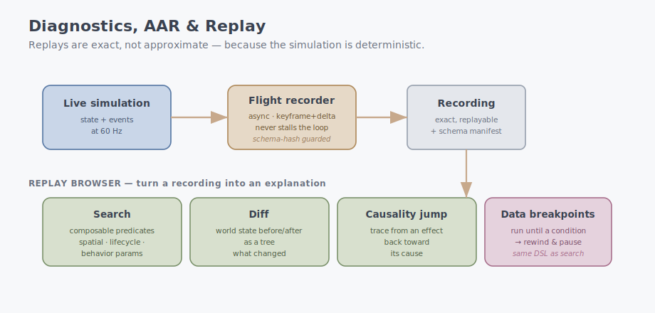

### 5.2 The flight recorder
- The recorder captures full state plus transient events at 60 Hz, asynchronously, without stalling the sim.
- Several mechanisms keep it cheap enough to run continuously.

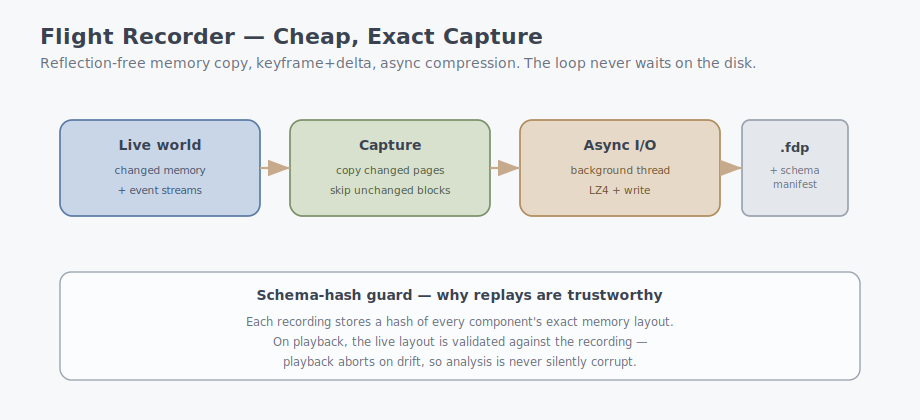

  - **Reflection-free memory copy.** State is copied as raw memory on the hot path, not serialized field-by-field.
  - **Keyframe + delta.** A full keyframe is written periodically; between keyframes only deltas are stored.
  - **Unchanged blocks are skipped.** Memory blocks that didn't change since the previous frame aren't re-captured.
  - **Async compression and I/O.** Compression and disk writes happen on a background thread via a double-buffered handoff, so the simulation loop never waits on the disk.

### 5.3 Replay integrity — the schema guard
- A recording is only useful if it can't silently rot against changed code; the schema guard ensures that.
  - Each recording carries a **schema manifest** — a hash of every component's exact memory layout.
  - On playback, the engine validates the live layout against the recording's.
  - If anything has drifted, playback **aborts** rather than producing corrupt analysis.
- The same machinery underpins data-format versioning and migration (Chapter 11).

### 5.4 The Replay Browser
- The Replay Browser is an offline tool that turns a recording into something you can interrogate.
  - It needs no live cluster, and it materializes **any frame as a real entity world** — queryable exactly like a live one.
- It offers four core capabilities.
  - **Search** — find frames/entities matching composable conditions (detailed in 5.5).
  - **Diff** — compare world state between two points as a structured tree, with an epsilon tolerance so floating-point noise doesn't drown the real changes.
  - **Causality jump** — move from an observed effect back toward its cause.
  - **Export** — emit JSON in absolute, incremental, or changelog form for external tools.

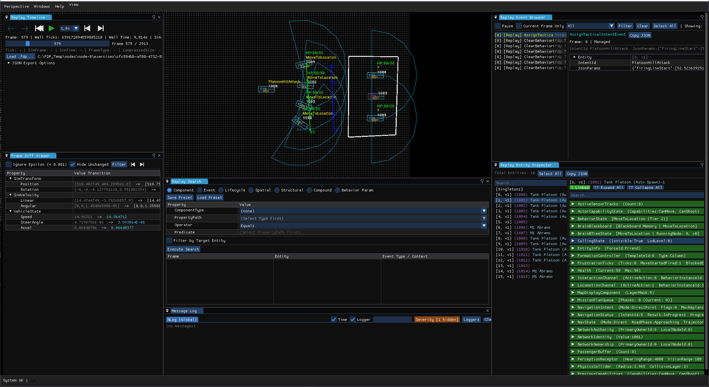

### 5.5 One predicate language — search *and* breakpoints
- A single composable predicate language serves two purposes: searching recordings offline and breaking live runs.

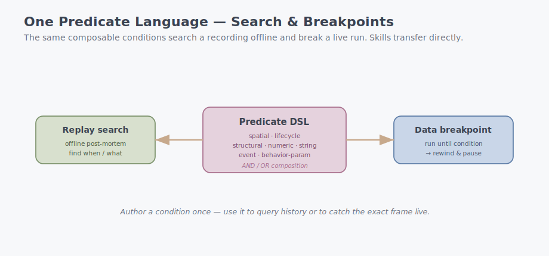

- The predicate families are:
  - **Spatial** — within a bounding box.
  - **Lifecycle** — born or died within a window.
  - **Structural** — has or lacks a given component.
  - **Numeric** — a field within a range; **String** — a field matching a value.
  - **Event** — a specific transient event fired, optionally with field constraints.
  - **Behavior-param** — an AI parameter matched.
  - **AND / OR composition** — these combine into arbitrarily specific questions.
- The significance: authoring a condition once lets you use it in either world, so debugging skills transfer between post-mortem and live.

### 5.6 Data breakpoints — run until a condition
- A data breakpoint pauses the live simulation the instant a condition becomes true.

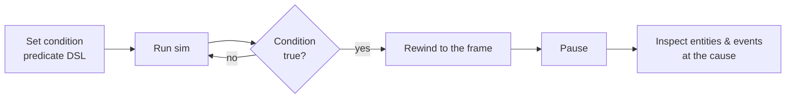
```mermaid
flowchart LR
    A[Set condition<br/>predicate DSL] --> B[Run sim]
    B --> C{Condition<br/>true?}
    C -->|no| B
    C -->|yes| D[Rewind to the frame]
    D --> E[Pause]
    E --> F[Inspect entities &amp; events<br/>at the cause]
```

  - On hit, the sim rewinds and pauses at the exact frame where the condition first held.
  - Optional refinements: an occurrence threshold ("break on the 3rd time") and entity filters.
- This is especially valuable for rare, timing-dependent issues, which are caught without an analyst watching the run.

### 5.7 Checkpoints & dry run
- The same rigor extends to live experimentation.
  - **Checkpoint / restore** — snapshot world state, branch, and revert.
  - **Diff** — compare before/after a workload, without even needing a checkpoint.
  - **Dry run / preview** — explore a branch without committing it to the live exercise.

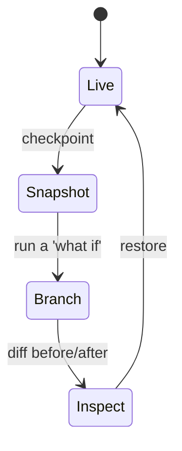
```mermaid
stateDiagram-v2
    [*] --> Live
    Live --> Snapshot: checkpoint
    Snapshot --> Branch: run a 'what if'
    Branch --> Inspect: diff before/after
    Inspect --> Live: restore
```

  - Snapshots go through the engine's blessed preview mechanism rather than ad-hoc copies, keeping branch/restore consistent with the rest of the time-control model.

---

## 6. MCP AI Assistance

### 6.1 What it is
- A built-in **MCP server** exposes the running simulation to an AI agent as a clean set of tools.
  - MCP (Model Context Protocol) is a standard way to present capabilities to an AI agent as callable "tools."
  - Here, each tool maps to a capability the simulation already has internally — so this is largely *exposure*, not new engine machinery.

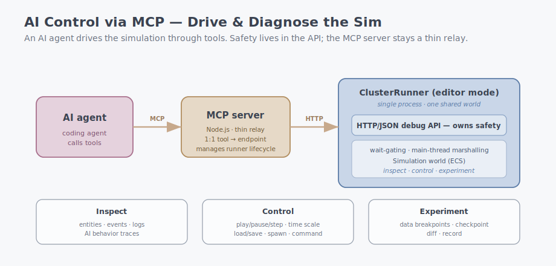

### 6.2 Architecture
- The design is two thin pieces around the existing simulation.
  - **Inside the runner** sits a small HTTP/JSON debug API exposing existing query/control capabilities.
  - **Outside** sits a Node.js MCP server that proxies those endpoints as agent tools, one-to-one, and manages the runner's process lifecycle.
- The split is deliberate.
  - The in-process API reuses capability against the single shared world, so little new engine code is needed.
  - The MCP server is intentionally "dumb" — it relays calls and holds no business logic, so the safety logic lives in exactly one place (the API).

### 6.3 The tool surface
- The tools fall into three families over one shared world.

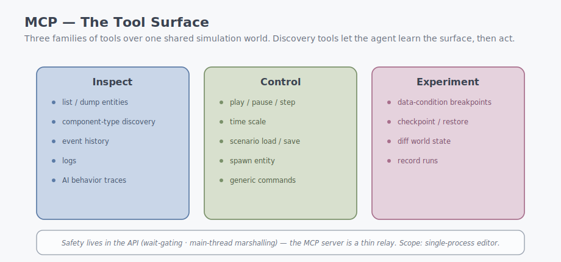

  - **Inspect** — list/dump entities, discover component types, read event history, read logs, read AI behavior traces.
  - **Control** — play/pause/step, set time scale, load/save scenarios, spawn entities, issue generic commands.
  - **Experiment** — set data-condition breakpoints, checkpoint/restore, diff world state, record runs.
- Discovery tools matter more than they first appear.
  - An agent doesn't know your component or command names in advance.
  - Discovery endpoints (component types, command list, scenarios) let it *learn* the surface, then act — instead of guessing.

### 6.4 Two modes of use
- **Autonomous test-fix loop** — the agent runs a closed loop with no human in it.

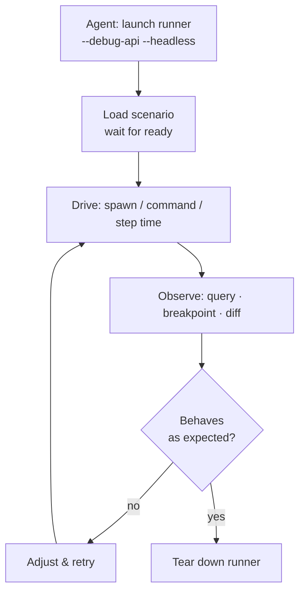
```mermaid
flowchart TD
    A[Agent: launch runner<br/>--debug-api --headless] --> B[Load scenario<br/>wait for ready]
    B --> C[Drive: spawn / command / step time]
    C --> D[Observe: query · breakpoint · diff]
    D --> E{Behaves<br/>as expected?}
    E -->|no| F[Adjust &amp; retry]
    F --> C
    E -->|yes| G[Tear down runner]
```

  - It launches a headless runner, loads a scenario, drives an experiment, observes via queries/breakpoints/diffs, and tears down — suitable for automated regression-style work.
- **Manual-session assistance** — the agent attaches to a session a human is already driving and helps inspect or steer it.

### 6.5 The safety model
- The guiding principle is that the API owns safety and the MCP server stays dumb.
  - **Wait-gating.** A command that has a correlated acknowledgement is only awaited if time is actually advancing; otherwise the API returns immediately marked "not awaited," so the agent gets an honest answer instead of a hang.
  - **Thread marshalling.** HTTP requests arrive on background threads, but world state is only touched on the main thread at a safe point; each request becomes a job drained there.
- The scope is intentionally bounded to the single-process editor topology.
  - That topology is a guaranteed single process with one shared world — safe to expose.
  - Exposing this on a live distributed node would bypass the architecture's network boundary, so live inspection goes through the operator console instead.

---

## 7. AI & Behavior

### 7.1 Four complementary paradigms
- HROT offers four ways to author behavior because different problems suit different models.

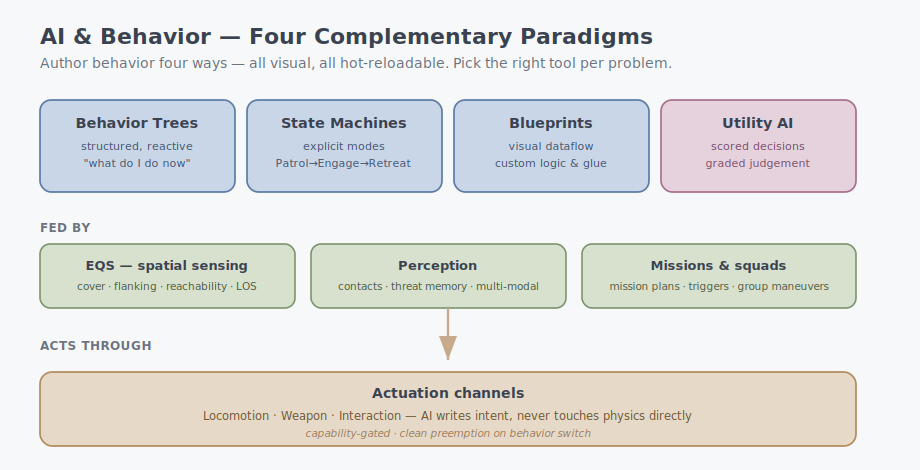

- **Behavior Trees (BT)** — structured, reactive control.
  - Best for prioritized "what should I do right now" logic that re-evaluates each tick.
- **Hierarchical State Machines (HSM)** — explicit modes with clean entry and exit.
  - Best when behavior has distinct phases (Patrol → Engage → Retreat) you want to name and transition between deliberately.
- **Blueprint visual scripting** — dataflow graphs.
  - Best for custom authored logic and for gluing the other systems together; can appear as BT leaves, standalone actors, or shared functions.
- **Utility AI** — scored decision-making.
  - Best for graded tactical judgement ("how good is each option"), as opposed to yes/no branching.

### 7.2 They compose
- The four are layers, not rivals.
  - A Utility decision can choose which BT branch to take.
  - A Blueprint primitive can serve as a BT leaf.
- The clean way to remember it: *"BT/HSM/Blueprint decide structure; Utility AI decides which option inside that structure."*

### 7.3 Fed by sensing
- Behaviors don't sense the world directly; they consume the sensing systems' outputs.
  - **EQS** answers spatial/tactical questions (cover, flanking, reachability, line-of-sight).
  - **Perception** maintains the contact picture and threat memory, across modalities.
  - **Missions & squads** supply higher-level structure: mission plans, triggers, and group maneuvers.

### 7.4 Acts through channels
- Behaviors don't move or shoot directly either; they write intent to **actuation channels** (Chapter 13).
  - The channels are Locomotion, Weapon, and Interaction (plus Animation and LookAt for characters).
  - Commands are capability-gated, and stale commands are cleared automatically on a behavior switch.

### 7.5 Commander intent → unit behavior
- Higher echelons issue intent that is resolved into concrete per-unit behavior.

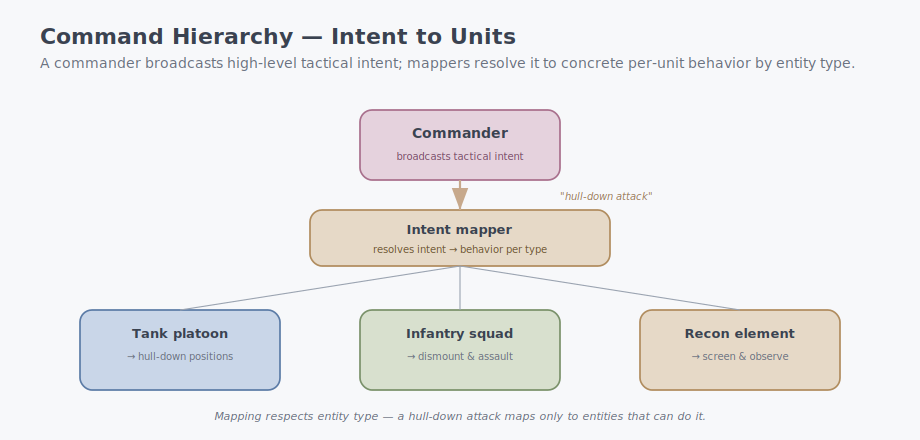

  - A commander entity broadcasts a high-level tactical intent (for example, "defend this area" or "hull-down attack").
  - Mappers translate that intent into specific behavior assignments per subordinate.
  - The mapping respects entity type — a hull-down attack maps only to entities capable of it (e.g. tanks), not to infantry.
- This is how a single order at the top becomes coordinated, type-appropriate behavior across a mixed force.

---

## 8. Utility AI

### 8.1 The problem it solves
- The other three AI systems are structural/Boolean, and that becomes brittle for graded judgement.
  - A BT/HSM picks the leftmost passing branch or fires on an explicit guard.
  - Expressing something like "retreat only when health is low AND we're outnumbered AND cover is available" forces deeply nested selectors with hard thresholds.
  - Every added nuance multiplies branches and introduces another magic number that must be retuned.
- Utility AI changes the model from branching to scoring.
  - Each option is scored from weighted considerations; the highest score wins.
  - Tuning becomes adjusting weights and curves, not restructuring trees.
  - The mindset: Boolean logic answers yes/no, but tactics are about *how good* each choice is right now.

### 8.2 The core idea — consideration → curve → score
- Scoring a single option runs a four-step pipeline.

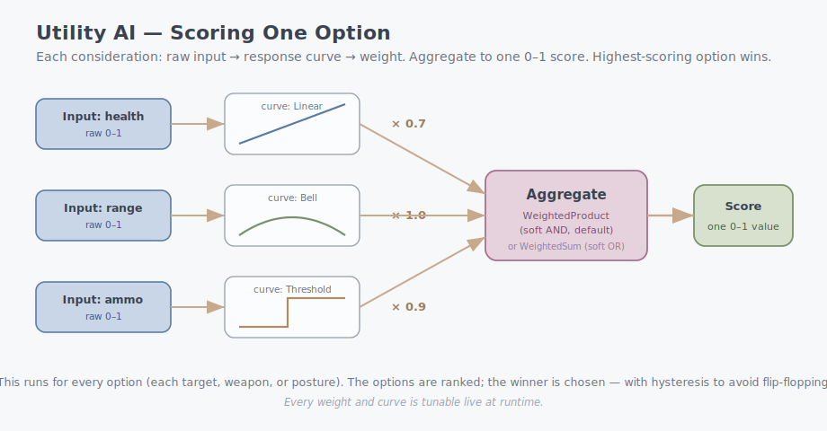

  - **Inputs** — raw facts about the world (health fraction, distance, ammo, threat level…), each normalized to 0–1.
  - **Response curve** — maps a raw 0–1 input to a 0–1 *utility*: how desirable that value is.
  - **Weight** — how much this consideration matters relative to the others.
  - **Aggregate** — combine the weighted utilities into a single 0–1 score for the option.
- Then every option is scored, ranked, and the winner is chosen.
- Normalizing everything to 0–1 is what makes heterogeneous considerations (health vs. range vs. ammo) directly comparable.

### 8.3 Response curves — the expressive vocabulary
- Nine curve families let an author encode tactical intuition without writing branches.

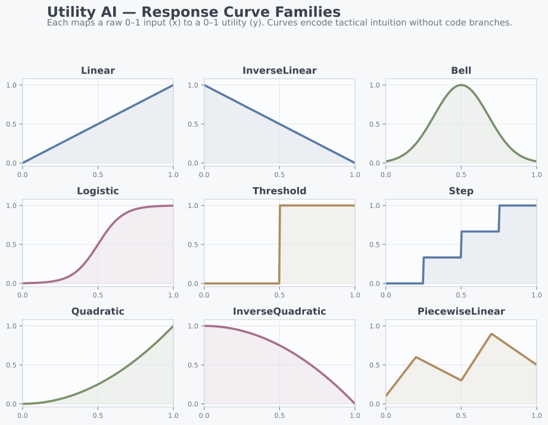

  - **Linear / InverseLinear** — "more is better" / "less is better."
  - **Threshold / Step** — gate-like, sharp transitions.
  - **Bell** — peaks at an ideal value and falls off either side.
  - **Logistic** — a smooth S-curve for soft decision boundaries.
  - **Quadratic / InverseQuadratic** — accelerating or decelerating preference.
  - **PiecewiseLinear** — an arbitrary authored shape via control points.
- Read as tactics:
  - A **Bell** on range means "fight at the distance this weapon is good at."
  - An **InverseLinear** on target health means "prefer the easier kill."
  - A **PiecewiseLinear** means "draw exactly the preference I want" when no standard shape fits.
- All curves are compact and evaluated allocation-free on the hot path.

### 8.4 Aggregation — how scores combine
- Two strategies are available, chosen per option.
  - **WeightedProduct** (the default) — a product-with-compensation that behaves like a soft AND.
    - Multiplying utilities means one near-zero consideration tanks the option — exactly what you want for "all of these must hold."
    - A built-in compensation factor stops scores collapsing toward zero merely because there are many considerations.
  - **WeightedSum** — a normalized weighted sum that behaves more like OR/averaging.
    - Use it when considerations are alternatives rather than requirements, so one strong reason can carry the option.

### 8.5 The four decision kinds
- The same scoring core does four distinct jobs.

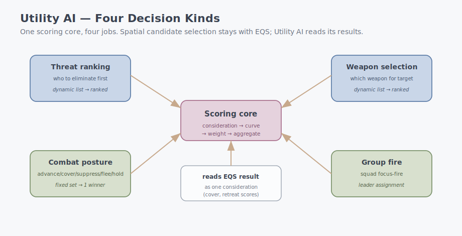

  - **Threat ranking** — who to eliminate first; scores each contact and ranks the list (dynamic list → ranked).
  - **Weapon selection** — which weapon for the chosen target; scores each weapon mount (dynamic list → ranked).
  - **Combat posture** — which stance to adopt; scores a fixed authored set and picks one (fixed set → 1 winner).
  - **Group fire** — squad-level focus fire; a leader allocates targets across members via greedy assignment.
- The boundary with EQS is explicit.
  - Spatial candidate selection (cover points, flanking positions) belongs to EQS.
  - Utility AI *reads* an EQS result as one consideration among many — it never re-implements position scoring.

### 8.6 The starter pack (ships in the box)
- Usable tactical decisions ship ready to use, not just a framework.
  - **Threat Ranking** — line-of-sight gate, distance (closer = higher), threat level, target health (lower = easier), squad-assigned bias.
  - **Weapon Selection** — ammo gate, range-band fit (a Bell peaking at ideal range), effectiveness vs target armor, readiness (cooldown penalty).
  - **Combat Posture** — five postures (Advance & Attack, Take Cover, Suppress, Flee, Hold), blending health, ammo, enemy-strength ratio, live-target presence, and EQS cover/retreat scores.
  - **Leader Assignment** — scores (member, target) pairs for focus fire by line-of-sight, threat, and distance.
- These double as worked examples — authors clone and adapt them rather than starting blank.

### 8.7 Stability
- Two mechanisms keep scored behavior from looking erratic.
  - **Hysteresis.** The currently-active choice gets a small bonus before re-ranking, so an agent commits to a choice until something is clearly better — no per-frame flip-flopping between near-ties.
  - **Group focus fire.** The squad leader runs a greedy assignment over the (member × target) matrix, respecting a focus-fire cap so fire is concentrated without everyone dog-piling one target.

### 8.8 Authoring & live tuning
- Decisions are authored declaratively and tuned live.
  - A fluent builder declares each option's considerations (input + weight + curve); each decision carries a stable ID and category.
  - A live tuning console exposes every weight and curve as a runtime-tunable parameter; edits take effect on the next frame, with snapshot/revert per decision or globally.
  - Per-entity scoring traces feed an on-map overlay that shows *why* an option won — the winning consideration and the runner-up margin.
- The most persuasive demonstration: dial the "take cover" weight up mid-exercise and watch the platoon grow more cautious in real time.

---

## 9. Blueprints

### 9.1 What a Blueprint is
- A Blueprint is a visual dataflow graph that becomes real compiled code.
  - The author builds a graph; a compiler turns it into C#; the runtime loads and runs the generated code.
  - On disk it's a JSON graph file (header, stable asset ID, dispatch kind, the graphs, field declarations, editor layout).

### 9.2 The three dispatch kinds
- A Blueprint takes one of three runtime shapes, declared up front.

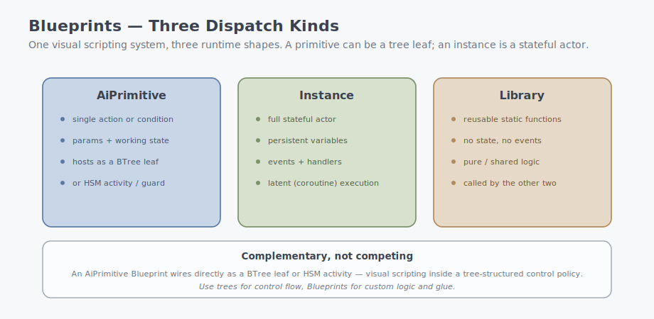

  - **AiPrimitive** — a single action or condition.
    - Carries read-only parameters and mutable working state.
    - Declares which slots can host it, so it can serve directly as a BT leaf or an HSM activity/guard.
  - **Instance** — a full stateful actor.
    - Carries persistent variables, event dispatchers, custom events and handlers, and references to sibling Instances.
    - Supports latent (coroutine-style) execution that can wait across frames.
  - **Library** — a collection of reusable pure static functions.
    - No state, no events, no variables — shared logic called by the other two kinds.

### 9.3 The dual compile path
- The same Blueprint can be compiled two ways, serving production and iteration.

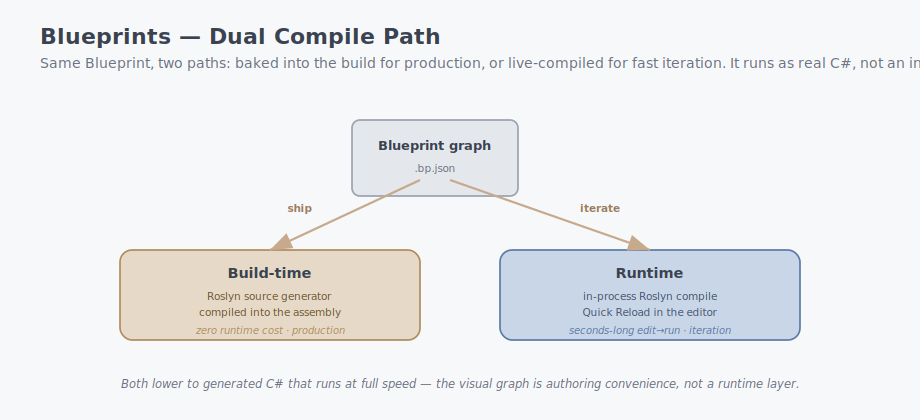

  - **Build-time** — a Roslyn source generator bakes the Blueprint into the assembly as C#, for zero runtime cost in production.
  - **Runtime** — an in-process Roslyn compiler builds it on the fly for the editor's Quick Reload, giving a seconds-long edit→run loop.
- Either way, it's real generated C# running at full speed — the visual graph is authoring convenience, not a runtime interpreter.

### 9.4 The authoring surface
- The editor is a full visual environment.
  - Graphs, functions (pure and impure), macros, custom events, typed variables, and event dispatchers.
  - An outliner navigates everything declarable; pins are typed, with colors that match wire colors; badges mark pure/exposed/deprecated; categories nest for large assets.

### 9.5 Complementarity & runtime behavior
- Blueprints slot into the rest of the AI rather than standing apart.
  - An AiPrimitive wires directly as a BT leaf or HSM activity — visual scripting inside a tree-structured control policy.
  - **Latent execution** lets a graph pause and resume on a channel result or event, natural for "do this, wait until it finishes, then continue."
  - **Dynamic assignment** can attach, remove, or replace an Instance Blueprint on a live entity; the change applies at a safe phase and takes effect the next frame.

---

## 10. Foundation (FDP)

### 10.1 What the foundation gives you
- FDP provides the engine primitives every node is built from.

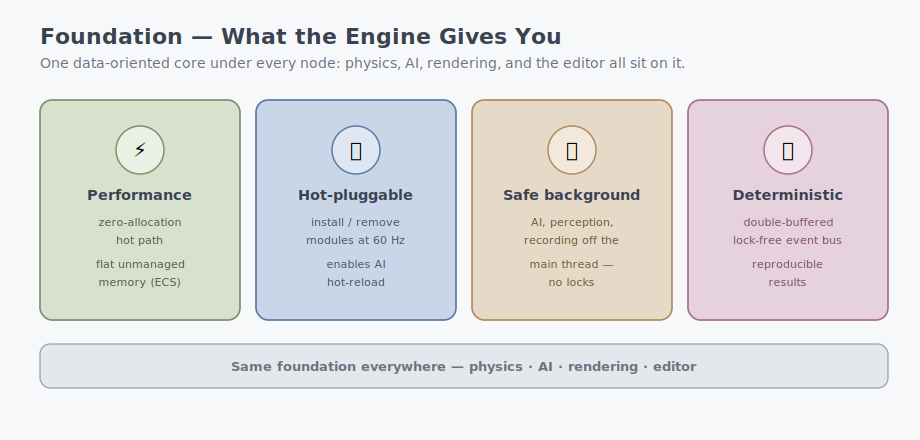

  - A **data-oriented ECS core** — flat unmanaged memory, zero-allocation hot path.
  - **Hot-pluggable modules** — install or remove subsystems while running at 60 Hz.
  - **Safe background work** — AI, perception, and recording off the main thread without locks.
  - A **deterministic, lock-free event bus** — double-buffered and reproducible.
  - One foundation under physics, AI, rendering, and the editor alike.

### 10.2 ECS, kept high-level
- The defining property is that simulation state is flat data, not an object graph.
  - There's no per-entity virtual dispatch on the hot path.
  - That flatness is what enables the zero-allocation loop, fast bulk queries, and the delta-compression that replication and recording rely on.
- (The chunk-storage and bitmask-query internals are a deeper topic than this guide goes into.)

### 10.3 Hot-pluggable modules
- A module is the unit of composition.
  - It packages a feature as systems plus the components those systems touch.
  - It can be swapped at a safe frame boundary via an atomic pointer swap.
- This is the mechanism beneath AI hot-reload (4.3) — reload is a module swap.

### 10.4 Safe background work
- Modules choose where they run.

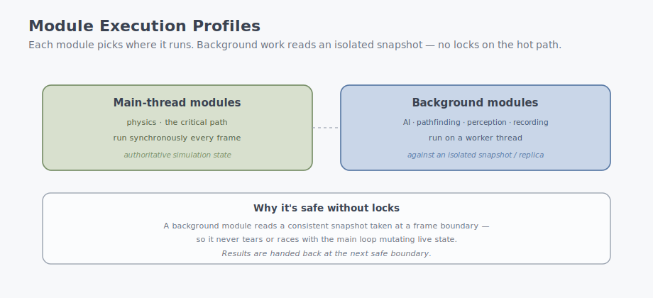

  - **Main-thread modules** — physics and the critical path, run synchronously every frame; they hold the authoritative state.
  - **Background modules** — AI, pathfinding, perception, recording, run on a worker thread against an isolated snapshot/replica.
- The safety comes from snapshot isolation, not locking.
  - A background module reads a consistent snapshot taken at a frame boundary, so it never tears or races the main loop.
  - Results are handed back at the next safe boundary.

### 10.5 The double-buffered event bus
- The event bus gives thread-safety and determinism without locks.
  - Events are written to one buffer and read from another; the buffers swap once per frame.
  - That yields a deterministic, one-frame-latency contract — every consumer in a frame sees exactly the same event set.
- A complementary mechanism handles modules running slower than 60 Hz.
  - Event history is captured so a sub-60 Hz background module never misses events generated on faster frames.

### 10.6 The two-layer node construction
- Every node is pure logic plus translators (the same seam described in 3.3).
  - **Pure logic packs** — ECS systems on local memory, zero DDS dependency.
  - **Translator packs (ACL)** — convert DDS wire structs to and from ECS events.
- This is why identical logic runs in-process or distributed unchanged.

### 10.7 Layered relationship — FDP under HROT
- The two-layer split (engine vs. application) is worth seeing as a stack.

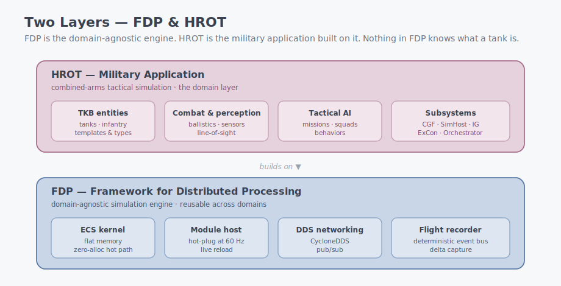

  - HROT's military concepts (TKB entities, combat, perception, missions, subsystems) sit on top.
  - FDP's domain-agnostic primitives (ECS kernel, module host, DDS networking, flight recorder) sit underneath.

---

## 11. Entity Lifecycle & TKB

### 11.1 The core stance
- Entities are data-driven assemblages, not hardcoded classes.
  - A template defines a *type* by the components it should have and their default values.
  - Spawning assembles an *instance* from a template.
- The payoff is concrete.
  - New platforms, sensors, and weapons become template/data changes, not engine rewrites.
  - The engine/domain separation stays clean: the engine assembles entities, the data defines what they are.

### 11.2 The TKB (Transient Knowledge Base)
- The TKB is the database of entity templates.

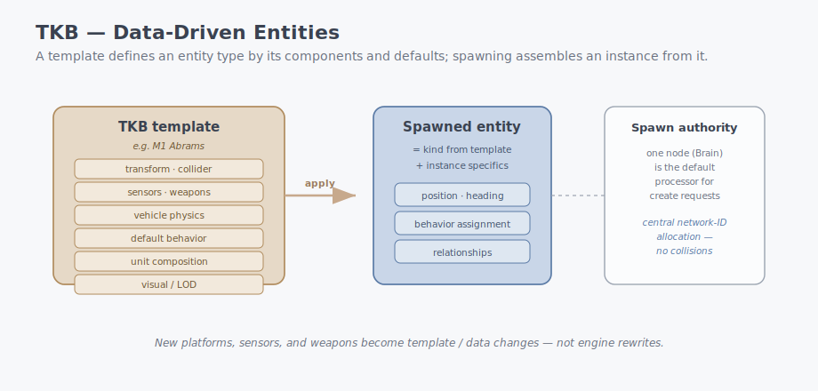

  - Each template equals a type (e.g. M1 Abrams vs. a civilian car), defined by the components an entity of that type should carry.
  - Templates are authored as JSON and parsed at startup.
  - They're addressable by stable type ID or by name, and grouped by category.
- A template's descriptors are its vocabulary.
  - transform · collider · sensors · weapons.
  - vehicle physics parameters · default behavior profile.
  - unit composition (sub-entities) · visual / LOD reference.

### 11.3 Spawning from a template
- Spawning is a three-step assembly, and in a cluster it is authoritative.

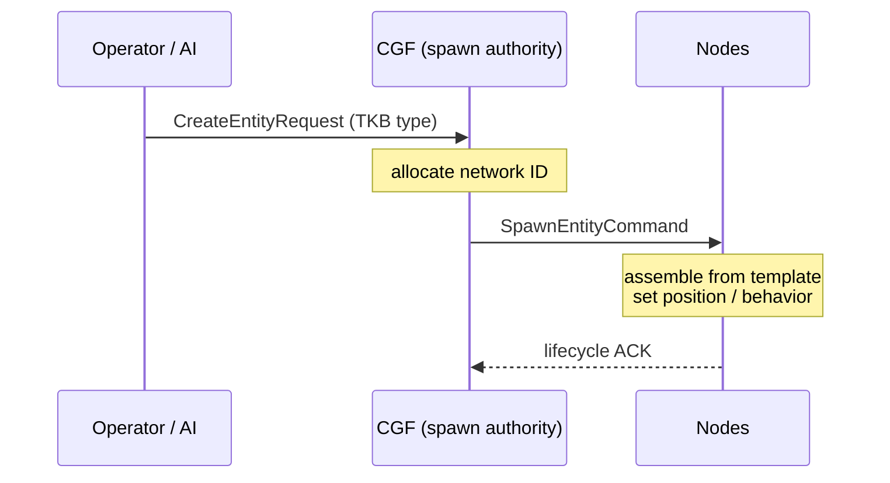
```mermaid
sequenceDiagram
    participant Req as Operator / AI
    participant Brain as CGF (spawn authority)
    participant Nodes
    Req->>Brain: CreateEntityRequest (TKB type)
    Note over Brain: allocate network ID
    Brain->>Nodes: SpawnEntityCommand
    Note over Nodes: assemble from template<br/>set position / behavior
    Nodes-->>Brain: lifecycle ACK
```

  - Create a bare entity → apply the template (adds the descriptor components) → set instance specifics (position, orientation, behavior).
  - One node (the Brain) is the default processor for create requests and allocates network IDs centrally, so IDs never collide across nodes.
- The template provides the *kind*; the spawn provides the *instance*.

### 11.4 Lifecycle states
- A spawned entity passes through staged states before it is live, especially on nodes that don't own it.

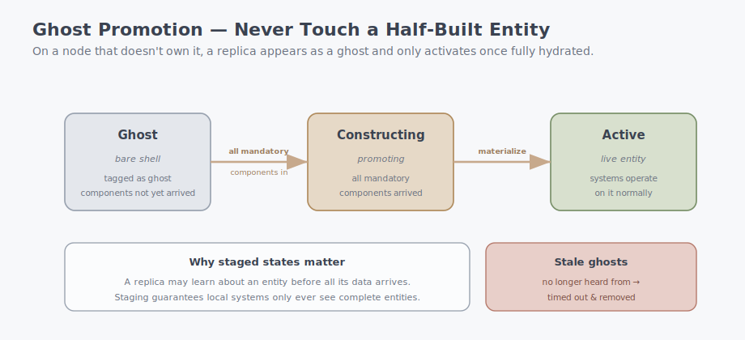

  - On a non-owning node it first appears as a **Ghost** (a bare proxy), then is promoted once fully hydrated, then becomes **Active**.
- Staging exists to prevent operating on incomplete entities.
  - A replica may learn about an entity before all its data arrives.
  - Staging guarantees local systems only ever see component-complete entities.

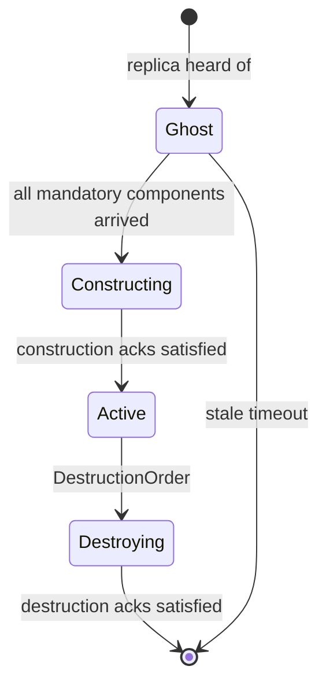
```mermaid
stateDiagram-v2
    [*] --> Ghost: replica heard of
    Ghost --> Constructing: all mandatory components arrived
    Constructing --> Active: construction acks satisfied
    Active --> Destroying: DestructionOrder
    Destroying --> [*]: destruction acks satisfied
    Ghost --> [*]: stale timeout
```

### 11.5 Distributed construction & destruction
- Lifecycle transitions are acknowledged across the cluster, not assumed.
  - Authoritative construction/destruction orders fan out; each relevant module acknowledges.
  - An entity flips to active (or is destroyed) only when the acknowledgement count is satisfied.
- Composite entities and ownership are handled at birth.
  - Destroying a parent destroys its sub-entities (a turret, a child sensor) — no orphans.
  - Ownership of an entity's descriptors can be routed at creation (kinematics to the Muscle, cognition to the Brain) — pre-genesis ownership routing.

### 11.6 Behavior & logic assignment
- An entity's AI can be set at birth or changed live.
  - **Static** — the template names a default behavior, initialized during the spawn pipeline, so an entity is "born" with its doctrine.
  - **Dynamic** — runtime events reassign, replace, or clear behavior (or a Blueprint) on a live entity, applied at a safe phase and taking effect the next frame.
- Relationships ride through the spawn pipeline too — passengers, routes, command-hierarchy links, and initial target memory are resolved into live components as the entity comes up.

### 11.7 Scenarios
- A scenario is a saved snapshot of an entity set, authored offline and loaded onto the cluster.
  - It's stored as JSON and deployed centrally.
  - Loading runs the same genesis pipeline, coordinated by two-phase commit (Chapter 15), so every node comes up with the same world on the same frame.
- Saved data is versioned with migration support, and schema validation guards against loading against drifted component layouts.

---

## 12. EQS & Perception

### 12.1 Division of labor
- Two complementary systems sit beneath the AI.
  - **Perception** builds and maintains the agent's picture of the world — detected contacts and threat memory.
  - **EQS** answers standing spatial/tactical questions over that world — best cover, nearest threat, reachable retreat.
- Both feed the decision layer as inputs; neither makes decisions itself.

### 12.2 Perception — the sensing loop
- Perception turns sensors into a maintained set of tracked contacts.

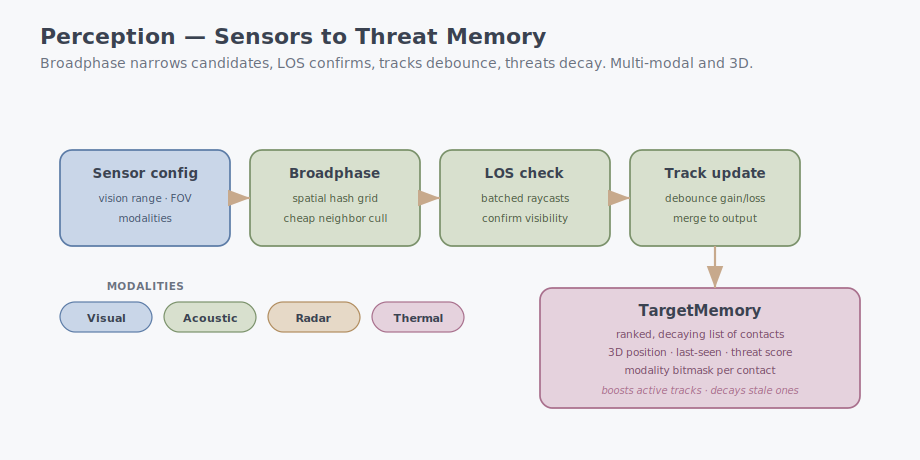

  - The pipeline runs sensor config → broadphase (spatial hash) → LOS check (batched raycasts) → track update (debounced).
  - It is multi-modal: **Visual, Acoustic, Radar, Thermal**.
  - Acoustic detection estimates range with terrain occlusion — an agent can "hear" a contact it can't see.
- Tracks are debounced so contacts don't flicker on the edge of detection.

### 12.3 TargetMemory & threat decay
- Detected contacts live in a ranked, decaying memory.
  - TargetMemory is a fixed-size list sorted by threat score, holding entity IDs, last-known 3D positions, last-seen ticks, threat scores, and modality flags.
  - A threat-evaluation pass continuously boosts actively-tracked contacts and decays stale ones, so attention fades naturally from contacts no longer observed.
  - Positions are true 3D — altitude matters (a contact on a bridge deck is not the same as one on the street below).

### 12.4 EQS — the standing-query model
- EQS works by standing queries rather than blocking polls.

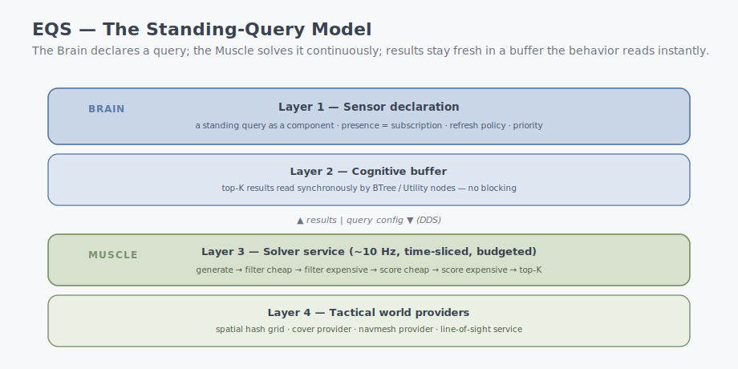

  - The Brain declares a sensor (a query) as a component on the agent — its presence *is* the subscription.
  - The Muscle solves it continuously and feeds ranked results back into a cognitive buffer the behavior reads instantly.
  - Query families: entity (nearest enemies, threat lists, allies), positional (best cover, flanking, retreat), path-aware (reachability, path-cost), and LOS-filtered (cheap single-ray or accurate multi-ray).
- This mirrors the engine's general pattern: cognition declares, physics computes.

### 12.5 How a query is evaluated
- A query is a generator followed by staged tests, ordered cheap-before-expensive.

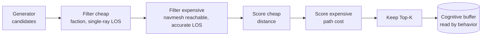
```mermaid
flowchart LR
    G[Generator<br/>candidates] --> FC[Filter cheap<br/>faction, single-ray LOS]
    FC --> FE[Filter expensive<br/>navmesh reachable, accurate LOS]
    FE --> SC[Score cheap<br/>distance]
    SC --> SE[Score expensive<br/>path cost]
    SE --> TK[Keep Top-K]
    TK --> BUF[(Cognitive buffer<br/>read by behavior)]
```

  - Fast rejects (faction, single-ray LOS) run first to discard candidates before any expensive test.
  - Expensive tests (accurate multi-ray LOS, path-cost) run only on survivors, and only the top-K are kept.
- Solving is bounded and time-sliced.
  - It runs on a background thread (~10 Hz) with a per-tick budget on the most expensive operations.
  - Results land in a fixed-size top-K buffer, so cost and memory are predictable.
- Refresh policies trade freshness against traffic: publish on every evaluation, only when the top candidate changes, or only beyond a score threshold.

### 12.6 Shared foundations
- EQS and perception share their heavy machinery.
  - A **spatial hash grid** (5 m cells) gives O(1)-ish neighbor lookups and updates incrementally as entities move.
  - **Async raycasts** are grouped and resolved in parallel (broadphase AABB then narrowphase), with results returned through lock-free ring buffers.
- The same raycast mechanism backs both perception LOS and EQS LOS tests — no blocking, no per-call allocation.

### 12.7 Perception track lifecycle
- A contact moves through detection states, with debouncing and decay built in.

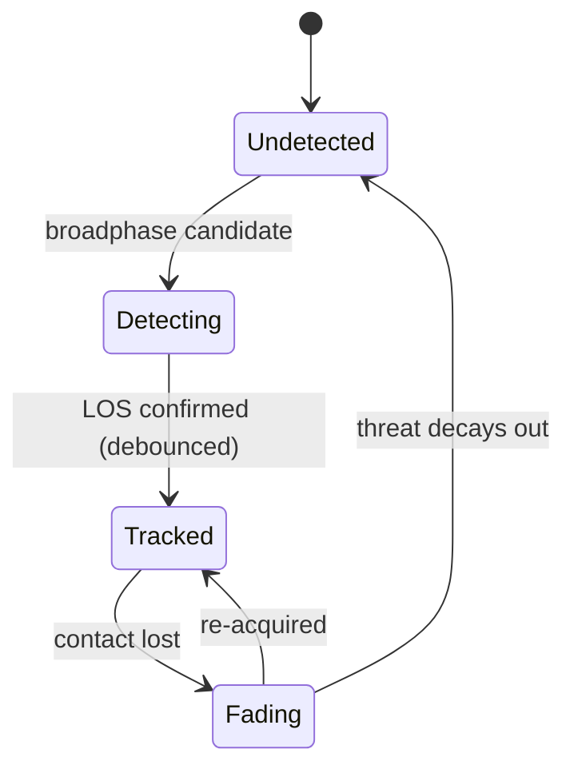
```mermaid
stateDiagram-v2
    [*] --> Undetected
    Undetected --> Detecting: broadphase candidate
    Detecting --> Tracked: LOS confirmed (debounced)
    Tracked --> Fading: contact lost
    Fading --> Tracked: re-acquired
    Fading --> Undetected: threat decays out
```

### 12.8 Squad-shared awareness
- Individual pictures merge into a shared one.
  - Members' TargetMemories combine into shared situational awareness, deduplicated by entity ID, keeping the highest threat and most-recent 3D position.
  - A member can then act on a threat a squadmate sees but it cannot — enabling coordinated reaction.

---

## 13. Brain-Side Actuation

### 13.1 The principle
- The AI never mutates physical state directly; it expresses intent and the Muscle executes.
  - This keeps cognition portable (it can run remotely or on a background thread).
  - It also makes every action observable, replayable, and cleanly preemptable.

### 13.2 The channel pattern
- AI writes commands into channels — think of them as "hardware registers for the entity's muscles."

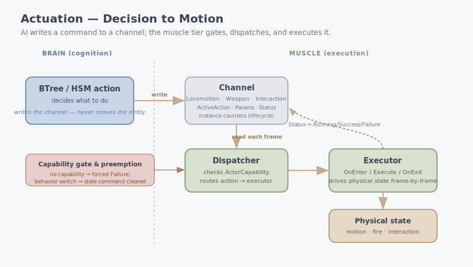

  - Core channels are Locomotion, Weapon, and Interaction (plus Animation and LookAt for characters).
  - Each channel carries the active action ID, parameters, a status (Running / Success / Failure), and instance counters for lifecycle tracking.
- Execution is gated and routed each frame.
  - A **dispatcher** matches active commands against the entity's capability state; if a capability is missing (e.g. engine damaged), it forces the channel to Failure instead of executing.
  - Valid commands are routed to a registered **executor** that drives the action frame-by-frame and reports completion or failure back through the channel.
- Preemption prevents "zombie" actions.
  - A behavior switch bumps an instance counter; an arbitration pass detects stale channels, fires the outgoing executor's clean-up (OnExit), and resets the channel.
  - For authored AI, this clean-up is generated automatically, so authors can't forget it.

### 13.3 Navigation & path planning (Brain side)
- Navigation uses a command/status split, with the heavy work on the Muscle.

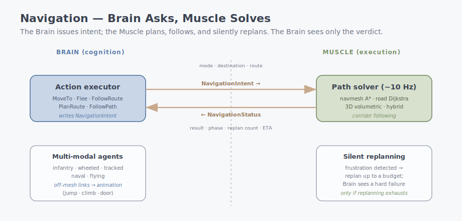

  - The Brain writes **NavigationIntent** (mode, destination/route, flags); the Muscle returns **NavigationStatus** (result, phase, replan count, ETA).
  - The Brain stays out of the kinematics loop — it asks for a destination and watches the verdict.
- The solver is multi-modal and runs on the Muscle.
  - One solver picks a backend per request by the agent's mobility profile: navmesh A* (infantry), road-graph Dijkstra (vehicles), 3D volumetric (flying), or hybrid.
  - It runs time-sliced on a background thread (~10 Hz) with a per-tick request budget, so pathfinding never stalls the main loop.
  - Supported agent kinds: infantry, wheeled, tracked, naval surface, flying.
- Replanning is silent up to a limit.
  - The Muscle tracks progress and detects "frustration" (stuck — near-zero speed for a sustained window), then replans within a budget.
  - The Brain only sees a hard failure if replanning exhausts; otherwise it just notices the replan counter tick up.
  - Off-mesh links (jump, climb, door) along a route trigger the animation seam.

### 13.4 Locomotion execution
- Locomotion commands become actual motion on the Muscle.
  - Locomotion actions (move-to, flee, follow-route, join-formation) are written to the Locomotion channel and consumed by the kinematics tier.
  - The Brain chooses where and how fast; the Muscle integrates the motion and publishes the authoritative position that ghosts and the renderer follow.
- Ground vehicles use a bicycle-model kinematics with pure-pursuit steering and trajectory following; formations and road-graph routing are first-class.

### 13.5 Animation control
- For character entities, animation is authored as intent, the same as movement.
  - An Animation channel plays/stops/queues montages; a LookAt channel aims at a point or entity; a stance intent sets posture.
  - These are replicated Brain → Muscle; the Muscle runs the actual animation backend.
- The Muscle's per-tick animation pipeline is explicit.
  - Check capability (lost capability → force-stop + Failure) → dispatch new montage/look-at actions (OnEnter/OnExit) → drive stance transitions → advance the montage queue → tick the backend → drain notifies (footsteps, hit-windows) → synthesize completion events → write status.
- Montages are engine-agnostic.
  - They're referenced by a stable hash-based ID, not an engine-specific handle, with up to 8 concurrent playback slots and canonical notify categories.
  - Off-mesh link traversal is the bridge point where navigation and animation stay coherent.

### 13.6 Interaction control
- Discrete world/entity interactions go through their own channel.
  - The Interaction channel handles actions like ejecting passengers or opening a door.
  - It uses the same dispatcher/executor/capability model as the other channels, which keeps lifecycle and preemption uniform.
- Passenger/mount handling lives here.
  - Embark/disembark is handled through interaction actions plus passenger components, so transported infantry and their carrier stay consistent.

### 13.7 Weapon control
- The Brain decides whether and what to fire; the Muscle resolves the physics.
  - The Brain (via Utility AI threat-ranking and weapon-selection) writes an aim-and-fire command to the Weapon channel.
  - The Muscle resolves ballistics, runs the weapon-fire pipeline, and applies damage; effects propagate to the renderer.

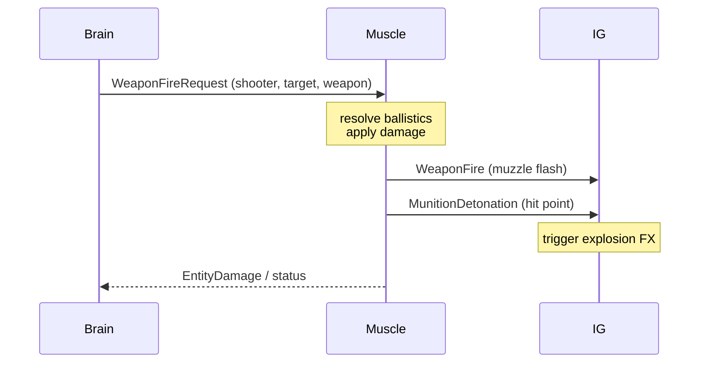
```mermaid
sequenceDiagram
    participant Brain
    participant Muscle
    participant IG
    Brain->>Muscle: WeaponFireRequest (shooter, target, weapon)
    Note over Muscle: resolve ballistics<br/>apply damage
    Muscle->>IG: WeaponFire (muzzle flash)
    Muscle->>IG: MunitionDetonation (hit point)
    Note over IG: trigger explosion FX
    Muscle-->>Brain: EntityDamage / status
```

- Weapon-channel preemption matters most here.
  - The classic bug a naive system has: an entity leaves a firing state but the weapon channel still holds "aim and fire," so it keeps shooting.
  - The channel arbitration and auto-generated clean-up sever the physical fire command the moment the behavior changes.

### 13.8 Executor lifecycle (any channel)
- All channels share one executor state model.

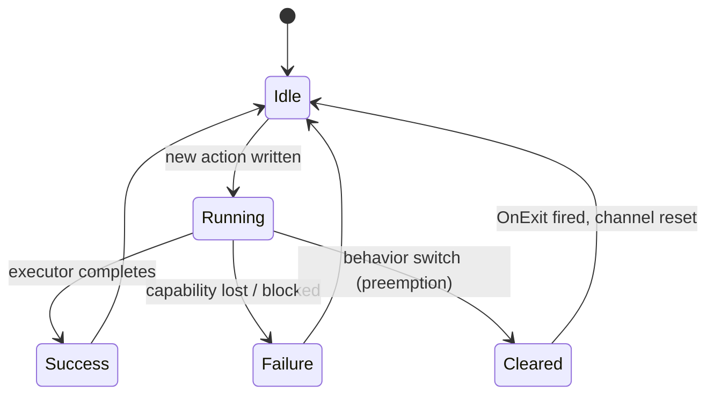
```mermaid
stateDiagram-v2
    [*] --> Idle
    Idle --> Running: new action written
    Running --> Success: executor completes
    Running --> Failure: capability lost / blocked
    Running --> Cleared: behavior switch (preemption)
    Cleared --> Idle: OnExit fired, channel reset
    Success --> Idle
    Failure --> Idle
```

---

## 14. Distributed Simulation Mechanics

### 14.1 One entity, split across nodes
- An entity is not a single network object; it is a set of descriptor topics.

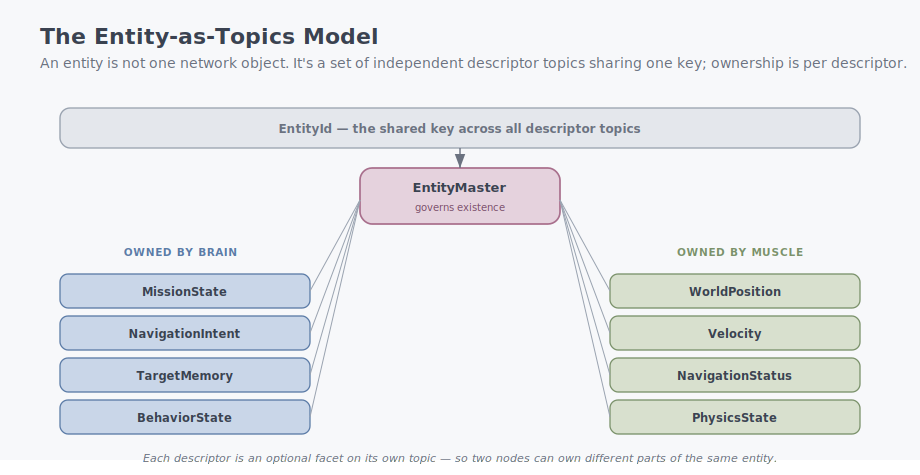

  - The descriptor topics share one **EntityId** key.
  - A single **EntityMaster** topic governs existence; every other descriptor (position, mission, weapon state…) is an optional facet on its own topic.
  - Ownership is granular per descriptor — the Brain owns cognitive descriptors, the Muscle owns physics descriptors, on the same entity.
- The high-level "split ownership, ghosts, QoS, time" picture:

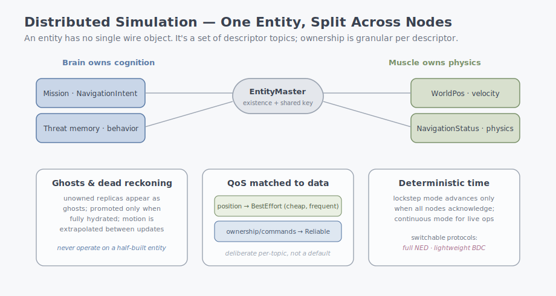

### 14.2 Ghosts & dead reckoning
- Replicas of unowned entities are handled carefully so systems never see them half-built.
  - A node hearing about an entity it doesn't own creates a **ghost** (a local proxy).
  - The ghost isn't activated until all mandatory components have arrived, so systems never operate on a partially-hydrated replica.
  - Between position updates, the receiving node extrapolates motion (**dead reckoning**) so movement looks smooth despite infrequent updates.

### 14.3 QoS matched to data
- DDS lets each topic pick its own delivery guarantee, and HROT sets this deliberately per topic.

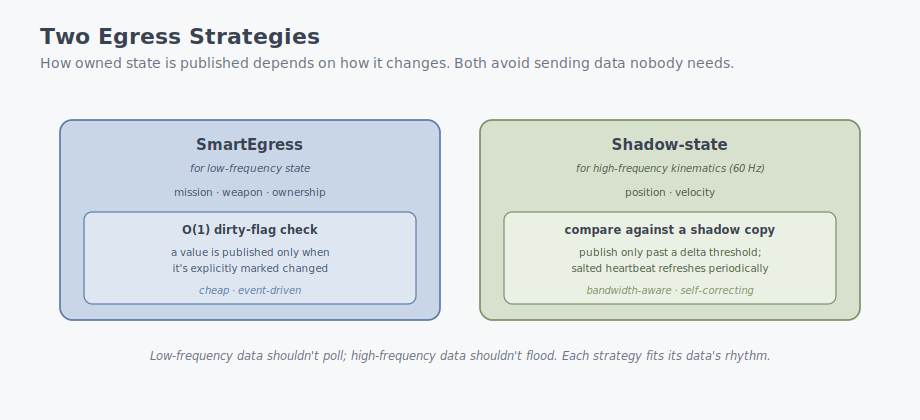

  - The trade-off being managed is reliability vs. bandwidth/latency: guaranteed delivery costs retransmissions, which is wasteful for data that's about to be replaced.
- Fast-changing kinematic data (position, velocity) → **BestEffort**.
  - A dropped sample just means one frame of slightly stale position.
  - The next update (one frame later at 60 Hz) supersedes it, so retransmitting a lost sample would deliver already-obsolete data.
  - Dead reckoning covers the gap, so the visual result stays smooth.
- Critical, infrequent data (existence, ownership changes, commands) → **Reliable**.
  - These must never be lost — missing an "entity destroyed" or an ownership handover would desync that node's world.
  - Often also **TransientLocal**, so the topic retains its latest value and a late-joining node immediately receives current state.
- How owned state is *published* also depends on its rhythm (two egress strategies).
  - **SmartEgress** — for low-frequency state (mission, weapon, ownership): an O(1) dirty-flag check publishes a value only when it's explicitly marked changed.
  - **Shadow-state** — for 60 Hz kinematics: compare against a shadow copy, publish only past a delta threshold, with a salted heartbeat that refreshes periodically.

### 14.4 Deterministic vs continuous time
- Time runs in one of two modes, chosen for the situation.
  - **Deterministic (lockstep)** — a frame advances only when all nodes acknowledge, giving exact reproducibility; this is the basis for trustworthy AAR.
  - **Continuous** — smoothed real-time execution for live operation.
- Determinism is enforced at the source of time.
  - Master/slave sync controllers coordinate advancement.
  - Every system reads a global time singleton, never the wall clock — including the recorder.

### 14.5 Network-agnostic protocols
- The transport is switchable behind a single interface.
  - **NED** — the full production protocol (mission control, navigation, perception, weapons, EQS, orchestration…).
  - **BDC** — a lightweight protocol for minimal federation or simple tracking.
- Higher-level code is unaware which is in use, so swapping protocols doesn't ripple upward.

---

## 15. Cluster Orchestration

### 15.1 The control plane
- Orchestration is a separate concern from the per-frame simulation traffic.

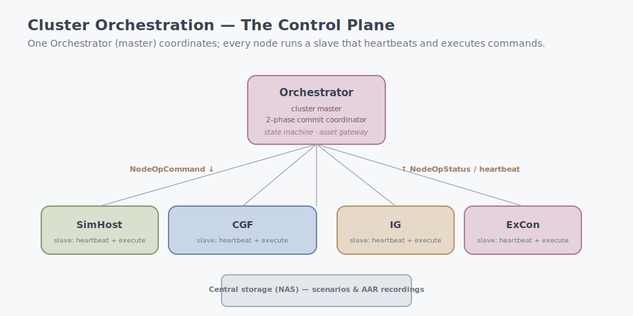

  - The **data plane** is the per-frame simulation traffic between nodes (positions, intents, fire).
  - The **control plane** is orchestration: changing cluster state, loading scenarios, taking checkpoints, collecting diagnostics.
- One Orchestrator coordinates; every other node runs a lightweight slave.
  - The Orchestrator is the cluster master and coordinator.
  - Each slave publishes a heartbeat and executes orchestration commands routed to it.

### 15.2 The cluster state machine
- The cluster moves between well-defined states, and transitions are planned, not arbitrary.
  - States include Idle, Loading (Edit/Live/Replay), and Operating (Edit/Live/Replay), plus preview and unload states.
  - A planner computes the shortest valid path between current and target state over a defined transition graph.
  - Failure-recovery edges roll back automatically; an unresponsive mandatory node drops the cluster into a system-imposed **Degraded** state.

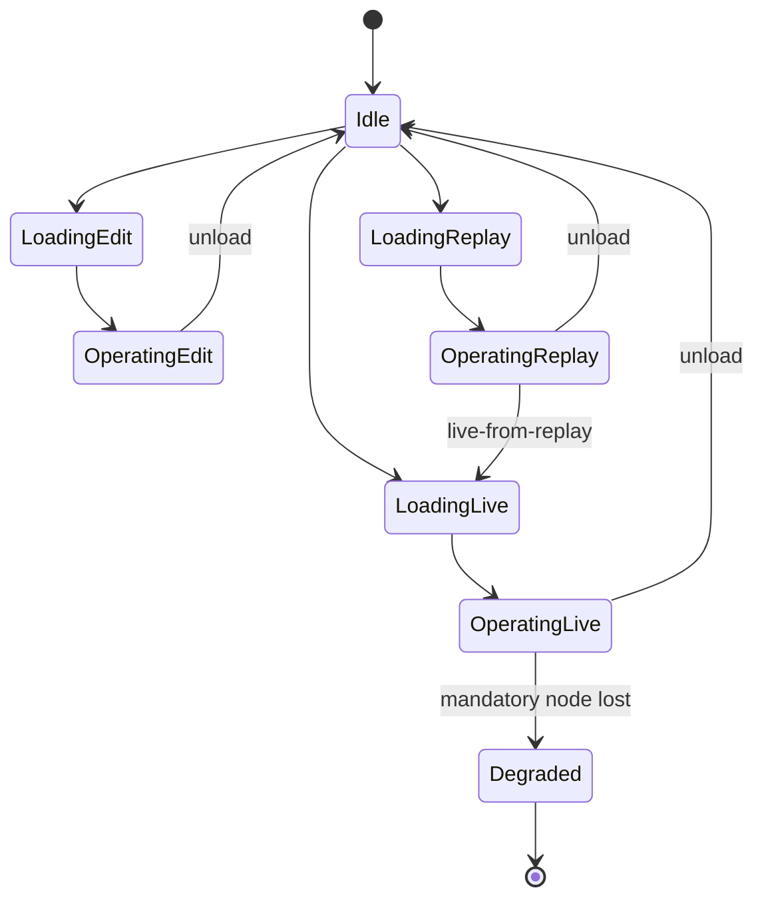
```mermaid
stateDiagram-v2
    [*] --> Idle
    Idle --> LoadingEdit
    Idle --> LoadingLive
    Idle --> LoadingReplay
    LoadingEdit --> OperatingEdit
    LoadingLive --> OperatingLive
    LoadingReplay --> OperatingReplay
    OperatingReplay --> LoadingLive: live-from-replay
    OperatingEdit --> Idle: unload
    OperatingLive --> Idle: unload
    OperatingReplay --> Idle: unload
    OperatingLive --> Degraded: mandatory node lost
    Degraded --> [*]
```

### 15.3 Two-phase commit — why
- State changes must apply on the same frame across every node, without any node stalling the 60 Hz loop.
  - A scenario load involves reading/parsing assets, allocating IDs, and staging entities — slow work.
  - Doing it inline would stall the sim; doing it unsynchronized would desync nodes.
  - Two-phase commit moves the slow work off the critical path and guarantees a synchronized, all-or-nothing switch.

### 15.4 Two-phase commit — how
- The protocol has two rounds with a synchronization point between them.

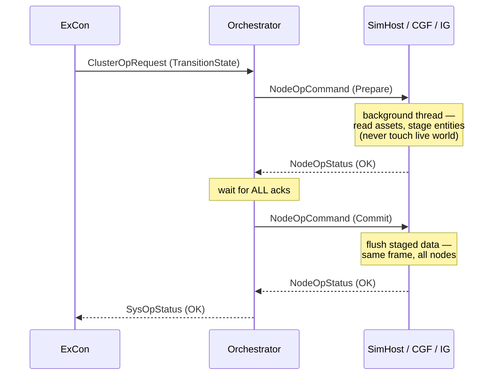
```mermaid
sequenceDiagram
    participant ExCon
    participant Orchestrator
    participant Nodes as SimHost / CGF / IG
    ExCon->>Orchestrator: ClusterOpRequest (TransitionState)
    Orchestrator->>Nodes: NodeOpCommand (Prepare)
    Note over Nodes: background thread —<br/>read assets, stage entities<br/>(never touch live world)
    Nodes-->>Orchestrator: NodeOpStatus (OK)
    Note over Orchestrator: wait for ALL acks
    Orchestrator->>Nodes: NodeOpCommand (Commit)
    Note over Nodes: flush staged data —<br/>same frame, all nodes
    Nodes-->>Orchestrator: NodeOpStatus (OK)
    Orchestrator-->>ExCon: SysOpStatus (OK)
```

  - **Phase 1 — Prepare.** Each node does the heavy lifting on a background thread (read/parse assets, pre-allocate IDs, stage entities) and never touches the live world, then acknowledges.
  - **Synchronization point.** The Orchestrator waits for acknowledgements from all expected nodes.
  - **Phase 2 — Commit.** Once all are ready, the Orchestrator broadcasts commit and each node flushes its pre-staged data into the live world instantly, on the same frame.
- The protocol is robust to failure and to a lossy network.
  - If any node fails to prepare, the transaction aborts and rolls back — no partial application.
  - Deliveries are deduplicated by a compound transaction/operation key, so prepare and commit each execute exactly once even if a message arrives twice.
  - Commands are keyed by target node ID, with a client-side filter so only the addressed node acts.

### 15.5 What orchestration coordinates
- The control plane covers far more than state transitions.
  - Save scenario, load zone/terrain, take/collect checkpoints, export/import archives, manage/replay episodes, replay seek, pause/resume/step, set time scale, prefetch assets, cancel operation, collect diagnostics.
- Time control is itself orchestrated, so the whole cluster changes time behavior coherently rather than node by node.

### 15.6 Central storage & assets
- Assets and recordings live centrally, with the Orchestrator as gateway.
  - Scenarios and AAR recordings live in central (NAS) storage; the Orchestrator coordinates archive-to and restore-from across the cluster.
  - Asset inventories are broadcast so every node and the operator console share one view.
  - Scenario assets can be prefetched across nodes ahead of a transition, so the eventual prepare/commit is fast.

### 15.7 Monitoring & failure handling
- The cluster is observable, and failure is explicit rather than silent.
  - Every node publishes a heartbeat (~1 Hz) with health metrics; the operator console shows cluster state and per-node status.
  - On heartbeat timeout for a mandatory node, the Orchestrator evicts it, raises a visible error, and moves the cluster to Degraded.
  - A single cluster-wide diagnostics operation collects logs and data snapshots from every node at once.
- The net effect: losing a node doesn't hang the cluster — it produces a clear, recoverable Degraded state.

---

## Appendix — Verify Before External Presentation

- **MCP** topology caveat (editor-only) — confirm the framing is current.
- **Scale** — current agent counts vs. the 10k+ native-stage target.
- **Navigation** — real DotRecast/dtCrowd backends are deferred (fake backends at parity today).
- **TKB** — there is no visual TKB editor today (templates are authored as JSON).
- **Deployment** — central storage paths / topology specifics may be sensitive externally.
- **Protocols** — QoS specifics and NED vs BDC capability claims if shown to an integrator.
- **Overlays / recordings** — confirm trace/overlay/recording artifacts are cleared for external display.
