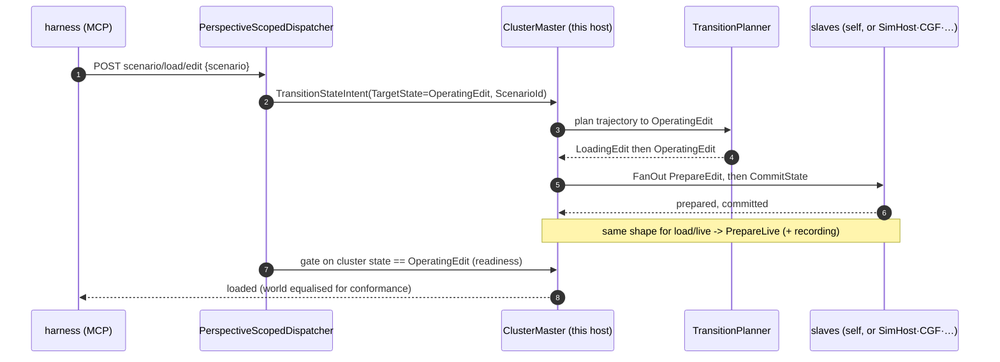
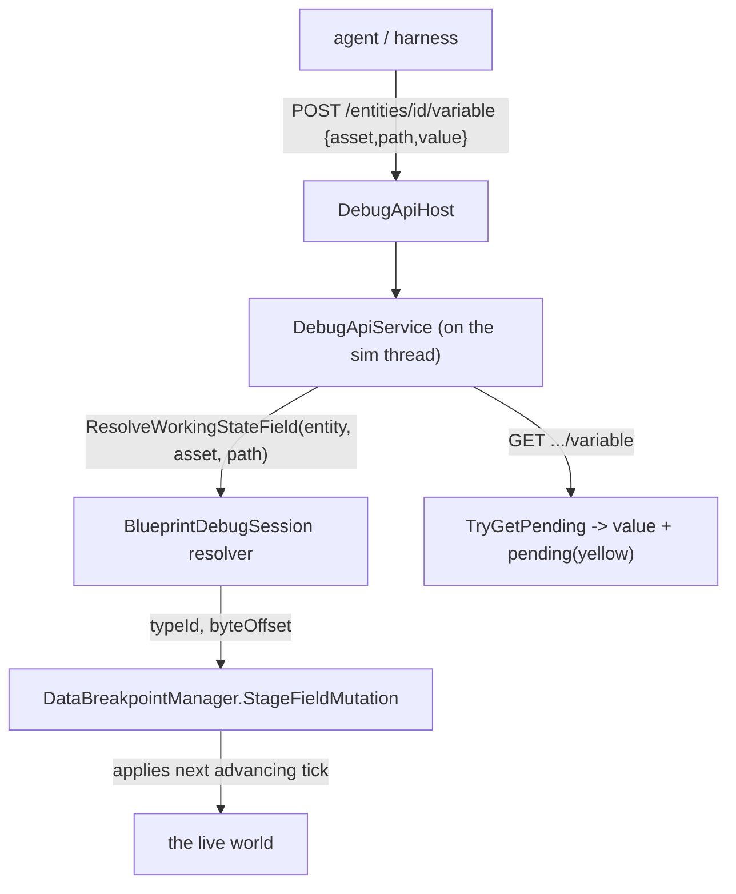
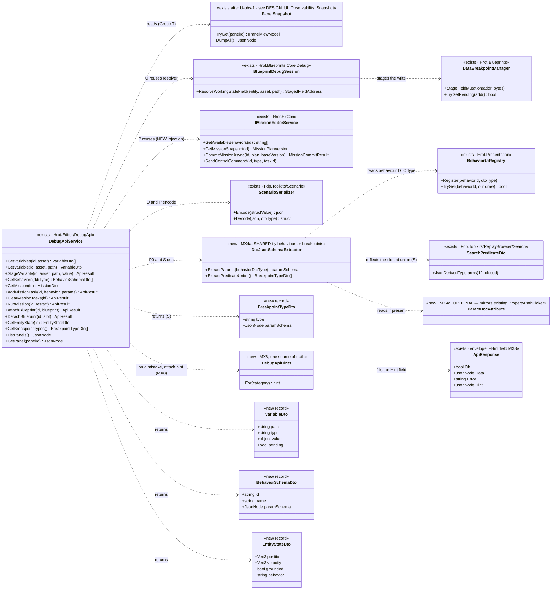
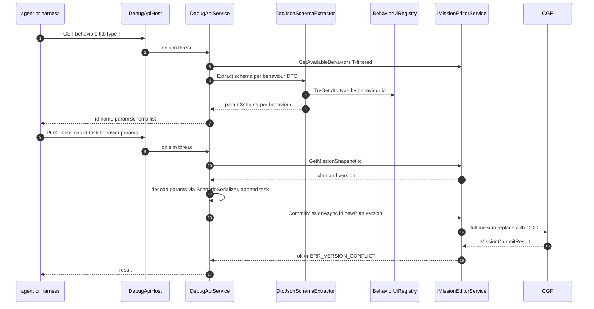

<!--STATUS
state: LIVE
build-state: BUILT (integration §A–N; SLICE ① = MX4a+MX7+MX8+MX5+MX6, Batch HN-120; SLICE ② = MX1
  Group O, Batch HN-121; SLICE ③ = MX9 Group T + MX2 Group Q + MX3 Group R + the breakpoint resume,
  Batch HN-122) │ READY-TO-BUILD (MX4b, once MX-002's namespace ambiguity is resolved)
updated: 2026-08-22
current-answer: three parts. (1) The AI-debug API + MCP server is PORTED, WIRED, VERIFIED end-to-end on
  headless Linux (§ up to Notes). (2) The MCP EXTENSIONS design (Groups O–R). (3) ⭐ §"AS-BUILT — SLICE ①"
  §"AS-BUILT — SLICE ②" and §"AS-BUILT — SLICE ③" at the END are the CURRENT truth where they differ
  from §"Group O"/§"Group Q"/§"Group R"/§"Group T"/§"UML" — read them before quoting a seam.
stale-below: nothing — the extensions section supersedes the earlier "mission intent bus" phrasing in place (see §"UML").
known-rot: §"Group Q" says the runtime hot-attach mechanism "already exists; just expose it" — ⛔ the
  CONSUMER did, but nothing registered its events on the editor's bus, so no caller could publish one
  (MX-008). · §"Group R" lists a "grounded" field with no component to read it from (MX-007). ·
  §"Group T" does not mention that the snapshot has no frame boundary (MX-006). · §"Group O" says
  DebugApiService "already holds _blueprintSession". ⛔ MEASURED FALSE — the
  PARAMETER existed; the composition root never passed it, so every Group O call refused. See
  §"AS-BUILT — SLICE ②". · §"Group P.0" and §"UML" say MX4a REUSES `BehaviorUiRegistry` for behaviourId→DTO. ⛔ MEASURED FALSE —
  that registry stores only ImGui DRAW DELEGATES and never retains the DTO type. The real seam is
  `BehaviorRegistry.BehaviorDefinition.ParamsDtoType`. §"AS-BUILT — SLICE ①" carries the correction.
  §"UML" also draws IMissionEditorService as `<<exists · Hrot.ExCon>>`; the editor path implements a
  DIFFERENT same-named interface (`Hrot.UI.Common.Facades`) — see AS-BUILT.
known-conflict: none.
-->
# AI-debug API + MCP server — integration status

Porting `origin/feat/ai-debug-api` (@ `d7b2a6e12`) onto the coordinator branch. It's a **port, not a
merge** — the branch has disjoint history from trunk (see `docs/UX/MCP_PORT_PLAN.md`). This file tracks
what landed and what remains.

## What it is

A loopback HTTP control plane for AI-driven testing/automation:
```
agent ──stdio──▶ tools/ai-debug-mcp (Node, 49 tools) ──HTTP──▶ DebugApiHost (localhost) ──▶ DebugApiService ──▶ the editor
```
Endpoints: `load_scenario` · `spawn_entity` · `play`/`pause`/`step` · `enter_preview` · `checkpoint`/
`restore_checkpoint` · `diff_state` · `focus_entity` · `send_entity_command` · behavior traces · live
mutation / fault injection.

## Landed (builds clean)

| piece | where |
|---|---|
| Production DebugApi | `Hrot/Subsystems/Hrot.Editor/DebugApi/` (`DebugApiService` 2140 ln, `DebugApiHost`, `MainThreadJobQueue`, `EditorAiTracerCoordinator`, `DebugApiSafeFloatConverters`) |
| Shared diagnostics helpers | `FDP/Toolkits/Fdp.Toolkits/Diagnostics/{EventSerializationHelper,JsonShapeDescriber}.cs` |
| Node MCP server | `tools/ai-debug-mcp/` (17 files, outside the .sln — a Node toolchain dependency only) |
| Design corpus | `.dev/ai-debug-api/` (52 docs) |
| `EventSerializationHelperTests` | kept compiled (harness-free) |

### Three shared-file reconciliations (ADA-era additions the trunk lacked)

| drift | fix |
|---|---|
| `OrchestrationConstants.DefaultStagingDirectory` (removed on trunk) | → `ResolveStagingRoot()` in `DebugApiService` |
| `IGeographicTransform.Origin` (getter added by ADA) | added as a **default interface member** (0,0,0), overridden in `WGS84Transform` (degrees) — 12 test doubles untouched |
| `FdpEventBus.GetRegisteredManagedEventTypes()` (method added by ADA) | added; trunk's `ManagedEventStream<T>` already implements `IManagedEventStreamInfo`, so the body ports verbatim |

## Remaining

### ✅ Wiring — DONE

`EditorSubsystem` constructs the `DebugApiHost` + `DebugApiService` after the preview controller, and pumps
its `MainThreadJobQueue` once per frame in `Update`. **Enabled by setting `HROT_DEBUG_API_PORT`** to a port;
off (zero cost) otherwise. Two collaborators were adapted: `EditorApplication.CurrentClusterState` was
exposed (getter added over the existing field); `editorTracer` and `rrController` are omitted (see
DEBT-MCP-002 / no `EcsRecordReplayController` in this root), degrading only the behavior-trace and
record/replay endpoints.

### ✅ End-to-end verification — DONE (2026-08-22)

Ran `HROT_DEBUG_API_PORT=8137 xvfb-run … dotnet Hrot.ClusterRunner.dll --mode editor`; the loopback API came
up in ~3s and answered:
```
GET /status    → clusterState:"Idle", simTime:0, isPaused:true, entityCount:0
GET /scenarios → ["hill-attack","test-fire","test-move"]   (also proves the curated-scenario seeding)
GET /sim/state → isPaused:true, inPreview:false
GET /entities  → []
```

### ✅ Behavior-trace tracer + record/replay — WIRED and VERIFIED (2026-08-22)

- **`DEBT-MCP-002` was a NAME COLLISION, not a duplicate implementation.** Trunk's
  `Hrot.Editor.Debug.EditorAiTracerCoordinator` does *time control* (pause/step); the ported
  `Hrot.Editor.DebugApi.EditorAiTracerCoordinator` does *behavior-trace arming* (`ArmEntity`/`DisarmEntity`,
  self-contained on the world). They are different concepts — **both are kept**; the DebugApi one is now
  constructed and passed as `editorTracer`. *(A rename to disambiguate would be nice-to-have polish.)*
- **`EcsRecordReplayController` already exists on trunk** (`Hrot.SimHost/Modules/Orchestration/`) — it was
  never *instantiated* in the editor root, not missing. Now constructed dedicated to the API
  (`new EcsRecordReplayController(_kernel, EditorNodeId, _world)`) and passed as `rrController`.

**End-to-end verification (headless, `FDP_STAGING_ROOT=/tmp/…`):** `load_scenario` → `recording/start`
(entered preview, began writing) → `sim/play` → `recording/stop` wrote a real **48-frame `.fdp`** →
`replay/load` (loaded, `totalFrames:48`) → `replay/status` (active) → `replay/step` (advanced frames);
`trace/observe` responded (tracer live); `entities` returned a live `M2 Bradley IFV` with its components.
⚠ Recording needs a POSIX `FDP_STAGING_ROOT` on Linux — the default `C:\FDP_Temp` is a Windows path.

### Follow-ups

| item | status |
|---|---|
| **`DEBT-MCP-001` — the 15 harness-dependent integration tests** | ⛔ **DEFERRED, excluded from the build**. They call `EditorHarness.BuildDebugApiService(...)`, needing 9 collaborators trunk's diverged `EditorHarness` lacks (all of which now exist in `EditorSubsystem`, so reviving them is a harness-build mirror of the production wiring). ⭐ **Recommendation:** prefer a small NEW set of end-to-end HTTP smoke tests (drive the real API headless, as above) as the primary gate; selectively revive the original unit tests only for tricky semantics (checkpoint/diff, fault injection). |
| **`DEBT-MCP-003` — rename the ported tracer** | optional: `Hrot.Editor.DebugApi.EditorAiTracerCoordinator` → e.g. `BehaviorTraceCoordinator`, to kill the name collision with the time-control tracer. |

## Notes

- The Node server is deliberately outside `IOS-IG-SimHost.sln`; it adds a Node dependency, no C# build coupling.
- Once wired, the API becomes a second consumer of the editor's internals (co-owned surface).

---

# MCP EXTENSIONS — design (scenario verification + authoring)

> **Status: DESIGN, 2026-08-22 — proposed, open to discussion.** Extends the original endpoint families
> (`.dev/ai-debug-api/DESIGN.md` Groups A–N) with new groups so an agent (and the C# harness,
> `DESIGN_MCP_System_Test_Harness.md`) can *check a scenario runs as expected* and *author* the things that
> drive it. Groups O–R below. Each says what it reuses and whether it is buildable now or needs new engine
> surface.

## Why / what's already there

Verifying "is the scenario running as expected?" is mostly covered **today**: entity state (`GET /entities`,
`/entities/{id}`), event-bus history (`GET /events`), state diffing (`/diff/*`, `/checkpoint`), breakpoints +
hits. The gaps are **(a) variables in the WATCH vocabulary** (not raw components), **(b) mission authoring**,
and **(c) blueprint hot-attach** — the three the user named.

## Group O — Variable addressing (full watch parity) — ⭐ **buildable now, reuses our staged-write seam**

🔒 **User:** *"MCP definitely needs full variable addressing same as the watch is using."*
⇒ address a variable by the **same tuple the watch row uses: `(assetId, variablePath, entity)`** — not raw
component/offset. This is the SAME resolver the staged-write yellow already uses:
`IBlueprintDebugSession.ResolveWorkingStateField(entity, assetId, variablePath)` →
`StageFieldMutation`/`TryGetPending`. `DebugApiService` already holds `_blueprintSession` + `bpManager`.

| endpoint | does |
|---|---|
| `GET /entities/{id}/variables?asset=<assetId>` | list the entity's blueprint variables (name, type, current value) |
| `GET /entities/{id}/variable?asset=&path=` | read one variable by name **+ its pending/staged state** *(the yellow)* |
| `POST /entities/{id}/variable` `{asset,path,value}` | **stage** a write via the same path the watch/Details editor uses ⇒ applies at the next tick, shows pending until then |

⭐ **This IS "the watch, over HTTP."** It does NOT need the watch UI (pinning/grouping) — only the resolver.

## Group P — Mission editing — ⚠ **partly new engine surface; DISCUSS**

🔒 **User:** *"building/editing missions … add a new mission task with all the behavior specs/parameters,
clear tasks to allow adding tasks, run/restart mission."* ⭐ Missions are the *proper* way behaviors attach to
entities (as tasks). `IMissionEditorService` *(Hrot.ExCon)* already has **read**: `GetMissionSnapshot(entityId)`
→ `(MissionPlan?, Version)`, `GetAvailableBehaviors(entityId)`, and `SendControlCommand(...)`.

### ⭐⭐⭐ P.0 — behaviour DISCOVERY WITH SCHEMA *(the load-bearing piece — user, 2026-08-22)*

🔒 **User:** *"an endpoint listing available behaviors (those shown in the mission task combo), each with the
schema of its parameter json (extracted from the param DTO structure) … entity TKB type might limit behaviors
so the query should include entity TKB type. AI model will then know exactly what is available."*

| endpoint | does |
|---|---|
| `GET /behaviors?tkbType=<entityTkbType>` | the behaviours **valid for that entity TKB type** *(same list the mission-task combo shows)*, each with **`{ id, name, paramSchema }`** where `paramSchema` is the JSON schema of the behaviour's **param DTO**. ⇒ **the agent knows exactly what it can author and how to shape the params.** |

⭐⭐⭐ **PRIOR ART — the param-DTO walk ALREADY EXISTS** *(measured 2026-08-22, obligation ②)*. The mission
editor panel already renders every behaviour's params generically from its param DTO, via
**`BehaviorUiRegistry`** *(behaviourId → DTO type; `Hrot.Presentation/Behavior/BehaviorUiCompiler.cs`)*,
auto-populated by **`BehaviorSchemaDiscovery.AutoRegister`** *(same file dir)*, and **`BehaviorUiCompiler.Compile<TDto>()`**
which walks the DTO's public properties handling `float`/`double`/`int`/`long`/`bool`/`PickableGeoPoint` plus the
`[RemapNetworkId]`/`[MapPickableEntity]`/`[MapPickableWorldLocation]` attributes. ⇒ ⭐⭐ **`MX4a` REUSES this
registry** — it is *not* a from-scratch reflection pass: given `tkbType`, take the valid behaviour ids
*(`IMissionEditorService.GetAvailableBehaviors`, already TKB-filtered)*, look up each DTO type in the registry,
and emit `paramSchema` from the same property walk. ⭐ **`[ParamDoc("…")]`/range/units attributes are an OPTIONAL
enrichment** *(descriptions the walk cannot infer)*, not the core — the base schema (field name + type + pickable
kind) is derivable from what the panel already reads. ⭐ Value/param encoding reuses the **`ScenarioSerializer`**
*(`Fdp.Toolkits/Scenario/ScenarioSerializer.cs`; structs + customization — decision 3)*, so the schema the agent
sees and the bytes the engine reads are the same mechanism.

### P.1 — read / edit / run

| endpoint | does | status |
|---|---|---|
| `GET /missions/{id}` | the entity's mission plan (tasks + specs) + its **OCC version** | ✅ `GetMissionSnapshot` → `(MissionPlan?, long Version)` |
| `POST /missions/{id}/task` `{behavior, params}` | **add a mission task** — `params` is JSON per P.0's schema, decoded by `ScenarioSerializer` | ⭐ **read-modify-commit**: snapshot → append task → `CommitMissionAsync(id, newPlan, version)` |
| `DELETE /missions/{id}/tasks` | **clear tasks** (to re-add) | ⭐ snapshot → empty/trim plan → `CommitMissionAsync` |
| `POST /missions/{id}/run` `{restart?}` | **run / restart** the mission | `SendControlCommand(id, eMissionCommandType, taskId)` |

⭐⭐⭐ **The real write seam is `IMissionEditorService.CommitMissionAsync(entityId, newPlan, baseVersion)`**
*(`Hrot.ExCon/Services/IMissionEditorService.cs`)* — a **full-mission-replace with optimistic concurrency**: the
caller passes the `Version` it read from `GetMissionSnapshot`, and the CGF rejects with `ERR_VERSION_CONFLICT` if
it moved. ⇒ *"add a task"* = **snapshot → append → commit**; *"clear tasks"* = **commit a trimmed plan**;
*"run/restart"* = `SendControlCommand`. ⭐⭐ This **IS** decision 2's *"the one path the editor's Mission panel
uses"* — the panel commits through this same service; there is **no separate intent bus** to reuse, and no parallel
API to build. ⚠ **Supersedes the earlier "mission intent bus" phrasing** *(decision 2 intent is preserved:
reuse the panel's path)*. Params encode via `ScenarioSerializer`; the AI discovers the param shape via **P.0**.

## Group Q — Blueprint hot-attach — ⭐ **mechanism EXISTS, just expose it**

🔒 **User:** *"hot attaching blueprints to running entities (easy way of trying many blueprints at runtime)"* —
the quick-experiment path (vs the proper mission path P). 📐 The runtime mechanism already exists:
`AttachInstanceBlueprintEvent` *(id 9100)* / `AssignBehaviorEvent` + `BlueprintLifecycleLibrary.AttachInstanceBlueprint`.

| endpoint | does |
|---|---|
| `POST /entities/{id}/attach-blueprint` `{blueprint}` | publish an attach event ⇒ the entity runs that blueprint now |
| `POST /entities/{id}/detach-blueprint` `{slot?}` | detach |

## Group R — Entity state dump (convenience) — ⭐ **thin**

`GET /entities/{id}/state` → the well-known fields parsed out *(position from `SimTransform`, orientation,
`SimVelocity`, grounded, current behavior)* so an assertion reads `state.position.x` rather than digging the
component JSON. A convenience over `GET /entities/{id}`.

## Group S — Breakpoint-type discovery — ⭐⭐ **set/list/remove ALREADY EXIST (Group G); only DISCOVERY is missing**

🔒 **User:** *"do we support setting data breakpoints? they have a sophisticated UI to define the condition, so
it might be needed to provide available breakpoint types and the schemas for their params to the MCP on demand."*

📐 **Measured — Group G is already built** *(`DebugApiService`, `IDataBreakpointManager`)*:

| endpoint | does | status |
|---|---|---|
| `POST /breakpoints` `{condition, filterEntity?, occurrenceThreshold?, name?}` | register a data breakpoint; `condition` is a polymorphic **`SearchPredicateDto`** | ✅ built |
| `GET /breakpoints` | list all, each with a human `conditionSummary` *(`BreakpointConditionSummarizer.Summarize`)* | ✅ built |
| `DELETE /breakpoints/{id}` · `GET /breakpoints/hits` | remove · pause-state + last-hit *(fed by `OnBreakpointHit`)* | ✅ built |

⛔ **The gap is exactly the P.0 gap, for conditions:** the agent must author a `SearchPredicateDto` **blind** —
nothing tells it which condition types exist or their param shapes.

### INVENTORY — the condition union is CLOSED and self-declaring *(measured 2026-08-22)*

📐 `SearchPredicateDto` *(`Fdp.Toolkits/ReplayBrowser/Search/SearchPredicateDto.cs`)* is
`[JsonPolymorphic($type)]` with **12 registered `[JsonDerivedType]` arms** — the complete set, by construction:
`Compound` · `PropertyMatch` · `Numeric` · `String` · `TransientEvent` · `Lifecycle` · `SpatialBounding` ·
`Structural` · `BehaviorParam` · `TraceBufferScan` · `BlueprintVariable` · `ExternalHitTag`. ⚠ `EnumPredicateDto<TEnum>`
is intentionally **not** registered *(generic — use `String`/a concrete arm)*. Params are plain STJ properties
*(`double`/`string`/`bool`/`Guid`/`SearchOperator` enum / nested `SearchPredicateDto`)* — so a schema is pure
reflection, and the condition already **round-trips through the existing `SearchPredicateJsonOptions`** ⇒ **no new
encoding at all** *(cheaper than P.0, which needed the scenario serializer)*.

| endpoint | does |
|---|---|
| `GET /breakpoint-types` | reflect the `[JsonDerivedType]` arms → for each `{ $type, paramSchema }`, where `paramSchema` is the JSON schema of that arm's properties *(nested predicates as a `$ref` to the union; enums enumerated; a `PropertyPath` marked by the existing `[PropertyPathPicker]` attribute)`. ⇒ the agent knows every condition it can set and how to shape it. |

⭐⭐⭐ **REUSE — it is the SAME schema extractor as P.0.** Behaviour params and predicate arms both reduce to
*"reflect a DTO's properties into a JSON schema"* ⇒ **one shared `DtoJsonSchemaExtractor`** serves both `MX4a`
and this. ⭐ And `[PropertyPathPicker]` is an **existing self-describing attribute** — the in-repo precedent that
the optional `[ParamDoc]` enrichment *(MX4a)* is following, not inventing.

## Group T — Panel snapshot read — ⭐⭐ **the UI made machine-readable, no pixels** *(depends on the UI-observability programme)*

🔒 **Design: [`DESIGN_UI_Observability_Snapshot.md`](DESIGN_UI_Observability_Snapshot.md).** Every panel builds a
whole **view-model**, renders **only** from it, and registers it to the **`PanelSnapshot`** singleton once per
frame *(flag-gated)*. This group simply **exposes that snapshot** — it is a thin read surface, not new logic.

| endpoint | does |
|---|---|
| `GET /panels` | the panel ids captured this frame **and** which panels are instrumented at all *(so "not converted" ≠ "empty")* |
| `GET /panels/{id}` | that panel's dumped view-model as JSON |
| `GET /panels/_gizmo` | the `DebugPrimitiveBuffer.GetFrame()` primitives — the map/gizmo model, the same snapshot one layer down |

⭐⭐ **What it unlocks:** pixel-free smoke assertions *(read a panel's model, assert its fields)* and **cross-host
conformance** *(diff a panel's model across editor/CGF/SimHost)*. ⭐ Interaction stays the command bus
*(`POST /commands/{id}/invoke` over `IEditorCommands`)* — this group is read-only.
⚠⚠ **DEPENDS on `PanelSnapshot` existing** *(observability slice `U-obs-1`)* — ⛔ **sequence AFTER that, not with
O–S**; the endpoint is trivial, the singleton it reads is the real work, and it lives in a different design.

## Group U — Scenario load modes (live + edit), cluster-wide — ⭐⭐ **fixes a wrong endpoint shape, reuses existing 2PC** *(`HN-029`, user `2026-08-24`)*

> 🔒 **User, `2026-08-24`:** *"scenario/load is wrong abstraction. there are 2 load modes — live and edit …
> better having separate scenario/load/live and scenario/load/edit endpoints. both should be cluster wide.
> editor is not special, also uses 2pc for its single process."*

⛔ **This is an ENDPOINT-DESIGN fix, not a new system** — the load state machine already exists and is **owned by
[`docs/designs/mgmt-1/DESIGN.md` §12/§5.5](designs/mgmt-1/DESIGN.md)** *(2PC · transition planner)*;
`docs/HROT architecture.md:414` shows the promote-edit-to-live trajectory. This group only reshapes the MCP surface.

📐 **Measured — loading is already ONE unified 2PC mechanism** *(`TransitionStateIntent` →
`ClusterOpRequest(TransitionState)` → `ClusterMaster` → `TransitionPlanner` → per-step `FanOut(PrepareEdit|
PrepareLive)` + `CommitState`)*, and the **editor already uses it** *(`EditorApplication.LoadScenarioByName:160-171`
publishes `TransitionStateIntent{OperatingEdit}` into a ONE-node `ClusterMaster`)*. ⛔ **The editor is not special.**

⛔ **The one real gap:** `POST /scenario/load` is hardwired to `IEditorLogic.LoadScenarioByName`
*(`DebugApiService.cs:824`, `editor.authoring`)* ⇒ `--mode all` answers `NOT_SUPPORTED_HERE(editor.authoring)`.

| endpoint | publishes | handlers *(all exist unless noted)* |
|---|---|---|
| `POST /scenario/load/live` | `TransitionStateIntent{TargetState=OperatingLive, ScenarioId, ExerciseId?}` | `HrotScenarioLoadHandler` + `ReferenceLiveLoadHandler` — SimHost·CGF·editor. ⭐ **no new handler** |
| `POST /scenario/load/edit` | `TransitionStateIntent{TargetState=OperatingEdit, ScenarioId}` | `HrotEditLoadHandler` — editor·SimHost. ⚠ **CGF has none** ⇒ declared absent in the manifest baseline; a CGF edit-load handler is a follow-up *(`UXI-37` ruling 65)* |
| `POST /scenario/load` | *(alias → `load/edit`, its current editor behaviour)* | keeps `GoldenCaptureFixture`/`McpClient.LoadScenarioAsync` working — or migrate callers and retire it |

⭐⭐ **Both endpoints publish the host-agnostic intent to whichever `ClusterMaster` the host owns — NOT
`IEditorLogic`.** Host-agnostic by construction: editor one-node, orchestrator N-node, future CGF alike.



⚠ **Readiness:** gate on `OperatingLive`/`OperatingEdit`, and **handle the reload level-vs-edge race** at
`DebugApiService.cs:841-849` *(a reload can satisfy a bare state check before the new world exists)*. ⚠ edit ≠
preview *(`PreviewClusterOpHandler` is a snapshot/rewind bracket, NOT a file load)*. ⭐⭐ **Payoff:** the
conformance *"load S in both, then diff"* sequence becomes executable ⇒ `entity-inspector` upgrades from DECLARED
to a real content comparison.

## Self-describing errors — every mistake POINTS at the discovery endpoint *(cross-cutting; `MX8`)*

🔒 **User:** *"if the agent makes a mistake in the request (breakpoint, behaviour, etc.), the MCP error sent
back should contain hints where to find the schemas/info and what endpoint to use. Something like that already
exists, just might need extending."*

📐 **Measured — the precedent exists, as PROSE, and is INCONSISTENT.** Several errors already name the endpoint
that fixes them: *"Entity {id} not found. **List entities with GET /entities.**"* · *"Unknown eventType… **List
publishable events with GET /commands.**"* · *"Breakpoint '{id}' not found. **List with GET /breakpoints.**"* ·
*"Unknown baselineId… **Capture one with POST /diff/capture.**"* · *"Unknown component type… **GET /components.**"*
⛔ But **many don't** — `AddBreakpoint`'s *"Invalid condition: …"* has **no** pointer to `GET /breakpoint-types`,
and the future behaviour/mission validation errors would be blind too — and the hint is **buried in a prose string**
an agent must parse.

⭐ **The extension — three parts, all reuse-shaped:**

| # | | |
|---|---|---|
| **①** | ⭐⭐ **a structured `hint` on the response envelope** | extend `ApiResponse(Ok, Data, Error, Awaited)` → **`+ JsonNode? Hint`** and `RouteResult` likewise; `Fail(status, error, hint?)`. Body becomes `{ ok:false, error:"…", hint:{ seeEndpoint:"GET /breakpoint-types", why:"valid condition $type values + param schemas" } }` ⇒ **machine-readable, not prose to parse** |
| **②** | ⭐⭐⭐ **ONE central `DebugApiHints` map** *(category → endpoint + why)* | the single source of truth, ⛔ not a string scattered per throw-site. Categories: `entity` → `GET /entities` · `component` → `GET /components` · `event` → `GET /commands` · **`condition` → `GET /breakpoint-types`** · **`behavior` → `GET /behaviors?tkbType=`** · **`missionTask` → `GET /behaviors?tkbType=` (+ `GET /missions/{id}`)** · **`variable` → `GET /entities/{id}/variables`** · `baseline` → `POST /diff/capture` |
| **③** | ⭐ **back-fill the existing prose hints into the field** and attach one to **every schema-shaped validation failure** | the condition/behaviour/mission/variable inputs that `MX1`/`MX4a`/`MX4b`/`MX7` add are exactly where a blind agent errs ⇒ each attaches its category's hint |

⭐⭐ **Reuse, not a new mechanism:** it PROMOTES the prose-suffix habit already in the code into a structured field
and a single map. ⛔ The prose stays in `error` for humans; `hint` is the machine half. ⚠ **Row 8 note:** the harness
*(`MX6`/H4)* asserts the hint round-trips — e.g. POST a bad condition, expect `hint.seeEndpoint == "GET /breakpoint-types"`.

## Reuse — Group O flow (the cheap, high-value one)



## UML — the build contract *(obligation ①; drawn AFTER the inventory, existing classes shown as existing)*

### Class diagram — new handlers/DTOs vs the seams they REUSE

⭐ Everything marked `<<exists …>>` is already built and drawn here so a proposed duplicate is visible on the
same canvas *(obligation ②)*. The extensions add **handler methods on the existing `DebugApiService`**, a few
**DTO records**, and **one small `BehaviorParamSchemaExtractor`** that reuses the existing behaviour registry.



### Sequence — behaviour discovery then mission add-task *(the one genuinely new flow)*



## Task breakdown (proposed)

| # | task | note |
|---|---|---|
| **MX1** | **Group O — variable addressing** (read/list/stage by `(asset,path,entity)` + pending) | reuses the staged-write seam; `DebugApiService` already has the session + bpManager |
| **MX2** | **Group Q — blueprint hot-attach/detach** | wrap `AttachInstanceBlueprintEvent`/`AssignBehaviorEvent` |
| **MX3** | **Group R — entity state dump** | thin convenience over `GetEntity` |
| **MX4a** | **behaviour DISCOVERY WITH SCHEMA** (P.0) — `GET /behaviors?tkbType=`, param-DTO → JSON schema. ⭐⭐ **REUSE `BehaviorUiRegistry`/`BehaviorSchemaDiscovery`** (the registry the mission panel already renders from) for behaviourId→DTO; the shared `DtoJsonSchemaExtractor` emits the schema from the same property walk `BehaviorUiCompiler.Compile` does. `[ParamDoc]` attributes OPTIONAL enrichment only | ⭐ the load-bearing authoring piece; **mostly reuse, not new reflection** |
| **MX4b** | **Group P — mission editing** — add-task / clear / run via **`IMissionEditorService.CommitMissionAsync`** (read-snapshot → modify → commit with OCC version) + `SendControlCommand` for run/restart; params decoded by `ScenarioSerializer`. ⭐ Inject `IMissionEditorService` into `DebugApiService` (additive, like `_blueprintSession`) | depends on MX4a's schema |
| **MX5** | MCP-server (Node) tool wrappers + `SKILL.md` regen for O/P/Q/R | the agent-facing side |
| **MX7** | **Group S — breakpoint-type discovery** — `GET /breakpoint-types` reflecting the `SearchPredicateDto` `[JsonDerivedType]` union → `{ $type, paramSchema }[]`. ⭐ **REUSES the same `DtoJsonSchemaExtractor` as `MX4a`**; ⛔ no new encoding *(conditions round-trip through the existing `SearchPredicateJsonOptions`)*. Set/list/remove/hits already exist (Group G) | pairs with `MX4a`; cheapest of the discovery pieces |
| **MX8** | **self-describing errors** — add a structured `hint` to the `ApiResponse`/`RouteResult` envelope, a central `DebugApiHints` category→endpoint map, back-fill existing prose hints, and attach one to every schema-shaped validation failure *(condition/behaviour/mission/variable)* | ⭐ cross-cutting; promotes an existing prose habit into a machine-readable field |
| **MX9** | **Group T — panel snapshot read** — `GET /panels`, `GET /panels/{id}`, `GET /panels/_gizmo` over the `PanelSnapshot` singleton | ⚠ **DEPENDS on `U-obs-1`** *(DESIGN_UI_Observability_Snapshot.md)* — thin endpoint, real work is the singleton |
| **MX6** | harness smoke cases for each new group | feeds `DESIGN_MCP_System_Test_Harness.md` H4 |

## Sequencing — build slices *(user, 2026-08-22: pull `MX7` forward next to `MX4a`)*

⭐⭐ **Slice 1 is the DISCOVERY + SELF-CORRECTION spine** — the pieces that let an agent *author* correctly and
*recover* when it doesn't. `MX4a` and `MX7` **share the `DtoJsonSchemaExtractor`**, so building them together is
strictly cheaper than apart; `MX8` gives both their payoff *(a bad request's error names the discovery endpoint)*.

| slice | items | why here | proves |
|---|---|---|---|
| **① discovery + self-correction** | ⭐ **`MX4a`** (behaviour schema) · ⭐ **`MX7`** (breakpoint-type schema) · ⭐ **`MX8`** (self-describing errors) | one shared extractor for `MX4a`+`MX7`; `MX8` back-fills existing hints + wires the two new categories ⇒ **author → err → hint → discover → retry** closes in one slice | H4: `GET /behaviors` + `GET /breakpoint-types` return schemas; a bad condition's error carries `hint.seeEndpoint` |
| **② cheap reuse endpoints** | **`MX1`** (Group O, variable addressing) · **`MX3`** (Group R, entity state) · **`MX2`** (Group Q, hot-attach) | all reuse existing seams, no new engine surface; `MX8` gains the `variable` hint category once `MX1` lands | H4: stage a variable + read pending; entity-state dump; attach/detach |
| **③ mission authoring** | **`MX4b`** (Group P, mission editing) | depends on `MX4a`'s schema + injects `IMissionEditorService`; the one piece touching a new service seam | H4/H5: discover → add-task → run, assert the entity acts |
| **④ panel read** | **`MX9`** (Group T) | ⚠ **gated on the UI-observability programme** *(`U-obs-1`: the `PanelSnapshot` singleton)* — the endpoint is trivial, the singleton is a separate design/effort | H4/conformance: read a panel's model; diff it across hosts |
| **⤫ every slice** | **`MX5`** (Node wrappers + `SKILL.md`) · **`MX6`** (harness smoke) | ⛔ not a trailing phase — each slice ships its own Node tool wrappers and its H4 smoke case | each new group is agent-callable + smoke-gated as it lands |

⛔ **`MX8`'s envelope + central map are buildable immediately** *(they back-fill the existing prose hints)*; the
per-category attach for `behavior`/`condition` lands with slice ①, `variable`/`missionTask` as slices ②/③ add
those endpoints. ⚠ **No slice ships an endpoint without its `MX5` wrapper and `MX6` smoke** — that is the anti-rot rail.

## Dependencies & lane

- ⭐ **Group O/Q/R reuse existing seams** — MCP-lane work, independent of the watch UI. ⛔ The watch UI's
  **pinning / selected-entity / grouping** *(`DESIGN_Variable_Details_And_Editing.md` §1b, `Q40`)* is separate
  UI-lane work; exposing the *pinned set* over MCP is a later thin add that depends on it — **not needed for
  variable read/write.**
- ⚠ **Group P is the one needing new engine/service surface** and a JSON task-spec decision — discuss before build.

## Decisions — RESOLVED (user, 2026-08-22)

1. ✅ **Mission task-spec + behaviour discovery** — an agent expresses `{behavior, params}` where `params` is
   JSON matching the behaviour's **param-DTO schema**, and the agent *discovers* that schema via **P.0**
   `GET /behaviors?tkbType=…` *(behaviours valid for the entity's TKB type, each with its param JSON schema)*.
   ⇒ the AI knows exactly what is available and how to shape it. ⚠ Schema extraction may need small
   **self-describing DTO attributes** *(task `MX4a`)*.
2. ✅ **Mission-edit path = the one the editor's Mission panel uses** — measured to be
   **`IMissionEditorService.CommitMissionAsync`** (full-plan replace + OCC version) + `SendControlCommand`, NOT a
   separate "intent bus". ⛔ Do NOT build a parallel write API; reuse this service. *(The earlier "intent bus"
   phrasing is superseded in §"UML"/§P.1; the intent — reuse the panel's one path — is unchanged.)*
3. ✅ **Value / param encoding = the SCENARIO JSON serialization** *(structs + customization)* — for both
   Group O variable values and Group P behaviour params. ⛔ Do not hand-roll a converter; reuse the scenario
   serializer that already works for structs and supports customization.

---

# AS-BUILT — **SLICE ① (`MX4a` · `MX7` · `MX8` · `MX5` · `MX6`)**, Batch HN-120, `2026-08-22`

⭐⭐ **Where this section and §"Group P.0"/§"UML" disagree, THIS is current** *(obligation ⑤)*.
📐 Gated by **27 passing system-smoke cases** driving a real editor headless.

## ⛔⛔ The premise that did not survive measurement — **`BehaviorUiRegistry` cannot answer behaviourId→DTO**

| | |
|---|---|
| ⛔ **the design said** | *"`MX4a` REUSES this registry … given `tkbType`, look up each DTO type in the registry"* |
| 📐 **measured** | `BehaviorUiRegistry.Register<TDto>(id)` **compiles a draw delegate and discards the type**; `TryGet` returns a `BehaviorUiDrawDelegate`. ⇒ ⛔ **the DTO type is not retained anywhere in it** |
| ⭐⭐⭐ **the real seam, and it is BETTER** | **`BehaviorRegistry.BehaviorDefinition.ParamsDtoType`** *(`Fdp.Toolkits/Behavior/BehaviorRegistry.cs`)* — behaviourId → **the very DTO the RUNTIME parses params with**. ⇒ ⭐ the schema an agent authors against and the bytes the engine reads come from **one declaration**, which is what the design wanted and a UI registry could never have given |
| ⭐ **the TKB filter** | **`BehaviorCatalog.GetValidBehaviors(tkbType)`** — already takes a `tkbType`, and is the same call `EditorMissionService` makes. ⛔ `IMissionEditorService.GetAvailableBehaviors` takes an **entityId**, not a tkbType, so it could not serve the `?tkbType=` form the design specified |

⚠ **Three interfaces are named `IMissionEditorService`** — `Hrot.ExCon.Services` *(drawn in §"UML")*,
**`Hrot.UI.Common.Facades`** *(the one `EditorMissionService` actually implements, and the one wired
here)*, and `Hrot.Presentation.Facades`. ⇒ ⭐ **quoting "the" mission service is ambiguous**; the editor
path is the `UI.Common` one.

## ⭐ What was built

| # | endpoint / piece | as-built |
|---|---|---|
| **`MX4a`** | **`GET /behaviors`** | ⭐⭐ **Two keys, not one.** `?tkbType=` → `BehaviorCatalog` *(what this KIND of entity can do)*; `?entityId=` → the mission service *(exact mission-combo parity, incl. its editor-authored BTree entries)*; **neither** → every registered behaviour, so an agent can learn the vocabulary before it has an entity. Each row: `{ id, name, brainTier, paramSchema }`. ⛔ Only behaviours **registered in the live registry** are offered — a catalog name with no definition cannot be run, so advertising it would be a lie |
| **`MX7`** | **`GET /breakpoint-types`** | the **12** `[JsonDerivedType]` arms, each `{ $type, clrType, paramSchema }`, read from the union's own attributes ⇒ ⛔ **cannot drift from what `POST /breakpoints` accepts** — both read the same declarations |
| ⭐ **shared** | **`DtoJsonSchemaExtractor`** *(`Hrot.Editor/DebugApi/`)* | one property walk serving both. Enums emit their values; a nested predicate emits **`{$ref:"SearchPredicateDto"}`** *(⛔ inlining would recurse forever on `Compound`)*; `Type`-valued fields say they want a **bare type NAME** *(the `TypeNameJsonConverter` contract)* and point at `GET /components`; the **existing** `[PropertyPathPicker]`/`[MapPickable*]`/`[RemapNetworkId]` attributes surface as `picker`/`remapNetworkId` |
| **`MX8`** | **structured `hint`** | `ApiResponse` and `RouteResult` gained `JsonNode? Hint`; `Fail(status, error, hintCategory)` fills it from the central **`DebugApiHints`** map *(12 categories)*. **15 existing failures back-filled.** ⭐ The prose stays in `error` for humans |
| **`MX5`** | Node wrappers | `list_behaviors` + `list_breakpoint_types` in `tool-catalog.mjs` + `src/index.mjs`; `SKILL.md` regenerated. ⭐ **49 → 51 tools**, server starts clean |
| **`MX6`** | smoke | **8 cases** in `DiscoveryAndHintTests`, incl. the loop the slice exists to close *(below)* |

## ⭐⭐ Three decisions worth keeping

| | |
|---|---|
| ⭐⭐⭐ **An unknown `entityId` is a 404, not an empty list** | the mission service answers an unknown id with an **empty list** — right for a UI combo, ⛔ **wrong over HTTP**, where *"no such entity"* and *"this entity can do nothing"* would be the same response and an agent would take the wrong lesson. The id is resolved at the boundary and the hint points at **`GET /entities`** — where the mistake actually was. ⇒ ⭐ **the hint CATEGORY is chosen by the service, not the route**, because only the service knows what was wrong |
| ⚠ **`MissionService` is a settable property, not a constructor arg** | ⛔ **construction ORDER, not optionality**: `EditorSubsystem` builds its mission service **after** the API host, so the composition root hands it over as soon as it exists. ⚠ Leaving it null would be the silent-default trap — *a caller that HAS the dependency must pass it* |
| 🔴 **The Node `toolError` had a hint-key COLLISION** | it spread the server envelope *(which now carries `hint`)* and then wrote `hint` from the catalog's **static per-tool usage string** ⇒ ⛔ **the local reminder OVERWROTE the server's structured pointer, exactly where an agent needs it.** ⭐ Fixed: the server's structured pointer keeps **`hint`**; the catalog's usage string moved to **`usage`** |

## ⛔ NOT built, deliberately

⭐ **`[ParamDoc]`** — the design marks it *"OPTIONAL enrichment only"*, and the base schema *(name, type,
enum values, picker kind)* is fully derivable from what the panel already reads. ⇒ ⛔ **no new attribute
vocabulary was invented** for a description string nothing yet consumes.

## ⭐⭐⭐ The proof the slice works — **author → err → hint → discover → retry**

`An_agent_can_recover_from_a_bad_condition_using_only_the_hint` walks it with **no prior knowledge of the
condition vocabulary**: post a bogus `$type` → read `hint.seeEndpoint` *(machine-readable, no prose
parsing)* → `GET /breakpoint-types` → take the `Lifecycle` arm and its enum values → post a condition
shaped by what discovery returned → **accepted**.
⇒ ⭐⭐ **That loop closing is the slice's actual claim**, and it is what the case asserts.

⚠ **A live rail guards the union's size:** the 12-arm count is asserted, so an arm added or removed shows
up as a failing test rather than a silently shorter list.

---

# AS-BUILT — **SLICE ② (`MX1` Group O · `MX5` · `MX6`)**, Batch HN-121, `2026-08-22`

⭐⭐ **Where this section and §"Group O"/§"UML" disagree, THIS is current** *(obligation ⑤)*.
📐 Gated by **34 passing system-smoke cases** driving a real editor headless, and by
`Hrot.Editor.Tests` **218/0**.

## ⛔⛔ The premise that did not survive measurement — **`_blueprintSession` was NOT injected**

| | |
|---|---|
| ⛔ **the design said** | *"`DebugApiService` already holds `_blueprintSession` + `bpManager`"*, and §2 of the handoff repeated it: *"it only CONSUMES the existing debug-session seam (already injected)"* |
| 📐 **measured, by running it** | the **parameter** existed; the **composition root never passed it.** `EditorSubsystem` handed `DebugApiService` BTree's and HSM's sessions and not Blueprint's — built **~400 lines above** the call. ⇒ every Group O request answered *"No blueprint debug session is available in this editor."* |
| ⭐⭐ **why nothing caught it** | ⛔ **the silent-default pattern.** The parameter is optional so tests and lightweight hosts need not supply it; a host that never passes it looks exactly like one that legitimately has none. 📌 *A production caller that HAS a dependency must PASS it* |
| ⭐ **the control** | **`DebugApiCompositionTests`** *(`Hrot.Editor.Tests`)* — a TEXT rail over the composition root, one case **per dependency** *(`blueprintSession` · `blueprintRegistry` · `behaviorRegistry` · `bpManager`)*, each naming the CONSEQUENCE of its absence. ⚠ Verified by removing the line: exactly that case goes red. ⛔ A behavioural rail cannot see this — `EditorSubsystem` cannot be constructed headless, so every other rail builds its own composition root and is blind to what the real one forgot |

## ⭐ What was built — and the four places it deviates from §"Group O"

| # | as-built | vs the design |
|---|---|---|
| **`GET /entities/{id}/variables?asset=`** | `{ networkId, asset, assetId, dispatch, variables:[…] }` | ⭐ **`asset` is now OPTIONAL and accepts a NAME as well as a Guid.** The design specified `?asset=<assetId>` only — ⛔ but an agent that knows an entity id cannot guess a Guid. Omitted ⇒ the entity's single blueprint; ambiguous ⇒ a 400 that **names the choices** |
| ⭐⭐ **entity → asset discovery** | **`BlueprintTierSummary.Read`** over the entity's `BlueprintBlackboard{1024,4096,16384}`, which yields `(AssetId, BlueprintId, Name)` per attached slot | ⭐ **not in the design's UML at all** — it is the scan the Entity Inspector already uses. ⛔ Without it there is no path from "an entity id" to "an asset Guid": the registry is keyed by the **hashed int**, and `BlueprintIdHash` is one-way |
| **`GET /entities/{id}/variable?asset=&path=`** | `{ path, type, value, writable, pending, pendingValue? }` | ⭐ **`writable` and `pendingValue` are additions.** `writable:false` = readable but not addressable *(a dispatch kind whose layout the resolver does not map)*; `pendingValue` decodes the staged bytes so a queued write can be **reported**, not merely flagged |
| **`POST /entities/{id}/variable`** | resolve → convert to the field's runtime type → `ComponentBytes` → `TryWriteWorkingStateField` ⇒ `{ staged:true, pending:true }` | ⭐ **The field's TYPE comes from the value the snapshot already decoded**, not from a layout table the API would have to keep in step with the compiler's. ⭐ Refusals are all data-shaped *(`R-126`: running is a reason to STAGE, not to refuse)*; the width check is `Q32` §2.1's corruption gate |

⭐ **`MX5`:** `list_entity_variables` · `get_entity_variable` · `stage_entity_variable` — **51 → 54 tools**,
`SKILL.md` regenerated, catalog tests **379/0**.
⚠ **`test-catalog.mjs` was RED at the base commit** *(its hard-coded list still said 49 while slice ①
had added two tools)* — ⭐ fixed here, and it is now the gate that would have caught slice ①'s omission.

## ⚠⚠ What is NOT proven — **the write path has no end-to-end rail**

📐 **Measured, by probing the running editor:** in `hill-attack` exactly **one** of eight entities carries
a blueprint at all, it is **`Library`-dispatch**, and a Library blueprint has **no working state** ⇒
`variables: []`. ⇒ ⛔ **no curated scenario exercises the stage → pending → drain → land loop.**

⭐ **What IS proven:** the read path, the asset resolution *(by name and by Guid)*, the empty-list case,
the unknown-variable rejection **with its hint**, and — via `DebugApiCompositionTests` — that the seam is
wired at all. ⚠ **The staging call itself is reached only by code review**, and this section says so
rather than letting a green suite imply otherwise.
⇒ 📌 Tracker **`HN-006`**: a curated scenario carrying an `Instance`-dispatch blueprint would close it;
that is scenario content, not API work.

## ⛔ The wall — Group T is NOT built

⭐ `GET /panels` reads the `PanelSnapshot` the UI lane is building in `U-obs-1`. ⛔ Deliberately not
started here; the batch stopped at the wall as dispatched.

---

# AS-BUILT — **SLICE ③ (`MX9` Group T · `MX2` Group Q · `MX3` Group R · `MX5`/`MX6`)**, Batch HN-122, `2026-08-23`

⭐⭐ **Where this section and §"Group T"/§"Group Q"/§"Group R" disagree, THIS is current** *(obligation ⑤)*.
📐 Gated by **40 passing system-smoke cases** driving a real editor headless.

## ⭐ What was built, and the six places it deviates from the design

| # | as-built | vs the design |
|---|---|---|
| **`GET /panels`** | `{ captureEnabled, registered, captured, kinds, staleness }` | ⭐ **`captureEnabled` and `kinds` are additions.** With capture off, `captured` is empty for a reason that has nothing to do with the UI — reporting the flag stops that reading as "the UI showed nothing". `kinds` groups the live addresses by `PanelKind`, which is what the next batch's cross-host diff needs and costs one pass |
| **`GET /panels/{id}`** | `{ panelId, panelKind, model }`; a miss says WHICH miss | ⭐ **Two distinct 404s**, because "nobody instrumented this" and "instrumented but its window is closed" have different fixes |
| **`GET /panels/_gizmo`** | per-shape projection + `{count, emitted, truncated, dropped}` | ⭐ **`DebugPrimitive` is a 64-byte union whose payload fields OVERLAP by shape** — a blanket serialization would emit whichever field aliased the bytes and it would read as data. ⭐ Truncation is reported, never silent |
| ⭐⭐ **`GET /blueprints`** | the compiled catalogue, with `attachable` | ⛔ **not in the design at all** — but attach takes a NAME, so without it an agent must guess, and an endpoint's own refusal is the wrong place to learn a vocabulary |
| **`POST /entities/{id}/attach-blueprint`** | publishes the lifecycle event; `{staged/attached, note}` | ⭐ Applies on the NEXT tick *(the ingress system owns slot allocation, tier promotion and the params pipeline)*, and the reply says so rather than implying it already happened |
| **`GET /entities/{id}/state`** | position · rotation *(yaw/pitch/roll)* · velocity · **speed** · behaviour *(hash + NAME + tier)* | ⚠⚠ **`grounded` is in the design's field list and is NOT built:** 📐 measured — this engine has **no ground-contact component** to read it from. ⛔ Deriving it from the position would be a guess wearing a fact's name ⇒ **`MX-007`**. ⭐ `speed` was added instead: it is what a "did it move?" assertion actually wants, computed one way for every caller |

⭐ **`MX5`:** 8 new tools — **54 → 62**, `SKILL.md` regenerated, catalog tests **497/0**.

## ⛔⛔ Two premises that did not survive contact — **both found by RUNNING it**

| | |
|---|---|
| ⛔ **"the runtime mechanism already exists; just expose it"** *(§Group Q)* | ⭐ **Half true, and the missing half made it unreachable.** The CONSUMER exists *(`BlueprintEventIngressSystem`, registered by the editor)* — but **nothing declared `AttachInstanceBlueprintEvent` on the editor's bus**, and the bus is strict, so the publish threw. ⚠⚠ **Not only the API's problem:** the editor's own `EntityBlueprints` panel publishes the same events on its non-paused branch *(`EntityBlueprintsPanel:291-295`)* ⇒ **runtime hot-attach was unreachable in this host from ANY caller.** ⭐ Declared beside the systems that drain it ⇒ **`MX-008`** |
| 🔴🔴 **the staged-write drain silently stops after ANY breakpoint hit** | 📐 **`ResumeAndDrainSystem` returns early on `_staged.IsRewound`**, and **deleting a breakpoint does not resume** — only `RequestContinue`/`RequestStep` clear it. ⇒ ⛔ **after a hit that is dismissed by deleting the breakpoint, every later live variable write is accepted, queued, and never applied.** ⭐ **Reproduced in one probe:** stage→step on a clean world ⇒ `value=42, pending=false`; arm a `Lifecycle` breakpoint, let it fire, delete it, stage→step×5 ⇒ `pending=true` forever *(and `/breakpoints/hits` still reports `isPaused:true`)*. ⇒ **`MX-009`** — the fix is in `DataBreakpointManager` *(UI lane)*; ⭐ **what this batch did instead: gave the API a way OUT** *(`POST /breakpoints/continue` · `/breakpoints/step`)* and made `POST …/variable` report **`willDrain:false`** rather than claim a write that cannot land |

## ⭐⭐ `HN-006` is CLOSED — by `MX2`, not by scenario content

📌 The previous batch filed it because **no curated scenario carries a blueprint with working state**
*(hill-attack's one blueprint entity is `Library`-dispatch ⇒ no variables)*, so Group O's WRITE path had
no end-to-end rail. ⭐⭐ **With hot-attach, the harness arranges its own world:** attach the first
attachable `Instance` blueprint, then stage → pending → step → land, measured
**`LoopLastItem: 0 → staged 17 → after the drain 17`**. ⛔ The case does not hard-code a blueprint name.

## ⛔ Still NOT built

⭐ **`MX4b`** *(mission editing)* — gated on the `IMissionEditorService` namespace ambiguity *(`MX-002`)*.
⭐ **Cross-host conformance** — the next batch; it needs the read-API subset on CGF/SimHost.
