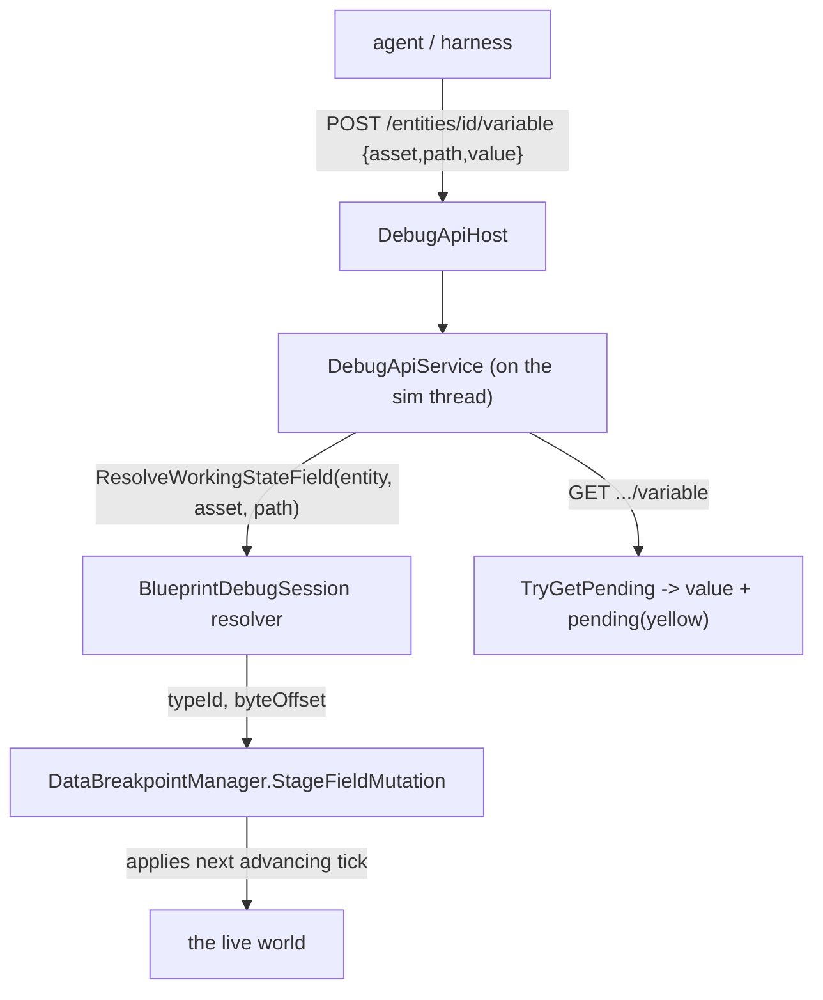
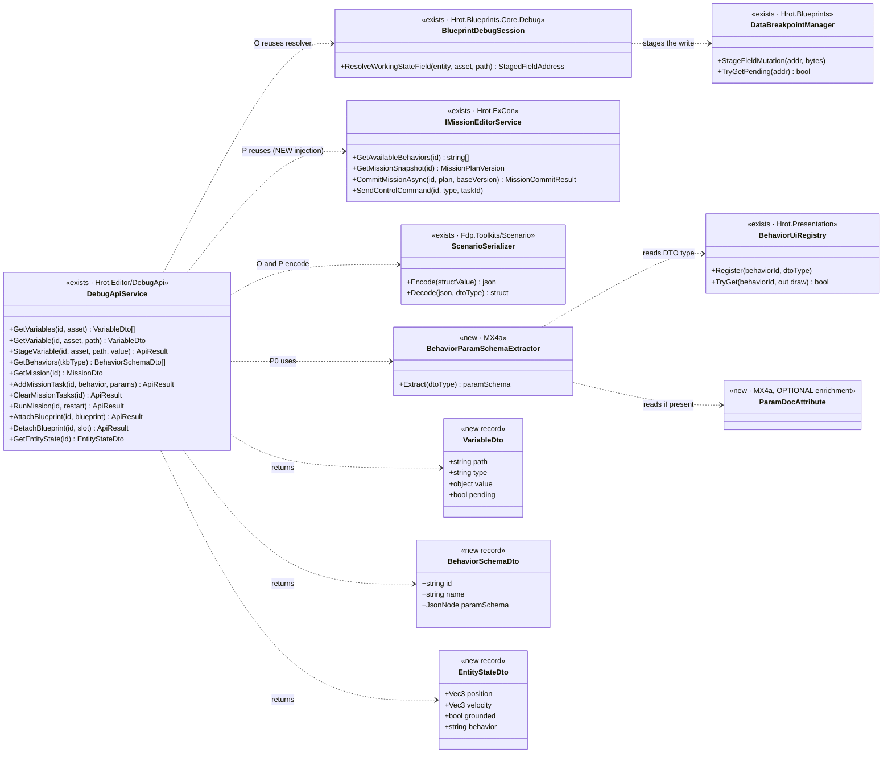
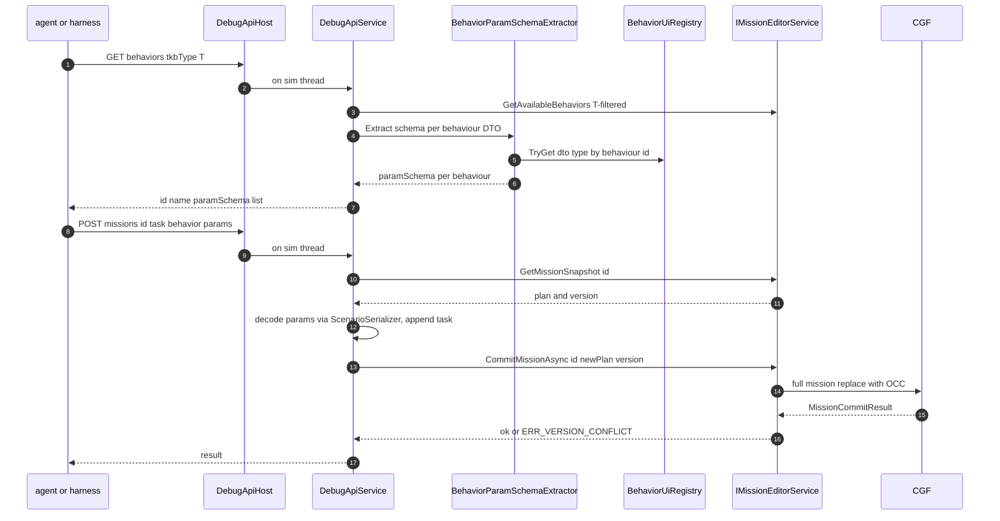

<!--STATUS
state: LIVE
build-state: BUILT (integration §A–N) │ READY-TO-BUILD (MCP EXTENSIONS §O–R, MX1–MX6)
updated: 2026-08-22
current-answer: two parts. (1) The AI-debug API + MCP server is PORTED, WIRED, VERIFIED end-to-end on
  headless Linux (§ up to Notes). (2) The MCP EXTENSIONS design (Groups O–R) is APPROVED and READY-TO-BUILD:
  §"UML — the build contract" carries the classDiagram + sequenceDiagram (obligation ①); MX1–MX6 are the build.
stale-below: nothing — the extensions section supersedes the earlier "mission intent bus" phrasing in place (see §"UML").
known-conflict: none.
-->
# AI-debug API + MCP server — integration status

Porting `origin/feat/ai-debug-api` (@ `d7b2a6e12`) onto the coordinator branch. It's a **port, not a
merge** — the branch has disjoint history from trunk (see `docs/UX/MCP_PORT_PLAN.md`). This file tracks
what landed and what remains.

## What it is

A loopback HTTP control plane for AI-driven testing/automation:
```
agent ──stdio──▶ tools/ai-debug-mcp (Node, 49 tools) ──HTTP──▶ DebugApiHost (localhost) ──▶ DebugApiService ──▶ the editor
```
Endpoints: `load_scenario` · `spawn_entity` · `play`/`pause`/`step` · `enter_preview` · `checkpoint`/
`restore_checkpoint` · `diff_state` · `focus_entity` · `send_entity_command` · behavior traces · live
mutation / fault injection.

## Landed (builds clean)

| piece | where |
|---|---|
| Production DebugApi | `Hrot/Subsystems/Hrot.Editor/DebugApi/` (`DebugApiService` 2140 ln, `DebugApiHost`, `MainThreadJobQueue`, `EditorAiTracerCoordinator`, `DebugApiSafeFloatConverters`) |
| Shared diagnostics helpers | `FDP/Toolkits/Fdp.Toolkits/Diagnostics/{EventSerializationHelper,JsonShapeDescriber}.cs` |
| Node MCP server | `tools/ai-debug-mcp/` (17 files, outside the .sln — a Node toolchain dependency only) |
| Design corpus | `.dev/ai-debug-api/` (52 docs) |
| `EventSerializationHelperTests` | kept compiled (harness-free) |

### Three shared-file reconciliations (ADA-era additions the trunk lacked)

| drift | fix |
|---|---|
| `OrchestrationConstants.DefaultStagingDirectory` (removed on trunk) | → `ResolveStagingRoot()` in `DebugApiService` |
| `IGeographicTransform.Origin` (getter added by ADA) | added as a **default interface member** (0,0,0), overridden in `WGS84Transform` (degrees) — 12 test doubles untouched |
| `FdpEventBus.GetRegisteredManagedEventTypes()` (method added by ADA) | added; trunk's `ManagedEventStream<T>` already implements `IManagedEventStreamInfo`, so the body ports verbatim |

## Remaining

### ✅ Wiring — DONE

`EditorSubsystem` constructs the `DebugApiHost` + `DebugApiService` after the preview controller, and pumps
its `MainThreadJobQueue` once per frame in `Update`. **Enabled by setting `HROT_DEBUG_API_PORT`** to a port;
off (zero cost) otherwise. Two collaborators were adapted: `EditorApplication.CurrentClusterState` was
exposed (getter added over the existing field); `editorTracer` and `rrController` are omitted (see
DEBT-MCP-002 / no `EcsRecordReplayController` in this root), degrading only the behavior-trace and
record/replay endpoints.

### ✅ End-to-end verification — DONE (2026-08-22)

Ran `HROT_DEBUG_API_PORT=8137 xvfb-run … dotnet Hrot.ClusterRunner.dll --mode editor`; the loopback API came
up in ~3s and answered:
```
GET /status    → clusterState:"Idle", simTime:0, isPaused:true, entityCount:0
GET /scenarios → ["hill-attack","test-fire","test-move"]   (also proves the curated-scenario seeding)
GET /sim/state → isPaused:true, inPreview:false
GET /entities  → []
```

### ✅ Behavior-trace tracer + record/replay — WIRED and VERIFIED (2026-08-22)

- **`DEBT-MCP-002` was a NAME COLLISION, not a duplicate implementation.** Trunk's
  `Hrot.Editor.Debug.EditorAiTracerCoordinator` does *time control* (pause/step); the ported
  `Hrot.Editor.DebugApi.EditorAiTracerCoordinator` does *behavior-trace arming* (`ArmEntity`/`DisarmEntity`,
  self-contained on the world). They are different concepts — **both are kept**; the DebugApi one is now
  constructed and passed as `editorTracer`. *(A rename to disambiguate would be nice-to-have polish.)*
- **`EcsRecordReplayController` already exists on trunk** (`Hrot.SimHost/Modules/Orchestration/`) — it was
  never *instantiated* in the editor root, not missing. Now constructed dedicated to the API
  (`new EcsRecordReplayController(_kernel, EditorNodeId, _world)`) and passed as `rrController`.

**End-to-end verification (headless, `FDP_STAGING_ROOT=/tmp/…`):** `load_scenario` → `recording/start`
(entered preview, began writing) → `sim/play` → `recording/stop` wrote a real **48-frame `.fdp`** →
`replay/load` (loaded, `totalFrames:48`) → `replay/status` (active) → `replay/step` (advanced frames);
`trace/observe` responded (tracer live); `entities` returned a live `M2 Bradley IFV` with its components.
⚠ Recording needs a POSIX `FDP_STAGING_ROOT` on Linux — the default `C:\FDP_Temp` is a Windows path.

### Follow-ups

| item | status |
|---|---|
| **`DEBT-MCP-001` — the 15 harness-dependent integration tests** | ⛔ **DEFERRED, excluded from the build**. They call `EditorHarness.BuildDebugApiService(...)`, needing 9 collaborators trunk's diverged `EditorHarness` lacks (all of which now exist in `EditorSubsystem`, so reviving them is a harness-build mirror of the production wiring). ⭐ **Recommendation:** prefer a small NEW set of end-to-end HTTP smoke tests (drive the real API headless, as above) as the primary gate; selectively revive the original unit tests only for tricky semantics (checkpoint/diff, fault injection). |
| **`DEBT-MCP-003` — rename the ported tracer** | optional: `Hrot.Editor.DebugApi.EditorAiTracerCoordinator` → e.g. `BehaviorTraceCoordinator`, to kill the name collision with the time-control tracer. |

## Notes

- The Node server is deliberately outside `IOS-IG-SimHost.sln`; it adds a Node dependency, no C# build coupling.
- Once wired, the API becomes a second consumer of the editor's internals (co-owned surface).

---

# MCP EXTENSIONS — design (scenario verification + authoring)

> **Status: DESIGN, 2026-08-22 — proposed, open to discussion.** Extends the original endpoint families
> (`.dev/ai-debug-api/DESIGN.md` Groups A–N) with new groups so an agent (and the C# harness,
> `DESIGN_MCP_System_Test_Harness.md`) can *check a scenario runs as expected* and *author* the things that
> drive it. Groups O–R below. Each says what it reuses and whether it is buildable now or needs new engine
> surface.

## Why / what's already there

Verifying "is the scenario running as expected?" is mostly covered **today**: entity state (`GET /entities`,
`/entities/{id}`), event-bus history (`GET /events`), state diffing (`/diff/*`, `/checkpoint`), breakpoints +
hits. The gaps are **(a) variables in the WATCH vocabulary** (not raw components), **(b) mission authoring**,
and **(c) blueprint hot-attach** — the three the user named.

## Group O — Variable addressing (full watch parity) — ⭐ **buildable now, reuses our staged-write seam**

🔒 **User:** *"MCP definitely needs full variable addressing same as the watch is using."*
⇒ address a variable by the **same tuple the watch row uses: `(assetId, variablePath, entity)`** — not raw
component/offset. This is the SAME resolver the staged-write yellow already uses:
`IBlueprintDebugSession.ResolveWorkingStateField(entity, assetId, variablePath)` →
`StageFieldMutation`/`TryGetPending`. `DebugApiService` already holds `_blueprintSession` + `bpManager`.

| endpoint | does |
|---|---|
| `GET /entities/{id}/variables?asset=<assetId>` | list the entity's blueprint variables (name, type, current value) |
| `GET /entities/{id}/variable?asset=&path=` | read one variable by name **+ its pending/staged state** *(the yellow)* |
| `POST /entities/{id}/variable` `{asset,path,value}` | **stage** a write via the same path the watch/Details editor uses ⇒ applies at the next tick, shows pending until then |

⭐ **This IS "the watch, over HTTP."** It does NOT need the watch UI (pinning/grouping) — only the resolver.

## Group P — Mission editing — ⚠ **partly new engine surface; DISCUSS**

🔒 **User:** *"building/editing missions … add a new mission task with all the behavior specs/parameters,
clear tasks to allow adding tasks, run/restart mission."* ⭐ Missions are the *proper* way behaviors attach to
entities (as tasks). `IMissionEditorService` *(Hrot.ExCon)* already has **read**: `GetMissionSnapshot(entityId)`
→ `(MissionPlan?, Version)`, `GetAvailableBehaviors(entityId)`, and `SendControlCommand(...)`.

### ⭐⭐⭐ P.0 — behaviour DISCOVERY WITH SCHEMA *(the load-bearing piece — user, 2026-08-22)*

🔒 **User:** *"an endpoint listing available behaviors (those shown in the mission task combo), each with the
schema of its parameter json (extracted from the param DTO structure) … entity TKB type might limit behaviors
so the query should include entity TKB type. AI model will then know exactly what is available."*

| endpoint | does |
|---|---|
| `GET /behaviors?tkbType=<entityTkbType>` | the behaviours **valid for that entity TKB type** *(same list the mission-task combo shows)*, each with **`{ id, name, paramSchema }`** where `paramSchema` is the JSON schema of the behaviour's **param DTO**. ⇒ **the agent knows exactly what it can author and how to shape the params.** |

⭐⭐⭐ **PRIOR ART — the param-DTO walk ALREADY EXISTS** *(measured 2026-08-22, obligation ②)*. The mission
editor panel already renders every behaviour's params generically from its param DTO, via
**`BehaviorUiRegistry`** *(behaviourId → DTO type; `Hrot.Presentation/Behavior/BehaviorUiCompiler.cs`)*,
auto-populated by **`BehaviorSchemaDiscovery.AutoRegister`** *(same file dir)*, and **`BehaviorUiCompiler.Compile<TDto>()`**
which walks the DTO's public properties handling `float`/`double`/`int`/`long`/`bool`/`PickableGeoPoint` plus the
`[RemapNetworkId]`/`[MapPickableEntity]`/`[MapPickableWorldLocation]` attributes. ⇒ ⭐⭐ **`MX4a` REUSES this
registry** — it is *not* a from-scratch reflection pass: given `tkbType`, take the valid behaviour ids
*(`IMissionEditorService.GetAvailableBehaviors`, already TKB-filtered)*, look up each DTO type in the registry,
and emit `paramSchema` from the same property walk. ⭐ **`[ParamDoc("…")]`/range/units attributes are an OPTIONAL
enrichment** *(descriptions the walk cannot infer)*, not the core — the base schema (field name + type + pickable
kind) is derivable from what the panel already reads. ⭐ Value/param encoding reuses the **`ScenarioSerializer`**
*(`Fdp.Toolkits/Scenario/ScenarioSerializer.cs`; structs + customization — decision 3)*, so the schema the agent
sees and the bytes the engine reads are the same mechanism.

### P.1 — read / edit / run

| endpoint | does | status |
|---|---|---|
| `GET /missions/{id}` | the entity's mission plan (tasks + specs) + its **OCC version** | ✅ `GetMissionSnapshot` → `(MissionPlan?, long Version)` |
| `POST /missions/{id}/task` `{behavior, params}` | **add a mission task** — `params` is JSON per P.0's schema, decoded by `ScenarioSerializer` | ⭐ **read-modify-commit**: snapshot → append task → `CommitMissionAsync(id, newPlan, version)` |
| `DELETE /missions/{id}/tasks` | **clear tasks** (to re-add) | ⭐ snapshot → empty/trim plan → `CommitMissionAsync` |
| `POST /missions/{id}/run` `{restart?}` | **run / restart** the mission | `SendControlCommand(id, eMissionCommandType, taskId)` |

⭐⭐⭐ **The real write seam is `IMissionEditorService.CommitMissionAsync(entityId, newPlan, baseVersion)`**
*(`Hrot.ExCon/Services/IMissionEditorService.cs`)* — a **full-mission-replace with optimistic concurrency**: the
caller passes the `Version` it read from `GetMissionSnapshot`, and the CGF rejects with `ERR_VERSION_CONFLICT` if
it moved. ⇒ *"add a task"* = **snapshot → append → commit**; *"clear tasks"* = **commit a trimmed plan**;
*"run/restart"* = `SendControlCommand`. ⭐⭐ This **IS** decision 2's *"the one path the editor's Mission panel
uses"* — the panel commits through this same service; there is **no separate intent bus** to reuse, and no parallel
API to build. ⚠ **Supersedes the earlier "mission intent bus" phrasing** *(decision 2 intent is preserved:
reuse the panel's path)*. Params encode via `ScenarioSerializer`; the AI discovers the param shape via **P.0**.

## Group Q — Blueprint hot-attach — ⭐ **mechanism EXISTS, just expose it**

🔒 **User:** *"hot attaching blueprints to running entities (easy way of trying many blueprints at runtime)"* —
the quick-experiment path (vs the proper mission path P). 📐 The runtime mechanism already exists:
`AttachInstanceBlueprintEvent` *(id 9100)* / `AssignBehaviorEvent` + `BlueprintLifecycleLibrary.AttachInstanceBlueprint`.

| endpoint | does |
|---|---|
| `POST /entities/{id}/attach-blueprint` `{blueprint}` | publish an attach event ⇒ the entity runs that blueprint now |
| `POST /entities/{id}/detach-blueprint` `{slot?}` | detach |

## Group R — Entity state dump (convenience) — ⭐ **thin**

`GET /entities/{id}/state` → the well-known fields parsed out *(position from `SimTransform`, orientation,
`SimVelocity`, grounded, current behavior)* so an assertion reads `state.position.x` rather than digging the
component JSON. A convenience over `GET /entities/{id}`.

## Reuse — Group O flow (the cheap, high-value one)



## UML — the build contract *(obligation ①; drawn AFTER the inventory, existing classes shown as existing)*

### Class diagram — new handlers/DTOs vs the seams they REUSE

⭐ Everything marked `<<exists …>>` is already built and drawn here so a proposed duplicate is visible on the
same canvas *(obligation ②)*. The extensions add **handler methods on the existing `DebugApiService`**, a few
**DTO records**, and **one small `BehaviorParamSchemaExtractor`** that reuses the existing behaviour registry.



### Sequence — behaviour discovery then mission add-task *(the one genuinely new flow)*



## Task breakdown (proposed)

| # | task | note |
|---|---|---|
| **MX1** | **Group O — variable addressing** (read/list/stage by `(asset,path,entity)` + pending) | reuses the staged-write seam; `DebugApiService` already has the session + bpManager |
| **MX2** | **Group Q — blueprint hot-attach/detach** | wrap `AttachInstanceBlueprintEvent`/`AssignBehaviorEvent` |
| **MX3** | **Group R — entity state dump** | thin convenience over `GetEntity` |
| **MX4a** | **behaviour DISCOVERY WITH SCHEMA** (P.0) — `GET /behaviors?tkbType=`, param-DTO → JSON schema. ⭐⭐ **REUSE `BehaviorUiRegistry`/`BehaviorSchemaDiscovery`** (the registry the mission panel already renders from) for behaviourId→DTO; the `BehaviorParamSchemaExtractor` emits the schema from the same property walk `BehaviorUiCompiler.Compile` does. `[ParamDoc]` attributes OPTIONAL enrichment only | ⭐ the load-bearing authoring piece; **mostly reuse, not new reflection** |
| **MX4b** | **Group P — mission editing** — add-task / clear / run via **`IMissionEditorService.CommitMissionAsync`** (read-snapshot → modify → commit with OCC version) + `SendControlCommand` for run/restart; params decoded by `ScenarioSerializer`. ⭐ Inject `IMissionEditorService` into `DebugApiService` (additive, like `_blueprintSession`) | depends on MX4a's schema |
| **MX5** | MCP-server (Node) tool wrappers + `SKILL.md` regen for O/P/Q/R | the agent-facing side |
| **MX6** | harness smoke cases for each new group | feeds `DESIGN_MCP_System_Test_Harness.md` H4 |

## Dependencies & lane

- ⭐ **Group O/Q/R reuse existing seams** — MCP-lane work, independent of the watch UI. ⛔ The watch UI's
  **pinning / selected-entity / grouping** *(`DESIGN_Variable_Details_And_Editing.md` §1b, `Q40`)* is separate
  UI-lane work; exposing the *pinned set* over MCP is a later thin add that depends on it — **not needed for
  variable read/write.**
- ⚠ **Group P is the one needing new engine/service surface** and a JSON task-spec decision — discuss before build.

## Decisions — RESOLVED (user, 2026-08-22)

1. ✅ **Mission task-spec + behaviour discovery** — an agent expresses `{behavior, params}` where `params` is
   JSON matching the behaviour's **param-DTO schema**, and the agent *discovers* that schema via **P.0**
   `GET /behaviors?tkbType=…` *(behaviours valid for the entity's TKB type, each with its param JSON schema)*.
   ⇒ the AI knows exactly what is available and how to shape it. ⚠ Schema extraction may need small
   **self-describing DTO attributes** *(task `MX4a`)*.
2. ✅ **Mission-edit path = the one the editor's Mission panel uses** — measured to be
   **`IMissionEditorService.CommitMissionAsync`** (full-plan replace + OCC version) + `SendControlCommand`, NOT a
   separate "intent bus". ⛔ Do NOT build a parallel write API; reuse this service. *(The earlier "intent bus"
   phrasing is superseded in §"UML"/§P.1; the intent — reuse the panel's one path — is unchanged.)*
3. ✅ **Value / param encoding = the SCENARIO JSON serialization** *(structs + customization)* — for both
   Group O variable values and Group P behaviour params. ⛔ Do not hand-roll a converter; reuse the scenario
   serializer that already works for structs and supports customization.
