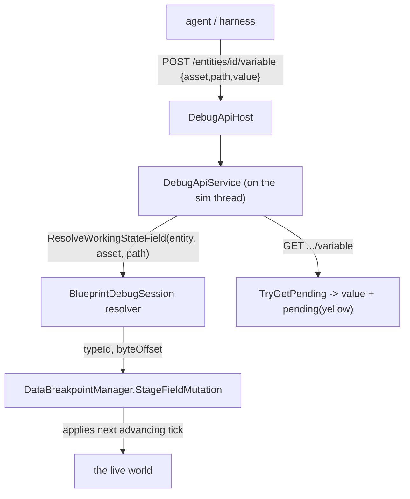

<!--STATUS
state: LIVE
build-state: BUILT
updated: 2026-08-22
current-answer: this whole file — the AI-debug API + MCP server is PORTED, WIRED, and VERIFIED
  end-to-end on headless Linux. Two follow-ups remain (DEBT-MCP-001 tests, DEBT-MCP-002 tracer).
known-conflict: none.
-->
# AI-debug API + MCP server — integration status

Porting `origin/feat/ai-debug-api` (@ `d7b2a6e12`) onto the coordinator branch. It's a **port, not a
merge** — the branch has disjoint history from trunk (see `docs/UX/MCP_PORT_PLAN.md`). This file tracks
what landed and what remains.

## What it is

A loopback HTTP control plane for AI-driven testing/automation:
```
agent ──stdio──▶ tools/ai-debug-mcp (Node, 49 tools) ──HTTP──▶ DebugApiHost (localhost) ──▶ DebugApiService ──▶ the editor
```
Endpoints: `load_scenario` · `spawn_entity` · `play`/`pause`/`step` · `enter_preview` · `checkpoint`/
`restore_checkpoint` · `diff_state` · `focus_entity` · `send_entity_command` · behavior traces · live
mutation / fault injection.

## Landed (builds clean)

| piece | where |
|---|---|
| Production DebugApi | `Hrot/Subsystems/Hrot.Editor/DebugApi/` (`DebugApiService` 2140 ln, `DebugApiHost`, `MainThreadJobQueue`, `EditorAiTracerCoordinator`, `DebugApiSafeFloatConverters`) |
| Shared diagnostics helpers | `FDP/Toolkits/Fdp.Toolkits/Diagnostics/{EventSerializationHelper,JsonShapeDescriber}.cs` |
| Node MCP server | `tools/ai-debug-mcp/` (17 files, outside the .sln — a Node toolchain dependency only) |
| Design corpus | `.dev/ai-debug-api/` (52 docs) |
| `EventSerializationHelperTests` | kept compiled (harness-free) |

### Three shared-file reconciliations (ADA-era additions the trunk lacked)

| drift | fix |
|---|---|
| `OrchestrationConstants.DefaultStagingDirectory` (removed on trunk) | → `ResolveStagingRoot()` in `DebugApiService` |
| `IGeographicTransform.Origin` (getter added by ADA) | added as a **default interface member** (0,0,0), overridden in `WGS84Transform` (degrees) — 12 test doubles untouched |
| `FdpEventBus.GetRegisteredManagedEventTypes()` (method added by ADA) | added; trunk's `ManagedEventStream<T>` already implements `IManagedEventStreamInfo`, so the body ports verbatim |

## Remaining

### ✅ Wiring — DONE

`EditorSubsystem` constructs the `DebugApiHost` + `DebugApiService` after the preview controller, and pumps
its `MainThreadJobQueue` once per frame in `Update`. **Enabled by setting `HROT_DEBUG_API_PORT`** to a port;
off (zero cost) otherwise. Two collaborators were adapted: `EditorApplication.CurrentClusterState` was
exposed (getter added over the existing field); `editorTracer` and `rrController` are omitted (see
DEBT-MCP-002 / no `EcsRecordReplayController` in this root), degrading only the behavior-trace and
record/replay endpoints.

### ✅ End-to-end verification — DONE (2026-08-22)

Ran `HROT_DEBUG_API_PORT=8137 xvfb-run … dotnet Hrot.ClusterRunner.dll --mode editor`; the loopback API came
up in ~3s and answered:
```
GET /status    → clusterState:"Idle", simTime:0, isPaused:true, entityCount:0
GET /scenarios → ["hill-attack","test-fire","test-move"]   (also proves the curated-scenario seeding)
GET /sim/state → isPaused:true, inPreview:false
GET /entities  → []
```

### ✅ Behavior-trace tracer + record/replay — WIRED and VERIFIED (2026-08-22)

- **`DEBT-MCP-002` was a NAME COLLISION, not a duplicate implementation.** Trunk's
  `Hrot.Editor.Debug.EditorAiTracerCoordinator` does *time control* (pause/step); the ported
  `Hrot.Editor.DebugApi.EditorAiTracerCoordinator` does *behavior-trace arming* (`ArmEntity`/`DisarmEntity`,
  self-contained on the world). They are different concepts — **both are kept**; the DebugApi one is now
  constructed and passed as `editorTracer`. *(A rename to disambiguate would be nice-to-have polish.)*
- **`EcsRecordReplayController` already exists on trunk** (`Hrot.SimHost/Modules/Orchestration/`) — it was
  never *instantiated* in the editor root, not missing. Now constructed dedicated to the API
  (`new EcsRecordReplayController(_kernel, EditorNodeId, _world)`) and passed as `rrController`.

**End-to-end verification (headless, `FDP_STAGING_ROOT=/tmp/…`):** `load_scenario` → `recording/start`
(entered preview, began writing) → `sim/play` → `recording/stop` wrote a real **48-frame `.fdp`** →
`replay/load` (loaded, `totalFrames:48`) → `replay/status` (active) → `replay/step` (advanced frames);
`trace/observe` responded (tracer live); `entities` returned a live `M2 Bradley IFV` with its components.
⚠ Recording needs a POSIX `FDP_STAGING_ROOT` on Linux — the default `C:\FDP_Temp` is a Windows path.

### Follow-ups

| item | status |
|---|---|
| **`DEBT-MCP-001` — the 15 harness-dependent integration tests** | ⛔ **DEFERRED, excluded from the build**. They call `EditorHarness.BuildDebugApiService(...)`, needing 9 collaborators trunk's diverged `EditorHarness` lacks (all of which now exist in `EditorSubsystem`, so reviving them is a harness-build mirror of the production wiring). ⭐ **Recommendation:** prefer a small NEW set of end-to-end HTTP smoke tests (drive the real API headless, as above) as the primary gate; selectively revive the original unit tests only for tricky semantics (checkpoint/diff, fault injection). |
| **`DEBT-MCP-003` — rename the ported tracer** | optional: `Hrot.Editor.DebugApi.EditorAiTracerCoordinator` → e.g. `BehaviorTraceCoordinator`, to kill the name collision with the time-control tracer. |

## Notes

- The Node server is deliberately outside `IOS-IG-SimHost.sln`; it adds a Node dependency, no C# build coupling.
- Once wired, the API becomes a second consumer of the editor's internals (co-owned surface).

---

# MCP EXTENSIONS — design (scenario verification + authoring)

> **Status: DESIGN, 2026-08-22 — proposed, open to discussion.** Extends the original endpoint families
> (`.dev/ai-debug-api/DESIGN.md` Groups A–N) with new groups so an agent (and the C# harness,
> `DESIGN_MCP_System_Test_Harness.md`) can *check a scenario runs as expected* and *author* the things that
> drive it. Groups O–R below. Each says what it reuses and whether it is buildable now or needs new engine
> surface.

## Why / what's already there

Verifying "is the scenario running as expected?" is mostly covered **today**: entity state (`GET /entities`,
`/entities/{id}`), event-bus history (`GET /events`), state diffing (`/diff/*`, `/checkpoint`), breakpoints +
hits. The gaps are **(a) variables in the WATCH vocabulary** (not raw components), **(b) mission authoring**,
and **(c) blueprint hot-attach** — the three the user named.

## Group O — Variable addressing (full watch parity) — ⭐ **buildable now, reuses our staged-write seam**

🔒 **User:** *"MCP definitely needs full variable addressing same as the watch is using."*
⇒ address a variable by the **same tuple the watch row uses: `(assetId, variablePath, entity)`** — not raw
component/offset. This is the SAME resolver the staged-write yellow already uses:
`IBlueprintDebugSession.ResolveWorkingStateField(entity, assetId, variablePath)` →
`StageFieldMutation`/`TryGetPending`. `DebugApiService` already holds `_blueprintSession` + `bpManager`.

| endpoint | does |
|---|---|
| `GET /entities/{id}/variables?asset=<assetId>` | list the entity's blueprint variables (name, type, current value) |
| `GET /entities/{id}/variable?asset=&path=` | read one variable by name **+ its pending/staged state** *(the yellow)* |
| `POST /entities/{id}/variable` `{asset,path,value}` | **stage** a write via the same path the watch/Details editor uses ⇒ applies at the next tick, shows pending until then |

⭐ **This IS "the watch, over HTTP."** It does NOT need the watch UI (pinning/grouping) — only the resolver.

## Group P — Mission editing — ⚠ **partly new engine surface; DISCUSS**

🔒 **User:** *"building/editing missions … add a new mission task with all the behavior specs/parameters,
clear tasks to allow adding tasks, run/restart mission."* ⭐ Missions are the *proper* way behaviors attach to
entities (as tasks). `IMissionEditorService` *(Hrot.ExCon)* already has **read**: `GetMissionSnapshot(entityId)`
→ `(MissionPlan?, Version)`, `GetAvailableBehaviors(entityId)`, and `SendControlCommand(...)`. ⚠ The **write**
ops (add-task-with-params, clear) likely need adding to the mission-edit path — *this is the "might not exist
yet" the user flagged.*

| endpoint | does | status |
|---|---|---|
| `GET /missions/{id}` | the entity's mission plan (tasks + specs) | ✅ `GetMissionSnapshot` |
| `GET /missions/{id}/behaviors` | behaviors that can be added | ✅ `GetAvailableBehaviors` |
| `POST /missions/{id}/task` `{behavior, params}` | **add a mission task** with its behavior spec + parameters | ⚠ needs a mission-edit write op |
| `DELETE /missions/{id}/tasks` | **clear tasks** (to re-add) | ⚠ needs a mission-edit write op |
| `POST /missions/{id}/run` `{restart?}` | **run / restart** the mission | ⚠ maybe `SendControlCommand`; confirm |

⭐⭐ **DISCUSS:** the task-spec/parameter shape (how an agent expresses a behavior + its params in JSON), and
whether mission-edit writes go through `IMissionEditorService` (extend it) or the same intent bus the editor's
Mission panel uses. **This is the biggest new surface and the most powerful authoring feature.**

## Group Q — Blueprint hot-attach — ⭐ **mechanism EXISTS, just expose it**

🔒 **User:** *"hot attaching blueprints to running entities (easy way of trying many blueprints at runtime)"* —
the quick-experiment path (vs the proper mission path P). 📐 The runtime mechanism already exists:
`AttachInstanceBlueprintEvent` *(id 9100)* / `AssignBehaviorEvent` + `BlueprintLifecycleLibrary.AttachInstanceBlueprint`.

| endpoint | does |
|---|---|
| `POST /entities/{id}/attach-blueprint` `{blueprint}` | publish an attach event ⇒ the entity runs that blueprint now |
| `POST /entities/{id}/detach-blueprint` `{slot?}` | detach |

## Group R — Entity state dump (convenience) — ⭐ **thin**

`GET /entities/{id}/state` → the well-known fields parsed out *(position from `SimTransform`, orientation,
`SimVelocity`, grounded, current behavior)* so an assertion reads `state.position.x` rather than digging the
component JSON. A convenience over `GET /entities/{id}`.

## Reuse — Group O flow (the cheap, high-value one)



## Task breakdown (proposed)

| # | task | note |
|---|---|---|
| **MX1** | **Group O — variable addressing** (read/list/stage by `(asset,path,entity)` + pending) | reuses the staged-write seam; `DebugApiService` already has the session + bpManager |
| **MX2** | **Group Q — blueprint hot-attach/detach** | wrap `AttachInstanceBlueprintEvent`/`AssignBehaviorEvent` |
| **MX3** | **Group R — entity state dump** | thin convenience over `GetEntity` |
| **MX4** | **Group P — mission editing** | read exists; **add/clear/run need mission-edit write ops** — design the task-spec JSON first (DISCUSS) |
| **MX5** | MCP-server (Node) tool wrappers + `SKILL.md` regen for O/P/Q/R | the agent-facing side |
| **MX6** | harness smoke cases for each new group | feeds `DESIGN_MCP_System_Test_Harness.md` H4 |

## Dependencies & lane

- ⭐ **Group O/Q/R reuse existing seams** — MCP-lane work, independent of the watch UI. ⛔ The watch UI's
  **pinning / selected-entity / grouping** *(`DESIGN_Variable_Details_And_Editing.md` §1b, `Q40`)* is separate
  UI-lane work; exposing the *pinned set* over MCP is a later thin add that depends on it — **not needed for
  variable read/write.**
- ⚠ **Group P is the one needing new engine/service surface** and a JSON task-spec decision — discuss before build.

## Open decisions (discuss)

1. **Mission task-spec JSON** — how an agent expresses a behavior + its parameters (Group P). The single most
   important shape to get right; drives the whole authoring surface.
2. **Mission-edit path** — extend `IMissionEditorService` with write ops, or route through the editor's mission
   intent bus?
3. **Variable value encoding** — typed JSON (number/bool/vector) → bytes via the field's type, mirroring the
   editor's `VariableEditCommit` conversion (reuse it, don't re-implement).
