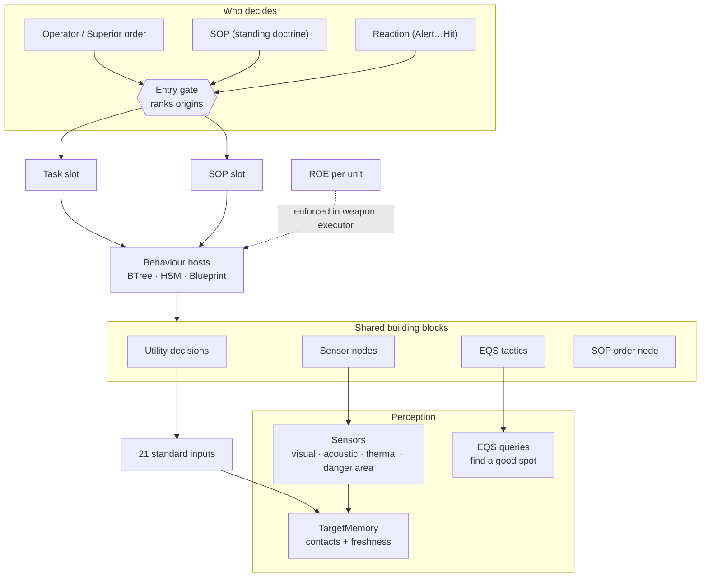
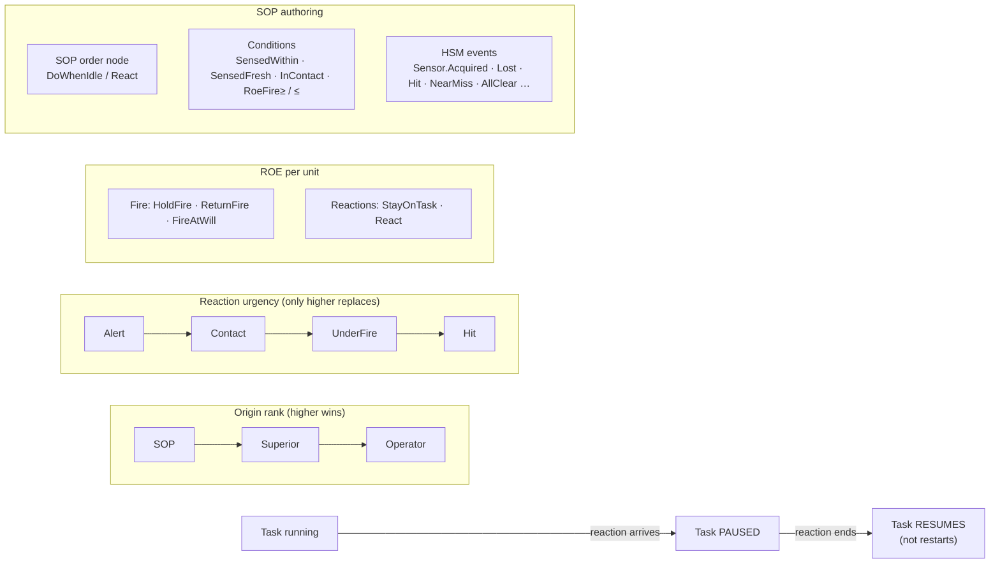
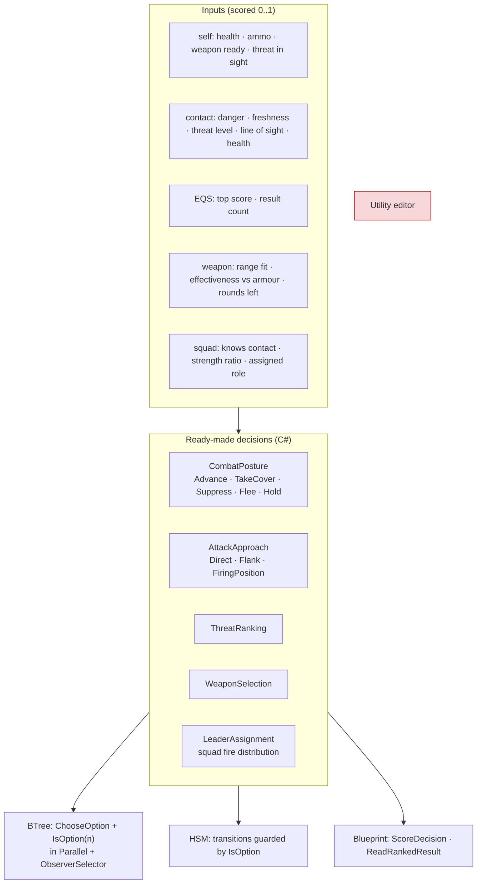
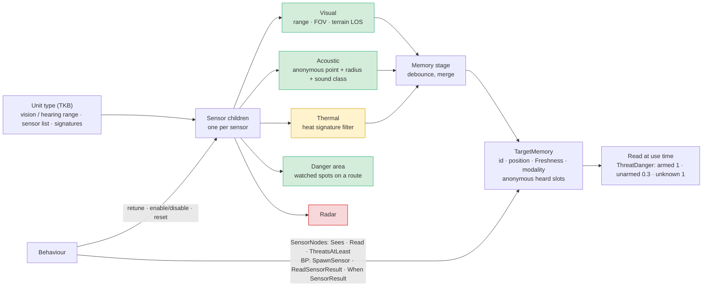
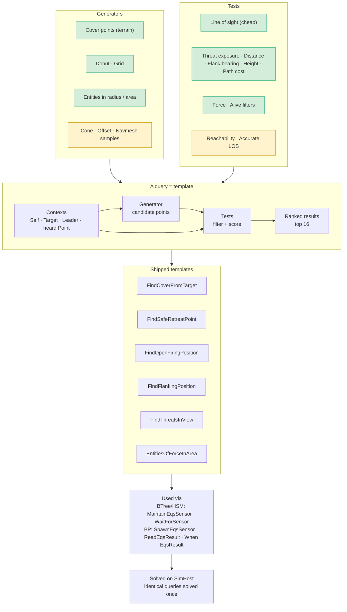
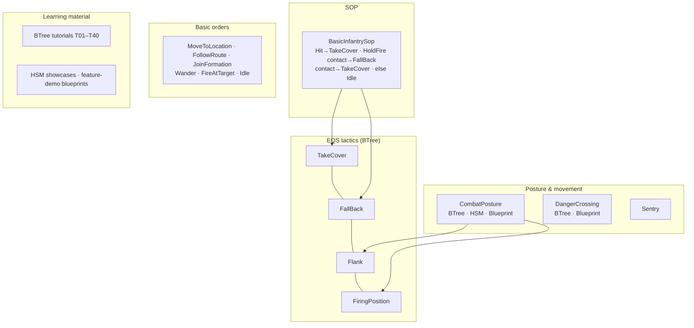
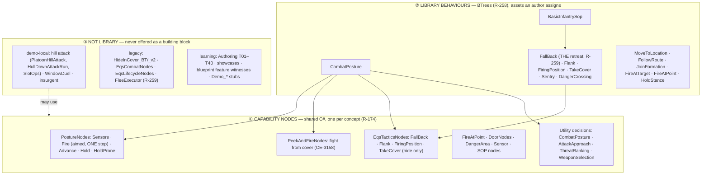
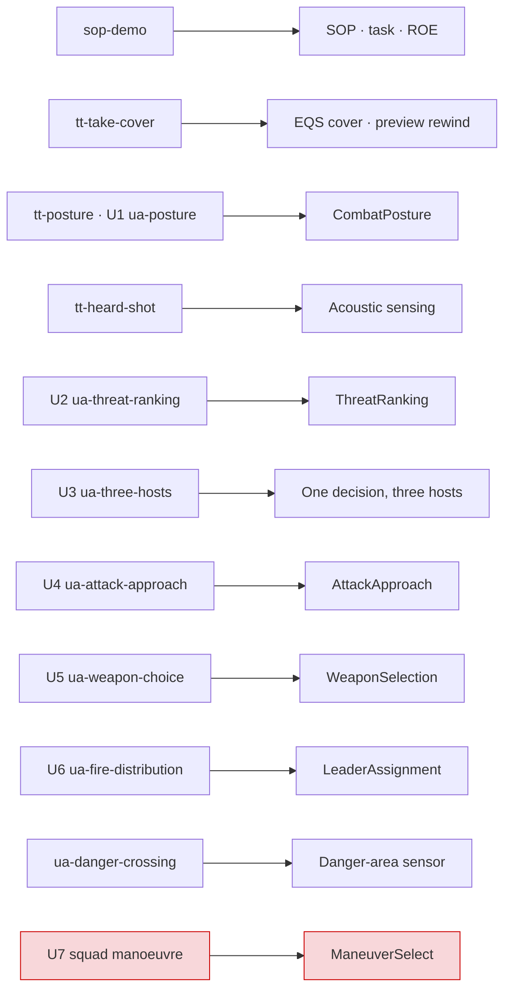
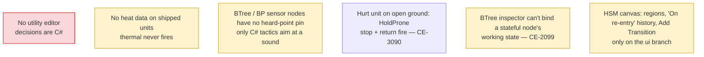

<!--STATUS
state: LIVE
updated: 2026-10-10 (§6a the LIBRARY line + promotion rule — R-256 L1; R-258 BTrees; R-259 one retreat)
current-answer: the whole file — an EXPLAINER (map of what exists), not a design; every box names its owning design
stale-below: none
known-rot: none known; built/partial/missing colours are a 2026-10-06 snapshot — re-check the tracker before relying on a red or amber box
related-designs:
  - DESIGN_Peek_And_Fire.md — OWNS the library's fight-from-cover node (§10, CE-3158) that CombatPosture's TakeCover runs.
  - REVIEW_Behaviour_Library_Genericity.md — OWNS the genericity verdict on these blocks (library vs demo-local vs legacy) and the leans L1–L7.
  - docs/TUTORIAL_Behaviour_Composition.md — the GUIDE to choosing between blocks (host, decision, starter, sensing) and composing them
  - docs/DESIGN_Decision_Layer.md — owns task/SOP/reaction slots, ROE, utility hosting in BTree/HSM/blueprint (§3, §4)
  - docs/DESIGN_Sensors_And_Doctrine.md — owns sensor kinds, sensor children, memory stage, threat = danger × freshness (§5–§7)
  - docs/DESIGN_Thermal_And_Acoustic_Sensing.md — owns thermal / acoustic sensing and anonymous heard contacts
  - docs/designs/eqs-2/EQS_Design_v1.3_final.md — owns EQS generators, tests, contexts, templates (§19 as-built)
  - docs/DESIGN_Eqs_Consuming_Behaviours.md — owns the EQS tactics nodes (TakeCover / FallBack / Flank / FiringPosition)
  - docs/DESIGN_Utility_AI_Demo_Scenarios.md — owns the U1–U7 demo scenarios and the danger-area sensor
-->

# Behaviour building blocks — an overview

What a behaviour author can build from **on top of** the BTree / HSM / Blueprint engines. One map per layer;
every node in the C# boxes is ONE shared implementation usable from all three hosts (R-174).

**Legend** — 🟩 built · 🟨 partial / caveat · 🟥 not built

## 1. The stack

*What the picture shows:* everything a behaviour reads flows up from perception; everything that starts a
behaviour flows down through ONE gate — no host has its own path.

## 2. Who decides — task, SOP, reaction, ROE

*Owner:* [DESIGN_Decision_Layer](DESIGN_Decision_Layer.md) §4 · R-199, R-200, R-203.

## 3. Utility decisions

*Owner:* [DESIGN_Decision_Layer](DESIGN_Decision_Layer.md) §3 · R-201 (threat = danger × freshness), R-202.
🟥 The utility editor is a placeholder — new decisions are written in C#.

## 4. Sensors → memory

*Owner:* [Sensors & Doctrine](DESIGN_Sensors_And_Doctrine.md) §5–§7 · [Thermal & Acoustic](DESIGN_Thermal_And_Acoustic_Sensing.md).
🟨 Thermal: pipeline built, **no shipped unit has heat data**. 🟥 Radar: data shape only.

## 5. EQS — "find me a good spot"

*Owner:* [EQS design](designs/eqs-2/EQS_Design_v1.3_final.md) §19 · [EQS-consuming behaviours](DESIGN_Eqs_Consuming_Behaviours.md).
🟨 Amber = built, but no shipped template uses it yet.

## 6. Ready-made behaviours to reuse

*What the picture shows:* the SOP and the posture decision are themselves built FROM the tactics — the same
composition an author would do.

## 6a. The library — what an author may assign, and how a block gets in *(R-256 L1)*

*What the picture shows that prose hid: a library behaviour is built only from ① nodes; ③ may use ① but nothing in ② may
use ③. CombatPosture's TakeCover option now runs the fight-from-cover node (`PeekAndFire`), so cover means "fire from it"
(Decision Layer §3.1).*

**Promotion rule — a block enters ② only when ALL four hold** *(R-256 L1)*:

| | rule | why |
|---|---|---|
| (a) | **no scenario constant** — only tunable defaults (a zero param = the default) | a constant from the demo it was born in makes it that demo's behaviour |
| (b) | **states its unit scope** — infantry / vehicle / any | e.g. `PeekAndFire` is infantry (stance or step peek) |
| (c) | **has a rail outside its originating demo** | the feature's own suite, not the scenario that motivated it |
| (d) | **is the ONE implementation of its concept** (ruling 9, R-174) | a second retreat, a second cover node is clutter — `FleeExecutor` stayed out for this (R-259) |

**Form** *(R-258)*: a library behaviour is a **BTree** (JSON or C#-built). A blueprint or HSM copy of a library behaviour is
kept only where it is not redundant or that host fits better; the three-host proof stays a DEMO (`ua-three-hosts`).

## 7. Demos — which building blocks each one exercises

*Owner:* [DESIGN_Utility_AI_Demo_Scenarios](DESIGN_Utility_AI_Demo_Scenarios.md) §4 · runbook [RUNBOOK_Utility_AI_Demos](RUNBOOK_Utility_AI_Demos.md).
🟥 U7 waits on CE-507 decisions.

## 8. Gaps to know before authoring

