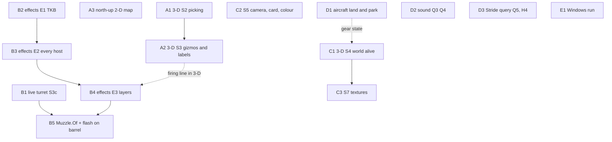

<!--STATUS
state: LIVE
updated: 2026-10-11
current-answer: §2 the ordered roadmap (phases A–E) and §3 its dependency graph. §1 is what is built; §4 the rulings in force;
  §5 open questions; §6 how to resume after a compaction.
stale-below: nothing.
known-rot: none.
known-conflict: none.
related-designs:
  - DESIGN_Map_3D_Mode.md — CE-1033: the 3-D mode of the map (slices S1–S7, §3.11 articulated turret, §6a–§6c as-built).
  - DESIGN_Visual_Effects.md — CE-1042: muzzle fire, explosions, decals (VE-A..VE-M approved; slices E1–E4).
  - DESIGN_Map_North_Up.md — CE-1040: the 2-D map north-up at its camera seam (built).
  - DESIGN_Body_Geometry_And_Ground_Contact.md — CE-1041: aircraft gear relative to the CG, resting pose (built).
  - DESIGN_Terrain_Height.md — CE-1034: the ground has height (H1–H3 built, H4 left).
  - DESIGN_World_Query_Seam.md — CE-1035: IWorldQuery, Bepu, sound (Q0–Q2 built, Q3–Q5 left).
  - designs/modularizing/MOD1-DESIGN.md — the IG ground clamp a flight model drives (known-conflict with CG-referenced bodies).
-->

# PLAN — the 3-D world and combat realism *(ui lane, `2026-10-10`)*

> ⭐ **After a compaction, start here** (§6). This file is the INDEX of the programme; every row points at the owning design,
> which holds the decisions, diagrams and as-built. ⛔ Verify any "built / head" line against `git log` before acting on it.

## 1. Built so far — on branch `ui`

| what | tracker | commit | design |
|---|---|---|---|
| `IWorldQuery` seam; Bepu spatial index spike; combat, EQS, perception, squad, kinematics, spawn and the debug API ask it; 2-D destinations "height not given" | [CE-1035](blueprints/Blueprint_Issues_Tracker.md) | `c5a9d4447` · `51a4b9897` · `17573b5d1` | `DESIGN_World_Query_Seam.md` §5a–§5c |
| the ground has height (ESRI ASCII grid), hills block sight and fire, 2-D points stand on the real ground | CE-1034 | `670a8f017` · `2e90e208f` | `DESIGN_Terrain_Height.md` §5a–§5b |
| **3-D map S1**: camera, animated 2-D ↔ 3-D switch, lit terrain, shape kits, block figures in three stances | CE-1033 | `cdbb47bb2` | `DESIGN_Map_3D_Mode.md` §6a |
| 3-D mode on **every host by construction** (`MapInteractionPack.AttachMapLayers`, View › 2-D / 3-D Map, rail); air kits (helicopter, jet, cargo) with the DIS air mapping; articulated turret/gun parts (pose seam only) | CE-1033 | `a2032fa02` | §6b, §3.5, §3.11 |
| aircraft know their gear: TKB `Body.Geometry`, `BodyGeometry.RestingPose`; built-in UH-60A (400), F-16C (401), C-130H (402) | CE-1041 | `116bcd936` | `DESIGN_Body_Geometry_And_Ground_Contact.md` |
| designed + approved: realism effects (VE-A..VE-M), the live turret (M23–M26, R-255) | CE-1042, CE-1033 | `ea6d67e92` … `bb69c7633` | `DESIGN_Visual_Effects.md`; `DESIGN_Map_3D_Mode.md` §3.11 |
| **3-D map S2**: picking with height (terrain mesh, entity boxes), drags on the terrain, height into gizmo events, placement on a level, measurement / danger band in 3-D, selection wire boxes | CE-1033 | `d5a2f99da` | `DESIGN_Map_3D_Mode.md` §6d |
| **3-D map S3**: ONE shared 3-D gizmo triage (Stride re-pointed); gizmos drawn in 3-D with draping on the relief; labels projected onto the bodies; areas on a roof level; the placement ghost box | CE-1033, CE-1045 (left) | `ee0b88fde` | §6e |
| **realism effects E1–E3**: ten TKB effect types + ammo → effect mapping; spawn / lifetime systems on every map host through the pack; one effect layer in 2-D and 3-D; the old effect gizmo retired | CE-1042 | `f1583662a` | `DESIGN_Visual_Effects.md` §6a |
| **north-up 2-D map**: the flip at the camera seam; gizmo input through the camera; world text upright; culling off in 2-D; the swap keeps north | CE-1040 | *(this commit)* | `DESIGN_Map_North_Up.md` |
| filed, pre-existing reds (proved at base commits) | CE-1036, CE-1037, CE-1038, CE-1039 | — | tracker rows |

## 2. The roadmap — ordered, with why

| # | item | state | owner lane | design / tracker | why here |
|---|---|---|---|---|---|
| **A1** | **3-D map S2** — `Picker3D` (handles → entity boxes → terrain mesh → ground), drags on terrain, draping on the relief, wire-cube selection, placement ghost + roof/floor level, measurement and areas on a level | ✅ BUILT `d5a2f99da` | ui | Map_3D §6d | the 3-D map is only LOOKED at until it can be clicked; every later feature is used through it |
| **A2** | **3-D map S3** — gizmo triage shared with Stride, gizmos and labels in 3-D (the firing line `FireTraceGizmo` and `DetonationGizmo` at their true heights) | ✅ BUILT (§6e); EQS same-level test left (CE-1045, behaviours lane) | ui | Map_3D §6 S3, §3.4 | the analysis overlays the user relies on; also the base the effects' layers sit beside |
| **A3** | **north-up 2-D map** — flip at the camera's world→screen seam; then the switch keeps north fixed | ✅ BUILT (`DESIGN_Map_North_Up.md` §5) | ui | [CE-1040](blueprints/Blueprint_Issues_Tracker.md) | removes the north–south flip at every switch; cheaper before more 2-D gizmos land |
| **B1** | **live turret (S3c)** — turret part child + `TurretPose` (M23); the WEAPON logic slews toward the target within TKB limits (M24); TKB turret descriptor incl. per-mount muzzle offset (M25, VE-K); the sensor-style multi-instance descriptor (M26); the map plugs `poseOf` | READY (R-255) | combat + network (cross-lane) | Map_3D §3.11; Visual_Effects §4b | the muzzle (B5) and the drawn turret both need the pose |
| **B2** | **effects E1** — TKB `Effect.Visual` + `Effect.Set`; nine effect types (flash / explosion / decal × small / medium / large) + tracer; `Effect.Set` on the built-in ammo | ✅ BUILT (§6a) | ui | Visual_Effects §6a | data first; E2–E3 read it |
| **B3** | **effects E2** — spawn + lifetime systems on TKB types and SIM time, built by the pack, declared in `RequiredSystems`, scheduled on all five hosts (today only IG, Editor, Stride) | ✅ BUILT (§6a) | ui | E2 | R-254: every host by construction |
| **B4** | **effects E3** — `EffectLayer2D` + `EffectLayer3D` (billboard flash and fireball, draped decal, cap); retire `EffectPresentationGizmo` only | ✅ BUILT as ONE `EffectLayer` (§6a) | ui | E3, §4a | the visible payoff |
| **B5** | **effects E4** — `Muzzle.Of(shooter, weapon)`: the fire code spawns the round there AND the flash binds to it every frame (`EffectAnchor`); the kit's barrel placed from the TKB (5 cm rail) | READY (VE-J..VE-M) — after B1 | combat (fire code) + ui | §4b | one muzzle for the round, flash, tracer and firing line |
| **C1** | **3-D map S4** — mesh tags, surface/material colours, water (fills test-town's hole), road ribbons; things come alive: stance blend, limb swing, wheel roll, rotor spin; gear up/down drawn from a state once it exists | READY | ui | Map_3D §6 S4 | the "real world" feeling (U13, U14) |
| **C2** | **S5 / S5b / S5c** — the camera entity saved with the scenario; the entity card (one renderer, 2-D and 3-D); entity colour `EntityAppearance` (R-136 §4.1 arm in NED = backend) | READY (M10, M14, M15 approved) | ui (+ backend for the NED arm) | §6 S5–S5c | operator comfort; independent of B |
| **C3** | **S7** — CC0 textures, triplanar | design pending (licence table) | ui | §6 S7 | last: looks, not function |
| **D1** | **aircraft that land and park** — a stand-in aircraft motion model grounding with `RestingPose` while its clamping flag is on (R-249, no separate clamp step R-182), flipping `GroundClampingOverride` at take-off / touchdown; a gear-state component; the IG clamp target = hit + rest height (MOD1 §3.7.4 conflict); seed `BaseRequiresClamping` from the TKB | leans, not ruled | motion / backend | Body_Geometry §5 | the reason the gear data exists |
| **D2** | **sound around corners and in buildings** — `Trace(Sound)` v1 straight with per-wall loss (Q3), v2 rooms and portals (Q4; Building Interiors B-6) | designed (WQ approved) | backend | World_Query §6 Q3–Q4 | user ask; behind the approved seam |
| **D3** | **Stride world query** (Q5, entity boxes in the index) · **desert ridge as a height grid** (H4) | designed | backend | Q5; Terrain_Height H4 | the second implementation proves the seam (R-250) |
| **D4** | **ReplayBrowser has no TKB** — replayed bodies draw as unknown boxes | finding | ui / replay owner | Map_3D §6b | replay is a 3-D map host too |
| **E1** | **the user's Windows run** — `Map3DFrameRail` (shader on Windows GL, frame cost) and the Release perf run of `BepuTerrainIndexTests` | waiting on the user | user | Map_3D §7; World_Query §5a | the cloud measured only Mesa |
| **E2** | pre-existing reds: distributed danger area (CE-1036), obstacle collider (CE-1037), SimHost unreported tests (CE-1038), presentation test host crash under a display (CE-1039) | filed | their owners | tracker | R-131: defects to resolve, not filters |

## 3. Dependencies

*What it shows:* two independent chains can run in parallel — the map's own slices (A, C) and the combat realism chain
(B1 → B5 and B2 → B4 → B5); B1 and D1–D3 are other lanes' code. ⭐ **Proposed next: A1, then B2–B4 (all ui, no cross-lane
wait), while B1 is offered to the combat lane.**

## 4. Rulings in force for this programme *(canon: `blueprints/RULINGS.md`)*

| id | in one line |
|---|---|
| R-248 | never design for flat terrain |
| R-249 | grounding = the clamping flag + the motion model, never a Z = 0 special case |
| R-250 / R-252 | own terrain, 3-D view and SimHost are a stand-in; every engine capability behind interfaces; the brain may not assume the stand-in's simplifications |
| R-251 / R-253 | Bepu is a valid contender; the library is chosen on simplicity and pure C# |
| R-254 | shared from day zero — a capability every host should have lives in the one shared construction path |
| R-255 | the turret is a part; the weapon logic aims it; it replicates like the sensor sub-entities |
| (design) | effects are TKB-typed temporary entities counting their lifetime, on every host, no gizmos (Visual_Effects VE-A..VE-M) |

## 5. Open questions for the user

| question | lean |
|---|---|
| should the ui lane build B1 (turret part, weapon slew, descriptor) itself, or hand it to the combat lane? | hand off with a frame; ui keeps B2–B4 |
| the aircraft's DIS subcategories and gear numbers are rounded public figures, unverified | verify when the first flight model needs exact values |
| D1's leans (aircraft motion model, IG clamp offset, clamp seeding) | rule when D1 is scheduled |

## 6. Resuming after a compaction

1. Read `blueprints/RULINGS.md`, then this file's §2 and §3.
2. `git log --oneline -15` on `ui`; compare with §1.
3. Open the owning design of the item you start; its STATUS `current-answer` names the live section.
4. Tracker rows: CE-1033 (3-D map), CE-1034 (terrain height), CE-1035 (world query), CE-1040 (north-up), CE-1041 (aircraft
   gear), CE-1042 (effects); the ui id block's next free id is in the tracker header.
5. Tests: `Hrot.Presentation.Tests` holds the map rails (`Map3DTests`, `EveryMapHostAttachesTheSharedLayersTests`, the Xvfb
   `Map3DFrameRail` — run it with `xvfb-run -a -s "-screen 0 1280x800x24"` and `HROT_RAIL_SHOTS=<dir>`); `Fdp.Toolkits.Tests`
   holds `BodyGeometryTests`, `TerrainHeightTests`, `TerrainWorldQueryTests`, `BepuTerrainIndexTests`.
