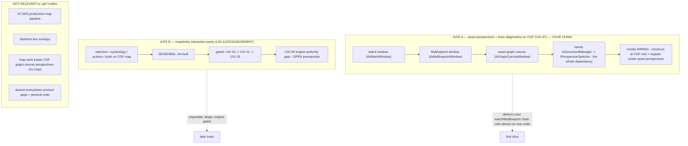

<!--STATUS
state: LIVE
doc-type: gap analysis / coverage map — what the design corpus ALREADY defines toward "cgf == editor",
  and the gaps. Not a buildable design (no build-state/UML gate); it POINTS at the buildable designs.
updated: 2026-08-25
current-answer: the whole file. Built from a full sweep of docs/UX/ (42 docs, 5 parallel readers) + the
  PROGRAMME charter + a codebase-memory enumeration. Every row cites its owning design; verify there.
known-conflict: none. Supersessions in the corpus are listed in §7 so nobody quotes a withdrawn plan.
-->
# GAP MAP — **`cgf == editor`: what's DEFINED vs the GAPS**

> 🎯 **Goal (user, `2026-08-25`):** the CGF subsystem becomes the full editor in `--mode all` distributed —
> *"the only difference is network setup"* — sharing editor features **wholesale**, not cherry-picked.
> 📄 This map is the "study what's already defined so we don't re-derive it" pass for that goal.

## 0. ⭐⭐⭐ BOTTOM LINE

| | |
|---|---|
| ⭐⭐⭐ **The direction IS the charter, not a new idea** | 📄 [`PROGRAMME_Unification_And_Harness.md`](PROGRAMME_Unification_And_Harness.md) §1: CGF *"should be **as capable as the editor**, just doing it in a **distributed** setup."* Ruling 66: ⭐ **"THE EDITOR IS A ONE-NODE CLUSTER"** — same code paths; *"distributing is supplying the real roster, not building a distributed version."* |
| ⭐⭐ **It is ~85% WIRING, not new capability** | 📄 `UX_Feature_Cgf_Brain_Diagnostics.md` §0 (UXI-37), verbatim: *"⇒ This is a **wiring design, not a capability design**."* `Hrot.Editor.AiShared` is **already on CGF's build graph**; the shared machinery exists and is under-adopted (the seam law). |
| ⚠⚠ **"Only network setup" is TRUE plus ONE corollary: AUTHORITY** | Ruling 22: *"CGF does not own `SimTransform`… it needs to send a **request** to SimHost, not change ECS directly. **Editor owns all.**"* ⇒ two **permanent, ruled** divergences that ARE the endpoint (not gaps): **(a)** CGF binds **networked** handlers, the editor **networkless** ones; **(b)** CGF writes **unowned** components as **requests**. |
| 🔴 **Nothing is implemented yet** | the UX task register is empty; the golden-path walk (its task source) has not run; `Q25` (authoring shell) is architect-**unanswered**. `Q26`/`Q29` ARE answered. |

## 1. ⭐⭐ TWO AXES — keep them separate

⭐ **Axis A is your chain** *(watch → MyBlueprint → asset graphs)* and is nearly pure wiring. ⭐ **Axis B** *(the CGF map/Scenario perspective's selection/symbology/actions)* is designed but larger and engine-gated. ⛔ **The graph-canvas perspectives own no map** *(`UX_Design.md` §2)* — so Axis-B map work does not touch your chain.

## 2. ⭐⭐⭐ MASTER STATUS TABLE

**Legend:** ✅ **DONE** (already on CGF) · 🔌 **WIRE** (designed; needs construction/registration at CGF's root, little/no new code) · 📐 **DESIGN-OPEN** (leans only, no ruling / architect-unanswered) · 🕳️ **NOT-DESIGNED** (a real gap) · ⚖️ **DIVERGENT** (ruled per-host — *not* a gap).

### Axis A — asset perspectives + brain diagnostics/authoring (your chain)

| capability | owning design | status | note |
|---|---|:--:|---|
| Data breakpoints + snapshot provider + `IDataBreakpointManager` | UXI-37 | ✅ | constructed+registered on CGF (`CgfSubsystem.cs:555-568`) |
| Behavior diagnostics module · trace log · blackboard renderers | UXI-37 | ✅ | already registered on CGF (`:277-326`) |
| AiShared windows: **Watch · Breakpoints · GraphCanvas · Inspector · Diagnostics** | UXI-37 §0 | 🔌 | on CGF's build graph; **nothing constructs them yet** |
| `AiDocumentManager` + `IPerspectiveSwitcher` + `PerspectiveWorkspaceRegistrar`×3 + `AssetCatalog` | UXI-37 §5b | 🔌 | *"the whole dependency"*; construct at CGF's composition root |
| **Watch entity pinning** (concrete/chameleon, persistence, picker, restart-survival 94g) | `DESIGN_Variable_Watch_Pinning.md` | ✅/🔌 | UI-lane BP-499..507 shipped; 94g in flight — feeds the shared window |
| Perspective-default fix (so `--mode all` doesn't hide CGF's windows) | UXI-06 | 🔌 | do **first** (else 22 windows blank); ordering ruling |
| Menu + toolbar on CGF + menu-follows-focus | UXI-05/35 | 🔌 | discoverability soft-prereq for the windows |
| Curated-scenario reuse on CGF | `UX_Feature_Curated_Scenarios.md` | 🔌 | shared helper; editor-wired only today |
| **Debug pause / step on the CGF node** (DQ30 A–E) | UXI-37 / DQ30 | 📐🔒 | fully decided; `CgfNoOpTimeController` empty; **BLOCKED** on 3 active `.dev` programmes |
| Behavior/scenario **authoring** on CGF (ruling 65/66) | UXI-37 §5b | 🔌 | welcome; needs the construct-diff **and** the blockers below |
| **Asset roots from config** (delete the `.csproj` walk-up) | ruling 67 | 🕳️ | the **one true authoring blocker** — roots are `null` on a deployed node |
| Behavior-affinity registry for asset-authored behaviors (Q25-C) | AQ25 | 📐 | pivotal unknown: can `BehaviorUiCompiler` be schema-driven? |
| Authoring **shell** / role-&-mode gating / undo / autosave / problems-list | AQ25 | 📐 | architect-**unanswered** (`Answers` table empty) |
| **Graph-asset editing on a runtime node** (structure-hash reset, blackboard offsets, staged writes) | — | 🕳️ | **not designed anywhere** — the biggest editing-side gap |
| Packaging: `Hrot.Editor`'s catalog/`NewAssetService` (CGF doesn't reference `Hrot.Editor`) | UXI-37 | 📐 | the one open packaging decision (move to shared vs reference) |

### Axis B — map / entity interaction parity (CGF's Scenario/map perspective)

| capability | owning design | status | note |
|---|---|:--:|---|
| CGF `GlobalActionRegistry` + dispatch + `MapInteractionPack` | UXI-23 | 🔌 | *"two constructor arguments, not scaffolding"*; ordered behind ↓ |
| CGF `SelectionInteractionSystem` + `SelectionState` + ring + pick box | UXI-11 | 🔌 | **absent entirely** today — biggest single map gap |
| Symbology: one pose source + merged `EntityPresentationGizmo` | UXI-10 | 🔌 | CGF shapes alpha-0 / no pick box today |
| `LayerControlGizmo` on CGF | UXI-28 | 🔌 | CGF silently all-visible; whole feature gated on a Windows check |
| Map viewport `MapViewport`/`MapCameraSetup` | UXI-09 | 🔌 | remove hardcoded `(640,360)` |
| Tool controller `IToolController`/`IInteractionHost` | UXI-07 | 🕳️→🔌 | **net-new architecture** (no `ITool` exists); editor-first, CGF = migration step 7 |
| Action vocabulary `EntityActionDescriptor` (+ `WrittenComponents` field) | UXI-03 | 📐 | designed; **one new field** is the only new code |
| Cross-surface actions / CGF map menu | UXI-04 | 📐 | designed; CGF migrated first |
| Commanding / `MissionPanel` on CGF | UXI-32 / Q29 | 📐 | Q29 answered; CGF must host the panel (owns the brain) |
| Authority-aware writes (CGF writes as request) | UXI-29 | 📐 | designed |
| **Engine authority gate on the binary attribute path** | **UXI-30** | 🕳️ | **OPEN, no design** — prerequisite for UXI-29; zero production senders (latent) |
| Confirmation / progress (CGF = the "knowing node") | UXI-16/27 | 📐 | designed; editor drops the network hops, dispatcher byte-identical |

### ⚖️ DIVERGENT — ruled per-host, **do NOT try to unify** (these are the endpoint, not gaps)

| thing | ruling |
|---|---|
| The three `Delete` (and all action) **handlers** stay N-per-host | Q26 constraint 2 — *"divergence is structural… the editor is networkless"* |
| CGF writes pose/`SimTransform`/destroy as **requests** | ruling 22 — *"Editor owns all"* |
| IG's **DDS-authored JSON** context menu | Q26-A2 — *"a completely separated pipeline"* |
| IG's **DDS symbology override** (L2) | UXI-10 — service maps must not depend on it |
| Selection is **subsystem-local** | ruling 27 |
| ExCon's separate **DDS data model** for ORBAT/selection | reuses the *vocabulary*, not the ECS path |

## 3. ⭐ THE ONLY GENUINELY-NEW CODE (everything else is wiring)

1. `CgfClusterDebugTimeController` (replace the empty `CgfNoOpTimeController`) **+ an ingress translator category** (DQ30-C).
2. `EntityActionDescriptor.WrittenComponents` — one field (UXI-03 / shell parity).
3. **Config-into-`AssetRoots`** (ruling 67) — the one true authoring blocker.
4. The **tool-controller abstraction** (UXI-07) — net-new, but Axis B, not needed for your chain.

## 4. 🔴 THE REAL BLOCKERS / OPEN DECISIONS

| # | blocker | axis | kind |
|---|---|---|---|
| 1 | **UXI-30** engine authority gate — OPEN, no design; prereq for CGF authority-aware writes | B | design-a-fix |
| 2 | **Asset-root walk-up** → `null` on a deployed node (ruling 67 has the fix) | A (editing) | build |
| 3 | **AQ25** authoring shell + role/mode gating — architect-**unanswered** | A (editing) | resolve-with-user |
| 4 | **Behavior-affinity registry** (Q25-C) + the schema-driven-`BehaviorUiCompiler` unknown | A (editing) | design |
| 5 | **Graph-asset editing on a runtime node** (structure-hash/blackboard/staged writes) — undesigned | A (editing) | design |
| 6 | Debug pause/step **BLOCKED** on `blueprint-dbg-1/-2`, `ai-hsm-btree-vis-edit-2` | A (diag) | wait/coordinate |
| 7 | Packaging of `Hrot.Editor`'s catalog/save services | A | decide-at-impl |

⭐⭐ **Note the split:** blockers 2–5 are all on the **editing/authoring** side. **Viewing/diagnostics** (your watch → MyBlueprint → asset-graph chain) has **none of them** — it is wiring.

## 5. ⭐⭐ SEQUENCING RECOMMENDATION *(charter Step 4; user approves)*

| step | what | why |
|---|---|---|
| ⭐ **1** | **CGF constructs the AiShared shell** (`IPerspectiveSwitcher` + `AiDocumentManager` + `PerspectiveWorkspaceRegistrar`×3 + `AssetCatalog`) and **registers the graph canvas + MyBlueprint + watch/breakpoints windows** under the asset perspectives (Scenario/BTree/HSM/Blueprint), each under the regression net, flipping its capability-manifest cell | delivers **your whole chain (viewing/diagnostics)** with almost no new code |
| **1-prereq** | **UXI-06** perspective-default fix | else `--mode all` first launch hides the very windows we register |
| **2** | menu/toolbar discoverability on CGF (**UXI-05/35**) | so the registered windows are reachable |
| **3** *(later track)* | **editing on CGF**: config-`AssetRoots` (2) → AQ25 shell decisions (3) → behavior-affinity registry (4) → graph-asset-on-node design (5) | the authoring gaps; resolve the design ones with the user before building |
| **4** *(separable)* | **Axis B** map/selection parity: `UXI-30` gate → `UXI-10 → 11 → 29 → 23` | not needed for the watch/MyBlueprint chain |

⭐⭐ **Context menus are NOT a prerequisite** *(correcting the opening premise)*: the asset panels' own per-item menus **travel with the shared panels**; the entity/map menus stay **per-host by ruling** (Q26-A2, ruling 27) and don't block asset sharing. There is a built-but-unadopted `SharedContextMenuPopulator` for the vocabulary half if/when Axis B needs it.

## 6. ⭐ INVENTORY — the sweep that produced this *(canon: enumerate, don't guess)*

- **codebase-memory graph** (`home-user-HROT`, 191k nodes): `search_graph` for `.*ContextMenu.*` (47), `.*(PerspectiveWorkspace|WindowRegistrar|…).*` (9), `.*(NetworkEntityMap|StagingEntityExtractor).*` (61). Findings: `PerspectiveWorkspaceRegistrar` (in-degree 33, AiShared) is the shared shell; `SharedContextMenuPopulator` + `SharedAiWindowRegistrar` are in-degree **0** (built, unadopted).
- **docs/UX/ full read** — 42 docs, 5 parallel readers partitioned: (A) programme/tracker/roadmap, (B) CGF-adoption/shell/perspective/seams, (C) authoring/write-path, (D) entity/action/selection/symbology, (E) map/tool/interaction/pause-resume. Plus the `PROGRAMME` charter, `DESIGN_Perspective_Unification.md`, `Architect_Question_54`.

## 7. ⚠ SUPERSEDED / WITHDRAWN — do not quote as current

| doc/section | state |
|---|---|
| `UX_Design.md` UXD-08 "a new editor exe / new shell" | **WITHDRAWN** `2026-08-10` — replaced by in-place cleanup (`UX_Cleanup_Path.md`). Diagnosis stands, remedy does not |
| `MCP_PORT_PLAN.md` | **SUPERSEDED** by `MCP_Integration.md` (port done `2026-08-22`) |
| `UX_RESUME.md` | stale re the MCP port; *"if this file and the tracker disagree, the tracker wins"* |
| AQ25 §F′ (F3→F1 staged lean); Q25-D/F/F′ | superseded by Q26 / withdrawn — *"do not relay"* |
| UXI-22 → folded into UXI-23; UXI-23 §5 → superseded by UXI-32; UXI-26 refuted | — |
| `UX_Interaction_API` §1 data-race claim; §6c `GetCommandBuffer` | retracted / superseded by §6b |
