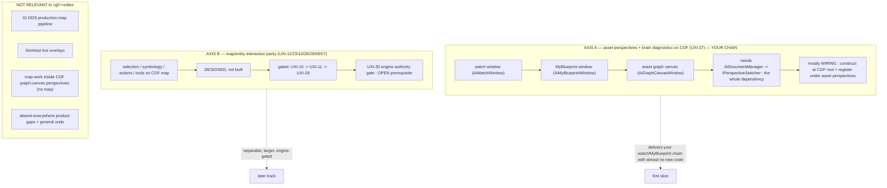

<!--STATUS
state: LIVE
doc-type: gap analysis / coverage map — what the design corpus ALREADY defines toward "cgf == editor",
  and the gaps. Not a buildable design (no build-state/UML gate); it POINTS at the buildable designs.
updated: 2026-08-25
current-answer: the whole file. Built from a full sweep of docs/UX/ (42 docs, 5 parallel readers) + the
  PROGRAMME charter + a codebase-memory enumeration. Every row cites its owning design; verify there.
known-conflict: none. Supersessions in the corpus are listed in §7 so nobody quotes a withdrawn plan.
-->
# GAP MAP — **`cgf == editor`: what's DEFINED vs the GAPS**

> 🎯 **Goal (user, `2026-08-25`):** the CGF subsystem becomes the full editor in `--mode all` distributed —
> *"the only difference is network setup"* — sharing editor features **wholesale**, not cherry-picked.
> 📄 This map is the "study what's already defined so we don't re-derive it" pass for that goal.

## 0. ⭐⭐⭐ BOTTOM LINE

| | |
|---|---|
| ⭐⭐⭐ **The direction IS the charter, not a new idea** | 📄 [`PROGRAMME_Unification_And_Harness.md`](PROGRAMME_Unification_And_Harness.md) §1: CGF *"should be **as capable as the editor**, just doing it in a **distributed** setup."* Ruling 66: ⭐ **"THE EDITOR IS A ONE-NODE CLUSTER"** — same code paths; *"distributing is supplying the real roster, not building a distributed version."* |
| ⭐⭐ **It is ~85% WIRING, not new capability** | 📄 `UX_Feature_Cgf_Brain_Diagnostics.md` §0 (UXI-37), verbatim: *"⇒ This is a **wiring design, not a capability design**."* `Hrot.Editor.AiShared` is **already on CGF's build graph**; the shared machinery exists and is under-adopted (the seam law). |
| ⚠⚠ **"Only network setup" is TRUE plus ONE corollary: AUTHORITY** | Ruling 22: *"CGF does not own `SimTransform`… it needs to send a **request** to SimHost, not change ECS directly. **Editor owns all.**"* ⇒ two **permanent, ruled** divergences that ARE the endpoint (not gaps): **(a)** CGF binds **networked** handlers, the editor **networkless** ones; **(b)** CGF writes **unowned** components as **requests**. |
| 🔴 **Nothing is implemented yet** | the UX task register is empty; the golden-path walk (its task source) has not run; `Q25` (authoring shell) is architect-**unanswered**. `Q26`/`Q29` ARE answered. |

## 0.5 ⭐⭐⭐ UNDER THE PURE-SHARING FRAMING *(user, `2026-08-25`)* — **is anything OPEN?**

⭐⭐ **User's scoping:** *"share the EXISTING editing capabilities with CGF"* — ⛔ **not** *"finish the
editor's authoring features first."* Under this lens, `AQ25-A/B/C/E` are **authoring FEATURES** *(undo,
prefabs, behavior-affinity, problems list)* that are **missing on the editor too** ⇒ they are **shared for
free when built later**, and are **NOT sharing prerequisites**. `AQ25-F` *(new exe)* is **ignored** — keep
`ClusterRunner`; a shim exe that just passes params may come later.

⇒ ⭐⭐⭐ **For sharing the editing + diagnostics capabilities with CGF: NO open DESIGN question remains.**
It is wiring plus a few shared fixes, none of them a new design:

| item | kind |
|---|---|
| construct the AiShared shell + register the windows on CGF *(watch · MyBlueprint · graph canvas · breakpoints · inspector)* | **wiring** |
| perspective-default fix (UXI-06) | **bug** |
| ~~debug pause/step: one `CgfClusterDebugTimeController` adapter~~ | ✅✅ **BUILT `2026-08-25`** — slice 4, `CE-025`…`CE-028`. ⚠ It was **not** a mirror of the editor adapter: CGF is a slave, so it REQUESTS via the time intents and the orchestrator's master supplies the roster |
| hot-reload editing: construct `QuickReloadService` on CGF | **wiring** *(Cosmetic/Soft/Hard already designed)* |
| R-52 whole-component blackboard write → `SetComponentFieldRaw` | **shared bug** *(bites the editor too)* |
| ~~asset roots from config (ruling 67)~~ | ✅✅ **BUILT `2026-08-25`** — `CE-032`/`CE-033`. `AssetRoots.Configure` + `--asset-root`; order **config → source walk-up → output dir**; a configured-but-missing root THROWS at startup |
| `Hrot.Editor` catalog/new-asset packaging | **small decision** *(only for CREATING assets on CGF)* |

⭐ **The ONLY genuinely-open DESIGN item in the whole `cgf==editor` space is `UXI-30`** *(engine authority
gate — no design doc; prerequisite for `UXI-29`)*. ⛔ **But it is Axis B** *(CGF driving map ENTITIES —
pose/rotate/attributes)*, has **zero production senders today** *(latent)*, and is **NOT required** for
sharing the asset-editing/diagnostics capabilities. It matters only if/when CGF should manipulate map
entities like the editor.

## 1. ⭐⭐ TWO AXES — keep them separate

⭐ **Axis A is your chain** *(watch → MyBlueprint → asset graphs)* and is nearly pure wiring. ⭐ **Axis B** *(the CGF map/Scenario perspective's selection/symbology/actions)* is designed but larger and engine-gated. ⛔ **The graph-canvas perspectives own no map** *(`UX_Design.md` §2)* — so Axis-B map work does not touch your chain.

## 2. ⭐⭐⭐ MASTER STATUS TABLE

**Legend:** ✅ **DONE** (already on CGF) · 🔌 **WIRE** (designed; needs construction/registration at CGF's root, little/no new code) · 📐 **DESIGN-OPEN** (leans only, no ruling / architect-unanswered) · 🕳️ **NOT-DESIGNED** (a real gap) · ⚖️ **DIVERGENT** (ruled per-host — *not* a gap).

### Axis A — asset perspectives + brain diagnostics/authoring (your chain)

| capability | owning design | status | note |
|---|---|:--:|---|
| Data breakpoints + snapshot provider + `IDataBreakpointManager` | UXI-37 | ✅ | constructed+registered on CGF (`CgfSubsystem.cs:555-568`) |
| Behavior diagnostics module · trace log · blackboard renderers | UXI-37 | ✅ | already registered on CGF (`:277-326`) |
| AiShared windows: **Watch · Breakpoints · GraphCanvas · Inspector · Diagnostics** | UXI-37 §0 · [`DESIGN_Cgf_Editor_Sharing_Slice1_Shell_Adoption.md`](DESIGN_Cgf_Editor_Sharing_Slice1_Shell_Adoption.md) | ✅ | ⭐ **SLICE 1, `2026-08-25`** — `CgfSubsystem.BuildAiShell`. 📐 `--mode all` went **14 → 23** panel kinds; it now publishes `watch · ai-breakpoints · graph-canvas · my-blueprint · variables · details · diagnostics · blackboard-authoring · runtime-inspector · bookmarks`, asserted **SAME as the editor** for the chain's three by `ClusterConformanceRails.The_asset_panels_are_the_same_on_both_hosts` |
| `AiDocumentManager` + `IPerspectiveSwitcher` + `PerspectiveWorkspaceRegistrar`×3 + `AssetCatalog` | UXI-37 §5b · slice-1 design §9.1 · [slice-2 design](DESIGN_Cgf_Editor_Sharing_Slice2_Open_Asset.md) §11 | ✅ | ⭐ **SLICE 1** built all four at CGF's root, mirroring `EditorSubsystem` `:2545-2948`. ⭐⭐ **SLICE 2 POPULATED the catalog** — 📐 **72 assets on `--mode all` vs the editor's 73** — and added the MCP verbs to OPEN one, switch graph tabs and focus a window. ⛔ The empty-shell caveat is **GONE**; `CE-009` is closed |
| **Opening an AI asset on CGF** *(catalog → document → canvas → outline → Details)* | [slice-2 design](DESIGN_Cgf_Editor_Sharing_Slice2_Open_Asset.md) | ✅ | ⭐⭐ **SLICE 2.** Two measured findings shaped it: the **document factories** *(without them `ViewState` is null and the canvas has a document while MyBlueprint/Details see nothing)* and the **`ActiveChanged` retarget** *(Details reads the store's `ActiveAsset`; opening alone does not push it)*. ⭐ Asserted by `ClusterConformanceRails.The_same_opened_asset_looks_the_same_on_both_hosts` — `graph-canvas` and `my-blueprint` **SAME on real content**, not empty state |
| **MCP drive/observe surface** — `GET /assets` · `POST /assets/{id}/open` · `POST /assets/open {path}` · `GET /documents` · `POST /documents/{id}/activate` · `POST /panels/{id}/focus` | slice-2 design §3/§3a | ✅ | ⭐ **SLICE 2** — six routes, each with a `RouteDoc` ⇒ the catalog and `SKILL.md` regenerate *(66 → 72 tools)*. ⭐ Three addresses, none of them a raw path in a URL segment |
| **The main toolbar as a readable `PanelKind`** | slice-2 design §6 ⑤ · §7 | ✅ **CE-016 CLOSED `2026-08-25`** | ⭐ **SLICE 2** — `main-toolbar` publishes on **both** hosts *(even when it does not draw)*. ⚠⚠ **The *"CGF's is EMPTY"* claim was already STALE**: slice 3 registered `SaveAllAiDocuments` + `QuickReloadAiAsset` *(`CE-022`)*. ⭐⭐ **`CE-034` closes the remaining gap, and it was a SILENT DEFAULT, not a missing feature**: the editor puts `MainToolbarTimeControlSection` on its toolbar *(`EditorSubsystem:4715`)* while CGF built `ClusterTimeTransportAdapter` — the very `ITimeTransportFacade` that section takes — and passed it only to the STATUS BAR, two lines away. 📌 *"A production caller that HAS a dependency must PASS it."* ⇒ same shared section, same id and sort order as the editor; ⛔ nothing invented. ⚠ **NOT done: routing CGF's toolbar through `ToolbarCommandAdapter`/`IEditorCommands`** — 📐 CGF registers ZERO shell commands and has no icon provider, and `IEditorCommands` is what the concurrent MCP session is building ⇒ a collision, filed not built. ⛔ **§7 still binds every later feature slice** |
| **Watch entity pinning** (concrete/chameleon, persistence, picker, restart-survival 94g) | `DESIGN_Variable_Watch_Pinning.md` | ✅/🔌 | UI-lane BP-499..507 shipped; 94g in flight — feeds the shared window |
| Perspective-default fix (so `--mode all` doesn't hide CGF's windows) | UXI-06 | ✅ | ⭐ **already BUILT** *(`LocalWindowController.ResolveStartupPerspective` derives the default from `GetPerspectives()` and EXCLUDES document-driven ones)*. 📐 **Confirmed by slice 1, `2026-08-25`:** adding BTree/HSM/Blueprint to the claimed set did **not** move the startup perspective — `--mode all` still opens on a durable one. ⛔ The old *"do this first"* ordering ruling is DISCHARGED, not pending |
| Menu + toolbar on CGF + menu-follows-focus | UXI-05/35 | 🔌 | discoverability soft-prereq for the windows |
| Curated-scenario reuse on CGF | `UX_Feature_Curated_Scenarios.md` | 🔌 | shared helper; editor-wired only today |
| **Debug pause / step on the CGF node** (DQ30 A–E) | UXI-37 / DQ30 | ✅ **BUILT `2026-08-25`** *(slice 4 — `CE-025`…`CE-028`; `CE-029` open: `k` unmeasured, and the real-slave barrier is NOT discharged)* | fully decided AND **UNBLOCKED** (Correction 45, `2026-08-14`; the `.dev` debug programmes last touched `2026-07-16`). Fix is *"ONE class — a CGF time-controller adapter requesting a cluster-wide freeze via the master"* (replaces the empty `CgfNoOpTimeController`); the distributed pause/step protocol is **already built on both sides**. The rest is the same AiShared wiring as the row above |
| Behavior/scenario **authoring** on CGF (ruling 65/66) | UXI-37 §5b | 🔌 | welcome; needs the construct-diff **and** the blockers below |
| **Asset roots from config** (delete the `.csproj` walk-up) | ruling 67 | ✅ **BUILT `2026-08-25`** | ⭐⭐ `AssetRoots.Configure(root)` at the composition root — **one call, every host**, since `AssetRoots` is the stated single authority. Order **config → source walk-up → output dir**; unset config is byte-identical to before, so ~30 call sites and every dev box are unchanged. 🔒 A configured-but-missing root **throws at startup** *(the ruling's own call: silently falling through *"would reintroduce 'it worked on the dev box'"*)*. ⚠⚠ **`CE-033` — the half that nearly shipped missing:** `AssetsFor`/`RecipesFor`/`AssetsRoot`/`ScenariosRecipesRoot` are what the CONTRIBUTORS and `*NewAssetService` resolve from, i.e. where assets are BROWSED and CREATED; they had to honour the config too, or a configured node would list from one tree and create in another — ⛔ the exact two-authority split ruling 67 exists to prevent, reintroduced by its own fix. ⭐ Railed by `EveryRootMemberAgreesWithTheConfiguredRoot` |
| Behavior-affinity registry for asset-authored behaviors (Q25-C) | AQ25 | 📐 | pivotal unknown: can `BehaviorUiCompiler` be schema-driven? |
| Authoring **shell** / role-&-mode gating / undo / autosave / problems-list | AQ25 | 📐 | architect-**unanswered** (`Answers` table empty) |
| **Graph-asset editing on a runtime node** (hot reload) | [slice-3 design](DESIGN_Cgf_Editor_Sharing_Slice3_Editing_HotReload.md) · `AI_Editor_Shared_Infrastructure.md` §17 | ✅/⚠ | ⭐⭐ **SLICE 3, `2026-08-25` — WIRED.** `QuickReloadService` + the lightweight `AiHotReloadCoordinator` are constructed on CGF with **the same registries the kernel ticks**, the three per-host reload arms mirror the editor's, the save path uses the shared `SaveAllAiDocumentsCommand`, and both are drivable over MCP *(`POST /assets/{id}/save` · `/reload`)*. ⭐ The toolbar affordances are present and asserted on CGF *(`CE-022`, discharging slice-2 §7)*. ⚠⚠ **What is NOT delivered, measured:** the **Cosmetic/Soft/Hard** classification is not observable on this path — `QuickReloadResult` carries no classification and `OnHardReloadCompleted` is documented *"NOT fired for Quick Reloads"* ⇒ it belongs to the ALC file-watcher path *(`CE-023`)*. ⛔ And ruling 53 turns out to say a headless origin **never pre-flights** — the origin-side LOG is the safety net, which is what was built *(`CE-024`)*
| Packaging: `Hrot.Editor`'s catalog/`NewAssetService` (CGF doesn't reference `Hrot.Editor`) | UXI-37 | 📐 | the one open packaging decision (move to shared vs reference) |

### Axis B — map / entity interaction parity (CGF's Scenario/map perspective)

> ⭐⭐ **FIRST CUT LANDED `2026-08-25`** — 📄 [`DESIGN_Cgf_AxisB_Rotation_Slice.md`](DESIGN_Cgf_AxisB_Rotation_Slice.md)
> *(read §9 AS-BUILT first)*, ids **`AX-001`…`AX-006`** in tracker **Area M**. ⭐ Delivered: the `UXI-30`
> gate made structural · `AttributeIds.GeoHeading` routed to the EXISTING compass conversion · the
> subsystem-agnostic `IEntityComponentWriter` *(owned→direct / unowned→request)* · `EntityRotatorGizmo`
> committing through it.
> ⭐⭐⭐ **SECOND CUT LANDED `2026-08-25`** — ids **`AX-005a/b/c`, `AX-007`…`AX-010`**, `CE-018/035/036`;
> 📄 the AS-BUILT is **§12** *(⛔ §11.3–§11.5 are SUPERSEDED — the plan asked for a NEW intent and a NEW
> egress translator; both already existed and were **EXTENDED**, ruling 9)*.
> ⭐ Delivered: `R-134` strict network separation *(no DDS type in the FDP-internal write path, structurally
> railed)* · the change-request egress, **proven on a real `--mode all` cluster** · `EntityDragGizmo`
> committing POSITION through the same router · the writer wired on **all five** rotator call sites.
> ⛔ **STILL NOT delivered, and it is measured:** the FULL round trip *(owner applies)* — 🔴 blocked on
> `AX-009`, a **PRE-EXISTING** SimHost→IG replication failure *(21 of 51 integration tests fail identically
> on a clean tree at `03f92fefe`)*. ⚠ And *"owned"* is still an authority bit **only SimHost and the
> replication path ever set** *(`AX-006` — `Hrot.Editor` never calls `SetAuthority`)*.

| capability | owning design | status | note |
|---|---|:--:|---|
| CGF `GlobalActionRegistry` + dispatch + `MapInteractionPack` | UXI-23 | 🔌 | *"two constructor arguments, not scaffolding"*; ordered behind ↓ |
| CGF `SelectionInteractionSystem` + `SelectionState` + ring + pick box | UXI-11 | 🔌 | **absent entirely** today — biggest single map gap |
| Symbology: one pose source + merged `EntityPresentationGizmo` | UXI-10 | 🔌 | CGF shapes alpha-0 / no pick box today |
| `LayerControlGizmo` on CGF | UXI-28 | 🔌 | CGF silently all-visible; whole feature gated on a Windows check |
| Map viewport `MapViewport`/`MapCameraSetup` | UXI-09 | 🔌 | remove hardcoded `(640,360)` |
| Tool controller `IToolController`/`IInteractionHost` | UXI-07 | 🕳️→🔌 | **net-new architecture** (no `ITool` exists); editor-first, CGF = migration step 7 |
| Action vocabulary `EntityActionDescriptor` (+ `WrittenComponents` field) | UXI-03 | 📐 | designed; **one new field** is the only new code |
| Cross-surface actions / CGF map menu | UXI-04 | 📐 | designed; CGF migrated first |
| Commanding / `MissionPanel` on CGF | UXI-32 / Q29 | 📐 | Q29 answered; CGF must host the panel (owns the brain) |
| **Authority-aware writes (CGF writes as request)** | **UXI-29** | ✅ **BUILT `2026-08-25`** *(`AX-003`/`AX-005a/b/c`)* | ⭐⭐⭐ **The router does NOT ask *"do I own it?"*** — that would put the attribute→component mapping in a second place beside the installers. ⭐ It attempts the local apply through the OWNER's own interpreter and asks `HasAppliedAny`: landed ⇒ `Direct`; refused by the `UXI-30` gate ⇒ publish the request ⇒ `Requested`; no sink ⇒ `Refused`. ⇒ ⭐⭐ **ONE conversion serves the local AND the remote path.** ⭐⭐ **`R-134`:** the internal path speaks `EntityAttributeChange`/`AttributeValueKind` and NO DDS type — the egress translator is the sole boundary, **structurally railed**. ⚠ The full round trip is blocked on `AX-009` *(pre-existing)*; the request **does** reach the wire on a real cluster, railed. 📄 [design §12](DESIGN_Cgf_AxisB_Rotation_Slice.md) |
| **Engine authority gate on the binary attribute path** | **UXI-30** | ✅ **BUILT `2026-08-25`** *(`AX-001`)* | ⛔⛔ **Its premise was FALSE and measuring it produced a better fix.** 📐 Both production installers ALREADY gated every handler on `CanWrite<T>()` ⇒ the binary path WAS authority-gated, per handler — ⭐ which is the JSON path's own architecture *(its gate lives in the typed `ValueInvoker<T>`, not the router)*. ⭐⭐⭐ **The real defect: the gate was PER-INSTALLER and therefore forgettable.** ⇒ moved into `BinaryInterpreterBuilder.RegisterHandler<TComponent>`, both installers migrated onto it and their hand-written checks deleted. ✅ *"Zero production senders"* independently verified. 📄 [design §9.1](DESIGN_Cgf_AxisB_Rotation_Slice.md) |
| Confirmation / progress (CGF = the "knowing node") | UXI-16/27 | 📐 | designed; editor drops the network hops, dispatcher byte-identical |

### ⚖️ DIVERGENT — ruled per-host, **do NOT try to unify** (these are the endpoint, not gaps)

| thing | ruling |
|---|---|
| The three `Delete` (and all action) **handlers** stay N-per-host | Q26 constraint 2 — *"divergence is structural… the editor is networkless"* |
| CGF writes pose/`SimTransform`/destroy as **requests** | ruling 22 — *"Editor owns all"* |
| IG's **DDS-authored JSON** context menu | Q26-A2 — *"a completely separated pipeline"* |
| IG's **DDS symbology override** (L2) | UXI-10 — service maps must not depend on it |
| Selection is **subsystem-local** | ruling 27 |
| ExCon's separate **DDS data model** for ORBAT/selection | reuses the *vocabulary*, not the ECS path |

## 3. ⭐ THE ONLY GENUINELY-NEW CODE (everything else is wiring)

1. ~~`CgfClusterDebugTimeController` (replace the empty `CgfNoOpTimeController`) **+ an ingress translator category** (DQ30-C).~~ ✅ **DONE `2026-08-25`** — the no-op is retired; `TranslatorClass` + the `Category` default member + the `CycloneNetworkIngressSystem` gate all landed. 📄 [as-built §10](DESIGN_Cgf_Editor_Sharing_Slice4_Debug_PauseStep.md).
2. `EntityActionDescriptor.WrittenComponents` — one field (UXI-03 / shell parity).
3. **Config-into-`AssetRoots`** (ruling 67) — the one true authoring blocker.
4. The **tool-controller abstraction** (UXI-07) — net-new, but Axis B, not needed for your chain.

## 4. 🔴 THE REAL BLOCKERS / OPEN DECISIONS

| # | blocker | axis | kind |
|---|---|---|---|
| 1 | ~~**UXI-30** engine authority gate~~ — ✅ **BUILT `2026-08-25`** *(`AX-001`)*; the gate is now structural, not per-installer. ⚠ `AX-005`/`AX-006` are what remains: no production request SENDER exists, and *"owned"* is an authority bit only SimHost and replication ever set | B | ~~design-a-fix~~ done |
| 2 | **Asset-root walk-up** → `null` on a deployed node (ruling 67 has the fix) | A (editing) | build |
| 3 | **AQ25** authoring shell + role/mode gating — architect-**unanswered** | A (editing) | resolve-with-user |
| 4 | **Behavior-affinity registry** (Q25-C) + the schema-driven-`BehaviorUiCompiler` unknown | A (editing) | design |
| 5 | ~~Graph-asset editing on a runtime node — undesigned~~ — **NOT undesigned** (hot-reload Cosmetic/Soft/Hard, `AI_Editor_Shared_Infrastructure.md` §17; editor not special). Reduces to: wire `QuickReloadService` on CGF + fix the shared R-52 offset-write bug | A (editing) | wire + bug-fix |
| 6 | ~~Debug pause/step blocked on `.dev` programmes~~ — **NOT a blocker** (Correction 45 unblocked it `2026-08-14`; programmes finished `2026-07-16`). It is Axis-A wiring + one new CGF time-controller adapter class | A (diag) | ~~wait~~ build |
| 7 | Packaging of `Hrot.Editor`'s catalog/save services | A | decide-at-impl |

⭐⭐ **Note the split:** blockers 2–5 are all on the **editing/authoring** side. **Viewing/diagnostics** (your watch → MyBlueprint → asset-graph chain) has **none of them** — it is wiring.

## 5. ⭐⭐ SEQUENCING RECOMMENDATION *(charter Step 4; user approves)*

| step | what | why |
|---|---|---|
| ⭐ **1** | **CGF constructs the AiShared shell** (`IPerspectiveSwitcher` + `AiDocumentManager` + `PerspectiveWorkspaceRegistrar`×3 + `AssetCatalog`) and **registers the graph canvas + MyBlueprint + watch/breakpoints windows** under the asset perspectives (Scenario/BTree/HSM/Blueprint), each under the regression net, flipping its capability-manifest cell | delivers **your whole chain (viewing/diagnostics)** with almost no new code |
| **1-prereq** | **UXI-06** perspective-default fix | else `--mode all` first launch hides the very windows we register |
| **2** | menu/toolbar discoverability on CGF (**UXI-05/35**) | so the registered windows are reachable |
| **3** *(later track)* | **editing on CGF**: config-`AssetRoots` (2) → AQ25 shell decisions (3) → behavior-affinity registry (4) → graph-asset-on-node design (5) | the authoring gaps; resolve the design ones with the user before building |
| **4** *(separable)* | **Axis B** map/selection parity: `UXI-30` gate → `UXI-10 → 11 → 29 → 23` | not needed for the watch/MyBlueprint chain |

⭐⭐ **Context menus are NOT a prerequisite** *(correcting the opening premise)*: the asset panels' own per-item menus **travel with the shared panels**; the entity/map menus stay **per-host by ruling** (Q26-A2, ruling 27) and don't block asset sharing. There is a built-but-unadopted `SharedContextMenuPopulator` for the vocabulary half if/when Axis B needs it.

## 6. ⭐ INVENTORY — the sweep that produced this *(canon: enumerate, don't guess)*

- **codebase-memory graph** (`home-user-HROT`, 191k nodes): `search_graph` for `.*ContextMenu.*` (47), `.*(PerspectiveWorkspace|WindowRegistrar|…).*` (9), `.*(NetworkEntityMap|StagingEntityExtractor).*` (61). Findings: `PerspectiveWorkspaceRegistrar` (in-degree 33, AiShared) is the shared shell; `SharedContextMenuPopulator` + `SharedAiWindowRegistrar` are in-degree **0** (built, unadopted).
- **docs/UX/ full read** — 42 docs, 5 parallel readers partitioned: (A) programme/tracker/roadmap, (B) CGF-adoption/shell/perspective/seams, (C) authoring/write-path, (D) entity/action/selection/symbology, (E) map/tool/interaction/pause-resume. Plus the `PROGRAMME` charter, `DESIGN_Perspective_Unification.md`, `Architect_Question_54`.

## 7. ⚠ SUPERSEDED / WITHDRAWN — do not quote as current

| doc/section | state |
|---|---|
| `UX_Design.md` UXD-08 "a new editor exe / new shell" | **WITHDRAWN** `2026-08-10` — replaced by in-place cleanup (`UX_Cleanup_Path.md`). Diagnosis stands, remedy does not |
| `MCP_PORT_PLAN.md` | **SUPERSEDED** by `MCP_Integration.md` (port done `2026-08-22`) |
| `UX_RESUME.md` | stale re the MCP port; *"if this file and the tracker disagree, the tracker wins"* |
| AQ25 §F′ (F3→F1 staged lean); Q25-D/F/F′ | superseded by Q26 / withdrawn — *"do not relay"* |
| UXI-22 → folded into UXI-23; UXI-23 §5 → superseded by UXI-32; UXI-26 refuted | — |
| `UX_Interaction_API` §1 data-race claim; §6c `GetCommandBuffer` | retracted / superseded by §6b |
